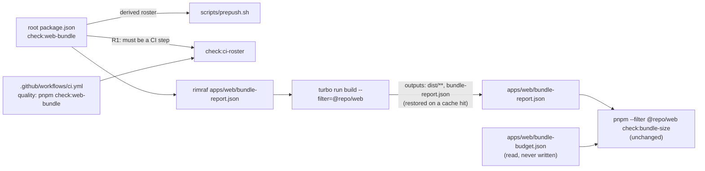
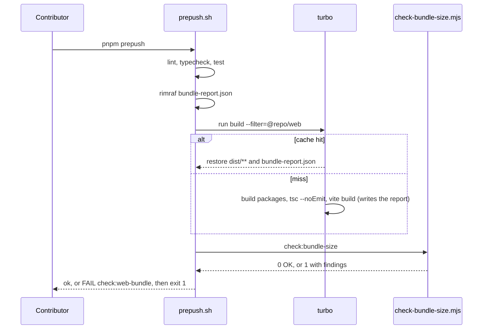
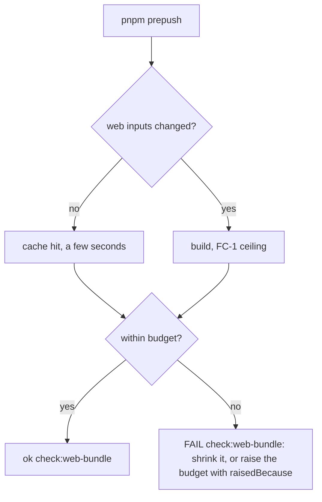

# Feature Spec: The web bundle budget runs in `pnpm prepush`

- **Status:** Draft
- **Author(s):** feature-analyst (for the product owner)
- **Date:** 2026-09-26
- **Tracking issue / epic:** none — repository tooling, one milestone
- **Roadmap link:** none. Proposed for exemption in `scripts/adr-coverage.json` on the ADR-0136
  precedent (a process or tooling decision a planner cannot act on).
- **Related ADR(s):** ADR-0136 (amended by this spec's proposed ADR), ADR-0105, ADR-0120, ADR-0124,
  ADR-0058, ADR-0138

This spec exists because ADR-0105 lists a shared gate as a trigger for a full spec. The change is
small. The decision it reverses is recorded in an ADR, and that is why it needs writing down.

## 0. Evidence: what the brief claimed and what was checked

This spec was written without a shell: the environment had read and search tools only. So every
claim below was checked by **reading**. The one claim that needs **running**, the added time, was
**not measured** when the spec was written, and that is stated here rather than estimated. Its
ceiling is committed below (§1, success criteria); first readings were then taken the same day and
are recorded under those criteria. The M1-T1 sitting on the built change still decides FC-1/FC-2.

| #   | Claim                                                                                       | Verdict                                                   | Established by                                                                                                                                                                                                                                                                                                                                                                                                     |
| --- | ------------------------------------------------------------------------------------------- | --------------------------------------------------------- | ------------------------------------------------------------------------------------------------------------------------------------------------------------------------------------------------------------------------------------------------------------------------------------------------------------------------------------------------------------------------------------------------------------------ |
| E1  | `pnpm prepush` runs lint, typecheck, unit tests and the root `check:*` scripts it derives.  | True                                                      | `scripts/prepush.sh:118-124` (lint/typecheck/test), `:130-140` (the roster is derived from `./package.json` scripts beginning `check:`).                                                                                                                                                                                                                                                                           |
| E2  | `check:bundle-size` is a script in `apps/web`, not the root.                                | True                                                      | `apps/web/package.json:67`; absent from the root `package.json:21-49`.                                                                                                                                                                                                                                                                                                                                             |
| E3  | It needs a production build, because it reads `apps/web/bundle-report.json`.                | True                                                      | `apps/web/scripts/check-bundle-size.mjs:228-234` fails with "build first" when the file is missing. The file is written by `bundleReportPlugin` (`apps/web/vite.config.ts:38`) and is gitignored (`.gitignore:93`).                                                                                                                                                                                                |
| E4  | CI runs it in the `quality` job after the build.                                            | True                                                      | `.github/workflows/ci.yml:257-258` (`pnpm build`), `:272-273` (`pnpm --filter @repo/web check:bundle-size`).                                                                                                                                                                                                                                                                                                       |
| E5  | PR #701 passed `pnpm prepush` and then failed CI at 439.21 kB against 437 kB.               | **Corroborated, not observed**                            | The merged PR page says "pnpm prepush: all green" and records main at 434.82 kB against a 437 kB budget with the epic adding 4.39 kB (fetched 2026-09-26). `apps/web/bundle-budget.json` `raisedBecause` records the same three figures. The failed CI run itself was not seen: the page shows the final, green state.                                                                                             |
| E6  | That cost "a full CI round of ~15 minutes".                                                 | **Not checked as stated**                                 | ADR-0138 measures whole-CI wall clock at 12.2–12.3 min, bounded by `quality`. The order of magnitude holds. The figure 15 was not re-derived.                                                                                                                                                                                                                                                                      |
| E7  | The CI-only placement was a deliberate decision.                                            | True, and recorded in four places                         | `docs/specs/delivery-gates/feature-spec.md` §4.3 D6 and ADR D4; ADR-0136 (`docs/adr/0136-…md:72-78`); the gate's own docblock (`check-bundle-size.mjs:25-31`); the CI comment (`ci.yml:268-271`).                                                                                                                                                                                                                  |
| E8  | That decision's premise: "making a five-second `pnpm prepush` wait thirty seconds for one". | **Stale on the denominator, unmeasured on the numerator** | The full `pnpm prepush` is about **six minutes**, of which `pnpm test` is 345 s (`docs/TESTING.md:354-356`, measured 2026-08-25; `docs/TECH_DEBT.md` #191). "Five seconds" is not the gate: even the `--checks` pass alone measured 10.4 s and then 12.3 s (`TESTING.md:357`). No measurement of the "thirty seconds" appears in `docs/specs/delivery-gates/` (searched for `thirty`, `30 s`, `seconds`: no hits). |

E8 matters most. The trade the original decision made, a build against a fast gate, was priced
against the `--checks` pass. The command people are told to run is the full one (CLAUDE.md §19.8).
Against six minutes, a build that costs tens of seconds is a different proposition. This is the
problem statement going stale, the case §19's "re-verify the problem" rule is for.

## 1. Business understanding

### Problem

`pnpm prepush` is the one command a contributor runs before pushing (CLAUDE.md §19.8). It exists so
that "which gates did I remember?" is not a question anyone has to answer. One blocking gate,
`check:bundle-size`, is **structurally outside it**: prepush derives its roster from the root
manifest only (E1), and the gate lives in `apps/web` (E2). So a branch that grows the entry graph
past its budget passes locally every time, and fails only in CI (E5).

No existing check can see this. `check:ci-roster` compares CI against the root `check:*` scripts. For
workspace gates that CI runs, it confirms only that the script exists
(`scripts/check-ci-roster.mjs:139-156`), and then **removes them from the set it reasons about**
(`:158-163`). The only comparison it makes between prepush and CI is over the advisory set
(R3a/R4a, `:251-276`). So **nothing asserts that a gate CI runs is also run by prepush**. The bundle
gate is the instance that cost a round. The same gap covers `format:check`, which `docs/TECH_DEBT.md`
#299 already records.

### Users

Everyone who pushes to this repository: the product owner, and the AI sessions working on their
behalf. No product role (Org Admin, Planner, Contributor, Viewer, External Guest) is affected. This
changes no product surface.

### Primary use cases

1. A contributor runs `pnpm prepush` on a branch that grows the web entry graph past its budget. The
   run **FAILS** naming `check:web-bundle`, before the push.
2. A contributor runs `pnpm prepush` on a branch that does not touch the web bundle's inputs. The
   build is a turbo cache hit, the gate passes, and the extra cost is a few seconds.
3. CI runs the same root gate, so the two rosters describe one gate rather than two invocations of
   it.

### Expected outcomes

A bundle overrun is found at the earliest step that can see it: locally, in the same run that
reports lint and tests. It no longer costs a CI round.

### Success criteria (committed before M1-T1 measures anything)

These are falsification conditions. They are written now so the measurement cannot pick its own
bar (ADR-0058, ADR-0128's ordering).

- **FC-1, cold cost.** A forced rebuild of the web bundle and its workspace dependencies, plus the
  check, adds a **median of at most 60 s** over three runs to `pnpm prepush`. The command is
  `pnpm exec turbo run build --filter=@repo/web --force`, then `pnpm --filter @repo/web
check:bundle-size`, each timed. Reasoning for 60 s: it is about 17% of a six-minute gate
  (`TESTING.md:354-356`) and under a tenth of the CI round it replaces (E6).
  **If FC-1 fails, the work stops** and the number goes to the product owner (CQ-1). It does not
  fall back to option (b) automatically.
- **FC-2, warm cost.** With no change to the web build's inputs, a second run costs **at most 10 s**,
  and turbo's log reports a cache hit for `@repo/web#build`. If the warm run rebuilds, then the
  output declaration (§4, D3) is not working, and that must be fixed before shipping.
- **FC-3, it blocks.** A deliberately inflated bundle makes `pnpm prepush` print `FAIL
check:web-bundle` and exit 1. A yellow `WARN` counts as failure of this criterion (ADR-0120,
  ADR-0124).
- **FC-4, CI does not grow.** The `quality` job's new step reports a turbo cache hit, and the step
  takes at most 15 s. `quality` is the job that bounds whole-CI wall clock (ADR-0138), so any
  rebuild there lengthens every round.

**First readings, 2026-09-26** (taken after the spec was written, in the Claude Code container;
not yet the M1-T1 sitting, which is taken on the built change):

- **FC-1 reading: 17.8, 15.7, 15.8 s, median 15.8 s** against the 60 s ceiling. Each run was
  `pnpm exec turbo run build --filter=@repo/web --force` then `pnpm --filter @repo/web
check:bundle-size`, timed together.
- **FC-2 reading: 1.8, 1.8, 1.9 s** against 10 s, with turbo reporting `6 cached, 6 total`.
- **D3's premise is confirmed, not just read.** With `apps/web/bundle-report.json` deleted, the same
  warm run is a full cache hit and leaves no report, and `check:bundle-size` then fails asking for a
  build. So today a cache hit cannot feed the check, and `check-bundle-size.mjs`'s docblock
  claiming this "cannot happen" is wrong. The 1.8 s readings passed only because a report from the
  previous cold run was still on disk.

The brief also asked for `pnpm --filter @repo/web build` plus the check to be timed. That figure is
taken in M1-T1 as a reference. It is **not** the figure FC-1 judges: that command runs `tsc --noEmit`
and `vite build` without building the `@repo/*` packages the bundle imports, and it bypasses turbo.
So it measures neither the cold case nor the warm case that prepush will actually meet.

### Open questions

**Critical (answers change the design or scope):**

- **CQ-1: the ceiling.** Accept FC-1's 60 s cold and FC-2's 10 s warm, with "stop and report" if
  either is exceeded? _Default: yes._
- **CQ-2: the general rule.** Fix this instance only, or also add the reverse-direction roster
  assertion now: every gate CI runs is run by prepush, or is exempt with a written reason?
  _Default: this instance only._ The general assertion needs a model of which CI steps are "gates"
  (Format, Lint, Build and Unit tests are all steps). It would fire immediately on `format:check`
  (#299). That makes it an epic of its own. It is recorded under #299, not built here.

**Assumed defaults (not blocking):**

- `scripts/prepush.sh --checks` also runs the new gate, because the roster is derived and
  special-casing one gate would re-introduce a hand-kept list (`prepush.sh:125-129`). On a warm
  cache that costs seconds. The `--checks` usage line is updated to say one gate builds.
- A short ADR records the reversal (§4, "ADR"). ADR-0136's reasoning is being overturned, and ADRs
  are superseded or amended, never edited silently (CLAUDE.md §6).
- No changeset. Nothing user-visible changes, and no package version moves.

## 2. Functional requirements

### User stories and acceptance criteria

> **US-1**: As a contributor, I want `pnpm prepush` to fail when my branch exceeds the web bundle
> budget, so that I find out before CI does.
>
> - **Given** a branch whose entry graph exceeds `entryGraphGzipBytes` **when** `pnpm prepush` runs
>   **then** it prints `FAIL  check:web-bundle` with the gate's own finding, and exits 1.
> - **Given** the same branch **when** `scripts/prepush.sh --checks` runs **then** the same.
> - **Given** a branch that breaks the web type-check **when** the gate runs **then** it FAILS.
>   `tsc` exits 2, and 2 is not advisory for this gate (ADR-0124: advisory is a declaration in
>   `ADVISORY_GATES`, and this gate is not in it).

> **US-2**: As a contributor, I want the gate never to judge a stale report.
>
> - **Given** an old `bundle-report.json` left on disk from an earlier build, **and** a build that
>   now fails, **when** the gate runs **then** it FAILS. It must not report OK over the old file.
> - **Given** a turbo cache hit **when** the gate runs **then** the report is the one turbo restored
>   for those exact inputs. It is not whatever happened to be on disk.

> **US-3**: As a contributor, I want the local verdict and CI's verdict to come from one definition.
>
> - **Given** `ci.yml` **then** it runs `pnpm check:web-bundle`, the same root command prepush runs,
>   and `check:ci-roster` reports it as a root gate in CI with no exemption.

### Workflows

`check:web-bundle`, in order:

1. Delete `apps/web/bundle-report.json`.
2. `turbo run build --filter=@repo/web`. This builds the `@repo/*` packages the web app depends on
   (`dependsOn: ["^build"]`, `turbo.json:8`). It restores or writes `dist/**` and the report.
3. `pnpm --filter @repo/web check:bundle-size`. The existing gate runs, unchanged.

Any non-zero step stops the chain and the gate exits non-zero.

### Edge cases

| Case                                                  | Expected behaviour                                                                                                                                                                                                                 |
| ----------------------------------------------------- | ---------------------------------------------------------------------------------------------------------------------------------------------------------------------------------------------------------------------------------- |
| No change to web inputs since the last run            | Turbo cache hit. `dist/**` and the report are restored. The check runs on the restored report (FC-2).                                                                                                                              |
| Only `apps/web/bundle-budget.json` changed            | That file is tracked inside `apps/web`, so it is a build input under `$TURBO_DEFAULT$`, and the build re-runs. Correct but slower. Accepted, and not worth an input exclusion.                                                     |
| A stale report on disk and a failing build            | Step 1 removed it, so the chain stops at the build with its own error.                                                                                                                                                             |
| A `VITE_*` variable exported in the developer's shell | Turbo includes `VITE_*` in the build hash (`turbo.json:11`), so it does not poison the cache. But the local bundle is then not CI's bundle. No `apps/web/.env*` exists today (checked). Recorded as a risk, not engineered around. |
| A branch that re-floors or raises the budget          | The gate reads `bundle-budget.json` and never writes it. The floor is measured on `main`, never on a branch (`bundle-budget.json` `measuredBy`). Prepush must leave that file byte-identical (M1-T4).                              |

### Permissions

Not applicable. This is repository tooling, with no RBAC, organisation scope or pen involvement.

### Error scenarios

| Scenario                                             | Detection                        | Result                                                 | prepush state               |
| ---------------------------------------------------- | -------------------------------- | ------------------------------------------------------ | --------------------------- |
| Entry graph, lazy chunk or CSS over budget           | `check-bundle-size.mjs` B1/B3/B6 | Finding names the quantity, the overage and the remedy | FAIL (exit 1)               |
| `jspdf` or `html2canvas` pulled into the entry graph | B2                               | Finding names the package                              | FAIL                        |
| Type error in `apps/web`                             | `tsc --noEmit` in the web build  | tsc's output (last 12 lines, `prepush.sh:112`)         | FAIL (exit 2, not advisory) |
| Build writes no report                               | missing-file branch, `:230-233`  | "build first"                                          | FAIL                        |

## 3. Technical analysis

| Area           | Impact | Notes                                                                                                                                               |
| -------------- | ------ | --------------------------------------------------------------------------------------------------------------------------------------------------- |
| Frontend       | none   | No `apps/web/src` change. `check-bundle-size.mjs`'s logic is unchanged. Only its docblock changes.                                                  |
| Backend        | none   | —                                                                                                                                                   |
| Database       | none   | No schema change, so `database-architect` is not engaged: there is nothing to design.                                                               |
| API            | none   | —                                                                                                                                                   |
| Security       | none   | No new dependency. Uses `rimraf`, already a root devDependency (`package.json:62`).                                                                 |
| Performance    | low    | Developer-facing only: prepush wall clock (FC-1, FC-2) and the `quality` job (FC-4). No runtime effect.                                             |
| Infrastructure | low    | `turbo.json` `build.outputs` gains `bundle-report.json`. `ci.yml`: one step's command changes. `package.json`: one root script.                     |
| Observability  | none   | —                                                                                                                                                   |
| Testing        | low    | One structural case (turbo declares the report as an output). Recorded red runs for FC-3 and US-2. The existing suites are the before/after oracle. |

### Dependencies

- `check:ci-roster` R1 (`check-ci-roster.mjs:210-222`) requires any new root `check:*` to appear as
  a CI step. So the CI step must change **in the same commit** as the root script, or the roster
  gate refuses the commit. This is the sequencing ADR-0136 D1 designed for.
- `check:advisory-agreement` follows a gate's command line to its `scripts/*.mjs` files
  (`check-advisory-agreement.mjs:92`). The new root script names none. So the gate is never
  "capable" of exit 2, and it stays blocking. No change needed; it should pass unedited.
- `check:doc-register` runs `scripts/check-bundle-size.test.mjs` and `check-ci-roster.test.mjs`. Both
  use synthetic fixtures and should pass unedited.

## 4. Solution design

### Architecture overview

### Data flow

### User flow

### Database, API and component changes

None.

### Implementation approach and alternatives

**D1: option (a), always build and check, using turbo's cache.** One root gate,
`check:web-bundle`, which is `rimraf apps/web/bundle-report.json && turbo run build
--filter=@repo/web && pnpm --filter @repo/web check:bundle-size`. Prepush picks it up for free,
because the roster is derived. CI runs the same root command in place of the workspace call at
`ci.yml:272-273`.

**D2: a distinct root name, not a second `check:bundle-size`.** `check:ci-roster` drops any gate
name that appears in a `--filter` invocation from its root set (`:158-163`). It does this by name,
not by invocation. A root `check:bundle-size` would therefore disappear from the roster the moment
any CI step also ran the workspace script, and R1 would report it as unwired. A distinct name avoids
the collision. It also says what the gate adds: the root gate builds; the workspace gate checks.

**D3: declare the report as a turbo output, and delete it before building.** Adding
`bundle-report.json` to `turbo.json`'s `build.outputs` is what makes a cache hit restore the report
for exactly the inputs that produced it. `check-bundle-size.mjs:33-41` names this change as the
required fix when turbo caching comes into play, and says it "cannot happen today". That claim was
narrower than it read: turbo's **local** cache (`.turbo/`, gitignored at `.gitignore:20`) is on by
default, so any second `turbo run build` on the same machine or in the same CI job can already hit
the cache and skip writing the report. The deletion step is independent protection: a build that
fails, or that writes no report, can never be judged against an old file (US-2).

**Alternatives considered:**

| Option                                                                                           | Verdict  | Reason                                                                                                                                                                                                                                                                                                                                                                                                                                     |
| ------------------------------------------------------------------------------------------------ | -------- | ------------------------------------------------------------------------------------------------------------------------------------------------------------------------------------------------------------------------------------------------------------------------------------------------------------------------------------------------------------------------------------------------------------------------------------------ |
| (b) Build only when the diff against `origin/main` touches `apps/web` or the packages it imports | Rejected | This is a hand-written copy of what turbo's task hash already computes, with `^build` and `$TURBO_DEFAULT$` doing it from the real graph. A second opinion about what the bundle imports would drift, and the drift would read as "skipped, therefore fine". It also depends on a fetched, non-shallow `origin/main`, which CI had to arrange explicitly (`ci.yml:27-32,144-145`). On a warm cache, (a) already costs what (b) would cost. |
| (c) A separate opt-in command                                                                    | Rejected | That is today's position: the command exists (`pnpm --filter @repo/web build && … check:bundle-size`) and was not run for PR #701. §19.8's whole point is that a gate you have to remember is a gate that gets missed.                                                                                                                                                                                                                     |
| Hard-code a step in `prepush.sh`                                                                 | Rejected | `prepush.sh:125-129` forbids a hand-kept roster beside a derived one, and `check:ci-roster` could not see such a step.                                                                                                                                                                                                                                                                                                                     |
| Keep CI's workspace call and exempt the root gate in `ci-roster.json`                            | Rejected | An exemption means "this gate need not run in CI" (`ci-roster.json` `_`). That would be a false statement about a gate CI does run, under another name.                                                                                                                                                                                                                                                                                    |

**ADR (proposed ADR-0160, outline).** Title: _A gate CI runs is a gate prepush runs._ It amends
ADR-0136 D1's paragraph on the workspace gate (`0136-…md:72-78`) and its Consequences
(`:293-298`), and the delivery-gates spec's §4.3 D6. Content:

- **Context:** E5 and E8.
- **Decision:** D1 to D3.
- **Consequences:** prepush gains a build, measured (FC-1, FC-2). The workspace-resolution branch
  of `check:ci-roster` keeps its tests but has no live CI caller. The reverse-direction assertion is
  deliberately not built (CQ-2) and is recorded under #299.
- **CPM engine:** not imported. No migration runs.

It needs a CLAUDE.md §16 entry, a `docs/adr/README.md` row and a `scripts/adr-coverage.json`
roadmap exemption, or `check:adr-coverage` refuses the commit.

## 5. Links

- Implementation plan: [./implementation-plan.md](./implementation-plan.md)
- ADR amended: [ADR-0136](../../adr/0136-a-rule-is-enforced-where-the-artefact-lands.md)
- Docs updated by this change: `docs/TESTING.md` ("Before you push": cost paragraph and `--checks`),
  the `check-bundle-size.mjs` and `check-ci-roster.mjs` docblocks, the `ci.yml` comment at
  `:260-271`, the `prepush.sh` usage line, `docs/TECH_DEBT.md` #299 (the general rule, CQ-2), and
  the ADR registers named above.
