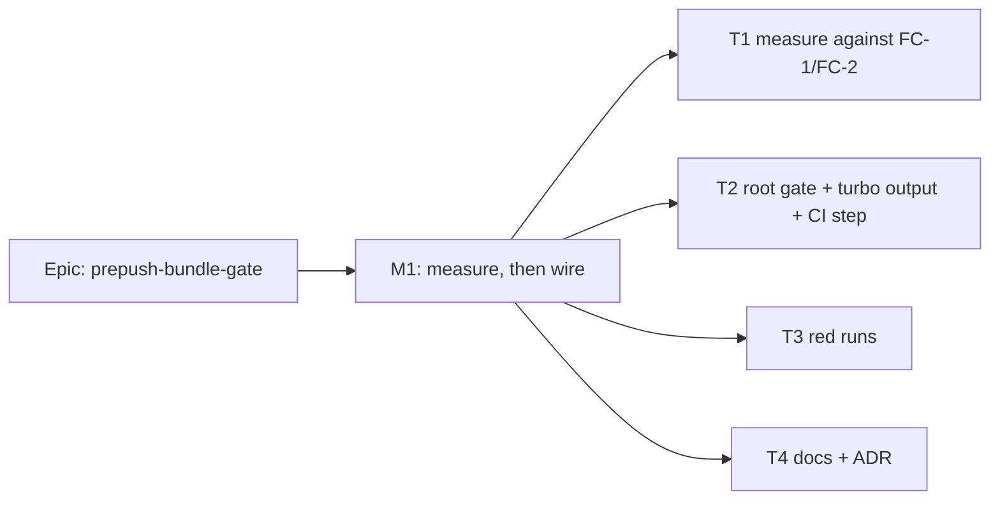

# Implementation Plan: The web bundle budget runs in `pnpm prepush`

- **Feature spec:** [./feature-spec.md](./feature-spec.md)
- **Status:** Draft
- **Owner:** product owner (approval); implementing session (build)

## Breakdown

### Epic

**prepush-bundle-gate**: the one blocking gate `pnpm prepush` cannot run becomes one it does.
Repository tooling; exempt from `docs/ROADMAP.md` on the ADR-0136 precedent.

### Milestone M1: measure, then wire (one PR, one slice)

**Outcome:** a contributor whose branch exceeds the web bundle budget sees `FAIL
check:web-bundle` from `pnpm prepush`, not from CI.
**Entry point:** `pnpm prepush` (and `scripts/prepush.sh --checks`). This is a command, not a
screen: no product surface changes.
**Journey:** not applicable. No user-facing product capability is claimed (ADR-0081's subject is a
product capability). The equivalent evidence is T3's recorded red runs, which drive the real
command.

---

#### Feature: the root gate

> **Description:** a root `check:web-bundle` that clears the report, builds the web app through
> turbo, and runs the existing workspace check. It is picked up by prepush's derived roster and run
> by CI in place of today's workspace call.
> **Complexity:** S
> **Dependencies:** none
> **Risks:** see the rollup below
> **Testing requirements:** FC-1 to FC-4, US-2's stale-report case, one structural case, and the
> existing suites passing unedited

##### Task 1: measure before anything changes (M1-T1)

- **Description:** Take the number the spec could not take. FC-1 and FC-2 are already committed in
  the spec. Do not edit them after seeing the result.
- **Complexity:** S
- **Dependencies:** none
- **Risks:** Machine noise → three samples each, report the median and the spread. A run with a
  spread wider than the margin to the ceiling is reported as indeterminate, not as a pass
  (ADR-0128).
- **Testing:** none. This is a measurement.
- **Development steps:**
  1. Reference figure, as the brief asked: `time pnpm --filter @repo/web build`, then
     `time pnpm --filter @repo/web check:bundle-size`. Three samples.
  2. **FC-1 (cold):** `time pnpm exec turbo run build --filter=@repo/web --force`, then the check.
     Three samples.
  3. **FC-2 (warm):** run step 2 once without `--force`. Then, with no edits, run it three more
     times and time each. Confirm turbo's log says `cache hit` for `@repo/web#build`.
     _This step is expected to fail until Task 2 declares the output_: without it, a hit restores
     `dist/**` and not the report. Take it after Task 2 step 2, and record both states.
  4. Record the commands, machine, medians and spreads in
     `docs/specs/prepush-bundle-gate/m1-measurement.md`.
  5. **If FC-1's median is over 60 s, or FC-2's is over 10 s: stop.** Take the numbers to the
     product owner (spec CQ-1). Do not switch to option (b) on your own.

##### Task 2: the gate, the turbo output and the CI step (M1-T2, one commit)

- **Description:** Three edits that must land together, because `check:ci-roster` R1 refuses a
  root `check:*` with no CI step.
- **Complexity:** S
- **Dependencies:** Task 1 steps 1–2 within the ceiling
- **Risks:** A CI rebuild lengthening `quality` → FC-4, checked on the PR's own run.
- **Testing:** a new structural case in `scripts/check-bundle-size.test.mjs`: `turbo.json`'s
  `build.outputs` contains `bundle-report.json`. Verify it red by removing the entry. The existing
  `check:doc-register`, `check:ci-roster` and `check:advisory-agreement` must pass **unedited**;
  editing one of them is the signal this task did more than it says.
- **Development steps:**
  1. Root `package.json`: `"check:web-bundle": "rimraf apps/web/bundle-report.json && turbo run
build --filter=@repo/web && pnpm --filter @repo/web check:bundle-size"`.
  2. `turbo.json`: add `"bundle-report.json"` to `tasks.build.outputs`.
  3. `.github/workflows/ci.yml:272-273`: `run: pnpm check:web-bundle`. **Replace** the workspace
     call; do not add a second step. Keep it after `Build (api + web)` so the in-job cache is warm.
     Rewrite the comment at `:260-271`: it currently says this is deliberately not a root gate.
  4. Run `pnpm prepush`. Every gate green, `check:web-bundle` included.
  5. `git diff --exit-code apps/web/bundle-budget.json`. Prepush must never write the budget; the
     floor is measured on `main` only.

##### Task 3: red runs (M1-T3)

- **Description:** A gate is finished when the defect it names has made it fail (ADR-0110 D5).
  Each run is done on a scratch change that is **not** committed. The output is recorded in
  `docs/specs/prepush-bundle-gate/m1-red-run.md`.
- **Complexity:** S
- **Dependencies:** Task 2
- **Risks:** A red run that fails for the wrong reason → each record names the finding the gate
  printed, not just the exit status.
- **Testing:** the runs themselves.
- **Development steps:**
  1. **FC-3, inflated bundle:** add `import 'jspdf';` to `apps/web/src/main.tsx`, then run
     `pnpm prepush`. Expect `FAIL  check:web-bundle`, findings B1 (entry graph over budget) and B2
     (`jspdf` in the entry graph), and exit 1. `WARN` is a failure of this criterion. Repeat with
     `scripts/prepush.sh --checks`.
  2. **US-1, type error:** introduce a type error in `apps/web/src` and run
     `scripts/prepush.sh --checks`. Expect `FAIL check:web-bundle` (tsc exits 2, and 2 is not
     advisory for this gate) and not `WARN`.
  3. **US-2, stale report:** build once green, keep the resulting `bundle-report.json`, break the
     build, and run the gate. Expect FAIL from the build. Then remove the `rimraf` clause and
     re-run, to show the deletion is what prevents a pass over the old report. Restore the clause.
  4. **Roster:** delete the new CI step and run `pnpm check:ci-roster`. Expect an R1 finding naming
     `check:web-bundle`. Restore the step.
  5. Revert every scratch change and confirm `git status` is clean apart from the two records.

##### Task 4: documents and the ADR (M1-T4)

- **Description:** Every place that says the bundle gate is deliberately CI-only is now wrong.
- **Complexity:** S
- **Dependencies:** Tasks 1–3 (the ADR cites their numbers)
- **Risks:** One of those places is missed and goes on saying the opposite → the list below is from
  a search for "Not a root `check:*`", "five-second" and "outside `check:ci-roster`". Re-run that
  search before committing.
- **Testing:** `pnpm prepush` (it covers `check:adr-coverage`, `check:doc-links` and
  `check:spec-status`); `pnpm format:check`, which prepush does not run (#299).
- **Development steps:**
  1. ADR-0160 per the spec's outline. It amends ADR-0136 and cites the T1 and T3 records. Add the
     CLAUDE.md §16 entry, the `docs/adr/README.md` row and the `scripts/adr-coverage.json`
     exemption.
  2. `apps/web/scripts/check-bundle-size.mjs:25-41`: replace "Why this is not a root `check:*`" and
     the "blind spot with a trigger" section. The trigger has now fired and been handled. Keep the
     history, and say what changed and why.
  3. `scripts/check-ci-roster.mjs:72-84`: the workspace branch stays, and is still tested. Say that
     no live CI step uses it now, and drop the "five-second prepush" premise.
  4. `scripts/prepush.sh:24-25`: the usage line says `--checks` is fast and runs no build. Update it:
     one gate builds, and it is a cache hit when the web app is unchanged.
  5. `docs/TESTING.md` "Before you push": add the measured cost from T1 to the cost paragraph, with
     its date and command.
  6. `docs/TECH_DEBT.md` #299: record the general rule (every gate CI runs is run by prepush, or
     exempt with a reason) as the fix that would close this class, deferred per spec CQ-2.
  7. Set both headers in this directory to `Accepted — shipped (ADR-0160)`.

## Sequencing and slices

One PR. Task 1 comes first and can stop the work. Task 2 is one commit, because R1 refuses the
root script without its CI step. Tasks 3 and 4 follow on the same branch. `main` stays releasable
throughout: nothing outside repository tooling changes, so there is no feature flag (ADR-0088 D1)
and no changeset.

Specialist review before merge: **devops-reviewer** (CI step, turbo outputs, cache behaviour).
**database-architect** is not engaged: there is no schema change to design. No UI reviewers: there
is no UI change.

## Definition of Done (per task)

Each task's PR must satisfy the Feature Completion Criteria in
[`docs/PROCESS.md`](../../PROCESS.md). For this change that means FC-1 to FC-4 recorded with their
commands; the red runs recorded; `pnpm prepush` and `pnpm format:check` green; every CI check green
on the PR's current head, deduplicated per CLAUDE.md §19.9; and FC-4 read off that run's `quality`
job log.

## Risks and assumptions (rollup)

| Risk / assumption                                                                                     | Likelihood             | Impact | Mitigation                                                                                                       |
| ----------------------------------------------------------------------------------------------------- | ---------------------- | ------ | ---------------------------------------------------------------------------------------------------------------- |
| Cold build exceeds 60 s, making prepush slow enough to be bypassed (ADR-0058)                         | med                    | med    | FC-1 is committed before measuring. Over the ceiling, stop and ask (CQ-1).                                       |
| The CI step misses turbo's cache and adds a web build to `quality`, the job that bounds CI (ADR-0138) | low                    | med    | It runs after `pnpm build` in the same job. FC-4 checks the log for a cache hit and a step time of at most 15 s. |
| A cache hit restores `dist/**` but not the report                                                     | high without T2 step 2 | high   | `bundle-report.json` is declared as an output. A structural case pins it. FC-2 checks the hit end to end.        |
| A stale report yields a false OK                                                                      | low                    | high   | The `rimraf` step. US-2's red run shows it is load-bearing.                                                      |
| `tsc`'s exit 2 read as advisory                                                                       | low                    | high   | ADR-0124: this gate is not in `ADVISORY_GATES`, so 2 blocks. T3 step 2 shows it.                                 |
| A shell `VITE_*` variable makes the local bundle differ from CI's                                     | low                    | low    | Turbo hashes `VITE_*`, so the cache stays correct. No `apps/web/.env*` exists. Recorded, not engineered around.  |
| The name collision in `check:ci-roster` (`:158-163` filters names, not invocations)                   | —                      | —      | Avoided by the distinct root name (spec D2), not fixed. Fixing it changes a shared gate for no current caller.   |
| The spec's figures were read from files, not measured                                                 | certain                | low    | Stated at the top of the spec. T1 exists to replace the missing number.                                          |
