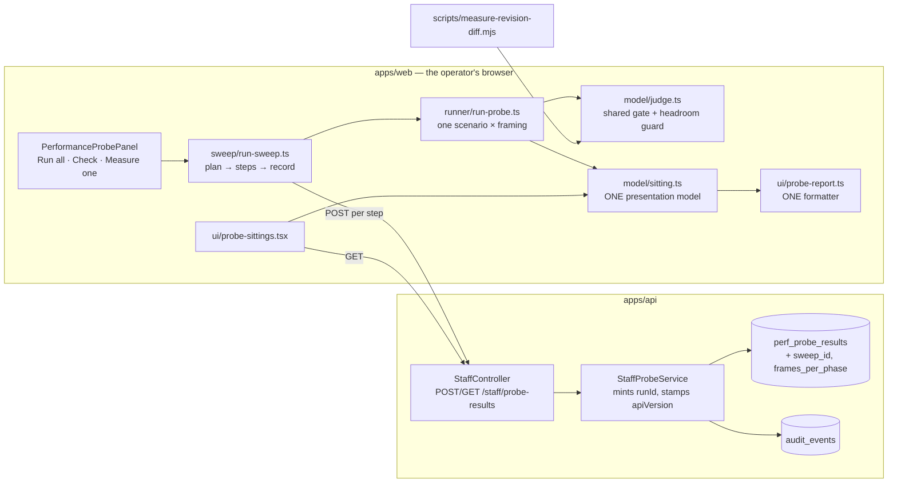
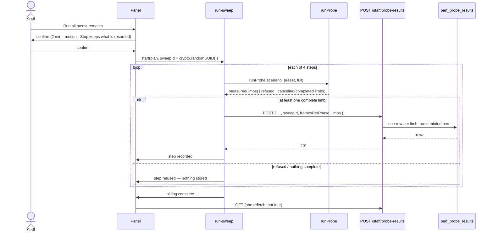
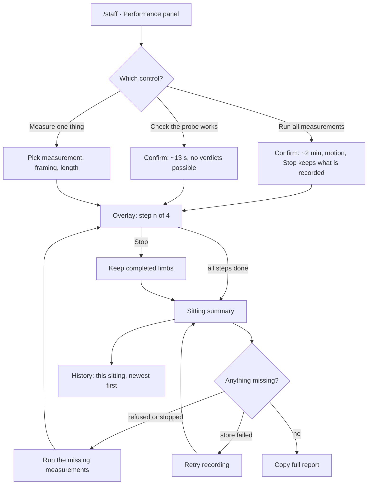

# Feature Spec: The probe sweep, and a console that reads a sitting

- **Status:** Accepted — shipped (ADR-0130)
- **Author(s):** feature-analyst (Claude)
- **Date:** 2026-09-09
- **Tracking issue / epic:** —
- **Roadmap link:** operational tooling (staff console); closes part of `docs/TECH_DEBT.md` #75's
  instrument gap and all of #260
- **Related ADR(s):** amends **ADR-0128** (D4, D5, D7); builds on ADR-0086 (staff boundary),
  ADR-0087 (retention), ADR-0026 §9 (the frame-rate gate), ADR-0058, ADR-0081, ADR-0105.
  A new ADR is required — see §4.9. **Provisional number ADR-0130** (0129 is the highest filed
  as of 2026-09-09, `docs/adr/0129-identity-across-two-imports-is-the-code.md`); confirm the number
  at filing rather than reserving it now (the ADR-0071/ADR-0079 lesson).

---

## 0. Why this spec exists at all

**ADR-0105's triggers are already fired**, and they are named here rather than implied:

| Trigger                        | Fired?  | What fires it                                                                                                               |
| ------------------------------ | ------- | --------------------------------------------------------------------------------------------------------------------------- |
| A new user-facing entry point  | **yes** | `Run all measurements` on `/staff` (§4.7)                                                                                   |
| A schema change                | **yes** | two nullable columns on `perf_probe_results` (§4.4) — **`database-architect`, without exception**                           |
| A shared gate                  | **yes** | `model/judge.ts` is imported by the panel **and** by `apps/web/scripts/measure-revision-diff.mjs`                           |
| A component's public contract  | **yes** | `ProbeHistory`'s props change from `{ query }` to a sitting model (§4.6)                                                    |
| A Playwright config or CI step | **no**  | `apps/web/playwright.staff.config.ts` and `.github/workflows/ci.yml:739` already exist; both are extended, neither is added |

The last row is worth stating accurately: ADR-0105 measured "adds a Playwright config" as the
**strongest** predictor of spec-worthy work (at least 26 of 28 historical cases). It does **not**
fire here. Four others do.

---

## 1. Business understanding

### Problem

The product owner ran the performance probe several times and reported two things:

> "i have a few tests i can run — some say they don't get recorded and some say reported but not
> graded. do you think its worth reviewing these tests in detail and ensuring everything gets
> recorded? also, why split the tests — should we just have a test button and it runs and records
> and grades all tests? i'm not going to be doing them often so don't see the point of the splits."

**Both observations are accurate, and neither is a bug.** They are consequences of decisions that
each have a good reason and were never priced as a set. Re-derived from the code rather than
restated from the report:

**(a) "reported but not graded" is a string the product read to them.**
`model/verdict-copy.ts:44` renders `REPORTED_ONLY` as the words **`REPORTED, NOT GRADED`**. It is
reached whenever a run is ungated, and the gate is
`run-probe.ts:255` — `size === 'full' && isGated(scenario, preset)` — over
`scenarios.ts:180`, `scenario.gated && preset !== 'fit'`. Enumerating the picker
(`ui/performance-probe-panel.tsx:240-276`: 2 measurements × 2 framings × 2 lengths):

| Combination                     | Rows written | Graded? |
| ------------------------------- | ------------ | ------- |
| Canvas draw · Week · Full       | 2            | **yes** |
| Canvas draw · Week · Quick      | 2            | no      |
| Canvas draw · Fit · Full        | 2            | no      |
| Canvas draw · Fit · Quick       | 2            | no      |
| Revision overlay · Week · Full  | 1            | **yes** |
| Revision overlay · Week · Quick | 1            | no      |
| Revision overlay · Fit · Full   | 1            | no      |
| Revision overlay · Fit · Quick  | 1            | no      |

**Two of the eight combinations the picker offers produce a verdict — three of the twelve rows.**
An operator working through the picker meets "REPORTED, NOT GRADED" three times out of four. Every
one of those is correct (a quick run has one repeat, so the INDETERMINATE rule cannot fire —
`run-probe.ts:41-52`; Fit is ungated because the shipped painter already judders there and a gate
that fails on day one gets deleted rather than fixed — ADR-0058, `scenarios.ts:172-182`). But the
picker presents eight equal-looking choices and says nothing about which two answer a question.

**(b) "they don't get recorded" is a different set of sentences, and gating is not among them.**
`model/to-probe-body.ts:31` returns `null` **only** when `outcome.kind !== 'measured'`. An ungraded
measurement is stored exactly like a graded one. The paths that store nothing are:

| Path                   | Where                                    | What the operator is told                         |
| ---------------------- | ---------------------------------------- | ------------------------------------------------- |
| Refused (four reasons) | `model/pacing.ts:92-136`                 | "The run was refused — nothing was measured."     |
| Cancelled (**Stop**)   | `runner/run-probe.ts:280-284`            | "…nothing was measured and nothing was recorded." |
| The POST failed        | `ui/performance-probe-panel.tsx:544-558` | "measured but NOT recorded" + **Retry recording** |

So "some don't get recorded" maps to a refusal, a cancellation or a failed store — **not** to
gating. The two complaints are about two different mechanisms that produce similar-sounding
sentences, which is itself part of the problem.

**(c) The splits are not arbitrary, and one of them is load-bearing for a test.**
`RUN_SIZES` (`run-probe.ts:53-56`) is `quick = 40 × 1`, `full = 180 × 3`, and the short one exists
so `apps/web/e2e-staff/staff.spec.ts:305` can drive the real path inside a Playwright timeout.
Deleting it silently deletes that journey's ability to run.

**(d) And the thing nobody reported: a cancelled press throws away completed work.**
`runAbsoluteLimbs` (`run-probe.ts:401-403`) breaks out of the limb loop on **Stop**; `runProbe`
then returns `cancelled` (`:284`) and `toProbeBody` discards the whole press. On the two-limb
`canvas-draw` scenario, stopping during the second limb discards a **complete** 500-activity limb —
three full repeats, nothing about it wrong — because the recording unit is the press. The comment
at `:280-282` says "a limb runner that stopped early returns a partial result and there is no
honest way to judge one", which is true of the interrupted limb and false of its finished
neighbour.

**(e) And three acceptance criteria of the approved predecessor spec were never met.**
`docs/specs/staff-performance-probe/feature-spec.md:206-208` says a history row names
"the scenario, the verdict, **the viewport width, the display refresh**, the GPU …, the app version
and when it was taken". `:252-253` says the history is "grouped by scenario". `:262` says a narrow
viewport is "recorded, **with the panel stating** that a narrow viewport culls more and is not
comparable to a wide one". The verdict half was found missing at that epic's M5 gate pass and
fixed; the rest was not. `ui/probe-history.tsx:68-98` has nine columns and none of them is viewport,
display refresh or focus — a `grep` for `viewport|narrow|comparable` under
`features/perf-probe/ui/` returns `probe-report.ts`, `performance-probe-panel.tsx` and the two test
files, and never `probe-history.tsx` — and the panel's two hits are code comments about the
measurement surface, not a sentence any reader sees. (This line named three files until M0-T3 ran it;
the conclusion held and the evidence did not. See `m0-measurements.md` §M0-T3.)

That omission stopped being cosmetic on 2026-09-08. `docs/TECH_DEBT.md` #261 records that the same
plan, machine, browser and painter measured **23.3 fps at 1912×1068 and 39.5 fps at 1016×636** — a
fail and a pass against the same floor — and #75(f) fits ~**4.26 ms per megapixel**. The single
most decision-relevant confound in the register is stored on every row and rendered on none.

**(f) And the deliverable expires.** `formatProbeReport` (`ui/probe-report.ts:18`) takes a live
`ProbeOutcome`. There is no way to produce the paste-ready block for a reading taken last week —
which is the artefact #75 actually consumes, and #75's founding failure is a measurement being
unreachable by the person who needs it.

**Why now.** ADR-0128 shipped the instrument on 2026-09-07 and the product owner used it on
2026-09-08, producing the first 500-activity reading in the project's history and unsettling #75's
verdict. The friction they hit on their second sitting is the friction that stopped #75 being
re-derived for a year. Reducing it **is** the point.

### Users

**Staff only.** `StaffPrincipal`, allowlisted by `STAFF_EMAILS`, verified address, reached at
`/staff` (`apps/web/src/routes/staff.tsx:45`). No organisation role is involved and none can be:
`StaffPrincipal` is not assignable to `Principal` in either direction, which is ADR-0086 D1's
compile error and is **untouched by everything below**.

In practice this is one person — the product owner — running the probe a few times a release on a
machine that has a real display.

### Primary use cases

1. **Take every reading this probe can take, in one press**, on the machine the numbers are about.
2. **Check the probe works here** before committing two minutes to it.
3. **Take one specific reading** — re-run a step that was refused, or reproduce a single figure.
4. **Read a sitting back later** and get the same facts the copied block carried at the time.
5. **Compare two sittings** — one release against the previous one — with the confounds visible.

### User journeys

**Happy path.** Open `/staff` → Performance panel → optionally type a machine note → press
**Run all measurements** → confirm (duration, foreground requirement, motion) → a full-screen
canvas paints for about two minutes, announcing each step → the overlay ends → a sitting summary
appears: one line of machine facts, four steps, six readings, each with its verdict or its stated
reason for having none → **Copy full report** → the sitting also appears in the history, grouped.

**Alternates.**

- **Stop mid-sweep** → every step already recorded stays recorded; every limb that completed all its
  repeats stays recorded; the interrupted limb is discarded and named. The summary says which
  readings were not taken and offers **Run the missing measurements**.
- **A step is refused** (tab hidden, implausible clock) → that step records nothing, is named in the
  summary with the refusal sentence, and is offered for retry. The sweep **continues**.
- **A store fails** → the figures stay on screen, the step is marked not recorded, **Retry recording**
  is offered, and the sweep continues.
- **Check the probe works** → the same four steps at 40 frames × 1, about half a minute, recorded and
  **labelled as a check rather than a measurement** (see §4.4 on `framesPerPhase`).

### Expected outcomes

- One press answers every question the probe can answer, so re-deriving #75 costs one confirmation
  and two minutes instead of eight decisions and eight confirmations.
- Nothing measured is silently lost: a stop or a refusal costs the interrupted step, not the sitting.
- No cell prints a number that cannot mean what it appears to mean (#260 closed).
- A reading is as legible in a month as it was in the minute after it was taken.

### Success criteria

| #   | Criterion                                                                                                                                | How it is checked                                                                       |
| --- | ---------------------------------------------------------------------------------------------------------------------------------------- | --------------------------------------------------------------------------------------- |
| S1  | One press produces **6 readings across 4 measurements**, and the step list is derived from `SCENARIOS` × presets rather than written out | structural test: adding a scenario to the registry adds steps with no edit to the sweep |
| S2  | A sitting read from history carries **every field** the live report carries                                                              | structural test asserting field-set equality between the two adapters (§4.6)            |
| S3  | A stopped sweep records every **completed** limb                                                                                         | unit test verified red against today's all-or-nothing discard                           |
| S4  | A saturated difference reading never prints a delta that reads as a measurement                                                          | unit test built from #260's own numbers (baseline 98.33 pp, bar 2.00), verified red     |
| S5  | Sweep duration on the product owner's machine is **within 20 % of 120 s**                                                                | measured on the panel, recorded in this directory; falsified if it exceeds 180 s        |
| S6  | Every existing guarantee holds: uniform 404, audited routes, no customer data, no CI gate                                                | the existing structural/API suites pass unchanged                                       |

**S5's falsification condition is committed before the work starts** (§3, "Duration"), because this
register records six consecutive epics whose width or cost expectation was contradicted by their own
measurement, and the one that caught it early (ADR-0099 M0) is the one that wrote the condition first.

### Open questions

Six, of which **four are critical** (the answer changes design or scope). Defaults are stated for
all six so nothing is blocked.

_(This paragraph said "Five, of which three are critical" when it was written — wrong in both
directions against its own six headings, four of them marked CRITICAL. Corrected on the day, and
recorded rather than quietly edited: it is an ADR-0076 Class 1 count in a document about measuring
things carefully.)_

### ANSWERED — product owner, 2026-09-09

|          | Decision                                                      | Consequence                                                                                                                                                                                                                                                                                            |
| -------- | ------------------------------------------------------------- | ------------------------------------------------------------------------------------------------------------------------------------------------------------------------------------------------------------------------------------------------------------------------------------------------------ |
| **CQ-1** | **Store a `sweep_id`**                                        | A sitting is durable and readable months later. Fires the **mandatory `database-architect`** step at M4-T1. The stated cost is accepted: `runId` is minted server-side so grouping cannot be forged and `sweep_id` does not inherit that, because only the client knows four presses were one sitting. |
| **CQ-2** | **Both measurements × both framings, full length (~119.5 s)** | Fit is covered, which is the point — Fit at 2,000 is the only cell currently short of its gate. Fit stays **reported, never graded** (#260).                                                                                                                                                           |
| **CQ-3** | Default kept                                                  | The **completed limb** is the unit of durability; cancelling never discards finished work; refused steps get "Run the missing measurements".                                                                                                                                                           |
| **CQ-4** | Default kept                                                  | `quick` survives as what "Check the probe works" is made of, and as the only shape the existing journey can drive.                                                                                                                                                                                     |
| **CQ-5** | Default kept                                                  | One block per sitting; a single press is a sitting of one. The flat 13-column table stays rejected.                                                                                                                                                                                                    |
| **CQ-6** | Default kept — **no viewport variation**                      | #75(f)'s intermediate-viewport run is still not supplied, and #261 is still not decided by this epic. Both stated rather than implied.                                                                                                                                                                 |

---

> **CQ-1 (CRITICAL — ANSWERED: store a `sweep_id`) — is a sitting a stored fact, or only a screenful?**
>
> `perf_probe_results.runId` "groups the limbs of ONE press" (`apps/api/prisma/schema.prisma:3603-3610`)
> and is **server-minted so a client cannot forge grouping**. A sweep is one press of one button but
> **four separate POSTs**, because recording per step is what makes an interruption cheap (CQ-3). Four
> POSTs mint four `runId`s, and nothing in the database then says they were one sitting.
>
> **Recommended default: add a nullable `sweep_id` column**, client-supplied, `NULL` for a single run.
> This is a **schema change and therefore goes through `database-architect` without exception**
> (CLAUDE.md §19.3/§20).
>
> The honest cost, stated rather than glossed: `runId`'s "cannot forge" property does **not** extend to
> a client-supplied `sweep_id`. Two answers, both true. First, the capability it grants — grouping rows
> the operator did not group — is strictly weaker than fabricating the numbers, which ADR-0128's
> Consequences already accept ("a compromised staff session can post a fabricated reading. That is
> accepted"). Second, and more to the point, **only the client knows that four presses were one
> sitting**; the server has no session state and cannot observe it. The fact is client-observed, so the
> client names it, exactly as `appVersion` is posted because only the client knows which bundle drew
> the frames.
>
> **Alternatives considered.**
>
> - _One POST for the whole sweep_ (move `scenarioId`/`preset` onto the limb; `runId` then means the
>   sweep, unchanged, no schema change at all). **Rejected:** the POST lands after two minutes, so a
>   stumble at minute three loses everything — which is the complaint, inverted.
> - _Server mints the sweep id and the client echoes it on POSTs 2–N._ Same column, more moving parts,
>   and a failed first POST leaves the rest unattributable.
> - _Carry the id inside the existing `thresholds` JSONB._ **Rejected on principle:** that column's
>   documented meaning is "the bars this limb was judged against". Smuggling a correlation id into it
>   is the drift this register keeps recording.
> - _No grouping; the sitting exists only on screen._ Cheapest. Costs the product owner's actual ask —
>   "display the combined and separate tests" — and makes a sitting a thing you must copy within the
>   minute or lose, which is #75's founding failure.

> **CQ-2 (CRITICAL — ANSWERED: both × both, full length) — what does "everything" mean?**
>
> **Recommended default: both measurements × both framings, at full length. Four steps, six readings,
> ~2 minutes.**
>
> The tempting narrowing is Week-only (~40 s, every reading graded). It is wrong here, because
> **the whole open residue of #75 is at Fit**: `docs/TECH_DEBT.md:598-603` puts Fit/2,000 at 23.3 fps
> against a 30 fps floor, and #75(f)'s two-term model exists to explain it. A "complete testing
> process" that omits the only cell currently short of its gate is not complete.
>
> Duration, derived rather than estimated. A phase is a fixed **frame count**
> (`scenes/canvas-draw.ts:185-210`), so wall-clock = frames ÷ fps. Frames per step:
> `canvas-draw` = 2 limbs × 3 repeats × 180; `revision-diff` = 3 pairs × 2 phases × 180; plus a
> 60-frame idle measurement per step (`run-probe.ts:233`).
>
> | Step                    | Phases × 180     | fps used           | Source                       | Seconds      |
> | ----------------------- | ---------------- | ------------------ | ---------------------------- | ------------ |
> | Canvas draw · Week      | 3 @500 + 3 @2000 | 59.8 / 60.0        | `docs/TECH_DEBT.md:600-601`  | 18.0         |
> | Canvas draw · Fit       | 3 @500 + 3 @2000 | 57.2 / 23.3        | `docs/TECH_DEBT.md:602-603`  | 32.6         |
> | Revision overlay · Week | 6                | 60.0               | `model/scenarios.ts:116-120` | 18.0         |
> | Revision overlay · Fit  | 6                | **~23 (inferred)** | see below                    | ~46.9        |
> | Idle measurement × 4    | —                | 60 Hz              | `run-probe.ts:233`           | 4.0          |
> | **Total**               |                  |                    |                              | **~119.5 s** |
>
> **The one inferred cell is marked as inferred.** No reading records revision-overlay fps at Fit.
> `docs/TECH_DEBT.md:4385-4387` records that sitting's baseline as 98.33 pp dropped, and the
> comparable canvas-draw cell (2,000-activity `scale-scene`, Fit, same machine, same day) is 23.3 fps.
> ~23 fps is that neighbour, not a measurement. **M0 measures it** and this table is corrected from the
> run rather than left standing.
>
> Note the property this makes visible: **a sweep is slower on a machine that is doing badly**, because
> the frame count is fixed. The two minutes above is the good case.

> **CQ-3 (default stated — KEPT) — what survives an interruption?**
>
> **Default: the recording unit becomes the completed limb, not the press.**
> A limb is recorded iff it collected all its repeats (absolute) or all its pairs (difference);
> anything less is discarded and named. Each step POSTs as it completes, so a sweep stopped after
> step 3 has three steps in the database before **Stop** is pressed.
>
> This changes `refuseRun`'s premise and the change is deliberate: today it is handed
> `frames × repeats` — the **intended** count (`run-probe.ts:286`) — which is honest only because a
> partial press is discarded wholesale. Under per-limb recording the intended count is correct **by
> construction** for every limb that is recorded, because an incomplete limb is not one of them.
>
> The panel then says what did not happen, and offers **Run the missing measurements**. That is the
> direct answer to "ensuring everything gets recorded": not a softer refusal rule — the refusal rules
> are not weakened anywhere in this spec — but a cheap way to take the reading again.

> **CQ-4 (default stated — KEPT) — does `quick` survive?**
>
> **Default: yes, and it stops being a Length the operator picks per measurement.** It becomes what
> **Check the probe works** is made of — a **~13 s** sweep of all four steps that answers "does this
> machine produce readings at all" before two minutes are spent.
>
> _(The figure said ~30 s until M7. It was an estimate written before `sweep-duration.ts` existed,
> and it was never re-derived once the derivation did. Measured by calling
> `estimateSweepSeconds(sweepPlan(), 'quick')`: **13.07 s**, which `describeDuration` renders as "a
> few seconds" — so the dialog the operator actually reads has been right throughout and only this
> document was wrong. The **spec** is corrected rather than the code, because the code computes the
> answer and the prose restated it. ADR-0076 Class 1: a number nobody re-derived.)_ That is a real operator need for
> somebody who runs this rarely, and it is also the form the Playwright journey can drive
> (`e2e-staff/staff.spec.ts:300-305` already relies on the property, and `run-probe.ts:47-52` states
> it).
>
> A check **is recorded**, and the row says what protocol produced it (`framesPerPhase`, §4.4). The
> considered alternative — do not record a check — was rejected because it creates an exception to
> "everything measured is recorded" on the very epic whose subject is that sentence, and because the
> journey's existing "Recorded. It appears in the history below." assertion would have to be inverted.

> **CQ-5 (CRITICAL — ANSWERED: one block per sitting) — how do combined and separate sit together?**
>
> **Default: the history renders one block per sitting** — a short definition list of the facts that
> are constant across the sitting (taken, who, machine note, viewport, display clock, GPU, focus held,
> web/api versions) and one `DataTable` of the readings that vary (measurement, scale, framing,
> protocol, verdict, on-screen bars, px/day). A single press renders in exactly the same shape as a
> sweep, with one reading in it.
>
> **The rejected alternative is a flat table with a "Sitting" column.** It needs thirteen columns to
> carry what the sitting facts carry, repeats the machine description six times per sweep, and gives a
> screen-reader user no structure to navigate. The per-sitting block reuses `DataTable` (whose caption
> becomes the sitting's name) rather than inventing a grouped-table pattern.
>
> **No filters in v1**, and that is a decision with a reason: `ui/probe-history.tsx:22-26` records that
> the panel has "exactly one empty state and it says so", because with no filters "nothing recorded
> yet" cannot be confused with "nothing matched" — the ADR-0073 C1 accessibility finding. Adding a
> filter means adding that distinction. Not worth it for a table only a person can write to.

> **CQ-6 (CRITICAL — ANSWERED: no viewport variation) — does the sweep vary the viewport?**
>
> **Default: no.** The sweep runs at the operator's real window
> (`ui/performance-probe-panel.tsx:149-150`) and records it, which is already stored. Two reasons.
> `docs/TECH_DEBT.md` #261 is open — ADR-0026 §9 names no canvas size — so choosing one inside a
> sweep would decide an open question by accident, in a place nobody would look for the decision. And
> it roughly doubles the sweep.
>
> **What the default costs, said plainly:** #75(f) asks for "a fourth Fit/2,000 run at an intermediate
> window — roughly 1450×850" to give its two-term model its first degree of freedom, and a
> fixed-viewport sweep would supply it every time. The compensating move here is smaller and cheaper:
> the sitting **states its viewport once, prominently**, and two sittings at different sizes are
> visibly not comparable rather than invisibly not comparable. If the product owner wants the
> reference cell, it is one extra step in the sweep plan (§4.3) and is a decision, not a redesign.

---

## 2. Functional requirements

### User stories & acceptance criteria

> **US-1** — As **staff**, I want one control that takes every reading this probe can take, so that
> a complete set costs one decision rather than eight.
>
> - **Given** the Performance panel, **when** it renders, **then** the primary control is
>   **Run all measurements**, and beside it a sentence naming the number of measurements, the number
>   of readings and the expected duration.
> - **Given** that control, **when** it is pressed and confirmed, **then** the probe runs every
>   (scenario × framing) step in a fixed, derived order and does not stop between steps.
> - **Given** the registry gains a third scenario, **when** nothing else changes, **then** the sweep
>   runs it — asserted structurally, not by reading.
> - **Given** a sweep completes, **then** exactly **six** readings exist for it (2 + 2 + 1 + 1), each
>   a row.

> **US-2** — As **staff**, I want every measured reading recorded, so that "I ran it" and "it is in
> the history" stop being different things.
>
> - **Given** any step that produces a measurement, **when** it completes, **then** it is POSTed
>   immediately, before the next step starts.
> - **Given** a step whose POST fails, **when** the sweep continues, **then** that step is marked
>   **not recorded**, its figures stay on screen, and **Retry recording** is offered for it
>   specifically.
> - **Given** **Stop** is pressed during a limb, **when** the sweep ends, **then** every limb that
>   completed all its repeats is recorded and the interrupted limb is not.
> - **Given** a step is refused, **when** the sweep ends, **then** **nothing** is stored for it — the
>   refusal rules are unchanged — and the summary names it, its reason, and offers to run it again.

> **US-3** — As **staff**, I want to know which readings answer a question and which only report, so
> that "REPORTED, NOT GRADED" stops reading like a fault.
>
> - **Given** a sitting summary, **when** it renders, **then** it states, in one sentence, how many
>   readings were graded, how many were reported without a verdict, and how many were not taken.
> - **Given** an ungraded reading, **when** it renders, **then** the reason is beside it and is one of
>   two distinct sentences (short protocol / never-graded framing) — the existing
>   `verdictNote` contract (`model/verdict-copy.ts:15-40`), unchanged.
> - **Given** a sitting where every reading is ungraded, **then** the summary says so at the top
>   rather than leaving the reader to notice.

> **US-4** — As **staff**, I want a difference reading never to print a delta that cannot mean what it
> looks like, so that a saturated baseline stops reading as "free".
>
> - **Given** a difference limb whose baseline mean dropped percentage leaves **less headroom than the
>   bar** (`100 − baselineMeanPp < barPp`), **when** the limb is **gated**, **then** the verdict is
>   **INDETERMINATE** with a reason naming the headroom and the bar.
> - **Given** the same limb **ungated**, **when** it renders, **then** the delta is presented with an
>   explicit saturation caveat and never as a bare figure.
> - **Given** `docs/TECH_DEBT.md:4385-4387`'s own numbers (baseline 98.33 pp, bar 2.00 pp, delta
>   −0.19 pp), **when** they are fed to the judge, **then** the result is not a bare "-0.19 pp".

> **US-5** — As **staff**, I want a stored reading to be as legible as a fresh one, so that a sitting
> is worth keeping.
>
> - **Given** a history row, **when** I read it, **then** it carries the viewport, the measured display
>   interval, whether the window held focus, the device pixel ratio, the protocol (frames × repeats)
>   and the GPU — in addition to everything it carries today.
> - **Given** a stored sitting, **when** I press **Copy report**, **then** I get the same paste-ready
>   block the live run produced, from the same formatter.
> - **Given** the two sources (a live outcome, a set of stored rows), **when** both are mapped to the
>   presentation model, **then** they produce the same field set — asserted structurally.

> **US-6** — As **staff**, I want to check the probe works before spending two minutes, so that a
> broken machine costs half a minute.
>
> - **Given** **Check the probe works**, **when** pressed, **then** the same four steps run at the
>   short protocol, take about thirty seconds, and are recorded.
> - **Given** those readings, **when** they render anywhere, **then** they are labelled as a check and
>   state that no verdict is possible from them.

> **US-7** — As **staff**, I want none of this to cost the console its guarantees.
>
> - **Given** any new or changed route, **when** a non-staff authenticated caller reaches it, **then**
>   the same uniform **404**, never 403.
> - **Given** a sweep, **when** it completes, **then** the audit log holds **one `staff.probe_recorded`
>   row per POST**, each naming its scenario, none carrying a device characteristic.
> - **Given** a sweep, **when** it completes, **then** it has issued **at most one** history refetch,
>   not one per step (`api/probe-results.ts:118-120` invalidates on every success today — four steps
>   would write four extra `staff.panel_read` rows into an append-only table for one press).

### Workflows

**Sweep.**

1. Panel mounts. Nothing heavy is imported (`ui/panel-imports.structural.test.ts` pins this).
2. **Run all measurements** → confirmation naming: total duration, that the motion is the
   measurement, that the tab must stay in front, and that **Stop** keeps what has already been
   recorded.
3. Confirm → the split point (`await import('../runner/run-probe')`) → the overlay mounts once for
   the whole sweep, sized to the real window.
4. For each step in the derived plan:
   1. announce "Measurement _n_ of 4 — _label_, _framing_";
   2. measure the display's idle interval;
   3. run the limbs, announcing each repeat;
   4. classify: **measured** (all limbs complete or some complete), **refused**, **cancelled**;
   5. POST the completed limbs, if any; record the store's outcome against the step;
   6. if **Stop** was pressed, leave the loop.
5. Overlay unmounts, focus returns to the control that opened it.
6. Summary renders: one machine line, four steps, six reading slots, each in one of
   `recorded` / `not recorded` / `refused` / `not taken`.
7. One history refetch. **Copy full report** offers the whole sitting.

**Single measurement.** Unchanged in substance: the three selects move into a
`Measure one thing` disclosure and produce a one-step sitting.

**Read.** The history is a list of sittings, newest first, each a facts block plus a table. A single
press is a sitting of one reading.

### Edge cases

| Case                                         | Behaviour                                                                                                                                                                                          |
| -------------------------------------------- | -------------------------------------------------------------------------------------------------------------------------------------------------------------------------------------------------- |
| Tab hidden during step 2 of 4                | Step 2 is refused and records nothing. Steps 1, 3 and 4 run and record. The summary names step 2 and offers to re-run it. **The refusal rule is not softened.**                                    |
| **Stop** between steps                       | Everything recorded stays. Remaining steps are `not taken`, named as such — distinct from `refused`, which means it was attempted.                                                                 |
| **Stop** inside a limb's repeats             | Completed limbs of that step are recorded; the interrupted limb is discarded and named.                                                                                                            |
| Every step refused                           | Nothing is stored, and the sitting appears **nowhere in history** — stated on screen, because a refusal leaves no trace anywhere (§4.8, accepted limitation).                                      |
| POST fails on step 1, succeeds on 2–4        | The sitting exists in history with three of six readings. The screen says which is missing. Retry re-POSTs step 1 under the **same** `sweepId`.                                                    |
| A sweep spans a deploy                       | Impossible to prevent and already visible: `appVersion` is per-POST and `apiVersion` is stamped per row, so two rows of one sitting can differ. The sitting block shows both and flags a mismatch. |
| Two sweeps at once                           | Impossible by construction — the control is shaded for the duration and the panel holds one run at a time (unchanged).                                                                             |
| Scenario registry unknown to this bundle     | A stored row with an unrecognised `scenarioId` renders its raw id and is grouped normally (`probe-history.tsx:120-127`, unchanged).                                                                |
| Sitting older than the `sweep_id` column     | `sweepId` is `NULL` → rendered as a single-press sitting keyed on `runId`. No backfill, no invention.                                                                                              |
| `framesPerPhase` `NULL` (pre-migration rows) | Rendered "(not recorded)". **Never inferred** from `samples.length`, even though today's `RUN_SIZES` ties them — that is the ADR-0126 rule (a default invents a fact).                             |
| Retention deletes half a sitting             | Possible at the 365-day boundary; rows expire individually. The sitting block states its own reading count and does not claim completeness.                                                        |

### Permissions

Unchanged, and that is a requirement rather than a note. `StaffGuard` on every route
(`staff.controller.ts:81`); uniform 404 for every non-staff caller including Org Admins
(`:69-73`); throttle 30/60 s (`:80`) — a four-step sweep is 4 POSTs + 1 GET, well inside it; every
route audited, including reads (ADR-0086 D5's path-derived census assertion). No organisation role
appears anywhere. `perf_probe_results` still has no `organization_id` and no column that could hold
a customer id, so there is **no scope to get wrong** rather than a scope that is guarded
(ADR-0086 D7).

### Validation rules

| Field            | Rule                                 | Where                                                                                                                                  |
| ---------------- | ------------------------------------ | -------------------------------------------------------------------------------------------------------------------------------------- |
| `sweepId`        | optional; when present, a v4/v7 UUID | `class-validator` `@IsUUID()` + `@IsOptional()`; `NULL` in the column                                                                  |
| `framesPerPhase` | optional int, 1…10 000               | DTO bound strictly inside the database CHECK, per the existing rule that no DTO-valid payload may reach a 500 where a 422 was promised |
| Everything else  | unchanged                            | `dto/create-probe-result.dto.ts`                                                                                                       |

The client's own sweep plan is derived, not typed, so there is nothing to validate there.

### Error scenarios

| Scenario                                | Detection             | User-facing result                                           | Status |
| --------------------------------------- | --------------------- | ------------------------------------------------------------ | ------ |
| Non-staff caller POSTs with a `sweepId` | `StaffGuard`          | "Not found"                                                  | 404    |
| `sweepId` is not a UUID                 | DTO                   | The step is marked not recorded; **Retry recording** offered | 422    |
| `framesPerPhase` out of range           | DTO                   | as above                                                     | 422    |
| Store fails mid-sweep (network)         | mutation `isError`    | Step marked not recorded; sweep continues; retry offered     | —      |
| Chunk fails to load                     | `catch` in `start`    | "The measurement could not run: …"; nothing recorded         | —      |
| Judge refuses a limb                    | `NothingToJudgeError` | "This run cannot be judged" + the **full** message           | —      |
| Saturated baseline, gated               | new headroom guard    | INDETERMINATE + reason                                       | —      |
| Saturated baseline, ungated             | new headroom guard    | delta printed with caveat                                    | —      |

---

## 3. Technical analysis

| Area           | Impact     | Notes                                                                                                                                                                                                                                    |
| -------------- | ---------- | ---------------------------------------------------------------------------------------------------------------------------------------------------------------------------------------------------------------------------------------- |
| Frontend       | **high**   | New sweep runner (a loop over the existing `runProbe`), rebuilt panel, rebuilt history, one shared presentation model, one shared report formatter.                                                                                      |
| Backend        | **low**    | No new route. `StaffProbeService.record` passes two more fields through; `list` unchanged.                                                                                                                                               |
| Database       | **medium** | Two nullable columns on `perf_probe_results`, no index, no backfill. **`database-architect`, mandatory.**                                                                                                                                |
| API            | **low**    | Two optional fields on `CreateProbeResultDto`; two on `ProbeResultRowDto`. OpenAPI updated. Additive — an older client is byte-identical.                                                                                                |
| Security       | **low**    | No new surface. The `sweep_id` forging question is CQ-1 and is answered there. No new field is a fingerprint: `framesPerPhase` is a protocol constant, `sweepId` is a random UUID.                                                       |
| Performance    | **low**    | 4 POSTs instead of 1 per sitting; 1 GET instead of 4. The read is unchanged (backward index scan on `(recorded_at, id)`, measured sub-millisecond at 60 000 rows). A page of 50 rows is ~8 sweeps; the `limit` bound already allows 100. |
| Infrastructure | **none**   | No env var, no service, no container change.                                                                                                                                                                                             |
| Observability  | **low**    | One `staff.probe_recorded` row per POST (4 per sweep), each naming its scenario, allow-list still empty.                                                                                                                                 |
| Testing        | **medium** | Unit (sweep plan, per-limb durability, headroom guard, adapter equality); API e2e (grouping, 422s); the existing `e2e-staff` journey extended with a second `test()`.                                                                    |

**Duration** — the falsification condition for S5, committed here before anything is built:
the sweep is **PASS** if it completes in **≤ 144 s** (120 s + 20 %) on the product owner's machine
at their ordinary window, and is escalated to them if it exceeds **180 s**. The derivation and its
one inferred cell are in CQ-2.

### Dependencies

- **Must land first:** the headroom guard (#260), because the sweep's fourth step produces exactly
  the reading that exposed it, and shipping the sweep first means shipping a known-misleading cell.
- **Must land before the sweep:** the two columns, because grouping and protocol labelling depend on
  them and a schema change is the one thing that cannot be added later without a second migration.
- **Untouched, and named so they stay that way:** the CPM engine (not imported, no migration touches
  a scheduling table, so the ADR-0034 recalculation parity gate is unaffected by construction);
  `judgeAbsolute`'s existing rules; `refuseRun`'s four reasons; `StaffPrincipal`'s
  non-assignability; the CLI driver's output (F1's before/after oracle must still pass).
- **Related but deliberately not done here:** `docs/TECH_DEBT.md` #258 (three copies of the pacing
  arithmetic). Its own stated trigger is "the third scenario, or the first bug found in either copy",
  and neither fires. Unifying two measurement modules inside an epic that changes what they are
  called from is the shape this register records going wrong when hurried.

---

## 4. Solution design

### 4.1 Architecture overview



Two things this diagram is drawn to make checkable. **`judge.ts` has one arrow in from each
consumer and no copy** — that is ADR-0128 D2 and the reason the headroom guard goes there rather
than into the panel. And **the live outcome and the stored rows meet at `model/sitting.ts`**, so the
screen and the copied block cannot say different things about the same reading — which is exactly
the asymmetry §1(e)/(f) found.

### 4.2 Data flow



### 4.3 The sweep plan

Derived, never written out:

```
plan = SCENARIOS.flatMap(s => PRESETS.map(p => ({ scenario: s, preset: p })))
```

with `PRESETS = ['week', 'fit']` — Week first, because it is the framing that grades, so an
interruption costs the ungraded half. Today that yields four steps and six readings; a third
scenario yields six steps with no edit here, which S1 pins structurally.

**`Check the probe works`** runs the same plan at the short protocol. **`Measure one thing`** runs a
one-element plan. All three go through one code path, so a single run and a sweep step cannot
diverge.

**A reference-viewport step is NOT in the plan** — CQ-6, with its cost stated there.

### 4.4 Database changes

> **Designed with `database-architect` before any migration is written. This is not optional and is
> not a judgement about size** (CLAUDE.md §19.3): a migration is checksummed the moment it lands and
> applies to a real database, so a mistake costs a second migration in every environment. What
> follows is the requirement to hand that agent, not the design.

Two nullable columns on `perf_probe_results`. No index (the sitting grouping happens client-side over
a page of ≤ 100 rows already fetched; the table has no automated producer — the schema's existing
note at `schema.prisma:3753-3759` states the bound and what would change it). No backfill.

| Column             | Type        | Why nullable, and why no default                                                                                                                                                                                                                                                                                                                                                                                                                                       |
| ------------------ | ----------- | ---------------------------------------------------------------------------------------------------------------------------------------------------------------------------------------------------------------------------------------------------------------------------------------------------------------------------------------------------------------------------------------------------------------------------------------------------------------------- |
| `sweep_id`         | `UUID NULL` | `NULL` means **this reading was a single press**, which is true of every existing row and of every future single run. A default would claim membership of a sitting that does not exist.                                                                                                                                                                                                                                                                               |
| `frames_per_phase` | `INT NULL`  | `NULL` means **not recorded**. Existing rows genuinely do not carry it. It is inferable today from `samples.length` because `RUN_SIZES` ties frames to repeats — and inferring it would write a fact derived from client code that could have been any version into a column readers will trust. The ADR-0068 `hoursPerDay` precedent does **not** license a backfill here: 1440 was demonstrably true of every pre-existing row; this is an inference about a bundle. |

Both are additive; the CPM engine never reads this table; the ADR-0034 parity gate is untouched by
construction. `sweep_id` needs no foreign key and no parent table, for exactly the reasons
`schema.prisma:3603-3610` gives for `run_id`: a parent table gives the ADR-0087 sweep a two-table
ordered delete (the class #253 records thirteen copies of) and reproduces the ADR-0126 M4 shape
where a fourth child table broke 557 API e2e tests on a RESTRICT FK.

**Questions for `database-architect`**, listed so they are asked rather than assumed: whether
`sweep_id` wants a CHECK tying it to `run_id`'s shape; whether the retention sweep's ranged delete
is affected (it should not be — it ranges on `(recorded_at, id)`); whether `frames_per_phase` wants
an upper CHECK, and where that bound sits relative to the DTO's.

### 4.5 API changes

No new endpoint. Two optional request fields, two response fields.

```
POST /api/v1/staff/probe-results
  + sweepId?:         string (uuid)   — client-supplied; NULL when absent
  + framesPerPhase?:  number (int)    — the protocol this sitting ran at

GET /api/v1/staff/probe-results
  + sweepId:         string | null
  + framesPerPhase:  number | null
```

`runId`, `recordedAt` and `apiVersion` stay server-set and stay refused from the body — the three
obligations no constraint can hold (`create-probe-result.dto.ts:33-43`).

Three pre-existing gaps in this route are **in scope while it is open**, because they are one-line
declarations on the DTOs being edited and #259 items 1–3 already name them: `recordedByLabel`'s
`@ApiPropertyOptional`, the opaque `counts`/`thresholds` response typing, and the undeclared 422 on
the GET.

### 4.6 Component changes

| Component                                                       | Change                                                                                                                                                                                                 |
| --------------------------------------------------------------- | ------------------------------------------------------------------------------------------------------------------------------------------------------------------------------------------------------ |
| `ui/performance-probe-panel.tsx`                                | Rebuilt. Primary **Run all measurements**; secondary **Check the probe works**; a `Measure one thing` disclosure holding today's three selects. The machine note stays where it is (insert-time only). |
| `sweep/run-sweep.ts` **(new)**                                  | Pure-ish orchestration: derives the plan, loops `runProbe`, classifies each step, calls a supplied `record` function. Takes callbacks, holds no React.                                                 |
| `model/sitting.ts` **(new)**                                    | The one presentation model. Two adapters: from a finished sweep, and from stored rows grouped by `sweepId ?? runId`.                                                                                   |
| `ui/probe-sittings.tsx` **(new, replaces `probe-history.tsx`)** | One block per sitting: a facts list + one `DataTable` of readings + **Copy report**.                                                                                                                   |
| `ui/probe-report.ts`                                            | Takes the sitting model instead of a live outcome, so a stored sitting can be copied. Its existing line vocabulary is preserved (its own suite is the before/after oracle).                            |
| `model/judge.ts`                                                | `headroomPp` and `saturated` on `JudgeResult`; INDETERMINATE branch when gated.                                                                                                                        |
| `model/verdict-copy.ts`                                         | One new sentence for the saturated case.                                                                                                                                                               |
| `api/probe-results.ts`                                          | `invalidateQueries` moves out of the per-mutation `onSuccess` to a sweep-level call (US-7).                                                                                                            |

New states each surface must show, since a state that exists and is unreachable is this register's
most-recorded defect: step `waiting` / `running` / `recorded` / `not recorded` / `refused` /
`not taken`; sitting `partial`; reading `check, not a measurement`; row `viewport differs from the
sitting above`.

### 4.7 User flow



**The entry point named for ADR-0081 §1:** `/staff` → Performance panel → button
**“Run all measurements”**. The journey that presses it lands with the milestone that adds it
(§ implementation plan M5), not at the end.

### 4.8 What this does not fix, stated rather than discovered later

- **A refused step leaves no trace anywhere.** Nothing is stored for a refusal (by design —
  `to-probe-body.ts:5-14`), so a sitting where two of four steps were refused is indistinguishable
  in the history from a sitting of two. The compensations are that the sweep continues past a
  refusal, names it on screen, and offers to re-run it. Recording refusals would need a row shape
  with no samples, which the table's non-empty CHECK forbids and which would put non-readings in a
  table of readings. **Trigger to revisit:** refusals turning out to be common in practice.
- **#75(f)'s intermediate-viewport run is not supplied** — CQ-6.
- **#261 is not decided** — the canvas size the gate applies at is still unnamed; this makes the
  parameter visible on every row rather than choosing a value.
- **#258 is not done** — see §3, dependencies.
- The `full` label "about 25 seconds" (`run-probe.ts:55`) is one number for steps that measurably
  differ (≈18 s at Week, ≈33 s at Fit on the product owner's machine). The rebuilt panel derives
  per-step estimates from the same table CQ-2 derives the total from, so the number stops being a
  constant that is wrong in both directions.

### 4.9 Implementation approach & alternatives

**Chosen: a loop above the existing runner, a guard inside the existing judge, one presentation
model below both surfaces, and two nullable columns.**

Nothing about the measurement changes. `runProbe`, `runDrawPhase`, `panRun`, `refuseRun`,
`measureIdleInterval`, `judgeAbsolute`'s rules and the scenes are untouched, so a reading taken
after this epic is comparable with one taken before it — which is the single property
`perf_probe_results` exists to preserve, and which a redesign of the runner would quietly destroy.

**Alternatives considered.**

1. **A sweep endpoint on the API** that runs the plan server-side. **Refused outright**, and it is the
   thing ADR-0128 exists to refuse: the API runs headless in a container whose own no-change baseline
   moved 0.56 → 1.85 pp and 0.93 → 10.00 pp between two runs an hour apart against a 2.00 pp bar.
2. **One POST for the whole sweep** (no schema change). Loses durability — CQ-1.
3. **Drop Fit from the sweep** (Week-only, ~40 s, everything graded). Loses the only cell currently
   short of its gate — CQ-2.
4. **Store the verdict** so the history need not judge on read. **Refused**: ADR-0128 D5, and a stored
   verdict is a second copy of a rule.
5. **Relax a refusal so a sweep completes more often.** Refused. A number from an unsuitable machine
   is worse than no number, and the remedy for a refusal is a retry, not a lower bar.
6. **Delete `quick`.** It is the journey's only drivable form and it is a real operator need —
   CQ-4.

**An ADR is required**, because this amends three accepted decisions rather than filling them in:
ADR-0128 **D4** (the INDETERMINATE rule gains a second trigger, and the vocabulary reaches ungated
readings for the first time), **D5** (the row gains a client-supplied grouping fact, which is a new
category on a table whose grouping was deliberately server-minted), and **D7** (a body field the
server does not mint). It should also record the §1(e) finding — three approved acceptance criteria
unmet for a milestone that read as done — because that is the ADR-0081 shape one level along, and
the register's rule is that noticing drift and stepping over it leaves the register as wrong as not
noticing (ADR-0071).

**And it should record one correction to `docs/TECH_DEBT.md` #260 itself.** That row says the fix is
"the guard the judge already has, one quantity along… `INDETERMINATE` already exists and already
outranks PASS/FAIL, so this is a branch and a message". Placed where the existing spread guard sits,
**it would not have caught the reading that exposed it**: `judge.ts:194-209` returns `REPORTED_ONLY`
for an ungated run _before_ reaching the spread check, and #260's own exhibit — revision-overlay at
Fit — is ungated. The misleading figure is the printed **delta**, not the withheld verdict. So the
guard must produce a fact (`saturated`) that reaches the ungated path too, and only the verdict
branch is gated. Established by reading `judge.ts:181-211`, not inferred from the row.

---

## 5. Links

- Implementation plan: [`./implementation-plan.md`](./implementation-plan.md)
- Predecessor spec: [`docs/specs/staff-performance-probe/`](../staff-performance-probe/)
- Docs this change updates: `docs/API.md` (two optional fields), `docs/DATABASE.md`
  (`perf_probe_results` columns), `docs/TECH_DEBT.md` (#260 closed; #75 item 5's instrument note;
  #259 items 1–3 closed), `CLAUDE.md` §16 (the new ADR), `docs/adr/README.md` (index — gated both
  ways since ADR-0110 D6).
