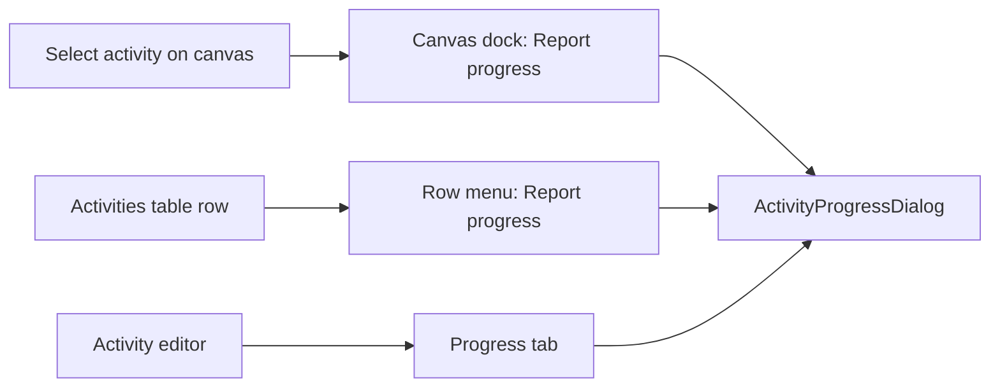

# Feature Spec: Progress-entry convergence — an object action belongs on the object

- **Status:** Draft — awaiting product-owner approval
- **Author(s):** Claude Code (from a product-owner observation, 2026-08-13)
- **Date:** 2026-08-13
- **Tracking issue / epic:** _(none yet)_
- **Roadmap link:** _(to add under the plan-workspace thread on approval)_
- **Related ADR(s):** ADR-0031 (toolbar registry & command taxonomy), ADR-0059 §4
  (the Gantt ships read-only), ADR-0082 (omit vs shade), ADR-0090/0091 (the command
  surface's width and its vocabulary), ADR-0092 (the canvas dock). Proposes **ADR-0093**.

---

## 1. Business understanding

### Problem

**`Report progress` is the only action in the plan workspace that exists twice**, and the two
copies are indistinguishable in function, permission and precondition:

|              | Command surface                              | Canvas dock                 |
| ------------ | -------------------------------------------- | --------------------------- |
| Item id      | `update-progress`                            | `progress`                  |
| Declared     | `tsld-toolbar-items.tsx:1814`, wired `:2565` | `selection-actions.tsx:378` |
| Label        | `Report progress…`                           | `Report progress`           |
| Enabled when | `canProgress && selectedActivity != null`    | `canReportProgress`         |
| Pen-gated    | no                                           | no                          |
| Opens        | `ActivityProgressDialog`                     | `ActivityProgressDialog`    |

The dock item's own comment states the relationship — it is gated _"mirroring the toolbar's
Update-progress command's `canProgress` gate"_ — so the second copy was added knowingly, as an
entry route (`VITE_ENTRY_ROUTES`), and the first was never revisited.

**The duplication is unique to this action, established by enumeration rather than impression.**
Four command-surface items are selection-gated — `float-paths` (`:2195`), `add-note` (`:2353`),
`clear-visual-placement` (`:2389`), `update-progress` (`:2573`). Only the last has a twin on the
dock. In the other direction, none of the dock's eleven items — `open-logic`, `progress`,
`resources`, `steps`, `edit`, `duplicate`, `duplicate-band`, `dissolve`, `delete`,
`zoom-to-selection`, `isolate-logic` — has a twin in the command surface **except** `progress`.

### Why now

Three things converged this month and none of them existed when the toolbar item was wired:

1. **ADR-0092 docked the selection bar.** While the bar floated, the two copies sat in physically
   separate places and each looked right alone. Docked into the Activities handle row, they are
   two rows of the same screen, and the redundancy is visible — which is how the product owner
   found it.
2. **The recorded justification for the toolbar copy has been satisfied elsewhere.**
   `docs/specs/workspace-layout/design.md:451` gives the reason it sits inline on Row 2:
   _"a Contributor's primary action must not be buried."_ That reason is sound — a Contributor
   cannot edit anything, so progress is their only action and a command surface of refusals is a
   bad screen — and the dock item now serves it **better**, being on the object and appearing under
   exactly the same condition.
3. **Row 2 has been fighting for width across two epics** (ADR-0090 M2, ADR-0091 M7) and is still
   the constrained row at 1646.

### Users

- **Contributors** (report progress; cannot edit) — the persona the toolbar copy was placed for.
- **Planners / Org Admins** — hold both routes today.
- **Viewers** — see the toolbar copy shaded with a reason, and the dock copy shaded with the same
  reason, twice.

### Primary use cases

1. A Contributor selects an activity on the diagram and reports progress against it.
2. A Contributor works from the activities table and reports progress from the row menu.
3. A planner in the Gantt view selects a bar and wants to act on it.

### Expected outcomes

- One activity action, one place, with the same reasoning applied to whatever is added next.
- One rung removed from Row 2's degradation ladder.
- A plural-selection inconsistency (§2 "Edge cases") removed structurally rather than patched.

### Success criteria

- Exactly one command-surface route and one object route to `ActivityProgressDialog` per surface,
  asserted structurally, not by reading.
- No persona loses the ability to report progress on any surface (§3 route census).
- Row 2's label count at 1646 is **measured** before and after — see the Open question below, and
  note that this spec does **not** claim a gain.

### Open questions

- **Q1 — Does the Contributor-in-Gantt regression need mitigating?** Removing the toolbar item
  leaves a Contributor in the Gantt view reaching progress only through the activities table row
  menu, and that panel is collapsed by default on this surface
  (`plan-workspace-toolbar.tsx:282`). This is a real cost and it is the product owner's call, not
  an implementation detail. §4 states the recommendation and the alternative.
- **Q2 — Should the two remaining selection-gated write affordances follow?** `add-note` and
  `clear-visual-placement` are also reachable from a Gantt selection, and the Gantt ships
  **read-only by design** (ADR-0059 §4: _"The first ship is read-only … Editing is a later,
  separately-gated milestone"_). This spec **does not** fold them in — it names the finding and
  proposes it as follow-up, because the argument for removing `update-progress` stands on the
  duplication alone and should not be widened to carry an unrelated one.

---

## 2. Functional requirements

### User stories & acceptance criteria

**US-1 — As a Contributor, I report progress from the object I selected.**

- Given I select an activity on the diagram, when the dock renders, then it offers
  `Report progress`, enabled.
- Given I lack `canReportProgress`, then the dock item is **shaded with its reason**, not hidden
  (ADR-0082: shut by a role the reader can be told about).

**US-2 — As any user, the command surface does not offer me an action on my selection.**

- Given an activity is selected, when I read Row 2, then there is no `Report progress` item there.
- Given the registry, then no item is both selection-gated and duplicated on the dock — asserted
  by a structural test, so the next such item fails CI rather than a review.

**US-3 — As a Contributor working in a table, my route is unchanged.**

- The activities-table row menu keeps `Report progress` (`ActivitiesTable.tsx:356`), byte-for-byte.
- The activity editor's Progress tab is unchanged.

**US-4 — As a planner with several activities selected, nothing offers to act on one of them.**

- Given ≥ 2 activities selected, then no surface offers `Report progress`, because no surface can
  say which activity it would act on.

### Workflows

The command surface is absent from this diagram after the change, and that is the whole change.

### Edge cases

**E-1 — Plural selection (a defect this removes for free).** ADR-0092 added a guard so a plural
selection gets the plural bar and only the plural bar (`TsldPanel.tsx:1337`). The command-surface
item has no such guard, and the host's selection state is the **primary id**:
`selectedId = selection.primaryId` (`TsldPanel.tsx:563`) → `onSelectionChange?.(selectedId)`
(`:1538`) → `setSelectedActivityId(id)` (`use-plan-workspace-model.ts:312`) → the item's
`isEnabled: ctx.canProgress && ctx.selectedActivity != null` (`tsld-toolbar-items.tsx:2573`) is
therefore **true**. With three bars selected the dock shows the bulk bar and Row 2 offers an
enabled `Report progress` that acts on the primary, with nothing on screen naming which.

> **Evidence status (ADR-0076 §19.10): this is a code-path derivation across four files, not an
> observation.** It has not been driven in a browser. M0-T1 exists to confirm or refute it, and
> the decision does not depend on it — the duplication argument stands either way. If it is
> refuted, the finding is withdrawn in place rather than deleted.

**E-2 — A deleted-elsewhere selection.** The toolbar item gates on the _resolved_ row so a stale
id cannot open an empty dialog (`:2570`, "U3"). The dock item resolves the activity the same way
(`TsldPanel.tsx:1338`), so the protection is not lost with the item.

**E-3 — Gantt view.** The command surface serves both views; the dock's selection bar is built
inside `TsldPanel` and so is canvas-only; Gantt rows have no row menu at all
(`GanttPanel.tsx:710` — clicking selects, and that is the entire row interaction). After the
change a Gantt selection has no object action. See §4 and Q1.

### Permissions

Unchanged in every direction. `canReportProgress` is Contributor-and-above and **not** pen-gated
(the notes/progress precedent, ADR-0046/0060). This feature removes an entry point; it changes no
gate, no role and no server-side check.

### Validation rules / error scenarios

None. No new input, no new request, no new failure mode. The only removable behaviour is a button.

---

## 3. Technical analysis

### Route census — every path to `ActivityProgressDialog`

| #   | Route                                       | Canvas view | Gantt view       | Survives?   |
| --- | ------------------------------------------- | ----------- | ---------------- | ----------- |
| 1   | Command surface `update-progress`           | yes         | yes              | **removed** |
| 2   | Canvas dock `progress`                      | yes         | no (canvas-only) | kept        |
| 3   | Activities-table row menu `Report progress` | yes         | yes              | kept        |
| 4   | Activity editor → Progress tab              | yes         | yes              | kept        |

Route 3 is what makes route 1's removal not a dead end in the Gantt: the activities panel renders
outside the view conditional (`plan-workspace-toolbar.tsx:1012` and `:1105` are the two _layout_
branches; the view switch is the separate `surface` expression at `:582`). It is collapsed by
default on this surface, which is the cost Q1 asks about.

### Blast radius — measured, not estimated

`grep -rln "update-progress\|Update progress\|Report progress…" apps/web/src apps/web/e2e*` returns
**10 files**, of which 4 are tests:

| File                                        | Change                                                                |
| ------------------------------------------- | --------------------------------------------------------------------- |
| `tsld-toolbar-items.tsx`                    | delete `updateProgressShape` + both registry branches                 |
| `use-tsld-toolbar-context.tsx:521`          | delete `openProgress` if it has no other consumer                     |
| `tsld-toolbar-context.ts:248`               | delete `openProgress` from the context type                           |
| `use-plan-workspace-model.ts`               | leave — `:2003` is the **dock's** opener, a separate seam             |
| `config/env.ts`                             | leave — `VITE_TOOLBAR_QUICK_WINS` still gates `add-note` + `comments` |
| `activity-editor-intent.ts`                 | leave — the shared intent, not this entry point                       |
| `ellipsis-convention.structural.test.ts:65` | `['calendar', 'update-progress']` → `['calendar']`                    |
| `tsld-toolbar-quick-wins*.test.tsx` (×3)    | drop the item's cases; keep the file's other subjects                 |

**No e2e journey references it.** `grep -rn "Report progress" apps/web/e2e*` returns hits only in
`e2e/activities.spec.ts` and `e2e-activity-editor/` — both the **table row menu** (route 3), which
this change does not touch. That is a fact worth stating plainly: the item being removed has never
been driven end-to-end, which is ADR-0081's subject in miniature.

### Dependencies

None added or removed. Frontend-only. **The CPM engine is not imported and no migration runs**, so
the ADR-0034 recalculation parity gate is untouched by construction.

---

## 4. Solution design

### The rule, and why this needs an ADR at all

Removing one button is not architecturally significant. The **discriminator** is, because it will
decide where the next item goes, and ADR-0091's whole subject was that the command surface has no
vocabulary for things that are not commands. This is the mirror image: an **object action wearing
a command's clothes**. So the proposed rule, in the shape ADR-0082 used for omit-vs-shade:

> **An action whose subject is the selected object belongs on the object's own surface.**
> The command surface carries actions whose subject is the **plan or the view** — recalculate,
> zoom, export, switch mode. If an item's `isEnabled` has to consult the selection, it is an
> object action and the dock is its home.

That rule is testable, which is the point: a structural test asserts that no registry item both
consults the selection and shares an id-or-label with a dock item.

### Options considered

|       | Option                                                                           | Verdict                                                                                                                                                                                                                                                                                                             |
| ----- | -------------------------------------------------------------------------------- | ------------------------------------------------------------------------------------------------------------------------------------------------------------------------------------------------------------------------------------------------------------------------------------------------------------------- |
| **A** | Remove the command-surface item. Gantt keeps route 3.                            | **Recommended**                                                                                                                                                                                                                                                                                                     |
| **B** | Remove it **and** give Gantt rows a row menu mirroring the table's `actionsFor`. | **Rejected for now** — it puts write actions on a surface ADR-0059 §4 shipped read-only by decision. That is an ADR-0059 M5 conversation, not a side effect of tidying a duplicate.                                                                                                                                 |
| **C** | Lift the object half of the dock bar to workspace level so it serves both views. | **Right long-term, out of scope.** `plan-workspace-toolbar.tsx:566` already says _"Selection is workspace state, not view state"_, and the dock outlet is already workspace-level — but `zoom-to-selection` and `isolate-logic` are canvas concepts, so this means splitting the bar. A real epic, not a milestone. |
| **D** | Keep both.                                                                       | **Rejected** — no reader can tell which to use, and the two will drift; ADR-0062 records exactly that failure mode for a tab and a dialog rendering the same subject.                                                                                                                                               |

**On the Gantt asymmetry.** It looked at first like a reason to keep the item — the only
selection-driven route in that view. On reading ADR-0059 §4 it inverts: the Gantt is read-only by
decision, so a write affordance reachable from a Gantt selection is a hole in that story, not a
feature of it. Removing this item makes the read-only claim _more_ true. It does not make it true,
because `add-note` and `clear-visual-placement` remain — hence Q2, named rather than folded in.

### Component changes

- `tsld-toolbar-items.tsx` — one item and its shape deleted.
- `use-tsld-toolbar-context.tsx` / `tsld-toolbar-context.ts` — `openProgress` deleted if unused.
- One new structural test asserting the rule above.
- No new component. No component gains a prop.

### Database / API changes

None.

### Implementation approach

No feature flag, for ADR-0061's reasoning: this removes a control and adds no capability, so there
is no second product to maintain and nothing to roll back to that is not one revert. It is also
consistent with ADR-0088 D1 — a `VITE_` flag buys the operator no rollback anyway, because Vite
inlines the constants at build time and the publish workflow passes none. The mitigation is a
commit boundary: the removal lands as one revertible commit.

---

## 5. Links

- ADR-0031 — toolbar item registry & command taxonomy
- ADR-0059 §4 — the Gantt ships read-only
- ADR-0082 — omit vs shade, and a reason the reader can act on
- ADR-0090 / ADR-0091 — the command surface's width, and its missing vocabulary
- ADR-0092 — the canvas dock
- `docs/specs/workspace-layout/design.md:451` — the recorded reason for the Row 2 placement
- `docs/TOOLBAR_ROADMAP.md:50` — the item's roadmap row
