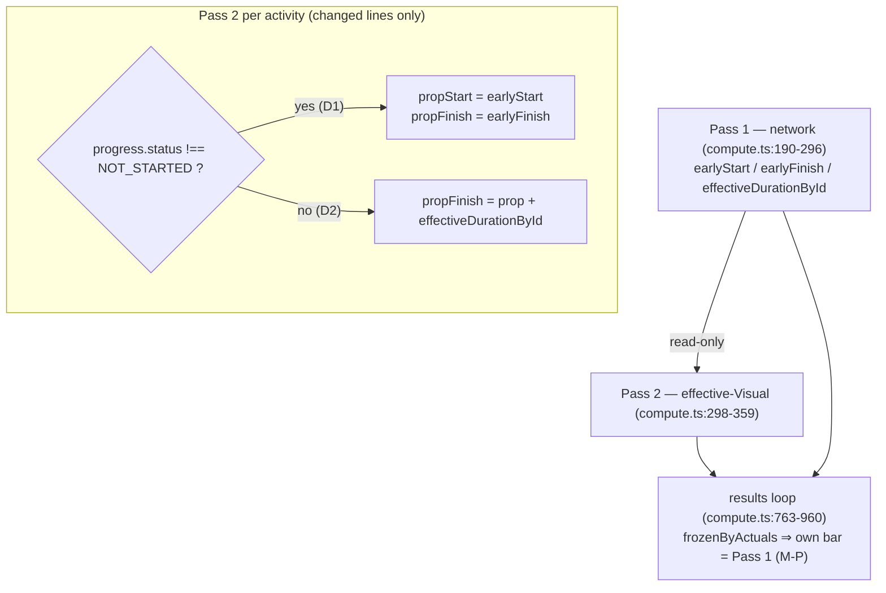
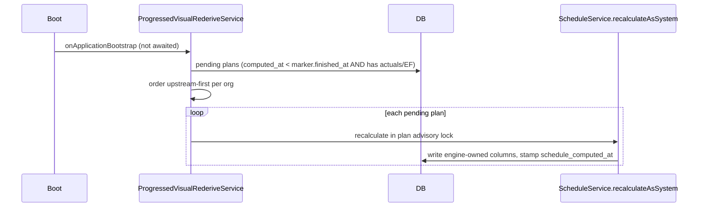

# Feature Spec: A successor of progressed work is drawn where the network puts it

- **Status:** Approved — by the product owner, 2026-09-30 ("Fix it first"). Build and release this on
  its own, before `docs/specs/placed-load-basis/` (#413) continues past its M0.
- **Author(s):** feature-analyst (for the product owner)
- **Date:** 2026-09-30
- **Tracking issue / epic:** `docs/TECH_DEBT.md` #421
- **Roadmap link:** none. This is a defect in ADR-0148 D0. It blocks #413's parity claim.
- **Related ADR(s):** **no new ADR.** An **amendment to ADR-0148** is required (§4.6). It extends D0
  from an activity's own dates to what that activity passes to its successors, and it makes D2's
  fourth parity clause true. ADR-0035 is **not** amended (§4.6). This follows the precedent of ADR-0155 D9 /
  `CrossPlanRederiveService` for stale engine-owned columns, and ADR-0088 D1 (no flag).

**Why this has a spec rather than a register row (ADR-0105):** it changes a documented engine
semantic (ADR-0033 D4's `propFinish`, as amended by ADR-0148). It moves bars on live plans that have
progress. It proposes a boot-time re-derivation that needs a marker migration file.

---

## 1. Business understanding

### Problem

Measured 2026-09-30 (`compute.visual.spec.ts:538-576`, three `it.fails`; `docs/specs/placed-load-basis/m0-measurement.md`).
The plan calendar is Mon–Fri, the data date is Mon 2026-01-05, the actuals are before the data date,
and `B` is a one-day FS successor. Nothing is placed.

| Predecessor `A`                                              | `B` early start | `B` drawn start |
| ------------------------------------------------------------ | --------------- | --------------- |
| complete, 5 d planned, actuals 12-29 to 12-30                | 2026-01-05      | 2026-01-12      |
| in progress, 10 d planned, 2 d remaining, started 12-29      | 2026-01-07      | 2026-01-19      |
| not started, 10 d planned, expected finish 01-06 (option on) | 2026-01-07      | 2026-01-19      |

**Cause, read in the code.** Pass 2 is `compute.ts:298-359`. It computes the finish it passes to
successors as `visualPropFinish = advanceWorking(cal, prop, duration)` (`:351`), where
`duration = activity.durationMinutes` (`:312`) is the **planned** duration and `prop` is Pass 2's own
start (`:348`). Pass 1 (`:190-296`) finishes an activity differently:

- a **complete** activity at its actual finish (`:195-201`);
- an **in-progress** activity after its **remaining** work, counted from `workStart`. `workStart` is
  floored at the data date (§2), the resume date (§4) and, in Actual Dates mode, the actual start. It
  honours only the predecessors that the recalc mode retains (`:213-235`, `:282-288`);
- a **not-started** activity with Expected Finish on, after its **resized** span (`:263-281`, `:293-294`).

M-P fixed the **progressed activity's own bar** in the results loop: `frozenByActuals`, `:877`, and
`:943-948`. It did not fix what that activity **passes on**, because the results loop runs after Pass
2 has already propagated. Pass 2 also passes on its own start (`visualPropStart`, `:350`), which is
at or after the data date, rather than the frozen actual start. So SS and SF successors of a started
activity are also affected, which the three cases above do not show (§2.3).

The register row says bars are drawn "later". That is the common case, not the only one. A predecessor
whose resume date is far past the data date, or whose remaining work is longer than its planned
duration, or whose expected finish is later than planned, makes Pass 1's finish **later** than what
Pass 2 propagates today. So the fix moves some successors **later** as well (§2.3, R5).

### Users

- All roles that read a schedule: Org Admin, Planner, Contributor and Viewer, and an External Guest
  on a share link (the guest reads the same persisted columns, ADR-0163). Nobody writes anything new.

### Primary use cases

1. A planner reports progress and the unplaced work after it stays where the network puts it.
2. A reader of the programme header, the landing overview or a cross-plan successor sees a finish that
   agrees with the network where nobody has placed anything.

### Expected outcomes

- On a plan with **no placement**, every activity's drawn dates equal its early dates, including plans
  with progress and plans with Expected Finish on. This is ADR-0148 D2's fourth clause, which is false
  today for successors of progressed work.

### Success criteria

- **SC-1.** The three `#421` cases pass as ordinary `it` (`compute.visual.spec.ts:551,557,568`).
- **SC-2.** For an unplaced plan, `visualEffective* === early*` holds for every activity, and it
  holds by construction (§4.2). A fixture that includes successors of every progress shape proves it.
- **SC-3.** Pass 1 is byte-identical. `compute.spec.ts` and every `__snapshots__` file are unchanged.
  The ADR-0034 conformance matrix does not move.
- **SC-4.** A plan with no actuals, and without Expected Finish in use, produces byte-identical
  `computeSchedule` output (§3.1).
- **SC-5.** Existing plans are corrected without anyone editing them (§4.4), and each is corrected
  once.

### Open questions

None blocking. One default the product owner may want to overrule is D4, which adds a marker
migration so that existing plans can be corrected at boot. See §4.4.

---

## 2. Functional requirements

### 2.1 The rule (D1–D3)

**D1: A progressed activity passes on Pass 1's instants.** "Progressed" means
`progress.status !== 'NOT_STARTED'`, which is `actualStart != null || actualFinish != null`
(`progress.ts:84-86`). That is exactly the predicate `frozenByActuals` uses at `compute.ts:877`. For
such an activity, Pass 2 sets:

```
visualPropStart(a)  = earlyStart(a)    // Pass 1's map: the actual start (or the computed start, for DONE_NO_START)
visualPropFinish(a) = earlyFinish(a)   // Pass 1's map: actual finish | workStart + remaining | workStart + EF-resized remaining
```

This is "defer to Pass 1", not "re-derive what Pass 1 derived". It is the same choice M-P made for
the activity's own bar (`:920-942`), for the same reason: a placement cannot be honoured against a
reported actual. It covers, with no extra branches:

- complete (§1, §6), in progress (§2), suspended/resumed (§4), stopped with zero remaining (§5),
  Expected Finish on an in-progress activity (§9), and all three recalc modes (§1). The mode
  decides Pass 1's `workStart`, and Pass 2 now inherits it;
- a **placed and progressed** predecessor. Its placement is already inert for its own bar
  (`compute.visual.spec.ts:473-498`), so it is inert for its successors too. **Today it pushes
  successors from the placement.** This is the largest single movement on the estate (R4).

**D2: A not-started activity passes on its placed start plus Pass 1's span.**

```
visualPropFinish(a) = span(a) === 0 ? prop(a) : advanceWorking(cal, prop(a), span(a))
span(a)             = effectiveDurationById.get(a)   // compute.ts:281 — the EF-resized span, else durationMinutes
```

When Expected Finish is off or absent, `span === durationMinutes`, so the line is unchanged. When it is on, the
propagated span becomes the same span the bar is **drawn** with. `vSpanOwn = efOwn − esOwn` is Pass 1's span
(`compute.ts:805-806`, M-P). So a successor abuts the bar the planner sees.

**D3: Nothing else in Pass 2 changes.** `visualDisplayStart`, the conflict map, the drift map, the
external and constraint clamps, the LOE skip (`:316`) and the finish-milestone placement (`:341-346`)
stay as they are. So do the results loop, `remainingFloatMinutes` and `LATER_THAN_BOUND`.

### 2.2 Dependency types, lags, milestones

- **All four types** go through `forwardLowerBound(edge, predPs, predPf, …)` (`edge-bounds.ts:35-61`).
  FS and FF read `predPf`, and SS and SF read `predPs`. Under D1 both come from Pass 1, so every
  type gets exactly the bound Pass 1 computes (`compute.ts:219-221`). That includes the successor-side
  `-successorDuration` for FF and SF, because both passes pass the successor's planned `duration`.
- **Lags** are applied by the same `applyLag` on the same lag calendar. A negative lag is
  still truncated at the data date, because Pass 2 floors at `dataDateAbs` (`:313`) as Pass 1 does
  (`:204`; ADR-0035 §3).
- **Milestones.** A start milestone with an actual start, or a finish milestone with an actual
  finish, falls under D1 and passes on its Pass 1 instants. That includes a finish milestone's
  end-of-day actual (`progress.ts:91-97`, ADR-0155). A not-started milestone has `span 0` under D2,
  so it is unchanged.
- **LOE and WBS summary.** An LOE never propagates (`:316`), and a summary is never an edge endpoint
  (ADR-0038). D2 reads `effectiveDurationById`, which is `0` for both. Neither changes.

### 2.3 User stories and acceptance criteria

| #    | Given (nothing placed unless stated)                                                             | Then                                                                                |
| ---- | ------------------------------------------------------------------------------------------------ | ----------------------------------------------------------------------------------- |
| AC1  | The three #421 cases                                                                             | `B.visualEffectiveStart === B.earlyStart` (01-05, 01-07, 01-07)                     |
| AC2  | An in-progress `A` (actual start 12-29), SS +3 d to `B`                                          | `B` is drawn at its early start (01-05, data-date floor), not 01-08                 |
| AC3  | A complete `A`, FF to `B`; an in-progress `A`, SF to `B`                                         | `B` is drawn at its early start                                                     |
| AC4  | Chain `A` (complete) → `B` → `C`                                                                 | `C` is drawn at its early start, so the correction is transitive                    |
| AC5  | An in-progress `A` **placed** at 01-20, FS to `B`                                                | `B` is drawn at its early start. The placement does not push (D1)                   |
| AC6  | An in-progress `A`, resume 02-02, 2 d remaining, 3 d planned, FS to `B`                          | `B` is drawn **later** than today (02-04, not 01-08): the fix goes both ways (R5)   |
| AC7  | Out-of-sequence `R1 → R2 (started) → R3` under Retained Logic, and again under Progress Override | `R3` is drawn at its early start in both, and the two plans still differ            |
| AC8  | A complete `A`, FS to `B` **placed** at 01-06                                                    | `B.visualConflict` is **false** (it was `EARLIER_THAN_LOGIC` against 01-12)         |
| AC9  | Expected Finish on, not-started `A` placed 5 d late, FS to `B`                                   | `B` starts where `A`'s **drawn** bar ends (the placement plus the resized span, D2) |
| AC10 | Any plan with no actuals, and Expected Finish off or unused                                      | `computeSchedule` output is byte-identical to before (SC-4)                         |

### Edge cases

- **DONE_NO_START** (a complete activity with no actual start; reachable in the engine, refused at
  the API by N06). D1 passes on Pass 1's computed start and its actual finish. That is "parity means
  reproducing that", as M-P recorded at `:932-939`.
- **Progress Override / Actual Dates** drop predecessors only for an **in-progress** successor's
  remaining work (`:209-218`). That successor's own bar and what it passes on are now Pass 1's. A
  not-started successor honours every predecessor in both passes. So the modes agree.
- **Cross-calendar edges.** Unchanged. Each pass already uses the successor's own calendar and the
  edge's lag calendar.

### Permissions

No new permission, endpoint or write. The re-derivation (§4.4) runs as the system with no principal,
which is the ADR-0155 D9 / `recalculateAsSystem` precedent. **Pen (ADR-0028):** no new structural write. The
boot recalculation writes engine-owned columns and asserts no pen, as the precedent does. A planner
holding the pen sees dates move.

### Validation rules / error scenarios

No new input. A re-derivation failure on one plan is logged and retried at the next boot. It never
fails the boot (precedent).

---

## 3. Technical analysis

### 3.1 The recalc parity gate

There is **no new scheduling input**, so the gate holds in this form:

- **Pass 1 is untouched.** Pass 2 reads Pass 1's maps and never writes them (`:298-300`). `early*`,
  `late*`, float, criticality, driving edges and the project finish are byte-identical for every
  input. The goldens do not contain Pass 2 fields: a grep for `visual` under `engine/__snapshots__`
  finds 0 matches, and the same grep under `packages/engine-conformance` finds 0 files. So
  `compute.spec.ts`, the snapshots and the conformance matrix cannot move.
- **Pass 2 is byte-identical when no activity is progressed and Expected Finish is not applied.**
  D1 never fires in that case, and D2's `span` is `durationMinutes` because `efResizedMinutes` is
  `null` (`:263-281`).
- **After the fix, "unplaced ⇒ Pass 2 = Pass 1" holds by construction** (§4.2). It no longer rests on
  the fixture.

### 3.2 What consumes the visual dates (and so moves)

| Consumer                                                                                                                    | Effect                                                                                                                                                                                                                                                         |
| --------------------------------------------------------------------------------------------------------------------------- | -------------------------------------------------------------------------------------------------------------------------------------------------------------------------------------------------------------------------------------------------------------- |
| Persisted `activities.visual_effective_start/_finish` (`schema.prisma:1309-1310`, written `schedule.repository.ts:795-909`) | Changes on each plan's next recalculation. §4.4 covers the plans nobody touches                                                                                                                                                                                |
| Canvas, Gantt, print, CSV/PNG/PDF (the web reads the columns; `apps/web/src/lib/bar-dates.ts`)                              | Bars move. **There is no web copy of Pass 2.** A grep of `apps/web` for `advanceWorking`, `forwardLowerBound` and `visualPropFinish` finds only comments (`snap.ts:22,43`)                                                                                     |
| Placed project finish (`placed-finish.ts:17-39`, the header, the landing, the recalc response)                              | Can move earlier or later on plans with progress                                                                                                                                                                                                               |
| Cross-plan forward bound (ADR-0148 D10; `cross-plan-adapter.ts:346-347`)                                                    | A downstream plan's **Pass 1** input changes. The downstream plan reads stale (ADR-0045 §5) until it is recalculated                                                                                                                                           |
| `visualConflict` / `EARLIER_THAN_LOGIC`                                                                                     | Can clear, or newly fire, for placed successors (AC8). The ADR-0094 conflict cycle count changes                                                                                                                                                               |
| Share view (guest DTO), schedule health, interchange layout export                                                          | Read the columns, so they follow                                                                                                                                                                                                                               |
| Baselines / revisions (`baseline.repository.ts:358-383` copies `visual_effective_*` → `placedStart/placedFinish`)           | **Not rewritten.** They are snapshots (ADR-0025). A placed-basis variance against a baseline taken before the fix shows the correction as variance on affected rows. Early-basis variance does not move                                                        |
| Drift, `remainingFloatMinutes`                                                                                              | Unchanged. Both are measured against Pass 1's `earlyStart` (`:355-358`, `:959`)                                                                                                                                                                                |
| Levelling (`level.ts`)                                                                                                      | Unchanged. It reads no Pass 2 field (a grep of non-spec engine files for `visual` matches only `compute.ts` and `types.ts`)                                                                                                                                    |
| `check:engine-parity`                                                                                                       | Inactive (`scripts/engine-parity.json:3`, `"active": false`). This work **must not** activate it, because it changes the engine on purpose                                                                                                                     |
| Seed catalogue                                                                                                              | `plan:capability-retained-logic` already shows the defect. `R2` is in progress with 4 d of its 5 d planned remaining, FS to `R3` (`apps/seed-cli/src/capabilities/progress.ts:139-186`), so `R3` is drawn one working day late today. No seed change is needed |

### 3.3 Dependencies

- `docs/specs/placed-load-basis/` M0-T0.2/T0.3 wait on this fix (m0-measurement.md:22-23).
- The `CrossPlanRederiveService` ordering (`orderPlansUpstreamFirst`) is reused in §4.4.

---

## 4. Solution design

### 4.1 Architecture overview



### 4.2 Why parity now holds by construction

This is an induction over `graph.order` for a plan with no `visualStart`. It covers every non-LOE,
non-summary activity:

1. **Progressed:** D1 makes both propagated instants Pass 1's.
2. **Not started:** if every non-LOE predecessor's propagated instants equal Pass 1's, then Pass 2's
   `logicEarliest` is built from the same floor (`:313` against `:204`), the same bounds, the same
   external clamp and the same constraint clamp (`:322-338` against `:243-250`), and it is rolled
   forward in the same way. So `prop === workStart === earlyStart`, and D2 makes `propFinish` equal
   `earlyFinish` (`:292-294`).

The results loop already maps an unplaced not-started activity onto Pass 1's span (M-P, `:786-806`).
So `visualEffective* === early*` follows.

### 4.3 Implementation shape (for the builder, not code)

- Hoist the predicate into one named helper (for example `isFrozenByActuals(progress)`) that both
  `:877` and Pass 2 use, so the two cannot drift apart. `resolveProgress` is already computed once per
  activity (`:168-171`).
- In Pass 2, branch before the `visualPropStart`/`visualPropFinish` sets (`:350-351`). Leave
  `visualDisplayStart`, the conflict map and the drift map as they are (D3).
- Rewrite the Pass 2 header comment (`:298-303`) and cite this spec.

### 4.4 Existing plans: re-derive once at boot (D4)

The engine-owned columns of a plan nobody edits keep the defective dates indefinitely. The status bar
offers Recalculate only on a plan it knows is stale (ADR-0155 D9, `finish-milestone-rederive.service.ts:16-23`).
Default: a **`ProgressedVisualRederiveService`** modelled on `CrossPlanRederiveService`
(`cross-plan-rederive.service.ts:23-130`):

- **Pending:** a live plan with `planned_start`, whose `schedule_computed_at` is earlier than the
  marker migration's `finished_at`, **and** which has a live activity with `actual_start` or
  `actual_finish`, or has `use_expected_finish_dates` set and a live activity with `expected_finish`.
  Recalculating stamps `schedule_computed_at`, so each plan runs once.
- **Order:** upstream first per organisation, using `orderPlansUpstreamFirst`, because D10 carries
  the changed placed finish into downstream plans. A downstream plan that is not pending reads stale,
  which is a visible flag rather than a silent wrong date (the precedent's stated residue).
- Not awaited, never fails the boot, no principal, no pen, not audited (ADR-0072).



### 4.5 Database, API and component changes

- **Database: no schema change.** No model, column, index or constraint is added. **There is one
  marker-only migration** (for example `…_progressed_predecessor_visual_marker`). It is a
  `migration.sql` with no DDL, and it exists so that `_prisma_migrations.finished_at` can serve as D4's
  marker. That is how both precedents key their marker (`cross-plan-rederive.service.ts:15,110-113`).
  Under CLAUDE.md §19.3 **it still goes through database-architect**, which decides the file's exact
  contents. It changes the migration count that `check:counts` gates (71 in CLAUDE.md §1 and §4).
- **API:** no contract change. The response fields are the same, with different values.
- **Web:** no change.

### 4.6 ADR impact

- **ADR-0148: amend it; do not supersede it.** Add "Amendment 1 (2026-09-30, #421)". It says that D0
  taught Pass 2 Pass 1's branches for an activity's **own** dates only, and that the propagated pair
  (ADR-0033 D4's `propStart`/`propFinish`) now follows D1 and D2. It also says that D2's fourth clause
  ("a plan with no placement renders identically under both bases **including** progress") was false
  for successors of progressed work until this amendment, and is now true by §4.2. It updates the
  ADR-0033 D4 formula reference (`0033-…md:90-99`, where `propFinish` implicitly used `Dₐ`).
  CLAUDE.md §16's line becomes "_(Accepted; amended by #421)_".
- **ADR-0035: no amendment.** Its §1, §2, §4, §5, §6 and §9 define Pass 1, and Pass 1 does not
  change. This fix makes Pass 2 conform to them. It adds no semantic.
- **ADR-0033: no separate edit.** ADR-0148 already amends it, and the amendment above records the
  formula change.

### 4.7 Approach and alternatives

- **Chosen: D1 (defer to Pass 1) and D2 (Pass 1's span).** This is one predicate, shared with the
  results loop, and parity holds by construction.
- **Re-derive the remaining work inside Pass 2 from the visual predecessors** (a full mirror of
  `:203-295`). Rejected. The progressed activity's own bar is Pass 1's (`:943-948`), so successors
  would be pushed from a finish that is not the one drawn. That is the inconsistency ADR-0033 SQ-b
  exists to prevent. It would also duplicate three recalc modes, resume and Actual Dates.
- **D2 alternative: recompute the Expected Finish resize from Pass 2's `prop`,** which would honour the
  target date even when a placement upstream pushes the activity. Rejected by default. The bar is
  drawn with Pass 1's span (M-P), so the successor would not meet the drawn finish. The two agree
  whenever nothing upstream is placed.
- **D4 alternative: no re-derivation, and correct each plan on its next edit.** No migration file is
  needed. Rejected by default. An untouched plan, including one a guest is reading, stays wrong
  indefinitely, which is what ADR-0155 D9 refused. **If the product owner prefers this, M2 is dropped
  and the migration with it.**
- **Rewrite baseline and revision snapshots.** Rejected. ADR-0025 says a snapshot records what was
  shown at the time.
- **No `VITE_` flag** (ADR-0088 D1). The rollback is a commit boundary. There is no new entry point,
  so ADR-0081's journey is not triggered. The product-level proof is the API e2e (plan M2) and the
  `capability-retained-logic` playbook row.

---

## 5. Risks

| #   | Risk                                                                                                                                          | Mitigation                                                                                                                                                   |
| --- | --------------------------------------------------------------------------------------------------------------------------------------------- | ------------------------------------------------------------------------------------------------------------------------------------------------------------ |
| R1  | Existing assertions encode the defective values                                                                                               | #421 says no test had a successor of a started activity. Confirm by running `pnpm --filter @repo/api test` before editing, and list every red test in the PR |
| R2  | Cross-plan twin conformance (`conformance/cross-plan-twin.ts:399-400`) reads predecessor visual dates                                         | Both sides run the same Pass 2, so they move together. Run the suite in M1                                                                                   |
| R3  | A downstream programme plan reads stale after the boot re-derive                                                                              | Upstream-first ordering. Any residue is a visible stale flag (the precedent)                                                                                 |
| R4  | Placed **and** progressed predecessors stop pushing, so the largest moves are on plans whose SNETs ADR-0148 D6 converted to placements        | Say so in the changeset. It is correct: the actual wins (M-P, `:940-941`)                                                                                    |
| R5  | Some successors move **later** (a resume date after the data date, remaining work longer than planned, an Expected Finish later than planned) | AC6 pins it. The changeset says "moves", not "moves earlier"                                                                                                 |
| R6  | Placed-basis variance against a baseline taken before the fix shows the correction as variance                                                | Say so in the changeset. Early-basis variance does not move                                                                                                  |

## 6. Links

- `docs/TECH_DEBT.md` #421; `docs/specs/placed-load-basis/m0-measurement.md`; ADR-0148 D0/D2/D10;
  ADR-0033 D4; ADR-0035 §1–§9; ADR-0155 D9; `apps/api/src/modules/schedule/cross-plan-rederive.service.ts`.
