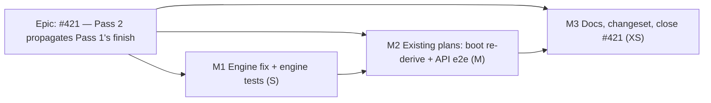

# Implementation Plan: A successor of progressed work is drawn where the network puts it

- **Feature spec:** [`./feature-spec.md`](./feature-spec.md)
- **Status:** Approved — by the product owner, 2026-09-30 ("Fix it first"). Released on its own,
  before `docs/specs/placed-load-basis/` continues.
- **Owner:** api (the engine and the schedule module). No web change.

## Breakdown

Each milestone leaves `main` releasable. The release is cut **after M3**. The product owner merges
the Version Packages PR, so a merged M1 does not ship on its own.

### Milestone M1 — Engine: Pass 2 propagates Pass 1's instants (S)

**Outcome:** spec D1–D3 are in `compute.ts`. The three `#421` cases pass as `it`. Pass 1 is
byte-identical.

- **T1.1 Red first (XS).** Run `pnpm --filter @repo/api test` on the current head and record which
  tests are green. Then write the new cases below as ordinary `it` and confirm each one is **red**
  against the unfixed engine (ADR-0110). A case that is green before the fix proves nothing about it.
  - Cover AC2–AC9 in a new `describe` block. Add FC-11b as a **new** describe, not an edit to FC-11 at
    `compute.visual.spec.ts:387-471`: it is FC-11's fixture plus a one-day FS successor for each of
    `STARTED`, `DONE` and `DONE_NO_START`, and an SS +3 d successor of `STARTED`. It asserts
    `visualEffective* === early*` over the whole map. FC-11's own assertions stay unedited (the
    ADR-0148 D2 convention).
  - Include AC10 (an unprogressed fixture with Expected Finish off) as a guard that output is
    unchanged, by deep equality against a copy captured before the fix.
- **T1.2 Fix (S).** Hoist the `frozenByActuals` predicate into one helper and use it at `:877` and
  in Pass 2. Branch before `:350-351`, per spec D1 and D2. Rewrite the Pass 2 docblock (`:298-303`)
  and cite this spec.
- **T1.3 Flip (XS).** Change `it.fails` to `it` at `compute.visual.spec.ts:551,557,568`. Update the
  describe's docblock (`:529-537`) from "the defect stands" to "the defect, fixed".
- **Tests:** engine unit tests, `compute.spec.ts` untouched, snapshots untouched, the conformance
  suite green, and the cross-plan twin conformance (`conformance/cross-plan-twin.ts`) green.
- **Risks:** R1 and R2 in the spec. If any existing assertion goes red, stop and list it. Do not
  re-baseline it silently.
- **Reviewers:** backend-performance-reviewer is not needed. The branch adds O(1) work per activity.

### Milestone M2 — Existing plans are corrected once, and the product is proven (M)

**Outcome:** a host that upgrades recalculates every affected plan once, upstream first, and the
public REST read agrees with the engine.

- **T2.1 Marker migration (XS). This goes through database-architect first, with no exceptions
  (CLAUDE.md §19.3).** It is a marker-only migration with no DDL, and the agent decides its exact
  content. Update the migration count in CLAUDE.md §1 and §4 in the same commit (`check:counts`).
  **If the product owner declines D4, drop T2.1–T2.2.**
- **T2.2 `ProgressedVisualRederiveService` (S–M).** Model it on `cross-plan-rederive.service.ts`:
  the pending query from spec §4.4, `orderPlansUpstreamFirst` per organisation, and
  `recalculateAsSystem`. Register it next to the two existing boot services. Its docblock must record
  that three boot services can recalculate one plan, and that this is harmless for the reasons at
  `cross-plan-rederive.service.ts:58-65`.
  - Unit tests: the ordering, and that a failing plan is logged and skipped. Follow the existing
    services' specs.
  - API e2e: follow `finish-milestone-date-migration.e2e-spec.ts`. A plan with progress whose
    `schedule_computed_at` is earlier than the marker is re-derived once. A plan without progress is
    not. A second run does nothing.
- **T2.3 Product half of parity (S).** Add a **new** `it` to `apps/api/test/placed-basis-parity.e2e-spec.ts`,
  with its own seed helper, so that the existing case and its code list are left alone. Add FS
  successors of `STARTED` and `DONE`, and assert through the public read that `visualEffective* ===
early*` for every row. Actuals go before the data date (the fixture's own warning at `:144-148`).
- **Tests:** `pnpm prepush`, then `scripts/e2e-local.sh api`.
- **Reviewers:** database-architect (T2.1); security-reviewer (a system recalculation with no
  principal, crossing organisations); backend-performance-reviewer (the pending query's EXISTS
  branches over `activities`, which must use an index, and the per-org adjacency load);
  devops-reviewer is optional (it is a boot-time job, as in the precedent).

### Milestone M3 — Documentation, changeset, close-out (XS)

- ADR-0148: **Amendment 1** (spec §4.6). Update the CLAUDE.md §16 line to "_(Accepted; amended by #421)_".
- `docs/TEST_PLAYBOOK.md` Progress, row "Out of sequence, Retained Logic" (`:95`): add to **Wrong**
  "`R3` drawn later than its early start — Pass 2 carrying `R2`'s planned duration instead of its
  remaining (#421)". `check:playbook` must stay green.
- `docs/TECH_DEBT.md` #421: mark it closed and cite the commits. In
  `docs/specs/placed-load-basis/m0-measurement.md`, record "decided: fixed first, #421" so that
  M0-T0.2 can resume.
- **Changeset:** `@repo/api` **patch**. Suggested text: "Fix: on plans with reported progress or
  Expected Finish, activities after started, completed or expected-finish work are now drawn where
  the schedule puts them. Previously they were drawn after the predecessor's full planned duration.
  Some bars move, most earlier and some later (resume dates, remaining work longer than planned).
  The stated project finish can change. Plans are recalculated once when the API starts. Placed-basis
  variance against a baseline taken before this release shows the correction as variance." No web
  changeset is needed.
- Run `pnpm prepush`.

## Sequencing & slices

M1 is one PR and M2 is one PR (T2.1 lands only after database-architect has signed it off). M3 can
ride with M2. There is no flag (ADR-0088 D1), and the rollback is reverting M1. A plan that M2 has
re-derived keeps its corrected dates until its next recalculation after a revert.

## Definition of Done (per task)

Code, tests (red then green), docs in lock-step, reviewer findings folded in, `pnpm prepush` run, and
`scripts/e2e-local.sh api` run for M2. Read CI with the §19.9 dedupe before merging.

## Risks & assumptions (rollup)

- **Assumption:** no existing test asserts the defective values (#421: "No test had a successor of a
  started activity"). T1.1 verifies this before any fix.
- **Risk:** the size of the day-one movement on the deployed estate is not measured. The
  `plan:capability-retained-logic` seed shows one working day on `R3`. The estate's figure would need
  an ADR-0140 staff diagnostic, which is not proposed. Recorded as unmeasured.
- Spec §5 R1–R6.
