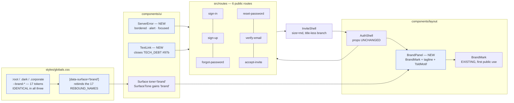
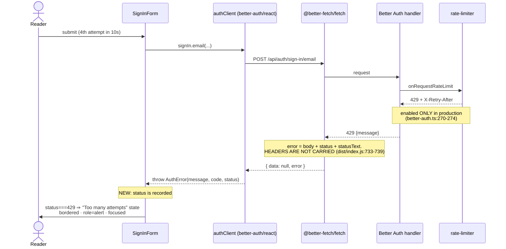
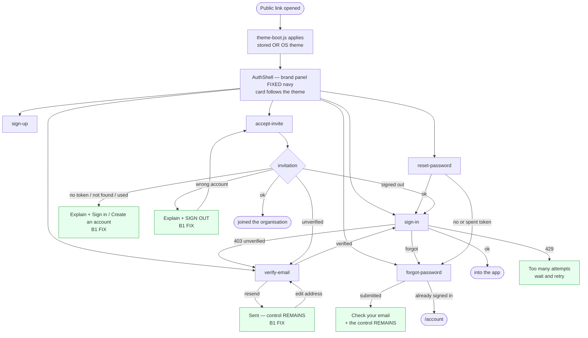

# Feature Spec: The public screens — brand surface, and the four blocking defects

- **Status:** Draft — awaiting approval
- **Author(s):** feature-analyst (consolidating a prior ui-architect and ux-reviewer pass)
- **Date:** 2026-08-06
- **Tracking issue / epic:** _(to be raised)_
- **Roadmap link:** `docs/ROADMAP.md` → Next → Product features
- **Related ADR(s):** **ADR-0077** — drafted beside this spec at
  [`../../adr/0077-public-screens-brand-surface.md`](../../adr/0077-public-screens-brand-surface.md)
  and **deliberately not yet filed** (filing it would fail `pnpm check:counts` before approval; see
  the draft's header box and plan task M0-T0). It amends the
  surface-scope mechanism of [ADR-0055](../../adr/0055-designed-chrome-and-canvas-visual-language.md);
  builds on [ADR-0074](../../adr/0074-account-recovery-verification-enforcement-and-csp.md)
  (the screens themselves and the CSP), [ADR-0051](../../adr/0051-external-guest-share-links.md),
  [ADR-0061](../../adr/0061-dialog-layout-system.md) (unflagged structural refactor precedent),
  [ADR-0076](../../adr/0076-wrong-claims-are-a-defect-class.md) (evidence rule).

---

## 0. How to read this spec, and what was checked

Stages 1–4 were substantially drafted by a prior **ui-architect** and **ux-reviewer** pass. This
document consolidates them. Per [ADR-0076](../../adr/0076-wrong-claims-are-a-defect-class.md) and
`docs/PROCESS.md` "Decision-bearing claims carry their evidence", **every load-bearing claim
inherited from that pass was re-checked against the code**, not restated. The check found the
inherited material overwhelmingly accurate and **five things wrong or overstated**, recorded in
§0.1. Each is a claim that would have changed what got built.

Nothing in this spec was taken from a summary. Where a line number appears, the file was opened.

### 0.1 Corrections to the inherited brief

| #   | Inherited claim                                                                                            | What the code says                                                                                                                                                                                                                                                                                          | Consequence                                                                                                                                                                                                                                                   |
| --- | ---------------------------------------------------------------------------------------------------------- | ----------------------------------------------------------------------------------------------------------------------------------------------------------------------------------------------------------------------------------------------------------------------------------------------------------- | ------------------------------------------------------------------------------------------------------------------------------------------------------------------------------------------------------------------------------------------------------------- |
| C1  | "`readForeignParam` on 5 of 6 [routes]"                                                                    | **3 of 6.** `app/router.tsx:334` (forgot-password), `:346-347` (reset-password), `:373-375` (verify-email). `sign-in` uses `typeof search.redirect === 'string'` (`:84-85`), `accept-invite` uses `typeof search.token === 'string'` (`:389-390`), `sign-up` has **no `validateSearch` at all** (`:89-93`). | The gap is bigger than stated, but the two hold-outs are **not live defects** — see C2. Fix is consistency, not a bug.                                                                                                                                        |
| C2  | (implied) accept-invite's `typeof === 'string'` token check is a defect of the same class as `?verified=1` | It is **not reachable today**. An invitation token is `randomBytes(32).toString('base64url')` (`apps/api/src/common/tokens/token.ts:16`) — 43 characters of `[A-Za-z0-9_-]`. For TanStack's `JSON.parse` to convert it, the whole 43 characters would have to be valid JSON; the probability is ~`10⁻³⁴`.   | Do **not** sell this as a bug fix. It is uniformity, and the honest framing matters because `docs/TECH_DEBT.md` #96 already owns the real version of this problem.                                                                                            |
| C3  | "B2 — stale `<h1>` … `sign-in.tsx:20`"                                                                     | `sign-in.tsx:20` is **not stale**. The branch it refers to (`SignInForm.tsx:33-55`, `EMAIL_NOT_VERIFIED`) is **not terminal** — it carries a "Try a different account" control (`:50-52`) that returns the form to idle. The reader is still signing in, so `<h1>Sign in</h1>` still describes the screen.  | B2 is real for `reset-password.tsx:60` (definitely stale: `<h1>Choose a new password</h1>` over "Password changed"), arguable for `forgot-password.tsx:40`, and **not established for sign-in**. Scoping B2 to all three would have changed a correct screen. |
| C4  | "`min-h-dvh` not `vh`" (as a requirement)                                                                  | `auth-shell.tsx:41` **already uses `min-h-dvh`**.                                                                                                                                                                                                                                                           | Not a change; a property to **preserve** through the two-column rework. Worth a regression assertion, not a task.                                                                                                                                             |
| C5  | "~20 states" across six routes                                                                             | **33 distinct landable states** by the enumeration in §2.2 (37 counting transient pending states). `accept-invite` alone has 10.                                                                                                                                                                            | The measurement suite (§M6) and the review budget must be sized for ~33, not ~20. This is the single biggest sizing correction in the spec.                                                                                                                   |

Two further findings the brief did not contain, both decision-bearing, are in §3.4 (the
`--chart-*` conflict) and §3.5 (`X-Retry-After` is not reachable from the client error object).

---

## 1. Business understanding

### Problem

SchedulePoint's **six public screens are the only part of the product a person meets before they
have an account** — and they are the least designed surface in the application. They are a 384px
white card on an empty page. Everything behind them — the canvas visual language (ADR-0055), the
designed chrome band, the Gantt, the WBS band — was built for people who are already inside.

That is a product problem and, separately, a **correctness** problem. Four defects on these screens
are live in production:

- a reader can reach a **dead end** with no control on screen at all (six states — §2.5);
- one screen keeps a **heading that is no longer true** after the thing it names has happened;
- one primary action uses native `disabled`, which is the WCAG 2.4.3 failure ADR-0060 M6 and
  ADR-0063 M6 each closed elsewhere;
- and the **rate limiter is unhandled**. Better Auth caps `/sign-in*` and `/sign-up*` at
  **3 requests per 10 seconds** and `/request-password-reset` / `/send-verification-email` at
  **3 per 60 seconds** (`better-auth@1.6.25`, `index.mjs:370-383`). It is
  `enabled: options.isProduction` (`apps/api/src/common/auth/better-auth.ts:270-274`), so **it does
  not exist in development at all** — which is exactly why nobody saw it. A user who mistypes a
  password three times gets a bare red line reading "Too many requests. Please try again later."
  with no indication that waiting ten seconds fixes it.

Why now: ADR-0074 and ADR-0075 have just finished building the _behaviour_ of account recovery.
Every screen this epic touches was either created or substantially rewritten in the last week. The
cost of returning to them is at its lowest, and the ADR-0074 M5 finding — that its own journey found
two more product defects the unit suites structurally could not see — says these screens are still
under-covered.

### Users

Everyone, before they are anyone. Specifically:

| Persona                                                                       | Route(s) they meet                   | What they need                                                                      |
| ----------------------------------------------------------------------------- | ------------------------------------ | ----------------------------------------------------------------------------------- |
| **A returning member** (any org role)                                         | `sign-in`                            | To get in, and to recover when they cannot.                                         |
| **A new self-service signer-up**                                              | `sign-up` → `verify-email`           | To understand that a mail step exists, and to escape it when mail does not arrive.  |
| **An invitee** (becomes Org Admin / Planner / Contributor / Viewer on accept) | `accept-invite`                      | To join the organisation they were invited to, as the address they were invited as. |
| **A locked-out member**                                                       | `forgot-password` → `reset-password` | One working route back into their account.                                          |
| **An evaluator / a person the member reports to**                             | `sign-in`, `sign-up`                 | To recognise, in one screen, what this product is.                                  |

**RBAC note.** These screens are, by definition, **pre-authorisation**. Nothing here is gated on an
organisation role, because no organisation is known yet — role assignment happens _after_
`accept-invite` succeeds. The External Guest role (ADR-0051) is out of scope: `/share` is a sibling
of `_authed` with its own `main` (`app/router.tsx:302-317`) and does **not** use `AuthShell`.

### Primary use cases

1. Sign in; recover from every way that can fail.
2. Create an account and get through address verification.
3. Accept an organisation invitation as the correct account.
4. Reset a forgotten password from an emailed link.
5. **Recognise the product** — form a correct first impression of what SchedulePoint is, in one
   screen, without an account.

### User journeys

The happy paths are unchanged by this epic; the diagram is §4.3. What changes is that **every
alternate path terminates in a state that offers a next step**, and that all six routes share one
frame, one error treatment and one vocabulary.

### Expected outcomes

- No public screen can be reached in a state with no control on it.
- A rate-limited reader is told what actually happened and what to do.
- The product is recognisable before sign-in — one fixed brand panel, identical in every theme, in
  every browser, on the day a stranger opens the link.
- The public screens stop being the one area of the app outside the design system's own gates: the
  colour-literal lint rule, the computed contrast matrix and a browser-measured layout suite all
  reach them for the first time.

### Success criteria

| #   | Criterion                                                                         | How it is measured                                                                                           |
| --- | --------------------------------------------------------------------------------- | ------------------------------------------------------------------------------------------------------------ |
| S1  | Zero landable states with no control                                              | Enumerated in §2.2; asserted per state by unit test                                                          |
| S2  | Every one of the 33 states passes `scrollWidth <= innerWidth` at 320 px           | `apps/web/e2e-public/` — a **browser measurement**, not a CSS reading (§M6, and the TECH_DEBT #98 precedent) |
| S3  | The `brand` family clears 4.5:1 (text) / 3:1 (non-text) in all three theme blocks | `token-contrast.test.ts` with `'brand'` added to `SCOPES` — the matrix runs it automatically                 |
| S4  | Rate-limit state renders distinctly on a real 429                                 | Playwright `page.route` fulfilment (the only way — the limiter is production-only)                           |
| S5  | `sign-in` has route-level unit coverage                                           | It has **none** today (§3.6)                                                                                 |
| S6  | The public screens are inside the colour-literal lint rule                        | `packages/config/eslint/react.js` `files:` gains `**/src/routes/**`                                          |

### Open questions

Two are **CRITICAL** (they change the design). Both carry a stated default so work is not blocked.
Everything else is decided in-line and marked _(default)_.

- **CQ-1 — the motif's inks.** See §3.4. The PO decided the panel is filled with a token-drawn TSLD
  motif "using `--chart-*`". Drawing it from the page-level `--chart-*` tokens is **structurally
  blocked** and, where not blocked, **visually wrong in Corporate**. Default: draw it from the
  brand family's own rebound semantic names. _Answer changes the token work in M3._
- **CQ-2 — who owns the header.** See §4.6. Default: **the route owns the header and the terminal
  branch**, which is the mechanism two screens already use; the three screens whose form swaps the
  whole card body hoist their mutation to the route. _Answer changes M2's shape._

Decided defaults, listed so they are visible rather than silent:

- _(default)_ **No feature flag.** Argued in ADR-0077 §"No flag"; the brand panel lands as its own
  single commit so rollback is one `git revert`.
- _(default)_ The `/share` guest view is **out of scope**. It is not an `AuthShell` screen and it has
  an open row of its own (`docs/TECH_DEBT.md` #98).
- _(default)_ **No self-hosted webfont.** `globals.css:180-183` names `'Inter'` with **no
  `@font-face` anywhere in `apps/web`** (grepped) — so the app today renders in whatever the OS
  supplies. Self-hosting is permitted by `font-src 'self'` and is a real improvement, but it is a
  bundle/LCP decision with its own measurement, not a rider on this epic.
- _(default)_ The authed app's `CardTitle`-is-`<h1>` question (`components/ui/card.tsx:22-33`) is out
  of scope. It is correct on a public screen (one card, one page) and questionable on a screen with
  several cards; that is a different epic.

---

## 2. Functional requirements

### 2.1 User stories & acceptance criteria

> **US-1** — As **a stranger opening a sign-in link**, I want the screen to tell me what this
> product is, so that I know whether I am in the right place.
>
> - **Given** any viewport ≥ `md` **when** I open any of the six public routes **then** a brand
>   panel is beside the card, carrying the brand mark, the product name and the tagline
>   "A future reimagined by intelligent visual planning", over a token-drawn schematic TSLD motif.
> - **Given** the panel **when** the theme is Light, Dark or Corporate **then** the panel's fill and
>   inks are **identical** in all three.
> - **Given** a viewport < `md` **then** the layout is a single column, the panel becomes a band
>   above the card, and the tagline is not rendered.
> - **Given** any viewport **then** the brand lockup appears in the accessibility tree **exactly
>   once** (see §2.6, the jsdom trap).

> **US-2** — As **a reader who has just been sent an email**, I want the screen to still offer me a
> control, so that I am not stranded.
>
> - **Given** I press "Send a new link" and it succeeds **when** the confirmation renders **then**
>   the control to send another is still present and operable.
> - **Given** I am signed in as the wrong account on `accept-invite` **then** a **Sign out** control
>   is on screen and signs me out, returning to the same invitation.
> - **Given** any of the four invitation refusal states (`no token`, `not found`, `not pending`,
>   `wrong account`) **then** at least one operable control is present.

> **US-3** — As **a reader whose heading no longer matches the screen**, I want the heading to say
> what is now true.
>
> - **Given** `/reset-password` **when** the password has been changed **then** the `<h1>` names
>   that outcome, not the task that produced it.
> - **Given** any public route **then** there is exactly one `<h1>` and exactly one `main`.

> **US-4** — As **a keyboard user**, I want the primary action to keep focus while it works.
>
> - **Given** `accept-invite`'s **Accept and join** **when** I activate it **then** focus stays on
>   the button for the whole pending state, and a second activation does not send a second request.

> **US-5** — As **a reader who has tried three times**, I want to know I have been rate-limited.
>
> - **Given** a `429` from any auth endpoint **when** it renders **then** the message names
>   throttling as the cause and waiting as the remedy, in the shared bordered error treatment, and
>   is announced (`role="alert"`) and takes focus.
> - **Given** a `429` **then** the message does **not** state a number of seconds unless one was
>   actually read from the response (§3.5).

> **US-6** — As **any reader**, I want a server failure to be at least as visible as a typo.
>
> - **Given** a server error on any of the six routes **then** it renders in the same bordered
>   treatment `FormErrorSummary` uses for client validation (`components/ui/form.tsx:318-323`),
>   takes focus, and is announced.

> **US-7** — As **a reader with a tab full of tabs**, I want to be able to tell these screens apart.
>
> - **Given** any public route **then** `document.title` names the screen and the product.
> - **Given** any route **then** a favicon is served with an image content type.

### 2.2 The state inventory (33 landable states)

The brief said "~20". This is the enumeration; it is the checklist the M6 measurement suite iterates
and the review budget is sized against. **† = a state this epic creates. ‡ = a state that today has
no control on it (B1).**

| #   | Route           | State                           | Source                                                                                                                                                                    |
| --- | --------------- | ------------------------------- | ------------------------------------------------------------------------------------------------------------------------------------------------------------------------- |
| 1   | sign-in         | idle form                       | `SignInForm.tsx:57-96`                                                                                                                                                    |
| 2   | sign-in         | client validation errors        | `FormErrorSummary`, `:59`                                                                                                                                                 |
| 3   | sign-in         | submitting                      | `:87-93`                                                                                                                                                                  |
| 4   | sign-in         | server error                    | `:60-64`                                                                                                                                                                  |
| 5   | sign-in         | `EMAIL_NOT_VERIFIED`            | `:33-55`                                                                                                                                                                  |
| 6   | sign-in         | rate-limited †                  | —                                                                                                                                                                         |
| 7   | sign-up         | idle form                       | `SignUpForm.tsx:38-80`                                                                                                                                                    |
| 8   | sign-up         | client validation errors        | `:40`                                                                                                                                                                     |
| 9   | sign-up         | submitting / server error       | `:41-45`, `:69-78`                                                                                                                                                        |
| 10  | sign-up         | rate-limited †                  | —                                                                                                                                                                         |
| 11  | forgot-password | session resolving †             | **missing today** — `forgot-password.tsx:23` reads `session.data?.user` with no `isPending` branch, so the signed-out screen flashes before the signed-in one replaces it |
| 12  | forgot-password | already signed in               | `:23-37`                                                                                                                                                                  |
| 13  | forgot-password | idle form                       | `RequestPasswordResetForm.tsx:65-93`                                                                                                                                      |
| 14  | forgot-password | submitted ("check your email")  | `:49-59`                                                                                                                                                                  |
| 15  | forgot-password | `RESET_PASSWORD_DISABLED`       | `:63`, `:70-72`                                                                                                                                                           |
| 16  | forgot-password | rate-limited †                  | —                                                                                                                                                                         |
| 17  | reset-password  | no / spent token                | `reset-password.tsx:40-57`                                                                                                                                                |
| 18  | reset-password  | form                            | `ResetPasswordForm.tsx:53-87`                                                                                                                                             |
| 19  | reset-password  | success                         | `:40-51`                                                                                                                                                                  |
| 20  | reset-password  | server error                    | `:56-60`                                                                                                                                                                  |
| 21  | verify-email    | verified                        | `verify-email.tsx:65-76`                                                                                                                                                  |
| 22  | verify-email    | link failed                     | `:80-85`                                                                                                                                                                  |
| 23  | verify-email    | pending, address known          | `:54-57`, `:87`                                                                                                                                                           |
| 24  | verify-email    | pending, address unknown (asks) | `ResendVerificationButton.tsx:72-82`                                                                                                                                      |
| 25  | verify-email    | resend sent ‡                   | `:56-63` — **the form unmounts; nothing operable remains**                                                                                                                |
| 26  | verify-email    | resend failed                   | `:67-71`                                                                                                                                                                  |
| 27  | verify-email    | rate-limited †                  | —                                                                                                                                                                         |
| 28  | accept-invite   | no token ‡                      | `routes/accept-invite.tsx:14-22`                                                                                                                                          |
| 29  | accept-invite   | loading                         | `AcceptInvitationCard.tsx:62-70`                                                                                                                                          |
| 30  | accept-invite   | not found ‡                     | `:72-83`                                                                                                                                                                  |
| 31  | accept-invite   | not pending ‡                   | `:89-100`                                                                                                                                                                 |
| 32  | accept-invite   | signed out                      | `:104-128`                                                                                                                                                                |
| 33  | accept-invite   | needs verification              | `:147-163`                                                                                                                                                                |
| 34  | accept-invite   | wrong account ‡                 | `:165-177`                                                                                                                                                                |
| 35  | accept-invite   | ready to accept                 | `:179-209`                                                                                                                                                                |
| 36  | accept-invite   | accepting                       | `:191-206`                                                                                                                                                                |
| 37  | accept-invite   | accept failed                   | `:186-190`                                                                                                                                                                |

33 landable (excluding the four transient pending states 3, 29, 36 and the sub-state 9's pending
half). **Six carry no control (‡).** Five are new (†).

### 2.3 Workflows

Unchanged from today except where a defect is fixed. The two that change shape:

1. **Resend verification.** press → pending → **confirmation _plus_ the control**, rather than
   confirmation replacing the control. The mutation is `reset()` when the address is edited so a
   second send is possible without a page reload.
2. **Wrong account on accept-invite.** refusal → **Sign out and continue** → sign-out completes →
   the same `/accept-invite?token=…` re-renders in the signed-out state (#32), which already offers
   Sign in and Create an account.

### 2.4 Edge cases

| Case                                                 | Expected behaviour                                                             | Note                                                                                                                                                              |
| ---------------------------------------------------- | ------------------------------------------------------------------------------ | ----------------------------------------------------------------------------------------------------------------------------------------------------------------- |
| Viewport 320 × 568                                   | Single column, no horizontal scroll, everything reachable by vertical scroll   | The 1.4.10 bar; measured, not reasoned (§M6)                                                                                                                      |
| Viewport 640 × 360 (phone, landscape)                | The card scrolls; the primary action is reachable                              | `min-h-dvh` + `items-center` is where a tall state clips. `/verify-email` pending (#23) carries a 300-character description (`verify-email.tsx:56`)               |
| A 100-character organisation name on `accept-invite` | Wraps; no horizontal overflow                                                  | `<CardTitle>Join {invite.organizationName}</CardTitle>` — `:108`, `:182`                                                                                          |
| Theme = Corporate, signed out                        | The brand panel is **identical** to Light and Dark; the card follows Corporate | `public/theme-boot.js:22-27` applies the persisted class on **every** page, including public ones                                                                 |
| First-ever visitor, OS in dark mode                  | Public screens render in Dark                                                  | `theme-boot.js:25` — `!stored && system` ⇒ `.dark`. The visitor has **no control**: the theme picker is in `components/layout/account-chip.tsx`, inside `_authed` |
| `?verified=1` etc. arriving as a number              | Handled                                                                        | `readForeignParam` (`app/router.tsx:75-79`); do not regress it                                                                                                    |
| A search param whose `String()` does not round-trip  | Still lost                                                                     | `docs/TECH_DEBT.md` #96 — **out of scope**, and this epic must not claim to fix it                                                                                |
| Rate limit hit while offline / API down              | Ordinary network error, not the 429 state                                      | Branch on `status === 429` only                                                                                                                                   |

### 2.5 The four blocking defects — verified

**B1 — dead-end states.** Six, not three.

- `ResendVerificationButton.tsx:56-63` returns **only** a `<p role="status">` on success. The `form`
  at `:65-87`, and with it the button at `:83-85`, is unmounted. The copy says "check your spam
  folder **before trying again**" and there is nothing to try again with. `send.isSuccess` never
  clears, so only a reload recovers. This state is reachable from **three** surfaces
  (`verify-email.tsx:87`, `SignInForm.tsx:45`, `AcceptInvitationCard.tsx:159`).
- `AcceptInvitationCard.tsx:165-177` — "Sign out and use the invited account" with **no sign-out
  control**. The signed-out sibling at `:104-128` proves the pattern exists two branches away.
- `AcceptInvitationCard.tsx:72-83` (not found), `:89-100` (not pending) and
  `routes/accept-invite.tsx:14-22` (no token) render `CardHeader` + `CardTitle` + `CardDescription`
  and **stop**. No `CardContent`, no link, no button.

**B2 — a heading that is no longer true.** Scoped by C3 (§0.1):

- **Real:** `reset-password.tsx:60` renders `<h1>Choose a new password</h1>`; `ResetPasswordForm`
  then replaces its body with "Password changed. Every other session has been signed out."
  (`ResetPasswordForm.tsx:40-51`). The `<h1>` names a task that is finished.
- **Arguable:** `forgot-password.tsx:40` — `<h1>Reset your password</h1>` over "Check your email".
  The heading still describes the _screen's purpose_, and `useOutcomeFocus` moves focus into the
  outcome, so a screen-reader user is not misled. Fixed for consistency, not as a defect.
- **Not established:** `sign-in.tsx:20` — see C3.
- The **two-mechanism** observation is correct and is the thing worth fixing: `verify-email.tsx:65-85`
  and `reset-password.tsx:40-57` branch the header **at the route**; the four form-owned terminal
  states branch **inside the child**. CQ-2 collapses this to one.

**B3 — native `disabled`.** `AcceptInvitationCard.tsx:192` — `disabled={accept.isPending}`. Every
sibling in the codebase uses `aria-disabled` + an `onClick` guard and says why:
`SignInForm.tsx:79-91`, `SignUpForm.tsx:67-75`, `ResetPasswordForm.tsx:76-82`,
`RequestPasswordResetForm.tsx:82-88`, `ResendVerificationButton.tsx:41-44`. This is the finding
ADR-0060 M6 closed for `ScopeSaveBar` and ADR-0063 M6 closed for the WBS Assign button — **the same
correct pattern applied to a control and not its neighbour**, for the third time.

**B4 — unhandled rate limit, live in production.** Verified against the installed package:

- `better-auth@1.6.25`, `dist/api/rate-limiter/index.mjs`, `getDefaultSpecialRules()` at
  `index.mjs:370-383`: `/sign-in*`, `/sign-up*`, `/change-password*`, `/change-email*` →
  `window: 10, max: 3`; `/request-password-reset`, `/send-verification-email`, `/forget-password*`
  and two email-OTP paths → `window: 60, max: 3`. **The brief omitted `/change-password` and
  `/change-email`** — those are authed screens (`/account`) and inherit the same fix for free.
- The 429 body is `{ message: "Too many requests. Please try again later." }` with a **non-standard
  `X-Retry-After`** header (same file, `rateLimitResponse`, lines 64-70) — not `Retry-After`.
- `apps/api/src/common/auth/better-auth.ts:270-274` — `rateLimit: { enabled: options.isProduction,
window: 60, max: 100 }`. Production only.
- Our client throws `AuthError(message, code)` (`features/auth/api/use-session.ts:59-67`). The
  library's 429 body carries **no `code`**, so `codeFrom()` returns `undefined` and every screen
  renders the library's sentence in a bare red `<p>`. See §3.5 for why the header is harder to reach
  than the brief assumed.

### 2.6 The jsdom trap (carried forward, and why it is a requirement)

Do **not** render the brand lockup twice (`hidden md:flex` + `md:hidden`). jsdom applies no CSS, so
both copies are in the accessibility tree; `getByText('SchedulePoint')` then throws
`TestingLibraryElementError: Found multiple elements`, and — worse — `getAllByText` based assertions
**keep passing** while asserting nothing. One `<aside>`, always rendered, whose _proportion_ changes.
This is a hard requirement, asserted by test, not a style note.

### 2.7 Permissions

Deny-by-default is unchanged and untouched. These routes are pre-authorisation and carry **no**
permission check by design; the API remains the sole trust boundary. Nothing in this epic reads,
writes or infers an organisation role. The one authorisation-adjacent change is the **Sign out**
control added to `accept-invite`'s wrong-account state, which calls the existing `useSignOut`
(`features/auth/api/use-session.ts:332-343`) and grants nothing.

### 2.8 Validation rules

Unchanged. The three Zod schemas (`features/auth/schemas/auth-schemas.ts`) are not touched. Copy that
describes a rule — "At least 12 characters." (`ResetPasswordForm.tsx:65`, `SignUpForm.tsx:63`) —
must continue to match the schema; a copy pass that drifts one from the other is the specific hazard.

### 2.9 Error scenarios

| Scenario                       | Detection                              | User-facing result                       | Status  |
| ------------------------------ | -------------------------------------- | ---------------------------------------- | ------- |
| Wrong password                 | `AuthError`, no code                   | Bordered error block, announced, focused | 401     |
| Address not verified           | `code === EMAIL_NOT_VERIFIED`          | The existing recovery branch, unchanged  | 403     |
| **Rate limited**               | **`status === 429`** †                 | "Too many attempts" state, distinct copy | 429     |
| Reset not configured           | `code === RESET_PASSWORD_DISABLED`     | Installation-level sentence, unchanged   | 400     |
| Reset link spent / absent      | no `token` in search                   | Existing cause-agnostic state, unchanged | —       |
| Verification link failed       | `?error=`                              | Existing cause-agnostic state, unchanged | —       |
| Invitation not found / used    | preview error / `status !== 'PENDING'` | Existing copy **plus a control**         | 404 / — |
| Signed in as the wrong account | email mismatch                         | Refusal **plus Sign out**                | —       |
| Invitation accept fails        | mutation error                         | Bordered error block (was bare `<p>`)    | 4xx     |
| Network / API down             | fetch rejection                        | Generic failure, retry offered           | —       |

**Copy that must not be touched** (each read and confirmed load-bearing):

| Location                                          | Why                                                                                                                                                                                                                                                                      |
| ------------------------------------------------- | ------------------------------------------------------------------------------------------------------------------------------------------------------------------------------------------------------------------------------------------------------------------------ |
| `verify-email.tsx:54-57` (`pendingDescription`)   | ADR-0075: asserts **intent, not delivery**. A send failure never reaches the request, so a "we sent it" claim would be false for the reader staring at an empty inbox. It also names a human as the exit from a total mail outage.                                       |
| `RequestPasswordResetForm.tsx:52-56`              | Enumeration-safe. The endpoint answers identically for known and unknown addresses and performs a dummy lookup to match the timing; a branch here hands back the oracle.                                                                                                 |
| `reset-password.tsx:47` and `verify-email.tsx:83` | ADR-0074: **cause-agnostic**. Naming "already used" was wrong — a second visit to a verified address takes the library's _success_ branch.                                                                                                                               |
| `ResetPasswordForm.tsx:43-45`                     | "Password changed. Every other session has been signed out." The revocation claim is true (`revokeSessionsOnPasswordReset`, `password.mjs:172`) and is the reader's confirmation that the lockout is over. If CQ-2 moves it into the header slot, it moves **verbatim**. |

---

## 3. Technical analysis

| Area           | Impact   | Notes                                                                                                                                           |
| -------------- | -------- | ----------------------------------------------------------------------------------------------------------------------------------------------- |
| Frontend       | **high** | 6 routes, 6 feature components, `AuthShell`, `InviteShell`, `globals.css`, `Surface`, `index.html`, 3 test suites, 1 lint config                |
| Backend        | **none** | No module, service, controller, DTO or endpoint changes                                                                                         |
| Database       | **none** | No model, migration, index or constraint                                                                                                        |
| API            | **none** | No route, contract or OpenAPI change                                                                                                            |
| Security       | **low**  | No new endpoint, no new trust boundary. One new sign-out call site. The CSP is _constrained by_, not changed by, this work (§3.3)               |
| Performance    | **low**  | One inline SVG (~2 kB, no request); one favicon (one request, cacheable). No new dependency. LCP on the public route is the card, not the panel |
| Infrastructure | **low**  | One new Playwright config + `package.json` script + CI step. No new service, env var or secret                                                  |
| Observability  | **none** | No new logs, metrics or traces                                                                                                                  |
| Testing        | **high** | The epic's centre of gravity — see §3.6                                                                                                         |

### 3.1 The CPM engine and the recalc parity gate

**Untouched by construction, in its honest form.** No file in `apps/api` is modified; no migration
runs; `computeSchedule` is not imported by anything this epic touches. Following ADR-0074's phrasing:
there is nothing to hold parity _for_.

### 3.2 The pen (ADR-0028)

**Not applicable.** No structural plan write exists on any public screen. No lease is taken, asserted
or released.

### 3.3 CSP constraints on brand assets (verified)

Read from `docker-compose.yml:81` and `apps/web/nginx.conf:75-93`. The deployed policy is:

```
default-src 'self'; script-src 'self'; style-src 'self'; img-src 'self' blob:;
font-src 'self'; connect-src 'self'; object-src 'none'; base-uri 'none';
form-action 'self'; frame-ancestors 'none'; upgrade-insecure-requests
```

Consequences this epic must design within:

1. **No external origin of any kind.** No CDN logo, no Google Fonts, no hosted illustration.
2. **`data:` is absent from `img-src`.** A `data:image/svg+xml` favicon — the fashionable
   zero-request trick — would be **blocked**. The favicon must be a served file.
3. **Inline `<svg>` markup is unaffected**, because it is not a fetch. This is the decisive argument
   for the motif being inline SVG rather than an image asset, and it is a CSP fact, not a taste.
4. `font-src 'self'` would permit a self-hosted webfont. Out of scope by default (§1 open questions).
5. `apps/web/public/` contains **exactly one file** (`theme-boot.js`). `nginx.conf:62-64` falls every
   unmatched path through to `index.html`, so **`/favicon.ico` currently returns the SPA's HTML** with
   `Content-Type: text/html`, which browsers reject as an icon. A new file in `public/` is served
   correctly but falls under `location /` with **no cache header**; `theme-boot.js` needed its own
   `location =` block (`:43-46`) for the same reason, and the favicon should get one too.

### 3.4 CRITICAL — the `--chart-*` conflict (a finding, not in the brief)

The PO decided the panel carries a token-drawn TSLD motif "using `--chart-*`". Three facts, each
read from the code, make the literal reading unbuildable:

1. **`--chart-*` is not in `REBOUND_NAMES`** (`token-architecture.test.ts:55-73`). Inside
   `[data-surface='brand']` the chart tokens therefore keep the **page theme's** values. On a fixed
   navy panel that means Corporate's `--chart-2: oklch(0.338 0.081 262)` (`globals.css:380`) sits on
   a navy of `oklch(0.252 0.056 264)` (`:409`) — approximately **1.4:1**. The motif would be
   effectively invisible for every Corporate user. Light's `--chart-1: oklch(0.55 0.18 255)` on the
   same navy is ~3.2:1 — passable, and _different from Dark's and Corporate's_, which defeats the
   entire point of a theme-invariant panel.
2. **Adding `--chart-*` to the brand rebind fails a set-equality gate.**
   `token-architecture.test.ts:138-140` asserts each family's rebind list equals `REBOUND_NAMES`
   exactly, and the `describe.each(FAMILIES)` shares one list — so extending it for `brand` forces
   `chrome` and `panel` to rebind chart tokens too.
3. **Exposing `--brand-chart-*` through `@theme inline` fails another.**
   `token-architecture.test.ts:84-93` loops `FAMILIES` and asserts `--color-brand-` never appears in
   the `@theme inline` block. Once `'brand'` joins `FAMILIES` (which the brief requires), a
   `--color-brand-chart-1` utility is a test failure by construction.

**Recommended default:** draw the motif from the brand family's **own rebound semantic names** —
`--primary`, `--accent`, `--accent-foreground`, `--muted-foreground`, `--border`, `--foreground` —
which resolve to `--brand-*` inside the scope and are therefore theme-invariant for free, need no
change to any gate, and are reachable through ordinary compiled utilities (`text-primary`,
`stroke-border`) so the ESLint colour-literal rule and the contrast matrix both cover them.

A schematic of four to six bars and three links needs three distinguishable inks, not five. If five
are genuinely wanted, the honest route is Option B below, which weakens a gate and should be a
deliberate decision rather than a side effect.

| Option                                                                                           | What it costs                                                                                                                                               |
| ------------------------------------------------------------------------------------------------ | ----------------------------------------------------------------------------------------------------------------------------------------------------------- |
| **A — brand family's semantic names** _(recommended)_                                            | Three to four inks instead of five. **No gate changes.**                                                                                                    |
| B — split `REBOUND_NAMES` into required + per-family extras, rebind `--chart-1..5` under `brand` | A set-equality gate becomes a set-equality-plus-exceptions gate. Reviewable, but it is the first crack in ADR-0055's structural argument                    |
| C — hard-code the motif's colours                                                                | Rejected outright: ESLint `no-restricted-syntax` (`packages/config/eslint/react.js:51-68`) and invisible to the contrast matrix — the exact ADR-0055 defect |

### 3.5 CRITICAL-adjacent — `X-Retry-After` is not on the error object (a finding)

The brief says "`rateLimitResponse` returns `X-Retry-After`; we discard it". True, but the reason is
structural rather than negligent. `@better-fetch/fetch@1.3.1` builds the returned error from the
**parsed body plus `status` and `statusText` only** (`dist/index.js:733-739`); response **headers are
not carried onto it**. So:

- `status` **is** reachable — `AuthError` simply does not record it today
  (`use-session.ts:59-67`). Adding it is small and is what B4 actually needs.
- `X-Retry-After` is reachable **only** through a `fetchOptions.onError` / `onResponse` hook on
  `createAuthClient` (`lib/auth-client.ts:11-13` configures neither), which would have to stash the
  value in a module-level side channel and hand it to the mutation.

**Recommendation:** ship B4 on `status === 429` alone, with copy that does not name a number. Reading
the header is a follow-up worth doing only if the copy is better for it — and a wrong number is worse
than no number. This also keeps the fix inside one file rather than adding a global side channel to
the auth client for a cosmetic gain.

### 3.6 Testing analysis — what exists, and what does not

Verified by listing `apps/web/src/routes/` and `apps/web/src/features/auth/`:

| Screen          | Route-level unit test      | Component test                                            |
| --------------- | -------------------------- | --------------------------------------------------------- |
| sign-in         | **none**                   | `SignInForm.test.tsx`, `SignInForm.verification.test.tsx` |
| sign-up         | `sign-up.test.tsx`         | —                                                         |
| forgot-password | `forgot-password.test.tsx` | —                                                         |
| reset-password  | `reset-password.test.tsx`  | —                                                         |
| verify-email    | `verify-email.test.tsx`    | —                                                         |
| accept-invite   | **none**                   | `AcceptInvitationCard.verification.test.tsx`              |

So the brief's "no `sign-in.test.tsx` exists" is **correct**, but "zero unit coverage" is not —
`SignInForm` has two suites. What is missing is coverage of the **route**: the `PASSWORD_RESET_ENABLED`
link gating (`sign-in.tsx:22-31`), the `redirect` search param, and the composition. `accept-invite`
is in the same position and is the route with **ten** states. Both are prerequisites, not extras: a
redesign without them is a rewrite with no net.

**No Playwright suite covers public-screen layout.** `apps/web/e2e-account/` drives account behaviour;
`apps/web/e2e-csp/` drives the policy. Neither measures a viewport. This is the M6 gap.

### 3.7 Dependencies

- **Must land first:** nothing outside this epic. No API, schema or engine work is required.
- **Affected:** `components/ui/surface.tsx`, `styles/globals.css`, `styles/token-*.test.ts`,
  `components/ui/surface-seams.structural.test.ts`, `packages/config/eslint/react.js`,
  `apps/web/index.html`, `apps/web/nginx.conf` (one cache location), `.github/workflows` (one step).
- **Third party:** none added. Claims about `better-auth@1.6.25` and `@better-fetch/fetch@1.3.1`
  must be registered in `scripts/dependency-claims.json` (§M0-T2) or `pnpm check:claims` fails.
- **Interacts with:** `docs/TECH_DEBT.md` **#97(b)** — the repeated inline text-link `className`
  across five auth screens — which this epic **closes**.

---

## 4. Solution design

### 4.1 Architecture overview



### 4.2 Data flow — the rate-limit path (B4)



### 4.3 User flow



### 4.4 Database changes

**None.**

### 4.5 API changes

**None.**

### 4.6 CRITICAL CQ-2 — who owns the header

Two mechanisms do one job today (§2.5, B2). The options:

| Option                                                                            | Shape                                                                                                                                                                                                                                                                                       | Assessment                                                                                                                                                                                                                                      |
| --------------------------------------------------------------------------------- | ------------------------------------------------------------------------------------------------------------------------------------------------------------------------------------------------------------------------------------------------------------------------------------------- | ----------------------------------------------------------------------------------------------------------------------------------------------------------------------------------------------------------------------------------------------- |
| **A — the route owns the header and the terminal branch** _(recommended default)_ | For the three screens whose form replaces the whole card body, hoist the mutation hook into the route; the route branches on `mutation.isSuccess` and passes the right `title`/`description` to `AuthShell`, exactly as `verify-email.tsx:65-85` and `reset-password.tsx:40-57` already do. | **One** mechanism, and it is the one already in the codebase. `AuthShell`'s props are untouched, so `auth-shell.test.tsx:33` (one `main`) and `:68` (`aria-busy`) keep meaning what they mean. Cost: three routes get a hook they did not have. |
| B — children override the header through context                                  | `AuthShell` renders `title ?? contextTitle`; children call a setter.                                                                                                                                                                                                                        | A setter called during render is a React anti-pattern; via an effect the heading lags a paint. It is also a **second** mechanism wearing the first one's clothes. Rejected.                                                                     |
| C — a new `AuthShellHeader` slot child                                            | Children render their own header element that `AuthShell` positions.                                                                                                                                                                                                                        | Adds a public export whose only purpose is to be an alternative to the prop that already exists. This is the ADR-0062 drift shape. Rejected.                                                                                                    |

**Sign-in stays as it is** (C3). Its unverified branch is not terminal and its `<h1>` is not stale.

### 4.7 Component changes

| Component                  | Where                                         | Change                                                                                                                                                                                                                                                                                                                                                                                                 |
| -------------------------- | --------------------------------------------- | ------------------------------------------------------------------------------------------------------------------------------------------------------------------------------------------------------------------------------------------------------------------------------------------------------------------------------------------------------------------------------------------------------ |
| `Surface`                  | `components/ui/surface.tsx:22`                | `SurfaceTone` gains `'brand'`. Nothing else; the nesting guard and the context are unchanged                                                                                                                                                                                                                                                                                                           |
| `BrandPanel`               | `components/layout/brand-panel.tsx` **(new)** | One `<aside aria-hidden="true">` — decorative; the product name is also in `document.title` and in the card's copy, so hiding it from AT removes a duplicate rather than information. Renders `<Surface tone="brand" as="aside">` containing `BrandMark`, the tagline, and `TsldMotif`. **Rendered once**, proportions responsive (§2.6)                                                               |
| `TsldMotif`                | `components/layout/tsld-motif.tsx` **(new)**  | Inline `<svg aria-hidden="true">`: 4–6 schematic bars on a lane grid with 3 finish-to-start links and arrowheads. Every stroke and fill from a compiled semantic utility (CQ-1 option A). No `viewBox` gymnastics — it scales with the panel                                                                                                                                                           |
| `AuthShell`                | `components/layout/auth-shell.tsx`            | Two-column grid at `md`+; single column below. **Props unchanged.** Keeps one `main`, `aria-busy`, `AnnouncerProvider`, `min-h-dvh` (C4). Card width moves `sm` 384 → 448 to match `md` and the design system's record-form rule (`docs/DESIGN_SYSTEM.md:497`)                                                                                                                                         |
| `ServerError`              | `components/ui/server-error.tsx` **(new)**    | The bordered, announced, focus-taking treatment `FormErrorSummary` uses (`form.tsx:318-323`), for **server** failures. Replaces six hand-assembled bare `<p role="alert">` copies (`SignInForm.tsx:60-64`, `SignUpForm.tsx:41-45`, `RequestPasswordResetForm.tsx:68-74`, `ResetPasswordForm.tsx:56-60`, `ResendVerificationButton.tsx:67-71`, `AcceptInvitationCard.tsx:186-190`). Owns the 429 branch |
| `TextLink`                 | `components/ui/text-link.tsx` **(new)**       | `text-primary font-medium underline-offset-4 hover:underline`, currently copied across five screens. **Closes `docs/TECH_DEBT.md` #97(b)**                                                                                                                                                                                                                                                             |
| `ResendVerificationButton` | `features/auth/components/`                   | Confirmation renders **beside** the form, not instead of it (B1)                                                                                                                                                                                                                                                                                                                                       |
| `AcceptInvitationCard`     | `features/members/components/`                | Four refusal states gain controls; wrong-account gains **Sign out**; `disabled` → `aria-disabled` + guard (B3)                                                                                                                                                                                                                                                                                         |
| `ForgotPasswordScreen`     | `routes/forgot-password.tsx`                  | Adds the missing `session.isPending` branch (state #11)                                                                                                                                                                                                                                                                                                                                                |

### 4.8 Token design — the `brand` family

Seventeen tokens, per `token-architecture.test.ts:26-50`, declared **identically** in `:root`,
`.dark` and `.corporate` — the repetition is the mechanism, not redundancy: `themeTokens()` resolves
`.dark`/`.corporate` by inheritance from `:root`, so a family declared once would _appear_ to work
and would break the moment any theme restated one of its members. The values start from Corporate's
navy chrome (`globals.css:408-425`), which is already measured against navy — foreground 16:1,
muted-foreground 8.0:1, ring 7.9:1 — and are then **re-verified by the matrix rather than trusted**.

```css
[data-surface='brand'] {
  --background: var(--brand);
  --foreground: var(--brand-foreground);
  /* … the other 15 REBOUND_NAMES, each pointing at --brand-* … */
}
```

The gate deltas, each verified against the test source:

| Gate                    | File / line                           | Change                                                                                                                                                                                                                                                              |
| ----------------------- | ------------------------------------- | ------------------------------------------------------------------------------------------------------------------------------------------------------------------------------------------------------------------------------------------------------------------- |
| Family completeness     | `token-architecture.test.ts:52`       | `FAMILIES` gains `'brand'` — 17 tokens × 3 themes asserted automatically                                                                                                                                                                                            |
| No Tailwind utility     | `:84-93`                              | Runs over `brand` automatically; `bg-brand` must not compile                                                                                                                                                                                                        |
| Rebind set equality     | `:135-148`                            | Runs over `brand` automatically                                                                                                                                                                                                                                     |
| Contrast matrix         | `token-contrast.test.ts:19-20`        | `Scope` and `SCOPES` gain `'brand'` — 3 themes × **4** scopes × 2 flag states                                                                                                                                                                                       |
| Adjacent-surface report | `:171`                                | Add `'brand'` so the panel-vs-page figure is computed, not asserted in prose                                                                                                                                                                                        |
| Seam allowlist          | `surface-seams.structural.test.ts:28` | **Does not grow.** But `:50`, `:56`, `:60` carry the regex `/--(chrome\|panel)\b/` — the **regex** must gain `brand` or the new family is silently unguarded. The brief said "the allowlist must not grow"; it is right, and the regex is the part that must change |

### 4.9 Implementation approach & alternatives

**Chosen:** an unflagged, incrementally-shipped rework in seven milestones — gates and coverage
first, the four defects second (they are live), shared vocabulary third, the token family fourth
(invisible), the visible panel fifth as **one revertible commit**, document identity sixth, and the
browser measurement plus the specialist gate pass last.

Alternatives considered and rejected:

- **A feature flag.** ADR-0061's precedent: this is a structural rework of six screens with no
  behavioural difference to gate, and a flag would mean two copies of every state in one file. More
  importantly, flag-off parity is **structural** here in a way it was not for ADR-0055 S5: that
  milestone _re-valued existing tokens_, so a rollback needed a value layer; this one **adds a
  family**, and a family nothing references changes nothing. Mitigation is the commit boundary.
- **Redesign first, fix defects after.** Rejected: B4 is live in production and B1 strands readers
  today; neither should wait behind a visual epic.
- **Fix defects only.** Rejected by the PO, and the sequencing agrees — the defects and the redesign
  touch the same six files, and doing them apart means reviewing them twice.
- **Follow the theme in the brand panel.** Rejected — ADR-0077 §"Dark in every theme". A signed-out
  visitor **cannot choose a theme** (the picker is in `components/layout/account-chip.tsx`, inside
  `_authed`) and `theme-boot.js:25` will hand them their OS preference or a previous user's choice.
  The one screen where the product must be recognisable would look like three different products,
  chosen by something the visitor did not do.

---

## 5. Links

- Implementation plan: [`./implementation-plan.md`](./implementation-plan.md)
- ADR: [`../../adr/0077-public-screens-brand-surface.md`](../../adr/0077-public-screens-brand-surface.md)
  — moves to `docs/adr/0077-public-screens-brand-surface.md` on approval (plan task M0-T0)
- Docs this change updates: `docs/DESIGN_SYSTEM.md` (the fourth scope and the bar for a fifth),
  `docs/COMPONENT_LIBRARY.md` (`ServerError`, `TextLink`, `BrandPanel`), `docs/TESTING.md` (the new
  suite), `docs/TECH_DEBT.md` (#97(b) closed; new rows from §M6), `CLAUDE.md` §16 (ADR-0077),
  `scripts/dependency-claims.json`.
