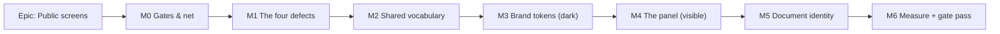

# Implementation Plan: The public screens — brand surface, and the four blocking defects

- **Feature spec:** [`./feature-spec.md`](./feature-spec.md)
- **ADR:** [`../../adr/0077-public-screens-brand-surface.md`](../../adr/0077-public-screens-brand-surface.md)
  — filed 2026-08-06 by task M0-T0
- **Status:** Draft — awaiting approval
- **Owner:** _(unassigned)_

## Breakdown

### Epic

**Public screens: brand surface and blocking-defect repair** — make the six pre-authentication
routes correct, consistent, measured and recognisable. Maps to the roadmap's _Product features_
theme. **No feature flag** (ADR-0077).

**What lands first: M0, and it lands before anything is redesigned.** M0 writes the missing route
tests for the two uncovered screens and widens the colour-literal lint rule to `src/routes/**`. It is
uninteresting and it is the net; without it, M4 is a rewrite of six screens with nothing catching a
regression. **M1 lands second and is the one a user feels immediately** — the four defects are live
in production and must not sit behind a visual epic.

---

## Milestone M0 — Gates and the safety net

**Outcome:** nothing changes for a user. The repository can now catch what M1–M6 might break: the
two uncovered public routes have tests, the public screens are inside the design system's lint rule,
and every dependency claim this epic rests on is registered.

---

#### Feature: Coverage and gate widening

> **Description:** route-level unit coverage for `sign-in` and `accept-invite`; the colour-literal
> rule extended to `src/routes/**`; the register updated.
> **Complexity:** M
> **Dependencies:** none
> **Risks:** widening the lint rule surfaces pre-existing violations in unrelated routes → run it
> first and fix or record what it finds before the rest of the epic (a rule that lands red gets
> disabled, ADR-0058's lesson about a gate that fails on day one).
> **Testing requirements:** the new suites must be verified to **fail** against a deliberately
> broken version before being trusted.

##### Task M0-T0 — File ADR-0077 (do this first, and do not split it) — ✅ **DONE 2026-08-06**

- **Description:** move the draft out of this directory to
  `docs/adr/0077-public-screens-brand-surface.md`, set `Status: Accepted`, delete the draft header
  box, add the `CLAUDE.md` §16 entry, and bump the banner's ADR count **76 → 77**.
- **Outcome:** filed in the same commit as M0-T2 and M0-T3, with CQ-1 (motif drawn from the brand
  family's own semantic names), CQ-2 (the route owns the header and the terminal branch) and CQ-3
  (`useNoindex` on all six routes) folded in as confirmed rather than recommended.
- **Complexity:** S
- **Dependencies:** approval; CQ-1 and CQ-2 answered (both change §4 and §6 of the ADR).
- **Risks:**
  - **The move and the count bump are one commit or CI is red.** `scripts/check-counts.mjs`
    re-derives the ADR count from `docs/adr/` (line 42) and matches `(\d+) ADRs` in the banner
    (line 54); the file arriving without the bump fails the gate.
  - **Forgetting the move entirely** is the ADR-0071 failure: that document lived in a spec directory
    for its whole epic, was maintained through M6 and a flag flip, and was cited by number in
    `docs/DATABASE.md`, three ADRs, two migrations and `packages/types` while being **absent from the
    register**. Doing this as task zero rather than as a closing chore is the mitigation.
- **Testing:** `pnpm check:counts`, `pnpm check:doc-links`, `pnpm check:claims` all green in the same
  commit. Fix the relative links in the spec and plan, which currently point at the draft path.
- **Development steps:** move; update status; update the two artefacts' links; `CLAUDE.md` §16 + count;
  run the three checks.

##### Task M0-T1 — `sign-in.test.tsx` and `accept-invite.test.tsx` — ✅ **DONE 2026-08-06**

- **Outcome:** both suites landed; 10 passing, **4 `it.fails`**. The four are rows 28/30/31/34, each
  asserting only "this state offers at least one operable control", each named for the M1-T1 that
  turns it green — `it.fails` rather than `todo` deliberately, because it goes **red** the moment
  the defect is fixed, forcing the fix and its evidence into one commit. Row 29 (loading) is
  exempted with its reason stated: it is transient, and a control on a screen about to be replaced
  is worse than none. Row 28's positive test asserts only the explanation, not the absence of
  controls, so M1-T1 does not have to edit a test that claims to describe correct behaviour.
  **One departure from step 1:** `sign-in.test.tsx` does **not** re-assert the
  `PASSWORD_RESET_ENABLED` link gating. `features/auth/password-reset.parity.test.tsx` already pins
  it on both branches as the flag's rollback contract, and a second copy would drift from it rather
  than reinforce it (the ADR-0062 duplication rule). What that suite does not cover, and this one
  now does, is where a successful sign-in **goes**: `?redirect=` is the invitation hand-off
  `AcceptInvitationCard` composes, and nothing asserted it.
- **Description:** route-level suites for the two public routes that have none. `sign-in` has
  `SignInForm.test.tsx` and `SignInForm.verification.test.tsx`, but **nothing covers the route** —
  the `PASSWORD_RESET_ENABLED` link gating (`sign-in.tsx:22-31`), the `redirect` search param
  (`:21`), and the composition. `accept-invite` has ten states (spec §2.2) and one component suite.
- **Complexity:** M
- **Dependencies:** none
- **Risks:** writing tests against code about to be redesigned wastes effort → assert **behaviour and
  accessible names**, never structure or class names. That is what makes them survive M4, and it is
  the property the ADR-0062 extraction proved ("every pre-existing suite passed unchanged").
- **Testing:** this task _is_ the testing. Follow the existing shape in `sign-up.test.tsx` and
  `verify-email.test.tsx`. Cover all ten `accept-invite` states.
- **Development steps:**
  1. `sign-in.test.tsx`: renders, links to `/sign-up`, shows/hides the forgot-password link with the
     flag (`vi.mock('@/config/env')`, the `password-reset.parity.test.tsx` precedent), honours
     `?redirect=`.
  2. `accept-invite.test.tsx`: all ten states from spec §2.2, each asserting **at least one operable
     control** — the assertion that will fail today for four of them and is therefore M1's gate.
  3. Confirm the four fail; mark them `.fails` or `todo` with an explicit pointer to M1-T1, so the
     suite is honest rather than green-by-omission.

##### Task M0-T2 — Register the dependency claims — ✅ **DONE 2026-08-06**

- **Outcome:** all four citations registered with verified anchors, and **all three** of the
  `check-claims.mjs` limitations below fixed rather than worked around — the scope transform, both
  citation forms (`.js` as well as `.mjs`, and the prose form these artefacts had been forced into),
  and an own-file exclusion driven by `git ls-files`. The widening then found **two dependency
  citations that had been unregistered in the tree all along** — `nodemailer@9.0.3`'s `_formatError`
  and `zod@4.4.3`'s `allowsEval` probe, both load-bearing (the first for the ADR-0075 security
  review's log-safety conclusion, the second for `config/zod-jitless.ts` existing at all). Both were
  read and registered; the register is 40 claims across five packages. Verified red with a probe
  document exercising both new forms plus a self-citation, then green. Residual limitations (the
  basename-level own-file exclusion, and the four-directory scan) are `docs/TECH_DEBT.md` **#101**.
- **Description:** the spec and ADR-0077 cite `better-auth` and `@better-fetch/fetch` internals.
  `pnpm check:claims` fails on any `<file>.mjs:<line>` citation in `docs/` that is not in
  `scripts/dependency-claims.json` (`scripts/check-claims.mjs`, completeness scan, lines 106-134).
- **Complexity:** S
- **Dependencies:** none. **Must be in the same commit as the ADR** — an ADR merged without it is a
  red CI, and separating them is the ADR-0071 filing failure in miniature.
- **Risks:**
  - The same scan matches **any** `<name>.mjs:<line>` in `docs/` and does not distinguish a
    dependency from this repository's own tooling, so a doc that cites `scripts/*.mjs` by line
    number fails the gate with a demand to register a file that is already in the repository. This
    spec, plan and ADR therefore cite our own scripts as "line N" rather than "file.mjs:N" — a
    workaround, and a third `TECH_DEBT` item for this task to record.
  - `scripts/check-claims.mjs` (lines 51-59) resolves an installed package with
    `readdirSync(store).find(e => e.startsWith(name + '@'))`. pnpm stores a scoped package as
    `@better-fetch+fetch@1.3.1`, so `'@better-fetch/fetch@'` **will not match** and the script will
    report "not installed" → **the script needs a scope-name transform** (`/` → `+`) before a scoped
    package can be registered. Verified by reading the store directory name.
  - Adding a package to `verifiedAgainst` means any bump of it fails CI until someone re-reads the
    lines. That is the intended cost (ADR-0076) and should be stated in the PR.
- **Testing:** `pnpm check:claims` green.
- **Development steps:**
  1. Add `docs/specs/public-screens-brand/feature-spec.md` and the ADR path to `citedBy` on the two
     already-registered rate-limiter entries and on the `password.mjs` entry the spec reuses.
     (`citedBy` is informational — the script does not fail on a stale one — which is exactly why it
     rots; update it deliberately.)
  2. Register the **new** citations, each with package, dist path, line range and a verified anchor
     (the `ref` is the base filename and the line range, joined by a colon):
     - `better-auth` `dist/api/routes/sign-in.mjs`, lines **234** — the `rememberMe` body field,
       anchor `rememberMe: z.boolean()`. Establishes that `rememberMe` **defaults to `true`**.
     - `better-auth` `dist/api/routes/sign-in.mjs`, lines **326** — anchor
       `const session = await ctx.context.internalAdapter.createSession(`. Establishes that
       `rememberMe === false` is what produces a non-persistent session.
     - `better-auth` `dist/api/rate-limiter/index.mjs`, lines **64-70** — anchor
       `function rateLimitResponse(retryAfter) {`. Establishes the `X-Retry-After` header name and
       the 429 body shape.
     - `@better-fetch/fetch` `dist/index.js`, lines **733-739** — anchor
       `data: null,`. Establishes that response **headers are not carried onto the error object**.
       Note this ref does **not** trip the completeness scan (`.js`, not `.mjs`), which is itself a
       gap worth a `TECH_DEBT` row: the scanner is a text pattern, so a citation formatted any other
       way is invisible to it.
  3. Teach `installed()` the scope transform, or record why `@better-fetch/fetch` stays unregistered.
  4. `pnpm check:claims` and `pnpm check:doc-links`.

##### Task M0-T3 — Widen the colour-literal rule to the public routes — ✅ **DONE 2026-08-06**

- **Outcome:** `**/src/routes/**` and `**/src/app/**` added to the `files` array. One pre-existing
  violation, and it was a **false positive worth keeping the rule honest about**:
  `welcome-empty-state.tsx` uses `#000` as a `mask-image` alpha stop, which the browser reads as
  opacity and never paints — so it cannot suffer the harm the rule exists to stop. Fixed with a
  scoped `eslint-disable-next-line` carrying that reasoning, deliberately **not** by rewriting it as
  `black` (which slips past the regex while changing nothing). Verified red by inserting
  `text-[#14213D]` into `sign-in.tsx`.
- **Description:** `packages/config/eslint/react.js:45` scopes the rule to
  `**/src/components/**` and `**/src/features/**`. **Every public screen lives in `src/routes/`** and
  is outside it — so a hard-coded navy on the very panel this epic adds would lint clean.
- **Complexity:** S
- **Dependencies:** none
- **Risks:** pre-existing violations elsewhere in `src/routes/` → find out **first**; if any exist,
  fix them in this task rather than narrowing the glob.
- **Testing:** add a fixture-style assertion or, minimally, verify by temporarily inserting
  `className="text-[#123456]"` into a route and confirming `pnpm lint` fails.
- **Development steps:**
  1. Add `**/src/routes/**/*.{ts,tsx}` to the `files` array; consider `**/src/app/**` too.
  2. `pnpm lint`; fix what it finds.
  3. Note the widening in `docs/DESIGN_SYSTEM.md` §5.

---

## Milestone M1 — The four blocking defects

**Outcome:** a user can no longer reach a public screen with nothing on it; the invitation Accept
button keeps focus; a rate-limited reader is told what happened. **Visually unchanged.** This is the
milestone with the shortest path to value and it should ship on its own.

---

#### Feature: B1 — no dead ends

> **Description:** six states gain an operable control.
> **Complexity:** M
> **Dependencies:** M0-T1 (its failing assertions are this feature's acceptance criteria)
> **Risks:** the resend confirmation must not become a second live region announcing the same
> sentence twice — the exact regression ADR-0074 M5-T1 fixed. → the confirmation stays the single
> `role="status"`; the form returns beside it, not as a second announcement.
> **Testing requirements:** unit per state; the four `accept-invite` assertions from M0-T1 flip green.

##### Task M1-T1 — `ResendVerificationButton`: the confirmation stops replacing the control — ✅ **DONE 2026-08-06**

- **Outcome:** the `role="status"` confirmation now renders **above** the retained form. Focus still
  moves to it once (it is the new information whether or not the control survived), there is still
  exactly **one** live region, and editing the address in the `needsAddress` branch clears the
  mutation so a confirmation about a different address cannot stand over a changed field. The
  `useOutcomeFocus` docblock, which described this component as one of "four forms" that unmount
  their own submit, was corrected in the same commit — a docblock describing behaviour that has been
  fixed is how the ADR-0066 exporter defect stayed alive. New suite:
  `ResendVerificationButton.test.tsx` (5 tests, all failing against the prior version).

- **Description:** `ResendVerificationButton.tsx:56-63` returns only a `
` on
  success; the `<form>` and its button (`:65-87`) are unmounted, and `send.isSuccess` never clears,
  so only a reload recovers. The copy tells the reader to "check your spam folder before trying
  again" and gives them nothing to try again with. Reachable from **three** surfaces.
- **Complexity:** S
- **Dependencies:** none
- **Risks:** re-rendering the form under the confirmation could invite an immediate double-send into
  the 3-per-60s limit → keep `blocked` guarding submit, and let B4's 429 state be the honest answer
  if they do.
- **Testing:** after a successful send the submit control is still in the document and enabled; a
  second send is possible; exactly **one** live region announces; `useOutcomeFocus` still moves focus
  to the confirmation once and only once.
- **Development steps:**
  1. Render the `role="status"` confirmation **above** the retained form rather than instead of it.
  2. Keep the focus target on the confirmation (the button is no longer unmounted, but the outcome is
     still the new information).
  3. When the address field is edited in the `needsAddress` branch, `send.reset()` so the stale
     confirmation clears.
  4. Update the docblock — it currently explains why the button is unmounted, and that reason is
     being removed. A docblock describing behaviour that has been corrected is exactly how the
     ADR-0066 exporter defect stayed alive.

##### Task M1-T2 — `accept-invite`: four refusals gain a control; wrong-account gains Sign out — ✅ **DONE 2026-08-06**

- **Outcome:** one shared `InviteExitLinks` for no-token / not-found / not-pending, and a **Sign
  out** button on wrong-account wired to `useSignOut`. The four `it.fails` assertions from M0-T1
  were un-`.fails`ed in the same commit, which is what `it.fails` is for.
  **One deliberate departure from step 1**, recorded rather than folded silently: the exit is
  **session-aware**. The step said "a `Sign in` link and a `Create an account` link" unconditionally,
  but `/sign-in` has no already-signed-in guard (`app/router.tsx:101-113` guards `_authed`, not the
  public routes), so a signed-in reader would be handed a login form they do not need — a control
  that is present and wrong, which is the same class of defect as no control at all. Signed in they
  get **Go to SchedulePoint**; signed out, the pair. While the session resolves the pair renders,
  which is right for the overwhelmingly common case (an emailed link in a fresh browser) and swaps
  rather than dead-ends otherwise. The wrong-account copy changed with it: "Sign out and **come back
  to this page as** {email}" rather than "use the invited account", because signing out here keeps
  the reader on the invitation (the sign-out drops every cached query except the seeded `null`
  session, so the preview refetches into the signed-out branch).

- **Description:** `AcceptInvitationCard.tsx:72-83` (not found), `:89-100` (not pending),
  `:165-177` (wrong account) and `routes/accept-invite.tsx:14-22` (no token) render a title and a
  description and stop. Wrong-account instructs the reader to "Sign out and use the invited account"
  with **no sign-out control**.
- **Complexity:** M
- **Dependencies:** M1-T4 (`ServerError`) is _not_ required; can land first.
- **Risks:**
  - Signing out clears the query cache (`useSignOut`, `use-session.ts:332-343`) — verify the
    invitation preview refetches and the card re-renders in the signed-out state (#32) rather than
    flashing "not found".
  - Sign-out is `onSettled`, so it clears even on failure — that is deliberate and correct here.
- **Testing:** each of the four states asserts an operable control by accessible name; the sign-out
  path asserts the transition to the signed-out state; the announcement in `resolvedOutcome` (`:21-38`)
  still fires for every branch — a **sixth** state added without an announcement is the failure that
  function exists to prevent, and this task adds controls to four of them.
- **Development steps:**
  1. Not found / not pending / no token → a `Sign in` link and a `Create an account` link (the same
     pair the signed-out branch at `:114-125` already offers).
  2. Wrong account → a **Sign out** button wired to `useSignOut`, plus the copy change (M2-T4).
  3. Re-read `resolvedOutcome` and confirm each new control's state still announces.

##### Task M1-T3 — B3: `aria-disabled` on Accept and join — ✅ **DONE 2026-08-06**

- **Outcome:** `aria-disabled` + `aria-busy` + an `onClick` early return. The regression test asserts
  **both halves** — focus stays on the button through the pending state, and a second activation
  fires no second mutation — because `aria-disabled` alone does not prevent activation and shipping
  only the first half would be a double-submit bug. **Verified red first** by restoring
  `disabled={accept.isPending}`.

- **Description:** `AcceptInvitationCard.tsx:192` — `disabled={accept.isPending}`. A native disabled
  control blurs to `<body>` when the request starts and flips back when it settles, so a keyboard
  user loses their place twice per action (WCAG 2.4.3). Every sibling in this codebase already does
  the right thing and says why.
- **Complexity:** S
- **Dependencies:** none
- **Risks:** `aria-disabled` does not prevent activation → the `onClick` guard is what does, and it
  must be added in the same change or this becomes a double-submit bug.
- **Testing:** a regression test that **fails against the current code**: focus the button, activate,
  assert `document.activeElement` is still the button during pending, and that a second activation
  fires no second mutation.
- **Development steps:**
  1. `aria-disabled={accept.isPending}` + `aria-busy` + an `onClick` early return.
  2. Copy the `SignInForm.tsx:79-84` docblock's reasoning rather than restating it loosely — this is
     the third time this defect has been closed (ADR-0060 M6, ADR-0063 M6).

---

#### Feature: B4 — the rate limit is handled

> **Description:** a 429 renders as a distinct, honest state on every public screen.
> **Complexity:** M
> **Dependencies:** none (but pairs naturally with `ServerError`, M2-T1)
> **Risks:** the limiter is `enabled: options.isProduction`, so **no journey against the dev or test
> API can reach it** → the test strategy is unit tests plus a Playwright `page.route` fulfilment.
> Enabling the limiter in test was considered and rejected: frictionless local/test is deliberate
> (`better-auth.ts:264-274`) and turning it on would make every suite flaky by design.
> **Testing requirements:** unit per screen; one browser-level test that a real 429 response
> produces the state.

##### Task M1-T4 — `AuthError` carries `status`; a 429 state exists — ✅ **DONE 2026-08-06**

- **Outcome:** `AuthError` gains `status`, fed by a `statusFrom()` sibling to `codeFrom()` and
  threaded through **all six** construction sites; `useSignUp` and `useSendVerificationEmail` had
  their mutation error type pinned to `AuthError` to make that reachable (react-query widens it to
  `Error` otherwise). One `isRateLimited()` predicate and one `authErrorMessage(error, scope)` so six
  screens cannot drift on what 429 means or how it reads. Copy is the plan's, and a test asserts the
  attempts sentence **contains no digit** — the window is on `X-Retry-After`, which
  `@better-fetch/fetch` discards, so a countdown would be a figure nobody read.
  `use-session.rate-limit.test.ts` covers each of the six hooks separately rather than one of them:
  "all six were threaded" is a claim until a test says so per hook, and one-control-and-not-its-
  neighbour is this repo's most repeated defect shape. The browser-level `page.route` fulfilment is
  M6, since the limiter is `enabled: options.isProduction` and no test API can produce a real 429.

- **Description:** `AuthError` (`features/auth/api/use-session.ts:59-67`) records `message` and
  `code` only. Better Auth's 429 body carries **no `code`**, so every screen falls through to the
  library's sentence in a bare red `
`. `@better-fetch/fetch@1.3.1` **does** put `status` on the
  returned error object; it does **not** carry response headers, so `X-Retry-After` is not reachable
  without a client-level hook (spec §3.5).
- **Complexity:** M
- **Dependencies:** none
- **Risks:**
  - Naming a wait in seconds we did not read would be a fabricated number → **the copy names no
    number.** Reading the header is a follow-up, not this task.
  - `status` must be threaded through all six `AuthError` construction sites, not one → a `codeFrom`
    sibling `statusFrom`, applied uniformly, and a test per hook.
- **Testing:**
  - Unit: each of the six mutations maps a 429 to `status === 429`.
  - Unit: each screen renders the throttled state, not the generic one.
  - Browser: `page.route('**/api/auth/sign-in/email', r => r.fulfill({ status: 429, … }))` in the M6
    suite, asserting the rendered state — the only place this is testable end to end.
- **Development steps:**
  1. Add `readonly status: number | undefined` to `AuthError`; add `statusFrom()`; thread it through
     `useSignIn`, `useSignUp`, `useSendVerificationEmail`, `useChangePassword`,
     `useRequestPasswordReset`, `useResetPassword`.
  2. A single `isRateLimited(error)` predicate in `features/auth`, so six screens cannot drift on
     what 429 means.
  3. Copy (en-GB, no number): _"Too many attempts. Wait a moment and try again."_ — and on the two
     60-second routes, _"Too many requests. Wait a minute before asking for another email."_ The
     windows are 10 s and 60 s respectively (`index.mjs:370-383`); the copy reflects the difference
     without quoting a countdown.
  4. Record in the ADR that `/change-password` and `/change-email` share the 10 s rule, so `/account`
     inherits the fix.

---

## Milestone M2 — One vocabulary across six screens

**Outcome:** a server failure is at least as visible as a typo; one heading mechanism; one name per
action; one link style. Still visually conservative — no brand panel yet.

---

#### Feature: Shared error and link primitives

> **Description:** two `components/ui` primitives replacing hand-assembled copies.
> **Complexity:** M
> **Dependencies:** M1-T4 (the 429 branch lives in `ServerError`)
> **Risks:** a new primitive that only these screens use is a one-off in a `ui/` costume → both are
> generic and `TextLink` has five existing consumers on day one (`docs/TECH_DEBT.md` #97(b)).
> **Testing requirements:** component tests for both; every migrated screen's existing suite must
> pass **unchanged** (queries are by role and accessible name).

##### Task M2-T1 — `ServerError` — ✅ **DONE 2026-08-06**

- **Outcome:** `components/ui/server-error.tsx`, migrated at all six call sites plus
  `ChangePasswordForm` (the seventh copy, on `/account`, which the task list did not name).
  **One departure, and it is the task's own risk note honoured**: the component takes a `message`,
  not an error object, and does not know what a 429 is. A `components/ui` primitive importing
  `AuthError` to branch on a rate limit would be the one-off-in-a-`ui`-costume that note warns
  about; the single place deciding what 429 means is `authErrorMessage()` from M1-T4, which every
  call site already routes through — so the property the task wanted (one decision, one place) is
  held without the layering inversion.

- **Description:** six copies of `
{msg}
`
  (`SignInForm.tsx:60-64`, `SignUpForm.tsx:41-45`, `RequestPasswordResetForm.tsx:68-74`,
  `ResetPasswordForm.tsx:56-60`, `ResendVerificationButton.tsx:67-71`,
  `AcceptInvitationCard.tsx:186-190`). Meanwhile **client validation** gets the bordered
  `FormErrorSummary` (`components/ui/form.tsx:318-323`) — the more serious failure gets the weaker
  treatment. `ServerError` gives the server failure the same visual weight, announces it, takes
  focus, and owns the 429 branch.
- **Complexity:** M
- **Dependencies:** M1-T4
- **Risks:** focusing an error and _also_ announcing it can double-read → the element carrying
  `role="alert"` is the focus target, one node, one announcement (the ADR-0074 M5-T1 rule).
- **Testing:** renders `role="alert"`; takes focus once when it appears; does not re-take focus on
  re-render; the 429 branch renders the throttled copy; the generic branch renders the message.
- **Development steps:**
  1. `components/ui/server-error.tsx` — props `error: AuthError | Error | null`, optional
     `throttleHint`. Uses `useOutcomeFocus` for the once-only focus move.
  2. Migrate all six call sites.
  3. `docs/COMPONENT_LIBRARY.md` entry.

##### Task M2-T2 — `TextLink`, closing TECH_DEBT #97(b) — ✅ **DONE 2026-08-06**

- **Outcome:** shipped as `textLinkVariants`, a `className` factory rather than a component — the
  risk note's first option, taken because wrapping TanStack Router's `Link` loses the type-safe
  `to`/`search` inference that catches a link to a route that does not exist. All five call sites
  migrated; #97(b) struck from the register. It also adds the **visible focus ring** none of the
  five copies had, which is the one behavioural change rather than a pure consolidation.

- **Description:** `text-primary font-medium underline-offset-4 hover:underline` appears in
  `sign-in`, `sign-up`, `verify-email`, `forgot-password` and `reset-password`. #97(b) says it wants
  a `Link` variant in `components/ui/`, not a sixth copy — and M4 would have added the sixth.
- **Complexity:** S
- **Dependencies:** none
- **Risks:** wrapping TanStack Router's `Link` can lose type-safe `to`/`search` inference → keep it a
  `className` export or a thin generic wrapper, and typecheck each migrated call site.
- **Testing:** existing route suites pass unchanged; one component test for the rendered element and
  focus ring.
- **Development steps:** create; migrate the five; delete the row from `docs/TECH_DEBT.md`.

---

#### Feature: One header mechanism (CQ-2)

> **Description:** the route owns the header and the terminal branch for all six screens.
> **Complexity:** M
> **Dependencies:** CQ-2 answered. **Blocked on approval.**
> **Risks:** hoisting a mutation into the route changes where state lives on three screens → the
> forms keep owning their _fields_; only the mutation object moves, passed down as a prop.
> **Testing requirements:** one `<h1>` and one `main` on all 33 states; the `<h1>` text asserted per
> terminal state.

##### Task M2-T3 — Hoist the terminal branch to the route — ✅ **DONE 2026-08-06**

- **Outcome:** `/forgot-password` and `/reset-password` own their mutations and render their own
  terminal states; the forms keep their fields. The missing `session.isPending` branch (state #11)
  is added. `components/layout/auth-shell-assertions.ts` carries the one-`main`/one-`h1` assertion
  and `routes/public-screens.landmarks.test.tsx` sweeps 13 first-render states across all six
  routes, asserting headings by **text** so M4's rebuild should pass it unchanged.
  **The reset confirmation is split, not rewritten**, and the difference matters: the heading is
  "Password changed" and the live region says "Every other session has been signed out." Both
  claims survive word for word; only the sentence boundary moved, because putting the whole
  sentence in a body under a heading that repeats its first two words reads as a stutter. The
  enumeration-safe forgot-password sentence moved **byte-identical**. One existing assertion
  changed with it (`reset-password.test.tsx` looked for "Password changed" inside `role="status"`)
  — that is the M2-T3 testing requirement landing, not a suite weakened to fit.

- **Description:** `reset-password.tsx:60` renders `<h1>Choose a new password</h1>` while
  `ResetPasswordForm.tsx:40-51` replaces the body with "Password changed". `forgot-password.tsx:40`
  is the milder version. `verify-email.tsx:65-85` and `reset-password.tsx:40-57` already branch at
  the route — this makes that the only mechanism. **`sign-in` is deliberately excluded**: its
  unverified branch is not terminal (`SignInForm.tsx:50-52` returns to idle), so its `<h1>` is not
  stale (spec §0.1 C3).
- **Complexity:** M
- **Dependencies:** none
- **Risks:**
  - **Load-bearing copy must move verbatim.** `ResetPasswordForm.tsx:43-45` ("Password changed. Every
    other session has been signed out.") is the reader's confirmation that the lockout is over and
    the revocation claim is true (`password.mjs:172`). It moves; it is not rewritten.
  - `RequestPasswordResetForm.tsx:52-56` is enumeration-safe and must survive the move **word for
    word**. A rewrite that distinguishes known from unknown addresses is a security regression.
- **Testing:** per terminal state, assert the `<h1>` text; assert exactly one `<h1>`; assert the
  focus target is still the outcome; assert the enumeration-safe sentence is byte-identical (a
  string equality test, so a future copy pass cannot soften it silently).
- **Development steps:**
  1. `forgot-password.tsx`, `reset-password.tsx` take their mutation hook and pass it down.
  2. Each terminal branch supplies its own `title`/`description` to `AuthShell`.
  3. Add the missing `session.isPending` branch to `forgot-password.tsx:23` (state #11) — today the
     signed-out screen renders first and is replaced, which flashes the wrong screen.
  4. Add a shared assertion helper so all 33 states can be swept for the one-`h1`/one-`main`
     invariant.

##### Task M2-T4 — Copy and consistency pass (en-GB) — ✅ **DONE 2026-08-06**

- **Outcome:** one name — **"Create an account"** on the sign-up heading, its submit button, the
  sign-in link (was "Create one") and the invitation card, which already used it. The primary
  action is a button everywhere (`/account` on forgot-password and "Send a new link" on
  reset-password were text links); the secondary is `textLinkVariants`. `useNoindex` on all six
  routes — it was on two, which was drift rather than policy, and `/accept-invite` carries a live
  bearer token in its URL. `readForeignParam` on every route that reads a param: `/sign-in`'s
  `?redirect=` and `/accept-invite`'s `?token=` join the three that had it. **`/sign-up` is the
  exception and needs no change — it reads no search params at all**, so "all six" is five routes
  and one that has nothing to guard. Card width unified at 448px by **deleting** `AuthShell`'s
  `size` prop rather than defaulting it.

- **Description:** one action currently has four names — "Create your account" (`sign-up.tsx:23`),
  "Create account" (`SignUpForm.tsx:77`), "Create one" (`sign-in.tsx:36`), "Create an account"
  (`AcceptInvitationCard.tsx:123`). The primary action is sometimes a button and sometimes a text
  link (`forgot-password.tsx:29-34`, `reset-password.tsx:49-54`). `useNoindex` is on **2 of 6**;
  `readForeignParam` on **3 of 6** (spec §0.1 C1). `AuthShell sm` is 384 px against `InviteShell`'s
  448 px, and `docs/DESIGN_SYSTEM.md:497` calls 448 px the width of a record form.
- **Complexity:** M
- **Dependencies:** M2-T2
- **Risks:**
  - **The four protected strings must not be touched** (spec §2.9). A copy pass is exactly how they
    get "improved" — pin each with a string-equality test in this task, before editing anything else.
  - The `accept-invite` token uniformity change is **not** a bug fix (spec §0.1 C2) and must not be
    described as one in the changeset.
- **Testing:** string-equality tests for the four protected strings; accessible-name assertions for
  every renamed control; `useNoindex` asserted per route.
- **Development steps:**
  1. Pin the protected strings first.
  2. One name: **"Create an account"** everywhere.
  3. Primary action is always a `Button`/`buttonVariants` control; secondary is always `TextLink`.
  4. `useNoindex` on all six — none of these screens should be crawled, and `/sign-in` and
     `/sign-up` being indexable while `/forgot-password` is not is an accident, not a policy.
     _(Confirm with the PO if discoverability of `/sign-up` is wanted; default is noindex on all six.)_
  5. `readForeignParam` on all six.
  6. Card width `sm` → 448 px; retire the `sm`/`md` distinction if nothing needs 384 px.
  7. Copy replacements per spec §2.9 (en-GB — "organisation", "recognise"; check every new string).
  8. Changeset: a `minor` for user-visible copy and layout change.

---

## Milestone M3 — The brand token family (dark)

**Outcome:** nothing changes for a user. The `--brand-*` family exists, complete, in all three theme
blocks; `[data-surface='brand']` exists; `Surface` accepts `tone="brand"`; and **every gate runs over
it**. Shipping this separately is what makes M4 a single revertible commit.

---

#### Feature: `--brand-*` and the fourth surface scope

> **Description:** 17 tokens × 3 theme blocks, one rebind rule, one union member, five gate updates.
> **Complexity:** M
> **Dependencies:** ADR-0077 approved; **CQ-1 answered** (it decides whether `--chart-*` is involved).
> **Risks:** a partial family is the exact bug ADR-0055 exists to record — a three-token header stub
> whose secondary text fell through to the page grey and vanished on navy. → the completeness test
> runs automatically once `'brand'` is in `FAMILIES`; do not add the family without adding it there.
> **Testing requirements:** all five gates below, green, with the family present.

##### Task M3-T1 — Declare the family and the rebind rule — ✅ **DONE 2026-08-06**

- **Outcome:** all 17 `--brand-*` members in `:root`, `.dark` and `.corporate` with **identical
  literal values** (Corporate's navy chrome, re-verified rather than trusted), plus
  `[data-surface='brand']` rebinding exactly `REBOUND_NAMES`. The comment block states the
  theme-invariance as a decision so the next reader does not "fix" it.

- **Description:** add `--brand` … `--brand-ring` (the 17 suffixes at
  `token-architecture.test.ts:26-50`) to `:root`, `.dark` **and** `.corporate`, with **identical
  values in all three**, plus `[data-surface='brand']` rebinding exactly `REBOUND_NAMES` (`:55-73`).
- **Complexity:** M
- **Dependencies:** CQ-1
- **Risks:**
  - Declaring the family only in `:root` would _appear_ to work — `themeTokens()` resolves
    `.dark`/`.corporate` by inheritance — and would break silently the day a theme restated one
    member. The repetition is the mechanism.
  - Values must be **literal colours, not `var()` aliases** (`:121-132` explains why for `--field`
    and `--canvas`; the same trap applies here).
- **Testing:** `token-architecture.test.ts` and `token-contrast.test.ts` after M3-T2.
- **Development steps:**
  1. Start from Corporate's navy chrome values (`globals.css:408-425`) — already measured against
     navy — then **re-verify by the matrix rather than trusting them**.
  2. Add the rebind block after `[data-surface='panel']`.
  3. Write the comment block in the register's own voice: state that this family is deliberately
     theme-invariant, and why, so the next reader does not "fix" it.

##### Task M3-T2 — Extend the gates — ✅ **DONE 2026-08-06**

- **Outcome:** all five landed, and **each was verified red before being trusted** — a deleted
  member, a rebind pointed at the wrong family, a `--color-brand-x` in `@theme inline`, and a
  hand-written `data-surface` in a component, each restored after.
  **The first probe found the task's own premise to be false, and that is the finding.** This task
  says "the repetition IS the mechanism" — that declaring the family per theme block is what the
  completeness gate rests on. It is not: `themeTokens()` merges `.dark` and `.corporate` over
  `:root`, so a member deleted from one theme block is **inherited** and reads as present. Deleting
  `--brand-input` from `.dark` left `token-architecture.test.ts` green. Closed with a `brand`-
  specific assertion that reads each block's **literal** declarations and requires all 17 in each,
  with one distinct value across the three — which is `brand`'s defining property and now the only
  thing pinning it (ADR-0076 §19.9: the claim was checked rather than repeated).

- **Description:** five changes, four of which are one word.
- **Complexity:** S
- **Dependencies:** M3-T1
- **Risks:** **the seam test's regex, not its allowlist.** `surface-seams.structural.test.ts:28`
  (`ALLOWED`) must **not** grow — but `:50`, `:56` and `:60` match `/--(chrome|panel)\b/` and
  `/var\(--(chrome|panel)-/`. Leave those and the new family is entirely unguarded: any component
  could write `var(--brand-primary)` and no test would notice.
- **Testing:** verify each gate **fails** when deliberately broken — remove one token, point a rebind
  at the wrong family, add `--color-brand-x` to `@theme inline`, hand-write `data-surface="brand"` in
  a component — before trusting any of them.
- **Development steps:**
  1. `token-architecture.test.ts:52` — `FAMILIES` gains `'brand'`.
  2. `token-contrast.test.ts:19-20` — `Scope` and `SCOPES` gain `'brand'`.
  3. `token-contrast.test.ts:171` — the adjacent-surface report gains `'brand'`.
  4. `surface-seams.structural.test.ts` — the three **regexes** gain `brand`; `ALLOWED` unchanged.
  5. `components/ui/surface.tsx:22` — `SurfaceTone` gains `'brand'`; extend the docblock.

---

## Milestone M4 — The panel (the visible change)

**Outcome:** the six public screens carry a fixed dark navy brand panel with the brand mark, the
tagline and a token-drawn TSLD motif. **This milestone is deliberately one commit**, so a rollback is
one `git revert` — that is the mitigation standing in for a feature flag.

---

#### Feature: `BrandPanel`, `TsldMotif`, and the two-column `AuthShell`

> **Description:** the redesign itself.
> **Complexity:** L
> **Dependencies:** M3 (tokens), M2 (vocabulary), CQ-1
> **Risks:** see each task. The epic-level risk is that this is the one milestone a user sees, on a
> surface with 33 states and no browser measurement until M6 — which is why M6 is not optional and
> why M4 must not be merged on a reviewer's reading of the CSS (`docs/TECH_DEBT.md` #98's lesson,
> exactly).
> **Testing requirements:** unit for the once-only lockup; unit for `AuthShell`'s unchanged
> contract; the M6 browser sweep before the milestone is called done.

##### Task M4-T1 — `TsldMotif` — ✅ **DONE 2026-08-06**

- **Outcome:** five bars (under the cap), three finish-to-start links with arrowheads, day
  gridlines, all from the enclosing scope's own semantic names — no `--chart-*`, no literal.
  Inline SVG, so it is not an `img-src` fetch and the CSP cannot block it. The colour-literal lint
  rule reaching this file was **verified by inserting `fill-[#14213D]` and watching it fail**, not
  assumed. Links are drawn under the bars and orthogonally, matching the real painter's order and
  ADR-0065's reason for refusing diagonals.

- **Description:** an inline `<svg aria-hidden="true">` of 4–6 schematic bars on a lane grid with 3
  finish-to-start links and arrowheads — the product's own picture, drawn in tokens.
- **Complexity:** M
- **Dependencies:** M3-T1, CQ-1
- **Risks:**
  - **The `--chart-*` trap** (spec §3.4): page-level chart tokens are not rebound, so on a fixed navy
    panel Corporate's `--chart-2` lands at ~1.4:1 and the motif disappears for those users. Default
    is the brand family's own semantic names.
  - An SVG asset file would be an `img-src` fetch; inline markup is not a fetch and is CSP-clean
    (`img-src 'self' blob:` — no `data:`, verified at `docker-compose.yml:81`).
  - Complexity creep: this is a **motif**, not a chart. Cap it at six bars.
- **Testing:** renders once; `aria-hidden`; contains no colour literal (the M0-T3 lint rule now
  reaches it); scales without overflowing its container.
- **Development steps:**
  1. `components/layout/tsld-motif.tsx`, all strokes/fills from compiled utilities.
  2. Assert the lint rule covers it — deliberately insert a literal, confirm the failure, remove it.

##### Task M4-T2 — `BrandPanel` — ✅ **DONE 2026-08-06**

- **Outcome:** `<Surface tone="brand" as="aside">` with `BrandMark` (which existed and no public
  screen used), the motif, and the tagline verbatim. `aria-hidden`, because the same three
  decorative facts on six screens should not be read aloud six times — and nothing in it is
  information available nowhere else. `brand-panel.test.tsx` counts the lockup, which is the jsdom
  trap the task names: two copies behind `hidden md:flex`/`md:hidden` would both land in the
  accessibility tree and make every `getByText` on these screens ambiguous while `getAllBy*`
  assertions kept passing.

- **Description:** `<Surface tone="brand" as="aside">` carrying `BrandMark` (which exists at
  `components/layout/brand-mark.tsx` and **no public screen uses**), the verbatim tagline
  "A future reimagined by intelligent visual planning", and `TsldMotif`.
- **Complexity:** M
- **Dependencies:** M4-T1, M3
- **Risks:**
  - **The jsdom trap.** Do not render two copies behind `hidden md:flex` / `md:hidden`. jsdom has no
    CSS, so both land in the accessibility tree, existing `getByText` queries go ambiguous, and
    `getAllBy*` assertions keep passing while asserting nothing. **One `<aside>`, always rendered,
    proportion changes only.** Pin it with a test that counts.
  - `BrandMark`'s tile is `bg-primary text-primary-foreground` (`brand-mark.tsx:20`) — inside the
    brand scope that now resolves to `--brand-primary`. Confirm the pair in the contrast matrix
    rather than by eye.
  - The tagline is **verbatim** — a PO decision. Pin it with a string-equality test.
- **Testing:** exactly one lockup in the tree at every viewport; tagline string equality; the panel
  is `aria-hidden` and its removal from the tree loses no information present nowhere else.
- **Development steps:**
  1. Build it; assert the count; assert the tagline.
  2. Add a `DESIGN_SYSTEM.md` note that `brand` is the fourth scope and state **the bar for a fifth**
     (ADR-0077).

##### Task M4-T3 — Two-column `AuthShell` — ✅ **DONE 2026-08-06**

- **Outcome:** a two-column grid at `md`+, one column below, with the panel as a **layout** sibling
  rather than a second element. `min-h-dvh` survives and is now asserted rather than assumed.
  **Every public-screen suite passed unchanged** — 391 files / 3,840 tests — which is the extraction
  proof this task asked for.
  **One item of this task's description is already stale and it is my doing:** it lists `size` among
  the props that must not change, but M2-T4 deleted that prop when it unified the card width. The
  contract that had to hold — `title`, `description`, `busy`, `children`, one `main`, `aria-busy` on
  it — did.

- **Description:** grid at `md`+, single column below with the panel as a band above the card and the
  tagline dropped.
- **Complexity:** M
- **Dependencies:** M4-T2
- **Risks:**
  - **The public API must not change** — `title`, `description`, `size`, `busy`, `children`. Two
    existing assertions depend on the internals: `auth-shell.test.tsx:33` (exactly one `main`) and
    `:68` (`aria-busy` on it). Neither may be relaxed.
  - `min-h-dvh` (`auth-shell.tsx:41`) is **already correct** and must survive; centring a tall card
    in a 360 px-high landscape viewport is where content gets clipped. Assert it.
  - `InviteShell` (`features/members/components/InviteShell.tsx`) delegates with `size="md"` and the
    title-less branch — verify the ten `accept-invite` states in the new frame, since that branch
    renders children **outside** `CardContent` (`auth-shell.tsx:52-56`).
- **Testing:** `auth-shell.test.tsx` passes **unchanged**; add viewport-independent structure
  assertions; the M6 sweep is the real proof.
- **Development steps:**
  1. Grid; card `max-w` to 448 px; panel hidden below `md` by layout, not by a second element.
  2. Re-run every public-screen suite; **none may need editing** — that is the extraction proof
     (ADR-0062's precedent).
  3. Changeset: `minor`, user-visible.

---

## Milestone M5 — Document identity

**Outcome:** every route has a tab title; the site has a favicon; the document declares a
description and a theme colour.

---

#### Feature: Titles, favicon, metadata

> **Description:** four small, independent gaps.
> **Complexity:** S
> **Dependencies:** none (can land any time after M0; sequenced here to keep M4 a clean revert)
> **Risks:** a `data:` URI favicon is **blocked by the CSP** (`img-src 'self' blob:` — no `data:`).
> A served file is required.
> **Testing requirements:** unit per route for the title; a browser assertion that the favicon
> returns an image content type.

##### Task M5-T1 — Per-route `document.title` — ✅ **DONE 2026-08-06**

- **Outcome:** `hooks/use-document-title.ts` on all six routes, format `"<Screen> · SchedulePoint"`.
  A **layout** effect, so the title is right before the browser paints rather than a frame later —
  that frame is exactly where a screen-reader user is told the previous page's name. Restored on
  unmount, or `/reset-password`'s title rides into the app for the rest of the session.

- **Description:** there is **no `document.title` anywhere in `apps/web/src`** outside the print
  surfaces (grepped). Every route shares `<title>SchedulePoint</title>` (`index.html:7`).
- **Complexity:** S
- **Dependencies:** none
- **Risks:** a title set in an effect announces late for screen-reader users → set it in the route's
  component body via a small `useDocumentTitle` hook running in a layout effect, and restore on
  unmount.
- **Testing:** per public route, `document.title` matches; the authed app is unaffected.
- **Development steps:** `hooks/use-document-title.ts`; apply to the six public routes; en-GB, format
  `"<Screen> · SchedulePoint"`.

##### Task M5-T2 — Favicon and document metadata — ✅ **DONE 2026-08-06**

- **Outcome:** `public/favicon.svg` (the brand tile reduced to what survives at 16 px), a
  `<link rel="icon">`, a `<meta name="description">`, and an nginx `location = /favicon.svg` with a
  one-day max-age — without it the SPA fallback hands the icon request the index document, which is
  what `/favicon.ico` was already getting. **`theme-color` omitted, as the task's default said**:
  the app has four theme settings and `prefers-color-scheme` knows two, so a single value is wrong
  for at least one and even a media-split pair cannot see the Corporate choice.
  The SVG carries **two colour literals, and that is correct here and only here** — a file served
  outside the document has no access to the app's custom properties and a favicon has no theme to
  follow. They are the brand scope's own `--brand` and `--brand-primary` converted to sRGB.

- **Description:** `index.html` has no `<link rel="icon">`, no `<meta name="description">` and no
  `theme-color`. `apps/web/public/` contains exactly one file. `nginx.conf:62-64` falls
  `/favicon.ico` through to `index.html`, so browsers receive HTML where they expected an icon.
- **Complexity:** S
- **Dependencies:** M4-T1 (reuse the motif's shapes / the `BrandMark` tile for the icon)
- **Risks:**
  - `theme-color` interacts with the theme switcher: a single fixed value is wrong in at least one
    theme. → either two `<meta name="theme-color" media="(prefers-color-scheme: …)">` entries, or
    omit it. **Default: omit**, and say why in the ADR — the app has four theme settings and
    `prefers-color-scheme` only knows two.
  - A file in `public/` falls under `location /` with **no cache header**. `theme-boot.js` needed its
    own `location =` block (`nginx.conf:43-46`) for the same reason.
- **Testing:** browser assertion in the M6 suite: `/favicon.svg` returns 200 with an image
  content type (not `text/html`).
- **Development steps:**
  1. `apps/web/public/favicon.svg` (+ an `.ico` fallback if Safari/pinned-tab support is wanted).
  2. `<link rel="icon">`, `<meta name="description">` in `index.html`.
  3. An nginx `location` for the icon with a sane `max-age`.
  4. Confirm the CSP needs no change (it does not — `img-src 'self'`).

---

## Milestone M6 — Measure it, then gate it

**Outcome:** the claim "these screens work at every size in every theme" is a **measurement**, not a
reading; and the epic's combined diff has been through the specialist gates that have found blocking
defects in every one of the last six epics.

---

#### Feature: `apps/web/e2e-public` — the layout measurement suite

> **Description:** a browser suite that measures the public screens rather than reasoning about them.
> **Complexity:** L
> **Dependencies:** M4
> **Risks:** a slow suite gets skipped → keep it to layout and one 429 fulfilment; it needs no
> seeded plan and no pen.
> **Testing requirements:** this feature _is_ the testing.

##### Task M6-T1 — The suite, and what it measures

- **Description:** the precedent is `docs/TECH_DEBT.md` **#98**, and it is the whole argument for this
  task: a specialist reasoned from the CSS that the guest view would pass 1.4.10, **suggested a test
  to confirm it**, and the test **failed on its first run** — `documentElement.scrollWidth` was 436
  against a 320 px viewport. The method there is the method here.
- **Complexity:** L
- **Dependencies:** M4-T3
- **Risks:** state coverage is the hard part — 33 states, several reachable only through a real
  mailbox or a real invitation. → drive what can be driven against the real API (the `e2e-account`
  suite already establishes the pattern, including its SMTP sink at `e2e-account/smtp-sink.ts`), and
  reach the rest by URL and by `page.route` fulfilment. **Record which states were driven and which
  were synthesised** — a suite that quietly covers 20 of 33 while claiming all of them is the defect
  class this repository keeps naming.
- **Testing:** verify the suite **red first** — set a fixed `min-width` on the card, confirm the
  320 px assertion fails, remove it. A gate never seen failing is not a gate.
- **Development steps:**
  1. `playwright.public.config.ts`, `apps/web/e2e-public/`, `"test:e2e:public"` in
     `apps/web/package.json`, its own CI step (the ADR-0067/0070 pattern).
  2. **Themes.** Three rendered themes — `:root`, `.dark`, `.corporate`. The picker has _four_
     entries but `system` resolves to light or dark (`hooks/use-theme.tsx:58`), so it adds no third
     rendering. Set them with `page.addInitScript` writing
     `localStorage['schedulepoint-theme']` **before load**, because `public/theme-boot.js:22-27` is
     parser-blocking and reads it pre-paint.
  3. **Viewports.** `320 × 568` (the 1.4.10 floor), `640 × 360` (a phone in **landscape** — the case
     that breaks a vertically-centred `min-h-dvh` card), `375 × 812`, `768 × 1024` (the `md`
     boundary — assert the panel appears), `1024 × 768`, `1440 × 900`.
  4. **Assertions, per state × viewport × theme:**
     - `document.documentElement.scrollWidth <= window.innerWidth` — no horizontal scroll.
     - The primary action is present, scrollable into view, and clickable — i.e. a tall state
       **scrolls** rather than clipping.
     - Exactly one `<h1>` and exactly one `main`.
     - The brand lockup appears **exactly once** in the accessibility tree.
     - Below `md`: the panel is not rendered as a second column and the tagline is absent.
  5. **Long organisation name.** Seed an invitation whose organisation name is 100 characters; assert
     `accept-invite` states #32, #33, #34 and #35 wrap without horizontal overflow. This is the state
     with an unbounded server-supplied string in an `<h1>`.
  6. **Measure and record the tallest state** — do not assume it is `/verify-email` pending. Record
     the number in `docs/TECH_DEBT.md` or the ADR, per #98's precedent of recording the figure.
  7. **The 429.** `page.route` fulfilling `{ status: 429, body: '{"message":"Too many requests…"}',
headers: { 'X-Retry-After': '10' } }` on the sign-in endpoint; assert the throttled state. This
     is the only end-to-end proof available, because the limiter is production-only.
  8. State explicitly what the suite does **not** cover: contrast (the computed matrix owns that),
     Firefox and WebKit (Chromium-first, `CLAUDE.md` §17), and real mail delivery.

##### Task M6-T2 — The specialist gate pass

- **Description:** run the deferred reviews over the **combined** M0–M6 diff, fold every blocking
  finding with a regression test verified to fail first, and record the non-blocking ones as a
  `TECH_DEBT` row rather than rushing them.
- **Complexity:** L
- **Dependencies:** all prior milestones
- **Risks:** the pass finds a defect in the brand panel that needs a token value change → M3's family
  is the only place values live, so the fix is one file and re-runs one matrix.
- **Testing:** every fix carries a regression test **verified red against the pre-fix code**.
- **Development steps:**
  1. **accessibility-reviewer** — WCAG 2.2 AA over 33 states; focus order through the two-column
     layout; the `aria-hidden` panel; the `ServerError` focus/announcement pairing.
  2. **ux-reviewer** — copy, state coverage, responsive behaviour, the four protected strings intact.
  3. **component-reviewer** — `ServerError`, `TextLink`, `BrandPanel`, `TsldMotif`: token usage,
     one-off styling, API shape.
  4. **security-reviewer** — the new sign-out call site; that no copy change turned an
     enumeration-safe message into an oracle; that the CSP still needs no relaxation.
  5. **performance-reviewer** — the inline SVG's cost, the favicon request, LCP on `/sign-in`.
  6. Run the full pre-push gate: `pnpm lint && pnpm typecheck && pnpm test`, plus
     `pnpm check:claims`, `pnpm check:doc-links`, `pnpm check:counts`, plus
     `scripts/e2e-local.sh web:public` **locally** — CI is the second opinion, never the first
     (`docs/PROCESS.md`).
  7. Update `CLAUDE.md` §16 with ADR-0077 and re-run `pnpm check:counts` (the ADR count is one of the
     six figures it derives).

---

## Sequencing & slices

| Order | Milestone                | User-visible?                | Revert unit    |
| ----- | ------------------------ | ---------------------------- | -------------- |
| 1     | **M0** Gates & net       | No                           | —              |
| 2     | **M1** The four defects  | **Yes** — immediately better | per task       |
| 3     | **M2** Shared vocabulary | Yes — modest                 | per task       |
| 4     | **M3** Brand tokens      | No (dark)                    | one commit     |
| 5     | **M4** The panel         | **Yes** — the redesign       | **one commit** |
| 6     | **M5** Document identity | Yes — small                  | per task       |
| 7     | **M6** Measure + gates   | No                           | —              |

Each milestone keeps `main` releasable. **There is no feature flag** (ADR-0077); M3's separation from
M4 and M4's single-commit rule are what replace it. M1 is the slice to ship first if the epic is ever
paused: it is the part that is broken today.

## Definition of Done (per task)

Each task's PR must satisfy the Feature Completion Criteria in
[`docs/PROCESS.md`](../../PROCESS.md) — code, tests, docs, security, performance, accessibility,
Docker build, CI, changelog, version impact. "Tests" means the pre-push gate was **run**, including
`scripts/e2e-local.sh web:public` once M6-T1 exists.

## Risks & assumptions (rollup)

| Risk / assumption                                                                                   | Likelihood | Impact   | Mitigation                                                                                                                                                          |
| --------------------------------------------------------------------------------------------------- | ---------- | -------- | ------------------------------------------------------------------------------------------------------------------------------------------------------------------- |
| **CQ-1 unresolved** — the motif's inks are structurally blocked from `--chart-*` (spec §3.4)        | certain    | med      | Default to the brand family's semantic names; Option B is available and costs a gate                                                                                |
| The brand family is stubbed rather than completed                                                   | med        | **high** | `FAMILIES` gains `'brand'` in the same commit — the completeness test then runs automatically. This is the exact bug ADR-0055 records                               |
| The seam **regex** is not extended, only the allowlist read                                         | med        | **high** | Called out in M3-T2; verify by hand-writing `var(--brand-primary)` in a component and confirming the failure                                                        |
| The lockup is rendered twice (jsdom trap)                                                           | med        | med      | One `<aside>`, pinned by a counting test (M4-T2)                                                                                                                    |
| A copy pass softens an enumeration-safe or intent-not-delivery string                               | med        | **high** | Pin all four with string-equality tests **before** editing anything (M2-T4 step 1)                                                                                  |
| No flag ⇒ a bad M4 reaches users on the next release                                                | low        | med      | The operator runs Watchtower with autodeploy **enabled** (`CLAUDE.md` §17) — every release does reach users. M4 is one commit; M6 measures before it is called done |
| 33 states exceed the review budget assumed by the brief (~20)                                       | certain    | med      | Recorded in spec §0.1 C5; M6-T2 is sized for 33                                                                                                                     |
| The 429 path cannot be journey-tested against a real limiter                                        | certain    | low      | `page.route` fulfilment; the production-only setting is deliberate and stays                                                                                        |
| `X-Retry-After` is unreachable without a client hook                                                | certain    | low      | Copy names no number (M1-T4); the header is a follow-up                                                                                                             |
| `pnpm check:claims` cannot register a scoped package                                                | certain    | low      | M0-T2 fixes `installed()` or records why the claim stays unregistered                                                                                               |
| `check-claims.mjs` completeness is a text pattern, so a differently-formatted citation is invisible | certain    | low      | New `TECH_DEBT` row from M0-T2; not fixed here                                                                                                                      |
| Widening the lint rule surfaces pre-existing violations                                             | med        | low      | M0-T3 runs first and fixes what it finds rather than narrowing the glob                                                                                             |
