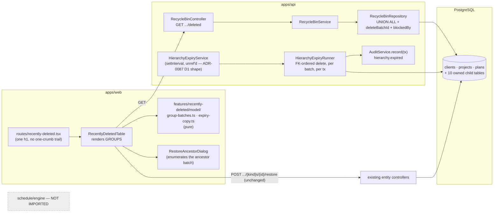
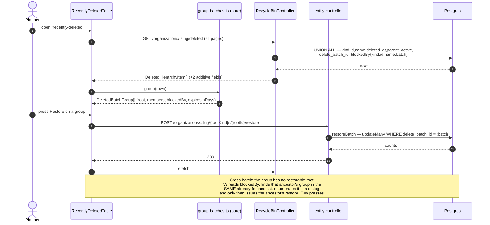
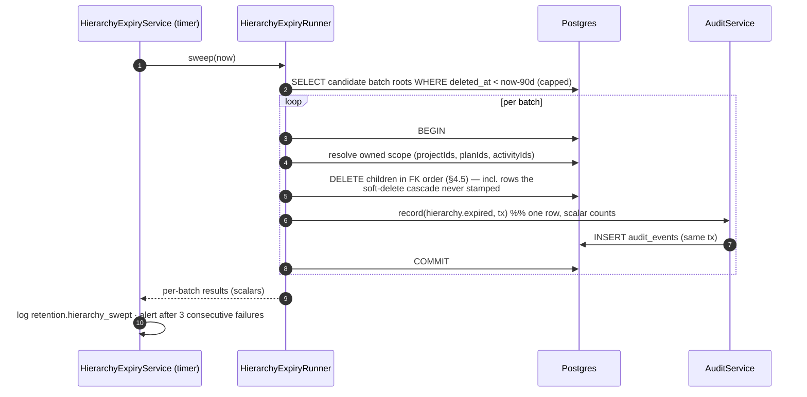
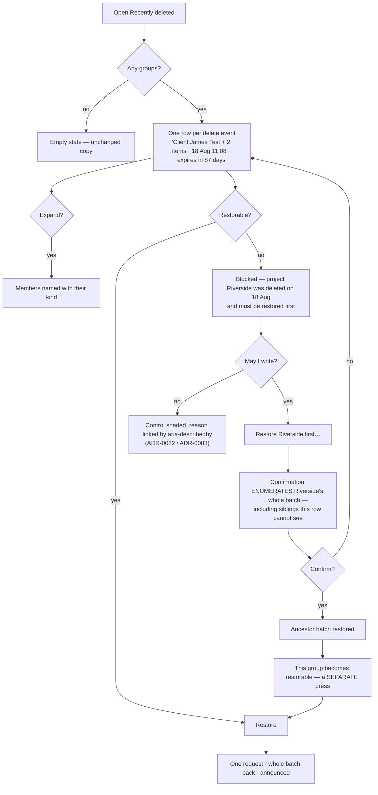

# Feature Spec: Recently Deleted improvements

- **Status:** Draft — **awaiting approval**
- **Author(s):** feature-analyst (Product Owner / Solution Architect / Technical Lead hats)
- **Date:** 2026-08-18
- **Tracking issue / epic:** _(unassigned)_
- **Roadmap link:** _(none — arrived as a product-owner request, not a roadmap theme)_
- **Related ADR(s):** **a new ADR is required** — see §4.7. Builds on / amends
  ADR-0012, ADR-0016, ADR-0072, ADR-0073, ADR-0085, ADR-0086, ADR-0087, ADR-0088.

> **Reading rule for this document (ADR-0076 / PROCESS.md "Decision-bearing claims carry their
> evidence").** Every claim below that decides something names the file and line, or the command,
> that established it. **Four claims in the brief that started this work were checked and three of
> them moved** — one was correct but incomplete, one is a collision the brief did not know about,
> and one is a mitigation that **cannot work in the form it was requested**. Those are §1.6.

---

## 1. Business understanding

### Problem

`/orgs/$orgSlug/recently-deleted` is the organisation's recycle bin. It has three defects and one
absence, and they compound.

**1. It shows deletion mechanics instead of deletions.** A soft delete stamps a whole subtree with
one `deleteBatchId` in one transaction (`apps/api/src/common/hierarchy/hierarchy-lifecycle.service.ts:98-99`,
`:305-344`) and `restoreBatch` keys the entire restore on that one value
(`hierarchy-lifecycle.service.ts:517-586`). So deleting a client with two descendants is **one
event**, and restoring the client already restores the project and the plan. The screen renders it
as **three rows**: one with a Restore button and two reading _"Restore its parent first"_
(`apps/web/src/features/recently-deleted/components/RecentlyDeletedTable.tsx:102-104`). The base
journey pins that shape — `apps/web/e2e/recently-deleted.spec.ts:77` asserts
`toHaveCount(2)` for exactly that sentence on exactly that cascade. The guidance is not wrong; it
describes work the product does automatically. It is noise that grows linearly with plan count.

**2. There is no cross-batch story at all.** The genuinely separate case — a plan deleted on Monday,
its project deleted on Tuesday — produces the identical sentence, and the row carries **no way to
identify or reach the blocking ancestor**: `DeletedHierarchyItem`
(`packages/types/src/index.ts:712-718`) has no parent id, no parent name, and no batch id. The
sentence tells a planner to do something the screen gives them no means to do.

**3. Nothing ever expires.** Every soft delete is permanent storage. `docs/BACKLOG.md` has no
recycle-bin row at all (`rg -i 'recently deleted|recycle' docs/BACKLOG.md` → no matches), and
`RETENTION_TABLES` is a **closed set of two operational tables**, asserted by set equality
(`apps/api/src/common/operational/retention-policy.ts:25`;
`retention-boundary.structural.spec.ts:43-45`). A deleted client from the product's first week is
still on disk, still in every list query's scan set (TECH_DEBT #57), and still holding a name
against the partial unique that stops a planner reusing it.

**4. The screen says its own name twice.** `apps/web/src/routes/recently-deleted.tsx:19` renders a
one-crumb `Breadcrumbs` and `:21` renders an `<h1>` of the same three words.

### Users

| Persona              | Organisation role (ADR-0016)   | What they need here                                                                         |
| -------------------- | ------------------------------ | ------------------------------------------------------------------------------------------- |
| Planner              | `PLANNER`                      | Undo a mis-delete in one action, and know how long they have.                               |
| Org Admin            | `ORG_ADMIN`                    | The same, plus confidence that data does not accumulate forever.                            |
| Contributor / Viewer | `CONTRIBUTOR` / `VIEWER`       | **Read** the bin (see what went), never restore it.                                         |
| External Guest       | per-plan share link (ADR-0051) | **Nothing.** Out of scope by construction — the guest scope is `SCHEDULE_READ` on one plan. |
| SchedulePoint staff  | `StaffPrincipal` (ADR-0086)    | Know the blast radius of an automatic deletion **before** it runs.                          |

Read is any member: `RecycleBinService.list` asserts `client:read`
(`apps/api/src/modules/recycle-bin/recycle-bin.service.ts:34`). Restore stays on the per-entity
writer-only routes (`recycle-bin.controller.ts:19-24`), which the client selects by `kind`
(`use-deleted-items.ts:46`).

### Primary use cases

1. Restore a whole deletion in **one** action, seeing what it contains before pressing it.
2. Understand why a row cannot be restored on its own, **and be offered a route that names exactly
   what would come back**.
3. See how long a deletion has left before it is permanent.
4. (Staff) See the age and size of the oldest soft-deleted content in the installation.

### User journeys

**Happy path.** A planner deletes client _James Test_ (2 descendants). They open **Recently
deleted** and see **one** row: _"Client James Test + 2 items · deleted 18 Aug 11:08 · expires in 90
days"_, expandable to name the two. They press **Restore**. One request; the client, the project and
the plan return. (§4.3 user-flow diagram.)

**Cross-batch alternate.** They deleted plan _Baseline_ on Monday and project _Riverside_ on
Tuesday. The bin shows **two** rows. _Baseline_'s row is blocked and says so with the ancestor
**named**: _"Blocked — project Riverside was deleted on 18 Aug and must come back first."_ Pressing
**Restore Riverside first** opens a confirmation enumerating **every row in Riverside's batch** —
including siblings that are not visible on the blocked row — before either restore is issued.

**Expiry.** Ninety days after a deletion, the batch is hard-deleted. The countdown was on the row
from the day it was deleted; an audit row records the removal on the organisation's Audit log.

### Expected outcomes

- One row per delete **event**; the "restore its parent first" sentence survives only where it
  describes real work.
- The cross-batch case becomes actionable instead of merely explained.
- Deleted content stops accumulating without bound, on a stated period, visible per row.
- No purge feature, and a written record of why (§4.7 D1).

### Success criteria

| #   | Criterion                                                                                                        | How it is measured                                                                                                                                                             |
| --- | ---------------------------------------------------------------------------------------------------------------- | ------------------------------------------------------------------------------------------------------------------------------------------------------------------------------ |
| S1  | A cascade delete of a client with N descendants produces **exactly one** restorable row.                         | Updated `apps/web/e2e/recently-deleted.spec.ts`; the current `toHaveCount(2)` at `:77` becomes an assertion that the sentence appears **zero** times for a same-batch cascade. |
| S2  | The one-action restore issues **one** HTTP request.                                                              | Journey asserts the network call count.                                                                                                                                        |
| S3  | A blocked row names its blocking ancestor and its deletion date.                                                 | Component + journey.                                                                                                                                                           |
| S4  | No confirmation is ever issued for a cross-batch restore without enumerating the ancestor batch's full contents. | Component test with a sibling the blocked row cannot see.                                                                                                                      |
| S5  | Every row states its expiry in days.                                                                             | Component test across boundary values (§2.5).                                                                                                                                  |
| S6  | An expired batch leaves exactly one audit row per batch, carrying scalar counts.                                 | Supertest against real Postgres.                                                                                                                                               |
| S7  | Nothing in this epic imports the CPM engine.                                                                     | §3 statement + the existing structural scans.                                                                                                                                  |
| S8  | `pnpm check:flags`, `check:counts`, `check:claims`, `check:doc-links`, `check:playbook` stay green.              | CI.                                                                                                                                                                            |

### Open questions

Marked **CRITICAL** where the answer changes design or scope. Everything else states a default and
proceeds.

> ## Critical questions — RESOLVED 2026-08-18 (product owner)
>
> All four resolved to the spec's own **default**. Recorded here so the questions below read as
> settled inputs rather than open ones; the reasoning under each is kept because it is why the
> default is the default, not because the choice is still live.
>
> |          | Resolution                                                                                                                                                                                                                                                                                                                         |
> | -------- | ---------------------------------------------------------------------------------------------------------------------------------------------------------------------------------------------------------------------------------------------------------------------------------------------------------------------------------- |
> | **CQ-1** | **(a)** — the blast radius lives on the organisation's own Recently Deleted screen. ADR-0086 is **not** amended and `staff-boundary.structural.spec.ts` is not touched. Staff cannot restore anything, so the read buys nothing there that justifies widening a boundary whose whole value is that it is structural.               |
> | **CQ-2** | **Accepted** — M3 ships the countdown and the blast-radius view with nothing deleted; M4 arms the sweep. The single-release promise made to the product owner was refuted by `retention-sweep.service.ts:110-113` (an unawaited sweep at boot), so the promise is met by splitting the work rather than by softening the sentence. |
> | **CQ-3** | **Accepted** — the 90 days is retroactive and the first armed tick takes the existing backlog. The M3→M4 split is the notice period; `RETENTION_HIERARCHY_DAYS` is the operator override. The product owner chose to arm immediately with this consequence stated.                                                                 |
> | **CQ-4** | **No** — activities soft-deleted inside live plans are out of scope. The bin never showed them and no countdown ever described them, so including them would expire content no reader was warned about. The growth is recorded as debt instead.                                                                                    |

> **CQ-1 (CRITICAL) — the staff Retention panel collides with ADR-0086's structural boundary, in
> two ways.** The brief asks for "the age of the oldest soft-deleted row on the staff Retention
> panel". `apps/api/src/modules/staff/staff-boundary.structural.spec.ts:77-96` fails the build if
> **any** file under `modules/staff/` contains the substring `../recycle-bin/` — that module is
> named in the list at `:92` — and `:115-140` fails if any of them contains `prisma.client`,
> `prisma.project` or `prisma.plan`. ADR-0086's central claim is that staff reaching customer data
> is a **compile error**, and this test is that claim's enforcement. Three options:
>
> - **(a) Put the blast radius on the organisation's own screen instead** _(recommended default)_ —
>   a summary line above the table ("2 deletions, 41 items, expire within 7 days"). No boundary
>   change, and it reaches the only people who can act: staff **cannot restore anything**, so a
>   staff-side number is informational only.
> - **(b) Amend ADR-0086 with a named, narrow exception** — one aggregate `{ oldestDeletedAt,
batchCount }` with **no row identity**, read through a repository under `common/` that
>   `StaffHealthService` injects, and a **fifth assertion added to the boundary spec** pinning that
>   one seam by name. This is more work and a real widening, and it must be done by amending the
>   gate rather than by wording around it — a `$queryRaw` naming `FROM clients` would pass both
>   scans today while doing precisely what they exist to prevent (the spec says so itself at
>   `:117-119`).
> - **(c) Both.**
>
> **Default if unanswered: (a).** The requirement's substance — blast radius visible before the
> first tick — is delivered by (a) plus CQ-2.

> **CQ-2 (CRITICAL) — "the same release must surface the blast radius before the first tick" cannot
> be satisfied by the same release.** `RetentionSweepService.onApplicationBootstrap` runs one sweep
> **at boot, unawaited** (`apps/api/src/common/operational/retention-sweep.service.ts:110-113`).
> Arming and deploying are one event: the container comes up, the sweep runs within seconds, and
> the panel that shows the blast radius only becomes readable **after** that. Whatever the panel
> says on the release that arms the sweep, it says it about the aftermath.
>
> The mitigation the product owner asked for works if the visibility ships **one release earlier**:
> **M3 ships the countdown and the blast-radius figures with nothing deleted; M4 arms the sweep.**
> That is one extra release on a host that auto-pulls each one (ADR-0047), and it is the only
> ordering under which "visible before the first tick" is a true sentence. **Default: split as
> M3 → M4.** Declining the split is a coherent choice — it means accepting that the first tick is
> unobserved — but it should be made knowingly rather than inherited from a sentence that reads as
> if it already holds.

> **CQ-3 (CRITICAL) — what does the 90-day clock do to content deleted before this ships?** The
> period is retroactive by construction: the predicate is `deleted_at < now - 90 days`, and the
> deployed database has rows older than that. Options: (i) retroactive, first tick removes the
> backlog; (ii) an **effective-from floor** — nothing deleted before the arming instant is expired
> until it has also spent a grace period visible on the screen. **Default: (i) retroactive, with
> the M3→M4 split (CQ-2) as the notice period, and `RETENTION_HIERARCHY_DAYS` available as an
> operator override** so the first release can be run at, say, 365 days without a code change
> (the `RETENTION_CSP_REPORTS_DAYS` pattern, `apps/api/src/config/env.validation.ts:170`).

> **CQ-4 (CRITICAL) — does expiry cover deleted _activities_ inside live plans?** Those are soft
> deleted with their own batch ids and are **not shown by the recycle bin at all** (the union
> query covers three tables only, `recycle-bin.repository.ts:70-104`). Expiring them would delete
> content no screen ever offered to restore and no countdown ever described. **Default: NO.**
> Scope is batches rooted at a **client, project or plan** — exactly what the screen shows and
> offers. Activity-level soft-delete growth is then knowingly unbounded and gets a `TECH_DEBT` row
> in the same PR rather than being left unsaid.

**Non-critical, defaults stated and taken:**

- **Q5 — expiry period.** 90 days, per the brief. Configurable `RETENTION_HIERARCHY_DAYS`,
  `min(1).max(3650)`, mirroring `env.validation.ts:170`.
- **Q6 — who sees the countdown.** Every member who can read the bin. It is a fact about the row,
  not a permission.
- **Q7 — the duplicated heading.** The brief calls it a defect on this screen. **It is a defect on
  four screens** — `clients.tsx:15`, `calendars.tsx:55`, `resources.tsx:64`,
  `recently-deleted.tsx:19` all render a one-crumb `Breadcrumbs` above an `<h1>` of the same words
  (`rg 'Breadcrumbs items=\{\[\{ label' apps/web/src` returns exactly those four). **Default: fix
  all four in one task.** Fixing one leaves the other three and makes the screen the odd one out.
- **Q8 — feature flag for the grouped list.** **None.** See §3 "Flags"; a flag here is
  structurally unavailable, not merely unwanted.
- **Q9 — sort order.** Unchanged: newest deletion first, `deleted_at DESC, id ASC`
  (`recycle-bin.repository.ts:102`).

### 1.6 What the brief claimed, and what checking it found

ADR-0076 §19.10 and PROCESS.md both say a claim inherited from the brief is checked like any other.
Four were.

| Brief claim                                                                                                                            | Verdict                                                                                                                                                                                                                                                                                                                                                                                                 | Evidence                                                                                                                                                                                                                                                         |
| -------------------------------------------------------------------------------------------------------------------------------------- | ------------------------------------------------------------------------------------------------------------------------------------------------------------------------------------------------------------------------------------------------------------------------------------------------------------------------------------------------------------------------------------------------------- | ---------------------------------------------------------------------------------------------------------------------------------------------------------------------------------------------------------------------------------------------------------------- |
| "Deleting stamps a whole subtree with one `deleteBatchId` … restoring a client ALREADY restores the project and plan deleted with it." | **Confirmed.**                                                                                                                                                                                                                                                                                                                                                                                          | `hierarchy-lifecycle.service.ts:98-99` (one stamp), `:305-344` (client branch), `:517-586` (restore keys on the batch across all tables).                                                                                                                        |
| "Prefer no API change if the batch id is already exposed; check whether it is."                                                        | **It is not.** An additive API change is required.                                                                                                                                                                                                                                                                                                                                                      | The union selects `kind, id, name, deleted_at, parent_active` and nothing else (`recycle-bin.repository.ts:70-104`); the DTO has five fields (`dto/deleted-item-response.dto.ts:5-25`); `DeletedHierarchyItem` has five (`packages/types/src/index.ts:712-718`). |
| "Use the existing `RetentionSweepService` pattern … batched delete using the `ctid` technique."                                        | **The schedule pattern transfers; the statement does not.** The existing runner is one `DELETE` per table over a self-contained row (`retention-sweep.runner.ts:158-173`). A hierarchy batch spans **≥ 13 tables under `ON DELETE RESTRICT`** and includes rows the soft-delete cascade **never stamped** — see §3 "Database" and §4.5. Reusing the timer is right; reusing the statement shape is not. |
| "Fix the duplicated heading — `recently-deleted.tsx`."                                                                                 | **Correct but incomplete** — same pattern on four screens (Q7).                                                                                                                                                                                                                                                                                                                                         |

---

## 2. Functional requirements

### User stories & acceptance criteria

> **US-1** — As a **Planner**, I want one row per deletion event, so that undoing a delete is one
> action rather than a puzzle.
>
> - **Given** a client deleted with 2 descendants in one batch **when** I open Recently deleted
>   **then** I see one row reading `Client James Test + 2 items` with its deletion timestamp and a
>   single **Restore** control, and **no** "Restore its parent first" text.
> - **Given** that row **when** I expand it **then** I see the descendants named, with their kind.
> - **Given** that row **when** I press Restore **then** exactly one request is issued (to the
>   root's own restore route) and the whole batch returns.
> - **Given** three unrelated deletions **then** I see three groups, newest first.

> **US-2** — As a **Planner**, I want a blocked deletion to name what is blocking it and offer a way
> through, so that a cross-batch restore is possible without guesswork.
>
> - **Given** plan _Baseline_ deleted Monday and project _Riverside_ deleted Tuesday **when** I open
>   the bin **then** _Baseline_'s group says `Blocked — project Riverside was deleted on 18 Aug and
must be restored first` and offers **Restore Riverside first…**.
> - **Given** I press it **then** a confirmation names **every** row in Riverside's batch —
>   including siblings not visible on the blocked group — and states plainly that they will all
>   come back.
> - **Given** I confirm **then** the ancestor batch is restored, and _Baseline_'s group becomes
>   restorable on its own; **the second restore is a separate, deliberate press.** There is no
>   auto-cascade.
> - **Given** the blocking ancestor is itself blocked (plan → project → client, three batches)
>   **then** the control names the **outermost** blocker and the chain is walked one deliberate
>   step at a time.
> - **Given** I lack the write permission **then** the control is **shaded with a reason**, not
>   hidden (ADR-0082's discriminator: shut by role is shade-with-reason).

> **US-3** — As a **member**, I want to know how long a deletion has left, so that "recently
> deleted" is a promise with a horizon rather than an assumption.
>
> - **Given** a group deleted 3 days ago and a 90-day period **then** it reads `Expires in 87 days`.
> - **Given** one deleted 89 days and 12 hours ago **then** it reads `Expires tomorrow`.
> - **Given** one already past the period but not yet swept **then** it reads `Expiring now` and
>   never a negative number.
> - **Given** any group **then** the wording is the same one every member sees regardless of role.

> **US-4** — As an **Org Admin**, I want deleted content to be removed automatically after 90 days,
> so that the recycle bin is not permanent storage.
>
> - **Given** a batch whose `deleted_at` is older than the period **when** the sweep runs **then**
>   every row of that batch, and every row the FKs require, is hard-deleted in one transaction.
> - **Given** a batch one hour inside the period **then** nothing about it is touched.
> - **Given** the sweep is disabled **then** no timer is created at all (the existing rollback
>   contract, `retention-sweep.service.ts:75-84`).
> - **Given** a batch expires **then** exactly one `hierarchy.expired` audit row exists for it,
>   carrying the root's kind, name and id and **scalar** counts — never one row per swept row
>   (ADR-0073 C3.1).
> - **Given** the audit insert fails **then** the deletion does not happen (the row and the delete
>   share a transaction).

> **US-5** — As a **member using a screen reader**, I want the page to state its title once, so that
> landmark navigation is not a decoy.
>
> - **Given** any of the four affected screens **then** there is one `<h1>` and **no**
>   `nav[aria-label="Breadcrumb"]` containing a single non-link crumb.

### Workflows

**W1 — group and restore.** Client fetches the list (already to exhaustion —
`use-deleted-items.ts:24`) → groups rows by `deleteBatchId` → for each group picks the **root** (the
row with `canRestore: true`, or, where none exists, the shallowest by kind) → renders one row →
Restore posts `/organizations/:orgSlug/{kind}s/{rootId}/restore` (unchanged) → invalidates the four
key namespaces (`use-deleted-items.ts:49-54`, unchanged).

**W2 — cross-batch.** A group has **no** row with `canRestore: true` ⇒ blocked. Its root row's new
`blockedBy` field names the ancestor. The client finds the ancestor's group in the same already-
fetched list, enumerates it, and shows it in the confirmation. Confirm → restore the ancestor group
→ refetch → the blocked group becomes restorable.

**W3 — expiry.** Timer tick → select candidate batch roots whose `deleted_at < now − period`, capped
→ per batch: open a transaction, resolve the owned scope (plan ids, activity ids, project ids),
delete in FK order (§4.5), write the audit row, commit → log scalars → next batch.

### Edge cases

| Case                                                                                   | Expected behaviour                                                                                                                                                                                                                    |
| -------------------------------------------------------------------------------------- | ------------------------------------------------------------------------------------------------------------------------------------------------------------------------------------------------------------------------------------- |
| Empty bin                                                                              | Unchanged empty state (`RecentlyDeletedTable.tsx:122-127`).                                                                                                                                                                           |
| A group of one (plan deleted alone)                                                    | One row, no "+ N items" suffix, no expander.                                                                                                                                                                                          |
| Batch id is `NULL` (defensive — `hierarchy-lifecycle.service.ts:501` tolerates it)     | The row is its own group of one. Never grouped with other nulls.                                                                                                                                                                      |
| Two batches sharing a `deleted_at` to the millisecond                                  | Distinct groups. Grouping is on the **batch id**, never on the timestamp — identity, not inference.                                                                                                                                   |
| A group with 2,000 members                                                             | Expander is virtualised or capped with "+ N more"; the row itself is one row.                                                                                                                                                         |
| Restore fails 409 `NAME_TAKEN` (`hierarchy-lifecycle.service.ts:607-611`)              | Existing inline `role="alert"` path (`RecentlyDeletedTable.tsx:110-114`), reworded for a group.                                                                                                                                       |
| Restore fails 409 `PARENT_DELETED`                                                     | Should now be unreachable from a group root; if it happens, surfaced verbatim and treated as a bug signal, not swallowed.                                                                                                             |
| Two planners restore the same group concurrently                                       | `restoreBatch`'s `updateMany` matches zero rows the second time; the second caller gets a `NotFoundError` from `loadDeletedRoot` (`:495`, `:666-707`). Surfaced as "already restored", and the list refetches.                        |
| A batch expires while its restore is in flight                                         | The restore transaction and the expiry transaction contend on the same rows; one loses. The expiry is the loser by design — see §4.5 R3.                                                                                              |
| An expiring plan is a **cross-plan dependency** endpoint                               | See §4.5 and §3 "Risks". This is the sharpest case in the epic.                                                                                                                                                                       |
| Expiry of a batch containing a project calendar still referenced by an **active** plan | Impossible by the cascade's own predicate (`hierarchy-lifecycle.service.ts:257-276` sweeps only `project_id = :id` calendars, and the plans referencing them are in the same batch) — but asserted, not assumed, by a Supertest case. |

### Permissions (ADR-0012 + organisation scope)

| Capability                  | Permission                                               | Scope        | Notes                                                                             |
| --------------------------- | -------------------------------------------------------- | ------------ | --------------------------------------------------------------------------------- |
| Read the bin (grouped)      | `client:read`                                            | organisation | Unchanged (`recycle-bin.service.ts:34`).                                          |
| Restore a group             | existing per-entity write permission on the root's route | organisation | Unchanged — the client picks the route by kind.                                   |
| Restore a blocking ancestor | the ancestor's own write permission                      | organisation | Two separate authorised calls; nothing is elevated.                               |
| See the countdown           | `client:read`                                            | organisation | It is a property of a readable row.                                               |
| Expiry                      | **none — no principal**                                  | n/a          | A timer, not a request. It has no controller, no route, no caller-supplied input. |
| Staff blast-radius read     | ADR-0086 `StaffGuard`                                    | installation | Only if CQ-1 resolves (b) or (c).                                                 |
| External Guest              | —                                                        | —            | No access. The guest surface is `/api/v1/share/*` and read-only over one plan.    |

**Deny-by-default is unchanged.** This epic adds no endpoint that widens who may read or write
anything; the one API change is two additive fields on a response an authorised caller already
receives.

### Validation rules

| Rule                                                    | Where                                                      | Shared?                                                               |
| ------------------------------------------------------- | ---------------------------------------------------------- | --------------------------------------------------------------------- |
| `RETENTION_HIERARCHY_DAYS` integer, 1–3650, default 90  | `env.validation.ts` (Zod)                                  | Server only.                                                          |
| `RETENTION_HIERARCHY_ENABLED` boolean, default per CQ-3 | `env.validation.ts`                                        | Server only.                                                          |
| `deleteBatchId` is a UUID or null                       | DTO `@ApiProperty({ format: 'uuid', nullable: true })`     | Type shared via `@repo/types`.                                        |
| Countdown never renders negative                        | pure `expiryLabel()` in `features/recently-deleted/model/` | Client only, unit-tested as copy (the `retention-copy.ts` precedent). |

### Error scenarios

| Scenario                                            | Detection                               | User-facing result                                                                                                                                             | Status           |
| --------------------------------------------------- | --------------------------------------- | -------------------------------------------------------------------------------------------------------------------------------------------------------------- | ---------------- |
| Not a member of the organisation                    | `resolveScope`                          | Organisation not found — no existence oracle                                                                                                                   | 404              |
| Member without the write permission presses Restore | route guard                             | Shaded control with a reason (never a live control that 403s)                                                                                                  | 403 if forced    |
| Restore collides with an active sibling name        | partial unique → P2002                  | Inline alert: rename the active one, or restore under a new name                                                                                               | 409 `NAME_TAKEN` |
| Group already restored by someone else              | `loadDeletedRoot` finds nothing deleted | "Already restored" + list refresh                                                                                                                              | 404              |
| Expiry transaction fails (FK, deadlock)             | caught per batch                        | **Nothing user-facing.** Logged with the batch id and table; the next tick retries; three consecutive failed runs alert (`retention-sweep.service.ts:220-234`) | n/a              |
| Audit insert fails during expiry                    | inside the transaction                  | The batch is **not** deleted. Retried next tick                                                                                                                | n/a              |
| Staff panel read (if CQ-1 b)                        | `StaffGuard`                            | Uniform 404 for non-staff, plus `staff.access_denied`                                                                                                          | 404              |

---

## 3. Technical analysis

| Area           | Impact                                            | Notes                                                                                                                                                                                                           |
| -------------- | ------------------------------------------------- | --------------------------------------------------------------------------------------------------------------------------------------------------------------------------------------------------------------- |
| Frontend       | **medium**                                        | One screen restructured (`RecentlyDeletedTable.tsx`), one route trimmed, a new pure grouping/expiry-copy model, four screens' heading fix. No new route.                                                        |
| Backend        | **medium**                                        | Two additive fields on one read; one new scheduled service; one new audit producer. No new controller **unless** CQ-1 resolves (b).                                                                             |
| Database       | **index only, and that is still a schema change** | No new model, no new column. An index for the expiry predicate is likely (§4.4). **Any index at all routes through the database-architect agent — CLAUDE.md §19.3, no exceptions, no self-assessment of size.** |
| API            | **low, additive**                                 | `deleteBatchId` and `blockedBy` on `DeletedItemResponseDto`. No new endpoint, no version bump, no breaking change. OpenAPI + `docs/API.md` updated.                                                             |
| Security       | **medium**                                        | The product's **first aimable hard delete of customer content**. Also an ADR-0086 boundary question (CQ-1). No new input reaches SQL; the sweep takes no caller input at all.                                   |
| Performance    | **medium**                                        | TECH_DEBT #57 says this screen's list is unindexed and paged to exhaustion, unmeasured. The expiry adds a periodic scan for expired batches. Both want measurement, not a guessed index.                        |
| Infrastructure | **low**                                           | Two env variables. No new service, no Redis, no queue (ADR-0087 D1's shape).                                                                                                                                    |
| Observability  | **medium**                                        | `retention.hierarchy_swept` / `_failed` log events (scalars only); the alert threshold; the audit row.                                                                                                          |
| Testing        | **high**                                          | Unit (grouping, copy), API Supertest against real Postgres (the FK-ordered delete is **not** provable by a mocked Prisma), and the flag-on… see below.                                                          |

### Flags — and why there is not one

A user-visible surface normally lands behind a default-off `VITE_*` flag with a flag-off parity
suite. **That is structurally unavailable here.** `scripts/flag-retirement.json` records
`"classA": {}` and `"classACap": 0` (`:542-543`), and `scripts/check-flags.mjs:189-196` fails the
build when the Class A count differs from the cap. Class A is exactly "the flag selects which of two
different JSX roots a component returns" — which is what a grouped-versus-flat table is. Raising the
cap needs an ADR (`flag-retirement.json:545`).

So the grouping ships **unflagged**, on the ADR-0061 precedent stated explicitly: a structural
change to one screen with no new capability, where gating would mean two table implementations in
one file — and the existing tests query by role and label, which is the contract being preserved.
The mitigation is a **revertible commit boundary** per milestone.

The expiry's rollback contract is **server-side and real**: `RETENTION_HIERARCHY_ENABLED=false` plus
a recreate creates no timer (the existing pattern, `retention-sweep.service.ts:75-84`). A `VITE_`
constant is a client build-time value and cannot gate a server-side producer — the ADR-0060 M0 /
ADR-0074 rule, and ADR-0088's finding that a `VITE_` flag cannot be switched off on a deployed
container at all.

### The CPM engine and the ADR-0034 recalculation parity gate

**The CPM engine is not imported anywhere in this epic.** `computeSchedule` is not called; no file
under `modules/recycle-bin`, `common/operational`, `modules/staff` or
`apps/web/src/features/recently-deleted` imports `schedule/engine` — and for two of those
directories that is already a computed gate
(`staff-boundary.structural.spec.ts:109-113`; `retention-boundary.structural.spec.ts:47-76`).

**The parity gate is untouched, in its honest form** (the ADR-0074 wording): there is nothing here
to hold parity **for**. Grouping is presentation. Restore is unchanged. An expired plan is not
recalculated — it is gone.

**One consequence is real and must not be smuggled past that sentence.** A hard-deleted plan may be
the **upstream endpoint of a live cross-plan dependency** (ADR-0045). Deleting it removes the edge,
which changes the **downstream, surviving** plan's engine input on its next recalculation. That is
not a parity-gate violation — the gate is about `computeSchedule` being byte-identical for
_identical_ inputs — but it is a behavioural consequence, it is the sharpest case in the epic, and
§4.5 R1 designs for it explicitly rather than discovering it in production.

### Dependencies

- **Prerequisite:** the database-architect engagement (M0-T2) before any index is written.
- **Prerequisite:** the ADR (§4.7) drafted and approved before M4 lands.
- **Affected:** `apps/web/e2e/recently-deleted.spec.ts` (its `:77` assertion changes by design);
  `packages/types` (`DeletedHierarchyItem`, `AUDIT_ACTIONS`, `AUDIT_ACTION_CATEGORY`);
  `apps/web/src/features/audit/model/audit-copy.ts`; the audit redactor allow-list; the audit
  producer-seam catalogue (`audit-producer-seams.structural.spec.ts:60-73`).
- **Not affected:** the CPM engine, the pen (ADR-0028 — restore and expiry are not plan-structural
  writes and take no lease), the conformance harness, the seed catalogue, interchange.
- **Third parties:** none.

---

## 4. Solution design

### 4.1 Architecture overview



### 4.2 Data flow





### 4.3 User flow



### 4.4 Database changes

**No new model. No new column. No new constraint.** `delete_batch_id` already exists on all three
tables and is already partially indexed
(`apps/api/prisma/migrations/20260709160500_add_hierarchy_client_project_plan/migration.sql:105,107,109`).

**What is probably needed is one index per table, and it is not this spec's job to choose it.**
Two reads want support and neither has any:

1. The list's filter and sort — `deleted_at IS NOT NULL` and `ORDER BY deleted_at DESC, id ASC` on
   all three union branches. `TECH_DEBT #57` already names the candidate
   (`(organization_id, deleted_at DESC, id) WHERE deleted_at IS NOT NULL` per table) and records
   that **nobody has measured it**, including the reviewer who raised it.
2. The expiry's candidate scan — `deleted_at < :cutoff AND deleted_at IS NOT NULL`, which is
   organisation-agnostic and therefore may want a **different** index from (1).

The repository's own comment says the index is "the measure-first escalation, not a guess shipped
alongside a refactor" (`recycle-bin.repository.ts:49-52`). This epic finally has the reason to
measure. **M0-T2 runs the database-architect agent** with the two predicates, realistic row counts
and `EXPLAIN ANALYZE` output, and the agent decides. **If the agent returns nothing, fails, or is
slow, re-run it — an unavailable agent is a reason to wait, never to proceed** (CLAUDE.md §19.3).

### 4.5 The expiry statement — the part the brief's pattern does not cover

The existing runner deletes from **one self-contained table** with **one statement**
(`retention-sweep.runner.ts:158-173`). A hierarchy batch is neither.

**R1 — the batch is not the deletable set.** Nearly every FK in the hierarchy is
`ON DELETE RESTRICT` (verified literally in the emitted SQL:
`migrations/20260709160500_add_hierarchy_client_project_plan/migration.sql:75-87`; the schema
declares the same for activities, dependencies, notes, steps, baselines, shares and calendars —
`schema.prisma:1143-1147, 1174, 1301-1304, 1390-1394, 1729-1730, 2105, 2403-2404, 2488, 2561-2562`).
Two child tables are **not swept by the soft-delete cascade at all**, so they hold **active** rows
pointing at soft-deleted parents:

- **`resource_assignments`.** `HierarchyLifecycleService` contains no `resourceAssignment` sweep
  (`rg 'resourceAssignment|crossPlanDependency' apps/api/src/common/hierarchy` → no matches), and
  `schema.prisma:1177-1180` says the sweep "SHOULD" happen and is "a later task, not this schema
  slice".
- **`cross_plan_dependencies`.** Same grep, same absence.

**Therefore the expiry deletes by _ownership scope_ (plan id / activity id / project id), not by
`delete_batch_id`.** A delete keyed on the batch would leave exactly these rows behind and fail on
the FK — and it would fail on the very cases (a resourced plan, a programme-linked plan) that matter
most. This is a load-bearing correction to the brief's "batched delete using the `ctid` technique".

**R2 — ~~the activity self-FK forces level-order deletion~~. FALSE. Corrected in place 2026-08-18.**

The claim was: `activities.parent_id` is `onDelete: Restrict` (`schema.prisma:1174`), PostgreSQL
evaluates `RESTRICT` immediately rather than at end of statement, so one
`DELETE FROM activities WHERE plan_id = ANY(...)` fails when a summary and its children are both in
it — therefore delete leaves repeatedly until the set is empty. It carried its own warning: _"reasoned
from PostgreSQL's documented `RESTRICT` semantics and the schema, not observed"_.

**It does not fail.** `RESTRICT`'s referential-integrity check is an `AFTER ROW` trigger evaluated at
the **end of the statement**, so every row the same statement targets is already gone before any
check runs. Ordering within the statement is irrelevant.

**Two reviewers established this independently, by different methods** — the strongest form of
evidence available here:

- **database-architect** ran it: a synthetic **100-deep** parent chain plus 1,900 leaves, one
  statement, `DELETE 2000`, no violation. A negative control that deliberately leaves a child behind
  fails with `activities_parent_id_fkey`, so the test is not vacuous.
- **backend-performance** reached the same conclusion from trigger timing and reproduced it on a
  20-summary / 1,980-child tree.

**Consequences.** The loop is removed from M4-T3, and M4-T1 becomes a confirmation rather than a
discovery. The loop was also never a performance mitigation: each pass pays the same per-row RI cost,
so once the `activities(parent_id)` index question is settled it would be pure overhead.

Corrected here rather than left standing beside a contradicting ADR — noticing drift and stepping
over it leaves the document exactly as wrong as not noticing (ADR-0071).

**R3 — one transaction per batch, never per run.** Per batch, so an interrupted run leaves whole
batches gone and whole batches present, never half of one. Never per run, so a large backlog cannot
hold one transaction open for minutes on the tables every list query reads. A per-run cap bounds the
work; hitting it is not an error (the `RUN_CAP` precedent, `retention-sweep.runner.ts:41`). A
concurrent restore of a batch being expired contends on the same rows; the expiry is the loser by
design — it catches, logs, and does not retry within the run.

**R4 — the cross-plan endpoint.** If an expiring plan is an endpoint of a **live** cross-plan
dependency, the expiry deletes that edge, and the **surviving** downstream plan's next recalculation
differs from its last. Options were: refuse to expire such a plan (a permanent leak, and one a
planner cannot resolve), or delete the edge and record it. **Chosen: delete the edge, count it in
the audit payload as `crossPlanEdgesRemoved`, and log it.** Whether ADR-0045's programme recalc and
pull-staleness tolerate a vanished upstream is **not established by reading and must be proved by a
Supertest case** before M4 ships — it is the epic's single largest correctness risk.

**Delete order** (each restricted to the resolved scope, children before parents):

```text
 1. cross_plan_dependencies   (by plan ids OR activity ids — NOT batch-stamped)
 2. dependencies              (by plan ids)
 3. resource_assignments      (by activity ids — NOT batch-stamped)
 4. activity_steps            (by activity ids)
 5. notes                     (by plan ids, which covers activity notes — ADR-0046's denormalised plan_id)
 6. baseline_assignments → baseline_activities → baselines   (by plan ids)
 7. plan_shares               (by plan ids)
 8. activities                (ONE statement — R2 was false, see above)
 9. plan_locks                (FK is ON DELETE Cascade — schema.prisma:2022 — so the DB handles it)
10. plans
11. calendar_exceptions → calendars   (PROJECT-scoped only, project_id IN scope; shifts and
                                       exception windows cascade — schema.prisma:1628, 1647)
12. projects
13. clients
```

`audit_events` is **not** in this list and must never be: `subject_id` carries no FK precisely so
the record survives its subject (`schema.prisma:2628-2632`), and the table refuses `DELETE` in the
database (ADR-0085 D1, ADR-0087 D3).

### 4.6 API changes

**One endpoint, two additive fields.** `GET /api/v1/organizations/:orgSlug/deleted`.

```jsonc
{
  "kind": "plan",
  "id": "…",
  "name": "Baseline",
  "deletedAt": "2026-08-18T11:08:00.000Z",
  "canRestore": false,

  // NEW — the restore unit's identity. Null only for the defensive no-batch case.
  "deleteBatchId": "…",

  // NEW — the ancestor that must come back first, or null. Computed by the existing
  // parent join the union already performs (recycle-bin.repository.ts:81, :92).
  "blockedBy": { "kind": "project", "id": "…", "name": "Riverside", "deleteBatchId": "…" },
}
```

No new endpoint, no version change, no removed field, no changed field. Additive to an
already-authorised read, so no new authorisation question. `docs/API.md` and the OpenAPI decorators
move in lock-step. **The restore routes are untouched** — grouping is a presentation change over an
existing capability, which is why it costs one field and not a new controller.

The alternative — grouping server-side into a `DeletedBatchResponseDto` — was rejected: it changes
the response's shape (breaking), it duplicates a grouping the client can do over data it already
holds in full (`use-deleted-items.ts:24` fetches to exhaustion), and it would put the "which row is
the root" rule in a second place from the one that restores it.

**If CQ-1 resolves (b):** one field on the existing `GET /api/v1/staff/health` response — never a
new route, since a second staff route earns a census entry and writes a second `staff.panel_read`
row on every page load (ADR-0087 M3's reasoning, applied again).

### 4.7 Audit — applying ADR-0073's two tests

| Test                                                            | Verdict                                                                                                                                                                                                                                                  |
| --------------------------------------------------------------- | -------------------------------------------------------------------------------------------------------------------------------------------------------------------------------------------------------------------------------------------------------- |
| **Durability** — is there already a durable record of this act? | **No, and uniquely so.** Every other audited act leaves its row behind with `updated_by`/`deleted_at`. This act removes the row. Once it runs, nothing anywhere records that the client existed. This is the strongest durability case in the catalogue. |
| **Blast radius** — does it change work other people own?        | **Yes.** A whole client, its projects, its plans, their activities, links, baselines, notes and share links — permanently, with no undo.                                                                                                                 |

**Both tests pass ⇒ `hierarchy.expired` earns an audit row.** Specifics:

- **One row per batch, never per swept row** (ADR-0073 C3.1). Payload carries the root's `kind`,
  `name`, `id` and **flattened scalar** counts (`planCount`, `activityCount`,
  `crossPlanEdgesRemoved`, …). The redactor reduces any non-scalar to a type marker **by design**,
  which is how ADR-0073 C3.1's `CascadeCounts` promise silently failed — so the counts are flat
  from the start.
- **Actor `SYSTEM`** — already in the vocabulary (`packages/types/src/index.ts:2070`).
  `organizationId` is the batch's own, so it lands on the organisation's Audit log where the
  affected people read.
- **Category `deletions`** (`AUDIT_ACTION_CATEGORY` is exhaustively keyed, so omitting it is a
  compile error — `packages/types/src/index.ts:2118`).
- **`record()` with `tx`, not `recordBestEffort()`** — the delete must not commit without its row.
  The producer file joins the transactional list in
  `audit-producer-seams.structural.spec.ts:60-73`. Note the inverse of ADR-0073 C3.4's interchange
  lesson: there, a row inside the transaction would have outlived a rolled-back subject; here, a row
  outside it would claim a deletion that did not happen.
- **The route census cannot see this in either direction.** It reflects over controller metadata and
  a timer has none — the same admission ADR-0087 made. This is a rule with a reason, not a gate, and
  the ADR says so rather than implying coverage. `docs/TECH_DEBT.md` gains the row.
- Also needs: `AUDIT_ACTIONS`, the redactor allow-list, and
  `apps/web/src/features/audit/model/audit-copy.ts:51-148`.

### 4.8 Component changes

| Component                                          | Change                                                                                                                                                                                    | States                                                                                    |
| -------------------------------------------------- | ----------------------------------------------------------------------------------------------------------------------------------------------------------------------------------------- | ----------------------------------------------------------------------------------------- |
| `routes/recently-deleted.tsx`                      | Delete the one-crumb `Breadcrumbs` (`:19`). Same in `clients.tsx:15`, `calendars.tsx:55`, `resources.tsx:64`.                                                                             | —                                                                                         |
| `features/recently-deleted/model/group-batches.ts` | **New, pure.** Rows → groups; picks the root; resolves the blocking chain.                                                                                                                | —                                                                                         |
| `features/recently-deleted/model/expiry-copy.ts`   | **New, pure.** `Expires in 87 days` / `Expires tomorrow` / `Expiring now`. Tested **as copy**, the `features/staff/model/retention-copy.ts` precedent.                                    | —                                                                                         |
| `RecentlyDeletedTable.tsx`                         | Renders groups. Expander names members. Restore is per group.                                                                                                                             | loading · empty (unchanged copy) · error · restoring · blocked · blocked-and-unauthorised |
| `RestoreAncestorDialog` (new)                      | Enumerates the ancestor batch **in full** before either restore. Uses the shared `Dialog` + `FormSection` vocabulary (ADR-0061).                                                          | idle · confirming · error                                                                 |
| Blocked-group control                              | **Shaded with a reason**, `aria-describedby`-linked, never native `disabled` — ADR-0082/ADR-0083, and the ADR-0060 M6 finding that `disabled` blurs to `<body>` and flips twice per save. | —                                                                                         |
| Staff `RetentionSection`                           | Only if CQ-1 (b)/(c). One extra row, using the existing `oldestSentence`/`overdueSentence` vocabulary.                                                                                    | —                                                                                         |

Announcements reuse `useAnnounce` (`RecentlyDeletedTable.tsx:34, 51`) and the existing
focus-to-region behaviour (`:52`, `:109`) — with the caution ADR-0080 recorded: a deletion
announcement can be overwritten by the focus it needs, so the announce goes inside the focus frame.

### 4.9 Implementation approach & alternatives

**Chosen:** client-side grouping over two additive read fields; blocking named rather than
auto-cascaded; expiry as a separate domain-scoped scheduled service reusing ADR-0087's **schedule**
shape but not its statement shape; audit inside the transaction; no purge; no `VITE_` flag.

| Alternative                                              | Why not                                                                                                                                                                                                                                                                                                                      |
| -------------------------------------------------------- | ---------------------------------------------------------------------------------------------------------------------------------------------------------------------------------------------------------------------------------------------------------------------------------------------------------------------------- |
| Group server-side into a batch DTO                       | Breaking response change; duplicates a grouping over data the client already holds whole; puts "which row is the root" in a second place from the one that restores it.                                                                                                                                                      |
| Group by `deletedAt` instead of batch id (no API change) | A cascade does stamp one timestamp (`hierarchy-lifecycle.service.ts:99`), so it would usually work — and it is **inference**, not identity, and `restoreBatch` keys on the id. Grouping on a proxy for the key is how two batches deleted in the same millisecond silently merge.                                            |
| Auto-cascade the cross-batch restore                     | Rejected by the product owner, and the reason holds: the ancestor's batch may contain siblings invisible on the row clicked.                                                                                                                                                                                                 |
| Add `hierarchy` to `RETENTION_TABLES`                    | The set is asserted by equality so that a third entry **forces a decision** (`retention-boundary.structural.spec.ts:43-45`), and the same file forbids any customer-entity accessor in that directory (`:51-63`). This work belongs in a domain module, not in the operational sweep; the operational boundary stays closed. |
| A staff-triggered purge button                           | **Rejected** — see D1 below.                                                                                                                                                                                                                                                                                                 |
| Report-only expiry first                                 | Declined by the product owner. Mitigated by CQ-2's M3→M4 split rather than re-litigated.                                                                                                                                                                                                                                     |
| Hard-delete by `delete_batch_id` with `ctid` batching    | Fails on the two unstamped child tables (§4.5 R1).                                                                                                                                                                                                                                                                           |

### An ADR is required

**Yes.** This is a retention policy and the product's first aimable hard delete of customer content
— `docs/ARCHITECTURE`-level by any reading, and CLAUDE.md §17 currently tells readers that
interchange's failure compensation is the only hard delete in the system. Draft outline:

> **ADR-00XX — Deleted means deleted after ninety days.**
> _(Number to be chosen at filing. The highest filed today is 0095 —
> `ls docs/adr/009*.md`. ADR-0071 was cited by shipped code and never filed, and ADR-0079 had its
> number taken between plan and milestone; so the number is confirmed at filing, and a collision is
> recorded rather than routed around.)_
>
> - **D1 — No purge, and the reason is structural, not preference.** A staff-triggered purge
>   collides with ADR-0086: `StaffPrincipal` holds no membership and no `can()`, so staff reaching
>   customer data is a compile error, and `staff-boundary.structural.spec.ts:77-96, 115-140` fails
>   the build on the import or the accessor. A member-triggered purge is a different feature (and a
>   worse one — an irreversible button beside an undo). And ADR-0085 D1 refused to relax the
>   `audit_events` `ENABLE ALWAYS` triggers, so a purge could never remove the record of the thing
>   it purged. Automatic expiry needs no principal at all.
> - **D2 — 90 days, whole batches only, operator-overridable.** The batch is the restore unit;
>   expiring part of one leaves an unrestorable remnant.
> - **D3 — Not a third `RETENTION_TABLES` entry.** ADR-0087's boundary stays closed; this reuses the
>   schedule, not the statement.
> - **D4 — Delete by ownership scope, not by batch id** (§4.5 R1). The cascade never stamped
>   `resource_assignments` or `cross_plan_dependencies`.
> - **D5 — It earns an audit row** (§4.7), one per batch, `SYSTEM`, inside the transaction; and the
>   census structurally cannot see it, which is stated rather than implied.
> - **D6 — The countdown ships before the sweep arms** (CQ-2), because a boot-time unawaited sweep
>   makes "visible before the first tick" false in a single release.
> - **D7 — Grouping is presentation over one additive field**, unflagged, on the ADR-0061
>   precedent and because `classACap: 0` makes a Class A flag a build failure.
> - **D8 — No auto-cascade across batches**; a confirmation that enumerates the ancestor batch in
>   full.
> - **D9 — The CPM engine is not imported and the ADR-0034 parity gate is untouched** — with §3's
>   honest caveat about the surviving downstream plan of a removed cross-plan edge.
> - **Amends** ADR-0086 **only if** CQ-1 resolves (b): one named aggregate seam, added as a fifth
>   assertion to the boundary spec, never by wording around the existing four.

## 5. Links

- Implementation plan: [`./implementation-plan.md`](./implementation-plan.md)
- Docs this change updates: `docs/API.md`, `docs/DATABASE.md`, `docs/DEPLOYMENT.md` (two env
  variables), `docs/TECH_DEBT.md` (#57 measured or re-scoped; new rows for activity-level expiry and
  the census blind spot), `CLAUDE.md` §16 (new ADR) and §17 (the "one path really does hard-delete"
  bullet, which this epic makes two).
