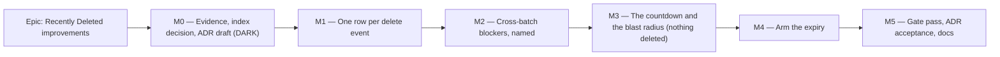

# Implementation Plan: Recently Deleted improvements

- **Feature spec:** [`./feature-spec.md`](./feature-spec.md) — **not yet approved**
- **Status:** Draft — awaiting approval
- **Owner:** _(unassigned)_

## Breakdown

### Epic

**Recently Deleted improvements** — make the recycle bin describe deletions rather than deletion
mechanics, make the cross-batch case actionable, and give deleted content a stated, automatic
horizon. No roadmap theme; arrived as a product-owner request.

**Two properties hold across every milestone and are asserted, not assumed:**

- **The CPM engine is not imported.** No file this epic touches imports `schedule/engine`. For
  `modules/staff` and `common/operational` that is already a computed gate
  (`staff-boundary.structural.spec.ts:109-113`, `retention-boundary.structural.spec.ts:47-76`).
- **The ADR-0034 recalculation parity gate is untouched**, in the honest form: there is nothing here
  to hold parity for. The one behavioural consequence — a surviving downstream plan whose cross-plan
  upstream was expired — is designed for in M4-T2 rather than covered by that sentence.

---

## Milestone M0 — Evidence, the index decision, and the ADR draft

**Outcome:** the two measurements this epic's design depends on exist, the schema question has been
put to the database-architect agent, and the ADR is drafted for review.
**Ships dark:** nothing is reachable. No product code changes; no route, no control, no column. The
capability lands in M1.
**Journey:** none — correctly, because there is nothing to press. (ADR-0081 §1: a dark milestone
says so in this slot rather than leaving it blank.)

---

#### Feature: measured foundations

> **Description:** replace two guesses with numbers, and route the only schema question through the
> agent that owns it.
> **Complexity:** M
> **Dependencies:** none
> **Risks:** the measurement contradicts the design → that is the point; the design changes, not the
> measurement.
> **Testing requirements:** none shipped; the harness output is committed under `docs/specs/recently-deleted/`.

##### Task M0-T1 — Measure the list and the expiry predicate

- **Description:** `EXPLAIN ANALYZE` the recycle-bin union (`recycle-bin.repository.ts:70-104`) and
  the candidate expiry scan, at realistic row counts, seeded through the public API using the
  ADR-0066 seed catalogue.
- **Complexity:** M
- **Dependencies:** none
- **Risks:** "realistic" is a guess → state the seeded shape explicitly (org row counts, deleted
  fraction) so a later reader can re-run it, the ADR-0053 M4 precedent.
- **Testing:** n/a (a harness, not a gate). Its script carries a docblock saying **where it bypasses
  the product** — ADR-0081 §3, written because `measure-band-copy` made a milestone look more
  finished than it was.
- **Development steps:**
  1. Seed an organisation with a realistic live:deleted ratio; record the exact shape.
  2. `EXPLAIN ANALYZE` the union at page 1 and at the last page (the exhaustion path,
     `use-deleted-items.ts:24`).
  3. `EXPLAIN ANALYZE` `deleted_at < :cutoff` per table.
  4. Write the numbers into the spec and into `docs/TECH_DEBT.md` #57 — which has said
     "still unmeasured" since 2026-07-27 and either closes here or is re-scoped with data.

##### Task M0-T2 — **database-architect** on the index question

- **Description:** put both predicates, both plans and the row counts to the **database-architect**
  agent and take its design for the indexes (or its decision that none is warranted).
- **Complexity:** S
- **Dependencies:** M0-T1
- **Risks:** the agent returns nothing, fails, or is slow → **re-run it.** CLAUDE.md §19.3:
  an unavailable agent is a reason to wait, never a reason to proceed, and deciding a change is too
  small to need it is exactly the judgement the agent exists to make. `csp_reports` was hand-written
  under that shortcut and the review found four defects, two fatal.
- **Testing:** the migration, if any, ships with the schema-drift check green
  (`pnpm check:schema-drift` / `pnpm test`).
- **Development steps:**
  1. Brief the agent with the two predicates, the `EXPLAIN` output, the existing partial-index
     precedents and TECH_DEBT #57's candidate.
  2. Write the migration exactly as designed — raw SQL for a partial index, which Prisma cannot
     express (the `delete_batch_id` precedent, `migration.sql:105-109`).
  3. Record the decision (including "no index") in the ADR.

##### Task M0-T3 — Draft the ADR

- **Description:** write the ADR from spec §4.7's outline. Confirm the number at filing
  (`ls docs/adr/009*.md` — highest today is 0095); record a collision rather than routing around it
  (the ADR-0071 / ADR-0079 lesson).
- **Complexity:** M
- **Dependencies:** M0-T1, M0-T2
- **Risks:** the ADR is written from the plan rather than the outcome → D-numbers that describe work
  not yet done are marked _Proposed_ and accept per milestone, the ADR-0035 ledger precedent.
- **Testing:** `pnpm check:doc-links`; add the ADR to `docs/adr/README.md` **in the same commit**
  (ADR-0078 found seven ADRs missing from that index).
- **Development steps:** draft → add to `docs/adr/README.md` → add the CLAUDE.md §16 entry when
  accepted, not before.

---

## Milestone M1 — One row per delete event

**Outcome:** a planner sees one row per deletion, expands it to see what it contains, and restores
the whole thing with one press.
**Entry point:** `/orgs/$orgSlug/recently-deleted` → the row's **Restore** button, accessible name
`Restore client James Test and 2 items`.
**Journey:** `apps/web/e2e/recently-deleted.spec.ts` — the **existing base journey**, extended.
Its `:77` assertion (`'Restore its parent first'` × 2) is inverted to zero for a same-batch cascade,
and a new step expands the group and asserts the members are named. Extending the existing suite
rather than adding one is deliberate: this screen already has a real journey, and a second suite
would need its own config and its own flag pins.

---

#### Feature: expose the restore unit

> **Description:** two additive read fields, so the client can group on identity rather than infer
> from a timestamp.
> **Complexity:** S
> **Dependencies:** none (independent of M0; may land in parallel)
> **Risks:** an additive field read as a breaking change → it is not; nothing is removed or retyped.
> **Testing requirements:** repository unit + Supertest against real Postgres (the union is raw SQL
> and a mocked Prisma proves nothing about it).

##### Task M1-T1 — `deleteBatchId` and `blockedBy` on the deleted-items read

- **Description:** add both to the union query, the repository row type, the service mapping, the
  DTO, `@repo/types` and the OpenAPI decorators.
- **Complexity:** M
- **Dependencies:** none
- **Risks:** `blockedBy` computed with a second query per row (N+1) → it is not; the union **already
  joins the parent** (`recycle-bin.repository.ts:81, :92`) and the columns come from that join.
- **Testing:** Supertest — a client cascade (every row shares one batch id, `blockedBy` null on the
  client and set on the descendants); a cross-batch case (plan blocked by a separately-deleted
  project); the defensive null-batch row.
- **Development steps:**
  1. `packages/types`: extend `DeletedHierarchyItem` (`index.ts:712-718`).
  2. `recycle-bin.repository.ts`: add the two columns to all three union branches; keep the cursor
     predicates byte-identical.
  3. `recycle-bin.service.ts:52-58`: map them.
  4. `dto/deleted-item-response.dto.ts`: `@ApiProperty` for both, `nullable: true`.
  5. `docs/API.md` in lock-step; changeset (`minor`, pre-1.0 additive).

##### Task M1-T2 — The pure grouping model

- **Description:** `features/recently-deleted/model/group-batches.ts` — rows → `DeletedBatchGroup[]`.
- **Complexity:** M
- **Dependencies:** M1-T1
- **Risks:** the root-selection rule drifts from `restoreBatch`'s → the rule is stated in one place
  and unit-tested against every cascade shape the API can produce; a group with no restorable root
  is blocked by definition, not by a second opinion.
- **Testing:** unit — client cascade; project cascade; lone plan; null batch id; two batches sharing
  a `deleted_at` to the millisecond (must stay two groups); a group of 2,000.
- **Development steps:** define the group type → group by batch id, nulls to singletons → pick the
  root (`canRestore: true`, else shallowest kind) → order by the root's `deletedAt DESC` → derive
  the "+ N items" count.

##### Task M1-T3 — The table renders groups

- **Description:** `RecentlyDeletedTable.tsx` renders one row per group with a disclosure listing
  members.
- **Complexity:** L
- **Dependencies:** M1-T2
- **Risks:** the disclosure is a hidden-content trap → it is a real `<button aria-expanded>` over a
  region, keyboard-operable, and the members are in the accessibility tree only when open.
  Restore-in-flight focus loss → keep the existing `aria-disabled` + guard pattern (`:42`, `:95`),
  never native `disabled`.
- **Testing:** component tests for loading / empty (copy unchanged) / error / restoring / grouped /
  blocked; an axe pass on the grouped table.
- **Development steps:**
  1. Row: kind + name + "+ N items" + timestamp.
  2. Disclosure listing members with their kinds.
  3. Restore posts once, to the root — `useRestoreItem` unchanged (`use-deleted-items.ts:42-56`).
  4. Announce the group ("Client James Test and 2 items restored"), inside the focus frame
     (ADR-0080's finding that the focus a deletion needs overwrites its own announcement).

##### Task M1-T4 — The duplicated heading, on all four screens

- **Description:** remove the one-crumb `Breadcrumbs` from `recently-deleted.tsx:19`,
  `clients.tsx:15`, `calendars.tsx:55`, `resources.tsx:64`.
- **Complexity:** S
- **Dependencies:** none
- **Risks:** a test locates a screen by its breadcrumb → grep before deleting; ADR-0091's rule
  applies (locate by role, not by copy).
- **Testing:** the existing route tests; assert **one** accessible name for the page title and no
  `nav[aria-label="Breadcrumb"]` on these four. Verify the assertion red first.
- **Development steps:** grep for breadcrumb-based locators across unit and e2e → delete the four
  lines → run the affected journeys locally (`scripts/e2e-local.sh web:<suite>`), not just the one
  CI names — ADR-0091 recorded three journeys broken by fixing only the suite CI reported.

##### Task M1-T5 — Extend the base journey

- **Description:** update `apps/web/e2e/recently-deleted.spec.ts` for the grouped shape.
- **Complexity:** S
- **Dependencies:** M1-T3
- **Risks:** the changed `:77` assertion reads as a weakened test → it is inverted, not deleted: the
  sentence must appear **zero** times for a same-batch cascade, which is a stronger claim than
  "twice".
- **Testing:** this **is** the test. Run it locally against a real API before pushing — the gate is
  not optional and not CI's job (CLAUDE.md §19.8).
- **Development steps:** invert `:77`; add an expand-and-name step; keep the axe check at `:80-81`;
  keep the second test (direct plan restore) as the group-of-one case.

---

## Milestone M2 — Cross-batch blockers, named

**Outcome:** a blocked deletion names its blocker, and offers a route through that enumerates
exactly what will come back.
**Entry point:** `/orgs/$orgSlug/recently-deleted` → the blocked group's **Restore Riverside
first…** button → the confirmation dialog.
**Journey:** a new step in the same base journey: delete a plan, then delete its project on a
separate call, assert the blocked group names the project, press the control, assert the dialog
enumerates the project's batch **including a sibling plan the blocked row cannot see**, confirm,
assert both restores are separate presses.

---

#### Feature: the blocking chain, made actionable

> **Description:** name the blocker, enumerate its batch, never auto-cascade.
> **Complexity:** M
> **Dependencies:** M1
> **Risks:** the enumeration is incomplete and the dialog lies → it is built from the same full page
> set the table already holds, and the test that proves it uses a sibling the blocked row cannot see.
> **Testing requirements:** unit (chain resolution), component (dialog contents, shaded control),
> journey.

##### Task M2-T1 — Resolve the blocking chain

- **Description:** extend `group-batches.ts` to walk `blockedBy` to the outermost blocker.
- **Complexity:** S
- **Dependencies:** M1-T2
- **Risks:** an unbounded walk → depth is ≤ 2 by the hierarchy (plan → project → client) and the
  walk carries a visited set and a hard cap regardless.
- **Testing:** unit — one level; two levels; a blocker absent from the page set (defensive: the
  control is withheld and the sentence still names it).
- **Development steps:** resolve → attach the blocker's group to the blocked group → expose the
  full member list of the blocker's batch.

##### Task M2-T2 — `RestoreAncestorDialog`

- **Description:** a confirmation naming every row in the ancestor's batch.
- **Complexity:** M
- **Dependencies:** M2-T1
- **Risks:** the dialog reads as "this will restore everything" and hides the second press → the
  copy states both steps explicitly.
- **Testing:** component — the sibling case (a row present in the ancestor batch and absent from the
  blocked group **must** appear); confirm issues exactly one restore; cancel issues none.
- **Development steps:** build on the shared `Dialog` + `FormSection` vocabulary (ADR-0061) → list
  members grouped by kind → confirm → on success refetch and leave the blocked group restorable.

##### Task M2-T3 — Shaded, not hidden, without the write permission

- **Description:** the blocked group's control shades with a reason for a reader who cannot write.
- **Complexity:** S
- **Dependencies:** M2-T2
- **Risks:** the reason sentence is a guess ("your role" said to someone who merely lacks a lock) —
  the ADR-0082 TECH_DEBT #114 failure. Here there is no pen involved, so role is the **only**
  possible reason and the sentence is true.
- **Testing:** component — the control is focusable, `aria-describedby`-linked to its reason, and
  `aria-disabled` rather than natively `disabled` (ADR-0082 / ADR-0083).

---

## Milestone M3 — The countdown and the blast radius, with nothing deleted

**Outcome:** every group states how long it has left, and the size of what is about to expire is
visible — **before any deletion mechanism exists**. This milestone is the notice period; see spec
CQ-2 for why it cannot be folded into M4.
**Entry point:** `/orgs/$orgSlug/recently-deleted` → the **Expires** column on every group, and the
summary line above the table ("2 deletions · 41 items · expire within 7 days"). Plus, **only if
CQ-1 resolves (b) or (c)**, the Retention section on `/staff`.
**Journey:** a step in the base journey asserting the Expires text on a freshly-deleted group
(`Expires in 90 days`) — proving the column exists and is fed by the real policy constant rather
than a fixture.

---

#### Feature: the horizon, stated

> **Description:** the period becomes a shared constant, the row states its own expiry, and the
> aggregate is visible.
> **Complexity:** M
> **Dependencies:** M1; M0-T3 for the period's decision record
> **Risks:** the countdown promises a deletion the product does not yet perform. Mitigation: the
> copy is a horizon, not a schedule, until M4 — and M3 and M4 are consecutive releases, not months
> apart.
> **Testing requirements:** unit as copy; component; journey step.

##### Task M3-T1 — The policy constant and its configuration

- **Description:** `RETENTION_HIERARCHY_DAYS` (default 90, `min(1).max(3650)`) and
  `RETENTION_HIERARCHY_ENABLED`, in `env.validation.ts` beside the existing three
  (`:154-190`), surfaced through `AppConfigService` (`:70-88` pattern). Exposed to the client on the
  existing deleted-items response `meta`, or as a shared constant — decided in this task and
  recorded, **not** duplicated in two places.
- **Complexity:** S
- **Dependencies:** M0-T3
- **Risks:** the client and server disagree about the period → one source; a structural test pins it.
- **Testing:** config unit tests; `.env.example` and `docs/DEPLOYMENT.md` updated in the same PR.

##### Task M3-T2 — `expiry-copy.ts`

- **Description:** pure copy: `Expires in 87 days` / `Expires tomorrow` / `Expires today` /
  `Expiring now`. Never a negative number; never "0 days" where a word is honest.
- **Complexity:** S
- **Dependencies:** M3-T1
- **Risks:** boundary arithmetic wrong at the edges → tested at 0, 1, 89, 90, 91 and past.
- **Testing:** unit, **as copy** — the `features/staff/model/retention-copy.ts` precedent, whose
  docblock explains why these distinctions are tested as strings and not through a DOM.

##### Task M3-T3 — The column and the summary line

- **Description:** an Expires column per group and an aggregate line above the table.
- **Complexity:** S
- **Dependencies:** M3-T2
- **Risks:** the aggregate is announced twice (visible + live region) → the ADR-0077 M8 duplication
  lesson; state it once, and let the live region carry the settled count only.
- **Testing:** component; axe; the journey step.

##### Task M3-T4 — _(conditional on CQ-1)_ The staff Retention row

- **Description:** one row on the staff Retention section for soft-deleted hierarchy: oldest age and
  batch count.
- **Complexity:** M
- **Dependencies:** CQ-1 answered (b) or (c); M3-T1
- **Risks:** **this is the ADR-0086 boundary.** If it goes ahead, the boundary spec gains a **fifth
  assertion** pinning the one permitted aggregate seam by name, and the ADR amends ADR-0086
  explicitly. It is **not** acceptable to satisfy the existing four scans by wording — a `$queryRaw`
  naming `FROM clients` passes both today while doing what they exist to prevent, and that file says
  so itself at `:117-119`.
- **Testing:** the amended structural spec, verified red against the un-amended version; the
  existing retention-copy suite extended; a staff journey step.
- **Development steps:** amend ADR-0086 in the new ADR → add the fifth assertion → the aggregate
  repository under `common/` returning `{ oldestDeletedAt, batchCount }` and **no row identity** →
  one field on `GET /staff/health` (never a second route — ADR-0087 M3's reasoning) → the panel row
  reusing `oldestSentence`/`overdueSentence`.

---

## Milestone M4 — Arm the expiry

**Outcome:** batches past the period are hard-deleted automatically, each leaving one audit row.
**Entry point:** no new control — the sweep is a timer, not a request. Its **observable** entry
point is the `hierarchy.expired` row on `/orgs/$orgSlug/audit-log`, filterable under **Deletions**;
the rollback control is the operator's `RETENTION_HIERARCHY_ENABLED=false` plus a recreate.
**Journey:** a Supertest e2e (`apps/api/test/`) that seeds a batch with a backdated `deleted_at`,
drives the runner directly against **real Postgres** with a real instant (the
`RetentionSweepRunner` seam, `retention-sweep.runner.ts:56-60`), and asserts every row is gone,
every FK survived, and exactly one audit row exists. A mocked Prisma cannot prove any of this —
ADR-0086 M2 shipped a milestone unable to serve a request with 1,589 unit tests green for exactly
that reason.

---

#### Feature: the FK-ordered hard delete

> **Description:** the statement, per batch, in one transaction, with its audit row.
> **Complexity:** XL
> **Dependencies:** M0-T2 (index), M0-T3 (ADR), M3 (the notice period)
> **Risks:** see the rollup.
> **Testing requirements:** Supertest against real Postgres for every case below. This is the
> milestone where unit tests are least informative and e2e is the gate.

##### Task M4-T1 — Prove the delete order before writing the service

- **Description:** a Supertest case that hard-deletes one seeded plan batch by hand, in the spec
  §4.5 order, and **establishes whether the activity self-FK loop (R2) is needed**.
- **Complexity:** M
- **Dependencies:** none within M4
- **Risks:** the spec's `RESTRICT`-fires-immediately reasoning is wrong → then the loop is deleted
  and the spec corrected in place. That is the point of measuring before building; the claim is
  currently marked _reasoned, not observed_.
- **Testing:** the case itself. Seed via the ADR-0066 catalogue: a plan with a WBS summary and
  children, resource assignments, steps, notes, a baseline, a share link and a project calendar.
- **Development steps:** seed → soft-delete → attempt the single-statement activity delete and
  record what Postgres does → establish the order that works → write the finding into the spec.

##### Task M4-T2 — The cross-plan endpoint case

- **Description:** prove what happens when an expiring plan is a live cross-plan dependency
  endpoint, and what the surviving downstream plan does next.
- **Complexity:** M
- **Dependencies:** M4-T1
- **Risks:** **the epic's single largest correctness risk.** ADR-0045's programme recalc and
  pull-staleness may not tolerate a vanished upstream; nothing in the code was read that establishes
  they do. If they do not, this task's outcome changes the design (the alternative — refusing to
  expire such a plan — is a permanent leak and would have to be recorded as one).
- **Testing:** seed two plans with a cross-plan edge → expire the upstream → recalculate the
  downstream → assert it succeeds, and assert the audit payload's `crossPlanEdgesRemoved`.

##### Task M4-T3 — `HierarchyExpiryRunner`

- **Description:** the statement. Takes an instant, reads no clock, holds no timer — the
  `RetentionSweepRunner` seam exactly (`:56-60`), which is what makes M4's journey possible.
- **Complexity:** L
- **Dependencies:** M4-T1, M4-T2
- **Risks:** a run holds one long transaction → **one transaction per batch**, a per-run batch cap,
  and a per-batch catch so one bad batch cannot stop its siblings (`retention-sweep.runner.ts:124-139`).
  Table names reaching SQL from a variable → literals only, as the existing boundary test requires
  (`retention-boundary.structural.spec.ts:78-91`).
- **Testing:** Supertest — an expired batch; a batch one hour inside the period (untouched); a batch
  with 2,000 activities; a batch whose plan is a cross-plan endpoint; a null-batch defensive row; a
  concurrent restore.
- **Development steps:** select candidate roots past the cutoff, capped → per batch: resolve owned
  scope → delete in the M4-T1 order → audit inside the tx → commit → return scalars.

##### Task M4-T4 — The `hierarchy.expired` audit row

- **Description:** the vocabulary entry and the producer.
- **Complexity:** M
- **Dependencies:** M4-T3
- **Risks:** the counts are recorded as a nested object and silently reduced to a type marker — the
  ADR-0073 C3.1 failure — → **flat scalars only**, asserted in a redactor test.
- **Testing:** unit (redactor allow-list, category exhaustiveness), Supertest (one row per batch,
  never per swept row; the row survives its subject), and the producer-seam structural spec.
- **Development steps:**
  1. `AUDIT_ACTIONS` + `AUDIT_ACTION_CATEGORY` (`deletions`) in `packages/types`.
  2. Redactor allow-list for the flat payload keys.
  3. `audit-copy.ts` (`:51-148`) — label and sentence.
  4. `audit-producer-seams.structural.spec.ts:60-73` — add the producer to the **transactional**
     list, so `recordBestEffort` there becomes a build failure.
  5. Record in the ADR that the route census structurally cannot see a timer-driven producer, the
     ADR-0087 admission repeated honestly rather than implied away; add the `docs/TECH_DEBT.md` row.

##### Task M4-T5 — `HierarchyExpiryService` (the schedule) and its alerting

- **Description:** the timer. One `setInterval`, `.unref()`'d, **no timer at all when disabled**,
  cleared on shutdown; alert after three consecutive failed runs.
- **Complexity:** M
- **Dependencies:** M4-T3
- **Risks:** an unhandled rejection kills the API — the exact defect
  `retention-sweep.service.ts:177-200` records catching late; copy the `try/catch/finally` and the
  `recordFailedRun` distinction (a run that threw must not be filed as clean, which silenced the
  threshold once already).
- **Testing:** unit (disabled creates no timer; overlap guard released in `finally`; a throwing
  sweep counts as a failure and alerts at three); API e2e driving the DI-constructed service.
- **Development steps:** mirror `RetentionSweepService` → **do not export it from its module** (the
  same refusal, for the same reason: a controller must not be able to start, stop or re-run it) →
  status store entries so M3's panel can read it.

---

## Milestone M5 — Gate pass, ADR acceptance, docs

**Outcome:** the epic is reviewed by the specialists, its findings folded, its ADR accepted and its
documentation reconciled.
**Entry point:** none new — this milestone changes no capability. **Ships dark** in the ADR-0081
sense: it is a review and reconciliation slice.
**Journey:** the full base journey plus the API e2e, run **locally** before push, not delegated to
CI (CLAUDE.md §19.8 / PROCESS.md DoD).

---

##### Task M5-T1 — The six reviews

- **Description:** run **security-reviewer** (the first aimable hard delete of customer content; the
  ADR-0086 boundary if CQ-1 went (b)), **backend-performance-reviewer** (the FK-ordered delete, the
  candidate scan, TECH_DEBT #57), **api-reviewer** (the two additive fields, OpenAPI, envelopes),
  **accessibility-reviewer** (the disclosure, the dialog, the shaded control, the live regions),
  **ux-reviewer** (the group copy, the blocked sentence, the countdown wording) and
  **component-reviewer** (the group row, the dialog, token/variant usage) over the combined diff.
- **Complexity:** L
- **Risks:** treating the gate pass as a formality. Five consecutive epics found blocking defects in
  code that had passed a human read, and four of the last five found the same shape — one correct
  pattern applied to a control and not its neighbour.
- **Testing:** every fix carries a regression test **verified red against the old code first**.

##### Task M5-T2 — Reconcile the documents

- **Description:** `CLAUDE.md` §16 (the ADR entry) and §17 (the hard-delete bullet, which this epic
  makes two paths and not one); `docs/DATABASE.md`; `docs/API.md`; `docs/DEPLOYMENT.md`;
  `docs/TECH_DEBT.md` (#57 closed or re-scoped with M0-T1's numbers; new rows for activity-level
  expiry and the census blind spot); `docs/TESTING.md` if a new suite exists.
- **Complexity:** M
- **Testing:** `pnpm check:counts`, `check:claims`, `check:doc-links`, `check:flags`,
  `check:playbook`.

##### Task M5-T3 — Accept the ADR; changeset

- **Description:** move the ADR to Accepted per milestone; add the changeset (`minor`, pre-1.0).
- **Complexity:** S

---

## Sequencing & slices

Each milestone is releasable on its own and leaves `main` releasable.

| #   | Slice                                     | Releasable alone? | Flag                                                                                                                                                                                |
| --- | ----------------------------------------- | ----------------- | ----------------------------------------------------------------------------------------------------------------------------------------------------------------------------------- |
| M0  | Measurement, index, ADR draft             | Yes (dark)        | none                                                                                                                                                                                |
| M1  | Grouped list + heading fix                | Yes               | **none** — a Class A flag is a build failure (`flag-retirement.json:542-543`, `check-flags.mjs:189-196`); the ADR-0061 precedent applies, mitigated by a revertible commit boundary |
| M2  | Cross-batch blockers                      | Yes               | none                                                                                                                                                                                |
| M3  | Countdown + blast radius, nothing deleted | Yes               | none client-side                                                                                                                                                                    |
| M4  | Arm the expiry                            | Yes               | **server-side** `RETENTION_HIERARCHY_ENABLED` — the real rollback contract, because a `VITE_` constant cannot gate a server producer (ADR-0060 M0 / ADR-0074)                       |
| M5  | Gate pass and docs                        | Yes               | none                                                                                                                                                                                |

**M3 must ship in a release before M4** — spec CQ-2. This is the one ordering constraint that is not
a dependency but a decision: the boot sweep is unawaited (`retention-sweep.service.ts:110-113`), so
in a single release the blast radius becomes readable only after it has already been deleted.

**M1 and M2 may land while M0 is in flight**; only M4 depends on M0's index and ADR.

## Definition of Done (per task)

Each task's PR satisfies the Feature Completion Criteria in [`docs/PROCESS.md`](../../PROCESS.md).
Two apply with unusual force here:

- **The pre-push gate is run, not written.** `pnpm lint && pnpm typecheck && pnpm test`, **plus
  `scripts/e2e-local.sh api`** for every `apps/api` task (M1-T1, all of M4) and
  **`scripts/e2e-local.sh web:<suite>`** for every web task. A local database is available and
  always has been.
- **After any label or layout change, run every journey**, not the one CI names (ADR-0091's
  recorded lesson: three journeys broke and each was found by CI rather than locally).

## Risks & assumptions (rollup)

| Risk / assumption                                                                                                                                                                               | Likelihood | Impact   | Mitigation                                                                                                                                                                      |
| ----------------------------------------------------------------------------------------------------------------------------------------------------------------------------------------------- | ---------- | -------- | ------------------------------------------------------------------------------------------------------------------------------------------------------------------------------- |
| **An expired plan is a live cross-plan dependency endpoint and the surviving downstream plan breaks** (ADR-0045). Nothing read establishes that programme recalc tolerates a vanished upstream. | med        | **high** | M4-T2 proves it against a real database **before** M4-T3 is written; if it does not hold, the design changes and the ADR records the alternative.                               |
| **The 90-day clock is retroactive**, so the first armed tick removes the entire existing backlog.                                                                                               | high       | **high** | CQ-3; M3→M4 split; `RETENTION_HIERARCHY_DAYS` as an operator override for the first release.                                                                                    |
| **The staff panel cannot be built as briefed** without amending ADR-0086's structural boundary.                                                                                                 | certain    | med      | CQ-1. Default is the organisation-side summary, which needs no amendment and reaches the people who can act.                                                                    |
| **"Blast radius visible before the first tick" is false in a single release.**                                                                                                                  | certain    | med      | CQ-2, and it is stated rather than inherited.                                                                                                                                   |
| The activity self-FK forces level-order deletion (`RESTRICT` fires immediately). **Reasoned from the schema and PostgreSQL's documented semantics; not observed.**                              | med        | med      | M4-T1 establishes it against a real database before anything depends on it.                                                                                                     |
| A long expiry transaction blocks list reads on `clients`/`projects`/`plans`.                                                                                                                    | med        | med      | One transaction per batch, per-run cap, per-batch catch. Measured in M0-T1's environment.                                                                                       |
| The audit payload's counts are recorded as a nested object and silently reduced to a type marker (the ADR-0073 C3.1 failure).                                                                   | med        | med      | Flat scalars from the start, asserted in a redactor test.                                                                                                                       |
| Activity-level soft deletes keep growing unbounded (out of scope, CQ-4).                                                                                                                        | certain    | low      | A `TECH_DEBT` row in the same PR, not silence.                                                                                                                                  |
| Grouping ships unflagged, so a defect cannot be switched off.                                                                                                                                   | low        | med      | Revertible commit boundary per milestone; the base journey extended in the same PR; the ADR-0061 precedent named explicitly.                                                    |
| TECH_DEBT #57's index turns out to be unnecessary and M0-T2 ships nothing.                                                                                                                      | med        | low      | That is a valid outcome and is recorded as one. The failure mode to avoid is shipping a guessed index alongside a refactor, which the repository comment already warns against. |
| The ADR number is taken between plan and filing (ADR-0079's exact history).                                                                                                                     | med        | low      | Confirm at filing; record the collision rather than routing around it.                                                                                                          |

---

## Pre-build review — findings folded (2026-08-18)

Six specialists were run over **this plan**, before any code, on the product owner's instruction.
The precedent is ADR-0090 M0, where a five-specialist review of a plan found blocking defects in the
repair itself. Four have reported; **all four blocked**, for nine findings between them. Each is
recorded here with the task it amends, so the change is traceable rather than absorbed.

**Three load-bearing claims were verified against the code before being accepted** — this plan had
three of its four brief claims move when checked, so a reviewer's citation gets the same treatment.

### Blocking — folded

| #      | From     | Finding                                                                                                                                                                                                                                                                                                                                                                                       | Resolution                                                                                                                                                                                                                                                                                                                                                                 |
| ------ | -------- | --------------------------------------------------------------------------------------------------------------------------------------------------------------------------------------------------------------------------------------------------------------------------------------------------------------------------------------------------------------------------------------------- | -------------------------------------------------------------------------------------------------------------------------------------------------------------------------------------------------------------------------------------------------------------------------------------------------------------------------------------------------------------------------- |
| **B1** | security | **The cited structural gate cannot cover the new runner.** M4-T3 leans on `retention-boundary.structural.spec.ts:78-91`. **Verified:** `OPERATIONAL_DIR = join(__dirname)` with a non-recursive `readdirSync` — it scans one directory, and it _forbids_ the very Prisma accessors a hierarchy expiry needs. Wherever the runner lands it is ungated, and the plan never names its directory. | **M4 gains a task**: a sibling structural spec scoped to the runner's real directory, pinning literal-only table names, no export from the module, and no controller caller. **The plan must name the target directory explicitly.**                                                                                                                                       |
| **B2** | api      | **Grouping silently depends on an invariant M0 might remove.** **Verified:** `use-deleted-items.ts:24` calls `apiFetchAllPages`, so a batch cannot straddle a _rendered_ page today. But TECH_DEBT #57 — which M0-T1 measures — explicitly asks whether the screen should page to exhaustion at all. M1/M2/M3 all rest on the answer being "yes".                                             | **M0-T1 gains an explicit output**: either a stated rule that this route stays fetched-to-exhaustion while client-side grouping exists (cross-referenced from #57 so a later perf fix cannot quietly break restore), or a per-group "may be incomplete" flag. Decided in M0, not discovered in M1.                                                                         |
| **B3** | a11y     | **The grouped table's markup is undecided at the one point where deciding is cheap.** **Verified:** `data-table.tsx` has no `colSpan`, no detail row, no expand; `Column.cell` returns one column's content. So how a member list attaches to a row is unanswered — the exact silence that cost ADR-0095 M5 **110 critical** `aria-required-children` violations.                             | **§4.8 and M1-T3 must name the pattern**: a disclosure per group row, the member list in a **sibling `<tr>` with one `<td colSpan>`**, so every `<tr>` contains only cells. **Not** a `treegrid` — members carry no per-cell actions. Also: extend `DataTable` or record the divergence from "the single table primitive". The axe pass runs **with the disclosure open**. |
| **B4** | a11y     | **The cross-batch success path has no announcement and no focus destination**, unlike its M1 sibling. `Dialog` is a native `<dialog>` that restores focus **asynchronously** to the invoker — and the invoker here is the blocked row's button, whose label changes the instant the restore succeeds. ADR-0080 and ADR-0095 M6 both record this shape.                                        | **M2-T2 gains**: an explicit success announcement, an explicit focus destination (the `regionRef` anchor, never native restore-to-invoker), and a test against the real re-render.                                                                                                                                                                                         |
| **B5** | ux       | **The retention rule is never stated, only implied by countdowns.** `recently-deleted.tsx:23-26` describes cascade-restore and says nothing about 90 days. The first time a member learns the rule exists is a countdown on something they came here to check.                                                                                                                                | **M3 gains a copy task**: the intro states the rule ("kept for 90 days, then permanently removed"), and the delete-confirmation copy elsewhere says deletion is not forever. CQ-2's split buys a _time_ notice; this buys a _stated_ one.                                                                                                                                  |
| **B6** | ux       | **`RestoreAncestorDialog`'s enumeration has no cap**, though the row disclosure explicitly does. A client-rooted batch can hold hundreds — a wall of text at the moment of decision.                                                                                                                                                                                                          | **M2-T2**: same capping/virtualisation as the disclosure, or a kind-grouped summary with expand-for-full. Add a large-ancestor-batch test.                                                                                                                                                                                                                                 |
| **B7** | ux       | **No in-flight state on the dialog's Confirm** — states listed as idle/confirming/error, where "confirming" means "open", not "in flight". The `disabled`-flips-twice defect ADR-0060 M6 and ADR-0063 M6 both record.                                                                                                                                                                         | **M2-T2**: adopt the pattern already in this very file — `RecentlyDeletedTable.tsx:38-65`'s `restoringIds` + `aria-disabled`/`aria-busy`, never native `disabled`.                                                                                                                                                                                                         |
| **B8** | api      | **`blockedBy` needs a real nested DTO class**, not `nullable: true` on a bare interface — `@nestjs/swagger` will not produce a usable schema. The convention is `DependencyEndpointDto` (`dependency-response.dto.ts:15`). ADR-0053 M6 recorded this exact gap as a real finding.                                                                                                             | **M1-T1**: declare a `BlockedByDto` class with its own `@ApiProperty`s, and type `kind` as `'client' \| 'project'` — a plan can never block anything.                                                                                                                                                                                                                      |
| **B9** | api      | **The countdown's source of truth is left open** while `RETENTION_HIERARCHY_DAYS` is an operator override. A hard-coded client constant makes every sentence silently wrong on an overridden host, undetectably.                                                                                                                                                                              | **M3-T1 is decided now, not deferred**: the effective period ships in `meta` on the deleted-items response. Additive, and `docs/API.md` already has `meta` carrying a roll-up.                                                                                                                                                                                             |

### Accepted as suggestions (not blocking)

- `blockedBy` duplicates what the client re-derives from its own group lookup — ship `blockedByBatchId` alone, **or** state the redundancy is a deliberate fallback and test the staleness case. Decide in M1-T1.
- Note on the field that `blockedBy` is **per-row, not per-group**: a same-batch descendant carries a non-null blocker pointing at its own batch's root, and reading it per-row would re-create the noise this epic removes.
- Row summary: prefer "+ 1 project, 1 plan" over a bare "+ 2 items".
- "Expiring now" overstates — nothing happens at that instant; prefer "Expiring soon".
- The aggregate line should separate the soon-to-expire subset from the total.
- State out loud that **"just the plan, not the client" is impossible** while restore is batch-keyed — a known, accepted limitation, currently implicit.
- Land the four-screen heading fix as **its own commit**, so the per-milestone revert boundary stays meaningful.
- Pin the "no colour-alone urgency" rule as an explicit M3-T3 acceptance criterion rather than relying on it holding by luck.
- State `role="dialog"`, not `alertdialog` — restoring is not destructive.
- If CQ-1 ever moves to (b)/(c), the staff aggregate must be **installation-wide, never grouped by organisation**, or it becomes an oracle for which tenant has a backlog.
- M4's concurrency test must assert **which side wins** and that no row is left half-restored, not merely that the sweep does not crash.
- Add an M4 pre-flight line to `docs/DEPLOYMENT.md`: the operator consciously sets or confirms `RETENTION_HIERARCHY_DAYS` before that release, since ADR-0047 auto-pulls and arms it.
- The new ADR states that hard-deleting a row does **not** remove its name from `audit_events` (ADR-0085 D1) — pre-existing, but this epic is the one framed around retention.
- Re-verify the `recycle-bin.repository.ts` line citations (the parent joins are at 83/94, cited as 81/92) before the ADR is filed.

### Still outstanding

**database-architect** (the index question and the FK-safe delete order — mandatory, CLAUDE.md §19.3) and
**backend-performance** have not yet reported. **M0 does not start until both do**, because the index
decision and the deletion order are M0/M4 inputs rather than review commentary.
