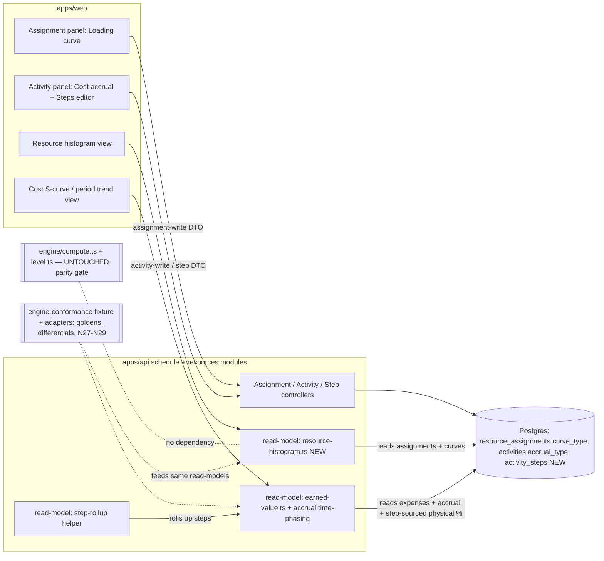
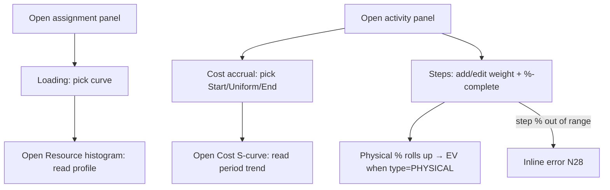

# Feature Spec: Resource loading curves, cost accrual & weighted activity steps (M7 rung 5)

- **Status:** Draft — awaiting approval
- **Author(s):** feature-analyst (Product Owner / Solution Architect / Technical Lead hats)
- **Date:** 2026-07-18
- **Tracking issue / epic:** #TBD
- **Roadmap link:** Engine Conformance & Validation Framework — the **last remaining ⚪ capability-matrix row** (`docs/ROADMAP.md`; `docs/specs/engine-conformance-framework/`)
- **Related ADR(s):** ADR-0044 (NEW, drafted with this spec — resource curves, cost accrual & activity steps); ADR-0035 §31/§32/§33 (NEW sections, accept-with-slice); builds on ADR-0039 (resource model), ADR-0040 (units/duration triad), ADR-0041 (levelling), ADR-0042 (percent-complete types & Earned Value read-model), ADR-0025 (baselines / cost baseline), ADR-0037 (own-calendar instant axis), ADR-0034 (conformance methodology), ADR-0016/0012 (tenancy / RBAC)

> **Scope note.** This spec designs the **three sub-features of the single remaining ⚪ row** — (1)
> resource **loading curves / demand distribution**, (2) **cost accrual / period trending**, and (3)
> **weighted activity steps** — each as an **independently shippable slice**. All three are **pure
> read-model / additive-input** extensions of the resource & EV stack that already landed (ADR-0039→0042):
> **none touches the pure CPM engine (`compute.ts`), and — in this rung — none changes the levelling pass
> (`level.ts`).** The parity gate holds by construction for each slice (absent data ⇒ byte-identical). One
> deliberate deferral is called out and turned into a critical question: **curve-aware levelling** (feeding a
> non-flat demand shape into `level.ts`) is **out of scope** here; levelling stays flat-rate.

---

## 1. Business understanding

### Problem

SchedulePoint's CPM engine and resource stack are functionally **complete through M7**: resources
(ADR-0039), the duration/units triad (ADR-0040), resource levelling (ADR-0041) and Earned Value as a pure
read-model (ADR-0042) have all landed. The [capability matrix](../engine-conformance-framework/CAPABILITY_MATRIX.md)
now stands at **31 ✅ / 1 ⚪**, and after inter-project dates shipped (ADR-0043, scenario S09) **exactly one
⚪ row remains**:

> **"Resource curves, cost accrual & activity steps"** — fixture tags `code_steps`, `accrual_start` /
> `accrual_uniform` / `accrual_end`, and `res_curve_bell` / `res_curve_front_loaded` / `res_curve_back_loaded`
> / `res_curve_double_peak`.

This is the **final resource-side ⚪** and closing it **completes the capability matrix** (the only thing
sketched-but-unscored beyond it is the external _live cross-plan solve_, which is a deferred future milestone,
not a matrix row). Today, three real planning needs are unmet:

1. **Resource loading is assumed flat.** A resource assigned to an activity is modelled as producing at a
   constant rate for the whole duration. Real crews and plant ramp up and wind down — a bell for a pour, a
   front-loaded mobilisation, a double-peak for two shifts. Planners cannot see a realistic **resource
   histogram** (loading over time), so they cannot spot a demand spike that a flat model hides.
2. **Cost is recognised uniformly.** EV time-phases every activity's cost linearly across its duration. But a
   **crane mobilisation** (£45k) is incurred **at the start**, a **retention/commissioning** cost **at the
   end**, and most work **uniformly**. Without accrual, the **PV / cash-flow S-curve** and period cost trend
   are wrong at the extremes — exactly where finance forecasting cares most.
3. **Physical progress is a single guessed number.** ADR-0042 landed a single manual `physicalPercentComplete`
   field. Planners on real jobs track progress against a **weighted checklist** ("rig set-up 10%, drive piles
   1-40 35%, …") and want the physical % to **roll up from the steps** rather than be a fingertip estimate.

The conformance fixture encodes all three precisely (`resource_curves` 21-point profiles, `expenses.accrual_type`,
and a `steps` child table with weights), and the matrix row is the last unscored axis.

### Users

- **Planner** (`PLANNER`) — owns a plan; picks a **loading curve** on a resource assignment, sets the
  **accrual type** on an activity's expense, and defines/maintains an activity's **weighted steps**; reads the
  resource **histogram** and the **cost / cash-flow S-curve**.
- **Org Admin** (`ORG_ADMIN`) — same, plan-wide; owns programme-level cost/finance reporting policy.
- **Contributor** (`CONTRIBUTOR`) — updates **step percent-complete** as work progresses (a progress input,
  like physical %); may set curves/accrual on activities they can edit.
- **Viewer / External Guest** — read-only; sees histograms, S-curves and rolled-up physical %, never edits.
- **Finance / commercial stakeholder** (via a Viewer seat) — reads the **period cost trend** (accrual-shaped
  PV/AC) for cash-flow forecasting.
- **The conformance harness** (CI, a first-class non-human "user") — feeds the fixture's `resource_curves`,
  `expenses.accrual_type` and `steps` through the read-models to assert the goldens, differentials and
  negatives (ADR-0034 three tiers).

### Primary use cases

1. **Shape a resource's loading** — a planner assigns a curve (bell / front-loaded / back-loaded / double-peak /
   uniform) to a resource assignment and reads a **resource histogram** showing units-over-time per resource.
2. **Set how a cost accrues** — a planner marks an activity's expense as accruing at **start**, **uniform**, or
   at **end**, and reads a **cost / PV S-curve** that recognises the cost at the right time.
3. **Track physical progress by weighted steps** — a planner defines an activity's steps (name + weight),
   contributors update each step's %-complete, and the activity's **physical %-complete is computed** from the
   weighted rollup, feeding ADR-0042's `PHYSICAL` Earned-Value measure.

### User journeys

**Happy path — curves.** A planner opens the assignment for "Welding crew" on activity A7100, expands
**Loading**, and picks **Front-loaded**. They open the plan's **Resource histogram** and see the crew's units
peak early and taper — instead of a flat bar — matching how the crew actually staffs up. Nothing about the
schedule dates moves.

**Happy path — accrual.** On the crane-mobilisation expense of A6100 the planner sets **Accrual = Start**. The
plan's **cost S-curve** now steps up £45k on A6100's start date rather than smearing it across the mobilisation,
so the month-1 cash-flow forecast is correct. The CPM dates are untouched.

**Happy path — steps.** The planner defines A4200's four steps (weights 10/35/35/20). As piling proceeds a
contributor sets step 1 to 100%, step 2 to 70%, step 3 to 1.43%. The activity's **physical %-complete rolls up
to ≈35%** (the weighted mean), which — because A4200's `percentCompleteType` is `PHYSICAL` — is the EV
performance % (deliberately diverging from its 40% duration %, the fixture's `prog_rd_vs_pct_divergence` case).

**Alternate — no data (parity).** An assignment with **no curve** loads flat (today's behaviour); an expense
with **no accrual type** accrues uniform (today's behaviour); an activity with **no steps** keeps its manual
`physicalPercentComplete`. Every existing histogram/EV/recalc result is byte-identical.

**Alternate — steps then manual.** An activity has steps **and** a hand-entered `physicalPercentComplete`. The
**steps win** (the rollup is authoritative when steps exist); the manual field is ignored while steps exist
(surfaced in the UI so the planner isn't surprised).

### Expected outcomes

- Planners see a **realistic resource histogram** (non-flat loading) and a **correctly time-phased cost /
  cash-flow S-curve**, and can drive physical progress from a **weighted checklist**.
- The engine's **last ⚪ capability-matrix row completes** (⚪ → ✅), fully documented (ADR-0044 + ADR-0035
  §31/§32/§33) and scored against the fixture. **The capability matrix is closed** (0 ⚪ remaining bar the
  sketched external live-solve, which is not a matrix row).
- The **byte-parity gate is preserved** for each slice — the CPM engine and the levelling pass are untouched.

### Success criteria

- The `code_steps` / `accrual_*` / `res_curve_*` capability-matrix row moves ⚪ → ✅ in the PR(s) that land the
  behaviour (ADR-0034 living-matrix rule); the summary tally becomes **32 ✅ / 0 ⚪**.
- **Self-baselined goldens** (ADR-0034 tier 3, no external oracle) pass first-principles:
  - **Steps:** A4200 rolls up to **35.0005%** physical (weights 10/35/35/20 × 100/70/1.43/0) and A7100 to 0%.
  - **Accrual:** the crane-mob expense (E001, `START`, £45k) contributes its **full £45k to PV once A6100
    starts**; a `UNIFORM` expense (E002) time-phases linearly (today's math); an `END` expense (E004)
    contributes **0 to PV until the activity finishes**.
  - **Curves:** a front-loaded 21-point profile distributes an assignment's `budgetedUnits` across the
    activity's duration buckets summing to the total (the histogram integrates to `budgetedUnits`).
- **Differentials** (ADR-0034 tier 2, "flip-one-option-must-differ"): flipping an activity's
  `percentCompleteType` step rollup on/off, an expense's accrual type (START vs UNIFORM vs END), and an
  assignment's curve (UNIFORM vs FRONT_LOADED) each **changes the read-model output**.
- **Byte-parity gate** (ADR-0034 tier 1 structural + goldens): with no curves, no accrual overrides and no
  steps, every prior recalc/levelling/EV golden/snapshot is **byte-identical**.
- Negatives asserted: **N27** (step weights sum to 0 → fall back to manual, warn), **N28** (step %-complete out
  of 0–100 → reject), **N29** (curve profile that does not sum to 100 → normalise + warn).
- `pnpm lint && pnpm typecheck && pnpm test` green; recalc p95 unchanged (no engine/levelling change); the new
  histogram / cost-trend reads are paginated/plan-scoped and O(activities).

### Open questions

See **§"Critical questions"** at the end. Each has a stated default so a non-answer still yields a buildable
plan.

## 2. Functional requirements

### User stories & acceptance criteria

> **US-1 (Curves)** — As a **Planner**, I want to assign a **loading curve** to a resource assignment, so that
> the resource histogram reflects how the resource actually ramps over the activity.
>
> **Acceptance criteria**
>
> - **Given** an assignment I can edit **when** I set its curve to `FRONT_LOADED` **then** the resource
>   histogram distributes its `budgetedUnits` across the activity's duration per the curve, and the
>   distribution **sums to `budgetedUnits`** (units are conserved).
> - **Given** an assignment with **no** curve **then** it loads **flat** (uniform) — the parity default.
> - **Given** any curve **then** the activity's **CPM dates are unchanged** (curves never schedule).

> **US-2 (Accrual)** — As a **Planner**, I want to set how an activity's cost **accrues** (start / uniform /
> end), so that the PV / cost S-curve recognises the cost at the right time.
>
> **Acceptance criteria**
>
> - **Given** an activity expense **when** I set accrual to `START` and recalculate the EV read-model **then**
>   the whole expense is planned/earned at the activity's **start** (PV steps up on the start date).
> - **Given** accrual `END` **then** the expense contributes **0 to PV until the finish**, then the full amount.
> - **Given** accrual `UNIFORM` or unset **then** the expense time-phases **linearly** — byte-identical to
>   today's EV read-model (the parity default).
> - **Given** any accrual setting **then** the **CPM dates are unchanged** (accrual is a read-model concern).

> **US-3 (Steps)** — As a **Planner/Contributor**, I want to track an activity's progress via **weighted
> steps**, so that its physical %-complete rolls up from a checklist instead of a single guess.
>
> **Acceptance criteria**
>
> - **Given** an activity with steps (weights `wᵢ`, step %-complete `pᵢ`) **then** its physical %-complete =
>   `Σ(wᵢ·pᵢ) / Σ(wᵢ)`, and — when `percentCompleteType = PHYSICAL` — this is the EV performance %.
> - **Given** an activity with steps **and** a manual `physicalPercentComplete` **then** the **steps rollup
>   wins**; the manual field is ignored while steps exist (surfaced in UI).
> - **Given** an activity with **no** steps **then** the manual `physicalPercentComplete` behaves exactly as
>   today (parity).
> - **Given** any steps **then** the **CPM dates are unchanged** (steps feed physical %, not the schedule).

> **US-4** — As a **Viewer / External Guest**, I want to read the resource histogram, the cost S-curve and the
> rolled-up physical %, so that I understand loading, cash-flow and progress — **read-only**.

> **US-5** — As the **conformance harness**, I want to feed the fixture's `resource_curves`,
> `expenses.accrual_type` and `steps` through the read-models, so that the goldens, differentials and negatives
> assert the documented semantics (ADR-0034 three tiers).

### Workflows

1. **Assign a curve:** open assignment panel → **Loading** → pick a curve (Uniform / Bell / Front-loaded /
   Back-loaded / Double-peak) → save (validated) → open plan **Resource histogram** to read the profile.
2. **Set accrual:** open activity/expense panel → **Cost accrual** → pick Start / Uniform / End → save → open
   plan **Cost S-curve / period trend** to read the time-phased PV/AC.
3. **Define & progress steps:** open activity panel → **Steps** → add/edit steps (name, weight); a contributor
   sets each step's %-complete → the activity's physical % rolls up automatically → feeds EV when
   `percentCompleteType = PHYSICAL`.
4. **Read:** the histogram, cost-trend and physical-% rollup are **live reads** (as of the data date, like the
   ADR-0042 EV read and float-paths) — no new write pass, no recalc required.

### Edge cases

- **Empty (parity):** no curve / no accrual / no steps → each read-model behaves exactly as today.
- **Steps sum-of-weights = 0 (N27):** every step weight 0 → the rollup is undefined → **fall back to the
  manual `physicalPercentComplete`** and count a warning (never divide-by-zero, never reject the plan).
- **Step %-complete out of 0–100 (N28):** boundary **reject** at the DTO/service (mirrors N23 physical-% range).
- **Curve profile that does not sum to 100 (N29):** **normalise** the profile to the assignment's
  `budgetedUnits` (units are conserved) and count a warning (never silently over/under-load).
- **Curve on a zero-duration activity (milestone):** the histogram places all units at the single instant
  (no distribution); documented.
- **Accrual on a not-started activity:** PV is time-phased as today (0 until start for START/UNIFORM);
  interacts cleanly with the ADR-0042 `costWarningCount` (N24) — no change to that guard.
- **Accrual `END` on an in-progress activity past its finish:** full amount recognised (finished).
- **Concurrent edits:** curves (assignment), accrual (activity/expense) and steps (child rows) all go through
  the existing optimistic-lock + plan advisory-lock; a step is a child of an activity and versioned with it.
- **Curve × assignment lag (fixture A7100):** the curve distributes over the assignment's **effective span**
  (activity duration minus the assignment lag), so front-loaded welders that "join 3 days in" load over the
  276h they actually work, not the full 300h (documented, consistent with the fixture note).

### Permissions

Map to RBAC + org scope (ADR-0012, ADR-0016), deny-by-default. **No new coarse permission is expected** — every
input is an additive field on an object the planner already owns:

- **Set a curve on an assignment** — reuses the **existing assignment-write permission** (ADR-0039/0040),
  org-scoped to the assignment's plan.
- **Set accrual on an activity/expense** — reuses the **existing activity-write permission** (the same guard as
  `percentCompleteType`, `budgetedExpense`, constraints).
- **Define steps / edit step %-complete** — reuses the **existing activity-write / progress permission**; step
  %-complete is a progress input like `physicalPercentComplete`.
- **Read the histogram / cost-trend / rolled physical %** — gated by **`schedule:read`** and, for cost-bearing
  outputs (the cost S-curve / period trend), the **`cost:read`** permission introduced with EV (ADR-0042) —
  finance data is `cost:read`-gated, loading (units-only histogram) is `schedule:read`.
- **Confirm (critical Q):** whether the **units-only resource histogram** is `schedule:read` while the
  **cost S-curve** is `cost:read` (recommended split), or both `cost:read`.

### Validation rules (shared client ↔ server)

- **Assignment `curveType`:** enum `UNIFORM | BELL | FRONT_LOADED | BACK_LOADED | DOUBLE_PEAK`, default
  `UNIFORM` (= today's flat load). A custom point-array curve library is **out of scope** (see Q1 default).
- **Activity/expense `accrualType`:** enum `START | UNIFORM | END`, default `UNIFORM` (= today's linear
  time-phasing).
- **Step:** `seq` (int, unique within activity), `name` (1–200 chars), `weight` (`Decimal ≥ 0`),
  `percentComplete` (`0–100`, N28). `Σ weight` may be 0 → N27 fallback.
- Money unchanged (BIGINT minor units + plan `currencyCode`, ADR-0042). No currency/locale concerns added.

### Error scenarios

| Scenario                                           | Detection               | User-facing result                               | Status |
| -------------------------------------------------- | ----------------------- | ------------------------------------------------ | ------ |
| Not a member of the plan's org                     | authz (deny-by-default) | friendly forbidden                               | 403    |
| Lacks assignment-write / activity-write permission | RBAC check              | forbidden                                        | 403    |
| Reads cost S-curve without `cost:read`             | RBAC check              | forbidden (units histogram still allowed)        | 403    |
| Step %-complete out of 0–100 (N28)                 | DTO validator + service | inline field error `STEP_PERCENT_OUT_OF_RANGE`   | 422    |
| Duplicate step `seq` within an activity            | unique constraint       | inline error                                     | 409    |
| Step weights all 0 (N27)                           | read-model (soft)       | physical % falls back to manual; warning counted | 200    |
| Curve profile not summing to 100 (N29)             | read-model (soft)       | normalised to budgetedUnits; warning counted     | 200    |
| Stale activity/assignment write (optimistic lock)  | version check           | conflict, reload                                 | 409    |
| Unknown enum value (curveType / accrualType)       | DTO validator           | inline error                                     | 422    |

## 3. Technical analysis

| Area           | Impact  | Notes                                                                                                                                                                                                                                                                                                                                         |
| -------------- | ------- | --------------------------------------------------------------------------------------------------------------------------------------------------------------------------------------------------------------------------------------------------------------------------------------------------------------------------------------------- |
| Frontend       | low–med | A **Loading** section on the assignment panel (curve picker); a **Cost accrual** control on the activity/expense panel; a **Steps** editor (child list with weight + %-complete) on the activity panel; a **Resource histogram** and **Cost S-curve** read view. All reuse existing form + chart/table primitives; likely behind flags.       |
| Backend        | med     | One enum column on `ResourceAssignment` (`curve_type`); one enum column on `Activity` (`accrual_type`); one **new child model** `ActivityStep`. New **pure read-model functions** (a resource-histogram builder; an accrual-aware extension of `earned-value.ts` time-phasing; a step-rollup helper). No change to `compute.ts` / `level.ts`. |
| Database       | med     | Additive: `resource_assignments.curve_type` (enum, default `UNIFORM`); `activities.accrual_type` (enum, default `UNIFORM`); **new** `activity_steps` table (FK activity, `seq`, `name`, `weight Decimal`, `percent_complete SmallInt`, org-denormalised, soft-delete/audit/version like other children). Constant defaults ⇒ no backfill.     |
| API            | low–med | Extend assignment + activity DTOs with the two enums; a **new steps sub-resource** under an activity (`GET/POST/PATCH/DELETE …/activities/:id/steps`, standard envelopes/pagination); **two new read endpoints** — `GET …/schedule/resource-histogram` and an extension to the EV read for the **cost / period trend**. OpenAPI updated.      |
| Security       | low     | Reuses existing assignment-write / activity-write / `schedule:read` / `cost:read` permissions + org scoping. New inputs validated at the boundary. No cross-plan surface.                                                                                                                                                                     |
| Performance    | low     | All three are **O(activities/assignments/steps)** pure reads; no new engine or levelling pass, so recalc p95 is unchanged. Histogram bucketises per assignment; the cost trend reuses the EV rollup. Reads are plan-scoped and paginated; steps loaded with their activity.                                                                   |
| Infrastructure | none    | No new services, env or containers.                                                                                                                                                                                                                                                                                                           |
| Observability  | low     | Add `stepWeightZeroCount` (N27), `curveNormalisedCount` (N29) to the relevant read summaries and log lines, mirroring `costWarningCount`. No new metric infra.                                                                                                                                                                                |
| Testing        | med     | Structural gate (types/coverage), pure unit tests (rollup / accrual time-phasing / curve distribution + parity), self-baselined goldens (A4200 steps, E001/E004 accrual, a front-loaded curve), differentials (flip each), negatives N27–N29, DTO tests, a thin e2e per web surface (a11y-checked).                                           |

### Dependencies

- **Prerequisites:** all landed — ADR-0039 (resource/assignment model), ADR-0040 (`units_per_hour`/units),
  ADR-0042 (`percentCompleteType`, `physicalPercentComplete`, the `earned-value.ts` read-model, `budgetedExpense`/
  `actualExpense`, the cost baseline), ADR-0025 (baseline PV), ADR-0037 (own-calendar phasing used by
  `leafPlannedPercent`), the conformance harness + fixture (`resource_curves`, `expenses`, `steps`).
- **Affected features:** the EV read-model (extended additively for accrual + step-sourced physical %); the
  assignment/activity panels; the conformance adapter. **`compute.ts` and `level.ts` are NOT touched.**
- **Must land first within this feature:** the ADR-0044 accept + the ADR-0035 §31/§32/§33 sections before each
  slice's behaviour merges (living-matrix / semantics-ledger rule).
- **Third parties:** none.

## 4. Solution design

### The decomposition (the load-bearing decision)

Each sub-feature is placed by asking **which layer it touches** — the pure CPM engine (parity-critical),
the levelling pass, or a pure read-model:

| Sub-feature         | Touches CPM engine? | Touches levelling? | Where it lives                                                                                               | Parity story                                                         |
| ------------------- | ------------------- | ------------------ | ------------------------------------------------------------------------------------------------------------ | -------------------------------------------------------------------- |
| **Resource curves** | **No**              | **No** (this rung) | A **resource-histogram read-model** + assignment `curveType` input; cost time-phasing feeds the EV/cost read | Absent/`UNIFORM` curve ⇒ flat load ⇒ identical histogram & EV        |
| **Cost accrual**    | **No**              | **No**             | A **pure read-model** extension of `earned-value.ts` PV/AC time-phasing                                      | Absent/`UNIFORM` accrual ⇒ linear phasing ⇒ **byte-identical EV**    |
| **Weighted steps**  | **No**              | **No**             | A **step-rollup helper** feeding ADR-0042 `PHYSICAL` %; a new `activity_steps` child table                   | No steps ⇒ manual `physicalPercentComplete` unchanged ⇒ identical EV |

The single most important architectural conclusion: **all three are read-model / additive-input concerns —
none reshapes a CPM date, and none, in this rung, reshapes the levelling demand sweep.** So the byte-parity
gate (ADR-0034/0041/0042) holds by construction for every slice, and `compute.ts`/`level.ts` are not opened.

**The one intersection deliberately deferred:** ADR-0041 levelling consumes a **flat** `units_per_hour` as
demand. A curve reshapes demand-over-time, so _curve-aware levelling_ would feed the non-flat profile into
`level.ts`'s interval sweep — changing the S10 golden and the pass's cost/complexity. That is a heavier,
engine-adjacent change and is **explicitly out of scope**; curves land as a **read-model histogram** first
(most standalone value, cleanest parity). This is surfaced as **Critical Question 2**.

### Architecture overview



### Data flow

```mermaid
sequenceDiagram
  participant U as Planner/Contributor
  participant API as Assignment/Activity/Step controller
  participant DB as Postgres
  participant RM as Read-models (histogram / EV+accrual / step-rollup)
  U->>API: PATCH assignment { curveType } / PATCH activity { accrualType } / PUT steps[]
  API->>API: validate (N28 step range; enum values); org + optimistic lock
  API->>DB: persist curve_type / accrual_type / activity_steps
  U->>API: GET .../schedule/resource-histogram (schedule:read)
  RM->>DB: load assignments (+curveType), activity durations/dates
  RM-->>U: per-resource units-over-time buckets (sums to budgetedUnits)
  U->>API: GET .../schedule/earned-value?trend=period (cost:read)
  RM->>DB: load expenses(+accrualType), steps(+percentComplete), CPM dates, cost baseline
  Note over RM: physical % = Σ(w·p)/Σw when steps exist (else manual); PV/AC time-phased per accrualType
  RM-->>U: EV metrics + accrual-shaped PV/AC period trend
  Note over RM: compute.ts / level.ts never invoked — no schedule write
```

### User flow



### Database changes

Design with the **database-architect** before the migration. Additive, no backfill:

- `resource_assignments.curve_type  ResourceCurveType NOT NULL DEFAULT 'UNIFORM'` — the loading shape;
  `UNIFORM` = today's flat load (parity). New Prisma enum `ResourceCurveType { UNIFORM BELL FRONT_LOADED
BACK_LOADED DOUBLE_PEAK }`. No index (read with the assignment on the plan-scoped load).
- `activities.accrual_type  AccrualType NOT NULL DEFAULT 'UNIFORM'` — expense/cost accrual; `UNIFORM` =
  today's linear time-phasing (parity). New Prisma enum `AccrualType { START UNIFORM END }`. No index.
- **New `activity_steps` model** (a child of `Activity`, mirroring the reference-template child pattern —
  soft-delete, audit, `version`, org-denormalised):
  - `id`, `organizationId` (denormalised, RESTRICT), `activityId` (FK, cascade soft-delete with the activity),
    `seq Int`, `name String`, `weight Decimal(18,4)` (`>= 0`, CHECK), `percentComplete SmallInt`
    (`0–100`, nullable-safe CHECK — the N28 backstop), plus the standard audit/version/soft-delete columns.
  - Unique `(activity_id, seq) WHERE deleted_at IS NULL` (partial-unique) — no duplicate step order.
  - Index `(activity_id)` for the per-activity load; no cross-plan predicate.

Soft-delete/audit/optimistic-locking inherited. `physicalPercentComplete` on `activities` **stays** (it is the
fallback when no steps exist and the N27 fallback target).

### API changes

- **Assignment create/update DTO** gains `curveType?: ResourceCurveType` (default `UNIFORM`; class-validator +
  shared Zod).
- **Activity create/update DTO** gains `accrualType?: AccrualType` (default `UNIFORM`).
- **New steps sub-resource** under an activity: `GET/POST/PATCH/DELETE /api/v1/…/activities/:activityId/steps`
  — standard `{ data, meta }` / `{ error }` envelopes, paginated list, DTO validation (N28 range; `weight ≥ 0`;
  unique `seq`). A `PUT …/steps` bulk-replace is a candidate (see Q3).
- **New read endpoint** `GET /api/v1/…/plans/:planId/schedule/resource-histogram` (`schedule:read`) — per
  resource, units-over-time buckets; query params for bucket granularity (`day|week|month`); `{ data }` with a
  `curveNormalisedCount` (N29) in `meta`.
- **Extend the EV read** (`GET …/schedule/earned-value`, `cost:read`, ADR-0042) with an optional
  `trend=period&granularity=…` producing the **accrual-shaped PV/AC period series** (the cost S-curve); the
  existing point-in-time EV response is unchanged when `trend` is absent (parity). `stepWeightZeroCount` (N27)
  added to `meta` when steps feed physical %.
- OpenAPI (`@nestjs/swagger`) + `docs/API.md` updated; `@repo/types` gains `ResourceCurveType`, `AccrualType`,
  an `ActivityStep` shape, a `ResourceHistogram` shape, and the period-trend series — in lock-step.

### Component changes

Reuse the design system (no one-offs); all likely behind feature flags (`VITE_RESOURCE_CURVES`,
`VITE_COST_ACCRUAL`, `VITE_ACTIVITY_STEPS`, mirroring `VITE_EARNED_VALUE`/`VITE_RESOURCE_LEVELLING`):

- **`AssignmentLoadingSection`** — a curve picker (existing `Select`), preview sparkline (existing chart
  primitive). ux/accessibility/component reviewers.
- **`CostAccrualControl`** — a segmented control / select on the activity/expense panel.
- **`ActivityStepsEditor`** — a child-row editor (name, weight, %-complete) reusing the existing editable-list
  pattern and inline validation; shows the rolled-up physical % and a "steps override manual %" note.
- **`ResourceHistogram`** and **`CostSCurve`** — read views built on the existing charting/table primitives;
  never colour-only; keyboard-navigable data tables as the a11y equivalent of the chart (WCAG 2.2 AA).

### Implementation approach & alternatives

**Chosen — three additive read-model / input slices, engine and levelling untouched, sequenced by parity
cleanliness and standalone value; a single covering ADR.**

Each slice is the **smallest correct model** for its fixture target:

- **Cost accrual = one enum on the activity, time-phased in the EV read-model.** The fixture attaches
  `accrual_type` to **expenses** (START/UNIFORM/END). SchedulePoint already collapsed the fixture's per-expense
  expense table to a **single activity-level lump-sum** `budgetedExpense`/`actualExpense` (ADR-0042). The
  smallest faithful model is therefore **one `accrualType` enum on the activity** governing how that lump-sum
  time-phases in `leafPlannedPercent`/an AC analogue — **no new table**, and `UNIFORM` is exactly today's linear
  math ⇒ byte-identical EV. (Per-expense accrual would need the full expense child table SchedulePoint
  deliberately did not build; deferred unless Q4 says otherwise.)
- **Weighted steps = a small child table feeding the ADR-0042 `PHYSICAL` measure.** The rollup is a pure
  weighted mean `Σ(w·p)/Σw`; when steps exist they are authoritative for physical %, else the manual field
  stands (parity). This is the model P6 uses and the fixture encodes.
- **Resource curves = an enum with built-in P6 profiles + a histogram read-model.** The fixture's curves are
  the **standard named P6 shapes** (LINEAR/FRONT/BACK/BELL/DOUBLE_PEAK, 21-point). The leanest model is an
  **enum on the assignment** with the built-in point arrays baked into the read-model — **no curve-library
  table** (SchedulePoint reused the calendar library rather than build parallel models; a user-defined
  point-array curve library is the heavier alternative, deferred to Q1). Curves drive a **histogram read-model**
  (and cost time-phasing) but **not** the levelling pass this rung (Q2).

**Recommended build order (each lands independently, flips its tags, keeps `main` releasable):**

1. **Cost accrual (F1) — first.** Smallest schema (one enum), a pure `earned-value.ts` extension, the cleanest
   parity story (default `UNIFORM` = today's math, byte-identical), and immediate finance value. No new table,
   no new endpoint shape beyond the EV trend param.
2. **Weighted steps (F2) — second.** Self-contained; a new child table + rollup that plugs into the ADR-0042
   `PHYSICAL` path already built. Clean parity (no steps ⇒ manual field unchanged).
3. **Resource curves (F3) — last.** Most surface (new histogram read-model + endpoint) and the one with the
   deferred levelling intersection; lands on the value the first two establish.

**Alternatives considered.**

- **Build a user-defined curve library (point-array curves as first-class org entities).** Rejected as the
  first slice: the fixture is fully served by the named P6 shapes; a library is a parallel model + CRUD +
  authoring UI for value the named enum already delivers. Left as Q1 (default: enum-only now).
- **Feed curves into levelling now (curve-aware demand).** Rejected this rung: it changes `level.ts`'s demand
  sweep and the S10 golden — an engine-adjacent change that breaks the clean parity story. Deferred (Q2).
- **A full per-expense expense child table (to carry per-expense accrual like the fixture).** Rejected:
  SchedulePoint already models a single activity-level lump-sum expense (ADR-0042); one activity `accrualType`
  faithfully time-phases it. A per-expense table is only warranted if multiple differently-accruing expenses per
  activity are a real need (Q4, default: no).
- **Persist histogram / cost-trend as engine-owned columns.** Rejected: like EV (ADR-0042), these change
  whenever cost/progress/curve inputs change, not only on recalc — a **live read** is always current and keeps
  the recalc parity gate trivial. Stored period snapshots are a separate, deliberate future concern.
- **Make steps replace `physicalPercentComplete` (drop the manual field).** Rejected: the manual field is the
  no-steps parity path and the N27 fallback; keeping both (steps-win-when-present) is additive and safe.

**Architectural significance / ADR.** Introducing a loading-curve model + histogram read-model, a cost-accrual
time-phasing semantic, and a weighted-steps sub-model is architecturally significant → **ADR-0044 (resource
curves, cost accrual & activity steps)**, drafted with this spec, plus new **ADR-0035 §31 (curves) / §32
(accrual) / §33 (steps)** sections documenting the ambiguous semantics (accept-with-slice) and negatives
**N27–N29**. See the ADR draft at [`docs/adr/0044-resource-curves-accrual-steps.md`](../../adr/0044-resource-curves-accrual-steps.md).

## 5. Links

- Implementation plan: [`./implementation-plan.md`](./implementation-plan.md)
- ADR (draft): [`docs/adr/0044-resource-curves-accrual-steps.md`](../../adr/0044-resource-curves-accrual-steps.md)
- Semantics ledger to amend: [`docs/adr/0035-schedulepoint-cpm-semantics.md`](../../adr/0035-schedulepoint-cpm-semantics.md) (new §31/§32/§33, N27–N29)
- Capability matrix (the last ⚪ row): [`../engine-conformance-framework/CAPABILITY_MATRIX.md`](../engine-conformance-framework/CAPABILITY_MATRIX.md)
- Fixture: `packages/engine-conformance/fixtures/` (`resource_curves`, `expenses.accrual_type`, `steps`; `TEST_MATRIX.md`)
- Read-model seams: `apps/api/src/modules/schedule/engine/earned-value.ts` (accrual + step-sourced physical %); NEW `resource-histogram.ts`; NOT `compute.ts` / `level.ts`
- Builds on: ADR-0039/0040/0041/0042, ADR-0025, ADR-0037

## Critical questions (answer before build; each has a buildable default)

1. **[CRITICAL] Curve model — named enum vs user-defined library?** Are the **five named P6 curve shapes**
   (Uniform/Bell/Front/Back/Double-peak, built-in 21-point profiles) sufficient, or must planners define
   **custom point-array curves** as first-class org entities? **Default:** _named enum only_ this rung (fully
   serves the fixture; a user-defined curve library is a later rung). Confirm — a library is a whole parallel
   model + CRUD + UI.
2. **[CRITICAL] Do curves feed levelling now, or read-model only?** A curve reshapes demand-over-time, which
   ADR-0041 levelling currently reads as **flat** `units_per_hour`. **Default:** _read-model histogram only_
   this rung; **levelling stays flat-rate** (curve-aware levelling — a `level.ts` change touching the S10 golden
   — is a deliberate later rung). Confirm; answering "feed levelling now" makes F3 an XL engine-adjacent slice.
3. **Steps write shape — granular CRUD vs bulk-replace?** Should steps be edited via granular
   `POST/PATCH/DELETE` per step, or a **`PUT …/steps` bulk-replace** of the whole ordered list? **Default:**
   _bulk-replace `PUT`_ (steps are a small ordered list edited as a unit, like a checklist) with granular reads;
   simplest to keep `seq` consistent. Confirm.
4. **Accrual granularity — one type per activity vs per-expense?** SchedulePoint models a single activity-level
   lump-sum expense; the fixture has per-expense accrual. **Default:** _one `accrualType` per activity_
   (faithfully time-phases the single lump-sum; no expense child table). Confirm you don't need multiple
   differently-accruing expenses per activity this rung.
5. **Cost-read gating & the histogram split.** Confirm the **units-only resource histogram** is `schedule:read`
   while the **cost S-curve / period trend** is `cost:read` (the EV-cost gate, ADR-0042). **Default:** _split as
   stated_ (loading is a schedule concern; money is cost-gated). Confirm, or gate both on `cost:read`.

**Recommended specialist agents at build time:** **database-architect** (before the `activity_steps` migration
and the two enum columns); **api-reviewer** (the steps sub-resource + two read endpoints — envelopes, status
codes, pagination); **security-reviewer** (assignment/activity-write scope + IDOR, the `cost:read` split on the
cost S-curve); **backend-performance-reviewer** (histogram/cost-trend read cost, N+1 on steps/assignments,
pagination); **test-engineer** (goldens + differentials + N27–N29 + DTO tests); and **ux-reviewer /
component-reviewer / accessibility-reviewer** for each web surface (curve picker, accrual control, steps editor,
histogram + S-curve — chart a11y / keyboard data tables).
