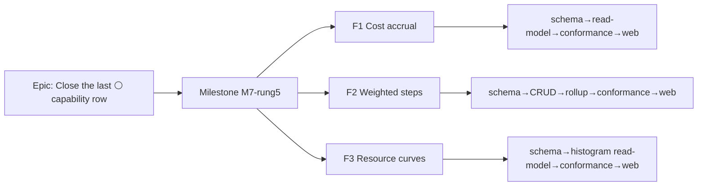

# Implementation Plan: Resource loading curves, cost accrual & weighted activity steps (M7 rung 5)

- **Feature spec:** [`./feature-spec.md`](./feature-spec.md) (Draft — awaiting approval)
- **Status:** Draft
- **Owner:** TBD

> Sliced by the **three sub-features** so each lands independently, flips its own capability tags, and keeps
> `main` releasable. The pure CPM engine (`compute.ts`) and the levelling pass (`level.ts`) are **untouched**
> in every slice — the parity gate holds by construction. Recommended build order: **F1 Cost accrual → F2
> Weighted steps → F3 Resource curves** (parity-cleanest / most standalone first).

## Breakdown

### Epic

**Complete the CPM/PDM engine capability matrix** — close the final ⚪ row ("Resource curves, cost accrual &
activity steps") so the fixture is fully scored (32 ✅ / 0 ⚪), delivering realistic resource histograms,
correctly time-phased cost/cash-flow, and weighted physical-progress rollup. Maps to the **Engine Conformance &
Validation Framework** roadmap theme.

### Milestone: M7 rung 5 — curves, accrual & steps (shippable slice)

**Outcome:** planners can shape resource loading with a curve and read a **resource histogram**; set how a
cost **accrues** (start/uniform/end) and read a correctly time-phased **cost S-curve**; and track physical
progress via **weighted steps** that roll up into Earned Value — all without any change to CPM dates or the
levelling pass. Each sub-feature is separately flagged and separately releasable.

**Governing docs to land first:** ADR-0044 (accept), ADR-0035 §31/§32/§33 (accept-with-slice), the
CAPABILITY_MATRIX row update — each in the PR that ships its slice (living-matrix rule).

---

#### Feature F1 — Cost accrual (build first)

> **Description:** An `accrualType` (`START | UNIFORM | END`) on each activity governing **when** its expense
> lump-sum is recognised in the EV / cost read-model's PV & AC time-phasing, producing a correct cost /
> cash-flow S-curve. Pure read-model; `UNIFORM` (default) = today's linear math ⇒ byte-identical EV.
> **Complexity:** M
> **Dependencies:** ADR-0042 EV read-model (`earned-value.ts`, `budgetedExpense`/`actualExpense`, cost baseline).
> **Risks:** accrual math must leave `UNIFORM` byte-identical (parity gate) → assert a snapshot-equality test; period-trend series must reconcile to the point-in-time EV total → property test (Σ period PV = total PV).
> **Testing:** unit (START/UNIFORM/END time-phasing + parity), golden (E001 START £45k, E002 UNIFORM, E004 END), differential (flip accrual), API DTO + trend endpoint, thin e2e.
> **Capability tags flipped:** `accrual_start`, `accrual_uniform`, `accrual_end`.
> **Conformance (ADR-0034 three tiers):** structural gate (types/coverage for `AccrualType`); **differential** (E001 START ≠ UNIFORM phasing); **self-baselined golden** (first-principles PV/AC period series to the minor unit).

##### Task F1-1 — Schema + types: `activities.accrual_type` (≈ one PR)

- **Description:** Add the `AccrualType` Prisma enum + `activities.accrual_type NOT NULL DEFAULT 'UNIFORM'`; mirror `AccrualType` in `@repo/types`.
- **Complexity:** S
- **Dependencies:** —
- **Risks:** a non-constant default would silently re-phase existing plans → **constant `UNIFORM` default**, metadata-only backfill.
- **Testing:** migration up/down; `verify-template.sh`; type lock-step check.
- **Development steps:**
  1. Prisma enum + column (design with **database-architect**); migration with constant default.
  2. `@repo/types` `AccrualType`; DTO field on activity create/update (class-validator + shared Zod).
  3. Update `docs/DATABASE.md` + changeset.

##### Task F1-2 — Accrual-aware EV time-phasing (read-model)

- **Description:** Extend `earned-value.ts` `leafPlannedPercent` (and an AC-phasing analogue) so PV/AC recognise the expense per `accrualType`; add the optional `trend=period&granularity` PV/AC series.
- **Complexity:** M
- **Dependencies:** F1-1.
- **Risks:** parity → `UNIFORM` path must be untouched (guard with an equality snapshot vs current goldens); period buckets on the own/plan calendar (ADR-0037) → reuse existing `workingTimeBetween`.
- **Testing:** unit for each accrual type + parity; property test (Σ period = total); guard divide-by-zero on zero-span.
- **Development steps:**
  1. Add `accrualType` to `EvActivityInput`; branch the time-phasing (START → 0/100 at start; END → 0/100 at finish; UNIFORM → existing linear).
  2. Add the period-trend series builder (bucketise PV/AC by granularity).
  3. Extend the EV read endpoint with `trend`; keep the point-in-time response byte-identical when absent.
  4. Update `docs/API.md`/OpenAPI + changeset.

##### Task F1-3 — Conformance: accrual goldens + differential

- **Description:** Adapter feeds the fixture's `expenses.accrual_type`; assert the goldens + the flip-differential + N-guards.
- **Complexity:** S–M
- **Dependencies:** F1-2.
- **Risks:** fixture expense→activity mapping (per-expense accrual collapses to one activity `accrualType`) → document the mapping in the adapter (Q4 default).
- **Testing:** golden (E001/E002/E004 PV/AC to minor units), differential (`resultsDiffer` START vs UNIFORM), structural gate; flip the matrix tags → ✅.
- **Development steps:**
  1. Extend the EV conformance adapter to read `accrual_type`.
  2. Add the golden + differential spec; update CAPABILITY_MATRIX (`accrual_*` → ✅) and ADR-0035 §32.

##### Task F1-4 — Web: Cost accrual control + Cost S-curve (flagged `VITE_COST_ACCRUAL`)

- **Description:** An accrual select on the activity/expense panel; a Cost S-curve / period-trend read view.
- **Complexity:** M
- **Dependencies:** F1-2; `cost:read` (ADR-0042).
- **Risks:** chart a11y → provide a keyboard-navigable data table equivalent (WCAG 2.2 AA).
- **Testing:** component test; a11y check; thin e2e behind the flag.
- **Development steps:**
  1. `CostAccrualControl` (reuse Select); wire the DTO field.
  2. `CostSCurve` read view on the existing chart primitive + data-table fallback.
  3. ux/component/accessibility reviewers; changeset.

---

#### Feature F2 — Weighted activity steps (build second)

> **Description:** A `activity_steps` child table (`seq`, `name`, `weight`, `percentComplete`); the activity's
> physical %-complete rolls up as `Σ(w·p)/Σw` when steps exist (else the manual field stands), feeding the
> ADR-0042 `PHYSICAL` EV measure. Pure read-model + additive child table; no steps ⇒ byte-identical.
> **Complexity:** M
> **Dependencies:** ADR-0042 `percentCompleteType=PHYSICAL` path + `physicalPercentComplete`.
> **Risks:** steps-vs-manual precedence must be unambiguous (steps win when present) → single resolver used by both EV and the API; zero-weight (N27) must not divide-by-zero.
> **Testing:** unit (rollup, precedence, N27 fallback, N28 reject), golden (A4200 → 35.0005%, A7100 → 0%), differential (steps present/absent changes physical %), CRUD API tests, thin e2e.
> **Capability tags flipped:** `code_steps`.
> **Conformance:** structural gate (`ActivityStep` types/coverage); **differential** (A4200 physical-via-steps ≠ its duration % — the fixture's `prog_rd_vs_pct_divergence`); **self-baselined golden** (weighted-mean rollup first-principles).

##### Task F2-1 — Schema + types: `activity_steps` child table

- **Description:** New `ActivityStep` model (reference-template child: org-denormalised, soft-delete, audit, version); partial-unique `(activity_id, seq)`; CHECKs `weight ≥ 0`, `percent_complete 0–100` (N28 backstop).
- **Complexity:** S–M
- **Dependencies:** —
- **Risks:** cascade-with-activity soft-delete → follow the existing child soft-delete batch pattern.
- **Testing:** migration up/down; constraint tests (dup seq, range); `verify-template.sh`.
- **Development steps:**
  1. Prisma model + migration (design with **database-architect**).
  2. `@repo/types` `ActivityStep`; DTOs.
  3. `docs/DATABASE.md` + changeset.

##### Task F2-2 — Steps sub-resource CRUD + rollup resolver

- **Description:** `GET/PUT …/activities/:id/steps` (bulk-replace default, Q3) with granular reads; a pure `rollupPhysicalPercent(steps, manual)` resolver.
- **Complexity:** M
- **Dependencies:** F2-1.
- **Risks:** `seq` consistency on bulk-replace → server assigns/validates contiguous seq; optimistic lock on the parent activity.
- **Testing:** API (CRUD, N28 reject 422, dup-seq 409), unit (resolver + N27 fallback + parity when empty).
- **Development steps:**
  1. Controller → service → repository for steps (deny-by-default, activity-write scope).
  2. `rollupPhysicalPercent` helper; wire into the activity read.
  3. OpenAPI/`docs/API.md` + changeset.

##### Task F2-3 — EV integration: step-sourced physical %

- **Description:** Feed the step rollup into `earned-value.ts` `leafPerformancePercent` for `PHYSICAL` (steps win over manual); add `stepWeightZeroCount` (N27) to the EV summary.
- **Complexity:** S
- **Dependencies:** F2-2, ADR-0042.
- **Risks:** parity → activities with no steps keep the manual value exactly.
- **Testing:** unit (PHYSICAL with steps ≠ with manual; no-steps parity), N27 warning count.
- **Development steps:**
  1. Resolve physical % via the shared resolver inside the EV input build.
  2. Add the warning count to the summary/log; changeset.

##### Task F2-4 — Conformance: steps goldens + differential

- **Description:** Adapter reads the fixture `steps`; assert A4200 → 35.0005% and the divergence differential; N27/N28.
- **Complexity:** S–M
- **Dependencies:** F2-3.
- **Testing:** golden (A4200/A7100 rollup), differential (physical-via-steps vs duration %), negatives; flip `code_steps` → ✅; ADR-0035 §33.

##### Task F2-5 — Web: Steps editor (flagged `VITE_ACTIVITY_STEPS`)

- **Description:** `ActivityStepsEditor` (editable list: name, weight, %-complete) showing the rolled physical % + a "steps override manual %" note.
- **Complexity:** M
- **Dependencies:** F2-2.
- **Risks:** keyboard/focus management on the editable list → reuse the existing editable-list primitive + APG patterns.
- **Testing:** component + a11y; thin e2e behind the flag.

---

#### Feature F3 — Resource loading curves (build last)

> **Description:** A `curveType` (`UNIFORM | BELL | FRONT_LOADED | BACK_LOADED | DOUBLE_PEAK`) on each resource
> assignment + a **resource-histogram read-model** distributing `budgetedUnits` across the activity duration per
> the built-in P6 profile (and feeding cost time-phasing). Read-model only — **levelling stays flat-rate this
> rung** (Q2). No curve/`UNIFORM` ⇒ flat load ⇒ byte-identical histogram & EV.
> **Complexity:** M–L
> **Dependencies:** ADR-0039/0040 (assignment/units), F1 (cost time-phasing seam if curves shape cost).
> **Risks:** units conservation (histogram must integrate to `budgetedUnits`) → property test; N29 (profile ≠ 100) → normalise + warn; curve × assignment-lag span (A7100) → distribute over the effective span, documented.
> **Testing:** unit (each curve distribution + conservation + parity), golden (front-loaded profile over a duration), differential (UNIFORM vs FRONT_LOADED histogram differs), N29, read-endpoint + thin e2e.
> **Capability tags flipped:** `res_curve_bell`, `res_curve_front_loaded`, `res_curve_back_loaded`, `res_curve_double_peak`.
> **Conformance:** structural gate (`ResourceCurveType` + built-in profiles); **differential** (flip curve → histogram differs); **self-baselined golden** (first-principles bucket distribution, sums to budgetedUnits).

##### Task F3-1 — Schema + types + built-in profiles: `resource_assignments.curve_type`

- **Description:** `ResourceCurveType` Prisma enum + column (default `UNIFORM`); built-in 21-point profiles as pure constants in the read-model; `@repo/types` mirror.
- **Complexity:** S
- **Dependencies:** —
- **Risks:** constant default preserves parity.
- **Testing:** migration; profile-constants unit (each sums to 100 pre-normalisation); type lock-step.
- **Development steps:**
  1. Prisma enum + column (**database-architect**); migration.
  2. Built-in profile constants + `@repo/types`; DTO field on the assignment.
  3. `docs/DATABASE.md` + changeset.

##### Task F3-2 — Resource-histogram read-model + endpoint

- **Description:** New `resource-histogram.ts` pure builder (per resource, units-over-time buckets, curve-shaped, conserving `budgetedUnits`, span = duration − assignment lag); `GET …/schedule/resource-histogram` (`schedule:read`, granularity param).
- **Complexity:** M
- **Dependencies:** F3-1.
- **Risks:** performance on large plans → O(assignments × buckets), plan-scoped, paginated; no engine call.
- **Testing:** unit (distribution + conservation + N29 normalise + parity), API (envelopes, pagination, granularity), `curveNormalisedCount` in meta.
- **Development steps:**
  1. `resource-histogram.ts` (dependency-free sibling of `float-paths.ts`/`earned-value.ts`).
  2. Read endpoint (`schedule:read`); OpenAPI/`docs/API.md`.
  3. Optionally shape assignment **cost** time-phasing via the curve into the F1 cost trend (if adopted); changeset.

##### Task F3-3 — Conformance: curve goldens + differential

- **Description:** Adapter reads `assignments.curve` + `resource_curves`; assert the histogram goldens + the flip-differential + N29.
- **Complexity:** S–M
- **Dependencies:** F3-2.
- **Testing:** golden (front/back/bell/double-peak distribution), differential (`resultsDiffer` UNIFORM vs FRONT_LOADED), N29; flip `res_curve_*` → ✅; ADR-0035 §31; **close the matrix** (32 ✅ / 0 ⚪) + summary update.

##### Task F3-4 — Web: Loading curve picker + Resource histogram (flagged `VITE_RESOURCE_CURVES`)

- **Description:** `AssignmentLoadingSection` (curve picker + preview sparkline); `ResourceHistogram` read view.
- **Complexity:** M
- **Dependencies:** F3-2.
- **Risks:** chart a11y → keyboard data-table equivalent.
- **Testing:** component + a11y; thin e2e behind the flag.

## Sequencing & slices

1. **ADR-0044 + ADR-0035 §31/§32/§33 draft** land with (and are accepted alongside) their owning slices.
2. **F1 Cost accrual** (F1-1→F1-4) — smallest schema, cleanest parity, immediate finance value; flips `accrual_*`.
3. **F2 Weighted steps** (F2-1→F2-5) — self-contained child table + rollup into the existing `PHYSICAL` path; flips `code_steps`.
4. **F3 Resource curves** (F3-1→F3-4) — most surface + the deferred levelling intersection; flips `res_curve_*` and **closes the matrix**.

Each backend sub-feature is releasable before its web surface (the read-models/goldens are the value; the flagged UI follows). No slice opens `compute.ts` or `level.ts`; every slice keeps `main` releasable and the parity gate green.

## Definition of Done (per task)

Each task's PR must satisfy the Feature Completion Criteria in [`docs/PROCESS.md`](../../PROCESS.md) — code,
tests (≥80% changed-line; goldens/differentials/negatives as applicable), docs (ADR-0044/0035, CAPABILITY_MATRIX,
DATABASE/API), security review, performance, accessibility (WCAG 2.2 AA for the web surfaces incl. chart a11y),
Docker build, CI green, changeset, and version impact assessed.

## Risks & assumptions (rollup)

| Risk / assumption                                                       | Likelihood | Impact | Mitigation                                                                                      |
| ----------------------------------------------------------------------- | ---------- | ------ | ----------------------------------------------------------------------------------------------- |
| Accrual math accidentally shifts the `UNIFORM` (parity) path            | med        | high   | Snapshot-equality vs current EV goldens; property test Σ period = total PV                      |
| Curves scope-creep into levelling (S10 golden churn)                    | med        | high   | Q2 default = read-model only; levelling explicitly untouched this rung                          |
| Steps-vs-manual precedence ambiguity                                    | med        | med    | Single shared resolver (steps win when present); N27 fallback documented + tested               |
| Custom-curve-library scope-creep                                        | low–med    | med    | Q1 default = named enum only; library is a later rung                                           |
| Per-expense accrual demand (fixture has it; SchedulePoint has lump-sum) | low        | med    | Q4 default = one `accrualType` per activity; revisit only if multi-expense-per-activity is real |
| Chart accessibility (histogram / S-curve)                               | med        | med    | Keyboard data-table equivalent; accessibility-reviewer gate                                     |
| Cost-read gating leak (histogram exposing cost without `cost:read`)     | low        | med    | Q5 split: units histogram `schedule:read`, cost S-curve `cost:read`; security-reviewer gate     |
