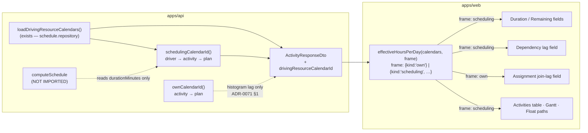
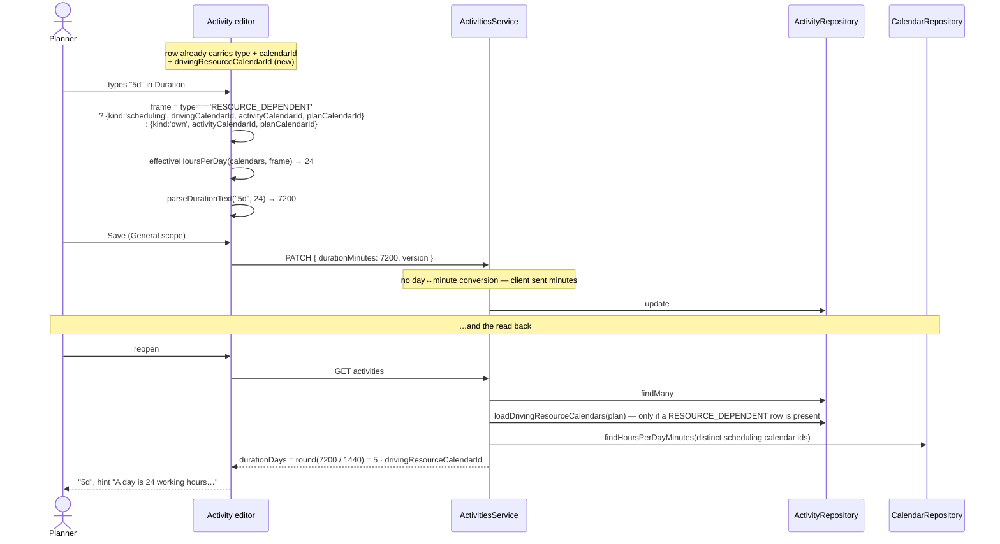
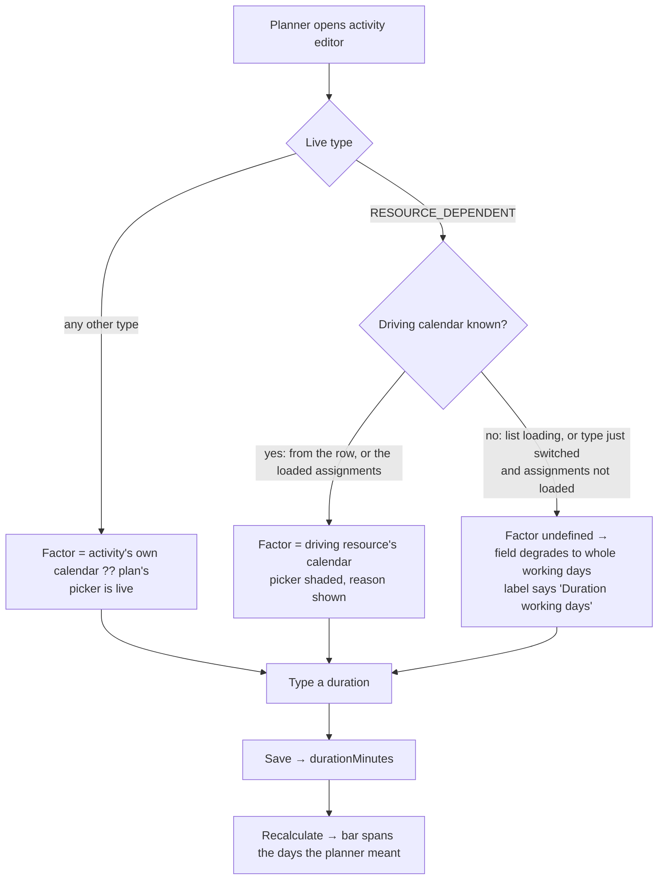

# Feature Spec: One day-length rule per quantity — the `RESOURCE_DEPENDENT` day factor

- **Status:** Draft
- **Author(s):** feature-analyst, for James Ewbank
- **Date:** 2026-09-10
- **Tracking issue / epic:** `docs/TECH_DEBT.md` #86
- **Roadmap link:** none — debt-drive work, triggered by ADR-0105 (a register row is not a spec)
- **Related ADR(s):** amends **ADR-0068 §4**; builds on ADR-0035 §23/§34, ADR-0036, ADR-0037,
  ADR-0039 §4, ADR-0040, ADR-0053 §2, ADR-0070, ADR-0071 §1. A new ADR is required (§4.7).

---

## 0. What this spec establishes, and what it corrects

The brief asked six questions. Every answer below was re-derived from the tree on 2026-09-10, and
**three of them came back different from what `docs/TECH_DEBT.md` #86 records**. Those three are
stated first because they change what gets built.

### 0.1 The defect is not in the client. It is one server rule split in two.

`apps/web/src/lib/effective-hours-per-day.ts:31-34` resolves `activityCalendarId ?? planCalendarId`.
So does `apps/api/src/modules/activities/day-factor.ts:19-24`:

```ts
export function effectiveCalendarId(
  activityCalendarId: string | null,
  planCalendarId: string | null,
): string | null {
  return activityCalendarId ?? planCalendarId;
}
```

The client is a **faithful mirror of the server's own rule**, not a divergence from it. The
divergence is between two server rules that both claim to name "the activity's effective calendar":

| Resolver                                                                      | Rule                                   | Governs                                                                                                                                                                                                                                                                                                                                |
| ----------------------------------------------------------------------------- | -------------------------------------- | -------------------------------------------------------------------------------------------------------------------------------------------------------------------------------------------------------------------------------------------------------------------------------------------------------------------------------------- |
| `apps/api/src/modules/activities/day-factor.ts:19-24`                         | activity → plan                        | `durationDays` / `remainingDurationDays` / `levelingDelayDays` read (`activity-response.dto.ts:406,430,472`), the `daysToMinutes` write conversions (`activities.service.ts:319,587,1071`), the guest DTO (`share/dto/guest-activity.dto.ts:103`), and both ends of the dependency lag factor (`dependencies/lag-day-factor.ts:25-27`) |
| `apps/api/src/modules/schedule/schedule.service.ts:1277-1287` (`effectiveOf`) | **driving resource → activity → plan** | what `computeSchedule` actually schedules on; the PRED/SUCC lag calendar the engine walks (`:1305-1309`); **and the persisted `total_float` / `free_float` / `visual_drift_days` day conversion** (`:428` → `resolveDayFactors(graph.calIdByActivity)` → `schedule.repository.ts:760-764`)                                             |

The consequence nobody had written down: **`durationDays` and `totalFloat` sit on the same DTO for
the same activity and are converted on different factors.** `schedule.repository.ts:756-759` states
the property it violates, in a comment, in as many words:

> `total_float` / `free_float` / `visual_drift_days` … this write converts them — on the activity's
> **OWN** calendar (ADR-0068 §4) … **Same factor as its duration, so "3 days of work with 1 day of
> float" is one consistent statement.**

The map it is handed is `graph.calIdByActivity`, which is built from `effectiveByActivity` and **is**
driver-aware. So the comment is false for `RESOURCE_DEPENDENT`, and the incoherence ADR-0068 §3(a)
explicitly refused ("_would print '3 days duration, 1 day float' for the same span — not a smaller
change than converting them, an incoherent one_") is live for one activity type.

**This is therefore an ADR-0068 §4 defect.** That section reads:

> `durationDays`, `remainingDurationDays`, float, drift, levelling delay → the **activity's
> effective** calendar (`activities.calendar_id` ?? `plans.calendar_id`) …

The parenthetical was written without accounting for `RESOURCE_DEPENDENT`, whose effective calendar
had been the driving resource's since ADR-0039 §4 / ADR-0035 §23 — a year earlier.

### 0.2 The row's stated cost is wrong in **both** directions, and fixing it as written would ship a new defect

#### The one thing the row names as costing is correct today

The row says the defect costs "the assignment join-lag field (shipped under ADR-0071)". It does not.
**ADR-0071 §1 is titled "Storage — unsigned, activity-calendar-framed, constant-defaulted"**, and
ADR-0071:256 records ADR-0035 §34 as "the activity's **own** calendar". The server enforces it
deliberately and says why (`schedule.service.ts:1143-1146`):

> A histogram distributes units over the activity's **OWN** calendar; the
> driving-resource-calendar substitution used for _scheduling_ a `RESOURCE_DEPENDENT` activity **is
> not reapplied here** — the dates are already computed, and the own-calendar phasing is the
> ADR-0037 grain.

Three of the twelve call sites are that field (`plan-dialogs.tsx:139`, `ActivitiesTable.tsx:302`,
and `ActivityEditorDialog.tsx:304`'s `seedFactor` where it feeds `ActivityResourcesPanel`). **All
three are right, and the row's own prescribed fix would break them.** The row says:

> teach `effectiveHoursPerDay()` the `RESOURCE_DEPENDENT` branch … **so every caller is corrected at
> once** rather than per-surface.

Done that way, "corrected at once" corrects five sites and **breaks three**. This is the single most
important finding in the spec: the discriminator is **which quantity is being measured**, not which
activity it belongs to, so there can be no one-branch fix.

#### It is **not** display-only, and the severity in the row is wrong

The row says: "Both are display and neither writes a wrong value — the API stores minutes, and the
engine reschedules on the correct calendar regardless." Five of the twelve sites feed writes:

- `ActivityEditorDialog.tsx:349` → `durationWriteFields(values.duration, hoursPerDay)`
  (`duration-field.ts:118-132`) → `{ durationMinutes }` on the General scope save
  (`ActivityEditorDialog.tsx:671,680`).
- the same value → `ReportedProgressPanel` (`:872`) → `remainingWriteFields(...)` →
  `remainingDurationMinutes`.
- `plan-workspace-toolbar.tsx:498` (`hoursPerDayFor`) → `use-gantt-grid-editing.ts:123` →
  `commitCell({ … hoursPerDay })` — an in-cell duration edit in the Gantt grid.
- `lag-factor.ts:67` → the dependency lag field → `lagDays`, converted server-side by
  `lagCalendarIdFor` → `effectiveCalendarId`.
- `ActivityCreateDialog.tsx:367` → `durationWriteFields` on create (see §0.3 — this one is
  nevertheless correct).

The wrongness is subtler than "the client writes a wrong number", and that is what makes it
survivable and invisible: **the client and the server agree**, so the value round-trips
self-consistently. What is wrong is that the agreed frame is not the frame the engine spends the
minutes in.

Worked example, all four figures derived from code cited above. An activity of type
`RESOURCE_DEPENDENT`, own calendar 8 h/day (480 min), driving resource on a 24 h/day calendar
(1440 min):

1. Planner types `5d` in the Duration field. `parseDurationText('5d', 8)` → **2,400 minutes**.
2. The engine schedules 2,400 working minutes on the **driving resource's** calendar →
   2400 / 1440 = **1.67 days of work**. The bar is a third the length the planner asked for.
3. The read comes back `durationDays = minutesToDays(2400, 480)` = **5**, so the field says `5d` and
   the table says `5 d`. Nothing on any screen contradicts anything.
4. The same activity's `totalFloat` is converted at 1440 by `writeResults`. So a bar the product
   calls five days long reports its float in 24-hour days.

**Severity re-derived: this is a schedule-affecting write defect with a fully self-consistent
read-back, not a misleading read-out.** Step 3 is exactly why it has never been reported.

### 0.3 The surface that states the rule and the control that disobeys it are on the same tab

`ActivityCalendarField.tsx:85-97,141,150-154` shades the calendar picker for a `RESOURCE_DEPENDENT`
activity with:

> Not used by a resource-dependent activity — **it is scheduled on its driving resource's calendar
> instead.** Change the type back to set a calendar here.

Three controls away in the same editor, the Duration field parses `4h` against **exactly that unused
calendar**. `ActivityWorkFields.tsx:119-128` prints a second paragraph saying the same thing, in the
same field group as the duration input it contradicts. The product tells the planner the rule and
then does not follow it, on one screen.

That shaded picker is also the fact that makes the design in §4 work, and it is set out in §4.4.

---

## 1. Business understanding

### Problem

A `RESOURCE_DEPENDENT` activity is scheduled on its **driving resource's** calendar (ADR-0035 §23 /
ADR-0039 §4) — that is the entire purpose of the type. Every day-denominated quantity SchedulePoint
converts for such an activity is nevertheless converted on the calendar the activity is **not**
scheduled on, because ADR-0068 §4 defined the day↔minute factor as `activity.calendar_id ??
plan.calendar_id` and that rule is now implemented in three places (§0.1).

It bites whenever the driving resource's calendar has a different `hours_per_day_minutes` from the
activity's own — a night-shift crane on a 24-hour calendar under a plan on an 8-hour week is the
canonical case, and it is why the type exists.

**Why now.** It has three consequences that are each independently worth closing, and the first two
were not in the register:

1. **A duration typed on this surface is stored in the wrong quantity of work** (§0.2). Its
   read-back is self-consistent, so the only symptom is that the bar is the wrong length and nobody
   can see why.
2. **Two numbers on one DTO disagree about what a day is** — duration in the activity's own days,
   float in the driving resource's — which is the incoherence ADR-0068 §3(a) rejected in writing.
3. The screen states the rule and the control beside it disobeys it (§0.3).

And ADR-0105: closing it needs new props on `ActivityResourcesPanel` and a changed signature on a
shared helper — a component's public contract — so it needs a spec whatever its size.

### Users

All organisation roles that read a plan. Mapped to ADR-0016:

| Role               | Stake                                                                                                                                                                                                 |
| ------------------ | ----------------------------------------------------------------------------------------------------------------------------------------------------------------------------------------------------- |
| **Planner**        | Types the duration that is stored wrong; reads the float that disagrees with it. The only role that can author a `RESOURCE_DEPENDENT` activity and its driving assignment (both pen-gated, ADR-0028). |
| **Org Admin**      | As Planner.                                                                                                                                                                                           |
| **Contributor**    | Reports progress — `remainingDurationMinutes` is parsed on the same wrong factor (`ActivityProgressPanels.tsx:196`). Not pen-gated (ADR-0060 Q-C), so a Contributor hits it with no Planner involved. |
| **Viewer**         | Reads a duration and a float that disagree.                                                                                                                                                           |
| **External Guest** | `share/dto/guest-activity.dto.ts:103` uses the same conversion, so the one artefact handed to somebody outside the organisation carries the same wrong figure (§3, and CQ-4).                         |

### Primary use cases

1. A planner sets a five-day duration on a resource-dependent activity and gets five days of work on
   the calendar it is actually scheduled on.
2. A planner reads that activity's duration and float on the same screen and the two are in the same
   unit.
3. A contributor reports remaining duration on such an activity and the remaining work is what they
   said it was.
4. A planner enters a lag on a dependency whose predecessor is resource-dependent and the engine
   walks the lag they entered.

### User journeys

Happy path, and the one the acceptance criteria are written against:

1. Planner opens a plan on an 8-hour week. It has a `RESOURCE_DEPENDENT` activity **Tower crane
   lift** with a driving resource **Crane crew** on the org's 24-hour calendar.
2. They open the activity editor → Scheduling. The calendar picker is shaded and says the activity
   is scheduled on the driving resource's calendar.
3. They open General and type `5d`. The field's hint says _"A day is 24 working hours on this
   activity's calendar."_ — the driving resource's, named as such.
4. Save. Recalculate. The bar spans five 24-hour days.
5. The Activities table's Duration column reads `5 d`; the Float column reads days of the same
   length.

Alternate — **no driver assigned**: the activity is flagged `resourceDriverMissing` (already in the
DTO, `packages/types/src/index.ts:559`) and the engine falls back to the activity's own calendar
(`schedule.service.ts:1281-1282`). Every day figure follows that same fallback, so the read is
correct and the "Needs a driver" badge is the explanation.

Alternate — **planner changes the type mid-edit**: covered in §2 edge cases and §4.4.

### Expected outcomes

- A day means one thing per activity, and it is the day the engine spends its minutes in.
- A duration authored on a resource-dependent activity is the duration the engine schedules.
- `durationDays` and `totalFloat` on one DTO become one consistent statement — the property
  `schedule.repository.ts:756-759` already claims.
- The assignment join lag stays framed on the activity's own calendar, by ADR-0071 §1 / ADR-0035
  §34, **on purpose and with a test saying so** — so the next person to read `effectiveHoursPerDay`
  cannot "unify" it away.

### Success criteria

| #    | Criterion                                                                                                                                                                          | How it is measured                                                                                  |
| ---- | ---------------------------------------------------------------------------------------------------------------------------------------------------------------------------------- | --------------------------------------------------------------------------------------------------- |
| SC-1 | For a `RESOURCE_DEPENDENT` activity with a driver on a different-`hoursPerDay` calendar, the minutes stored by a `5d` duration edit equal `5 × drivingCalendar.hoursPerDayMinutes` | API e2e, asserting the stored minutes read back from the API — never the DOM (the ADR-0070 M6 rule) |
| SC-2 | On one such activity, `durationDays × dayFactor == durationMinutes` **and** the float days are on the same factor                                                                  | API e2e over one activity's whole DTO                                                               |
| SC-3 | The assignment join-lag field's factor is **unchanged** for the same activity                                                                                                      | Unit + a structural test naming the exception and its ADR                                           |
| SC-4 | The `computeSchedule` golden suite is byte-identical                                                                                                                               | `pnpm --filter @repo/api test` — the engine is not imported by anything this changes                |
| SC-5 | Every one of the 12 client call sites and 12 server call sites names its rule; none takes a default                                                                                | Two structural census tests, verified red                                                           |
| SC-6 | The extra read that resolves the driving calendar costs ≤ 5 ms p95 on the seed catalogue's 2,000-activity plan                                                                     | Measured before M3 lands (§5, F-1)                                                                  |

### Open questions

Five, all with a recommendation. **CQ-1 to CQ-3 change what gets built**; CQ-4 and CQ-5 are stated
so a default is not taken silently.

---

> **CQ-1 (critical). `durationDays` will change value on existing rows. Is that accepted?**
>
> For a `RESOURCE_DEPENDENT` activity with a driver on a different calendar, `durationDays`,
> `remainingDurationDays` and `levelingDelayDays` are read-outs of stored minutes and will report a
> different number after M2 — with **no data migration, no stored minute changed, and no date
> moved**. The 2,400-minute example in §0.2 goes from reading `5 d` to reading `1.67 d` → **`2 d`**
> (`minutesToDays` rounds, `day-factor.ts:105-108`).
>
> This is ADR-0068 §6's hazard verbatim, and that ADR named it: _"a planner who remembers it as 12
> days and retypes `12` has just cut it to 5,760 minutes — a real, dates-moving edit that looks like
> a correction."_ The difference is that here the **old** number was the wrong one.
>
> **Recommendation: accept, and say so on the screen.** The alternative — leaving the read on the
> old factor while fixing the write — makes a value that no longer round-trips, which is strictly
> worse and is the failure `effective-hours-per-day.ts`'s own docblock exists to prevent. Pre-1.0,
> so a minor bump (§3). Mitigation: the release note names the affected shape, and it is narrow —
> only a `RESOURCE_DEPENDENT` activity with a driver whose calendar's `hoursPerDay` differs from its
> own. A **count** of affected rows is measurable before the release and should be taken (M0-T3):
> ADR-0068 §6's own attempt to state such a count was withdrawn for lack of a read, and here the read
> is one query.

> **CQ-2 (critical). Does the assignment join lag stay framed on the activity's own calendar?**
>
> ADR-0071 §1 and ADR-0035 §34 say it does, and `schedule.service.ts:1143-1146` refuses the
> substitution explicitly. Three of the twelve client sites are that field.
>
> **Recommendation: yes, unchanged.** This is what forces the two-named-rules design in §4 rather
> than the row's one-branch fix, so it is the load-bearing answer. If the answer were "no", the fix
> collapses to one branch and this spec is a third its size — which is why it is asked rather than
> assumed.

> **CQ-3 (critical). Four of the five defect sites cannot resolve the driver from data the client
> holds. Do we add a field to `ActivitySummary`, or fix only the editor?**
>
> Established by reading (§3, blast-radius table): assignments are fetched **per activity only**
> (`resource-assignments.controller.ts:53`, `GET activities/:activityId/assignments`). There is no
> plan-level assignments list. So the Activities table, the Gantt grid, the dependency-lag field and
> the float-paths panel each have no route to the driving resource without one request per row.
>
> **Recommendation: one nullable field on `ActivitySummary`** — `drivingResourceCalendarId`, derived
> on read, `null` for every non-`RESOURCE_DEPENDENT` activity and for one with no driver. It fixes
> all five sites at one cost, and a resource's calendar is **always ORG-scoped**
> (`calendar-scope.guard.ts:88-92`, 422 `RESOURCE_REQUIRES_ORG_CALENDAR`), so it is guaranteed to be
> in the project-usable calendar list every one of those surfaces already holds. Rejected: a new
> `GET plans/:id/driving-assignments` endpoint — a second round trip, a second census entry, a
> second thing to keep in step, for a value the activity read is already loading rows for.

> **CQ-4 (default stated). Does the External Guest view adopt the corrected factor?**
>
> `share-guest.service.ts:98` attaches day factors and `guest-activity.dto.ts:103` converts
> `durationDays` with them. ADR-0051's guest scope is fixed read-only `SCHEDULE_READ` and
> deliberately excludes resources.
>
> **Default: yes, it adopts it, and `drivingResourceCalendarId` is _not_ added to the guest DTO.**
> The corrected `durationDays` is a property of the duration the guest already reads; withholding it
> would mean a guest and a member read different numbers off the same bar. The resource itself stays
> invisible — only the frame changes. Flagged for **security-reviewer** at M5 as the one place this
> touches an auth boundary.

> **CQ-5 (default stated). Is `undefined` still the right client answer when the driver is
> unresolvable?**
>
> **Default: yes, unchanged.** `effective-hours-per-day.ts:18-25`'s argument holds exactly — after
> ADR-0068 there is no safe default and the caller degrades to whole working days. What changes is
> that the case becomes rarer: with CQ-3's field, the **saved** state is always resolvable, and only
> the pending mid-edit type switch (§4.4) can reach it. §2 states what that looks like on a table's
> Duration column.

---

## 2. Functional requirements

### User stories & acceptance criteria

> **US-1** — As a **Planner**, I want a duration I type on a resource-dependent activity to be the
> duration the engine schedules, so that the bar is as long as I said.
>
> **Acceptance criteria**
>
> - **Given** a plan on an 8 h/day calendar with a `RESOURCE_DEPENDENT` activity whose driving
>   resource is on a 24 h/day calendar, **when** the planner saves a Duration of `5d`, **then** the
>   API stores `durationMinutes = 7200`.
> - **Given** the same activity, **when** the planner reopens the editor, **then** the Duration field
>   reads `5d` and its hint reads _"A day is 24 working hours on this activity's calendar."_
> - **Given** the same activity **with no driving assignment**, **when** the planner saves `5d`,
>   **then** the API stores `durationMinutes = 2400` (the activity's own 8 h day — the documented
>   `resourceDriverMissing` fallback, `schedule.service.ts:1281-1282`) and the row shows the existing
>   "Needs a driver" badge.
> - **Given** a `TASK` activity, **when** the planner saves any duration, **then** the stored minutes
>   are **byte-identical to today's**.

> **US-2** — As a **Planner**, I want an activity's duration and its float in the same unit, so that
> "five days of work with one day of float" is one statement.
>
> - **Given** a calculated plan and a resource-dependent activity with a driver on a different
>   calendar, **when** its DTO is read, **then** `durationDays == round(durationMinutes /
drivingCalendar.hoursPerDayMinutes)` **and** `totalFloat` was converted on the same factor.
> - **Given** the same activity, **when** the Activities table renders it, **then** the Duration and
>   Float columns are on one factor.

> **US-3** — As a **Contributor**, I want remaining duration I report to be the work I meant, so that
> the forecast is right.
>
> - **Given** the activity in US-1, **when** a Contributor reports `2d` remaining on the Progress
>   tab, **then** the API stores `remainingDurationMinutes = 2880`.
> - **Given** the same, **when** they reopen it, **then** the field reads `2d`.
> - Contributors reach this **without the pen** (ADR-0060 Q-C) — the write scope and its gate are
>   unchanged by this feature.

> **US-4** — As a **Planner**, I want a lag on a link into or out of a resource-dependent activity to
> be walked on the calendar the engine walks it on.
>
> - **Given** a dependency whose `lagCalendar` is `PREDECESSOR` and whose predecessor is
>   resource-dependent with a 24 h driver, **when** the planner enters `2d`, **then** the API stores
>   `lagMinutes = 2880` — the value `schedule.service.ts:1305-1309` will walk.
> - **Given** `lagCalendar = 'TWENTY_FOUR_HOUR'`, **then** the factor is **1440, pinned**, unchanged
>   (`lag-factor.ts:6-14` — the one factor in the app that is pinned rather than resolved).
> - **Given** `lagCalendar = 'PROJECT_DEFAULT'`, **then** the plan's factor, unchanged.

> **US-5** — As a **Planner**, I want the resource join-lag field to keep measuring on the activity's
> own calendar, so that a decision taken in ADR-0071 is not silently reversed.
>
> - **Given** the activity in US-1, **when** the planner enters a join lag of `1d` on an assignment,
>   **then** the API stores `lagMinutes = 480` — the activity's own 8 h day, **exactly as today**.
> - A structural test names this as an exception, cites ADR-0071 §1 / ADR-0035 §34, and fails if the
>   site switches to the scheduling rule.

> **US-6** — As a **Viewer or External Guest**, I want the duration I read to be the one the plan is
> built on.
>
> - **Given** the activity in US-1, **when** a Viewer reads the Activities table or a Guest reads the
>   shared plan, **then** both see the same duration figure a Planner sees.

### Workflows

**W-1 — authoring a duration (editor).** Open editor → General. The host resolves the factor for the
**pending** state: if the live `type` is `RESOURCE_DEPENDENT`, the driving calendar
(`drivingResourceCalendarId` from the row, or the assignments query when the Resources tab has
loaded them) → the pending `calendarId` → the plan's; otherwise the pending `calendarId` → the
plan's. Type `5d` → `parseDurationText` on that factor → `{ durationMinutes }` → General scope save.

**W-2 — reading a duration (table / Gantt / print).** Each row composes the same rule from
`activity.type` + `activity.drivingResourceCalendarId` + `activity.calendarId` + the plan's, against
the calendar list the surface already holds. No new query.

**W-3 — authoring a dependency lag.** `lagHoursPerDay` gains the endpoint activities' types and
driving calendar ids alongside the calendar ids it already takes; `PREDECESSOR`/`SUCCESSOR` resolve
through the scheduling rule, `PROJECT_DEFAULT` and `TWENTY_FOUR_HOUR` are untouched.

**W-4 — authoring an assignment join lag.** Unchanged. `ActivityResourcesPanel` keeps taking the
activity's **own** factor, and the prop keeps its name and meaning.

### Edge cases

| Case                                                                | Expected behaviour                                                                                                                                                                                                                                               | Why                                                                                                                                                                                                                                                                                                                      |
| ------------------------------------------------------------------- | ---------------------------------------------------------------------------------------------------------------------------------------------------------------------------------------------------------------------------------------------------------------- | ------------------------------------------------------------------------------------------------------------------------------------------------------------------------------------------------------------------------------------------------------------------------------------------------------------------------ |
| `RESOURCE_DEPENDENT` with **no** driving assignment                 | Own calendar. `resourceDriverMissing` badge already explains it.                                                                                                                                                                                                 | Matches `schedule.service.ts:1281-1282` exactly.                                                                                                                                                                                                                                                                         |
| Driver assigned but resource has `calendarId: null`                 | Falls to the activity's own, then the plan's.                                                                                                                                                                                                                    | `effectiveOf` at `:1284` — `?? r.calendarId`.                                                                                                                                                                                                                                                                            |
| Driver's calendar is **archived**                                   | Unchanged behaviour: an archived calendar keeps scheduling identically (ADR-0053 §4), so it keeps converting identically.                                                                                                                                        | Archive is orthogonal to soft delete.                                                                                                                                                                                                                                                                                    |
| **Create** dialog, type `RESOURCE_DEPENDENT`                        | Own/plan calendar — i.e. **today's answer, unchanged**.                                                                                                                                                                                                          | A brand-new activity has no assignments (`ActivityCreateDialog` has four scopes and none is resources; `activities.service.ts:338` — "_A brand-new activity has no assignments yet_"). There is no driver to resolve, so the fallback rung **is** the correct answer. Two of the twelve sites are therefore not defects. |
| Planner switches type **`TASK` → `RESOURCE_DEPENDENT`** mid-edit    | The field degrades to whole working days **only if** the driving calendar is not yet known; otherwise it uses it.                                                                                                                                                | Covered in §4.4.                                                                                                                                                                                                                                                                                                         |
| Planner switches type **`RESOURCE_DEPENDENT` → `TASK`** mid-edit    | The field switches to the activity's own calendar immediately; the picker un-shades (existing behaviour, `ActivityCalendarField.tsx:85`).                                                                                                                        | The client already holds both ids.                                                                                                                                                                                                                                                                                       |
| Planner changes the **driving assignment** while the editor is open | The Resources tab is its own write scope with its own save (ADR-0060). On success the row refetches and the General tab's factor follows. `useDurationSeed` does **not** re-seed a dirty field (`use-duration-seed.ts:73` + TECH_DEBT #83's `readDuration` fix). | Scope isolation is the existing contract.                                                                                                                                                                                                                                                                                |
| Two drivers                                                         | Impossible — at most one per activity, DB-enforced (`schedule.service.ts:1259`, "the DB guarantees ≤1 driver").                                                                                                                                                  | —                                                                                                                                                                                                                                                                                                                        |
| Calendar list still loading / driver id not in it                   | `undefined` → whole working days, as today. **The list cannot legitimately lack a driver's calendar** (ORG-scoped, `calendar-scope.guard.ts:88-92`), so this is the loading case only.                                                                           | CQ-5.                                                                                                                                                                                                                                                                                                                    |
| Plan has **no** calendar at all                                     | `DEFAULT_HOURS_PER_DAY_MINUTES` (1440) on the server, `undefined` on the client. Unchanged.                                                                                                                                                                      | `day-factor.ts:39`.                                                                                                                                                                                                                                                                                                      |
| Milestone / `WBS_SUMMARY` / `LEVEL_OF_EFFORT`                       | Unaffected — no duration field is rendered (`ActivityWorkFields.tsx:83-101`) and `durationMinutes` is forced to 0 for milestones (`activities.service.ts:316-317`).                                                                                              | —                                                                                                                                                                                                                                                                                                                        |

### Permissions

**No permission changes.** Every write path keeps its existing gate, unchanged and re-asserted:

| Write                          | Permission                 | Pen (ADR-0028)?       |
| ------------------------------ | -------------------------- | --------------------- |
| Activity definition (duration) | `activity:update`          | Yes                   |
| Progress (remaining)           | `activity:report_progress` | **No** (ADR-0060 Q-C) |
| Dependency lag                 | `dependency:update`        | Yes                   |
| Assignment join lag            | `assignment:update`        | Yes                   |

Reads: `schedule:read` / `plan:read` within the organisation, deny-by-default, cross-org 404 (no
existence oracle). The new `drivingResourceCalendarId` is a **calendar id**, resolved through the
plan's own activities, and carries no resource identity — see CQ-4 and §3 Security.

### Validation rules

Unchanged. The duration grammar (`duration-field.ts:149-155`) is deliberately **factor-independent**
and stays so; the factor-dependent question ("does this convert to a whole number of days when hours
are unavailable?") stays at submit in `durationWriteFields`. `DURATION_NEEDS_WHOLE_DAYS`
(`:162-163`) is unchanged. No DTO gains or loses a validator.

### Error scenarios

| Scenario                                          | Detection                                    | User-facing result                                                | Status |
| ------------------------------------------------- | -------------------------------------------- | ----------------------------------------------------------------- | ------ |
| Calendar list unresolved when a duration is typed | client, `effectiveHoursPerDay` → `undefined` | field degrades to whole working days; label says "(working days)" | —      |
| `4h` typed while degraded                         | `durationWriteFields` → `null`               | `DURATION_NEEDS_WHOLE_DAYS`, inline                               | —      |
| Driving calendar id absent from the list          | as above                                     | as above                                                          | —      |
| Caller lacks `activity:update`                    | existing guard                               | existing shaded field + reason (ADR-0082/0083)                    | 403    |
| Pen not held                                      | existing `assertHoldsPen`                    | existing scope gate                                               | 423    |
| Stale `version`                                   | existing optimistic lock                     | existing conflict message                                         | 409    |

---

## 3. Technical analysis

| Area           | Impact      | Notes                                                                                                                                                                                                                                  |
| -------------- | ----------- | -------------------------------------------------------------------------------------------------------------------------------------------------------------------------------------------------------------------------------------- |
| Frontend       | **med**     | One shared helper's signature; 12 call sites; one new prop pair on `ActivityResourcesPanel`; no new route, no new screen.                                                                                                              |
| Backend        | **med**     | `day-factor.ts` splits into two named rules; 12 server call sites choose one; one new derived read.                                                                                                                                    |
| Database       | **none**    | No model, column, index, constraint or migration. `database-architect` is therefore **not engaged, because there is nothing to design** — recorded here so its absence cannot read as an oversight (the ADR-0091/ADR-0121 convention). |
| API            | **low–med** | One additive nullable field on the activity DTO; **`durationDays` / `remainingDurationDays` / `levelingDelayDays` change value for one activity shape** (CQ-1). OpenAPI + `docs/API.md` updated.                                       |
| Security       | **low**     | One new field on an authenticated read; guest DTO frame changes but gains no field (CQ-4). No new endpoint, no new permission.                                                                                                         |
| Performance    | **low**     | One extra query per activity **page**, taken only when the page contains a `RESOURCE_DEPENDENT` activity — the `schedule.service.ts:1261` fast-path pattern. Measured before it lands (F-1).                                           |
| Infrastructure | **none**    | —                                                                                                                                                                                                                                      |
| Observability  | **none**    | No new log, metric or trace. No audit event: this is a content edit's frame, and ADR-0073's two tests (durability, blast radius) are both negative.                                                                                    |
| Testing        | **high**    | Unit per branch; API e2e for each write; two structural censuses; one flag-on journey step; the conformance goldens as the untouched control.                                                                                          |

### The recalculation parity gate

**`computeSchedule` is not imported by anything this change touches, and no migration runs**, so the
ADR-0034 gate is untouched by construction. The strong form applies (ADR-0125 D1, not ADR-0116 D7's
weaker sibling): the engine's input is `durationMinutes`, and this feature changes only **which
factor produces those minutes from a day-denominated user input** — a service-boundary conversion
the engine has never seen. The golden suite is the control and must pass unchanged (SC-4).

One honest qualification, stated rather than glossed: a **future** `durationDays` write on an
affected activity will store different minutes than it would have, and the engine will therefore
compute different dates for it. That is the correction, not a parity breach; parity is about
`computeSchedule` being byte-identical for identical input, and this changes the input a user
intended all along.

### Blast radius, established by grep on 2026-09-10

**Server — 12 sites reading the rule** (`rg 'effectiveCalendarId|resolveDayFactorMinutes|attachDayFactors|daysToMinutes|minutesToDays' apps/api/src -g '!*.spec.ts'`):

| Site                                          | Quantity                              | Rule after this change                  |
| --------------------------------------------- | ------------------------------------- | --------------------------------------- |
| `activities/dto/activity-response.dto.ts:406` | `durationDays`                        | **scheduling**                          |
| `activities/dto/activity-response.dto.ts:430` | `remainingDurationDays`               | **scheduling**                          |
| `activities/dto/activity-response.dto.ts:472` | `levelingDelayDays`                   | **scheduling**                          |
| `activities/activities.service.ts:319`        | create → `durationMinutes`            | own (no driver can exist)               |
| `activities/activities.service.ts:587`        | update → `durationMinutes`            | **scheduling**                          |
| `activities/activities.service.ts:1071`       | progress → `remainingDurationMinutes` | **scheduling**                          |
| `dependencies/lag-day-factor.ts:25`           | `PREDECESSOR` lag                     | **scheduling**                          |
| `dependencies/lag-day-factor.ts:27`           | `SUCCESSOR` lag                       | **scheduling**                          |
| `schedule/schedule.service.ts:856-857`        | schedule read decoration              | **scheduling**                          |
| `schedule/schedule.service.ts:959`            | ditto                                 | **scheduling**                          |
| `schedule/schedule.service.ts:1161-1174`      | histogram assignment lag              | **own — the ADR-0071 §1 exception**     |
| `share/share-guest.service.ts:98`             | guest `durationDays`                  | **scheduling** (CQ-4)                   |
| `baselines/baselines.service.ts:160`          | baseline capture factor               | **plan-level, untouched** (ADR-0068 §5) |

**Client — 12 call sites, of which five are defects.** This is the table the register deferred twice.

| #   | Call site                                           | Renders / writes                                                                                                          | Driver resolvable there?                | Correct today?                                                                                                   |
| --- | --------------------------------------------------- | ------------------------------------------------------------------------------------------------------------------------- | --------------------------------------- | ---------------------------------------------------------------------------------------------------------------- |
| 1   | `plan-dialogs.tsx:139`                              | assignment join lag (r+**w**)                                                                                             | n/a                                     | **Yes** — ADR-0071 §1                                                                                            |
| 2   | `plan-workspace-toolbar.tsx:498` (`hoursPerDayFor`) | Gantt Duration column (r) + grid cell edit (**w**, `use-gantt-grid-editing.ts:123`) + print (`GanttPrintSurface.tsx:319`) | **No** — no plan-level assignments read | **No**                                                                                                           |
| 3   | `PlanScheduleSettings.tsx:59`                       | plan near-critical threshold                                                                                              | n/a — no activity                       | **Yes**                                                                                                          |
| 4   | `lag-factor.ts:52` (`PROJECT_DEFAULT`)              | dependency lag                                                                                                            | n/a — plan-level                        | **Yes**                                                                                                          |
| 5   | `lag-factor.ts:67` (`PREDECESSOR`/`SUCCESSOR`)      | dependency lag (r+**w**)                                                                                                  | **No** — endpoint's driver not held     | **No**                                                                                                           |
| 6   | `use-float-paths-panel.ts:122`                      | relative float from `relativeFloatMinutes`                                                                                | **No**                                  | **No** — and it sits beside `activity.totalFloat`, which the server already converts driver-aware                |
| 7   | `ActivityEditorDialog.tsx:304` (`seedFactor`)       | seeds Duration text **and** feeds `ActivityResourcesPanel.activityHoursPerDay` (`:842`)                                   | **Yes**, at a cost                      | **Mixed** — wrong for the duration seed, **right** for the lag prop. One value, two rules: this site must split. |
| 8   | `ActivityEditorDialog.tsx:349` (`hoursPerDay`)      | Duration field (**w**) + `ReportedProgressPanel` remaining (**w**, `:872`)                                                | **Yes**, at a cost                      | **No**                                                                                                           |
| 9   | `ActivityCreateDialog.tsx:254`                      | seeds Duration on create                                                                                                  | n/a — no assignment can exist           | **Yes**                                                                                                          |
| 10  | `ActivityCreateDialog.tsx:367`                      | Duration field on create (**w**)                                                                                          | n/a                                     | **Yes**                                                                                                          |
| 11  | `ActivitiesTable.tsx:302`                           | assignment join lag (Resources dialog)                                                                                    | n/a                                     | **Yes**                                                                                                          |
| 12  | `ActivitiesTable.tsx:663`                           | Duration column (r)                                                                                                       | **No**                                  | **No**                                                                                                           |

**Twelve call sites; five defects; seven correct, three of them correct _because_ of a decision the
row's prescribed fix would have reversed.** Site 7 is one value serving two rules and is the single
place where the current code is both right and wrong at once.

Cost of resolving the driver **client-side** at each unresolvable site, established from
`resource-assignments.controller.ts:53` (per-activity only): one request per row. That is the
argument for CQ-3.

### Dependencies

- Nothing must land first. No schema, no infrastructure.
- Interacts with, and must not disturb: ADR-0070's degrade-to-whole-days path (which is also the
  flag-off path — `duration-field.ts:14-19` deliberately makes them one code path);
  ADR-0071's assignment-lag frame; ADR-0068 §5's baseline freeze; ADR-0053 §4's archive orthogonality.

---

## 4. Solution design

### 4.1 The shape, in one sentence

**Two named rules, one implementation each side, and every call site names the rule it wants — with
no default, so neither wrong wiring is reachable by omission.**

### Architecture overview



### Data flow



### User flow



### Database changes

**None.** No model, no column, no index, no constraint, no migration. `drivingResourceCalendarId` is
**derived on read**, never stored — see §4.5 for why.

### API changes

One additive field on the activity response DTO and its shared type:

```ts
/**
 * The **driving resource's** working-time calendar (ADR-0039 §4 / ADR-0035 §23) for a
 * `RESOURCE_DEPENDENT` activity — the calendar this activity is actually scheduled on, and
 * therefore the frame every day-denominated figure about it is measured in (ADR-0068 §4, as
 * amended).
 *
 * `null` for every other activity type, for a `RESOURCE_DEPENDENT` activity with no driving
 * assignment (the `resourceDriverMissing` fallback), and for a driver whose resource holds no
 * calendar of its own. In all three cases the activity's own calendar governs, which is what a
 * client composing the rule falls back to.
 *
 * Always an **ORG-scoped** calendar (`calendar-scope.guard.ts:88-92`), so it is guaranteed to be
 * present in the project-usable list every client surface already holds.
 *
 * Derived on read, never stored: a persisted copy would go stale the moment a driving assignment
 * changed, which is precisely the defect this field exists to close.
 */
drivingResourceCalendarId: string | null;
```

- Endpoints: unchanged. No new route, no new query parameter, no status code change.
- **Changed values** (CQ-1): `durationDays`, `remainingDurationDays`, `levelingDelayDays` on a
  `RESOURCE_DEPENDENT` activity with a driver on a differing calendar; `lagDays` on a dependency
  whose `lagCalendar` is `PREDECESSOR`/`SUCCESSOR` and whose named endpoint is such an activity.
- `docs/API.md` + OpenAPI updated in lock-step; `api-reviewer` at M5.

### Component changes

| Component                                                       | Change                                                                                                                              | Contract impact                                                                                                                                                              |
| --------------------------------------------------------------- | ----------------------------------------------------------------------------------------------------------------------------------- | ---------------------------------------------------------------------------------------------------------------------------------------------------------------------------- |
| `lib/effective-hours-per-day.ts`                                | **signature** — second argument becomes a discriminated `DayFrame` (below)                                                          | shared helper; 12 call sites                                                                                                                                                 |
| `features/resources/components/ActivityResourcesPanel.tsx`      | `activityHoursPerDay` **keeps its name, meaning and type**                                                                          | **no contract change** — the prop was already the own-calendar factor and stays it. This is the one place the register's cost estimate was too high, and the reason is CQ-2. |
| `features/activities/components/ActivityEditorDialog.tsx`       | splits its one `seedFactor` into `seedFactor` (scheduling, for the duration seed) and `ownSeedFactor` (own, for the resources prop) | internal                                                                                                                                                                     |
| `features/dependencies/model/lag-factor.ts`                     | `LagFactorContext` gains `predecessorType`/`predecessorDrivingCalendarId` and the successor pair                                    | internal model type; consumers are the two link surfaces                                                                                                                     |
| `features/activities/components/ActivitiesTable.tsx`            | Duration column composes the frame from the row                                                                                     | internal                                                                                                                                                                     |
| `components/layout/workspace/plan-workspace-toolbar.tsx`        | `hoursPerDayFor` composes the frame from the row                                                                                    | internal — the `(activity) => number \| undefined` signature it exposes to `GanttPanel` is **unchanged**                                                                     |
| `features/float-paths/model/use-float-paths-panel.ts`           | target frame composed from the target row                                                                                           | internal                                                                                                                                                                     |
| No new component, no new design-system primitive, no new token. |                                                                                                                                     |                                                                                                                                                                              |

States: unchanged. Loading / unresolved → the existing degraded whole-days control
(`duration-field.ts:14-19`), which is deliberately the same code path as flag-off.

### 4.2 The helper's signature — recommended, with the two rejected shapes

The brief names three options. All three were costed.

**(a) An optional `drivingCalendarId` parameter.** Rejected, and the register already found why: a
branch alone corrects nobody, and it is dead code until a caller supplies it. Worse, it fails silent
— the seven correct sites go on compiling and the five wrong ones go on being wrong.

**(b) A required `drivingCalendarId` parameter on the existing shape.** Rejected. It gets the
compiler to enumerate, which is the right instinct, but it forces the seven correct sites to pass
`undefined` — and `undefined` there would mean **two different things**: "this activity has no
driver" and "this quantity is not driver-framed at all". Collapsing two facts into one absence a
reader cannot distinguish is the defect shape this register records most often. The assignment-lag
sites would be one careless "why is this always undefined?" away from being wired to the wrong rule.

**(c) — RECOMMENDED — one function, a required discriminated `DayFrame`, no default.**

```ts
export type DayFrame =
  | { kind: 'own'; activityCalendarId?: string; planCalendarId?: string }
  | {
      kind: 'scheduling';
      /** The driving resource's calendar; `undefined` = no driver, fall through to the own rung. */
      drivingCalendarId?: string;
      activityCalendarId?: string;
      planCalendarId?: string;
    };

export function effectiveHoursPerDay(
  calendars: CalendarSummary[],
  frame: DayFrame,
): number | undefined;
```

This is ADR-0117's and ADR-0132's shape exactly — an option with two legitimate values and **no
default, so the wrong wiring cannot be reached by omission** — expressed as a discriminant rather
than a boolean. It earns three things at once:

1. **The compiler enumerates.** Every one of the 12 existing calls fails to typecheck until it names
   its `kind`. That is the property option (b) was reaching for.
2. **Both wrong wirings are compile errors.** Passing `drivingCalendarId` on `{ kind: 'own' }` is
   rejected by the union; the scheduling rung cannot be reached without naming it.
3. **The name carries the reason.** A reader at `ActivitiesTable.tsx:302` sees `kind: 'own'` and asks
   why — the answer is one comment citing ADR-0071 §1, not a silent `undefined`.

It mirrors the server split (`ownCalendarId` / `schedulingCalendarId`) name for name, which is the
thing that stops the two drifting apart again. That is not an aesthetic point: the whole defect is
two implementations of one concept that agreed until an activity type made them disagree, and
nothing was watching (ADR-0065's `routeOrthogonal` rule, ADR-0121's ramp, one layer up).

### 4.3 What a site that cannot resolve the driver should do

The brief asks whether `undefined` is right there, and what it looks like on a table's Duration
column. **After CQ-3 the question mostly stops arising**: the field puts the driving calendar id on
every row, so every read surface can resolve it, and only three states remain unresolvable — the
calendar list still loading, the list failed, and a mid-edit type switch (§4.4).

Where it does arise, `undefined` stays right and unchanged (CQ-5). On a Duration column it looks
like `formatDurationRead`'s existing degraded branch (`duration-field.ts:99`): `"5 d"` — the row's
**own** `durationDays`, printed rather than re-derived. That branch is already correct for this
purpose and its comment already says why:

> The whole-day branch prints the row's OWN `durationDays` rather than re-deriving it. The server
> computed that on the activity's calendar; **re-dividing here would disagree with it whenever the
> client's factor is a step behind, and would round rather than say so.**

Once the server converts `durationDays` on the scheduling rule (M2), that printed number is already
the corrected one — so a table whose calendar list has not loaded shows the **right** day count with
no sub-day precision, which is the honest degradation.

**One trap, and it is why M2 must land before M4.** If the client were corrected first, that same
branch would take the modulo on the driving factor and then print the server's own-calendar
`durationDays` — a `1440`-minute duration would test `1440 % 1440 === 0` and print
`durationDays = 3`. The planner types `1d` and the table says `3 d`. Fixing the client alone
manufactures a **new, visible** inconsistency out of an invisible one. Sequencing is therefore
load-bearing, not tidy.

### 4.4 Whether "the server could just say" is coherent or a trap

The brief asks this precisely, and the answer turns on a fact the register did not have.

The helper's docblock argues the client must derive the factor because **"a planner can change an
activity's calendar and its duration in the same edit, and only the client knows the pending
selection."** That argument is correct and it must survive. It does — because **it does not apply to
the defect case**.

For a `RESOURCE_DEPENDENT` activity the calendar picker is **`readOnly`**
(`ActivityCalendarField.tsx:85,97,141`), with the reason on screen. There is no pending calendar
selection to know. So for exactly the activity type this feature is about, the reason for client
derivation is absent, and a server-supplied answer is not merely adequate but strictly better.

So a hybrid **is coherent**, and the discriminator is the live `type` — which the editor already
watches (`ActivityEditorDialog.tsx:371`, `ActivityCreateDialog.tsx:359`). The full case table:

| Live type | Saved type | Pending frame | Source                                                                      |
| --------- | ---------- | ------------- | --------------------------------------------------------------------------- |
| not RD    | not RD     | own           | the form's live `calendarId` — **today's rule, unchanged**                  |
| RD        | RD         | scheduling    | `row.drivingResourceCalendarId` (picker is shaded; nothing pending)         |
| RD        | not RD     | scheduling    | `null` on the row → the own rung, and the field degrades if that is unknown |
| not RD    | RD         | own           | the form's live `calendarId` — the client already holds it                  |

Row 3 is the only lossy cell: a planner who switches a `TASK` to `RESOURCE_DEPENDENT` **and** types
a duration **before saving the type** has no driver to resolve, because there is no assignment yet.
The honest answer there is the activity's own calendar — which is also what the server will use on
that save (no driver exists), so **the client and the server agree and the stored value is right**.
It becomes wrong only once a driving assignment is added later, and adding one is a separate write
scope whose success refetches the row.

**This is why the field carries a calendar id and not a resolved number.** A server-supplied
`effectiveHoursPerDay: number` would answer row 2 and be silently wrong for rows 3 and 4; an id
lets the client compose all four cases against the calendar list it already has. That is the
difference between the hybrid and the trap, and it is one field's type.

### 4.5 Derived on read, never stored

`drivingResourceCalendarId` is computed per activity read, reusing the existing
`loadDrivingResourceCalendars` query (`schedule.service.ts:1264`) and the existing
`hasResourceDependent` fast path (`:1261`) so a plan with no such activity costs **zero** extra
queries.

Persisting it was considered and rejected: a stored copy goes stale the instant a driving assignment
is created, deleted or re-flagged, and would then report a duration frame the engine will not use —
which is the defect this feature exists to close, reproduced in a column. It would also want a
migration and a `database-architect` engagement for a value that is a two-table join.

### 4.6 Where the ADR-0071 exception lives, and how it is held

`schedule.service.ts:1161-1174` keeps `ownCalendarId`, and both the server and client sites gain a
comment naming ADR-0071 §1 / ADR-0035 §34 and stating that the histogram deliberately does not
reapply the substitution. A structural test asserts the histogram path does **not** reach the
scheduling resolver, verified red by pointing it at the wrong one. Without that test this exception
is one tidy-up away from being deleted by somebody unifying "the two copies of the same rule" — and
they would be right about the shape and wrong about the decision.

### 4.7 ADR required

Yes. This **amends ADR-0068 §4** — a decision about which calendar converts what — and changes the
value of three shipped DTO fields. An ADR is required (`docs/PROCESS.md` "Change management"; ADRs
are immutable, so §4 is amended by the new one and never edited).

Draft outline:

> **ADR-01XX — A day belongs to the calendar the work is scheduled on.** _(Number chosen at filing
> time. 0133 is next free at the time of writing; check first — ADR-0071 was never filed at all and
> ADR-0079 found its number taken between plan and milestone.)_
>
> **Context.** ADR-0068 §4 defined the day↔minute factor as the activity's effective calendar and
> spelled that out as `activities.calendar_id ?? plans.calendar_id`. ADR-0039 §4 / ADR-0035 §23 had
> already made the driving resource's calendar the one a `RESOURCE_DEPENDENT` activity is scheduled
> on, a year earlier. Nothing reconciled the two, and by 2026-09-10 the repository held three
> implementations of "the effective calendar", two of which ignored the driver — including one whose
> own comment claimed the consistency it was breaking (`schedule.repository.ts:756-759`).
>
> **D1 — the factor follows the scheduling calendar.** `durationDays`, `remainingDurationDays`,
> `levelingDelayDays`, the persisted float/drift conversion, both `daysToMinutes` write conversions
> and the PRED/SUCC lag factor all resolve driver → activity → plan. ADR-0068 §4 is amended.
> `durationDays` changes value for one activity shape, with no stored minute changed and no date
> moved (the ADR-0068 §6 shape, with the old number being the wrong one).
>
> **D2 — the assignment join lag is a named exception, not an oversight.** ADR-0071 §1 /
> ADR-0035 §34 frame it on the activity's own calendar and `schedule.service.ts:1143-1146` refuses
> the substitution with a reason. It stays, held by a structural test rather than by care.
>
> **D3 — two named rules, no default, one implementation each side.** `ownCalendarId` /
> `schedulingCalendarId` on the server; one `effectiveHoursPerDay(calendars, DayFrame)` with a
> discriminated frame on the client (the ADR-0117 / ADR-0132 no-default shape). Every call site names
> its rule, and neither wrong wiring is reachable by omission.
>
> **D4 — the driving calendar id crosses the wire; the resolved number does not.** An id lets the
> client compose all four type-transition cases against a list it already holds; a number answers
> only the saved state and is silently wrong for a mid-edit type switch. Derived on read, never
> stored.
>
> **D5 — the client's own derivation survives, narrowed.** `effective-hours-per-day.ts`'s argument
> (only the client knows the pending calendar selection) is correct and is kept for every type whose
> picker is live. It does not apply to `RESOURCE_DEPENDENT`, whose picker is `readOnly` — which is
> what makes the hybrid coherent rather than a trap.
>
> **Consequences.** The CPM engine is not imported and no migration runs, so the ADR-0034 parity gate
> is untouched by construction. Three DTO fields change value for one activity shape (minor bump,
> pre-1.0). Two structural censuses join the gate set. The register's own prescribed fix is recorded
> as **wrong** — it would have broken three correct call sites — and the reason is preserved.

### 4.8 What should **not** be built

Two things, both named so the omission is a decision:

- **A plan-level driving-assignments endpoint.** Rejected under CQ-3. The field on the activity read
  answers every consumer at no extra round trip.
- **Unifying the assignment join lag onto the scheduling rule.** It looks like the tidy finish and it
  reverses ADR-0071 §1 / ADR-0035 §34 and changes the resource histogram, the EV cost phasing
  (`schedule.service.ts:1051`) and the conformance case `AS0027`. Out of scope, and the structural
  test in §4.6 exists to stop it arriving as a refactor.

---

## 5. Links

- Implementation plan: [`./implementation-plan.md`](./implementation-plan.md)
- Docs this change updates: `docs/API.md`, `docs/DATABASE.md` (the day-factor paragraph only — no
  schema change), `docs/TECH_DEBT.md` #86 (closed, with its two wrong claims recorded rather than
  deleted), `docs/adr/` (new ADR), `CLAUDE.md` §16 (register entry), `docs/TEST_PLAYBOOK.md` (the
  `plan:capability-resources` row gains what wrong looks like for the day factor).
- Evidence for every decision-bearing claim in this spec is a file:line citation into this tree,
  read on 2026-09-10 (ADR-0076 §19.10).
