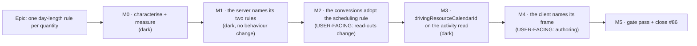

# Implementation Plan: One day-length rule per quantity — the `RESOURCE_DEPENDENT` day factor

- **Feature spec:** [`./feature-spec.md`](./feature-spec.md) — **Draft, awaiting approval.**
- **Status:** Draft
- **Owner:** unassigned
- **Register row:** `docs/TECH_DEBT.md` #86
- **ADR:** required, filed at M2 (spec §4.7). Number chosen at filing time.

---

## Breakdown

### Epic

**One day-length rule per quantity** — make the day↔minute factor follow the calendar the work is
scheduled on, name the one quantity that deliberately does not, and stop three implementations of
one concept from disagreeing again. Debt-drive; no roadmap theme.

**Sequencing is load-bearing, not tidy.** M2 (server read + write) must precede M4 (client), because
a corrected client against an uncorrected server manufactures a _visible_ inconsistency out of an
invisible one — `formatDurationRead` would take its modulo on the driving factor and then print the
server's own-calendar `durationDays`, so a planner typing `1d` sees `3 d` (spec §4.3). The reverse
order is safe: after M2 the client's degraded whole-days branch already prints the corrected number.

---

## Milestone M0 — Characterise the defect and measure the cost (ships dark)

**Ships dark:** nothing is reachable — this milestone adds only tests that pin today's behaviour and
one measurement. Nothing a planner can press changes.
**Journey:** none (ADR-0081 §2 does not apply — no capability is claimed).

> **Why it exists.** Three of this spec's findings contradict `docs/TECH_DEBT.md` #86, and two of
> them (the write path, the float/duration disagreement) have never been demonstrated by anything
> executable. A finding nothing can reproduce is a claim, not a defect — and every later milestone's
> correctness argument rests on these.

#### Feature: characterisation

> **Description:** failing-first tests that state today's behaviour at each defect site and each
> correct site, so M2 and M4 have an oracle rather than a description.
> **Complexity:** M
> **Dependencies:** none
> **Risks:** a characterisation test that passes for the wrong reason (the ADR-0093 shape) → every
> case is verified against a **pinned positive** fixture where the driving calendar genuinely differs,
> and at least one case is run against a same-calendar fixture to prove the assertion discriminates.
> **Testing requirements:** this milestone **is** the testing.

##### Task M0-T1 — API e2e: the write path stores the wrong quantity of work

- **Description:** a Supertest case building the spec §0.2 fixture through the public REST API — plan
  on an 8 h calendar, org resource on a 24 h calendar, `RESOURCE_DEPENDENT` activity, driving
  assignment — then `PATCH { durationDays: 5 }` and asserting the stored `durationMinutes`.
- **Complexity:** M
- **Dependencies:** none
- **Risks:** built by hand when the seed catalogue may already carry it → check
  `plan:capability-resources` first (`docs/TEST_PLAYBOOK.md:93` — `T_TASK` beside `T_RES`); reuse if
  its calendars differ in `hoursPerDay`, extend the playbook row if not.
- **Testing:** the test is the deliverable. Asserts `2400` today (the wrong quantity), with a comment
  naming it as **characterisation, not desired behaviour**, and the expected M2 value beside it.
- **Development steps:**
  1. Build the fixture through the API (never Prisma directly — the ADR-0066 rule: a fixture built
     below the write path reuses the assembly the defect lives in).
  2. Assert the stored minutes, and separately assert the engine's computed finish after a
     recalculate — the two together are what make "the bar is the wrong length" executable.
  3. Add the same case with the resource on the **same** `hoursPerDay` as the activity and assert
     the values coincide, so a later green run cannot mean "the fixture stopped discriminating".

##### Task M0-T2 — API e2e: duration days and float days disagree on one DTO

- **Description:** on the M0-T1 fixture, recalculate and assert that
  `durationDays × dayFactor ≠ durationMinutes` while `totalFloat` was converted on the driving
  factor — i.e. pin the incoherence `schedule.repository.ts:756-759` claims cannot exist.
- **Complexity:** S
- **Dependencies:** M0-T1
- **Risks:** the fixture may produce zero float, which makes the assertion vacuous → give the
  activity a successor with slack and assert `totalFloat > 0` **first**.
- **Testing:** as described; comment cites `schedule.service.ts:428` → `graph.calIdByActivity` and
  `schedule.repository.ts:760-764` as the two halves.
- **Development steps:** 1. extend the fixture with a slack successor. 2. assert both conversions. 3. record the two numbers in the test's docblock — they are the release-note figures.

##### Task M0-T3 — Measure: how many rows change value (CQ-1's evidence)

- **Description:** a read-only query against the deployed database counting activities where
  `type = 'RESOURCE_DEPENDENT'`, a driving assignment exists, and the driving resource's calendar
  `hours_per_day_minutes` differs from the activity's effective one.
- **Complexity:** S
- **Dependencies:** none
- **Risks:** estimating instead of measuring → the count is **taken**, never guessed. ADR-0068 §6's
  own attempt to state such a count was withdrawn for want of a read; here the read is one query, so
  there is no excuse (spec CQ-1).
- **Testing:** n/a — a measurement, recorded in `docs/specs/resource-dependent-day-factor/` as
  `m0-measurements.md` with the query, the date and the number.
- **Development steps:** 1. write the query. 2. run it. 3. record it, including `0` if that is the
  answer — a zero is the strongest possible argument for CQ-1 and must not be left unstated.

##### Task M0-T4 — Measure: the cost of the driving-calendar read (SC-6 / F-1)

- **Description:** time `loadDrivingResourceCalendars` against the seed catalogue's 2,000-activity
  plan, with and without a `RESOURCE_DEPENDENT` row present, and commit the **falsification
  condition before the run**: ≤ 5 ms p95 added to an activity page read, and **0 ms** (no query
  issued) on a plan with no such activity.
- **Complexity:** S
- **Dependencies:** none
- **Risks:** measuring the wrong thing → the harness's docblock states what it does **not** cover
  (it measures one query, not the page's end-to-end latency).
- **Testing:** measurement, recorded beside M0-T3.
- **Development steps:** 1. commit the condition. 2. run. 3. record; if it fails, M3's design is
  reopened rather than the bar moved.

---

## Milestone M1 — The server names its two rules (ships dark)

**Ships dark:** no behaviour changes. `schedulingCalendarId` is introduced and every call site
chooses a rule by name, but the only site that supplies a driver map is the one that already did
(`schedule.service.ts:effectiveOf`), so every output is byte-identical.
**Journey:** none — nothing user-facing.

#### Feature: two named resolvers, no default

> **Description:** split `effectiveCalendarId` into `ownCalendarId` and `schedulingCalendarId`; make
> every one of the 12 server sites (spec §3) name one; delete the ad-hoc `effectiveOf` in
> `schedule.service.ts` in favour of the shared one.
> **Complexity:** M
> **Dependencies:** M0 (the characterisation tests must exist and be green-on-today's-behaviour
> before anything moves)
> **Risks:** a rename that silently changes behaviour → M1 is a **barrel-preserving move** in the
> ADR-0078 sense: the existing suites are the before/after oracle and **not one assertion may
> change**. Any test that needs editing is a signal the milestone did more than it says.
> **Testing requirements:** every existing `apps/api` suite passes unchanged; one new structural
> census.

##### Task M1-T1 — Introduce the two resolvers

- **Description:** `ownCalendarId(activityCalendarId, planCalendarId)` (today's body, renamed) and
  `schedulingCalendarId({ type, drivingCalendarId, activityCalendarId, planCalendarId })`, whose
  `drivingCalendarId` is a **required** property (may be `null`, but must be passed — the ADR-0117
  no-default shape). `effectiveCalendarId` is deleted, not deprecated.
- **Complexity:** S
- **Dependencies:** none
- **Risks:** `schedulingCalendarId` reproducing `effectiveOf`'s three-valued behaviour incorrectly →
  it is written **against** `effectiveOf`'s existing tests, and `effectiveOf` is then replaced by a
  call to it, so the schedule suite is the proof.
- **Testing:** unit per rung, including the `resourceDriverMissing` fallback (`?? r.calendarId`,
  `schedule.service.ts:1284`) and the non-`RESOURCE_DEPENDENT` short-circuit (`:1280`).
- **Development steps:**
  1. Add both functions with docblocks naming ADR-0068 §4 (as amended), ADR-0039 §4 / ADR-0035 §23,
     and — on `ownCalendarId` — ADR-0071 §1 as the reason it survives.
  2. Port `effectiveOf`'s three cases and run the existing schedule suite unchanged.
  3. Replace `effectiveOf`'s body with a call; delete the duplicate.

##### Task M1-T2 — Every server site names its rule

- **Description:** the 12 sites in the spec's blast-radius table each call one resolver explicitly.
  **No output changes**, because every site still passes `drivingCalendarId: null` except the
  schedule graph.
- **Complexity:** M
- **Dependencies:** M1-T1
- **Risks:** a site silently taking the wrong rule in this commit → each call carries a one-line
  comment naming the quantity and the ADR; the census in M1-T3 refuses an unnamed one.
- **Testing:** the whole `apps/api` suite, unchanged. `scripts/e2e-local.sh api`.
- **Development steps:** 1. thread the resolvers. 2. run the API e2e locally — not CI first
  (`docs/PROCESS.md` DoD). 3. confirm zero assertion edits.

##### Task M1-T3 — Structural census: no bare fallback survives

- **Description:** a test asserting (a) `effectiveCalendarId` no longer exists, (b) every call of
  either resolver is listed in a census with its quantity and reason, (c) **a pinned positive case**
  — at least one site is classified `own` and at least one `scheduling`.
- **Complexity:** S
- **Dependencies:** M1-T2
- **Risks:** the census passing because it found nothing (the ADR-0093 / ADR-0108 shape) → (c) is
  mandatory and is the assertion verified red first, by emptying the roster.
- **Testing:** verified red three ways — remove a site from the census; reclassify the histogram site
  to `scheduling`; empty the roster.
- **Development steps:** 1. write it. 2. verify red for each mutation, recording which. 3. state its
  blind spot in its own docblock — it reads call sites, so a resolver reached through an alias is
  invisible to it.

---

## Milestone M2 — The conversions adopt the scheduling rule (**user-facing**)

**Outcome:** every day-denominated figure the API reports for a `RESOURCE_DEPENDENT` activity is
measured on the calendar it is scheduled on, and a `durationDays` write stores the work the planner
meant.
**Entry point:** the **Activities table's Duration column** and the **activity editor's Duration
field** — no new control; the number they already show becomes the right one. Also the Gantt's
Duration column and the printed programme.
**Journey:** `apps/web/e2e-sub-day/` gains one step that reads the Duration column for a seeded
resource-dependent activity with a differing driver calendar and asserts the corrected figure. That
suite already drives a real API on an eight-hour calendar and already asserts stored minutes read
back from the API rather than the DOM, which is exactly the discipline this needs.

#### Feature: the day factor follows the scheduling calendar

> **Description:** M1's `scheduling` sites start receiving a real driving-calendar map.
> `durationDays`, `remainingDurationDays`, `levelingDelayDays`, the two `daysToMinutes` write
> conversions and the PRED/SUCC lag factor all change frame. The histogram's assignment lag does not.
> **Complexity:** L
> **Dependencies:** M1
> **Risks:**
>
> - _A read path gaining an N+1._ → one batched query per page, gated on
>   `hasResourceDependent` exactly as `schedule.service.ts:1261` already gates it; M0-T4's number is
>   the bar.
> - _The `durationDays` change surprising a planner into retyping the old number_ (ADR-0068 §6's
>   named hazard, CQ-1). → M0-T3's count sizes it; the changeset and release note name the shape.
> - _The exception being "tidied away" later._ → M2-T4's structural test.
>
> **Testing requirements:** M0-T1/T2 flip from characterisation to acceptance; conformance goldens
> unchanged (SC-4); the guest DTO covered.

##### Task M2-T1 — File the ADR

- **Description:** write the ADR from spec §4.7's outline, **before** the code lands — it amends
  ADR-0068 §4, which is the decision this milestone changes.
- **Complexity:** M
- **Dependencies:** M0 (its measurements are D1's evidence)
- **Risks:** a number taken between plan and filing → check `docs/adr/` at filing time and record the
  collision rather than routing around it (the ADR-0071 lesson). `pnpm check:adr-coverage` now checks
  the index in both directions (ADR-0110 D6), so run `pnpm prepush` and not its parts.
- **Testing:** `pnpm check:adr-coverage`, `pnpm check:claims`, `pnpm check:spec-status`.
- **Development steps:** 1. draft. 2. update `docs/adr/README.md` and `CLAUDE.md` §16. 3. set this
  spec's header to `Approved`.

##### Task M2-T2 — Supply the driving-calendar map to the activity read and write paths

- **Description:** `attachDayFactors` and `resolveDayFactorMinutes` take the driving calendar
  alongside the activity's own. `ActivitiesService.withDayFactors` loads it once per page, gated on
  the page containing a `RESOURCE_DEPENDENT` row. The **create** path passes `null` explicitly with a
  comment: a brand-new activity has no assignments (`activities.service.ts:338`), so the fallback rung
  is the correct answer, not a shortcut.
- **Complexity:** L
- **Dependencies:** M2-T1
- **Risks:** the update path resolving the driver **outside** the transaction that guards the
  calendar → resolve it inside, after the calendar guard, exactly where
  `activities.service.ts:310-326` already explains why the ordering matters.
- **Testing:** M0-T1 flips to `7200`; M0-T2 flips to agreement; add the no-driver and
  no-resource-calendar fallbacks; add a `TASK` case asserting **byte-identical** stored minutes.
- **Development steps:**
  1. Widen the two functions.
  2. Load the map in `withDayFactors`, gated.
  3. Thread it through create / update / progress.
  4. Run `scripts/e2e-local.sh api`.

##### Task M2-T3 — The dependency lag's PRED/SUCC factor

- **Description:** `lagCalendarIdFor` resolves `PREDECESSOR`/`SUCCESSOR` through
  `schedulingCalendarId`, so the write conversion agrees with the calendar the engine walks
  (`schedule.service.ts:1305-1309`). `PROJECT_DEFAULT` and `TWENTY_FOUR_HOUR` are untouched, and the
  latter stays hard-pinned at 1440 — that is the entire meaning of the label.
- **Complexity:** M
- **Dependencies:** M2-T2
- **Risks:** `attachLagDayFactors` needing the endpoints' types and drivers, which it does not load →
  extend the row shape it already takes (`predecessor: { calendarId }` becomes
  `predecessor: { calendarId, type, drivingCalendarId }`), so the widening is visible in the type.
- **Testing:** API e2e for each of the four `LagCalendarSource` values against a resource-dependent
  endpoint; the `TWENTY_FOUR_HOUR` pin re-asserted.
- **Development steps:** 1. widen the context. 2. thread the loader. 3. tests.

##### Task M2-T4 — Pin the ADR-0071 exception

- **Description:** a structural test asserting the resource-histogram path reaches `ownCalendarId`
  and **cannot** reach `schedulingCalendarId`, with the reason in its docblock citing ADR-0071 §1 /
  ADR-0035 §34 and `schedule.service.ts:1143-1146`.
- **Complexity:** S
- **Dependencies:** M2-T2
- **Risks:** the test asserting the wrong direction and passing vacuously → verified red by pointing
  the histogram at the scheduling resolver.
- **Testing:** as described; plus a behavioural case asserting the assignment join lag's stored
  minutes are **unchanged** for the M0-T1 fixture (SC-3).
- **Development steps:** 1. write both. 2. verify red. 3. cross-reference from `day-factor.ts`.

##### Task M2-T5 — Docs, changeset, release note

- **Description:** `docs/API.md` and OpenAPI descriptions for the three changed fields;
  `docs/DATABASE.md`'s day-factor paragraph; a changeset naming the value change and its shape;
  `docs/TEST_PLAYBOOK.md`'s `plan:capability-resources` row gains "what wrong looks like" for the day
  factor.
- **Complexity:** S
- **Dependencies:** M2-T2..T4
- **Risks:** documenting the API and not the database, or vice versa — the ADR-0130 gate-pass finding
  → both, in this task, checked against the diff.
- **Testing:** `pnpm prepush`.

---

## Milestone M3 — `drivingResourceCalendarId` on the activity read (ships dark)

**Ships dark:** the field is added and nothing consumes it. No screen changes.
**Journey:** none — M4 drives it.

#### Feature: the client can compose the rule

> **Description:** one additive nullable field on `ActivitySummary` / `ActivityResponseDto`, derived
> on read from the map M2 already loads. Not on the guest DTO (spec CQ-4).
> **Complexity:** S
> **Dependencies:** M2
> **Risks:** persisting it "for speed" → §4.5 forbids it; a stored copy goes stale on the next
> assignment change, which is the defect in a column.
> **Testing:** API e2e asserting `null` for every non-`RESOURCE_DEPENDENT` type, `null` for a
> driverless one, and the id for a driven one; a case asserting the guest DTO is **byte-identical**.

##### Task M3-T1 — Add the field

- **Complexity:** S · **Dependencies:** M2-T2 · **Risks:** none material
- **Testing:** as above; OpenAPI snapshot.
- **Development steps:** 1. `packages/types` + DTO + docblock (spec §4 API changes, verbatim). 2. Derive from the loaded map. 3. Guest byte-identity test. 4. `docs/API.md`.

---

## Milestone M4 — The client names its frame (**user-facing**)

**Outcome:** a planner authoring a duration, a remaining duration or a dependency lag on a
resource-dependent activity types it in the day the engine will spend it in — and the field's hint
names that day's length correctly.
**Entry point:** the **activity editor's Duration field** (accessible name "Duration"), and its hint
_"A day is 24 working hours on this activity's calendar."_ Also the Gantt grid's Duration cell and
the dependency-lag field.
**Journey:** `apps/web/e2e-sub-day/` — extend with a resource-dependent activity whose driver sits on
a 24 h calendar under an 8 h plan: type `5d`, save, assert the **stored minutes read back from the
API** (7200), reopen and assert the field reads `5d`. Then the negative control: the same edit on a
`TASK` stores 2400.

#### Feature: one helper, a required frame

> **Description:** `effectiveHoursPerDay(calendars, frame: DayFrame)` (spec §4.2 option **c**); all
> 12 call sites name their frame; `ActivityEditorDialog` splits its single `seedFactor` into a
> scheduling one for the duration seed and an own one for the resources prop.
> **Complexity:** L
> **Dependencies:** M3 (without the field, four of the five sites have nothing to compose from)
> **Risks:**
>
> - _A correct site being switched to the scheduling frame._ → the three assignment-lag sites carry a
>   comment citing ADR-0071 §1 and are covered by M4-T4's census; the two create sites carry the
>   "no assignment can exist yet" reason.
> - _`ActivityResourcesPanel` gaining props it does not need._ → it gains **none**. Its
>   `activityHoursPerDay` keeps its name, type and meaning. The register's estimate that this needed
>   "the activity's `type` and the `calendars` list plumbed in" was based on the assumption CQ-2
>   overturns.
> - _The type-switch cases going untested._ → M4-T3 covers all four cells of spec §4.4's table.
>
> **Testing requirements:** unit per frame and per rung; the four type-transition cases; a flag-off
> parity case for `SUB_DAY_DURATIONS_ENABLED` (the degraded path is also the rollback contract —
> `duration-field.ts:14-19`); the journey.

##### Task M4-T1 — The signature

- **Description:** introduce `DayFrame` and change the helper. **Every existing call fails to
  typecheck** — that is the deliverable, not a side effect.
- **Complexity:** S · **Dependencies:** M3
- **Risks:** adding a default to make the change smaller → forbidden; the no-default property is the
  whole point (ADR-0117 / ADR-0132).
- **Testing:** extend `effective-hours-per-day.test.ts` with the scheduling rungs, including
  `drivingCalendarId` present-but-not-in-the-list.
- **Development steps:** 1. type + implementation. 2. docblock: keep the existing "why the client
  derives this" argument **and** add why it does not apply to `RESOURCE_DEPENDENT` (spec §4.4).

##### Task M4-T2 — The seven correct sites declare `own`

- **Description:** `plan-dialogs.tsx:139`, `ActivitiesTable.tsx:302`, `PlanScheduleSettings.tsx:59`,
  `lag-factor.ts:52`, `ActivityCreateDialog.tsx:254`/`:367`, and the resources half of
  `ActivityEditorDialog.tsx:304`. Each gains a one-line reason.
- **Complexity:** S · **Dependencies:** M4-T1
- **Risks:** the split at site 7 being missed, leaving one value on two rules → it is called out by
  name in this task and is the one site with a dedicated test.
- **Testing:** existing suites unchanged (they must be — behaviour here does not move); one new case
  asserting the editor's resources prop and duration factor **differ** on the fixture.

##### Task M4-T3 — The five defect sites declare `scheduling`

- **Description:** `ActivityEditorDialog.tsx:304` (duration seed) and `:349`,
  `plan-workspace-toolbar.tsx:498`, `ActivitiesTable.tsx:663`, `lag-factor.ts:67`,
  `use-float-paths-panel.ts:122`.
- **Complexity:** M · **Dependencies:** M4-T1
- **Risks:** `lag-factor.ts` needing the **endpoint's** type and driver, which the link surfaces hold
  only as activity summaries → they hold `ActivitySummary`, which after M3 carries both fields, so no
  new query. Verify before building.
- **Testing:** unit per site; the four type-transition cases (spec §4.4) on the editor; a float-paths
  case asserting the relative-float text and the row's `totalFloat` are now on one factor.

##### Task M4-T4 — Structural census: every client site names its frame

- **Description:** the client mirror of M1-T3. Includes a **pinned positive** for each frame, and an
  assertion that the three assignment-lag sites are classified `own` with an ADR-0071 citation.
- **Complexity:** S · **Dependencies:** M4-T2, M4-T3
- **Risks:** a scan matching its own docblock (the fourth recorded instance in this repository —
  ADR-0106, ADR-0098, ADR-0099, ADR-0120) → comments are stripped before scanning, and the test
  asserts that stripping happened.
- **Testing:** verified red four ways.

##### Task M4-T5 — The journey

- **Description:** the `e2e-sub-day` extension described in the milestone header.
- **Complexity:** M · **Dependencies:** M4-T3
- **Risks:** _(a)_ seeding through the UI and hitting the pen → seed through the API, take the pen
  once. _(b)_ asserting the DOM rather than the stored value → assert the API read-back, the rule
  that suite already follows. _(c)_ locating a control by its copy → locate by role and accessible
  name.
- **Testing:** run `scripts/e2e-local.sh web:sub-day` **locally before pushing**, and per
  `docs/TESTING.md` run the **base** journey too — this changes a screen.
- **Development steps:** 1. extend `support.ts` with the resource fixture. 2. the spec. 3. run
  locally. 4. record anything it finds on its first run — that is the milestone's most valuable
  output, on this repository's own history.

---

## Milestone M5 — Gate pass, and close #86

**Outcome:** the epic's diff is reviewed by the specialists, findings are folded with regression
tests verified red first, and the register row is closed with its wrong claims recorded rather than
deleted.
**Entry point:** none new.
**Journey:** the M4 journey, re-run.

#### Feature: the gate pass

> **Complexity:** M · **Dependencies:** M4
> **Risks:** treating the pass as a formality → on this repository's record it has blocked on real
> defects in eight consecutive epics; budget for fixes.
> **Testing requirements:** every fix carries a regression test **verified red against the old code
> first**.

##### Task M5-T1 — Specialist reviews over the combined diff

- **Reviewers, and what each is being asked:**
  - **api-reviewer** — the additive field, the three changed values, OpenAPI accuracy, and whether
    the value change warrants anything beyond a minor bump.
  - **security-reviewer** — CQ-4 specifically: does the guest view's corrected duration frame
    disclose anything about a resource? And the field's org-scope on the authenticated read.
  - **backend-performance-reviewer** — the added read; re-derive M0-T4's number from the shipped
    code rather than trusting it.
  - **component-reviewer** — the helper's `DayFrame` contract, and whether the census can be
    satisfied vacuously.
  - **ux-reviewer** — the duration hint's wording when the day is the driving resource's, and whether
    a planner can tell which calendar the number is in.
  - **accessibility-reviewer** — the shaded calendar picker's reason and the duration hint's
    `aria-describedby` chain, which now says something new.
  - **database-architect** — **not engaged.** There is no model, column, index, constraint or
    migration in this epic (verified against the diff). Recorded so the absence is a decision, not an
    oversight.
- **Complexity:** M · **Dependencies:** M4-T5

##### Task M5-T2 — Close `docs/TECH_DEBT.md` #86

- **Description:** close it, and **record what it got wrong** rather than deleting the text: that its
  named cost (the assignment join-lag field) was the one correct site; that "neither writes a wrong
  value" was false at five sites; and that its prescribed one-branch fix would have broken three.
- **Complexity:** S · **Dependencies:** M5-T1
- **Risks:** a tidy closure losing the finding → the register's convention is to preserve the wrong
  version beside the correction, because the correction is the useful part.
- **Testing:** `pnpm check:debt-status`, `pnpm check:counts`, `pnpm check:spec-status`.
- **Development steps:** 1. close #86 with the record. 2. set both headers here to
  `Accepted — shipped (ADR-NNNN)`. 3. `CLAUDE.md` §16 entry. 4. `pnpm prepush`.

---

## Sequencing & slices

| Slice | Releasable alone?                 | User-visible?                                                       |
| ----- | --------------------------------- | ------------------------------------------------------------------- |
| M0    | yes — tests + measurements only   | no                                                                  |
| M1    | yes — byte-identical output       | no                                                                  |
| M2    | yes                               | **yes** — three read-out fields change value for one activity shape |
| M3    | yes — additive field, no consumer | no                                                                  |
| M4    | yes                               | **yes** — authoring                                                 |
| M5    | yes                               | no                                                                  |

**No feature flag** (ADR-0088 D1: a `VITE_` constant is inlined at build time and has never been an
operator rollback — `apps/web/Dockerfile` declares one `VITE_` build arg and `docker-publish.yml`
passes none). The rollback is a commit boundary, and M2 and M4 are deliberately separate commits so
the server and client halves can be reverted independently. M2 additionally cannot be flagged even in
principle: it is a server-side conversion, and a client build-time constant structurally cannot gate
one (the ADR-0060 M0 / ADR-0074 rule).

**Version impact:** minor (pre-1.0 — `api` and `web`). Three DTO fields change value for a defined
activity shape; nothing is removed or renamed on the wire. A changeset lands with M2 and with M4.

---

## Definition of Done (per task)

Each task's PR must satisfy the Feature Completion Criteria in
[`docs/PROCESS.md`](../../PROCESS.md). Two are called out because this epic is where they bite:

- **`pnpm prepush`, as one command** — not its parts. It derives its gate list from `package.json`
  precisely so nobody keeps one in their head (ADR-0110/§19.8).
- **`scripts/e2e-local.sh api` for every `apps/api` change** (M1, M2, M3) and
  `scripts/e2e-local.sh web:sub-day` **plus the base journey** for M4. CI is the second opinion.

---

## Risks & assumptions (rollup)

| Risk / assumption                                                    | Likelihood | Impact                                                                                                          | Mitigation                                                                                                                                                                                                                       |
| -------------------------------------------------------------------- | ---------- | --------------------------------------------------------------------------------------------------------------- | -------------------------------------------------------------------------------------------------------------------------------------------------------------------------------------------------------------------------------- |
| CQ-1 is declined and the read-outs must not change                   | low        | **high** — M2 collapses to write-only, which is incoherent (spec §4.3) and would need a redesign                | ask before M2; M0-T3's count is the evidence                                                                                                                                                                                     |
| CQ-2 is declined (the join lag adopts the scheduling frame)          | low        | **high** — reverses ADR-0071 §1 / ADR-0035 §34, changes the histogram, EV phasing and conformance case `AS0027` | ask before M1; the spec is written assuming it stands                                                                                                                                                                            |
| CQ-3 is declined (no DTO field)                                      | med        | high — four of five defect sites become unfixable without one request per row                                   | ask before M3; the editor-only fallback is a real but partial slice                                                                                                                                                              |
| The added read costs more than 5 ms p95                              | low        | med                                                                                                             | M0-T4 measures **before** M3; failing it reopens the design rather than moving the bar                                                                                                                                           |
| A correct call site is switched to the scheduling frame during M4    | med        | high — a new defect shipped by the fix                                                                          | two structural censuses, both verified red; the three lag sites named individually in M4-T2                                                                                                                                      |
| The `durationDays` change prompts a planner to retype the old number | med        | med — a real, dates-moving edit that looks like a correction (ADR-0068 §6, verbatim)                            | release note names the shape; M0-T3 sizes it; the field's hint names the calendar's day length                                                                                                                                   |
| An assumption in this plan is stale by the time it is built          | med        | med                                                                                                             | §19's rule: re-verify the **problem** as well as the design. Four consecutive epics here had a milestone's headline task disappear on re-reading. Every citation in the spec carries a file:line taken 2026-09-10 — re-run them. |
| The gate pass finds nothing                                          | **low**    | —                                                                                                               | it has blocked in eight consecutive epics; a clean pass is the outcome to distrust                                                                                                                                               |
