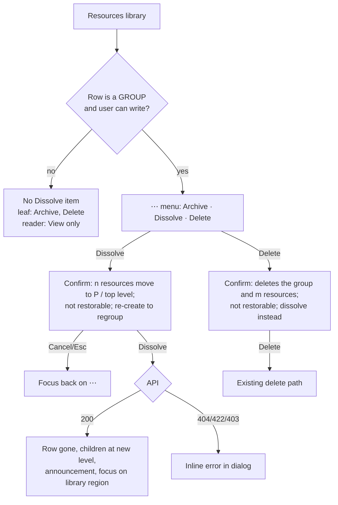

# Feature Spec: Dissolve a resource group — remove the grouping, keep the resources

- **Status:** Approved — by the product owner, 2026-10-03, as written. Q1 **yes**: ship Dissolve without a resource restore, with the honest copy; defaults D1–D8 stand.
- **Author(s):** feature-analyst (Claude Code), for the product owner
- **Date:** 2026-10-03
- **Tracking issue / epic:** `docs/BACKLOG.md` "WBS follow-ons (ADR-0063)", entry "Dissolve for a
  resource `GROUP`" (`BACKLOG.md:342-347`), chosen by the product owner on 2026-10-03
- **Roadmap link:** resource library manageability (ADR-0053 follow-on)
- **Related ADR(s):** ADR-0053 §3 (the resource tree — amended by this work, see §4 "ADR"),
  ADR-0063 §8 (WBS dissolve — the precedent), ADR-0072 / ADR-0073 (audit), ADR-0012 (RBAC),
  ADR-0081 (entry point + journey), ADR-0082 / ADR-0093 (row actions), ADR-0088 D1 (no flag),
  ADR-0105 (why this is full-spec work), ADR-0135 (focus when the row disappears)

---

## In plain English (for the product owner)

Today, a resource **group** in the Resources library (for example "Groundworks crews") can only be
removed by **deleting** it, and deleting a group deletes **everything inside it** too. If you only
wanted to get rid of the folder and keep the crews, the only way is to open every crew one at a
time, move it out, and then delete the empty group. This adds a **Dissolve** action to a group's
`⋯` menu: the group disappears and everything that was directly inside it moves up one level (into
the group's own parent group, or to the top of the library). Nothing about scheduling changes —
groups are never assigned to work and never have calendars, so no plan's dates can move. One
honest catch: **resources have no recycle bin today**, so a dissolved group cannot be "restored";
you would re-create it (its name is free again) and move the crews back. The confirmation says so.
While here, the existing **Delete** confirmation for a group will finally say that it deletes the
group's contents too, and point at Dissolve. **No database change is needed.**

---

## 0. What the code actually says (verified, not assumed)

The brief and the backlog row were checked against the source before anything was designed
(CLAUDE.md §19.11 — "re-verify a spec's PROBLEM statement", "the brief is not evidence"). Every
row below was established by **reading** the file named; nothing was run.

| #   | Claim (from the brief / backlog, or needed by the design)                                                                                                                                         | Verdict                                           | Established by                                                                                                                                                                                                                                                                                                                                                                                                                                                                                                                                                  |
| --- | ------------------------------------------------------------------------------------------------------------------------------------------------------------------------------------------------- | ------------------------------------------------- | --------------------------------------------------------------------------------------------------------------------------------------------------------------------------------------------------------------------------------------------------------------------------------------------------------------------------------------------------------------------------------------------------------------------------------------------------------------------------------------------------------------------------------------------------------------- |
| E1  | Deleting a `GROUP` takes its subtree with it.                                                                                                                                                     | **True**                                          | `resources.service.ts:443-445` resolves the active subtree; `:468-472` soft-deletes the whole branch under one batch id via `resource.repository.ts:329-341`.                                                                                                                                                                                                                                                                                                                                                                                                   |
| E2  | …unconditionally.                                                                                                                                                                                 | **Not quite** — sharper than the brief says       | The delete is **refused** (409 `RESOURCE_IN_USE`) if _any_ resource in the branch is assigned to an active activity (`resources.service.ts:455-466`). So what a group delete silently destroys is precisely the **unassigned** members — the ones a planner is least likely to be watching.                                                                                                                                                                                                                                                                     |
| E3  | There is no way to remove the grouping alone.                                                                                                                                                     | **True as a single action; a manual path exists** | The resource form sends `parentId` on every edit (`use-resources.ts:83-85`), so each child can be moved out one by one, then the empty group deleted. That is N+1 dialogs. Changing the group's kind is refused while it has children (`resources.service.ts:272-286`, 409 `RESOURCE_GROUP_HAS_CHILDREN`).                                                                                                                                                                                                                                                      |
| E4  | The group delete's confirmation warns about the cascade.                                                                                                                                          | **False**                                         | `ResourcesTable.tsx:555-556` — title "Delete resource", body `Delete “<name>”?` for every kind, group or leaf. The exact defect the WBS epic found and fixed for summaries (`docs/specs/wbs-improvements/feature-spec.md:37-40`; fixed in `delete-activity-copy.ts:19-48`).                                                                                                                                                                                                                                                                                     |
| E5  | Resources are org-scoped, not plan-scoped; the pen does not apply.                                                                                                                                | **True**                                          | Routes are `organizations/:orgSlug/resources` (`resources.controller.ts:52`); every service method resolves org scope (`resources.service.ts:82, 417`). No `assertHoldsPen` anywhere in `resources.service.ts` (the pen is per-plan, ADR-0028; it appears only in the **assignment** service, `resource-assignment.service.ts:115`, keyed to the activity's plan).                                                                                                                                                                                              |
| E6  | The resource tree has its own lock, and every write that sets a `parentId` takes it.                                                                                                              | **True**                                          | `resource-tree-advisory-lock.ts:35-40` (org-keyed). Taken by create-with-parent (`resources.service.ts:147-148`), reparent / kind-change (`:258-260`) and group delete (`:442`). The importer creates resources **without** a parent (`interchange.service.ts:785-797`), so it never writes the tree.                                                                                                                                                                                                                                                           |
| E7  | A `GROUP` can carry no assignments and no calendar, so dissolve has nothing to do about either.                                                                                                   | **True, by construction**                         | Calendar/capacity/cost refused on a group (`resources.service.ts:134-140, 518-541`; DB backstop `ck_resources_group_no_scheduling_fields`). Assigning a group is refused (`resource-assignment.service.ts:117-122`); converting an assigned resource to a group is refused (`resources.service.ts:263-271`). The only relations on `Resource` are the tree and assignments (`schema.prisma:3249-3256`); notes do not attach to resources (`modules/notes` has no `RESOURCE` reference).                                                                         |
| E8  | Dissolve cannot change any schedule (recalc parity).                                                                                                                                              | **True, and already pinned**                      | `schema.prisma:3180` "NEVER read by the CPM engine" on `parent_id`; `resource-tree-parity.structural.spec.ts:34-54` asserts `EngineResource` is `id/capacity/calendar` only and the engine directory never reads `parentId`. Dissolve writes only `parent_id`, `version`, `updated_by` on children and soft-deletes a row nothing schedules against (E7).                                                                                                                                                                                                       |
| E9  | A dissolved group could be restored from the recycle bin.                                                                                                                                         | **False — there is no resource restore at all**   | No restore route in `resources.controller.ts` (routes at `:56-219`); the recycle bin lists clients, projects and plans only (`recycle-bin.controller.ts:20, 35`); `resource-hierarchy.e2e-spec.ts:31` states "Resources have no restore endpoint". ADR-0053 §3's "making the branch the restore unit" (`0053-…md:206-207`) describes a restore that does not exist; the code says "a **future** restore" (`resources.service.ts:470`).                                                                                                                          |
| E10 | A soft-deleted group's name can be reused (so "re-create it" is a real remedy).                                                                                                                   | **True**                                          | `uq_resources_org_name` is partial on `deleted_at IS NULL` (`schema.prisma:3258-3261`).                                                                                                                                                                                                                                                                                                                                                                                                                                                                         |
| E11 | The WBS dissolve's shape: re-read under the lock, promote direct children to the node's own parent, bump their versions, soft-delete the childless node, one audit row, return the promoted rows. | **True**                                          | `activities.service.ts:1652-1751`; response DTO `dissolve-summary-response.dto.ts:1-41`; route `activities.controller.ts:169-203`; audit `activity.dissolved` with `{ name, promotedChildCount }` (`activities.service.ts:1714-1726`).                                                                                                                                                                                                                                                                                                                          |
| E12 | Moving children up one level can never break a tree invariant.                                                                                                                                    | **True**                                          | The destination is the group's own parent, which is by invariant a `GROUP` or the top level (`resource-tree.guard.ts:126-131`); every moved row's depth falls by exactly one, so the cap (`:158-167`) cannot be exceeded; moving nodes toward the root cannot create a cycle. Names are org-wide unique, not per-parent (ADR-0053 §3, `0053-…md:212-217`), so no collision is possible.                                                                                                                                                                         |
| E13 | Bumping a promoted child's `version` matters here, not just for tidiness.                                                                                                                         | **True, and load-bearing**                        | The edit form always sends `parentId` (`use-resources.ts:85`). A form left open on a child before the dissolve would, on save, try to put it back under the dissolved group. **Corrected at M1 (2026-10-03):** the parent check runs first, so that form's save is a **404** (`resource-tree.guard.ts:111-113`, reached before the version check at `resources.service.ts:316-318`); the version bump is what refuses a stale save that omits `parentId` (409). Both refuse, and neither can put the child back; `resource-hierarchy.e2e-spec.ts` asserts both. |
| E14 | A new audit action needs no migration.                                                                                                                                                            | **True**                                          | `audit_events.action` is TEXT with a format CHECK (`schema.prisma:3670-3673`; `20260803170000_audit_events/migration.sql:76-78`); `20260809140100_staff_audit_actions/migration.sql:4-7` says so in terms. The action-filter cap is derived (`list-audit-events-query.dto.ts:26`).                                                                                                                                                                                                                                                                              |
| E15 | The audit vocabulary is exhaustively keyed in four places.                                                                                                                                        | **True**                                          | `AUDIT_ACTIONS` + `AUDIT_ACTION_CATEGORY` (`packages/types/src/index.ts:2395-2427, 2505-2577`), the redactor allow-list (`audit-redactor.ts:118, 157`), the route census (`audit-coverage.structural.spec.ts:89, 132`), the web copy (`audit-copy.ts:65, 82, 196-201, 252-262`).                                                                                                                                                                                                                                                                                |
| E16 | Dissolving a group changes the histogram's "Stack by Group" bands.                                                                                                                                | **True, presentation only**                       | Stacking walks to the **top-level** ancestor (`stack-series.ts:153-166`). Dissolving a top-level group makes each of its child groups a band of its own; dissolving a nested group changes nothing there. No schedule value changes (E8).                                                                                                                                                                                                                                                                                                                       |
| E17 | No Playwright journey drives the resource tree today.                                                                                                                                             | **True**                                          | The only resource-library journey is `e2e-library/library.spec.ts` (archive, `:154-171`); no e2e suite mentions groups beyond the histogram's "none in the library yet" option (`e2e-resource-view/stacked-histogram.spec.ts:112-121`).                                                                                                                                                                                                                                                                                                                         |
| E18 | The library's explainer still refers to a "Group column".                                                                                                                                         | **True — stale user-facing copy (incidental)**    | `ResourcesTable.tsx:489` says "the Group column still names each match's group", but that column was removed and its job moved to the "In <group>" line (`ResourcesTable.tsx:256-261, 277-279`). The docblock at `resource-schemas.ts:69` has the same stale wording.                                                                                                                                                                                                                                                                                           |

**Why this is full-spec work, not a register row** (ADR-0105, CLAUDE.md §19.1): it adds a
user-facing entry point (a menu item), a public API endpoint and a new audit action. No schema
change (§4 "Database changes").

## 1. Business understanding

### Problem

A planner who built the wrong grouping in the resource library — or whose crews have been
re-organised — has two options today: delete the group, which deletes every unassigned resource
inside it with no warning (E1, E2, E4) and no way back (E9); or move each member out by hand and
then delete the empty group (E3). The first is a data-loss trap dressed as tidy-up; the second is
tedious enough that people take the first. ADR-0063 closed exactly this gap for WBS summaries and
deliberately left resources out (`wbs-improvements/feature-spec.md:793-802`, C-6); the backlog row
is where that asymmetry gets closed.

**One reason C-6 gave for deferring does not survive re-reading.** It said parity "is a rewrite of
that guard [the subtree `RESOURCE_IN_USE` count and the batched lock acquisition], not a copy". It
is neither: dissolve deletes only the group, and a group can never be assigned (E7), so there is no
in-use guard to write and no per-resource assign locks to take. Only the org tree lock is needed
(§4). That is what keeps this small.

### Users

| Role               | Need                                                                                                                                                               |
| ------------------ | ------------------------------------------------------------------------------------------------------------------------------------------------------------------ |
| **Planner**        | Reshape the resource library without losing resources: drop a level of grouping, flatten a group that turned out to be unnecessary.                                |
| **Org Admin**      | Same as Planner; also reads the audit log to answer "where did the Groundworks group go, and who did it?".                                                         |
| **Contributor**    | None. Cannot create, edit or delete resources (`org-permissions.ts:216-219` grants them to Planner/Admin only); sees no menu today (`ResourcesTable.tsx:382-392`). |
| **Viewer**         | None (read-only library).                                                                                                                                          |
| **External Guest** | None — share links never reach the resource library.                                                                                                               |

### Primary use cases

1. Remove a top-level group and leave its members at the top level of the library.
2. Remove a middle level of a nested tree ("Groundworks › Crews › Crew A" → "Groundworks › Crew A").
3. Remove an empty group (a group created by mistake).
4. Understand, before deleting a group, that Delete takes its contents and that Dissolve does not.

### User journeys

**Happy path:** Resources library → `⋯` on the group's row ("Actions for Groundworks crews") →
**Dissolve** → confirmation states how many resources move and where to, and that it cannot be
undone from a recycle bin → **Dissolve** → the group row disappears, its members show at their new
level, a polite announcement says "Group “Groundworks crews” dissolved. Its 4 resources were kept.",
focus lands on the library region. See the user-flow diagram in §4.

**Alternate:** from the same menu, **Delete** on a group now reads "Delete the group “X” and the 4
resources in it? … Deleted resources cannot be restored. To keep them, dissolve the group instead."

### Expected outcomes

- Reshaping the library no longer risks losing resources, and is one action instead of N+1.
- The destructive path (Delete) tells the truth about what it deletes.
- Every dissolve leaves one audit row that says how many resources were kept and where they went.

### Success criteria

- A planner dissolves a group of any size in **one** confirmation (journey-asserted).
- The organisation's active-resource count falls by **exactly one** (API- and journey-asserted).
- Every plan's `computeSchedule` result is unchanged by a dissolve (structural test already in
  place, E8, plus one API e2e that recalculates a plan using a promoted resource before and after).
- p95 for the dissolve request < 200 ms for a group of ≤ 200 direct children on the deployed host
  (one `UPDATE … WHERE parent_id = $1` over the partial `idx_resources_parent_id`,
  `schema.prisma:3269-3273`). Not gated; checked by the backend-performance reviewer.

### Open questions

**Critical (the answer changes scope):**

- **Q1 — Ship dissolve without any resource restore?** Resources have no restore today, for
  deletes as well as for this (E9). _Recommended default: **yes**_ — ship dissolve with copy that
  says plainly it cannot be undone from a recycle bin, and that the group can be re-created and
  its members moved back (true: E10). Building a resource restore (a recycle-bin kind, a restore
  route, name-collision rules on restore, the branch semantics ADR-0053 §3 assumes) is a separate,
  larger piece of work that would also be the first restore for **deleted** resources; it should be
  specified on its own. _If you want restore first, say so: it becomes its own spec and this one
  waits._

**Defaults — stated so work is not blocked (change any of them by saying so):**

- **D1 — Where the children go:** the group's **own parent** (its parent group, or the top level
  when the group is top-level). Grandchildren stay where they are, under their own parent, which
  moves up with them. Same rule as WBS dissolve (`activities.service.ts:1634-1646`). _Alternative
  rejected:_ always to the top level — it would flatten a whole branch the planner did not ask to
  touch.
- **D2 — Permission:** `resource:delete` (dissolve removes a row; mirrors WBS dissolve using
  `activity:delete`, `activities.service.ts:1659`). Today `resource:update` and `resource:delete`
  are held by exactly the same roles (Planner, Org Admin — `org-permissions.ts:216-219`), so the
  choice changes nobody's access.
- **D3 — No optimistic-lock `version` in the request.** Matches resource DELETE
  (`resources.controller.ts:204-219`) and WBS dissolve. The act is "remove this grouping as it is
  now"; a concurrent rename of the group does not change what the user meant. Children's versions
  **are** bumped (E13).
- **D4 — Audit:** one row, `resource.dissolved`, filed under the **settings** category beside
  `resource.archived` — library governance (ADR-0073 family F), not a deletion, for the reason
  ADR-0073 gives for `activity.dissolved` (`0073-…md:282-284`). Payload in §4.
- **D5 — Fix the group Delete confirmation in the same milestone** (E4). Same dialog, same file,
  and it is the other half of the problem statement.
- **D6 — Fold in the stale "Group column" explainer** (E18) — one string in the file being
  edited, and user-facing. If you prefer zero drive-by change, it becomes a `docs/TECH_DEBT.md` row.
- **D7 — No new ADR.** Append a dated "Dissolve" paragraph to ADR-0053 §3 (the precedent of
  dated "Built …" sections, e.g. `0073-…md:384`), which also corrects the "restore unit" wording
  (E9). The rule is ADR-0063 §8 applied to a second tree, not a new decision.
- **D8 — No feature flag** (ADR-0088 D1): a published image cannot switch one off, so the rollback
  is the commit boundary. M1 ships dark (API only); M2 names the entry point.

## 2. Functional requirements

### User stories & acceptance criteria

> **US-1** — As a **Planner**, I want to dissolve a resource group, so that I can remove a level of
> grouping without deleting the resources in it.
>
> **Acceptance criteria**
>
> - **Given** a group G whose parent is P (a group, or none) with direct children C1…Cn **when** I
>   dissolve G **then** every Ci's parent becomes P, G is no longer in the library, and the number
>   of active resources in the organisation falls by exactly one.
> - **Given** G has a child group H with its own children **when** I dissolve G **then** H moves to
>   P and H's children stay under H.
> - **Given** G has no children **when** I dissolve G **then** G is removed and nothing else changes.
> - **Given** a child Ci is assigned to activities in any plan **when** I dissolve G **then** those
>   assignments are untouched and every plan's schedule is identical before and after.
> - **Given** a child Ci is archived **when** I dissolve G **then** Ci moves too and stays archived.
> - **Given** G is archived **when** I dissolve it **then** the dissolve succeeds (archive is not a
>   lock, ADR-0053 §4).
> - **Given** the resource is not a group **then** Dissolve is not offered in its menu, and the API
>   refuses it with 422.

> **US-2** — As a **Planner**, I want the confirmation to tell me how many resources move and to
> where, and that this cannot be undone from a recycle bin, so that I know what I am agreeing to.
>
> **Acceptance criteria**
>
> - **Given** the dialog is open for G with n direct children and parent P **then** it reads
>   "Dissolve the group “G”? This removes the grouping and keeps its n resources — they move up to
>   “P” [or: to the top level]. This can’t be undone from a recycle bin; to group them again, create
>   the group again and move them back."
> - n counts **direct** children including archived ones (the server moves archived children too).
> - **Given** the counts are not yet known **then** the dialog says the same thing without a number
>   (never "nothing in it" from data it has not got — the `delete-activity-copy.ts:28-36` rule).
> - The confirm button reads **Dissolve** and is **not** the destructive variant
>   (`ActivitiesTable.tsx:1139-1155` precedent).

> **US-3** — As a **Planner**, I want deleting a group to warn me that it deletes everything in it,
> so that I do not lose resources by accident.
>
> **Acceptance criteria**
>
> - **Given** I choose Delete on a group with m resources anywhere beneath it **then** the dialog
>   title is "Delete group" and the body reads "Delete the group “G” and the m resources in it?
>   Deleting a group deletes everything in it, and deleted resources can’t be restored. To keep
>   them, dissolve the group instead."
> - An empty group: "Delete the group “G”? It has nothing in it."
> - A leaf resource keeps today's wording, with the title unchanged ("Delete resource").

> **US-4** — As an **Org Admin**, I want each dissolve recorded in the audit log, so that I can tell
> later where a group went and that its resources were kept.
>
> **Acceptance criteria**
>
> - **Given** a successful dissolve **then** exactly one `resource.dissolved` row is written in the
>   same transaction, naming the group, the number of resources kept and where they went.
> - **Given** a refused dissolve (403/404/422) **then** no row is written.
> - The org audit log renders it as "Group dissolved" with detail "4 resources kept · moved to
>   Groundworks" (or "· moved to the top level").

### Workflows

1. Planner opens **Resources** (`apps/web/src/routes/resources.tsx`).
2. On a group row, presses `⋯` ("Actions for <name>") → menu: Archive/Unarchive, **Dissolve**,
   Delete. Dissolve sits **immediately before** Delete (`ActivitiesTable.tsx:627-629` rule —
   neighbours in intent, opposites in effect).
3. Dialog opens with the counted copy (US-2). Cancel/Escape returns focus to the `⋯` trigger.
4. Dissolve → `POST /api/v1/organizations/:orgSlug/resources/:resourceId/dissolve`.
5. Success → dialog closes synchronously, library refetches, announcement, focus moves to the
   library region (the row whose trigger opened it is gone — ADR-0135; existing pattern
   `ResourcesTable.tsx:400-407`).
6. Failure → the dialog stays open with an inline error (`ConfirmDialog error`), e.g. "This group
   was already removed. Refresh the library."

### Edge cases

| Case                                                               | Behaviour                                                                                                                                                                                                                                                        |
| ------------------------------------------------------------------ | ---------------------------------------------------------------------------------------------------------------------------------------------------------------------------------------------------------------------------------------------------------------- |
| Group is re-parented by someone else between page load and confirm | The service re-reads the group **under the tree lock** and uses _that_ parent (the WBS bug-avoidance at `activities.service.ts:1676-1690`). The children follow the group's current parent, not a stale one.                                                     |
| Concurrent create of a resource **into** this group                | Both take the tree lock (E6). Either the create commits first (the new child is promoted with the rest), or the dissolve commits first and the create's parent check 404s (`resource-tree.guard.ts:111-113`). No active child can be left under a deleted group. |
| Concurrent dissolve / delete of the same group                     | Second request re-reads under the lock, finds it gone → 404.                                                                                                                                                                                                     |
| Concurrent kind change of the group (GROUP → LABOUR)               | Takes the tree lock (`resources.service.ts:252-260`) and is refused while children exist. If it somehow ran first on an empty group, dissolve's re-read under the lock sees a non-group → 422.                                                                   |
| An edit form left open on a child                                  | Its save is refused: 404 on the dissolved parent it still sends, or 409 on the bumped version if it omits `parentId` (E13).                                                                                                                                      |
| Very wide group (thousands of direct children)                     | One `UPDATE` by `parent_id`; the re-read of promoted rows is chunked with `chunkIds` (`common/db/id-chunks.ts:27`). Response size grows linearly (≈ 100 bytes/row); acceptable, flagged for backend-performance review.                                          |
| Library filtered (search / kind / archived) when the dialog opens  | The dialog's counts come from a dedicated unfiltered read (§4 Component changes), so a filter cannot make the number wrong.                                                                                                                                      |
| Group's parent is archived (hidden from the default list)          | Destination name still resolved from the unfiltered read; dissolve proceeds (an archived group is a valid parent — `assertValidResourceParent` does not check `archivedAt`, `resource-tree.guard.ts:95-168`).                                                    |
| Histogram open in another tab, stacked by Group                    | Next refetch shows the new bands (E16). Presentation only.                                                                                                                                                                                                       |

### Permissions

| Action               | Permission         | Scope                                                                                                                              | Roles              |
| -------------------- | ------------------ | ---------------------------------------------------------------------------------------------------------------------------------- | ------------------ |
| Dissolve a group     | `resource:delete`  | The organisation resolved from `:orgSlug` against the caller's own memberships (`organizations.resolveScope`), never `canAnywhere` | Planner, Org Admin |
| See Dissolve in menu | `canWrite` (route) | same                                                                                                                               | Planner, Org Admin |

Deny-by-default: unauthenticated → 401; non-member or cross-org id → 404 (never an existence
oracle); member without permission → 403. **Not a structural plan write** — the pen (ADR-0028) is
per-plan and does not apply to the org library (E5). No guest path.

### Validation rules

- `resourceId`: UUID (`ParseUuidPipe`, as every resource route).
- No request body. (A body sent anyway is ignored by the global whitelist pipe; no DTO is declared.)
- Domain: the target must be an active resource of kind `GROUP` in the caller's organisation.

### Error scenarios

| Scenario                                             | Detection                                            | User-facing result                                       | Status |
| ---------------------------------------------------- | ---------------------------------------------------- | -------------------------------------------------------- | ------ |
| No session                                           | auth guard                                           | sign-in redirect                                         | 401    |
| Contributor / Viewer                                 | `assertCan('resource:delete')`                       | not offered in the UI; API "You do not have permission…" | 403    |
| Unknown, soft-deleted, or other-org resource         | `findActiveByIdInOrg` (pre-lock and re-read)         | "This group was already removed. Refresh the library."   | 404    |
| Resource is not a `GROUP`                            | kind check (pre-lock and re-read)                    | not offered in the UI; API `RESOURCE_NOT_A_GROUP`        | 422    |
| DB CHECK fires (only if a service guard is bypassed) | `mapCheckViolation` (`resources.service.ts:555-571`) | honest 422/409, never 500                                | 422    |

## 3. Technical analysis

| Area           | Impact | Notes                                                                                                                                                                                                           |
| -------------- | ------ | --------------------------------------------------------------------------------------------------------------------------------------------------------------------------------------------------------------- |
| Frontend       | low    | One menu item, one confirm dialog, one copy module, one mutation hook, group-aware Delete copy, one stale string. No new route, no new primitive.                                                               |
| Backend        | low    | One service method + controller route in `modules/resources`; reuses the tree lock, repository soft-delete and audit service.                                                                                   |
| Database       | none   | No schema change, no migration (§4).                                                                                                                                                                            |
| API            | low    | New `POST …/resources/:resourceId/dissolve` → 200 `{ data: { promoted: [...] } }`. Additive; minor bump.                                                                                                        |
| Security       | low    | Same org-scope + permission pattern as delete; 404-not-403 for foreign ids; one audit row; no new input surface (no body).                                                                                      |
| Performance    | low    | Tree lock (org-wide) held for: one PK re-read, one children `SELECT`, one `UPDATE`, one PK `UPDATE`, one audit insert, one chunked re-read. Same class as today's group delete, without the per-resource locks. |
| Infrastructure | none   | No env, no CI step, no new Playwright config (the journey joins `e2e-library`, which CI already runs — `ci.yml:655-657`).                                                                                       |
| Observability  | low    | One `info` log line, `resource group dissolved`, with `organizationId`, `resourceId`, `userId`, `promoted`.                                                                                                     |
| Testing        | med    | Service unit tests; API e2e (behaviour, permissions, concurrency invariant, parity, audit); web unit (menu, dialog, copy); one Playwright step in `e2e-library`.                                                |

### Dependencies

- None to land first. Reuses `acquireResourceTreeWriteLock`, `ResourceRepository.softDelete`,
  `AuditService.record`, `chunkIds`, `RowActionsMenu`, `ConfirmDialog`, `useAnnounce`.
- Affected: audit vocabulary (four exhaustive maps, E15), the resource library screen, the
  "Stack by Group" histogram (presentation only, E16).

## 4. Solution design

### Architecture overview

Everything lives inside the existing `resources` module and the existing `features/resources`
web feature. No new module, no new shared primitive.

```mermaid
flowchart LR
  subgraph Web["apps/web — features/resources"]
    RT[ResourcesTable<br/>row ⋯ menu: Dissolve]
    CD[ConfirmDialog<br/>group-action-copy.ts]
    H[useDissolveResourceGroup]
  end
  subgraph API["apps/api — modules/resources"]
    C[ResourcesController<br/>POST :id/dissolve]
    S[ResourcesService.dissolveGroup]
    R[ResourceRepository]
    L[[resource-tree advisory lock<br/>org-scoped]]
    A[AuditService]
  end
  DB[(PostgreSQL<br/>resources, audit_events)]
  RT --> CD --> H -->|POST| C --> S
  S --> L
  S --> R --> DB
  S --> A --> DB
  ENG[CPM engine] -. never reads resources.parent_id .- DB
```

### Data flow

```mermaid
sequenceDiagram
  autonumber
  participant U as Planner (browser)
  participant W as ResourcesTable
  participant API as ResourcesController
  participant S as ResourcesService
  participant DB as PostgreSQL
  U->>W: ⋯ → Dissolve
  W->>API: GET /resources?archived=include (dialog counts)
  W-->>U: "…its 4 resources move up to “Groundworks”…"
  U->>W: Dissolve
  W->>API: POST /resources/:id/dissolve
  API->>S: dissolveGroup(principal, orgSlug, id, ctx)
  S->>DB: resolve org scope; assert resource:delete
  S->>DB: find active resource in org → 404 / not GROUP → 422
  S->>DB: BEGIN; pg_advisory_xact_lock('resource-tree', org)
  S->>DB: re-read group under lock (parentId, kind) → 404 / 422
  S->>DB: SELECT id FROM resources WHERE parent_id = :id AND org AND active
  S->>DB: UPDATE … SET parent_id = locked.parentId, version+1, updated_by
  S->>DB: soft-delete group (deleted_at, delete_batch_id)
  S->>DB: INSERT audit_events resource.dissolved
  S->>DB: SELECT id, parent_id, version WHERE id IN (chunked)
  S->>DB: COMMIT
  API-->>W: 200 { data: { promoted: [...] } }
  W->>W: invalidate resourceKeys.list; announce; focus region
```

### User flow



### Database changes

**None.** Every column the write needs already exists on `resources`: `parent_id`
(`schema.prisma:3181`), `version` (`:3241`), `updated_by` (`:3245`), `deleted_at`, `delete_batch_id`
(`:3246-3247`). The children read and the `UPDATE` are served by the partial
`idx_resources_parent_id` (`:3269-3273`). The audit action is a TEXT value accepted by the existing
format CHECK (E14). **database-architect is therefore not required**; if review adds an index or a
column, that changes and the agent runs (CLAUDE.md §19.3).

### API changes

**`POST /api/v1/organizations/:orgSlug/resources/:resourceId/dissolve`** — tag `resources`.

- **Summary:** "Dissolve a resource group — remove the grouping, keep the resources."
- **Description (OpenAPI):** promotes the group's direct children to its own parent (or the top
  level), then soft-deletes the now-childless group, in one transaction under the org resource-tree
  lock. The deliberate opposite of `DELETE`, which takes the whole branch. Resources have no restore
  endpoint, so a dissolved group cannot be restored; re-create it to regroup. **This write mutates
  sibling rows:** every promoted child's `parentId` changes and its `version` increments; the
  response returns them at their new versions (the `activities.controller.ts:178-182` wording).
- **Request:** no body.
- **200** `{ data: DissolveResourceGroupResponseDto }`:

  ```ts
  // apps/api/src/modules/resources/dto/dissolve-resource-group-response.dto.ts (new)
  class PromotedResourceDto {
    id: string;
    parentId: string | null;
    version: number;
  }
  class DissolveResourceGroupResponseDto {
    promoted: PromotedResourceDto[];
  } // id order; [] when empty
  ```

  200, not 204, for the same reason as WBS dissolve (`dissolve-summary-response.dto.ts:24-31`,
  `docs/API.md`'s cross-resource rule). Shared type `DissolveResourceGroupResult` in `@repo/types`
  for the web.

- **Errors:** 401, 403, 404 `RESOURCE_NOT_FOUND`, 422 `RESOURCE_NOT_A_GROUP`
  (`details.reason: 'RESOURCE_NOT_A_GROUP'`). No 409 and no 423 (D3; no pen).
- **Audit:** `resource.dissolved`, `subjectType: 'RESOURCE'`, `subjectId`/`subjectLabel` = the
  group, `before: { name, promotedChildCount, destinationName, deleteBatchId }` where
  `destinationName` is the parent group's name **as it was**, or `null` for the top level (a single
  destination, so `null` is a determined fact, not an absence — the ADR-0073 `parentCount` lesson,
  `0073-…md:277-281`). `deleteBatchId` is carried for the same forward-compatibility the delete
  row has (`resources.service.ts:489-494`).

**Service sketch (design, not code to paste):** `ResourcesService.dissolveGroup` —
`resolveScope` → `assertCan('resource:delete')` → `findActiveByIdInOrg` (404) → kind `GROUP` (422) →
`$transaction`: `acquireResourceTreeWriteLock(org)` → re-read the group under the lock (404 / 422) →
`findActiveChildIdsOf([id])` → new repository `promoteChildren(groupId, newParentId, actor, tx)`
(one `updateMany` by `organizationId + parentId + deletedAt: null`, `version: { increment: 1 }`) →
defence check `countActiveChildrenOf(id) === 0` (fails the transaction if not — unreachable given
E6) → `softDelete(id)` (returns the batch id) → resolve destination name (one PK read when non-null)
→ `audit.record(...)` → chunked re-read of promoted rows. Order of gates matches the delete:
403 before 404 before 422.

### Component changes

All in `apps/web/src/features/resources/`:

- **`lib/group-action-copy.ts` (new)** — `dissolveGroupDescription(group, library)` and
  `deleteResourceDescription(resource, library)`: the one definition of both confirmations, pure
  functions, unit-tested; the `features/activities/lib/delete-activity-copy.ts` shape. Direct-child
  count for dissolve, whole-subtree count for delete (iterative walk with a visited guard).
- **`api/use-resources.ts`** — `useDissolveResourceGroup(orgSlug)`: `POST …/dissolve`,
  `onSettled` invalidates `resourceKeys.list(orgSlug)` (sweeps every filtered list, picker search
  and the library that "Stack by Group" reads).
- **`components/ResourcesTable.tsx`** —
  - a **Dissolve** `MenuItem` in the existing `RowActionsMenu`, rendered only when
    `isResourceGroup(resource)` (omitted, not shaded, for a leaf — UX_STANDARDS "Row / node
    actions": omit when the action does not apply to that object), placed before Delete;
  - a second `ConfirmDialog` with its own state (not a mode on `deleting` — the
    `ActivitiesTable.tsx:412` rule), `title="Dissolve group"`, `confirmLabel="Dissolve"`,
    `confirmVariant="default"`, `pendingLabel="Dissolving…"`;
  - the Delete dialog's `title`/`description` come from `deleteResourceDescription` (group-aware);
  - the counts read `useResources(orgSlug, { archived: 'include' }, dialogOpen)` — the existing
    hook with its `enabled` argument (`use-resources.ts:141-147`), so nothing fetches until a dialog
    is open and the table's own filters cannot skew the number;
  - success: `flushSync` close → announce → focus the region (existing pattern,
    `ResourcesTable.tsx:400-407`); error → inline `error` prop;
  - the stale explainer string at `:489` (D6).
- **`features/audit/model/audit-copy.ts`** — label "Group dissolved"; detail
  "`n resources kept · moved to <destination>`" / "`· moved to the top level`".

States: loading (dialog copy without a number; confirm stays enabled — the server is authoritative,
the number is a courtesy), error (inline in the dialog), success (announcement + refetch), empty
group (dedicated sentence). No one-off styling; existing tokens and primitives only. Keyboard: no
primitive's contract changes (ADR-0111 not triggered), but the focus hand-off after the row unmounts
is reviewed (accessibility-reviewer).

### Implementation approach & alternatives

**Chosen:** a dedicated `POST …/dissolve` endpoint in the resources module, mirroring WBS dissolve,
under the org resource-tree lock only.

| Alternative                                                        | Why not                                                                                                                                                                                                                                                           |
| ------------------------------------------------------------------ | ----------------------------------------------------------------------------------------------------------------------------------------------------------------------------------------------------------------------------------------------------------------- |
| `DELETE …/resources/:id?mode=dissolve`                             | Puts the destructive and non-destructive acts behind one route and one flag; ADR-0063 chose separate endpoints "so the destructive one is never the default" (`activities.service.ts:1638-1641`).                                                                 |
| Client-side: PATCH each child, then DELETE the group               | N+1 requests, not atomic (a failure halfway leaves a half-dissolved tree), N+1 tree-lock acquisitions, and no single audit row. It is today's manual workaround automated, with its flaws.                                                                        |
| Also take the per-resource assign locks (as the group delete does) | They exist to serialise the `RESOURCE_IN_USE` count against a concurrent assign (`resources.service.ts:434-440`). Dissolve deletes only the group, which can never be assigned (E7), so there is no count to protect. Taking them would be cost without a reason. |
| Promote to the top level always                                    | Destroys the shape of a branch the planner did not ask to touch (D1).                                                                                                                                                                                             |
| Build a resource restore first                                     | Q1 — larger, separate, and would equally serve deletes.                                                                                                                                                                                                           |

### ADR

**Not a new ADR (D7).** Append to ADR-0053 §3 a dated paragraph — "**Dissolve of a `GROUP`
(2026-10-xx).** `POST …/resources/:id/dissolve` promotes direct children to the group's own parent
and soft-deletes the group, under the org tree lock only (no assign locks: a group cannot be
assigned). Resources have no restore; the 'restore unit' above is the batch id a future restore
would use, not a restore that exists." — and add one sentence to ADR-0063 §8 noting the resource
tree now has the same action. Update the ADR-0053 line in CLAUDE.md §16 only if the house style for
an in-place amendment requires it (it lists amendments by ADR number, so likely not).

## 5. Links

- Implementation plan: [./implementation-plan.md](./implementation-plan.md)
- Related docs updated by this change: `docs/adr/0053-calendar-scoping-and-resource-management.md`
  (§3 paragraph), `docs/adr/0063-pinned-wbs-band-and-the-canvas-band-model.md` (§8 sentence),
  `docs/API.md` (endpoint), `docs/BACKLOG.md` (entry closed), `apps/api/test/resource-hierarchy.e2e-spec.ts`
  docblock (dissolve added to its list), changesets for `@repo/api`, `@repo/web`, `@repo/types`.
