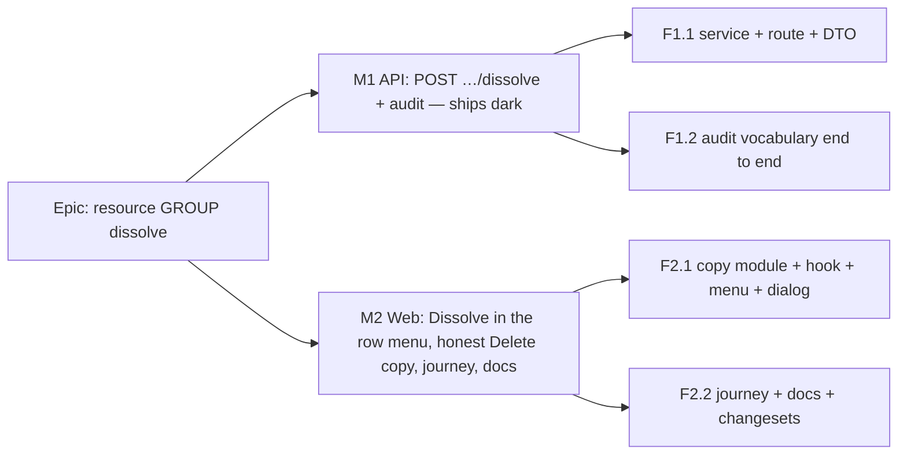

# Implementation Plan: Dissolve a resource group — remove the grouping, keep the resources

- **Feature spec:** [./feature-spec.md](./feature-spec.md) (Draft — awaiting approval before implementation)
- **Status:** Approved — by the product owner, 2026-10-03, as written. Q1 **yes**: ship Dissolve without a resource restore, with the honest copy; defaults D1–D8 stand.
- **Owner:** product owner (approval); build by the **builder** agent per milestone

## Breakdown

### Epic

**Resource GROUP dissolve** — close the ADR-0063 C-6 asymmetry: the resource tree gets the
"remove the grouping, keep the work" action the WBS tree already has. Theme: resource library
manageability (ADR-0053).

**Overall size: S+S** (two small milestones, two PRs). No schema change, no flag (ADR-0088 D1), no
new Playwright config.

---

### Milestone 1: the API — dissolve is possible and audited (shippable slice)

**Outcome:** a Planner or Org Admin can dissolve a group through the REST API; every dissolve
writes one audit row, and the org audit log renders it.
**Entry point:** `Ships dark: API only — no control reaches it until M2 adds "Dissolve" to the
Resources library row menu.` (The audit-log rendering of the new action is reachable, but only once
something writes one, which needs M2 or a direct API call.)
**Journey:** none in M1 (no user-facing capability claimed); the M2 journey covers it.

**Size: S.** One PR touching `apps/api`, `packages/types` and `apps/web/src/features/audit` — the
last because `AUDIT_ACTION_CATEGORY` and the web copy map are exhaustively keyed, so the types
change does not compile without the copy entry (spec E15).

---

#### Feature F1.1: the dissolve endpoint

> **Description:** `POST /api/v1/organizations/:orgSlug/resources/:resourceId/dissolve` → 200
> `{ promoted: [{ id, parentId, version }] }`, promoting direct children to the group's own parent
> and soft-deleting the group under the org resource-tree lock.
> **Complexity:** S
> **Dependencies:** none
> **Risks:** using the pre-lock `parentId` would promote children to a parent the group no longer
> has → re-read under the lock (spec §2 Edge cases; `activities.service.ts:1676-1690`). A leftover
> child under a deleted group → defence `countActiveChildrenOf === 0` before the soft-delete.
> **Testing requirements:** service unit tests; API e2e against real Postgres (below).

##### Task 1.1 — repository, service, controller, DTO (≈ one PR with Task 1.2)

- **Description:** add the write path.
- **Complexity:** S
- **Dependencies:** —
- **Risks:** wide groups → chunked re-read (`common/db/id-chunks.ts:27`); the tree lock is
  org-wide, so keep the transaction to the six statements in the spec's sequence diagram.
- **Testing:**
  - `resources.service.spec.ts`: gate order 403 → 404 → 422; tree lock acquired before the
    children read; destination taken from the **re-read** row (stub a re-read that differs from
    the pre-lock read); leaf → 422 and no write; empty group → `promoted: []`; no assign-lock call.
  - `apps/api/test/resource-hierarchy.e2e-spec.ts` (extend; update its docblock list):
    1. top-level group with two children → 200, children `parentId: null`, versions +1, group
       GET → 404, active count −1;
    2. nested `G1 › G2 › {A, B, G3 › C}` dissolve G2 → A, B, G3 under G1; C still under G3;
    3. empty group → 200 `[]`;
    4. leaf → 422 `RESOURCE_NOT_A_GROUP`, nothing changed;
    5. Contributor and Viewer → 403; another org's group → 404; already-dissolved → 404;
    6. archived child moves and stays archived; archived group dissolves;
    7. a child assigned in a plan: assignment untouched, and the plan's recalculated schedule is
       identical before and after (parity, spec E8);
    8. stale child PATCH with the pre-dissolve version → 409;
    9. concurrency invariant: `Promise.all([dissolve(G), create({ parentId: G })])` — whatever the
       interleaving, afterwards **no active resource has `parent_id = G`** (either the create 404s
       or its row was promoted).
- **Development steps:**
  1. `@repo/types`: `RESOURCE_ERROR.RESOURCE_NOT_A_GROUP` message ("Only a resource group can be
     dissolved."); `DissolveResourceGroupResult` / `PromotedResource` types.
  2. `resource.repository.ts`: `promoteChildren(groupId, organizationId, newParentId, actorId, tx)`
     (one `updateMany`, active + org scoped, `version: { increment: 1 }`) and
     `findPromotedByIds(ids, organizationId, tx)` (chunked, `select: { id, parentId, version }`,
     `orderBy: id`).
  3. `resources.service.ts`: `dissolveGroup(principal, orgSlug, resourceId, context)` per the
     spec's service sketch; docblock states why there are no assign locks (a group cannot be
     assigned — `resource-assignment.service.ts:117-122`) and why this is not folded into `remove`
     (opposite contract, the `activities.service.ts:1648-1650` reasoning). `info` log
     `resource group dissolved` with `promoted` count.
  4. `dto/dissolve-resource-group-response.dto.ts` with `@ApiProperty` docs (mirror
     `activities/dto/dissolve-summary-response.dto.ts`).
  5. `resources.controller.ts`: route with `@HttpCode(200)`, `@ApiOkResponse`, 403/404/422
     decorators; description says "mutates sibling rows" and "no restore".
  6. `docs/API.md`: add the endpoint beside the resource routes.

#### Feature F1.2: the audit action end to end

> **Description:** `resource.dissolved`, one row per dissolve, category `settings`, rendered in the
> org audit log.
> **Complexity:** S
> **Dependencies:** Task 1.1 (same PR)
> **Risks:** forgetting one of the four exhaustive maps → the types are exhaustive, so a miss is a
> compile error or a census failure, not a silent gap.
> **Testing requirements:** census + redactor + copy unit tests; audit e2e.

##### Task 1.2 — vocabulary, redactor, census, copy

- **Description:** register and render the action.
- **Complexity:** S
- **Dependencies:** Task 1.1
- **Risks:** a payload field outside the allow-list is silently dropped by the redactor → the
  audit e2e asserts every field.
- **Testing:**
  - `audit-coverage.structural.spec.ts`: route → `['resource.dissolved']` under the family F block.
  - `apps/api/test/audit-coverage.e2e-spec.ts`: one row on success with
    `{ name, promotedChildCount, destinationName, deleteBatchId }`; `destinationName: null` for a
    top-level group; **zero** rows on 403/404/422.
  - `audit-copy.test.ts`: "Group dissolved"; detail "4 resources kept · moved to Groundworks",
    "1 resource kept · moved to the top level", and `null`-safe on a missing payload.
- **Development steps:**
  1. `packages/types/src/index.ts`: add `'resource.dissolved'` to `AUDIT_ACTIONS` (family F block)
     and `AUDIT_ACTION_CATEGORY` → `'settings'`, with a comment giving the ADR-0073 reason (not a
     deletion: the resources are kept).
  2. `audit-redactor.ts`: allow-list `['name', 'promotedChildCount', 'destinationName', 'deleteBatchId']`.
  3. `audit-coverage.structural.spec.ts`: census entry.
  4. `apps/web/src/features/audit/model/audit-copy.ts`: label + detail case.
  5. Changesets: `@repo/api` minor, `@repo/types` minor, `@repo/web` patch (audit copy only).

---

### Milestone 2: the web — Dissolve on the group's row, and an honest Delete (shippable slice)

**Outcome:** a Planner or Org Admin dissolves a group from the Resources library in one
confirmation, and deleting a group warns that it deletes everything in it and points at Dissolve.
**Entry point:** Resources library screen (`apps/web/src/routes/resources.tsx`) → a group row's
`⋯` button (accessible name **"Actions for <group name>"**, `row-actions-menu.tsx:14-16`) →
menu item **"Dissolve"** → dialog **"Dissolve group"** → button **"Dissolve"**.
**Journey:** a new step in `apps/web/e2e-library/library.spec.ts` (suite already in CI,
`ci.yml:655-657`; no new Playwright config): create via API a top-level group with two LABOUR
children (one of them assigned to an activity in an existing plan of the journey), open the library,
press "Actions for <group>", press "Dissolve", assert the dialog text names **2 resources** and
**the top level**, press "Dissolve", assert the group row is gone, both children are listed with no
"In <group>" line, the API's active-resource count fell by exactly one, and the assignment still
exists. Then open "Actions for" a second group and press "Delete", assert the cascade sentence and
the "dissolve the group instead" pointer, and cancel. The suite's existing axe scan covers the
dialog.

**Size: S** (the journey is the larger half).

---

#### Feature F2.1: the menu item, the dialog and the copy

> **Description:** Dissolve in the row menu for groups only; dedicated confirm dialog; group-aware
> Delete copy; mutation hook; stale explainer string fixed.
> **Complexity:** S
> **Dependencies:** M1 merged and released (the web calls the new route)
> **Risks:** a count derived from the filtered table would lie when a filter or the archived
> default hides members → the dialog reads the unfiltered library (`archived: 'include'`) only while
> open. Focus dropping to `<body>` when the row unmounts → focus the region on success (ADR-0135).
> **Testing requirements:** unit (copy, menu presence, dialog flow, focus, announcement); a11y review.

##### Task 2.1 — `group-action-copy.ts` + `useDissolveResourceGroup`

- **Description:** pure copy functions and the mutation.
- **Complexity:** S
- **Dependencies:** M1
- **Risks:** copy drift between the two dialogs → one module owns both.
- **Testing:** `group-action-copy.test.ts`: dissolve — top level vs named parent, 0/1/n children,
  archived children counted, unknown data → sentence without a number; delete — leaf unchanged,
  empty group, group with nested subtree counts the whole branch, cycle-safe walk.
- **Development steps:**
  1. `features/resources/lib/group-action-copy.ts` with docblocks stating the three facts the
     dissolve copy must land (kept, where, not restorable) and why delete counts the subtree.
  2. `useDissolveResourceGroup(orgSlug)` in `api/use-resources.ts`; `onSettled` invalidates
     `resourceKeys.list(orgSlug)`.

##### Task 2.2 — `ResourcesTable` wiring

- **Description:** the menu item, the second dialog, the group-aware Delete dialog, the explainer fix.
- **Complexity:** S
- **Dependencies:** Task 2.1
- **Risks:** shading instead of omitting for leaves → spec says omit (does not apply to the object);
  test asserts absence on a leaf row and presence on a group row.
- **Testing:** `ResourcesTable.hierarchy.test.tsx` (extend) or a new `ResourcesTable.dissolve.test.tsx`:
  Dissolve present only on groups and only for writers; ordered immediately before Delete; dialog
  copy; confirm posts to `/dissolve`; success closes, announces "Group “X” dissolved. Its n resources
  were kept." (n from the response's `promoted.length`), and focuses the region; 404 shows the inline
  error and keeps the dialog open; Delete dialog title "Delete group" and cascade copy on a group.
- **Development steps:**
  1. Menu item + dissolve state + `ConfirmDialog` (`confirmVariant="default"`).
  2. `useResources(orgSlug, { archived: 'include' }, dissolving !== null || deleting !== null)` for
     the dialog counts; pass to the copy functions.
  3. Delete dialog: `title` and `description` from `deleteResourceDescription`.
  4. Fix `ResourcesTable.tsx:489` and `resource-schemas.ts:69` wording (spec D6).

#### Feature F2.2: journey, docs, release

> **Description:** the ADR-0081 journey; ADR-0053/0063 notes; backlog closure; changesets.
> **Complexity:** S
> **Dependencies:** F2.1
> **Risks:** the journey's locators break on copy tweaks → assert on the counted fragments
> ("2 resources", "the top level") rather than the whole sentence.
> **Testing requirements:** `scripts/e2e-local.sh web:library` and `scripts/e2e-local.sh api`
> locally before push (CLAUDE.md §19.8); `pnpm prepush`.

##### Task 2.3 — journey + docs

- **Description:** as the milestone's Journey line; then the docs.
- **Complexity:** S
- **Dependencies:** Task 2.2
- **Risks:** the journey creating an assignment needs a plan with the pen → reuse the suite's
  existing plan and pen helpers in `e2e-library/support.ts` rather than building new ones.
- **Testing:** the journey itself.
- **Development steps:**
  1. Extend `e2e-library/library.spec.ts` (second `test(...)`, serial like the first).
  2. ADR-0053 §3 dated "Dissolve of a `GROUP`" paragraph, correcting "restore unit" (spec D7, E9);
     one sentence in ADR-0063 §8.
  3. `docs/BACKLOG.md`: remove the entry (or mark it shipped with the PR number), per the file's
     convention.
  4. Changeset: `@repo/web` minor.
  5. Header both spec and plan `Accepted — shipped` at the end, once an ADR cites the directory if
     the amendment does (`check:spec-status` S3 refuses a cited `Draft`).

## Sequencing & slices

1. **M1** (PR 1): API + audit vocabulary. `main` stays releasable: the route is additive and no UI
   reaches it. Release it (api/types minor, web patch).
2. **M2** (PR 2): web entry point + journey + docs. Depends on M1 being **released**, because the
   web image calls the new route; the two images version independently (ADR-0027).

No feature flag (ADR-0088 D1 — the rollback is reverting PR 2, which removes the only entry point;
the endpoint left behind is inert without it).

## Definition of Done (per task)

Each task's PR must satisfy the Feature Completion Criteria in
[`docs/PROCESS.md`](../../PROCESS.md) (code, tests, docs, security, performance, accessibility,
Docker build, CI, changelog, version impact). "Tests" means `pnpm prepush` was **run**, plus
`scripts/e2e-local.sh api` (both milestones touch or depend on `apps/api`) and
`scripts/e2e-local.sh web:library` for M2.

**Reviewers to run:**

- M1: **api-reviewer** (route, 200-not-204, error codes, OpenAPI), **security-reviewer** (org
  scope, 404-not-403, permission choice, audit payload), **backend-performance-reviewer** (tree
  lock hold time, wide-group re-read, index use). **database-architect: not required** — no schema
  change; re-run the decision if review proposes an index or column (CLAUDE.md §19.3).
- M2: **component-reviewer** (no one-off styling, reuse of `RowActionsMenu` / `ConfirmDialog`),
  **accessibility-reviewer** (focus after the row unmounts, announcement, dialog naming),
  **ux-reviewer** (copy, Dissolve-before-Delete placement, non-destructive styling).

## Risks & assumptions (rollup)

| Risk / assumption                                                            | Likelihood     | Impact | Mitigation                                                                                                                  |
| ---------------------------------------------------------------------------- | -------------- | ------ | --------------------------------------------------------------------------------------------------------------------------- |
| A planner expects to restore a dissolved group from Recently deleted         | med            | med    | Copy says it cannot be undone from a recycle bin and how to regroup (Q1). Name is reusable (spec E10).                      |
| Children promoted to a stale parent after a concurrent reparent of the group | low            | med    | Re-read under the tree lock; unit test with a differing re-read.                                                            |
| A concurrent create-into-group leaves an active child under a deleted group  | low            | high   | Every `parentId` write takes the tree lock (spec E6); defence count before soft-delete; e2e concurrency invariant.          |
| A schedule changes because of a dissolve                                     | very low       | high   | Engine never reads `parent_id` — pinned by `resource-tree-parity.structural.spec.ts:34-54`; e2e recalculation before/after. |
| Org-wide tree lock held longer for very wide groups                          | low            | low    | Six statements, one `UPDATE` by indexed `parent_id`; chunked re-read; backend-performance review.                           |
| Dialog count wrong under a filter or hidden archived members                 | med (if naive) | low    | Unfiltered `archived: 'include'` read while the dialog is open; server count is what the announcement uses.                 |
| "Stack by Group" histogram bands change after dissolving a top-level group   | certain        | low    | Presentation only (spec E16); expected and stated in the spec.                                                              |
| The ADR-0053 "restore unit" wording keeps misleading readers                 | med            | low    | Corrected in the M2 amendment paragraph.                                                                                    |
