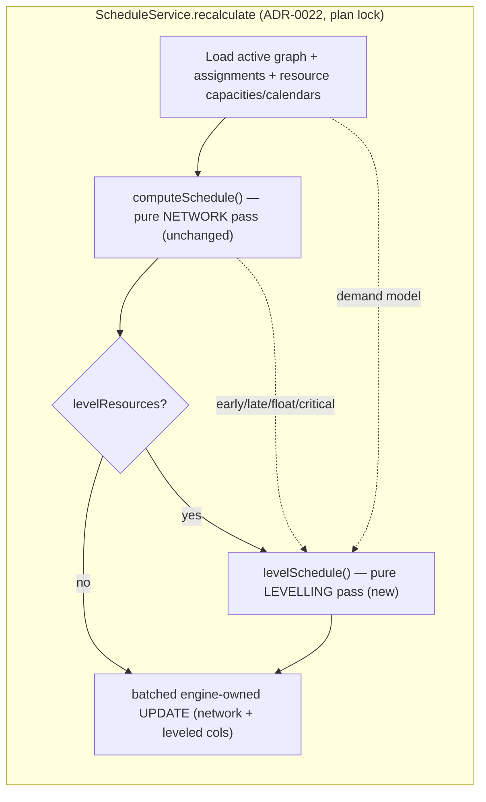
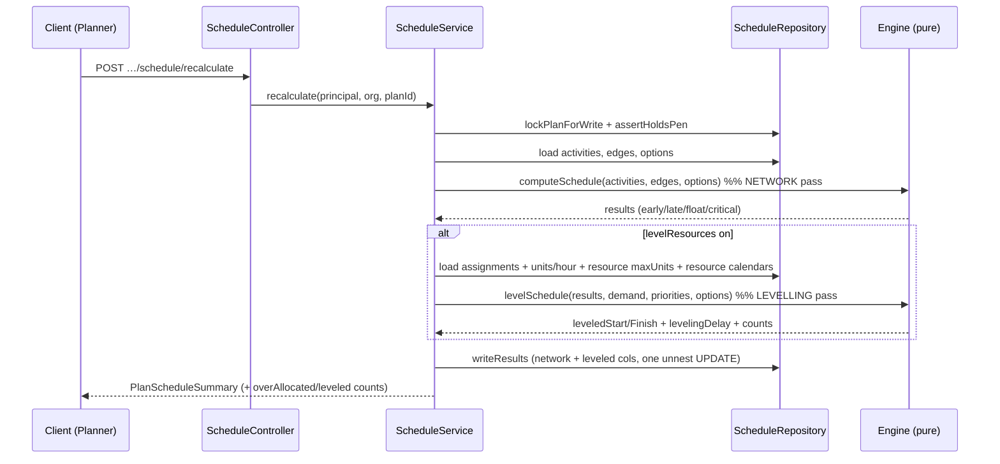
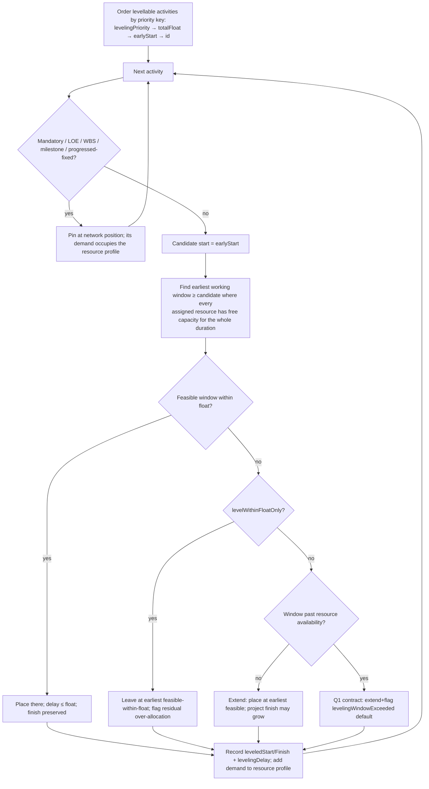

# Feature Spec: Resource Levelling (M7 resource rung)

- **Status:** Draft (awaiting approval)
- **Author(s):** feature-analyst (Product Owner / Solution Architect / Technical Lead hats), with James Ewbank
- **Date:** 2026-07-17
- **Tracking issue / epic:** Engine conformance & validation framework (ADR-0034) — capability epic **M7 (the Resource dimension)**, rung: **Resource levelling** (`levelling_test`, scenario **S10**). Follows M7.1/M7.2 (the resource model + resource-dependent scheduling, ADR-0039) and rung 4 (duration/units types, ADR-0040).
- **Roadmap link:** `docs/specs/engine-conformance-framework/CAPABILITY_MATRIX.md` — the ⚪ **Resources / levelling / curves / cost / EV / accrual** row (`res_*` `levelling_test` `cost_*` …) and scenario **S10 "Level resources — serialise over-allocations"** (both ⚪ **Deferred**). This rung flips the **levelling** half of that group and S10 to ✅; **cost / EV / curves / %-complete / inter-project remain ⚪** and are explicitly out of scope (§2 / §4).
- **Related ADR(s):**
  - **ADR-0041 _(NEW — Proposed; drafted alongside this rung)_** — Resource levelling: the opt-in serial-priority-list heuristic, the capacity model on `resource.max_units_per_hour`, the second (resource-constrained) engine pass, the engine-owned leveled columns + `levelingDelay`, and the byte-parity gate.
  - **ADR-0035 _(new clause proposed, Accept under this rung's conformance slice)_** — a new **§28 (resource-levelling semantics)**: serial priority-list heuristic, the deterministic priority + tie-break key, level-within-then-beyond-float, the mandatory-never-moved rule, and the availability-window conflict contract (the fixture's explicit "pick one and document it"). Plus a negative-case addition to §25 (**N21** — negative `max_units_per_hour`).
  - **Builds on:** ADR-0039 (`Resource`/`ResourceAssignment` + `isDriving` + `budgetedUnits`; `resource.max_units_per_hour` reserved **"for levelling"** — this rung **activates** it), ADR-0040 (`units_per_hour` on the driving assignment — per-period demand), ADR-0037 (absolute working-instant axis + per-activity/per-resource calendars — demand is measured on the **resource's own** calendar), ADR-0036 (minute/shift granularity + the N11/N16 horizon & iteration cap), ADR-0022 (synchronous recalculate + engine-owned batched write — this rung adds a **second pass** under the same contract), ADR-0034 (the conformance parity gate), ADR-0028 (edit-pen on recalc), ADR-0012/0016 (RBAC + org scope).

> **This rung gives SchedulePoint the headline P6/CPM feature of _resource levelling_: resolving resource over-allocations by delaying activities so no resource is asked to do more than its capacity at once.** It is a **separate, opt-in second pass** on top of the pure CPM network schedule — the network (early/late/float/critical) is computed first and is **unchanged**; levelling then delays activities within the resource-constrained model, spending float first and extending the schedule only when it must. The design is deliberately **additive and parity-preserving**: with `levelResources` off (the default) the recalculate output is **byte-identical** to today (the ADR-0034 gate). It is sliced as an epic of shippable rungs, exactly like ADR-0039/0040: **L1** (schema — capacity/priority/leveled columns, dark), **L2** (the pure levelling pass + opt-in recalc wiring + persistence), **L3** (conformance — S10 differential + golden, matrix flip, Accept ADR-0035 §28), **L4** (flagged web surface, deferred). **Levelling is NP-hard; SchedulePoint documents a deterministic heuristic, not an optimal solver** (§4). Resource curves/histograms, cost/EV, activity splitting/stretching, resource smoothing, and multi-project levelling are **later rungs**, named but out of scope.

---

## 1. Business understanding

### Problem

Construction planners assign resources — crews, plant, equipment — to activities. When the total assigned demand on a resource during a working period exceeds that resource's capacity, the plan is **over-allocated**: it asks for two cranes when one is on hire, or 200% of a single hydrotest pump. Such a plan **cannot be executed as drawn** — the dates are a fiction. Today SchedulePoint can model the resources (ADR-0039), assign budgeted units and a productivity rate (ADR-0040), and even schedule a `RESOURCE_DEPENDENT` activity on its resource's calendar (§23) — but it **cannot detect or resolve over-allocation**. The `resource.max_units_per_hour` column was deliberately **reserved "for levelling"** by ADR-0039 and left unused; the conformance fixture's `levelling_test` objects and scenario **S10** sit unrunnable at ⚪.

**Resource levelling** is the P6/CPM answer: an opt-in pass that **delays activities** — spending total float first, then extending the schedule — until no resource's per-period demand exceeds its capacity. It is the single most-requested capability that turns a resourced plan from a wish-list into a deliverable programme, and it is the next natural rung of the M7 resource dimension: the model, the units, and the rate all exist; only the resolving pass is missing.

**Why now.** The two prerequisites landed in M7: the **capacity input** (`resource.max_units_per_hour`, reserved) and the **demand input** (the driving assignment's `units_per_hour` × the activity's working duration, ADR-0040). The engine already reasons on an **absolute working-instant axis** with per-resource calendars (ADR-0037), which is exactly the frame a levelling pass needs to measure demand over a resource's own working time. Levelling is the last big scheduling capability before the deferred cost/EV quadrant, and it is the one construction planners feel most sharply.

### Users

Roles are per **organisation membership** (ADR-0012/0016). Turning levelling on for a plan and setting an activity's levelling priority is a **definition-level, Planner-owned** act (same class as editing a duration or a constraint); running the resource-constrained recalculate is the existing `schedule:calculate` action; everyone else reads the resulting (leveled) dates.

| Role                                | Need in this rung                                                                                                                                                                                                                                        |
| ----------------------------------- | -------------------------------------------------------------------------------------------------------------------------------------------------------------------------------------------------------------------------------------------------------- |
| **Org Admin**                       | Full definition access; set a resource's capacity ceiling; read every leveled date; never locked out of the org's data.                                                                                                                                  |
| **Planner**                         | Set a resource's `maxUnitsPerHour` capacity; toggle `levelResources` on a plan; set an activity's **levelling priority**; run recalculate and see over-allocations resolved into leveled dates + delays. The primary user.                               |
| **Contributor**                     | Same as Planner for activities in scope (pen-gated); smaller scope.                                                                                                                                                                                      |
| **Viewer / External Guest**         | Read leveled dates, the levelling delay per activity, and which resources were over-allocated. No edits.                                                                                                                                                 |
| **Engine / conformance maintainer** | Flip the `levelling_test` capability row and **S10** to ✅ with a differential (turn levelling on ⇒ A6100/A6200 and A7700/A7730 serialise) + a first-principles golden proving a delay; Accept ADR-0035 §28; keep the levelling-off path byte-identical. |

### Primary use cases

1. **Set a resource's capacity** — a Planner sets `NL-CRANE600.maxUnitsPerHour = 1` (one crane on hire). Activates the reserved column.
2. **Turn levelling on for a plan** — a Planner sets the plan's `levelResources` flag (or passes it as a recalculate option), opting the plan into the resource-constrained pass.
3. **Set an activity's levelling priority** — a Planner marks a critical lift as higher priority so it wins the resource over a lower-priority activity when both demand it.
4. **Recalculate with levelling** — the recalculate endpoint runs the network pass (unchanged) then the levelling pass; over-allocated activities are delayed (float first, then extending the finish) so no resource exceeds capacity; each delayed activity gets a **leveled start/finish** and a **levelling delay**.
5. **Read the leveled schedule** — a reader sees the leveled dates, the delay, and the count of resources that were over-allocated before levelling. A plan with levelling off is unchanged (parity).
6. **(Conformance)** flip `levelling_test` / **S10** to ✅ — a differential proving the serialisation moves dates, a golden proving a specific delay, Accept ADR-0035 §28, keep the off-path byte-identical.

### User journeys

**Happy path — serialise two activities competing for one crane.** A Planner assigns the 600 t crawler crane (`NL-CRANE600`, `maxUnitsPerHour = 1`) to two lifts, **A6100** and **A6200**, which the network schedules to overlap (SS+0). The unlevelled plan shows **200%** allocation on the crane. The Planner turns on `levelResources` and recalculates. The levelling pass keeps the higher-priority lift where it is and **delays the other until the crane is free** — spending its float first, extending the schedule only if the float runs out. The reader sees A6200's leveled start pushed to A6100's finish, a **levelling delay** recorded on A6200, and `overAllocatedResourceCount` reflecting that the crane was contended. The pure early/late/float dates are untouched; the leveled dates are a separate overlay (§4).

**Happy path — hydrotest pump.** A7700 and A7730 both start FS+0 from A7600 and both need the single `NL-HYDROPUMP` (max 1). Levelling serialises them; the second is delayed to the first's finish.

**Alternate — delay conflicts with a resource availability window.** Serialising the crane lifts pushes the later one **past the crane-hire window's end** (the window-only crane calendar ends 21-Aug). The engine must either **extend past the window** (accepting the availability breach and flagging it) **or report the conflict and leave the activity at its earliest feasible-within-window position, flagged**. The fixture calls this out as **"both defensible; pick one and document it"** — resolved in §4 / ADR-0035 §28 and surfaced as a **critical open question**.

**Alternate — a mandatory-constrained activity may not move.** A10100 / A10500 carry mandatory constraints. Levelling **never delays a mandatory-constrained activity** to resolve a conflict — it is pinned; other activities level around it (and the residual over-allocation, if any, is reported).

**Alternate — levelling off (the default / parity).** A plan with `levelResources` off, or with no resource over capacity, produces the **byte-identical** network schedule; no leveled columns diverge from the pure dates.

**Read-only (Viewer/Guest).** Sees the leveled dates, the delay, and the over-allocation count; no edit affordance.

**Conformance journey.** The maintainer adds an adapter option to honour levelling (read the fixture's `max_units_per_hour`, the assignments' `units_per_hour`, and the `levelling_test` tags), runs the S10 differential (`level on` ⇒ A6100/A6200 and A7700/A7730 serialise, dates differ from S01), adds a first-principles golden proving a specific delay, flips the `levelling_test` row + S10 to ✅, adds the ADR-0035 §28 acceptance row, and keeps the levelling-off path byte-identical.

### Expected outcomes

- SchedulePoint can **detect and resolve resource over-allocation** — the headline levelling feature — on an opt-in basis, so a resourced plan becomes executable.
- The reserved `resource.max_units_per_hour` becomes a **live capacity ceiling**; a Planner sees over-allocations resolved into concrete leveled dates and delays.
- The conformance gap closes: `levelling_test` and **S10** flip ⚪ → ✅; ADR-0035 gains a documented levelling clause (§28) with a per-milestone acceptance row.
- The default (non-levelled) recalculate stays **byte-identical** — every prior golden + scenario holds (the parity gate).

### Success criteria

- **Correctness (deterministic).** For the same plan + priorities, levelling produces the **same** leveled dates on every run (a documented, stable tie-break key), so goldens are reproducible.
- **No over-allocation after levelling** (within the availability-window contract of §4): for every resource with a capacity ceiling, post-level concurrent demand ≤ `maxUnitsPerHour` at every working instant, except where a mandatory pin or an exhausted window makes it provably impossible (then it is **flagged**, not hidden).
- **Parity.** With `levelResources` off, `recalculate` output is byte-identical to the pre-rung output across every golden + scenario (asserted).
- **Performance.** The levelling pass keeps the ADR-0022/0036 recalc budget: **< 500 ms @ 500 activities, < 2 s @ 2,000** (re-verified with levelling on); the pass is O(A·R·log) with a bounded number of resource-demand events, not per-working-minute.
- **S10 differential** passes (level on ⇒ the named activities serialise, dates differ from S01) and a **first-principles golden** asserts a specific delay.

### Open questions

Marked **CRITICAL** where the answer changes design or scope; the rest have a stated default and do not block drafting.

- **[CRITICAL] Q1 — Availability-window conflict contract.** When serialising past a resource's availability window (the crane-hire window ends 21-Aug), does the engine **extend past the window and flag the breach** (produce-and-flag, consistent with the house §7/§21/§23 pattern), or **report the conflict and leave the activity at its latest feasible-within-window position, flagged** (report-and-stop)? The fixture says "both defensible; pick one and document it." **Assumed default:** _extend-past-window + `levelingWindowExceeded` produce-and-flag_ (never silently succeed; never hang), matching SchedulePoint's produce-and-flag ethos — but this is the one genuinely contested semantics call and is offered for decision.
- **[CRITICAL] Q2 — Does levelling recompute float/critical, or is the pure network float authoritative?** P6 can recompute float on the leveled dates ("leveling can change total float"). **Assumed default:** _keep the pure-network early/late/float/critical unchanged and expose leveled dates + `levelingDelay` as a separate overlay_ (levelling is additive, the parity gate is trivially preserved, and the critical path stays a pure function of logic). Recomputing leveled float is reserved for a later rung. Confirm this is acceptable, as it shapes ADR-0035 §28 and what the canvas shows.
- **Q3 — Serial vs parallel heuristic.** **Default (stated, not blocking):** _serial priority-list_ — schedule activities one at a time in priority order into the earliest capacity-feasible working window ≥ their early start. Justified vs parallel in §4 (deterministic, simpler, reproducible goldens). Parallel/optimising solvers are out of scope.
- **Q4 — Priority field & tie-break.** **Default (stated, not blocking):** a per-activity `levelingPriority` integer (lower value = higher priority; documented default), tie-broken by **total float asc → early start asc → activity id asc** for a stable, deterministic order. `database-architect` finalises the column type/default.
- **Q5 — Level within float only?** **Default (stated, not blocking):** allow levelling to **extend beyond float** by default (P6's "level only within float" checkbox is off by default), with an opt-in plan option `levelWithinFloatOnly` that forbids extension (leaving any residual over-allocation flagged).
- **Q6 — Capacity granularity.** **Default (stated, not blocking):** measure demand over the resource's **own working calendar** via an **event-driven interval sweep** (assignment start/finish events), not a per-working-minute scan — O(events·log) within the ADR-0036 horizon/iteration cap.

## 2. Functional requirements

### User stories & acceptance criteria

> **US-1** — As a **Planner**, I want to set a resource's capacity ceiling, so that the plan knows when that resource is over-committed.
>
> **Acceptance criteria**
>
> - **Given** an org resource, **when** I set `maxUnitsPerHour` to a non-negative number, **then** it persists and is used as the per-instant capacity for levelling.
> - **Given** I submit a **negative** `maxUnitsPerHour`, **then** it is rejected at the boundary (`@Min(0)` + a nullable-safe CHECK — N21), 422.
> - **Given** `maxUnitsPerHour` is **NULL/unset**, **then** the resource is treated as **uncapped** (never over-allocated) — the parity-preserving default.

> **US-2** — As a **Planner**, I want to turn levelling on for a plan, so that recalculate resolves over-allocations instead of only reporting the network schedule.
>
> **Acceptance criteria**
>
> - **Given** `levelResources = false` (default), **when** I recalculate, **then** the output is **byte-identical** to today (no leveled columns diverge from the pure dates).
> - **Given** `levelResources = true`, **when** I recalculate, **then** the network pass runs first (early/late/float unchanged) and a levelling pass then produces leveled dates + `levelingDelay` for delayed activities.
> - **Given** no resource is over capacity, **when** I recalculate with levelling on, **then** every leveled date equals its early date (levelling is a no-op) and `overAllocatedResourceCount = 0`.

> **US-3** — As a **Planner**, I want two activities competing for one unit of a resource to be serialised, so that the plan is executable.
>
> **Acceptance criteria**
>
> - **Given** A6100 and A6200 both demand the single crane and overlap, **when** I recalculate with levelling on, **then** the lower-priority activity is delayed until the crane is free; both never demand it concurrently beyond capacity.
> - **Given** the delay fits within the delayed activity's total float, **then** the project finish is **unchanged**; **given** it does not, **then** the finish extends (unless `levelWithinFloatOnly` is on).
> - **Given** equal priority, **then** the tie is broken deterministically (total float → early start → id), so the result is reproducible.

> **US-4** — As a **Planner**, I want mandatory-constrained activities never moved by levelling, so that a hard date is respected.
>
> **Acceptance criteria**
>
> - **Given** A10100/A10500 carry a mandatory constraint, **when** levelling runs, **then** they are **not delayed**; other activities level around them.
> - **Given** a mandatory activity itself causes a residual over-allocation, **then** the over-allocation is **reported** (`overAllocatedResourceCount`), never resolved by moving the mandatory activity.

> **US-5** — As a **Planner**, I want to see when serialising breaches a resource's availability window, so that I know the plan is infeasible as resourced.
>
> **Acceptance criteria**
>
> - **Given** serialising pushes an activity past the crane-hire window, **when** levelling runs, **then** the outcome follows the Q1 contract (default: extend + `levelingWindowExceeded` flag + count), never a hang or silent success.

> **US-6** — As a **conformance maintainer**, I want to prove levelling works against the fixture, so that the capability row and S10 flip to ✅ honestly.
>
> **Acceptance criteria**
>
> - **Given** the adapter honours levelling, **when** I run S10, **then** A6100/A6200 and A7700/A7730 serialise and the dates **differ** from S01 (a runnable differential).
> - **Given** a first-principles golden (a single-unit resource, two overlapping equal-duration activities), **then** the delay equals the first activity's working duration on the resource calendar (asserted exactly).
> - **Given** levelling off, **then** the fixture's existing goldens/scenarios are byte-identical.

### Workflows

**Recalculate-with-levelling (the core loop).**

1. `POST …/plans/:planId/schedule/recalculate` (`schedule:calculate`, pen-gated) — unchanged endpoint.
2. Under the plan-scoped advisory lock, in one transaction: load the active graph **and** (when `levelResources` on) the active assignments + their driving `units_per_hour` + each resource's `maxUnitsPerHour` + resource calendars.
3. Run the **pure network pass** (`computeSchedule`) — unchanged; produces early/late/float/critical.
4. If `levelResources`: run the **levelling pass** over the network result — serial priority-list placement into the earliest capacity-feasible window ≥ each activity's early start, honouring float-first-then-extend, never moving mandatory/LOE/WBS/milestone activities, applying the Q1 window contract. Produce leveled start/finish + `levelingDelay` per activity + plan-level counts.
5. Persist: the existing engine-owned network columns **and** the new leveled columns via the same batched `UPDATE … FROM unnest(...)` (ADR-0022) — never touching `version`/`updated_at`.
6. Return the plan summary (now including `overAllocatedResourceCount`, `leveledActivityCount`, and any window/mandatory-conflict counts).

**Set capacity / priority.** Planner edits a resource's `maxUnitsPerHour` or an activity's `levelingPriority` through the existing resource / activity write paths (client-settable definition columns; pen-gated; validated).

### Edge cases

- **Empty / no assignments** — levelling is a no-op; leveled = early.
- **Uncapped resource** (`maxUnitsPerHour` NULL) — never over-allocated; ignored by the pass.
- **Single activity over capacity by itself** (its own demand > capacity) — cannot be resolved by delay; **reported** (`selfOverAllocated`), never split (splitting is out of scope).
- **Non-driving assignments** — a non-driving assignment still **consumes** its resource's capacity (levelling is about all demand, not just the schedule-driving one); its `unitsPerHour` (ADR-0040) is the demand rate. _(Design note in §4: demand is summed across all active assignments on a resource, not only driving ones.)_
- **Mandatory / LOE / WBS-summary / milestone** activities are **not delayed** by levelling (LOE/WBS carry no independent placement; milestones are zero-length; mandatory is pinned).
- **Concurrent recalcs** — serialised by the existing plan advisory lock (ADR-0021/0022); no new concurrency surface.
- **Availability-window exhaustion** — Q1 contract (extend + flag by default).
- **Progressed activities** — an in-progress/complete activity's actuals are immutable (ADR-0035 §6); levelling only moves **remaining** work of not-started activities (started work is fixed in time and consumes capacity where it actually is). _(Interaction noted in §4; the golden set covers unprogressed first.)_
- **Deep priority ties across many activities** — resolved by the stable composite key; large ties do not make the result non-deterministic.

### Permissions

Deny-by-default RBAC + org scope (ADR-0012), unchanged surfaces:

- `resource.maxUnitsPerHour`, `activity.levelingPriority`, `plan.levelResources` — **definition writes**, Planner + Org Admin (and Contributor in scope), pen-gated (ADR-0028), org-scoped (IDOR-safe via the existing resource/activity/plan write paths).
- `recalculate` — `schedule:calculate` (Planner + Org Admin), pen-gated, unchanged.
- Reading leveled dates / counts — `schedule:read` (every member, incl. Viewer/Guest per plan share).

### Validation rules

- `maxUnitsPerHour` — `Decimal(18,4)?`, `>= 0` (DTO `@Min(0)` + nullable-safe CHECK, **N21**); NULL = uncapped. Shared client↔server (Zod / class-validator).
- `levelingPriority` — integer, bounded (e.g. `1..1000`), default documented (lower = higher priority); client-settable, no index needed (read on the full-plan recalc load only).
- `levelResources` — boolean, default `false`; `levelWithinFloatOnly` — boolean, default `false`.
- Leveled columns (`leveled_start`, `leveled_finish`, `leveling_delay_minutes`) — **engine-owned** (ADR-0022), never accepted from a write DTO; written only by the recalc batched `UPDATE`.

### Error scenarios

| Scenario                                            | Detection                      | User-facing result                                         | Status |
| --------------------------------------------------- | ------------------------------ | ---------------------------------------------------------- | ------ |
| Negative `maxUnitsPerHour` (N21)                    | DTO `@Min(0)` + CHECK          | inline field error                                         | 422    |
| Levelling on but plan has no `plannedStart`         | existing `PLAN_START_REQUIRED` | "set the plan start before calculating"                    | 422    |
| Not a member / wrong org (IDOR)                     | org scope resolve (404)        | not found                                                  | 404    |
| No `schedule:calculate` permission                  | authz check                    | forbidden                                                  | 403    |
| Does not hold the edit pen                          | `assertHoldsPen` (ADR-0028)    | locked                                                     | 423    |
| Serialisation breaches an availability window       | levelling pass                 | leveled + `levelingWindowExceeded` flag/count (Q1 default) | 200    |
| Mandatory activity causes residual over-allocation  | levelling pass                 | leveled others + `overAllocatedResourceCount` > 0          | 200    |
| Resource over-allocated by a single activity itself | levelling pass                 | reported `selfOverAllocated`, not split                    | 200    |
| Residual cycle (DAG invariant breach)               | existing engine guard          | opaque 500 (unreachable — ADR-0021)                        | 500    |

## 3. Technical analysis

| Area           | Impact         | Notes                                                                                                                                                                                                                                                                                                                         |
| -------------- | -------------- | ----------------------------------------------------------------------------------------------------------------------------------------------------------------------------------------------------------------------------------------------------------------------------------------------------------------------------- |
| Frontend       | low (deferred) | No UI in the core rungs. A **flagged** web surface (priority field, level toggle, leveled-bar overlay, over-allocation badge) is L4, behind a `VITE_RESOURCE_LEVELLING` flag — mirrors the `VITE_RESOURCES` / `VITE_DURATION_TYPES` pattern.                                                                                  |
| Backend        | med-high       | A new **pure levelling pass** in `engine/` (`level.ts`); the `ScheduleService.recalculate` orchestration gains an opt-in second pass + loads capacity/assignment demand; resource/activity/plan write paths gain the new definition fields. Thin controllers unchanged.                                                       |
| Database       | med            | Activate `resource.max_units_per_hour`; add `activities.leveling_priority`, `plans.level_resources` (+ `level_within_float_only`), and **engine-owned** `activities.leveled_start` / `leveled_finish` / `leveling_delay_minutes`. All additive/constant-default. **`database-architect` pass required before the migration.** |
| API            | low            | No new endpoints. `recalculate`/`summary` DTOs gain additive fields (`overAllocatedResourceCount`, `leveledActivityCount`, window/mandatory conflict counts). Resource/activity/plan DTOs gain the definition fields. OpenAPI updated.                                                                                        |
| Security       | low            | No new surfaces; new fields ride existing pen-gated, org-scoped write paths. Engine-owned columns never client-writable (data-integrity/IDOR review at L2). `maxUnitsPerHour`/priority validated.                                                                                                                             |
| Performance    | high           | The levelling pass is the cost centre. Must stay within the ADR-0022/0036 budget (< 500 ms @ 500, < 2 s @ 2,000). Event-driven interval sweep (O(events·log)), per-recalc resource-calendar port cache (ADR-0037), bounded by the N11/N16 horizon + iteration cap. `backend-performance-reviewer` at L2.                      |
| Infrastructure | none           | Synchronous, in-request, under the existing plan lock (ADR-0022). No queue/Redis. The queued path stays the documented escape hatch if a plan outgrows the budget.                                                                                                                                                            |
| Observability  | low            | Extend the recalc structured log with levelling counts + pass duration (ADR-0013); the summary endpoint reflects persisted leveled counts.                                                                                                                                                                                    |
| Testing        | high           | Unit (the pure pass: serialisation, float-first, tie-breaks, mandatory-never-move, window contract, determinism); service integration (opt-in wiring, engine-owned write leaves `version` untouched, parity when off); conformance (S10 differential + first-principles golden + matrix flip); no a11y until L4.              |

### Dependencies

- **Must be in place (are):** ADR-0039 resource model + `resource.max_units_per_hour` (reserved), ADR-0040 `units_per_hour` demand rate, ADR-0037 instant axis + resource calendars, ADR-0022 recalc + engine-owned write, ADR-0036 minute granularity + horizon.
- **This rung lands first:** L1 (schema) before L2 (engine + wiring) before L3 (conformance + ADR-0035 §28 acceptance) before L4 (flagged web).
- **Sibling later rungs (out of scope, unblocked by this one):** resource curves/histograms, cost/EV/accrual, %-complete types, resource smoothing (time-limited), splitting/stretching, multi-project levelling.

## 4. Solution design

### Architecture overview

The pure engine gains a **second pass** that consumes the network result plus a resource-demand model and returns leveled positions. The service owns all resolution (capacity, calendars, demand) and the persistence; the engine stays calendar-agnostic and dependency-free (ADR-0008).

### Data flow

### The levelling algorithm (serial priority-list heuristic)

**Why serial (not parallel/optimal).** Resource levelling is **NP-hard**; no CPM tool solves it optimally. SchedulePoint documents a **deterministic serial priority-list heuristic** (the classic construction method): schedule activities one at a time, highest-priority first, each into the earliest capacity-feasible working window at or after its early start. It is **simple, explainable, and reproducible** — the property that lets the golden suite assert exact dates. **Parallel** methods (advance a global clock, allocate contended resources per time-step) are harder to make deterministic across ties and buy no accuracy at our scale; an **optimising** solver (ILP/metaheuristic) is out of proportion for a live, sub-second, per-plan recalc. The serial method is what P6's "level resources" applies and what our fixture's S10 expects.

**Capacity & demand model.** For each resource with a non-NULL `maxUnitsPerHour`, demand at a working instant is the **sum of the `unitsPerHour` of every active assignment whose activity is running then**, measured on the **resource's own working calendar** (ADR-0037). Feasibility is checked by an **event-driven interval sweep** over assignment start/finish events (O(events·log), not per-minute), so the pass respects the ADR-0036 horizon + iteration cap (N11/N16). A resource whose own single-activity demand exceeds capacity is `selfOverAllocated` (cannot be fixed by delay; not split).

**Float-first, then extend.** A candidate delay that fits within the activity's **total float** preserves the project finish; only when float is exhausted does levelling **extend** (unless `levelWithinFloatOnly`). The delay is recorded as `levelingDelay` (working minutes on the activity's calendar).

**Network is authoritative for float/critical (Q2 default).** The pure early/late/float/critical stays a function of logic only; leveled dates + `levelingDelay` are an **additive overlay**. This keeps the parity gate trivially true and the critical path meaningful; leveling-aware float is a later rung.

**Exclusions.** Mandatory-constrained, LOE, WBS-summary, milestone, and time-fixed progressed activities are **never delayed**; they occupy the resource profile at their network position so others level around them (ADR-0035 §7/§21/§24 alignment).

### Database changes

Designed with **database-architect** before the migration (required). All additive/constant-default → no table rewrite, no data migration; the levelling-off path is byte-identical.

- `resources.max_units_per_hour` — **activate** (ADR-0039 reserved): `Decimal(18,4)?` (NULL = uncapped), nullable-safe `>= 0` CHECK (**N21**). Client-settable definition field.
- `activities.leveling_priority` — `SMALLINT`/`INT`, constant default (documented; lower = higher priority). Client-settable; no index (read on the plan-scoped recalc load only — the `secondary_constraint_type` precedent).
- `activities.leveled_start` / `leveled_finish` (`DATE`/`timestamptz`, nullable) + `leveling_delay_minutes` (`INT`, default 0) — **engine-owned** (ADR-0022), written only by the recalc `UPDATE`, never a write DTO.
- `plans.level_resources` (`BOOLEAN` default `false`) + `plans.level_within_float_only` (`BOOLEAN` default `false`) — client-settable plan options.
- No new indexes anticipated beyond what ADR-0039/0040 already declared for the assignment/resource loads (the driving/active-assignment partial indexes cover the demand query); database-architect confirms.

### API changes

No new endpoints. Additive DTO fields (day-denominated dates, matching the existing API convention):

- `PlanScheduleSummary` (recalculate + summary responses) gains `overAllocatedResourceCount`, `leveledActivityCount`, and (per Q1/US-4) `levelingWindowExceededCount` / `mandatoryOverAllocationCount` — engine-owned counts, mirroring `constraintViolationCount` / `resourceDriverMissingCount`.
- Activity read DTO gains `levelingPriority`, `leveledStart`, `leveledFinish`, `levelingDelay` (days).
- Resource DTO gains `maxUnitsPerHour`; plan DTO gains `levelResources`, `levelWithinFloatOnly`.
- Write DTOs: `maxUnitsPerHour` (resource), `levelingPriority` (activity), `levelResources` / `levelWithinFloatOnly` (plan) — validated (`@Min(0)`, bounds), pen-gated.
- `@repo/types` gains the fields on the relevant summaries in lock-step. OpenAPI (`@nestjs/swagger`) + `docs/API.md` updated.

### Component changes (deferred to L4, flagged)

Behind `VITE_RESOURCE_LEVELLING`, reusing the design system (no one-offs): a resource **capacity** field, an activity **levelling priority** field (RHF+Zod), a plan **"Level resources"** toggle, an over-allocation **badge**/count in the schedule summary, and a **leveled-bar overlay** on the TSLD canvas (leveled position vs early position, delay indicator) — extending the ADR-0026/0030 canvas layers. Loading/empty/error/success states per `docs/UX_STANDARDS.md`; a11y per WCAG 2.2 AA (colour never the sole signal for over-allocation). Full component design is an `ui-architect` task at L4 and out of scope here.

### Implementation approach & alternatives

**Chosen:** an **opt-in, pure, second engine pass** using a **serial priority-list heuristic**, orchestrated by the existing synchronous recalculate under the plan lock, persisting engine-owned leveled columns via the existing batched write. Network float/critical stays authoritative (Q2 default). Deterministic tie-breaks make goldens reproducible. Additive schema keeps the off-path byte-identical (the parity gate every prior engine rung held).

**Alternatives considered:**

- **Level inside the network pass (one combined pass).** Rejected: couples resource constraints to the pure CPM algorithm, breaks the byte-parity gate, and makes float meaningless. P6 (and this design) keep levelling a separate pass on top of CPM.
- **Parallel (time-stepped) levelling.** Rejected for now: harder to make deterministic across ties (goldens), no accuracy gain at our scale; serial is the documented P6 default. Could be added as a selectable method later.
- **Optimising solver (ILP/metaheuristic).** Rejected: disproportionate for a live sub-second per-plan recalc; not what construction planners expect from "level resources."
- **Recompute float on leveled dates (leveling-aware float).** Deferred (Q2): defensible P6 behaviour, but it complicates parity and the critical-path meaning; kept as a later rung, with the pure-network float authoritative now.
- **Activity splitting / stretching to resolve over-allocation.** Out of scope (named later rung): the fixture's S10 expects **serialisation**, and splitting needs a duration/segment model we don't have.
- **Background/queued levelling.** Rejected now: the synchronous path meets the budget at target sizes (ADR-0022); the queue stays the documented escape hatch.

## 5. Links

- Implementation plan: `docs/specs/resource-levelling/implementation-plan.md`
- New ADR: `docs/adr/0041-resource-levelling.md` (Proposed)
- Updated on landing: `docs/adr/0035-schedulepoint-cpm-semantics.md` (§28 + N21, Accept under L3), `docs/specs/engine-conformance-framework/CAPABILITY_MATRIX.md` (`levelling_test` + S10 rows), `CLAUDE.md` §16 (ADR-0041 row), `docs/adr/README.md`, `docs/API.md`, `@repo/types`.
