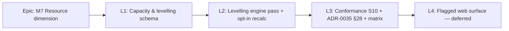

# Implementation Plan: Resource Levelling (M7 resource rung)

- **Feature spec:** `docs/specs/resource-levelling/feature-spec.md` (awaiting approval)
- **Status:** Draft (awaiting approval — do not implement before the spec + ADR-0041 are approved)
- **Owner:** TBD (engine/backend)

> **Sequencing principle.** Each milestone is a **shippable slice behind the parity gate**: until conformance is green (L3), levelling is **dark / opt-in** and the default recalculate output is **byte-identical** to today (the ADR-0034 gate, exactly as every prior M-rung held). `main` stays releasable after every task. Commits use Conventional Commits with the allowed scopes — **engine work commits under `api`** (there is no `engine` scope); schema under `db`; docs under `docs`; shared types under `types`; web under `web`.

## Breakdown

### Epic

**M7 — the Resource dimension** (roadmap: the engine-conformance capability programme, ADR-0034). This rung: **Resource levelling** (`levelling_test`, S10), the opt-in resource-constrained pass that resolves over-allocation. Consumes ADR-0039 (resource model + reserved `max_units_per_hour`) and ADR-0040 (`units_per_hour` demand rate).

---

### Milestone: L1 — Capacity & levelling schema (dark, additive)

**Outcome:** a Planner can set a resource's `maxUnitsPerHour`, an activity's `levelingPriority`, and a plan's `levelResources` / `levelWithinFloatOnly`; the engine-owned leveled columns exist. **No behaviour change** — recalculate is byte-identical (nothing reads the new fields yet). This is the shippable first slice.

#### Feature: Levelling schema + shared types

> **Description:** Activate `resource.max_units_per_hour` and add `activities.leveling_priority`, the engine-owned `activities.leveled_start/leveled_finish/leveling_delay_minutes`, `plans.level_resources` + `plans.level_within_float_only`; land `@repo/types` + write/read DTOs.
> **Complexity:** M
> **Dependencies:** ADR-0039/0040 (present). ADR-0041 approved.
> **Risks:** speculative-schema creep → mitigate by adding **only** the columns this rung needs (the ADR-0039/0040 lean-model posture); accidental non-additive change → mitigate with the additive/constant-default constraint + parity assertion.
> **Testing requirements:** migration applies clean; N21 boundary reject (negative `maxUnitsPerHour`) unit + API test; parity test (recalc byte-identical with the new NULL/default columns present).

##### Task 1 — database-architect design pass (no code)

- **Description:** Run **database-architect** on the deltas: `max_units_per_hour` activation, `leveling_priority`, engine-owned leveled columns, plan flags — column types, defaults, nullability, CHECKs, index need.
- **Complexity:** S
- **Dependencies:** ADR-0041 approved.
- **Risks:** wrong type/default silently activates levelling → mitigate with explicit NULL=uncapped / default false decisions recorded.
- **Testing:** design review only (no migration yet).
- **Development steps:**
  1. Confirm `max_units_per_hour Decimal(18,4)?` (NULL=uncapped) + nullable-safe `>= 0` CHECK (N21).
  2. Confirm `leveling_priority` type/default (lower=higher; no index — plan-scoped load only).
  3. Confirm engine-owned leveled columns are constant-default, no index; plan flags default false.
  4. Record the decision (DECISIONS.md / the migration comment).

##### Task 2 — Prisma migration (additive)

- **Description:** One additive migration adding all L1 columns + CHECK; forward-only (ADR-0018), direction noted in a comment.
- **Complexity:** M
- **Dependencies:** Task 1.
- **Risks:** table rewrite on a large `activities` table → mitigate: constant-default NOT NULL (metadata-only in PG 11+), nullable leveled columns.
- **Testing:** migration up on a seeded DB; column presence + CHECK assertions; a smoke recalc unchanged.
- **Development steps:**
  1. `schema.prisma` edits + raw-SQL CHECK in the migration.
  2. Generate + name migration (`…_m7_resource_levelling_schema`).
  3. Verify additive (no rewrite); update `docs/DATABASE.md` if a new pattern appears (none expected).

##### Task 3 — `@repo/types` + DTOs

- **Description:** Add fields to shared summaries + read/write DTOs (`maxUnitsPerHour`, `levelingPriority`, `levelResources`, `levelWithinFloatOnly`, leveled dates/delay, plan-summary counts). Validators (`@Min(0)`, bounds).
- **Complexity:** M
- **Dependencies:** Task 2.
- **Risks:** engine-owned field accidentally client-writable → mitigate: leveled columns absent from write DTOs (security review).
- **Testing:** DTO validation unit tests (N21 reject, priority bounds); type build (ADR-0019 build contract).
- **Development steps:**
  1. `@repo/types` fields (lock-step with DTOs).
  2. Resource/activity/plan write+read DTOs; recalc/summary response DTOs.
  3. OpenAPI decorators; update `docs/API.md`.
  4. Changeset (user-visible additive fields).

---

### Milestone: L2 — Levelling engine pass + opt-in recalc

**Outcome:** with `levelResources` on, recalculate resolves over-allocation into leveled dates + `levelingDelay`, persisted via the engine-owned write; with it off, output is byte-identical. This is the core rung.

#### Feature: Pure levelling pass (`engine/level.ts`)

> **Description:** A pure, calendar-agnostic serial priority-list pass consuming the network `EngineOutput` + a resource-demand model, producing `leveledStart/Finish` + `levelingDelay` + plan counts. Implements float-first-then-extend, deterministic tie-breaks, mandatory/LOE/WBS/milestone exclusions, the Q1 window contract, and `levelWithinFloatOnly`.
> **Complexity:** XL
> **Dependencies:** L1; ADR-0041; the Q1 + Q2 decisions.
> **Risks:** non-determinism across ties → mitigate: single documented composite key + a determinism test (shuffle input order ⇒ identical output). Performance blow-up → mitigate: event-driven interval sweep + horizon/iteration cap + a 2,000-activity perf assert. Parity drift → mitigate: pass only runs when opted-in; golden suite is the net.
> **Testing requirements:** first-principles unit tests (single-unit resource, two overlapping equal-duration activities ⇒ exact delay); float-first (delay ≤ float ⇒ finish preserved); extend (float exhausted ⇒ finish grows); tie-break determinism; mandatory-never-moved; window-conflict flag; `selfOverAllocated`; `levelWithinFloatOnly` residual flag.

##### Task 1 — Demand model + engine types

- **Description:** Add `EngineAssignment { activityId, resourceId, unitsPerHour }`, per-resource `capacity` + resolved resource calendar port, and result fields (`leveledStartOffset/Finish`, `levelingDelay`, flags) + summary counts to `types.ts`.
- **Complexity:** M
- **Dependencies:** L1.
- **Risks:** widening the engine result struct affects the writer → coordinate with Feature "engine-owned write".
- **Testing:** type-level; struct round-trip in the pass tests.
- **Development steps:** extend `types.ts`; add a `LevelOptions` to `ComputeOptions` (or a separate `levelSchedule` signature); document byte-parity when absent.

##### Task 2 — The serial priority-list core

- **Description:** Implement `levelSchedule(results, assignments, capacities, calendars, options)`: order by the composite key, place each activity into the earliest capacity-feasible window ≥ its early start via the interval sweep, apply float-first/extend/window/within-float rules, accumulate the resource profile.
- **Complexity:** XL
- **Dependencies:** Task 1.
- **Risks:** correctness of the feasibility search over shift/window calendars → mitigate: reuse the ADR-0037 instant helpers + ADR-0036 walker; extensive unit coverage.
- **Testing:** the full first-principles suite above; determinism; horizon cap (a resource never freed ⇒ terminates + flags, never hangs — N11/N16 style).
- **Development steps:**
  1. Priority ordering + exclusions.
  2. Resource-demand interval sweep + feasibility check.
  3. Float-first placement; extend; `levelWithinFloatOnly`; Q1 window contract.
  4. Emit leveled positions + delay + counts.

#### Feature: Opt-in recalc orchestration + engine-owned write

> **Description:** Wire the pass into `ScheduleService.recalculate` behind `plan.levelResources`; load assignments/capacities/resource calendars only when on; extend the batched `UPDATE … FROM unnest(...)` to also set the leveled columns (never `version`/`updated_at`); extend the summary + structured log.
> **Complexity:** L
> **Dependencies:** the pure pass Feature; ADR-0022 write contract.
> **Risks:** the write touches `version` → mitigate: assert-untouched test (the ADR-0022 core safety property). Extra query cost when off → mitigate: gate the demand load on `levelResources` + presence of assignments (byte-identical fast path).
> **Testing requirements:** service integration — parity when off (byte-identical); leveled columns populated when on; `version`/`updated_at` untouched; over-allocation counts surfaced; performance assert @ 2,000 activities with levelling on.

##### Task 1 — Load demand only when opted-in

- **Description:** In `buildEngineGraph` (or a sibling), load active assignments + `unitsPerHour` + resource `maxUnitsPerHour` + resource calendars **only** when `levelResources` and assignments exist; reuse the ADR-0037 per-recalc port cache.
- **Complexity:** M
- **Dependencies:** L2 pure pass.
- **Risks:** N+1 on assignment/resource load → mitigate: batched queries on the existing ADR-0039 partial indexes (backend-performance-reviewer).
- **Testing:** repository query tests; no-op when off.

##### Task 2 — Run the pass + persist leveled columns

- **Description:** After the network pass, run `levelSchedule` when opted-in; extend `writeResults` to set leveled columns in the same statement; return + log the counts.
- **Complexity:** M
- **Dependencies:** Task 1.
- **Risks:** persistence divergence between leveled/network columns → single write, transactional.
- **Testing:** the service integration suite above; log-shape test.
- **Development steps:** wire pass; extend writer; extend summary DTO mapping; extend the recalc log; changeset.

---

### Milestone: L3 — Conformance: S10 + ADR-0035 §28 + matrix flip

**Outcome:** the `levelling_test` capability row and scenario **S10** flip ⚪ → ✅ with a runnable differential + a first-principles golden; ADR-0035 gains an Accepted §28 levelling clause + N21; the levelling-off path stays byte-identical.

#### Feature: Levelling conformance

> **Description:** Add an adapter option to honour levelling (read `max_units_per_hour`, assignment `units_per_hour`, `levelling_test` tags), a golden proving a delay, an S10 differential, flip the matrix rows, add the ADR-0035 §28 acceptance row — matching how prior resource rungs (ADR-0039 §23, ADR-0040 dt_*) were done.
> **Complexity:** L
> **Dependencies:** L2.
> **Risks:** faking a levelled date → mitigate: honest `approximations` notes (the adapter's contract, ADR-0034 §2); assert the **shape** (serialisation + delay) where an exact P6 oracle is unavailable, first-principles where it is.
> **Testing requirements:** S10 runnable differential (`level on` ⇒ A6100/A6200, A7700/A7730 serialise, dates differ from S01); first-principles golden (single-unit resource, two overlapping activities ⇒ exact delay); parity (level off ⇒ existing goldens byte-identical); mandatory-never-moved assertion on A10100/A10500.

##### Task 1 — Adapter `honorLevelling` option

- **Description:** Extend `adaptFixture` to build the demand model from the fixture (resources' `max_units_per_hour`, assignments' `units_per_hour`, `res_overallocation`/`levelling_test` tags) and expose a `honorLevelling` knob (default false = parity).
- **Complexity:** M
- **Dependencies:** L2.
- **Risks:** driver/non-driver demand ambiguity → follow the spec §4 note (all active assignments consume capacity).
- **Testing:** adapter unit tests; notes assert honesty.

##### Task 2 — S10 differential + golden

- **Description:** Make `S10_LEVELLED` runnable in `scenarios.ts` (flip levelling on vs S01); add a `goldens.ts` first-principles delay golden.
- **Complexity:** M
- **Dependencies:** Task 1.
- **Risks:** S10's crane-window conflict (Q1) makes the exact date policy-dependent → assert the serialisation + the documented window outcome, not an external oracle.
- **Testing:** the differential + golden above.

##### Task 3 — Matrix + ADR-0035 §28 + docs

- **Description:** Flip the `levelling_test` capability row and the S10 scenario row to ✅ in `CAPABILITY_MATRIX.md`; add ADR-0035 **§28** (levelling semantics) + **N21** and set their acceptance row to **Accepted (this rung)**; add the ADR-0041 row to `CLAUDE.md` §16 + `docs/adr/README.md`.
- **Complexity:** S
- **Dependencies:** Tasks 1–2.
- **Risks:** matrix drift → the ADR-0034 §8 same-PR rule.
- **Testing:** structural validator (coverage completeness) stays green; docs links valid.
- **Development steps:** matrix rows; ADR-0035 §28 text + ledger row; ADR-0041 status note; changeset.

---

### Milestone: L4 — Flagged web surface (deferred)

**Outcome:** behind `VITE_RESOURCE_LEVELLING`, a Planner sets capacity/priority, toggles levelling, and sees leveled bars + an over-allocation badge. **Named but out of immediate scope** — mirrors the `VITE_RESOURCES` / `VITE_DURATION_TYPES` flagged-web pattern; designed by `ui-architect` and reviewed by ux/component/accessibility reviewers when scheduled.

#### Feature: Levelling UI (flagged)

> **Description:** Capacity field (resource), levelling-priority field (activity, RHF+Zod), "Level resources" plan toggle, over-allocation badge in the schedule summary, leveled-bar overlay on the TSLD canvas (ADR-0026/0030).
> **Complexity:** L (deferred)
> **Dependencies:** L3; `ui-architect` design; ADR-0026/0030 canvas layers.
> **Risks:** one-off styling → design-system tokens only; colour-only meaning → WCAG 2.2 AA (badge + text, not colour alone).
> **Testing requirements:** component tests, Playwright journey + a11y checks, performance-reviewer on the canvas overlay. Out of scope for this plan's core rungs.

## Sequencing & slices

1. **L1** (schema, dark) — releasable immediately; nothing reads the fields.
2. **L2** (engine + opt-in wiring) — releasable; levelling only runs when a Planner opts in; off-path byte-identical.
3. **L3** (conformance) — flips the matrix/S10 and Accepts ADR-0035 §28; the parity gate proven green.
4. **L4** (flagged web) — deferred; behind `VITE_RESOURCE_LEVELLING`.

Feature flags: none server-side (opt-in via `plan.levelResources` keeps the default dark, so no server flag is needed — the ADR-0040 precedent); the web surface is behind `VITE_RESOURCE_LEVELLING`.

## Definition of Done (per task)

Each task's PR must satisfy the Feature Completion Criteria in [`docs/PROCESS.md`](../../PROCESS.md) — code, tests (≥ 80% changed-code; regression tests), docs/ADR updates, security review (engine-owned columns never client-writable; N21; org-scope), performance (recalc budget re-verified with levelling on), accessibility (L4 only), Docker build, CI green, changeset, version impact.

## Recommended specialised agents

- **database-architect** — L1 (before the migration; required).
- **security-reviewer** — L1/L2 (engine-owned columns, N21 boundary, org-scope/IDOR on the new definition writes).
- **api-reviewer** — L1/L3 (additive DTO fields, envelopes, OpenAPI).
- **backend-performance-reviewer** — L2 (assignment/capacity load N+1, the levelling pass complexity, the 2,000-activity budget).
- **test-engineer** — L2/L3 (the pure-pass suite, service integration, S10 differential + golden).
- **ui-architect** + **ux-reviewer** / **component-reviewer** / **accessibility-reviewer** / **performance-reviewer** — L4 (flagged web).

## Risks & assumptions (rollup)

| Risk / assumption                                  | Likelihood       | Impact | Mitigation                                                                                                                     |
| -------------------------------------------------- | ---------------- | ------ | ------------------------------------------------------------------------------------------------------------------------------ |
| Levelling is NP-hard; the heuristic is not optimal | high (by design) | med    | Document the deterministic serial heuristic as SchedulePoint semantics (ADR-0035 §28); north-star not parity (ADR-0034).       |
| Q1 window-conflict policy contested                | med              | med    | Surface as a CRITICAL question; default extend-and-flag; recorded in ADR-0035 §28 so goldens have an authority.                |
| Parity drift (off-path not byte-identical)         | low              | high   | Pass only runs when opted-in; golden suite is the gate; leveled columns are additive/engine-owned.                             |
| Performance regression with levelling on           | med              | high   | Event-driven interval sweep, horizon/iteration cap, per-recalc port cache, 2,000-activity perf assert.                         |
| Non-deterministic tie-breaks break goldens         | med              | high   | Single documented composite key + a shuffle-input determinism test.                                                            |
| Progressed-plan interaction under-specified        | med              | med    | Golden set covers unprogressed first; started work is time-fixed and consumes capacity in place; document, defer edge goldens. |
| Engine-owned leveled columns made client-writable  | low              | high   | Absent from write DTOs; security review; the ADR-0022 write contract.                                                          |
