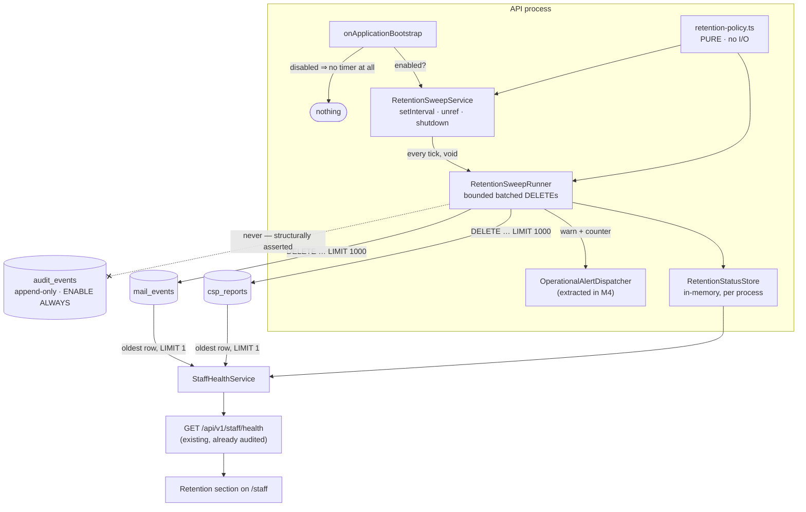
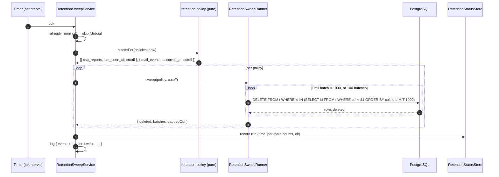
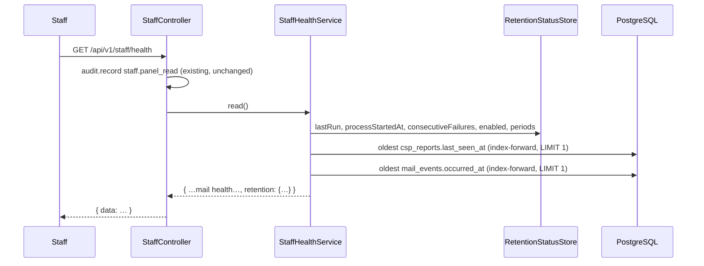

# Feature Spec: Data retention enforcement (the retention sweep)

- **Status:** Draft — awaiting approval
- **Author(s):** feature-analyst
- **Date:** 2026-08-10
- **Tracking issue / epic:** —
- **Roadmap link:** `docs/ROADMAP.md` → "A retention sweep — and it belongs first in this list, not last"
- **Related ADR(s):** **ADR-0087 (to be written by M0 of the plan)**; inputs are ADR-0085 (privacy
  operations), ADR-0072/0073 (the append-only audit log), ADR-0009 (background processing, partially
  superseded in intent), ADR-0086 (the staff console), ADR-0075 (operational alerting).

> **A note on evidence.** Per `docs/PROCESS.md` "Decision-bearing claims carry their evidence" and
> ADR-0076 §19.10, every load-bearing claim below names the file, line or command that established
> it. Where a claim was inherited from the brief that commissioned this spec, it was re-checked
> independently and is marked **[verified here]**; where it could not be checked without running
> something, it is marked **[not measured]** and the plan owns measuring it. Two claims in the brief
> were re-derived and both held; one turned out to be **understated**, and that correction is §1.2.

---

## 1. Business understanding

### 1.1 Problem

Two tables in this application document a retention period, and **nothing in the running system
enforces either**. The periods are ceilings, not promises, and today's true retention for both is
_forever_.

| Table         | Documented period | Where it was decided                                                                                                 | Sweep predicate                        |
| ------------- | ----------------- | -------------------------------------------------------------------------------------------------------------------- | -------------------------------------- |
| `csp_reports` | 30 days           | `apps/api/prisma/migrations/20260809160000_csp_reports/migration.sql:15-19`                                          | `last_seen_at` (named in that comment) |
| `mail_events` | 12 months         | ADR-0085 D3 (`docs/adr/0085-privacy-operations.md:97`); restated at `20260809120000_mail_events/migration.sql:30-37` | `occurred_at`                          |

Both migrations say so in their own words. `csp_reports`' comment reads _"Retention is 30 days and
NOTHING ENFORCES IT … the true retention today is forever."_ `mail_events`' reads _"RETENTION IS 12
MONTHS, and nothing here enforces it … a CEILING, NOT A PROMISE."_ The debt is recorded at
`docs/TECH_DEBT.md` #118 item 1 and in `CLAUDE.md` §17.

**Why now, and not at its place in the roadmap ordering.** Two facts, both re-checked for this spec:

1. **`csp_reports` is written by an unauthenticated endpoint.** `apps/api/src/modules/csp/csp-report.controller.ts:32-44`
   is `@Public()`, answers `204` whatever arrives, and swallows its own write failures.
   `csp-report-body.ts:58,60` caps a request at `MAX_REPORTS_PER_REQUEST = 20` and each field at
   `MAX_FIELD_LENGTH = 1_024`; `clean()` at `:107-111` strips the **query string and fragment only**,
   so the **path survives** and is part of the dedup key. A caller who wants unique rows therefore
   gets them by varying the path. **[verified here]**
2. **`mail_events.recipient` holds a real customer email address**, indefinitely. That is a decided
   input (staff-console CQ-1, product owner 2026-08-09), and it is precisely what ADR-0085 spent an
   entire decision keeping erasable — `20260809120000_mail_events/migration.sql:24-28` says the table
   is deliberately ordinary ("updatable, deletable, expirable … all three verbs are requirements")
   so that erasure and retention can reach it. Today only two of the three verbs are ever used.
   **[verified here]**

The arithmetic on (1), which the brief did not state and which sizes the work:

- 20 reports/request × 60 requests/minute/IP = **1,200 rows/minute** = **1,728,000 rows/day per IP**.
- Row size measured in the migration at 500,000 rows = 174 MB ⇒ ≈ 348 B/row ⇒ ≈ **600 MB/day per IP**.

### 1.2 A correction to the brief: what "30 days" actually bounds

The brief (and `TECH_DEBT.md` #118) frames `csp_reports` as unbounded because rows are mintable.
That is true and it is not the whole shape. `docs/DATABASE.md:1481-1496` — read for this spec —
records a consequence that changes what this feature may honestly claim:

> **Read "30 days" as a claim about ROWS, not about data age.** Because `last_seen_at` moves on
> every repeat, a violation that keeps happening never expires, and its `document_uri` — which may
> carry a plan or organisation id in its path — is retained for as long as it lasts … the period
> bounds **staleness**, not retention, and the sentence "URLs are kept for 30 days" is not one this
> table supports.

Two things follow, and both are stated up front so this feature does not ship an over-claim:

- **A sustained flood is not bounded by retention.** An attacker who keeps re-sending each row
  inside the period keeps every row alive forever. The bound on a _sustained_ flood is the throttle
  (`@Throttle 60/60 s` per IP), not this sweep. What this sweep bounds is the **residue after they
  stop** — which is the realistic case, and is today unbounded.
- **The predicate stays `last_seen_at`.** That was a deliberate decision ("a violation that is still
  happening must not expire out from under the decision it informs") and this feature does not
  re-open it. Whether to add a **second, absolute** bound on `first_seen_at` is CQ-3 below.

### 1.3 Users

This feature has no planner-facing surface. Its users are:

| User                                  | Role                                     | What they need                                                                                                                                                                      |
| ------------------------------------- | ---------------------------------------- | ----------------------------------------------------------------------------------------------------------------------------------------------------------------------------------- |
| **The operator** (product owner)      | Host access; compose + env               | The documented periods to be true; a way to turn the sweep off without a release                                                                                                    |
| **Staff** (ADR-0086 `StaffPrincipal`) | Staff console, `STAFF_EMAILS` allow-list | To see that the sweep is alive and that retention is actually being honoured                                                                                                        |
| **A future data subject**             | No account interaction                   | That "we can erase you" is true for `mail_events.recipient` (ADR-0085 D1's tombstone reaches it only if the row still exists to be scrubbed, and retention is what bounds the rest) |
| **The CPM engine, planners, plans**   | —                                        | To be **untouched**. This feature must not reach a single customer entity.                                                                                                          |

No organisation role (Org Admin / Planner / Contributor / Viewer / External Guest) gains or loses
anything. Nothing here is org-scoped, because neither table has an `organization_id` — deliberately
(`20260809120000_mail_events/migration.sql:43-49`).

### 1.4 Primary use cases

1. **Expire `csp_reports` rows** whose `last_seen_at` is older than the configured period.
2. **Expire `mail_events` rows** whose `occurred_at` is older than the configured period.
3. **Read whether it is working** — a staff-console section that distinguishes "swept an hour ago,
   oldest row is 6 days old" from "this process has never swept" from "the oldest row is 400 days
   old, so something is wrong".
4. **Turn it off** without cutting a release, and know from the log what periods are in force.

### 1.5 User journeys

**Operator, happy path.** Deploy the release. The API boots, logs
`{ event: 'retention.configured', cspReportsDays: 30, mailEventsDays: 365, intervalMinutes: 60 }`,
runs one sweep shortly after bootstrap, and logs `{ event: 'retention.swept', cspReports: 0,
mailEvents: 0, durationMs: 3 }`. Nothing else happens for a month. The operator never thinks about
it again.

**Staff, verification.** Open `/staff`. The **Retention** section names each table, its configured
period, the age of its oldest surviving row, and when this process last swept. The reader can answer
"is retention being honoured?" without a database client.

**Operator, rollback.** Set `RETENTION_SWEEP_ENABLED=false` in compose and recreate. No timer is
created at all; the boot log says so; the Retention section says the sweep is disabled rather than
showing a stale last-run time that reads as health.

**The failure this exists to make visible.** The sweep stops (a bug, a permissions change, a broken
predicate). Nothing errors visibly, because a sweep that deletes nothing looks exactly like a sweep
that had nothing to delete. Within a period plus a grace window, the Retention section's oldest-row
age crosses the configured period and the section says the table is **overdue**. This is the
detector; the alert (§4.7) is secondary and cannot replace it.

### 1.6 Expected outcomes

- Two documented retention periods stop being aspirational. `docs/DATABASE.md`, both migrations,
  `CLAUDE.md` §17 and `TECH_DEBT.md` #118 stop containing a claim the code contradicts.
- A customer's email address in `mail_events` acquires a bounded lifetime, which is the half of
  ADR-0085 that can be honoured without touching the audit log.
- The residue of an abandoned CSP flood is drained rather than kept forever.
- **This application acquires its first scheduled background work.** That is the architecturally
  significant part and is why an ADR is required (§4.10).

### 1.7 Success criteria

| Criterion                                                                                    | How it is measured                                                                               |
| -------------------------------------------------------------------------------------------- | ------------------------------------------------------------------------------------------------ |
| No `csp_reports` row survives with `last_seen_at` older than the period + one sweep interval | API e2e against real Postgres (M1); the staff Retention section on the deployed host             |
| No `mail_events` row survives with `occurred_at` older than the period + one sweep interval  | Same                                                                                             |
| `audit_events` is never read, written or deleted by this feature                             | **Structural test** over the sweep's sources + an explicit allow-list assertion (M1)             |
| A sweep that has never run is distinguishable from one that ran and found nothing            | Retention section shows `processStartedAt` beside `lastRunAt: null`; unit test                   |
| The sweep is off ⇒ **no timer is created at all**, not a timer that deletes nothing          | Unit test, the `HeartbeatService` precedent (`heartbeat.service.ts:58-62`, asserted by its spec) |
| One sweep never holds a long transaction                                                     | Bounded batches, each its own statement, **not** inside `$transaction` (§4.4); measured in M0    |
| Recalculation parity                                                                         | Structurally trivial — the CPM engine is not imported and neither table is engine input (§3)     |

### 1.8 Open questions

Three are **critical** — their answers change design or scope. Everything else has a stated default
and is not a question.

> **CQ-1 (CRITICAL) — Does this feature also enforce ADR-0085 D3 on `audit_events`?**
>
> ADR-0085 D3 sets a **12-month** period for `auth.*` rows carrying a `subject_label`, and says it is
> _"expired by a scheduled job that deletes them wholesale — which the triggers must permit for that
> narrow, dated predicate and nothing else"_ (`0085-privacy-operations.md:90-92`). That job is the
> job this spec designs. But `audit_events` refuses `DELETE`: `20260803170000_audit_events/migration.sql:110-122`
> declares `BEFORE UPDATE OR DELETE` and `BEFORE TRUNCATE` triggers `ENABLE ALWAYS`, so the
> application role cannot bypass them and neither can a superuser session **[verified here]**.
> Honouring D3 therefore means **amending the strongest structural guarantee in the product**.
>
> **Recommended default: NO — `audit_events` is out of scope, and the exclusion is made structural.**
> Reasons: (a) the brief scopes this feature to two tables and names the append-only guarantee as an
> input, not an open question; (b) ADR-0085 **D6** names the trigger for building _any_ of ADR-0085
> — the first outside organisation, or a real subject request — and neither has occurred; (c) the
> two tables here are ordinary and need no relaxation at all, so bundling them with a trigger
> amendment would spend the most expensive decision in the register on the cheapest slice of work.
>
> **The cost of that default must be paid in writing, not silently.** The day this merges,
> `CLAUDE.md`, `DATABASE.md` and `TECH_DEBT.md` will say retention is enforced. ADR-0085 D3's period
> will still be _forever_. If nobody writes that down, "retention enforcement shipped" gets read as
> "erasure works", which is exactly the ADR-0058/0076 drift class this repository keeps recording.
> So M5 of the plan **splits** `TECH_DEBT.md` #118 item 1 into a closed half and a new open row
> naming D3 specifically. Confirm the default, or say the trigger amendment is in scope.

> **CQ-2 (CRITICAL) — Is the sweep enabled by default, deleting rows with no operator action?**
>
> Every comparable mechanism in this application is **inert until configured**: `MAIL_ALERT_URL`
> absent ⇒ no POST; `HEARTBEAT_URL` absent ⇒ **no timer at all** (`heartbeat.service.ts:60-62`, and
> its docblock calls the dormancy "a requirement rather than an optimisation"); `MAIL_SMTP_URL`
> absent ⇒ the logging stub. Following that pattern here would mean shipping a sweep that deletes
> nothing until somebody sets a variable.
>
> **Recommended default: ENABLED by default, with `RETENTION_SWEEP_ENABLED=false` as the rollback.**
> The precedent does not transfer, and the difference is precise: those three mechanisms have an
> **external dependency** — a receiver, a relay — and switching them on without it produces a signal
> going nowhere. A sweep has no external dependency. It enforces a period that has **already been
> decided** by an accepted ADR and two migrations. Shipping it default-off would reproduce verbatim
> the failure `TECH_DEBT.md` #100 records and `CLAUDE.md` §17 restates: a mechanism that exists,
> reaches nobody, and reads as done.
>
> The residual risk is a first sweep that deletes a large backlog unexpectedly. On the only
> deployment that exists it is **empty**: both tables were created by migrations dated `20260809`,
> i.e. **one day before this spec** **[verified here — migration directory names]**, so the first
> sweep on the deployed host will delete nothing at all. That fact is what makes default-on cheap
> _now_ and would not hold in six months.

> **CQ-3 (CRITICAL) — Do we accept that `csp_reports`' period bounds staleness, not data age?**
>
> §1.2. A still-reported violation's `document_uri` — which `DATABASE.md:1491` says "may carry a plan
> or organisation id in its path" — is retained indefinitely, by design.
>
> **Recommended default: ACCEPT, and record it.** The alternative is a second, absolute bound on
> `first_seen_at` (e.g. delete regardless of `last_seen_at` past 12 months). It is defensible — a
> live finding nobody has acted on for a year is a policy problem, and the row would be recreated by
> the next report — but it needs an index on `first_seen_at` that does not exist, i.e. **a migration,
> which must go through the database-architect agent** (CLAUDE.md §19.3), to bound a case the
> throttle already bounds. Deferred with the reasoning written down, not overlooked.

**Stated defaults, not questions** (each argued where it appears):

| Decision                                | Default                                                                     | §     |
| --------------------------------------- | --------------------------------------------------------------------------- | ----- |
| Scheduler technology                    | In-process `setInterval`, `.unref()`'d — no Redis, no queue, no dependency  | §4.10 |
| Periods configurable?                   | Yes — `RETENTION_CSP_REPORTS_DAYS` (30), `RETENTION_MAIL_EVENTS_DAYS` (365) | §4.5  |
| "12 months" expressed as                | **365 days**, uniformly, so there is one unit and one env type              | §4.3  |
| Interval                                | 60 minutes, bounded 5…1440                                                  | §4.5  |
| Batch size / per-run cap                | 1,000 rows per statement, 100 batches per table per run                     | §4.4  |
| Wrapped in a transaction?               | **No** — that is the thing being avoided                                    | §4.4  |
| Audited?                                | **No** — with the two ADR-0073 tests applied explicitly                     | §4.8  |
| Advisory lock for multi-replica safety? | No — deletes are idempotent and disjoint; harmless, and stated              | §4.4  |
| Schema change?                          | **None expected** — both predicates are served by existing indexes          | §4.6  |
| New API route?                          | **No** — extend `GET /api/v1/staff/health`'s DTO                            | §4.6  |
| `VITE_*` feature flag?                  | **No** — the staff console has none, and the real switch is server-side     | §4.9  |

---

## 2. Functional requirements

### 2.1 User stories & acceptance criteria

> **US-1** — As the **operator**, I want rows in `csp_reports` older than the configured period to be
> deleted automatically, so that an unauthenticated endpoint cannot accumulate rows forever.
>
> **Acceptance criteria**
>
> - **Given** a `csp_reports` row with `last_seen_at` older than the configured period **when** a
>   sweep runs **then** the row is deleted.
> - **Given** a row with `last_seen_at` inside the period **when** a sweep runs **then** the row is
>   unchanged — including its `count` and `first_seen_at`.
> - **Given** a row whose `first_seen_at` is older than the period but whose `last_seen_at` is not
>   **then** the row **survives** (§1.2 — this is the decided predicate, and is asserted so a later
>   change to it fails loudly).
> - **Given** more expired rows than one run's cap **when** a sweep runs **then** it deletes up to the
>   cap and the remainder is taken by subsequent runs, with no error and no partial-state corruption.

> **US-2** — As the **operator**, I want rows in `mail_events` older than the configured period to be
> deleted automatically, so that a customer's email address has a bounded lifetime.
>
> **Acceptance criteria**
>
> - **Given** a `mail_events` row with `occurred_at` older than the period **when** a sweep runs
>   **then** the row — and therefore the `recipient` address on it — is deleted.
> - **Given** a row inside the period **then** it is unchanged.
> - **Given** both tables have expired rows **when** a sweep runs **then** both are swept in one run,
>   and a failure sweeping one does not prevent the other (each table is its own unit of work).

> **US-3** — As **staff**, I want the console to tell me whether retention is being honoured, so that
> a sweep which has silently stopped is distinguishable from one with nothing to do.
>
> **Acceptance criteria**
>
> - **Given** the sweep is enabled **when** I open `/staff` **then** a **Retention** section names
>   each table, its configured period in days, the age of its oldest surviving row, and when this
>   process last swept.
> - **Given** this process has not yet swept **then** the section says so **and** shows when the
>   process started, so "booted two minutes ago" and "booted three days ago and never swept" are
>   different sentences.
> - **Given** a table's oldest row is older than its period plus one interval **then** the section
>   marks that table **overdue**, in text and not by colour alone (WCAG 1.4.1).
> - **Given** the sweep is disabled **then** the section says it is disabled, rather than showing a
>   stale last-run time that reads as health.
> - **Given** a table is empty **then** the section says "no rows" — not "0 days", which reads as a
>   measurement.

> **US-4** — As the **operator**, I want to disable the sweep without cutting a release, so that a
> defect in it costs a compose edit rather than a rollback.
>
> **Acceptance criteria**
>
> - **Given** `RETENTION_SWEEP_ENABLED=false` **when** the API boots **then** **no timer is created
>   at all** and one `info` line records that the sweep is disabled.
> - **Given** the sweep is disabled **then** no `DELETE` is ever issued against either table by this
>   feature, asserted by a unit test rather than by inspection.

> **US-5** — As **anyone reading this repository**, I want the sweep to be structurally incapable of
> touching `audit_events` or any customer entity, so that the append-only guarantee is not
> maintained by vigilance.
>
> **Acceptance criteria**
>
> - **Given** the retention policy list **then** the set of table names it contains is exactly
>   `{ csp_reports, mail_events }`, asserted by equality (not containment).
> - **Given** the sweep's source files **then** none of them names `audit_events`, `auditEvent`, or
>   any customer accessor (`prisma.plan`, `prisma.activity`, `prisma.user`, `prisma.note`, …),
>   asserted by a structural scan — the `staff-boundary.structural.spec.ts:115-140` precedent.
> - **Given** a policy descriptor **then** its table name is a **literal in a tagged template**, never
>   interpolated from a variable, so no table name can be reached through configuration.

### 2.2 Workflows

**A sweep run** (one tick):

1. If a run is already in flight, return immediately (the overlap guard) and log at `debug`.
2. Take `now` once, so every policy in the run shares one clock reading.
3. For each policy, in a fixed order:
   1. Compute `cutoff = now − retentionDays` (pure; §4.3).
   2. Loop: issue one bounded `DELETE` (§4.4). Stop when a batch deletes fewer rows than the batch
      size, or when the per-table batch cap is reached.
   3. Accumulate `{ table, deleted, batches, cappedOut }`.
4. On success: record the run in the status store, log one `info` line, reset the consecutive-failure
   counter.
5. On failure of any policy: log `warn` with the error, record the failure, increment the counter,
   and **continue to the next policy** — one broken table must not stop the other. Alert if the
   counter crosses the threshold (§4.7).

**Boot:**

1. `onApplicationBootstrap` reads config. If disabled ⇒ log `retention.disabled`, create no timer,
   return.
2. Log `retention.configured` naming the effective periods and interval — so an operator can see, in
   the one place they are already looking, what is about to be deleted.
3. Create the interval, `.unref()` it, and start one run immediately, **unawaited** (`void`), so the
   sweep can never delay bootstrap or readiness.

**Shutdown:** `onApplicationShutdown` clears the interval. An in-flight run is not cancelled; the next
statement either completes or fails as the connection closes, and either is safe because the work is
idempotent and resumable.

### 2.3 Edge cases

| Case                                          | Expected behaviour                                                                                                                                                                                                                                     |
| --------------------------------------------- | ------------------------------------------------------------------------------------------------------------------------------------------------------------------------------------------------------------------------------------------------------ |
| Table empty                                   | First batch deletes 0, loop exits, run reports `deleted: 0`. Panel says "no rows", not "0 days".                                                                                                                                                       |
| Nothing expired                               | Same. Indistinguishable from the above **in the log**, which is why the panel reports oldest-row age.                                                                                                                                                  |
| Backlog exceeds the per-run cap               | Delete up to the cap; `cappedOut: true` in the log line and on the panel; the next run continues.                                                                                                                                                      |
| A run overruns the interval                   | Overlap guard skips the next tick. Logged at `debug`, and `cappedOut` already bounds how long a run can be.                                                                                                                                            |
| Two replicas                                  | Both sweep. Deletes are **idempotent** — the second finds the rows gone. Wasteful, never wrong (§4.4).                                                                                                                                                 |
| Database unreachable                          | The statement rejects; caught; `warn` + counter. The next tick retries. No retry-within-a-run (§4.7).                                                                                                                                                  |
| Period shortened by a typo (`365` → `3`)      | Irreversible data loss at the next tick. Mitigations: env `min(1)`, the boot log naming the effective values, and the panel showing the configured period. This is the sharpest risk in the feature (§5).                                              |
| Period set to `0`                             | **Refused at boot** by the env schema (`min(1)`) — a 0-day period deletes the table.                                                                                                                                                                   |
| Clock skew between app and database           | Cutoff is computed in the application (§4.3) and passed as a parameter. Skew of seconds against a 30-day period is immaterial; both processes are in one compose stack. **[not measured — no evidence of skew has been sought, and none is expected]** |
| Process restarts more often than the interval | The boot run covers it — the `heartbeat.service.ts:73-76` argument ("a container that crash-loops faster than the interval would otherwise never ping at all"), applied here.                                                                          |
| Dead tuples after a large delete              | Left to autovacuum. No `VACUUM` is issued; issuing one from application code would be a new class of privilege and a new failure mode.                                                                                                                 |
| A row is written while the sweep is deleting  | New rows have a current timestamp and are outside the cutoff by construction. No interlock needed.                                                                                                                                                     |

### 2.4 Permissions

| Actor                                      | May                                                         | Mechanism                                                                  |
| ------------------------------------------ | ----------------------------------------------------------- | -------------------------------------------------------------------------- |
| The sweep itself                           | Delete from exactly two tables                              | No principal at all — it runs from a lifecycle hook, outside any request   |
| **Staff** (`StaffPrincipal`, ADR-0086)     | **Read** the Retention section                              | Existing `StaffGuard` on `GET /api/v1/staff/health`; uniform 404 otherwise |
| Org Admin / Planner / Contributor / Viewer | Nothing. No new permission, no new route, no visible change | —                                                                          |
| External Guest                             | Nothing                                                     | —                                                                          |
| The operator                               | Configure and disable                                       | Environment variables — host access, the same bar as `STAFF_EMAILS`        |

**No new permission is introduced**, and that is deliberate: adding one would imply somebody inside
an organisation can influence retention, which is an installation-wide operator decision.

### 2.5 Validation rules

Validated in `env.validation.ts` (Zod, at boot, fail-fast — the existing pattern):

| Variable                           | Rule                                                                | Default | Why bounded                                                                                           |
| ---------------------------------- | ------------------------------------------------------------------- | ------- | ----------------------------------------------------------------------------------------------------- |
| `RETENTION_SWEEP_ENABLED`          | `'true' \| 'false'` → boolean (the `PLAN_EDIT_LOCK_ENFORCED` shape) | `true`  | CQ-2                                                                                                  |
| `RETENTION_CSP_REPORTS_DAYS`       | int, `min(1)`, `max(3650)`                                          | `30`    | `0` empties the table; `3650` is "effectively never" without being unbounded                          |
| `RETENTION_MAIL_EVENTS_DAYS`       | int, `min(1)`, `max(3650)`                                          | `365`   | Same; 365 is ADR-0085 D3's twelve months (§4.3)                                                       |
| `RETENTION_SWEEP_INTERVAL_MINUTES` | int, `min(5)`, `max(1440)`                                          | `60`    | Below 5 is pointless load; above a day makes the boot run the only one on a frequently-recreated host |

No client-side validation exists or is needed — there is no form.

### 2.6 Error scenarios

There is no HTTP caller for the sweep, so most rows here are operator-facing rather than user-facing.

| Scenario                                          | Detection                       | Result                                                                                  | Status  |
| ------------------------------------------------- | ------------------------------- | --------------------------------------------------------------------------------------- | ------- |
| A `DELETE` rejects (connection, permission, lock) | `catch` around each policy      | `warn` `retention.sweep_failed`; counter++; other policies still run; retried next tick | n/a     |
| Consecutive failures cross the threshold          | Counter in the status store     | One alert POST (§4.7)                                                                   | n/a     |
| The sweep never armed (config, or a bug)          | **Not detectable by the sweep** | The panel's oldest-row age crosses the period ⇒ **overdue** (§1.5)                      | n/a     |
| Invalid `RETENTION_*` value                       | Zod at boot                     | The API **refuses to boot**, naming the variable                                        | n/a     |
| Staff panel read fails                            | Existing query error handling   | The section renders its error state; the rest of the console is unaffected              | 200/5xx |
| A non-staff caller reaches `/staff/health`        | `StaffGuard`                    | Uniform **404** (never 403 — no oracle), unchanged by this feature                      | 404     |

---

## 3. Technical analysis

| Area               | Impact            | Notes                                                                                                                                                                                                                                                              |
| ------------------ | ----------------- | ------------------------------------------------------------------------------------------------------------------------------------------------------------------------------------------------------------------------------------------------------------------ |
| **Frontend**       | Low               | One new section on the existing `/staff` route (`apps/web/src/routes/staff.tsx:90-94` composes five panels; this is a sixth). Fed by the **existing** `useStaffHealth` query — no new hook, no new route, no new state.                                            |
| **Backend**        | Medium            | One pure module + one runner + one thin scheduler + one status store, all under `apps/api/src/common/operational/` beside `heartbeat.service.ts`. `StaffHealthService` gains one read.                                                                             |
| **Database**       | **None expected** | No model, no column, no constraint. Both predicates are served by indexes whose migrations **say** they serve the sweep (§4.6). **If M0's measurement contradicts this, the index goes through the database-architect agent** — CLAUDE.md §19.3, no exceptions.    |
| **API**            | Low               | `GET /api/v1/staff/health` response DTO gains a `retention` object. No new route ⇒ **no route-census change** and no new audit action (§4.8). Additive to OpenAPI.                                                                                                 |
| **Security**       | Medium            | This is the mitigation for an unauthenticated write path. No table name is ever interpolated. No new endpoint, no new principal, no new permission. The append-only guarantee is untouched and made **structural** (US-5).                                         |
| **Performance**    | Low               | Bounded batches, outside any transaction, on existing indexes. Idle cost is an index range scan finding nothing, ~24×/day. Panel read is one index-forward `LIMIT 1` per table.                                                                                    |
| **Infrastructure** | Low               | **No new service, no new dependency.** Four environment variables; `docker-compose.yml` + `.env.example` gain them. Verified across every `package.json` in the monorepo: no `@nestjs/schedule`, `node-cron`, `bullmq`, `ioredis` or `croner` **[verified here]**. |
| **Observability**  | Medium            | Three new log events (`retention.configured`, `retention.swept`, `retention.sweep_failed`) on the existing `event:` naming convention. **Not part of `/health/ready`** — the `HeartbeatService`/`MailBootstrapService` refusal, for the same reason (§4.7).        |
| **Testing**        | Medium            | Unit (pure policy + scheduler with fake timers), structural (the exclusion), API e2e against real Postgres (the deletion itself), one `e2e-staff` journey step.                                                                                                    |

**Recalculation parity (ADR-0034).** The CPM engine is not imported, and neither `csp_reports` nor
`mail_events` is an input to `computeSchedule` — neither table has any relationship to a plan.
Parity is structurally untouched, in its honest form: **there is nothing here to hold parity for.**

### 3.1 Dependencies

- **Must land first:** ADR-0087 (M0). The plan's M1 depends on the decision, not the other way round.
- **Existing and required:** `csp_reports_last_seen_at_id_idx`, `mail_events_occurred_at_id_idx`
  (both shipped; both migrations name the sweep as a consumer).
- **Existing and reused:** `AppConfigService` / `env.validation.ts`; `PrismaService`;
  `OperationalModule`; `StaffHealthService` + `StaffController`; `apps/web/e2e-staff/staff.spec.ts`.
- **Touched by M4:** `OperationalAlertService`'s private `post()` is extracted so a second producer
  can reuse it (§4.7). Its existing spec is the oracle and must pass unchanged.
- **Blocked on nothing.** No third party, no infrastructure change, no operator action to ship.
- **Not a dependency:** ADR-0009 (BullMQ + Redis) is accepted and unimplemented; this feature
  deliberately does not implement it (§4.10).

---

## 4. Solution design

### 4.1 Architecture overview



Three seams, and each exists for a reason rather than for symmetry:

- **`retention-policy.ts` is pure** — no Prisma, no clock, no config object. It answers "what would be
  deleted, given a `now`". A timer is awkward to test; pure arithmetic is not, and this is where the
  decisions (predicate column, period, cutoff) live.
- **`RetentionSweepRunner` does the I/O and takes no timer.** The API e2e can drive it directly
  against a real Postgres, which is the only place the delete can actually be proven.
- **`RetentionSweepService` is a thin scheduler and nothing else** — the `HeartbeatService` shape,
  verbatim: one `setInterval`, `.unref()`'d, cleared in `onApplicationShutdown`, and **no timer at
  all** when disabled.

### 4.2 Data flow



The panel's read is a separate, request-time path:



### 4.3 The pure policy, and the arithmetic

```
Policy = { table, column, days, sql fragment }
cutoff(policy, now) = now − policy.days × 86_400_000 ms
```

Three decisions worth stating rather than assuming:

- **Days, uniformly.** ADR-0085 D3 says "12 months" and the migration comment writes
  `now() - interval '12 months'`. This design uses **365 days**. One unit means one env type, one
  arithmetic and one unit test; calendar months would need `make_interval` in SQL and would put the
  arithmetic somewhere a unit test cannot reach. The divergence is at most one day per leap year,
  against a period that is explicitly a **ceiling**. Recorded here so a reader comparing the SQL
  comment with the code does not read it as a bug.
- **The cutoff is computed in the application, not in SQL.** That is what makes it pure and testable,
  and it means `now()` in the database is never consulted. The cost is clock-skew sensitivity, which
  §2.3 dismisses with its reasoning stated.
- **The predicate column is part of the policy, not implied.** `csp_reports` uses `last_seen_at` and
  `mail_events` uses `occurred_at`; the migrations name both. Encoding them in one place, beside the
  reason, is what stops a future edit "tidying" `csp_reports` onto `first_seen_at` — which would
  expire live findings and is the exact mistake §1.2 warns about.

### 4.4 Bounded deletes, and the lock argument

**The statement** (one per batch, per table):

```sql
DELETE FROM "csp_reports"
 WHERE "id" IN (
   SELECT "id" FROM "csp_reports"
    WHERE "last_seen_at" < $1
    ORDER BY "last_seen_at", "id"
    LIMIT $2
 );
```

- Issued via `$executeRaw` as a **tagged template** — the established convention
  (`common/db/plan-advisory-lock.ts:39`, `modules/csp/csp-report.service.ts:113`), which parameterises
  `$1`/`$2`. **The table and column names are literals inside the template**, one template per policy,
  never interpolated from the policy object. A policy descriptor therefore _selects_ a statement; it
  cannot _construct_ one. That is the injection answer and it is structural (US-5).
- `ORDER BY last_seen_at, id` matches `csp_reports_last_seen_at_id_idx` exactly, so the inner select
  is a bounded index range scan. The migration measured that index at `Index Scan Backward`, 0.44 ms
  for the first page at 500,000 rows; this is the same index read forward. **[the migration's number
  is for the panel's read, not for this statement — M0 measures the delete shape]**
- **Not wrapped in `$transaction`.** Deliberately: a long transaction is the thing being avoided.
  Each batch is its own implicit transaction, so row locks are held for milliseconds and released;
  `TRANSACTION_TIMEOUT_MS` (15 s, `prisma.service.ts:25`) never applies; and a run interrupted at any
  point leaves a consistent database with the remainder taken next tick. The work is **idempotent and
  resumable**, which is what buys all of that.
- **Batch 1,000, cap 100 batches per table per run** ⇒ ≤ 100,000 rows/table/run, 2.4M rows/day at an
  hourly interval. That exceeds the 1.73M rows/day a single throttled IP can mint (§1.1), so the
  sweep out-drains an abandoned flood. **[the batch size and cap are proposed, not measured — M0
  measures and may change them; the arithmetic above is the reason for the shape, not proof of the
  numbers]**

**Locks and replicas.** No advisory lock is proposed, and that is a decision rather than an omission.
This repository has three advisory-lock namespaces (plan, calendar, resource-tree) and each exists to
serialise writers that would otherwise interleave incorrectly. Two sweeps racing cannot interleave
incorrectly: the delete is **idempotent** — the second replica's inner `SELECT` simply does not
return rows the first already removed — so concurrency costs a wasted statement, never a wrong
result. Adding `pg_try_advisory_lock` would buy tidiness at the cost of a new failure mode (a lock
held by a crashed session). **This deploys as one container today** (`CLAUDE.md` §17), so the case is
hypothetical; it is stated so that whoever adds a second replica meets the reasoning here rather than
in a log.

### 4.5 Configuration

Added to `env.validation.ts` and surfaced through `AppConfigService` getters — the existing pattern,
including `absentIfBlank` semantics where relevant (`app-config.service.ts:16-18`).

```
RETENTION_SWEEP_ENABLED=true                # 'true' | 'false'
RETENTION_CSP_REPORTS_DAYS=30               # 1…3650
RETENTION_MAIL_EVENTS_DAYS=365              # 1…3650  (ADR-0085 D3's twelve months)
RETENTION_SWEEP_INTERVAL_MINUTES=60         # 5…1440
```

An operator variable is warranted here on the ADR-0075/ADR-0086 precedent that **a deployment fact
belongs in the environment**: the period is a legal/retention judgement that can change without a
code change, and ADR-0085 D3's own asymmetry — _"shortening it later is free … lengthening it later
recovers nothing"_ — is exactly the kind of decision an operator must be able to make between
releases. The defaults reproduce the decided policy, so a deployment that sets nothing gets what the
ADR and the migrations say.

### 4.6 Database and API changes

**Database: none.** Both predicates are served by indexes that already exist and whose migrations
name the sweep as a consumer:

- `csp_reports_last_seen_at_id_idx` — _"AND the retention sweep's ranged DELETE on its leftmost
  prefix. Not discretionary — without it the sweep has no support at all."_ (`20260809160000_csp_reports/migration.sql:87-93`)
- `mail_events_occurred_at_id_idx` — _"the staff list's exact cursor order, the M3 Health panel's
  … count, and the retention sweep's ranged DELETE — all three on this one index."_ (`20260809120000_mail_events/migration.sql:107-138`)

**If M0's measurement shows any index, column or constraint is needed after all, it goes through the
database-architect agent before a line of SQL is written** — CLAUDE.md §19.3 and §20, unconditional,
including the clause that matters most: deciding a change is too small to need the agent is the
judgement the agent exists to make. The plan carries this as an explicit gate on M0, not as a note.

**API: one DTO extension, no new route.**

`GET /api/v1/staff/health` response gains:

```jsonc
{
  "retention": {
    "enabled": true,
    "intervalMinutes": 60,
    "processStartedAt": "2026-08-10T08:00:00.000Z",
    "lastRunAt": "2026-08-10T09:00:01.412Z", // null = this process has not swept yet
    "lastRunOk": true,
    "consecutiveFailures": 0,
    "tables": [
      {
        "table": "csp_reports",
        "retentionDays": 30,
        "oldestAt": "2026-07-20T11:04:00.000Z", // null = no rows
        "oldestAgeDays": 21,
        "overdue": false,
        "lastRunDeleted": 0,
        "lastRunCappedOut": false,
      },
      // … mail_events
    ],
  },
}
```

**Why extend `/staff/health` rather than add `GET /api/v1/staff/retention`.** Three reasons, in order
of weight:

1. The census's **seventh assertion** derives staff routes **from the path** and forces every one to
   be audited (`audit-coverage.structural.spec.ts:468-483`). A new route is therefore a new census
   entry, a new audited read, and a **second `staff.panel_read` row on every console page load** —
   more rows in the one table that refuses `DELETE`, for a panel about deleting rows.
2. `/staff/health` is already the "is the machinery working?" surface: it carries
   `transportConfigured`, `alertingConfigured`, `heartbeatConfigured` (`staff-health.service.ts:77-79`)
   — the same "configured / working / not" shape.
3. The web page composes panels from independent hooks; the Retention section reuses `useStaffHealth`,
   so TanStack Query dedupes it with the Mail panel and it costs no extra request.

The honest cost: a DTO named `StaffHealthDto` now carries something that is not mail health. That is
recorded rather than hidden, and the alternative's cost is higher.

**Not `/staff/installation`.** The periods are configuration and would fit there, but `lastRunAt` and
`oldestAgeDays` are **state**, and splitting one question across two panels is how a reader ends up
believing a configured period is an enforced one.

### 4.7 Observability and alerting

**Logs** (Pino, existing `event:` convention — `mail.send_failed`, `heartbeat.failed`,
`mail_event.persist_failed`):

| Event                    | Level  | When                | Fields                                                    |
| ------------------------ | ------ | ------------------- | --------------------------------------------------------- |
| `retention.configured`   | `info` | Boot, enabled       | `cspReportsDays`, `mailEventsDays`, `intervalMinutes`     |
| `retention.disabled`     | `info` | Boot, disabled      | —                                                         |
| `retention.swept`        | `info` | Every completed run | per-table `deleted`, `batches`, `cappedOut`, `durationMs` |
| `retention.sweep_failed` | `warn` | A policy threw      | `table`, `err`, `consecutiveFailures`                     |

Every field is a scalar. No row content is ever logged — `csp_reports` holds attacker-controlled
strings and `mail_events` holds a customer's address, and a log line is retained and shipped.

**Alerting: yes, but only on _sustained_ failure.** One alert after **three consecutive** failed runs
(three hours at the default interval), then silence until a run succeeds. The reasoning is ADR-0075's,
which this repository has already paid for once: _"an alert channel that cries wolf gets muted, and a
muted channel is worth less than no channel, because it is believed to be working."_ A single failed
tick is not actionable — retention is measured in days and the next tick retries.

**And the alert is explicitly the secondary detector, not the primary one.** This is the
`HeartbeatService` lesson stated in that service's own docblock: _"the API can send nothing when the
API is what is wrong … inverting the signal is the only construction that survives the failure it
reports."_ An alert cannot report a sweep that **never armed** — a misconfiguration, a lifecycle hook
that stopped being called, a timer cleared by a refactor. The **primary** detector is therefore the
panel's derived `overdue`: oldest-row age compared against the configured period, which is computed
from the data itself and is true regardless of whether any sweep code ran at all.

**Reusing the alert transport.** `OperationalAlertService.post()` is private and the service's whole
vocabulary is mail (`MailEventKind`, the mail coalescing window). M4 extracts the POST into a small
`OperationalAlertDispatcher` — URL, `ALERT_TIMEOUT_MS`, allow-listed log context and swallow
semantics preserved **verbatim** — injected by both producers. The existing
`operational-alert.service.spec.ts` is the before/after oracle and must pass **unchanged** (the
ADR-0078 barrel-preserving-move argument). Adding a `recordRetentionFailure` method to a service
named for mail was rejected: the name would then be a lie, and a lie in a name is how the next
producer ends up somewhere worse.

**Not part of `/health/ready`.** Same refusal as `HeartbeatService` and `MailBootstrapService`, for
the same reason: readiness is consumed by the container healthcheck, so folding this in converts a
sweep fault into a restart loop on a host that recreates containers unattended (ADR-0047).

### 4.8 Does anything audit it? — the two tests, applied

ADR-0073's coverage is derived from two tests. Applied honestly:

- **Test 1, durability.** Does something durable change for somebody, not otherwise attributed? A
  deletion is durable and irreversible. But there is no actor: nobody performed it, and the row it
  would produce would say "the machine did the thing it does hourly". `audit_events` already refuses
  this class explicitly — `ENGINE_DERIVED` exists because _"a recalculation is deterministic from
  inputs that are themselves auditable"_. The sweep is deterministic from two auditable inputs: the
  configured period (an environment variable, changed with host access) and the clock.
- **Test 2, blast radius.** Does it change anybody's rights or anybody's work? **No.** Neither table
  is customer work; both are telemetry about a machine and a policy.

The precedent is directly on point and already written down. `OperationalModule`'s docblock
(`operational.module.ts:15-18`): _"A mail failure is an act by a machine, not by a person: it earns
no audit row … and `AuditService.record()` fails its caller outside a transaction, which is the defect
ADR-0073 C4 found in the interchange producer."_ The sweep has no request and no transaction, so it
could only use `recordBestEffort` — and an hourly row, forever, in the one table that cannot be
pruned, is the failure ADR-0073 spent a whole milestone avoiding (`PLAN_CONTENT`: "recording it is the
cheapest way to make the log unreadable").

**Decision: the sweep writes no audit event.**

**Two things must be said out loud about that.** First, **the route census cannot see this decision
in either direction.** It reflects over `AppModule`'s controller metadata
(`audit-coverage.structural.spec.ts:287-344`); a lifecycle-hook producer has no controller, no path
and no method, so it appears in neither list and nothing fails. This is the same hole ADR-0074
recorded for the three Better Auth credential events (`"the route census structurally cannot see them
in either direction"`). The decision is therefore recorded in the ADR and in this spec, and is not
enforced by any gate. Second, **the panel read is already audited and stays so**: `GET
/staff/health` writes `staff.panel_read` today (`staff.controller.ts:132-141`), so reading the
retention state remains an audited act with no change at all.

### 4.9 Component changes

One new section component in `apps/web/src/features/staff/` (or beside the existing panels in
`routes/staff.tsx`, matching whatever the file already does), composed into the page after
`MailHealthPanel`. It reuses the page's existing `Panel` wrapper (`staff.tsx:132` renders an `h2`),
the shared design-system primitives, and the existing settled-state announcement pattern that the
ADR-0086 M6 accessibility review added to the other panels.

States, all four, because ADR-0062 M6 and ADR-0064 §7 both record that this is where defects live:

| State                  | Rendering                                                                                         |
| ---------------------- | ------------------------------------------------------------------------------------------------- |
| Loading                | The existing panel loading treatment                                                              |
| Error                  | The existing panel error treatment                                                                |
| Sweep disabled         | "Retention sweeping is **disabled**" — and **no** last-run time, which would read as health       |
| Never run this process | "This process has not swept yet (started _x_ ago)" — the two facts together                       |
| Healthy                | Per table: period, oldest-row age, last-run deletions                                             |
| Overdue                | The word **overdue** in text, never colour alone (WCAG 1.4.1), with the number that makes it true |
| Empty table            | "no rows", not "0 days"                                                                           |

**No `VITE_*` feature flag.** Three reasons: the staff console itself has none — `apps/web/src/config/env.ts`
contains **no** staff flag at all **[verified here: grep for `staff` returns nothing]** — so flagging
one section of an unflagged console is incoherent; ADR-0084 establishes that a flag is a **second
product maintained forever** and this is an additive section with structural flag-off parity
(ADR-0077's reasoning); and the real rollback contract is **server-side** (`RETENTION_SWEEP_ENABLED`),
which a `VITE_` constant structurally cannot gate — the ADR-0060 M0 / ADR-0074 rule.

### 4.10 Implementation approach & alternatives — the scheduler question

**This application has no scheduler.** Verified independently for this spec, across **every**
`package.json` in the monorepo (not just `apps/api`): no `@nestjs/schedule`, `node-cron`, `bullmq`,
`ioredis` or `croner` **[verified here]**. ADR-0009 chose BullMQ + Redis and was never implemented;
`CLAUDE.md` §17 lists it among four accepted-but-unimplemented ADRs. So the first question is what to
build, and the answer is architecturally significant.

**Chosen: a periodic in-process sweep, modelled on `HeartbeatService`.**

One `setInterval`, `.unref()`'d, cleared in `onApplicationShutdown`, **no timer at all** when
disabled, one run at bootstrap so a frequently-recreated container still sweeps. No Redis, no queue,
no new dependency, no new container. The exemplar is 118 lines and already in the tree, already
tested, already reviewed.

**Its costs, stated rather than glossed** — this is the part the recommendation stands or falls on:

| Cost                              | Is it acceptable here, and why                                                                                                                                                                                                                                                                 |
| --------------------------------- | ---------------------------------------------------------------------------------------------------------------------------------------------------------------------------------------------------------------------------------------------------------------------------------------------- |
| **Runs per replica**              | Yes. The work is **idempotent** (§4.4), so N replicas produce the same end state as one — unlike the mail alerter, where N replicas produce N messages and `operational-alert.service.ts:112-117` calls that "less obviously harmless". This deploys as one container today (`CLAUDE.md` §17). |
| **Not durable across restarts**   | Yes. There is no work queue to lose: a missed run is not a lost job, it is a deletion that happens an hour later. The predicate is time, so state does not need to survive.                                                                                                                    |
| **No retry within a run**         | Yes. The next tick _is_ the retry, an hour later, against a period measured in days.                                                                                                                                                                                                           |
| **No distributed coordination**   | Yes, for the same reason as the first row. Named so a second replica meets it here.                                                                                                                                                                                                            |
| **Last-run state is per process** | Partly. `lastRunAt: null` after a restart is honest but uninformative, which is why `processStartedAt` ships beside it. A durable `retention_runs` table was considered and rejected below.                                                                                                    |

**These costs are acceptable because of what the work is, not because the design is small.** A
deletion driven by a time predicate is idempotent, resumable, order-free, and needs no exactly-once
guarantee. Almost every property a queue buys is a property this work does not need. If a later job
_does_ need them — a scheduled export, a digest email, anything a user waits on — that job should
reopen ADR-0009 rather than extend this. The ADR must say so.

**Alternatives considered:**

| Option                                                      | Why not                                                                                                                                                                                                                                                                                                                                                                                                                                                                    |
| ----------------------------------------------------------- | -------------------------------------------------------------------------------------------------------------------------------------------------------------------------------------------------------------------------------------------------------------------------------------------------------------------------------------------------------------------------------------------------------------------------------------------------------------------------- |
| **Implement ADR-0009 (BullMQ + Redis)**                     | A new container, a new dependency, a new failure mode and a new operational surface — to run one idempotent `DELETE` an hour. It also has to be operated: Redis persistence, memory limits, eviction policy. Not warranted by two `DELETE` statements. Revisit when a second job exists that actually needs durability.                                                                                                                                                    |
| **`@nestjs/schedule` (`@Cron`)**                            | The honest middle option, and genuinely close. Rejected on: it is a new dependency for a decorator over `setInterval`; the repository already has a reviewed exemplar of the timer shape; and `@Cron` registers at module scan, which makes "no timer at all when disabled" (US-4, the property `HeartbeatService`'s spec calls a requirement) something you configure rather than something you do not create. Worth reconsidering at the **third** timer, not the first. |
| **A host-side cron / `psql` in compose**                    | Moves the policy out of the application into a host artefact nobody versions, tests or reviews, on a host that recreates containers unattended (ADR-0047). It also cannot feed the staff panel, so the operator loses the one thing that makes a dead sweep visible.                                                                                                                                                                                                       |
| **Postgres `pg_cron`**                                      | Not installed, and the application role is **not superuser** (`20260809160000_csp_reports/migration.sql:76` records exactly this while rejecting `pgcrypto` for the same reason), so a migration cannot install it. Ruled out by measurement already in the tree.                                                                                                                                                                                                          |
| **A durable `retention_runs` table**                        | Would survive restarts and make the panel's history real. Rejected for v1: it is a schema change (⇒ the database-architect agent) for observability of a job whose success is already **derivable from the data it maintains** (oldest-row age), and it is a table that would itself need retention.                                                                                                                                                                       |
| **Delete on write (a probabilistic sweep in the producer)** | Puts an unbounded delete on the request path of an **unauthenticated** endpoint, i.e. hands a stranger a way to make the write path slow. Rejected outright.                                                                                                                                                                                                                                                                                                               |
| **One unbounded `DELETE` per table**                        | The migration measured 176 ms for 17,565 rows at 200,000 rows, which is fine — and says nothing about the hostile case this feature exists for (§1.1: 1.7M rows/day). Bounded batches cost nothing extra in the common case and bound the worst one.                                                                                                                                                                                                                       |

**ADR required: yes — ADR-0087.** Two of its three claims are architecturally significant on their
own: _this application now runs scheduled background work_, and _this is the shape such work takes
until something needs durability_, which narrows ADR-0009's intent without superseding its decision.
The third is the boundary: _the sweep may never touch `audit_events`_, which is where ADR-0085 D3 and
ADR-0072 collide and where the next reader will otherwise re-derive the answer from whichever half
they open first. `docs/DECISIONS.md` is not sufficient: `docs/PROCESS.md` reserves that for smaller
decisions, and "we have a scheduler now" is not one.

---

## 5. Risks

Carried in full in the implementation plan's rollup; the three that shape the design:

1. **A mistyped period is irreversible.** `RETENTION_MAIL_EVENTS_DAYS=3` destroys a year of history at
   the next tick, and lengthening it afterwards recovers nothing (ADR-0085 D3's asymmetry). Mitigated
   by `min(1)` at boot, the `retention.configured` boot line naming the effective values, and the
   panel showing the configured period — **not** eliminated. It is the sharpest risk here.
2. **A shipped-but-inert sweep** — the failure this repository has recorded three times
   (`TECH_DEBT.md` #100, ADR-0075, ADR-0086's unwired signals). Mitigated by CQ-2's default-on, by the
   boot log, and above all by the panel's **derived** overdue indicator, which is true whether or not
   any sweep code ran.
3. **An over-claim in the documentation.** The day this merges, four documents will say retention is
   enforced. `audit_events`' `auth.*` `subject_label` will still be retained forever (CQ-1). M5 of the
   plan splits `TECH_DEBT.md` #118 accordingly rather than closing it whole.

---

## 6. Links

- Implementation plan: [`./implementation-plan.md`](./implementation-plan.md)
- Docs this change must update: `docs/DATABASE.md` (both retention paragraphs), `docs/TECH_DEBT.md`
  (#118 item 1 → split), `CLAUDE.md` §16 (ADR-0087) + §17 (the retention bullet), `docs/ROADMAP.md`,
  `docs/SECURITY_STANDARDS.md` (data protection), `docs/OBSERVABILITY.md` (the three events),
  `docs/DEPLOYMENT.md` + `.env.example` + `docker-compose.yml` (the four variables), `docs/API.md`
  (the DTO extension), `docs/adr/README.md` (the index — ADR-0078 found seven ADRs missing from it).
