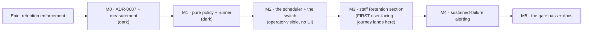

# Implementation Plan: Data retention enforcement (the retention sweep)

- **Feature spec:** [`./feature-spec.md`](./feature-spec.md)
- **Status:** Draft — awaiting approval
- **Owner:** —

## Breakdown

### Epic

**Data retention enforcement** — make two documented retention periods true, without touching the
append-only audit guarantee, and establish the shape scheduled work takes in this application.
Roadmap theme: `docs/ROADMAP.md` → "A retention sweep — and it belongs first in this list, not last".

**Two rules govern the whole epic** and are repeated in the tasks that need them:

- **Every schema change goes through the database-architect agent — always** (CLAUDE.md §19.3, §20).
  The design expects **none**. If M0's measurement produces one — an index, a column, anything — it
  goes through the agent before any SQL is written, and if the agent is empty, fails, or is slow, it
  is **re-run**. An unavailable agent is a reason to wait, never a reason to proceed.
- **The pre-push gate is run, not written** (CLAUDE.md §19.8): `pnpm lint && pnpm typecheck && pnpm
test`, **plus `scripts/e2e-local.sh api`** for every task touching `apps/api` (which is most of
  them), **plus `scripts/e2e-local.sh web:staff`** for M3.

---

### Milestone M0 — The decision and the measurement (ships dark)

**Outcome:** ADR-0087 exists and is Accepted, and the numbers that fix the batch size, the per-run
cap and the interval have been **measured on a real Postgres** rather than reasoned about.
**Ships dark:** no runtime code at all. Nothing is reachable, by construction — there is nothing to
reach. M2 is the first milestone that changes behaviour; M3 is the first with a surface.
**Journey:** none, and correctly none (ADR-0081 §1's second branch — a milestone that ships dark says
so, in the milestone header).

> **Why measurement comes first, and is its own milestone.** ADR-0073 C3.0 measured before a producer
> shipped, and the measurement changed a decision. ADR-0073 C1 measured an index question and turned a
> "documented no-op" into a 422. ADR-0065 measured the painter and reopened a budget. The spec's batch
> size, cap and interval are currently **proposed, not measured**, and the migration's one relevant
> number (176 ms for 17,565 rows) is for a **different statement shape**. Proceeding without this is
> the ADR-0076 Class 3 failure — asserting a cost nobody established.

---

#### Feature: ADR-0087 — the scheduler decision

> **Description:** Record that this application now runs scheduled background work; that its shape is
> an in-process, idempotent, non-durable timer; that ADR-0009's intent is narrowed rather than
> superseded; and that the sweep may never touch `audit_events`.
> **Complexity:** M
> **Dependencies:** none
> **Risks:** the number `0087` is taken between drafting and filing → **check `docs/adr/` immediately
> before filing and record the collision rather than routing around it** (the ADR-0071 failure, which
> ADR-0079 hit for real and recorded). Filed to `docs/adr/`, not left in `docs/specs/` (the ADR-0071
> failure itself).
> **Testing requirements:** `pnpm check:doc-links`; `pnpm check:claims` if any dependency-internals
> claim is made (none is expected — this ADR cites only this repository).

##### Task M0-T1 — write and file ADR-0087 (≈ one PR)

- **Description:** The ADR, per `docs/adr/_template.md`.
- **Complexity:** M
- **Dependencies:** —
- **Risks:** an ADR that restates the spec adds nothing → it must carry the **decisions and the
  rejected options**, not the design.
- **Testing:** doc-link check; `docs/adr/README.md` updated in the same commit (ADR-0078 found seven
  ADRs missing from that index; do not add an eighth).
- **Development steps:**
  1. Problem: two documented periods, nothing enforcing either, and no scheduler in the application.
  2. Decision D1 — an in-process periodic sweep, `HeartbeatService`'s shape, with its **costs stated**
     (per replica, non-durable, no retry) and the reason each is acceptable **for this work
     specifically** (idempotent, time-predicated, nobody waiting).
  3. Decision D2 — ADR-0009 is **narrowed, not superseded**: the next job that needs durability,
     retries or exactly-once reopens it. Name that trigger, ADR-0085 D6-style, so "we have a
     scheduler" does not become the answer to every future background need.
  4. Decision D3 — **the sweep may never touch `audit_events`**, and the exclusion is structural
     (M1-T3), not procedural. Cite the triggers (`20260803170000_audit_events/migration.sql:110-122`)
     and ADR-0085 D1's refusal to relax them. State plainly that **ADR-0085 D3 remains unenforced**
     and that this ADR does not implement it.
  5. Decision D4 — no audit event, with ADR-0073's two tests applied in writing, **and** the admission
     that the route census structurally cannot see this decision in either direction
     (`audit-coverage.structural.spec.ts:287-344`) — so it is a recorded rule, not a gate.
  6. Decision D5 — default-on, operator-configurable, with CQ-2's argument for why the
     "inert until configured" precedent does not transfer.
  7. Rejected options with their reasons (spec §4.10), including `pg_cron` ruled out by the
     already-recorded fact that the application role is not superuser.
  8. Consequences, including the one that costs something: the panel's last-run state is per process.
  9. Update `docs/adr/README.md` and `CLAUDE.md` §16.

##### Task M0-T2 — measure the batched delete

- **Description:** Establish the batch size, per-run cap and interval from measurement. **No product
  code** — a throwaway script or a `psql` session, with the numbers recorded in the ADR and later
  repeated in the code's docblock (the migration-comment convention, ADR-0073 C1).
- **Complexity:** M
- **Dependencies:** M0-T1 (so the numbers land in the ADR)
- **Risks:** measuring on a laptop and calling it the deployment → record the environment, the row
  count and the `EXPLAIN (ANALYZE, BUFFERS)` output, exactly as the two migrations do.
- **Testing:** n/a (measurement), but the numbers become assertions' justification in M1.
- **Development steps:**
  1. Seed `csp_reports` to **500,000** rows (the size the migration itself measured at 174 MB) and
     `mail_events` to **200,000** rows spread over 400 days (the shape its migration measured).
  2. `EXPLAIN (ANALYZE, BUFFERS)` the batched statement at LIMIT 100 / 1,000 / 10,000. **Confirm the
     inner select uses the existing index** — `csp_reports_last_seen_at_id_idx` /
     `mail_events_occurred_at_id_idx`. This is the load-bearing check: if it does not, the spec's
     "no schema change" claim is wrong and **M0-T3 opens**.
  3. Measure wall-clock for a full drain of 100,000 expired rows, batched, and compare against the
     unbounded `DELETE` the migration measured at 176 ms/17,565 rows.
  4. Measure the **idle** cost — the batch that finds nothing, which runs ~24×/day forever.
  5. Measure the panel's read: oldest row, `ORDER BY … ASC LIMIT 1`, both tables.
  6. Fix the four defaults from the numbers. If they differ from the spec's proposals, **say so in
     the ADR** rather than quietly adopting them.
  7. Record the deployed backlog: both tables were created by `20260809` migrations, so the first
     sweep on the host should delete **zero** rows — confirm rather than assume.

##### Task M0-T3 — **conditional**: any schema change goes through the database-architect agent

- **Description:** Only opens if M0-T2 shows an index or column is needed.
- **Complexity:** S–M
- **Dependencies:** M0-T2
- **Risks:** the whole reason this task exists — a hand-written index is a checksummed migration
  applied to a real database, and correcting it costs a second migration in every environment.
- **Testing:** whatever the agent's design specifies; `pnpm prisma:check-drift`.
- **Development steps:**
  1. Launch **database-architect** with the measurement output and the two existing migrations as
     context. **If it returns nothing, fails, or is slow — re-run it.** Waiting is the cheap option.
  2. Implement exactly what it returns, with the measurement in the migration comment.
  3. `pnpm prisma:check-drift` green; schema and migration in one PR.

---

### Milestone M1 — The pure policy and the runner (ships dark)

**Outcome:** the deletion logic exists, is proven against a real Postgres, and **nothing calls it**.
**Ships dark:** no timer is created, no lifecycle hook is registered, no route changes. This is
deliberate — it lets the delete be proven before anything can run it unattended.
**Journey:** none (dark). The first user-facing milestone is M3, and its journey lands there
(ADR-0081 §2).

---

#### Feature: the retention policy and its execution

> **Description:** `retention-policy.ts` (pure) + `RetentionSweepRunner` (I/O) + `RetentionStatusStore`
> (in-memory state), under `apps/api/src/common/operational/`, beside `heartbeat.service.ts`.
> **Complexity:** L
> **Dependencies:** M0 (the ADR and the numbers)
> **Risks:** (a) a table name reachable from configuration → literals in tagged templates only,
> structurally asserted; (b) the exclusion of `audit_events` becoming a convention → made a test;
> (c) a long transaction → no `$transaction` at all, asserted by review and by the batch shape.
> **Testing requirements:** unit (pure arithmetic), **structural** (the exclusion + the literal-table
> rule), **API e2e against real Postgres** (the delete itself — the only place it can be proven).

##### Task M1-T1 — the pure policy module

- **Description:** `common/operational/retention-policy.ts`: the policy descriptors and the cutoff
  arithmetic. No Prisma, no clock, no config object, no I/O.
- **Complexity:** S
- **Dependencies:** M0-T1
- **Risks:** the predicate column being "tidied" later (e.g. `csp_reports` onto `first_seen_at`),
  which would expire live findings → the column and **the reason** live together, and a test asserts
  the pairing.
- **Testing:** unit — cutoff arithmetic at boundaries (exactly-at-cutoff is **kept**, since the
  predicate is `<`), day-count conversion, and the `RETENTION_TABLES` set equality.
- **Development steps:**
  1. `RETENTION_TABLES = ['csp_reports', 'mail_events'] as const` — the `MAIL_EVENT_KINDS` /
     `AUDIT_ACTIONS` pattern (a `const` array so the vocabulary is enumerable at runtime).
  2. `RetentionPolicy = { table, column, days }` descriptors, each with a docblock naming the
     migration line that decided its period and its predicate column.
  3. `cutoffFor(days, now): Date` — pure, millisecond arithmetic. Docblock records the **365-days-
     not-12-calendar-months** decision (spec §4.3) so a reader comparing with the SQL comment does
     not read it as a bug.
  4. Unit tests, including one that asserts the `csp_reports` policy names `last_seen_at` and **not**
     `first_seen_at`, with the reason in the assertion message.

##### Task M1-T2 — the runner: bounded batched deletes

- **Description:** `RetentionSweepRunner.sweep(policy, cutoff)` — the loop, the bounded statement,
  the per-table result.
- **Complexity:** M
- **Dependencies:** M1-T1, M0-T2
- **Risks:** an unbounded delete slipping back in "for simplicity" → the cap is a parameter with a
  docblock carrying M0-T2's numbers.
- **Testing:** unit with a mocked Prisma (loop termination, cap, `cappedOut`, per-policy error
  isolation); the real proof is M1-T4.
- **Development steps:**
  1. One `$executeRaw` **tagged template per policy**, with the table and column as **literals** —
     `plan-advisory-lock.ts:39` / `csp-report.service.ts:113` are the convention. A policy selects a
     statement; it never constructs one.
  2. Loop until `deleted < batchSize` or the batch cap is reached; return
     `{ table, deleted, batches, cappedOut, durationMs }`.
  3. **No `$transaction`** — with the reason in a docblock (spec §4.4: a long transaction is the
     thing being avoided; each batch is atomic alone and the work is idempotent and resumable).
  4. Per-policy `try/catch` so one broken table cannot stop the other.
  5. Record M0-T2's measured numbers in the docblock (the migration convention).

##### Task M1-T3 — the exclusion, made structural

- **Description:** `retention-boundary.structural.spec.ts` — the guarantee that this feature can never
  reach `audit_events` or a customer entity, asserted rather than described.
- **Complexity:** S
- **Dependencies:** M1-T2
- **Risks:** a gate that can pass by finding nothing → the table list is asserted by **equality**, and
  the source scan is verified red by temporarily adding a forbidden accessor.
- **Testing:** this task **is** the test. Verify it red first, both assertions.
- **Development steps:**
  1. Assert `new Set(RETENTION_TABLES)` **equals** `{ csp_reports, mail_events }` — equality, not
     containment, so adding a third table fails here and forces a decision.
  2. Scan every `.ts` under `common/operational/` (comments stripped — the
     `staff-boundary.structural.spec.ts:37-41` lesson, where a docblock explaining the rule tripped
     the scan) for `audit_events`, `auditEvent`, `prisma.plan`, `prisma.activity`, `prisma.user`,
     `prisma.note`, `prisma.client`, `prisma.project`, `prisma.calendar`, `prisma.resource`,
     `prisma.baseline`.
  3. Assert no `$executeRaw` template in the sweep interpolates a table name from a variable.
  4. Verify red: add `prisma.auditEvent.deleteMany` temporarily, confirm failure, remove.

##### Task M1-T4 — the API e2e: prove the delete against real Postgres

- **Description:** `apps/api/test/retention-sweep.e2e-spec.ts`, driving `RetentionSweepRunner`
  directly — no timer involved.
- **Complexity:** M
- **Dependencies:** M1-T2, M1-T3
- **Risks:** asserting against a mock and believing it → this suite exists precisely because a mocked
  Prisma accepts any statement (the ADR-0086 M2 lesson: 1,589 unit tests green while the feature
  could not serve a single request, because every one of them mocked Prisma).
- **Testing:** this task is the test.
- **Development steps:**
  1. Insert `csp_reports` rows straddling the cutoff, including one with an **old `first_seen_at` and
     a fresh `last_seen_at`** — assert it **survives** (spec US-1, §1.2).
  2. Insert `mail_events` rows straddling the cutoff; assert the expired ones and their `recipient`
     values are gone and the fresh ones are untouched.
  3. Insert more expired rows than one run's cap; assert `cappedOut`, assert the remainder is taken
     by a second run, and assert no error.
  4. Assert `audit_events` row count is **unchanged** across a sweep.
  5. Assert an attempted `DELETE FROM audit_events` still raises `0A000` — pinning that the append-
     only guarantee is intact and that nothing in this epic relaxed it.
  6. Run via `scripts/e2e-local.sh api` locally before pushing.

---

### Milestone M2 — The scheduler and the switch

**Outcome:** retention is enforced. Rows past their period are deleted on the deployed host.
**Entry point:** **none in the product** — this milestone is operator-facing and deliberately has no
screen. The operator's control is `RETENTION_SWEEP_ENABLED` in `docker-compose.yml`; the observable
effect is the `retention.configured` boot line and the `retention.swept` line each run. M3 is the
first milestone with a surface. _(ADR-0081 §1 — declared, not implied.)_
**Journey:** none yet; M3 carries it, one milestone later, which is where the first reachable control
exists.

---

#### Feature: the periodic sweep

> **Description:** `RetentionSweepService` — a thin scheduler — plus the four environment variables
> and the in-memory status store.
> **Complexity:** M
> **Dependencies:** M1
> **Risks:** (a) a leaked timer holding the process open, which reads as a hang rather than a bug →
> `.unref()` + `onApplicationShutdown`, both asserted; (b) the sweep delaying boot → started with
> `void`, never awaited; (c) a mistyped period destroying history → `min(1)` at boot plus the boot log.
> **Testing requirements:** unit with fake timers; the disabled-path assertion is a **requirement**,
> not an optimisation (the `heartbeat.service.ts:60-62` precedent).

##### Task M2-T1 — configuration

- **Description:** Four variables in `env.validation.ts`, four getters on `AppConfigService`,
  `.env.example` and `docker-compose.yml`.
- **Complexity:** S
- **Dependencies:** M0-T2 (the defaults come from the measurement)
- **Risks:** a `0` period emptying a table → `min(1)`, refused at boot.
- **Testing:** unit on the schema — bounds refused, defaults applied, `'false'` parsed as boolean
  (the `PLAN_EDIT_LOCK_ENFORCED` shape).
- **Development steps:**
  1. `RETENTION_SWEEP_ENABLED` (`'true'|'false'` → boolean, default `true`),
     `RETENTION_CSP_REPORTS_DAYS` (1…3650, default 30), `RETENTION_MAIL_EVENTS_DAYS` (1…3650, default
     365), `RETENTION_SWEEP_INTERVAL_MINUTES` (5…1440, default 60).
  2. Docblocks carrying the **reasons**, including ADR-0085 D3's asymmetry — shortening is free,
     lengthening recovers nothing — so an operator editing the value meets the consequence there.
  3. `AppConfigService` getters, matching the existing style.
  4. `.env.example`, `docker-compose.yml`, `docker-compose.release.yml`, `docs/DEPLOYMENT.md`.

##### Task M2-T2 — the status store

- **Description:** `RetentionStatusStore` — a small injectable holding `processStartedAt`,
  `lastRunAt`, per-table last-run counts, `lastRunOk`, `consecutiveFailures`.
- **Complexity:** S
- **Dependencies:** M1-T2
- **Risks:** exporting a lifecycle service to the staff module, which `operational.module.ts:23-25`
  deliberately refuses for `HeartbeatService` → the **store** is exported, never the scheduler, so a
  reader cannot reach the timer.
- **Testing:** unit.
- **Development steps:**
  1. Plain injectable, no timer, no I/O. `processStartedAt` set at construction.
  2. Exported from `OperationalModule`; `RetentionSweepService` stays unexported, with the
     `HeartbeatService` docblock's reason restated.

##### Task M2-T3 — the scheduler

- **Description:** `RetentionSweepService` — `onApplicationBootstrap` / `onApplicationShutdown`.
- **Complexity:** M
- **Dependencies:** M2-T1, M2-T2
- **Risks:** an overlapping run at a short interval → a `running` guard; a timer surviving shutdown →
  cleared and asserted.
- **Testing:** unit with `vi.useFakeTimers()` — **no timer created when disabled** (asserted, the
  rollback contract); timer `.unref()`'d; cleared on shutdown; overlap guard; boot run fires; a
  policy failure does not stop the other policy or the next tick.
- **Development steps:**
  1. Disabled ⇒ log `retention.disabled` and **return before creating anything** — not a timer that
     deletes nothing.
  2. Log `retention.configured` with the effective periods and interval.
  3. `setInterval(…).unref()`; one run at bootstrap, **unawaited** (`void`), so boot and readiness
     cannot be delayed. Docblock cites the `heartbeat.service.ts:73-76` crash-loop argument.
  4. `onApplicationShutdown` clears the timer.
  5. One `retention.swept` `info` line per run with scalar fields only — never row content
     (attacker-controlled strings; a customer address).
  6. Failures: `warn` `retention.sweep_failed`, `consecutiveFailures++`, continue. **No alert yet** —
     M4 owns it.
  7. Register in `OperationalModule`. **Deliberately not `AuditModule`** — restate that module's own
     reason (a machine's act earns no audit row; `record()` fails its caller outside a transaction).

---

### Milestone M3 — The staff Retention section (first user-facing milestone)

**Outcome:** staff can see that the sweep is alive and that retention is being honoured — and can
tell a sweep that has nothing to do from one that has died.
**Entry point:** the **Retention** section on `/staff`, heading "Retention", below "Mail health".
**Journey:** `apps/web/e2e-staff/staff.spec.ts` gains a step that signs in as a staff member, opens
`/staff`, and asserts the Retention section names both tables and their configured periods — landing
**with** this milestone, not deferred to a later enablement (ADR-0081 §2).

---

#### Feature: the retention read and its surface

> **Description:** `StaffHealthService` gains a retention read; `StaffHealthDto` gains a `retention`
> object; the web page gains a section.
> **Complexity:** M
> **Dependencies:** M2
> **Risks:** (a) an added route dragging in a census entry and a second audit row per page load →
> the existing route's DTO is extended instead; (b) a panel that looks healthy when the sweep is dead
> → `processStartedAt` beside a null `lastRunAt`, and a derived `overdue`; (c) the lit-but-inert
> defect class (ADR-0059 M6, ADR-0062 M6) → every state in spec §4.9 is rendered and tested.
> **Testing requirements:** unit (the derivation, all states), API e2e (the DTO shape on the real
> route through the real interceptor), the flag-on staff journey, an a11y check on the new section.

##### Task M3-T1 — the read and the DTO

- **Description:** `StaffHealthService.read()` returns `retention`; `StaffHealthDto` declares it.
- **Complexity:** M
- **Dependencies:** M2-T2
- **Risks:** an expensive `COUNT(*)` on a large table → **no counts**. Only the oldest row, via an
  index-forward `LIMIT 1` on the index that already exists.
- **Testing:** unit on `overdue` and the empty/never-run cases; API e2e asserting the shape through
  the real `TransformInterceptor` (`staff.controller.ts:108-110` records why a controller unit test
  cannot see the envelope).
- **Development steps:**
  1. Oldest row per table: `findFirst({ orderBy: [{ col: 'asc' }, { id: 'asc' }], select: { col } })`.
  2. `overdue = oldestAgeDays > retentionDays + intervalDays` — derived, so it is true whether or not
     any sweep code ran. Docblock says exactly that, citing the `HeartbeatService` inverted-signal
     argument.
  3. `oldestAt: null` when the table is empty, distinct from `oldestAgeDays: 0`.
  4. Read the store for `lastRunAt`, `processStartedAt`, `lastRunOk`, `consecutiveFailures`, and the
     config for `enabled`, `intervalMinutes` and the two periods.
  5. Extend `StaffHealthDto` with `@ApiProperty` declarations (`docs/API.md`); note in the DTO
     docblock that a mail-named DTO now carries retention, and why (spec §4.6).
  6. **Confirm `staff-boundary.structural.spec.ts` still passes** — it scans `modules/staff` for
     customer accessors, and `mailEvent`/`cspReport` are not on that list, but the import of
     `RetentionStatusStore` from `common/operational/` must not trip the org-scoped-module rule.
  7. **No route-census change** — assert that by running `audit-coverage.structural.spec.ts`, since
     no route is added.

##### Task M3-T2 — the section

- **Description:** The Retention section on `/staff`.
- **Complexity:** M
- **Dependencies:** M3-T1
- **Risks:** colour-only status (WCAG 1.4.1); a stale last-run time shown while disabled, which reads
  as health; an un-announced settled state (the ADR-0086 M6 finding on the sibling panels).
- **Testing:** component tests for every state in spec §4.9; the panel reuses the page's existing
  wrapper, so no one-off styling.
- **Development steps:**
  1. Reuse `useStaffHealth` — no new hook, no new request (TanStack Query dedupes with the Mail
     panel).
  2. Render the six states from spec §4.9. **Disabled** must not show a last-run time.
  3. "Overdue" is a **word**, not a colour, with the number that makes it true beside it.
  4. Empty table renders "no rows", never "0 days".
  5. Announce the settled state the way the sibling panels do (ADR-0086 M6's accessibility fix).
  6. Compose after `MailHealthPanel` in `routes/staff.tsx`.

##### Task M3-T3 — the journey

- **Description:** A step in `apps/web/e2e-staff/staff.spec.ts`.
- **Complexity:** S
- **Dependencies:** M3-T2
- **Risks:** the journey being written from the plan rather than run → **run it locally** via
  `scripts/e2e-local.sh web:staff` before pushing. Every recent epic's journey found a defect on its
  first run that no unit suite could see; assume this one will too.
- **Testing:** this task is the test.
- **Development steps:**
  1. Sign in as a staff member, open `/staff`.
  2. Assert the Retention section exists, names both tables, and states both configured periods.
  3. Assert by role and accessible name, scoped to the section — not to the document (the ADR-0073
     C2.5 finding: a document-scoped assertion passed on prose alone).

---

### Milestone M4 — Alerting on sustained failure

**Outcome:** a sweep failing for hours reaches somebody, without a single transient failure crying
wolf.
**Entry point:** none in the product; the operator's control is the existing `MAIL_ALERT_URL`. Ships
dark where that variable is unset — which it is on the deployed host today (`CLAUDE.md` §17), and
that is stated rather than assumed.
**Journey:** none; covered by API e2e and unit tests.

---

#### Feature: a shared alert transport, and a threshold

> **Description:** Extract `OperationalAlertService.post()` into `OperationalAlertDispatcher`; alert
> after three consecutive failed runs.
> **Complexity:** M
> **Dependencies:** M2
> **Risks:** the extraction changing mail-alert behaviour → the existing
> `operational-alert.service.spec.ts` **must pass unchanged** and is the oracle (ADR-0078's
> barrel-preserving-move argument).
> **Testing requirements:** the existing spec unchanged; new unit tests for the threshold; an API e2e
> alongside `mail-alerting.e2e-spec.ts`.

##### Task M4-T1 — extract the dispatcher

- **Description:** `common/operational/alert-dispatch.service.ts` — URL, `ALERT_TIMEOUT_MS`,
  allow-listed log context, swallowed failures, all preserved **verbatim**.
- **Complexity:** M
- **Dependencies:** —
- **Risks:** widening the log context and leaking a webhook URL (which is frequently the credential)
  → the allow-list moves across unchanged, and a test asserts the URL is never logged.
- **Testing:** `operational-alert.service.spec.ts` green **unchanged**; new unit tests for the
  dispatcher.
- **Development steps:**
  1. Move `post()` verbatim, with its docblock.
  2. `OperationalAlertService` injects it; behaviour identical.
  3. Export from `OperationalModule`.
  4. Rejected alternative recorded in the docblock: adding a `recordRetentionFailure` to a
     mail-named service, which would make the name a lie.

##### Task M4-T2 — the threshold

- **Description:** Alert once after three consecutive failures; silence until a run succeeds.
- **Complexity:** S
- **Dependencies:** M4-T1, M2-T2
- **Risks:** an alert per tick during an outage → the counter, and a "already alerted" latch.
- **Testing:** unit — one alert at the third failure, none at the fourth, reset on success; the alert
  body names **no** row content.
- **Development steps:**
  1. Threshold constant with its reasoning (ADR-0075's cried-wolf argument).
  2. Body: counts and table names only — never a recipient, never a URI.
  3. Docblock states plainly that this **cannot** detect a sweep that never armed, and points at the
     panel's derived `overdue` as the primary detector.

---

### Milestone M5 — The gate pass, the documentation, and the honest debt split

**Outcome:** the epic is reviewed by the specialists, findings are folded with regression tests
verified red first, and every document that will now claim retention is enforced says **exactly** how
much is enforced.
**Entry point:** none — a review and documentation milestone.
**Journey:** the M3 journey re-run as part of the pre-push gate.

> Five consecutive epics (ADR-0063, 0064, 0067, 0073, 0086) found blocking defects at this stage in
> code that had already passed a human read, and ADR-0086 M6's largest finding was **the epic's own
> approved decision not implemented, with a test asserting the opposite**. Budget for findings.

##### Task M5-T1 — specialist reviews over the combined diff

- **Description:** Run the reviewers; fold blocking findings.
- **Complexity:** M–L
- **Dependencies:** M4
- **Risks:** treating the reviews as a formality → each blocking finding ships with a regression test
  **verified to fail against the old code first**.
- **Testing:** the regression tests.
- **Development steps:**
  1. **security-reviewer** — the unauthenticated write path this mitigates; that no table name is
     configurable; that the append-only guarantee is intact; that no PII reaches a log or an alert.
  2. **backend-performance-reviewer** — the batched delete's plan, the idle cost, the panel's read,
     dead-tuple/autovacuum behaviour after a large drain.
  3. **api-reviewer** — the DTO extension, OpenAPI declarations, envelope.
  4. **accessibility-reviewer** + **ux-reviewer** + **component-reviewer** — the Retention section:
     status not by colour alone, settled-state announcement, the disabled and never-run states, no
     one-off styling.
  5. **database-architect** — **if and only if** a schema change materialised (M0-T3).
  6. Non-blocking findings → `docs/TECH_DEBT.md`, with numbers.

##### Task M5-T2 — documentation, and splitting #118 honestly

- **Description:** Update every document that carries the "nothing enforces it" claim, and **split**
  the debt row rather than closing it whole.
- **Complexity:** M
- **Dependencies:** M5-T1
- **Risks:** **the epic's own over-claim** — four documents will say retention is enforced while
  ADR-0085 D3's `audit_events` period is still forever (spec CQ-1). This task is the mitigation and
  is the reason it is not merely a docs chore.
- **Testing:** `pnpm check:doc-links`; `pnpm check:counts` (the ADR count in `CLAUDE.md` §1 moves);
  `pnpm check:claims` if any dependency-internals citation is added.
- **Development steps:**
  1. `docs/DATABASE.md` — both "nothing enforces it" paragraphs (≈ :1196-1201, :1242-1248,
     :1481-1496) rewritten to what is now true, **keeping** the staleness-not-age caveat for
     `csp_reports`, which this feature does not change.
  2. Both migration comments are **immutable** (a landed migration is checksummed) — so the
     correction goes in `DATABASE.md` and the ADR, and the ADR says the comments are now out of date
     rather than editing them.
  3. `docs/TECH_DEBT.md` #118 item 1 — **split**: close the `csp_reports` + `mail_events` half; open
     a new row for **ADR-0085 D3 (`audit_events` `auth.*` `subject_label`, 12 months, unenforced)**
     naming the trigger conflict and ADR-0085 D6's build trigger. Also record the CQ-3 residual
     (period bounds staleness, not data age) if the default stands.
  4. `CLAUDE.md` §16 (ADR-0087), §17 (the retention bullet — rewritten, not deleted, because the
     `audit_events` half survives).
  5. `docs/ROADMAP.md`, `docs/SECURITY_STANDARDS.md`, `docs/OBSERVABILITY.md` (three events),
     `docs/DEPLOYMENT.md` + `.env.example` + compose (four variables), `docs/API.md` (the DTO).
  6. `docs/adr/README.md` — the index (ADR-0078 found seven ADRs missing from it).
  7. `pnpm changeset` — a **minor** bump for `@repo/api` (new operator-visible behaviour; pre-1.0)
     and `@repo/web` (the new section).

---

## Sequencing & slices

Each milestone leaves `main` releasable, and the order is chosen so nothing deletes a row before the
delete has been proven:

| Slice | Ships                           | Deletes anything?         | Reachable by a user?                                  |
| ----- | ------------------------------- | ------------------------- | ----------------------------------------------------- |
| M0    | ADR + measurements              | No                        | No — declares itself dark                             |
| M1    | Pure policy, runner, tests      | **No** — nothing calls it | No — declares itself dark                             |
| M2    | The timer and the switch        | **Yes**                   | No screen; the operator sees log lines                |
| M3    | The staff Retention section     | Yes                       | **Yes** — `/staff` → "Retention"; journey lands here  |
| M4    | Sustained-failure alerting      | Yes                       | No screen; ships dark where `MAIL_ALERT_URL` is unset |
| M5    | Reviews + docs + the debt split | Yes                       | No new capability                                     |

**No `VITE_*` feature flag** (spec §4.9): the staff console has none, the flag-off surface would be
structurally identical, and the real rollback contract is server-side —
`RETENTION_SWEEP_ENABLED=false`, a compose edit rather than a release. Per ADR-0084, adding a flag
here would create a second product to maintain for a section on a console one person opens.

**Rollback contract:** `RETENTION_SWEEP_ENABLED=false` ⇒ no timer, no deletion, and the section says
so. The M3 unit tests cover the disabled rendering, which keeps that path honest rather than
untested.

## Definition of Done (per task)

Each task's PR satisfies the Feature Completion Criteria in [`docs/PROCESS.md`](../../PROCESS.md) —
code, tests, docs, security, performance, accessibility, Docker build, CI, changelog, version impact.
Two are called out because this epic can fail them quietly:

- **The pre-push gate is run.** `pnpm lint && pnpm typecheck && pnpm test`, **plus
  `scripts/e2e-local.sh api`** (M1–M4 all touch `apps/api`), **plus `scripts/e2e-local.sh web:staff`**
  for M3. CI is the second opinion, never the first.
- **Every schema change goes through database-architect** — expected to be none, and that expectation
  does not license skipping it if one appears.

## Risks & assumptions (rollup)

| Risk / assumption                                                                                       | Likelihood | Impact   | Mitigation                                                                                                                             |
| ------------------------------------------------------------------------------------------------------- | ---------- | -------- | -------------------------------------------------------------------------------------------------------------------------------------- |
| **A mistyped period irreversibly deletes history** (`365` → `3`); lengthening it later recovers nothing | Low        | **High** | `min(1)` at boot; `retention.configured` boot line naming effective values; the panel shows the configured period. Not eliminated.     |
| **The epic over-claims**: four documents say "retention is enforced" while ADR-0085 D3 is still forever | **High**   | Med      | M5-T2 **splits** `TECH_DEBT.md` #118; ADR-0087 D3 states the exclusion explicitly. This is the drift class the repo keeps recording.   |
| A sweep that never arms is invisible — the failure this repo has recorded three times                   | Med        | Med      | The panel's **derived** `overdue`, true regardless of whether sweep code ran; boot log; M4's threshold alert as the secondary signal.  |
| The batch/cap/interval defaults are **proposed, not measured**                                          | **High**   | Med      | M0-T2 measures them before M1 fixes them; deviations recorded in the ADR rather than adopted silently.                                 |
| "No schema change" turns out to be wrong under `EXPLAIN`                                                | Low        | Med      | M0-T2 checks the index is used; M0-T3 opens and routes through **database-architect**, re-running it if it is empty or slow.           |
| The `OperationalAlertService` extraction changes mail-alert behaviour                                   | Low        | Med      | Its existing spec is the oracle and must pass **unchanged**; the move is verbatim.                                                     |
| Deleting a large backlog leaves dead tuples / bloats the table                                          | Low        | Low      | Bounded batches spread the work; autovacuum owns reclamation; no `VACUUM` from application code. M0-T2 observes it at 500k rows.       |
| Two replicas both sweep                                                                                 | Low        | Low      | Idempotent by construction; costs a wasted statement. One container today (`CLAUDE.md` §17); the reasoning is recorded for the second. |
| Clock skew between the API and Postgres shifts the cutoff                                               | Low        | Low      | Seconds against a 30-day period; one compose stack. **Not measured** — stated as an assumption, not a finding.                         |
| A future reader "tidies" `csp_reports` onto `first_seen_at`, expiring live findings                     | Med        | Med      | The predicate and its reason live together in the policy descriptor; a unit test asserts the column with the reason in its message.    |
| The M3 journey finds a defect on its first run                                                          | **High**   | Low      | Expected, and budgeted — this has happened on every recent epic. Run it locally before pushing.                                        |

## What this plan does not claim

- It does **not** enforce ADR-0085 D3 (`audit_events` `auth.*` `subject_label`). That period remains
  unenforced and the append-only triggers are untouched (spec CQ-1).
- It does **not** bound a **sustained** CSP flood. The sweep drains the residue after a flood stops;
  the throttle bounds the flood itself (spec §1.2).
- It does **not** implement ADR-0009. Nothing here provides durability, retries or exactly-once
  delivery, and the next job needing any of those reopens that ADR (ADR-0087 D2).
- It does **not** give the sweep a durable run history. `lastRunAt` is per process, and
  `processStartedAt` ships beside it so a reader can tell what a `null` means.
