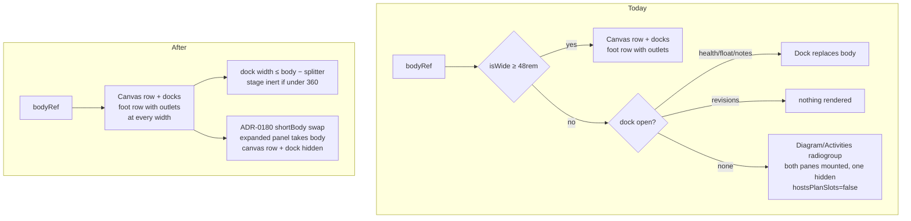
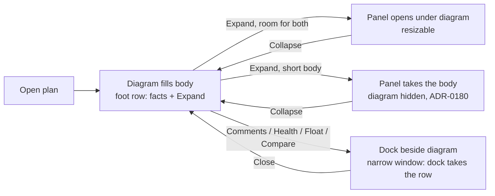

# Feature Spec: Retire the below-`md` single-pane plan workspace

- **Status:** Draft — awaiting product-owner approval (ADR-0131). Not approved; nothing is built.
  Revised 2026-10-08 after the accessibility, UX and component reviews ("agree with changes"):
  five blocking and three suggested findings folded in. The citations they added are as reviewers
  reported them, spot-checked here where marked "read".
- **Author(s):** Claude Code (feature-analyst), for James Ewbank (product owner)
- **Date:** 2026-10-08
- **Tracking issue / epic:** none yet
- **Roadmap link:** the named follow-up in
  [`docs/specs/minimum-viewport/implementation-plan.md`](../minimum-viewport/implementation-plan.md)
  "Next in line" (`:352-357`), and payoff #10 in
  [`m0-measurement.md`](../minimum-viewport/m0-measurement.md) (`:174`)
- **Related ADR(s):** ADR-0179 (D2, Consequences `:221-223`); notes ADR-0030 (`:87`, the toggle's
  origin) and ADR-0031 (`:244`, the responsive rule); touches ADR-0110 / ADR-0114 (the outlet gating
  this removes). **A short new ADR, ADR-0181, is proposed** (§4.6).
- **Depends on:** [`short-screen-vertical-budget`](../short-screen-vertical-budget/feature-spec.md)
  (ADR-0180), milestone M-A. It owns #468 and every panel-height rule: `PANEL_MIN_OPEN`, the
  `shortBody` swap and `DOCK_MIN_HEIGHT`'s docblock. **It lands first.** This spec writes no
  panel-height rule of its own.

## 0. Summary in plain English

**Who sees a difference:** only someone whose browser window is **narrower than 768 px** — in practice
a laptop or monitor zoomed to 200 % or more, or a window squeezed very small — who has pressed
**Continue anyway** on the "designed for larger screens" page. Nobody at 768 px or wider sees any
change, which includes every designed width (1024 and up), both of your displays and your Surface in
either orientation.

**What they see today:** the plan workspace swaps to a phone-era layout. A **Diagram / Activities**
switch sits above the plan and only one of the two is shown at a time. An open side panel (Comments,
Float paths, Health check) replaces the diagram completely. The plan's facts move to the bottom status
row.

**What they would see instead:** the same workspace everyone else gets, only narrower. The diagram
fills the space. The activities panel sits collapsed at the bottom, with its Expand button and the
plan's facts, as it does at 1024. Side panels open beside the diagram and squeeze it. On a very narrow
window a side panel takes the whole width. Nothing scrolls the page sideways. The diagram, the Gantt and
the table scroll inside themselves, which they already do.

**Why:**

1. **It is a phone layout, and this is no longer a phone product** (ADR-0179). Its own code comment
   says it exists "never squeezing the canvas to its minimum on a phone"
   (`plan-workspace-toolbar.tsx:666-669`).
2. **It keeps growing defects that exist nowhere else.** Two were recorded by ADR-0110 and ADR-0114.
   This spec found a third by reading the code: **Compare revisions does nothing below 768 px.** The
   narrow branch has cases for Health, Float paths and Comments but **none for the revisions panel**
   (`plan-workspace-toolbar.tsx:2509-2532`), so pressing it opens a panel that is rendered nowhere.
   This was found by reading the code, not by running it. M0 confirms it in a browser before anything
   relies on it.
3. **It is a second layout to maintain for a few zoomed users.** Every dock, outlet and strip has to be
   reasoned about twice (`activity-bottom-panel.tsx:203-226` is one docblock's worth of that cost).

**Size:** small to medium. Two milestones: a measurement and accessibility sign-off, then one pull
request. That pull request:
- deletes the branch;
- caps the docks' width;
- makes a squeezed diagram unreachable to the keyboard;
- fits the foot row at 320;
- updates the journeys and the docs.

No API, database, engine or pen change, and no feature flag.

**Short windows are handled by another spec, which lands first.** A 1280 × 720 laptop at 200 % zoom
is about 640 × 300–360.
- Today a zoomed user there gets the activities table as a whole pane.
- In the normal layout the table would share the height with the diagram and be crowded out. This
  is the open `docs/TECH_DEBT.md` #468.
- **[`docs/specs/short-screen-vertical-budget/`](../short-screen-vertical-budget/feature-spec.md)
  (ADR-0180) owns that problem.** Its option A1: when the body is too short, an expanded panel takes
  the workspace and the diagram is hidden until Collapse.
- **This spec is sequenced after it.** Once the narrow layout is gone, that swap applies at every
  width. The journeys here check that the table still shows rows under it at 640 × 300, 640 × 360 and
  640 × 480.
- There is no longer a decision for you in this spec. The trade-off was decided in that one.

## 1. Business understanding

### Problem

ADR-0179 made 1024 × 600 the designed floor. Below it, content must reflow but need not look designed
(D2). The plan workspace still carries a **second, separately designed layout** for widths under
`md` (48rem = 768 px). It was built for phones (ADR-0030 `:87`). ADR-0179 kept it only as a reflow
fallback and named its retirement as a follow-up. That follow-up waits on "accessibility agreement
that the command band counts as a toolbar kept in view under 1.4.10"
(`minimum-viewport/implementation-plan.md:355-356`).

Verified against the code on 2026-10-08:

- The layout is **one branch in one file**, chosen by `isWide = useMediaQuery(MD_QUERY, true)`
  (`MD_QUERY` at `plan-workspace-toolbar.tsx:156`, `isWide` at `:670`), with the choice made at
  `:2347`. The narrow branch is
  `:2509-2559`.
- **It has costs at the narrow widths only.** M0 of minimum-viewport recorded zero cost at 1024 and up
  (payoff #10).
- **It has a live defect** (Problem item 2 in §0): the revisions dock is unhandled in the narrow
  branch, while `toggleRevisionCompare` (`:478-485`) is wired into the toolbar context at every width
  (`:596`).

### Users

Planners, Contributors, Viewers and Org Admins who open a plan in a window under 768 px wide after
**Continue anyway**. In practice these are zoom users: 1280 at 200 % is 640, and 1366 at 200 % is
683. External Guests are **not affected**: `/share` does not mount `ToolbarPlanWorkspace` (its only
consumer is `plan-workspace.tsx:34`, reached from `routes/plan-detail.tsx`).

### Primary use cases

1. A zoomed planner reads the diagram and the plan's facts.
2. A zoomed planner opens the activities table to find and edit an activity.
3. A zoomed planner opens a side panel (Comments, Float paths, Health check, Compare revisions).

### User journeys

The narrow-shell journey (`e2e-narrow-shell/narrow-shell.spec.ts`) is the existing journey for this
band. It runs at 640 × 480, at 320 × 720 after Continue, and at 700 × 900 for the banner. It is
extended rather than replaced (§2, plan M1).

### Expected outcomes

- **One workspace layout at every width.** The `md` media query, the view switch component and the
  `hostsPlanSlots` gating are deleted.
- **Compare revisions works below 768 px.**
- The plan's facts are always in the foot row, never in the shell status row as a fallback.

### Success criteria

- A grep of `apps/web` (sources, tests, journeys and scripts) finds no `isWide`, `MD_QUERY`,
  `WorkspaceViewToggle`, `WorkspacePane`, `setPane` or `hostsPlanSlots`. Every remaining hit for
  "single-pane" or "below `md`" is in a comment that describes history or a different rule, and the
  PR lists each one.
- At 700 × 900, 640 × 844, 640 × 480, 640 × 360, 640 × 300 and 320 × 720, after Continue:
  - each of the four docks opens and is visible;
  - the foot row's **Expand activities panel** and **Recalculate** are pointer-reachable
    (`elementFromPoint`);
  - the document and the foot row do not scroll sideways;
  - axe with `target-size` is clean, including with a dock open at 320;
  - pressing Tab from inside an open dock never lands on an element whose box is zero-sized;
  - at 640 × 300, 640 × 360 and 640 × 480, with the panel expanded, the table shows at least one
    row under the short-screen swap. The number of rows is set by ADR-0180.
- At 1024 and above, the M4 sweep readings (`m4-measurement.md`) are unchanged.

### Open questions

See §6. Only two are critical.

## 2. Functional requirements

### User stories & acceptance criteria

**US-1 — One layout.** As a zoomed planner, I get the same workspace as at 1024, narrower.

- AC-1.1: Below 768 px the workspace renders the canvas row, then the activities foot row (collapsed by
  default, with **Expand activities panel**). There is no **Workspace view** radiogroup.
- AC-1.2: The plan's facts (`[data-schedule-state]`) render once, in the foot row, at every width.
  `dock.spec.ts:240-245` keeps asserting visible and count 1 at 700 × 900.
- AC-1.3: The armed-tool statement, the selection bars and the edit-conflict banner dock into the foot
  row's outlet at every width. No in-place fallback is needed in the workspace.

**US-2 — Side panels open beside the diagram, never off-screen.**

- AC-2.1: Each of Comments, Float paths, Health check and **Compare revisions** opens beside the
  diagram.
- AC-2.2 — **a dock is never wider than the body.** Today the clamp is `max(MIN, bodyWidth − 360)`
  (`:715-718`, `:736-739`, `:755-758`, `:775-778`), which has no upper bound against the body. At
  320 px the revisions dock's 380 minimum (`use-revision-compare-panel-prefs.ts:26`) would overflow
  and be clipped by the body's `overflow-hidden` (`:2346`).
  - **One cap, computed in the toolbar**, feeds three places:
    - the rendered width;
    - `PanelResizer`'s `max` (`:2382`, `:2414`, `:2438`, `:2462`);
    - every `on*Resize` handler (`:727`, `:747`, `:766`, `:786`).
  - The cap is `bodyWidth − SPLITTER_WIDTH` (`panel-resizer.tsx:14`, read: `1`).
  - When the cap is below a dock's minimum, the `min` passed to the resizer is lowered to the cap, so
    `aria-valuemin ≤ aria-valuemax`. If they meet, the resizer is not rendered.
  - **The cap cannot live in `useResizablePanelPrefs`.** That hook clamps the value it reads back to
    at least `min` (`use-resizable-panel-prefs.ts:129`, read), so a ceiling there could never go
    below the minimum.
  - `bodyWidth === 0` means **not yet measured**, not "zero wide". jsdom has no `ResizeObserver`
    (`:692`), and the first render precedes the first observation (`:689`). An unmeasured body
    applies no cap.
  - **The visual bound is plain CSS**: `max-w-full` on `PanelSurface`. It holds on the first paint,
    before the observer reports. The JS cap carries the ARIA and resize bounds.
  - **This is a render clamp only.** The stored width is never overwritten, so a width saved at 1440
    is still there at 1440 after a visit at 640. This is the same rule the hook's own docblock states
    for its read-back (`:122-125`).
  - The resizer handle stays at least 24 px and stays keyboard-resizable at 320 (WCAG 2.5.8 and
    2.1.1).
- AC-2.3 — **dock content reflows.** A dock's content reflows at whatever width it is given, down to
  `320 − SPLITTER_WIDTH`, with no sideways scroll inside the dock.
  - The reflow comes from container queries or stacking utilities, never a media query.
  - **Revisions:** the pickers already stack below a container `@sm`
    (`RevisionComparePanel.tsx:361`, read: `grid gap-3 @sm:grid-cols-2`). M0 confirms it renders.
  - **Health check and Float paths:** checked the same way at about 300 px.
- AC-2.4 — **a squeezed diagram is taken out of reach** (reviewers' blocking finding 2).
  - **Width.** When an open dock would leave the stage narrower than `CANVAS_MIN_WIDTH` (360,
    `use-notes-panel-prefs.ts:24`), the dock takes the whole row and the stage column is `inert`.
    `inert` removes it from the tab order and the accessibility tree; `display: none` is not used,
    so the canvas keeps its viewport.
  - **Why 360 and not a new number:** it is the floor the dock clamps already reserve for the
    diagram, with its reason already in that constant's docblock. Below it the stage is
    reachable but not usable, which is the failure being fixed. A second, smaller floor would be a
    second constant to keep in step.
  - **Height.** This covers the **collapsed** panel only. When the panel is expanded and the body is
    short, the short-screen swap already hides the canvas row; this spec adds nothing there.
    - When the canvas row is squeezed below the height of the time ruler band, it is `inert` in the
      same way, because at that height no bar can be shown and nothing in it is usable.
    - M0 measures the ruler band's height. It becomes a constant whose docblock cites that reading
      (ADR-0151).
  - **Reconciled with short-screen A1.** The two rules act on different axes, both inside the canvas
    row (`plan-workspace-toolbar.tsx:2361-2481`), and they compose:
    - this rule (width) decides **within** the row whether the dock takes it;
    - A1 (height, panel expanded) hides **the whole row**, the dock included. Collapsing restores the
      row as it was: the dock still takes it if the window is still narrow.
    - This replaces the "opening one collapses the other" rule in the first revision of this spec.
      A1's own edge case already covers a dock that is open while the screen is short
      (short-screen spec §2, "Edge cases").
  - Closing the dock, or regaining the height, removes `inert` and leaves focus where the
    focus-return rule for that dock already sends it.
- AC-2.5 — **keyboard at 320.** For each dock at 320:
  - Tab order runs through the dock's controls;
  - Escape and Close behave as at 1024;
  - Close returns focus to the control that opened the dock;
  - Expand and Collapse keep focus on the toggle (`focusExpandOnMount` / `focusCollapseOnMount`).

**US-3 — The activities table stays usable.**

- AC-3.1: **Expand** opens the panel. Its rows scroll in its own region, as
  `activities-panel-scroll.spec.ts:271-306` asserts today via the radio.
- AC-3.2 — **short heights follow ADR-0180, at every width.** This spec adds **no panel-height rule**.
  - The short-screen spec owns them all: `PANEL_MIN_OPEN`, the `shortBody` swap (option A1) and the
    `DOCK_MIN_HEIGHT` docblock. Under A1, an expanded panel on a short body takes the workspace, and
    the diagram row (an open dock included) is hidden while still mounted, until Collapse.
  - Today that rule lives only in the wide branch. The short-screen spec's edge case says "Below
    `md` (single-pane): unchanged". **Retirement makes the wide branch unconditional, so A1 then
    applies at every width.** No code is needed for that here; journeys check it (success criteria).
  - **Collapsed panel** (the one height rule here, and it is about the foot row, not the panel):
    - the foot row is `shrink-0` and must never be clipped;
    - if the window cannot hold the chrome plus the foot row, `<main>` (`app-shell.tsx:213`,
      `overflow-auto`) scrolls **vertically**, which 1.4.10 permits, rather than clipping Expand and
      Recalculate. M0 reads whether this already holds at 640 × 300. If it does not, the remedy is a
      minimum height on the workspace body equal to the foot row. That is agreed with the
      short-screen spec before M1, because it touches the same body.
  - **Withdrawn from the first revision:** the yielding diagram minimum (`CANVAS_YIELD_MIN` = 160),
    the dock/panel mutual exclusion and the claim that `TsldPanel.tsx:3279`'s `min-h-[240px]` pushes
    the panel.
    - The short-screen spec measured the 160 px yield at 0 rows.
    - The `min-h-[240px]` class is clipped inside an `overflow-hidden`, `min-h-0` row; it does not
      push.
    - Neither `TsldPanel.tsx` minimum is changed here.
- AC-3.3 — **the foot row fits at 320.**
  - **The problem.** The plan's facts are `shrink-0` (`plan-facts.tsx:107`, `:140`), about 465 px of
    text (`:123-124`), and `whitespace-nowrap` (`:253`). The foot row is a non-wrapping
    `flex min-h-9` (`activity-bottom-panel.tsx:472`) inside an `overflow-hidden` body (`:2346`). At 320
    the row would push Expand off its trailing edge, where it is clipped.
  - **The rule** (ADR-0110's give-way order):
    - Expand and Recalculate keep `shrink-0` and stay on screen.
    - The facts give way: they wrap onto a second line of the foot row below a container width. They
      **relocate; they never disappear**.
  - The Expand control keeps its tooltip and the accessible name **"Expand activities panel"**
    verbatim (ADR-0117).
- AC-3.4 — **`DataTable`'s contained floor applies at every width.**
  - `data-table.tsx:604-608` (read) gives `contained` regions `md:min-h-32` only. The comment says
    this is because "the single-pane narrow layout gives the whole panel body ~89px at 390". That
    cause is gone, so the `md:` prefix goes, and the region keeps its three-row floor below 768 too.
  - **How it meets ADR-0180's rules:** the short-screen spec re-derives `PANEL_MIN_OPEN` (about
    185) as the panel's fixed parts plus rows, and A1 hands the panel the whole body when that is not
    available. The 128 px floor sits inside either. It decides only whether the panel body or the
    table region scrolls; it never competes with the diagram. The short-screen spec's
    `PANEL_USEFUL_MIN` cites `data-table.tsx:600` for "about three rows", which is this same floor, so
    the two agree.
  - M0 verifies this at 640 × 844 and 640 × 360, and a journey asserts the region is at least 128 px
    when the panel is open.

### Workflows

There is no new workflow. The Diagram/Activities switch is replaced by the existing Expand/Collapse
control and the panel's resizer, which have a keyboard path (`PanelResizer`).

### Edge cases

| Case                                                       | Behaviour                                                                                                                                                     |
| ---------------------------------------------------------- | ------------------------------------------------------------------------------------------------------------------------------------------------------------- |
| Crossing 768 with a dock open                              | **No re-layout at all.** Today the dock jumps from beside the diagram to replacing it.                                                                        |
| Crossing 768 on the Activities pane                        | No longer possible. Today the table pane disappears on widening (`pane` state is lost into a collapsed panel).                                                |
| Gantt view below 768                                       | Unchanged: the Gantt is `surface`. It gains the foot-row outlet, which gantt-editing's spec (`feature-spec.md:510`) recorded as missing below `md`.           |
| 320 × 256 (the reflow floor's horizontal-content height)   | The wrapped command band takes most of the height **in both layouts**. That is pre-existing and not caused or fixed here (§3, WCAG). The ADR records it.      |
| 640 × 300–360 (1280 × 720 at 200 %)                         | Collapsed: the canvas row is `inert` if squeezed below the ruler band (AC-2.4); Expand and Recalculate stay reachable. Expanded: ADR-0180's A1 swap. |
| A dock width saved at 1440, rendered at 640                 | The cap applies at render only. Back at 1440 the saved width returns unchanged (AC-2.2).                                                                       |
| Narrow window, dock open, panel expanded on a short body    | A1 hides the whole canvas row, the dock included. Collapse brings it back, and the dock still takes the row if the window is still narrow (AC-2.4).            |
| #466 (row `⋯` under a bar at 320)                          | The bar it is under is part of the narrow pane. M0 re-reads it in the new layout; it may close, or move.                                                      |
| Notes reveal (`plan-workspace-toolbar.tsx:247`)            | Its guard stays. The section is mounted in both layouts already.                                                                                              |

### Permissions

No change. The workspace's existing RBAC, org scoping and pen gating (ADR-0028) apply as before.
**Nothing here is a structural write**, because no write path changes.

### Validation rules

None. No input is added.

### Error scenarios

None new. A dock whose content fails to load keeps its existing error state, now beside the diagram.

## 3. Technical analysis

**Every site of the single-pane mode** (read 2026-10-08):

| Site                                               | What it is                                                                                                       |
| -------------------------------------------------- | ---------------------------------------------------------------------------------------------------------------- |
| `plan-workspace-toolbar.tsx:155-156`               | `MD_QUERY = '(min-width: 48rem)'` and its docblock                                                               |
| `plan-workspace-toolbar.tsx:666-671`               | `isWide`, `pane` state, and the "on a phone" comment                                                             |
| `plan-workspace-toolbar.tsx:2347`                  | The branch                                                                                                       |
| `plan-workspace-toolbar.tsx:2509-2531`             | Narrow: Health / Float paths / Notes each take the whole body (**no revisions case**)                            |
| `plan-workspace-toolbar.tsx:2532-2558`             | Narrow: the view switch, the `hidden`-toggled diagram pane, the activities pane with `hostsPlanSlots={false}`    |
| `plan-workspace-toolbar.tsx:37`, `:247`, `:1084-1085`, `:1715`, `:2364` | Import and comments referring to the narrow pane                                         |
| `workspace-view-toggle.tsx` (whole file)            | The `radiogroup` (`SegmentedControl`, label "Workspace view")                                                    |
| `activity-bottom-panel.tsx:199`, `:203-229`, `:416-426`, `:494-495`, `:511-524` | `hostsPlanSlots` on three components; `onCollapse` "omitted on the mobile single-pane view" |
| `data-table.tsx:604-608`                           | `md:min-h-32` exists **only** because of the single pane, so the prefix is dropped (AC-3.4). This corrects payoff #14's "a reflow fallback that stays" |
| Comments, docblocks and copies elsewhere, as reviewers reported them | `plan-status-bar.tsx:11`, `:34-38`; `plan-facts.tsx:19`; `TsldLegendPanel.tsx:32`; `TsldCanvas.tsx:1777`, `:2019` (the code and `TsldCanvas.hidden-pane.test.tsx:9` stay because a hidden canvas is still possible — reworded only); `activity-bottom-panel.tsx:227-228` (`onCollapse` stays optional — reworded), `:360`, `:474-493`; `segmented-control.tsx:28` (the docblock example) |

**Tests that depend on it:**

| Test                                                         | Dependency                                                             | Change                                                                       |
| ------------------------------------------------------------ | ---------------------------------------------------------------------- | ---------------------------------------------------------------------------- |
| `e2e-narrow-shell/narrow-shell.spec.ts:196-215` (FR-4)       | Facts in the "shell fallback" below `md`                               | Assertion holds (facts visible); comment rewritten. Facts are now in the foot row |
| `e2e-narrow-shell/narrow-shell.spec.ts:406`                  | `getByRole('radio', { name: 'Activities' })`                           | Replace with **Expand activities panel**                                     |
| `e2e-workspace-chrome/activities-panel-scroll.spec.ts:271-306` | Radio, and "no separate expand/collapse below `md`" (`:285-286`)      | Replace with Expand; re-title the test                                       |
| `e2e-workspace-chrome/dock.spec.ts:223-245`                  | Docblock about the hidden pane; assertion at 700 × 900                 | Assertion stays; docblock rewritten                                          |
| `canvas-dock.test.tsx:127-156`                               | `hostsPlanSlots={false}` renders no outlet                             | **Deleted**. It is vacuous without the prop, and the fallback-in-place path is already covered at `:22-35` and `:95-124` |
| `activity-bottom-panel.test.tsx:13-21`, `:48-58`             | Gating both outlets on `hostsPlanSlots`                                | **Rewritten**, not deleted: "renders BOTH outlets, always", with the docblock to match |
| `plan-workspace-toolbar.test.tsx:395-399`                    | Finds the foot row loosely                                             | Tightened to `[data-activities-bar]`                                         |
| `plan-facts-host.test.tsx:14`, `plan-notes-reveal.test.tsx:10`, `TsldCanvas.hidden-pane.test.tsx:9` | Docblocks citing the narrow pane            | Reworded                                                                     |
| `e2e-workspace-fit/command-surface.spec.ts:836`              | A comment citing `hostsPlanSlots`                                      | Reworded                                                                     |
| `scripts/measure-activities-panel.mjs:693`                   | Limb N1 measures the hidden-pane mount                                 | The limb is retired or re-described, and the change says which                |
| `measure-toolbar/m0-bands.spec.ts:46-52`, `:162-163`         | Measurement harness probing below the single-pane breakpoint           | Comment only; harness, not a gate                                            |
| `playwright.float-paths.config.ts:42`, `e2e-toolbar/toolbar.spec.ts:23` | Comments saying the narrow toggle is covered elsewhere      | Comment only                                                                 |

`e2e-share/share.spec.ts:165` (320 px guest) does not mount this workspace, and no unit test stubs
`matchMedia` narrow for the workspace (grep of `*.test.tsx`, 2026-10-08).

**Areas:**

- **Frontend:** one file loses a branch. Three components lose a prop. One component is deleted. The
  four dock clamps gain an upper bound.
- **Backend / API / DB / engine:** none. The recalc parity gate is untouched, because no scheduling
  input changes.
- **Security:** none.
- **Performance:** the narrow layout mounted **both** panes, including the hidden table
  (`scripts/measure-activities-panel.mjs:693` measured that cost as "N1"). The wide layout mounts the
  panel only when expanded (`:2485-2507`), so narrow opening gets cheaper. This is not measured, so it
  is not claimed as a benefit.
- **Accessibility:** below.

### WCAG 1.4.10: what it actually requires here

The source is the W3C Understanding document for 1.4.10 (WCAG 2.2),
<https://www.w3.org/WAI/WCAG22/Understanding/reflow.html>. It was fetched on 2026-10-08 through a
summarising fetch tool, so **the quotations below are as that tool returned them, not checked
character for character** against the page. The accessibility reviewer confirms them against the page
in M0-T3.

- **The SC:** content can be presented without loss of information or functionality, and without
  scrolling in two dimensions, at 320 CSS px wide (or 256 tall for horizontally scrolling content),
  "except for parts of the content which require two-dimensional layout for usage or meaning".
- **Note 2 names** "interfaces where it is necessary to keep toolbars in view while manipulating
  content" among such parts. The Understanding text adds that such interfaces "need to show both the
  content and the toolbar in the viewport".
- **The exception is section-scoped:** "if a section of content meets the exception … the exception
  only applies to that section". It does not extend to neighbouring content.

What follows, stated plainly:

1. **1.4.10 never required the single-pane switch.** That was a phone design choice (ADR-0030). Nothing
   in the SC asks for one pane at a time.
2. **The diagram, the Gantt and the activities table are two-dimensional sections.** They may scroll
   both ways inside themselves (ADR-0179 D2). They already do, in both layouts.
3. **The command band is not itself two-dimensional content.** It can lean on Note 2 only as the
   toolbar of the diagram's editing interface, and that reading permits it to be **kept in view**. It
   does not excuse a band control that cannot be reached. **This epic does not touch the band.** It
   sits above the branch and wraps (ADR-0109) in both layouts, so every band control stays reachable
   without sideways scroll either way. The prerequisite as worded in the minimum-viewport plan is
   therefore **broader than this change needs**, and is restated for the reviewer (Q2).
4. **The docks (Comments, Health, Float paths, Revisions) are text and lists, not 2D content.** They
   must reflow inside whatever width they get, with no sideways scroll and no clipping. AC-2.2 and
   AC-2.3 are where this epic carries real 1.4.10 risk. The revisions dock has never been checked
   below 768.
5. **The foot row is not 2D content either.** It is a chrome row, so at 320 it must reflow
   (AC-3.3) rather than clip Expand.
6. **A squeezed region that is still focusable is a failure of its own** (WCAG 2.4.7 and 2.4.11: focus
   on an element nobody can see). AC-2.4 makes it `inert`.
7. **Height.** For vertically scrolling content, 1.4.10 sets no height. But "show both the content
   and the toolbar in the viewport" is not met at very short zoomed heights. At 320 × 256 the wrapped
   band leaves the diagram almost nothing (narrow-shell.spec.ts `:399-402` already works around this).
   **That is true today in the single-pane layout and stays true.** This epic neither causes nor fixes
   it. The ADR records it as pre-existing so it is not read as fixed.
   - What this epic could make worse is the table, which today gets the whole pane.
   - ADR-0180's A1 swap prevents that, because it applies at every width once the branch is gone
     (AC-3.2). This spec's journeys check it.
   - 640 × 300–360 (1280 × 720 at 200 %) is in the matrix for that reason.

**The honest summary for the accessibility reviewer:** retirement is conformant at 320 px wide if, and
only if, AC-2.2 to AC-2.5 and AC-3.1 to AC-3.4 hold and the band keeps wrapping. No new exemption is claimed
beyond D2's. The band-as-toolbar reading is needed **only** to say that the existing short-height
crowding is a 2D editing interface keeping its toolbar in view, and that reading is the same before and
after.

### Dependencies

- minimum-viewport M4 has landed (`m4-measurement.md`). This was the follow-up's trigger, so the
  trigger is met.
- **short-screen-vertical-budget M-A (ADR-0180) has landed.** It owns #468 and every panel-height
  rule, and this spec builds on its `shortBody` swap.
- The accessibility reviewer re-checks the built surface (Q2) before M1 merges.

## 4. Solution design

### 4.1 Architecture overview

### 4.2 Data flow

None changes. `PlanStatusBar` portals into `PlanFactsOutlet`, which is now always registered in the
foot row. `CanvasDock` portals into `CanvasDockOutlet` likewise.

### 4.3 User flow (640 px, after Continue)

### 4.4 Database / API changes

None.

### 4.5 Component changes

- `plan-workspace-toolbar.tsx`:
  - delete `MD_QUERY`, `isWide`, `pane`, and the narrow branch, so the wide branch is unconditional;
  - add one pure helper returning `{ width, cap, min }` for a dock, for the rendered width, the
    resizer bounds and the resize handler (AC-2.2);
  - add `inert` on the stage column and the collapsed-state canvas row under AC-2.4;
  - keep ADR-0180's `shortBody` swap, which is unconditional once the branch is gone. Its
    mounted-hidden mechanism survives the deletion of the narrow branch's comment at `:666-669`, and
    the comment is moved, not lost;
  - drop the `useMediaQuery` import if it becomes unused.
- `PanelSurface` uses: `max-w-full`.
- `TsldPanel.tsx`: **no change.** The `min-h-[240px]` at `:3279` is clipped, not pushing, and
  `TsldCanvas.hidden-pane.test.tsx` stays because A1 still hides a mounted canvas.
- `plan-facts.tsx` and the foot row: wrap the facts under AC-3.3.
- `data-table.tsx:608`: `md:min-h-32` becomes `min-h-32`.
- `workspace-view-toggle.tsx`: deleted. `SegmentedControl` stays (it is a primitive and its docblock
  example is updated).
- `activity-bottom-panel.tsx`: remove `hostsPlanSlots` from `ActivityBottomPanel`,
  `PlanActivitiesFootRow` and `ActivityPanelCollapsedBar`. The outlets render unconditionally.
  **This changes a component's public contract** (ADR-0105).
- `onCollapse` stays optional for its other callers. Its docblock loses the mobile reason.

### 4.6 Approach & alternatives

**Recommended:** after ADR-0180 lands, delete the branch, cap the docks, make squeezed regions
`inert`, and fit the foot row. Record it in a **short ADR, ADR-0181**:

- "The plan workspace has one layout at every width";
- it supersedes ADR-0030's and ADR-0031's responsive single-pane rule;
- it records the 1.4.10 reading in §3;
- **short heights are ADR-0180's**: its A1 swap applies at every width from here on, and this ADR
  adds no height rule beyond keeping the foot row unclipped;
- crowding by the command band at short heights is **pre-existing** and not fixed here;
- falling back to rendering in place stays `CanvasDock`'s contract for any host without an outlet
  (`TsldPanel.tsx:2990`), but **no production workspace path exercises it any more**.

That reading is decision-bearing and would otherwise live only in a spec.

**Alternatives:**

- **Keep the branch and fix the revisions case.** This is the cheapest fix for the defect. It keeps
  the layout ADR-0179 named for retirement, and the next dock will repeat the omission. Rejected unless
  the a11y review refuses.
- **Keep a below-`md` rule that docks always take the whole body.** This is a smaller version of
  today's narrow branch. AC-2.2's clamp gives the same result on the narrowest windows without a media
  query. Rejected.
- **A feature flag.** Rejected per ADR-0088 D1. The rollback is the commit boundary.

## 5. Links

- ADR-0179; `docs/specs/minimum-viewport/` (spec, plan `:352-357`, `m0-measurement.md:174`,
  `m4-measurement.md:75-80`)
- `docs/TECH_DEBT.md` #466 (`:11898`), #468 (`:11916`)
- `docs/UX_STANDARDS.md:340-343` (the sentence about the single-pane layout is deleted)
- `docs/UX_STANDARDS.md:374-379` (the "a fact relocates" bullet is **rewritten, not deleted**: it
  now relocates to a second line of the foot row)
- `docs/UX_STANDARDS.md`, "Two hosts, one mechanism" (gains a closing note)
- `docs/TECH_DEBT.md:5590` and `:5657-5662` (gain closing notes)
- **`docs/specs/gantt-coarse-pointer/device-checklist.md` does not change.** Its steps run on the
  Surface at 1912 wide, and its rule (`:15-19`) asks for an update only when a change alters what a
  step tests (Gantt touch, stylus, menus, targets, `/pointer-check.html`). This epic alters nothing at
  768 px or wider.

## 6. Open questions

**Critical:** none remain in this spec.

- **Q1 — Short heights.** **Withdrawn.** Moved to the short-screen spec (ADR-0180), which owns #468
  and decided it as option A1. This spec is sequenced after it.
- **Q2 — The accessibility sign-off.** **No longer critical.**
  - All three reviewers have agreed, with the changes now folded in, and the accessibility reviewer
    accepted the narrower framing (§3).
  - What remains is procedural: the reviewer re-checks the built surface and confirms the W3C
    quotations in M0-T3. Both are recorded in the ADR.

**Defaults (proceeding unless told otherwise):**

- No feature flag (ADR-0088 D1).
- A `@repo/web` **minor** changeset, because a control is removed below 768.
- `ActivitiesTable`'s column hiding below `md`/`lg` (payoff #13), `ActivityEditorSession`'s rail swap
  (#12) and the Explorer sheet below `lg` all stay. They are reflow rules, not this layout.
- #466 is re-read in M0. It is closed if the bar it hides under no longer exists, and re-scoped if
  not.
