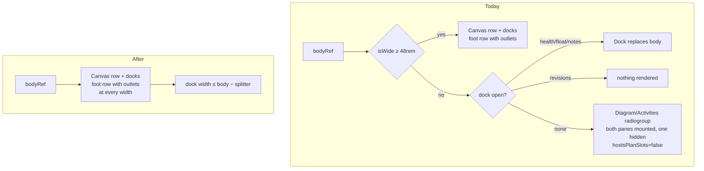
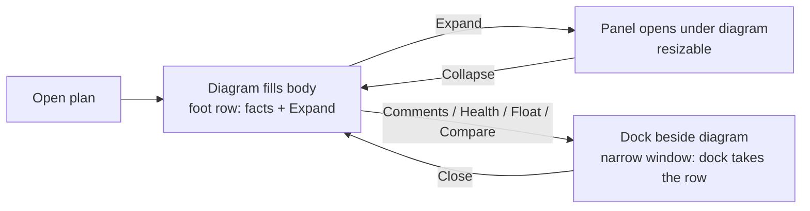

# Feature Spec: Retire the below-`md` single-pane plan workspace

- **Status:** Draft — awaiting product-owner approval (ADR-0131). Not approved; nothing is built.
- **Author(s):** Claude Code (feature-analyst), for James Ewbank (product owner)
- **Date:** 2026-10-08
- **Tracking issue / epic:** none yet
- **Roadmap link:** the named follow-up in
  [`docs/specs/minimum-viewport/implementation-plan.md`](../minimum-viewport/implementation-plan.md)
  "Next in line" (`:352-357`), and payoff #10 in
  [`m0-measurement.md`](../minimum-viewport/m0-measurement.md) (`:174`)
- **Related ADR(s):** ADR-0179 (D2, Consequences `:221-223`); notes ADR-0030 (`:87`, the toggle's
  origin) and ADR-0031 (`:244`, the responsive rule); touches ADR-0110 / ADR-0114 (the outlet gating
  this removes). **A short new ADR is proposed** (§4.6).

## 0. Summary in plain English

**Who sees a difference:** only someone whose browser window is **narrower than 768 px** — in practice
a laptop or monitor zoomed to 200 % or more, or a window squeezed very small — who has pressed
**Continue anyway** on the "designed for larger screens" page. Nobody at 768 px or wider sees any
change, which includes every designed width (1024 and up), both of your displays and your Surface in
either orientation.

**What they see today:** the plan workspace swaps to a phone-era layout. A **Diagram / Activities**
switch sits above the plan and only one of the two is shown at a time. An open side panel (Comments,
Float paths, Health check) replaces the diagram completely. The plan's facts move to the bottom status
row.

**What they would see instead:** the same workspace everyone else gets, only narrower. The diagram
fills the space. The activities panel sits collapsed at the bottom, with its Expand button and the
plan's facts, as it does at 1024. Side panels open beside the diagram and squeeze it. On a very narrow
window a side panel takes the whole width. Nothing scrolls the page sideways. The diagram, the Gantt and
the table scroll inside themselves, which they already do.

**Why:**

1. **It is a phone layout, and this is no longer a phone product** (ADR-0179). Its own code comment
   says it exists "never squeezing the canvas to its minimum on a phone"
   (`plan-workspace-toolbar.tsx:666-669`).
2. **It keeps growing defects that exist nowhere else.** Two were recorded by ADR-0110 and ADR-0114.
   This spec found a third by reading the code: **Compare revisions does nothing below 768 px.** The
   narrow branch has cases for Health, Float paths and Comments but **none for the revisions panel**
   (`plan-workspace-toolbar.tsx:2509-2532`), so pressing it opens a panel that is rendered nowhere.
   This was found by reading the code, not by running it. M0 confirms it in a browser before anything
   relies on it.
3. **It is a second layout to maintain for a few zoomed users.** Every dock, outlet and strip has to be
   reasoned about twice (`activity-bottom-panel.tsx:203-226` is one docblock's worth of that cost).

**Size:** small to medium. Two milestones: a measurement and accessibility sign-off, then one pull
request that deletes the branch, fixes the dock clamp, rewrites three journey assertions and updates
the docs. No API, database, engine or pen change, and no feature flag.

**The one thing that needs your decision:** below about 660 px of height, the activities table
currently gets the whole pane in this layout. In the normal layout it shares the height with the
diagram, and the diagram's 240 px minimum crowds it out. This is the same arithmetic as the open
`docs/TECH_DEBT.md` #468 at 1024 × 600. Retiring the layout spreads that problem to every narrow zoomed
window. **Recommendation: fold #468's fix into this epic** (Q1).

## 1. Business understanding

### Problem

ADR-0179 made 1024 × 600 the designed floor. Below it, content must reflow but need not look designed
(D2). The plan workspace still carries a **second, separately designed layout** for widths under
`md` (48rem = 768 px). It was built for phones (ADR-0030 `:87`). ADR-0179 kept it only as a reflow
fallback and named its retirement as a follow-up. That follow-up waits on "accessibility agreement
that the command band counts as a toolbar kept in view under 1.4.10"
(`minimum-viewport/implementation-plan.md:355-356`).

Verified against the code on 2026-10-08:

- The layout is **one branch in one file**, chosen by `isWide = useMediaQuery(MD_QUERY, true)`
  (`plan-workspace-toolbar.tsx:156`, `:670`), with the choice made at `:2347`. The narrow branch is
  `:2509-2559`.
- **It has costs at the narrow widths only.** M0 of minimum-viewport recorded zero cost at 1024 and up
  (payoff #10).
- **It has a live defect** (Problem item 2 in §0): the revisions dock is unhandled in the narrow
  branch, while `toggleRevisionCompare` (`:478-485`) is wired into the toolbar context at every width
  (`:596`).

### Users

Planners, Contributors, Viewers and Org Admins who open a plan in a window under 768 px wide after
**Continue anyway**. In practice these are zoom users: 1280 at 200 % is 640, and 1366 at 200 % is
683. External Guests are **not affected**: `/share` does not mount `ToolbarPlanWorkspace` (its only
consumer is `plan-workspace.tsx:34`, reached from `routes/plan-detail.tsx`).

### Primary use cases

1. A zoomed planner reads the diagram and the plan's facts.
2. A zoomed planner opens the activities table to find and edit an activity.
3. A zoomed planner opens a side panel (Comments, Float paths, Health check, Compare revisions).

### User journeys

The narrow-shell journey (`e2e-narrow-shell/narrow-shell.spec.ts`) is the existing journey for this
band. It runs at 640 × 480, at 320 × 720 after Continue, and at 700 × 900 for the banner. It is
extended rather than replaced (§2, plan M1).

### Expected outcomes

- **One workspace layout at every width.** The `md` media query, the view switch component and the
  `hostsPlanSlots` gating are deleted.
- **Compare revisions works below 768 px.**
- The plan's facts are always in the foot row, never in the shell status row as a fallback.

### Success criteria

- `isWide`, `MD_QUERY` and `WorkspaceViewToggle` have no references in `apps/web/src`.
- At 700 × 900, 640 × 844 and 320 × 720, after Continue:
  - each of the four docks opens and is visible;
  - the Expand activities control is pointer-reachable (`elementFromPoint`);
  - the document does not scroll sideways;
  - axe with `target-size` is clean.
- At 1024 and above, the M4 sweep readings (`m4-measurement.md`) are unchanged.

### Open questions

See §6. Only two are critical.

## 2. Functional requirements

### User stories & acceptance criteria

**US-1 — One layout.** As a zoomed planner, I get the same workspace as at 1024, narrower.

- AC-1.1: Below 768 px the workspace renders the canvas row, then the activities foot row (collapsed by
  default, with **Expand activities panel**). There is no **Workspace view** radiogroup.
- AC-1.2: The plan's facts (`[data-schedule-state]`) render once, in the foot row, at every width.
  `dock.spec.ts:240-245` keeps asserting visible and count 1 at 700 × 900.
- AC-1.3: The armed-tool statement, the selection bars and the edit-conflict banner dock into the foot
  row's outlet at every width. No in-place fallback is needed in the workspace.

**US-2 — Side panels open beside the diagram, never off-screen.**

- AC-2.1: Each of Comments, Float paths, Health check and **Compare revisions** opens beside the
  diagram.
- AC-2.2: A dock's rendered width is never more than the body's width minus the splitter. This is
  **new**: today the clamp is `max(MIN, bodyWidth − 360)` (`:715-718`, `:736-739`, `:755-758`,
  `:775-778`), which has no upper bound against the body. At 320 px the revisions dock's 380 minimum
  (`use-revision-compare-panel-prefs.ts:26`) would overflow and be clipped by the body's
  `overflow-hidden` (`:2346`).
- AC-2.3: A dock's content reflows at whatever width it is given, down to 320 − splitter, with no
  sideways scroll inside the dock. Today this is shown only for the three docks the narrow branch
  renders full-width. **Compare revisions has never been rendered below 768**, so its picker row is
  unverified there.

**US-3 — The activities table stays usable.**

- AC-3.1: **Expand** opens the panel. Its rows scroll in its own region, as
  `activities-panel-scroll.spec.ts:271-306` asserts today via the radio.
- AC-3.2 (subject to Q1): when the body is shorter than `CANVAS_MIN_HEIGHT + PANEL_MIN_OPEN` (240 +
  140, `use-activity-panel-prefs.ts:18`, `:23`), the diagram's minimum yields. An expanded panel shows
  rows rather than only its headings. #468 at 1024 × 600 is the same fix.

### Workflows

There is no new workflow. The Diagram/Activities switch is replaced by the existing Expand/Collapse
control and the panel's resizer, which have a keyboard path (`PanelResizer`).

### Edge cases

| Case                                                       | Behaviour                                                                                                                                                     |
| ---------------------------------------------------------- | ------------------------------------------------------------------------------------------------------------------------------------------------------------- |
| Crossing 768 with a dock open                              | **No re-layout at all.** Today the dock jumps from beside the diagram to replacing it.                                                                        |
| Crossing 768 on the Activities pane                        | No longer possible. Today the table pane disappears on widening (`pane` state is lost into a collapsed panel).                                                |
| Gantt view below 768                                       | Unchanged: the Gantt is `surface`. It gains the foot-row outlet, which gantt-editing's spec (`feature-spec.md:510`) recorded as missing below `md`.           |
| 320 × 256 (the reflow floor's horizontal-content height)   | The wrapped command band takes most of the height **in both layouts**. That is pre-existing and not caused or fixed here (§3, WCAG).                          |
| #466 (row `⋯` under a bar at 320)                          | The bar it is under is part of the narrow pane. M0 re-reads it in the new layout; it may close, or move.                                                      |
| Notes reveal (`plan-workspace-toolbar.tsx:247`)            | Its guard stays. The section is mounted in both layouts already.                                                                                              |

### Permissions

No change. The workspace's existing RBAC, org scoping and pen gating (ADR-0028) apply as before.
**Nothing here is a structural write**, because no write path changes.

### Validation rules

None. No input is added.

### Error scenarios

None new. A dock whose content fails to load keeps its existing error state, now beside the diagram.

## 3. Technical analysis

**Every site of the single-pane mode** (read 2026-10-08):

| Site                                               | What it is                                                                                                       |
| -------------------------------------------------- | ---------------------------------------------------------------------------------------------------------------- |
| `plan-workspace-toolbar.tsx:155-156`               | `MD_QUERY = '(min-width: 48rem)'` and its docblock                                                               |
| `plan-workspace-toolbar.tsx:666-671`               | `isWide`, `pane` state, and the "on a phone" comment                                                             |
| `plan-workspace-toolbar.tsx:2347`                  | The branch                                                                                                       |
| `plan-workspace-toolbar.tsx:2509-2531`             | Narrow: Health / Float paths / Notes each take the whole body (**no revisions case**)                            |
| `plan-workspace-toolbar.tsx:2532-2558`             | Narrow: the view switch, the `hidden`-toggled diagram pane, the activities pane with `hostsPlanSlots={false}`    |
| `plan-workspace-toolbar.tsx:37`, `:247`, `:1084-1085`, `:1715`, `:2364` | Import and comments referring to the narrow pane                                         |
| `workspace-view-toggle.tsx` (whole file)            | The `radiogroup` (`SegmentedControl`, label "Workspace view")                                                    |
| `activity-bottom-panel.tsx:199`, `:203-229`, `:416-426`, `:494-495`, `:511-524` | `hostsPlanSlots` on three components; `onCollapse` "omitted on the mobile single-pane view" |
| `data-table.tsx:604-606`                           | `md:min-h-32` rationale cites the single pane (the rule stays — payoff #14; only the comment changes)            |

**Tests that depend on it:**

| Test                                                         | Dependency                                                             | Change                                                                       |
| ------------------------------------------------------------ | ---------------------------------------------------------------------- | ---------------------------------------------------------------------------- |
| `e2e-narrow-shell/narrow-shell.spec.ts:196-215` (FR-4)       | Facts in the "shell fallback" below `md`                               | Assertion holds (facts visible); comment rewritten. Facts are now in the foot row |
| `e2e-narrow-shell/narrow-shell.spec.ts:406`                  | `getByRole('radio', { name: 'Activities' })`                           | Replace with **Expand activities panel**                                     |
| `e2e-workspace-chrome/activities-panel-scroll.spec.ts:271-306` | Radio, and "no separate expand/collapse below `md`" (`:285-286`)      | Replace with Expand; re-title the test                                       |
| `e2e-workspace-chrome/dock.spec.ts:223-245`                  | Docblock about the hidden pane; assertion at 700 × 900                 | Assertion stays; docblock rewritten                                          |
| `canvas-dock.test.tsx:128-142`                               | `hostsPlanSlots={false}` renders no outlet                             | Deleted with the prop (the fallback-in-place path stays covered by its other cases; M1 checks) |
| `activity-bottom-panel.test.tsx:13-16`, `:48-53`             | Gating both outlets on `hostsPlanSlots`                                | Deleted with the prop                                                        |
| `measure-toolbar/m0-bands.spec.ts:46-52`, `:162-163`         | Measurement harness probing below the single-pane breakpoint           | Comment only; harness, not a gate                                            |
| `playwright.float-paths.config.ts:42`, `e2e-toolbar/toolbar.spec.ts:23` | Comments saying the narrow toggle is covered elsewhere      | Comment only                                                                 |

`e2e-share/share.spec.ts:165` (320 px guest) does not mount this workspace, and no unit test stubs
`matchMedia` narrow for the workspace (grep of `*.test.tsx`, 2026-10-08).

**Areas:**

- **Frontend:** one file loses a branch. Three components lose a prop. One component is deleted. The
  four dock clamps gain an upper bound.
- **Backend / API / DB / engine:** none. The recalc parity gate is untouched, because no scheduling
  input changes.
- **Security:** none.
- **Performance:** the narrow layout mounted **both** panes, including the hidden table
  (`scripts/measure-activities-panel.mjs:693` measured that cost as "N1"). The wide layout mounts the
  panel only when expanded (`:2485-2507`), so narrow opening gets cheaper. This is not measured, so it
  is not claimed as a benefit.
- **Accessibility:** below.

### WCAG 1.4.10: what it actually requires here

Read from the W3C Understanding document for 1.4.10 (WCAG 2.2), 2026-10-08:

- **The SC:** content can be presented without loss of information or functionality, and without
  scrolling in two dimensions, at 320 CSS px wide (or 256 tall for horizontally scrolling content),
  "except for parts of the content which require two-dimensional layout for usage or meaning".
- **Note 2 names** "interfaces where it is necessary to keep toolbars in view while manipulating
  content" among such parts. The Understanding text adds that such interfaces "need to show both the
  content and the toolbar in the viewport".
- **The exception is section-scoped:** "if a section of content meets the exception … the exception
  only applies to that section". It does not extend to neighbouring content.

What follows, stated plainly:

1. **1.4.10 never required the single-pane switch.** That was a phone design choice (ADR-0030). Nothing
   in the SC asks for one pane at a time.
2. **The diagram, the Gantt and the activities table are two-dimensional sections.** They may scroll
   both ways inside themselves (ADR-0179 D2). They already do, in both layouts.
3. **The command band is not itself two-dimensional content.** It can lean on Note 2 only as the
   toolbar of the diagram's editing interface, and that reading permits it to be **kept in view**. It
   does not excuse a band control that cannot be reached. **This epic does not touch the band.** It
   sits above the branch and wraps (ADR-0109) in both layouts, so every band control stays reachable
   without sideways scroll either way. The prerequisite as worded in the minimum-viewport plan is
   therefore **broader than this change needs**, and is restated for the reviewer (Q2).
4. **The docks (Comments, Health, Float paths, Revisions) are text and lists, not 2D content.** They
   must reflow inside whatever width they get, with no sideways scroll and no clipping. AC-2.2 and
   AC-2.3 are where this epic carries real 1.4.10 risk. The revisions dock has never been checked
   below 768.
5. **Height.** For vertically scrolling content, 1.4.10 sets no height. But "show both the content
   and the toolbar in the viewport" is not met at very short zoomed heights. At 320 × 256 the wrapped
   band leaves the diagram almost nothing (narrow-shell.spec.ts `:399-402` already works around this).
   **That is true today in the single-pane layout and stays true.** This epic neither causes nor fixes
   it. It is recorded, not hidden. Where this epic could make things worse is the table: today it gets
   the whole pane, and afterwards it shares the height (Q1).

**The honest summary for the accessibility reviewer:** retirement is conformant at 320 px wide if, and
only if, AC-2.2, AC-2.3 and AC-3.1/3.2 hold and the band keeps wrapping. No new exemption is claimed
beyond D2's. The band-as-toolbar reading is needed **only** to say that the existing short-height
crowding is a 2D editing interface keeping its toolbar in view, and that reading is the same before and
after.

### Dependencies

- minimum-viewport M4 has landed (`m4-measurement.md`). This was the follow-up's trigger, so the
  trigger is met.
- #468's decision (Q1).
- The accessibility-reviewer agreement (Q2) before M1 merges.

## 4. Solution design

### 4.1 Architecture overview

### 4.2 Data flow

None changes. `PlanStatusBar` portals into `PlanFactsOutlet`, which is now always registered in the
foot row. `CanvasDock` portals into `CanvasDockOutlet` likewise.

### 4.3 User flow (640 px, after Continue)

### 4.4 Database / API changes

None.

### 4.5 Component changes

- `plan-workspace-toolbar.tsx`:
  - delete `MD_QUERY`, `isWide`, `pane`, and the narrow branch, so the wide branch is unconditional;
  - add one helper bounding each dock's width by `bodyWidth − splitter`;
  - drop the `useMediaQuery` import if it becomes unused.
- `workspace-view-toggle.tsx`: deleted. `SegmentedControl` stays (it is a primitive and its docblock
  example is updated).
- `activity-bottom-panel.tsx`: remove `hostsPlanSlots` from `ActivityBottomPanel`,
  `PlanActivitiesFootRow` and `ActivityPanelCollapsedBar`. The outlets render unconditionally.
  **This changes a component's public contract** (ADR-0105).
- `onCollapse` stays optional for its other callers. Its docblock loses the mobile reason.
- Subject to Q1: the canvas row's minimum yields when the body is short and the panel is expanded.
  This is #468's proposal, in the same clamp at `:801-808`.

### 4.6 Approach & alternatives

**Recommended:** delete the branch, bound the docks, and fold #468. Record it in a **short ADR**:

- "The plan workspace has one layout at every width";
- it supersedes ADR-0030's and ADR-0031's responsive single-pane rule;
- it records the 1.4.10 reading in §3.

That reading is decision-bearing and would otherwise live only in a spec.

**Alternatives:**

- **Keep the branch and fix the revisions case.** This is the cheapest fix for the defect. It keeps
  the layout ADR-0179 named for retirement, and the next dock will repeat the omission. Rejected unless
  the a11y review refuses.
- **Keep a below-`md` rule that docks always take the whole body.** This is a smaller version of
  today's narrow branch. AC-2.2's clamp gives the same result on the narrowest windows without a media
  query. Rejected.
- **A feature flag.** Rejected per ADR-0088 D1. The rollback is the commit boundary.

## 5. Links

- ADR-0179; `docs/specs/minimum-viewport/` (spec, plan `:352-357`, `m0-measurement.md:174`,
  `m4-measurement.md:75-80`)
- `docs/TECH_DEBT.md` #466 (`:11898`), #468 (`:11916`)
- `docs/UX_STANDARDS.md:340-343`, `:374-379` (both describe the narrow layout and change)
- **`docs/specs/gantt-coarse-pointer/device-checklist.md` does not change.** Its steps run on the
  Surface at 1912 wide, and its rule (`:15-19`) asks for an update only when a change alters what a
  step tests (Gantt touch, stylus, menus, targets, `/pointer-check.html`). This epic alters nothing at
  768 px or wider.

## 6. Open questions

**Critical:**

- **Q1 — Fold #468 into this epic?** Below about 660 px of body-plus-chrome height, the diagram's
  240 px minimum leaves an expanded table clipped to its headings. Today a zoomed narrow user escapes
  that by switching to the Activities pane. Retirement removes the escape.
  - **Recommendation: yes.** When the panel is expanded and the body cannot hold 240 + 140, let the
    diagram's minimum yield. Collapsing the panel restores it.
  - It closes #468 at 1024 × 600 too.
  - The alternative is to ship retirement with a stated regression for the table at short narrow
    heights.
- **Q2 — The accessibility sign-off, restated.** The plan asked whether "the command band counts as a
  toolbar kept in view". This change does not touch the band (§3 item 3).
  - **Recommendation:** ask the accessibility reviewer the narrower question in §3's last paragraph:
    is the single layout conformant at 320 px wide, given AC-2.2/2.3/3.x, with the band unchanged?
  - Record the answer in the ADR.
  - If the reviewer insists on the original question, the answer is still "yes, under Note 2". The
    band wraps and stays in view, which is the condition Note 2 sets.

**Defaults (proceeding unless told otherwise):**

- No feature flag (ADR-0088 D1).
- A `@repo/web` **minor** changeset, because a control is removed below 768.
- `ActivitiesTable`'s column hiding below `md`/`lg` (payoff #13), `ActivityEditorSession`'s rail swap
  (#12) and the Explorer sheet below `lg` all stay. They are reflow rules, not this layout.
- #466 is re-read in M0. It is closed if the bar it hides under no longer exists, and re-scoped if
  not.
