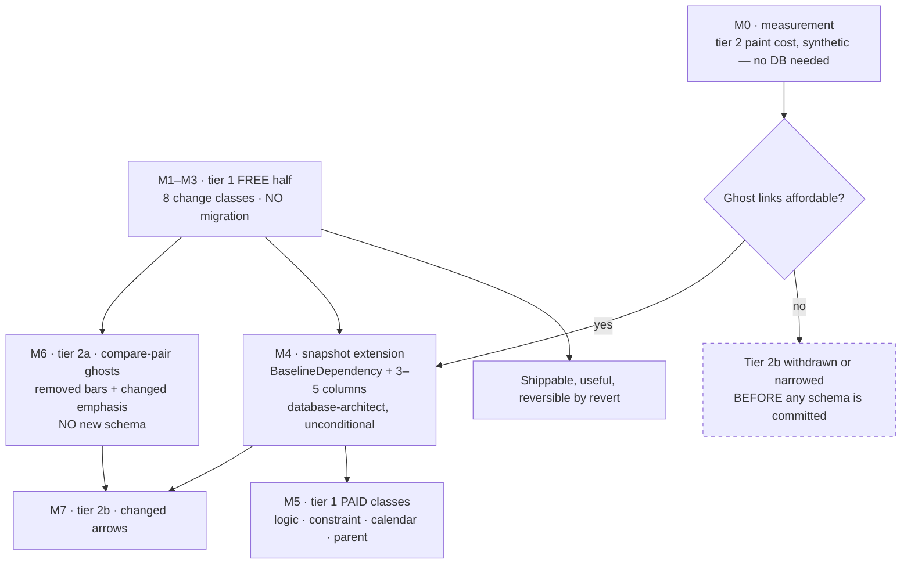
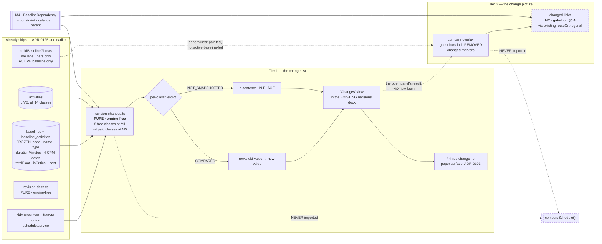
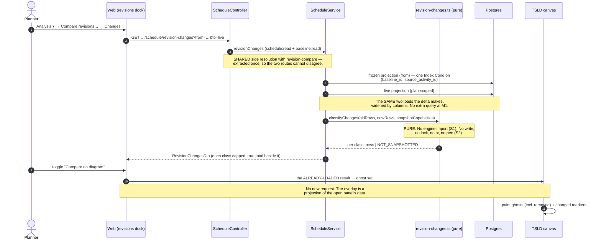
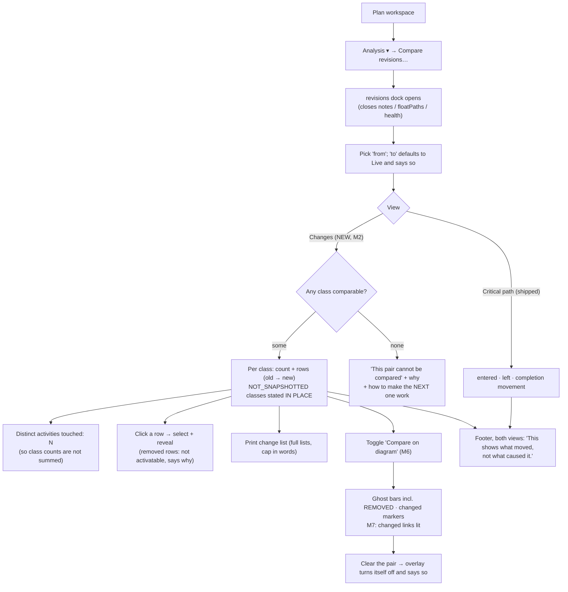

# Feature Spec: Revision Compare — the change list and the change picture (tiers 1 and 2)

- **Status:** Accepted — shipped (ADR-0127)
- **Author(s):** feature-analyst (Product Owner / Solution Architect / Technical Lead hats)
- **Date:** 2026-09-06
- **Tracking issue / epic:** _(to be opened on approval)_
- **Roadmap link:** [`docs/BACKLOG.md`](../../BACKLOG.md) → the `M` **Revision Compare** entry
  (rewritten 2026-09-06; this spec is the work that entry names as "still unbuilt")
- **Continues:** [`docs/specs/revision-compare-delta/`](../revision-compare-delta/) — shipped
  2026-09-05 as **ADR-0125**. That epic is not superseded; this one extends it.
- **Related ADR(s):** **ADR-0126 and ADR-0127 (to be written — see §4.10 for why two, not one).**
  Builds on ADR-0025 (the baseline snapshot-copy model), ADR-0026 D7 (the parallel focusable DOM
  layer), ADR-0065 (link routing), ADR-0081 (a milestone names its entry point), ADR-0088 D1 (no
  `VITE_` flag is an operator rollback), ADR-0093 (an object action belongs on the object; do not
  duplicate a capability), ADR-0100 (measurement-first, with the falsification condition committed
  before the harness), ADR-0103 (paper is a surface; the export composes the scene explicitly),
  ADR-0116 D3/D4 (a total vocabulary; a cap travels with its true total), ADR-0121 (one derivation,
  two renderers), **ADR-0122 (a picture a screen reader cannot reach is not described by saying it
  is — the governing accessibility precedent, §4.8)**, **ADR-0125 (the read model this extends)**.

> **Number check.** `ls docs/adr/01[23]*.md` returns 0120–0125 and nothing higher as of 2026-09-06,
> so 0126/0127 are the next free numbers. **Re-check at filing time and record a collision rather
> than routing around it** — the ADR-0071 lesson, and ADR-0079 was filed one number along from the
> number its own plan named.

---

## 0. What was verified before this spec was written

`CLAUDE.md` §19.11 requires a decision-bearing claim to name what was run or read, and requires **a
claim inherited from the brief to be checked like any other**. Twelve were checked. **Four came back
differently from how the brief stated them, and three of the four change the shape of the epic.**

| #   | Claim                                                                              | Verified against                                                                                                                                                                                               | Verdict                                                                                                                                                                                                                        |
| --- | ---------------------------------------------------------------------------------- | -------------------------------------------------------------------------------------------------------------------------------------------------------------------------------------------------------------- | ------------------------------------------------------------------------------------------------------------------------------------------------------------------------------------------------------------------------------ |
| V1  | There is no `BaselineDependency` model (the backlog's stated blocker)              | `grep '^model \w\+ {' apps/api/prisma/schema.prisma` → 29 models; the baseline family is `Baseline` (1775), `BaselineActivity` (1911), `BaselineAssignment` (2027)                                             | **Correct.** No frozen logic exists                                                                                                                                                                                            |
| V2  | A baseline therefore freezes nothing a change list can use                         | `schema.prisma:1911-1991`                                                                                                                                                                                      | **FALSE, and this is the epic's largest finding.** It freezes `code`, `name`, `type`, **`durationMinutes`**, four CPM dates, `totalFloat`, `isCritical`, two cost columns — **8 of 14 change classes are already free** (§0.1) |
| V3  | `durationMinutes` is actually written at capture, not a reserved column            | `baseline.repository.ts:194-225` — `loadActiveActivitiesForCapture` selects it; `:128-133` writes it                                                                                                           | **Correct** — re-durationed is free                                                                                                                                                                                            |
| V4  | The old revision's **constraint**, **calendar** and **WBS parent** are recoverable | `schema.prisma:1911-1991` carries no `constraintType`, `constraintDate`, `calendarId`, `parentId`, `laneIndex` or `percentComplete`; the live `Activity` carries all six (`:915-918`, `:961`, `:987`, `:1069`) | **FALSE.** Six classes need schema (§0.1)                                                                                                                                                                                      |
| V5  | Tier 2's ghost layer must be built                                                 | It **partly ships**: `render/lenses.ts:338-390` (`buildBaselineGhosts`/`GhostBar`), `render/paint.ts:281-283`, `:1162-1164`, spoken twin `render/a11y.ts:143`                                                  | **Half true, and the half that is false is load-bearing** — see V6/V7                                                                                                                                                          |
| V6  | The shipping ghost layer can show **any** revision pair                            | `TsldPanel.tsx:442-446`, `:1157-1159` feed it from `useBaselineVariance`, whose contract is **the active baseline vs live**, route takes no parameters (ADR-0125 §4.9)                                         | **FALSE.** It cannot show an arbitrary `from`; re-feeding it from the compare pair is real work (§0.2)                                                                                                                         |
| V7  | The shipping ghost layer is "the TSLD painted twice"                               | `lenses.ts:371-390` — `laneIndex: live.laneIndex`, i.e. the ghost sits behind its **live** bar; `row.removed` rows are **skipped**; **no links are drawn at all**                                              | **FALSE.** It is a per-bar slip indicator on the live layout, not a second scene (§0.2)                                                                                                                                        |
| V8  | Tier 2 is independent of tier 1's schema question                                  | "Changed arrows lit" requires the old revision's edge set, which is the same absent `BaselineDependency` V1 names                                                                                              | **FALSE.** The two are coupled; the coupling forces the milestone order (§0.3)                                                                                                                                                 |
| V9  | The right edge can hold a fifth dock cheaply                                       | `right-docks.ts:14` — `RIGHT_DOCKS = ['notes','floatPaths','health','revisions']`, closures derived from the set                                                                                               | **Correct mechanically, and the wrong question** — the docks are mutually exclusive, so two would be worse than one (§4.4 D2)                                                                                                  |
| V10 | The revision panel has room for a change table                                     | `use-revision-compare-panel-prefs.ts:26-28` — min **380**, default **420**, max **640** px                                                                                                                     | **Correct, and it constrains the design**: 420 px is a list, not a five-column table (§4.7)                                                                                                                                    |
| V11 | The no-cause and engine-free gates will cover a new sibling module                 | `revision-delta-no-cause.structural.spec.ts:27` and `revision-delta-engine-free.structural.spec.ts:24` both hard-code `['revision-delta.ts']`                                                                  | **FALSE — they will silently not cover it.** A named task fixes this (§4.6, M1-T1)                                                                                                                                             |
| V12 | The export will pick up a new canvas layer                                         | `export/scene-parity.structural.test.ts:30-53` — a **derived** roster diff that fails until a new scene key is classified                                                                                      | **Correct, and it works in our favour**: the gate forces the decision rather than letting the layer go missing (ADR-0103's #164 finding)                                                                                       |

### 0.1 Measurement input 1 — how much of tier 1 is free

The product owner asked for this to be **stated as a question in the spec** and treated as a
`database-architect` input. Here is the enumeration, read off `schema.prisma:1911-1991` against
`schema.prisma:893-1090`:

| Change class                   | Frozen today?                     | Evidence                                                  |
| ------------------------------ | --------------------------------- | --------------------------------------------------------- |
| **Added / removed**            | ✅ free                           | `sourceActivityId` (`:1920`) set difference               |
| **Renamed**                    | ✅ free                           | `name` (`:1924`)                                          |
| **Re-coded**                   | ✅ free                           | `code` (`:1923`)                                          |
| **Re-typed**                   | ✅ free                           | `type` (`:1925`)                                          |
| **Re-durationed**              | ✅ free                           | `durationMinutes` (`:1927`)                               |
| **Re-dated** (early + late)    | ✅ free                           | `baselineStart/Finish`, `lateStart/Finish` (`:1932-1935`) |
| **Float / criticality moved**  | ✅ **already shipped** (ADR-0125) | `totalFloat`, `isCritical` (`:1936-1937`)                 |
| **Re-costed**                  | ✅ free                           | `budgetedCost`, `budgetedExpense` (`:1947`, `:1970`)      |
| **Re-logicked** (dependencies) | ❌ **needs a new table**          | no `BaselineDependency` (V1)                              |
| **Re-constrained**             | ❌ needs 2 columns                | no `constraintType` / `constraintDate`                    |
| **Re-calendared**              | ❌ needs 1 column                 | no `calendarId`                                           |
| **Re-parented** (WBS)          | ❌ needs 1 column                 | no `parentId`                                             |
| **Re-laned**                   | ❌ needs 1 column                 | no `laneIndex`                                            |
| **Progress moved**             | ❌ needs 1–2 columns              | no `percentComplete` — **and see CQ-3**                   |

**Eight of fourteen classes are free, and they include four of the six the brief names by hand**
(added, removed, re-dated, re-durationed). Two of the brief's six — re-logicked and re-constrained —
are on the paid side.

**So the milestone order is decided by evidence rather than by taste, exactly as the brief asked:
the free half ships first, with no migration at all**, mirroring ADR-0125's own shape (an epic that
delivered a whole read model with zero schema change because the snapshot already existed). That is
`CLAUDE.md` §19.4 — the smallest change that fully solves the task — and it means a planner has a
working change list before any `database-architect` conversation begins.

> A `database-architect` run is happening in parallel on this question. **Its answer is an input and
> outranks this table where they differ**; this table exists so the question is stated, and so the
> milestone order has a stated basis rather than an assumed one.

### 0.2 The brief's tier-2 premise, corrected

The brief describes tier 2 as "the TSLD painted twice, old revision ghosted under the new". **That is
not what ships and not quite what should be built**, and the correction changes the design:

1. **What ships is a slip indicator, not a second scene.** `buildBaselineGhosts`
   (`lenses.ts:371-390`) sets `laneIndex: live.laneIndex` — the ghost is drawn **behind its own live
   bar**, on the live layout. It moves only on the x (time) axis.
2. **A true second scene is not currently possible at all.** Painting the old revision in its own
   layout needs each activity's **old lane**, and `laneIndex` is not frozen (V4). So "painted twice"
   would need schema that neither the brief nor the backlog names.
3. **Removed activities are invisible.** `lenses.ts:377` — `if (row.removed) continue;`. An activity
   that existed at Rev B and does not exist now has no ghost, which is exactly the change a reader
   most wants to see on the picture.
4. **No links are drawn.** The ghost layer is bars only. "Changed arrows lit" is entirely new.
5. **It cannot show an arbitrary pair** (V6). It is fed from the active baseline's variance rows.

**This is good news for the cost question**, and it reframes the measurement (§0.4): the right design
is not to paint the old plan again, but to paint **the difference** — which is bounded by the size of
the change set, not by the size of the plan.

### 0.3 The coupling nobody stated: tier 2's differentiating half is blocked by tier 1's blocker

Tier 2's distinctive claim — the one the brief correctly calls "structurally impossible for a
Gantt-shaped competitor" — is **changed arrows lit**. To light a changed arrow you must know the old
edge set. That is `BaselineDependency`: the same absent table tier 1's **re-logicked** class needs.

So the two tiers are not independent programmes and cannot be sequenced as if they were:



**M0 must run before M4's go/no-go**, and it can, because paint cost is a rendering question that a
synthetic scene answers without any database (`measure-link-routing.mjs` paints synthetic scenes with
no database at all). If ghost links prove unaffordable, part of the schema's justification
evaporates before a migration is written — and a migration is the one thing in this repository that
costs a second migration in every environment to correct (`CLAUDE.md` §19.3).

### 0.4 Measurement input 2 — tier 2's paint cost, and its falsification condition

**Committed here, in writing, before the harness exists** (ADR-0100's rule, and the product owner's
explicit instruction). The full condition file is
[`m0-condition.md`](./m0-condition.md), written and committed in its own commit before M0-T2 runs.

**The metric is frame pacing, not wall clock.** `docs/TECH_DEBT.md` #75 is explicit that
`paintScene`'s own duration is the wrong quantity, and that the real gate in ADR-0026 §9 is
**frames per second — ≥ 45 fps @ 500 and ≥ 30 fps @ 2,000 under sustained pan**. The 4 ms figure
everyone quotes was never a budget; it was a throwaway prototype's measured p95, recorded as a PASS
against a ≤ 16 ms frame.

**Subject.** Two plans, both from the seed catalogue so the numbers are reproducible:

- `scale` (ADR-0066's realistic generator: **2,160 activities / 3,200 links**) — the ceiling case.
- `plan:fixture-p6-torture-v1` (**147 activities / 188 dependencies**) — the control, and the plan
  every other measurement in this family used.

**Widths.** **1646** (the product owner's Surface Pro at 2880×1920 @ 175 %, which ADR-0091's own
retrospective establishes two whole epics had never measured) and **1920**.

**Presets.** **Week** — the working zoom, where #75 measured the shipped painter at 5.5 / 6.7 ms p50/p95
with the cull working — and **Fit** (whole plan), where the same run measured 14.6 / 18.7 ms **with
10.2 % of frames dropped**.

**Paired, same-session, baseline-then-treatment**, because a container's absolute timings are noise
and only a paired difference is quotable (ADR-0100 M0's design, which passed on both fixtures).

> **The condition — tier 2 is WITHDRAWN or NARROWED if any of these fails.**
>
> **P1 (the gate).** At **Week** on `scale`, the treatment's dropped-frame percentage is
> **≤ baseline + 2.0 pp**, with the baseline's own run-to-run spread stated in the verdict. 2.0 pp is
> ADR-0100's bar, chosen because it is the only one in this repository that has been used and passed
> — not invented for this epic.
>
> **P2 (the absolute gate).** At **Week** on `scale`, the treatment still meets ADR-0026 §9's
> **≥ 30 fps** under sustained pan. P1 is a difference and P2 is a level; a change can pass one and
> fail the other, and both matter.
>
> **P3 (Fit is MEASURED AND REPORTED, NOT GATED).** The baseline at Fit already drops 10.2 % of
> frames — a pre-existing overage #75 records and nobody has attributed. Gating a new feature on a
> state that is already failing is the "a gate that fails on day one gets deleted rather than fixed"
> trap (ADR-0058). The Fit numbers are reported beside the Week ones and go to the product owner.
>
> **Non-vacuity, checked FIRST.** The synthetic change set must light **≥ 40 changed links** and
> **≥ 25 changed bars** at the measured viewport. Without this the treatment paints almost nothing
> and P1 passes trivially — the green-for-having-tested-nothing failure ADR-0093 and ADR-0108 both
> record. **If the generator cannot produce a qualifying scene, that is itself the finding.**
>
> **If P1 or P2 fails**, in order: (i) narrow to changed links only (already the default design,
> §4.4 D6 — so this is a _further_ narrowing to, say, the selected activity's changed links);
> (ii) withdraw tier 2b and ship tier 2a alone; (iii) the numbers go to the product owner with both
> options. **The bar is not softened.** ADR-0121's cap was cut from 6 to 3 by its own condition and
> ADR-0097 Landing C was withdrawn entirely by its; that is the instrument working.

**Why the risk is bounded by construction, and why the measurement is still needed.** The design
paints the **difference**, not the old plan (§4.4 D6): a changed-link set on a real revision pair is
tens of edges, not thousands, so the added cost scales with the change and not with the programme.
That is a strong prior — and ADR-0121 found an unattributed **20× cliff at nine stacked histogram
segments** (`docs/TECH_DEBT.md` #226) which no arithmetic predicted, in this same painter family.
A strong prior is not a measurement.

### 0.5 Measurement input 3 — what "two revisions" means when one predates the columns

The product owner's third requirement: a class the product cannot assess for a given pair must be
**a stated reason, never an omission and never a silent "no change"**.

ADR-0125 already established the pattern and the vocabulary for exactly this. Its `settingsVerdict`
is three-valued — `MATCH` / `DIFFERS` / `UNKNOWN` — and its schema docblock
(`schema.prisma:1837-1846`) says in capitals: **the null is a sentinel, "the rule is unknown", never
a claim**, and `UNKNOWN` is never coalesced to `MATCH`.

**This spec applies that rule per change class.** Every class in the response carries a verdict:

| Verdict           | Meaning                                                                    | Rendered as                                                          |
| ----------------- | -------------------------------------------------------------------------- | -------------------------------------------------------------------- |
| `COMPARED`        | Both sides recorded this class; the list is complete for it                | The rows                                                             |
| `NOT_SNAPSHOTTED` | At least one side never recorded it — permanently unknowable for this pair | A sentence naming the class and the side, in the list's own position |

- The response is **total over a closed class vocabulary** — the ADR-0116 D3 rule, asserted as a
  totality test, so a class added later is a compile error rather than a silent omission.
- `NOT_SNAPSHOTTED` **renders in the list's own position**, not in a footnote, because a reader
  scanning for "did the logic change?" must meet the answer where they look for it.
- **It is permanent, and the product says so.** A baseline captured before M4 can never be told what
  its logic was. This is not a transitional inconvenience; it is the same permanence
  `schema.prisma:1845-1846` records for the criticality sentinel ("UNLIKE the plan's mirror this
  sentinel is PERMANENT — a plan's mirror self-clears on its next recalculation, and a capture cannot
  be re-run"). **CQ-1 turns on exactly this.**

---

## 1. Business understanding

### Problem

ADR-0125 answered half a question. A planner asked _"what changed since last month, and why is the
job three weeks later?"_ can now say **how much** the finish moved and **which work started and
stopped driving it**. They still cannot say **what changed**.

That gap is specific and it is the thing a progress meeting actually runs on. A planner defending a
programme is asked: _did you add work? Did you take work out? Did that activity get longer? Did you
re-sequence the fit-out?_ Today the only way to answer is to export both revisions to XER and open
them in P6 — **the tool SchedulePoint exists to replace, used as SchedulePoint's own diff tool.**
P6 ships this as Claim Digger. It is table stakes, and its absence is felt every month.

**And there is a second half that is not table stakes.** SchedulePoint's primary surface is a logic
diagram, so it can show a change the way a planner argues it — the old revision under the new, with
the arrows that moved lit up. **A Gantt-shaped competitor structurally cannot do this**, because a
Gantt has no logic to light. That is the differentiating half, and it is the reason this epic is
worth more than parity.

**Why now.**

1. ADR-0125 shipped the read-model spine on 2026-09-05: side resolution, the `from`/`to` union, the
   dock, the printed document, the reveal channels. A change list is a second view over the same
   pair, not a new feature stack.
2. **Eight of fourteen change classes are already frozen** (§0.1). The free half is small.
3. The refused tier is genuinely closed (below), so there is no risk of this epic drifting back into
   attribution.

### What this epic deliberately does not do — the refusal that still stands

**ADR-0125's Tier 3 — attributing the movement to a particular change — is REFUSED BY MEASUREMENT,
not deferred.** Replayed in six orders on the fixture, the same change scored **30, 18, 2 or 0
working days by position alone** (12.9 pp share spread against a 10 pp bar, unstable top-three),
while the sum was **order-free and stable at 139 d in every permutation**.

**A change list makes this refusal harder to keep, and that is the central risk of this epic.** Once
the product lists "Piling: duration 20 d → 35 d" beside "the finish moved +19 days", a reader will
join them, and a contributor will be tempted to join them in code. So:

- The list is **ordered by a stated, neutral key** (§6 defaults), never by "impact".
- No row carries a movement figure attributed to it.
- The existing no-cause structural gate is **extended to cover the new modules** (V11 — it currently
  would not), and the ban list grows to catch the vocabulary a change list specifically invites:
  `impact`, `contribution`, `drove`, `responsible`.
- The panel's honesty footer, already shipped, covers both views.

### Users

All organisation-scoped, ADR-0012 / ADR-0016 roles. **No new permission code** — ADR-0125 §V6
established that `baseline:read` sits inside `HIERARCHY_READ` (every member) and this is the same
read of the same two snapshots.

| Role                          | Need                                                                                                 | Gate            |
| ----------------------------- | ---------------------------------------------------------------------------------------------------- | --------------- |
| **Planner**                   | Defend a revision: what did I change, and can I show it on the diagram rather than describe it       | `baseline:read` |
| **Org Admin**                 | The same, plus governance — a printed change list is the artefact attached to a revision transmittal | `baseline:read` |
| **Contributor**               | Read it. A progress report they filed may be in the list                                             | `baseline:read` |
| **Viewer**                    | **The reporting audience** — the person the printed change list is _for_                             | `baseline:read` |
| **External Guest** (ADR-0051) | **Out of scope.** The guest scope is a fixed `SCHEDULE_READ`; widening it is its own decision        | —               |

### Primary use cases

1. **See what changed** between a captured baseline and the live plan, grouped by change class.
2. **See what changed between two captured baselines** — the handover case, inherited free from
   ADR-0125's `to` union.
3. **See it on the diagram**: removed work, added work and re-sequenced logic marked on the TSLD.
4. **Print the change list** as the document a revision transmittal carries.
5. **Be told, honestly, which classes cannot be assessed for this pair** and why.

### User journeys

**Happy path (tier 1, M2).** A planner is issuing Rev C. They open the plan,
`Analysis ▾ → Compare revisions…`, pick `Rev B (2026-08-24)` against **Live**, and switch the panel
from **Critical path** to **Changes**. The panel says: **6 activities added, 2 removed, 14 re-dated,
3 re-durationed, 1 renamed.** Each group expands to its rows, each row naming the old value and the
new. Below them, in the same list: **"Logic changes — not comparable for this pair. Rev B was
captured before SchedulePoint recorded a revision's logic."** They print it.

**Happy path (tier 2, M6/M7).** With the pair still selected they turn on **Compare on diagram**
(`View ▾ ▸ Overlays`). The canvas now shows Rev B's bars as ghosts behind Rev C's, **including the
two removed activities**, which paint as ghost-only bars in their old lanes. Changed bars carry a
marker. With M7, the three re-sequenced links are drawn as ghost arrows in the old geometry beside
the new ones.

**Alternate — no baseline.** Unchanged from ADR-0125: the empty state offers **Capture a baseline…**
and is honest that a first capture cannot reconstruct the past.

**Alternate — an old baseline.** Every class the pair cannot assess is stated in place (§0.5). The
planner learns that capturing a baseline **today** makes next month's comparison complete — which is
the only remedy, and the panel says so rather than leaving the reader to infer it.

### Expected outcomes

- A planner answers "what did you change?" from the product, in seconds, rather than from P6.
- The printed change list is a **transmittal artefact**: one URL, one document, identical for every
  role (structurally — there is no role-varying field in it).
- The diagram shows a re-sequence as a re-sequence, which is the thing this product's primary
  surface can do and a Gantt cannot.

### Success criteria

| #   | Criterion                                                         | Measured how                                                                                                                     |
| --- | ----------------------------------------------------------------- | -------------------------------------------------------------------------------------------------------------------------------- |
| S1  | The change list is **provably engine-free**                       | The existing import-ban structural test, **with its `SOURCES` roster made derived** (V11), verified red first                    |
| S2  | It **persists nothing**                                           | A non-mutation API e2e reading every engine-owned column back after the call, verified red by persisting once deliberately       |
| S3  | The class vocabulary is **total**                                 | A totality test over the closed class union — the ADR-0116 D3 pattern                                                            |
| S4  | No class the pair cannot assess is **omitted or silently zeroed** | A test per class asserting `NOT_SNAPSHOTTED` renders as a sentence in the list's own position, against a pre-M4 baseline fixture |
| S5  | **No causal claim can be added by accident**                      | The extended no-cause gate over **both** modules, with the widened ban list, verified red                                        |
| S6  | Tier 2 does not cost the diagram its frame budget                 | §0.4's P1/P2, paired same-session, non-vacuity checked first                                                                     |
| S7  | A planner reaches both tiers, in a real browser                   | `apps/web/e2e-revision-compare/` extended — **the Changes step lands with M2**, the diagram step with M6 (ADR-0081 §2)           |
| S8  | Tier 2's new scene keys reach the export **or are classified**    | `export/scene-parity.structural.test.ts` — a derived gate that fails until somebody decides (V12)                                |

### Open questions

**CQ-1 … CQ-3** in §6. Everything else has a stated default in §6's second table and is not blocking.

---

## 2. Functional requirements

### User stories & acceptance criteria

> **US-1** — As **any member**, I want a list of what changed between two revisions, grouped by kind
> of change, so that I can answer "what did you change?" without exporting to P6.
>
> - **Given** a pair with changes, **when** I open the Changes view, **then** I get counts per class
>   and, per class, the changed activities with their **old and new value side by side**.
> - **Given** an activity that changed in three classes, **then** it appears once **per class**, and
>   the panel states the total number of **distinct activities** touched as well as the per-class
>   counts — because a reader adding eight class counts will otherwise conclude eight times as much
>   work changed as did.
> - **Given** the response, **then** it carries **no field naming a cause or an impact** (S5), and no
>   row carries a movement figure attributed to it.
> - **Given** more rows in a class than the cap, **then** the cap **and the true total** travel in the
>   payload (ADR-0116 D4) and the display reads "showing 50 of 412" from the server's number, never
>   from the array's length.
>
> **US-2** — As **any member**, I want to be told when a class cannot be compared, so that I do not
> read silence as "nothing changed".
>
> - **Given** a `from` baseline captured before the snapshot recorded logic, **then** the logic class
>   reports `NOT_SNAPSHOTTED` **as a sentence in its own position in the list** — never omitted, never
>   zero, never collapsed into a footnote.
> - **Given** that sentence, **then** it names **which side** lacks the data and **what would fix it**
>   (capture a baseline now; it cannot be backfilled).
> - **Given** a pair where every class is comparable, **then** no such sentence appears at all — the
>   caveat is not standing furniture.
>
> **US-3** — As a **Planner**, I want to click a changed activity and find it, so that I can look at
> it rather than hunt for it.
>
> - **Given** a row whose activity exists on the live plan, **when** I activate it, **then** the
>   canvas selects and reveals it, and the Gantt uses the ADR-0116 reveal channel (selection alone
>   scrolls nothing there). **This prop already exists** on the panel (`RevisionComparePanel.tsx:60`,
>   "ONE prop for both views") and is reused, not rebuilt.
> - **Given** a **removed** activity, **then** the row is not activatable and **says why** — never a
>   control that does nothing (ADR-0082).
>
> **US-4** — As **any member**, I want to print the change list, so that it can be attached to a
> revision transmittal.
>
> - **Given** a comparison, **when** I print, **then** the document carries **full** lists with the
>   cap stated in words — paper has no "load more" (ADR-0059 M4's rule).
> - **Given** a class reporting `NOT_SNAPSHOTTED`, **then** the printed document says so too. _(This
>   is ADR-0116 D9's and ADR-0125's shared finding, in the direction it keeps failing: the person who
>   was not in the room must not get **more** than the planner, nor less.)_
>
> **US-5** — As a **Planner**, I want the change to show on the diagram, so that I can argue a
> re-sequence in the picture rather than in a table.
>
> - **Given** a selected pair and **Compare on diagram** on, **then** the old revision's bars draw as
>   ghosts behind the new, **including activities that no longer exist**, which draw as ghost-only
>   bars in their captured lane.
> - **Given** a changed activity, **then** its bar carries a marker that is **not colour alone**
>   (WCAG 1.4.1) — the rule `paint.ts` already follows for criticality and over-allocation.
> - **Given** M7 and a logic change, **then** the removed edge draws in the ghost treatment and the
>   added edge is emphasised, both **using the existing `routeOrthogonal`** rather than a second
>   router (§4.4 D7).
> - **Given** the overlay is on and the pair is cleared, **then** the overlay turns itself off and
>   says so — an overlay describing a comparison nobody has selected is a lie about the picture.

### Workflows

**Change list.** Resolve org from `:orgSlug` → resolve plan (anti-IDOR, on the target) → assert
`schedule:read` + `baseline:read` → resolve `from` (a baseline of **this** plan; 404 otherwise) →
resolve `to` (a baseline of this plan, or `live`) → load both projections → **pure classifier: no
engine, no lock, no transaction, no pen** → return. **The resolution half is the same code
ADR-0125's route runs**, extracted once so the two routes cannot disagree about what
`from=X&to=live` means (§4.5).

**Diagram overlay.** Entirely client-side. The panel publishes the compare result; the canvas host
derives a ghost set from it. **No new fetch** — the overlay reads what the open panel already loaded.

### Edge cases

| Case                                                       | Behaviour                                                                                                                                                                                                                                                                                                                                                       |
| ---------------------------------------------------------- | --------------------------------------------------------------------------------------------------------------------------------------------------------------------------------------------------------------------------------------------------------------------------------------------------------------------------------------------------------------- |
| A pair with **no changes at all**                          | An explicit "nothing changed between these revisions", distinct from "no baselines captured" in **both** the visible copy and the live region (the ADR-0073 C1 lesson)                                                                                                                                                                                          |
| A pair where **every** class is `NOT_SNAPSHOTTED`          | The panel says the comparison cannot be made and why — it must not read as "nothing changed". **This is the state every pre-M4 baseline is in**, so it is the commonest case, not an edge                                                                                                                                                                       |
| An activity **added and immediately re-dated**             | One `ADDED` row only. It has no old value to differ from. Asserted, because the tempting implementation reports both                                                                                                                                                                                                                                            |
| An activity **removed**                                    | One `REMOVED` row; excluded from every value-change class for the same reason                                                                                                                                                                                                                                                                                   |
| `WBS_SUMMARY` rows                                         | **Reported for structural classes (added/removed/renamed/re-parented) and excluded from value classes.** A summary's dates and duration are a rollup (`compute.ts:544-553`), so "the phase got 12 days longer" is an echo of its children, not a change somebody made. Stated because ADR-0125 excludes summaries wholesale and this is a deliberate divergence |
| 2,000 activities, most of them re-dated                    | Every class capped **independently**, each with its own true total. The dominant class does not starve the others of rows                                                                                                                                                                                                                                       |
| Both sides are the same baseline                           | 422 `SAME_REVISION` — inherited from ADR-0125's route, and the client's pickers already exclude each other's choice                                                                                                                                                                                                                                             |
| A class exists on the `to` side and not the `from` side    | `NOT_SNAPSHOTTED`, naming the `from` side. Direction is stated, because "which of my two revisions is too old?" is the actionable half                                                                                                                                                                                                                          |
| The overlay is on and the planner switches to the Gantt    | The overlay is a **canvas** feature. The Gantt shows nothing and the toggle reports that, rather than appearing on and doing nothing (ADR-0059 M6's "lit but inert" finding)                                                                                                                                                                                    |
| Tier 2 with a pair whose `from` predates the lane snapshot | Removed activities have no captured lane. They draw **in a reserved band below the scene**, not at a guessed lane — a guessed position is a false statement about where work was                                                                                                                                                                                |

### Permissions

**No new permission code.** Identical to ADR-0125: `schedule:read` **and** `baseline:read`, both
asserted, both in `HIERARCHY_READ`. Asserting both changes nothing today and means narrowing either
later does not silently leave this route open on the other (the ADR-0053 `calendar:manage_org`
precedent).

**No pen** (ADR-0028) — it is a read. **No audit event** — ADR-0073's two tests both say no: nothing
is durable and nothing changes for anyone else. Stated as a rule with a reason, not a gate: the route
census reflects over controller metadata and forces only **mutating** routes to be classified, so
nothing would fail a PR that audited this.

### Validation rules

Inherited unchanged from ADR-0125's query DTO: `from` required UUID of a baseline in this plan; `to`
optional UUID or the literal `live`, defaulting to `live`; `from ≠ to`.

| New field              | Rule                                                                                                                                                                  |
| ---------------------- | --------------------------------------------------------------------------------------------------------------------------------------------------------------------- |
| `classes`              | Optional, repeatable; members of the closed class union. Absent ⇒ all classes. Rejects an unknown member with a 422 naming it                                         |
| Day-denominated output | Working days via the **frozen** `hours_per_day_minutes`, `hoursPerDay` a **required** parameter of the formatter, never defaulted (ADR-0070's compiler-enforced rule) |
| Money                  | BIGINT minor units + the plan's `currencyCode` — never a float, never a bare number                                                                                   |

### Error scenarios

| #    | Scenario                             | Detection       | User-facing result                                     | Status  |
| ---- | ------------------------------------ | --------------- | ------------------------------------------------------ | ------- |
| ER-1 | Not a member of the organisation     | Org resolve     | Not found                                              | **404** |
| ER-2 | `from`/`to` from another plan or org | Scope on target | Not found — never 403, no existence oracle             | **404** |
| ER-3 | Plan not found / soft-deleted        | Plan resolve    | Not found                                              | **404** |
| ER-4 | `from` = `to`                        | Service         | "Pick two different revisions to compare."             | **422** |
| ER-5 | `to` neither `live` nor a UUID       | Query DTO       | Field-level validation message                         | **422** |
| ER-6 | An unknown member of `classes`       | Query DTO       | Names the offending value and the permitted set        | **422** |
| ER-7 | A class the pair cannot assess       | Service         | `NOT_SNAPSHOTTED` **as a sentence, in place**          | **200** |
| ER-8 | A class exceeds its cap              | Payload         | "Showing the first N of M", **with M from the server** | **200** |

A reason **prints as a sentence**; a code reaching a screen or paper is a tested-for defect
(ADR-0116 D3).

---

## 3. Technical analysis

| Area           | Impact                                         | Notes                                                                                                                                                                                                                                                                                                                                               |
| -------------- | ---------------------------------------------- | --------------------------------------------------------------------------------------------------------------------------------------------------------------------------------------------------------------------------------------------------------------------------------------------------------------------------------------------------- |
| Frontend       | **High** (the largest half)                    | A second view in the **existing** `revisions` dock (no fifth dock, §4.4 D2); a printed change list; **a new canvas overlay layer** with its scene key, its export classification (V12) and its spoken equivalent. No new deck stop, so **no width cost** — the surface eight consecutive epics have contradicted their own width expectations about |
| Backend        | **Medium**                                     | One pure classifier module beside `revision-delta.ts`, one repository projection widening, one service method, one route. Shared side-resolution extracted once                                                                                                                                                                                     |
| Database       | **NONE for M1–M3 and M6; a real change at M4** | The free half needs no migration (§0.1). M4 adds `BaselineDependency` + 3–5 nullable columns on `BaselineActivity`. **`database-architect` is mandatory and unconditional at M4** (`CLAUDE.md` §19.3) and re-run if it returns nothing, fails or is slow                                                                                            |
| API            | Low                                            | One new GET beside `revision-compare`. Full OpenAPI including every reachable status — an undeclared-but-reachable 422 is a real defect (ADR-0053 M6 / ADR-0116 M5)                                                                                                                                                                                 |
| Security       | Low                                            | No new permission code; org + plan scope on the **target** (anti-IDOR); no unauthenticated surface. **Cost classes make the response NOT structurally role-invariant** — unlike ADR-0125, this payload can carry money, so a `cost:read`-shaped gate is needed or cost is excluded (§6 default: **excluded from M1–M3**, revisited with the schema) |
| Performance    | Low (server) / **the open question** (canvas)  | Server: the free classes add columns to two loads already being made — ADR-0125 measured a whole-baseline load at 0.44 ms at 2,000 rows and the route end-to-end at **p95 65.8 ms** against a 250 ms bar. Canvas: §0.4                                                                                                                              |
| Infrastructure | **None**                                       | No new service, job or env var                                                                                                                                                                                                                                                                                                                      |
| Observability  | Low                                            | A structured log line on the read (plan, both side ids, per-class row counts, duration). No metric, no trace                                                                                                                                                                                                                                        |
| Testing        | **High**                                       | Unit (the classifier, exhaustively — it is a pure function over two arrays); API e2e; **journey extended at M2 and again at M6**; a11y; **four structural gates** (engine-free with a derived roster, no-cause widened, class totality, export scene parity)                                                                                        |

### Dependencies

**Must land in this order:**

1. **The M0 conditions committed in their own commit, before either harness exists** (§0.4).
2. **M0's tier-2 paint measurement** — before M4's go/no-go, because it can withdraw part of the
   schema's justification before a migration exists (§0.3).
3. **ADR-0126, accepted** — before M1's code (§4.10).
4. **`database-architect`** — before M4's migration is written, unconditionally.
5. **ADR-0127, accepted** — before M6's code.

**Existing capability relied on, nothing new required:** ADR-0125's route, query DTO, side
resolution, dock, panel, pickers, printed document and reveal channels; `buildBaselineGhosts` and the
ghost painter (`lenses.ts:338-390`, `paint.ts:1162`); `baselineGhostClause` (`a11y.ts:143`);
`routeOrthogonal` (ADR-0065); the print-document convention (`lib/print-document.ts`); the paper
surface scope (ADR-0103); `measure-link-routing.mjs` and the `playwright.measure-*.config.ts`
pattern.

**Explicitly not required:** BullMQ/Redis (ADR-0009, unimplemented); object storage (ADR-0011); a
scheduler; a retention decision; a new audit action; a throttle; a `VITE_` flag (§4.4 D8).

---

## 4. Solution design

### 4.1 Architecture overview

Two load-bearing decisions, one per tier:

1. **Tier 1 is a second pure classifier beside the delta, over the same two projections** — the
   change list is a different question about the same pair, so it shares the pair's resolution and
   nothing else.
2. **Tier 2 paints the DIFFERENCE, not the old plan.** This is the decision that makes the cost
   bounded by the change set rather than by the programme, and it is why "the TSLD painted twice" is
   the rejected alternative rather than the design (§4.4 D6).



**The parity claim, in the strong form the brief asked for.** `computeSchedule` is **not called, not
imported, and not reachable from this feature's module graph** — ADR-0116 D1's sentence, not its
weaker D7 sibling. Both sides are persisted CPM output; the classifier compares stored values. The
ADR-0034 recalculation parity gate is untouched **by construction**, and the existing import-ban gate
is extended to the new module rather than trusted to cover it (V11).

**M4 is the exception, and it is stated rather than glossed.** The capture path gains columns, so
`baseline.repository.ts` and `baselines.service.ts` change. The **engine** does not: `computeSchedule`
neither reads nor writes a baseline, its signature is unchanged, and nothing under
`src/modules/schedule/engine/` is edited — to be established by `git diff --stat`, not by reading.
This is the same correction ADR-0125 had to make mid-epic when its own "no engine-path file is
touched" clause became false; it is written correctly here from the start.

### 4.2 Data flow



### 4.3 User flow



### 4.4 Design decisions

**D1 — the free half ships first, with no migration.** §0.1. Eight classes fall out of columns that
already exist and are already written at capture (V3). This is ADR-0125's own shape repeated, and it
means a planner has a working change list before any schema conversation. **The consequence to accept
knowingly:** the two most argued-about classes — logic and constraints — are on the paid side, so M1's
change list is genuinely useful and genuinely incomplete, and it must say which (§0.5).

**D2 — the change list is a SECOND VIEW in the existing `revisions` dock, not a fifth dock.**
Mechanically a fifth member is one name in `RIGHT_DOCKS` (V9). It is still wrong, for three reasons
in increasing order of force:

1. **The pair is shared state.** Two docks means picking `from`/`to` twice, and the two could
   disagree — one panel showing Rev B vs live while its neighbour shows Rev A vs Rev B, each correct
   alone. That is ADR-0093's shape exactly, and the register records it costing an epic each time.
2. **The docks are mutually exclusive** (`right-docks.ts:1-14` — the right edge holds one at a time).
   So the only benefit two docks could offer, seeing both answers at once, **is structurally
   unavailable**. Two docks would deliver strictly less than one panel with two views.
3. **A planner asks both questions of one pair**, in one sitting, and the answer to "what changed?"
   is the natural follow-up to "what moved?".

The view control is a segmented pair — `Critical path | Changes` — persisted per plan in the URL, so
a deep link renders the view its author meant (the ADR-0053 M6 lesson: a filtered view should survive
a reload).

**D3 — a change class is an OBSERVATION; it is never joined to the movement.** The critical
constraint of this epic (§1). No row carries a movement figure. The list's ordering key is stated and
neutral. The no-cause gate is widened, not merely reused (V11, §4.6).

**D4 — every class carries a three-valued-shaped verdict, and `NOT_SNAPSHOTTED` renders in place.**
§0.5. Directly inherited from ADR-0125's `settingsVerdict` and its schema docblock's rule that the
null is a sentinel and is never coalesced.

**D5 — summaries are reported for structural classes and excluded from value classes.** A
`WBS_SUMMARY`'s dates and duration are a rollup over its children (`compute.ts:544-553`), so "this
phase got 12 days longer" restates its children's changes and would double the list. But a summary
being **added, removed, renamed or re-parented** is a real structural edit somebody made. This is a
deliberate divergence from ADR-0125, which excludes summaries wholesale because criticality is
meaningless for them; it is stated here so a reader does not treat the two as inconsistent.

**D6 — tier 2 paints the DIFFERENCE, not the old plan.** The decision that bounds the cost.

- **What is painted:** ghost bars for changed and removed activities, markers on changed bars, and
  (M7) the **changed** links only.
- **What is not painted:** unchanged bars' ghosts, unchanged links' ghosts, and the old revision's
  own lane layout.
- **Why:** a changed-link set on a real revision pair is tens of edges; the whole old edge set is
  thousands. The added cost scales with the change, which is what a planner is looking at anyway. And
  a true second scene is **impossible without freezing `laneIndex`** (§0.2), which nothing else needs.
- **The rejected alternative is the brief's own words** — "the TSLD painted twice" — and it is
  rejected on §0.4's prior plus V4's schema gap, not on taste. If CQ-2 chooses it, the schema grows
  and the measurement's subject changes.
- **Removed activities have no captured lane**, so they draw in a **reserved band below the scene**
  rather than at a guessed position. A guessed lane is a false statement about where work was.

**D7 — the changed links use the EXISTING `routeOrthogonal`, with the ghost treatment as a
parameter.** ADR-0065 made obstacle awareness one optional parameter of one route function precisely
so a second `routeOrthogonalAvoiding` could not drift invisibly. A ghost router would be that
mistake, one epic along, and ADR-0121's `stackSeries` finding is the same shape a third time. One
router; the treatment is a stroke style.

**D8 — no `VITE_` flag.** ADR-0088 D1: a `VITE_` constant is inlined at build time,
`docker-publish.yml` passes no `VITE_` build args, and `.dockerignore` strips `**/.env` from the
build context — so a `VITE_` flag has never been an operator rollback, and the estate is already
100 % default-on. **The rollback contract is the commit boundary**, written per slice in the plan's
sequencing table. Tier 2's overlay is a `View ▾` toggle, default **off**, which is a user preference
rather than a flag.

**D9 — cost classes are excluded from M1–M3.** ADR-0125's response was role-invariant
_structurally_, because it had no cost-shaped field; a change list that reports `budgetedCost`
movement **loses that property** and would need an ADR-0116 G4-style gate plus a `cost:read`
projection. That is real work for a class nobody asked for. Excluded by default, revisited with the
schema milestone (§6).

### 4.5 API changes

**One new route**, beside `revision-compare` in the same controller, under the existing plan-nested
schedule path.

| Method | Path (under `/api/v1/organizations/:orgSlug/plans/:planId/schedule`) | Permission                        | Notes                                                           |
| ------ | -------------------------------------------------------------------- | --------------------------------- | --------------------------------------------------------------- |
| `GET`  | `/revision-changes?from=<uuid>&to=<uuid\|live>&classes=<c>&…`        | `schedule:read` + `baseline:read` | Pure read. No lock, no transaction, no pen, **no engine call**. |

**A separate route rather than `?include=changes` on the existing one.** Three reasons: the two views
load independently, so a planner on the Critical path view should not pay for the change list; the
caps and verdicts are per-class and nest awkwardly inside the delta's DTO; and ADR-0125's shipped DTO
stays untouched, so there is no API-version conversation. **The cost of two loads instead of one is
measured, not assumed:** ADR-0125 measured a whole-baseline load at 0.44 ms at 2,000 rows and the
whole route at p95 65.8 ms against a 250 ms bar, so the second load is inside that route's own noise.

**The shared half is extracted once.** Side resolution (`from`/`to` → two projections + the frozen
day factor + `settingsVerdict`) becomes one function both routes call. Two spellings of "what does
`from=X&to=live` mean" is the ADR-0065 drift argument, and here the drift would be invisible — only
a reader who opened both views on the same pair would ever see one disagree.

**No throttle beyond the global 100/60 s**, on ADR-0125's verified reasoning (its V7): a persisted
read shares the generic budget precisely _because_ it runs no CPM computation, while `float-paths`
earns a tighter one _because_ it recomputes per call. Copying `FLOAT_PATHS_THROTTLE` here would be
the mistake ADR-0116 M6 names by hand. **M0-T3 measures it anyway, and if the measurement contradicts
this paragraph the paragraph loses.**

**OpenAPI carries the parity sentence and the honesty sentence** in the route's own `description`,
because that is where an API consumer meets the claim:

> A pure read over two persisted CPM snapshots — **the CPM engine is not invoked**, no lock or
> transaction is taken, and nothing is written. It reports **what differs** between two revisions and
> **makes no statement about what any change caused**; the payload carries no attribution, ranking,
> impact or contribution field at any depth. A class the pair cannot assess is reported as
> `NOT_SNAPSHOTTED` with its reason — **never omitted and never reported as "no change"**.

Response shape (`RevisionChangesDto`), sketched to fix the contract rather than the field names:

```
{ from, to, dayFactorMinutes, settingsVerdict        // all four reused from RevisionCompareDto
, distinctActivitiesChanged                          // so class counts are never summed (US-1)
, classes:
  [ { class: 'ADDED'|'REMOVED'|'RENAMED'|'RECODED'|'RETYPED'
           |'DURATION'|'DATES'|'FLOAT'                       // M1, free
           |'LOGIC'|'CONSTRAINT'|'CALENDAR'|'PARENT'         // M5, needs M4
    , verdict: 'COMPARED'
    , rows: Row[], total: number, cap: number                // ADR-0116 D4 — the cap travels
    }
  | { class: …, verdict: 'NOT_SNAPSHOTTED'
    , missingSide: 'FROM'|'TO'|'BOTH', capturedAt              // WHICH side, so the fix is actionable
    }
  ]
}
Row = { activityId, code, name, type, existsLive              // existsLive drives US-3 activatability
      , from: <the class's old value> | null
      , to:   <the class's new value> | null }
```

There is deliberately **no** `cause`, `impact`, `contribution`, `rank`, `drove` or `responsible`
field. S5 gates it.

### 4.6 Database changes

**None for M1–M3 and M6.** §0.1 — the free half reads columns that exist and are populated. No model,
no column, no index, no constraint, no migration.

`database-architect` is therefore **not engaged for those milestones because there is nothing to
design — not because a change was judged too small to need it** (ADR-0116 D6's honest form; that
distinction is exactly the judgement `CLAUDE.md` §19.3 says the agent exists to make).

**M4 is a real schema change and `database-architect` is mandatory and unconditional** — a new model,
new columns, a new index, and a capture-path write. If the agent returns nothing, fails or is slow it
is **re-run**; an unavailable agent is a reason to wait, never to proceed (`CLAUDE.md` §20). The
sketch below is the **question for the agent, not the answer**:

| Change                                                     | Shape                                                                                                                                                                                                                                                                                                                                                                 | Precedent                                                                                                                                           |
| ---------------------------------------------------------- | --------------------------------------------------------------------------------------------------------------------------------------------------------------------------------------------------------------------------------------------------------------------------------------------------------------------------------------------------------------------- | --------------------------------------------------------------------------------------------------------------------------------------------------- |
| `BaselineDependency` (new model)                           | A sibling of `BaselineActivity`: `baselineId`, `organizationId` denormalised, **plain correlation UUIDs with no FK** (`sourceDependencyId`, `sourcePredecessorId`, `sourceSuccessorId`), `type`, `lagMinutes`, `lagCalendarSource`, `isDriving`; full housekeeping set; soft-deletes with its parent under one `delete_batch_id`                                      | `BaselineAssignment` (`schema.prisma:2027-2064`) verbatim — a snapshot that references live rows would either block their deletion or rot with them |
| `baseline_activities.constraint_type` / `.constraint_date` | Nullable, **no default**                                                                                                                                                                                                                                                                                                                                              | `budgetedExpense` — "0 is a claim", and here a default would claim an activity had no constraint                                                    |
| `baseline_activities.calendar_id`                          | Nullable plain UUID, **no FK** (the snapshot must survive the calendar's deletion)                                                                                                                                                                                                                                                                                    | `sourceActivityId`                                                                                                                                  |
| `baseline_activities.parent_id`                            | Nullable plain UUID, no FK                                                                                                                                                                                                                                                                                                                                            | `sourceActivityId`                                                                                                                                  |
| `baseline_activities.lane_index`                           | **YES — frozen at M4 regardless of CQ-2** (see §6's answer block; written from M4, read by nothing until a full second scene is ever built)                                                                                                                                                                                                                           | —                                                                                                                                                   |
| `baseline_activities.percent_complete`                     | **Only if CQ-3 includes progress**                                                                                                                                                                                                                                                                                                                                    | —                                                                                                                                                   |
| Index                                                      | `(baseline_id, source_dependency_id)` — the mirror of `(baseline_id, source_activity_id)` (`:1988`), covering the FK's leftmost prefix and the load-whole-baseline read                                                                                                                                                                                               | `BaselineActivity`                                                                                                                                  |
| The **capability discriminator**                           | **The agent's most important question.** How does a reader distinguish "this baseline recorded no dependencies" from "this baseline had none"? The `costSnapshotLevel` docblock (`:1802-1813`) answers exactly this question for costs and warns against using a row count. A `snapshotLevel`-style column on `Baseline` is the likely answer; **a row count is not** | `Baseline.costSnapshotLevel`                                                                                                                        |

**Every column is nullable with no default, and the null is a sentinel** — the ADR-0125 criticality
precedent (`schema.prisma:1837-1846`). A constant default would be legal only if the value were TRUE
of every pre-existing row, and none of these is.

**The gates that must move in the same commit (V11).** `revision-delta-no-cause.structural.spec.ts:27`
and `revision-delta-engine-free.structural.spec.ts:24` both hard-code `['revision-delta.ts']`. A new
sibling module would be **silently uncovered** — a green gate that has stopped checking, which is the
shape this register records most often. **Both rosters become derived** (every `revision-*.ts` in the
directory, excluding specs), keeping each file's pinned non-empty assertion so "found nothing" cannot
pass as "all clean". This is M1-T1 and it lands **before** the module it must cover.

### 4.7 Component changes

| Component              | Where                                                           | Notes                                                                                                                                                                                                                                |
| ---------------------- | --------------------------------------------------------------- | ------------------------------------------------------------------------------------------------------------------------------------------------------------------------------------------------------------------------------------ |
| View segmented control | `features/revision-compare/components/RevisionComparePanel.tsx` | `Critical path                                                                                                                                                                                                                       | Changes`. **Registry-free plain controls are wrong here** — reuse the existing `Tabs`/segmented primitive so roving focus, naming and ADR-0082 reason wiring are not hand-rolled (the ADR-0099 M5 rule) |
| `RevisionChangesView`  | `features/revision-compare/components/`                         | Per-class disclosure sections. **A list, not a table**: the dock is 380–640 px (V10), so a five-column table cannot fit; each row is name + `old → new` on one or two lines                                                          |
| `NotSnapshottedNotice` | same                                                            | Renders a class's `NOT_SNAPSHOTTED` **in the class's own position**. Reuses `NoticeStrip` (already imported by this panel) rather than a bespoke div — the ADR-0116 M5 finding                                                       |
| Printed change list    | `features/revision-compare/print/`                              | Extends the **existing** `RevisionComparePrintDocument`. Full lists, cap in words, and `NOT_SNAPSHOTTED` classes stated — the asymmetry ADR-0116 D9 and ADR-0125 both record failing in the same direction                           |
| Compare overlay toggle | `View ▾ ▸ Overlays`                                             | Default **off**. Shaded with a reason (ADR-0082) when no pair is selected; **reports itself inert in the Gantt** rather than appearing on and doing nothing (ADR-0059 M6's finding)                                                  |
| `buildCompareGhosts`   | `features/tsld/render/lenses.ts`                                | **Generalises `buildBaselineGhosts`, does not duplicate it** (V6/V7): the same function, taking a pair-derived row set instead of active-baseline variance rows, plus a `removed` treatment. The existing caller keeps its behaviour |
| Compare layer painter  | `features/tsld/render/layers/`                                  | ADR-0078's rule: a layer painter taking the `PaintFrame`, not another branch inside `paintScene`. Culled by `visibleIds` **first**, as the ghost layer already is (`paint.ts:1164`)                                                  |
| Spoken equivalent      | `features/tsld/render/a11y.ts`                                  | A `compareClause` sibling of `baselineGhostClause` (`:143`) — see §4.8                                                                                                                                                               |
| Export classification  | `features/tsld/export/scene-parity.structural.test.ts`          | The new scene keys must be **composed into the export or classified in `SCREEN_ONLY` with a reason**. The gate is derived and will fail until somebody decides (V12) — which is the gate working                                     |

**Design system:** no one-off styling; `SectionCard` / `FormSection` (ADR-0061, ADR-0097). **Colour is
never the sole channel** for a change class or for the ghost/changed distinction (WCAG 1.4.1) — each
carries an icon and a word on the DOM side and a shape or dash cue on the canvas. Any new token pair
enters `token-contrast.test.ts` **before** the CSS is written (ADR-0083). **Canvas tokens must be
resolved from the canvas surface scope, not `document.documentElement`** — ADR-0102's finding that
`resolveTsldPalette` had never once used the canvas scope, and ADR-0100 M4's that a token pair absent
from `@theme inline` paints **no colour at all in a real browser while the contrast gate stays
green**. Both apply directly here and are named as tasks rather than left to a review.

### 4.8 Accessibility — what tier 2 owes, stated plainly

The product owner asked for this either way round, and **ADR-0122 is the governing precedent**: a
picture a screen reader cannot reach is not described by saying it is. That ADR found two places in
the repository claiming a text equivalent that did not exist, each right about half its subject.

The honest answer here splits by object, because the two halves have different routes:

| Tier 2 element                     | AT route                                                                                                                                                                                               | Decision                                                                                                                                                                              |
| ---------------------------------- | ------------------------------------------------------------------------------------------------------------------------------------------------------------------------------------------------------ | ------------------------------------------------------------------------------------------------------------------------------------------------------------------------------------- |
| A **changed activity's** bar/ghost | **It already has one.** A live activity is an `option` in ADR-0026 D7's parallel listbox, and `baselineGhostClause` (`a11y.ts:143`) is the established shape for appending a clause to its spoken name | A `compareClause` sibling appends the change in the same idiom. **Real work, and it is not optional**                                                                                 |
| A **removed** activity's ghost     | **None exists.** It is not in the plan, so it structurally cannot be an `option` — exactly ADR-0122's Unassigned-bucket case                                                                           | A **non-focusable `sr-only` list inside the diagram region**, ADR-0122 D2's shape, listing the removed activities the overlay draws                                                   |
| A **changed link** (M7)            | **None exists and none is proposed.** A link is not a selectable object in this product; there is no listbox of edges                                                                                  | **Tier 1 is the route, and the spec says so plainly rather than claiming an equivalent.** The overlay toggle's own description says the change list carries the logic changes in text |

**That third row is the answer to the product owner's question, in the form they asked for.** For
logic changes, tier 2 adds nothing for a screen-reader user, tier 1 is their route, and the product
says so instead of implying parity. Claiming otherwise is precisely the failure ADR-0122 exists to
record — and inventing a focusable edge list would invent an interaction no other surface offers.

Two further rulings, both from ADR-0122:

- **Nothing is announced when the overlay is toggled.** The toggle is a checkbox-style menu item that
  announces its own state, both sibling facts on this surface are deliberately not live, and WCAG
  4.1.3's subject is an outcome that would otherwise go unnoticed — not a settings toggle whose
  control already speaks.
- **Real AT announcement is reasoned from specification, not observed.** The same honest label
  ADR-0083 and ADR-0122 both carry. It is listed in the plan as an owed observation, not asserted.

### 4.9 Implementation approach & alternatives

**Chosen:** two pure read models over the pair ADR-0125 already resolves — a change classifier whose
free half ships with no migration, and a canvas overlay that paints the **difference** rather than
the old plan, gated on a frame-pacing measurement committed before its harness exists.

| Alternative                                                                | Why not                                                                                                                                                                                                                                                                                              |
| -------------------------------------------------------------------------- | ---------------------------------------------------------------------------------------------------------------------------------------------------------------------------------------------------------------------------------------------------------------------------------------------------- |
| **Build the snapshot extension first, then the whole change list at once** | It puts the migration — the one change that costs a second migration in every environment to correct — **before** the measurement that could withdraw part of its justification (§0.3). It also delays every free class behind a `database-architect` cycle                                          |
| **"The TSLD painted twice"** (the brief's own words)                       | Needs `laneIndex` frozen (V4), doubles a painter #75 already measures at 10.2 % dropped frames at Fit, and answers a question a planner did not ask — they want to see **what changed**, not to read two plans at once. Available as CQ-2's option (b) with the schema and measurement cost attached |
| **A fifth right dock for the change list**                                 | §4.4 D2 — the docks are mutually exclusive, so it delivers strictly less than one panel with two views, and duplicates the pair selection (ADR-0093)                                                                                                                                                 |
| **`?include=changes` on the existing route**                               | Makes every Critical-path load pay for the change list, and nests per-class caps and verdicts inside a shipped DTO. Rejected on §4.5's reasoning, with the second load's cost measured rather than assumed                                                                                           |
| **Extend `computeVariance` with the change classes**                       | Same rejection ADR-0125 made: variance's contract is _the active baseline vs live_, its route takes no parameters, and its output is consumed by the canvas ghost layer and the Gantt variance bar. Widening it changes what variance _is_ for three existing readers                                |
| **A second ghost-link router**                                             | ADR-0065 D-shape: one `routeOrthogonal` with the treatment as a parameter, because two implementations drift and the drift is invisible. §4.4 D7                                                                                                                                                     |
| **Derive the change list on the client from two full plan loads**          | Two 2,000-row payloads to compute set differences, with no frozen day factor client-side, so working-day arithmetic would silently use today's calendar                                                                                                                                              |
| **Rank the change list by "impact"**                                       | The one to say out loud. It **looks** like an answer to "why" and is not one — it is the fabrication ADR-0125's measurement forbids, arriving by a side door. Ordering is by a stated neutral key and is described in the UI **as an ordering**                                                      |
| **Cross-plan comparison (two imported P6 files)**                          | The backlog calls this "the version somebody pays for" and it is genuinely valuable. It needs a cross-plan identity key — `activities.code` is nullable and unique only per plan — which is an identity fork and its own epic. **Out of scope, door explicitly open** (§6)                           |

### 4.10 One ADR or two?

**Two, and the boundary is reversibility.**

- **ADR-0126 — _a change class is not a cause, and a snapshot's silence is permanent_.** Covers tier 1
  entire: the return of a change vocabulary that ADR-0125 explicitly recorded as **deleted** (its
  §0.1 table calls that deletion "the largest simplification the decision buys"), why naming a change
  is not claiming a cause, the widened gate, and the snapshot extension including the permanence of
  `NOT_SNAPSHOTTED`. **The vocabulary's return is the architecturally significant part** — reversing a
  simplification an accepted ADR celebrated is exactly what an ADR is for, and a reader of ADR-0125
  alone would otherwise conclude this feature contradicts it.
- **ADR-0127 — _the diagram may assert only what the snapshot knows_.** Covers tier 2: painting the
  difference rather than the plan, the reserved band for removed work, the single router, the
  measurement and its verdict, and ADR-0122's ruling applied to links.

**Why not one.** They have different reversal costs and different audiences. ADR-0126 contains a
migration and a permanence claim that can never be undone for baselines captured under it; ADR-0127
is frontend-only and revertible by a commit. Folding them would put a schema decision and a paint
decision under one status, and **ADR-0127 may be withdrawn by its own measurement while ADR-0126
stands** — which a single ADR cannot express. ADR-0097 had to record exactly that (its Landing C and
D1 were withdrawn while the rest of the epic stood), and it was awkward inside one document.

**M1–M3 need only ADR-0126; M6–M7 need ADR-0127; M4–M5 need ADR-0126 accepted and
`database-architect` run.**

---

## 5. Links

- Implementation plan: [`./implementation-plan.md`](./implementation-plan.md)
- M0 falsification conditions: [`./m0-condition.md`](./m0-condition.md) — **committed before either
  harness exists**
- Continues: [`../revision-compare-delta/`](../revision-compare-delta/) (ADR-0125, shipped)
- The refusal this must not reopen: [`../revision-compare/m0-measurement.md`](../revision-compare/m0-measurement.md)
- Docs this change must update: `CLAUDE.md` §16 (the ADR-0126/0127 entries) and §1
  (`pnpm check:counts` re-derives the ADR count, the model count and the migration count — **all
  three move at M4**); `docs/API.md`; `docs/BACKLOG.md` (the `M` Revision Compare entry, rewritten
  again as this lands — the convention that entry itself records); `docs/DATABASE.md` (M4 only);
  `docs/TEST_PLAYBOOK.md` (`pnpm check:playbook` gates both directions);
  `docs/adr/README.md` (gated by `check:adr-coverage` in both directions since ADR-0110 D6);
  `docs/TECH_DEBT.md` (#75's Fit-zoom numbers gain a data point whichever way M0 goes).

---

## 6. Critical questions

Three. Each changes the schema, the milestone set, or the measurement's subject. Everything else has
a stated default below the line and is not blocking.

> **ANSWERED by the product owner, 2026-09-06. All three took the recommendation.**
>
> |          | Answer                                                                      | What it settles                                                                                                                                                                                                                                                                                                                                                                                                                                                                                                                                                                                                                                                                                                          |
> | -------- | --------------------------------------------------------------------------- | ------------------------------------------------------------------------------------------------------------------------------------------------------------------------------------------------------------------------------------------------------------------------------------------------------------------------------------------------------------------------------------------------------------------------------------------------------------------------------------------------------------------------------------------------------------------------------------------------------------------------------------------------------------------------------------------------------------------------ |
> | **CQ-1** | **(a) ship the snapshot extension now**                                     | M4 is in scope. Its value is prospective and that was put in front of the decision rather than left in a consequences section: no baseline captured before M4 can ever report the four paid classes, and writing today's edges into a historic snapshot would state as history a graph that baseline never saw. The clock starts at M4.                                                                                                                                                                                                                                                                                                                                                                                  |
> | **CQ-2** | **(a) tier 2 paints the DIFFERENCE**, **and `lane_index` IS frozen anyway** | Tier 2's behaviour is the bounded difference overlay, not the full second scene — so it stays a low-risk overlay rather than the epic's main technical risk, and nothing reads the lane today. But the column ships at M4 regardless. Asked as a follow-up once the measurement was on the table: the seven activity columns cost **+11.3 B/row, +2.4 % of a capture** (measured — they land in the row's existing null-bitmap slack), so `lane_index` is ~2 kB per capture, and omitting it would **foreclose** the full second scene permanently rather than defer it. §6's CQ-2(c) had already said so in as many words. This is CQ-3's own ruling applied consistently: write the column, default the behaviour off. |
> | **CQ-3** | **(c) progress is an OPT-IN class**                                         | `percent_complete`, `actual_start` and `actual_finish` ARE added at M4 (CQ-1's permanence applies, so they cannot wait), and the class is off by default in the read model. Included by default it would drown the six classes that explain a date move, in exactly the meeting this exists for.                                                                                                                                                                                                                                                                                                                                                                                                                         |
>
> The two consequences worth carrying forward, because neither is reversible after M4:
>
> - **CQ-2(a) would have foreclosed the full second scene**, and the follow-up above is why it does
>   not. Recorded rather than tidied away, because the first version of this table asserted the
>   column was not added and had to be corrected within the hour: the rendering choice and the
>   freezing choice are **two decisions**, and collapsing them into one is how the cheap half of an
>   irreversible pair gets discarded with the expensive half. `lane_index` is written from M4 and
>   read by nothing, which is a real cost and the smaller one.
> - **CQ-3(c) still pays CQ-1's price.** Opt-in is a _read-model_ default; the columns are written
>   on every capture regardless, because a column added later is a column no existing baseline has.

### CQ-1 — Does the snapshot extension ship now, given its value is **entirely prospective**?

This is the question the product owner's third requirement leads to, and it is uncomfortable.

**A baseline captured before M4 can never be told what its logic, constraints, calendar or WBS parent
were.** There is no backfill: the data was never recorded, and a capture cannot be re-run
(`schema.prisma:1845-1846` states exactly this permanence for the criticality sentinel). So M4 costs a
migration, a `database-architect` cycle and a capture-path change, and delivers **zero** for any
baseline that exists today — including every baseline on the product owner's own host. Its first
useful comparison is between two baselines captured **after** it ships.

| Option                                                          | Consequence                                                                                                                                                                                                                                                                                                                 |
| --------------------------------------------------------------- | --------------------------------------------------------------------------------------------------------------------------------------------------------------------------------------------------------------------------------------------------------------------------------------------------------------------------- |
| **(a) Ship it now — RECOMMENDED** _(default if unanswered)_     | The clock starts today, so the capability exists in a month. M1–M3 ship first regardless, so nothing is delayed by it. Cost: one migration, one agent cycle. **Every day this is deferred is a day added to when a complete comparison first becomes possible** — that is the whole argument                                |
| **(b) Ship tier 1's free half only; revisit later**             | Zero schema risk, and the epic is genuinely useful without it (8 of 14 classes). But the two most-argued classes stay permanently unavailable for every baseline captured in the meantime, and **tier 2's differentiating half is blocked with it** (§0.3) — reducing this epic to Claim Digger parity with no diagram half |
| **(c) Ship it now AND auto-capture a baseline on some trigger** | Seeds the corpus faster. **Rejected as a default and named so it is not smuggled in:** the first capture on a plan is captured **active** (`baselines.service.ts:146-147`), which changes what "late" means, moves the Gantt variance bar and moves the EV PV curve. That is a change to baselines, not to this feature     |

**Why it is critical:** it decides whether M4, M5 and M7 exist at all, and it is the one decision in
this epic that is unbackfillable in the strict sense. **My recommendation is (a)**, on the grounds
that the cost is one migration and one agent run and the thing bought is half the feature — but the
prospective-only nature is stated plainly rather than discovered later.

### CQ-2 — Does tier 2 paint the **difference**, or the old revision's **full picture**?

§4.4 D6 chooses the difference. The brief's own words describe the alternative.

| Option                                           | Consequence                                                                                                                                                                                                                                                                                 |
| ------------------------------------------------ | ------------------------------------------------------------------------------------------------------------------------------------------------------------------------------------------------------------------------------------------------------------------------------------------- |
| **(a) The difference — RECOMMENDED** _(default)_ | Ghosts and lit arrows for **changed** objects only. Cost scales with the change set (tens of edges), so §0.4's condition is very likely to pass. **No `laneIndex` in the schema.** A planner sees what changed, which is what they came for                                                 |
| **(b) The full old picture**                     | The old revision rendered as a complete second scene. Needs **`laneIndex` frozen** (a further column, and one nothing else wants), doubles a painter already at 10.2 % dropped frames at Fit (#75), and makes §0.4's condition a genuine coin-toss. It does answer "show me Rev B" directly |
| **(c) (a) now, (b) as a later toggle**           | Available, and it is not free: (b)'s schema must land in M4 or it can never be added for baselines captured in between — the CQ-1 permanence problem again, one column along                                                                                                                |

**Why it is critical:** it decides a schema column at M4 (which is unbackfillable), the measurement's
subject at M0, and whether tier 2 is a low-risk overlay or the epic's main technical risk. **My
recommendation is (a)**, with (b) named rather than silently foreclosed.

### CQ-3 — Does the change list include **progress**?

`percentComplete` is not frozen (V4), so this is a schema question that rides M4. It is also the
class most likely to dominate the list.

| Option                                         | Consequence                                                                                                                                                                                                                                                                                                                                        |
| ---------------------------------------------- | -------------------------------------------------------------------------------------------------------------------------------------------------------------------------------------------------------------------------------------------------------------------------------------------------------------------------------------------------- |
| **(a) Exclude it** _(default if unanswered)_   | The change list stays a **scope and logic** report. Its silence about the commonest change of all is stated, and a planner reads progress in the shipped variance table instead. Simplest, and keeps the list scannable                                                                                                                            |
| **(b) Include it — RECOMMENDED**               | Two columns (`percent_complete`, `percent_complete_type`) at M4. **It changes the panel's information architecture**: on a monthly comparison nearly every activity has progressed, so this one class will out-number the other thirteen combined and must default to collapsed, or it drowns the structural changes the feature exists to surface |
| **(c) Include it as a separate, opt-in class** | (b) with the collapse decision made explicit in the API — the class is returned only when asked for. Costs one query parameter and removes the drowning risk entirely                                                                                                                                                                              |

**Why it is critical:** a monthly progress update is what a planner is defending in the meeting this
feature exists for, so excluding it is a real loss — but including it naively makes the list unusable
in exactly that meeting. It also decides two M4 columns, which CQ-1's permanence applies to.
**My recommendation is (c)** — the capability without the information-architecture cost.

---

### Stated defaults for everything else (not blocking)

| Question                                 | Default taken                                                                                                                                                                                                                                                                                     |
| ---------------------------------------- | ------------------------------------------------------------------------------------------------------------------------------------------------------------------------------------------------------------------------------------------------------------------------------------------------- |
| Ordering within a class                  | **By WBS position, then `code`, then `id`** — a stable structural order a planner can follow down the programme. Deliberately **not** by magnitude: "biggest change first" is a ranking of blame wearing an ordering's clothes (§4.9)                                                             |
| Cap per class                            | **200 per class, capped independently**, with cap and true total in the payload (ADR-0116 D4). Confirmed or changed by M0's non-vacuity fixture, not chosen by feel                                                                                                                               |
| Cost classes in the change list          | **Excluded from M1–M3** (§4.4 D9) — including them costs the response its structural role-invariance and needs a G4-style gate. Revisited with the schema                                                                                                                                         |
| Lane changes (`re-laned`)                | **Excluded.** A lane is presentation (`computeSchedule` has never seen `lane_index`, ADR-0069), so "this bar moved down two rows" is not a change to the programme                                                                                                                                |
| External dates (ADR-0043 `external_*`)   | **Excluded from M1–M5**, named so the omission is not read as an oversight. They are an interface with another plan and belong with the cross-plan question below                                                                                                                                 |
| Cross-plan / two imported P6 files       | **Out of scope, and the door is explicitly open.** Needs a cross-plan identity key (`activities.code` is nullable and unique only per plan) — an identity fork, and its own epic. This is the backlog's "the version somebody pays for", and it gets a real spec rather than a corner of this one |
| Guest share access (ADR-0051)            | **No.** The `SCHEDULE_READ` guest scope is deliberately narrow; widening it is its own decision                                                                                                                                                                                                   |
| Auto-capture on interchange import       | **No** — same reasoning as CQ-1(c): the first capture is **active**, which moves the variance bar and the EV PV curve                                                                                                                                                                             |
| Retention                                | **Nothing new.** `BaselineDependency` cascades with its baseline under one `delete_batch_id` and rides the existing ADR-0096 expiry, exactly as `BaselineAssignment` does                                                                                                                         |
| The overlay's default state              | **Off**, per plan, in the URL. An overlay that is on by default changes the first picture of every plan a planner opens                                                                                                                                                                           |
| Tier 2 in the Gantt                      | **No** — it is a canvas feature, and the toggle **reports itself inert** in the Gantt rather than appearing on and doing nothing (ADR-0059 M6)                                                                                                                                                    |
| Tier 2 in the export / printed programme | **Decided by the derived gate, not by this table** (V12). `scene-parity.structural.test.ts` fails until the new keys are composed or classified with a reason — which is the mechanism ADR-0103 built after seven layers went missing unreported                                                  |
