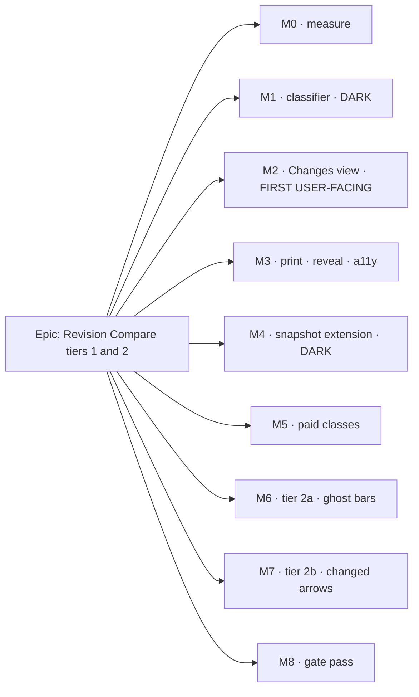

# Implementation Plan: Revision Compare — the change list and the change picture (tiers 1 and 2)

- **Feature spec:** [`./feature-spec.md`](./feature-spec.md) — **Draft, awaiting approval**
- **Falsification conditions:** [`./m0-condition.md`](./m0-condition.md) — committed in its own
  commit **before** any harness exists
- **Status:** Draft
- **Owner:** _(assigned on approval)_

> **Nothing in M1 onward starts before:** the spec is approved, CQ-1/CQ-2/CQ-3 are answered, the M0
> conditions are committed, and **ADR-0126 is accepted**. M4 additionally requires
> `database-architect`, unconditionally (`CLAUDE.md` §19.3). M6 additionally requires ADR-0127.

## Breakdown

### Epic

**Revision Compare — the change list and the change picture.** Answer "what did you change?" from the
product instead of from P6, and show a re-sequence on the surface that can show one. Roadmap theme:
`docs/BACKLOG.md`'s `M` **Revision Compare** entry — the two tiers it names as still unbuilt.

---

## Milestone 0 — Measure before designing anything

**Outcome:** three numbers that can withdraw or reshape work **before** it is built — in particular
before a migration exists.
**Ships dark:** nothing is reachable. M0 produces conditions, harnesses and verdicts only.
**Journey:** none. M0 builds no user-facing capability, so ADR-0081 §1's second branch applies and
this line says so explicitly rather than being absent.

---

#### Feature: The conditions and the three measurements

> **Description:** Commit the falsification conditions, then run them.
> **Complexity:** M
> **Dependencies:** spec approved; CQ-2 answered (it decides Condition A's subject).
> **Risks:** a condition written after the run is not a condition → M0-T1 is its **own commit**, and
> the verdict script **throws when it has nothing to judge** (ADR-0097's harness reported a PROCEED
> from an `undefined`).
> **Testing requirements:** the harnesses are scripts, not tests — absolute timings on a CI runner
> are noise (`paint.dates-budget.test.ts`'s recorded reasoning). Each prints the machine it ran on.

##### Task M0-T1 — Commit the conditions (≈ one PR, no code)

- **Description:** Land `m0-condition.md` alone.
- **Complexity:** S
- **Dependencies:** CQ-2 (Condition A's subject differs between "the difference" and "the full old
  picture").
- **Risks:** none.
- **Testing:** none — it is a document.
- **Development steps:**
  1. Land `m0-condition.md` with **no harness code in the same commit**.
  2. Record the commit SHA in the spec so a later reader can verify the ordering rather than trust it.

##### Task M0-T2 — Condition A: tier 2's paint cost

- **Description:** A Chromium bench, modelled on `apps/web/scripts/measure-link-routing.mjs`, that
  paints the compare overlay against a real 2D context over a sustained programmatic pan and reports
  dropped-frame percentage, interval p50/p95 and effective fps.
- **Complexity:** L
- **Dependencies:** M0-T1.
- **Risks:**
  - _Measuring the cull rather than the painter_ → ADR-0066 M4 records a generated plan spanning 28
    years so the "whole plan" zoom culled nine bars in ten and reported a beautiful, false 4.6 ms.
    **Non-vacuity is counted inside the viewport and printed first.**
  - _Headless software rasterisation_ → `--headed`, and the flag is the default for any quoted number.
  - _An unattributed cliff_ → ADR-0121 found a 20× discontinuity at nine stacked segments (#226) that
    no arithmetic predicted. **Sweep the changed-object count**, do not measure one point.
- **Testing:** the CI-safe half of the same question — is the extra work _bounded_ — is a
  counting-stub budget test added with M6/M7, the `paint.routing-budget.test.ts` pattern.
- **Development steps:**
  1. Extend the scale/grid scene builders with a synthetic changed-object set (parameterised count).
  2. Add rAF frame-pacing instrumentation; keep the existing wall-clock output as a secondary column
     so the run is comparable with #75's published table.
  3. Run paired baseline/treatment, alternating, ≥ 3 pairs, at 1646 and 1920, Week and Fit, both scenes.
  4. Sweep the changed-object count to look for a cliff.
  5. Write `m0-measurement.md`: verdict per condition, the baseline's own spread, the machine, and
     **what the measurement does not establish**.

##### Task M0-T3 — Condition B: the change list's server cost

- **Description:** End-to-end p95 over the real HTTP route at 2,000 activities.
- **Complexity:** M
- **Dependencies:** M1-T2 (there must be a route to measure) — so this task runs **after** M1's
  server half and its verdict is folded back into M0's measurement file.
- **Risks:** _a vacuous benchmark over two identical schedules_ → B2's non-vacuity, checked first.
- **Testing:** the harness is a script; its non-vacuity assertion is a real assertion.
- **Development steps:**
  1. Seed the scale plan; capture a baseline **through the public REST API** (the catalogue captures
     none — `docs/TEST_PLAYBOOK.md:196`).
  2. Mutate to produce ≥ 100 changed activities across ≥ 4 classes; verify the count from the response.
  3. Measure; record; fold the verdict into `m0-measurement.md`.

##### Task M0-T4 — Condition C: confirm the free/paid split against the database

- **Description:** Prove the eight free classes compute from existing columns, and prove the six paid
  ones do not — by attempting each, not by re-reading the schema.
- **Complexity:** S
- **Dependencies:** M0-T1.
- **Risks:** _agreeing with myself_ → the parallel `database-architect` answer is the independent
  second opinion. **If they disagree, the disagreement is the finding** and goes in the plan before
  any migration is written.
- **Testing:** this becomes the classifier's first unit fixture, so the throwaway work is zero.
- **Development steps:**
  1. Capture a baseline through the public REST API on `plan:fixture-p6-torture-v1`.
  2. For each of the fourteen classes, attempt the comparison and record the result or the missing column.
  3. Reconcile against `database-architect`'s answer; record any disagreement.

---

## Milestone 1 — The change classifier and its route

**Outcome:** the eight free change classes computable and served. **No migration.**
**Ships dark:** no UI reaches it. M2 surfaces it. _(ADR-0081 §1 — "the model landed" is not a claim
that the capability exists.)_
**Journey:** none yet — M1 is deliberately dark, and the journey lands with M2 as ADR-0081 §2 requires.

---

#### Feature: The pure classifier

> **Description:** One pure function over the two projections ADR-0125 already resolves, returning a
> total, per-class, verdict-carrying result.
> **Complexity:** L
> **Dependencies:** ADR-0126 accepted; M0-T4.
> **Risks:** the causal claim creeping back in → M1-T1 lands the widened gate **first**.
> **Testing requirements:** exhaustive unit (it is a pure function over two arrays); a totality test;
> three structural gates; API e2e.

##### Task M1-T1 — Make the two structural gates derived, BEFORE the module they must cover exists

- **Description:** `revision-delta-no-cause.structural.spec.ts:27` and
  `revision-delta-engine-free.structural.spec.ts:24` both hard-code `['revision-delta.ts']`. Derive
  each roster from the directory so a new sibling **cannot** land uncovered.
- **Complexity:** S
- **Dependencies:** none. **This is the first task of M1 and lands before any new module.**
- **Risks:** _a derived glob that matches nothing passes perfectly_ → keep each file's pinned
  non-empty assertion, and additionally assert the roster **contains** `revision-delta.ts`, so an
  over-narrow glob fails.
- **Testing:** verified red by adding a throwaway sibling containing `import { computeSchedule }` and
  a `cause:` field, and watching **both** gates fail; then deleted.
- **Development steps:**
  1. Replace both `SOURCES` constants with a `readdirSync` filter (`revision-*.ts`, excluding `*.spec.ts`).
  2. Widen the no-cause ban list with the vocabulary a change list specifically invites: `impact`,
     `contribution`, `drove`, `responsible`, `causedTheChange`.
  3. Verify red as above; record the throwaway file's content in the docblock so the red state is
     reproducible.

##### Task M1-T2 — `revision-changes.ts` and the shared side resolution

- **Description:** The pure classifier, plus extraction of `from`/`to` resolution so the two routes
  cannot disagree.
- **Complexity:** L
- **Dependencies:** M1-T1.
- **Risks:**
  - _Two spellings of "what does `from=X&to=live` mean"_ → extracted **once**; the extraction is a
    barrel-preserving move so ADR-0125's existing suites pass unchanged and act as the before/after
    oracle (ADR-0078's rule).
  - _A class silently omitted_ → totality test over the closed union, the ADR-0116 D3 pattern.
- **Testing:** unit per class including the boundary cases §2 names — added-and-re-dated reports
  `ADDED` only; removed excluded from value classes; summaries in structural classes and out of value
  classes; an activity changed in three classes counted once in `distinctActivitiesChanged`.
- **Development steps:**
  1. Extract side resolution from `schedule.service.ts`; run ADR-0125's suites unchanged as the oracle.
  2. Widen both repository projections by the free columns (`durationMinutes`, `lateStart/Finish`) —
     confirm **no additional query**, which is Condition C1.
  3. Write the classifier: per class, `COMPARED` with capped rows + true total, or `NOT_SNAPSHOTTED`
     with `missingSide`.
  4. Totality test; unit suite; **verify the no-cause gate covers the new file** (it should, from M1-T1).

##### Task M1-T3 — The route, the DTO and the OpenAPI

- **Description:** `GET …/schedule/revision-changes`, beside `revision-compare` in the same controller.
- **Complexity:** M
- **Dependencies:** M1-T2.
- **Risks:** _an undeclared-but-reachable status_ → a real defect (ADR-0053 M6, ADR-0116 M5). Declare
  every one, including the new 422 for an unknown `classes` member.
- **Testing:** API e2e — permissions (both codes asserted), cross-org and cross-plan **404 not 403**,
  the `SAME_REVISION` 422, the unknown-class 422, and **S2's non-mutation proof** (read every
  engine-owned column back and assert equality), verified red by persisting once deliberately.
- **Development steps:**
  1. Reuse ADR-0125's query DTO; add the optional repeatable `classes`.
  2. DTO + OpenAPI carrying the parity sentence and the honesty sentence verbatim from spec §4.5.
  3. Structured log line (plan, both side ids, per-class counts, duration).
  4. API e2e; run `scripts/e2e-local.sh api` locally — **CI is the second opinion, never the first**.
  5. Update `docs/API.md`; add a changeset.

---

## Milestone 2 — The Changes view · **FIRST USER-FACING MILESTONE**

**Outcome:** a planner reads what changed between two revisions, in the product.
**Entry point:** the **existing** `Analysis ▾ → Compare revisions…` dock, with a new segmented view
control inside the panel — accessible name **"Changes"**, beside the shipped **"Critical path"**.
No new deck stop, so **no width cost** on the surface eight consecutive epics have contradicted their
own width expectations about.
**Journey:** `apps/web/e2e-revision-compare/` (the config already exists —
`playwright.revision-compare.config.ts`) gains a step that opens the dock, selects a pair, presses
**Changes**, and asserts a class's rows and a `NOT_SNAPSHOTTED` sentence against a **real API**.
**This lands with M2, not at the gate pass** (ADR-0081 §2).

---

#### Feature: The Changes view in the existing dock

> **Description:** A second view over one shared pair selection — not a fifth dock (spec §4.4 D2).
> **Complexity:** L
> **Dependencies:** M1.
> **Risks:** the two views' pair selections diverging → there is **one** selection, held by the panel;
> the views are projections of it. Asserted by a test, not by care.
> **Testing requirements:** unit (both empty states distinct in visible copy **and** live region); a11y;
> the journey step above.

##### Task M2-T1 — The view control and the shared pair

- **Description:** Segmented `Critical path | Changes`, URL-backed per plan.
- **Complexity:** M
- **Dependencies:** M1-T3.
- **Risks:** _hand-rolling the control_ → reuse the existing primitive, or roving focus, naming and
  ADR-0082 reason wiring get rebuilt and one of them gets it wrong (ADR-0099 M5's finding, and
  ADR-0111's standing rule). _A view that does not survive a reload_ → URL state (ADR-0053 M6).
- **Testing:** a test asserting **one** pair selection object is read by both views (identity, not
  equality — ADR-0062's `gating.logic === gating.general` pattern).
- **Development steps:**
  1. Add the control; move `from`/`to` to the panel's single source.
  2. URL-back the view; **round-trip it through the real parser**, because ADR-0123 records
     `useUrlFilterState` deleting a param equal to `''` while the unit case that pinned the
     distinction passed throughout — the parser was right and the encoding could not survive the trip.

##### Task M2-T2 — `RevisionChangesView`

- **Description:** Per-class disclosure sections; rows as `old → new`; `NOT_SNAPSHOTTED` in place.
- **Complexity:** L
- **Dependencies:** M2-T1.
- **Risks:**
  - _A table that does not fit_ → the dock is 380–640 px (`use-revision-compare-panel-prefs.ts:26-28`).
    **A list, not a table**, and the min width is re-derived from this view's own widest fixed line
    rather than copied — the rule that file's own docblock states.
  - _Class counts being summed_ → `distinctActivitiesChanged` is displayed, from the server.
  - _A cap read from an array's length_ → both the cap and the true total come from the payload
    (ADR-0116 D4, and ADR-0125's M4 gate caught exactly this in the **live region**).
- **Testing:** unit for each state; **the two empty states kept distinct** ("no baselines captured" vs
  "nothing changed") in the visible copy **and** the live region (the ADR-0073 C1 lesson).
- **Development steps:**
  1. Sections from the design system (`SectionCard`); `NoticeStrip` for `NOT_SNAPSHOTTED`, not a
     bespoke div (ADR-0116 M5's finding).
  2. Icon **and** word per class — colour is never the sole channel (WCAG 1.4.1).
  3. Live region announcing the settled result count, and distinguishing the two empty states.

##### Task M2-T3 — The journey step

- **Description:** The first end-to-end drive of the real product.
- **Complexity:** M
- **Dependencies:** M2-T2.
- **Risks:** _locating the panel by its copy_ → use the `data-revision-compare-panel` hook the
  existing panel already carries and whose docblock records why it exists; **locate toolbar controls
  by `[data-toolbar-item]`, never by copy** (ADR-0091 M7's rule, after three journeys broke).
- **Testing:** it is the test.
- **Development steps:**
  1. Seed; capture a baseline through the public REST API; mutate to produce ≥ 2 classes of change.
  2. Open the dock, select the pair, press **Changes**, assert rows and one `NOT_SNAPSHOTTED` sentence.
  3. Run `scripts/e2e-local.sh web:revision-compare` locally before pushing.

---

## Milestone 3 — Print, reveal, and the accessible route

**Outcome:** the change list is a transmittal artefact, and every row leads somewhere.
**Entry point:** the panel's existing **Print** control, and activating a row.
**Journey:** the M2 step extends — activate a row and assert selection + reveal; assert a removed row
is **not** activatable and says why.

---

#### Feature: The artefact and the affordances

> **Complexity:** M
> **Dependencies:** M2.
> **Risks:** the printed document saying more than the screen → the asymmetry ADR-0116 D9 and
> ADR-0125 both record failing **in the same direction** (the person who was not in the room got more
> than the planner). A test asserts the `NOT_SNAPSHOTTED` sentences appear in **both**.
> **Testing requirements:** unit; the journey extension; a11y scan of the view in a **non-empty** state.

##### Task M3-T1 — Printed change list

- **Complexity:** M · **Dependencies:** M2-T2
- **Risks:** _the live theme leaking onto paper_ → resolve from `[data-surface="print"]` (ADR-0103),
  never `document.documentElement`.
- **Testing:** a test asserting full lists (no cap applied) with the cap stated **in words**, and that
  every `NOT_SNAPSHOTTED` class present on screen is present on paper.
- **Steps:** extend the existing `RevisionComparePrintDocument`; do not create a second one.

##### Task M3-T2 — Row activation and reveal

- **Complexity:** S · **Dependencies:** M2-T2
- **Risks:** _a control that does nothing_ → a removed row is **not activatable and says why**
  (ADR-0082). _The Gantt scrolling nowhere_ → selection alone reveals nothing there; use the ADR-0116
  reveal channel, which a reviewer found on the health epic.
- **Testing:** journey assertions for both branches.
- **Steps:** reuse the panel's existing reveal prop (`RevisionComparePanel.tsx:60`, "ONE prop for both
  views") rather than adding a second.

##### Task M3-T3 — Announce activation, and the a11y scan

- **Complexity:** S · **Dependencies:** M3-T2
- **Risks:** _silent activation_ → ADR-0125's gate pass found exactly this: focus stays on the row and
  the canvas is `aria-hidden`, so nothing tells a screen-reader user anything happened. The clause
  exists one file away and was the one line not copied.
- **Testing:** axe over the view in a state with **rows present** — ADR-0116's gate pass found a scan
  certifying only the all-PASS state no real plan shows.
- **Steps:** announce inside the focus frame; scope the axe include to a real selector (**not**
  Playwright's `:text-is()`, which is a selector-engine extension and makes axe throw — ADR-0125 M2's
  finding, and the reason `data-revision-compare-panel` exists).

---

## Milestone 4 — The revision snapshot extension

**Outcome:** a baseline captured from now on records its logic, constraints, calendar and WBS parent.
**Ships dark:** nothing reads the new columns until M5. Nothing is reachable and nothing changes for
any existing baseline — **permanently** (spec §0.5).
**Journey:** none. M4 is dark by design.
**Gated on:** CQ-1 = (a); M0-T2's verdict (§0.3 — a withdrawn tier 2b weakens part of this
milestone's justification and the product owner sees that before the migration is written);
**`database-architect`, mandatory and unconditional.**

---

#### Feature: `BaselineDependency` and four columns

> **Complexity:** L
> **Dependencies:** ADR-0126 accepted; **`database-architect` run** — and **re-run** if it returns
> nothing, fails or is slow. An unavailable agent is a reason to wait, never to proceed
> (`CLAUDE.md` §20). Deciding this change is too small to need it **is** the judgement the agent
> exists to make.
> **Risks:**
>
> - _A migration that succeeds on an empty table and fails on a populated one_ → ADR-0107's exact
>   defect: CI provisions a pristine container and goes green while the deployed host enters a
>   restart loop under `set -e`. **Every column is nullable with no default**, which makes this
>   structurally impossible, and the migration is tested against a **populated** database.
> - _A default that makes a claim_ → the null is a sentinel (`schema.prisma:1837-1846`). A constant
>   default is legal only when the value is TRUE of every pre-existing row, and none of these is.
> - _An unanswerable capability question_ → how does a reader tell "recorded no dependencies" from
>   "had none"? `Baseline.costSnapshotLevel`'s docblock (`:1802-1813`) answers this exact question for
>   costs and **warns explicitly against using a row count**. This is the agent's most important input.
>   **Testing requirements:** migration test against a populated database; capture-path unit + e2e;
>   `prisma:check-drift`; `pnpm check:counts` (the model and migration counts both move).

##### Task M4-T1 — Design the schema with `database-architect`

- **Complexity:** M · **Dependencies:** CQ-1, CQ-2 (`lane_index`), CQ-3 (`percent_complete`)
- **Risks:** proceeding without the agent → **do not**.
- **Testing:** none — it is a design task producing `m4-schema-design.md`.
- **Steps:** hand the agent spec §4.6's table **as the question, not the answer**, with the
  `costSnapshotLevel` discriminator problem stated explicitly; record the answer and any divergence
  from the sketch.

##### Task M4-T2 — Migration and capture path

- **Complexity:** L · **Dependencies:** M4-T1
- **Risks:** _the capture transaction growing unboundedly_ → dependencies are written by one batched
  `createMany` inside the transaction that already writes one row per activity, the
  `BaselineAssignment` pattern. _Prisma not chunking an `{ in: [...] }` list_ → ADR-0096's gate pass
  measured this throwing at 16,384 rows; the capture writes, it does not filter, but the **cascade**
  must be checked against the same limit.
- **Testing:** capture e2e asserting the new rows; a cascade test asserting `delete_batch_id`
  cohesion; a restore test.
- **Steps:** migration; repository projection; service; `docs/DATABASE.md`; `pnpm check:counts`.

---

## Milestone 5 — The paid change classes

**Outcome:** logic, constraint, calendar and WBS-parent changes appear in the change list.
**Entry point:** the **same** Changes view — the new classes appear where the `NOT_SNAPSHOTTED`
sentences were, for pairs captured after M4.
**Journey:** the M2 step extends with a logic change asserted end to end.

---

#### Feature: Four more classes through the same classifier

> **Complexity:** M
> **Dependencies:** M4; M1-T2 (the classifier and its totality test).
> **Risks:** the totality test having been written to the M1 vocabulary → it must **fail** when the
> union grows and pass only when every new class is handled. Verified red by adding a class and not
> handling it.
> **Testing requirements:** unit per class; a **pre-M4-baseline fixture** proving each still reports
> `NOT_SNAPSHOTTED` in place; journey extension.

##### Task M5-T1 — Logic diffing

- **Complexity:** M · **Dependencies:** M4-T2
- **Risks:** _an edge whose endpoints were both removed_ → reported once, under `REMOVED` logic, not
  three times. _An edge re-typed and re-lagged_ → one row naming both, not two rows.
- **Testing:** unit over an edge set with add / remove / retype / relag / endpoint-removed.
- **Steps:** extend the projection and the classifier; **no new query pattern** — the frozen edges load
  on the `(baseline_id, source_dependency_id)` index designed in M4-T1.

##### Task M5-T2 — Constraint, calendar and parent

- **Complexity:** S · **Dependencies:** M4-T2
- **Risks:** _a calendar id rendered as a UUID_ → resolve the name, and handle a calendar deleted since
  capture (the snapshot has no FK by design) as a stated "a calendar that no longer exists", never a raw id.
- **Testing:** unit including the deleted-calendar and deleted-parent branches.

---

## Milestone 6 — Tier 2a · the change picture, bars

> **Corrected after the fact — two instructions below are WRONG and are left in place rather than
> edited, because a plan whose stale text is quietly deleted teaches nothing.** See ADR-0127 D2 and
> D5.
>
> 1. **"cull by `visibleIds` **first**, as the ghost layer already does" (M6-T1) is wrong for this
>    layer.** It is right for the layer it was copied from — a baseline ghost always has a live bar
>    to sit behind — and `visibleIds` is derived from `scene.activities`, so REMOVED work is by
>    definition never in it. Following the instruction would have silently dropped exactly the rows
>    the overlay exists to show, on every plan where nothing had been deleted. The shipped layer
>    culls by `rectsIntersect` alone, and there is a test verified red against the `visibleIds`
>    version.
> 2. **The "reserved band below the scene" for removed work is obsolete.** It was designed for a
>    guessed lane; CQ-2b then froze `lane_index`, so the lane is RECORDED and there is nothing to
>    guess. Removed work is drawn where it was.
>
> Both were found by building, not by reading — which is the §19 rule applied to a plan rather than
> to a spec: working through a task list is evidence the tasks were done, not that they were right.

**Outcome:** the old revision's bars — **including removed work** — show behind the new, for the pair
the panel has selected.
**Entry point:** `View ▾ ▸ Overlays ▸ **Compare on diagram**`, default off, shaded with a reason when
no pair is selected (ADR-0082).
**Journey:** `e2e-revision-compare` gains a canvas step that turns the overlay on and asserts a
removed activity is present in the diagram region's accessible equivalent.
**Gated on:** ADR-0127 accepted; M0-T2's verdict.

---

#### Feature: The compare overlay

> **Complexity:** L
> **Dependencies:** M2 (the panel holds the result the overlay projects); ADR-0127.
> **Risks:**
>
> - _A second ghost builder_ → **generalise `buildBaselineGhosts`, do not duplicate it**
>   (`lenses.ts:371-390`). Two implementations of one picture drift, and the drift is invisible —
>   ADR-0065's `routeOrthogonal` argument and ADR-0121's `stackSeries` finding.
> - _Canvas tokens resolved from the wrong root_ → ADR-0102 found `resolveTsldPalette` had **never
>   once** used the canvas surface scope; ADR-0100 M4 found a pair absent from `@theme inline`
>   painting **no colour at all** in a real browser while the contrast gate stayed green. Both are
>   named tasks, not review findings.
> - _A guessed lane for removed work_ → a **reserved band below the scene**. A guessed position is a
>   false statement about where work was.
>   **Testing requirements:** unit for the ghost builder; a counting-stub budget test (the
>   `paint.routing-budget.test.ts` pattern); the golden-log re-baseline audited line by line against a
>   written list, **never taken with `-u`** (ADR-0106's practice); a11y; the journey step.

##### Task M6-T1 — Generalise the ghost builder and add the layer

- **Complexity:** L · **Dependencies:** M2-T2
- **Risks:** as above; plus _the existing caller changing behaviour_ → its suites pass unchanged, which
  is the acceptance condition (ADR-0062's extraction proof).
- **Testing:** unit; budget stub; golden log.
- **Steps:** generalise `buildBaselineGhosts` to take a pair-derived row set; add a `removed`
  treatment; add the layer painter taking the `PaintFrame` (ADR-0078 — a layer painter, not another
  branch in `paintScene`); cull by `visibleIds` **first**, as the ghost layer already does
  (`paint.ts:1164`).

##### Task M6-T2 — The toggle, and its two honest refusals

- **Complexity:** S · **Dependencies:** M6-T1
- **Risks:** _lit but inert_ → in the Gantt the toggle **reports itself inert** rather than appearing
  on and doing nothing (ADR-0059 M6's finding). _An overlay describing a pair nobody selected_ → it
  turns itself off and says so when the pair is cleared.
- **Testing:** unit for both refusals.

##### Task M6-T3 — The accessible equivalent, and the export decision

- **Complexity:** M · **Dependencies:** M6-T1
- **Risks:** _claiming an equivalent that does not exist_ → ADR-0122 found two places in this
  repository doing exactly that, each right about half its subject.
- **Testing:** a test asserting the removed-work list is inside the diagram region and **not**
  focusable; `role="list"`/`role="listitem"` asserted **by role, not by tag** (Tailwind Preflight's
  `list-style: none` drops the implicit roles in WebKit/VoiceOver — ADR-0122 D3).
- **Steps:**
  1. `compareClause`, a sibling of `baselineGhostClause` (`a11y.ts:143`), for changed activities.
  2. A non-focusable `sr-only` list of removed activities **inside** the diagram region (ADR-0122 D2 —
     a landmark-navigating reader lands inside the region and never passes a preceding sibling).
  3. **Classify the new scene keys** in `export/scene-parity.structural.test.ts` — composed into the
     export, or in `SCREEN_ONLY` **with a reason**. The gate is derived and will fail until somebody
     decides, which is it working (ADR-0103's #164 finding).
  4. Record real-AT observation as **owed, not done** — reasoned from specification (the ADR-0083 /
     ADR-0122 label).

---

## Milestone 7 — Tier 2b · changed arrows

> **Corrected after the fact.** The milestone shipped, and two things below did not survive contact.
>
> 1. **The gating clause reads "M0-T2's P1 and P2 both passing."** Neither passed and neither
>    failed: `m0-condition.md` records the environment as **disqualified**, because the baseline —
>    the shipped painter with no treatment — moved tenfold between two runs an hour apart with no
>    code change. The product owner decided on those numbers to ship default-off and let a headed
>    run on real hardware decide later. That run is owed and outside this epic.
> 2. **"a re-measurement against a real captured pair" (M7-T2) was NOT done**, and doing it here
>    would have been worse than not: this environment cannot produce a quotable number for any
>    pair, real or synthetic, so a run against a real one would have added a figure with the same
>    disqualification and more apparent authority. Recorded as owed rather than performed.

**Outcome:** a re-sequence is visible as a re-sequence. **The differentiating half.**
**Entry point:** the same **Compare on diagram** toggle — the arrows appear with the bars.
**Journey:** the M6 step asserts a changed link is drawn (via the layer's own counting hook, since a
link has no accessible object).
**Gated on:** M4 (the old edge set); **M0-T2's P1 and P2 both passing.** If either failed, this
milestone is narrowed or withdrawn per `m0-condition.md`, and **that decision is the product
owner's**.

---

#### Feature: Ghost and lit links

> **Complexity:** L
> **Dependencies:** M4, M5-T1, M6, M0-T2's verdict.
> **Risks:**
>
> - _A second router_ → the treatment is a **parameter of the existing `routeOrthogonal`**, never
>   `routeOrthogonalAvoiding`'s mistake one epic along (ADR-0065, spec §4.4 D7).
> - _Bundling snapping a corridor back through the bar it was moved off_ → ADR-0065 M3's rule; a ghost
>   corridor must obey it too.
> - _An accessible claim for links_ → **none is made.** Spec §4.8 states plainly that tier 1 is the
>   route for logic changes, and the toggle's own description says so.
>   **Testing requirements:** unit; the budget stub extended; a re-measurement against a **real captured
>   pair** (M0-T2's synthetic set is acknowledged as synthetic in its own condition file).

##### Task M7-T1 — Draw the changed links

- **Complexity:** L · **Dependencies:** M6-T1, M5-T1
- **Testing:** unit over add / remove / retype / relag; budget stub; golden log audited by hand.

##### Task M7-T2 — Re-measure against a real pair

- **Complexity:** M · **Dependencies:** M7-T1
- **Risks:** _a clustered real change set defeating the cull differently from a spread synthetic one_ →
  this is the owed run `m0-condition.md` names, not an optional extra.
- **Testing:** the harness; the verdict appended to `m0-measurement.md`.

---

## Milestone 8 — The gate pass

**Outcome:** the deferred specialist reviews run over the **combined** diff and every blocking finding
is folded with a regression test **verified red first**.
**Entry point:** none — this milestone changes no capability.
**Journey:** the full `e2e-revision-compare` suite plus `scripts/e2e-sweep.sh`, because **a label or
layout change means running every journey**, not the one CI named (ADR-0091 M7's rule, written after
three journeys broke one at a time).

---

#### Feature: Six specialists over the combined diff

> **Complexity:** L
> **Dependencies:** every preceding milestone.
> **Risks:** _a pass with no findings_ → **that is a reason to check the reviews ran.** Nine
> consecutive epics here have had blocking defects at this stage that passed a human read; ADR-0125's
> plan said this in advance and it happened again.
> **Testing requirements:** every fix carries a regression test verified red against the specific
> defect it names.

##### Task M8-T1 — Reviews

- **Complexity:** L · **Dependencies:** M7
- **Steps:** `security-reviewer`, `api-reviewer`, `backend-performance-reviewer`,
  `component-reviewer`, `accessibility-reviewer`, `ux-reviewer` over the combined diff. Non-blocking
  findings become a `docs/TECH_DEBT.md` row with reasons, not a promise.

##### Task M8-T2 — ADRs, register, docs

- **Complexity:** M · **Dependencies:** M8-T1
- **Steps:** file ADR-0126 and ADR-0127 (**re-check the numbers at filing time and record a collision
  rather than routing around it** — the ADR-0071 lesson); `docs/adr/README.md` (gated both directions
  since ADR-0110 D6); `CLAUDE.md` §16 and §1; `pnpm check:counts`; `docs/BACKLOG.md`;
  `docs/TEST_PLAYBOOK.md` (`pnpm check:playbook`); `docs/API.md`; `#75` gains a data point.

---

## Sequencing & slices

| Slice  | Ships                     | Reachable?                                            | Schema  | Rollback contract            |
| ------ | ------------------------- | ----------------------------------------------------- | ------- | ---------------------------- |
| **M0** | measurements + conditions | no — measurement only                                 | none    | n/a (documents + scripts)    |
| **M1** | classifier + route        | **no — dark by design**                               | none    | revert                       |
| **M2** | **Changes view**          | **YES — `Analysis ▾ → Compare revisions… → Changes`** | none    | revert (one commit boundary) |
| **M3** | print · reveal · a11y     | yes                                                   | none    | revert                       |
| **M4** | snapshot extension        | **no — dark by design**                               | **YES** | **forward-only** — see below |
| **M5** | paid classes              | yes                                                   | none    | revert                       |
| **M6** | tier 2a ghost bars        | yes (`View ▾ ▸ Overlays`)                             | none    | revert                       |
| **M7** | tier 2b changed arrows    | yes (same toggle)                                     | none    | revert                       |
| **M8** | gate pass                 | n/a                                                   | none    | n/a                          |

**No `VITE_` flag** (ADR-0088 D1 — a `VITE_` constant is inlined at build time,
`docker-publish.yml` passes no `VITE_` build args, and `.dockerignore` strips `**/.env` from the build
context, so it has never been an operator rollback). **The rollback contract is the commit boundary**,
which is why every slice above is independently revertible.

**M4 is the exception and it is stated rather than implied.** A migration is not revertible in the
same sense: it applies to a real database and is checksummed the moment it lands, so correcting it
costs a **second migration in every environment** (`CLAUDE.md` §19.3). That is the reason M4 sits
behind `database-architect`, behind M0's verdict, and behind an accepted ADR — and the reason M1–M3
deliberately ship first with none.

**`main` stays releasable at every slice.** M1 and M4 ship dark; every other slice is a complete
user-facing increment.

## Definition of Done (per task)

Each task's PR must satisfy the Feature Completion Criteria in
[`docs/PROCESS.md`](../../PROCESS.md) — code, tests, docs, security, performance, accessibility,
Docker build, CI, changelog, version impact.

Two of those are called out because this repository records them being skipped:

- **The pre-push gate is `pnpm prepush` — one command.** Running its parts by hand is how a gate gets
  missed; `scripts/prepush.sh` derives them so nobody keeps a list in their head. Plus
  `scripts/e2e-local.sh api` for any `apps/api` change and
  `scripts/e2e-local.sh web:revision-compare` for any journey change. **CI is the second opinion,
  never the first.**
- **A relayed check-suite event is not proof CI passed.** Read the check runs for the PR's **current
  head** and confirm every one is `completed` / `success`.

## Risks & assumptions (rollup)

| Risk / assumption                                                                                | Likelihood               | Impact   | Mitigation                                                                                                                      |
| ------------------------------------------------------------------------------------------------ | ------------------------ | -------- | ------------------------------------------------------------------------------------------------------------------------------- |
| **The change list invites the causal claim ADR-0125 refused**                                    | **high**                 | **high** | The widened gate lands **first** (M1-T1); ordering is structural, never by magnitude; the honesty footer covers both views      |
| Tier 2's paint cost breaches the frame budget                                                    | med                      | med      | §0.4's condition, committed first; the design paints the **difference**, so cost scales with the change; three named narrowings |
| **M4 delivers nothing for any baseline that exists today, permanently**                          | **certain**              | **high** | **CQ-1 states it plainly rather than letting it be discovered.** M1–M3 ship first so the epic is useful regardless              |
| The two structural gates silently fail to cover the new module                                   | **certain if not fixed** | high     | M1-T1 derives both rosters, verified red, **before** the module exists (V11)                                                    |
| A migration that passes on a pristine CI database and fails on the deployed one                  | low                      | **high** | Every column nullable with no default; tested against a **populated** database (ADR-0107's exact defect)                        |
| Two spellings of "what does `from=X&to=live` mean"                                               | med                      | med      | Extracted once; ADR-0125's suites pass unchanged as the oracle                                                                  |
| A canvas token resolved from the page root, painting nothing while the contrast gate stays green | med                      | med      | Named as a task (M6), not left to a review — ADR-0102 and ADR-0100 M4 both record this exact failure                            |
| The new scene keys never reach the export                                                        | low                      | med      | `scene-parity.structural.test.ts` is derived and **fails until somebody decides** (V12)                                         |
| A gate pass with no findings                                                                     | low                      | med      | Treated as a reason to check the reviews ran, not as a result (nine consecutive epics)                                          |
| Progress drowning the change list                                                                | med                      | med      | **CQ-3.** The recommended answer (opt-in class) removes the risk entirely                                                       |
| The `database-architect` agent is slow or returns nothing                                        | med                      | **high** | **Re-run it.** An unavailable agent is a reason to wait, never to proceed (`CLAUDE.md` §20) — the failure ADR-0086 records      |
