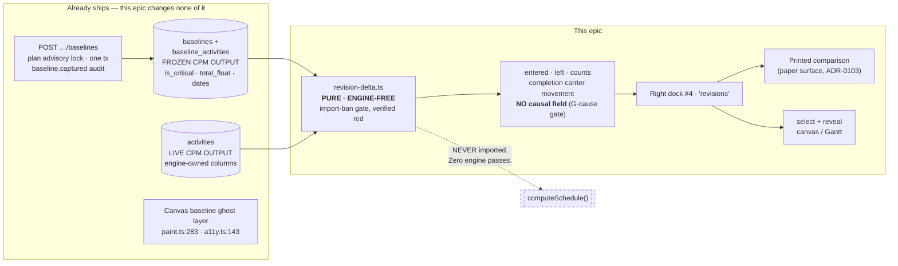
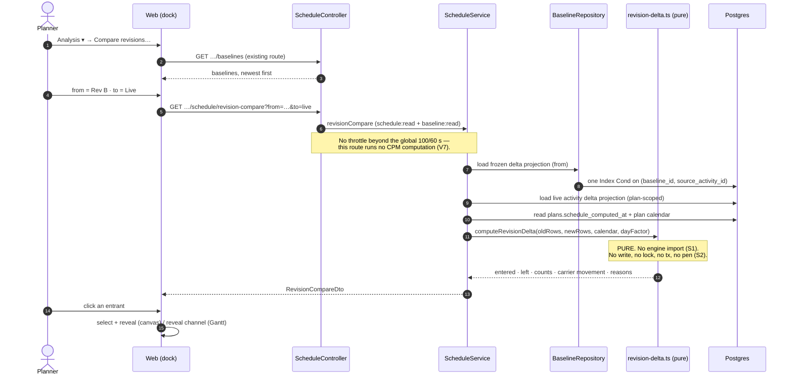
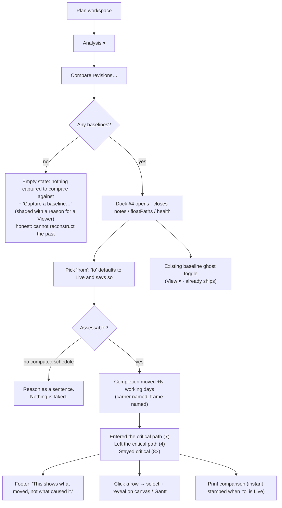

# Feature Spec: Revision Compare — the critical-path delta

- **Status:** **Draft — awaiting the product owner's approval.** Three critical questions in §6;
  everything else has a stated default and is not blocking.
- **Author(s):** feature-analyst (Product Owner / Solution Architect / Technical Lead hats)
- **Date:** 2026-09-03
- **Tracking issue / epic:** _(to be opened on approval)_
- **Roadmap link:** [`docs/ROADMAP.md`](../../ROADMAP.md) → "Next → Product features"; parked entry in
  [`docs/BACKLOG.md`](../../BACKLOG.md)
- **Supersedes:** [`docs/specs/revision-compare/feature-spec.md`](../revision-compare/feature-spec.md)
  and its plan. This is a **new spec, not an amendment** — fallback (b) changes what the feature
  _is_.
- **Related ADR(s):** **ADR-0125 (to be written — required before any code).** Builds on ADR-0025
  (the baseline snapshot-copy model), ADR-0041 (levelling is additive; the network float stays
  authoritative), ADR-0068 (the frozen hours-per-day factor), ADR-0072/0073 (audit), ADR-0081
  (a milestone names its entry point), ADR-0088 (no `VITE_` flag), ADR-0093 (an object action
  belongs on the object; do not duplicate a capability), **ADR-0116 (the closest precedent in every
  respect — a pure read model, `schedule:read`, no lock, no transaction, no pen)**, ADR-0103
  (the printed document is a surface).

> **Number check.** ADR-0125 is the next free number as of 2026-09-03 —
> `ls docs/adr/012*.md` returns 0120–0124 and nothing higher. **Re-check at filing time and record
> a collision rather than routing around it** (the ADR-0071 lesson; ADR-0079 was filed one number
> along from the number its own plan named).

---

## 0. What was verified before this spec was written

`CLAUDE.md` §19.11 requires a decision-bearing claim to name what was run or read to establish it,
and requires **a claim inherited from the brief to be checked like any other**. Fifteen were checked.
**Four came back differently from how the brief or the superseded spec stated them, and every one of
the four makes the epic smaller.**

| #   | Claim                                                                                                           | Verified against                                                                                                                                                                                                             | Verdict                                                                                                                              |
| --- | --------------------------------------------------------------------------------------------------------------- | ---------------------------------------------------------------------------------------------------------------------------------------------------------------------------------------------------------------------------- | ------------------------------------------------------------------------------------------------------------------------------------ |
| V1  | `completion-carrier.ts` exists and its rules are importable                                                     | `apps/api/src/modules/schedule/completion-carrier.ts:26-34` (`PERTURBABLE_TYPES`), `:53-64` (`selectCompletionCarrier`), `:81-93` (`measureCarrierMovementDays`)                                                             | **Correct** — reuse by import, per the brief                                                                                         |
| V2  | A baseline freezes only an activity's dates (superseded spec §1: "2 of 20 engine fields")                       | `apps/api/prisma/schema.prisma:1833-1838`                                                                                                                                                                                    | **Correct about ENGINE INPUTS and beside the point for this design** — see §0.1. It also freezes `isCritical`, `totalFloat`, `late*` |
| V3  | Those columns are actually populated at capture                                                                 | `apps/api/src/modules/baselines/baseline.repository.ts:128-133` writes them from the `select` at `:184-189`                                                                                                                  | **Correct** — not a reserved column, a written one                                                                                   |
| V4  | Nothing in the product reports criticality movement today                                                       | `apps/api/src/modules/baselines/variance.ts:7-14` — `VarianceBaselineRow` projects `baselineStart`, `baselineFinish`, `totalFloat` and **omits `isCritical` and `type`**                                                     | **Correct, and it is a projection gap, not a data gap**                                                                              |
| V5  | `capturedProjectFinish` is the completion carrier                                                               | `apps/api/src/modules/baselines/baselines.service.ts:437-445` — `latestFinish` is the **max over all rows including `WBS_SUMMARY`**                                                                                          | **FALSE.** The carrier must be re-derived from the snapshot's frozen `type`; see §4.4 D3                                             |
| V6  | New permission codes are needed (`revision:read` etc., superseded spec §2)                                      | `apps/api/src/common/auth/org-permissions.ts:178` — `baseline:read` is inside `HIERARCHY_READ`, i.e. **every member**; `baseline:create` is Planner + Org Admin (`:96`)                                                      | **FALSE — no new permission code is needed**                                                                                         |
| V7  | A persisted-read analysis needs its own throttle                                                                | `apps/api/src/modules/schedule/schedule.controller.ts:191-199` — health-check explicitly shares the global 100/60 s "because it runs no CPM computation", against `:143` `FLOAT_PATHS_THROTTLE` which recomputes             | **No tighter throttle is warranted**; see §4.5                                                                                       |
| V8  | The diagram ghost layer must be built (superseded spec US-3 / §4.8)                                             | It **already ships**: `apps/web/src/features/tsld/render/paint.ts:283` (`baselineGhosts`), `:1170-1175`; spoken twin `render/a11y.ts:143` `baselineGhostClause`; fed at `components/TsldPanel.tsx:1157-1182`                 | **FALSE — already built.** See §0.1                                                                                                  |
| V9  | The `Analysis ▾` menu is the entry point and already holds siblings                                             | `apps/web/src/features/tsld/toolbar/tsld-toolbar-items.tsx:1328` (`Baselines…`), `:1347` (`Health check…`)                                                                                                                   | **Correct** — no new deck stop, so no width cost                                                                                     |
| V10 | A fourth right dock costs one name plus a deliberate test edit                                                  | `apps/web/src/components/layout/workspace/right-docks.ts:12` — `RIGHT_DOCKS = ['notes','floatPaths','health']`, closures derived from the set                                                                                | **Correct**                                                                                                                          |
| V11 | The criticality **rule** is recoverable for the old side                                                        | `Baseline` (`schema.prisma:1735-1803`) freezes no criticality setting. The live plan holds `criticalPathDefinition` (`:681`), `criticalFloatThresholdMinutes` (`:699`), `makeOpenEndsCritical` (`:711`)                      | **FALSE — not recoverable.** The single largest honesty question; **CQ-1**                                                           |
| V12 | The carrier's **own** calendar is the right measurement frame here                                              | `completion-carrier.ts:76-79` says so — for _attribution_, the withdrawn design. `BaselineActivity` has **no `calendarId`** (`schema.prisma:1812-1892`), so it is not recoverable from a snapshot                            | **Stale rule; corrected in §4.4 D4 and in that file**                                                                                |
| V13 | Levelling breaks the snapshot's fidelity (superseded spec §4.4 Q9 — "the finding that most changes the schema") | `schedule.service.ts:281-297` — levelling replaces `results`, but per ADR-0041 Q2 and `schema.prisma:1126` the leveled positions are **additive columns**; `early*`/`late*`/`total_float`/`is_critical` are never recomputed | **Does not apply to this design.** See §0.1                                                                                          |
| V14 | The seed catalogue has a baseline to compare against                                                            | `docs/TEST_PLAYBOOK.md:196` — "the catalogue captures no baselines (verified)"                                                                                                                                               | **FALSE.** The harness and the journey must capture one through the public REST API, as health M6 did (`:198`)                       |
| V15 | The design costs **two engine passes** (the brief's constraint)                                                 | Both sides are persisted CPM output — see §0.2                                                                                                                                                                               | **The brief understates the win: it is ZERO.** See §0.2                                                                              |

### 0.1 What the M0 failure removed from scope

[`m0-measurement.md`](../revision-compare/m0-measurement.md) withdrew the ranked, summing
attribution: **C2 failed** (the same change is attributed 30, 18, 2 or 0 working days depending only
on its position in the replay; max share spread 12.9 pp against a 10 pp bar; the top-three rank order
was unstable across all six permutations) and **C3-b failed** (seven passes at 2,058 activities =
2,793 ms, 93 % of the whole 3.0 s end-to-end budget before HTTP). C1 and C4 passed, so the failure is
not vacuous. On 2026-09-03 the product owner chose fallback **(b), the critical-path delta only**.

The precise shape of C2's failure decides what this feature may and may not say: **the sum is
order-free and stable at 139 d in every permutation; the decomposition is not.** So the epic can tell
a planner _how much_ the completion moved, and cannot tell them _which change did it_.

**Removed from scope by the M0 failure — deleted, not deferred:**

| Removed                                                                                                                           | Why it is gone                                                                                                                                                                                                                                                                                                                                                                                             |
| --------------------------------------------------------------------------------------------------------------------------------- | ---------------------------------------------------------------------------------------------------------------------------------------------------------------------------------------------------------------------------------------------------------------------------------------------------------------------------------------------------------------------------------------------------------- |
| **The ranked per-class attribution and the Interaction residual** (superseded US-4, §4.7)                                         | C2. A ranking that changes with an ordering no planner supplied is not a ranking.                                                                                                                                                                                                                                                                                                                          |
| **The eight-class change vocabulary** (`SCOPE`, `DURATION`, `LOGIC`, `BOUNDS`, `CALENDAR`, `PROGRESS`, `PLAN_OPTION`, `RESOURCE`) | **This is the largest simplification the decision buys.** It cost a product-owner scope decision and a whole settled-in-place derivation (11 named → 10 → 9 → 10 → 8) in the superseded spec. The delta derives everything from `isCritical` and `totalFloat` on two snapshots and **never classifies a change at all**. Nothing downstream needs it: not the API, not the DTO, not the panel, not a test. |
| **Incremental replay, the fixed class order, and every engine pass**                                                              | C3-b, and then rendered moot entirely by §0.2.                                                                                                                                                                                                                                                                                                                                                             |
| **A snapshot of `computeSchedule`'s entire input surface** (superseded §4.4 Q1–Q12, 12 open architecture questions)               | A replay needed every input including the ones that did not change. Nothing replays, so nothing needs them. **The 20 per-activity engine fields, the 6 per-edge fields, the 10 plan scalars, the frozen working-time definition, `EngineAssignment[]`, `EngineResource[]`, `laneIndex` and the immutability-enforcement question all go with it.**                                                         |
| **The resource-levelling freeze** (superseded Decision 2, "materially larger schema")                                             | V13. Levelling writes **additive** columns; the persisted `early*`/`late*`/`total_float`/`is_critical` are the pure network values on a levelled plan and on an unlevelled one alike. The delta reads only those, so it is levelling-invariant by construction. Stated as a user-facing caveat in §2 rather than paid for in schema.                                                                       |
| **The `?include=cost` projection and CQ-3's role-invariance question**                                                            | The response carries dates, floats and criticality. There is no cost-shaped field to gate, so no G4-style gate is needed — the invariance is structural rather than defended.                                                                                                                                                                                                                              |
| **The cross-plan / `planId:revisionId` composite key and CQ-2's identity fork**                                                   | The correlation key is `source_activity_id` within one plan, which already exists and already works. Cross-plan comparison is not in this epic and its door is not closed (§6 default).                                                                                                                                                                                                                    |
| **The throttle derived from an attribution measurement (ER-6)**                                                                   | V7 — a persisted read shares the global budget.                                                                                                                                                                                                                                                                                                                                                            |

**Removed because it already exists (V8) — the second-largest deletion, and it is not an M0
consequence:** the superseded spec's **Tier 2 ghost layer** (US-3 and its `§4.8` painter row) was
specified as new work — a new pure layer painter, a `View ▾` structure switch, a counting-stub
ghost-off parity gate and a token pair. All of it ships today: `paint.ts:283` takes
`baselineGhosts?: readonly GhostBar[]` and draws them at `:1170-1175`, `a11y.ts:143`
`baselineGhostClause` is its spoken twin (WCAG 1.4.1), `TsldLegend.tsx:142` gives it a legend entry
and `tsld-toolbar-items.tsx:242-271` gives it a toggle that shades with the reason
`No active baseline`. It is fed from the **active** baseline's variance rows
(`TsldPanel.tsx:1157-1182`). Building a second one would be ADR-0121's `stackSeries` finding in a
new costume — two implementations of one picture that drift invisibly.

### 0.2 The correction that decides the design: **zero engine passes, not two**

The brief states, as a hard constraint: _"Two engine passes, not seven. This is the only shape that
clears C3-b."_ It asks for the cost claim to be verified rather than asserted. Verified, it is
**zero**, and the reason is worth stating because it is what makes this epic small.

The "two passes" figure is correct **for the design the superseded spec described**, in which a
Revision freezes `computeSchedule`'s _inputs_ and the old side must therefore be **replayed** to
produce dates, floats and criticality (that spec's §4.4 Q4 left "freeze the output as well?" open).
This design does not freeze inputs. **A `Baseline` already freezes the computed OUTPUT** — the exact
five quantities the delta reads:

| The delta needs, per activity | Old side (`baseline_activities`)                                | New side (`activities`)                       |
| ----------------------------- | --------------------------------------------------------------- | --------------------------------------------- |
| Critical membership           | `is_critical` (`schema.prisma:1838`)                            | `is_critical` (`:1050`)                       |
| Total float                   | `total_float` (`:1837`)                                         | `total_float` (`:1036`)                       |
| Early dates                   | `baseline_start` / `baseline_finish` (`:1833-1834`)             | `early_start` / `early_finish` (`:1032-1033`) |
| Late dates                    | `late_start` / `late_finish` (`:1835-1836`)                     | `late_start` / `late_finish` (`:1034-1035`)   |
| Type (to exclude summaries)   | `type` (`:1826`)                                                | `type`                                        |
| Identity + label              | `source_activity_id`, `code`, `name` (`:1821`, `:1824-1825`)    | `id`, `code`, `name`                          |
| Day↔minute factor             | `baselines.hours_per_day_minutes` (`:1760`, frozen ADR-0068 §5) | live plan calendar                            |

Both sides are already computed and already persisted. **`computeSchedule` is not called, not
imported, and not reachable from this feature's module graph.** That is stronger than "two passes":
it is ADR-0116 D1's sentence verbatim rather than its weaker D7 sibling, and it makes C3-b's failure
mode structurally unreachable rather than merely affordable.

**The consequence for the biggest open question the brief names** — is a new capture entity
required? **No.** ADR-0025's baseline is the snapshot this design needs, and reusing it deletes the
entire M1 of the superseded plan: no model, no migration, no index question, no storage measurement,
no immutability-enforcement decision, no cascade design, no retention decision, no new audit action,
and **no `database-architect` engagement — because there is nothing to design, not because a change
was judged too small** (the honest form ADR-0116 D6 uses). That is the strongest possible reading of
`CLAUDE.md` §19.4, "prefer the smallest change that fully solves the task", and of ADR-0057's "reuse
before inventing".

**CQ-1 is the one thing that could reopen it.** If the product owner wants the criticality _rule_
frozen so a definition change can be detected rather than silently reported as movement, that is
three constant-defaulted scalars on `baselines` — additive, metadata-only, no rewrite — and it makes
`database-architect` **mandatory and unconditional** (`CLAUDE.md` §19.3, §20). Nothing else in this
spec touches the schema.

### 0.3 Two live findings recorded rather than stepped over

Neither is this epic's to fix; both are recorded because noticing drift and stepping over it leaves
the register exactly as wrong as not noticing (the ADR-0071 lesson).

1. **`completion-carrier.ts:76-79` documents a rule for a design that no longer exists.** It states
   that "Revision-compare attribution perturbs a whole change CLASS … so it measures on the
   **carrier's** own calendar," and calls that "a NEW rule rather than an inherited one". Attribution
   was withdrawn on 2026-09-03, and `BaselineActivity` carries no `calendarId`, so the rule is both
   moot and unimplementable in the surviving design. **This epic corrects that paragraph in place**
   (§4.4 D4) rather than leaving a docblock that reads as authoritative guidance for its next caller.
2. **A frozen baseline's reported variance moves when somebody edits the working week.** ADR-0068 §5
   froze `hours_per_day_minutes` into the baseline precisely so a calendar edit could not
   retroactively change what a snapshot reports — but `computeVariance`'s working-time port is built
   from the **live** calendar (`baselines.service.ts:352`, `resolveCalendar(organization.id,
plan.calendarId)`), and `variance.ts:54` calls `calendar.workingTimeBetween(...)` on it. So the
   factor is frozen and the working week is not. _Marked as **reasoned from the code path, not
   observed**_ (the ADR-0083 convention): it follows from those two lines, and no test was run
   against a mutated calendar to confirm the arithmetic moves. This spec **adopts the same
   behaviour** rather than diverging (§4.4 D4) — two numbers on one screen derived on two different
   calendars would be a worse defect than the one being inherited — and files the underlying
   question separately.

---

## 1. Business understanding

### Problem

A planner is asked, constantly and by people who do not use the tool: **"what changed since last
month, and why is the job three weeks later?"**

SchedulePoint can already answer part of the first half. `GET …/baselines/variance` reports, per
activity, whether it is later than it was, and the canvas draws the old bars as ghosts beneath the
new ones (V8). What it cannot say is the thing a planner is actually asked about in a progress
meeting: **which work is now driving the job, and which work stopped driving it.**

That is a different question from variance, and the difference is not cosmetic. An activity can slip
five days and matter to nobody because it had thirty days of float. An activity can slip one day and
move the completion date because it just became critical. Variance ranks by _lateness_; the meeting
is about _criticality_. Today a planner answering "what's driving it now, and what was driving it
before?" has to hold two schedules in their head, or export both to P6.

**The honest limit, stated first because it is the whole shape of this feature.** M0 measured whether
the product could go one step further and say _which change_ caused the movement, and the answer was
no (§0.1). So this feature reports **what moved**, never **what caused it**. That constraint is not a
disappointment to be worked around; it is the specification. Everything below is designed so that a
number implying causation cannot be rendered, because there is no such number in the payload.

**Why now.** Three reasons, in order:

1. The product owner chose fallback (b) on 2026-09-03 with the measured numbers in front of them.
2. The mechanism is not hypothetical and not new: both sides are already computed, already
   persisted, and the ghost layer that shows the movement on the diagram already ships (§0.2, V8).
3. The remaining work is **the smallest slice this epic ever had** — one read model, one panel, one
   menu item — because everything expensive in the superseded design either failed measurement or
   turned out to exist.

### Users

All organisation-scoped, ADR-0012 / ADR-0016 roles. **No new permission code** (V6).

| Role                          | Need                                                                                                                                                                           | Gate                        |
| ----------------------------- | ------------------------------------------------------------------------------------------------------------------------------------------------------------------------------ | --------------------------- |
| **Planner**                   | Before a review: what is driving the job now that was not driving it at Rev B, and how far has the finish moved. Capture the baseline that makes the next comparison possible. | `baseline:read` / `:create` |
| **Org Admin**                 | The same, plus governance: which baselines exist and who captured them (already audited, `baseline.captured`).                                                                 | same                        |
| **Contributor**               | Read the comparison. A progress report they filed may be what moved the path; being able to see that is a read.                                                                | `baseline:read`             |
| **Viewer**                    | Read the comparison. **This is the reporting audience** — the person the planner is preparing the answer _for_.                                                                | `baseline:read`             |
| **External Guest** (ADR-0051) | **Out of scope.** The guest scope is a fixed read-only `SCHEDULE_READ`. Widening it is its own decision and is not made here.                                                  | —                           |

### Primary use cases

1. **Compare a captured baseline against the live plan** and see which activities entered the
   critical path, which left it, and how far the completion moved.
2. **Compare two captured baselines** — the handover case, because both sides are frozen, so the
   same URL renders the same document tomorrow.
3. **Act on a result**: click an activity that entered the path and have the canvas (or the Gantt)
   select and reveal it.
4. **Print the comparison** as the artefact somebody who does not use the tool can read.

### User journeys

**Happy path.** A planner has a Rev C review on Friday. On Monday they open the plan,
`Analysis ▾ → Compare revisions…`, and pick `Rev B (2026-08-24)` against **Live**. The dock says:
completion moved **+19 working days**; **7 activities entered the critical path**, **4 left it**, 83
stayed. The entered list names them with their float before and after. They switch the existing
baseline ghost on and see the old bars beneath the new. They click the top entrant; the canvas
selects and reveals it. They print the comparison.

Nowhere does the product say _why_. The panel's footer says so in a planner's words: **"This shows
what moved, not what caused it."**

**Alternate — no baseline exists.** The catalogue's own resting state (V14) and the commonest first
contact. The dock's empty state says there is nothing captured to compare against, and offers
**Capture a baseline…**, which opens the existing Baselines surface. It is honest about what that
does: a first capture makes future comparisons possible and cannot reconstruct the past.

**Alternate — the plan has never been calculated.** `PLAN_NOT_SCHEDULED` — the seed catalogue's own
resting state (ADR-0116 M0-T1), not an edge case. The comparison reports it as a typed reason with a
200, never a 4xx.

**Alternate — the old side's carrier no longer exists.** The activity that finished last at Rev B was
deleted. The completion movement is reported as not assessable with `CARRIER_REMOVED`, and the
criticality delta — which does not depend on the carrier — is still shown. A partial answer is
reported as a partial answer.

### Expected outcomes

- A planner answers "what's driving it now that wasn't before" in seconds, from the product, on the
  surface this product exists to be.
- The completion movement is one number with a stated frame, rather than two dates a reader has to
  subtract on a working-day calendar in their head.
- The comparison between two captured baselines is a **handover artefact**: one URL, one printed
  document, identical for every role (structurally — there is no role-varying field in it).

### Success criteria

| #   | Criterion                                                                                                          | Measured how                                                                                                                                                                                                   |
| --- | ------------------------------------------------------------------------------------------------------------------ | -------------------------------------------------------------------------------------------------------------------------------------------------------------------------------------------------------------- |
| S1  | The comparison is **provably engine-free**                                                                         | An import-ban structural test on the delta module, **verified red first**, modelled on `health-engine-free.structural.spec.ts:26-53` including its pinned non-zero-files case (`:32-37`)                       |
| S2  | The delta **persists nothing**                                                                                     | A non-mutation API e2e reading every engine-owned column back after the call and asserting equality — the ADR-0116 M6 proof, verified red by persisting once deliberately                                      |
| S3  | The delta computed from persisted columns **agrees with the schedule** it claims to describe                       | M0-T2's fidelity check (§4.7 F1), against the seeded fixture with a baseline captured through the public REST API                                                                                              |
| S4  | The carrier derived from **date-only** persisted columns agrees with `selectCompletionCarrier` over engine results | M0-T2's carrier check (§4.7 F2) — the one place this design's cheaper input could disagree with the shipped rule                                                                                               |
| S5  | Cost at 2,000 activities                                                                                           | ≤ **250 ms p95** end-to-end over the real route (§4.7 F3). A persisted read of two indexed sets; ADR-0116 measured its four loads sub-1 ms at the same scale                                                   |
| S6  | A planner reaches it from the diagram and from the Gantt                                                           | Journey `apps/web/e2e-revision-compare/`, landing with **M2** — the first user-facing milestone, not enablement (ADR-0081 §2)                                                                                  |
| S7  | No number implying causation exists in the payload                                                                 | A structural gate over the DTO and the delta sources rejecting `cause`/`attribut`/`because`/`blame`/`contribution`-shaped field names — the ADR-0116 G4 pattern, comment-stripped, with a pinned positive case |

### Open questions

**CQ-1 … CQ-3** in §6. Everything else has a stated default above and is not blocking. The product
owner has already answered four questions on this epic and chosen a fallback; the list is
deliberately short.

---

## 2. Functional requirements

### User stories & acceptance criteria

> **US-1** — As **any member**, I want to see which activities entered and left the critical path
> between two points, so that I can say what is driving the job now.
>
> - **Given** a plan with a captured baseline and a computed live schedule, **when** I compare
>   `from = <baseline>` to `to = live`, **then** I get `entered[]` (critical now, not then),
>   `left[]` (critical then, not now), and counts for `remainedCritical` / `remainedNonCritical`,
>   with the four sets **totalling the union of both sides' activities** — a totality asserted in a
>   test, not left to four evaluators (the ADR-0116 D3 rule).
> - **Given** an activity in `entered[]`, **then** it carries its `code`, `name`, its total float on
>   each side in **working days**, and its early start/finish on each side — so the reader can see
>   _how far_ it moved without a second request.
> - **Given** an activity present on only one side, **then** it is reported as `ADDED` or `REMOVED`
>   and is never counted as having entered or left the path — appearing is not entering.
> - **Given** the response, **then** it carries **no field naming a cause**, and the panel states
>   that limit in words (S7).
>
> **US-2** — As **any member**, I want the completion movement as one number, so that I can say how
> much later the job is.
>
> - **Given** both sides are assessable, **then** I get the **completion carrier** — the old side's
>   latest-finishing non-summary activity (`completion-carrier.ts:53-64`) — its finish on each side,
>   and the movement in **working days**, positive = later.
> - **Given** the new side's own latest-finishing non-summary activity is a **different** activity,
>   **then** that fact is reported (`carrierChanged`, with both identities). It is a fact a planner
>   wants and it is not a cause.
> - **Given** the old side's carrier is absent from the new side, **then** the completion movement is
>   `NOT_ASSESSABLE / CARRIER_REMOVED` **and the criticality delta is still returned.**
> - **Given** neither side has any computed finish, **then** `NOT_ASSESSABLE / PLAN_NOT_SCHEDULED`.
>
> **US-3** — As a **Planner**, I want to click an activity in the result and find it, so that I can
> look at it rather than hunt for it.
>
> - **Given** an activity row in `entered[]` or `left[]` that exists on the live plan, **when** I
>   activate it, **then** the canvas selects and reveals it; in the Gantt the row is revealed through
>   the ADR-0116 reveal channel (selection alone scrolls nothing there — a reviewer found that on the
>   health epic).
> - **Given** the activity does not exist on the live plan (a `REMOVED` row), **then** the row is not
>   activatable and says why — never a control that does nothing (ADR-0082's rule).
>
> **US-4** — As **any member**, I want to compare two captured baselines, so that the comparison is a
> document rather than a moment.
>
> - **Given** two baselines of one plan, **when** I compare them, **then** both sides are frozen and
>   the same request returns the same answer tomorrow.
> - **Given** `to = live`, **then** the response states the live side's `computedAt`
>   (`plans.schedule_computed_at`, `schema.prisma:780`) and the panel labels the side as live — a
>   comparison against a moving side must say so on screen rather than leave it inferred.
> - **Given** I print a comparison whose `to` is live, **then** the printed document carries the
>   comparison instant in its header. _(This is a deliberate softening of the superseded spec's rule
>   that printing must refuse a live side: that rule was written when the live side was the only way
>   to get a stale answer. Stamping the instant is enough, and refusing would remove the commonest
>   real use — printing "here is where we are against Rev B" — for a purity that a date solves.)_
>
> **US-5** — As a **Planner**, I want to reach capture from the comparison, so that a plan I have
> never baselined stops being permanently uncomparable.
>
> - **Given** no baseline exists, **then** the empty state offers **Capture a baseline…** and opens
>   the existing Baselines surface (`tsld-toolbar-items.tsx:1328`).
> - **Given** I hold only `baseline:read`, **then** that control is **shaded with a reason**, not
>   hidden (ADR-0082: the action applies to the object and is shut by my role).

### Workflows

**Compare.** Resolve org from `:orgSlug` → resolve plan (anti-IDOR, on the target) → assert
`schedule:read` → resolve `from` (a baseline of **this** plan; 404 otherwise, never 403) → resolve
`to` (a baseline of this plan, or `live`) → load both projections → **pure delta: no engine, no lock,
no transaction, no pen** → return.

**Capture** is unchanged, existing behaviour (`POST …/baselines`, `baselines.service.ts:112-208`):
plan advisory lock, `SCHEDULE_NOT_CALCULATED` refusal, `baseline.captured` audit row. **This epic
adds nothing to it and changes nothing about it.**

### Edge cases

| Case                                                     | Behaviour                                                                                                                                                                                                                                                             |
| -------------------------------------------------------- | --------------------------------------------------------------------------------------------------------------------------------------------------------------------------------------------------------------------------------------------------------------------- |
| No baselines on the plan                                 | Empty state; not an error. The list route returns an empty page, which is distinct from "nothing loaded" in both the visible copy and the live region (the ADR-0073 C1 lesson).                                                                                       |
| `from` and `to` are the same baseline                    | 422 `SAME_REVISION`. Not silently "no changes": the planner made a mistake and a page of zeroes hides it.                                                                                                                                                             |
| A comparison with no changes at all                      | An explicit **"nothing entered or left the critical path"**, distinct from the empty state above.                                                                                                                                                                     |
| `from` newer than `to`                                   | Allowed. The delta is direction-honest and the panel labels which side is which.                                                                                                                                                                                      |
| Live side never calculated                               | `PLAN_NOT_SCHEDULED`, 200 with a typed reason.                                                                                                                                                                                                                        |
| Neither side has any critical activity                   | `NO_CRITICAL_PATH` — the reason ADR-0116 M6 added for the same situation; reused, not reinvented.                                                                                                                                                                     |
| An activity present on neither side                      | Unreachable by construction (the union of two sets).                                                                                                                                                                                                                  |
| An activity added **and** critical on arrival            | One `ADDED` row. It did not "enter" a path it was never off. Asserted, because the tempting implementation reports both.                                                                                                                                              |
| `WBS_SUMMARY` rows                                       | Excluded from `entered`/`left` and from carrier selection. A summary is never critical, never driving and never defines the project finish (`compute.ts:544-553`); reporting one would be noise.                                                                      |
| A levelled plan                                          | The delta reports **network** criticality and float on both sides (V13), which is the authoritative pair (ADR-0041 Q2). The planner may be looking at levelled bars. **The panel says so** in one sentence rather than leaving the two pictures to disagree silently. |
| 2,000 activities, hundreds entering                      | `entered`/`left` are capped with the **cap and the true total carried in the payload** (ADR-0116 D4 — "showing 50 of 412" is never a client's own number).                                                                                                            |
| Baseline soft-deleted between the list and the compare   | 404, uniform.                                                                                                                                                                                                                                                         |
| The old side's frozen `total_float` is null              | Float movement is null for that row, never zero. Absence and zero are different facts (`variance.ts:90-93` already takes this line; matched, not re-decided).                                                                                                         |
| The criticality settings changed between capture and now | See **CQ-1**. Default behaviour: the delta is reported as measured, and the panel carries a standing caveat that criticality depends on plan settings.                                                                                                                |

### Permissions

**No new permission code (V6).** The comparison is a schedule read of two snapshots the caller may
already read individually.

| Action                             | Permission                                                         | Roles               | Rationale                                                                                                     |
| ---------------------------------- | ------------------------------------------------------------------ | ------------------- | ------------------------------------------------------------------------------------------------------------- |
| Read a comparison                  | `schedule:read` **and** `baseline:read` (both in `HIERARCHY_READ`) | Every member        | Reading what moved is reading the plan. The reporting audience _is_ Viewer / Contributor.                     |
| List baselines to pick `from`/`to` | `baseline:read`                                                    | Every member        | Existing route, unchanged.                                                                                    |
| Capture                            | `baseline:create`                                                  | Planner + Org Admin | Existing behaviour, unchanged. Freezing the plan of record is a governance act, deliberately not Contributor. |

**Both codes are asserted, not one.** They are granted to the same set today, so asserting both
changes nothing now and means that narrowing either later (the `calendar:manage_org` precedent,
ADR-0053) does not silently leave this route open on the other.

**No pen (ADR-0028).** It is a read. Reads are never pen-gated.

**No audit event.** ADR-0073's two tests both say no: it is not durable (nothing is written) and it
has no blast radius (it changes nothing for anyone else). The route census classifies it as a read.
It is worth stating that this is a rule with a reason and not a gate: the census reflects over
controller metadata and forces a **mutating** route to be classified (ADR-0072's own `ENGINE_DERIVED`
caveat, and ADR-0087 D-note), so nothing would fail a PR that audited this route.

### Validation rules

| Field                  | Rule                                                                                                                                                                                                  | Where                                               |
| ---------------------- | ----------------------------------------------------------------------------------------------------------------------------------------------------------------------------------------------------- | --------------------------------------------------- |
| `from`                 | Required. UUID of a baseline **in this plan**.                                                                                                                                                        | `ParseUuidPipe` + service scope check on the target |
| `to`                   | Optional; UUID of a baseline in this plan, **or** the literal `live`. Defaults to `live`.                                                                                                             | Query DTO union; `class-validator`                  |
| `from` ≠ `to`          | 422 `SAME_REVISION`                                                                                                                                                                                   | Service                                             |
| Day-denominated output | Working days, rendered with the `d`/`h`/`m` grammar where sub-day (ADR-0070), using the **frozen** `hours_per_day_minutes` — `hoursPerDay` a **required** parameter of the formatter, never defaulted | `@repo/types` + the web formatter                   |

### Error scenarios

| #    | Scenario                                      | Detection                  | User-facing result                                                                      | Status  |
| ---- | --------------------------------------------- | -------------------------- | --------------------------------------------------------------------------------------- | ------- |
| ER-1 | Not a member of the organisation              | Org resolve                | Not found                                                                               | **404** |
| ER-2 | `from`/`to` baseline from another plan or org | Scope check on the target  | Not found — never 403, no existence oracle                                              | **404** |
| ER-3 | Plan not found / soft-deleted                 | Plan resolve               | Not found                                                                               | **404** |
| ER-4 | `from` = `to`                                 | Service                    | "Pick two different revisions to compare."                                              | **422** |
| ER-5 | `to` is neither `live` nor a UUID             | Query DTO                  | Field-level validation message                                                          | **422** |
| ER-6 | Live side has no computed schedule            | Service                    | The comparison, with completion `NOT_ASSESSABLE / PLAN_NOT_SCHEDULED` as a **sentence** | **200** |
| ER-7 | Old side's carrier absent from the new side   | Service                    | Completion `NOT_ASSESSABLE / CARRIER_REMOVED`; criticality delta still shown            | **200** |
| ER-8 | Neither side has a critical activity          | Service                    | Completion still reported; criticality `NO_CRITICAL_PATH`                               | **200** |
| ER-9 | `entered`/`left` exceed the cap               | Cap carried in the payload | "Showing the first N of M" **with M stated**                                            | **200** |

A reason **prints as a sentence**; a code reaching a screen or paper is a tested-for defect
(ADR-0116 D3).

---

## 3. Technical analysis

| Area           | Impact                                | Notes                                                                                                                                                                                                                                                                                                             |
| -------------- | ------------------------------------- | ----------------------------------------------------------------------------------------------------------------------------------------------------------------------------------------------------------------------------------------------------------------------------------------------------------------- |
| Frontend       | **Medium**                            | A fourth `RIGHT_DOCKS` member, a `Compare revisions…` item in the existing `Analysis ▾` menu (no new deck stop, so **no width cost** — the surface eight consecutive epics have contradicted their own width expectations about), a printed document. **No new canvas layer** (V8).                               |
| Backend        | **Medium**                            | One pure delta module (engine-free, gated), one repository projection, one service method, one controller route. Nearest exemplars: `modules/schedule/health/` for the read model, `modules/clients` for the canonical module shape (ADR-0057).                                                                   |
| Database       | **NONE** — unless CQ-1 says otherwise | No model, no column, no index, no constraint, no migration (§0.2). **If CQ-1 = freeze, this becomes three additive scalars on `baselines` and `database-architect` is mandatory and unconditional** (`CLAUDE.md` §19.3).                                                                                          |
| API            | Low                                   | **One** new GET route under the existing plan-nested schedule path. Full OpenAPI including every reachable status (the ADR-0053 M6 / ADR-0116 M5 finding: an undeclared-but-reachable 422 is a real defect).                                                                                                      |
| Security       | Low                                   | No new permission code; org + plan scope asserted on the **target** (anti-IDOR); no unauthenticated surface; no cost-shaped field at any depth, so the response is role-invariant by construction.                                                                                                                |
| Performance    | Low                                   | Two indexed reads. `(baseline_id, source_activity_id)` already exists (`schema.prisma:1889`) and the superseded spec's own review measured a whole-baseline load at **0.167 ms at 147 rows / 0.439 ms at 2,000**. The live side is the plan-scoped activity load the product already does. No engine pass (§0.2). |
| Infrastructure | **None**                              | No new service, no job, no env var.                                                                                                                                                                                                                                                                               |
| Observability  | Low                                   | Structured log line on the read (plan, both side ids, row counts, duration). No metric, no trace.                                                                                                                                                                                                                 |
| Testing        | Medium                                | Unit (the pure delta, exhaustively — it is one pure function over two arrays), API e2e (permissions, scope, non-mutation, the reason vocabulary), **journey with M2**, a11y, plus **three structural gates**: engine-free, no-causal-field, and set totality.                                                     |

### Dependencies

**Must land first, in order:**

1. **M0's fidelity + carrier + cost measurement**, with its falsification condition committed in its
   own commit **before** the harness exists (§4.7).
2. **ADR-0125, accepted.** Architecturally significant on three counts, none of them a table: it
   records the **withdrawal** of the attribution design against its own measurement; it establishes
   the vocabulary decision that a delta is not a cause and that the product ships no causal claim;
   and it **widens what a `Baseline` is for** — a decision not to add a persistence model is a
   persistence decision, and it is the one a future reader will most want the reasoning for.
3. **`database-architect` — only if CQ-1 = freeze.** Then it is unconditional.

**Existing capability relied on, nothing new required:** baseline capture and its lock/audit
(ADR-0025, `baselines.service.ts:112-208`); the frozen day factor (ADR-0068 §5); the completion
carrier rules (`completion-carrier.ts`); `RIGHT_DOCKS` (`right-docks.ts:12`); the baseline ghost
layer (`paint.ts:283`, `:1170-1175`); the reveal channels (ADR-0116 M5); the print-document
convention (`apps/web/src/lib/print-document.ts`, ADR-0059 M4 / ADR-0103); the paper surface scope
(ADR-0103).

**Explicitly not required:** BullMQ/Redis (ADR-0009, unimplemented); object storage (ADR-0011,
unimplemented); a scheduler; a retention decision; a new audit action; a throttle.

---

## 4. Solution design

### 4.1 Architecture overview

The load-bearing decision: **the comparison is a pure read model over two already-computed schedule
snapshots, and the snapshot is the `Baseline` that already exists.** Everything else follows.

Three properties make it worth stating as a decision rather than an implementation detail:

1. **The engine is not imported.** ADR-0116 D1's sentence, not its weaker D7 sibling. The ADR-0034
   recalculation parity gate is untouched **by construction**: `computeSchedule` is not called, its
   signature is unchanged, no new input kind exists, and no engine-path file is touched.
2. **Nothing is written**, so the read takes no plan lock, no advisory lock, no transaction and no
   pen. As ADR-0116 D1 puts it, that is an advantage over the benchmark endpoints rather than a
   resemblance: it can neither block a recalculation nor be blocked by one, and the only concurrency
   question it raises is **staleness**, which `computedAt` puts on the face of the report.
3. **There is no change vocabulary anywhere in it.** The delta reads `is_critical` and `total_float`
   on two sides. It never asks what changed, so it can never be wrong about why.



### 4.2 Data flow



### 4.3 User flow



### 4.4 Design decisions

**D1 — the snapshot is the existing `Baseline`; no new entity, no schema change.** Verified against
`schema.prisma:1833-1838` and `baseline.repository.ts:128-133` (§0.2). The alternatives are in §4.9.
The consequence to accept knowingly: **a comparison is only as good as the planner's habit of
capturing baselines**, which is CQ-1(a)'s "last Tuesday" weakness the product owner already accepted
knowingly on the superseded spec. Auto-capture is **not** in this epic (§6 default).

**D2 — the delta reads criticality and float; it does not return a per-activity table for the whole
plan.** That table already ships as baseline variance (`GET …/baselines/variance`,
`baselines.controller.ts:108`), and duplicating it is ADR-0093's defect exactly: two surfaces
answering one question, each correct alone, drifting where only a reader who opened both would
notice. Each `entered`/`left` row carries its own float and date movement, so the reader can act
without a second request; the whole-plan table stays where it is. _Its narrower scope is
acknowledged: variance compares against the **active** baseline and against **live** only. Widening
variance to arbitrary pairs is a separate, later decision, not smuggled in here._

**D3 — the completion carrier is re-derived from the snapshot, and it is fixed from the OLD side.**

- **Re-derived**, because `capturedProjectFinish` is the max over **all** rows including summaries
  (V5, `baselines.service.ts:437-445`) and the carrier rule excludes summaries — the frozen `type`
  column makes the re-derivation possible from the snapshot alone.
- **Fixed from the old side and looked up on the new**, which is the inherited rule
  (`completion-carrier.ts:37-52`) and the one the M0 condition file spent a paragraph on: the
  alternative sums the movements of _different activities_, which is not a measurement of anything.
- **The rule is shared, not restated.** `selectCompletionCarrier` sorts by `earlyFinishOffset`, a
  minute quantity the persisted rows do not have. So the rule (exclude `WBS_SUMMARY`; latest finish;
  ties break by id, deterministically) is **extracted into one core in `completion-carrier.ts` taking
  an accessor**, and both callers use it. Two implementations of "which activity finished last"
  would drift, and the drift would be invisible — the ADR-0065 `routeOrthogonal` argument, and
  ADR-0121's `stackSeries` finding one file along.
- **The date-only input is the one place this design could disagree with the shipped rule**, because
  a snapshot stores dates and the engine sorts minutes: two activities finishing on the same date at
  different times of day tie here and do not tie there. That is why **M0-T2 F2 exists** (§4.7) rather
  than the agreement being asserted.
- **`carrierChanged` is reported.** If the new side's own latest-finisher is a different activity,
  say so with both identities. It is the kind of fact a planner asks about, and it is not a cause.

**D4 — the movement is measured in working days on the PLAN calendar, with the OLD side's frozen day
factor.** This **corrects `completion-carrier.ts:76-79`**, which prescribes the carrier's own
calendar for revision compare (V12). Three reasons, in order:

1. The carrier's own calendar is **not recoverable** from a snapshot — `BaselineActivity` has no
   `calendarId` (`schema.prisma:1812-1892`). The rule was written for the withdrawn replay design,
   where the engine input carried a calendar port.
2. Resolving it from the **live** activity row would apply today's calendar to a frozen side — the
   exact drift ADR-0025's copy-not-reference rule exists to prevent.
3. **Consistency outranks the residual accuracy.** `computeVariance` already measures on the plan
   calendar with the frozen factor (`baselines.service.ts:373`, `variance.ts:51-55`). Two numbers on
   one screen derived on different calendars is a worse defect than the one being inherited.

**The cost is stated rather than glossed**: this under-reads exactly when the carrier works a wider
week than the plan (a 24/7 subject in a five-day plan). And the working-time port is resolved
**live**, so a working-week edit moves this number (§0.3 finding 2) — inherited deliberately, not
introduced. `completion-carrier.ts`'s paragraph is rewritten to say all of this, because leaving it
would hand its next caller guidance for a design that does not exist.

**D5 — appearing is not entering.** An activity present on only one side is `ADDED` or `REMOVED` and
never counted in `entered`/`left`, even when it is critical on arrival. The four sets plus the two
membership sets **partition the union of both sides**, asserted as a totality test — the ADR-0116 D3
pattern, and the reason is the same: six evaluators asked separately will answer this differently.

**D6 — the delta is over the NETWORK schedule, on a levelled plan and an unlevelled one alike, and
the panel says so.** Verified: levelling replaces `results` (`schedule.service.ts:281-297`) but
writes **additive** leveled columns, leaving `early*`/`late*`/`total_float`/`is_critical` as the pure
network values (ADR-0041 Q2, `schema.prisma:1126`). That is the authoritative pair, so reading it is
correct — but a planner on a levelled plan is looking at levelled bars, and a criticality statement
about a different set of dates needs one sentence, not silence.

**D7 — no `VITE_` flag.** ADR-0088 D1: a `VITE_` constant is inlined at build time,
`docker-publish.yml` passes no `VITE_` build args, and `.dockerignore` strips `**/.env` from the
build context — so a `VITE_` flag has never been an operator rollback. Following ADR-0116 D8,
ADR-0098 and ADR-0099. **The rollback contract is the commit boundary**, written per slice in the
plan's sequencing table.

**D8 — the report does not vary by role, structurally rather than defensively.** ADR-0116 needed
gate G4 because its metric 10 touched resources and could have grown a cost field. This payload is
dates, floats, booleans and identities; there is nothing for `cost:read` to change. The gate this
epic needs instead is **S7's**: no field naming a cause.

### 4.5 API changes

**One route.** Under the existing plan-nested schedule path, beside `health-check`, `float-paths` and
`earned-value` — the `Analysis` family, and the family whose parent controller already carries the
org/plan scoping and the uniform 404.

| Method | Path (under `/api/v1/organizations/:orgSlug/plans/:planId/schedule`) | Permission                        | Notes                                                           |
| ------ | -------------------------------------------------------------------- | --------------------------------- | --------------------------------------------------------------- |
| `GET`  | `/revision-compare?from=<uuid>&to=<uuid\|live>`                      | `schedule:read` + `baseline:read` | Pure read. No lock, no transaction, no pen, **no engine call**. |

Baseline list / capture / delete are the **existing** `…/plans/:planId/baselines` routes
(`baselines.controller.ts:51-176`), unchanged.

**No throttle beyond the global 100/60 s.** Verified against V7: the health-check route documents
exactly this reasoning — a persisted read shares the generic budget precisely _because_ it runs no
CPM computation, while `float-paths` earns a tighter one _because_ it recomputes per call
(`schedule.controller.ts:137-143`). Copying `FLOAT_PATHS_THROTTLE` here would be the mistake ADR-0116
M6 names by hand ("derived from the measurement, never copied"). **M0-T2 F3 measures it anyway**, and
if the measurement contradicts this paragraph the paragraph loses.

**OpenAPI carries the parity sentence and the honesty sentence**, in the route's own `description`,
because the route description is where a consumer of the API meets the claim:

> A pure read over two persisted CPM snapshots — **the CPM engine is not invoked** (contrast
> float-paths, which recomputes per call), no lock or transaction is taken, and nothing is written.
> **It reports what moved between the two schedules and makes no statement about what caused it**;
> the payload carries no attribution, ranking or contribution field at any depth. The response does
> not vary by role.

Response shape (`RevisionCompareDto`), sketched to fix the contract, not the field names:

```
{ from:       { kind: 'BASELINE', id, name, capturedAt, dataDate }
, to:         { kind: 'BASELINE'|'LIVE', id?, name?, capturedAt?|computedAt?, dataDate }
, dayFactorMinutes                       // the frozen factor the days are measured over (D4)
, completion:  { assessable: true,  carrier: {activityId, code, name}
                                  , fromFinish, toFinish, movementDays
                                  , carrierChanged: { toCarrier } | null }
             | { assessable: false, reason: 'PLAN_NOT_SCHEDULED'|'CARRIER_REMOVED'|'NO_ACTIVITIES' }
, criticalPath:{ entered: Row[], left: Row[]
               , enteredTotal, leftTotal, cap           // ADR-0116 D4: the cap travels
               , remainedCriticalCount, remainedNonCriticalCount
               , addedCount, removedCount
               , reason?: 'NO_CRITICAL_PATH' }
}
Row = { activityId, code, name
      , fromTotalFloatDays, toTotalFloatDays, floatMovementDays
      , fromStart, fromFinish, toStart, toFinish
      , existsLive }                                    // drives US-3's activatability
```

There is deliberately **no** `cause`, `class`, `contribution`, `rank` or `interaction` field. S7
gates that.

### 4.6 Database changes

**None** (§0.2, V2–V3). No model, no column, no index, no constraint, no data migration. The read
uses the existing `@@index([baselineId, sourceActivityId])` (`schema.prisma:1889`) and the existing
plan-scoped activity load.

`database-architect` is therefore **not engaged, because there is nothing to design — not because a
change was judged too small to need it** (ADR-0116 D6's honest form; the distinction is exactly the
judgement `CLAUDE.md` §19.3 says the agent exists to make).

**This changes the moment CQ-1 is answered "freeze".** Three constant-defaulted scalars on
`baselines` — `critical_path_definition`, `critical_float_threshold_minutes`,
`make_open_ends_critical` — mirroring the ADR-0068 `hours_per_day_minutes` precedent exactly
(`schema.prisma:1755-1760`): constant DEFAULT ⇒ metadata-only `ADD COLUMN`, no table rewrite, every
existing baseline keeps today's meaning. **If that is chosen, `database-architect` runs first and
without exception**, and if it returns nothing, fails or is slow, it is **re-run** rather than
worked around (`CLAUDE.md` §20).

### 4.7 The M0 measurement, and its falsification condition

This epic's M0 is **smaller and more answerable than the last one** — the research risk that
justified the previous M0 was withdrawn with the design it belonged to. But three claims decide the
work and none of them is established by reading, so M0-T1 commits the predicate **in its own commit,
before the harness exists**, for the reason the previous condition file states: a condition written
after the run is not a condition.

**Subject.** The seeded fixture plan `plan:fixture-p6-torture-v1` — 147 activity rows, 188
dependencies (M0-T2 of the previous epic established this through the public REST API, and corrected
a decomposition of that total twice; the total is the part reused). **A baseline must be captured
through the public REST API first**, because the catalogue captures none (V14,
`docs/TEST_PLAYBOOK.md:196`) — the same route health M6 took.

> **F1 — fidelity.** For the same plan state, the delta computed from **persisted/frozen columns**
> equals the delta computed from two authoritative `computeSchedule` runs over the same two input
> states: identical `entered` and `left` sets, and carrier movement within **±1 working day**.
> _Why it can fail:_ the persisted columns are day-denominated projections of minute quantities
> (ADR-0036 §7), and a baseline's frozen values were written by a possibly-older engine.
> _If it fails:_ the failure names which side and which quantity, and the remedy is a scope decision
> for the product owner — not a softened bar.
>
> **F2 — carrier agreement.** The carrier derived from **date-only** persisted columns is the same
> activity `selectCompletionCarrier` picks from engine results on the same plan, including at least
> one deliberately constructed **tie** (two non-summary activities finishing on the same date).
> _Why it can fail:_ D3's date-vs-minute granularity gap. _If it fails:_ the tie-break rule is
> stated in the response and the panel names the carrier, so the reader can see which activity the
> number is about — but the disagreement is recorded rather than hidden.
>
> **F3 — cost.** The route completes in **≤ 250 ms p95 end-to-end** at **2,000 activities**, over the
> real HTTP route. _Basis:_ ADR-0116's four persisted loads measured sub-1 ms at the same scale, and
> the superseded spec's own review measured a whole-baseline load at 0.439 ms at 2,000 rows — so
> 250 ms is a bar this should clear by two orders of magnitude, and its purpose is to catch an
> accidental N+1 or a per-row query rather than to be tight. _If it fails:_ the throttle decision in
> §4.5 is re-opened with the number beside it.
>
> **Non-vacuity (the pinned positive case).** The change set between the two sides must move at
> least **3 activities into** the critical path and **1 out**, and move the carrier by **≥ 5 working
> days**. Without this, F1 passes trivially against two identical schedules — the failure ADR-0093
> and ADR-0108 both record, where a green suite cannot tell "all correct" from "found nothing". This
> is checked **first**; if the generator cannot produce a qualifying pair, that is itself the
> finding.

**Where the harness bypasses the product** (ADR-0081 §3, and the previous M0's own practice): F1 and
F2 call the delta function and the engine directly, not over HTTP. A pass says the **method** is
sound and says nothing about a route, a DTO or a guard. F3 goes over the real route precisely
because the other two do not.

### 4.8 Component changes

| Component                   | Where                                                                                                                                        | Notes                                                                                                                                                                                                                                                                                              |
| --------------------------- | -------------------------------------------------------------------------------------------------------------------------------------------- | -------------------------------------------------------------------------------------------------------------------------------------------------------------------------------------------------------------------------------------------------------------------------------------------------- |
| `Compare revisions…` item   | `apps/web/src/features/tsld/toolbar/tsld-toolbar-items.tsx`, the **Analysis** menu (beside `Baselines…` `:1328` and `Health check…` `:1347`) | Reuses an existing trigger. **No new deck stop, so no width cost.** Shaded with a reason when the plan has no computed schedule (ADR-0082), never hidden.                                                                                                                                          |
| `revisions` right dock      | `apps/web/src/components/layout/workspace/right-docks.ts:12`                                                                                 | **A fourth member.** The closures derive from the set, so they extend for free — but `right-docks.test.ts`'s equality assertion must be updated **in the same commit**, or it surfaces as a red test in an unrelated milestone.                                                                    |
| `RevisionComparePanel`      | `apps/web/src/features/revisions/`                                                                                                           | Side pickers, the completion statement, entered/left sections. Loading / empty / error states, with **"no baselines captured"** and **"nothing entered or left"** as distinct copy in **both** the visible text and the live region (the ADR-0073 C1 lesson).                                      |
| `CompletionMovementSummary` | same                                                                                                                                         | One sentence with the number, the carrier's name and the frame. Renders `NOT_ASSESSABLE` as a **first-class outcome**, not an error.                                                                                                                                                               |
| The honesty footer          | same                                                                                                                                         | "This shows what moved, not what caused it." Reachable by an AT user as part of the region, not as a visual aside — and `aria-describedby`-linked to the results region (the ADR-0073 C2.5 finding: a caveat reachable only by reading serially is not reachable to a landmark-navigating reader). |
| Printed comparison          | `apps/web/src/lib/print-document.ts` consumer                                                                                                | A **detached print document**, not a print stylesheet (ADR-0059 M4). Resolves colour from `[data-surface="print"]` (ADR-0103), never the live theme. Full entered/left lists, cap stated in words — paper has no "load more".                                                                      |
| Baseline ghost overlay      | **unchanged**                                                                                                                                | Already ships (V8). The panel links to the existing `View ▾` toggle rather than adding a second one — ADR-0093's rule.                                                                                                                                                                             |

**Design system:** no one-off styling; `SectionCard` / `FormSection` (ADR-0061, ADR-0097). Colour is
never the sole channel for "entered" vs "left" (WCAG 1.4.1) — each carries an icon and a word. Any
new token pair must be in `token-contrast.test.ts` **before** the CSS is written (ADR-0083), and
because nothing here paints on the canvas, ADR-0102's `resolveTsldPalette` trap does not apply.

### 4.9 Implementation approach & alternatives

**Chosen:** a pure read model over two persisted CPM snapshots, reusing `Baseline` as the snapshot,
reporting criticality membership movement and the completion carrier's movement, with no causal claim
and no engine pass — gated on a measurement that may still change the shape.

| Alternative                                                                              | Why not                                                                                                                                                                                                                                                                                                                                                                                                                                                                       |
| ---------------------------------------------------------------------------------------- | ----------------------------------------------------------------------------------------------------------------------------------------------------------------------------------------------------------------------------------------------------------------------------------------------------------------------------------------------------------------------------------------------------------------------------------------------------------------------------- |
| **The superseded design: a new `Revision` entity snapshotting the engine INPUT surface** | It exists to enable replay, and nothing replays. It costs a model, a migration, twelve open architecture questions, a storage measurement, an immutability mechanism, a retention decision and a new audit action — to obtain quantities the `Baseline` already froze (§0.2).                                                                                                                                                                                                 |
| **Fallback (a): isolated per-class contribution, order-free**                            | Not chosen by the product owner, and it costs the same 7 passes C3-b failed on. It also still needs the eight-class vocabulary and the whole input snapshot, so it is the expensive design with a weaker claim.                                                                                                                                                                                                                                                               |
| **Two engine passes at read time** (the brief's stated shape)                            | Correct for an input snapshot; unnecessary here because the output is already frozen (§0.2). It would also **downgrade the parity claim** from ADR-0116 D1's "the engine is not imported" to D7's weaker "computes read-only and persists nothing" — buying a weaker sentence with more work.                                                                                                                                                                                 |
| **Extend `computeVariance` with `isCritical`**                                           | Tempting, and half-right: the projection gap is real (V4). Rejected because variance's contract is _the active baseline vs live_, its route takes no parameters, and its output shape is consumed by the canvas ghost layer and the Gantt variance bar. Widening it to arbitrary pairs changes what variance _is_ for three existing readers, to serve a different question. The two can share the pure day-difference helper without sharing a route.                        |
| **Derive the delta on the client from two full plan loads**                              | Two 2,000-row payloads over the wire to compute a handful of set differences, and no frozen day factor client-side, so the working-day arithmetic would silently use today's calendar.                                                                                                                                                                                                                                                                                        |
| **Report ranked "biggest movers" as a proxy for causes**                                 | This is the one to say out loud. Ranking by float movement or date movement **looks** like an answer to "why" and is not one — it is exactly the fabrication M0's honesty requirement forbids, arriving by a side door with no measurement behind it. Rows are ordered by a stated, neutral key (float movement descending, ties by code) and the ordering is **described in the UI as an ordering**, never as a ranking of blame.                                            |
| **A snapshot of the comparison itself** (so a report can be proved later)                | ADR-0116 D9 took the same decision for the same reason: weaker in one way (nobody can prove afterwards what a report said), stronger in another (it can never be silently stale), and a snapshot forces `database-architect`, an audit action, a retention decision and a restore question. Named as a possible future epic **with those four costs**, not deferred with an "only if" attached — a dormant milestone left in the plan is how a stale gate reads as live work. |

---

## 5. Links

- Implementation plan: [`./implementation-plan.md`](./implementation-plan.md)
- Superseded: [`../revision-compare/`](../revision-compare/) — kept as the record, including the
  measurement that killed it.
- Docs this change must update: `CLAUDE.md` §16 (the ADR-0125 entry) and §1 (`pnpm check:counts`
  re-derives the ADR count — and, if CQ-1 = freeze, the migration count); `docs/API.md`;
  `docs/ROADMAP.md`; `docs/BACKLOG.md` (remove the parked entry);
  `docs/TEST_PLAYBOOK.md` (`pnpm check:playbook` gates both directions — and §196's "the catalogue
  captures no baselines" is the row this epic's journey depends on);
  `docs/adr/README.md` (gated by `check:adr-coverage`, both directions since ADR-0110 D6);
  `apps/api/src/modules/schedule/completion-carrier.ts` (the §0.3 correction);
  `docs/DATABASE.md` **only if** CQ-1 = freeze.

---

## 6. Critical questions

Three. The product owner has already answered four questions on this epic and chosen a fallback, so
this list is deliberately short: each of these changes the design or the schema, and everything else
below the line has a stated default and is not blocking.

> ## ANSWERED 2026-09-03 — the product owner chose the most feature-rich option in all three
>
> |          | Answer                                | Consequence taken on                                                                                                                                                                                                                                                                                                                                                                                                                                                             |
> | -------- | ------------------------------------- | -------------------------------------------------------------------------------------------------------------------------------------------------------------------------------------------------------------------------------------------------------------------------------------------------------------------------------------------------------------------------------------------------------------------------------------------------------------------------------- |
> | **CQ-1** | **(b) Freeze the three scalars**      | A schema change. `database-architect` is now **mandatory and unconditional** (`CLAUDE.md` §19.3) and runs before any migration is written.                                                                                                                                                                                                                                                                                                                                       |
> | **CQ-2** | **(a) Both from the start**           | `to` is a union, not a required literal. The query contract is settled now rather than after it ships.                                                                                                                                                                                                                                                                                                                                                                           |
> | **CQ-3** | **(b) Also a chip in the status bar** | **Conditional on M0's measurement, which is the spec's own condition and not a re-litigation of the answer.** The intent is agreed; the width cost is not yet known, and this repository has eight consecutive epics whose width expectations were contradicted by their own measurement (ADR-0113). If the chip costs the canvas a wrapped row, that number goes back to the product owner with the option of the dock alone — the decision is theirs, the measurement is mine. |
>
> The instruction was "go with the most feature rich defaults", so where a question offered more
> capability at a stated cost, the cost is accepted and named here rather than quietly discounted.

### CQ-1 — Should a baseline freeze the criticality **settings** it was computed under? _(the only schema question)_

`isCritical` is not a property of an activity; it is the output of a rule the plan holds —
`criticalPathDefinition` (`TOTAL_FLOAT` | `LONGEST_PATH`, `schema.prisma:681`),
`criticalFloatThresholdMinutes` (`:699`) and `makeOpenEndsCritical` (`:711`). **A `Baseline` freezes
none of them** (V11). So if a planner changes the threshold from 0 to 5 days between Rev B and today,
this feature will report a large, real-looking set of activities as having "entered the critical
path" — and the product cannot even **detect** that the definition moved, let alone say so.

| Option                                                             | Consequence                                                                                                                                                                                                                                                                                                                                                |
| ------------------------------------------------------------------ | ---------------------------------------------------------------------------------------------------------------------------------------------------------------------------------------------------------------------------------------------------------------------------------------------------------------------------------------------------------- |
| **(a) Do not freeze — state the caveat** _(default if unanswered)_ | No schema change; this epic stays a pure read model. The panel carries a standing sentence that criticality depends on plan settings. **The product cannot distinguish a real path change from a definition change**, ever, for baselines captured before and after.                                                                                       |
| **(b) Freeze the three scalars** — RECOMMENDED                     | Three constant-defaulted columns on `baselines` (the ADR-0068 `hours_per_day_minutes` precedent verbatim, `schema.prisma:1755-1760`): metadata-only `ADD COLUMN`, no rewrite, every existing baseline keeps today's meaning. The delta can then flag `SETTINGS_DIFFER` and name which setting moved. **Mandates `database-architect`, without exception.** |

**Why it is critical:** it is the only thing in this spec that touches the schema, and it is
unbackfillable — a baseline captured today under option (a) can never be told what rule produced its
`isCritical` values. It is also the honesty question: this feature's whole claim is that everything
it says is true, and under (a) a number it reports can be an artefact of a setting nobody changed
the plan for. **My recommendation is (b)**, on the grounds that the cost is three additive columns
and one agent run, and the thing bought is the feature's own premise.

### CQ-2 — Is comparing **two captured baselines** in scope for the first shipping milestone, or only baseline-vs-live?

Baseline-vs-live is the working case (the happy path in §1). Baseline-vs-baseline is what makes it a
**handover artefact** — both sides frozen, so the URL renders the same document tomorrow, which §1
claims as an expected outcome.

| Option                                                | Consequence                                                                                                                                                                                                                                         |
| ----------------------------------------------------- | --------------------------------------------------------------------------------------------------------------------------------------------------------------------------------------------------------------------------------------------------- |
| **(a) Both from the start** _(default if unanswered)_ | The delta function takes two projections of the same shape either way, so the cost is one more repository projection and a handful of test cases — genuinely small. The `to=live` staleness label and the frozen-vs-frozen case both ship together. |
| **(b) Baseline-vs-live only in M2; pairs in M3**      | A thinner first slice. Costs a second pass over the DTO, the panel's side pickers and the printed document, and risks the API contract needing to change after it ships.                                                                            |

**Why it is critical:** it decides the **query contract** (`to` as a required literal vs a union),
and changing that after it ships is an API-version conversation. The superseded spec was caught by
exactly this — its architecture review found the route shape could not express its own M5.

### CQ-3 — Where does the completion movement number belong: only in the dock, or also in the plan's status bar?

The completion movement is the single number a planner is asked for. The dock is where the
comparison lives; the status bar is where the plan's facts live and already carries `Finish`
(ADR-0090 M2-T3, ADR-0091 M7).

| Option                                                            | Consequence                                                                                                                                                                                                                                     |
| ----------------------------------------------------------------- | ----------------------------------------------------------------------------------------------------------------------------------------------------------------------------------------------------------------------------------------------- |
| **(a) Dock only** _(default if unanswered)_                       | Zero width cost, zero risk to the command surface, and the number sits with the caveat that qualifies it. A planner must open the dock to see it.                                                                                               |
| **(b) Also a chip in the status bar against the active baseline** | Always visible. **Costs width on a surface eight consecutive epics have contradicted their own width expectations about**, needs a measurement before it can be agreed, and separates the number from the sentence that says it is not a cause. |

**Why it is critical:** (b) is not a UI preference — it changes the epic's risk profile from
"a new dock, no width cost" to "a change to the plan facts row", which this repository's own history
says must be measured before it is designed (ADR-0113). **My recommendation is (a)**, with (b)
available later as its own measured decision.

---

### Stated defaults for everything else (not blocking)

| Question                                          | Default taken                                                                                                                                                                                                                                                                                    |
| ------------------------------------------------- | ------------------------------------------------------------------------------------------------------------------------------------------------------------------------------------------------------------------------------------------------------------------------------------------------ |
| Auto-capture a baseline on interchange import     | **No.** It would create an **active** baseline on a fresh plan (`baselines.service.ts:146-147`: the first capture is active), changing what "late" means and moving the Gantt variance bar and the EV PV curve. That is a change to baselines, not to this feature. Available later, additively. |
| Cross-plan comparison (two imported P6 revisions) | **Out of scope, and its door is not closed.** The correlation key stays `source_activity_id` within one plan. Cross-plan needs `activities.code`, which is nullable and unique only per plan — an identity fork, and its own epic.                                                               |
| Cost / resource movement in the comparison        | **Out of scope.** There is no cost-shaped field, which is what makes the response role-invariant structurally rather than by a gate.                                                                                                                                                             |
| Ordering of `entered` / `left`                    | Float movement descending, ties by `code` then `id`. Stated in the payload and described in the UI **as an ordering**, never as a ranking of blame (§4.9).                                                                                                                                       |
| Cap on `entered` / `left`                         | **200 per set**, with the cap and the true total in the payload (ADR-0116 D4). Confirmed or changed by M0-T2's non-vacuity fixture, not chosen by feel.                                                                                                                                          |
| Retention                                         | **Nothing new.** Baselines already cascade with the plan under one `delete_batch_id` and ride the existing ADR-0096 expiry.                                                                                                                                                                      |
| Guest share access                                | **No.** The `SCHEDULE_READ` guest scope is deliberately narrow; widening it is its own decision.                                                                                                                                                                                                 |
