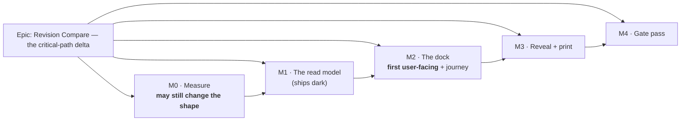

# Implementation Plan: Revision Compare — the critical-path delta

- **Feature spec:** [`./feature-spec.md`](./feature-spec.md)
- **Status:** **Draft — awaiting approval.** No application code is written until the spec's three
  critical questions are answered and this plan is approved.
- **Owner:** _(to be assigned on approval)_
- **Supersedes:** [`../revision-compare/implementation-plan.md`](../revision-compare/implementation-plan.md)

> **Read the spec's §0 first.** Four claims inherited from the brief and the superseded spec did not
> survive contact with the code, and every one of them makes this plan smaller than its predecessor:
> the snapshot already exists (`Baseline` freezes `is_critical`, `total_float` and both date pairs),
> the ghost layer already ships, no permission code is needed, and the engine-pass count is **zero
> rather than the two the brief specified**. The superseded plan's M1 — a new model, a migration and
> twelve open architecture questions — is deleted outright.

## Breakdown

### Epic

**Revision Compare — the critical-path delta.** Tell a planner which activities entered and left the
critical path between a captured baseline and now, and how far the completion moved — **with no
causal claim at all**. Maps to `docs/ROADMAP.md` → "Next → Product features".

**What makes this epic unusual, and what the plan is shaped around:** its predecessor was withdrawn
by its own committed falsification condition. So M0 is measure-or-verify again, and it is again
allowed to say no; M1 ships dark and declares itself dark; and the honesty constraint — never present
a number that implies causation — is enforced by a structural gate rather than by review, because
review is what a plausible-looking ranking passes.

---

## Milestone 0 — Measure and verify (nothing ships)

**Outcome:** three claims the design rests on are established by running something, and the ADR is
written. Nothing user-facing changes.
**Entry point:** **Ships dark** — this milestone produces a measurement file, a corrected docblock
and an ADR. There is nothing to reach, and that is stated rather than implied (ADR-0081 §1).
**Journey:** none — no capability exists yet. The journey lands with **M2**, the first user-facing
milestone (ADR-0081 §2).

---

#### Feature: The falsification condition and the measurement

> **Description:** Commit the predicate on its own, then build a harness that can fail it, then
> record the verdict — including where the harness bypasses the product.
> **Complexity:** M
> **Dependencies:** none
> **Risks:** the predicate is softened after a number is seen → it lands in **its own commit,
> before the harness exists**, which is why the previous epic's condition file is trustworthy and
> why the practice is repeated verbatim.
> **Testing requirements:** the harness _is_ the test; its non-vacuity limb runs first.

##### Task M0-T1 — Commit the falsification condition (≈ one PR, alone)

- **Description:** Write `m0-condition.md` — spec §4.7's F1 (fidelity), F2 (carrier agreement),
  F3 (cost) and the non-vacuity limb — verbatim from the spec, and commit it with nothing else.
- **Complexity:** S
- **Dependencies:** spec approved
- **Risks:** the condition is written so it cannot fail → each limb names the specific mechanism that
  could break it (day-vs-minute granularity for F2; day-denominated projections and an older engine
  for F1) and the non-vacuity limb is checked **first**, so a pass against two identical schedules is
  impossible.
- **Testing:** none — this task adds no code.
- **Development steps:**
  1. Copy spec §4.7 into `docs/specs/revision-compare-delta/m0-condition.md`, unchanged.
  2. State what a PASS does **not** establish: F1/F2 call the delta and the engine directly, so a
     pass says the method is sound and says nothing about a route, a DTO or a guard (ADR-0081 §3).
  3. Commit alone. No harness, no product code, in this commit.

##### Task M0-T2 — Build the harness and record the verdict

- **Description:** An API-e2e-tier harness that captures a baseline through the **public REST API**
  (the catalogue captures none — `docs/TEST_PLAYBOOK.md:196`, and health M6 took the same route),
  perturbs the plan to satisfy the non-vacuity limb, then runs F1, F2 and F3.
- **Complexity:** L
- **Dependencies:** M0-T1
- **Risks:**
  - The harness builds the engine input differently from the product and measures itself → build it
    with the service's own graph builder, and pin that it reproduces the product's schedule. **The
    previous epic's harness scheduled a plan four and a half months different for exactly this
    reason and every number taken before the correction was withdrawn.**
  - The non-vacuity fixture is unreachable through the public API → find that out first, because it
    is itself the finding.
- **Testing:** the harness's own control run; each limb reported separately with its number.
- **Development steps:**
  1. Seed/locate `plan:fixture-p6-torture-v1`; recalculate; capture a baseline via `POST …/baselines`.
  2. Perturb through the public write path until the non-vacuity limb holds (≥ 3 in, ≥ 1 out,
     carrier ≥ 5 working days). Record what it took — if it is hard to produce, say so.
  3. **F1:** compute the delta from persisted/frozen columns; compute it from two authoritative
     `computeSchedule` runs; compare the sets and the movement.
  4. **F2:** compare the date-derived carrier against `selectCompletionCarrier` over engine results,
     including a deliberately constructed same-date tie between two non-summary activities.
  5. **F3:** scale to 2,000 activities, measure p95 over the real HTTP route.
  6. Write `m0-measurement.md` with the numbers and a **PROCEED / RESHAPE / WITHDRAW** verdict, and
     **correct in place** every claim in this spec or plan the run contradicted.

##### Task M0-T3 — Correct `completion-carrier.ts`'s stale rule

- **Description:** That file's `:76-79` prescribes measuring on the **carrier's own calendar** for
  "revision-compare attribution" — a rule for a design withdrawn on 2026-09-03, and unimplementable
  in the survivor because `BaselineActivity` carries no `calendarId`. Replace it with spec §4.4 D4's
  reasoning: the plan calendar, the old side's frozen day factor, and the under-read named.
- **Complexity:** S
- **Dependencies:** none (may land before or with M0-T2)
- **Risks:** the DCMA metric-12 half of the same docblock is disturbed → touch only the
  revision-compare paragraph; `critical-path-test.spec.ts` is the before/after oracle and must pass
  **unchanged** (the ADR-0078 barrel-preserving argument).
- **Testing:** existing `critical-path-test.spec.ts` green, unchanged.
- **Development steps:**
  1. Rewrite the paragraph; keep the required-parameter argument, which is still correct and still
     load-bearing.
  2. Note in the docblock that the two callers differ in **frame**, and why.

##### Task M0-T4 — Write ADR-0125

- **Description:** The decision record. Re-check the number at filing time and **record a collision
  rather than routing around it** (`ls docs/adr/012*.md` returns 0120–0124 today).
- **Complexity:** M
- **Dependencies:** M0-T2's verdict
- **Risks:** the ADR reads as a feature description rather than a decision → it must carry the three
  decisions that are genuinely architectural: the **withdrawal** of the attribution design against
  its own measurement; **a delta is not a cause** as a vocabulary decision with a gate behind it; and
  **`Baseline` is the snapshot** — a decision _not_ to add a persistence model is a persistence
  decision, and it is the one a future reader will most want the reasoning for.
- **Testing:** `pnpm check:adr-coverage` (validates the index in **both** directions since
  ADR-0110 D6); `pnpm check:counts`.
- **Development steps:**
  1. Write it against the ADR template, with spec §4.4's D1–D8.
  2. Record what the decision **costs** as well as what it buys — the causal claim is given up
     entirely, and a comparison is only as good as the planner's baseline habit.
  3. Add the `docs/adr/README.md` entry and the `CLAUDE.md` §16 entry in the **same** commit.

##### Task M0-T5 — the criticality-settings freeze **(CQ-1 answered (b) — this task exists)**

> **REWRITTEN 2026-09-05.** Everything below the heading was stale against the two mandatory
> `database-architect` passes that ran after this plan was written, in three ways that would each
> have produced wrong work. The wrong version said: _three_ constant-defaulted scalars, the epic's
> _only_ schema change, written _from the plan row_. All three are false. Corrected in place rather
> than deleted, because the plan being wrong about its own schema task is the finding.

- **Description:** **Four** nullable columns on `baselines` — `critical_path_definition`,
  `critical_float_threshold_minutes`, `total_float_mode`, `make_open_ends_critical` — so a
  definition change can be detected rather than silently reported as path movement.
  **The names are a FOURTH correction to this task, made 2026-09-05.** They read
  `criticality_definition` / `criticality_threshold_minutes` / `criticality_float_mode` /
  `criticality_open_ends` until the M0-T5 design pass rejected them: one setting would then have
  had FOUR names across the system (the plan column, the engine option, `CriticalityRule`, and a
  baseline column unlike all three), on a setting whose entire history in this epic is people
  mis-reading which name means what — `total_float_mode` was left out of the design in the first
  place for exactly that reason, and `criticality_float_mode` re-plants the same half-reading.
  Verbatim-from-source matches `baselines.hours_per_day_minutes`; the sibling's `schedule_`
  prefix exists only because `plans` needs to distinguish a mirror from its same-row twin, which
  `baselines` does not have.
- **Complexity:** M
- **Dependencies:** **M0-T6 lands first and in an earlier release** (see below); design is
  [`cq1-schema-design.md`](./cq1-schema-design.md)
- **Corrections the design pass made, each of which the plan had wrong:**
  - **Four columns, not three.** `total_float_mode` (`schema.prisma:706`) was omitted, and
    `compute.ts:675-687` shows it deciding **both** the `total_float` this feature reports as float
    movement **and** the left-hand side of the criticality test. Moving `FINISH → SMALLEST` changes
    the critical set with **every date byte-identical** — which is the invisible false movement CQ-1
    exists to prevent, reproduced one field along.
  - **Nullable sentinels, not constant defaults.** ADR-0068 is the **wrong precedent** and its own
    migration says why: `DEFAULT 1440` was legal because 1440 was _true of every existing row_. That
    does not hold here — all four settings have been planner-writable since `20260716180000` — so a
    constant default states, in a `NOT NULL` column a reader cannot doubt, a rule the baseline may
    never have been computed under. The governing precedent is one table along:
    `baseline_activities.budgeted_expense` is nullable, its docblock recording that
    `NOT NULL DEFAULT 0` was rejected because **"0 is a claim"**. NULL here means _unknown_.
  - **Not written from the plan row.** See M0-T6 — the row holds the _configuration_, which is not
    necessarily what the engine ran.
- **Testing:** the migration's own SQL read from the shipped file, never restated; a capture e2e
  asserting the four values come from the **mirrors**; the existing baselines suite unchanged.
- **Development steps:**
  1. Apply `cq1-schema-design.md` — migration + `schema.prisma` docblocks. Two CHECKs:
     `num_nonnulls(...) IN (0,4)` fail-closed, and a nullable-safe range mirroring
     `ck_plans_critical_float_threshold_minutes_range`.
  2. `CaptureInput` gains **one nullable grouped object**, not four required fields — the mirror is
     NULL for any plan recalculated before M0-T6 shipped, and requiredness was the design's own
     stated all-or-none mechanism.
  3. Re-read the plan **inside the capture lock**: a recalculation can commit between capture's
     outer plan read (`baselines.service.ts:122`) and its lock (`:127`).
  4. `docs/DATABASE.md` beside the Baseline section; `pnpm check:counts` for the model/migration
     figures in the `CLAUDE.md` banner.
- **Landed 2026-09-05**, one release after M0-T6 (`api-v0.56.0`, tag and GHCR image confirmed).
  Migration `20260905180000_baseline_criticality_snapshot`; `prisma:check-drift` reports no
  difference. Three unit cases and one API e2e case, each **verified red first** — the two design
  passes' own naive form (a pre-lock, un-org-scoped read with no 404 branch) fails two of the
  three, and the forbidden coalescing form fails the third. The e2e walks
  recalculate → capture → settings PATCH → capture → recalculate → capture and is the only place
  the enum values cross a real database.
- **It also discharged two obligations M0-T6 left behind**, both found by the design pass rather
  than by anything automatic: four `schema.prisma` comments claiming the engine consumes these
  options "in a later M6 task" (it consumes all of them today, `compute.ts:149-152`/`:676-696`) and
  two claiming the `@repo/types` unions were "added in a later M6 task" (they exist); and
  `docs/DATABASE.md`, which had **no** material on the plan mirrors at all. The stale
  `total_float_mode` comment is the sharpest: this epic's own feature spec omitted that setting
  from the frozen set on exactly that misreading.

##### Task M0-T6 — the `plans` criticality mirror **(Option B, accepted; ships ONE RELEASE AHEAD of M0-T5)**

- **Description:** Four nullable engine-owned columns on `plans`, written by the existing
  `stampScheduleComputedAt` statement, recording the criticality settings the recalculation
  **actually ran with**. Design is [`optionb-schema-design.md`](./optionb-schema-design.md).
- **Complexity:** M
- **Dependencies:** `database-architect` design exists and is accepted; **nothing applied yet**
- **Why it exists:** a settings PATCH neither recalculates nor marks the schedule stale — verified,
  `scheduleComputedAt` occurs nowhere in `src/modules/plans/`, and the UI says so on screen. So
  freezing the plan's _current_ settings onto a baseline records the rule that was **configured**,
  which may never be the rule its numbers came from. No column on `baselines` can close that.
- **The trap this task exists to avoid, and it is not hypothetical:** the obvious implementation —
  `SET criticality_definition = critical_path_definition` — copies the row's own configuration. The
  plan is read at `schedule.service.ts:246`, **outside the transaction and before**
  `lockPlanForWrite` at `:268`, and a settings PATCH takes no plan lock (the advisory locks in
  `plans.service.ts` are calendar-scoped). **So the engine can run rule A while the row already
  holds rule B** — Finding F2's defect reproduced inside F2's own fix, and undetectable afterwards.
- **Risks:**
  - Sourcing the mirror from `graph.options` needs `?? 'TOTAL_FLOAT'` / `?? 0` at the write site,
    because all four `ComputeOptions` fields are optional (`compute.ts:71`, `:77`, `:83`, `:90`) —
    the forbidden defaulting arriving through the write side. → **one shared required-typed
    `CriticalityRule`** built where `options` is built, spread into `options` and passed as a
    **required parameter**, so engine input and mirror cannot drift.
  - **Release ordering is load-bearing and irreversible if skipped.** The mirror self-populates on
    every recalculation, so each recalc between the two releases converts a plan from "next capture
    is permanently UNKNOWN" to "next capture records a real rule". Free, and unrecoverable later.
- **Testing:** the ADR-0022 property proved by execution (a five-clause raw `UPDATE` leaves
  `version`, `updated_at` and `updated_by` untouched); all three CHECKs verified to refuse and admit
  under `UPDATE`, which is the shape this write takes; the recalculation suites unchanged.
- **Development steps:**
  1. Apply `optionb-schema-design.md` — migration, the third CHECK
     (`definition IS NULL OR schedule_computed_at IS NOT NULL`, which has no `baselines` analogue),
     and the `CriticalityRule` extraction.
  2. **Reword the engine-purity claims** wherever they appear: `schedule.service.ts` and
     `schedule.repository.ts` both change, so _"no engine-path file is touched"_ is false. The
     accurate form is **"the recalculation persistence is touched; the engine is not"** —
     `computeSchedule`'s signature and behaviour are unchanged, it never reads the mirrors, and the
     ADR-0034 parity gate holds structurally.
  3. Ship, and let at least one release elapse before M0-T5.
- **Landed 2026-09-05.** Migration `20260905120000_plan_schedule_criticality_mirror` applies in
  `migrate deploy` and `prisma:check-drift` reports **no difference**. The risk above was real and
  is closed as designed: all four `ComputeOptions` criticality fields are optional
  (`engine/compute.ts:71`, `:77`, `:83`, `:90`) with `??` fallbacks applied inside `computeSchedule`
  (`:149-152`), so a mirror projected back **out** of the options would have been `undefined`
  wherever a caller omitted one. `criticality-rule.ts` therefore declares all four **required** and
  projects **into** the options through `toCriticalityOptions`, whose
  `Required<Pick<ComputeOptions, …>>` return type fails to compile if a fifth criticality option is
  added to the engine and not to the mirror.
  - **Proved by execution, not by reading.** Both unit cases were **verified red first** against a
    stamp sourced from a hard-coded default rule. The e2e case
    (`test/schedule.e2e-spec.ts`, "stamps the criticality rule it ran with") was **verified red**
    against a stamp that wrote only the cursor, and it is the only place the raw write's enum casts
    execute at all — the service unit suite mocks the repository, so a `text` parameter PostgreSQL
    refused to coerce to `"CriticalPathDefinition"` would be invisible there. That case also
    re-proves the ADR-0022 property on the **plan** row (the statement grew from one `SET` clause to
    five), with an ordinary settings PATCH as its control so "version unchanged" is a property of
    the engine-owned write rather than of a column nothing ever moves.
  - **All three CHECKs proved under `UPDATE`** — the shape this write takes — nine cases, each
    REFUSED case attributed to the constraint that refused it by name, and the probe carrying a
    non-vacuity control. The control earned its place immediately: the first run read `plans` after
    an e2e cleanup had emptied it, so all nine `UPDATE 0` results proved nothing and would have read
    as a pass.
  - **What the e2e cannot cover, recorded in its own docblock:** that the mirror is _sourced_ from
    the engine's options rather than re-read from `plans` at stamp time. The two agree at every
    stamp point in a sequential test and diverge only under a settings PATCH interleaved between the
    plan load and the transaction, which this suite cannot produce. That half is the unit case.

---

## Milestone 1 — The read model (ships dark)

**Outcome:** `GET …/schedule/revision-compare` returns a correct, gated, engine-free comparison.
**Entry point:** **Ships dark.** No control reaches it; the route is exercised by tests only. **M2**
surfaces it. Stated here rather than implied, because "the model landed" is not a claim that the
capability exists (ADR-0081 §1).
**Journey:** none yet — M2's.

---

#### Feature: The pure delta

> **Description:** One pure function over two projections: `entered`, `left`, the counts, and the
> carrier movement. No engine, no I/O, no dates parsed twice.
> **Complexity:** M
> **Dependencies:** M0 verdict = PROCEED
> **Risks:** the four sets do not partition the union → a totality test, the ADR-0116 D3 pattern.
> **Testing requirements:** exhaustive unit coverage — it is a pure function over two arrays, so
> there is no excuse for a branch without a case. Plus two structural gates, both verified red.

##### Task M1-T1 — `revision-delta.ts` and its unit suite

- **Description:** The pure module: `computeRevisionDelta(oldRows, newRows, calendar, dayFactorMinutes)`.
- **Complexity:** M
- **Dependencies:** M0-T3 (the shared carrier rule)
- **Risks:**
  - "Appearing" is conflated with "entering" → an explicit case for an activity that is **added and
    critical on arrival**, asserted to produce one `ADDED` row and **no** `entered` row (spec D5).
    The tempting implementation reports both.
  - Null float is coerced to zero → absence and zero are different facts; `variance.ts:90-93`
    already takes this line and it is matched, not re-decided.
  - Summaries leak into `entered`/`left` → excluded by frozen `type`, with a case.
- **Testing:** unit; the totality test (the four sets plus `ADDED`/`REMOVED` partition the union of
  both sides, asserted as an equality on counts **and** on ids); a case per edge in spec §2.
- **Development steps:**
  1. Define the two input row shapes as one structural type — both sides project to it, which is
     what makes the baseline-vs-baseline case free (CQ-2).
  2. Membership sets; per-row float and date movement using the shared working-day helper.
  3. Carrier: old side fixed, looked up on the new side; `carrierChanged` when the new side's own
     latest-finisher differs; `CARRIER_REMOVED` when absent.
  4. Reasons as a closed union; every "cannot assess" path returns a reason, never a throw.
  5. Ordering: float movement descending, ties by `code` then `id` — stated in the module docblock
     **as an ordering, not a ranking of blame**, with §4.9's reasoning.

##### Task M1-T2 — The two structural gates, verified red first

- **Description:** (a) the engine-free gate; (b) the no-causal-field gate (spec S7).
- **Complexity:** S
- **Dependencies:** M1-T1
- **Risks:**
  - **A gate that passes against an empty set.** `health-engine-free.structural.spec.ts:32-37`
    carries a pinned non-zero-files case for exactly this, after ADR-0108's census gate caught
    itself on it. Both gates get one.
  - **The scan matches its own prose.** Four gates in this repository have gone red or green on
    their own docblocks; both scans strip comments, and the stripping is itself fixture-tested.
  - **The line-anchored bypass.** ADR-0116's G4 shipped a line-anchored key pattern that a
    Prettier-clean single-line object and a shorthand property both sailed past. Scan whole-file,
    and pin **both** bypasses as fixtures.
- **Testing:** each gate **verified red against the specific defect it names** — a temporary
  `import { computeSchedule }` for (a); a temporary `cause: string` field, once as a multi-line
  property and once inline, for (b). A gate is not finished when it passes; it is finished when it
  has been made to fail by the defect it was written for (ADR-0110 D5).
- **Development steps:**
  1. Copy `health-engine-free.structural.spec.ts` line for line, retarget it, and keep its recorded
     blind spot in the docblock: **a transitive import is invisible to a one-level source scan**.
  2. Write the causal-field gate over the delta sources **and** the DTO, whole-file,
     comment-stripped, with a pinned positive case.
  3. Verify each red, then green.

##### Task M1-T3 — Repository projections

- **Description:** Two reads: the frozen delta projection from `baseline_activities` (which
  `loadSnapshotRowsForVariance` does **not** cover — it omits `isCritical` and `type`,
  `variance.ts:7-14`), and the live delta projection from `activities`.
- **Complexity:** S
- **Dependencies:** none
- **Risks:** an N+1 or a per-row query → one indexed read per side, using the existing
  `@@index([baselineId, sourceActivityId])` (`schema.prisma:1889`). No new index; confirmed by
  M0-T2 F3 rather than assumed.
- **Testing:** repository-level e2e against a real Postgres asserting both projections' shapes and
  the org+plan scoping.
- **Development steps:**
  1. Add the projections beside the existing variance ones; do **not** widen the variance projection
     (spec §4.9 — three existing readers depend on its contract).
  2. Soft-delete filter on both, via the repository's existing `active()` helper.

##### Task M1-T4 — Service method, DTO and route

- **Description:** `ScheduleService.revisionCompare`, `RevisionCompareDto`, and the controller route
  beside `health-check`.
- **Complexity:** M
- **Dependencies:** M1-T1, M1-T3
- **Risks:**
  - **IDOR.** `from`/`to` must be scope-checked on the **target** — a baseline of _this_ plan in
    _this_ org — and a miss is **404, never 403** (no existence oracle).
  - **A throttle copied rather than derived.** Spec §4.5 says none beyond the global budget, for the
    reason `schedule.controller.ts:191-199` already documents; M0-T2 F3 is what makes that a
    measurement rather than an assumption. If F3 contradicts it, the paragraph loses, not the number.
  - **An undeclared-but-reachable status.** Every reachable 4xx is declared in OpenAPI — the
    ADR-0053 M6 / ADR-0116 M5 finding.
- **Testing:** API e2e — all four roles; cross-org and cross-plan 404s; `SAME_REVISION` 422; the
  `to=live` and `to=<baseline>` paths; **the non-mutation proof** (read every engine-owned column
  back after the call and assert equality), itself **verified red by persisting once deliberately**
  (the ADR-0116 M6 proof, which was re-verified red against a newly covered column).
- **Development steps:**
  1. Query DTO: `from` UUID required; `to` UUID-or-`live`, defaulting to `live`.
  2. Assert **both** `schedule:read` and `baseline:read` (spec §2 — same grant today, so no
     capability change, and narrowing either later cannot silently leave this route open).
  3. Resolve both sides; load; call the pure delta; map to the DTO.
  4. OpenAPI: the parity sentence **and** the honesty sentence, in the route description (spec §4.5).
  5. Structured log line: plan, both side ids, row counts, duration.
  6. `docs/API.md`; changeset.

---

## Milestone 2 — The dock (**first user-facing milestone**)

**Outcome:** a planner compares a baseline against live and reads what entered and left the critical
path, and how far the completion moved.
**Entry point:** **`Analysis ▾ → Compare revisions…`** in the plan workspace command surface
(`apps/web/src/features/tsld/toolbar/tsld-toolbar-items.tsx`, beside `Baselines…` `:1328` and
`Health check…` `:1347`), opening the fourth right dock. Accessible name: **"Compare revisions…"**.
**Journey:** `apps/web/e2e-revision-compare/` lands **with this milestone**, with its own CI step —
at minimum: open the workspace, press `Analysis ▾`, press `Compare revisions…`, assert the dock opens
and shows a real result against a real API with a baseline captured through it. Not deferred to a
gate pass (ADR-0081 §2), because this repository has five recorded milestones that read as done and
could not be reached from the product.

---

#### Feature: The comparison dock

> **Description:** A fourth `RIGHT_DOCKS` member with the side pickers, the completion statement, the
> entered/left sections and the honesty footer.
> **Complexity:** L
> **Dependencies:** M1
> **Risks:** the dock is wired into one workspace host and not the other — ADR-0080's `bulk` defect,
> where the bar was unreachable in the shipped app while every unit test passed → the journey drives
> the real product, which is the only instrument that can see it.
> **Testing requirements:** unit (all states), journey (its own CI step), axe scan on a **populated**
> result and on each empty state — an all-empty scan certifies nothing (ADR-0116 M5's finding).

##### Task M2-T1 — Register the fourth dock

- **Description:** Add `revisions` to `RIGHT_DOCKS` and wire its closer in the workspace.
- **Complexity:** S
- **Dependencies:** none
- **Risks:** `right-docks.test.ts`'s **equality** assertion (`['notes','floatPaths','health']`) goes
  red in an unrelated milestone → update it **in the same commit**. The exclusivity assertions derive
  from the set and extend for free; the equality one does not.
- **Testing:** the existing derived exclusivity assertions, extended by construction; a case that
  opening `revisions` closes the other three.
- **Development steps:**
  1. One name in `right-docks.ts:12`; the closer in the workspace; the equality assertion.

##### Task M2-T2 — `RevisionComparePanel`

- **Description:** Side pickers, results, and every state.
- **Complexity:** L
- **Dependencies:** M1-T4, M2-T1
- **Risks:**
  - **"No baselines" and "nothing entered or left" collapse into one message** — the ADR-0073 C1
    defect, where a live region said "Showing 0 events" for two different facts. They are distinct in
    the visible copy **and** in the live region, asserted separately.
  - **The honesty footer is reachable only by reading serially** — the ADR-0073 C2.5 finding: a
    landmark-navigating reader lands _inside_ the results region. It is `aria-describedby`-linked to
    that region.
  - **A control that does nothing.** A `REMOVED` row is not activatable and **says why** (ADR-0082),
    rather than being silently inert or hidden.
  - **A native `disabled` on a control that flips.** Shade with `aria-disabled` + a reason; this
    register records that defect shipping at least four times.
- **Testing:** unit per state (loading, no baselines, no changes, populated, each `NOT_ASSESSABLE`
  reason); the reason renders as a **sentence** — a code reaching the screen is a tested-for defect.
- **Development steps:**
  1. `SectionCard`/`FormSection`; no one-off styling; entered/left carry an icon **and** a word, so
     colour is never the sole channel (WCAG 1.4.1).
  2. Side pickers: `from` = a baseline; `to` = Live (default, **labelled as live**) or a baseline.
  3. Completion statement: number, carrier name, frame ("working days on the plan calendar").
  4. The levelling sentence when `plan.levelResources` (spec D6) — one sentence, not silence.
  5. The honesty footer, linked.
  6. Link to the **existing** `View ▾` baseline ghost toggle rather than adding a second one
     (ADR-0093).

##### Task M2-T3 — The menu item

- **Description:** `Compare revisions…` in the `Analysis ▾` menu.
- **Complexity:** S
- **Dependencies:** M2-T2
- **Risks:** it lands in one toolbar host and not the layout the shipped app selects → the journey
  presses it in the real product.
- **Testing:** unit; **journey** (M2-T4).
- **Development steps:**
  1. One `MenuItem` beside `Health check…`; shaded with a reason when the plan has no computed
     schedule, never hidden (ADR-0082).
  2. No new deck stop, so **no width cost** — assert nothing about width, and do not claim a saving.

##### Task M2-T4 — The flag-on-equivalent journey

- **Description:** `apps/web/e2e-revision-compare/` with its own Playwright config and CI step.
- **Complexity:** M
- **Dependencies:** M2-T3
- **Risks:**
  - **The suite seeds through the API and the UI cache is stale** — six `e2e-gantt-editing` specs
    leaned on an unconditional `Recalculate` press for this and nobody had written it down. Reload
    or refetch explicitly.
  - **A control located by its copy** — locate by `[data-toolbar-item]` and by role+name, never by
    label text, which every layout epic here has broken.
  - **A stale dev server is adopted.** `reuseExistingServer` is true outside CI;
    `scripts/e2e-local.sh` refuses to run while anything answers on 3000 or 5173.
- **Testing:** the journey is the test. Capture a baseline through the API, perturb, compare, assert
  a named activity appears under **Entered**, and assert the honesty footer is present.
- **Development steps:**
  1. Config + CI step + `scripts/e2e-sweep.sh` (its list is derived — confirm this suite appears).
  2. `docs/TESTING.md`; `docs/TEST_PLAYBOOK.md` if a seeded plan is added (`pnpm check:playbook`
     gates both directions).

---

## Milestone 3 — Reveal and print

**Outcome:** a planner clicks a result and finds the activity; and prints the comparison.
**Entry point:** the rows in the M2 dock become activatable; a **Print comparison** control in the
dock header.
**Journey:** M2's suite extends — press a row, assert selection; press Print, assert the document
renders every row.

---

#### Feature: Activation and the printed document

> **Description:** Select-and-reveal from a result row, and the paper artefact.
> **Complexity:** M
> **Dependencies:** M2
> **Risks:** printing a virtualized list prints only the rows on screen — ADR-0059 M4's finding, and
> a programme cropped to a scroll position looks authoritative and omits work.
> **Testing requirements:** unit; journey; a print-document test asserting the full list and the cap
> stated in words.

##### Task M3-T1 — Select and reveal

- **Description:** Activating a row selects the activity on the canvas and reveals it; in the Gantt
  it uses the ADR-0116 reveal channel.
- **Complexity:** M
- **Dependencies:** M2-T2
- **Risks:** **selection alone scrolls nothing in the Gantt** — a reviewer found this on the health
  epic; reuse that channel rather than assuming selection is enough.
- **Testing:** unit per view; journey asserts the canvas selection changes.
- **Development steps:**
  1. Reuse the existing reveal precedence; do not add a third channel.
  2. `existsLive: false` rows are shaded with a reason (spec US-3).

##### Task M3-T2 — The printed comparison

- **Description:** A detached print document (not a print stylesheet).
- **Complexity:** M
- **Dependencies:** M2-T2
- **Risks:** it resolves colour from the live theme → `[data-surface="print"]` (ADR-0103); every
  export unit suite runs in jsdom where the resolver takes its fallbacks, so **the branch that ships
  is unreachable from a unit test** — the journey decodes the real output.
- **Testing:** unit on the document model; journey on the real render.
- **Development steps:**
  1. Reuse `lib/print-document.ts`'s container/lifecycle convention.
  2. Header carries both sides' identity and, when `to` is live, **the comparison instant**.
  3. Full entered/left lists with the cap stated **in words** — paper has no "load more".

---

## Milestone 4 — The gate pass

**Outcome:** the specialist reviews run over the combined diff and every blocking finding is folded.
**Entry point:** none new. **Ships dark** in the sense that it adds no capability — it repairs.
**Journey:** the M2 suite, extended by whatever the pass finds.

##### Task M4-T1 — Six specialist reviews over the combined diff

- **Description:** `security-reviewer`, `api-reviewer`, `backend-performance-reviewer`,
  `component-reviewer`, `accessibility-reviewer`, `ux-reviewer`.
- **Complexity:** M
- **Dependencies:** M3
- **Risks:** findings are folded without regression tests → **every fix carries a test verified to
  fail against the old code first.** Eight consecutive epics here have had a gate pass block on
  defects that passed a human read; the expectation is that this one does too, and a pass with no
  findings is a reason to check the reviews ran, not a reason to celebrate.
- **Testing:** as folded.
- **Development steps:**
  1. Run all six; classify blocking vs suggested.
  2. Fold the blocking ones with red-verified tests; file the rest in `docs/TECH_DEBT.md` with a
     status a parser can read (`pnpm check:debt-status`, ADR-0120).

##### Task M4-T2 — Re-derive M0's numbers against the shipped code

- **Description:** Re-run F1/F2/F3 against the final code rather than trusting the M0 file.
- **Complexity:** S
- **Dependencies:** M4-T1
- **Risks:** a measurement is quoted forward from a tree that has since changed — this repository
  records that happening inside a review. Re-derive; do not cite.
- **Testing:** the harness.
- **Development steps:**
  1. Re-run; record any divergence in `m0-measurement.md` **as a correction in place**.
  2. `pnpm prepush` + `scripts/e2e-local.sh api` + `scripts/e2e-local.sh web:revision-compare` +
     the base `web` journey (a screen changed — ADR-0096's rule).

---

## Sequencing & slices

Each slice keeps `main` releasable. **There is no `VITE_` flag** (spec D7 / ADR-0088 D1): a `VITE_`
constant is inlined at build time and has never been an operator rollback. **The rollback contract is
the commit boundary**, and it is written down here per slice rather than left implicit.

| Slice | Lands                                       | User-visible?          | Rollback contract                                                                                                                                                                                                                                       |
| ----- | ------------------------------------------- | ---------------------- | ------------------------------------------------------------------------------------------------------------------------------------------------------------------------------------------------------------------------------------------------------- |
| M0-T1 | The condition, alone                        | No                     | Revert one doc commit                                                                                                                                                                                                                                   |
| M0-T3 | The `completion-carrier.ts` correction      | No                     | Revert; `critical-path-test.spec.ts` is the oracle either way                                                                                                                                                                                           |
| M0-T2 | The harness + verdict                       | No                     | Revert; test-tier only                                                                                                                                                                                                                                  |
| M0-T4 | ADR-0125                                    | No                     | Revert one doc commit                                                                                                                                                                                                                                   |
| M0-T5 | The **four** frozen scalars on `baselines`  | No                     | **A migration cannot be reverted by a revert** — additive and **nullable**, so leaving it in place is inert. NULL means _unknown_, never a claim about the rule                                                                                         |
| M0-T6 | The **four** criticality mirrors on `plans` | No                     | Additive and nullable, so inert if left. **But it must ship one release AHEAD of M0-T5** — the mirror self-populates on every recalculation, and recalcs in that window are the only thing that converts a plan from permanently-UNKNOWN to a real rule |
| M1    | The route, dark                             | No — **declared dark** | Revert the controller commit; nothing references it                                                                                                                                                                                                     |
| M2    | The dock + the menu item + the journey      | **Yes**                | Revert the menu-item commit alone: the dock becomes unreachable and the route stays dark                                                                                                                                                                |
| M3    | Reveal + print                              | Yes                    | Revert either independently                                                                                                                                                                                                                             |
| M4    | Gate-pass repairs                           | Yes                    | Per finding                                                                                                                                                                                                                                             |

**If M0 says RESHAPE or WITHDRAW, M1 does not start.** The verdict goes to the product owner with the
numbers, exactly as the previous M0's did — and the same rule applies: the remedy is a scope decision
for them, not a softened bar chosen by the implementer.

## Definition of Done (per task)

Each task's PR must satisfy the Feature Completion Criteria in [`docs/PROCESS.md`](../../PROCESS.md)
— code, tests, docs, security, performance, accessibility, Docker build, CI, changelog, version
impact. Specifically for this epic:

- **The pre-push gate is run, not written**: `pnpm prepush`, plus `scripts/e2e-local.sh api` for any
  `apps/api` change and `scripts/e2e-local.sh web:revision-compare` for the journey. **CI is the
  second opinion, never the first.**
- **A `check_suite` event is not proof CI passed** — read the check runs for the PR's current head,
  and if a job sits `queued` unusually long, ask the **run** (`run_duration_ms`), not the check.
- **Every decision-bearing claim names its evidence** (ADR-0076): the command, the file and line, or
  the test.

## Risks & assumptions (rollup)

| Risk / assumption                                                                                                                      | Likelihood | Impact   | Mitigation                                                                                                                                                            |
| -------------------------------------------------------------------------------------------------------------------------------------- | ---------- | -------- | --------------------------------------------------------------------------------------------------------------------------------------------------------------------- |
| **A frozen `isCritical` was computed under a criticality rule nobody recorded**, so a settings change reads as path movement           | **High**   | **High** | **CQ-1.** Under (a) it is a stated caveat and permanently undetectable; under (b) three additive columns make it detectable. This is the epic's largest honesty risk. |
| The date-only carrier disagrees with the engine's minute-granular one on a tie                                                         | Medium     | Medium   | **M0-T2 F2** exists for this; a deliberate tie is in the fixture                                                                                                      |
| A frozen baseline's reported days move when somebody edits the working week (spec §0.3, **reasoned from the code path, not observed**) | Medium     | Low      | Inherited from `computeVariance` deliberately rather than diverging; filed separately, not fixed here                                                                 |
| A planner on a levelled plan reads network criticality against levelled bars                                                           | Medium     | Medium   | Spec D6 — one sentence in the panel. The network pair is the authoritative one (ADR-0041 Q2), so the data is right and only the explanation was missing               |
| **Ranking by movement is mistaken for causation** by a reader, or reintroduced by a later milestone                                    | Medium     | **High** | The S7 structural gate (no causal field name, verified red both ways); the ordering described in the UI as an ordering; the honesty footer                            |
| The feature is useless to anyone who never captured a baseline                                                                         | **High**   | Medium   | **Accepted knowingly** — the same weakness the product owner accepted on CQ-1(a) of the superseded spec. Mitigated only by M2's empty state offering capture          |
| The dock is wired into one workspace host and not the shipped layout (ADR-0080's defect)                                               | Medium     | High     | M2-T4's journey drives the real product; no unit suite can see it                                                                                                     |
| M0 says RESHAPE and the epic changes again                                                                                             | Low        | High     | The condition is committed first and the verdict goes to the product owner. F1/F2 are narrow and mechanical; the research risk left with the attribution design       |
| `check:counts` fails on the ADR count until the banner is re-derived                                                                   | High       | Low      | M0-T4 step 3 updates `CLAUDE.md` §16 and the index in the same commit                                                                                                 |
| A specialist review finds a defect a human read missed                                                                                 | **High**   | Medium   | **Expected** — eight consecutive epics here have. M4 is budgeted as real work, not a formality                                                                        |
