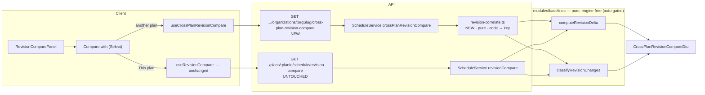
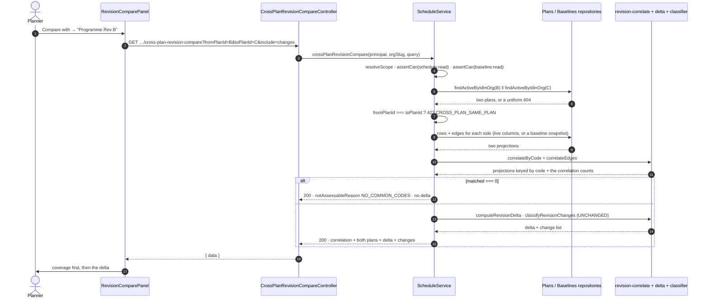

# Feature Spec: Revision Compare across two imported revisions

- **Status:** Accepted — shipped (ADR-0129)
- **Author(s):** feature-analyst (Product Owner / Solution Architect / Technical Lead hats)
- **Date:** 2026-09-08
- **Tracking issue / epic:** _(to be opened on approval)_
- **Roadmap link:** `docs/BACKLOG.md` → `M` **"Revision Compare — comparing two IMPORTED revisions"**
- **Related ADR(s):** extends ADR-0125 (the delta), ADR-0126 (the change list), ADR-0127 (the
  overlay); builds on ADR-0050 (interchange), ADR-0045 (the cross-plan route precedent), ADR-0012 /
  ADR-0016 (RBAC + org scoping), ADR-0035 (reject / repair / report). **A new ADR is required** —
  drafted in §4.10, to be filed as **ADR-0129 or the next free number, verified at filing** (ADR-0071:
  a number can be taken between the plan and the milestone).

---

## 0. Corrections to the brief, and to the backlog entry

`docs/PROCESS.md` says the brief is not evidence. Four claims were checked; **one is false, one is
stale, and two needed sharpening.** Each correction changed the design, so they lead rather than
sit in an appendix.

### 0.1 — FALSE: "`Activity.code` has no unique constraint"

The brief states it, and names its method: _"verified by grepping `@@unique`/`@unique`"_. That method
is **structurally incapable of seeing the answer** in this repository, and the schema says so
repeatedly in its own comments — partial indexes cannot be expressed in Prisma and are declared in
raw SQL only.

There is a live partial unique index:

```sql
-- apps/api/prisma/migrations/20260710092048_add_activities/migration.sql:81
CREATE UNIQUE INDEX "uq_activities_plan_code"
  ON "activities" ("plan_id", "code")
  WHERE "deleted_at" IS NULL AND "code" IS NOT NULL;
```

Verified live: no later migration drops it, `schema.prisma:1324-1326` documents it, and three other
places in the tree cite it as a precedent (`validate.ts:67`, `resources` migration `:142`,
`generate-scale-xer.mjs:265`).

**So "a code duplicated within one side" is not a case this feature has to repair — it is a case the
database refuses.** The brief asked for a matching contract covering duplication; the honest contract
says the guard already exists, names it, and pins it with a test rather than writing repair code for
an unreachable state. That deletes a whole branch of the design (§2.4, D1c).

This is an ADR-0076 **Class 3** instance — a decision-bearing claim asserted from an instrument that
could not see the subject — recorded here rather than quietly fixed, because the _method_ is the
transferable part: in this repository, a claim about a constraint is verified against
`prisma/migrations/`, never against `schema.prisma` alone.

### 0.2 — CORRECT, and stronger than stated: the identity field is `code`

The backlog entry names `activities.activity_code`. There is no such column. The field is
`Activity.code`, `String?`, `@map` absent (so the column is literally `code`) —
`schema.prisma:949`. The brief's correction is right and the spec uses `code` throughout.

**Stronger than the brief says**, and this is what makes the epic tractable at all: an _imported_
activity always carries a code, and the codes are unique within the imported graph **before** the
database is asked.

| Guarantee                            | Evidence                                                                       |
| ------------------------------------ | ------------------------------------------------------------------------------ |
| XER sets a code, always              | `xer-adapter.ts:541-551` — `task_code`, else the source `task_id` + a finding  |
| MSPDI sets a code, always            | `mspdi-adapter.ts:453-463` — `WBS ?? ID`, else the `UID` + a finding           |
| The canonical model requires one     | `import-graph.ts:153-154` — `code: z.string().min(1)`, non-nullable            |
| Unique within the import graph       | `validate.ts:76-113` — duplicates suffixed `-2`, `-3`… each a `repair` finding |
| Unique within the plan, in Postgres  | `uq_activities_plan_code` (above)                                              |
| Trimmed and bounded at the write DTO | `create-activity.dto.ts:49-57` — `@Transform(trim)`, `@MaxLength(32)`          |

### 0.3 — STALE: "one measurement is owed before any of it"

`docs/BACKLOG.md:136-141` says the compare overlay's paint cost is unanswered and that a headed run
on the product owner's hardware is owed before this work. **That blocker is gone.** The run was taken
on 2026-09-08 and is recorded in ADR-0127 **D8a**: Week framing, 2,000 activities, baseline 0.19 pp
dropped frames, treatment 0.00 pp at 60.0 fps, delta −0.19 pp — PASS on both limbs, with the
machine's own spread (0.56 pp) inside the 2.00 pp bar, which is what makes the verdict mean anything.
**D8b** then flipped `DEFAULT_LENS_STATE.compareOverlay` to `true` on the product owner's decision.

Two limits carry forward rather than being discarded: it is **one framing on one machine**, and the
**Fit** framing remains ungraded (`docs/TECH_DEBT.md` #260 — at a baseline of 98.33 pp the difference
metric is arithmetically incapable of failing). This epic inherits both, and **§4.8.5 does not treat
the Week PASS as licence** — the cross-plan overlay carries its own committed condition.

**Action:** the backlog entry's final paragraph is amended in the same PR that opens this epic.

### 0.4 — SHARPENED: what the plan-nested route can and cannot say

Verified rather than accepted: `@Controller({ path: 'organizations/:orgSlug/plans/:planId/schedule' })`
(`schedule.controller.ts:66`), `@Get('revision-compare')` at `:212`;
`RevisionCompareQueryDto.from` is `@IsUUID()` documented _"a baseline of this plan"_ (`:36-44`) and
`to` a UUID-or-`live` union (`:46-55`). Neither can name another plan. ✓ as briefed.

And the DTO's own docblock (`:9-17`) records rejecting a two-optional-param shape once already,
_"which makes 'both supplied' and 'neither supplied' two more states the service has to answer for"_.
That recorded rejection is load-bearing in §4.3 and is honoured, not re-litigated.

---

## 1. Business understanding

### Problem

A planner receives **Revision B** of a subcontractor's programme in March and **Revision C** in
April, both as P6 `.xer` exports. They are asked, in the meeting, the same question ADR-0125 exists
for — _what changed, and why is the job three weeks later?_ — about two files they did not author and
cannot open side by side in anything but the tool that produced them.

SchedulePoint imports both. It then cannot compare them, and the reason is structural rather than
missing effort: **an import always creates a new plan** (`interchange.service.ts:114`, `:189`,
`:372`; ADR-0050), so two files are two plans, and every comparison the product ships is
**plan-nested with both sides typed as baselines of that plan** (§0.4). Three tiers of comparison
shipped in September 2026 and none of them can answer the question about two files.

The workaround today is the one the product exists to remove: open both in P6.

**Why now.** The three tiers are built, released (`api-v0.59.0` / `web-v0.122.0`) and in use; the
overlay's blocking measurement is answered (§0.3); and the machinery this needs — the pure delta, the
classifier, the ghost builder, the dock, the printed document — is all in place and was deliberately
written to project both sides to one shape. The remaining work is a correlation key and a route.

### Users

| Role               | Need                                                                                          |
| ------------------ | --------------------------------------------------------------------------------------------- |
| **Planner**        | Import two revisions, ask what changed between them, and hand the answer to someone else.     |
| **Contributor**    | Read the comparison. No write is involved anywhere in this feature.                           |
| **Viewer**         | Read the comparison. Same payload — it does not vary by role (§2.5).                          |
| **Org Admin**      | As Planner.                                                                                   |
| **External Guest** | **Out of scope.** `PlanShare`'s fixed `SCHEDULE_READ` scope (ADR-0051) does not include this. |

The person the output is **for** is usually not a user at all: a QS, a client's project manager, a
commercial lead. They read the printed document (§4.7). That is why the handover artefact is its own
milestone rather than a footnote.

### Primary use cases

1. Compare an imported revision against a **later import of the same programme** and see which work
   entered and left the critical path, and how far the completion moved.
2. See the **change list** — what was added, removed, re-typed, re-durationed, re-dated, re-logicked,
   re-constrained, re-calendared, re-parented — between the two files.
3. **Verify the match before believing any of it**: how many activities were correlated, how many
   were not, and why (§2.4).
4. **Print** the comparison and hand it to someone who was not in the room.

### User journeys

**Happy path.** Planner opens Rev C's plan → `Analysis ▾ → Compare revisions…` → the dock opens with
a **Compare with** picker naming the other plans in this project → picks _"Programme Rev B"_ → the
panel leads with the match coverage ("412 of 418 activities matched by code") → then the delta, then
the change list → **Print comparison**.

**Alternate — poor match.** The two plans share few or no codes (a different programme, or a source
that re-codes on every export). The panel says so **first and instead of a delta**, naming the
counts; nothing that would read as "everything was removed" is shown (§2.4, D2).

**Alternate — uncoded work.** One side holds hand-authored activities with no code. Those rows are
listed as unmatchable, per side, and are **never** reported as added or removed.

### Expected outcomes

- The one comparison a planner pays for is available inside the product.
- The answer is **verifiable**: the reader can see the match before trusting what it produced.
- No new persistence, no engine work, and no change to the shipped route (§3, §4.4).

### Success criteria

| #   | Criterion                                                                               | Measured how                                        |
| --- | --------------------------------------------------------------------------------------- | --------------------------------------------------- |
| S1  | A planner reaches a cross-plan comparison in ≤ 3 controls from the open plan            | The M2 journey counts the presses                   |
| S2  | The correlation coverage is stated **before** any delta, on screen and on paper         | Unit + journey assertion; print snapshot            |
| S3  | Route p95 ≤ 250 ms at 2,000 activities **per side**                                     | M0-T3, against a condition committed first (§4.11)  |
| S4  | `computeSchedule` is not reachable from the feature's module graph                      | The existing derived structural gate (§4.6)         |
| S5  | The response carries no cost, rate or budget field at any depth — one URL, one document | The ADR-0116 G4-style scan, extended to the new DTO |
| S6  | Zero new models, columns, indexes, constraints or migrations                            | `pnpm prisma:check-drift` + the diff                |

### Open questions

**None remain.** Three were raised as CRITICAL; all three were decided by the product owner on
**2026-09-08** and are recorded in §6 — CQ-1 and CQ-2 as proposed, **CQ-3 against** the proposal,
which is why §4.8 answers the overlay's lane problem rather than deferring it. Everything else
carries a stated default.

---

## 2. Functional requirements

### 2.1 User stories & acceptance criteria

> **US-1** — As a **Planner**, I want to compare the plan I am looking at against another plan in the
> same project, so that I can report what changed between two imported revisions.
>
> **Acceptance criteria**
>
> - **Given** two plans in one project, each with a computed schedule, **when** I open
>   `Analysis ▾ → Compare revisions…` and choose the other plan under **Compare with**, **then** the
>   panel shows the correlation coverage, the criticality delta and the completion movement.
> - **Given** I have chosen another plan, **when** the comparison settles, **then** the panel names
>   **both** plans and which side is which — never "from" and "to" alone, because with two plans the
>   reader cannot infer either.
> - **Given** a Viewer's session, **when** the same comparison is requested, **then** the response is
>   byte-identical to the Planner's (§2.5).

> **US-2** — As a **Planner**, I want to see how well the two revisions matched, so that I can tell a
> real answer from an artefact of the matching.
>
> **Acceptance criteria**
>
> - **Given** any cross-plan comparison, **when** it settles, **then** the panel states the matched
>   count, each side's unmatched count and each side's uncoded count, **above** the delta.
> - **Given** the two plans share **no** codes at all, **when** the comparison settles, **then** the
>   panel reports `NO_COMMON_CODES` in a sentence and shows **no delta and no change list** — not an
>   empty one, and never "everything was removed and everything was added".
> - **Given** activities with no code on either side, **when** the comparison settles, **then** they
>   are listed as unmatchable with their side named, and appear in **no** added / removed set.

> **US-3** — As a **Planner**, I want the change list for a cross-plan pair, so that I can account
> for logic, calendar, constraint, WBS and duration edits between the two files.
>
> **Acceptance criteria**
>
> - **Given** `?include=changes`, **when** the comparison settles, **then** every class the pair can
>   support is reported, and every class it cannot is reported as **not assessable with a reason** —
>   never omitted and never zero (ADR-0126 D4).
> - **Given** a cross-plan pair, **when** the change list is built, **then** the `RECODED` class is
>   reported `NOT_ASSESSABLE` with reason `CODE_IS_THE_CORRELATION_KEY` — because a re-code is
>   indistinguishable from a removal plus an addition when the code _is_ the identity (§2.4, D1d).

> **US-4** — As a **Planner**, I want to print the cross-plan comparison, so that I can hand it to
> someone who was not in the room.
>
> **Acceptance criteria**
>
> - **Given** a settled comparison, **when** I press **Print comparison**, **then** the document
>   names both plans, states the correlation coverage, states the measurement frame (§2.6), and
>   carries the same honesty footer the screen does.
> - The printed document states **no fact the screen withholds, and withholds none the screen
>   states** — ADR-0125's gate-pass finding and ADR-0116 D9, applied in both directions.

> **US-5** — As a **Planner**, I want to activate a row and see the bar, so that I can look at the
> work the comparison names.
>
> **Acceptance criteria**
>
> - **Given** a row whose activity exists in the **anchor** plan (the one whose workspace is open),
>   **when** I activate it, **then** it is selected and revealed, and the selection is announced.
> - **Given** a row that exists only in the **other** plan, **when** it renders, **then** it carries
>   **no** activation control, and a sentence names the plan it belongs to — omitted rather than
>   shaded, because the action does not apply to the object (ADR-0082's omit clause).

> **US-6** — As a **Planner**, I want the difference drawn on the diagram for a cross-plan pair, so
> that a re-sequenced programme reads as a re-sequence rather than as thirty rows in a table.
>
> **Acceptance criteria**
>
> - **Given** a cross-plan pair and `View ▾ → Compare on diagram` on (its default since ADR-0127
>   D8b), **when** the comparison settles, **then** every **matched** activity whose start or finish
>   moved is ghosted at its **own live bar's** lane, showing where it used to sit in time.
> - **Given** an activity present only in the older revision, **when** the overlay draws, **then** it
>   is **not drawn at a guessed position** and is **counted** in the stated "not shown" figure, with
>   a sentence that says why — and one that is **true of this pair**, not the same-plan sentence
>   about a snapshot that recorded nothing (§4.8 D-Ghost-4).
> - **Given** two revisions whose activities merely sit in different lanes, **when** the overlay
>   draws, **then** it draws **nothing for them** — a lane index is not comparable across two
>   independently packed plans, so it is not a change (§4.8 D-Ghost-2).
> - **Given** the toggle, **when** a cross-plan pair is chosen, **then** it **never refuses** — there
>   is no state in which it is present and declines (the product owner's CQ-3 requirement).

### 2.2 Workflows

**W1 — Choose the other plan.** The dock's header gains a **Compare with** `Select` above the two
revision pickers. Its options are the **other active plans in the same project**, from the existing
`GET …/projects/:projectId/plans` (`project-plans.controller.ts:36-43`) — no new endpoint. The open
plan is excluded. Default option: **This plan** (today's behaviour, the shipped plan-nested route).

**W2 — Request.** With another plan chosen, the client calls the **new org-scoped route** (§4.4)
instead of the plan-nested one. With **This plan** chosen it calls the shipped route, unchanged.

**W3 — Correlate.** The server reads both plans' active activities and dependencies, builds a
correlation from `code`, projects both sides into the existing `RevisionRow` / `RevisionEdge` shapes
with the correlation key in the `activityId` / `dependencyId` slot, and hands them to the **unchanged**
pure functions (§4.2).

**W4 — Render.** Coverage first, then delta, then (on `?include=changes`) the change list.

**W5 — Print.** As US-4.

### 2.3 Edge cases

| Case                                                       | Behaviour                                                                                                                                                                                                       |
| ---------------------------------------------------------- | --------------------------------------------------------------------------------------------------------------------------------------------------------------------------------------------------------------- |
| Both sides name the **same plan**                          | **422 `CROSS_PLAN_SAME_PLAN`** on the new route, naming the plan-nested route. Not a silent success: the two routes correlate on different keys and would give _different answers to the same question_ (§4.4). |
| The other plan is **soft-deleted**                         | 404, uniform. `findActiveByIdInOrg` excludes it; a deleted plan is indistinguishable from a foreign one.                                                                                                        |
| The other plan is in **another organisation**              | 404, uniform. Never 403 — a 403 confirms the id names a real plan somewhere.                                                                                                                                    |
| The other plan is in **another project**, same org         | **Allowed.** Same-org is the authorisation boundary; same-project is a picker default, not a rule (§2.5).                                                                                                       |
| Either plan has **never been calculated**                  | The delta is withheld at the server with `PLAN_NOT_SCHEDULED`, exactly as today — ADR-0125's gate-pass defect, inherited rather than re-derived.                                                                |
| **No codes in common**                                     | `NO_COMMON_CODES`; no delta, no change list, a sentence. 200, not 422 (§2.7).                                                                                                                                   |
| **One** side has no coded activities at all                | Same as above — it cannot produce a common code.                                                                                                                                                                |
| Activities with **no code**                                | Unmatchable; counted and listed per side; never added/removed.                                                                                                                                                  |
| A code duplicated **within** one side                      | **Unreachable** for the rows this route reads (§0.1). Pinned by a test that asserts the index exists, not by repair code.                                                                                       |
| A code **re-used for different work** across the two files | Undetectable by construction, and **said so in the copy**. This is the accepted residual of choosing `code` as identity (§4.10; the plan's risk R1).                                                            |
| Two plans with **very different sizes**                    | Fine. Coverage makes it visible.                                                                                                                                                                                |
| `from` = another plan's **baseline**                       | Supported: each side is `{ planId, revision }` where revision defaults to `live` (§4.4).                                                                                                                        |
| Either side is a **pre-2026-09-06 baseline**               | The six paid classes report `NOT_SNAPSHOTTED` (ADR-0126 D4), unchanged.                                                                                                                                         |
| **Live-vs-live** (the common case)                         | Both sides fully recorded — ADR-0126 D2: _"the live side is always recorded: it IS the plan's shape"_ — so **all six paid classes are assessable on day one**, with no snapshot-level gate.                     |

### 2.4 The matching contract

This is the brief's central question and the reason the epic needs an ADR. The contract has five
clauses; each names the case it answers.

**D1a — The key is `activities.code`, matched exactly.** No case folding, no trimming beyond what the
write DTO already did, no punctuation normalisation.

_Why exactly:_ `uq_activities_plan_code` is a plain btree on `text` and is therefore
**case-sensitive**, so `EXC-100` and `exc-100` are two activities the product permits in one plan.
Case-folding the correlation key would map two distinct activities onto one key and manufacture a
duplicate the database deliberately allows. ADR-0073 C2.1's `toLowerCase()` precedent — where the
normaliser is _"`toLowerCase()` and nothing else"_ — **does not transfer**: there the stored user row
is itself lowercased, so folding restores an equivalence the data already asserts. Here nothing is
folded anywhere, so folding would invent one.

**D1b — Absent code ⇒ unmatchable, counted, listed, never inferred.** A row with `code IS NULL` is
excluded from the correlation and reported under `uncoded` for its side. It is **not** an addition
and **not** a removal, because the product does not know. Silence here would be the ADR-0126 D4
defect: an absence a reader cannot distinguish from a fact.

Reachable only for hand-authored activities (`code?` is optional on `CreateActivityDto`); an imported
activity always has one (§0.2).

**D1c — Duplicated within a side ⇒ refused by the database, not repaired here.** See §0.1. The design
obligation this leaves is a **test, not a branch**: a structural case asserting the partial unique
index exists and covers `(plan_id, code) WHERE deleted_at IS NULL AND code IS NOT NULL`, so that a
future migration relaxing it turns this feature red rather than silently giving the correlation two
rows for one key. Verified red by pointing the assertion at a fabricated relaxed definition.

**D1d — Present on one side only ⇒ genuinely one-sided, with the ambiguity stated.** A code in Rev B
and not in Rev C is reported as **removed**; the reverse as **added**. That is the only defensible
reading — and it is **indistinguishable from a re-code**, which is why:

- the `RECODED` change class is reported **`NOT_ASSESSABLE` with reason `CODE_IS_THE_CORRELATION_KEY`**
  rather than being silently absent (ADR-0126 D4's rule applied to a class the _pair shape_ removes
  rather than the snapshot level);
- the added/removed sets carry a sentence saying a re-coded activity appears in both.

**D1e — The reader verifies the match, or the product refuses.** The response carries a `correlation`
block, and the panel renders it **before** anything derived from it:

```
matched            412
fromUnmatched       6   (in Programme Rev B only)
toUnmatched         2   (in Programme Rev C only)
fromUncoded         0
toUncoded           0
```

The brief's rule — _a match the user cannot verify is worse than a refusal_ — is honoured by making
the match visible in every case and by **refusing exactly one** case: `matched === 0`. Two plans with
no code in common are not two revisions of one programme, and reporting "418 removed, 412 added"
would be ADR-0125's gate-pass defect verbatim: every row individually true and the picture a lie,
arriving confident and alarming in the meeting-prep moment the feature exists for.

**No coverage _threshold_ is imposed**, and that is deliberate: a percentage floor would be a number
tuned to no data, and a partial match is exactly the situation the coverage block exists to let a
human judge. The only refusal is the arithmetic one.

### 2.5 Permissions

Deny-by-default, RBAC + organisation scope (ADR-0012, ADR-0016). **No new permission code.**

| Check            | Value                                                       | Why                                                                                                                                                                                           |
| ---------------- | ----------------------------------------------------------- | --------------------------------------------------------------------------------------------------------------------------------------------------------------------------------------------- |
| Organisation     | `resolveScope(principal, orgSlug)` — one call               | Both plans are in that org, or they are 404                                                                                                                                                   |
| Permission       | `schedule:read` **and** `baseline:read`                     | Both, exactly as the shipped route (`schedule.service.ts:1467-1468`), for the reason its comment gives: narrowing either later cannot silently leave this open on the strength of the other   |
| Resource scope   | `findActiveByIdInOrg(planId, organization.id)` **per plan** | The `cross-plan-dependencies` pattern: `:129-132` derives plan ids from org-scoped loads and never trusts input                                                                               |
| Cross-org        | **404, uniform, both plans**                                | The lookups are scoped by `organization.id`, so a foreign plan is simply not found. Never 403 — an existence oracle                                                                           |
| Pen (ADR-0028)   | **Not taken.** This is a read                               | No write anywhere in the feature                                                                                                                                                              |
| Audit (ADR-0073) | **No event.** Nothing durable changes; no blast radius      | Same as the shipped route (`schedule.service.ts:1444-1447`), including its honest note that the route census reflects over controller metadata and so cannot enforce this in either direction |
| Role variance    | **None.** No cost, rate or budget field at any depth        | ADR-0116 D3 — one URL produces one document, which is what makes it a handover artefact. Gated (S5)                                                                                           |

**Cross-organisation comparison is refused and that is not a scoping compromise** — the organisation
_is_ the tenancy boundary. Two plans in different orgs cannot both be resolved, and the failure mode
is the ordinary 404.

### 2.6 Validation rules

| Field        | Rule                                                                                     | Shared?                                                                                                                                          |
| ------------ | ---------------------------------------------------------------------------------------- | ------------------------------------------------------------------------------------------------------------------------------------------------ |
| `fromPlanId` | Required, `@IsUUID()`                                                                    | Server (`class-validator`)                                                                                                                       |
| `toPlanId`   | Required, `@IsUUID()`                                                                    | Server                                                                                                                                           |
| `from`       | Optional; a UUID or the literal `live`; defaults to `live`                               | Server — the shipped `UUID_PATTERN` `Matches` idiom, reused verbatim (`revision-compare-query.dto.ts:27`, `:52-54`)                              |
| `to`         | As `from`                                                                                | Server                                                                                                                                           |
| `include`    | Optional; the shipped `REVISION_INCLUDES` vocabulary, via the shared `toArray` transform | Server — **including the string-not-array transform** (`:87`), whose absence answered 400 for one commit and which no unit or API test could see |

**Two params, not four optional ones.** `fromPlanId` and `toPlanId` are **both required**, which is
what keeps the DTO's recorded rejection of a union shape (§0.4) honoured: there is no "both supplied"
and no "neither supplied" state to answer for. The revision within each plan defaults to `live`,
which is the question a planner actually asks of two imports.

**The measurement frame is the `from` side's**, exactly as today (ADR-0125 D4): working days on the
**`from` plan's** calendar with the **`from` side's** hours-per-day factor
(`baselines.hours_per_day_minutes` for a baseline, `calendars.hours_per_day_minutes` for a live
side). Cross-plan this gains a new obligation: **the frame is named in the payload and on screen**,
because two plans may have different default calendars and the reader can no longer assume one.

### 2.7 Error scenarios

| Scenario                                                | Detection              | User-facing result                                                                                                        | Status  |
| ------------------------------------------------------- | ---------------------- | ------------------------------------------------------------------------------------------------------------------------- | ------- |
| Not a member of the organisation                        | `resolveScope`         | Not found                                                                                                                 | **404** |
| Missing `schedule:read` / `baseline:read`               | `assertCan`            | Forbidden                                                                                                                 | **403** |
| Either plan absent, deleted, or another org's           | `findActiveByIdInOrg`  | "Plan not found."                                                                                                         | **404** |
| Either named revision is not a baseline of its own plan | `findActiveByIdInPlan` | "Revision not found." — uniform                                                                                           | **404** |
| `fromPlanId === toPlanId`                               | Service                | "Use Compare revisions on the plan itself to compare two of its own revisions." · `details.reason = CROSS_PLAN_SAME_PLAN` | **422** |
| Same plan **and** same revision                         | Service                | The above; the same-plan check runs first                                                                                 | **422** |
| Malformed UUID / bad `to` literal / unknown `include`   | DTO                    | Field-level validation                                                                                                    | **422** |
| **No codes in common**                                  | Service                | A sentence naming both plans and the counts; no delta                                                                     | **200** |
| Either plan never calculated                            | Pure delta             | `PLAN_NOT_SCHEDULED`, as today                                                                                            | **200** |
| Rate limit                                              | Throttler              | Standard                                                                                                                  | **429** |

**`NO_COMMON_CODES` is a 200 with a typed reason, not a 422**, and the discriminator is stated so it
is not re-litigated: a 422 is for a malformed **question** (`SAME_REVISION`, `CROSS_PLAN_SAME_PLAN`),
and "these two plans share no codes" is a well-formed question with a true, useful answer. This is
ADR-0116's rule — _"'cannot assess' is a 200 with a typed reason rendered as a sentence"_ — applied
to a new reason.

---

## 3. Technical analysis

| Area           | Impact         | Notes                                                                                                                                                                                                  |
| -------------- | -------------- | ------------------------------------------------------------------------------------------------------------------------------------------------------------------------------------------------------ |
| Frontend       | **medium**     | One `Select` in the existing dock; one branch in the query hook; the coverage block; print additions. **No new route, no new dock** (`right-docks.ts:14` already holds `revisions`), no new menu item. |
| Backend        | **medium**     | One new controller + one new pure module in `modules/baselines/`; the schedule service gains a sibling method. The shipped `revisionCompare` is **untouched**.                                         |
| Database       | **NONE**       | See below — stated explicitly, not left ambiguous.                                                                                                                                                     |
| API            | **medium**     | One new route; one new query DTO; the response DTO gains a `correlation` block and both plans' identity. The shipped route's response is **byte-identical**.                                           |
| Security       | **medium**     | Two org-scoped resource resolutions; uniform 404; no new permission; no write; no audit event.                                                                                                         |
| Performance    | **low–medium** | Two plans' reads instead of one, plus an O(n) correlation pass; plus the overlay's paint cost. Both measured before building (§4.11), against conditions committed first.                              |
| Infrastructure | **none**       | No service, env var, container or CI service. One new CI step **only if** a new Playwright config is added (§ plan M2 — it is not; the existing `revision-compare` suite is extended).                 |
| Observability  | **low**        | The shipped route's structured timing line, extended with both plan ids and the matched count. No new metric.                                                                                          |
| Testing        | **high**       | Unit (the pure correlation), API e2e (authz, uniform 404, the refusal, the includes), journey (the entry point, ADR-0081), print snapshot, three structural gates.                                     |

### 3.1 Database changes: **NONE**

No model, no column, no index, no constraint, no data migration. Both sides are read from
`activities`, `dependencies`, `baseline_activities`, `baseline_dependencies`, `baselines`, `plans`
and `calendars` — every column already persisted and already read by the shipped route. The
correlation is computed in memory and never stored.

**Therefore `database-architect` is not engaged, and that is a statement rather than an omission** —
ADR-0125's own wording, for the same reason: _there is nothing to design, not because a change was
judged too small to need it_ (CLAUDE.md §19.3).

**And the standing instruction, written into the plan rather than left as an intention:** if any
milestone finds it needs a column, an index or a constraint, **that milestone stops** and
`database-architect` runs before a line of migration is written. The plan's Definition of Done for
every task repeats it.

Two index questions were asked and answered rather than assumed:

- The per-plan read is `activities WHERE plan_id = ? AND deleted_at IS NULL`, which is exactly what
  `loadActiveActivitiesForDelta` already issues for one plan, backed by
  `@@index([planId, createdAt, id])` (`schema.prisma:1353`). Two plans is two of the same read.
- The correlation needs no code-ordered scan; it builds a `Map` from the rows already in memory. The
  existing `uq_activities_plan_code` could serve one, and is not needed.

### 3.2 Dependencies

**All prerequisites are landed.** Nothing must ship first.

| Prerequisite                                        | State                                                                                        |
| --------------------------------------------------- | -------------------------------------------------------------------------------------------- |
| The pure delta, classifier, ghost builder           | Landed — ADR-0125 / ADR-0126 / ADR-0127                                                      |
| The `revisions` dock + panel + print document       | Landed — `right-docks.ts:14`, `RevisionComparePanel.tsx`, `RevisionComparePrintDocument.tsx` |
| The overlay's blocking measurement                  | **Answered** — ADR-0127 D8a/D8b (§0.3)                                                       |
| The org-scoped two-plan route precedent             | Landed — ADR-0045, `docs/API.md:187-213`                                                     |
| The per-project plan list for the picker            | Landed — `project-plans.controller.ts:36-43`                                                 |
| The derived engine-free / no-cause structural gates | Landed and **auto-covering** — `revision-sources.ts:44-48`                                   |
| Two-XER-into-one-project test precedent             | Landed — `interchange.e2e-spec.ts:76` (`xerWithCalendar(projectName)`)                       |

**Affected features:** the revision dock (extended), the interchange import report (referenced in
copy, unchanged), `docs/API.md`, `docs/BACKLOG.md` (§0.3).

---

## 4. Solution design

### 4.1 Architecture overview

The load-bearing insight is that **the existing pure functions already do this**, and the reason is
recorded in their own docblocks: both sides project to one shape, and `computeRevisionDelta`
correlates purely on `RevisionRow.activityId` through two `Map`s (`revision-delta.ts:278-279`).
`revision-delta.ts:24-26` says it in as many words — _"the function cannot tell which side came from
`baseline_activities` and which from `activities`, so it cannot treat them differently"_, which is why
ADR-0125 records baseline-vs-baseline as having _"came free"_.

**A cross-plan comparison is therefore a change of what fills the correlation slot, and nothing else.**



Everything in **Pure** is unchanged code with one new sibling. `computeSchedule` appears nowhere.

### 4.2 The correlation, in detail

`revision-correlate.ts` — a new pure module in `apps/api/src/modules/baselines/`, named to the
`revision-*` convention **so that both existing structural gates cover it on the day it is written**
(`revision-sources.ts:44-48` derives the roster by that prefix; `:54-68` refuses an empty or
floor-less one). That is a verified property, not an intention.

It exposes two functions and one result type:

```
correlateByCode(fromRows, toRows)  → { fromProjected, toProjected, correlation, keyOfFrom, keyOfTo }
correlateEdges(fromEdges, toEdges, keyOfFrom, keyOfTo) → { fromProjected, toProjected }
```

**Activities.** Each side's rows are re-projected with `activityId` replaced by the correlation key —
the `code`. Rows with a null code are dropped from the projection and counted into
`correlation.fromUncoded` / `toUncoded`. The real per-side UUIDs are retained in two maps for the
payload assembly.

**Edges.** Dependency ids are unrelated across plans, so an edge's correlation key is
`` `${predCode}::${succCode}::${type}` ``. That triple is a **natural key for an active dependency**,
verified rather than assumed:

```sql
-- apps/api/prisma/migrations/20260710104109_add_dependencies/migration.sql:67
CREATE UNIQUE INDEX "uq_dependencies_pred_succ_type"
  ON "dependencies" ("predecessor_id", "successor_id", "type") WHERE "deleted_at" IS NULL;
```

and codes are unique per plan (§0.1), so the composed key is unique per side by construction. An edge
either of whose endpoints is uncoded is dropped and counted, never guessed.

**Mapping back.** The DTO assembly replaces each row's `activityId` with the **anchor plan's** real
UUID where the row exists there, and sets `existsLive` from the anchor plan's id set (ADR-0126 D9's
rule, with "live" reading as "the plan you are looking at"). A row that exists only in the other plan
carries `activityId: null` and the other plan's name — and the panel omits its activation control
rather than shading it, because the action does not apply to the object (ADR-0082).

**The pure functions are not modified.** That is the strongest form of the reuse claim and it is
checkable: the existing `revision-delta.spec.ts`, `revision-changes.spec.ts` and
`revision-ghosts.spec.ts` must pass **unchanged** through this epic, and they are the before/after
oracle (the ADR-0078 barrel-preserving argument).

### 4.3 Data flow



**The CPM engine does not appear in this diagram, and that is not an omission of detail** — see §4.6.

### 4.4 API changes

**New route.** Org-scoped, not plan-nested, following the precedent `docs/API.md:187-197` states in
as many words for cross-plan dependencies: _"Create is **org-scoped** (not nested under a plan)…
because it carries **two** plan ids"_.

| Method | Path                                                         | Notes                                                                                   |
| ------ | ------------------------------------------------------------ | --------------------------------------------------------------------------------------- |
| GET    | `/api/v1/organizations/:orgSlug/cross-plan-revision-compare` | Compare a revision of one plan against a revision of another, in the same organisation. |

**Query DTO** — `CrossPlanRevisionCompareQueryDto`:

| Param        | Type                                  | Default        | Notes                                                                                                    |
| ------------ | ------------------------------------- | -------------- | -------------------------------------------------------------------------------------------------------- |
| `fromPlanId` | UUID                                  | — **required** | The OLD side's plan                                                                                      |
| `toPlanId`   | UUID                                  | — **required** | The NEW side's plan; **the anchor** (§4.5)                                                               |
| `from`       | UUID \| `live`                        | `live`         | A baseline of `fromPlanId`, or its live schedule                                                         |
| `to`         | UUID \| `live`                        | `live`         | A baseline of `toPlanId`, or its live schedule                                                           |
| `include`    | `changes` \| `progress` \| `ghosts`[] | —              | The shipped vocabulary, all three supported. `ghosts` returns the **cross-plan** ghost projection (§4.8) |

**Response** — `CrossPlanRevisionCompareDto`: the shipped `RevisionCompareDto` shape plus

- `fromPlan` / `toPlan`: `{ id, name, projectId, projectName }` — both named, because with two plans
  the reader cannot infer either;
- `correlation`: `{ key: 'CODE', matched, fromUnmatched, toUnmatched, fromUncoded, toUncoded,
fromUnmatchedRows[], toUnmatchedRows[], uncodedRows[] }`, each list capped with its **true total**
  beside it (ADR-0116 D4, and ADR-0125's gate-pass finding that two of four sets shipped uncapped);
- `notAssessableReason`: `NO_COMMON_CODES | null`;
- `frame`: `{ planId, planName, calendarName, hoursPerDayMinutes }` — the measurement frame, named
  because two plans may differ (§2.6).

and **minus** nothing: no field the shipped DTO carries is dropped.

**Three things the route deliberately does not do**, each with its reason:

1. **It does not widen the shipped route.** `…/plans/:planId/schedule/revision-compare` is
   byte-identical after this epic, asserted by its existing API e2e cases passing unchanged. Widening
   it would make the `:planId` segment a lie for one of the two sides, and would change a shipped
   contract for every existing consumer to spare one controller.
2. **It does not accept a same-plan pair.** 422 `CROSS_PLAN_SAME_PLAN`, mirroring ADR-0045's N31
   vocabulary. The reason is principled rather than tidy: this route correlates on **code** and the
   plan-nested route correlates on **id**, so a re-coded activity reads as `RECODED` there and as
   removed-plus-added here. Answering a same-plan question on this route would give a _different and
   worse_ answer to a question the product already answers correctly.
3. **It does not paginate.** The delta's sets are capped with true totals, as today. The correlation
   lists are capped the same way.

**Rate limit.** The shipped route shares the global 100/60 s budget on a stated reason — it runs no
CPM computation (`schedule.controller.ts:245-252`). The same reasoning applies here, and this route
does **twice the reads**, so the budget is **derived from M0-T2 rather than copied**: if p95 lands
inside the health check's band the global budget stands; if it lands materially above, a dedicated
budget is derived by ADR-0116 M6's committed formula `clamp(floor(12_000 / p95), 3, 20)`. The rule is
written down before the number exists, which is the point.

### 4.5 Component changes

**No new dock, no new route, no new menu item.** The entry point is the existing
`Analysis ▾ → Compare revisions…` (`tsld-toolbar-items.tsx:1397-1400`), which toggles the existing
`revisions` dock (`right-docks.ts:14`).

| Component                                                         | Change                                                                                                                                                                                                            |
| ----------------------------------------------------------------- | ----------------------------------------------------------------------------------------------------------------------------------------------------------------------------------------------------------------- |
| `RevisionComparePanel`                                            | A **Compare with** `Select` above the two revision pickers; the coverage block; both plans named in the side titles; the omission rule for other-plan rows.                                                       |
| `RevisionCorrelationSummary` (new)                                | The coverage block. Renders counts, the unmatched/uncoded disclosures, and the `NO_COMMON_CODES` state. Design-system primitives only (`NoticeStrip`, `Label`, disclosure) — no one-off styling.                  |
| `use-revision-compare.ts`                                         | One branch: another plan chosen ⇒ the new route.                                                                                                                                                                  |
| `RevisionComparePrintDocument`                                    | Both plans, the coverage, the frame, the honesty footer.                                                                                                                                                          |
| `revision-sentences.ts`                                           | New sentences: coverage, `NO_COMMON_CODES`, the re-code caveat, the frame. **One module, as today** — the panel and the print document share it, which is what stops the two disagreeing.                         |
| `compareOverlaySummary` (`render/a11y.ts:181`)                    | Gains a **reason discriminator** for the undrawable count. Its current sentence — _"the old revision did not record where they were"_ — is **false cross-plan** and must not be reused verbatim (§4.8 D-Ghost-4). |
| `buildRevisionGhosts` (`modules/baselines/revision-ghosts.ts:67`) | The cross-plan lane rule: anchor-side placement, and no lane clause in the `moved` test. The same-plan path stays **byte-identical**, asserted by its existing suite passing unchanged.                           |

**The anchor decision (CQ-1, accepted 2026-09-08).** The comparison is **anchored in the open plan**, which is
always the `to` side, and the planner picks the **other** plan for the `from` side. Three reasons,
each checkable:

- **Reveal has one meaning.** ADR-0126 D9 makes `existsLive` a per-row server answer about the live
  plan; with two freely-chosen plans there is no "the live plan", and a reveal control would have to
  ask which canvas — a question the workspace cannot answer without discarding the comparison.
- **The dock is 380 px.** `use-revision-compare-panel-prefs.ts:14-18` records the min being **derived
  from the side-picker row**, two `Select`s binding at ≈ 400 px. A third free-standing plan picker on
  that row does not fit; one anchored picker above them does.
- **It matches the question.** "Compare this against that older import" is what a planner asks.

The alternative — both sides free — was put to the product owner and **not taken** (CQ-1,
2026-09-08). A fourth reason emerged only after CQ-3 forced the overlay into this epic, and is
recorded because nobody was pricing it at the time: **a fixed anchor is what makes the overlay's link
half work unchanged** (§4.8 D-Ghost-5).

**States.** Loading (existing `Spinner` idiom), error + retry (existing), empty ("no other plans in
this project" — its own sentence, distinct from "no changes", which is ADR-0125's recorded
distinction), `NO_COMMON_CODES`, and the settled comparison.

**Accessibility.** The coverage block is a `role="status"` region announced once when the comparison
settles — **once, never per render** (the ADR-0079 stale-debounce lesson, which
`RevisionComparePanel.tsx:127-132` already implements and which this must not re-derive). The
announcement states the coverage **before** the delta, matching the visual order. Other-plan rows
carry no activation control and a plain sentence — the correct treatment when there is no action
whose absence needs explaining (`RevisionComparePanel.tsx:68-74` records that being got wrong once
and corrected).

### 4.6 The parity sentence

**ADR-0125 D1's strong form applies, verbatim: `computeSchedule` is not called, not imported, and not
reachable from this feature's module graph. The ADR-0034 recalculation parity gate is untouched by
construction.**

**ADR-0116 D7's weaker sentence does not apply and is named so nobody reaches for the wrong one.**
That sentence belongs to the critical-path test, which genuinely runs the engine twice, read-only.
Nothing here runs it at all. The two must never be swapped.

And this is **verifiable rather than asserted**, which is the part worth the paragraph. Both sides are
persisted columns — a baseline freezes the engine's OUTPUT, and a live side is the plan's own
computed columns — so there is no input to hold parity for. The claim is enforced by a gate that
already exists and that **covers the new module on the day it is written, with no roster edit**:

- `revision-sources.ts:44-48` derives the roster as every `revision-*.ts` in
  `modules/baselines/` that is not a test;
- `revision-delta-engine-free.structural.spec.ts:47-57` refuses any import matching
  `schedule/engine|computeSchedule|levelSchedule` in every rostered file;
- `revision-delta-no-cause.structural.spec.ts` refuses causal field names in the same set.

So naming the new module `revision-correlate.ts` is not a convention — it is what puts it inside two
gates. The plan's M1 asserts that by adding a deliberately-failing import in a scratch commit and
watching the gate go red before removing it.

The gates' **recorded blind spot** is inherited and restated rather than glossed: a _transitive_
import is invisible to a one-level source scan (`revision-delta-engine-free.structural.spec.ts:12-17`).
What it catches is the direct import a contributor reaches for, which is the actual failure mode.

### 4.7 The printed document

The handover artefact is the version somebody pays for, so it is a milestone (M3) rather than a
trailing task, and it carries one rule in both directions:

**The printed document states no fact the screen withholds, and withholds none the screen states.**

ADR-0125's gate pass found three facts printed while the screen withheld them, and called it _"the
health epic's D9 finding recurring, in the same direction: the person who was not in the room got
more than the planner looking at the diagram."_ ADR-0106's gate pass found the inverse. Both
directions are asserted here by a test that walks one shared source of sentences
(`revision-sentences.ts`) and checks both renderings consume it.

The cross-plan document additionally names: both plans and their projects; the correlation coverage;
the measurement frame; and the re-code caveat.

### 4.8 The overlay across two plans — time is shared, lane is not

**The product owner rejected deferring this (CQ-3, 2026-09-08): the overlay ships with the panel, so
there is no window in which the toggle is present and refuses.** That does not remove the design
problem the deferral existed for — it forces it now. Here it is, precisely, and answered.

#### 4.8.1 The problem, stated exactly

ADR-0127 D2 places a ghost at the **frozen** side's `laneIndex`, and that is honest **because a
baseline is a snapshot of the same plan** — the lane space on both sides is one lane space.

Across two independent imports it is not, and this is verified rather than reasoned:

- an imported activity is first given `laneIndex` = **its 0-based position in the source file**
  (`interchange.service.ts:387`);
- **phase 3 then repacks by time** with `packLanes` (`:342-347`, ADR-0069) — and it packs by
  _computed dates_, which two revisions do not share;
- **phase 3 is best-effort** (`:348-351` — _"a layout failure means the plan is correct but arranged
  badly"_), so one plan may be time-packed and the other still in source order.

So lane 5 of plan B is not lane 5 of plan A, and the two lane spaces are not merely different
packings of one algorithm — they may be differently _derived_. Drawing B's activity at B's lane index
inside A's diagram places it somewhere **arbitrary**, and the reader cannot tell. That is worse than
not drawing it, and it is exactly what D2 forbids.

**The type refuses the guess, which is worth noticing:** `RevisionGhostBar.laneIndex` is a required
`number` (`packages/types/src/index.ts:2935`). A ghost with no honest lane cannot be constructed. So
the only alternative to a guess is a count, and the machinery for a count already exists.

#### 4.8.2 The decision: draw what has an honest lane, count what does not

**D-Ghost-1 — the placement lane is the ANCHOR side's, never the frozen side's.** For a **matched**
activity the anchor row exists, and its `laneIndex` is honest **by construction**: it is literally
where that bar is, in the diagram being drawn on. The ghost sits with its own live bar and says _this
work used to span these dates_.

This works because **time is a shared coordinate across plans and lane is not.** `fromStart` /
`fromFinish` are absolute calendar dates, comparable between any two plans; the lane is an index into
a layout each plan derived alone. The overlay's meaning lives almost entirely in the dates, which is
why the answer is far cheaper than the problem sounds — but only for the matched case.

**D-Ghost-2 — the lane clause is dropped from the `moved` test cross-plan, and this is the finding
that matters most.** `buildRevisionGhosts` currently treats `from.laneIndex !== to.laneIndex` as a
move (`revision-ghosts.ts:81-85`). Cross-plan those indices are incomparable, so that clause would
fire on **nearly every activity** — the two plans were packed independently, and one may not have
been packed at all.

The result would not be a slightly noisy overlay. It would be **the entire old plan drawn on top of
the new one**, which is precisely the design the product owner **rejected at CQ-2 on 2026-09-06** and
which ADR-0127's opening paragraph exists to prevent. It would also look busy and plausible while
doing it — nothing would fail, and the rejected design would ship through the door marked "reuse".

So cross-plan, "moved" means **a different start or finish**, and a pure lane re-arrangement is not a
change at all. It is **not** counted as undrawable either: undrawable means _a change we could not
draw_, and a lane index that is not comparable is not a change. Inflating that count with
non-changes would make the honesty number dishonest.

**D-Ghost-3 — removed work is COUNTED, not drawn, and the fact survives even though the position does
not.** An activity in the `from` plan and not in the anchor has no anchor row, therefore no honest
lane. It goes to `ghostsUndrawable`, which the panel states in words — ADR-0127 D3's rule reused
verbatim rather than re-derived, through the channel that already exists
(`compareOverlaySummary(ghosts, undrawable, links)`, `a11y.ts:181-214`, whose docblock at `:178-179`
gives the reason: _"a diagram has no 'showing N of M', so a picture quietly missing rows is
unnoticeable"_).

**What is lost is the _position_, not the _fact_.** Removed work is still named — in the delta's
`removed` set, in the change list's `REMOVED` class, and in the `sr-only` list inside the diagram
region — with its name, its dates and its plan. The reader is not left with an absence.

**D-Ghost-4 — the reason sentence must change, and shipping the existing one would state something
false.** `a11y.ts:212` currently reads _"N not shown because the old revision did not record where
they were"_. Cross-plan that is **untrue**: the other plan recorded the lane precisely; the position
is not _comparable_. So `compareOverlaySummary` gains a reason discriminator and the cross-plan
sentence says what is actually the case — that the work is in the other revision only, and the two
revisions lay their bars out independently — pointing at the change list, which has it in words.

This clause exists because "reuse the existing mechanism" is exactly how a correct mechanism ships a
false sentence, and the register records that shape repeatedly.

**D-Ghost-5 — the link half is unaffected, and CQ-1 is the reason.** `buildRevisionLinkChanges` gates
on the ids present in the plan being drawn on (`revision-ghosts.ts:155-168`). With the anchor fixed as
the `to` side (CQ-1, accepted), an ADDED or CHANGED link exists in the anchor plan and so do both its
endpoints — which is that function's own recorded reasoning (`:131-132`), holding unchanged
cross-plan. A REMOVED link with a missing endpoint is counted, as today. **Accepting CQ-1 is what
bought this**, and had both plan pickers been free the link half would have needed its own answer.

#### 4.8.3 Alternatives, evaluated rather than listed

| Option                                               | Verdict                                                                                                                                                                                                                                                                                                                                                                                              |
| ---------------------------------------------------- | ---------------------------------------------------------------------------------------------------------------------------------------------------------------------------------------------------------------------------------------------------------------------------------------------------------------------------------------------------------------------------------------------------- |
| **Draw removed work at its frozen lane**             | **Rejected — this is the problem.** An arbitrary position the reader will read as _the_ position; ADR-0127 D2 forbids exactly this.                                                                                                                                                                                                                                                                  |
| **A reserved band below the scene for removed work** | **Rejected.** ADR-0127 explicitly disposed of it once already (_"obsoleted by CQ-2b freezing the lane"_), and reviving it costs canvas **height** — the quantity ADR-0092, ADR-0099, ADR-0112 and ADR-0113 spent four epics recovering 45 px at a time — plus its own a11y story and its own paint budget. Paying that for the one class the change list already covers in words is the wrong trade. |
| **Borrow a matched neighbour's lane**                | **Rejected, and it cannot work by definition**: a removed activity has no matched counterpart — that is what "removed" means. Borrowing a _logic_ neighbour's lane (its successor's) is a guess wearing evidence's clothes, and the successor may itself be removed.                                                                                                                                 |
| **Draw the whole old plan behind the new one**       | **Already rejected** by the product owner at ADR-0127 CQ-2, and D-Ghost-2 shows the naive cross-plan reuse re-introduces it silently.                                                                                                                                                                                                                                                                |
| **Refuse the overlay cross-plan**                    | **Rejected by the product owner at CQ-3** — no window where the toggle refuses.                                                                                                                                                                                                                                                                                                                      |

#### 4.8.4 What this costs, stated plainly

- A planner cannot see **where** removed work sat, on the diagram. They see that it existed, its
  name, its dates and a count on the picture. Same-plan pre-2026-09-06 baselines already have exactly
  this limitation, with exactly this mechanism.
- A **pure lane re-arrangement** between two revisions is invisible. That is correct rather than lost:
  it is a fact about two layout runs, not about the programme.
- **The overlay is default-on** (ADR-0127 D8b, 2026-09-08), so choosing a cross-plan pair shows the
  difference **immediately and unrequested**. Its correctness is therefore on the default path from
  day one, which is why M2's journey drives it rather than leaving it to the gate pass.
- **The exported picture inherits it.** ADR-0127 D7 composes the overlay into the export through the
  same `getSceneLenses` handle and a derived scene-parity gate. The cross-plan overlay uses the
  **same lens key and the same scene fields**, so composition is inherited rather than new — but the
  exported picture then depicts a comparison of two plans, and whether its title band names the plan
  is checked in M2 rather than assumed here.

#### 4.8.5 The overlay keeps its own falsification condition

Merging it into M2 does **not** merge away its measurement (a re-plan constraint, and the right one).
`m0-condition.md` carries a third condition, committed before any harness runs: the overlay's paint
cost on a **cross-plan** pair at 2,000 activities per side, at **Week**, against ADR-0127's 2.00 pp
bar, with the machine's own baseline spread reported and **INDETERMINATE** available as a verdict
(ADR-0128 — an instrument whose baseline moves by more than its bar cannot answer).

ADR-0127 D8a's two limits are inherited explicitly and are not treated as licence: **one framing, one
machine**, and **Fit ungraded** — `docs/TECH_DEBT.md` #260 records that at a 98.33 pp baseline the
difference metric is arithmetically incapable of failing.

One prediction is worth committing so it can be falsified: because D-Ghost-2 **narrows** what is
drawn relative to a naive port, the cross-plan overlay should cost **no more** than the same-plan one
at equal activity counts. If it costs materially more, the lane clause has leaked back in — and the
measurement, not a reviewer, is what would catch it.

### 4.9 What is NOT in scope

**The `which change` half stays REFUSED, not deferred.** ADR-0125's measurement is the reason and it
is not re-opened here: replayed in six orders the same change scored 30, 18, 2 or 0 working days by
position alone — 12.9 pp spread against a 10 pp bar, unstable top three — while the sum was order-free
and stable at 139 d in every permutation
(`docs/specs/revision-compare/m0-measurement.md`). The new DTO carries **no** `cause`, `class`,
`contribution`, `rank` or `interaction` field at any depth, and the existing no-cause structural gate
covers the new module automatically (§4.6). Re-opening it needs new evidence, not new enthusiasm.

**Also out of scope, named rather than left ambiguous:** cost / earned-value comparison; resource
comparison; comparing more than two revisions; cross-**organisation** comparison; a persisted
comparison entity; guest access; and any change to the interchange import itself.

### 4.10 Implementation approach, alternatives, and the ADR

**Chosen:** a correlation layer above two unchanged pure functions, reached by a new org-scoped route,
with `code` as the identity and the match reported before anything derived from it.

**Alternatives considered:**

| Option                                                              | Why not                                                                                                                                                                                                                                                                                                                                                                                                                                                   |
| ------------------------------------------------------------------- | --------------------------------------------------------------------------------------------------------------------------------------------------------------------------------------------------------------------------------------------------------------------------------------------------------------------------------------------------------------------------------------------------------------------------------------------------------- |
| **Widen `RevisionCompareQueryDto` with `fromPlanId`**               | The DTO's own docblock (`:9-17`) records rejecting an optional-pair shape for exactly the states it adds; the `:planId` path segment becomes a lie for one side; and it changes a shipped contract for every existing consumer.                                                                                                                                                                                                                           |
| **Match on `id`, and make the importer reuse ids across imports**   | Would change the importer's contract (ADR-0050: import target is always a new plan) and make two files' activities the same row — which they are not.                                                                                                                                                                                                                                                                                                     |
| **Match on `name`, or fall back to it**                             | P6 makes the **code** unique, not the name, and this repository has the measurement: a real file carried **1,911 duplicate names and 0 duplicate codes** (`validate.ts:69-74`). A name match cannot be verified by the reader and would silently pair different work. Put to the product owner as **CQ-2** rather than decided unilaterally, because the ADR-0053 CQ-4 resource precedent matches on name and a planner may know their revisions re-code. |
| **A persisted `PlanComparison` entity**                             | Nothing needs to be stored: both sides are persisted and the derivation is pure and cheap. A capture entity would bring a model, a migration, a retention decision and a cascade — ADR-0125 deleted exactly that milestone for exactly this reason.                                                                                                                                                                                                       |
| **A hard coverage threshold below which the comparison is refused** | A number tuned to no data. A partial match is precisely the case the coverage block lets a human judge. Only the arithmetic refusal (`matched === 0`) is imposed.                                                                                                                                                                                                                                                                                         |
| **Case-folding the code**                                           | Would manufacture duplicates the database deliberately permits (§2.4 D1a).                                                                                                                                                                                                                                                                                                                                                                                |

**An ADR is required** and its outline is:

> **ADR-0129 (number verified at filing) — Identity across two imports is the code, and the match is
> shown before what it produced.**
>
> - **Context.** Three tiers of revision comparison ship, all plan-nested, all correlating on the
>   activity id. An import always creates a new plan, so the comparison a planner pays for — two P6
>   revisions — is the one the product cannot do. The blocker is identity, not plumbing.
> - **D1** — The correlation key is `activities.code`, matched **exactly**; the four cases (absent,
>   duplicated, one-sided, re-used) are answered by §2.4 D1a–D1e, and **duplication is answered by
>   `uq_activities_plan_code` rather than by repair code** — with the recorded finding that the
>   backlog and the brief both believed the opposite because they grepped Prisma decorators for an
>   index that lives in raw SQL.
> - **D2** — A match the reader cannot verify is a refusal. The coverage block precedes the delta;
>   `matched === 0` is a 200 with a typed reason and **no** delta, because "418 removed, 412 added"
>   is ADR-0125's gate-pass defect verbatim.
> - **D3** — The route is **org-scoped, not plan-nested**, following ADR-0045 (`docs/API.md:187-197`),
>   with both plan ids required so no union state exists; the shipped route is byte-identical.
> - **D4** — Two plans, two org-scoped resolutions, uniform 404; a same-plan pair is 422 because the
>   two routes correlate on different keys.
> - **D5** — The pure functions are **not modified**; the correlation fills the slot they already
>   correlate on, and their existing suites are the before/after oracle.
> - **D6** — `computeSchedule` is not called, not imported and not reachable (ADR-0125 D1's strong
>   form, **not** ADR-0116 D7's), enforced by a derived gate that covers the new module by naming
>   convention.
> - **D7 — The overlay draws what has an honest lane and counts what does not** (§4.8), because
>   **time is a shared coordinate across two plans and lane is not**. A matched activity is placed at
>   the **anchor's** lane; removed work is counted through ADR-0127 D3's existing channel; and the
>   `moved` test **drops its lane clause**, without which the overlay silently becomes the
>   whole-old-plan design rejected at ADR-0127 CQ-2. A reserved band, a borrowed neighbour's lane and
>   a frozen-lane placement are each rejected with a reason. ADR-0127 D2 is **not overturned** — it is
>   applied: the lane is still recorded and never guessed; cross-plan there simply is no recorded lane
>   for one-sided work, so it is not drawn.
> - **D8** — No schema change; `database-architect` is not engaged, and that is a statement.
> - **Consequences.** A re-code is indistinguishable from a removal plus an addition, permanently and
>   by construction; the product says so rather than implying a fidelity it does not have. MSPDI
>   imports whose code falls back to `<WBS>` correlate poorly across revisions (§ risk R2). The
>   diagram cannot say **where** removed work sat, only that it existed — the same limitation a
>   pre-2026-09-06 baseline already carries, through the same mechanism and a different sentence.

### 4.11 Measurement, with the conditions committed first

**Three** things are measured, and **every condition is committed in its own commit before any
harness runs** (ADR-0100 / ADR-0125's pattern, and ADR-0097 Landing C's lesson that a harness which
cannot judge must throw rather than return a verdict from an `undefined`). Merging the overlay into
the panel's milestone did **not** merge away its condition.

`docs/specs/revision-compare-imported/m0-condition.md`, then `m0-measurement.md`.

**P1 — Correlation coverage is real.** Import two XER files representing revisions of one programme
into one project (the `interchange.e2e-spec.ts:76` two-files-one-project precedent) and measure the
matched fraction.
_Condition:_ ≥ 95 % of the smaller side's coded activities correlate on a pair that differs only in
dates, logic and added/removed work. **Below that, the identity model is wrong and CQ-2 reopens.**
_Non-vacuity control, checked first:_ a pair that genuinely differs — measuring two identical
imports reports the best number the design can produce and says nothing (ADR-0125's recorded lesson
about a benchmark over two identical schedules).

**P2 — The route is cheap.** p95 end-to-end at **2,000 activities per side**.
_Condition:_ ≤ 250 ms — the bar ADR-0125 committed and met at 65.8 ms for one side.
_Verdict rule:_ inside the bar ⇒ the global rate budget stands; materially above ⇒ derive a dedicated
budget by ADR-0116 M6's formula. **The harness throws rather than judging if either side is empty.**

**P3 — The cross-plan overlay is affordable** (§4.8.5). Dropped frames on a cross-plan pair at 2,000
activities per side, at the **Week** framing, on the ADR-0128 staff probe.
_Condition:_ ≤ **2.00 pp** over the no-treatment baseline — ADR-0127's own bar, not a new one.
_Verdict rule:_ **INDETERMINATE is a first-class outcome** (ADR-0128). If the machine's own baseline
spread exceeds the bar, the run cannot answer and is recorded as disqualified rather than averaged —
which is exactly what ADR-0127 D8 did, and why its refusal was credible.
_Inherited limits, restated so they are not quietly dropped:_ **one framing, one machine**, and
**Fit ungraded** (`docs/TECH_DEBT.md` #260).
_Outcome (2026-09-09T08:20Z, product owner's hardware, `web-v0.125.0`):_ **PASS** — baseline 0.00 pp
with a 0.00 pp run-to-run spread, treatment 0.00 pp at 60.0 fps, **delta +0.00 pp**, with the overlay
drawing 37 of 264 on-screen bars and 49 of 372 links so the run was not vacuous. See
`m0-condition.md` for the full reading and what it does not establish.
_A committed prediction, so it can be falsified:_ because D-Ghost-2 **narrows** what is drawn
relative to a naive port, the cross-plan overlay should cost **no more** than the same-plan one at
equal activity counts. Materially more means the lane clause has leaked back in.

P1 and P2 are taken **before** M1 builds anything, so a failure changes the design rather than the
copy. P3's condition is committed with them; the run itself needs the shipped painter, so it is taken
inside M2 and **before** the milestone is called done.

---

## 5. Links

- Implementation plan: [`./implementation-plan.md`](./implementation-plan.md)
- Measurement: `./m0-condition.md` (committed first), `./m0-measurement.md`
- Prior tiers: `docs/specs/revision-compare-delta/`, `docs/specs/revision-compare-changes/`
- The refused attribution: `docs/specs/revision-compare/m0-measurement.md`
- Docs updated by this change: `docs/API.md` (a new sub-section beside "Cross-plan dependencies"),
  `docs/BACKLOG.md` (§0.3 and the entry's scope), `CLAUDE.md` §16 (the new ADR), `docs/adr/README.md`

## 6. Critical questions — all three answered

**Decided by the product owner, 2026-09-08.** Two went to the proposed default; one did not, and the
one that did not is the reason §4.8 exists in its current form.

> **CQ-1 — The anchor model. ACCEPTED as proposed** (product owner, 2026-09-08). The comparison is
> **anchored in the open plan**, which is always the `to` side; the planner picks only the **other**
> plan. The reasons stand as written in §4.5 — reveal has one meaning, the 380 px dock's min is
> derived from a two-select row (`use-revision-compare-panel-prefs.ts:14-18`), and it matches the
> question a planner asks.
>
> **A consequence surfaced later and is worth recording here rather than only in §4.8:** accepting
> this is what makes the overlay's **link** half work unchanged. `buildRevisionLinkChanges` gates on
> the ids present in the plan being drawn on, and a fixed anchor guarantees an ADDED or CHANGED
> link's endpoints are in it. Had both pickers been free, the link half would have needed its own
> answer. The decision paid for something nobody was pricing at the time.

> **CQ-2 — A `name` fallback. ACCEPTED as proposed** (product owner, 2026-09-08). **`code` only,
> matched exactly.** No second correlation key, no per-row match provenance. Activities that cannot
> be correlated are **counted and listed, never inferred** into `added` or `removed` (§2.4 D1b).
>
> The reasoning stands: P6 makes the code unique and not the name, and this repository measured a
> real file carrying **1,911 duplicate names and 0 duplicate codes** (`validate.ts:69-74`), so a name
> match cannot be verified by the reader. M0-P1 still measures real coverage — if it comes in below
> 95 %, that is new evidence and the question may be reopened on it, which is different from
> reopening it on preference.

> **CQ-3 — Deferring the diagram overlay. REJECTED** (product owner, 2026-09-08). **The overlay ships
> in the same milestone as the panel.** There is to be no window in which the toggle is present and
> refuses.
>
> **This does not remove the design problem the deferral existed for; it forces it now**, and §4.8 is
> the answer rather than a promise to find one. In short: **time is a shared coordinate across plans
> and lane is not** (verified — `interchange.service.ts:387` assigns lane by source position and
> phase 3 repacks by computed dates, best-effort). So a **matched** activity is drawn at the
> **anchor's** lane, which is honest by construction; **removed** work has no honest lane and is
> **counted** through the mechanism ADR-0127 D3 already built; and the `moved` test **drops its lane
> clause**, without which the overlay would silently become the whole-old-plan design the product
> owner rejected at ADR-0127 CQ-2.
>
> **What the decision costs, so it is not discovered later:** a planner cannot see _where_ removed
> work sat on the diagram — only that it existed, with its name and dates, in the change list and in
> the count on the picture. That is the same limitation a pre-2026-09-06 baseline already carries.
> The full accounting is §4.8.4.

### Nothing is blocking

No question remains open. Every other decision in this document carries a stated default, and the
plan is ready for approval.
