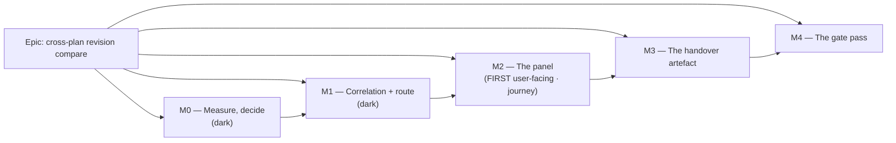

# Implementation Plan: Revision Compare across two imported revisions

- **Feature spec:** [`./feature-spec.md`](./feature-spec.md) — **not yet approved**
- **Status:** Draft — awaiting approval
- **Owner:** _(assigned on approval)_

## Breakdown

### Epic

**Cross-plan revision compare** — let a planner compare two _imported_ revisions of one programme,
which land as two plans (ADR-0050), by correlating on `activities.code` and showing the match before
anything derived from it. Maps to `docs/BACKLOG.md`'s `M` **"Revision Compare — comparing two
IMPORTED revisions"**, the half the three shipped tiers cannot do.

### Standing rules for every task in this plan

These are repeated here rather than assumed, because each has been got wrong in this repository at
least once.

1. **No schema change is planned (spec §3.1). If a task finds it needs a model, a column, an index,
   a constraint or a data migration, that task STOPS and `database-architect` runs first** — without
   exception, and without self-assessing whether the change is big enough to need it (CLAUDE.md
   §19.3). An unavailable or empty agent is a reason to wait, never to proceed.
2. **No `VITE_` flag.** ADR-0088 D1: a `VITE_` constant is inlined at build time, `docker-publish.yml`
   passes none, and it has never been an operator rollback. The rollback contract is the **commit
   boundary**, and each milestone lands as a revertible commit.
3. **Every decision-bearing claim names its evidence** — the command, the file and line, or the test
   (ADR-0076, `docs/PROCESS.md`). A claim inherited from the spec is checked like any other; §0 of
   the spec exists because one inherited claim was false.
4. **Re-verify the PROBLEM, not only the design** (CLAUDE.md §19). A milestone that fixes something
   does not go back and edit the document that complained about it. Before starting each milestone,
   re-read its problem statement against the code.
5. **A gate is finished when it has been made to fail by the defect it names** (ADR-0110 D5), not
   when it passes. Every structural test in this plan is verified **red first**, and the plan says
   against what.
6. **Run the pre-push gate** — `pnpm prepush`, plus `scripts/e2e-local.sh api` for any `apps/api`
   change and `scripts/e2e-local.sh web:<suite>` for any changed journey. CI is the second opinion.
7. **Approved work runs to completion** (`docs/PROCESS.md`, CLAUDE.md §19.12). Finishing a milestone
   is not finishing the epic; the next slice starts in the same turn.

---

## Milestone M0 — Measure the identity model, and the cost (ships dark)

**Outcome:** two numbers, each judged against a condition committed **before** the harness ran, that
decide whether the design in the spec survives contact.
**Ships dark:** `Nothing is reachable. This milestone adds two scripts under
docs/specs/revision-compare-imported/ and an API e2e probe; no route, no UI. M2 surfaces the
capability.`
**Journey:** none — nothing is user-facing (ADR-0081's second state, declared rather than omitted).

#### Feature: the falsification conditions and the two probes

> **Description:** commit `m0-condition.md`; then measure correlation coverage and route cost.
> **Complexity:** M
> **Dependencies:** none — every prerequisite is landed (spec §3.2)
> **Risks:** a harness that returns a verdict it cannot support → it **throws** when either side is
> empty or the two sides are identical (ADR-0097 Landing C's `PROCEED` from an `undefined`;
> ADR-0066's 4.6 ms figure that was really about the cull).
> **Testing requirements:** the probes are the test; each records its environment, and a disqualified
> environment is recorded as such rather than averaged (ADR-0127 D8).

##### Task M0-T1 — Commit the conditions, in their own commit

- **Description:** write `m0-condition.md` with **all three** conditions — P1 (coverage ≥ 95 %),
  P2 (p95 ≤ 250 ms at 2,000 activities per side) and **P3 (the cross-plan overlay's paint cost)** —
  each with its verdict rule and its non-vacuity control, and commit it **before** any harness exists.
- **Complexity:** S
- **Dependencies:** —
- **Risks:** conditions written after seeing the numbers are not conditions → separate commit, and
  the plan says so.
- **Testing:** n/a (a document).
- **Development steps:**
  1. State P1: on a pair differing only in dates, logic and added/removed work, ≥ 95 % of the smaller
     side's **coded** activities correlate. Below ⇒ the identity model is wrong and CQ-2 reopens **on
     that evidence** — which is different from reopening it on preference, since the product owner
     settled it on 2026-09-08.
  2. State P2: p95 ≤ 250 ms end-to-end, the bar ADR-0125 committed and met at 65.8 ms for one side.
     Verdict rule: inside ⇒ the global rate budget stands; materially above ⇒ derive a dedicated
     budget by ADR-0116 M6's `clamp(floor(12_000 / p95), 3, 20)`.
  3. **State P3, which the CQ-3 merge must not swallow** (spec §4.8.5): dropped frames on a
     cross-plan pair at 2,000 activities per side, **Week** framing, on the ADR-0128 staff probe,
     against ADR-0127's **2.00 pp** bar — its bar, not a new one. **INDETERMINATE is a first-class
     verdict** (ADR-0128): if the machine's own baseline spread exceeds the bar the run cannot answer
     and is recorded as disqualified rather than averaged, which is exactly what ADR-0127 D8 did.
     Restate the inherited limits — **one framing, one machine, Fit ungraded**
     (`docs/TECH_DEBT.md` #260).
  4. **State P3's committed prediction, so it can be falsified:** because the cross-plan rule
     **narrows** what is drawn (no lane clause — spec §4.8 D-Ghost-2), the cross-plan overlay should
     cost **no more** than the same-plan one at equal activity counts. Materially more means the lane
     clause leaked back in, and the measurement is what would catch it — not a reviewer.
  5. State all three non-vacuity controls: the two sides must genuinely differ (P1), be non-empty
     (P2), and produce at least one drawn ghost (P3 — an overlay measured on a pair with nothing to
     draw reports the painter's idle cost and says nothing). The harness **throws** otherwise.
  6. Record the environment and what would disqualify it.

##### Task M0-T2 — Probe P1: does the code key actually match?

- **Description:** an API e2e probe that imports two XER files representing Rev B and Rev C of one
  programme into **one project**, then reports the correlation counts.
- **Complexity:** M
- **Dependencies:** M0-T1
- **Risks:** a fixture that matches perfectly because it was written to → the two files are generated
  from one source with **stated, listed** edits (three dated moves, one added activity, one removed,
  one re-logicked, one re-durationed), and the probe asserts each edit is visible in the result.
- **Testing:** the probe is the test; it lands under `apps/api/test/` beside
  `interchange.e2e-spec.ts`.
- **Development steps:**
  1. Build the two fixtures inline, reusing `interchange.e2e-spec.ts:76`'s
     `xerWithCalendar(projectName)` precedent — verified: that helper exists precisely so two files
     can be imported into one project.
  2. Import both through the real REST commit path (never a direct DB write — ADR-0066's rule that
     building the input from persisted rows lets the comparison agree with itself).
  3. Read both plans' activities through the public API and correlate on `code` in the probe.
  4. Report matched / fromUnmatched / toUnmatched / uncoded; judge against P1; record.
  5. **Additionally record how many codes are XER `task_code` and how many are the `task_id`
     fallback** (`xer-adapter.ts:541-551`) — the fallback's stability across two exports is the
     spec's risk R2 and nobody has measured it.

##### Task M0-T3 — Probe P2: what does the route cost?

- **Description:** measure the correlate-and-compare path at 2,000 activities per side.
- **Complexity:** M
- **Dependencies:** M0-T1
- **Risks:** measuring the service before the route exists measures the wrong thing → the probe calls
  the **service method** and the figure is re-derived end-to-end in M1-T4 against the shipped route,
  with both numbers recorded and any divergence stated rather than smoothed (ADR-0125's F3 lesson: a
  second run agreeing to the decimal is more suspicious than one that does not).
- **Testing:** the probe is the test.
- **Development steps:**
  1. Reuse `packages/interchange/scripts/generate-scale-xer.mjs` to build two 2,000-activity sides.
  2. Time the full path: two plan resolutions, both sides' reads, the correlation, the delta and the
     classifier with `?include=changes`.
  3. Judge against P2; record; state the environment.

##### Task M0-T4 — Amend the stale backlog paragraph

- **Description:** `docs/BACKLOG.md:136-141` says a headed paint measurement is owed before any of
  this work. It was taken on 2026-09-08 (ADR-0127 D8a) and the default was flipped (D8b).
- **Complexity:** S
- **Dependencies:** —
- **Risks:** none.
- **Testing:** `pnpm check:doc-links`.
- **Development steps:**
  1. Replace the paragraph with the D8a/D8b outcome, keeping **both** of its stated limits — one
     framing, one machine, Fit ungraded (`docs/TECH_DEBT.md` #260).
  2. Correct the entry's `activity_code` to `code`, and record §0.1's finding that the index the
     entry's premise depends on **does** exist.

---

## Milestone M1 — The correlation model, the cross-plan route, and the overlay's server half (ships dark)

**Outcome:** `GET …/organizations/:orgSlug/cross-plan-revision-compare` answers correctly, with
uniform 404s, the same-plan refusal, the `NO_COMMON_CODES` reason, and **all three `include`
projections — `changes`, `progress` and `ghosts`.**
**Ships dark:** `No UI reaches this route. The client is unchanged and the shipped plan-nested route
is byte-identical. M2 adds the Compare with picker that calls it, and lights the overlay.`
**Journey:** none — declared dark. The journey lands in M2, which is the **first user-facing**
milestone (ADR-0081 §2).

> **Grew by one task after CQ-3 was rejected.** The ghost projection (M1-T4) was M4 in the previous
> plan. Landing it here, dark, is what lets the overlay ship **with** the panel — the product owner's
> requirement — without making M2 a milestone and a half.

#### Feature: `revision-correlate.ts`, the org-scoped route, and the cross-plan ghost projection

> **Description:** a pure correlation module + the cross-plan ghost rule + a controller + a service
> method, reusing the delta and the classifier **unmodified**.
> **Complexity:** L
> **Dependencies:** M0 (P1 must pass, or the identity model changes)
> **Risks:** see per-task. The sharpest is M1-T4's lane clause (rollup R8).
> **Testing requirements:** unit (the pure module and the ghost rule), API e2e (authz, 404
> uniformity, both refusals, every `include` **including `ghosts` alone**), three structural gates,
> and the existing pure suites — `revision-delta.spec.ts`, `revision-changes.spec.ts`,
> `revision-ghosts.spec.ts` — passing **unchanged** as the before/after oracle.

##### Task M1-T1 — The pure correlation module

- **Description:** `apps/api/src/modules/baselines/revision-correlate.ts` — `correlateByCode` and
  `correlateEdges`, projecting both sides into the existing `RevisionRow` / `RevisionEdge` shapes with
  the correlation key in the slot the pure functions already correlate on.
- **Complexity:** M
- **Dependencies:** M0
- **Risks:**
  - _Case-folding creeps in as a "robustness" improvement_ → a unit case asserts `EXC-100` and
    `exc-100` correlate as **two** keys, with the reason (`uq_activities_plan_code` is a
    case-sensitive btree) in the test's own name.
  - _An uncoded row is silently dropped_ → a case asserts it appears in `uncoded` and in **neither**
    `added` nor `removed`.
  - _The edge key collides_ → a case pins `(predCode, succCode, type)`, citing
    `uq_dependencies_pred_succ_type` (migration `:67`) as why it is a natural key per side.
- **Testing:** `revision-correlate.spec.ts` — the five contract clauses (spec §2.4 D1a–D1e), each as
  a named case.
- **Development steps:**
  1. Write the module, named `revision-*` **deliberately**, so `revision-sources.ts:44-48` puts it
     inside both existing structural gates with no roster edit.
  2. Prove that: add a scratch `import { computeSchedule } …`, run
     `revision-delta-engine-free.structural.spec.ts`, **watch it go red**, remove it. Record the red
     output in the PR description.
  3. Do the same for the no-cause gate with a scratch `cause` field.
  4. Write the five contract cases.
  5. Assert the existing `revision-delta.spec.ts` / `revision-changes.spec.ts` /
     `revision-ghosts.spec.ts` pass **unchanged** — the reuse claim's oracle.

##### Task M1-T2 — The index guard

- **Description:** a structural case asserting `uq_activities_plan_code` exists with its exact partial
  predicate, so a future migration relaxing it turns this feature red rather than silently giving the
  correlation two rows for one key.
- **Complexity:** S
- **Dependencies:** M1-T1
- **Risks:** _the test asserts the migration text and passes against a later `DROP INDEX`_ → it
  queries `pg_indexes` on a **real database** in the API e2e tier, not the migration file. Both the
  index name and the `WHERE` clause are asserted.
- **Testing:** the case itself, **verified red** against a fabricated relaxed definition applied in a
  scratch transaction.
- **Development steps:**
  1. Query `pg_indexes` for `uq_activities_plan_code`; assert `indexdef` contains
     `UNIQUE`, `(plan_id, code)` and `WHERE ((deleted_at IS NULL) AND (code IS NOT NULL))`.
  2. Verify red by dropping and recreating it non-uniquely inside a rolled-back transaction.
  3. Docblock: this is what lets §2.4 D1c be a _test_ rather than a branch — spec §0.1.

##### Task M1-T3 — The service method

- **Description:** `ScheduleService.crossPlanRevisionCompare`, a sibling of `revisionCompare`
  (`schedule.service.ts:1449`), reusing its projections and its honesty properties.
- **Complexity:** L
- **Dependencies:** M1-T1
- **Risks:**
  - _A second projection assembly drifts from the shipped one_ → the frozen/live projections are
    **extracted** and shared, not copied; a structural test asserts one definition. This is the
    ADR-0065 `routeOrthogonal` argument, and ADR-0125's own M8 review found the shipped method
    projecting the same array three times.
  - _`existsLive` inherits the wrong meaning_ → it is answered **at the server, per row**, from the
    **anchor** plan's id set (ADR-0126 D9), with a case asserting a row present only in the other
    plan gets `activityId: null`.
  - _The same-plan check runs after the revision check_ → ordering asserted; the same-plan 422 comes
    first, because a same-plan pair is the wrong question whatever revisions it names.
- **Testing:** `schedule.service.spec.ts` additions; the API e2e in M1-T4.
- **Development steps:**
  1. One `resolveScope`; `assertCan('schedule:read')` **and** `assertCan('baseline:read')` — both, for
     the reason the shipped method's comment gives (`:1464-1466`).
  2. Resolve **both** plans with `findActiveByIdInOrg`; either miss ⇒ `NotFoundError('Plan not
found.')`. Resolve both in one round trip, as the shipped method does for its two baselines
     (`:1497-1502`), and for the same stated reason: either miss is the same 404, so resolving them
     together leaks nothing.
  3. `fromPlanId === toPlanId` ⇒ 422 `CROSS_PLAN_SAME_PLAN`, naming the plan-nested route.
  4. Resolve each side's revision (`live`, or `findActiveByIdInPlan` **against its own plan**) ⇒
     uniform 404.
  5. Load both sides; correlate; if `matched === 0` return the typed reason with **no** delta.
  6. Otherwise call the delta and the classifier unchanged (the ghost half is M1-T4); map
     `activityId` back to the anchor plan's UUIDs; assemble `correlation`, `fromPlan`, `toPlan` and
     `frame`.
  7. The measurement frame is the **`from` side's** calendar and factor (ADR-0125 D4), and it is
     **named in the payload** because two plans may differ.
  8. Docblock the parity sentence in ADR-0125 D1's strong form, and say explicitly that ADR-0116 D7's
     weaker sibling does **not** apply here.

##### Task M1-T4 — The cross-plan ghost and link projection (the overlay's server half, dark)

> **This task exists because CQ-3 was rejected** (product owner, 2026-09-08): the overlay ships with
> the panel. Landing its **server** half here, dark, is what keeps M2 a single surface milestone
> rather than a milestone-and-a-half. Nothing reaches it until M2.

- **Description:** the cross-plan branch of `buildRevisionGhosts`, per spec §4.8 D-Ghost-1/2/3.
  `buildRevisionLinkChanges` is expected to need **no change**.
- **Complexity:** M
- **Dependencies:** M1-T1
- **Risks:**
  - **_The lane clause is left in the `moved` test._ This is the epic's single most dangerous
    defect** and it fails silently. `revision-ghosts.ts:81-85` treats `from.laneIndex !== to.laneIndex`
    as a move; cross-plan those indices are incomparable (`interchange.service.ts:387` assigns lane
    by source position, phase 3 repacks by computed dates at `:342-347`, and phase 3 is
    **best-effort** at `:348-351`), so the clause would fire on nearly every activity and the overlay
    would become **the whole old plan drawn on top of the new one** — the design the product owner
    rejected at ADR-0127 CQ-2. Nothing would go red and it would look busy and plausible.
    → A unit case on a pair that is **identical except for lane packing** asserts **zero** ghosts,
    **verified red** against the un-narrowed test.
  - _Removed work is drawn at the frozen lane_ → `RevisionGhostBar.laneIndex` is a required `number`
    (`packages/types/src/index.ts:2935`), so the type refuses the guess; a case asserts removed work
    lands in `undrawable` and in no ghost.
  - _A lane-only difference inflates `undrawable`_ → it must not: undrawable means _a change we could
    not draw_, and an incomparable index is not a change. Asserted separately from the case above,
    because one passing does not imply the other.
  - _The same-plan path regresses_ → `revision-ghosts.spec.ts` must pass **unchanged**; the cross-plan
    rule is a parameter, not a rewrite.
  - **_The cross-plan path is BLIND to ADR-0127 D5's defect, and must not be cited as evidence it is
    safe._** D5 forbids the compare layer culling by `visibleIds`, because removed work is not in
    `scene.activities`. Cross-plan, **every drawn ghost is matched and therefore has a live bar**, so
    reintroducing that cull would be harmless here and still wrong same-plan — a contributor who
    tried it would see the cross-plan cases pass. Noted so the rule survives the widening; the
    same-plan case that D5 records verifying red stays the one that guards it.
- **Testing:** `revision-ghosts.spec.ts` additions (the same-plan cases untouched); the API e2e in
  M1-T5 exercising `?include=ghosts` **alone**.
- **Development steps:**
  1. Add the cross-plan mode to `buildRevisionGhosts`: placement lane from the **anchor** row;
     `moved` = a different start **or** finish only.
  2. Confirm — do not assume — that `buildRevisionLinkChanges` needs no change: its gate is the ids
     present in the plan being drawn on (`:155-168`) and the anchor is fixed as the `to` side, which
     is its own recorded reasoning at `:131-132`. **If that turns out false, it is a finding, not a
     silent fix.**
  3. Write the three cases above, each verified red against the specific defect it names.
  4. Assert `revision-ghosts.spec.ts` passes unchanged.

##### Task M1-T5 — The controller, the DTOs and the API e2e

- **Description:** `CrossPlanRevisionCompareController` + query/response DTOs + OpenAPI + the e2e
  suite.
- **Complexity:** L
- **Dependencies:** M1-T3, M1-T4
- **Risks:**
  - _`?include=changes` arrives as a string, not an array_ → the shipped `@Transform(toArray)` idiom
    is reused verbatim (`revision-compare-query.dto.ts:87`). That defect shipped for one commit and
    **no unit or API test could see it**; the e2e here passes `include` in **both** shapes.
  - _A role-varying field creeps in_ → an ADR-0116 **G4-style** scan over the new DTO, banning
    cost/rate/budget-shaped key names. **Written whole-file, not line-anchored** — ADR-0116's M5 gate
    pass found the line-anchored version passing a Prettier-clean single-line object and a shorthand
    property, and that bypass is pinned as a fixture here.
  - _The shipped route changes_ → its existing e2e cases must pass **unchanged**; a diff on
    `revision-compare-query.dto.ts` or the shipped controller method is a review-blocking finding.
- **Testing:** `apps/api/test/cross-plan-revision-compare.e2e-spec.ts`.
- **Development steps:**
  1. The route at `organizations/:orgSlug/cross-plan-revision-compare`, following the ADR-0045
     precedent `docs/API.md:187-197` states explicitly.
  2. DTOs per spec §4.4; reuse the shipped `UUID_PATTERN` `Matches` idiom for the two revision params.
  3. OpenAPI: the parity sentence, the uniform-404 sentence, the two 422s, the `NO_COMMON_CODES` 200,
     and the rate-limit sentence **derived from M0-T3** rather than copied.
  4. E2e cases: a member reads it; a non-member gets 404; another org's plan gets 404 (**not 403**);
     a soft-deleted plan gets 404; a revision of the _other_ plan named on the wrong side gets 404;
     same plan gets 422; no common codes gets 200 + the reason and **no** delta; uncoded rows are
     listed and in no presence set; `include` in both wire shapes; and each `include` **alone** —
     because ADR-0126 records `?include=ghosts` alone receiving two empty edge sets and lighting
     nothing, caught by exactly this kind of case on its first run.
  5. Re-derive the M0-T3 figure end-to-end and record both, with any divergence stated.
  6. `docs/API.md`: a new sub-section beside "Cross-plan dependencies". Changeset: **minor**.

---

## Milestone M2 — The panel picks another plan, AND the diagram draws it (FIRST user-facing milestone)

> **Re-planned after CQ-3 was rejected** (product owner, 2026-09-08). The panel and the overlay land
> **together**, so there is never a release in which the `Compare on diagram` toggle is present and
> refuses. The alternative — two user-facing milestones — was considered and **would create exactly
> that gap**, which is the requirement rather than a preference.
>
> **What keeps this one milestone rather than one and a half:** the overlay's server half is already
> dark in M1-T4, and the client painter is **shape-driven** — ADR-0127 records that with the two
> scene fields absent the paint is byte-for-byte identical, so the painter consumes
> `RevisionGhostBar[]` / `RevisionLinkChange[]` and does not know where they came from. The
> cross-plan response produces the **same shapes**. So the client work is the picker, the coverage
> block, one **sentence**, and the journey. **That claim is verified in M2-T4, not assumed** — it is
> read from ADR-0127's assertion rather than from the painter.

**Outcome:** a planner compares the open plan against another plan in the same project, sees the
match coverage before the delta, and sees the difference drawn on the diagram.
**Entry point:** the existing **`Analysis ▾ → Compare revisions…`** (`tsld-toolbar-items.tsx:1397-1400`,
accessible name _"Compare revisions…"_), then the new **`Compare with`** `Select` at the top of the
dock; the overlay is reached by the existing **`View ▾ → Compare on diagram`**
(`tsld-toolbar-items.tsx:276-305`), **on by default** since ADR-0127 D8b. **No new dock, no new menu
item, no new router route, no new toggle** — `right-docks.ts:14` already holds `revisions`.
**Journey:** extend `apps/web/e2e-revision-compare/revision-compare.spec.ts` (existing config
`playwright.revision-compare.config.ts`, existing CI step, **no new config**) with a spec that seeds
two plans in one project through the API, opens the dock, chooses the other plan under **Compare
with**, asserts the coverage line and a known non-vacuous delta, **and asserts the overlay draws** —
which matters more here than usual, because the overlay is on the default path and a planner meets it
without asking.

#### Feature: the Compare with picker, the coverage block and the cross-plan overlay

> **Description:** one `Select`, one query branch, one new coverage component, the omission rule for
> other-plan rows, and the overlay's client half — which is one honest sentence plus a verification.
> **Complexity:** L
> **Dependencies:** M1 (including M1-T4's dark ghost projection)
> **Risks:** see per-task.
> **Testing requirements:** unit (panel + coverage component + sentences + the a11y summary), journey
> (the entry point, the overlay, and a real API), axe scan scoped by `[data-revision-compare-panel]` —
> the attribute that exists because a Playwright `:text-is()` selector is not valid CSS and axe
> **throws** on it (`RevisionComparePanel.tsx:176-181`) — and the **P3 measurement** before the
> milestone is called done.

##### Task M2-T1 — The `Compare with` picker

- **Description:** a `Select` above the two revision pickers, listing the other active plans in the
  same project; default **This plan**.
- **Complexity:** M
- **Dependencies:** M1
- **Risks:**
  - _The picker offers a plan the route would 404 on_ → it reads
    `GET …/projects/:projectId/plans` (`project-plans.controller.ts:36-43`), which is already
    org-scoped, and excludes the open plan.
  - _A third select breaks the 380 px dock_ → the picker is on **its own row above** the two, which
    is why the anchor model (CQ-1) is what it is: `use-revision-compare-panel-prefs.ts:14-18` records
    the min being derived from the side-picker row binding at ≈ 400 px.
  - _Loading and empty states collapse_ → "no other plans in this project" is its **own** sentence,
    distinct from "no changes" (ADR-0125's recorded distinction, and ADR-0073 C1's).
- **Testing:** panel unit cases for the four states; the journey drives the real control.
- **Development steps:**
  1. Add the `Select` with a real `Label`, a loading state and an empty state.
  2. Branch the query hook: another plan ⇒ the new route; **This plan** ⇒ the shipped one, unchanged.
  3. Both plans named in the side titles — never "from"/"to" alone.
  4. A unit case asserting **This plan** still calls the shipped route with the shipped params
     (the rollback contract, since there is no flag).

##### Task M2-T2 — The coverage block

- **Description:** `RevisionCorrelationSummary` — the matched/unmatched/uncoded counts and the
  disclosures, rendered **above** the delta.
- **Complexity:** M
- **Dependencies:** M2-T1
- **Risks:**
  - _The counts read as a client's own number_ → each capped list carries its **true total** beside
    it (ADR-0116 D4; ADR-0125's gate pass found two of four sets shipped uncapped while their
    neighbours were capped — the same rule applied to a field and not its sibling).
  - _`NO_COMMON_CODES` renders as an empty delta_ → a case asserts **no** delta and **no** change
    list render in that state, and that the sentence names both plans.
  - _The live region announces the delta before the coverage_ → the announcement states coverage
    first, matching the visual order, and fires **once per settled comparison, never per render**
    (`RevisionComparePanel.tsx:127-132`'s existing idiom, reused rather than re-derived).
- **Testing:** unit cases per state; an axe scan in the journey; a case asserting the announcement
  order.
- **Development steps:**
  1. Build the component from design-system primitives only (`NoticeStrip`, `Label`, the existing
     disclosure idiom). No one-off styling.
  2. Add the sentences to `revision-sentences.ts` — **one module**, shared with the print document,
     which is what stops the two disagreeing.
  3. Include the re-code caveat wherever added/removed render.

##### Task M2-T3 — Reveal, and the omission rule

- **Description:** rows in the anchor plan activate and announce; rows only in the other plan carry
  **no** control and a sentence naming their plan.
- **Complexity:** S
- **Dependencies:** M2-T2
- **Risks:** _the row is shaded instead of omitted_ → ADR-0082's discriminator: the action does not
  apply to the object, so it is **omitted**. A case asserts no disabled control is rendered.
- **Testing:** unit cases both ways; the journey activates one row and asserts the announcement.
- **Development steps:**
  1. Render the activation control only when `activityId !== null`.
  2. Keep the existing announce-on-activation path (`RevisionComparePanel.tsx:144-164`), whose own
     docblock records the announcement being the one line not copied from its sibling.

##### Task M2-T4 — Wire the overlay, and verify the painter needs nothing

- **Description:** feed the cross-plan ghosts and links into the scene, and **verify** the claim that
  the painter requires no change rather than assuming it.
- **Complexity:** M
- **Dependencies:** M2-T1, M1-T4
- **Risks:**
  - **_The claim "the painter is shape-driven" is inherited and unverified._** It comes from
    ADR-0127's assertion that with the two scene fields absent the paint is byte-for-byte identical —
    which implies the painter reads shapes, not provenance. That is a **decision-bearing claim about
    behaviour**, so it is established by reading `paint`'s compare layer and by a test, not by
    quoting the ADR (ADR-0076; `docs/PROCESS.md`'s evidence rule). **If the painter does branch on
    something plan-specific, that is a finding and this task grows** — recorded, not absorbed.
  - _The overlay lights with no pair_ → it already refuses with a stated reason when there is no pair
    (`tsld-toolbar-items.tsx:300-305`); the cross-plan pair must satisfy `hasRevisionPair`, asserted.
  - _A third refusal reason gets added out of habit_ → **there must be none.** The whole point of
    CQ-3's rejection is that the toggle never declines for a cross-plan pair. A case asserts the
    reason is `undefined` in that state.
- **Testing:** unit on the scene-feeding branch; the journey in M2-T6; the counting-stub budget gate
  ADR-0127 D4 already uses.
- **Development steps:**
  1. Feed the cross-plan `ghosts` / `links` into the same scene fields the same-plan pair uses.
  2. Read the painter's compare layer and confirm it branches on shape only; record what was read.
  3. Assert the toggle offers **no** refusal reason for a cross-plan pair with a chosen pair.
  4. Confirm the derived scene-parity gate (ADR-0127 D7) stays green — the lens key and scene fields
     are unchanged, so export composition is **inherited**; if the gate fires, that is the signal that
     it is not.
  5. **Check whether the exported picture's title band names the plan** (ADR-0103). If it does, it
     must name **both** — an exported comparison of two plans that names one is a false statement to
     exactly the reader the export exists for. Checked here rather than assumed in the spec.

##### Task M2-T5 — The undrawable sentence, which must not be reused verbatim

- **Description:** give `compareOverlaySummary` a reason discriminator so the cross-plan sentence is
  **true**.
- **Complexity:** S
- **Dependencies:** M2-T4
- **Risks:**
  - **_The existing sentence ships unchanged and states something false._** `a11y.ts:212` reads
    _"N not shown because the old revision did not record where they were"_. Cross-plan the other
    plan **did** record it; the position is not _comparable_. This is the highest-likelihood defect
    in the milestone precisely because the mechanism is correct and reusing it feels like reuse.
    → A unit case asserts the cross-plan sentence and asserts the same-plan sentence is **unchanged**.
  - _The two sentences drift_ → both live in one function with one discriminator, not two call sites.
- **Testing:** unit cases for both reasons, the same-plan one verified unchanged.
- **Development steps:**
  1. Add the reason parameter; keep the same-plan wording byte-identical.
  2. Write the cross-plan wording: the work is in the other revision only, and the two revisions lay
     their bars out independently — pointing at the change list, which carries it in words.
  3. Assert the `sr-only` list inside the diagram region still names removed work (ADR-0122 D2), so
     the _fact_ survives even though the position does not.

##### Task M2-T6 — The journey (ADR-0081 §2) and the P3 measurement

- **Description:** a spec in the **existing** `e2e-revision-compare` suite that drives the whole
  capability — panel **and** overlay — against a real API; then take P3.
- **Complexity:** M
- **Dependencies:** M2-T5
- **Risks:**
  - _The comparison is non-vacuous by accident_ → the seed gives a **known answer**, following
    `e2e-revision-compare/support.ts:67-85`'s existing rule that a comparison of two identical
    schedules passes an "it rendered" assertion while proving nothing.
  - _Seeding through `page.evaluate` leaves the query cache stale_ → the caller reloads;
    `support.ts:81-84` records that several suites leaned on a `Recalculate` press for invalidation,
    an undocumented side effect ADR-0109 D3 removed (`docs/TECH_DEBT.md` #208).
  - _A control is located by its copy_ → locate by role + accessible name, or by
    `[data-revision-compare-panel]`; **never** by copy (every layout epic here has broken one).
  - _P3 is skipped because the overlay "obviously" costs nothing_ → it is a **task step**, and the
    condition was committed in M0-T1 precisely so this could not be argued away at the end.
- **Testing:** the journey is the test. Run it locally — `scripts/e2e-local.sh web:revision-compare`
  — before pushing, per `docs/PROCESS.md`'s completion criteria.
- **Development steps:**
  1. Seed **two** plans in one project with overlapping codes and a known difference.
  2. Open the dock via `Analysis ▾ → Compare revisions…`; choose the other plan.
  3. Assert the coverage line, the known entered/left rows, and one activation + announcement.
  4. Assert an other-plan-only row renders **no** activation control.
  5. **Assert the overlay draws** for the cross-plan pair, and that the toggle shows no refusal.
  6. **Assert the "not shown" sentence is the cross-plan one**, not the same-plan wording.
  7. Axe scan scoped to `[data-revision-compare-panel]`.
  8. **Take P3** against the M0-T1 condition; record the result, the environment and the verdict —
     including **INDETERMINATE** if the machine cannot answer.

---

## Milestone M3 — The handover artefact

**Outcome:** the printed comparison names both plans, states the coverage and the frame, and carries
the honesty footer.
**Entry point:** the existing **`Print comparison`** button in the dock header
(`RevisionComparePanel.tsx:197-207`) — unchanged control, new content.
**Journey:** the M2 journey gains one step that presses it and asserts the document's own container
renders both plan names. (The suite exists; no new config, no new CI step.)

#### Feature: the printed cross-plan comparison

> **Description:** extend `RevisionComparePrintDocument` for the cross-plan payload.
> **Complexity:** M
> **Dependencies:** M2
> **Risks:** the asymmetry below.
> **Testing requirements:** unit snapshot; a symmetry test; the journey step.

##### Task M3-T1 — Both directions of the symmetry rule

- **Description:** the printed document states **no** fact the screen withholds and withholds **none**
  the screen states.
- **Complexity:** M
- **Dependencies:** M2
- **Risks:** _one direction is asserted and the other is not_ → both are. ADR-0125's gate pass found
  three facts printed while the screen withheld them; ADR-0106's found the inverse. A test walks the
  shared `revision-sentences.ts` and asserts both renderings consume it.
- **Testing:** the symmetry test, **verified red** by removing one sentence from one renderer.
- **Development steps:**
  1. Add both plans, both projects, the coverage, the frame and the re-code caveat.
  2. Print the correlation lists **in full** where the screen caps them — paper has no "load more"
     (ADR-0116's rule) — with the cap stated in words on screen.
  3. Write the symmetry test; verify red both ways.

---

## Milestone M4 — The gate pass

**Outcome:** the epic's combined diff has been through the specialist reviewers and every blocking
finding is folded with a regression test verified red first.
**Ships dark:** `No new capability. This milestone changes code only where a review blocks.`
**Journey:** the existing suite is re-run in full.

#### Feature: the deferred specialist reviews

> **Description:** six reviewers over the combined diff.
> **Complexity:** M
> **Dependencies:** M3
> **Risks:** _a pass with no findings_ → that is a reason to check the reviews ran, not a result.
> Nine consecutive epics here found defects that had passed a human read.
> **Testing requirements:** each folded finding carries a regression test **verified red against the
> specific defect it names**.

##### Task M4-T1 — Run them, fold the blockers

- **Description:** `security-reviewer`, `api-reviewer`, `backend-performance-reviewer`,
  `component-reviewer`, `accessibility-reviewer`, `ux-reviewer`.
- **Complexity:** M
- **Dependencies:** M3
- **Risks:** _a finding is recorded and rushed_ → non-blocking findings become a numbered
  `docs/TECH_DEBT.md` row with a real status, per ADR-0120's vocabulary; the register's heading
  convention (`### <n>. <title>`) is followed, per ADR-0124.
- **Testing:** as above.
- **Development steps:**
  1. Run all six over the combined diff; ask each to **re-derive** this epic's own measurements from
     the final code rather than accept them.
  2. Fold every blocking finding with a red-first regression test.
  3. File non-blocking findings as one register row with reasons.
  4. File the ADR (§4.9), **verifying the number is still free at filing** (ADR-0071), add it to
     `docs/adr/README.md` (gated by `check:adr-coverage` in both directions since ADR-0110 D6), and
     update `CLAUDE.md` §16.
  5. Run `scripts/e2e-sweep.sh` — **every** journey, not only the one CI names. ADR-0091 M7 records
     three journeys breaking across one epic because the suite CI named was fixed and the others were
     not swept.

---

## Sequencing & slices

| Slice  | Ships                                           | Releasable alone?                     | Reversible by |
| ------ | ----------------------------------------------- | ------------------------------------- | ------------- |
| **M0** | Two measurements + three conditions + a doc fix | Yes — no product change               | n/a           |
| **M1** | A dark route **and a dark ghost projection**    | Yes — nothing reaches either          | Commit revert |
| **M2** | The capability **and the overlay, together**    | Yes — **the first user-facing slice** | Commit revert |
| **M3** | The handover artefact                           | Yes                                   | Commit revert |
| **M4** | The gate pass                                   | Yes                                   | n/a           |

**Why the overlay is not its own slice.** The product owner's requirement (CQ-3, 2026-09-08) is that
there is **no release in which the toggle is present and refuses**. Splitting the surface in two —
panel, then overlay — creates precisely that release, so it is not available however tidy it looks.
The split that _is_ available is **plumbing from surface**, which is what M1/M2 already are: the
ghost projection lands dark in M1-T4, leaving M2's overlay work to a wiring task, one sentence and a
journey step.

**No feature flag** (standing rule 2). The rollback contract is the commit boundary, and each
milestone is one revertible commit — which is why M2 keeps a unit case asserting that **This plan**
still calls the shipped route with the shipped params.

**`main` stays releasable at every point**: M0 and M1 are dark by construction, and M2 onwards
changes only the revision dock and one canvas layer, both reached from existing controls.

**Version impact:** `api` **minor** (a new route), `web` **minor** (a new capability). Pre-1.0, so a
breaking change would also be minor — none is intended, and M1-T5 asserts the shipped route is
byte-identical.

## Definition of Done (per task)

Each task's PR must satisfy the Feature Completion Criteria in
[`docs/PROCESS.md`](../../PROCESS.md) — code, tests, docs, security, performance, accessibility,
Docker build, CI, changelog, version impact — **plus** the seven standing rules at the top of this
plan, of which two are worth restating because they are the ones most often skipped:

- **`pnpm prepush` was run, and `scripts/e2e-local.sh api` for any `apps/api` change** — not "CI will
  catch it". A journey drives a real browser against a real API and no unit suite can tell you a
  locator or an accessible name is wrong.
- **Any schema need stops the task and runs `database-architect` first** (CLAUDE.md §19.3).

## Risks & assumptions (rollup)

| #   | Risk / assumption                                                                                                                                                                                                                                                                                                          | Likelihood | Impact   | Mitigation                                                                                                                                                                                                                                                                                                                                                                                                             |
| --- | -------------------------------------------------------------------------------------------------------------------------------------------------------------------------------------------------------------------------------------------------------------------------------------------------------------------------- | ---------- | -------- | ---------------------------------------------------------------------------------------------------------------------------------------------------------------------------------------------------------------------------------------------------------------------------------------------------------------------------------------------------------------------------------------------------------------------- |
| R1  | **A code re-used for different work** across two revisions correlates two unrelated activities, silently                                                                                                                                                                                                                   | low        | high     | Undetectable by construction. Stated in the copy and in the ADR's consequences; the coverage block gives the reader the one lever they have. Not mitigated further, and the plan says so rather than implying a fidelity the design does not have.                                                                                                                                                                     |
| R2  | **MSPDI codes are positional.** `mspdi-adapter.ts:453` falls back to `<WBS>`, an outline number like `1.2.3`, which renumbers when a task is inserted — so two MSPDI revisions may correlate badly. **This is reasoned from the MSPDI schema, not observed in a real file in this repository** (ADR-0083's labelling rule) | med        | med      | M0-T2 records the code provenance split. If MSPDI correlates poorly, the panel states it per source rather than the epic pretending format-independence.                                                                                                                                                                                                                                                               |
| R3  | The XER **`task_id` fallback** (`xer-adapter.ts:541-551`) is file-local; two exports from different P6 databases would not share it                                                                                                                                                                                        | low        | med      | M0-T2 counts fallback-derived codes. A high count is a finding, not a silent degradation.                                                                                                                                                                                                                                                                                                                              |
| R4  | **M0-P1 fails** (< 95 % coverage)                                                                                                                                                                                                                                                                                          | low        | high     | CQ-2 reopens; the name-fallback design is costed and put to the product owner. M1 has not started.                                                                                                                                                                                                                                                                                                                     |
| R5  | **M0-P2 fails** (> 250 ms)                                                                                                                                                                                                                                                                                                 | low        | med      | A dedicated rate budget is derived by ADR-0116 M6's committed formula. The rule exists before the number.                                                                                                                                                                                                                                                                                                              |
| R5a | **P3 returns INDETERMINATE** — the machine's baseline spread exceeds the 2.00 pp bar, exactly as ADR-0127 D8's container did                                                                                                                                                                                               | med        | low      | Recorded as disqualified rather than averaged, and the environment named. It is not a blocker: the same-plan overlay already ships default-on on this evidence base, and the cross-plan rule draws **strictly less**. Escalates only if a headed run also cannot answer.                                                                                                                                               |
| R6  | A **second projection assembly** drifts from the shipped one                                                                                                                                                                                                                                                               | med        | med      | Extract and share; a structural test asserts one definition (M1-T3).                                                                                                                                                                                                                                                                                                                                                   |
| R7  | The **shipped route changes** by accident                                                                                                                                                                                                                                                                                  | low        | high     | Its existing e2e cases must pass unchanged; a diff on its DTO or method is a review-blocking finding (M1-T5).                                                                                                                                                                                                                                                                                                          |
| R8  | **The lane clause survives into the cross-plan `moved` test**, so the overlay silently becomes the whole-old-plan design rejected at ADR-0127 CQ-2 — busy, plausible, and failing nothing                                                                                                                                  | **med**    | **high** | **The epic's most dangerous defect.** A unit case on a pair identical except for lane packing asserts **zero** ghosts, verified red (M1-T4). P3 carries a committed prediction that the cross-plan overlay costs **no more** than the same-plan one — materially more means the clause leaked back (M0-T1 step 4).                                                                                                     |
| R8a | The **existing undrawable sentence is reused verbatim** and states something false — the other plan _did_ record the lane; the position is not comparable                                                                                                                                                                  | **high**   | med      | Highest-likelihood defect in M2 precisely because the mechanism is correct and reusing it feels like reuse. M2-T5 adds a reason discriminator, with a case for each wording and the same-plan one asserted unchanged.                                                                                                                                                                                                  |
| R8b | The claim **"the painter needs no change"** is inherited from ADR-0127's assertion rather than read from the painter                                                                                                                                                                                                       | med        | med      | M2-T4 verifies it by reading the compare layer and by a test, and records what was read. If the painter branches on anything plan-specific, that is a **finding** and M2 grows — recorded, not absorbed (ADR-0076).                                                                                                                                                                                                    |
| R8c | **The overlay is default-on** (ADR-0127 D8b), so a cross-plan pair draws **immediately and unrequested** — its correctness is on the default path from day one                                                                                                                                                             | med        | med      | This is what the product owner asked for at CQ-3, with its cost. The journey drives the overlay rather than leaving it to the gate pass (M2-T6), and P3 is a task step rather than a closing formality.                                                                                                                                                                                                                |
| R9  | A **`docs/TEST_PLAYBOOK.md`** row is owed if any seeded plan is added to the catalogue                                                                                                                                                                                                                                     | low        | low      | `pnpm check:playbook` gates it in both directions. **No row is owed by this plan, and that was checked rather than assumed:** `scripts/check-playbook.mjs:38-42` builds its inventory from `seed --list-plans` (`@repo/seed-cli` over `packages/seed`'s `SeedSpec`s), so M0-T2's test-local XER fixtures under `apps/api/test/` are invisible to it. If any milestone adds a `SeedSpec`, the row lands in the same PR. |
| R10 | **Assumption:** two revisions of one programme are imported into the **same project**                                                                                                                                                                                                                                      | med        | low      | True of the interchange workflow (import is nested under `:projectId` — `interchange.controller.ts:58`). If a planner splits them across projects, the route still works (same-org is the boundary); only the **picker** would not offer it. Named as a picker limitation, not a rule, and revisited from use.                                                                                                         |
