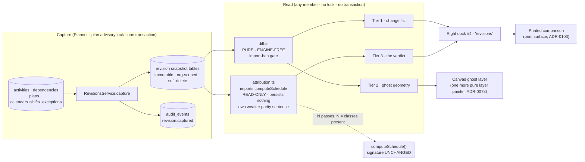
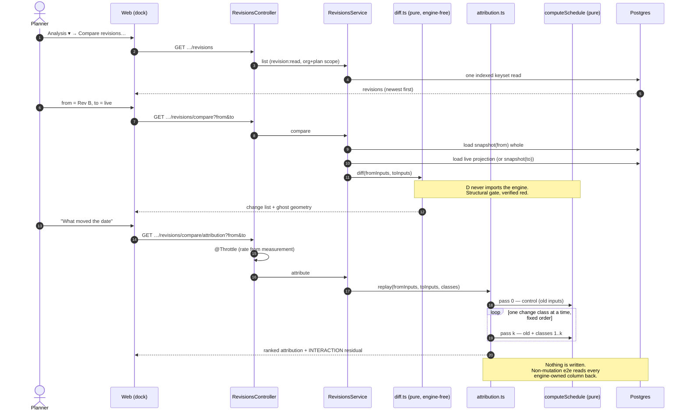
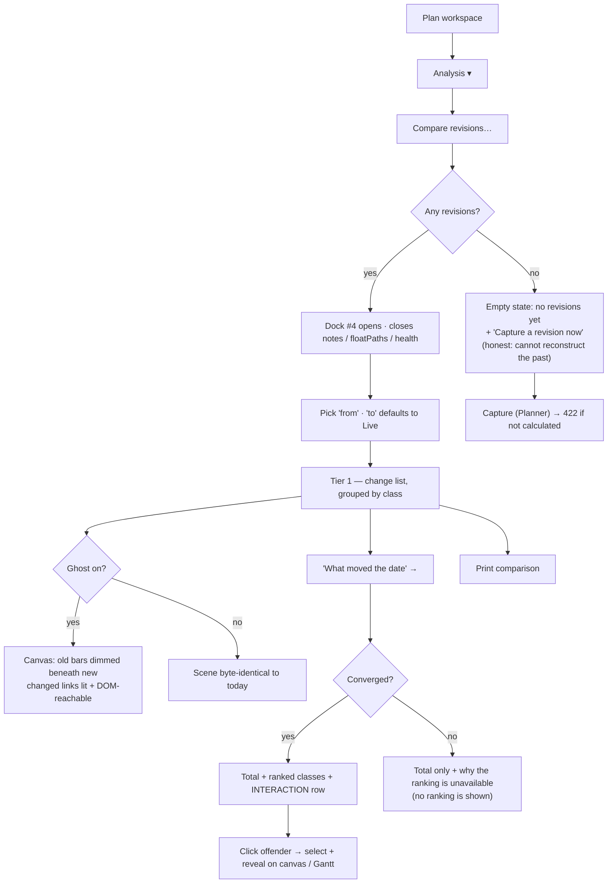

# Feature Spec: Revision Compare

- **Status:** Draft — **awaiting approval before implementation**
- **Author(s):** feature-analyst (Product Owner / Solution Architect / Technical Lead hats)
- **Date:** 2026-09-03
- **Tracking issue / epic:** _(to be opened on approval)_
- **Roadmap link:** [`docs/ROADMAP.md`](../../ROADMAP.md) → "Next → Product features"; parked entry in
  [`docs/BACKLOG.md:106-126`](../../BACKLOG.md)
- **Related ADR(s):** **ADR-0125 (to be written — required before any code).** Builds on ADR-0025
  (baseline snapshot-copy), ADR-0022/0023 (recalculation + date convention), ADR-0034 (conformance
  and the parity gate), ADR-0036/0037/0068 (calendars, instants, hours-per-day), ADR-0038 (WBS),
  ADR-0050 (interchange), ADR-0078 (canvas layer painters), ADR-0092 (the dock), ADR-0096
  (retention), ADR-0103 (paper is a surface), ADR-0116 (the read-only what-if pass, D7).

> **Number check.** ADR-0125 is the next free number as of 2026-09-03 (`docs/adr/` holds 0001–0124,
> verified by listing the directory). ADR-0079 was filed one number along from the number its own
> plan named, because the number was taken between the plan and the milestone. **Re-check at filing
> time and record the collision rather than routing around it** (the ADR-0071 lesson).

---

## 0. What was verified before this spec was written

This spec is written against the code, not against the backlog entry. §19.11 of `CLAUDE.md`
requires a decision-bearing claim to carry the command, file or test that established it, and
requires the brief itself to be checked like any other claim. Six things were checked; **three
were wrong or incomplete, and all three change the work.**

| #   | Claim (source)                                                                                  | Verified                                                                                                                                                                                                                                                                                                                                                                                  | Verdict                                                                                                                                                                                                                                                                                                                                                                                                                                                                                      |
| --- | ----------------------------------------------------------------------------------------------- | ----------------------------------------------------------------------------------------------------------------------------------------------------------------------------------------------------------------------------------------------------------------------------------------------------------------------------------------------------------------------------------------- | -------------------------------------------------------------------------------------------------------------------------------------------------------------------------------------------------------------------------------------------------------------------------------------------------------------------------------------------------------------------------------------------------------------------------------------------------------------------------------------------- |
| V1  | `BaselineDependency` does not exist (brief; `docs/BACKLOG.md:122`)                              | `grep -n 'model Baseline' apps/api/prisma/schema.prisma` → `1735 Baseline`, `1812 BaselineActivity`, `1928 BaselineAssignment`. No `BaselineDependency`.                                                                                                                                                                                                                                  | **Correct**                                                                                                                                                                                                                                                                                                                                                                                                                                                                                  |
| V2  | `BaselineActivity` holds 25 fields, no constraint / calendar / parent / lane / progress (brief) | `apps/api/prisma/schema.prisma:1812-1892` — 23 scalars + 2 relations. Confirmed absent: `constraintType`, `constraintDate`, `secondary*`, `calendarId`, `parentId`, `laneIndex`, `visualStart`, `external*`, `actualStart`, `actualFinish`, `percentComplete`, `remainingDurationMinutes`, `suspendDate`, `resumeDate`, `expectedFinish`, `scheduleAsLateAsPossible`, `levelingPriority`. | **Correct**                                                                                                                                                                                                                                                                                                                                                                                                                                                                                  |
| V3  | `BaselineAssignment` exists, so "resource assignments _are_ snapshotted" (brief)                | `schema.prisma:1928-2010`. It freezes **`budgetedCost` and `lagMinutes` only**, plus three correlation ids. Its own docblock, `schema.prisma:1923-1927`: _"WHAT IS DELIBERATELY **NOT** FROZEN HERE: `budgeted_units`, `units_per_hour`, `curve_type` and the activity's `accrual_type`."_                                                                                                | **Narrowed.** It answers _"did the committed money change"_, not _"did you change the resource loading"_. `units_per_hour` is the levelling demand input (ADR-0041 §2, `schedule.service.ts:1318`) and is **not** frozen, so a baseline cannot report a levelling-relevant resource change at all.                                                                                                                                                                                           |
| V4  | `computeSchedule` is at `compute.ts:141` (brief)                                                | `apps/api/src/modules/schedule/engine/compute.ts:141`                                                                                                                                                                                                                                                                                                                                     | **Correct**                                                                                                                                                                                                                                                                                                                                                                                                                                                                                  |
| V5  | The conformance fixture holds exactly **129** activities (brief)                                | `grep -c '"original_duration_h":' packages/engine-conformance/fixtures/p6_torture_test_v1.json` → **129**. Also `grep -c '"type": "\(FS\|SS\|FF\|SF\)"'` → **188** relationships; the `wbs` array (`:762`) holds **18** nodes (`grep -c '"parent":'` → 18).                                                                                                                               | **Correct about the file, wrong about the thing M0 measures.** `docs/TEST_PLAYBOOK.md:43` records the **seeded plan** as **147 activities** — 129 tasks + 18 `WBS_SUMMARY` rows — and 188 dependencies. The same file says "the full 129-activity fixture" at `:24` and "One plan, 129 activities" at `:38`, so the document itself gives both numbers for different objects. **M0's falsification condition names a number, so it must name the right one: 147 activity rows / 188 edges.** |
| V6  | The backlog's problem statement is current (brief asks: check it)                               | It is **stale, in the helpful direction** — see §0.1.                                                                                                                                                                                                                                                                                                                                     | **Changed**                                                                                                                                                                                                                                                                                                                                                                                                                                                                                  |

**One more correction, out of scope but recorded rather than stepped over:**
`docs/DATABASE.md:650` says `BaselineActivity` duplicates `duration_days`. The column is
`durationMinutes` (`schema.prisma:1828`), changed by ADR-0036. A spec written from that document
rather than from the schema would inherit a wrong field name. Not this epic's to fix; filed as a
suggestion in the plan's rollup.

### 0.1 The problem statement moved — verify the problem, not only the design

`CLAUDE.md` §19.11 records that a spec's **problem** goes stale in the direction nobody checks:
somebody fixes it and the document keeps complaining. The backlog entry was parked **2026-08-27**.
**On 2026-08-28, ADR-0116 M6 shipped `apps/api/src/modules/schedule/critical-path-test.ts`** — and
it is Tier 3's mechanism, already in production:

- It imports `computeSchedule`, runs a **control pass and a perturbed pass** on an in-memory copy of
  the input graph, and **persists nothing** (`critical-path-test.ts:8-21`, `:102-147`).
- It carries **its own, weaker parity sentence**, explicitly forbidden from inheriting the report's
  "the engine is not imported" claim (ADR-0116 D7, `docs/adr/0116-…:63-69`). That is the exact
  sentence Tier 3 needs and the exact mistake Tier 3 could make.
- Its cost was **measured with the falsification condition committed first**: 260.5 ms p95 at
  scale-500 (1.18× a recalculate), **846.5 ms p95 at 2,000 activities** over the whole real route
  (1.22×), with a recalculate at 2,000 measured at 694.3 ms p95 (`docs/adr/0116-…:189-194`). So
  **one extra engine pass at 2,000 activities costs roughly 150 ms** — a real number Tier 3's cost
  model can be built on instead of a guess.
- It records the **trap Tier 3 has too**, already paid for once: measuring the **max-over-all
  project finish** passes a plan whose downstream logic absorbed everything, because the perturbed
  activity's own finish moves unconditionally. The shipped rule watches the **completion carrier** —
  the control run's latest-finishing non-summary activity (`critical-path-test.ts:149-166`). A
  fixture written against the first draft proved the defect.

**What this changes.** The backlog reasons that Tier 3 "is answerable here because `computeSchedule`
is a pure function with a conformance harness". True, and now understated: the product already
ships a read-only what-if pass with a measured cost and a measured throttle. **The research risk is
therefore not the mechanism.** It is narrower and sharper: _does one-change-at-a-time replay produce
an attribution that is complete and stable enough to put in front of a planner as a verdict?_ §4.6
turns that into a predicate M0 can fail.

### 0.2 Two facts the brief did not name that change scope

- **`cost:read` is Planner + Org Admin only** (`apps/api/src/common/auth/org-permissions.ts:121-128`),
  while `schedule:read` and `baseline:read` are every-member (`:170-181`). A change list that
  includes cost is therefore **not one document for one audience**. ADR-0116 spent a whole structural
  gate (G4) keeping its health report role-invariant so one URL produces one handover document. This
  spec must decide the same question explicitly → **CQ-3**.
- **Interchange import always creates a NEW plan** (`apps/api/src/modules/interchange/interchange.service.ts:114`,
  `:189`). Two P6 revisions therefore land as two plans with **unrelated activity UUIDs**, so the
  "their files" tier's correlation key cannot be an id. It has to be `activities.code`, which is
  **nullable** and unique only _per plan among active rows_
  (`schema.prisma:1234-1236`, `uq_activities_plan_code`). That is an identity-model fork, not a
  detail → **CQ-2**.

---

## 1. Business understanding

### Problem

A planner is asked, constantly and by people who do not use the tool: **"what changed since last
month, and why is the job three weeks later?"** SchedulePoint cannot answer either half.

It can answer a different, adjacent question. `POST …/baselines` freezes a plan of record and
`computeVariance` (`apps/api/src/modules/baselines/variance.ts:67`) reports, per activity, whether
it is **later than it was**. That is _variance_ — is this activity behind. It is not _change_ — what
did you alter. The distinction is structural rather than a missing feature:

**A baseline holds almost none of the engine's input.** Enumerated against `EngineActivity`
(`apps/api/src/modules/schedule/engine/types.ts:39-154`) and the projection that builds it
(`schedule.service.ts:1390-1439`):

| Engine input surface                                            | Count                                                                         | Frozen by a baseline                                                |
| --------------------------------------------------------------- | ----------------------------------------------------------------------------- | ------------------------------------------------------------------- |
| `EngineActivity` fields                                         | 18                                                                            | **2** (`durationMinutes`, `type`)                                   |
| `EngineEdge` fields                                             | 6 (`id`, `predecessorId`, `successorId`, `type`, `lagMinutes`, `lagCalendar`) | **0** — there is no `BaselineDependency` model                      |
| `ComputeOptions` plan scalars                                   | 8 (`schedule.service.ts:1262-1280`)                                           | **0**                                                               |
| Working-time definition (shifts, exceptions, exception windows) | —                                                                             | **0** — only the scalar `hoursPerDayMinutes` (`schema.prisma:1760`) |
| Presentation needed to redraw (`laneIndex`, `parentId`)         | 2                                                                             | **0**                                                               |

So the two most common real changes on a construction programme — **somebody moved a logic tie**,
and **somebody changed the working week** — are both completely invisible to every comparison the
product can currently make. A baseline can tell you piling finished eight days late. It cannot tell
you that the reason is an FS link that became SS with a −5 d lead, because it never knew there was
a link.

**Why now.** Three reasons, in order:

1. The product owner approved starting it on 2026-09-03, having parked it on 2026-08-27.
2. The mechanism Tier 3 needs stopped being hypothetical on 2026-08-28 (§0.1).
3. The **differentiator is perishable and specific to this product's primary surface.** Every
   Gantt-shaped competitor can render a change _table_. Tier 2 — the diagram painted twice, old
   revision ghosted beneath new, changed arrows lit — is only possible because SchedulePoint's
   primary editing surface is a time-scaled logic diagram (PROJECT_BRIEF §1). Logic change is
   invisible in a Gantt row and obvious in a TSLD.

### Users

All organisation-scoped, ADR-0012 / ADR-0016 roles.

| Role                          | Need                                                                                                                                                          |
| ----------------------------- | ------------------------------------------------------------------------------------------------------------------------------------------------------------- |
| **Planner**                   | Capture a revision before a re-plan; then answer "what did I change" and "which of my changes cost the date" — to themselves first, before anyone asks.       |
| **Org Admin**                 | The same, plus governance: which revisions exist, who captured them, and when they expire.                                                                    |
| **Contributor**               | Read a comparison. Contributors report progress; a progress change is a change, and being able to see the plan moved under them is a read, not a write.       |
| **Viewer**                    | Read a comparison. This is the reporting audience — the person the planner is preparing the answer _for_.                                                     |
| **External Guest** (ADR-0051) | **Out of scope.** The guest scope is a fixed read-only `SCHEDULE_READ` (ADR-0051), deliberately narrow. Widening it is its own decision and is not made here. |

### Primary use cases

1. **Capture a revision** of a plan at a meaningful moment (before a re-plan; on import).
2. **Read the change list** between two revisions, or between a revision and the live plan —
   added / removed / re-dated / re-durationed / re-logicked / re-constrained / re-calendared /
   re-parented / progressed.
3. **See the change** on the diagram: the old revision ghosted under the new, changed logic lit.
4. **Read the verdict**: completion moved N working days; here is the chain of changes responsible,
   ranked by what each cost, with the un-attributable interaction stated rather than hidden.
5. **Print / export the comparison** as the handover artefact — a document somebody who does not use
   the tool can read (ADR-0103's rule: what the product _produces_ is a surface too).

### User journeys

**Happy path (the one this exists for).** A planner has a Rev C review on Friday. On Monday they
open the plan, `Analysis ▾ → Compare revisions…`, pick `Rev B (2026-08-24)` against **Live**. The
dock lists 41 changes in seven classes. They switch the ghost on: the old bars sit faint beneath
the new ones and three arrows are lit amber. They open **What moved the date**: completion moved
**+19 working days**, of which _logic_ accounts for 12, _duration_ for 6, _calendar_ for 2, and an
**interaction** row carries −1. They click the top offender; the canvas selects and reveals it. They
print the comparison and take it to the meeting.

**Alternate — no revision exists.** The dock's empty state says so and offers **Capture a revision
now**, which is honest about what it can and cannot then answer: a first capture makes future
comparisons possible and cannot reconstruct the past.

**Alternate — the plan has never been calculated.** `PLAN_NOT_SCHEDULED` is the seed catalogue's own
resting state (ADR-0116 M0-T1), not an edge case. Capture is refused with that reason; comparison of
two revisions that _were_ calculated still works.

**Alternate — Tier 3 cannot attribute.** If the attribution does not converge for this particular
comparison, the verdict panel says **that**, names the total movement it _can_ state, and does not
manufacture a ranking. See §2 ER-7.

### Expected outcomes

- A planner answers "what changed" in seconds, from the product, instead of by diffing two P6
  exports by eye or not answering.
- The reason a date moved is **attributable** rather than asserted, and the un-attributable part is
  named rather than absorbed.
- The comparison is a **handover artefact**: one URL, one printed document, role-invariant within
  its declared scope (subject to CQ-3).

### Success criteria

| #   | Criterion                                                                                         | Measured how                                                                                                                                                                                                                                                |
| --- | ------------------------------------------------------------------------------------------------- | ----------------------------------------------------------------------------------------------------------------------------------------------------------------------------------------------------------------------------------------------------------- |
| S1  | The change list for the 147-row fixture renders in **≤ 1.0 s p95** end-to-end over the real route | Measurement harness, ADR-0116 M6-T0 pattern                                                                                                                                                                                                                 |
| S2  | Tier 1 is provably **engine-free**                                                                | An import-ban structural test on the diff module, verified red first — the `health-engine-free.structural.spec.ts` precedent (`apps/api/src/modules/schedule/health/health-engine-free.structural.spec.ts:26-53`), including its pinned non-zero-files case |
| S3  | Capture leaves the recalculation **byte-identical**                                               | Structural: capture calls no engine and adds no column to `activities`; plus the unchanged golden suite (`conformance/goldens.spec.ts`) and the pairwise differential (`apps/api/test/pairwise/pairwise-differential.e2e-spec.ts`)                          |
| S4  | Tier 3 **persists nothing**                                                                       | Non-mutation API e2e reading every engine-owned column back after the call and asserting equality — the ADR-0116 M6 proof, which was itself re-verified red against a newly covered column                                                                  |
| S5  | Tier 3 attribution **converges** on the fixture                                                   | The M0 predicate, §4.6 — committed before the run, allowed to say no                                                                                                                                                                                        |
| S6  | Tier 3 cost                                                                                       | ≤ **3.0 s p95** over the real route at 2,000 activities, with a throttle derived from the measurement, not copied                                                                                                                                           |
| S7  | A planner reaches the change list from the diagram                                                | Flag-on-equivalent journey `apps/web/e2e-revision-compare/`, landing with **M2** (ADR-0081 §2), driving a real browser against a real API                                                                                                                   |

### Open questions

Critical ones are **CQ-1 … CQ-4** in §6. Everything else has a stated default and is not blocking.

---

## 2. Functional requirements

### User stories & acceptance criteria

> **US-1** — As a **Planner**, I want to capture a named revision of a plan, so that I have a fixed
> point to compare later work against.
>
> - **Given** a plan with a computed schedule and I hold `revision:create`, **when** I capture a
>   revision with a name, **then** it is created, immutable, and listed with its capture instant,
>   its data date and its project finish.
> - **Given** the plan has never been calculated, **when** I capture, **then** it is refused with
>   `SCHEDULE_NOT_CALCULATED` (422) — the `baselines.service.ts:139` precedent, same reason string
>   class.
> - **Given** a revision of that name already exists and is live, **when** I capture, **then** 409
>   `DUPLICATE_REVISION`; a soft-deleted name is free to reuse (the `uq_baselines_plan_name` shape).
> - **Given** I hold only `revision:read`, **when** I attempt capture, **then** 403.
> - **Given** a capture is in flight, **when** a recalculation runs, **then** the capture read is
>   serialised by the **existing plan advisory lock** — never taken mid-recalculation (ADR-0025's
>   rule, `docs/DATABASE.md:683-684`).

> **US-2** — As **any member**, I want the list of changes between two revisions, so that I can say
> what was altered.
>
> - **Given** two revisions of one plan, **when** I compare, **then** I get every change grouped by
>   **class**: `ACTIVITY_ADDED`, `ACTIVITY_REMOVED`, `DURATION`, `LOGIC` (edge added / removed /
>   type changed / lag changed), `CONSTRAINT`, `CALENDAR`, `WBS_PARENT`, `PROGRESS`,
>   `EXTERNAL_BOUND`, `PLAN_OPTION`, `DATE` (an activity whose computed dates moved with no input
>   change of its own — i.e. it was _pushed_).
> - **Given** a change, **then** it carries the **old value and the new value** in the same
>   denomination the planner types (days with the `d`/`h`/`m` grammar for durations and lags,
>   ADR-0070; `YYYY-MM-DD` for dates), not raw working minutes.
> - **Given** `to=live`, **when** I compare, **then** the right-hand side is the current plan and no
>   capture is required.
> - **Given** the two revisions are identical, **then** I get an explicit **"no changes"** result —
>   distinguishable from "nothing loaded" (ADR-0073 C1's live-region lesson: "nothing recorded" and
>   "nothing matches" are different facts).
> - **Given** I am not a member of the organisation, **then** 404 — never 403 (no existence oracle).

> **US-3** — As a **Planner**, I want the old revision drawn beneath the new one on the diagram, so
> that I can see the change rather than read about it.
>
> - **Given** a comparison is open, **when** I switch the ghost on, **then** each activity present in
>   the old revision paints a dimmed bar at **its old position** (old lane, old dates), beneath the
>   live bar layer.
> - **Given** a logic tie changed, **then** its link is drawn in the change colour and is reachable
>   from the parallel focusable DOM layer (ADR-0026 D7) — colour is never the sole channel
>   (WCAG 1.4.1).
> - **Given** the ghost is on, **when** I export or print the diagram, **then** the ghost is in the
>   deliverable — ADR-0103's rule that the exported diagram _is_ the diagram — **or** it is
>   deliberately excluded and the exported document says so.
> - **Given** the ghost is off, **then** the scene paints **byte-for-byte** as it does today (the
>   layer contributes zero calls) — a counting-stub gate, the ADR-0054 shape.

> **US-4** — As a **Planner**, I want to know which changes moved the completion date, so that I can
> explain the slip.
>
> - **Given** a comparison whose completion moved, **when** I open the verdict, **then** I see the
>   total movement in working days, a **ranked** list of change classes with the working days each
>   accounts for, and an explicit **Interaction** row carrying the residual.
> - **Given** the residual is non-zero, **then** it is **shown**, never distributed across the
>   ranked classes. Distributing it turns a measurement into a fabrication.
> - **Given** attribution does not converge for this comparison, **then** the panel states the total
>   movement and says the ranking is unavailable and why — it never shows a ranking it does not
>   trust (§ER-7).
> - **Given** I click an offender, **then** the canvas selects and reveals it; in the Gantt the row
>   is revealed through the ADR-0116 reveal channel (selection alone scrolls nothing there).
> - **Given** I request attribution repeatedly, **then** the route throttles at a rate derived from
>   its own measurement, and the refusal says so.

> **US-5** — As an **Org Admin**, I want revisions to expire, so that a plan's history does not grow
> without bound.
>
> - **Given** a soft-deleted revision past the retention period, **then** it is permanently deleted
>   by the ADR-0096 sweep, which is **off by default** and armed by an operator.
> - **Given** a plan is soft-deleted, **then** its revisions cascade under **one** `delete_batch_id`
>   and restore with it (ADR-0025 / ADR-0046 precedent).

### Workflows

**Capture.** Resolve org from `:orgSlug` → resolve plan → `revision:create` → take the plan advisory
lock → assert the plan has a computed schedule → read the _whole_ engine input surface plus the
computed output plus the working-time definitions → write the snapshot in one transaction → audit
(`revision.captured`, an audited **create**, on the ADR-0073 blast-radius test, the
`baseline.captured` precedent, `baselines.service.ts:172-188`) → release.

**Compare (Tiers 1 + 2).** Resolve → `revision:read` → load both snapshots whole → **pure diff, no
engine, no lock, no transaction** → return the change list plus the frozen geometry the ghost layer
needs. Loading a whole snapshot is the only read shape, exactly as the baseline snapshot is loaded
whole (`schema.prisma:1990-1994`).

**Attribute (Tier 3).** Resolve → `revision:read` → throttle → load both snapshots whole →
reconstruct `EngineActivity[]` / `EngineEdge[]` / `ComputeOptions` from the **frozen** columns for
both sides → run the control pass → apply change classes one at a time in the fixed order, running a
pass after each → measure the **completion carrier's** movement per step → return the ranked
attribution plus the interaction residual. **Nothing is written.**

### Edge cases

| Case                                                              | Behaviour                                                                                                                                                                                                                        |
| ----------------------------------------------------------------- | -------------------------------------------------------------------------------------------------------------------------------------------------------------------------------------------------------------------------------- |
| Empty plan at capture                                             | Capture allowed; comparison reports the whole other side as added/removed                                                                                                                                                        |
| Plan never calculated                                             | Capture refused, 422 `SCHEDULE_NOT_CALCULATED`                                                                                                                                                                                   |
| Comparing a revision with itself                                  | Explicit "no changes"; not an error                                                                                                                                                                                              |
| `from` newer than `to`                                            | Allowed; the diff is direction-honest and the UI labels which side is which                                                                                                                                                      |
| A revision references a calendar since deleted                    | Unaffected — the calendar's _working time_ is frozen in the revision, not referenced (§4.4 Q2)                                                                                                                                   |
| An activity present in neither revision                           | Unreachable by construction (the union of two snapshots)                                                                                                                                                                         |
| An activity added **and** re-dated                                | One `ACTIVITY_ADDED` row; a date row for a new activity is noise                                                                                                                                                                 |
| 2,000-activity plan, 3,200 links                                  | Snapshot load is one indexed read per side; attribution is O(classes), not O(changes) — see §4.6 C3                                                                                                                              |
| Concurrent capture + recalculation                                | Serialised by the plan advisory lock                                                                                                                                                                                             |
| Concurrent capture of the same name                               | 409 from a partial unique, not a service race                                                                                                                                                                                    |
| WBS summaries                                                     | Present in the snapshot (they are `activities` rows and `parentId` is an engine input, `types.ts:52`); a summary's _dates_ are a rollup, so a summary date change is reported as **derived**, never as a change the planner made |
| A change class present in the diff that the replay cannot isolate | Named in the interaction row rather than dropped                                                                                                                                                                                 |
| Attribution on an empty or all-complete plan                      | `NOT_ASSESSABLE` with a typed reason — the ADR-0116 vocabulary, reused not reinvented                                                                                                                                            |

### Permissions

New codes, following the `baseline:*` split exactly (`org-permissions.ts:90-98`) — read for every
member, write for Planner + Org Admin, deliberately **not** Contributor:

| Code              | Roles                                         | Rationale                                                                                 |
| ----------------- | --------------------------------------------- | ----------------------------------------------------------------------------------------- |
| `revision:read`   | Every member (joins `HIERARCHY_READ`)         | Reading what changed is reading the plan. The reporting audience _is_ Viewer/Contributor. |
| `revision:create` | Planner + Org Admin (joins `HIERARCHY_WRITE`) | Capturing a plan of record is a governance act, exactly as `baseline:create` is.          |
| `revision:delete` | Planner + Org Admin                           | Symmetry with `baseline:delete`.                                                          |

**No pen (ADR-0028).** Capture is not a structural plan write: it writes only to new tables and
mutates no `activities`, `dependencies` or `plans` row. It therefore does **not** call
`assertHoldsPen` — the ADR-0046 notes reasoning, applied to a snapshot. Reads are never pen-gated.

**Cost.** See **CQ-3**. Default: schedule inputs only; a `?include=cost` projection gated on
`cost:read`, **absent by default so its absence is byte-identical** (the ADR-0073 C2
opt-in-projection pattern).

### Validation rules

| Field                                  | Rule                                                                                                                                                           | Where                                                                  |
| -------------------------------------- | -------------------------------------------------------------------------------------------------------------------------------------------------------------- | ---------------------------------------------------------------------- |
| `name`                                 | 1–120 chars, trimmed, non-empty                                                                                                                                | DTO (`class-validator`) + partial unique                               |
| `from` / `to`                          | UUID, **or** the literal `live` for `to`                                                                                                                       | `ParseUuidPipe` sibling; union DTO                                     |
| `from` ≠ `to`                          | Rejected 422 `SAME_REVISION` unless one is `live`                                                                                                              | Service                                                                |
| Both revisions belong to the same plan | 404 otherwise — never a cross-plan compare in M1–M4 (**CQ-2**)                                                                                                 | Service, authoritative org+plan scope check on the _target_, anti-IDOR |
| Durations/lags rendered to the client  | Days with the `d`/`h`/`m` grammar, `hoursPerDay` a **required** parameter of the formatter (ADR-0070) — using the **frozen** factor, never the live calendar's | Shared `@repo/types` + web formatter                                   |

### Error scenarios

| #    | Scenario                                                                   | Detection                                                                         | User-facing result                                                                                              | Status  |
| ---- | -------------------------------------------------------------------------- | --------------------------------------------------------------------------------- | --------------------------------------------------------------------------------------------------------------- | ------- |
| ER-1 | Not a member of the organisation                                           | Org resolve against memberships                                                   | Not found                                                                                                       | **404** |
| ER-2 | Revision id from another plan/org                                          | Scope check on the target                                                         | Not found                                                                                                       | **404** |
| ER-3 | Insufficient role for capture/delete                                       | `assertCan`                                                                       | "Your role cannot capture revisions."                                                                           | **403** |
| ER-4 | Plan has no computed schedule                                              | Service                                                                           | "Recalculate the schedule before capturing a revision."                                                         | **422** |
| ER-5 | Duplicate live revision name                                               | Partial unique                                                                    | Inline error on the name field                                                                                  | **409** |
| ER-6 | Attribution rate limit                                                     | `@Throttle`, rate from the M0/M4 measurement                                      | "Analysis is limited to N per minute; try again shortly."                                                       | **429** |
| ER-7 | Attribution cannot converge                                                | Service predicate                                                                 | The total movement, plus: "The ranking is unavailable for this comparison — <reason>." **No ranking is shown.** | **200** |
| ER-8 | A snapshot is structurally unreplayable (a frozen calendar row is missing) | Service guard                                                                     | Typed reason, `NOT_ASSESSABLE`; never a 500                                                                     | **200** |
| ER-9 | Comparison payload exceeds the offender/row cap                            | Cap in the payload (ADR-0116 G3 — the number travels, never restated client-side) | "Showing the first N of M changes" **with M stated**                                                            | **200** |

---

## 3. Technical analysis

| Area           | Impact                             | Notes                                                                                                                                                                                     |
| -------------- | ---------------------------------- | ----------------------------------------------------------------------------------------------------------------------------------------------------------------------------------------- |
| Frontend       | **High**                           | New dock (a **fourth** `RIGHT_DOCKS` member), a new `View ▾` ghost toggle, a new canvas layer painter, a new `Analysis ▾` menu item, a printed comparison document.                       |
| Backend        | **High**                           | New `revisions` module: controller, service, repository, a **pure** diff module (engine-free, gated), and a **separate** attribution module (engine-importing, own parity sentence).      |
| Database       | **High — and this is the blocker** | New snapshot tables. **`database-architect` is mandatory and unconditional** (CLAUDE.md §19.3). See §4.4.                                                                                 |
| API            | Medium                             | 4 CRUD routes + 2 read routes under the existing plan-nested path; OpenAPI, `{data,meta}` / `{error}` envelopes, cursor pagination on the list.                                           |
| Security       | Medium                             | 3 new permission codes; org-scope + plan-scope on the **target** (anti-IDOR); route census must classify each new mutating route (ADR-0073); no unauthenticated surface.                  |
| Performance    | **High**                           | Snapshot write volume at capture; whole-snapshot reads; **N engine passes** for Tier 3. Every figure measured, none estimated.                                                            |
| Infrastructure | **Low**                            | No new service. Retention rides the **existing** ADR-0087 sweep + ADR-0096 hierarchy expiry.                                                                                              |
| Observability  | Low                                | Structured capture log (activity count, edge count, bytes); `revision.captured` audit row; attribution timing.                                                                            |
| Testing        | High                               | Unit (pure diff, pure attribution), API e2e (permissions, scope, non-mutation), **journey with M2**, a11y, plus **two structural gates**: engine-free (Tier 1) and non-mutation (Tier 3). |

### Dependencies

**Must land first, in order:**

1. **M0's measurement**, with its falsification condition committed **before** the run.
2. **ADR-0125**, accepted. Architecturally significant on three counts: a new persistence model, a
   second module importing `computeSchedule`, and a new causal-attribution semantics.
3. **`database-architect`**, on the model described in §4.4. No self-designed schema. If the agent
   returns nothing, fails or is slow — **re-run it** (CLAUDE.md §20).

**Existing capability relied on (nothing new required):** the plan advisory lock (ADR-0022/0028);
soft-delete + `delete_batch_id` cascade (ADR-0025/0046); the audit log (ADR-0072/0073); retention
(ADR-0087/0096); `RIGHT_DOCKS` (`apps/web/src/components/layout/workspace/right-docks.ts`); the
canvas layer-painter model (ADR-0078); the print-document convention
(`apps/web/src/lib/print-document.ts`, ADR-0059 M4 / ADR-0103); the shared time scale
(`render/time-scale.ts`, ADR-0059).

**Explicitly not required:** BullMQ/Redis (ADR-0009 is unimplemented; capture is synchronous and
transactional, like a baseline). Object storage (ADR-0011, unimplemented) — the snapshot is
relational for exactly the reasons `BaselineAssignment`'s docblock gives for rejecting JSONB
(`schema.prisma:1913-1921`): money is BIGINT minor units so nothing rounds it, the database can
enforce ranges on real columns and cannot inside JSON, and it would be the schema's first JSON
column, which is an ADR-level precedent rather than a convenience.

---

## 4. Solution design

### 4.1 Architecture overview

The load-bearing decision: **a Revision is an immutable, self-contained snapshot of
`computeSchedule`'s entire input surface, plus its output — not a fuller baseline.** The
justification is not "more columns". It is that the two objects answer different questions and
therefore have different shapes, different join keys and different immutability arguments:

|                  | **Baseline** (ADR-0025)                           | **Revision** (this spec)                           |
| ---------------- | ------------------------------------------------- | -------------------------------------------------- |
| Freezes          | an **output**                                     | an **input** (and, optionally, its output)         |
| Answers          | _is this activity late_                           | _what did you change_ and _what did it cost_       |
| Joined           | snapshot → **live** rows, on `source_activity_id` | snapshot → **snapshot**; never joined to live rows |
| Completeness bar | enough to compute variance                        | enough to **replay the engine exactly**            |
| Consumers        | variance, Earned Value PV, the Gantt variance bar | the change list, the ghost layer, the attribution  |

That last row is what forces the shape. Tier 3 must re-run `computeSchedule` on the _old_ inputs; a
model that holds a superset of the diff is not sufficient, because a replay needs every input,
including the ones that did **not** change.

**The calendar is the sharp part, and there is a precedent for exactly this.** `ComputeOptions.calendar`
is a `WorkingTimeCalendar` **port** built from live `CalendarShift` + `CalendarException` +
`CalendarExceptionWindow` rows. If a revision freezes a calendar _id_ rather than the working time
itself, then replaying the old inputs uses **today's** working week — so a calendar edit either
vanishes from the attribution entirely or is silently charged to whatever else moved. ADR-0068 §5
already made this exact argument one field along, for `hoursPerDayMinutes`, and the schema states it
in as many words: _"editing a calendar's hours-per-day would retroactively change what a frozen
baseline reports … and a snapshot that moves is not a snapshot"_ (`schema.prisma:1755-1759`). The
revision must freeze the **working-time definition** of every calendar its run used.

### 4.2 Data flow

### 4.3 User flow

### 4.4 Database changes — **what the model must answer** (for `database-architect`)

**This section deliberately does not design the schema.** CLAUDE.md §19.3 makes the agent
unconditional, and the judgement about whether a change is small enough to skip it is precisely the
judgement the agent exists to make. What follows is the requirement set to hand over.

**Q1 — Replay completeness.** The model must let `computeSchedule` be replayed **exactly** from the
snapshot with **no reference to any live row**. That surface, enumerated from the code:

- **Per activity, 18 fields** (`engine/types.ts:39-154`): `id`, `durationMinutes`, `type`,
  `parentId`, `calendar` (see Q2), `externalEarlyStart`, `externalLateFinish`, `constraintType`,
  `constraintDate`, `secondaryConstraintType`, `secondaryConstraintDate`, `visualStart`,
  `scheduleAsLateAsPossible`, `actualStart`, `actualFinish`, `remainingMinutes`, `resumeDate`,
  `expectedFinish`, `resourceDriverMissing`, `levelingPriority`. Note `remainingMinutes` is
  **service-resolved** (`schedule.service.ts:1396`, `remaining-duration.ts`), so the snapshot must
  hold either the resolved value or both of its sources — and must say which, because the two
  differ for a progressed activity.
- **Per edge, 6 fields** (`types.ts:211-229`): `id`, `predecessorId`, `successorId`, `type`,
  `lagMinutes`, and the **resolved** `lagCalendar` (the enum resolves to a _port_,
  `schedule.service.ts:1454-1461`; freezing the enum alone is not replayable).
- **Per plan, 8 `ComputeOptions` scalars** (`schedule.service.ts:1262-1280`): `dataDate`,
  `progressMode` (`plans.progressRecalcMode`), `useExpectedFinishDates`, `criticalDefinition`,
  `criticalFloatThresholdMinutes`, `totalFloatMode`, `makeOpenEndsCritical`,
  `ignoreExternalRelationships`.
- **The working-time definition** of every calendar the run used, plus each calendar's
  `hoursPerDayMinutes` (ADR-0068).

**Q2 — How is the frozen calendar represented?** The engine port is built from _rows_
(`CalendarShift`, `CalendarException`, `CalendarExceptionWindow`), so a copied-row snapshot is the
shape that replays. Its cardinality must be **costed, not assumed** — a plan with 5 calendars × 7
weekday shift rows × N dated exceptions is a second, smaller snapshot table. Alternatives for the
architect to weigh: (a) copied rows (the ADR-0025 snapshot-copy precedent), (b) a resolved
materialisation over the plan's horizon (bounded, but the horizon is unbounded in principle), (c) a
content-addressed shared calendar snapshot deduplicated across revisions (cheapest for the common
case where the calendar did not change — and the common case _is_ that it did not).

**Q3 — Correlation key.** Within one plan: `source_activity_id`, a **plain UUID with no FK**, the
ADR-0025 rule and for its stated reason — the snapshot must survive the source row's hard purge
(`schema.prisma:1817-1821`). Across two imported plans: it cannot be. See **CQ-2**.

**Q4 — Freeze the output as well as the input?** Freezing it makes Tier 2's ghost cheap and makes a
revision self-describing; recomputing it keeps the snapshot smaller and guarantees the picture
agrees with today's engine. The trade is genuinely two-sided and the spec does not pre-empt it:
ADR-0025's "a snapshot that moves is not a snapshot" argues for freezing; against it, a frozen
output preserves an engine bug forever. **Architect's call, with both arguments on the page.**
Note that Tier 3 does not need the frozen output — it recomputes the control pass anyway.

**Q5 — `laneIndex` is frozen, and it is the one field that is not an engine input.** Tier 2 must
paint the ghost _where it was_, and `computeSchedule` has never seen `laneIndex` (ADR-0069). Record
that explicitly in the model's docblock so a later reader does not "tidy" it away as derivable — it
is not derivable, because the packer's output depends on dates that have since moved.

**Q6 — Read shape and indexes.** The only reads are _load one whole revision_ and _load two whole
revisions_. There is no filtered predicate over snapshot rows. That is exactly the reasoning behind
`uq_baseline_assignments_baseline_source_assignment`, whose docblock records the measurement that a
second predicate column bought 0.007 ms for 9,736 kB and was rejected (`schema.prisma:2003-2006`).
Expect the same answer and **make it measure, not assume**.

**Q7 — Housekeeping.** Immutable after capture; org-scoped `organization_id` denormalised from the
plan and never client input; UUID v7 PKs; timestamptz UTC; TEXT audit ids; optimistic-lock
`version`; soft delete with cascade under one `delete_batch_id`; `RESTRICT` FKs. Every one of these
is the `BaselineActivity` shape and none of them is a new decision.

**Q8 — Storage, measured before it ships.** The ADR-0072 M3 precedent measured 592 B/row at 1M rows
and answered the partitioning question with data. Do the same here: bytes per activity per revision,
and the implied cost of the CQ-1 capture policy at 2,000 activities × the expected revision count.

### 4.5 API changes

All under the existing plan-nested path, mirroring `BaselinesController`
(`baselines.controller.ts:51`). Standard `{data, meta}` / `{error}` envelopes, cursor pagination,
full OpenAPI including **every** declared status (the ADR-0053 M6 / ADR-0116 M5 finding: an
undeclared-but-reachable 422 is a real defect).

| Method   | Path (under `/api/v1/organizations/:orgSlug/plans/:planId`) | Permission        | Notes                                                                                 |
| -------- | ----------------------------------------------------------- | ----------------- | ------------------------------------------------------------------------------------- |
| `GET`    | `/revisions`                                                | `revision:read`   | Cursor-paginated, newest first                                                        |
| `POST`   | `/revisions`                                                | `revision:create` | 201 · 403 · 409 `DUPLICATE_REVISION` · 422 `SCHEDULE_NOT_CALCULATED`                  |
| `GET`    | `/revisions/:id`                                            | `revision:read`   | 404 uniform                                                                           |
| `DELETE` | `/revisions/:id`                                            | `revision:delete` | 204, soft delete                                                                      |
| `GET`    | `/revisions/compare?from=&to=`                              | `revision:read`   | **Tier 1 + 2.** Engine-free. No lock, no transaction. `to` may be `live`.             |
| `GET`    | `/revisions/compare/attribution?from=&to=`                  | `revision:read`   | **Tier 3.** Own throttle. Own, weaker parity sentence on its own OpenAPI description. |

**The two read routes are deliberately separate**, and that is a decision rather than a layout
choice — it is ADR-0116 D7's split, taken for the same three reasons: the cheap read stays cheap and
un-throttled; the throttles can differ because the costs differ by an order of magnitude; and the
**parity sentences stay textually apart**, so the wrong one cannot be copied onto the other. ADR-0116
calls that "the single most likely wrong claim in the epic" and it is the single most likely wrong
claim in this one.

### 4.6 The recalculation parity gate (ADR-0034) — stated structurally, in three separate claims

These must never be merged into one sentence.

**Claim A — capture changes nothing about a recalculation, by construction.** Capture calls no
engine function; it adds no column to `activities`, `dependencies` or `plans`; it does not touch
`buildEngineGraph` or `toEngineActivity`; and it introduces no new input kind. `computeSchedule`'s
signature is unchanged. Therefore the recalculation's input is byte-identical and its output is
byte-identical. _Evidence:_ the unchanged golden suite (`conformance/goldens.spec.ts`) and the
pairwise differential (`apps/api/test/pairwise/pairwise-differential.e2e-spec.ts`), plus a diff
review confirming no engine-path file is touched by M1.

**Claim B — Tiers 1 and 2 do not import the engine at all.** _Evidence:_ an import-ban structural
test over the diff module, modelled line for line on
`health/health-engine-free.structural.spec.ts:26-53` — including its **pinned non-zero-files case**
(`:32-37`), because "no file imports the engine" passes perfectly against a glob that matched
nothing (ADR-0108's census gate caught itself on exactly that). **Verified red first**, by
temporarily adding the import and watching the test name the file. Its recorded blind spot is the
same one: a _transitive_ import is invisible to a one-level source scan, and the gate's docblock
must say so.

**Claim C — Tier 3 imports the engine and gets the weaker sentence.** It computes **read-only and
persists nothing**; both passes run on in-memory copies; **no new input kind reaches
`computeSchedule`** — every replay input is a value the engine already accepts, reconstructed from
frozen columns. _Evidence:_ a non-mutation API e2e that reads **every** engine-owned column back
after the call and asserts equality, and which is itself **verified red** by persisting once
deliberately (the ADR-0116 M6 proof, which was re-verified red against a newly covered column
because "a proof is finished when it has been made to fail by the thing it claims to exclude").

### 4.7 Tier 3 — the attribution method, and the M0 predicate

**Method.** Let `R_old` and `R_new` be the two input sets. Tier 1 partitions the difference into
**change classes** (§2 US-2). Attribution is **incremental replay**: start from `R_old`, apply one
class at a time in a fixed order, run `computeSchedule` after each, and record the movement of the
**completion carrier**.

Two rules are inherited rather than invented, and both were paid for once already:

- **The carrier, not the max.** The subject of "did the completion move" is the _control run's
  latest-finishing non-summary activity_, because the changed activities' own finishes move
  unconditionally and measuring the max passes a plan whose downstream logic absorbed everything.
  `critical-path-test.ts:149-166` records that a fixture written against the first draft proved
  exactly this defect. **Reuse that rule; do not restate it.**
- **Measure on the subject's own calendar, over its own day factor** (`critical-path-test.ts:168-179`).
  Measuring on the plan frame under-reads exactly when the subject works a wider week than the plan.

**Why this is research and not engineering.** Attribution is **order-dependent**. Two changes can
each move nothing alone and 40 days together; or each move 40 days alone and 40 days together. A
sequential replay is one path through a lattice and its answer depends on the path. Nothing in the
repository establishes that a construction programme's real change sets are benign in this respect.

**So M0 is a measurement that is allowed to say no, and this is its predicate.** It is written here,
in full, and **committed in its own commit before the run** (the ADR-0116 M6-T0 pattern).

> **Subject.** The seeded fixture plan `plan:fixture-p6-torture-v1` — **147 activity rows
> (129 tasks + 18 WBS summaries) and 188 dependencies** (`docs/TEST_PLAYBOOK.md:43`; counts
> re-derived from `packages/engine-conformance/fixtures/p6_torture_test_v1.json`).
>
> **Setup.** Generate a change set against a captured revision of that plan. Let `total` be the
> completion carrier's movement from `R_old` to `R_new` in one pass, in working days on the
> carrier's calendar. Let `Σ` be the sum of per-class attributions from one sequential replay.
>
> **C1 — completeness.** `|Σ − total| ≤ 1 working day`. (The residual is the interaction term. One
> day absorbs calendar-window rounding; the same code path already accepts 5 days against a 600-day
> injection, `critical-path-test.ts:39`, so this is the stricter bar of the two.)
>
> **C2 — order-stability.** Over **all 6 permutations** of the three largest-contributing classes
> (remaining classes held in a fixed tail): no class's attributed share moves by more than
> **10 percentage points of `total`**, **and** the rank order of the top three classes is
> **identical in all six runs**.
>
> **C3 — cost.** One full attribution over the fixture completes in **≤ 3.0 s p95** measured
> end-to-end over the real route, and the number of engine passes is **O(classes present), capped at
> 12** — never O(changed activities). (Cost basis: one extra pass at 2,000 activities measured at
> ≈150 ms, from ADR-0116's 846.5 ms two-pass route against a 694.3 ms one-pass recalculate.)
>
> **C4 — non-vacuity (the pinned positive case).** The generated change set moves the carrier by
> **≥ 10 working days** and touches **≥ 3 distinct classes**, at least one a **logic** change and
> one a **calendar** change. Without this, C1 and C2 pass trivially against a change set that moves
> nothing — the failure ADR-0093 and ADR-0108 both record (a green suite that cannot tell "all
> correct" from "found nothing").
>
> **Falsification.** If **any** of C1–C4 fails, **Tier 3 as specified is WITHDRAWN**, and one of two
> pre-named fallbacks ships instead:
> **(a) contribution without ranking** — each class's _isolated_ effect measured from `R_old`,
> order-free by construction, explicitly labelled "if this were the only change", which does **not**
> sum to the total and says so; or
> **(b) the critical-path delta only** — which activities entered and left the critical path and by
> how much, with **no causal claim at all**.
> **The choice between (a) and (b) goes to the product owner with the measured numbers.** It is not
> made by the implementer, and it is deliberately not pre-committed here — see CQ-4.

**Honesty requirement, whatever M0 says.** A non-zero residual is **displayed as an Interaction
row**, never distributed across the ranked classes. Distributing it converts a measurement into a
fabrication, and it would be invisible: every number on screen would still look reasonable.

### 4.8 Component changes

| Component                           | Where                                                                                                                           | Notes                                                                                                                                                                                                                                                                                                                                                      |
| ----------------------------------- | ------------------------------------------------------------------------------------------------------------------------------- | ---------------------------------------------------------------------------------------------------------------------------------------------------------------------------------------------------------------------------------------------------------------------------------------------------------------------------------------------------------- |
| `Compare revisions…` menu item      | `apps/web/src/features/tsld/toolbar/tsld-toolbar-items.tsx`, the **Analysis** menu (`:1252`, beside `Health check…` at `:1347`) | Reuses an existing trigger. No new deck stop, so no width cost — the surface eight consecutive epics have contradicted their own width expectations about.                                                                                                                                                                                                 |
| `revisions` right dock              | `apps/web/src/components/layout/workspace/right-docks.ts`                                                                       | **A fourth member.** `right-docks.test.ts:12` asserts `RIGHT_DOCKS` equals exactly `['notes','floatPaths','health']`, and the exclusivity assertions are **derived from the set**, so they extend for free — but the equality assertion must be updated deliberately in the same commit, or it surfaces as a red test in an unrelated milestone.           |
| `RevisionComparePanel`              | `apps/web/src/features/revisions/`                                                                                              | Change list grouped by class; loading / empty / error / no-changes states, with **"no revisions"** and **"no changes"** as distinct copy in **both** the visible text and the live region (ADR-0073 C1).                                                                                                                                                   |
| `RevisionVerdictSection`            | same                                                                                                                            | Total, ranked classes, **Interaction** row, offender activation. Renders the not-converged state as a first-class outcome, not an error.                                                                                                                                                                                                                   |
| Ghost layer painter                 | `apps/web/src/features/tsld/render/`                                                                                            | **One more pure layer painter taking the per-frame `PaintFrame`** (ADR-0078), drawn beneath the bar layer. Reuses `screenXOfDay` / `screenYOfLane` verbatim — the ADR-0059/0063 shared-axis rule: a second date→pixel implementation is how two views drift about where a Monday is. Ghost-off contributes **zero** calls, pinned by a counting-stub gate. |
| `View ▾ → Structure → Old revision` | existing `View ▾` popover                                                                                                       | Joins the existing structure switches (ADR-0056/0063 precedent).                                                                                                                                                                                                                                                                                           |
| Printed comparison                  | `apps/web/src/lib/print-document.ts` consumer                                                                                   | A **detached print document**, not a print stylesheet — printing a virtualized list prints only the rows on screen (ADR-0059 M4). Resolves colour from `[data-surface="print"]` (ADR-0103), never the live theme.                                                                                                                                          |

**Design system:** no one-off styling. Sections use `SectionCard` / `FormSection` (ADR-0061,
ADR-0097). Colour is never the sole channel for a change class (WCAG 1.4.1); a token pair added for
the ghost must be in `token-contrast.test.ts` **before** the CSS is written (ADR-0083's rule), and
if the painter reads it, it must be reachable through the **canvas surface scope** — ADR-0102's
finding was that `resolveTsldPalette` had _never once_ used that scope because the aliases resolve
at `:root`, and that Canvas 2D's `fillStyle` setter silently discards an unparseable value (ADR-0121).

### 4.9 Implementation approach & alternatives

**Chosen:** a full input snapshot + a pure diff + a separate read-only replay, in three separately
argued parity claims, gated on a measurement that may withdraw the third tier.

**Alternatives considered and rejected:**

| Alternative                                      | Why not                                                                                                                                                                                                                                                                                                                                                                                                                                                                    |
| ------------------------------------------------ | -------------------------------------------------------------------------------------------------------------------------------------------------------------------------------------------------------------------------------------------------------------------------------------------------------------------------------------------------------------------------------------------------------------------------------------------------------------------------- |
| **Extend `Baseline` with the missing columns**   | The two objects have different join directions (snapshot→live vs snapshot→snapshot), different completeness bars (variance vs replay) and different consumers. Widening `BaselineActivity` from 25 to ~50 columns changes what a _baseline_ is, and every existing reader — variance, Earned Value PV, the Gantt variance bar — would have to be re-reasoned about. It also cannot hold edges without a `BaselineDependency` model, i.e. the change is a new table anyway. |
| **Derive changes from the audit log**            | Structurally impossible and permanently so. ADR-0073 §3 **permanently excludes** ordinary content edits — an activity's name, dates, duration, lane, progress — because they scale with _interactions_ rather than with the programme, and that exclusion is a decision, not a gap. `docs/BACKLOG.md:134-144` says so explicitly.                                                                                                                                          |
| **Store a change journal instead of snapshots**  | A journal answers "what changed" and **cannot answer "what did it cost"**, because replaying requires the full old input state, which a journal only has if it is complete from creation — which it is not, and never can be retroactively. It also makes the first comparison impossible on every plan that exists today.                                                                                                                                                 |
| **JSONB blob per revision**                      | Rejected on the house rules, not on taste, and the argument is already written: `schema.prisma:1913-1921`. The database could enforce no range or non-negativity; money is BIGINT minor units precisely so nothing rounds it and a JSON number is a double in most drivers; and it would be the schema's first JSON column, which is an ADR-level precedent.                                                                                                               |
| **Diff on the client from two full plan loads**  | Two 2,000-activity payloads over the wire, no frozen calendar (so the ghost silently uses today's working week), and Tier 3 impossible without shipping the engine to the browser.                                                                                                                                                                                                                                                                                         |
| **Auto-capture on every recalculation**          | Arbitrarily many revisions per afternoon of dragging — the exact argument ADR-0073 §3 uses to permanently exclude content edits, with more force here because a revision is a whole plan rather than a row. See CQ-1.                                                                                                                                                                                                                                                      |
| **Attribute by re-running per changed activity** | O(changed activities) engine passes. At 150 ms per pass and 400 changed activities that is a minute, and it answers a question nobody asked (a planner acts on classes and chains, not on 400 individual contributions).                                                                                                                                                                                                                                                   |

**Feature flag: none.** ADR-0088 D1 established that a `VITE_` constant is inlined at build time,
that `docker-publish.yml` passes no `VITE_` build args, and that `.dockerignore` strips `**/.env`
from the build context — so **a `VITE_` flag has never been an operator rollback**. This follows
ADR-0116 D8, ADR-0098 and ADR-0099. **The rollback contract is the commit boundary**, written down
per slice in the plan's sequencing table.

---

## 5. Links

- Implementation plan: [`./implementation-plan.md`](./implementation-plan.md)
- Docs this change must update: `CLAUDE.md` §16 (ADR-0125 entry) and §1 (`pnpm check:counts` will
  fail on the model/migration/ADR counts until the banner is re-derived), `docs/DATABASE.md`
  (a new section beside "Baseline & BaselineActivity"), `docs/API.md`, `docs/ROADMAP.md`,
  `docs/BACKLOG.md` (remove the parked entry), `docs/TEST_PLAYBOOK.md` (if a seeded plan is added —
  `pnpm check:playbook` gates both directions), `docs/adr/README.md` (gated by
  `check:adr-coverage`, which validates both directions since ADR-0110 D6).

---

## 6. Critical questions

Four. Everything else has a stated default above and is not blocking.

### CQ-1 — What captures a revision?

The commonest real question is _"what changed since last Tuesday"_, and it is only answerable if a
revision from last Tuesday exists.

| Option                                                           | Consequence                                                                                                                                                                                                     |
| ---------------------------------------------------------------- | --------------------------------------------------------------------------------------------------------------------------------------------------------------------------------------------------------------- |
| **(a) Explicit only**                                            | Cheapest storage; the feature silently fails for anyone who did not think ahead.                                                                                                                                |
| **(b) Explicit + auto on interchange import** — **DEFAULT**      | An imported plan arrives whole from a file that is not retained (ADR-0073 C3.4's own reasoning), so the import is the one moment a snapshot is unambiguously worth taking. Still fails the "last Tuesday" case. |
| **(c) (b) + a scheduled auto-capture** (e.g. weekly, retained N) | Answers the real question. Costs a scheduler job (the ADR-0087 `HeartbeatService` shape exists and is cheap) and real storage, measured under Q8.                                                               |

**Why it is critical:** this is a scope decision, not a design one. Under (a) or (b), the feature's
headline use case depends on the planner having been prescient. Under (c) the epic grows a scheduled
job and a retention policy.

### CQ-2 — Must the comparison work across two separately-imported plans (Rev B vs Rev C from P6)?

Interchange import **always creates a new plan** (`interchange.service.ts:114`, `:189`), so the two
sides have unrelated activity UUIDs. The only available correlation key is `activities.code`, which
is **nullable** and unique only per plan among active rows (`uq_activities_plan_code`,
`schema.prisma:1234-1236`). That means: a plan whose activities carry no code cannot be compared at
all, and a mis-coded activity silently reads as one removal plus one addition.

**Default if unanswered:** out of scope for M1–M4; specified as **M5** and gated on this answer, so
the identity model is designed once rather than retrofitted.

**Why it is critical:** it changes the snapshot's **identity model**, which the architect must know
before designing the table — not its columns, which could be added later.

### CQ-3 — Does the change list include cost and resource changes, and who may read it?

`cost:read` is Planner + Org Admin only (`org-permissions.ts:121-128`); `schedule:read` and
`revision:read` are every-member. ADR-0116 spent a structural gate (G4, a comment-stripped key scan)
keeping its health report role-invariant so one URL produces one handover document.

**Default:** schedule inputs only for M2–M4. Cost changes are a later `?include=cost` projection
gated on `cost:read`, **absent by default so its absence is byte-identical** — the ADR-0073 C2
opt-in-projection pattern, which is what let its web half sit behind a flag with no server flag.

**Why it is critical:** it decides whether the comparison is one document for one audience or two
documents that must be kept in step — and if the latter, a G4-style gate is needed from the first
milestone rather than retrofitted.

### CQ-4 — If M0 fails, which fallback ships?

**(a)** isolated per-class contribution, order-free, explicitly labelled "if this were the only
change", which does not sum to the total; or **(b)** the critical-path delta only, with no causal
claim.

**Stated default: do not pre-commit.** Ask at the moment the numbers exist. That is not evasion —
it is the answer. Pre-committing would mean choosing a remedy for a failure whose _shape_ is exactly
what M0 measures, and this repository has four recorded cases of a plan's remedy going stale against
its own epic (ADR-0118 D6, ADR-0110 D3, ADR-0097 Landing C, ADR-0091 D4). Both fallbacks are named
here so the decision is a choice between written options rather than an improvisation under pressure.
