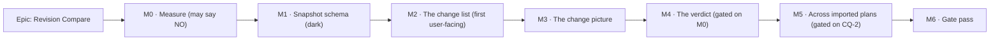

# Implementation Plan: Revision Compare

- **Feature spec:** [`./feature-spec.md`](./feature-spec.md)
- **Status:** **Awaiting the product owner's approval.** CQ-1–CQ-4 are answered (spec §6), the six
  specialist reviews are folded, and the two scope decisions they surfaced are taken (spec §4.5).
  What remains is approval itself. M0-T1/T2 ran under an earlier misreading of an adjacent answer as
  approval; their output is evidence, not committed scope.
- **Owner:** repo

> **Approving this plan approves M0, M1 and M2 only.**
> **M4 (the verdict) is not approved by approving this plan.** M0 is a measurement that is allowed
> to say no, and its falsification condition (spec §4.7) names two fallbacks. M3 onward is
> re-approved after M0 reports. This is written into the plan rather than assumed, because a plan is
> a document too and working through its task list is evidence the tasks were done, not that the
> thing they were for was still a good idea (ADR-0081).

## Breakdown

### Epic

**Revision Compare** — _what changed between two revisions of a plan, and which change moved the
date._ Maps to `docs/ROADMAP.md` → "Next → Product features"; closes the parked
`docs/BACKLOG.md:106-126` entry.

---

## Milestone M0 — The measurement (it is allowed to say no)

**Outcome:** a committed, falsifiable answer to _"does one-change-at-a-time replay produce an
attribution complete and stable enough to show a planner as a verdict?"_, plus a re-derived cost
model for every later milestone.
**Entry point:** **`Ships dark.`** Nothing is reachable. The deliverables are a script, a committed
predicate and a written verdict. M2 is the first milestone with a surface.
**Journey:** none — there is no product surface. (ADR-0081 §2 attaches the journey to the first
_user-facing_ milestone, which is M2.)

> **Description:** Prove or disprove the Tier 3 premise before any schema is designed around it.
> **Complexity:** L
> **Dependencies:** none
> **Risks:** the measurement is written to confirm rather than to test → mitigated by committing the
> predicate in its own commit **before** the harness exists, and by C4's pinned positive case.
> **Testing requirements:** the harness is a script, not a suite; its _output_ is the deliverable and
> is committed as `m0-measurement.md`.

##### M0-T1 — Commit the falsification condition, alone

- **Description:** Copy spec §4.7's C1–C4 and the two named fallbacks into
  `docs/specs/revision-compare/m0-condition.md`. Commit it **on its own**, before any harness code
  exists.
- **Complexity:** S · **Dependencies:** none
- **Risks:** none. This task exists because a condition written after the run is not a condition —
  ADR-0099 M0, ADR-0121 and ADR-0097 Landing C are three recorded cases where a committed-first
  condition changed or killed an approved design, and one (ADR-0097's harness) where an
  uncommitted verdict was produced from an `undefined`.
- **Testing:** n/a
- **Development steps:**
  1. Write C1–C4 verbatim, with the subject stated as **147 activity rows / 188 dependencies**, not
     129 (spec §0, V5).
  2. Name both fallbacks and state that the choice between them is the product owner's.
  3. Commit alone, message `docs(repo): commit the revision-compare M0 falsification condition`.
     **Corrected 2026-09-03 while executing this step:** the plan said `docs(specs):`, and
     `commitlint.config.*`'s `scope-enum` does not hold `specs` — the commit was refused. A plan
     is a document too, and this one specified an artefact the repository's own gate rejects.

##### M0-T2 — Re-derive the problem, and the fixture's real shape

- **Description:** Re-verify every number this epic's later milestones will quote, from the artefact
  rather than from a document — the ADR-0113 rule (a problem statement is a claim).
- **Complexity:** S · **Dependencies:** M0-T1
- **Risks:** quoting `docs/TEST_PLAYBOOK.md`'s two different activity counts forward → mitigated by
  parsing the fixture and by seeding the plan and counting rows through the API.
- **Testing:** the counts land in `m0-measurement.md` with the commands that produced them.
- **Development steps:**
  1. Seed `plan:fixture-p6-torture-v1` and read back its activity and dependency counts **through
     the public REST API**, not from the JSON.
  2. Re-measure a recalculate on that plan and at scale-500/2,000 — ADR-0116's 694.3 ms p95 at 2,000
     is recorded as _indicative_ and is the only number `docs/TECH_DEBT.md` #74 has.
  3. Record any disagreement with the playbook **as a finding**, and fix the playbook in the same
     commit rather than stepping over it (the ADR-0071 lesson).

> **M0-T3 gains a step 0, because the instruction it was given cannot be followed as written
> (found 2026-09-03, before any prototype code).** The spec says of the completion-carrier and
> measurement rules: _"Reuse that rule; do not restate it."_ **There is nothing to import.**
> `critical-path-test.ts` exports exactly four things — `CRITICAL_PATH_TEST_INJECTED_DAYS`,
> `CRITICAL_PATH_TEST_TOLERANCE_DAYS`, `CriticalPathTestInput` and `runCriticalPathTest`. The carrier
> selection is **inline** inside that function and `PERTURBABLE_TYPES` is a module-private `const`.
> So the only two ways to obey the instruction are to extract the rules or to restate them, and
> restating is exactly what it forbids.
>
> **M0-T3-T0 — extract before reusing.** Lift the carrier selection and the perturbable-type set into
> exported functions, behaviour-preserving, with `critical-path-test.spec.ts` as the before/after
> oracle (the ADR-0078 barrel-preserving argument: a refactor changes no assertion). This touches
> shipped code and that is the point — one derivation with two callers, rather than a second copy
> that drifts invisibly.
>
> **And the measurement rule does NOT transfer unchanged — it is a new rule, not a reused one.**
> `critical-path-test.ts:174` measures on `subject.calendar ?? options.calendar` — the **injected
> activity's** calendar. That is coherent for metric 12, which perturbs exactly **one** activity.
> Tier 3 perturbs a whole **class**, potentially a dozen activities across four calendars, so "the
> subject's calendar" does not exist. The carrier's own calendar is almost certainly right — it is
> the thing whose movement is being reported — but it must be **argued rather than inherited**. So
> the extracted measurement takes the calendar as an **explicit parameter**, and the two call sites
> choose differently and say why: metric 12 passes the subject's, Tier 3 passes the carrier's.
> Sharing where it is genuinely shared, diverging explicitly where it is not, is the only version of
> this that does not quietly give one caller the other's semantics.

##### M0-T3 — Build the attribution prototype (outside the product)

- **Description:** A script under `apps/api/scripts/` that loads the fixture through the
  conformance loaders, synthesises `R_old` / `R_new` change sets satisfying C4, and runs incremental
  replay.
- **Complexity:** L · **Dependencies:** M0-T2
- **Risks:** (i) the harness bypasses the product and makes the milestone look more finished than it
  is → its **own docblock says where it bypasses**, the ADR-0081 §3 rule, written after
  `measure-band-copy` made a dark milestone look done; (ii) it reimplements the carrier rule and
  gets it wrong → it **imports** the rule rather than restating it.
- **Testing:** unit cover on the change-set generator (that it satisfies C4) and on the class
  partition (total over the change vocabulary).
- **Development steps:**
  1. Reuse the **completion carrier** rule from `apps/api/src/modules/schedule/critical-path-test.ts:149-179`
     — the carrier, the subject's own calendar, the day factor. Do not restate it.
  2. Implement the class partition (spec §2 US-2) as a **total** map over the change vocabulary, so
     adding a class later is a typecheck failure rather than a silently unattributed change.
  3. Implement incremental replay with a **parameterised class order**, because C2 needs six
     permutations.
  4. Instrument: pass count, wall clock per pass, `Σ`, `total`, residual.

##### M0-T4 — Run it, and write the verdict

- **Description:** Execute C1–C4. Record the numbers. State **PROCEED / RESHAPE / WITHDRAW**.
- **Complexity:** M · **Dependencies:** M0-T3
- **Risks:** a failing condition is softened rather than honoured → the condition is already
  committed and the verdict is written against it, in `m0-measurement.md`, including any
  corrections to this plan's own claims.
- **Testing:** n/a — this task's output is evidence.
- **Development steps:**
  1. Run C4 first. If the generator cannot produce a qualifying change set, that is itself a
     finding and the whole predicate is vacuous.
  2. Run C1, C2 (all six permutations), C3.
  3. Write `m0-measurement.md`: numbers, verdict, and **every claim in this plan the run
     contradicted**, corrected in place rather than deleted.
  4. If any condition fails → **stop**, and put fallbacks (a) and (b) to the product owner with the
     numbers (CQ-4). Do not choose.

---

## Milestone M1 — The snapshot schema (ships dark)

**Outcome:** a plan can be snapshotted completely enough to replay `computeSchedule` from it. Nothing
reads it.
**Entry point:** **`Ships dark: the capture path and its tables land with no read surface. M2
surfaces it, via Analysis ▾ → Compare revisions…`**
**Journey:** none (dark). M2 carries the first journey.

> **Description:** ADR-0125, the `database-architect` design, the migration, and the capture path.
> **Complexity:** XL
> **Dependencies:** M0 verdict (the schema's Q4/Q5 answers depend on whether Tier 3 survives)
> **Risks:** an incomplete snapshot is discovered at M4, by which time it is a second migration in
> every environment → mitigated by M1-T2's replay-equivalence test, which is the real acceptance bar.
> **Testing requirements:** replay equivalence (below), capture unit + API e2e, cascade/restore e2e,
> `prisma migrate diff --exit-code` clean, storage measured.

##### M1-T1 — ADR-0125, then `database-architect`

- **Description:** Write and accept the ADR; then hand §4.4's Q1–Q8 to the agent. **Do not design the
  schema in this repository's own voice.**
- **Complexity:** L · **Dependencies:** M0-T4
- **Risks:** the agent is slow/empty and the schema is hand-written → **re-run it**. CLAUDE.md §19.3
  is unconditional precisely because that shortcut was taken once under time pressure
  (`csp_reports`, ADR-0086) and the review that followed found four defects, two fatal.
- **Testing:** n/a
- **Development steps:**
  1. Draft ADR-0125 — **re-check the number at filing time** (ADR-0071/ADR-0079 lesson) and record a
     collision rather than routing around it.
  2. State in the ADR, in three separate paragraphs, spec §4.6's Claims A, B and C. They must not be
     merged.
  3. Run `database-architect` on Q1–Q8. Feed it the enumerated input surface, not a summary.
  4. Fold the design; record any place it disagreed with §4.4 and why the agent was right.
  5. Update `docs/DATABASE.md` and `docs/adr/README.md` in the same PR. **The `duration_days` fix
     this step used to name is DONE (`4abae7f9`) — do not "fix" it again; the line reads
     `duration_minutes` and following the old instruction would damage a correct document.**

> **M1-T2's acceptance bar is blind to levelling until its fixture changes (2026-09-03).** The
> replay-equivalence test runs against the fixture plan, which reports `leveledActivityCount: 0` with
> `level_resources = false` and 45 resource assignments — so a snapshot freezing **no** levelling
> input passes it. Either the fixture gains a `levelResources = true` case, or the test states in its
> own docblock that it does not cover levelling. The red run must omit a **levelling** field as well
> as a calendar field, or Q9's answer is untested by the gate written to test it.

##### M1-T2 — Migration + the replay-equivalence test (**the acceptance bar**)

- **Description:** The migration, and the test that proves the snapshot is complete.
- **Complexity:** L · **Dependencies:** M1-T1
- **Risks:** a migration that a pristine database cannot test (ADR-0107) → the snapshot tables are
  new and empty, so no backfill exists; state that explicitly rather than inheriting the worry.
- **Testing:** **the load-bearing one.** For the fixture plan: (1) build the engine graph the
  ordinary way and run `computeSchedule`; (2) capture a revision; (3) reconstruct the graph
  **only** from the snapshot and run `computeSchedule` again; (4) assert the two `EngineOutput`s are
  **deeply equal**. **Verified red first** by omitting one frozen field — and the field chosen for
  the red run must be a _calendar_ field, because that is the one the design argument turns on.
- **Development steps:**
  1. Write the migration; raw SQL for anything Prisma cannot express (partial uniques, CHECKs), with
     the reason in the schema docblock — the `TECH_DEBT #54` drift rule.
  2. Implement capture inside the **existing plan advisory lock**.
  3. Write the replay-equivalence test; run it red, then green.
  4. `pnpm prepush` + `scripts/e2e-local.sh api`.

##### M1-T3 — Capture endpoint, permissions, audit, cascade

- **Description:** `POST/GET/DELETE …/revisions`, the three permission codes, the audit row, and the
  hierarchy cascade.
- **Complexity:** M · **Dependencies:** M1-T2
- **Risks:** the new mutating routes are unclassified by the route census → the census **fails** on
  an unclassified route by design (ADR-0073 C3.4 deleted `PENDING_COVERAGE`), so this is caught, not
  remembered.
- **Testing:** API e2e — 403 for Contributor/Viewer on capture; **404** (never 403) cross-org;
  409 duplicate name; 422 `SCHEDULE_NOT_CALCULATED`; cascade + batch restore.
- **Development steps:**
  1. Add `revision:read` to `HIERARCHY_READ`, `revision:create`/`revision:delete` to
     `HIERARCHY_WRITE` (`org-permissions.ts`).
  2. Controller/service/repository from the `modules/baselines` exemplar (ADR-0057).
  3. **`revision.deleted` too** — _added 2026-09-03 (security review)._ The design already claims
     "symmetry with `baseline:delete`" for the **permission** and never carried it to the **audit
     action**, though `DELETE …/baselines/:baselineId` is audited as `baseline.deleted`
     (`audit-coverage.structural.spec.ts:116`). Both ADR-0073 tests land on "audit it": deleting a
     captured plan-of-record is durable evidence, and it removes a comparison point other members
     rely on. **The census gate will not catch this** — it forces _some_ decision for the new route
     and passes equally if an implementer files it under `UNAUDITED_ROUTES` with a plausible reason —
     so name it in `AUDITED_ROUTES` at build time, and check 403 for Contributor/Viewer on delete as
     well as on capture.
  4. **The HARD delete is a different file, and neither document mentioned it.** M1-T3 named
     `HierarchyLifecycleService` (the **soft**-delete cascade); the expiry runner
     (`common/hierarchy/hierarchy-expiry.runner.ts:100-187`) carries a hand-enumerated, order-critical
     delete list pinned literally by `hierarchy-expiry.structural.spec.ts:85-109`. The new tables go
     in **before `'plan'`**. The gate goes red usefully, but it is satisfiable by inserting names
     without adding the deletes, and **nothing catches a plan-child table omitted entirely** —
     ADR-0096 D5 records that failure: a 23503 the batch can never recover from, retried hourly
     forever, on exactly the plans that have revisions. Add an API e2e that soft-deletes a plan
     holding a revision, arms the expiry, and asserts the plan is actually removed. Note also that
     `HierarchyLifecycleService` needs **six** edits, not one: `counts.revisions`, a
     `deleteRevisionsUnderPlans` helper called from three scopes, and the restore branch.
  5. `revision.captured` audit row **inside the capture transaction** — an audited create on the
     ADR-0073 blast-radius test, the `baseline.captured` precedent.
  6. `HierarchyLifecycleService` gains a `'revision'` level.
  7. Declare **every** reachable status on the OpenAPI, including the 422 and 409.

##### M1-T4 — Measure the storage before it ships

- **Description:** Bytes per activity per revision, and the implied cost of the CQ-1 capture policy.
- **Complexity:** S · **Dependencies:** M1-T3
- **Risks:** the number is estimated → it is measured against a real database, the ADR-0072 M3
  precedent (592 B/row at 1M rows, which answered the partitioning question with data).
- **Testing:** recorded in `m1-storage.md`.
- **Development steps:** capture N revisions of the 2,000-activity scale plan; measure table +
  index bytes; project against the answer to CQ-1; escalate to the product owner if it changes it.

---

## Milestone M2 — The change list (**first user-facing milestone**)

**Outcome:** a planner opens two revisions and reads what changed.
**Entry point:** **`Analysis ▾ → "Compare revisions…"`** on the plan workspace command deck
(`apps/web/src/features/tsld/toolbar/tsld-toolbar-items.tsx`, the menu that already holds
`Health check…` at `:1347`), opening the new **`revisions`** right dock.
**Journey:** **`apps/web/e2e-revision-compare/compare.spec.ts` lands here, not at enablement**
(ADR-0081 §2) — it opens the plan, presses **Compare revisions…**, asserts the dock opens, and
asserts one seeded change appears with its old and new value, against a **real API**.

> **Description:** The pure diff, the read route, the dock, the table, the print document.
> **Complexity:** L
> **Dependencies:** M1
> **Risks:** the diff module quietly grows an engine import → the structural gate; the dock set
> equality goes red in an unrelated milestone → M2-T3 updates it deliberately.
> **Testing requirements:** unit (pure diff, every class, both directions), API e2e (scope,
> permissions, `to=live`), journey, a11y, engine-free structural gate.

##### M2-T1 — The pure diff module + the engine-free gate

- **Description:** `revisions/diff.ts` — a pure function over two input sets producing the classed
  change list. Plus the import-ban gate.
- **Complexity:** L · **Dependencies:** M1-T3
- **Risks:** a gate that passes because it scanned nothing → the gate carries the **pinned non-zero
  files** assertion from `health-engine-free.structural.spec.ts:32-37`, and its docblock states its
  known blind spot (a transitive import is invisible to a one-level scan).
- **Testing:** unit per class, including the sharp ones — an activity added _and_ re-dated is one
  row; a summary's date change is reported as **derived**; identical revisions produce an explicit
  "no changes". Gate **verified red first** by adding `import { computeSchedule }` temporarily.
- **Development steps:**
  1. Change vocabulary as a **total** `Record<ChangeClass, …>`, so a new class is a typecheck
     failure — the ADR-0094 total-remedy-map pattern.
  2. Render durations and lags through the ADR-0070 formatter with the **frozen** `hoursPerDay` as a
     **required** parameter. Never the live calendar's: that is ADR-0068's defect one field along.
  3. Write the gate; verify red; write its blind-spot docblock.

##### M2-T2 — `GET …/revisions/compare`

- **Description:** The Tier 1 + 2 route. No lock, no transaction, no engine.
- **Complexity:** M · **Dependencies:** M2-T1
- **Risks:** an unbounded payload on a 2,000-activity plan → a row cap whose **number travels in the
  payload** (ADR-0116 G3 — never restated client-side), with the withheld count always reported.
- **Testing:** API e2e for `to=live`, cross-org 404, `from === to` 422; measure S1 (≤ 1.0 s p95).
- **Development steps:** DTOs in `@repo/types`; authoritative org+plan scope on the **target**;
  full OpenAPI; measure and record.

##### M2-T3 — The dock, the panel, the fourth `RIGHT_DOCKS` member

- **Description:** The web surface.
- **Complexity:** L · **Dependencies:** M2-T2
- **Risks:** `right-docks.test.ts:12` asserts the set equals exactly `['notes','floatPaths','health']`
  → updated **in this commit**, deliberately, with the derived exclusivity assertions extending for
  free.
- **Testing:** unit for loading / empty / **no-revisions** / **no-changes** / error, with the last
  two distinct in **both** the visible copy and the live region (ADR-0073 C1's finding: "nothing
  recorded" and "nothing matches" collapsed into one announcement is exactly the distinction the
  feature exists to make). a11y: the settled result count is announced (WCAG 4.1.3).
- **Development steps:**
  1. Add `revisions` to `RIGHT_DOCKS`; update the equality assertion.
  2. `Analysis ▾ → Compare revisions…` beside `Health check…`.
  3. Panel: `SectionCard`, no one-off styling; change class never signalled by colour alone.
  4. Server state in TanStack Query; the `from`/`to` selection in **typed URL search params**, so a
     comparison is deep-linkable — and note ADR-0123: a search param is a string and `''` is deleted
     by `useUrlFilterState`, which is how ADR-0095 M5 shipped an unrepresentable state.

##### M2-T4 — The journey

- **Description:** `apps/web/e2e-revision-compare/`, its Playwright config, its `package.json`
  script and its CI step.
- **Complexity:** M · **Dependencies:** M2-T3
- **Risks:** a locator by copy rather than by role+name breaks on the next label change → locate by
  role and accessible name; for deck controls use `[data-toolbar-item]` (ADR-0091's rule after three
  journeys broke on copy).
- **Testing:** this **is** the test. Seed through the API, capture a revision, edit one duration and
  one link, compare, assert both changes with old and new values.
- **Development steps:**
  1. Config + script + CI step. **Adding a Playwright config is itself a full-spec trigger**
     (ADR-0105) — it is in this approved plan, which is what satisfies it.
  2. **No edit to `scripts/e2e-sweep.sh` is needed** — verified: its list is **derived** from
     `apps/web/package.json`'s `test:e2e:*` scripts (`scripts/e2e-sweep.sh:22-57`), after ADR-0112
     found the hand-typed version wrong in both directions. Adding the `package.json` script is
     what enrols the suite. Confirm it appears in a sweep run rather than assuming it.
  3. Run `scripts/e2e-local.sh web:revision-compare` locally. CI is the second opinion, never the
     first.

---

## Milestone M3 — The change picture

> **Five findings from the web review (2026-09-03), each verified against the painter. Four are
> traps that fail SILENTLY — they paint a plausible picture rather than an error — which is why they
> are listed before the tasks rather than inside them.**
>
> **M3-T0 (new, and it comes first): Tier 2 gets a falsification condition, like Tier 3 has.** The
> epic applies committed-condition discipline to attribution and **none at all** to the ghost — S1–S7
> cover list latency, both parity gates, convergence, Tier 3 cost and the journey, and nothing covers
> the ghost's frame cost. That is the largest asymmetry in the plan, on a surface
> `docs/TECH_DEBT.md:504-512` already measures at **10.2% dropped frames and 33.4 ms interval p95 at
> Fit** with ~8 ms of each frame unattributed. Follow ADR-0100's M0: paired same-session runs,
> treatment ≤ baseline + a stated margin, **committed before the prototype**. The ghost needs its own
> `cull` (removed activities have no live counterpart, so it cannot be a filter over the live set),
> so this is approximately a second bar pass **and** a second cull on the reading that is already
> failing.
>
> **The `RectCache` trap.** `RectCache` is `Map<string, Rect | null>` keyed on `activity.id` alone
> (`render/geometry.ts:481`, `:498-503`), and the frame holds one (`paint-frame.ts:104`). A ghost
> activity carries its live counterpart's id. Threading the frame's cache — the obvious thing, and
> what every other layer does — returns the **live** rect and paints every ghost bar exactly under
> its live bar, so the picture says "nothing moved". No throw, no warning, and a unit test with a
> fresh cache passes. Needs a separate or id-namespaced cache, and a test verified red.
>
> **The data-date trap.** `computeActivityRect` measures `daysBetween(dataDateIso, …)`
> (`geometry.ts:514,528`) and the two revisions have **different data dates**. Passing the frozen one
> shifts the whole ghost by their delta — a uniform offset that reads as "everything moved by exactly
> the same amount", which a planner will believe. The rule is about the **arguments**, not the
> functions: the ghost is projected on the **live** frame's axis, and the frozen data date is a fact
> in the change list, never an input to the projection. "Reuses `screenXOfDay` verbatim" does not
> cover it.
>
> **The palette trap, aimed at the wrong half.** M3-T1 said "resolve through the canvas surface
> root". `render/palette.ts:122-129` says that guard "was necessary and was **NOT** sufficient" — the
> reads still named `--color-*` aliases, which `@theme inline` substitutes at `:root`, so a surface
> rebind cannot reach them. The fix is reading **unprefixed** names, and no gate can see the
> difference (`token-contrast.test.ts` follows the rebind itself). So: add the ghost fields to
> `TsldPalette` and resolve them **inside `resolveTsldPalette`** (`:142`) rather than writing a new
> resolver — that inherits the fixed call site, the guard and `palette.test.ts`, and forces the print
> sibling to declare them. A second resolver is a second copy of the rule, which is what went wrong.
>
> **The dev-throw is new work, not reuse.** The unresolved-`var()` guard exists only inside
> `paintResourceStrip` (one `IS_DEV` block, `paint.ts:2138`). There is no equivalent in `paintScene`.
>
> **Module layout, forced by the gate.** `health-engine-free.structural.spec.ts:26-38` scans a whole
> directory (`readdirSync`) and is **non-recursive**. Putting the pure diff and the engine-importing
> attribution in one `revisions` module makes Claim B's gate fail on day one — or degrades it to a
> single-file allowlist, which is the "found nothing" class. They go in separate directories, and the
> new gate's docblock states both blind spots: non-recursive, and direct imports only.
>
> **Two more, cheap:** the dock's open state is ephemeral React state
> (`plan-workspace-toolbar.tsx:208`) while `from`/`to` live in the URL — so a shared link opens with
> the dock closed and the comparison invisible; and ADR-0123's Gate A and Gate B both fire on a new
> search-param consumer. Name the params `cmpFrom`/`cmpTo`, per this route's existing `g*` convention.

**Outcome:** the old revision is drawn beneath the new one, and changed logic is lit.
**Entry point:** **`View ▾ → Structure → "Old revision"`**, plus an inline toggle in the revisions
dock.
**Journey:** extends `e2e-revision-compare` — switch the ghost on and assert a ghost bar is present
in the canvas's parallel focusable DOM layer, and absent with it off.

> **Description:** One more pure canvas layer painter, plus export and print parity.
> **Complexity:** L
> **Dependencies:** M2
> **Risks:** the ghost paints from a second date→pixel implementation → it reuses `screenXOfDay` /
> `screenYOfLane` **verbatim**; the painter reads a colour the canvas surface scope does not govern
> → see M3-T1's risks, which are two separately-recorded live defects.
> **Testing requirements:** counting-stub budget gate, ghost-off byte-identity, contrast pair, export
> and print decode, a11y.

##### M3-T1 — The ghost layer painter

- **Description:** A pure layer painter taking the per-frame `PaintFrame` (ADR-0078), beneath the
  bar layer.
- **Complexity:** L · **Dependencies:** M2-T2
- **Risks:**
  - The painter resolves its colour from `document.documentElement` and therefore **never uses the
    canvas surface scope** — ADR-0102's finding, where `resolveTsldPalette` had done exactly that
    since it was written and the contrast matrix was structurally incapable of reporting it.
    → resolve through the canvas surface root, and add the pair to `token-contrast.test.ts`
    **before** the CSS.
  - Canvas 2D's `fillStyle` setter **silently discards an unparseable value and keeps the previous
    colour** (ADR-0121): a `var()` handed to the painter paints the _previous_ colour, with no
    throw, no warning, and every jsdom test green. → resolve to a literal at the palette seam, and
    throw in development on an unresolved fill.
- **Testing:** counting-stub gate (ghost-off contributes **zero** calls — the ADR-0054 shape, which
  asserts the _shape_ of the per-frame cost rather than a millisecond count); ghost-on paint budget
  measured in a **real browser**, because `docs/TECH_DEBT.md` #75 records that headless figures are
  software-rasterised and not the target envelope.
- **Development steps:** derive ghost rects from frozen `laneIndex` + frozen dates; draw beneath
  bars; measure; record.

##### M3-T2 — Changed logic, and the non-colour channel

- **Description:** Light changed links; make each reachable from the parallel DOM layer.
- **Complexity:** M · **Dependencies:** M3-T1
- **Risks:** colour as the sole channel (WCAG 1.4.1) → a second channel (weight/dash is **taken** —
  ADR-0056 gave dash to the Today line and ADR-0054 to the cursor guideline; use weight plus a DOM
  label).
- **Testing:** a11y; the AT-reachable count invariant (ADR-0063's rule: the count of AT-reachable
  activities does not change across the toggle).
- **Development steps:** route changed edges through the **existing** `routeOrthogonal` with its
  obstacle parameter (ADR-0065) — never a second route function.

##### M3-T3 — Export and print

- **Description:** The ghost in the exported PNG/PDF and the printed comparison.
- **Complexity:** M · **Dependencies:** M3-T2
- **Risks:** the export composes fewer scene keys than the canvas and nobody notices — ADR-0103
  found **seven** missing, including one no document named. → enumerate both compositions and assert
  the sets.
- **Testing:** `apps/web/e2e-export`-style decode of the **real** download; resolve from
  `[data-surface="print"]` (ADR-0103), never the live theme. Every export unit suite runs in jsdom
  and therefore takes the _fallback_ branch — it can never reach the branch that ships.
- **Development steps:** detached print document via `lib/print-document.ts`; add the comparison to
  the screenshot shot list (ADR-0101's finding: the shot list covered the workspace and stopped at
  the route, so a four-scrollbar panel reached a user).

---

## Milestone M4 — The verdict (**gated on M0; not approved by approving this plan**)

**Outcome:** completion moved N days; here is what each change class cost, and what could not be
attributed.
**Entry point:** **`"What moved the date" section in the revisions dock`**.
**Journey:** extends `e2e-revision-compare` — press it, assert the total, the ranked rows, the
**Interaction** row, and that an offender click selects on the canvas.

> **Description:** The read-only replay route.
> **Complexity:** XL
> **Dependencies:** M0 = PROCEED, M3
> **Risks:** the weaker parity sentence is replaced by the stronger one → they live on separate
> routes with separate OpenAPI descriptions, exactly as ADR-0116 D7 split metric 12 out, because
> that ADR calls this "the single most likely wrong claim in the epic".
> **Testing requirements:** non-mutation e2e verified red, throttle from measurement, attribution
> unit cover including the not-converged path.

##### M4-T1 — Measure first, again

- **Description:** Re-derive the cost of the **shipped** route (not the M0 prototype) and set the
  throttle from the formula, not by copying a sibling.
- **Complexity:** M · **Dependencies:** M0-T4, M3-T3
- **Risks:** copying `CRITICAL_PATH_TEST_THROTTLE` → ADR-0116 explicitly set 14/60 s from its own
  formula rather than copying `FLOAT_PATHS_THROTTLE`; do the same.
- **Testing:** recorded in `m4-measurement.md`, condition committed first.
- **Development steps:** measure at scale-500 and 2,000; compare against C3's ≤ 3.0 s p95; derive
  the throttle; if C3 fails on the real route where it passed on the prototype, that is a finding and
  goes to the product owner.

##### M4-T2 — `attribution.ts` and its route

- **Description:** The incremental replay, the ranking, the interaction residual, the
  not-converged outcome.
- **Complexity:** XL · **Dependencies:** M4-T1
- **Risks:**
  - Measuring the **max project finish** instead of the completion carrier → import the rule from
    `critical-path-test.ts:149-179`; a fixture written against the wrong rule already proved this
    defect once, so **write that fixture here too** and verify it red.
  - The residual is distributed rather than displayed → a unit test asserts the ranked rows sum to
    `total − interaction`, verified red against a distributing implementation.
- **Testing:** unit for order-stability on a fixed case; API e2e **non-mutation**, reading every
  engine-owned column back and **verified red by persisting once deliberately**; 429 on throttle.
- **Development steps:**
  1. Reconstruct both graphs from **frozen** columns only.
  2. Replay one class at a time, fixed order, `NOT_ASSESSABLE` with a typed reason where it cannot.
  3. Separate route, separate OpenAPI description carrying the weaker sentence in its own words.

##### M4-T3 — The verdict section

- **Description:** The dock section.
- **Complexity:** M · **Dependencies:** M4-T2
- **Risks:** the not-converged state renders as an error or as an empty ranking → it is a
  first-class outcome with its own copy; a shaded control carries its reason and stays keyboard
  reachable (ADR-0082).
- **Testing:** rendered coverage for **every** verdict branch — ADR-0116 M5 found a control with
  zero rendered coverage that its own task's definition of done had required.
- **Development steps:** ranked rows; Interaction row; offender activation reusing the ADR-0116
  channel, **including the Gantt reveal** (selection alone scrolls nothing there).

---

## Milestone M5 — Across imported plans (**gated on CQ-2**)

**Outcome:** Rev B and Rev C, both exported from P6 and imported as two plans, compare.
**Entry point:** **`the "from" picker offers plans in the same project, not only revisions of this plan`**.
**Journey:** extends `e2e-revision-compare` — import two files, compare across them.

> **Description:** Correlation by `code` rather than id.
> **Complexity:** L · **Dependencies:** M4 (or M3 if M0 withdrew Tier 3), **CQ-2 = yes**
> **Risks:** a plan whose activities carry no `code` cannot be compared at all, and a mis-coded
> activity reads as one removal plus one addition → both stated on screen, never silently; the
> uncomparable case is **refused with a reason**, not shown as a diff of everything.
> **Testing requirements:** API e2e over two imported plans; the null-code and duplicate-code
> refusals; a journey through the real importer.

##### M5-T1 — Correlation strategy + refusal

- **Complexity:** M · **Development steps:** correlate on `code`; refuse with a typed reason where
  coverage is insufficient; state the threshold in the payload (G3).

##### M5-T2 — Cross-plan scope and authorisation

- **Complexity:** M · **Risks:** an IDOR through the second plan id → the authoritative org+plan
  scope check runs on **both** targets, the ADR-0051 anti-IDOR rule.

---

## Milestone M6 — The gate pass

**Outcome:** the specialist reviews over the combined diff, folded.
**Entry point:** **`Ships dark: no new capability; findings are folded into the surfaces M2–M5 shipped.`**
**Journey:** the full `e2e-revision-compare` suite, plus the base journey — `docs/TESTING.md`'s rule
after ADR-0096: **change a screen, run the base journey**, and `scripts/e2e-local.sh web` is the
target with no suffix.

> **Description:** database-architect (re-read of the shipped migration), security, api,
> backend-performance, accessibility, ux, component.
> **Complexity:** L · **Dependencies:** M5
> **Risks:** the pass is treated as a formality → it has blocked on real defects in **eight
> consecutive epics** in this repository; budget for fixes, each with a regression test **verified
> red first**.
> **Testing requirements:** every fix carries a regression test proven to fail against the old code.

##### M6-T1 — Run the six reviewers; fold blocking findings; file the rest

- **Development steps:** run each over the combined diff; fold blockers with red-first regression
  tests; file non-blocking findings as a numbered `docs/TECH_DEBT.md` row using the register's
  canonical `### <n>. <title>` heading form (`docs/TECH_DEBT.md:101-103`, verified) with a
  `**Status:**` line, or `check:debt-status` fails (ADR-0120/ADR-0124).

##### M6-T2 — Reconcile the documents

- **Development steps:** `CLAUDE.md` §16 entry and §1 banner (`pnpm check:counts` will fail on the
  model, migration and ADR counts until it is re-derived); `docs/DATABASE.md`; `docs/API.md`;
  `docs/ROADMAP.md`; remove the `docs/BACKLOG.md` parked entry; `docs/TEST_PLAYBOOK.md` if a seeded
  plan was added (`check:playbook` gates both directions); `docs/adr/README.md`
  (`check:adr-coverage` validates both directions since ADR-0110 D6); changeset.

---

## Sequencing & slices

Each row keeps `main` releasable.

| Slice | Ships                     | Reachable?                                    | Rollback                                                               |
| ----- | ------------------------- | --------------------------------------------- | ---------------------------------------------------------------------- |
| M0    | a measurement + a verdict | no — no product change                        | revert the script                                                      |
| M1    | schema + capture API      | no read surface                               | forward migration; the tables are new and empty, so no backfill exists |
| M2    | change list               | **yes** — `Analysis ▾ → Compare revisions…`   | one commit; the dock set equality reverts with it                      |
| M3    | the picture               | **yes** — `View ▾ → Structure → Old revision` | one commit; ghost-off is byte-identical, pinned                        |
| M4    | the verdict               | **yes** — dock section                        | one commit; the route is separate, so reverting it cannot disturb M2   |
| M5    | cross-plan                | **yes** — the `from` picker                   | one commit                                                             |
| M6    | fixes + docs              | n/a                                           | per fix                                                                |

**No `VITE_` flag.** ADR-0088 D1: a `VITE_` constant is inlined at build time, `docker-publish.yml`
passes no `VITE_` build args, and `.dockerignore` strips `**/.env` from the build context — so a
flag has never been an operator rollback. **The rollback contract is the commit boundary**, above.

## Definition of Done (per task)

Each task's PR satisfies the Feature Completion Criteria in [`docs/PROCESS.md`](../../PROCESS.md).
Two clauses are called out because they are the ones most often skipped here:

- **The pre-push gate is run, not written** — `pnpm prepush` (one command; running its parts by hand
  is how a gate gets missed, `CLAUDE.md` §19.8), plus `scripts/e2e-local.sh api` for any `apps/api`
  change and `scripts/e2e-local.sh web:revision-compare` for any journey change.
- **A milestone claiming user-facing capability names its entry point** in its header — done above —
  **or declares itself dark.** There is no third state.

## Risks & assumptions (rollup)

| #   | Risk / assumption                                                                           | Likelihood | Impact   | Mitigation                                                                                                                                                                                                               |
| --- | ------------------------------------------------------------------------------------------- | ---------- | -------- | ------------------------------------------------------------------------------------------------------------------------------------------------------------------------------------------------------------------------ |
| R1  | Attribution does not converge; Tier 3 is unshippable as specified                           | **med**    | high     | M0 is a committed, falsifiable measurement with two pre-named fallbacks (CQ-4). This is the epic's largest risk and is deliberately faced first.                                                                         |
| R2  | The snapshot is incomplete and this is discovered at M4                                     | med        | **high** | M1-T2's replay-equivalence test is the milestone's acceptance bar, verified red by omitting a **calendar** field                                                                                                         |
| R3  | The frozen calendar's cardinality makes capture expensive                                   | med        | med      | Q2 offers three shapes including content-addressed dedup; M1-T4 measures before shipping                                                                                                                                 |
| R4  | Tier 3's parity sentence is confused with Tier 1's                                          | **med**    | high     | Separate modules, separate routes, separate OpenAPI text, one gate each. ADR-0116 calls this the likeliest wrong claim in _its_ epic.                                                                                    |
| R5  | The ghost layer misses the canvas surface scope, or `fillStyle` silently discards a `var()` | **med**    | med      | Both are **recorded live defects** (ADR-0102, ADR-0121), not hypotheses; M3-T1 addresses each by name                                                                                                                    |
| R6  | The export composes fewer scene keys than the canvas                                        | med        | med      | ADR-0103 found seven missing; M3-T3 enumerates both compositions and asserts set equality                                                                                                                                |
| R7  | Storage growth under an auto-capture policy                                                 | med        | med      | CQ-1 + M1-T4's measurement; retention rides ADR-0096                                                                                                                                                                     |
| R8  | The `RIGHT_DOCKS` equality assertion goes red in an unrelated milestone                     | **high**   | low      | M2-T3 updates it in the same commit as the dock                                                                                                                                                                          |
| R9  | `pnpm check:counts` fails on the banner after the migration lands                           | **high**   | low      | M6-T2; it is a gate doing its job                                                                                                                                                                                        |
| R10 | The journey is deferred to enablement                                                       | low        | high     | ADR-0081 §2; M2-T4 is inside M2 and the plan does not permit moving it                                                                                                                                                   |
| R11 | A claim in **this plan** is stale by the time it is executed                                | **med**    | med      | §19.11 — re-verify a plan's **problem and its remedy**, not only its design. ADR-0118 D6 found a plan's remedy stale against its own epic three milestones later. Each milestone re-reads its own tasks before starting. |
