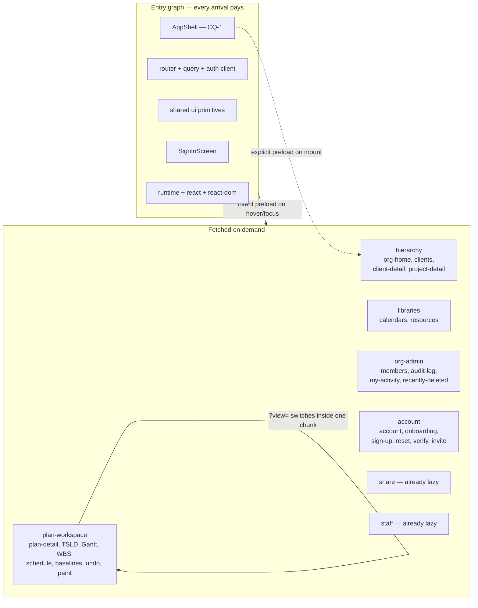
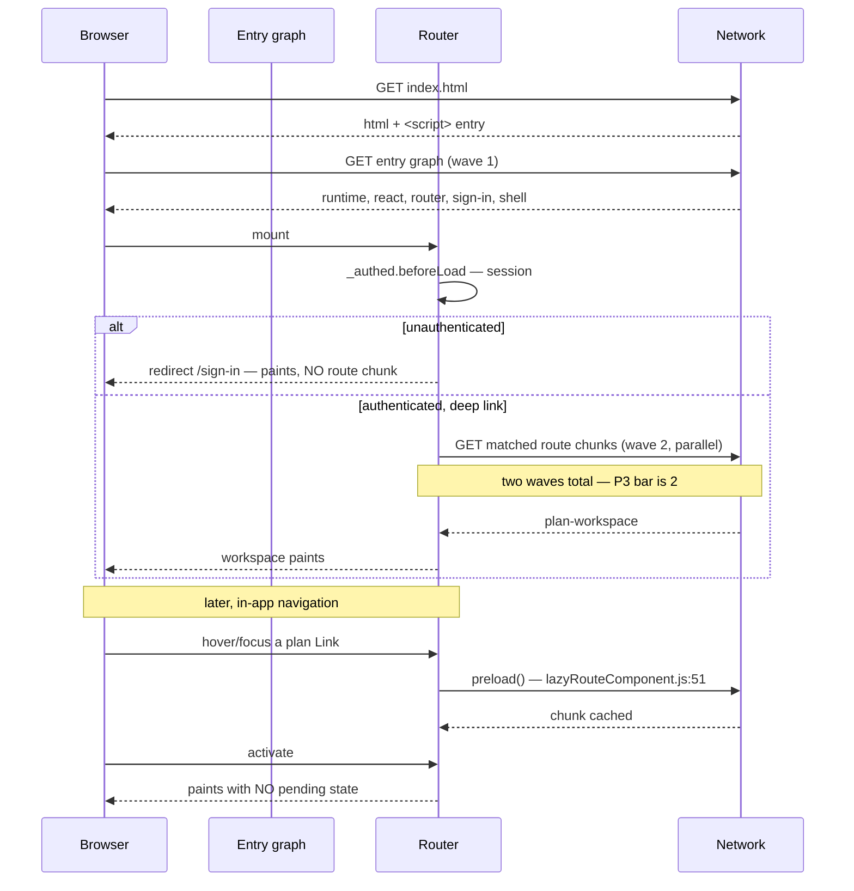
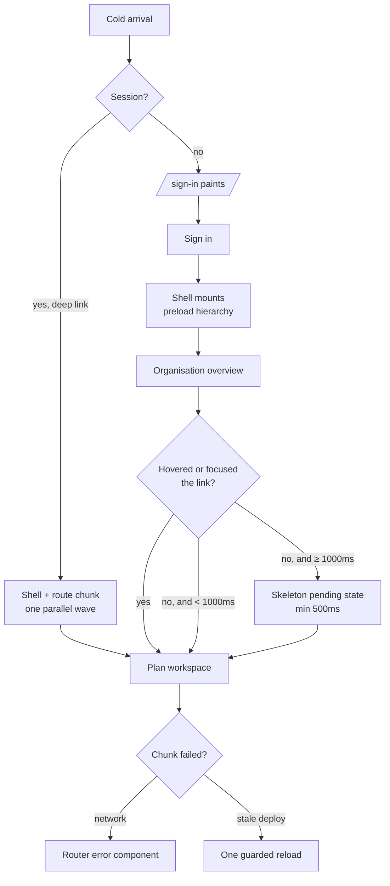

# Feature Spec: Route code splitting — the web entry graph

- **Status:** Draft — awaiting approval before implementation
- **Author(s):** feature-analyst (for the product owner)
- **Date:** 2026-09-12
- **Tracking issue / epic:** `docs/TECH_DEBT.md` #292

> **M0 HAS BEEN RUN — read [`m0-measurement.md`](m0-measurement.md) for the numbers, not this
> document's §0 table.** This spec was written with Bash disabled and says so; every figure in it
> is _read_ rather than measured. As of 2026-09-12 they are measured, and three things changed:
>
> - **P1 PASSES decisively** and the epic proceeds: entry graph **404,797 → 157,483 gzip bytes**
>   (**−61.1%**) with every route lazy, against a bar of ≤ 300,000.
> - **The floor this spec deliberately refused to estimate is measured: 157,483 gzip bytes.** That
>   refusal was right and is now discharged.
> - **CQ-1 is answered by measurement rather than by asking.** The shell costs **43,878 gzip
>   bytes** on the cold path (157,483 lazy vs 201,361 eager), so this spec's stated default —
>   eager — is the more expensive option. The trade is left for the product owner.
>
> One provenance correction to this document: it calls `apps/web/bundle-report.json` "the
> **committed** report" throughout. It is **git-ignored** (`.gitignore:93`), so the baselines were
> read from a local build artefact rather than a repository state. A fresh build reproduces them
> within **53 bytes**, so the arithmetic stands — but the basis was weaker than stated.

- **Roadmap link:** to be added with the ADR (see §4 "Implementation approach", ADR note)
- **Related ADR(s):** ADR-0029 (persistent app-shell), ADR-0059 (shared time axis), ADR-0081
  (entry point + journey), ADR-0088 D1 (no `VITE_` flag), ADR-0097/0098 (page archetypes),
  ADR-0105 (register row is not a spec), ADR-0128 (measure on the machine that can take it),
  ADR-0136 (the bundle budget gate), ADR-0138 (CI shard roster), ADR-0058 (a bar goes at the
  measured floor)

> **Instrument note, stated once and load-bearing for every number below.** This spec was written
> in a session where **Bash is disabled**, so `pnpm --filter @repo/web build` could **not** be run.
> Every byte figure here is read from the committed `apps/web/bundle-report.json`
> (`measuredAt: 2026-09-11T14:04:54.760Z`) and cited by line. **Nothing here is a fresh
> measurement**, and the first task of the plan (M0-T1) is to re-derive the report and record
> whether it has moved. Where a claim is reasoned from a dependency's source rather than observed
> running, it is labelled **[from source]**; where it is reasoned from specification rather than
> either, **[unverified]**.

---

## 0. Re-verifying the problem statement

`docs/PROCESS.md` §"reconciliation" and CLAUDE.md §19 require the problem to be re-verified, not
only the remedy — because a problem goes stale in the one direction nobody checks. Four claims in
#292 and its neighbours were checked. **Two are stale, one was already fixed, one is wrong in the
brief that commissioned this spec.**

| #292's claim                                                                               | Verified                                                                                                                                                                                                                                            |
| ------------------------------------------------------------------------------------------ | --------------------------------------------------------------------------------------------------------------------------------------------------------------------------------------------------------------------------------------------------- |
| Entry chunk 370,899 gzip; entry graph 404,744 across three chunks                          | **HOLDS.** `bundle-report.json:13`, `:4-8`. The three are `index` 370,899 + `paint` 33,477 + `rolldown-runtime` 368 = 404,744 exactly (`:13`, `:86`, `:111`).                                                                                       |
| "`app/router.tsx` declares 26 routes"                                                      | **WRONG, mildly.** `= createRoute({` appears **23** times, plus one `createRootRouteWithContext` = **24** route definitions, of which **22** carry a screen component (`indexRoute` is redirect-only, `router.tsx:125-140`). ADR-0076 Class 1.      |
| "two `lazy()` boundaries (`/share`, `/staff`)"                                             | **HOLDS.** `= lazy(` appears twice (`router.tsx:306`, `:314`).                                                                                                                                                                                      |
| "`vite.config.ts` sets no `manualChunks`"                                                  | **HOLDS.** `vite.config.ts:77-80` declares `build` with `outDir` and `sourcemap` only.                                                                                                                                                              |
| "Nothing in CI checks a bundle size (`#48(b)`)"                                            | **STALE.** `ci.yml:269-270` runs `pnpm --filter @repo/web check:bundle-size`, and `#48` no longer exists as a register row — ADR-0136 closed it. The paragraph is correct as _history_ ("why it was never noticed") and false in the present tense. |
| "Setting the budget is `docs/specs/delivery-gates/` M3, **written and awaiting approval**" | **STALE.** It shipped. `bundle-budget.json` exists with a measured `floor` (`:5-10`) and `check-bundle-size.mjs` is exported and suite-driven (`:90`).                                                                                              |
| `FRONTEND_QUALITY.md`'s route-splitting sentence needs correcting                          | **ALREADY DONE.** `docs/FRONTEND_QUALITY.md:112-121` now says route-based splitting "is the INTENTION, and is not what the app does today". The brief asked me to expect to correct it; it was corrected when the row was raised.                   |

### 0.1 The correction the row missed, and it is the ADR-0071 shape

#292 says of the splitting sentence: "**The sentence is corrected in place**" — singular. There
were two copies. The second is still wrong:

> `docs/FRONTEND_ARCHITECTURE.md:151-153`
> "**Code splitting.** Routes are lazy by default (per-route chunks); the shell and critical path
> stay in the initial bundle."

That is the same false claim, in the **Routing** section of the document a reader opens _first_ when
auditing how routing works. Noticing drift and repairing one copy leaves the other exactly as wrong
as not noticing (ADR-0071). It is decision-bearing in precisely the way #292 describes: a reader
checking bundle health finds a plausible answer and stops.

### 0.2 The brief's own claim about `paint` is wrong, and it changes the scope

The brief commissioning this spec states that `jspdf`, `html2canvas` **and `paint`** "are ALREADY
lazy and are explicitly not the problem — do not propose 'fixing' them."

**`paint` is not lazy.** `bundle-report.json:84-91` records it as `inEntryGraph: true`, and
`inEntryGraph` means reachable from the entry through **static** imports only
(`bundle-report-plugin.ts:37`, `:120`). The static path is
`TsldCanvas.tsx:46` → `../render/paint`, with three more static importers in the same feature
(`tsld-toolbar-items.tsx:53`, `use-tsld-canvas-ui-state.ts:8`, `tsld-toolbar-context.ts:8`). It is a
_separate chunk_ only because the lazy staff console also reaches it
(`features/perf-probe/scenes/canvas-draw.ts:8`), so Rolldown hoisted the shared module out — and a
separate chunk that is statically imported is still paid at first paint.

`docs/FRONTEND_QUALITY.md:85-88` already states this correctly ("understates first paint by
**33,845 bytes**, the `paint` chunk it statically imports"). #292's own wording — "`paint` is its
own chunk", listed under "the heavy things are already lazy" — is what the brief inherited, and
"its own chunk" is true while "already lazy" is not.

**Consequence for scope:** `paint` is **33,477 gzip bytes, 8.27% of the entry graph**, it is
plan-workspace-only code, and it is the one part of the prize that can be stated as a floor before
any build is run. Every stranger who loads `/sign-in` currently downloads the TSLD painter.

### 0.3 Units: three conventions are in circulation, one of them against its own instruction

- #292's table is Vite's build-reporter **kB = 1000 bytes** (the row says so at its head).
- `bundle-report.json` / `bundle-budget.json` are **raw bytes**.
- `docs/FRONTEND_QUALITY.md:97-98` quotes "`jspdf` (125.57 kB gzip) and `html2canvas` (45.51 kB)",
  which are **KiB = 1024** (128,583 / 1024 = 125.57; 46,603 / 1024 = 45.51) — **two lines after the
  same bullet list says "Quote bytes here, and compare like with like or not at all"**
  (`:95-96`). The instruction and the next bullet disagree.

**This spec quotes bytes only.** Three conventions over one quantity is how 372-against-200 came to
be read as a regression.

### 0.4 What is therefore true, and what this epic is for

The substance of #292 survives intact and is not weakened by the corrections above:

**Every authenticated route — the whole plan workspace, the Gantt, the canvas painter, every
dialog — is in the entry graph, so a stranger arriving at `/sign-in` downloads the entire
application before the sign-in form paints.** `router.tsx:25-44` statically imports 20 screen
components; `router.tsx:113` redirects every unauthenticated arrival to `/sign-in`.

**And #292's own caution stands and is adopted as a constraint of this spec:** 372 against ~200 is
**not** a regression, the ~200 kB figure was never a measurement, and "splitting the authenticated
routes is the obvious remedy and is **not** obviously right". This spec therefore gates the build on
a measurement rather than treating the split as decided (§1 "Success criteria").

---

## 1. Business understanding

### Problem

A planner signing in, and a stranger meeting the product for the first time, both download
**404,744 gzip bytes** of JavaScript — the whole application, including the TSLD painter, the Gantt,
the WBS band, the revision-compare overlay and every dialog — before the sign-in form paints. None
of it is reachable from that screen.

The cause is not bloat and not a heavy dependency. The two genuinely large libraries are already
behind dynamic imports and cost first paint nothing (`jspdf` 128,583 and `html2canvas` 46,603 gzip,
both `inEntryGraph: false` — `bundle-report.json:48`, `:80`). The cause is that **the route
splitting two governing documents describe has never existed**: 22 screen components are static
imports in one module.

CLAUDE.md §15 targets LCP < 2.5 s on a mid-tier mobile over 4G and "keep the initial JS bundle lean
(code-split by route)". The bundle is not code-split by route.

### Users

| Who                                    | What they need                                                                                                     |
| -------------------------------------- | ------------------------------------------------------------------------------------------------------------------ |
| **A stranger / an invited new member** | `/sign-in` and `/accept-invite` to paint quickly. They pay for the entire authenticated app and use none of it.    |
| **A planner (Planner / Contributor)**  | Sign-in to be quick **and** the first plan open not to be slower. This is the trade the epic must not lose.        |
| **An External Guest** (ADR-0051)       | Already served — `/share` is lazy (`router.tsx:306`). Unaffected except that it stops paying for the authed shell. |
| **Staff** (ADR-0086)                   | Already served — `/staff` is lazy (`router.tsx:314`).                                                              |
| **Every role, on a coarse pointer**    | No regression. Intent-preloading is driven by hover/focus, and a touch device has no hover (§2 "Edge cases").      |

No role gains or loses a capability. This is a delivery-shape change, and permissions are untouched
(§2 "Permissions").

### Primary use cases

1. A stranger loads any URL, is redirected to `/sign-in` (`router.tsx:113`), and pays for the
   sign-in screen and the runtime — not the plan workspace.
2. A planner signs in and lands on the organisation overview (`router.tsx:125-140` →
   `/orgs/$orgSlug`) without a visible stall.
3. A planner opens a plan from the Project Explorer. The link was hovered or focused, so
   `defaultPreload: 'intent'` (`router.tsx:510`) has already fetched the workspace chunk and the
   navigation shows nothing.
4. A planner opens a **bookmarked plan URL cold**. There is no hover to preload from; this is the
   worst case and the one the epic can lose on.

### User journeys

Happy path (see §4 "User flow"): cold arrival → entry graph → sign-in paints → credentials → shell
mounts and the hierarchy chunk is warmed in parallel with the session query → overview → hover a
plan → chunk preloads → click → workspace paints with no fallback.

Alternate that must not regress: cold arrival **already authenticated** at
`/orgs/x/plans/y` → entry graph + shell + workspace chunk, loaded by the router as one navigation
rather than three sequential waits.

### Expected outcomes

- A materially smaller first paint for every arrival, and a `/sign-in` that no longer carries the
  application behind it.
- Route splitting stops being a documented intention and becomes the implemented default, with a
  rule a later reader can apply to the next route.
- `paint` leaves the entry graph as a consequence rather than as a special case.

### Success criteria — the falsification conditions, committed before any work

This is the decision the brief asked for first. The bars are written here, **before** the
measurement, in the ADR-0128 style, and each names what result means **stop**.

> **P1 — the prize is real (bytes). Gates whether the epic is built at all.**
> With every route component lazy, a probe build's **entry graph ≤ 300,000 gzip bytes** — a
> reduction of ≥ 104,744 bytes (≥ 25.9%) from the 404,744 floor.
> **If the probe lands above 300,000, the epic STOPS at M0.** The finding is then that the entry
> graph is floor-dominated (vendor + shell + shared primitives), #292 is rewritten to say so, and
> the remaining work — splitting _within_ routes — is a much larger programme with a much smaller
> prize that nobody has justified.
>
> **300,000 is a JUDGEMENT, not a measurement, and is labelled as one** — the same honesty
> `bundle-budget.json:12` applies to its own `headroomRatio`. Its reasoning: it is comfortably more
> than the 33,477 bytes `paint` alone guarantees (§0.2), so it cannot be met by the trivial part of
> the change; and on the mid-tier-4G envelope CLAUDE.md §15 names, ~100 kB gzip is the order of
> magnitude at which transfer time moves by a visible fraction of a second rather than by noise.
> **The throughput half of that is [unverified]** — this repository has never measured a 4G
> envelope — which is exactly why P1 gates the _bytes_ and **P2 gates the user-visible effect**.

> **P2 — the user-visible effect (LCP). Gates whether the epic ships.**
> Measured on the **product owner's own hardware**, because that is where every performance question
> in this repository has been settled (ADR-0128, and #292's own instruction: "Measure the LCP effect
> before splitting, on the product owner's own hardware").
>
> - **Cold `/sign-in` LCP improves by ≥ 10%**, and
> - **warm first-plan-open does not regress by more than 5%**, and
> - **cold (bookmarked) plan-open does not regress by more than 10%**.
>
> Each figure is reported with its **run-to-run spread from repeat measurement**, and the verdict is
> **INDETERMINATE — not PASS — whenever the spread is ≥ the effect** (ADR-0127 D8's recorded
> precedent: a machine whose no-change baseline moved 0.56 → 10.00 pp was honestly reported
> indeterminate rather than shrugged at). **A cold plan-open regression beyond 10% withdraws the
> epic**, and that is the outcome #292 predicts as plausible ("a faster sign-in and a slower first
> plan open").

> **P3 — the waterfall does not deepen. Gates the design, and closes the gap the byte gate cannot
> see.**
> On both cold paths, the number of **sequential** JavaScript requests before first contentful paint
> must be **no greater than 2** (entry graph, then at most one route-chunk wave loaded in parallel).
> Asserted in a real browser against the **production build**, not reasoned about.
> **A third sequential wave fails P3 even if P1 and P2 pass**, because bytes moved behind three
> round trips on a 4G RTT is the failure mode a byte budget reports as a success (§3 "the gap").

> **P4 — total cold bytes, not just entry bytes.**
> The **sum** of JavaScript fetched before first contentful paint on the cold `/sign-in` path must
> fall by ≥ 100,000 gzip bytes. This exists because P1 alone is satisfiable by a chunk that is
> `inEntryGraph: false` and dynamically imported by **every** route on mount — which shrinks the
> reported entry graph, downloads exactly as much, and does it one round trip later. Strictly worse,
> and green on every existing assertion.

**Non-vacuity control (checked first, on every one of P1–P4).** Each measurement records the
population it measured — bytes compared, requests counted, routes exercised — and **refuses a
verdict when that population is empty or unchanged** (ADR-0093; `check-bundle-size.mjs:65-78` is the
in-repo precedent, and ADR-0130's judge "throws rather than judging when it has nothing to judge").

### Open questions

**CRITICAL — these change design or scope and are for the product owner.**

> **CQ-1 — Is the shell eager or lazy?**
> Every authenticated route mounts inside `AuthedLayout` → `AppShell` (`authed-layout.tsx:27-34`),
> and the shell renders `<Outlet />` (`app-shell.tsx:1`), so route components can be lazy **while
> the shell stays eager** — the two are independent choices. Eager shell makes the authenticated
> cold start one wave and taxes `/sign-in` with shell code it does not use; lazy shell does the
> reverse.
> **Default if you do not answer: eager shell, and M0-T3 measures the alternative** so the choice is
> recorded as a measurement rather than an assertion. The measurement is cheap (one probe build) and
> the answer may well be "lazy"; what is not acceptable is deciding it by instinct.

> **CQ-2 — Does a cold plan-open regression inside P2's 10% budget ship?**
> P2 permits up to 10% on the cold bookmarked-plan path in exchange for the sign-in gain. A planner
> who lives in one plan and reloads it all day is the person who pays. **Default: ship it if
> measured ≤ 10% and report the number**; the mitigation is `defaultPreload: 'intent'`, which covers
> every in-app navigation and nothing about a reload.

> **CQ-3 — Does this epic file an ADR?**
> My recommendation: **yes, one, and only for the boundary rule** — see §4 "Implementation
> approach". The loading treatment does **not** need one. An ADR additionally needs a
> `docs/ROADMAP.md` mention or a written exemption in `scripts/adr-coverage.json`
> (`check-adr-coverage.mjs:50-67`). **Default: file the ADR at the enablement milestone, with a
> ROADMAP entry** (a faster sign-in is planner-visible, unlike ADR-0136's CI gates which were
> exempted).

**Non-critical — defaults stated, work proceeds.**

| Question                             | Default                                                                                                                                                                      |
| ------------------------------------ | ---------------------------------------------------------------------------------------------------------------------------------------------------------------------------- |
| Minimum group size worth a chunk?    | **15,000 gzip bytes.** Below that an extra round trip costs more than the bytes saved. A judgement; M0 reports every group's size so it can be revised against real numbers. |
| `manualChunks`?                      | **No.** Per-route `lazyRouteComponent` and let Rolldown derive the sharing. A hand-written map is a second source of truth about what shares code and will drift (ADR-0065). |
| Prefetch strategy beyond `'intent'`? | **Unchanged.** `defaultPreload: 'intent'` already exists (`router.tsx:510`); adding `'viewport'` or `'render'` is a separate question with its own cost.                     |
| Does `/share` or `/staff` change?    | **No.** Both already lazy. They stop paying for the authed shell as a side effect if CQ-1 resolves lazy.                                                                     |
| New `VITE_` flag?                    | **No** — ADR-0088 D1. A `VITE_` constant is inlined at build time, `docker-publish.yml` passes none, so it has never been an operator rollback. The rollback is a commit.    |
| Lower the budget in the same PR?     | **Yes**, and add the ratchet the gate lacks (§3 "the gap", B8).                                                                                                              |

---

## 2. Functional requirements

### User stories & acceptance criteria

> **US-1** — As **a stranger arriving at the product**, I want the sign-in screen to paint without
> downloading the scheduling application, so that my first impression is not a blank page.
>
> **Acceptance criteria**
>
> - **Given** a cold cache **when** I load any URL and am redirected to `/sign-in`
>   **then** the JavaScript fetched before first contentful paint excludes the plan workspace, the
>   Gantt, and `render/paint`.
> - **Given** the production build **when** `check:bundle-size` runs **then** the entry graph is
>   within the lowered budget and `paint`'s chunk reports `inEntryGraph: false`.
> - **Given** a cold load **when** first contentful paint occurs **then** no more than **2**
>   sequential JavaScript request waves preceded it (P3).

> **US-2** — As **a planner**, I want opening a plan from the Explorer to feel exactly as it does
> today, so that a faster sign-in is not paid for out of my working day.
>
> **Acceptance criteria**
>
> - **Given** I hover or keyboard-focus a plan link **when** I then activate it **then** the
>   workspace chunk is already fetched and **no loading fallback is shown**.
> - **Given** I activate a plan link without any hover (keyboard `Enter` straight from a fresh
>   focus, or a touch tap) **when** the chunk takes < 1,000 ms **then** still **no fallback is
>   shown** — `defaultPendingMs` defaults to 1000 (`router-core/dist/esm/router.d.ts:98-113`).
> - **Given** the chunk takes ≥ 1,000 ms **when** the fallback appears **then** it is shown for at
>   least 500 ms (`defaultPendingMinMs`, `:106-113`) so it cannot flash.

> **US-3** — As **a planner on a slow connection**, I want a navigation that is genuinely waiting to
> say so in the shape of the screen I am going to, so that I can tell "loading" from "broken".
>
> **Acceptance criteria**
>
> - **Given** a slow chunk fetch **when** the pending state appears **then** it uses the existing
>   `Skeleton` archetype (`components/ui/page/skeleton.tsx`) and is `aria-busy`, matching the
>   treatment `plan-detail.tsx:32-49` already renders for its pending **query**.
> - **Given** a chunk fetch **fails** **when** I am on that navigation **then** I see the router's
>   error treatment (`router.tsx:512-521`), not a blank screen.
> - **Given** a redeploy has removed the hashed chunk my tab is asking for **when** the import fails
>   with a module-not-found **then** the page reloads **once** and recovers
>   (`lazyRouteComponent.js:37-44` — one reload, `sessionStorage`-guarded). **[from source]**

> **US-4** — As **a maintainer adding the 25th route**, I want one rule that tells me which chunk it
> belongs in, so that the split does not decay into 22 ad-hoc decisions.
>
> **Acceptance criteria**
>
> - **Given** `docs/FRONTEND_ARCHITECTURE.md` and `docs/FRONTEND_QUALITY.md` **when** I read their
>   splitting sections **then** they describe what the code does and state the grouping rule.
> - **Given** a new route added statically **when** CI runs **then** a structural assertion names it
>   (§3 "Testing", S1).

### Workflows

**Cold unauthenticated arrival.** Browser fetches `index.html` → entry graph (runtime + react +
router + query + auth client + shell¹ + sign-in) → router matches, redirects to `/sign-in`
(`router.tsx:113`) → sign-in paints. No route chunk is required.
¹ subject to CQ-1.

**Sign-in completion.** Credentials POST → session query resolves → `indexRoute.beforeLoad`
(`router.tsx:128-139`) resolves organisations and throws a redirect to `/orgs/$orgSlug` →
**the `hierarchy` chunk is already in flight**, because the shell's mount kicked off an explicit
`.preload()` (see §4) rather than waiting for the redirect to discover it.

**In-app navigation.** Hover/focus a `Link` → router preloads the match, which calls
`.preload()` on the lazy component (`router-core/dist/esm/load-client.js:10-12`, `preloadComponent` →
`route.options[type].preload?.()`; `lazyRouteComponent.js:51` sets `lazyComp.preload = load`)
**[from source]** → activate → component already resolved → no fallback.

**Cold authenticated arrival at a deep URL.** Entry graph → router matches `_authed` +
`planDetailRoute` and loads both matches' chunks; the pending component covers the wait if it
exceeds 1,000 ms.

### Edge cases

| Case                                                                                                   | Expected behaviour                                                                                                                                                                                                                                 |
| ------------------------------------------------------------------------------------------------------ | -------------------------------------------------------------------------------------------------------------------------------------------------------------------------------------------------------------------------------------------------- |
| **Coarse pointer — no hover, so no intent preload**                                                    | The chunk loads on activation. `defaultPendingMs` 1,000 hides it when fast. **This is a real, named residual**: ADR-0118 established that no gate here ran with a coarse pointer until it was built one. P3 is measured in **both** pointer modes. |
| **Keyboard-only navigation**                                                                           | `'intent'` covers **focus** as well as hover, so a keyboard planner preloads on `Tab`. Asserted in the journey rather than assumed.                                                                                                                |
| **Programmatic redirect (`indexRoute` → org home; `_authed` → sign-in)**                               | No hover exists. Handled by the explicit shell-mount preload for `hierarchy`; the sign-in redirect needs nothing because sign-in is eager.                                                                                                         |
| **Chunk 404 after redeploy**                                                                           | One guarded reload (`lazyRouteComponent.js:37-44`). **React's `lazy()` does not do this** — which is why `lazyRouteComponent` is the chosen primitive, not `lazy()`.                                                                               |
| **Offline / network failure mid-navigation**                                                           | `defaultErrorComponent` (`router.tsx:512-521`). The reload path is guarded to once, so a persistent failure shows the error rather than looping.                                                                                                   |
| **A route behind a dark flag** (`resources`, `audit-log`, `account`, `forgot/reset-password`, `share`) | Unchanged. The routes join the tree conditionally (`router.tsx:463-488`); a lazy component inside a route that is never registered is never fetched.                                                                                               |
| **`?view=gantt` within an open plan**                                                                  | **No new fetch.** TSLD and Gantt are one route and one group by design (§4 "Boundaries"), so switching views crosses no chunk boundary.                                                                                                            |
| **Two routes in one group, navigated between**                                                         | The second is already resolved. Grouping is what buys this.                                                                                                                                                                                        |
| **A plan open with unsaved work**                                                                      | Untouched. `NavigationGuard` (`authed-layout.tsx:30`) blocks the navigation before any chunk is fetched.                                                                                                                                           |

### Permissions

**No change whatsoever.** This is stated explicitly because it is the kind of change where an
accidental authorisation shift would be invisible:

- The `_authed` guard stays exactly where it is (`router.tsx:105-118`), and `beforeLoad` runs
  **before** a route's component chunk is needed — so an unauthenticated caller is redirected
  without fetching the authenticated chunk. A lazy component cannot weaken a guard that runs first.
- Dark-flag route registration (`router.tsx:463-488`) is untouched.
- ADR-0012's RBAC + organisation scoping is server-side and not reachable from this change.
- `/staff`'s runtime self-gating (`router.tsx:318-337`) is untouched.

### Validation rules

None — no user input, no forms, no DTOs, no money.

### Error scenarios

| Scenario                           | Detection                               | User-facing result                              | Status |
| ---------------------------------- | --------------------------------------- | ----------------------------------------------- | ------ |
| Route chunk fetch fails (network)  | rejected dynamic import                 | router `defaultErrorComponent`, retry by reload | n/a    |
| Route chunk missing after redeploy | module-not-found matched                | one guarded page reload, then recovery          | n/a    |
| Chunk slow (≥ 1,000 ms)            | `defaultPendingMs`                      | `Skeleton` pending component, min 500 ms        | n/a    |
| Unauthenticated deep link          | `_authed.beforeLoad` (before any chunk) | redirect to `/sign-in?redirect=…` (unchanged)   | n/a    |

No HTTP status codes: nothing here touches the API.

---

## 3. Technical analysis

| Area               | Impact   | Notes                                                                                                                                                                                                                                                                                       |
| ------------------ | -------- | ------------------------------------------------------------------------------------------------------------------------------------------------------------------------------------------------------------------------------------------------------------------------------------------- |
| **Frontend**       | **high** | `app/router.tsx` (20 static screen imports → `lazyRouteComponent`), one new pending component, `vite.config.ts` possibly untouched.                                                                                                                                                         |
| **Backend**        | **none** | No module, service or endpoint. Asserted: the epic's diff must contain zero files under `apps/api/`.                                                                                                                                                                                        |
| **Database**       | **none** | No model, column, index, constraint or migration. **`database-architect` is therefore not engaged — because there is nothing to design, not because it was judged too small** (CLAUDE.md §19.3, ADR-0121's phrasing).                                                                       |
| **API**            | **none** | No contract change, no OpenAPI change, no `docs/API.md` change.                                                                                                                                                                                                                             |
| **Security**       | **low**  | No authz change (§2 "Permissions"). One genuine consideration: the CSP. `e2e-csp` serves the real policy over the production build; more chunks means more `script-src 'self'` fetches, which the existing policy already permits. **To be re-asserted by running `e2e-csp`, not assumed.** |
| **Performance**    | **high** | The entire subject. Three gates (P1–P4) plus the existing `check:bundle-size`.                                                                                                                                                                                                              |
| **Infrastructure** | **low**  | One new Playwright config + one CI step, which perturbs ADR-0138's four-shard packing and `check:e2e-roster`.                                                                                                                                                                               |
| **Observability**  | **none** | No logs, metrics, traces or health.                                                                                                                                                                                                                                                         |
| **Testing**        | **med**  | Unit (router tree shape), structural (every route is lazy or listed), new browser journey against the **production build**, a11y on the pending state.                                                                                                                                      |

### The CPM engine and the recalculation parity gate

**The CPM engine is not imported and no migration runs.** The ADR-0034 recalculation parity gate is
untouched **by construction**: this epic changes only _when_ already-shipped client modules are
fetched, and `computeSchedule` lives in `apps/api/src/modules/schedule/engine/`, which
`apps/web` does not import at all. There is no scheduling input added, so the byte-identity
condition has nothing to hold parity _for_ — stated in the honest form ADR-0096/ADR-0107 use.

### The gap the existing gate cannot see — the brief's question 6

`check:bundle-size` asserts B1 (entry graph ≤ budget), B2 (`jspdf`/`html2canvas` not in the entry
graph, read from the module graph), B3 (one ceiling over non-entry chunks), B5 (a floor is recorded)
and B6 (CSS). Its own docblock is already honest about the boundary: "**Whether the bundle is
_fast_. Bytes are a proxy: parse and execute time, and the waterfall a route actually triggers, are
`docs/TECH_DEBT.md` #292's subject and not this gate's**" (`check-bundle-size.mjs:43-47`).

**Six things could regress after this epic and pass every existing assertion:**

1. **Waterfall depth.** Bytes moved behind three sequential round trips reads as a success. The gate
   counts bytes and has no concept of a request. → **P3**, browser-measured.
2. **A lazy chunk every route imports anyway.** `inEntryGraph: false` is satisfied by a chunk that
   every screen dynamically imports on mount — the entry graph shrinks, the download does not, and
   it arrives a round trip later. **The sharpest gap**, and the easiest to reach by accident via a
   shared `components/ui` barrel. → **P4** (total cold bytes), browser-measured.
3. **No ratchet on the budget.** B1 compares against `entryGraphGzipBytes` and nothing asserts that
   number is not _loose_. After the split, ~120 kB of reclaimed headroom sits silently available for
   future bloat. → **B8** (new assertion: the budget may not exceed `floor × headroomRatio`),
   verified red. This is a **shared-gate change** and so is itself an ADR-0105 trigger — covered by
   this spec.
4. **A new route added statically.** Nothing notices; the entry graph grows by one screen and B1's
   5% headroom absorbs several before firing. → **S1**, a structural assertion over `router.tsx`.
5. **`maxNonEntryChunkGzipBytes` is 135,168** (`bundle-budget.json:14`) — larger than some whole
   groups will be, so a lazy chunk can grow a long way unnoticed; and a legitimately large
   `plan-workspace` group may trip it. → re-derive with `floor` in the same PR; do **not** raise
   without `raisedBecause`.
6. **Coarse pointer has no hover, so no intent preload.** Every navigation on a touch device pays
   the fetch. ADR-0118 found that no gate here had ever run with a coarse pointer. → P3 measured in
   both pointer modes; if the touch path is materially worse it is **recorded as debt, not fixed by
   guesswork** (the product owner uses a keyboard — ADR-0091's precedent for exactly this).

Two further blind spots are **named and not fixed**, because they are pre-existing and unchanged:

- **Turbo cache.** `check-bundle-size.mjs:33-41` records that adding Turbo caching to CI is the
  trigger to declare `bundle-report.json` in `turbo.json`'s outputs. This epic does not add caching,
  so the trigger does not fire.
- **Parse/execute time.** Fewer bytes is not necessarily faster script evaluation. P2 measures LCP,
  which includes it, on real hardware — which is the only honest instrument.

### Does the ADR-0105 trigger fire? — the brief's question 2, first half

**Yes, on three of the four triggers, and I agree with the brief's judgement.**
`docs/PROCESS.md:30-33`:

- **"adds or changes a Playwright config or a CI step"** — the epic adds both (§4). **Unambiguous.**
- **"changes a component's public contract or a shared gate"** — B8 adds an assertion to
  `check-bundle-size.mjs`. **Unambiguous.**
- **"adds or changes a user-facing entry point"** — arguable rather than clear-cut: no _entry point_
  moves, but a loading state appears on navigations that have none today, which is user-facing
  behaviour on every screen. I would not rest the trigger on this one alone; it does not have to
  carry the weight.
- **Schema** — does not fire. No `database-architect`, for the reason stated in the table above.

`bundle-budget.json`'s numbers are **not** a shared-gate change (see §4, "How the budget moves").

### Dependencies

- Nothing must land first. The work is self-contained in `apps/web`.
- `@tanstack/react-router` `^1.170.32` (`apps/web/package.json:75`) supplies `lazyRouteComponent`
  (`dist/esm/index.d.ts:12`) and the router-level `defaultPendingComponent` / `defaultPendingMs` /
  `defaultPendingMinMs` (`router-core/dist/esm/router.d.ts:98-113`,
  `router-core/dist/esm/load-client.js:671-672`).
- **Two versions of `@tanstack/react-router` are installed** (`1.170.27` and `1.170.33`) and two of
  `@tanstack/router-core` (`1.171.22`, `1.171.28`). ADR-0107 recorded that a split estate makes
  `scripts/dependency-claims.json` unable to describe the code that ships, because the resolver
  takes the **first** matching store directory and `verifiedAgainst` holds one version per package
  (`docs/TECH_DEBT.md` #178). **Every router citation in this spec must be registered against the
  version `apps/web` actually resolves, established by reading the lockfile — not by taking the
  first directory a glob returns.** That is an M0 task, not an assumption.
- ADR-0138's shard packing and `check:e2e-roster` must be updated when the config lands.

---

## 4. Solution design

### Architecture overview

Nothing about the application's structure changes. What changes is which modules are reachable
through a **static** import from the entry.

### Data flow

### User flow

### Database changes

**None.** No model, column, index, constraint or migration.

### API changes

**None.** No endpoint, DTO, status code or OpenAPI change. `docs/API.md` is untouched.

### Component changes

| Component                              | Change                                                                                                                                                                                                                                                                                  |
| -------------------------------------- | --------------------------------------------------------------------------------------------------------------------------------------------------------------------------------------------------------------------------------------------------------------------------------------- |
| `app/router.tsx`                       | 20 static screen imports become `lazyRouteComponent(() => import(…), 'ExportName')`. `SignInScreen` stays static. The two `lazy()` wrappers for `/share` and `/staff` are **converted to `lazyRouteComponent`** so the whole tree uses one primitive and gains the stale-deploy reload. |
| `components/ui/page/route-pending.tsx` | **New.** One shared route pending component built from the existing `Skeleton` archetype. `aria-busy`, matching the shape `plan-detail.tsx:32-49` already uses.                                                                                                                         |
| `app/router.tsx` (`createRouter`)      | Adds `defaultPendingComponent`. `defaultPendingMs` / `defaultPendingMinMs` are **left at their defaults** (1000 / 500) rather than restated — a restated default is a number that drifts from the library's.                                                                            |
| `routes/plan-detail.tsx`               | **Unchanged.** It already owns a workspace-shaped pending skeleton for its _query_; the route's _chunk_ pending state is the shared one, and the two compose.                                                                                                                           |
| Everything else                        | **Unchanged.** No screen component is edited. That is what makes the existing 4,750-odd unit suites the before/after oracle (ADR-0078's barrel-preserving argument).                                                                                                                    |

**States.** Loading: the shared `Skeleton` pending component, only after 1,000 ms. Empty: n/a.
Error: the existing router error component. Success: the screen, unchanged.

### The loading state — the brief's question 2, second half

Three decisions, and the third is the one worth stating:

1. **One shared treatment, not per-route.** `defaultPendingComponent` on `createRouter`. A per-route
   pending component for 22 routes is 22 chances for one screen's loading shape to differ from its
   neighbour's — the failure `docs/DESIGN_SYSTEM.md:529-547` records the page archetypes existing to
   prevent ("the frame was hand-written **fourteen** times"). A route may override later **when it
   owns a distinct shape**, which is the archetype rule ("each archetype owns its own loading
   **shape**", `:543`) rather than an exception to it.
2. **Built from `Skeleton`, not invented.** `components/ui/page/skeleton.tsx` exists and the
   authoring rule is explicit: "reach for the archetype, or raise the requirement — **never invent a
   one-off**" (`:546-547`).
3. **A warm route shows nothing, and this is the platform default rather than something to build.**
   `defaultPendingMs` defaults to **1000** and `defaultPendingMinMs` to **500**
   (`router-core/dist/esm/router.d.ts:98-113`) **[from source]**. So a chunk that arrives in under a
   second never paints a fallback at all, and one that does paint cannot flash. **This is the single
   most important fact in the design**: the objection "splitting puts a spinner on every navigation"
   is false by default, and would only become true if someone set `defaultPendingMs: 0`.

**Does the loading treatment need its own ADR? No.** `docs/FRONTEND_ARCHITECTURE.md:244-255`
already specifies the standard — "**Route pending components** for navigation; suspense boundaries
for lazy chunks" — and `DESIGN_SYSTEM.md:543` already owns the material. There is nothing to decide;
there is a documented standard with **zero implementations** (`pendingComponent` appears nowhere in
`apps/web/src`), and this epic is the first thing to implement it. Writing an ADR for "we did what
the standard says" would be noise.

**What does warrant an ADR is the boundary rule** (CQ-3): it is a standing constraint every future
route must satisfy, it amends how ADR-0029's shell composes with route loading, and it corrects two
governing documents. Filed at enablement, with a ROADMAP entry.

### The boundaries, and the rule — the brief's question 3

**The rule, stated so a later reader can apply it without this list:**

> **A route component is lazy unless it is on a cold-start path no preload can warm.**
> **A lazy route joins the group whose feature code it already shares; it starts a new group only if
> it shares none and the group would exceed 15,000 gzip bytes.**
> **Grouping follows shared feature code, never URL shape.**

Applying it to the 22 screen components:

| Group              | Routes                                                                                                   | Why these are one chunk                                                                                                                                                                                                                                                                                                                                                                                                                                                                        |
| ------------------ | -------------------------------------------------------------------------------------------------------- | ---------------------------------------------------------------------------------------------------------------------------------------------------------------------------------------------------------------------------------------------------------------------------------------------------------------------------------------------------------------------------------------------------------------------------------------------------------------------------------------------- |
| **eager**          | `SignInScreen` (+ shell, CQ-1)                                                                           | `router.tsx:113` sends **every** unauthenticated arrival here. There is no hover to preload from and it is the first paint for every stranger.                                                                                                                                                                                                                                                                                                                                                 |
| **plan-workspace** | `plan-detail`                                                                                            | One route, but the group that matters: TSLD, Gantt, WBS band, schedule, baselines, undo-redo, revision-compare, schedule-health, float-paths, notes, interchange review, **and `render/paint`**. TSLD and Gantt **share the time axis and the painter** (ADR-0059: "the time axis is shared, not reimplemented") and `?view=` switches between them _inside one route_ — splitting them apart would either duplicate the axis or create a shared chunk both fetch, which is P4's failure mode. |
| **hierarchy**      | `org-home`, `clients`, `client-detail`, `project-detail`                                                 | The navigation spine. Shares `features/clients`, `projects`, `plans`, `overview`. **Warmed by an explicit `.preload()` on shell mount**, because `indexRoute` reaches `org-home` by a _programmatic_ redirect (`router.tsx:138`) with no hover — so intent-preloading structurally cannot cover the one navigation every sign-in performs.                                                                                                                                                     |
| **libraries**      | `calendars`, `resources`                                                                                 | Share the `Combobox` pickers, the archive lifecycle and `libraryFilterSearch` (`router.tsx:226-235`) — ADR-0053's surface.                                                                                                                                                                                                                                                                                                                                                                     |
| **org-admin**      | `members`, `audit-log`, `my-activity`, `recently-deleted`                                                | Low-frequency administration; share the org-scoped `DataTable` patterns and the audit filters.                                                                                                                                                                                                                                                                                                                                                                                                 |
| **account**        | `account`, `onboarding`, `sign-up`, `forgot-password`, `reset-password`, `verify-email`, `accept-invite` | Reached once or twice in an account's life. Grouped with the remaining public auth screens because they share the auth forms and `AuthShell`.                                                                                                                                                                                                                                                                                                                                                  |
| _already lazy_     | `share`, `staff`                                                                                         | Unchanged in behaviour; converted to `lazyRouteComponent` for one primitive and the stale-deploy reload.                                                                                                                                                                                                                                                                                                                                                                                       |

Seven groups, and **the mechanism is not `manualChunks`**: one `lazyRouteComponent` per route,
Rolldown derives the shared chunks from the import graph. A hand-written `manualChunks` map is a
second statement about what shares code, and it drifts invisibly — the ADR-0065 argument ("two
implementations would drift, and the drift would be invisible"). If M0 measures the derived chunking
as unacceptable — too many tiny chunks, or a group fragmenting across waves — `manualChunks` is the
**escalation with a named trigger**, not the starting point.

### Can the shell be split, and is there a floor? — the brief's question 4

**The shell can be split, because it does not have to be.** `AppShell` renders `<Outlet />`
(`app-shell.tsx:1`), so a route component under it is an independent module: route laziness and
shell laziness are **orthogonal choices**, which is why CQ-1 is a question rather than a
constraint.

**Yes, there is a floor, and it has three parts:** (a) the vendor closure — the entry chunk records
**25 packages** (`bundle-report.json:15-42`), led by `react-dom`, the router trio, the Better Auth
stack, `zod`, `react-hook-form` and `lucide-react`; (b) the shell itself
(`AppShell`, `ExplorerColumn`, `NavigatorRail`, `ChromeBand`, `Sheet`, `Announcer`, `Surface` —
`app-shell.tsx:4-16`); (c) the shared `components/ui` primitives any eager route touches.

**I am deliberately not naming that number.** Doing so would require a build I cannot run, and an
estimated floor is precisely the artefact this repository has already been burned by — the
"~200 kB" that "predates any build being looked at" and was then compared against a real
measurement as though the two were commensurable. **The floor is M0's first deliverable**, measured
by a probe build with every route lazy, and P1's stop condition is written against it.

What **can** be stated as a measured lower bound on the prize, today: **`paint` is 33,477 gzip bytes
(8.27% of the entry graph), it is statically imported only from the TSLD
(`TsldCanvas.tsx:46`), and making `plan-detail` lazy removes it from the entry graph.** That is the
one part of the reduction that does not depend on M0's result.

### How the budget moves — the brief's question 5

**Confirmed: lowering `bundle-budget.json` after a real improvement is the gate working as
designed, and is NOT an ADR-0105 shared-gate trigger.** The reasoning, and it rests on a
distinction the file itself draws:

- ADR-0105's trigger is a change to a **shared gate** — the _rule_. That is
  `scripts/`-and-`check-bundle-size.mjs` territory. `bundle-budget.json` is the gate's **input**:
  the numbers it compares against, carrying `measuredAt`, `measuredBy` and a `floor` block whose own
  `_` says it is "the measurement the budget is derived from, kept so a later reader can see how
  much headroom has been spent" (`:6`).
- The file's asymmetry is explicit and only about raises: "A raise carries a one-line reason in
  `raisedBecause` — a budget quietly moved up is a budget that never says no" (`:2`). There is no
  corresponding ceremony for a lowering, because a lowering cannot hide anything.
- So the PR that lands the split re-runs `measuredBy`, rewrites `floor` from the new report,
  re-derives all three budget numbers, and leaves `raisedBecause: null` — nothing is raised.
- **The derivation is `floor × headroomRatio` rounded UP to the next whole KiB, not plain
  multiplication** — recovered from all three committed pairs rather than assumed: 404,744 × 1.05 =
  424,981.2 → 416 KiB = **425,984** (`:13`); 128,583 × 1.05 = 135,012.15 → 132 KiB = **135,168**
  (`:14`); 15,141 × 1.05 = 15,898.05 → 16 KiB = **16,384** (`:15`). All three agree, so the rule is
  real rather than fitted. It matters because a naive `× 1.05` ratchet **rejects today's own budget
  by 1,002.8 bytes** — a gate that fails on day one (ADR-0058). An earlier draft of this spec's plan
  asserted the gap was 2.8 bytes, which is what doing the arithmetic corrected.

**But the brief's question exposes a real gap, which is why B8 exists.** Nothing asserts the budget
is not _loose_. If the split lands and nobody lowers the budget, ~120 kB of reclaimed headroom sits
silently available. **B8 is a new assertion — the budget may not exceed `floor × headroomRatio`
(modulo rounding) — and adding it to `check-bundle-size.mjs` IS a shared-gate change, hence an
ADR-0105 trigger, hence covered by this spec.** It is the ADR-0120 ratchet pattern: set at the
measured floor, and it ratchets down with each improvement rather than only catching regressions.

### Implementation approach & alternatives

**Chosen:** per-route `lazyRouteComponent` with bundler-derived chunking, one shared
`defaultPendingComponent` built from the `Skeleton` archetype, an explicit `.preload()` for the
`hierarchy` group on shell mount, the budget re-derived downward with a new ratchet assertion, and
both governing documents corrected. Gated on P1 before building and P2/P3/P4 before shipping.

**Alternatives considered and rejected:**

| Alternative                                                      | Why not                                                                                                                                                                                                                                                 |
| ---------------------------------------------------------------- | ------------------------------------------------------------------------------------------------------------------------------------------------------------------------------------------------------------------------------------------------------- |
| **Hand-written `manualChunks`**                                  | A second source of truth about what shares code; drifts invisibly (ADR-0065). Kept as a named escalation.                                                                                                                                               |
| **React's `lazy()`** (as `/share` and `/staff` use today)        | No `.preload()`, so `defaultPreload: 'intent'` cannot warm it — which turns every navigation into a visible fetch and forfeits the design's main mitigation. Also no stale-deploy recovery (`lazyRouteComponent.js:37-44`).                             |
| **Split every route individually, no grouping**                  | 22 chunks, many under a few kB, and a round trip each. The 15,000-byte floor exists to prevent it.                                                                                                                                                      |
| **Split _within_ the plan workspace** (lazy dialogs, lazy Gantt) | A much larger programme with a much smaller prize, and it fragments a surface whose parts are reached in one session. The honest fallback **if P1 fails**, and recorded as such rather than attempted first.                                            |
| **Raise the budget and close #292 as "measured, acceptable"**    | Legitimate and should be said aloud: the row explicitly makes no claim that 372 kB is too big. Rejected because §0.4's finding — a stranger downloading the TSLD painter to see a login form — is a defect on its own terms, independent of any budget. |
| **A `VITE_` flag to gate the split**                             | ADR-0088 D1. Inlined at build time, no published image passes one; it would be a second JSX root maintained forever, not a rollback. The rollback is a commit boundary.                                                                                 |
| **Preload `'viewport'` or `'render'`**                           | Would warm more navigations and also re-download more for readers who never navigate. A separate question with its own measurement; out of scope.                                                                                                       |

### Testing

| Tier           | What                                                                                                                                                                                                                                                                                                                                                                |
| -------------- | ------------------------------------------------------------------------------------------------------------------------------------------------------------------------------------------------------------------------------------------------------------------------------------------------------------------------------------------------------------------- |
| **Unit**       | The route tree still resolves every path; the pending component renders the `Skeleton` and is `aria-busy`.                                                                                                                                                                                                                                                          |
| **Structural** | **S1** — every route in `router.tsx` is either `lazyRouteComponent` or named in a short, reasoned `EAGER_ROUTES` allow-list, so a statically-added 25th route fails CI. Carries a **pinned positive case**, because "every unclassified route fails" passes perfectly against a census that found no routes (ADR-0093, ADR-0108's own gate caught itself this way). |
| **Gate**       | **B8** — the budget-is-not-loose ratchet, verified red against today's budget.                                                                                                                                                                                                                                                                                      |
| **Journey**    | A **new** config serving the **production build** (§"Why a new config"), driving P3 and P4 in a real browser, in both pointer modes.                                                                                                                                                                                                                                |
| **a11y**       | axe over the pending state; the announcement of a route change is checked rather than assumed.                                                                                                                                                                                                                                                                      |
| **Existing**   | `e2e-csp` re-run (more chunks, same policy); the **base** journey re-run (CLAUDE.md: change a screen, run the base journey); and per ADR-0091's lesson, **every** suite swept via `scripts/e2e-sweep.sh` after a change this broad.                                                                                                                                 |

### Why a new Playwright config, and what it costs

**A new config is necessary, and the reason is the same one `e2e-csp` records.** `e2e-shell` — the
natural-looking home — runs `pnpm dev` (`playwright.shell.config.ts:71`), and the dev server serves
**unbundled ES modules**: there are no chunks, so a suite asserting "the workspace chunk is not
fetched on sign-in" would be asserting over a build that does not exist. `playwright.csp.config.ts:6-22`
states the precedent exactly — "**Why this suite is different from its 25 siblings: it serves the
production build**" — with `vite build` then `vite preview` on port 4173 and a 300 s webServer
timeout because "a webServer timing out mid-compile reports as 'the server never came up'".

Its cost is real and must be paid explicitly: a new config means a new CI step, which means
**ADR-0138's four-shard packing is re-derived and `check:e2e-roster` updated in the same change**
(`check-e2e-roster.mjs` E3–E5 assert the roster, the shard conditions and that no suite runs on
every shard). A suite with no recorded duration is charged the **largest** measured, never zero.

---

## 5. Links

- Implementation plan: [`./implementation-plan.md`](./implementation-plan.md)
- Documents this change must correct:
  - `docs/FRONTEND_ARCHITECTURE.md:151-153` — "Routes are lazy by default" (§0.1, **false today**)
  - `docs/FRONTEND_ARCHITECTURE.md:244-255` — the pending-component standard gains its first
    implementation
  - `docs/FRONTEND_QUALITY.md:110-121` — the splitting section, rewritten to describe the new
    present and state the grouping rule
  - `docs/FRONTEND_QUALITY.md:95-98` — the KiB/bytes contradiction (§0.3)
  - `docs/TECH_DEBT.md` #292 — the two stale paragraphs (§0), the "already lazy" wording for
    `paint` (§0.2), and the 26-vs-24 route count
  - `apps/web/bundle-budget.json` — `floor` and all three budgets re-derived downward
  - `CLAUDE.md` §16 — the ADR entry, if CQ-3 is answered yes
  - `docs/ROADMAP.md` — the ADR's entry (`check-adr-coverage.mjs:50-67`)
