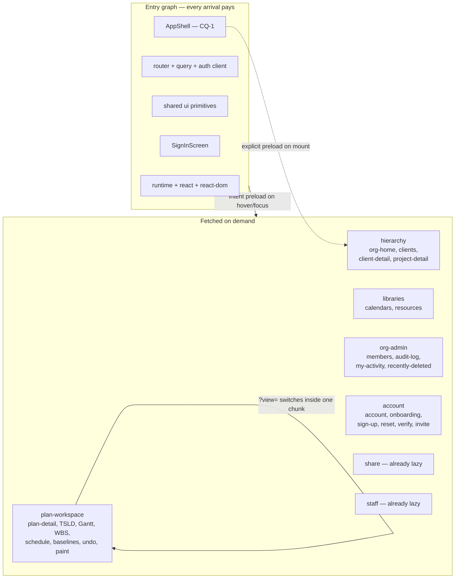
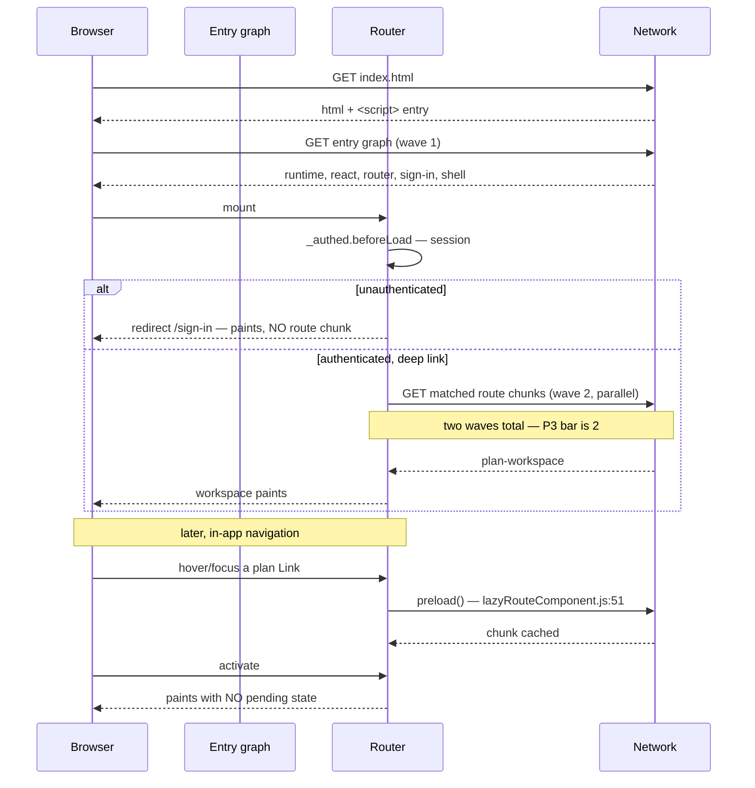
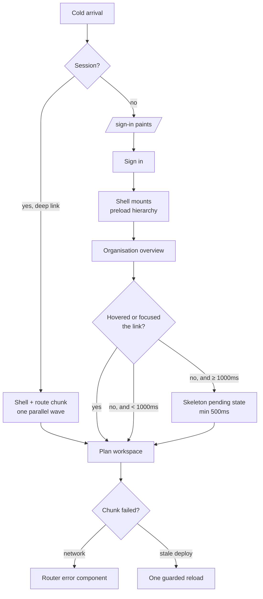

# Feature Spec: Route code splitting — the web entry graph

- **Status:** Accepted — shipped (ADR-0171). Approved 2026-10-02 (product owner): CQ-1 lazy shell; CQ-2 up to 10% slower on a deep link or reload, at most 5% slower in-app, **partially met, with the refresh limb accepted by the product owner on 2026-10-02**; CQ-4 container readings only (§1 "Open questions").
- **Author(s):** feature-analyst (for the product owner)
- **Date:** 2026-09-12 · **Refreshed:** 2026-10-02 (re-verified against `main`; see §0.5)
- **Tracking issue / epic:** `docs/TECH_DEBT.md` #292

> **REFRESHED 2026-10-02. Read §0.5 before anything else in this document.** Three weeks of work
> landed after the 2026-09-12 draft. Re-verified by reading the code, not the register:
>
> - **The problem still holds, and it is the same size in routes.** `app/router.tsx` still declares
>   23 `createRoute` calls + one root (24 definitions), 22 of which carry a screen component, and
>   still only two are lazy (`/share` at `:307`, `/staff` at `:315`). **No route or screen was added**
>   in those three weeks. The brief that commissioned this refresh said there were new
>   screens/routes. That was wrong, and the brief is not evidence (CLAUDE.md §19.11).
> - **Re-measured 2026-10-02 at `d3b9dbf`** (`m0-measurement.md` §9): entry graph today **461,186**; lazy-shell design (variant B) **178,259**; shell cost **50,701** (was 43,878); `paint` is in today's graph at 55,647 and out of it in A and B. P1 passes for A and B. The figures in the next bullet are the pre-measurement account.
> - **It is bigger in bytes, and every byte figure below is now historical.** The budget was
>   re-floored twice (404,744 → 425,798 on 2026-09-16 → **445,254** on 2026-09-25,
>   `bundle-budget.json:6-7`), so the entry graph has grown by at least ~40 kB, and `paint` grew with
>   it (`bundle-budget.json:16` attributes 4.29 kB of one 4.39 kB step to `paint`). **M0's
>   157,483 floor, 43,878 shell cost, and `paint`'s 33,478 all need re-measuring** before they are
>   quoted as current. The procedure is in `m0-measurement.md` §8. No estimate replaces them.
> - **Some of the plan is already done:** the router citations are registered and the router
>   estate is no longer split (M0-T4), and most of M0-T2's document corrections landed. The bundle
>   gate moved into `pnpm prepush` with the Turbo-cache trigger fired and handled (ADR-0160).
> - **Three design corrections:** B8 as written could not catch the loose budget it was invented
>   for (§4 "How the budget moves", corrected); the router error screen now offers "Try again"
>   that may not recover a failed chunk (#314, new, §2 "Error scenarios"); and stale-deploy failures
>   are **likely, not rare**, because the product owner's host auto-redeploys every release under
>   open tabs (ADR-0047).
> - **The open questions are cut to three, in plain English** (§1 "Open questions"), one of them
>   new: who takes the timing readings, given the product owner does not run terminal commands
>   (ADR-0128 Context).

> **M0 HAS BEEN RUN — read [`m0-measurement.md`](m0-measurement.md) for the numbers, not this
> document's §0 table.** This spec was written with Bash disabled and says so; every figure in it
> is _read_ rather than measured. As of 2026-09-12 they are measured, and three things changed:
>
> - **P1 PASSES decisively** and the epic proceeds: entry graph **404,797 → 157,483 gzip bytes**
>   (**−61.1%**) with every route lazy, against a bar of ≤ 300,000.
> - **The floor this spec deliberately refused to estimate is measured: 157,483 gzip bytes.** That
>   refusal was right and is now discharged.
> - **CQ-1 is answered by measurement rather than by asking.** The shell costs **43,878 gzip
>   bytes** on the cold path (157,483 lazy vs 201,361 eager), so this spec's stated default —
>   eager — is the more expensive option. The trade is left for the product owner.
>
> One provenance correction to this document: it calls `apps/web/bundle-report.json` "the
> **committed** report" throughout. It is **git-ignored** (`.gitignore:93`), so the baselines were
> read from a local build artefact rather than a repository state. A fresh build reproduces them
> within **53 bytes**, so the arithmetic stands — but the basis was weaker than stated.
>
> _(2026-10-02: the M0 figures in this box are dated 2026-09-12 and pre-date ~40 kB of entry-graph
> growth. They are kept as taken. See the box above.)_

- **Roadmap link:** to be added with the ADR (see §4 "Implementation approach", ADR note)
- **Related ADR(s):** ADR-0029 (persistent app-shell), ADR-0059 (shared time axis), ADR-0081
  (entry point + journey), ADR-0088 D1 (no `VITE_` flag), ADR-0097/0098 (page archetypes),
  ADR-0105 (register row is not a spec), ADR-0128 (measure on the machine that can take it),
  ADR-0136 (the bundle budget gate), ADR-0138 (CI shard roster), ADR-0058 (a bar goes at the
  measured floor)

> **Instrument note, stated once and load-bearing for every number below.** This spec was written
> in a session where **Bash is disabled**, so `pnpm --filter @repo/web build` could **not** be run.
> Every byte figure here is read from the committed `apps/web/bundle-report.json`
> (`measuredAt: 2026-09-11T14:04:54.760Z`) and cited by line. **Nothing here is a fresh
> measurement**, and the first task of the plan (M0-T1) is to re-derive the report and record
> whether it has moved. Where a claim is reasoned from a dependency's source rather than observed
> running, it is labelled **[from source]**; where it is reasoned from specification rather than
> either, **[unverified]**.

---

## 0. Re-verifying the problem statement

`docs/PROCESS.md` §"reconciliation" and CLAUDE.md §19 require the problem to be re-verified, not
only the remedy — because a problem goes stale in the one direction nobody checks. Four claims in
#292 and its neighbours were checked. **Two are stale, one was already fixed, one is wrong in the
brief that commissioned this spec.**

| #292's claim                                                                               | Verified                                                                                                                                                                                                                                                                                                                                                                                                         |
| ------------------------------------------------------------------------------------------ | ---------------------------------------------------------------------------------------------------------------------------------------------------------------------------------------------------------------------------------------------------------------------------------------------------------------------------------------------------------------------------------------------------------------- |
| Entry chunk 370,899 gzip; entry graph 404,744 across three chunks                          | **HOLDS.** `bundle-report.json:13`, `:4-8`. The three are `index` 370,899 + `paint` 33,477 + `rolldown-runtime` 368 = 404,744 exactly (`:13`, `:86`, `:111`).                                                                                                                                                                                                                                                    |
| "`app/router.tsx` declares 26 routes"                                                      | **WRONG, mildly.** `= createRoute({` appears **23** times, plus one `createRootRouteWithContext` = **24** route definitions, of which **22** carry a screen component (`indexRoute` is redirect-only, `router.tsx:126-141`, was `:125-140` — corrected 2026-10-02). ADR-0076 Class 1. **Re-counted 2026-10-02: unchanged.**                                                                                      |
| "two `lazy()` boundaries (`/share`, `/staff`)"                                             | **HOLDS.** `= lazy(` appears twice (`router.tsx:307`, `:315`; was `:306`/`:314` — every `router.tsx` line below `:11` moved +1 when `RouteErrorScreen` was extracted to `app/route-error-screen.tsx` for #314, corrected 2026-10-02).                                                                                                                                                                            |
| "`vite.config.ts` sets no `manualChunks`"                                                  | **HOLDS** (re-read 2026-10-02). `vite.config.ts:77-80` declares `build` with `outDir` and `sourcemap` only.                                                                                                                                                                                                                                                                                                      |
| "Nothing in CI checks a bundle size (`#48(b)`)"                                            | **STALE.** CI runs the gate — today as the root `pnpm check:web-bundle` at `ci.yml:286-287` (was `ci.yml:269-270` running the workspace script; moved by ADR-0160, corrected 2026-10-02), which `pnpm prepush` now runs too. The paragraph is correct as _history_ and false in the present tense. (#48 survives as a compact-table row, `\| 48 \|`, marked closed — #292's own correction-inside-a-correction.) |
| "Setting the budget is `docs/specs/delivery-gates/` M3, **written and awaiting approval**" | **STALE.** It shipped. `bundle-budget.json` exists with a measured `floor` (`:5-10`) and `check-bundle-size.mjs` is exported and suite-driven (`:99`, was `:90` — corrected 2026-10-02).                                                                                                                                                                                                                         |
| `FRONTEND_QUALITY.md`'s route-splitting sentence needs correcting                          | **ALREADY DONE.** `docs/FRONTEND_QUALITY.md:116-127` (was `:112-121`, corrected 2026-10-02) says route-based splitting "is the INTENTION, and is not what the app does today". It still says "declares 26 routes" at `:120`, which is the residue M0-T2 owns.                                                                                                                                                    |

### 0.1 The correction the row missed, and it is the ADR-0071 shape

#292 says of the splitting sentence: "**The sentence is corrected in place**" — singular. There
were two copies. The second is still wrong:

> `docs/FRONTEND_ARCHITECTURE.md:151-153`
> "**Code splitting.** Routes are lazy by default (per-route chunks); the shell and critical path
> stay in the initial bundle."

That is the same false claim, in the **Routing** section of the document a reader opens _first_ when
auditing how routing works. Noticing drift and repairing one copy leaves the other exactly as wrong
as not noticing (ADR-0071). It is decision-bearing in precisely the way #292 describes: a reader
checking bundle health finds a plausible answer and stops.

_**Fixed since, 2026-10-02.** `docs/FRONTEND_ARCHITECTURE.md:154-166` now reads "**Not implemented
yet, and this bullet asserted the opposite for the project's life**" and points here. It says "Of 23
registered routes", which counts the `createRoute` calls without the root, so it agrees with §0's
24 definitions. The quoted text above is kept as the record of what it said._

### 0.2 The brief's own claim about `paint` is wrong, and it changes the scope

The brief commissioning this spec states that `jspdf`, `html2canvas` **and `paint`** "are ALREADY
lazy and are explicitly not the problem — do not propose 'fixing' them."

**`paint` is not lazy.** `bundle-report.json:84-91` records it as `inEntryGraph: true`, and
`inEntryGraph` means reachable from the entry through **static** imports only
(`bundle-report-plugin.ts:37-38`, `:131`; was `:37`, `:120` — corrected 2026-10-02). The static path is
`TsldCanvas.tsx:46` → `../render/paint`, with three more static importers in the same feature
(`tsld-toolbar-items.tsx:53`, `use-tsld-canvas-ui-state.ts:8`, `tsld-toolbar-context.ts:8`). It is a
_separate chunk_ only because the lazy staff console also reaches it
(`features/perf-probe/scenes/canvas-draw.ts:8`), so Rolldown hoisted the shared module out — and a
separate chunk that is statically imported is still paid at first paint.

_**Importer list corrected 2026-10-02.** Two of the three "more static importers" are `import type`
(`tsld-toolbar-items.tsx:52`, `tsld-toolbar-context.ts:8`). A type import is erased at build and
puts nothing in the graph, so it was never a runtime path. The **runtime** importers today, from
`grep "render/paint'"` over `apps/web/src` with tests excluded, are `TsldCanvas.tsx:46`,
`use-tsld-canvas-ui-state.ts:8` (`DEFAULT_VIEW_TOGGLES`), `export/render-export-image.ts:2-8` (reached
statically from `toolbar/commands/use-diagram-image.ts:10`), and two perf-probe scenes
(`canvas-draw.ts:8`, and `revision-diff.ts:7`, which is new) that live in the already-lazy staff
chunk. All of them are inside `features/tsld` or behind `/staff`, so the M3 prediction ("`paint`
leaves with `plan-detail`") survives the correction._

`docs/FRONTEND_QUALITY.md:85-88` already states this correctly ("understates first paint by
**33,845 bytes**, the `paint` chunk it statically imports"). #292's own wording — "`paint` is its
own chunk", listed under "the heavy things are already lazy" — is what the brief inherited, and
"its own chunk" is true while "already lazy" is not.

**Consequence for scope:** `paint` is **33,477 gzip bytes, 8.27% of the entry graph**, it is
plan-workspace-only code, and it is the one part of the prize that can be stated as a floor before
any build is run. Every stranger who loads `/sign-in` currently downloads the TSLD painter.
_(2026-10-02: 33,477 is the 2026-09-11 figure. `paint` has grown since —
`bundle-budget.json:16` records +4.29 kB in one step on 2026-09-25 — and its current size is
**to be re-measured**, `m0-measurement.md` §8.)_

### 0.3 Units: three conventions are in circulation, one of them against its own instruction

- #292's table is Vite's build-reporter **kB = 1000 bytes** (the row says so at its head).
- `bundle-report.json` / `bundle-budget.json` are **raw bytes**.
- `docs/FRONTEND_QUALITY.md:97-98` quotes "`jspdf` (125.57 kB gzip) and `html2canvas` (45.51 kB)",
  which are **KiB = 1024** (128,583 / 1024 = 125.57; 46,603 / 1024 = 45.51) — **two lines after the
  same bullet list says "Quote bytes here, and compare like with like or not at all"**
  (`:95-96`). The instruction and the next bullet disagree.

**This spec quotes bytes only.** Three conventions over one quantity is how 372-against-200 came to
be read as a regression.

_2026-10-02: the `FRONTEND_QUALITY.md` half is fixed. The figures now read "`jspdf` (128,584 bytes
gzip) and `html2canvas` (46,603)" at `:103-106`, with a dated note at `:97-102`. The gate's
own output is **not** fixed: `check-bundle-size.mjs:64` still divides by 1024 and prints `kB`. That
is folded into M1-T3, which edits the same file._

### 0.4 What is therefore true, and what this epic is for

The substance of #292 survives intact and is not weakened by the corrections above:

**Every authenticated route — the whole plan workspace, the Gantt, the canvas painter, every
dialog — is in the entry graph, so a stranger arriving at `/sign-in` downloads the entire
application before the sign-in form paints.** `router.tsx:26-45` statically imports 20 screen
components (19 screens + `AuthedLayout`); `router.tsx:114` redirects every unauthenticated arrival to
`/sign-in`. _(Was `:25-44` / `:113`. Corrected 2026-10-02; the count is unchanged.)_

**And #292's own caution stands and is adopted as a constraint of this spec:** 372 against ~200 is
**not** a regression, the ~200 kB figure was never a measurement, and "splitting the authenticated
routes is the obvious remedy and is **not** obviously right". This spec therefore gates the build on
a measurement rather than treating the split as decided (§1 "Success criteria").

### 0.5 Re-verification, 2026-10-02 — problem and design, against today's `main`

Done by reading files, with Bash unavailable again, so **no build was run and no byte figure here
is a new measurement**. Each row says what was read.

| Claim                                                                 | Verdict 2026-10-02                                                                                                                                                                                                                                                                                                                                                                                                                                                                                                                                                                                                                                             |
| --------------------------------------------------------------------- | -------------------------------------------------------------------------------------------------------------------------------------------------------------------------------------------------------------------------------------------------------------------------------------------------------------------------------------------------------------------------------------------------------------------------------------------------------------------------------------------------------------------------------------------------------------------------------------------------------------------------------------------------------------- |
| Route set: 24 definitions, 22 with a screen, 20 static screen imports | **HOLDS, unchanged.** `router.tsx` read in full: 23 `createRoute` + 1 root; the static imports are `:26-45`; the only lazy ones are `:307`, `:315`. `apps/web/src/routes/` holds exactly the 22 screen modules plus tests, with no new route file. Line numbers shifted +1 from `:11` because `RouteErrorScreen` moved out to `app/route-error-screen.tsx` (#314).                                                                                                                                                                                                                                                                                             |
| No route is lazy beyond `/share` and `/staff`; no pending component   | **HOLDS.** `lazyRouteComponent`, `pendingComponent` and `defaultPendingComponent` appear nowhere in `apps/web/src`. **None of this epic has been done by anyone else.**                                                                                                                                                                                                                                                                                                                                                                                                                                                                                        |
| Entry graph 404,744 / 404,797 gzip bytes                              | **STALE — grown, magnitude ≥ +40 kB, current value TO BE RE-MEASURED.** `bundle-budget.json:6-7`: floor re-measured 425,798 (2026-09-16), then **445,254** (2026-09-25, at `a841768f`), budget **467,968** (`:13`). A week of work (ADR-0166–0169) has landed since that floor.                                                                                                                                                                                                                                                                                                                                                                                |
| M0's lazy floor 157,483, shell cost 43,878, `paint` 33,478            | **STALE BY CONSTRUCTION.** All three were measured against the 2026-09-12 tree. **RE-MEASURE** (`m0-measurement.md` §8). There is also a composition gap that the re-measurement must close: m0 §3 calls the eager-shell variant "19 routes lazy". Of the 22 screen components, eager shell + eager sign-in leaves 20 lazy and eager shell alone leaves 21, so the record does not say which routes each variant made lazy. In particular, it does not say whether sign-in was lazy in the 157,483 probe. If it was, the design's floor (sign-in eager) is higher than 157,483, and the 43,878 mixes shell cost with sign-in cost.                             |
| P1 (≤ 300,000) passes                                                 | **PASSED on 2026-09-12; re-confirm.** The bar is **not moved**. It stays an absolute 300,000, which is now a _stricter_ demand (≥ ~145 kB off a ≥ 445 kB graph, against ≥ 104,744 then). Moving a pre-committed bar after the fact is the thing ADR-0128 forbids. Keeping it in place is the conservative direction.                                                                                                                                                                                                                                                                                                                                           |
| Router dependency estate is split across two versions (M0-T4 risk)    | **RESOLVED.** `pnpm-lock.yaml` holds one `@tanstack/react-router` (1.170.40) and one `@tanstack/router-core` (1.171.33), matching `scripts/dependency-claims.json` `verifiedAgainst`. `apps/web/package.json:81` declares `^1.170.39` (was `:75` / `^1.170.32`).                                                                                                                                                                                                                                                                                                                                                                                               |
| Router citations need registering (M0-T4)                             | **DONE.** All six dependency citations in this spec are registered in `scripts/dependency-claims.json` (the `claims-ts-source-citations` epic), with this spec in `citedBy`. `lazyRouteComponent.js` at 1.170.40 was read directly, and both registered anchors are on their cited lines. One ref is registered under its old text with moved lines: the `load-client.js` pending-component ref this spec writes as `:671-672` is registered with `lines: "685-686"`. **The citation text below is deliberately left as written**, because `check:claims` matches on the ref string, and rewriting it here without touching the register would fail that gate. |
| Turbo cache blind spot "does not fire" (§3)                           | **STALE — it fired, and was fixed.** `turbo.json:11` declares `bundle-report.json` as a build output, and the root `check:web-bundle` deletes the report before building (`package.json:51`, `check-bundle-size.mjs:37-50`). A stale green report was measured passing a jspdf-in-entry bundle on 2026-09-26 before the fix (ADR-0160).                                                                                                                                                                                                                                                                                                                        |
| Bundle gate is CI-only                                                | **STALE.** `check:web-bundle` is a root `check:*`, so `pnpm prepush` runs it (ADR-0160). Every split PR will meet B1/B3 locally.                                                                                                                                                                                                                                                                                                                                                                                                                                                                                                                               |
| `FRONTEND_ARCHITECTURE.md` and the units contradiction (M0-T2)        | **MOSTLY DONE** (§0.1, §0.3 notes). Residue: `FRONTEND_QUALITY.md:120` still says "26 routes"; #292's body still says "declares 26 routes" (`TECH_DEBT.md` §292, "The cause is not bloat" paragraph) and cites `ci.yml:270` / `check:bundle-size` where CI now runs `check:web-bundle` at `:286-287`; and the gate prints KiB as `kB` (`check-bundle-size.mjs:64`).                                                                                                                                                                                                                                                                                            |
| The error component is the router's inline default                    | **CHANGED.** `defaultErrorComponent: RouteErrorScreen` (`router.tsx:513`), which now offers **Try again** = `reset()` + `router.invalidate()` and deliberately **not** a page reload (`route-error-screen.tsx:20-25`). This interacts with chunk failures; see §2 "Error scenarios".                                                                                                                                                                                                                                                                                                                                                                           |
| A production-build Playwright suite has one precedent (`e2e-csp`)     | **Two now.** `playwright.forced-colors.config.ts` also builds and previews, with `reuseExistingServer: false` and `--strictPort` (`:61-69`). Both sit on shard 1, and `ci.yml:1130-1131` gives the reason. That precedent already closes M1-T4's stale-server risk.                                                                                                                                                                                                                                                                                                                                                                                            |
| Nothing measures LCP in this repository                               | **HOLDS.** No `largest-contentful-paint` observer anywhere in `apps/web`. The ADR-0128 probe measures canvas frames only. **P2 still has no instrument**, and the product owner "does not run terminal commands" (ADR-0128 Context, `:21-24`), which is why CQ-4 is new.                                                                                                                                                                                                                                                                                                                                                                                       |

**What the refresh changes about the problem:** nothing in kind, and its size has grown. A stranger loading
`/sign-in` still downloads every authenticated screen, and that is now ≥ 445 kB gzip rather than
405 kB. **What it changes about the design** is in §4 (B8), §2 (chunk failure × Try again;
stale-deploy likelihood) and §1 (questions).

---

## 1. Business understanding

### Problem

A planner signing in, and a stranger meeting the product for the first time, both download
**404,744 gzip bytes** _(2026-09-11; ≥ 445,254 by 2026-09-25 per `bundle-budget.json:7`, current
figure to be re-measured)_ of JavaScript — the whole application, including the TSLD painter, the Gantt,
the WBS band, the revision-compare overlay and every dialog — before the sign-in form paints. None
of it is reachable from that screen.

The cause is not bloat and not a heavy dependency. The two genuinely large libraries are already
behind dynamic imports and cost first paint nothing (`jspdf` 128,583 and `html2canvas` 46,603 gzip,
both `inEntryGraph: false` — `bundle-report.json:48`, `:80`). The cause is that **the route
splitting two governing documents describe has never existed**: 22 screen components are static
imports in one module.

CLAUDE.md §15 targets LCP < 2.5 s on a mid-tier mobile over 4G and "keep the initial JS bundle lean
(code-split by route)". The bundle is not code-split by route.

### Users

| Who                                    | What they need                                                                                                     |
| -------------------------------------- | ------------------------------------------------------------------------------------------------------------------ |
| **A stranger / an invited new member** | `/sign-in` and `/accept-invite` to paint quickly. They pay for the entire authenticated app and use none of it.    |
| **A planner (Planner / Contributor)**  | Sign-in to be quick **and** the first plan open not to be slower. This is the trade the epic must not lose.        |
| **An External Guest** (ADR-0051)       | Already served — `/share` is lazy (`router.tsx:307`). Unaffected except that it stops paying for the authed shell. |
| **Staff** (ADR-0086)                   | Already served — `/staff` is lazy (`router.tsx:315`).                                                              |

_(`router.tsx` lines in this spec were re-pointed on 2026-10-02 — all moved +1; see §0.5.)_
| **Every role, on a coarse pointer** | No regression. Intent-preloading is driven by hover/focus, and a touch device has no hover (§2 "Edge cases"). |

No role gains or loses a capability. This is a delivery-shape change, and permissions are untouched
(§2 "Permissions").

### Primary use cases

1. A stranger loads any URL, is redirected to `/sign-in` (`router.tsx:114`), and pays for the
   sign-in screen and the runtime — not the plan workspace.
2. A planner signs in and lands on the organisation overview (`router.tsx:126-141` →
   `/orgs/$orgSlug`) without a visible stall.
3. A planner opens a plan from the Project Explorer. The link was hovered or focused, so
   `defaultPreload: 'intent'` (`router.tsx:511`) has already fetched the workspace chunk and the
   navigation shows nothing.
4. A planner opens a **bookmarked plan URL cold**. There is no hover to preload from; this is the
   worst case and the one the epic can lose on.

### User journeys

Happy path (see §4 "User flow"): cold arrival → entry graph → sign-in paints → credentials → shell
mounts and the hierarchy chunk is warmed in parallel with the session query → overview → hover a
plan → chunk preloads → click → workspace paints with no fallback.

Alternate that must not regress: cold arrival **already authenticated** at
`/orgs/x/plans/y` → entry graph + shell + workspace chunk, loaded by the router as one navigation
rather than three sequential waits.

### Expected outcomes

- A materially smaller first paint for every arrival, and a `/sign-in` that no longer carries the
  application behind it.
- Route splitting stops being a documented intention and becomes the implemented default, with a
  rule a later reader can apply to the next route.
- `paint` leaves the entry graph as a consequence rather than as a special case.

### Success criteria — the falsification conditions, committed before any work

This is the decision the brief asked for first. The bars are written here, **before** the
measurement, in the ADR-0128 style, and each names what result means **stop**.

> **P1 — the prize is real (bytes). Gates whether the epic is built at all.**
> With every route component lazy, a probe build's **entry graph ≤ 300,000 gzip bytes** — a
> reduction of ≥ 104,744 bytes (≥ 25.9%) from the 404,744 floor.
> **If the probe lands above 300,000, the epic STOPS at M0.** The finding is then that the entry
> graph is floor-dominated (vendor + shell + shared primitives), #292 is rewritten to say so, and
> the remaining work — splitting _within_ routes — is a much larger programme with a much smaller
> prize that nobody has justified.
>
> **300,000 is a JUDGEMENT, not a measurement, and is labelled as one** — the same honesty
> `bundle-budget.json:12` applies to its own `headroomRatio`. Its reasoning: it is comfortably more
> than the 33,477 bytes `paint` alone guarantees (§0.2), so it cannot be met by the trivial part of
> the change; and on the mid-tier-4G envelope CLAUDE.md §15 names, ~100 kB gzip is the order of
> magnitude at which transfer time moves by a visible fraction of a second rather than by noise.
> **The throughput half of that is [unverified]** — this repository has never measured a 4G
> envelope — which is exactly why P1 gates the _bytes_ and **P2 gates the user-visible effect**.
>
> _2026-10-02: P1 passed on 2026-09-12 (157,483). The bar stays **300,000, absolute** and is not
> re-based on the larger graph (§0.5). The re-measurement re-confirms it before M1 starts._

> **P2 — the user-visible effect (LCP). Gates whether the epic ships.**
> **Measured in the build container, with repeat runs** (CQ-4, answered 2026-10-02: the product
> owner will not take readings). This departs from #292's instruction to measure "on the product
> owner's own hardware" and from ADR-0128's method, and it has a price: the container is the class
> of machine ADR-0127 D8 recorded as unreliable, so the verdict is **INDETERMINATE** whenever the
> spread is too wide, and the sign-off then rests on download sizes and request counts (P1, P3, P4)
> alone.
>
> - **Cold `/sign-in` LCP improves by ≥ 10%**, and
> - **warm first-plan-open does not regress by more than 5%**, and
> - **cold (bookmarked) plan-open does not regress by more than 10%**.
>
> Each figure is reported with its **run-to-run spread from repeat measurement**, and the verdict is
> **INDETERMINATE — not PASS — whenever the spread is ≥ the effect** (ADR-0127 D8's recorded
> precedent: a machine whose no-change baseline moved 0.56 → 10.00 pp was honestly reported
> indeterminate rather than shrugged at). **A cold plan-open regression beyond 10% withdraws the
> epic**, and that is the outcome #292 predicts as plausible ("a faster sign-in and a slower first
> plan open").
>
> _2026-10-02: **CQ-4 is answered — container readings only.** Nothing in the repository measures
> LCP, so the harness is a Playwright `measure-*` script with CDP 4G throttling, taken at ≥ 5 runs
> per path with the spread reported. The "before" readings are still taken **before M1 merges**, so
> before and after come from one machine and one harness. **No milestone waits on a product-owner
> sitting.**_

> **P3 — the waterfall does not deepen. Gates the design, and closes the gap the byte gate cannot
> see.**
> On both cold paths, the number of **sequential** JavaScript requests before first contentful paint
> must be **no greater than 2** (entry graph, then at most one route-chunk wave loaded in parallel).
> Asserted in a real browser against the **production build**, not reasoned about.
> **A third sequential wave fails P3 even if P1 and P2 pass**, because bytes moved behind three
> round trips on a 4G RTT is the failure mode a byte budget reports as a success (§3 "the gap").

> **P4 — total cold bytes, not just entry bytes.**
> The **sum** of JavaScript fetched before first contentful paint on the cold `/sign-in` path must
> fall by ≥ 100,000 gzip bytes. This exists because P1 alone is satisfiable by a chunk that is
> `inEntryGraph: false` and dynamically imported by **every** route on mount — which shrinks the
> reported entry graph, downloads exactly as much, and does it one round trip later. Strictly worse,
> and green on every existing assertion.

**Non-vacuity control (checked first, on every one of P1–P4).** Each measurement records the
population it measured — bytes compared, requests counted, routes exercised — and **refuses a
verdict when that population is empty or unchanged** (ADR-0093; `check-bundle-size.mjs:65-78` is the
in-repo precedent, and ADR-0130's judge "throws rather than judging when it has nothing to judge").

### Open questions

**For the product owner — three questions, refreshed 2026-10-02 and all answered the same day.** Each has a recommended answer,
so "go with the recommendations" is a complete reply. The technical framing that produced them
follows each one in small print for the build agents.

> **CQ-1 — ANSWERED 2026-10-02 (product owner): lazy, only after sign-in, as recommended.**
> _Should the main app frame (sidebar, top bar, Project Explorer) load up front for
> everyone, or only once somebody has signed in?_
>
> _In plain English._ Today every visitor downloads the whole app. After this work, each screen
> loads when it is opened. That leaves the frame that surrounds every signed-in screen, which can go
> either way:
>
> - **Load it only after sign-in ("lazy") — recommended.** The sign-in page gets lighter for
>   everyone, by about **44 kB** compressed when measured on 2026-09-12 (to be re-measured; the
>   app has grown since). The possible cost falls on a planner who is already signed in and opens
>   a bookmark or reloads: the frame is fetched at the same moment as the screen inside it. If that
>   turns into a visible extra wait, we switch to "up front".
> - **Load it up front ("eager").** Simpler and safe, but every stranger on the sign-in page pays
>   about 44 kB for a frame they cannot see yet.
>
> **Recommendation: lazy**, on the condition that the wave test (P3) shows the frame and the
> screen arriving **together** rather than one after the other. If P3 shows them in sequence, we
> fall back to eager automatically and tell you. **Default if you do not answer: the same.**
>
> Technical: `AuthedLayout` → `AppShell` renders `<Outlet />` (`app-shell.tsx:207`; was cited
> as `:1`, the import line — corrected 2026-10-02), so route laziness and shell laziness are
> independent. The 2026-09-12 draft said "eager shell makes the authenticated cold start one wave";
> that is **[unverified]**. The router loads every matched route's component in parallel on one
> navigation, and Vite emits a preload list for a dynamic import's static dependencies, so a lazy
> shell plus a lazy route may still be one parallel wave. P3 is the measurement that decides it.
> The 2026-09-12 default ("eager") is reversed because M0 measured it as the costlier option.

> **CQ-2 — ANSWERED 2026-10-02 (product owner): as recommended. A deep link or reload may be up to
> 10% slower, provided in-app plan navigation is no more than 5% slower; anything worse withdraws
> only the plan-screen part (M3).**
> _If opening a plan from a bookmark or a page reload becomes a little slower, is that
> acceptable in exchange for a faster sign-in page?_
>
> _In plain English._ Opening a plan **from inside the app** (clicking it in the Project Explorer)
> should feel exactly as it does now, because the app starts fetching the plan screen as soon as
> your pointer or keyboard focus lands on the link. Opening a plan **straight from a bookmark, or
> pressing reload**, cannot be pre-fetched like that, so it may get slightly slower. The question is
> how much slower is acceptable.
>
> **Recommendation: accept up to 10% slower on bookmark/reload, provided opening from inside the
> app shows no measurable slowdown (≤ 5%).** Anything worse than 10% and the plan-workspace part of
> the change is withdrawn, while the cheaper parts (sign-in, account, admin screens) still ship.
> **Default if you do not answer: the same.**
>
> Technical: these are P2's existing thresholds, unchanged. Mitigation is
> `defaultPreload: 'intent'` (`router.tsx:511`), which covers in-app navigation and nothing about a
> reload. M3 is one revertible commit, which is what makes "withdraw the workspace part only"
> real.

> **CQ-2 outcome — RECORDED 2026-10-02 (product owner): partially met; the refresh limb is accepted.**
> Container medians against the pre-split build (`m0-measurement.md` §13 and the `final` run), same
> machine and harness: sign-in **-50%**; plan deep link, cold **+8.5%** (passes 10%); plan opened in
> the app **+4.99%** (inside 5%, but **indeterminate** at that path's 4.1% spread); plan deep link
> on a **refresh +17.4%** (fails 10%). The refresh figure was taken through `vite preview`, which
> revalidates every hashed chunk, while nginx serves `/assets/` immutable, so the deployed cost is
> expected to be lower and has not been measured. The product owner chose to ship rather than
> withdraw M3, accepting the refresh trade. `docs/TECH_DEBT.md` #433 re-measures it behind the
> production cache headers; its trigger is the next change to chunking or preloads, or a planner
> reporting slow refreshes. The same-machine `final` run after the last review fixes read 1,398 /
> 3,874 / 1,403 / 2,251 ms (sign-in, cold, refresh, in-app): within 1% of the figures above.

> **CQ-4 — ANSWERED 2026-10-02 (product owner): container readings only.** The product owner will
> **not** take Lighthouse readings, so Option A is declined and the default below applies: Option B,
> with the verdict **limited to download sizes and request counts plus container timings**, stated
> as such.
> _Who takes the before-and-after timing readings, and on what machine? (new 2026-10-02)_
>
> _In plain English._ The size of the download can be measured by the build agents automatically.
> **How fast the page actually appears** is different: the build machine is known to give
> unreliable timings (ADR-0128 recorded a no-change reading moving from under 1% to 10% within an
> hour). The spec said you would take these readings on your own computer. Nothing in the product
> can take them for you today, and you do not use a terminal.
>
> - **Option A — you take them in Chrome, no terminal (recommended).** Chrome has a built-in
>   "Lighthouse" panel. We would write a click-by-click card: open the site, press F12, choose
>   Lighthouse → Mobile → Analyze, and copy one number. Three pages (sign-in, a plan opened from
>   the Explorer, a plan opened from a bookmark), three times each, **once before the first change
>   is released and once after**. About 20 minutes per sitting. Lighthouse simulates a mid-range
>   phone on 4G, which is exactly the target in CLAUDE.md §15.
> - **Option B — the build agents take them on the build machine.** No effort from you, but the
>   readings may come back "can't tell" (INDETERMINATE) because that machine is noisy. If they
>   do, the sign-off falls back to download size and request counts only.
> - **Option C — build a timing panel into the staff console**, like the canvas-speed panel
>   (ADR-0128). It is the most repeatable option, but it is a feature in its own right (new screen,
>   new ADR) and would at least double this epic.
>
> **Recommendation: A, with B run alongside as a cross-check.** **One timing constraint you should
> know about:** your server installs every release automatically (ADR-0047), so the **"before"
> readings must be taken before the first change in this epic is merged**. After that, the
> "before" version is gone from your server. **Default if you do not answer: B**, with the
> verdict limited to sizes and request counts, and stated as such.
>
> Technical: whether DevTools Lighthouse's default "Clear storage" also clears the session
> cookie, and so breaks the two signed-in paths, is **[unverified]**. The card must be tried once
> before it is handed over. P2's INDETERMINATE rule (spread ≥ effect) applies to every option.

**Resolved without asking — formerly CQ-3 (2026-10-02).** _Does this epic file an ADR?_ Yes. One
ADR, filed at M5, covering only the boundary rule. It amends how ADR-0029's shell composes with
route loading and sets a rule every future route must follow, which is a standing architectural
constraint and not a product preference. Hence it is a default rather than a question. It needs a
`docs/ROADMAP.md` entry (`check-adr-coverage.mjs:59-90`, was `:50-67`) and a CLAUDE.md §16 line,
which `check:adr-coverage` now also gates (ADR-0147).

**Non-critical — defaults stated, work proceeds.**

| Question                                                           | Default                                                                                                                                                                                                                                                                                 |
| ------------------------------------------------------------------ | --------------------------------------------------------------------------------------------------------------------------------------------------------------------------------------------------------------------------------------------------------------------------------------- |
| Minimum group size worth a chunk?                                  | **15,000 gzip bytes.** Below that an extra round trip costs more than the bytes saved. A judgement; M0 reports every group's size so it can be revised against real numbers.                                                                                                            |
| `manualChunks`?                                                    | **No.** Per-route `lazyRouteComponent` and let Rolldown derive the sharing. A hand-written map is a second source of truth about what shares code and will drift (ADR-0065).                                                                                                            |
| Prefetch strategy beyond `'intent'`?                               | **Unchanged.** `defaultPreload: 'intent'` already exists (`router.tsx:511`); adding `'viewport'` or `'render'` is a separate question with its own cost.                                                                                                                                |
| Does `/share` or `/staff` change?                                  | **No.** Both already lazy. They stop paying for the authed shell as a side effect if CQ-1 resolves lazy.                                                                                                                                                                                |
| New `VITE_` flag?                                                  | **No** — ADR-0088 D1. A `VITE_` constant is inlined at build time, `docker-publish.yml` passes none, so it has never been an operator rollback. The rollback is a commit.                                                                                                               |
| Lower the budget in the same PR?                                   | **Yes**, and add the ratchet the gate lacks (§3 "the gap", B8 — **redesigned 2026-10-02**, §4). The re-floor is measured at the PR's head, which is a deliberate exception to `bundle-budget.json:4`'s "never what a branch costs" rule; the reasoning is in §4 "How the budget moves". |
| Should "Try again" reload the page after a failed screen download? | **Yes, for that one failure only** (§2 "Error scenarios", new 2026-10-02). Every other route error keeps #314's no-reload retry.                                                                                                                                                        |

---

## 2. Functional requirements

### User stories & acceptance criteria

> **US-1** — As **a stranger arriving at the product**, I want the sign-in screen to paint without
> downloading the scheduling application, so that my first impression is not a blank page.
>
> **Acceptance criteria**
>
> - **Given** a cold cache **when** I load any URL and am redirected to `/sign-in`
>   **then** the JavaScript fetched before first contentful paint excludes the plan workspace, the
>   Gantt, and `render/paint`.
> - **Given** the production build **when** `check:bundle-size` runs **then** the entry graph is
>   within the lowered budget and `paint`'s chunk reports `inEntryGraph: false`.
> - **Given** a cold load **when** first contentful paint occurs **then** no more than **2**
>   sequential JavaScript request waves preceded it (P3).

> **US-2** — As **a planner**, I want opening a plan from the Explorer to feel exactly as it does
> today, so that a faster sign-in is not paid for out of my working day.
>
> **Acceptance criteria**
>
> - **Given** I hover or keyboard-focus a plan link **when** I then activate it **then** the
>   workspace chunk is already fetched and **no loading fallback is shown**.
> - **Given** I activate a plan link without any hover (keyboard `Enter` straight from a fresh
>   focus, or a touch tap) **when** the chunk takes < 1,000 ms **then** still **no fallback is
>   shown** — `defaultPendingMs` defaults to 1000 (`router-core/dist/esm/router.d.ts:98-113`).
> - **Given** the chunk takes ≥ 1,000 ms **when** the fallback appears **then** it is shown for at
>   least 500 ms (`defaultPendingMinMs`, `:106-113`) so it cannot flash.

> **US-3** — As **a planner on a slow connection**, I want a navigation that is genuinely waiting to
> say so in the shape of the screen I am going to, so that I can tell "loading" from "broken".
>
> **Acceptance criteria**
>
> - **Given** a slow chunk fetch **when** the pending state appears **then** it uses the existing
>   `Skeleton` archetype (`components/ui/page/skeleton.tsx`) and is `aria-busy`, matching the
>   treatment `plan-detail.tsx:33-49` (was `:32-49`, corrected 2026-10-02) already renders for its
>   pending **query**.
> - **Given** a chunk fetch **fails** **when** I am on that navigation **then** I see the router's
>   error treatment (`RouteErrorScreen`, registered at `router.tsx:513`; was the inline
>   `:512-521`, extracted for #314 — corrected 2026-10-02), not a blank screen, **and its action
>   actually recovers** (see "Error scenarios" — new 2026-10-02).
> - **Given** a redeploy has removed the hashed chunk my tab is asking for **when** the import fails
>   with a module-not-found **then** the page reloads **once** and recovers
>   (`lazyRouteComponent.js:37-44` — one reload, `sessionStorage`-guarded). **[from source]**

> **US-4** — As **a maintainer adding the 25th route**, I want one rule that tells me which chunk it
> belongs in, so that the split does not decay into 22 ad-hoc decisions.
>
> **Acceptance criteria**
>
> - **Given** `docs/FRONTEND_ARCHITECTURE.md` and `docs/FRONTEND_QUALITY.md` **when** I read their
>   splitting sections **then** they describe what the code does and state the grouping rule.
> - **Given** a new route added statically **when** CI runs **then** a structural assertion names it
>   (§3 "Testing", S1).

### Workflows

**Cold unauthenticated arrival.** Browser fetches `index.html` → entry graph (runtime + react +
router + query + auth client + shell¹ + sign-in) → router matches, redirects to `/sign-in`
(`router.tsx:114`) → sign-in paints. No route chunk is required.
¹ subject to CQ-1.

**Sign-in completion.** Credentials POST → session query resolves → `indexRoute.beforeLoad`
(`router.tsx:129-140`) resolves organisations and throws a redirect to `/orgs/$orgSlug` →
**the `hierarchy` chunk is already in flight**, because the shell's mount kicked off an explicit
`.preload()` (see §4) rather than waiting for the redirect to discover it.

**In-app navigation.** Hover/focus a `Link` → router preloads the match, which calls
`.preload()` on the lazy component (`router-core/dist/esm/load-client.js:10-12`, `preloadComponent` →
`route.options[type].preload?.()`; `lazyRouteComponent.js:51` sets `lazyComp.preload = load`)
**[from source]** → activate → component already resolved → no fallback.

**Cold authenticated arrival at a deep URL.** Entry graph → router matches `_authed` +
`planDetailRoute` and loads both matches' chunks; the pending component covers the wait if it
exceeds 1,000 ms.

### Edge cases

| Case                                                                                                   | Expected behaviour                                                                                                                                                                                                                                                                                                                                                                                                                                                                                                                                                                                                                                                                                                                                                                                                                                                                                          |
| ------------------------------------------------------------------------------------------------------ | ----------------------------------------------------------------------------------------------------------------------------------------------------------------------------------------------------------------------------------------------------------------------------------------------------------------------------------------------------------------------------------------------------------------------------------------------------------------------------------------------------------------------------------------------------------------------------------------------------------------------------------------------------------------------------------------------------------------------------------------------------------------------------------------------------------------------------------------------------------------------------------------------------------- |
| **Coarse pointer — no hover, so no intent preload**                                                    | The chunk loads on activation. `defaultPendingMs` 1,000 hides it when fast. **This is a real, named residual**: ADR-0118 established that no gate here ran with a coarse pointer until it was built one. P3 is measured in **both** pointer modes.                                                                                                                                                                                                                                                                                                                                                                                                                                                                                                                                                                                                                                                          |
| **Keyboard-only navigation**                                                                           | `'intent'` covers **focus** as well as hover, so a keyboard planner preloads on `Tab`. Asserted in the journey rather than assumed.                                                                                                                                                                                                                                                                                                                                                                                                                                                                                                                                                                                                                                                                                                                                                                         |
| **Programmatic redirect (`indexRoute` → org home; `_authed` → sign-in)**                               | No hover exists. Handled by the explicit shell-mount preload for `hierarchy`; the sign-in redirect needs nothing because sign-in is eager.                                                                                                                                                                                                                                                                                                                                                                                                                                                                                                                                                                                                                                                                                                                                                                  |
| **Chunk 404 after redeploy**                                                                           | One guarded reload (`lazyRouteComponent.js:37-44`). **React's `lazy()` does not do this** — which is why `lazyRouteComponent` is the chosen primitive, not `lazy()`. **Likelihood re-assessed 2026-10-02: high, not rare.** The product owner's host runs the ADR-0047 Watchtower profile, so every release replaces the hashed chunks under any open tab. Today almost nothing is lazy, so almost nothing notices. After this epic, the first navigation into an unvisited screen after each release takes this path. `nginx.conf:35-38` serves `/assets/` with no SPA fallback, so a missing chunk is a real 404 rather than `index.html` served as JavaScript. That is what lets `isModuleNotFoundError` (router-core `utils.js`, "Failed to fetch dynamically imported module" and two browser variants) recognise it **[from source]**. **Must be driven in the journey**, not reasoned about (M1-T4). |
| **Offline / network failure mid-navigation**                                                           | **Corrected 2026-10-02.** The draft said this shows the error component. Chrome reports a network failure with the **same** "Failed to fetch dynamically imported module" message as a 404, so `lazyRouteComponent` treats it as a stale deploy and **reloads once** **[from source]**. Offline, that lands on the browser's own "no connection" page, not ours. The reload is guarded per message in `sessionStorage`, so a second attempt shows `RouteErrorScreen`. Acceptable: `NavigationGuard` has already resolved any unsaved work before the fetch starts. Recorded rather than engineered around.                                                                                                                                                                                                                                                                                                  |
| **A route behind a dark flag** (`resources`, `audit-log`, `account`, `forgot/reset-password`, `share`) | Unchanged. The routes join the tree conditionally (`router.tsx:464-489`); a lazy component inside a route that is never registered is never fetched. _(2026-10-02: `RESOURCES_ENABLED`, `AUDIT_LOG_ENABLED` and `ACCOUNT_SETTINGS_ENABLED` are the flags; whether each is default-on in `config/env.ts` decides which suites prove the conditional tree, so read it, not this row.)_                                                                                                                                                                                                                                                                                                                                                                                                                                                                                                                        |
| **`?view=gantt` within an open plan**                                                                  | **No new fetch.** TSLD and Gantt are one route and one group by design (§4 "Boundaries"), so switching views crosses no chunk boundary.                                                                                                                                                                                                                                                                                                                                                                                                                                                                                                                                                                                                                                                                                                                                                                     |
| **Two routes in one group, navigated between**                                                         | The second is already resolved. Grouping is what buys this.                                                                                                                                                                                                                                                                                                                                                                                                                                                                                                                                                                                                                                                                                                                                                                                                                                                 |
| **A plan open with unsaved work**                                                                      | Untouched. `NavigationGuard` (`authed-layout.tsx:30`) blocks the navigation before any chunk is fetched.                                                                                                                                                                                                                                                                                                                                                                                                                                                                                                                                                                                                                                                                                                                                                                                                    |

### Permissions

**No change whatsoever.** This is stated explicitly because it is the kind of change where an
accidental authorisation shift would be invisible:

- The `_authed` guard stays exactly where it is (`router.tsx:106-119`), and `beforeLoad` runs
  **before** a route's component chunk is needed — so an unauthenticated caller is redirected
  without fetching the authenticated chunk. A lazy component cannot weaken a guard that runs first.
  _(2026-10-02: with `defaultPreload: 'intent'`, a **preload** runs `beforeLoad` too, so an
  anonymous hover cannot fetch an authed chunk either. There are no authed links on public screens
  in any case. To be confirmed by security-reviewer at M5 rather than asserted here.)_
- Dark-flag route registration (`router.tsx:464-489`) is untouched.
- ADR-0012's RBAC + organisation scoping is server-side and not reachable from this change.
- `/staff`'s runtime self-gating (docblock `router.tsx:319-338`, route `:339-353`) is untouched.
- **A chunk is not a secret.** Every chunk is a static file under `/assets/` that anyone can fetch by
  name, today and after this change. Splitting moves _when_ code downloads, never _who may_.

### Validation rules

None — no user input, no forms, no DTOs, no money.

### Error scenarios

| Scenario                                                 | Detection                                      | User-facing result                                                                   | Status |
| -------------------------------------------------------- | ---------------------------------------------- | ------------------------------------------------------------------------------------ | ------ |
| Route chunk fetch fails (network)                        | rejected dynamic import                        | one guarded reload (same message as a 404 — see edge cases), then `RouteErrorScreen` | n/a    |
| Route chunk missing after redeploy                       | module-not-found matched                       | one guarded page reload, then recovery                                               | n/a    |
| **"Try again" after a chunk failure** _(new 2026-10-02)_ | `RouteErrorScreen` showing for a failed import | **a page reload, not `reset()` + `invalidate()`** — see below                        | n/a    |
| Chunk slow (≥ 1,000 ms)                                  | `defaultPendingMs`                             | `Skeleton` pending component, min 500 ms                                             | n/a    |
| Unauthenticated deep link                                | `_authed.beforeLoad` (before any chunk)        | redirect to `/sign-in?redirect=…` (unchanged)                                        | n/a    |

No HTTP status codes: nothing here touches the API.

**The new interaction with #314, and why it changes the error screen (2026-10-02).**
`RouteErrorScreen` now offers **Try again** = `reset()` then `router.invalidate()`. It deliberately
avoids a page reload so that unsaved work behind the boundary survives (`route-error-screen.tsx:20-25`).
For a loader that failed transiently, that is right. For a **chunk that failed to download** it may
not recover. Reading `lazyRouteComponent` at 1.170.40: a failed import clears its promise and
latches the error, and the component re-throws that error on every render until something calls
`.preload()` again **[from source]**. `invalidate()` re-runs the matches and so should call it, but
browsers are permitted to **cache a failed module fetch for the life of the document**, so
re-importing the same URL in the same page can fail again without touching the network
**[unverified for Chromium/Firefox/WebKit — the journey decides]**. A Try-again button that cannot
recover is #314's original defect ("instructs a retry it does not offer") in a new form.

**Default:** `RouteErrorScreen` recognises a failed chunk download (the same three message prefixes
the router's `isModuleNotFoundError` tests; that predicate is not re-exported by
`@tanstack/react-router`, so it is mirrored and registered as a dependency claim, see plan M1-T1b)
and, **for that case only**, its button reloads the page. Every other route
error keeps #314's no-reload retry. A reload is safe at that point: the failure happens on entry to
a new screen, after `NavigationGuard` has already resolved any unsaved work. This edits a shipped
component's behaviour on a user-visible path, so it lands in M1 with the journey that drives it
(M1-T1b).

---

## 3. Technical analysis

| Area               | Impact   | Notes                                                                                                                                                                                                                                                                                       |
| ------------------ | -------- | ------------------------------------------------------------------------------------------------------------------------------------------------------------------------------------------------------------------------------------------------------------------------------------------- |
| **Frontend**       | **high** | `app/router.tsx` (20 static screen imports → `lazyRouteComponent`), one new pending component, `vite.config.ts` possibly untouched.                                                                                                                                                         |
| **Backend**        | **none** | No module, service or endpoint. Asserted: the epic's diff must contain zero files under `apps/api/`.                                                                                                                                                                                        |
| **Database**       | **none** | No model, column, index, constraint or migration. **`database-architect` is therefore not engaged — because there is nothing to design, not because it was judged too small** (CLAUDE.md §19.3, ADR-0121's phrasing).                                                                       |
| **API**            | **none** | No contract change, no OpenAPI change, no `docs/API.md` change.                                                                                                                                                                                                                             |
| **Security**       | **low**  | No authz change (§2 "Permissions"). One genuine consideration: the CSP. `e2e-csp` serves the real policy over the production build; more chunks means more `script-src 'self'` fetches, which the existing policy already permits. **To be re-asserted by running `e2e-csp`, not assumed.** |
| **Performance**    | **high** | The entire subject. Three gates (P1–P4) plus the existing `check:bundle-size`.                                                                                                                                                                                                              |
| **Infrastructure** | **low**  | One new Playwright config + one CI step, which perturbs ADR-0138's four-shard packing and `check:e2e-roster`.                                                                                                                                                                               |
| **Observability**  | **none** | No logs, metrics, traces or health.                                                                                                                                                                                                                                                         |
| **Testing**        | **med**  | Unit (router tree shape), structural (every route is lazy or listed), new browser journey against the **production build**, a11y on the pending state.                                                                                                                                      |

### The CPM engine and the recalculation parity gate

**The CPM engine is not imported and no migration runs.** The ADR-0034 recalculation parity gate is
untouched **by construction**: this epic changes only _when_ already-shipped client modules are
fetched, and `computeSchedule` lives in `apps/api/src/modules/schedule/engine/`, which
`apps/web` does not import at all. There is no scheduling input added, so the byte-identity
condition has nothing to hold parity _for_ — stated in the honest form ADR-0096/ADR-0107 use.

### The gap the existing gate cannot see — the brief's question 6

`check:bundle-size` asserts B1 (entry graph ≤ budget), B2 (`jspdf`/`html2canvas` not in the entry
graph, read from the module graph), B3 (one ceiling over non-entry chunks), B5 (a floor is recorded)
and B6 (CSS). Its own docblock is already honest about the boundary: "**Whether the bundle is
_fast_. Bytes are a proxy: parse and execute time, and the waterfall a route actually triggers, are
`docs/TECH_DEBT.md` #292's subject and not this gate's**" (`check-bundle-size.mjs:52-56`; was
`:43-47` — corrected 2026-10-02).

**Six things could regress after this epic and pass every existing assertion:**

1. **Waterfall depth.** Bytes moved behind three sequential round trips reads as a success. The gate
   counts bytes and has no concept of a request. → **P3**, browser-measured.
2. **A lazy chunk every route imports anyway.** `inEntryGraph: false` is satisfied by a chunk that
   every screen dynamically imports on mount — the entry graph shrinks, the download does not, and
   it arrives a round trip later. **The sharpest gap**, and the easiest to reach by accident via a
   shared `components/ui` barrel. → **P4** (total cold bytes), browser-measured.
3. **No ratchet on the budget.** B1 compares against `entryGraphGzipBytes` and nothing asserts that
   number is not _loose_. After the split, ~120 kB of reclaimed headroom sits silently available for
   future bloat. → **B8** (new assertion: the budget may not exceed `floor × headroomRatio`),
   verified red. This is a **shared-gate change** and so is itself an ADR-0105 trigger — covered by
   this spec. **Corrected 2026-10-02: that assertion alone cannot catch this gap.** It compares two
   numbers that are both in `bundle-budget.json`, and a split changes neither of them, so B8 as
   drafted stays green over exactly the ~120 kB it was invented for. B8 is now two assertions,
   B8a and B8b (§4 "How the budget moves"), and **B8b** is the one that sees this gap.
4. **A new route added statically.** Nothing notices; the entry graph grows by one screen and B1's
   5% headroom absorbs several before firing. → **S1**, a structural assertion over `router.tsx`.
5. **`maxNonEntryChunkGzipBytes` is 135,168** (`bundle-budget.json:14`) — larger than some whole
   groups will be, so a lazy chunk can grow a long way unnoticed; and a legitimately large
   `plan-workspace` group may trip it. → re-derive with `floor` in the same PR; do **not** raise
   without `raisedBecause`. _(2026-10-02: the plan-workspace tripping it is now **likely, not
   possible**. The entry graph above the 2026-09-12 all-lazy floor is ~288 kB on the 2026-09-25
   figures (445,254 − 157,483), and most of that is plan-workspace code. Whether it lands in one
   chunk or several is exactly what the re-measurement must report: largest lazy chunk against
   135,168.)_
6. **Coarse pointer has no hover, so no intent preload.** Every navigation on a touch device pays
   the fetch. ADR-0118 found that no gate here had ever run with a coarse pointer. → P3 measured in
   both pointer modes; if the touch path is materially worse it is **recorded as debt, not fixed by
   guesswork** (the product owner uses a keyboard — ADR-0091's precedent for exactly this).

Two further blind spots are **named and not fixed**, because they are pre-existing and unchanged:

- ~~**Turbo cache.** `check-bundle-size.mjs:33-41` records that adding Turbo caching to CI is the
  trigger to declare `bundle-report.json` in `turbo.json`'s outputs. This epic does not add caching,
  so the trigger does not fire.~~ **Withdrawn 2026-10-02: it fired and was fixed by somebody else.**
  Turbo's local cache was on all along. A stale green report was measured passing a
  jspdf-in-entry bundle on 2026-09-26, so `turbo.json:11` now declares the report as an output and
  the root gate deletes it before building (`check-bundle-size.mjs:37-50`, ADR-0160). This epic
  inherits a gate that cannot read a stale report, which is one blind spot fewer.
- **Parse/execute time.** Fewer bytes is not necessarily faster script evaluation. P2 measures LCP,
  which includes it. The container is a weak instrument for it (CQ-4: no real-hardware readings
  will be taken), so the P2 verdict is INDETERMINATE whenever the spread is too wide.

### Does the ADR-0105 trigger fire? — the brief's question 2, first half

**Yes, on three of the four triggers, and I agree with the brief's judgement.**
`docs/PROCESS.md:30-33`:

- **"adds or changes a Playwright config or a CI step"** — the epic adds both (§4). **Unambiguous.**
- **"changes a component's public contract or a shared gate"** — B8 adds an assertion to
  `check-bundle-size.mjs`. **Unambiguous.**
- **"adds or changes a user-facing entry point"** — arguable rather than clear-cut: no _entry point_
  moves, but a loading state appears on navigations that have none today, which is user-facing
  behaviour on every screen. I would not rest the trigger on this one alone; it does not have to
  carry the weight. _(2026-10-02: the error-screen change in §2 strengthens it a little — a
  shipped screen's button changes behaviour for one failure class — but the two unambiguous
  triggers above still carry it.)_
- **S1** (new structural gate over `router.tsx`) is a **new shared gate**, which is a third
  unambiguous trigger, added 2026-10-02 for completeness.
- **Schema** — does not fire. No `database-architect`, for the reason stated in the table above.

`bundle-budget.json`'s numbers are **not** a shared-gate change (see §4, "How the budget moves").

### Dependencies

- Nothing must land first. The work is self-contained in `apps/web`.
- `@tanstack/react-router` `^1.170.39` (`apps/web/package.json:81`; was `^1.170.32` at `:75`,
  corrected 2026-10-02 — resolves to 1.170.40) supplies `lazyRouteComponent`
  (`dist/esm/index.d.ts:12`) and the router-level `defaultPendingComponent` / `defaultPendingMs` /
  `defaultPendingMinMs` (`router-core/dist/esm/router.d.ts:98-113`,
  `router-core/dist/esm/load-client.js:671-672`).
- **Two versions of `@tanstack/react-router` are installed** (`1.170.27` and `1.170.33`) and two of
  `@tanstack/router-core` (`1.171.22`, `1.171.28`). ADR-0107 recorded that a split estate makes
  `scripts/dependency-claims.json` unable to describe the code that ships, because the resolver
  takes the **first** matching store directory and `verifiedAgainst` holds one version per package
  (`docs/TECH_DEBT.md` #178). **Every router citation in this spec must be registered against the
  version `apps/web` actually resolves, established by reading the lockfile — not by taking the
  first directory a glob returns.** That is an M0 task, not an assumption.
  **Resolved 2026-10-02:** the lockfile now holds one copy of each (1.170.40 / 1.171.33, equal to
  `verifiedAgainst`), and the citations are registered. M0-T4 is done, and the risk is retired
  unless a future bump splits the estate again, in which case `check:claims` reports it.
- ADR-0138's shard packing and `check:e2e-roster` must be updated when the config lands.

---

## 4. Solution design

### Architecture overview

Nothing about the application's structure changes. What changes is which modules are reachable
through a **static** import from the entry.

```mermaid
flowchart LR
  subgraph EAGER["Entry graph — every arrival pays"]
    RT[runtime + react + react-dom]
    RTR[router + query + auth client]
    UI[shared ui primitives]
    SI[SignInScreen]
    SH["AppShell — CQ-1"]
  end

  subgraph LAZY["Fetched on demand"]
    HIER["hierarchy<br/>org-home, clients,<br/>client-detail, project-detail"]
    WS["plan-workspace<br/>plan-detail, TSLD, Gantt, WBS,<br/>schedule, baselines, undo, paint"]
    LIB["libraries<br/>calendars, resources"]
    ADMIN["org-admin<br/>members, audit-log,<br/>my-activity, recently-deleted"]
    ACCT["account<br/>account, onboarding,<br/>sign-up, reset, verify, invite"]
    SHARE["share — already lazy"]
    STAFF["staff — already lazy"]
  end

  EAGER -->|"intent preload on hover/focus"| LAZY
  SH -.->|"explicit preload on mount"| HIER
  WS -->|"?view= switches inside one chunk"| WS
```

### Data flow

```mermaid
sequenceDiagram
  participant B as Browser
  participant E as Entry graph
  participant R as Router
  participant N as Network

  B->>N: GET index.html
  N-->>B: html + <script> entry
  B->>N: GET entry graph (wave 1)
  N-->>B: runtime, react, router, sign-in, shell
  B->>R: mount
  R->>R: _authed.beforeLoad — session
  alt unauthenticated
    R-->>B: redirect /sign-in — paints, NO route chunk
  else authenticated, deep link
    R->>N: GET matched route chunks (wave 2, parallel)
    Note over R,N: two waves total — P3 bar is 2
    N-->>R: plan-workspace
    R-->>B: workspace paints
  end

  Note over B,R: later, in-app navigation
  B->>R: hover/focus a plan Link
  R->>N: preload() — lazyRouteComponent.js:51
  N-->>R: chunk cached
  B->>R: activate
  R-->>B: paints with NO pending state
```

### User flow

```mermaid
flowchart TD
  A[Cold arrival] --> B{Session?}
  B -->|no| C[/sign-in paints/]
  C --> D[Sign in]
  D --> E[Shell mounts<br/>preload hierarchy]
  E --> F[Organisation overview]
  B -->|yes, deep link| G[Shell + route chunk<br/>one parallel wave]
  F --> H{Hovered or focused<br/>the link?}
  G --> I[Plan workspace]
  H -->|yes| I
  H -->|"no, and &lt; 1000ms"| I
  H -->|"no, and &ge; 1000ms"| J[Skeleton pending state<br/>min 500ms]
  J --> I
  I --> K{Chunk failed?}
  K -->|network| L[Router error component]
  K -->|stale deploy| M[One guarded reload]
```

### Database changes

**None.** No model, column, index, constraint or migration.

### API changes

**None.** No endpoint, DTO, status code or OpenAPI change. `docs/API.md` is untouched.

### Component changes

| Component                              | Change                                                                                                                                                                                                                                                                                                                  |
| -------------------------------------- | ----------------------------------------------------------------------------------------------------------------------------------------------------------------------------------------------------------------------------------------------------------------------------------------------------------------------- |
| `app/router.tsx`                       | 20 static screen imports become `lazyRouteComponent(() => import(…), 'ExportName')`. `SignInScreen` stays static. The two `lazy()` wrappers for `/share` and `/staff` are **converted to `lazyRouteComponent`** so the whole tree uses one primitive and gains the stale-deploy reload.                                 |
| `components/ui/page/route-pending.tsx` | **New.** One shared route pending component built from the existing `Skeleton` archetype. `aria-busy`, matching the shape `plan-detail.tsx:33-49` already uses.                                                                                                                                                         |
| `app/route-error-screen.tsx`           | **Changed (new 2026-10-02).** For a failed chunk download only (`isModuleNotFoundError`), the button reloads the page; every other error keeps `reset()` + `invalidate()` (#314). Copy for that case says the app was updated or the connection dropped, and that reloading fixes it. Copy wording goes to ux-reviewer. |
| `app/router.tsx` (`createRouter`)      | Adds `defaultPendingComponent`. `defaultPendingMs` / `defaultPendingMinMs` are **left at their defaults** (1000 / 500) rather than restated — a restated default is a number that drifts from the library's.                                                                                                            |
| `routes/plan-detail.tsx`               | **Unchanged.** It already owns a workspace-shaped pending skeleton for its _query_; the route's _chunk_ pending state is the shared one, and the two compose.                                                                                                                                                           |
| Everything else                        | **Unchanged.** No screen component is edited. That is what makes the existing unit suites the before/after oracle (ADR-0078's barrel-preserving argument). _(The draft's "4,750-odd" count was not re-derived on 2026-10-02 and is dropped rather than carried.)_                                                       |

**States.** Loading: the shared `Skeleton` pending component, only after 1,000 ms. Empty: n/a.
Error: the existing router error component. Success: the screen, unchanged.

### The loading state — the brief's question 2, second half

Three decisions, and the third is the one worth stating:

1. **One shared treatment, not per-route.** `defaultPendingComponent` on `createRouter`. A per-route
   pending component for 22 routes is 22 chances for one screen's loading shape to differ from its
   neighbour's — the failure `docs/DESIGN_SYSTEM.md:584-605` records the page archetypes existing to
   prevent ("the frame was hand-written **fourteen** times"). A route may override later **when it
   owns a distinct shape**, which is the archetype rule ("each archetype owns its own loading
   **shape**", `:598`) rather than an exception to it.
2. **Built from `Skeleton`, not invented.** `components/ui/page/skeleton.tsx` exists and the
   authoring rule is explicit: "reach for the archetype, or raise the requirement — **never invent a
   one-off**" (`:601-602`). _(`DESIGN_SYSTEM.md` lines were `:529-547`, `:543`, `:546-547`;
   corrected 2026-10-02.)_
3. **A warm route shows nothing, and this is the platform default rather than something to build.**
   `defaultPendingMs` defaults to **1000** and `defaultPendingMinMs` to **500**
   (`router-core/dist/esm/router.d.ts:98-113`) **[from source]**. So a chunk that arrives in under a
   second never paints a fallback at all, and one that does paint cannot flash. **This is the single
   most important fact in the design**: the objection "splitting puts a spinner on every navigation"
   is false by default, and would only become true if someone set `defaultPendingMs: 0`.

**Does the loading treatment need its own ADR? No.** `docs/FRONTEND_ARCHITECTURE.md:261-265`
(was `:244-255`, corrected 2026-10-02) already specifies the standard — "**Route pending components** for navigation; suspense boundaries
for lazy chunks" — and `DESIGN_SYSTEM.md:543` already owns the material. There is nothing to decide;
there is a documented standard with **zero implementations** (`pendingComponent` appears nowhere in
`apps/web/src`), and this epic is the first thing to implement it. Writing an ADR for "we did what
the standard says" would be noise.

**What does warrant an ADR is the boundary rule** (CQ-3): it is a standing constraint every future
route must satisfy, it amends how ADR-0029's shell composes with route loading, and it corrects two
governing documents. Filed at enablement, with a ROADMAP entry.

### The boundaries, and the rule — the brief's question 3

**The rule, stated so a later reader can apply it without this list:**

> **A route component is lazy unless it is on a cold-start path no preload can warm.**
> **A lazy route joins the group whose feature code it already shares; it starts a new group only if
> it shares none and the group would exceed 15,000 gzip bytes.**
> **Grouping follows shared feature code, never URL shape.**

Applying it to the 22 screen components:

| Group              | Routes                                                                                                   | Why these are one chunk                                                                                                                                                                                                                                                                                                                                                                                                                                                                        |
| ------------------ | -------------------------------------------------------------------------------------------------------- | ---------------------------------------------------------------------------------------------------------------------------------------------------------------------------------------------------------------------------------------------------------------------------------------------------------------------------------------------------------------------------------------------------------------------------------------------------------------------------------------------- |
| **eager**          | `SignInScreen` (+ shell, CQ-1)                                                                           | `router.tsx:114` sends **every** unauthenticated arrival here. There is no hover to preload from and it is the first paint for every stranger.                                                                                                                                                                                                                                                                                                                                                 |
| **plan-workspace** | `plan-detail`                                                                                            | One route, but the group that matters: TSLD, Gantt, WBS band, schedule, baselines, undo-redo, revision-compare, schedule-health, float-paths, notes, interchange review, **and `render/paint`**. TSLD and Gantt **share the time axis and the painter** (ADR-0059: "the time axis is shared, not reimplemented") and `?view=` switches between them _inside one route_ — splitting them apart would either duplicate the axis or create a shared chunk both fetch, which is P4's failure mode. |
| **hierarchy**      | `org-home`, `clients`, `client-detail`, `project-detail`                                                 | The navigation spine. Shares `features/clients`, `projects`, `plans`, `overview`. **Warmed by an explicit `.preload()` on shell mount**, because `indexRoute` reaches `org-home` by a _programmatic_ redirect (`router.tsx:139`) with no hover — so intent-preloading structurally cannot cover the one navigation every sign-in performs.                                                                                                                                                     |
| **libraries**      | `calendars`, `resources`                                                                                 | Share the `Combobox` pickers, the archive lifecycle and `libraryFilterSearch` (`router.tsx:227-236`) — ADR-0053's surface.                                                                                                                                                                                                                                                                                                                                                                     |
| **org-admin**      | `members`, `audit-log`, `my-activity`, `recently-deleted`                                                | Low-frequency administration; share the org-scoped `DataTable` patterns and the audit filters.                                                                                                                                                                                                                                                                                                                                                                                                 |
| **account**        | `account`, `onboarding`, `sign-up`, `forgot-password`, `reset-password`, `verify-email`, `accept-invite` | Reached once or twice in an account's life. Grouped with the remaining public auth screens because they share the auth forms and `AuthShell`.                                                                                                                                                                                                                                                                                                                                                  |
| _already lazy_     | `share`, `staff`                                                                                         | Unchanged in behaviour; converted to `lazyRouteComponent` for one primitive and the stale-deploy reload.                                                                                                                                                                                                                                                                                                                                                                                       |

Seven groups, and **the mechanism is not `manualChunks`**: one `lazyRouteComponent` per route,
Rolldown derives the shared chunks from the import graph. A hand-written `manualChunks` map is a
second statement about what shares code, and it drifts invisibly — the ADR-0065 argument ("two
implementations would drift, and the drift would be invisible"). If M0 measures the derived chunking
as unacceptable — too many tiny chunks, or a group fragmenting across waves — `manualChunks` is the
**escalation with a named trigger**, not the starting point.

### Can the shell be split, and is there a floor? — the brief's question 4

**The shell can be split, because it does not have to be.** `AppShell` renders `<Outlet />`
(`app-shell.tsx:207`; `:1` is only the import — corrected 2026-10-02), so a route component under it
is an independent module: route laziness and
shell laziness are **orthogonal choices**, which is why CQ-1 is a question rather than a
constraint.

**Yes, there is a floor, and it has three parts:** (a) the vendor closure — the entry chunk records
**25 packages** (`bundle-report.json:15-42`), led by `react-dom`, the router trio, the Better Auth
stack, `zod`, `react-hook-form` and `lucide-react`; (b) the shell itself
(`AppShell`, `ExplorerColumn`, `NavigatorRail`, `ChromeBand`, `Sheet`, `Announcer`, `Surface` —
`app-shell.tsx:4-16`; re-read 2026-10-02, it also pulls `NavigatorCrud`, `ShellContext`,
`PanelSurface` and `features/navigator`); (c) the shared `components/ui` primitives any eager
route touches.

**I am deliberately not naming that number.** Doing so would require a build I cannot run, and an
estimated floor is precisely the artefact this repository has already been burned by — the
"~200 kB" that "predates any build being looked at" and was then compared against a real
measurement as though the two were commensurable. **The floor is M0's first deliverable**, measured
by a probe build with every route lazy, and P1's stop condition is written against it.

What **can** be stated as a measured lower bound on the prize, today: **`paint` is 33,477 gzip bytes
(8.27% of the entry graph), it is statically imported only from the TSLD
(`TsldCanvas.tsx:46`), and making `plan-detail` lazy removes it from the entry graph.** That is the
one part of the reduction that does not depend on M0's result. _(2026-10-02: the runtime importers
are listed in §0.2's note, all still TSLD-only; the byte figure is 2026-09-11's and is larger now,
to be re-measured.)_

### How the budget moves — the brief's question 5

**Confirmed: lowering `bundle-budget.json` after a real improvement is the gate working as
designed, and is NOT an ADR-0105 shared-gate trigger.** The reasoning, and it rests on a
distinction the file itself draws:

- ADR-0105's trigger is a change to a **shared gate** — the _rule_. That is
  `scripts/`-and-`check-bundle-size.mjs` territory. `bundle-budget.json` is the gate's **input**:
  the numbers it compares against, carrying `measuredAt`, `measuredBy` and a `floor` block whose own
  `_` says it is "the measurement the budget is derived from, kept so a later reader can see how
  much headroom has been spent" (`:6`).
- The file's asymmetry is explicit and only about raises: "A raise carries a one-line reason in
  `raisedBecause` — a budget quietly moved up is a budget that never says no" (`:2`). There is no
  corresponding ceremony for a lowering, because a lowering cannot hide anything.
- So the PR that lands the split re-runs `measuredBy`, rewrites `floor` from the new report,
  re-derives all three budget numbers, and leaves `raisedBecause: null` — nothing is raised.
- **The derivation is `floor × headroomRatio` rounded UP to the next whole KiB, not plain
  multiplication** — recovered from all three committed pairs rather than assumed: 404,744 × 1.05 =
  424,981.2 → 416 KiB = **425,984** (`:13`); 128,583 × 1.05 = 135,012.15 → 132 KiB = **135,168**
  (`:14`); 15,141 × 1.05 = 15,898.05 → 16 KiB = **16,384** (`:15`). All three agree, so the rule is
  real rather than fitted. It matters because a naive `× 1.05` ratchet **rejects today's own budget
  by 1,002.8 bytes** — a gate that fails on day one (ADR-0058). An earlier draft of this spec's plan
  asserted the gap was 2.8 bytes, which is what doing the arithmetic corrected.

**The KiB-ceiling rule re-checked 2026-10-02 against the two later floors, and it still holds.**
2026-09-25 (`bundle-budget.json:7-9`, `:13-15`): 445,254 × 1.05 = 467,516.7 → 457 KiB = **467,968**
✓; 128,584 × 1.05 = 135,013.2 → 132 KiB = **135,168** ✓; 15,779 × 1.05 = 16,567.95 → 17 KiB =
**17,408** ✓. That is six agreeing pairs across two floors. The file's own `raisedBecause` (`:16`)
states the same rule in words ("the smallest whole kB at or above floor × 1.05"). Note that it says
"kB" while meaning KiB, the units confusion from §0.3 once more.

**But the brief's question exposes a real gap, which is why B8 exists.** Nothing asserts the budget
is not _loose_. If the split lands and nobody lowers the budget, ~120 kB of reclaimed headroom sits
silently available. ~~**B8 is a new assertion — the budget may not exceed `floor × headroomRatio`
(modulo rounding) — and adding it to `check-bundle-size.mjs` IS a shared-gate change, hence an
ADR-0105 trigger, hence covered by this spec.**~~ It is the ADR-0120 ratchet pattern: set at the
measured floor, and it ratchets down with each improvement rather than only catching regressions.

**B8 redesigned, 2026-10-02 — the drafted assertion could not see the gap it was named for.** It
compared `entryGraphGzipBytes` with `floor.entryGraphGzipBytes`, which are both fields of
`bundle-budget.json`. A split changes the **report**, not the budget file, so after a split that
nobody re-floors, the drafted B8 is still green and the ~120 kB is still loose. What it did check
(that the budget was derived honestly from its floor) is worth keeping, so B8 becomes two:

- **B8a — derivation.** Each budget equals `ceil(floor × headroomRatio / 1024) × 1024`, unless
  `raisedBecause` is non-empty, in which case it may exceed that (a raise is legitimate and says
  so). Reads only the budget file. Verified red by editing one budget by a byte.
- **B8b — looseness, the ratchet.** Fails when the **measured** entry graph has fallen so far that
  `report.entryGraph.gzip × headroomRatio < floor.entryGraphGzipBytes`, meaning the bundle has
  shrunk by more than the whole headroom. The message tells the reader to re-floor. Reads report
  and budget together. Verified red by running it against today's budget with the post-split report.

**B8b fails on an improvement, by design.** A PR that shrinks the entry graph by more than ~5% must
lower the budget in the same PR. That is the point of a ratchet, and it is cheap because the gate
runs in `pnpm prepush` (ADR-0160), so the contributor finds out locally.

**And it collides with a convention, which is resolved here rather than left to the builder.**
`bundle-budget.json:4` says the floor is measured against `origin/main`, "never what a branch costs,
or the branch under test sets its own bar". That rule exists to stop a branch **raising** its own
bar. A B8b re-floor can only **lower** it, and the PR's head is what `main` becomes on squash-merge.
**Default: a lowering re-floor is measured at the PR head and says so in `measuredBy`; a raise
still follows the `origin/main` rule unchanged.** Stated in the ADR (M5-T2).

**All of B8 is a shared-gate change** (ADR-0105 trigger, covered by this spec). B7's `KNOWN` key
set (`check-bundle-size.mjs:103-114`) needs no new key: both halves read existing fields.

### Implementation approach & alternatives

**Chosen:** per-route `lazyRouteComponent` with bundler-derived chunking, one shared
`defaultPendingComponent` built from the `Skeleton` archetype, an explicit `.preload()` for the
`hierarchy` group on shell mount, the budget re-derived downward with a new ratchet assertion, and
both governing documents corrected. Gated on P1 before building and P2/P3/P4 before shipping.

**Alternatives considered and rejected:**

| Alternative                                                      | Why not                                                                                                                                                                                                                                                 |
| ---------------------------------------------------------------- | ------------------------------------------------------------------------------------------------------------------------------------------------------------------------------------------------------------------------------------------------------- |
| **Hand-written `manualChunks`**                                  | A second source of truth about what shares code; drifts invisibly (ADR-0065). Kept as a named escalation.                                                                                                                                               |
| **React's `lazy()`** (as `/share` and `/staff` use today)        | No `.preload()`, so `defaultPreload: 'intent'` cannot warm it — which turns every navigation into a visible fetch and forfeits the design's main mitigation. Also no stale-deploy recovery (`lazyRouteComponent.js:37-44`).                             |
| **Split every route individually, no grouping**                  | 22 chunks, many under a few kB, and a round trip each. The 15,000-byte floor exists to prevent it.                                                                                                                                                      |
| **Split _within_ the plan workspace** (lazy dialogs, lazy Gantt) | A much larger programme with a much smaller prize, and it fragments a surface whose parts are reached in one session. The honest fallback **if P1 fails**, and recorded as such rather than attempted first.                                            |
| **Raise the budget and close #292 as "measured, acceptable"**    | Legitimate and should be said aloud: the row explicitly makes no claim that 372 kB is too big. Rejected because §0.4's finding — a stranger downloading the TSLD painter to see a login form — is a defect on its own terms, independent of any budget. |
| **A `VITE_` flag to gate the split**                             | ADR-0088 D1. Inlined at build time, no published image passes one; it would be a second JSX root maintained forever, not a rollback. The rollback is a commit boundary.                                                                                 |
| **Preload `'viewport'` or `'render'`**                           | Would warm more navigations and also re-download more for readers who never navigate. A separate question with its own measurement; out of scope.                                                                                                       |

### Testing

| Tier           | What                                                                                                                                                                                                                                                                                                                                                                                                                                                                                                  |
| -------------- | ----------------------------------------------------------------------------------------------------------------------------------------------------------------------------------------------------------------------------------------------------------------------------------------------------------------------------------------------------------------------------------------------------------------------------------------------------------------------------------------------------- |
| **Unit**       | The route tree still resolves every path; the pending component renders the `Skeleton` and is `aria-busy`.                                                                                                                                                                                                                                                                                                                                                                                            |
| **Structural** | **S1** — every route in `router.tsx` is either `lazyRouteComponent` or named in a short, reasoned `EAGER_ROUTES` allow-list, so a statically-added 25th route fails CI. Carries a **pinned positive case**, because "every unclassified route fails" passes perfectly against a census that found no routes (ADR-0093, ADR-0108's own gate caught itself this way).                                                                                                                                   |
| **Gate**       | **B8a + B8b** (redesigned 2026-10-02, §4) — derivation, and the measured-report ratchet; each verified red.                                                                                                                                                                                                                                                                                                                                                                                           |
| **Journey**    | A **new** config serving the **production build** (§"Why a new config"), driving P3 and P4 in a real browser, in both pointer modes. **Plus (2026-10-02) the stale-deploy path, driven rather than reasoned about**: build, load the app, delete one route chunk from `dist/assets/`, navigate to that screen, and assert exactly one reload and a working screen. Then the same with the chunk blocked by `page.route` (network failure), asserting `RouteErrorScreen` and that its button recovers. |
| **a11y**       | axe over the pending state; the announcement of a route change is checked rather than assumed.                                                                                                                                                                                                                                                                                                                                                                                                        |
| **Existing**   | `e2e-csp` re-run (more chunks, same policy); the **base** journey re-run (CLAUDE.md: change a screen, run the base journey); and per ADR-0091's lesson, **every** suite swept via `scripts/e2e-sweep.sh` after a change this broad.                                                                                                                                                                                                                                                                   |

### Why a new Playwright config, and what it costs

**A new config is necessary, and the reason is the same one `e2e-csp` records.** `e2e-shell` — the
natural-looking home — runs `pnpm dev` (`playwright.shell.config.ts:71`), and the dev server serves
**unbundled ES modules**: there are no chunks, so a suite asserting "the workspace chunk is not
fetched on sign-in" would be asserting over a build that does not exist. `playwright.csp.config.ts:6-22`
states the precedent exactly — "**Why this suite is different from its 25 siblings: it serves the
production build**" — with `vite build` then `vite preview` on port 4173 and a 300 s webServer
timeout because "a webServer timing out mid-compile reports as 'the server never came up'".

Its cost is real and must be paid explicitly: a new config means a new CI step, which means
**ADR-0138's four-shard packing is re-derived and `check:e2e-roster` updated in the same change**
(`check-e2e-roster.mjs` E3–E5 assert the roster, the shard conditions and that no suite runs on
every shard). A suite with no recorded duration is charged the **largest** measured, never zero.

_2026-10-02: there are now **two** production-build precedents. `playwright.forced-colors.config.ts`
joined `e2e-csp`, and it already does what M1-T4 planned to invent: `vite build && vite preview
--port … --strictPort` with `reuseExistingServer: false` (`:61-69`). That closes the "a stale
server is silently adopted" risk by construction. Both run on **shard 1**, "because these two are
the only steps paying for a production build" (`ci.yml:1130-1131`). **Default: the new suite joins
shard 1** beside them, subject to the LPT re-derivation._

---

## 5. Links

- Implementation plan: [`./implementation-plan.md`](./implementation-plan.md)
- Documents this change must correct _(list re-verified 2026-10-02)_:
  - `docs/FRONTEND_ARCHITECTURE.md:154-166` — **already corrected** to "not implemented yet"; rewrite
    at M4 to describe the new present and the rule
  - `docs/FRONTEND_ARCHITECTURE.md:261-265` — the pending-component standard gains its first
    implementation
  - `docs/FRONTEND_QUALITY.md:116-127` — the splitting section, rewritten to describe the new
    present and state the grouping rule; still says "26 routes" at `:120`
  - ~~`docs/FRONTEND_QUALITY.md:95-98` — the KiB/bytes contradiction (§0.3)~~ **done** (`:97-106`)
  - `docs/TECH_DEBT.md` #292 — ~~the two stale paragraphs, the "already lazy" wording, the route
    count~~ **done 2026-09-12/16**; residue: "declares 26 routes" in "The cause is not bloat", and
    `ci.yml:270` / `check:bundle-size`, which is now `check:web-bundle` at `ci.yml:286-287`
  - `apps/web/scripts/check-bundle-size.mjs:64` — prints KiB labelled `kB` (§0.3)
  - `apps/web/bundle-budget.json` — `floor` and all three budgets re-derived downward
  - `CLAUDE.md` §16 — the ADR's one line (now gated by `check:adr-coverage`, ADR-0147)
  - `docs/ROADMAP.md` — the ADR's entry (`check-adr-coverage.mjs:59-90`)
