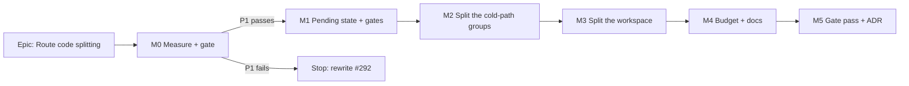

# Implementation Plan: Route code splitting — the web entry graph

- **Feature spec:** [`./feature-spec.md`](./feature-spec.md) — **Draft — awaiting approval before
  implementation**
- **Status:** Draft
- **Owner:** web

> **The shape of this plan is unusual and deliberately so.** M0 is a **measurement milestone whose
> permitted outcome is that the epic stops**. `docs/TECH_DEBT.md` #292 says in terms that splitting
> "is the obvious remedy and is **not** obviously right", and instructs that the effect be measured
> before splitting. So M0 builds a throwaway probe, measures the floor and the LCP, and **either
> unlocks M1 or closes the row with a finding**. Nothing in M1–M5 is written on the assumption that
> M0 passes.

## Breakdown

### Epic

**Route code splitting** — make the web entry graph carry the shell and the sign-in screen rather
than the whole application, closing `docs/TECH_DEBT.md` #292. Roadmap theme: frontend performance
and delivery quality.

---

### Milestone 0: Measure, and decide whether to build (shippable: the measurement + the corrections)

**Outcome:** the floor, the LCP baseline and the waterfall depth are measured and committed; four
stale or wrong claims across three documents are corrected; the epic is either unlocked or stopped
with a recorded finding.
**Entry point:** **Ships dark** — no user-facing change. The document corrections and the
re-measured report are the deliverable. The first user-facing milestone is M1, which carries the
journey (ADR-0081 §2).
**Journey:** none (nothing is reachable). M1 lands it.

---

#### Feature: Re-derive the numbers and correct the record

> **Description:** establish today's real figures, and fix what §0 of the spec found wrong.
> **Complexity:** S
> **Dependencies:** none
> **Risks:** the report has moved since 2026-09-11 → that is the point of measuring; record the
> delta rather than assuming stability.
> **Testing requirements:** none beyond the existing gates; this is measurement and prose.

##### Task M0-T1 — Re-derive `bundle-report.json` and record whether it moved

- **Description:** run `pnpm --filter @repo/web build` and compare every figure against the
  committed report (`measuredAt: 2026-09-11T14:04:54.760Z`). **The spec was written with Bash
  disabled and every number in it is read, not measured** — this task is what makes them
  measurements.
- **Complexity:** S
- **Dependencies:** none
- **Risks:** a figure has moved and the spec's arithmetic no longer holds → correct the spec in
  place, with the new number and the date, rather than carrying the old one.
- **Testing:** `pnpm --filter @repo/web check:bundle-size` passes against the fresh report.
- **Development steps:**
  1. Build; record entry chunk, entry graph, per-chunk gzip, CSS.
  2. Confirm `paint` is still `inEntryGraph: true` and confirm its byte count.
  3. Note any delta from the committed report in the spec's §0 table, dated.

##### Task M0-T2 — Correct `FRONTEND_ARCHITECTURE.md`, and the units contradiction

- **Description:** `docs/FRONTEND_ARCHITECTURE.md:151-153` still asserts "Routes are lazy by default
  (per-route chunks)". This is the second copy of the sentence #292 corrected once; ADR-0071's
  lesson is that repairing one copy leaves the other exactly as wrong. Also fix
  `docs/FRONTEND_QUALITY.md:95-98`, which says "Quote bytes here" and then quotes KiB two lines
  later.
- **Complexity:** S
- **Dependencies:** M0-T1 (so the corrected text carries fresh numbers)
- **Risks:** correcting toward the _intention_ rather than the _present_ — the failure that produced
  the original sentence. → the replacement must describe what the code does today and label the rule
  as the rule.
- **Testing:** `pnpm check:doc-links`; `pnpm prepush`.
- **Development steps:**
  1. Rewrite `:151-153` to state the present (two lazy boundaries, 22 static screens) and point at
     the grouping rule.
  2. Restate `FRONTEND_QUALITY.md:97-98`'s two figures in bytes.
  3. Correct #292's two stale paragraphs (CI does check bundle size; delivery-gates M3 shipped), the
     `paint`/"already lazy" wording, and the 26 → 24 route count.

##### Task M0-T3 — The probe build: measure the floor, and answer CQ-1

- **Description:** on a throwaway branch, make **every** route component lazy and build. Read the
  entry graph. Then do it again with the shell lazy. Two numbers, two builds, discarded afterwards.
  **The branch is never merged** — it exists to produce a measurement, which is the ADR-0128/ADR-0065
  method.
- **Complexity:** M
- **Dependencies:** M0-T1
- **Risks:**
  - The probe's numbers get quoted as the shipped result → the harness's own output states, in its
    docblock, that it bypasses the product (ADR-0081 §3's rule for measurement harnesses).
  - Rolldown derives unhelpful chunking (many tiny chunks) → record it; it is the trigger for the
    `manualChunks` escalation, not a reason to hand-write one now.
- **Testing:** none — a probe, deliberately not committed as product code.
- **Development steps:**
  1. Convert all 22 screen imports to `lazyRouteComponent`; build; record entry graph + every chunk.
  2. Repeat with `authedRoute.component` lazy; record the delta for **both** cold paths.
  3. Report group sizes against the 15,000-byte floor from the spec.
  4. **Evaluate P1** (entry graph ≤ 300,000 gzip). Record PASS/FAIL with the population measured.
  5. Discard the branch. Record CQ-1's recommendation with its number.

##### Task M0-T4 — Register the router citations against the version `apps/web` resolves

- **Description:** the spec cites `lazyRouteComponent.js:51`, `:37-44`,
  `router-core/dist/esm/router.d.ts:98-113` and `router-core/dist/esm/load-client.js:10-12`. ADR-0076
  Class 2 requires each to be registered in `scripts/dependency-claims.json` with
  package@version + path + anchor.
- **Complexity:** S
- **Dependencies:** none
- **Risks:** **two versions of both router packages are installed** (`react-router` 1.170.27 and
  1.170.33; `router-core` 1.171.22 and 1.171.28). `docs/TECH_DEBT.md` #178 records that the resolver
  takes the **first** matching store directory and `verifiedAgainst` holds one version per package,
  so a split estate can leave the register describing code that does not ship — green, in the
  dangerous direction. → **establish which version `apps/web` resolves from the lockfile before
  registering**, and say so in the entry. Do not take the first glob hit.
- **Testing:** `pnpm check:claims` passes, and is verified to **fail** if a line number is altered.
- **Development steps:**
  1. Read `pnpm-lock.yaml` for `apps/web`'s resolved router versions.
  2. Add the four citations with anchors.
  3. Confirm `check:claims` reports the resolved version, not the other one.

##### Task M0-T5 — Baseline P2 on the product owner's hardware

- **Description:** measure cold `/sign-in` LCP, warm plan-open and cold plan-open **before** any
  change, with repeat runs, and record the **run-to-run spread**.
- **Complexity:** M
- **Dependencies:** M0-T1
- **Risks:** a single sample read as a baseline → **the spread is not optional**; ADR-0127 D8
  recorded a machine whose no-change baseline moved 0.93 → 10.00 pp, and a verdict without a spread
  cannot be distinguished from noise. If the spread is ≥ the P2 effect sizes, P2's verdict will be
  INDETERMINATE and that must be known now rather than at M5.
- **Testing:** the measurement records its population and refuses a verdict over an empty one.
- **Development steps:**
  1. Decide the instrument (browser performance entries; the `e2e-export`/`measure-*` harness
     conventions are the local precedent).
  2. Three runs per path, on the product owner's own machine.
  3. Commit the readings with hardware, viewport, build SHA and spread.

---

### Milestone 1: The pending state, the gates, and the first lazy conversion

**Outcome:** the app has a route pending state, a structural gate that refuses a statically-added
route, and a budget ratchet. One low-risk group (`account`) is split to prove the machinery
end to end.
**Entry point:** the loading treatment on a slow navigation to **Account** — reached from the
account chip → **Account**. It is user-facing: a planner on a slow connection now sees a skeleton
where they previously saw nothing happen.
**Journey:** **new** `apps/web/e2e-splitting/` against the **production build** (`vite build` +
`vite preview`, the `playwright.csp.config.ts:6-22` precedent), asserting P3 and P4 and driving the
Account navigation. **Lands with this milestone, not at enablement** (ADR-0081 §2).

---

#### Feature: The shared route pending component

> **Description:** one `defaultPendingComponent` built from the existing `Skeleton` archetype.
> **Complexity:** S
> **Dependencies:** M0 passed P1
> **Risks:** inventing a one-off loading shape → `DESIGN_SYSTEM.md:546-547` forbids it; use
> `components/ui/page/skeleton.tsx`.
> **Testing requirements:** unit (renders, `aria-busy`), axe in the journey.

##### Task M1-T1 — `route-pending.tsx`, wired as `defaultPendingComponent`

- **Description:** new component; register on `createRouter`. **Leave `defaultPendingMs` and
  `defaultPendingMinMs` unset** — the library defaults (1000 / 500) are exactly the wanted
  behaviour, and restating a default is a number that drifts from the library's.
- **Complexity:** S
- **Dependencies:** none
- **Risks:** a future reader "tidies" by setting `defaultPendingMs: 0`, which puts a flash on every
  navigation → a docblock stating the 1000/500 defaults with their citation, and a unit case
  asserting the router declares **neither** option.
- **Testing:** unit; verified red by asserting the options are absent, then adding one.
- **Development steps:**
  1. Build the component from `Skeleton`; `aria-busy`.
  2. Register `defaultPendingComponent`.
  3. Unit-test the render and the absence of the two timing options.

##### Task M1-T2 — S1: the structural gate over `router.tsx`

- **Description:** every route is `lazyRouteComponent` or named in a reasoned `EAGER_ROUTES`
  allow-list. A statically-added 25th route fails CI.
- **Complexity:** M
- **Dependencies:** M1-T1
- **Risks:**
  - **The census finds nothing and passes.** ADR-0108's own gate shipped this way: its
    "nothing is unclassified" assertion passed because the glob matched zero files. → a **pinned
    positive case**, and the gate **refuses an empty population** (`check-bundle-size.mjs:65-78` is
    the in-repo shape).
  - The gate reads prose. Four gates in this repository have matched their own docblocks
    (ADR-0097's weight ratchet, ADR-0106's reset-fills test, #222, #231). → **strip comments before
    scanning**, and pin a fixture containing the banned form inside a comment.
- **Testing:** verified red against a statically-imported route, and against an empty population.
- **Development steps:**
  1. Write the scan over `router.tsx` with comments stripped.
  2. Pinned positive case + empty-population refusal.
  3. Verify red three ways: a static route, an empty file, a banned form in a comment.

##### Task M1-T3 — B8: the budget ratchet

- **Description:** assert in `check-bundle-size.mjs` that each budget does not exceed
  `floor × headroomRatio` beyond rounding. **This is a shared-gate change** and is the ADR-0105
  trigger this spec exists to cover.
- **Complexity:** S
- **Dependencies:** none
- **Risks:** it fires on day one against today's budget unless the **real** derivation rule is used,
  and the rule is not plain multiplication. Derived from all three committed pairs
  (`bundle-budget.json:5-15`) — it is **`floor × 1.05`, rounded UP to the next whole KiB (1024)**:

  | budget                      | floor   | × 1.05     | next whole KiB    | declared    |
  | --------------------------- | ------- | ---------- | ----------------- | ----------- |
  | `entryGraphGzipBytes`       | 404,744 | 424,981.2  | 416 KiB = 425,984 | **425,984** |
  | `maxNonEntryChunkGzipBytes` | 128,583 | 135,012.15 | 132 KiB = 135,168 | **135,168** |
  | `cssGzipBytes`              | 15,141  | 15,898.05  | 16 KiB = 16,384   | **16,384**  |

  All three agree, so the rule is real rather than fitted to one data point. **A naive
  `floor × 1.05` tolerance would reject today's own budget by 1,002.8 bytes** on the entry-graph
  line — a gate failing on day one, which gets deleted rather than fixed (ADR-0058).
  **This plan asserted "a 2.8-byte rounding difference" until the arithmetic was actually done**
  (ADR-0076 Class 3, caught before it reached code); B8 must assert the KiB-ceiling rule, and M4-T1
  must re-derive the new budgets the same way.

- **Testing:** added to the exported `runGate` suite (`check-bundle-size.mjs:90` is exported
  precisely so assertions are suite-driven); verified red by loosening a budget.
- **Development steps:**
  1. Compute the tolerance from the three real pairs.
  2. Add B8 to `runGate` and to `KNOWN` if any key is added (`:94-105`).
  3. Verify red; confirm green against the unchanged budget.

---

#### Feature: The journey, against the production build

> **Description:** the only instrument that can see P3 and P4.
> **Complexity:** M
> **Dependencies:** M1-T1
> **Risks:** running against `pnpm dev`, where chunks do not exist → the config builds and previews.
> **Testing requirements:** it **is** the test.

##### Task M1-T4 — `playwright.splitting.config.ts` + `e2e-splitting/`

- **Description:** build + preview on 4173, Chromium, both pointer modes. Assert P3 (≤ 2 sequential
  JS waves before FCP) and P4 (total cold JS bytes down ≥ 100,000).
- **Complexity:** M
- **Dependencies:** M1-T1
- **Risks:**
  - `reuseExistingServer` is true outside CI, so a stale dev server from another harness is silently
    adopted and the preview never runs — ADR-0099 records three consecutive false diagnoses from
    exactly this. → `scripts/e2e-local.sh` already refuses while 3000/5173 answer; this suite uses
    **4173** and must refuse likewise.
  - Counting requests without counting **waves** — a parallel burst is one wave, not six. → assert
    on request _start_ times relative to response _end_ times, and verify the assertion red against
    a deliberately serialised import chain.
- **Testing:** verified red by making a route statically imported again.
- **Development steps:**
  1. Config from `playwright.csp.config.ts`'s shape (300 s webServer timeout, own port).
  2. Spec: cold `/sign-in`, cold deep link, warm navigation, both pointer modes.
  3. axe over the pending state.
  4. Add to `scripts/e2e-sweep.sh` (ADR-0112 found its list wrong in both directions — it is derived
     now; confirm the new suite appears).

##### Task M1-T5 — CI step and the ADR-0138 shard roster

- **Description:** add the step to `ci.yml` and re-derive the four-shard packing.
- **Complexity:** S
- **Dependencies:** M1-T4
- **Risks:**
  - `check:ci-roster` refuses a script in `package.json` with no CI step, or vice versa — ADR-0136
    records it firing for real between two milestones. → land both edits in one commit.
  - A suite with no recorded duration is charged the **largest** measured, never zero.
  - ADR-0138 measured a 21–27% run-to-run spread on shard totals; pack from the pessimistic sample.
- **Testing:** `pnpm check:ci-roster`, `pnpm check:e2e-roster`.
- **Development steps:**
  1. Add the `test:e2e:splitting` script and the CI step with its shard condition.
  2. Re-derive the packing longest-processing-time-first; update the roster.
  3. Add a per-job `timeout-minutes` derived from this suite's own duration (ADR-0138 D5 — a
     timeout derived from the end state cancelled a healthy job at 30m08s).

##### Task M1-T6 — Split the `account` group

- **Description:** convert `account`, `onboarding`, `sign-up`, `forgot-password`, `reset-password`,
  `verify-email`, `accept-invite` to `lazyRouteComponent`. Lowest-risk group: no cold path, low
  frequency.
- **Complexity:** S
- **Dependencies:** M1-T1, M1-T4
- **Risks:** `accept-invite` and `verify-email` are reached from **emailed links** — a cold arrival
  with no hover. → they are in the group but their cold path is measured by the journey; if either
  costs a visible wait, it moves to eager and the reason is recorded.
- **Testing:** the journey; `e2e-public` and `e2e-account` re-run unchanged (they are the
  before/after oracle — no screen component is edited).
- **Development steps:**
  1. Convert the seven imports.
  2. Rebuild; confirm the entry graph fell and no new chunk exceeds the ceiling.
  3. Run `e2e-public`, `e2e-account`, `e2e-account-verify`, and the base journey.

---

### Milestone 2: The cold-path groups

**Outcome:** `hierarchy`, `libraries` and `org-admin` are lazy, and the organisation overview — the
one navigation every sign-in performs — is warmed rather than fetched after the redirect.
**Entry point:** unchanged screens, reached the same way. The user-visible change is that they
arrive sooner after sign-in.
**Journey:** extends `e2e-splitting` with the post-sign-in path and the programmatic redirect.

---

#### Feature: Lazy hierarchy, libraries and administration

> **Description:** three groups, and the explicit preload that covers the redirect intent-preloading
> cannot reach.
> **Complexity:** M
> **Dependencies:** M1
> **Risks:** the sign-in → overview path gains a round trip → the explicit preload; measured, not
> assumed.
> **Testing requirements:** journey on the redirect path; existing suites unchanged.

##### Task M2-T1 — Lazy `libraries` and `org-admin`

- **Description:** `calendars`, `resources`; `members`, `audit-log`, `my-activity`,
  `recently-deleted`.
- **Complexity:** S
- **Dependencies:** M1-T6
- **Risks:** `resources`, `audit-log` and `my-activity` sit behind dark flags
  (`router.tsx:482-485`) → a lazy component in an unregistered route is never fetched; confirm the
  flag-off tree is unchanged rather than assuming.
- **Testing:** `e2e-library`, `e2e-audit`, `e2e-recently-deleted`, `e2e-resource-view`.
- **Development steps:**
  1. Convert; rebuild; record the entry graph.
  2. Run the four suites.

##### Task M2-T2 — Lazy `hierarchy`, with the shell-mount preload

- **Description:** `org-home`, `clients`, `client-detail`, `project-detail`, plus an explicit
  `.preload()` of the group when the authenticated shell mounts.
- **Complexity:** M
- **Dependencies:** M2-T1
- **Risks:**
  - **`indexRoute` reaches `org-home` by a programmatic redirect** (`router.tsx:138`) with no hover,
    so intent-preloading structurally cannot cover the one navigation every sign-in performs. → the
    explicit preload, fired in parallel with the session query rather than after the redirect.
  - The preload fires for readers who never reach those screens (`/account` only) → it is the same
    bytes they would have paid eagerly today, one wave later and off the critical path. Stated
    rather than hidden.
- **Testing:** journey asserts no pending state on the post-sign-in redirect; `e2e-overview`,
  `e2e-shell`.
- **Development steps:**
  1. Convert the four routes.
  2. Add the preload at shell mount, with a docblock naming the redirect it covers.
  3. Journey: sign in, assert the overview paints with no fallback and no third wave.

---

### Milestone 3: The plan workspace

**Outcome:** the largest group leaves the entry graph, and `paint` leaves with it.
**Entry point:** opening a plan from the Project Explorer — unchanged control, and it must feel
unchanged. That is the milestone's whole acceptance condition.
**Journey:** extends `e2e-splitting` with hover-preload, keyboard-focus-preload, and the cold
bookmarked-plan path.

---

#### Feature: Lazy `plan-detail`

> **Description:** one route, the largest chunk, and the only milestone that can lose P2.
> **Complexity:** L
> **Dependencies:** M2
> **Risks:** the cold bookmarked-plan path regresses beyond P2's 10% → CQ-2; withdraw if so.
> **Testing requirements:** the full canvas/Gantt suite set, and P2 re-measured.

##### Task M3-T1 — Convert `plan-detail`, and confirm `paint` leaves the entry graph

- **Description:** one import becomes lazy. The prediction committed in the spec is that `paint`
  (33,477 gzip) becomes `inEntryGraph: false` as a **consequence**.
- **Complexity:** M
- **Dependencies:** M2-T2
- **Risks:**
  - `paint` does **not** leave, because something else statically imports it. The spec names four
    static importers, all inside `features/tsld` — but a fifth outside it would keep it in the
    graph. → assert `inEntryGraph: false` for `paint` explicitly; if it fails, find the importer
    rather than adding a `manualChunks` workaround.
  - The guest `/share` view renders the read-only TSLD and is already lazy — confirm it still gets
    the painter and that the two lazy routes share one `paint` chunk rather than duplicating it.
- **Testing:** `check:bundle-size`; the TSLD and Gantt suites; `e2e-share`.
- **Development steps:**
  1. Convert; rebuild; assert `paint.inEntryGraph === false` and record the entry graph.
  2. Confirm `share` and `plan-detail` share the chunk (read `bundle-report.json`'s `packages` and
     the import lists, not the filenames — `bundle-report-plugin.ts:39-52`).
  3. Run the canvas, Gantt, WBS, undo, multi-select, revision-compare and export suites.

##### Task M3-T2 — Re-measure P2 and P3 on the product owner's hardware

- **Description:** the ship/withdraw decision. Same instrument, same machine, same three paths as
  M0-T5, with spreads.
- **Complexity:** M
- **Dependencies:** M3-T1
- **Risks:** the effect is inside the spread → the verdict is **INDETERMINATE, not PASS**, and the
  epic does not ship on it. A second run agreeing to the decimal is more suspicious than one that
  does not (ADR-0125's recorded caution).
- **Testing:** the measurement is the test; it records its population and refuses an empty one.
- **Development steps:**
  1. Three runs per path; report deltas against M0-T5 with both spreads.
  2. Evaluate P2 and P3 explicitly, naming the verdict.
  3. If cold plan-open regressed > 10%, **stop and put CQ-2 to the product owner with the number.**

---

### Milestone 4: The budget, and the documents

**Outcome:** the budget is re-derived downward with its ratchet armed; every governing document
describes what the code now does.
**Entry point:** **Ships dark** — no user-facing change. M1–M3 carried the capability.
**Journey:** none new; the suite from M1 is re-run.

##### Task M4-T1 — Re-derive the budget downward

- **Description:** rewrite `floor` from the final report; re-derive all three budgets as
  **`floor × 1.05` rounded up to the next whole KiB** (the rule derived in M1-T3, not plain
  multiplication); leave `raisedBecause: null`.
- **Complexity:** S
- **Dependencies:** M3-T2 passed
- **Risks:** the per-chunk ceiling (135,168) is now below a legitimate `plan-workspace` chunk →
  **this is the one number that may need to go up**, and if so it takes a `raisedBecause` naming the
  group. Do not raise it silently.
- **Testing:** `check:bundle-size` with B8 armed; verified red by leaving the old budget in place.
- **Development steps:**
  1. Update `measuredAt`, `measuredBy`, `floor`, the three budgets.
  2. Confirm B8 passes and would fail against the pre-epic budget.

##### Task M4-T2 — Rewrite the splitting sections

- **Description:** `FRONTEND_QUALITY.md:110-121` and `FRONTEND_ARCHITECTURE.md:151-153` now describe
  the present **and state the grouping rule**, so the next route is not a judgement call.
- **Complexity:** S
- **Dependencies:** M4-T1
- **Risks:** writing the aspiration again → the sections must name the eager allow-list and the
  15,000-byte floor, and point at S1 as the enforcement.
- **Testing:** `pnpm check:doc-links`, `pnpm prepush`.
- **Development steps:**
  1. Rewrite both sections with the rule and the measured numbers in **bytes**.
  2. Close #292 with its measurement, or rewrite it with M0's finding.
  3. Changeset (`apps/web` user-visible: faster first paint + a new loading state).

---

### Milestone 5: The gate pass, and the ADR

**Outcome:** specialist reviews over the combined diff; the boundary rule is filed as an ADR.
**Entry point:** **Ships dark.**
**Journey:** every suite swept.

##### Task M5-T1 — Specialist reviews

- **Description:** run the reviewers over the combined diff. **Eight consecutive epics in this
  register found defects here that had passed a human read**; budget for findings rather than
  treating this as a formality.
- **Complexity:** M
- **Dependencies:** M4
- **Risks:** treating a green review as proof → record what each reviewer could **not** see.
- **Testing:** every blocking finding folded with a regression test **verified red first**.
- **Development steps:**
  1. **performance-reviewer** — the subject; ask it to re-derive P1–P4 from the shipped code.
  2. **accessibility-reviewer** — the pending state: is a route change announced? Does focus survive
     a lazy boundary? (ADR-0111 §19.13 — this touches no primitive's keyboard model, but focus
     across an unmount is the recurring defect class here: five recorded instances of focus dropping
     to `<body>`.)
  3. **ux-reviewer** — does the skeleton read as loading rather than broken; is the 1,000 ms
     threshold right for the workspace.
  4. **component-reviewer** — the pending component's contract; one treatment, not two.
  5. **devops-reviewer** — the CI step, the shard packing, the Turbo-cache trigger
     (`check-bundle-size.mjs:33-41`).
  6. **security-reviewer** — confirm no authz change and that the CSP still covers the new chunks.
  7. Sweep every suite (`scripts/e2e-sweep.sh`) — ADR-0091 records three journeys breaking across
     one epic because only the suite CI named was fixed.

##### Task M5-T2 — File the ADR

- **Description:** the boundary rule, the eager allow-list, the 1000/500 default, the rejected
  `manualChunks`, and P1–P4 with their verdicts. Amends ADR-0029's shell composition; supersedes
  nothing.
- **Complexity:** S
- **Dependencies:** M5-T1
- **Risks:**
  - `check:adr-coverage` refuses an ADR absent from `docs/ROADMAP.md` (`:50-67`) **and** now checks
    the ADR index both ways (ADR-0110 D6). → ROADMAP entry + `docs/adr/README.md` + the CLAUDE.md
    §16 entry, all in the same commit.
  - The CLAUDE.md entry is the one nothing gates (`docs/TECH_DEBT.md` #291) — ADR-0132 went missing
    from it for a day for exactly this reason. → write it deliberately, not last.
- **Testing:** `pnpm prepush` (which derives its gate list — do **not** run the parts by hand,
  CLAUDE.md §19.8).
- **Development steps:**
  1. Write the ADR; record every corrected claim, including this spec's own.
  2. ROADMAP entry, `docs/adr/README.md`, CLAUDE.md §16.
  3. Update the spec and plan headers to `Accepted — shipped (ADR-NNNN)` so
     `check:spec-status` S3/S4 pass (`check-spec-status.mjs:296-318`).

---

## Sequencing & slices

M0 → M1 → M2 → M3 → M4 → M5, and **each keeps `main` releasable**:

- **M0** ships documentation corrections and a measurement. The probe branch is discarded.
- **M1** ships one group plus the gates. If it regressed anything, one commit reverts one group.
- **M2** and **M3** each ship one or three groups. **The revert unit is a group**, which is what
  makes ADR-0088 D1's "the rollback is a commit boundary" true here rather than asserted.
- **M3 is the milestone that can lose the epic**, and it is sequenced last among the code changes so
  everything cheaper has already been measured by the time the expensive question is asked.
- **No feature flag** (ADR-0088 D1): a `VITE_` constant is inlined at build time,
  `docker-publish.yml` passes none, so no published image could switch it and it would be a second
  route tree maintained forever.

## Definition of Done (per task)

Each task's PR must satisfy the Feature Completion Criteria in [`docs/PROCESS.md`](../../PROCESS.md)
— code, tests, docs, security, performance, accessibility, Docker build, CI, changelog, version
impact. Specifically here:

- `pnpm prepush` (one command; **not** its parts by hand — CLAUDE.md §19.8).
- `scripts/e2e-local.sh web:<suite>` for every suite touched, and the **base** journey whenever a
  screen's behaviour changes.
- **No files under `apps/api/`** in any diff. If a task needs one, stop: the spec says frontend
  only, and that has become false.

## Risks & assumptions (rollup)

| Risk / assumption                                                                             | Likelihood | Impact  | Mitigation                                                                                                                                                 |
| --------------------------------------------------------------------------------------------- | ---------- | ------- | ---------------------------------------------------------------------------------------------------------------------------------------------------------- |
| **P1 fails — the entry graph is floor-dominated**                                             | med        | high    | M0 stops the epic and rewrites #292 with the floor. This is a permitted, planned outcome, not a failure of the plan.                                       |
| **Cold plan-open regresses beyond 10%** (#292 predicts exactly this)                          | med        | high    | P2 measures it on the product owner's hardware before shipping; CQ-2 decides; M3 is revertible as one commit.                                              |
| **A lazy chunk every route imports anyway** — entry graph shrinks, download does not          | med        | high    | P4 measures total cold bytes, which is the only assertion that can see it. The byte gate reports this as a success.                                        |
| **Waterfall deepens to three waves on a 4G RTT**                                              | med        | med     | P3, browser-measured, both pointer modes.                                                                                                                  |
| **Coarse pointer never preloads** (no hover)                                                  | high       | low–med | Measured in both modes. If materially worse it is **recorded as debt**, not guessed at — the product owner uses a keyboard.                                |
| **Measurement spread swamps the effect**                                                      | med        | med     | Spread reported with every verdict; INDETERMINATE is a first-class outcome (ADR-0128/ADR-0130).                                                            |
| **The probe's numbers get quoted as the shipped result**                                      | low        | med     | The harness states in its own docblock where it bypasses the product (ADR-0081 §3).                                                                        |
| **S1 or B8 passes over an empty population**                                                  | med        | med     | Pinned positive case + empty-population refusal on both; verified red three ways.                                                                          |
| **A gate matches its own docblock** (four prior instances here)                               | med        | low     | Comments stripped before scanning; a fixture pins the banned form inside a comment.                                                                        |
| **Router citations registered against the wrong installed version** (#178)                    | med        | low     | M0-T4 reads the lockfile for `apps/web`'s resolved version rather than taking the first store directory.                                                   |
| **Stale-deploy white screen**                                                                 | low        | med     | `lazyRouteComponent` reloads once (`:37-44`) where React's `lazy()` does not — which is why it is the chosen primitive. Untested by CI; named as residual. |
| **New CI step unbalances the shard packing**                                                  | med        | low     | Re-derive longest-processing-time-first from the pessimistic sample; `check:e2e-roster` asserts it.                                                        |
| **Assumption:** the CPM engine is not imported, no migration runs, no `apps/api` file changes | —          | —       | Asserted per PR. The ADR-0034 parity gate is untouched by construction — there is nothing here to hold parity _for_.                                       |
| **Assumption:** every number in the spec is _read_, not measured (Bash was disabled)          | certain    | med     | M0-T1 re-derives them all and records any delta. **Do not build on the spec's figures before M0-T1 has run.**                                              |
