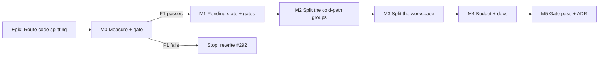

# Implementation Plan: Route code splitting — the web entry graph

- **Feature spec:** [`./feature-spec.md`](./feature-spec.md) — **Approved 2026-10-02
  (product owner)**
- **Status:** Approved — 2026-10-02 (product owner). CQ-1 lazy shell; CQ-2 10% deep link / 5% in-app; CQ-4 container readings only, so no milestone waits on a product-owner sitting.
- **Owner:** web

> **Refreshed 2026-10-02 against `main` (spec §0.5).** What changed in this plan:
>
> - **M0 is half done.** M0-T4 is **complete** (citations registered, router estate single-version).
>   M0-T2 is **mostly complete**, with a three-item residue. M0-T1 and M0-T3 ran on 2026-09-12 and
>   **must re-run**, because the entry graph has grown ≥ 40 kB since; `m0-measurement.md` §8 gives
>   the commands. M0-T5 (timing baseline) never ran and now has a decision attached (CQ-4) and a
>   deadline: **before M1 merges**.
> - **New task M1-T1b**: the router error screen's "Try again" must actually recover from a failed
>   chunk download (spec §2, new).
> - **M1-T3 (B8) is redesigned.** As drafted it could not catch a loose budget (spec §4).
> - **M1-T4** inherits the forced-colours suite's production-build harness and **must drive the
>   stale-deploy path**. Stale-deploy is re-rated **high likelihood**, because the product owner's
>   host auto-deploys every release (ADR-0047).
> - **No route, screen or group changed.** The seven groups and 22 routes below are as drafted.
>   `router.tsx` citations moved +1 line.
>
> **Milestone sizes (2026-10-02):** M0 **M** (remaining) · M1 **L** · M2 **M** · M3 **L** · M4 **S** ·
> M5 **M**.

> **The shape of this plan is unusual and deliberately so.** M0 is a **measurement milestone whose
> permitted outcome is that the epic stops**. `docs/TECH_DEBT.md` #292 says in terms that splitting
> "is the obvious remedy and is **not** obviously right", and instructs that the effect be measured
> before splitting. So M0 builds a throwaway probe, measures the floor and the LCP, and **either
> unlocks M1 or closes the row with a finding**. Nothing in M1–M5 is written on the assumption that
> M0 passes.

> **Approved 2026-10-02 — the product owner's answers change three things in this plan.**
>
> - **CQ-1: the shell is lazy.** Variant B in `m0-measurement.md` §8 is the design; variant A is
>   the fallback P3 can trigger (spec CQ-1).
> - **CQ-2: 10% deep link or reload, 5% in-app**, exactly as P2 states; worse withdraws M3 only.
> - **CQ-4: container readings only.** M0-T5 and M3-T2 are container measurements, and the sign-off
>   is scoped to **download sizes, request counts and container timings**. P2's verdict is
>   INDETERMINATE whenever the spread is too wide, and the epic then rests on P1, P3 and P4. **No
>   milestone waits on a product-owner sitting.**

## Breakdown

```mermaid
flowchart LR
  E[Epic: Route code splitting] --> M0[M0 Measure + gate]
  M0 -->|P1 passes| M1[M1 Pending state + gates]
  M0 -->|P1 fails| STOP[Stop: rewrite #292]
  M1 --> M2[M2 Split the cold-path groups]
  M2 --> M3[M3 Split the workspace]
  M3 --> M4[M4 Budget + docs]
  M4 --> M5[M5 Gate pass + ADR]
```

### Epic

**Route code splitting** — make the web entry graph carry the shell and the sign-in screen rather
than the whole application, closing `docs/TECH_DEBT.md` #292. Roadmap theme: frontend performance
and delivery quality.

---

### Milestone 0: Measure, and decide whether to build (shippable: the measurement + the corrections)

> **Status 2026-10-02: COMPLETE.** P1 passed (`m0-measurement.md` §9) and the timing baseline is recorded (§10). M1 is unlocked.

**Outcome:** the floor, the LCP baseline and the waterfall depth are measured and committed; four
stale or wrong claims across three documents are corrected; the epic is either unlocked or stopped
with a recorded finding.
**Entry point:** **Ships dark** — no user-facing change. The document corrections and the
re-measured report are the deliverable. The first user-facing milestone is M1, which carries the
journey (ADR-0081 §2).
**Journey:** none (nothing is reachable). M1 lands it.

---

#### Feature: Re-derive the numbers and correct the record

> **Description:** establish today's real figures, and fix what §0 of the spec found wrong.
> **Complexity:** S
> **Dependencies:** none
> **Risks:** the report has moved since 2026-09-11 → that is the point of measuring; record the
> delta rather than assuming stability.
> **Testing requirements:** none beyond the existing gates; this is measurement and prose.

##### Task M0-T1 — Re-derive `bundle-report.json` and record whether it moved

> **Status 2026-10-02: re-run, measured 2026-10-02 at tree `d3b9dbf`: entry graph 461,186 gzip bytes, 3 chunks (`m0-measurement.md` §9).** Originally ran 2026-09-12 (404,797). The budget file shows ≥ 445,254
> by 2026-09-25. Run `m0-measurement.md` §8 Step 1 (`pnpm check:web-bundle`, then the `node -e`
> extraction). Do **not** use `pnpm --filter @repo/web build` as written below: since ADR-0160 the
> root gate is what deletes a stale report first.

- **Description:** run `pnpm --filter @repo/web build` and compare every figure against the
  committed report (`measuredAt: 2026-09-11T14:04:54.760Z`). **The spec was written with Bash
  disabled and every number in it is read, not measured** — this task is what makes them
  measurements.
- **Complexity:** S
- **Dependencies:** none
- **Risks:** a figure has moved and the spec's arithmetic no longer holds → correct the spec in
  place, with the new number and the date, rather than carrying the old one.
- **Testing:** `pnpm --filter @repo/web check:bundle-size` passes against the fresh report.
- **Development steps:**
  1. Build; record entry chunk, entry graph, per-chunk gzip, CSS.
  2. Confirm `paint` is still `inEntryGraph: true` and confirm its byte count.
  3. Note any delta from the committed report in the spec's §0 table, dated.

##### Task M0-T2 — Correct `FRONTEND_ARCHITECTURE.md`, and the units contradiction

> **Status 2026-10-02: MOSTLY DONE by others.** `FRONTEND_ARCHITECTURE.md:154-166` now says "Not
> implemented yet"; `FRONTEND_QUALITY.md:103-106` quotes bytes; #292's stale paragraphs, the `paint`
> wording and the route count were corrected 2026-09-12/16. **Residue, all prose, size XS:**
> (1) `FRONTEND_QUALITY.md:120` "declares 26 routes" → 23 `createRoute` + root, 22 with a screen;
> (2) #292's "The cause is not bloat" paragraph says the same "26", and its "Why it was never
> noticed" paragraph cites `ci.yml:270` running `check:bundle-size`, where CI now runs
> `check:web-bundle` at `ci.yml:286-287`; (3) the gate's `kB` label (`check-bundle-size.mjs:64`)
> moves to M1-T3, which edits that file. Steps 1–3 below are kept as the record of what was planned.

- **Description:** `docs/FRONTEND_ARCHITECTURE.md:151-153` still asserts "Routes are lazy by default
  (per-route chunks)". This is the second copy of the sentence #292 corrected once; ADR-0071's
  lesson is that repairing one copy leaves the other exactly as wrong. Also fix
  `docs/FRONTEND_QUALITY.md:95-98`, which says "Quote bytes here" and then quotes KiB two lines
  later.
- **Complexity:** S
- **Dependencies:** M0-T1 (so the corrected text carries fresh numbers)
- **Risks:** correcting toward the _intention_ rather than the _present_ — the failure that produced
  the original sentence. → the replacement must describe what the code does today and label the rule
  as the rule.
- **Testing:** `pnpm check:doc-links`; `pnpm prepush`.
- **Development steps:**
  1. Rewrite `:151-153` to state the present (two lazy boundaries, 22 static screens) and point at
     the grouping rule.
  2. Restate `FRONTEND_QUALITY.md:97-98`'s two figures in bytes.
  3. Correct #292's two stale paragraphs (CI does check bundle size; delivery-gates M3 shipped), the
     `paint`/"already lazy" wording, and the 26 → 24 route count.

##### Task M0-T3 — The probe build: measure the floor, and answer CQ-1

> **Status 2026-10-02: re-run, measured 2026-10-02 at tree `d3b9dbf`: P1 PASS (A 228,960; B 178,259; C 175,424), shell cost 50,701, sign-in cost 2,835, no lazy chunk over 135,168 (`m0-measurement.md` §9).** Originally ran 2026-09-12 (P1 PASS, 157,483; shell 43,878). Run as three
> named variants (A eager shell, B lazy shell, C all lazy) per `m0-measurement.md` §8 Steps 2–4. The
> 2026-09-12 run did not record which routes each variant converted ("19 routes lazy" reconciles
> with neither 20 nor 21), so the shell figure cannot be separated from sign-in. Also record the
> largest lazy chunk against 135,168, which brings M4-T1's likely `raisedBecause` forward.

- **Description:** on a throwaway branch, make **every** route component lazy and build. Read the
  entry graph. Then do it again with the shell lazy. Two numbers, two builds, discarded afterwards.
  **The branch is never merged** — it exists to produce a measurement, which is the ADR-0128/ADR-0065
  method.
- **Complexity:** M
- **Dependencies:** M0-T1
- **Risks:**
  - The probe's numbers get quoted as the shipped result → the harness's own output states, in its
    docblock, that it bypasses the product (ADR-0081 §3's rule for measurement harnesses).
  - Rolldown derives unhelpful chunking (many tiny chunks) → record it; it is the trigger for the
    `manualChunks` escalation, not a reason to hand-write one now.
- **Testing:** none — a probe, deliberately not committed as product code.
- **Development steps:**
  1. Convert all 22 screen imports to `lazyRouteComponent`; build; record entry graph + every chunk.
  2. Repeat with `authedRoute.component` lazy; record the delta for **both** cold paths.
  3. Report group sizes against the 15,000-byte floor from the spec.
  4. **Evaluate P1** (entry graph ≤ 300,000 gzip). Record PASS/FAIL with the population measured.
  5. Discard the branch. Record CQ-1's recommendation with its number.

##### Task M0-T4 — Register the router citations against the version `apps/web` resolves

> **Status 2026-10-02: DONE — nothing to do.** All six citations are registered in
> `scripts/dependency-claims.json` with this spec in `citedBy`. The lockfile holds a single
> `@tanstack/react-router` 1.170.40 and a single `@tanstack/router-core` 1.171.33, equal to
> `verifiedAgainst`, so the split-estate risk below no longer applies. One ref is registered under
> its old text with moved lines (the pending-component ref in `load-client.js`, registered at lines
> 685-686). **Leave the spec's citation text as it is**: `check:claims` matches on the ref string.

- **Description:** the spec cites `lazyRouteComponent.js:51`, `:37-44`,
  `router-core/dist/esm/router.d.ts:98-113` and `router-core/dist/esm/load-client.js:10-12`. ADR-0076
  Class 2 requires each to be registered in `scripts/dependency-claims.json` with
  package@version + path + anchor.
- **Complexity:** S
- **Dependencies:** none
- **Risks:** **two versions of both router packages are installed** (`react-router` 1.170.27 and
  1.170.33; `router-core` 1.171.22 and 1.171.28). `docs/TECH_DEBT.md` #178 records that the resolver
  takes the **first** matching store directory and `verifiedAgainst` holds one version per package,
  so a split estate can leave the register describing code that does not ship — green, in the
  dangerous direction. → **establish which version `apps/web` resolves from the lockfile before
  registering**, and say so in the entry. Do not take the first glob hit.
- **Testing:** `pnpm check:claims` passes, and is verified to **fail** if a line number is altered.
- **Development steps:**
  1. Read `pnpm-lock.yaml` for `apps/web`'s resolved router versions.
  2. Add the four citations with anchors.
  3. Confirm `check:claims` reports the resolved version, not the other one.

##### Task M0-T5 — Baseline P2 in the build container

> **Status 2026-10-02: DONE — baseline recorded in `m0-measurement.md` §10 (build `31f5995`, 7 runs per path).** CQ-4 is answered — container readings only. _Original note:_ **Hard deadline:
> before M1 merges**, so the baseline and the later reading come from one machine and the pre-split
> build still exists to measure. The task is a Playwright `measure-*` harness with CDP 4G
> throttling, run in the container with **≥ 5 runs per path** and the spread reported. There is no
> Lighthouse card and no product-owner sitting. The harness docblock states that it measures the
> container, not a planner's hardware (ADR-0128's own warning).

- **Description:** measure cold `/sign-in` LCP, warm plan-open and cold plan-open **before** any
  change, with repeat runs, and record the **run-to-run spread**.
- **Complexity:** M
- **Dependencies:** M0-T1
- **Risks:** a single sample read as a baseline → **the spread is not optional**; ADR-0127 D8
  recorded a machine whose no-change baseline moved 0.93 → 10.00 pp, and a verdict without a spread
  cannot be distinguished from noise. If the spread is ≥ the P2 effect sizes, P2's verdict will be
  INDETERMINATE and that must be known now rather than at M5.
- **Testing:** the measurement records its population and refuses a verdict over an empty one.
- **Development steps:**
  1. Build the instrument (browser performance entries over CDP 4G throttling; the
     `e2e-export`/`measure-*` harness conventions are the local precedent).
  2. At least five runs per path, in the container, spread reported.
  3. Commit the readings with the machine, viewport, build SHA and spread.

---

### Milestone 1: The pending state, the gates, and the first lazy conversion

**Outcome:** the app has a route pending state, a structural gate that refuses a statically-added
route, and a budget ratchet. One low-risk group (`account`) is split to prove the machinery
end to end.

> **Status 2026-10-02: BUILT (the builder run), pending the orchestrator's journey run.** Three things the plan did not say, recorded as built:
>
> - **S1 is a vitest structural test, not a root `check:*` script** (`apps/web/src/app/router-splitting.structural.test.ts`), so it needs no CI step and `pnpm test` already runs it. It carries a temporary `SCHEDULED` list (the 11 screens M2 and M3 convert) that fails when an entry stops being static; **M2 and M3 must delete the entries they convert**, and M5 closes on the list being empty.
> - **The authenticated frame became lazy in M1**, because CQ-1 says it is lazy in the final design and no later task owns the conversion. Measured at M1 (entry graph gzip): nothing split 461,670; account group alone 467,693 (**+6,023**, chunk boundaries cost compression while most screens are static); account group and frame 461,315 (**-355**). So the entry graph is **not** expected to fall until M2 and M3, **P4's 100,000 bar cannot be met at M1**, and the journey asserts "no more than 1% above the pre-split 463,933" instead, with the full bar left to M3. B8b does not fire at M1 and the budget is unchanged.
> - **The M1 journey is hermetic** (`/sign-in` to the lazy `/sign-up`; no API), so it drives the stale-deploy path, the pending state and the waves, but **not** the lazy frame or the Account navigation, which need a session. Those ride on `e2e-account`, `e2e-shell` and the base journey, against the dev server.

**Entry point:** the loading treatment on a slow navigation to **Account** — reached from the
account chip → **Account**. It is user-facing: a planner on a slow connection now sees a skeleton
where they previously saw nothing happen.
**Journey:** **new** `apps/web/e2e-splitting/` against the **production build** (`vite build` +
`vite preview`, the `playwright.csp.config.ts:6-22` precedent), asserting P3 and P4 and driving the
Account navigation. **Lands with this milestone, not at enablement** (ADR-0081 §2).

---

#### Feature: The shared route pending component

> **Description:** one `defaultPendingComponent` built from the existing `Skeleton` archetype.
> **Complexity:** S
> **Dependencies:** M0 passed P1
> **Risks:** inventing a one-off loading shape → `DESIGN_SYSTEM.md:546-547` forbids it; use
> `components/ui/page/skeleton.tsx`.
> **Testing requirements:** unit (renders, `aria-busy`), axe in the journey.

##### Task M1-T1 — `route-pending.tsx`, wired as `defaultPendingComponent`

- **Description:** new component; register on `createRouter`. **Leave `defaultPendingMs` and
  `defaultPendingMinMs` unset** — the library defaults (1000 / 500) are exactly the wanted
  behaviour, and restating a default is a number that drifts from the library's.
- **Complexity:** S
- **Dependencies:** none
- **Risks:** a future reader "tidies" by setting `defaultPendingMs: 0`, which puts a flash on every
  navigation → a docblock stating the 1000/500 defaults with their citation, and a unit case
  asserting the router declares **neither** option.
- **Testing:** unit; verified red by asserting the options are absent, then adding one.
- **Development steps:**
  1. Build the component from `Skeleton`; `aria-busy`.
  2. Register `defaultPendingComponent`.
  3. Unit-test the render and the absence of the two timing options.

##### Task M1-T1b — A failed chunk download gets a retry that works _(new 2026-10-02)_

- **Description:** `RouteErrorScreen` (`app/route-error-screen.tsx`, #314) offers **Try again** =
  `reset()` + `router.invalidate()` and deliberately never reloads. For a failed **chunk
  download** that may not recover: `lazyRouteComponent` latches the error, and a browser may cache
  a failed module fetch for the life of the document (spec §2, **[unverified]**). So, for the
  `isModuleNotFoundError` case **only**, the button reloads the page, and its copy says why. Every
  other error keeps #314's behaviour.
- **Complexity:** S
- **Dependencies:** none (lands before M1-T6, so the first lazy group ships with it)
- **Risks:**
  - Undoing #314 for every error by accident. The point of #314 was to keep unsaved work behind
    the boundary. → a unit case for each branch, and the non-chunk branch asserts **no** reload.
  - The detection drifting from the router's: three message prefixes today (router-core `utils.js`
    `isModuleNotFoundError`). Importing the router's own predicate is **not available**:
    `@tanstack/react-router`'s `dist/esm/index.js` does not re-export it, and `apps/web/package.json`
    has no direct `@tanstack/router-core` dependency (both checked 2026-10-02). Adding one would
    reopen the two-version risk #178 records. → **Default: replicate the three prefixes and
    register the source location in `scripts/dependency-claims.json`** (router-core
    `dist/esm/utils.js`, the `isModuleNotFoundError` function, with an anchor on its return line).
    Then `check:claims` fails on the router bump that changes them, which is the repository's
    mechanism for exactly this.
  - The **[unverified]** premise is false (re-import does recover in every browser) → then the
    reload is merely unnecessary, not wrong. The M1-T4 journey decides it, and the docblock records
    the answer.
- **Testing:** unit (both branches; verified red by removing the branch); journey (M1-T4, network
  failure case).
- **Development steps:**
  1. Branch on a local `isChunkLoadFailure(error)` that mirrors the router's predicate (registered
     claim, see Risks); reload for that case, copy reviewed by ux-reviewer.
  2. Unit-test both branches.
  3. Docblock cites #314 and states which failures take which path.

##### Task M1-T2 — S1: the structural gate over `router.tsx`

- **Description:** every route is `lazyRouteComponent` or named in a reasoned `EAGER_ROUTES`
  allow-list. A statically-added 25th route fails CI.
- **Complexity:** M
- **Dependencies:** M1-T1
- **Risks:**
  - **The census finds nothing and passes.** ADR-0108's own gate shipped this way: its
    "nothing is unclassified" assertion passed because the glob matched zero files. → a **pinned
    positive case**, and the gate **refuses an empty population** (`check-bundle-size.mjs:65-78` is
    the in-repo shape).
  - The gate reads prose. Four gates in this repository have matched their own docblocks
    (ADR-0097's weight ratchet, ADR-0106's reset-fills test, #222, #231). → **strip comments before
    scanning**, and pin a fixture containing the banned form inside a comment.
  - **(2026-10-02)** A new root `check:*` script is picked up by `pnpm prepush` automatically
    (ADR-0160) and must also be a CI step, or `check:ci-roster` refuses it. → land the script and
    its CI step in one commit.
- **Testing:** verified red against a statically-imported route, and against an empty population.
- **Development steps:**
  1. Write the scan over `router.tsx` with comments stripped.
  2. Pinned positive case + empty-population refusal.
  3. Verify red three ways: a static route, an empty file, a banned form in a comment.

##### Task M1-T3 — B8: the budget ratchet

> **Redesigned 2026-10-02 (spec §4 "How the budget moves").** The assertion below compares two
> fields of `bundle-budget.json`, and a split changes neither, so on its own it **cannot catch the
> loose budget it was written for**. B8 is now:
>
> - **B8a (derivation)**: each budget = `ceil(floor × headroomRatio / 1024) × 1024`, unless
>   `raisedBecause` is non-empty. This is the assertion described below, kept.
> - **B8b (the ratchet)**: fail when `report.entryGraph.gzip × headroomRatio < floor.entryGraphGzipBytes`,
>   with a "re-floor" message. Verified red by feeding today's budget a post-split report (a probe
>   report from `m0-measurement.md` §8 is a ready fixture).
>
> The KiB-ceiling rule is re-checked against the 2026-09-25 floor (445,254 / 128,584 / 15,779 →
> 467,968 / 135,168 / 17,408): **six agreeing pairs** across two floors. Also fix the `kb()` label
> at `check-bundle-size.mjs:64` (KiB printed as `kB`, the M0-T2 residue) in the same change. No new
> key in B7's `KNOWN` set (`:103-114`; was `:94-105`).
> Complexity stays **S**, plus about half a day for B8b's fixtures.

- **Description:** assert in `check-bundle-size.mjs` that each budget does not exceed
  `floor × headroomRatio` beyond rounding. **This is a shared-gate change** and is the ADR-0105
  trigger this spec exists to cover.
- **Complexity:** S
- **Dependencies:** none
- **Risks:** it fires on day one against today's budget unless the **real** derivation rule is used,
  and the rule is not plain multiplication. Derived from all three committed pairs
  (`bundle-budget.json:5-15`) — it is **`floor × 1.05`, rounded UP to the next whole KiB (1024)**:

  | budget                      | floor   | × 1.05     | next whole KiB    | declared    |
  | --------------------------- | ------- | ---------- | ----------------- | ----------- |
  | `entryGraphGzipBytes`       | 404,744 | 424,981.2  | 416 KiB = 425,984 | **425,984** |
  | `maxNonEntryChunkGzipBytes` | 128,583 | 135,012.15 | 132 KiB = 135,168 | **135,168** |
  | `cssGzipBytes`              | 15,141  | 15,898.05  | 16 KiB = 16,384   | **16,384**  |

  All three agree, so the rule is real rather than fitted to one data point. **A naive
  `floor × 1.05` tolerance would reject today's own budget by 1,002.8 bytes** on the entry-graph
  line — a gate failing on day one, which gets deleted rather than fixed (ADR-0058).
  **This plan asserted "a 2.8-byte rounding difference" until the arithmetic was actually done**
  (ADR-0076 Class 3, caught before it reached code); B8 must assert the KiB-ceiling rule, and M4-T1
  must re-derive the new budgets the same way.

- **Testing:** added to the exported `runGate` suite (`check-bundle-size.mjs:99`, was `:90`, is
  exported precisely so assertions are suite-driven; the suite is `scripts/check-bundle-size.test.mjs`);
  B8a verified red by loosening a budget, and B8b verified red with a shrunken report.
- **Development steps:**
  1. Compute the tolerance from the six real pairs.
  2. Add B8a and B8b to `runGate`; `KNOWN` (`:103-114`) needs no new key.
  3. Verify each red; confirm both green against today's unchanged budget and report.

---

#### Feature: The journey, against the production build

> **Description:** the only instrument that can see P3 and P4.
> **Complexity:** M
> **Dependencies:** M1-T1
> **Risks:** running against `pnpm dev`, where chunks do not exist → the config builds and previews.
> **Testing requirements:** it **is** the test.

##### Task M1-T4 — `playwright.splitting.config.ts` + `e2e-splitting/`

> **2026-10-02:** start from `playwright.forced-colors.config.ts`, not only the CSP config. It
> already uses `vite build && vite preview --port … --strictPort` with `reuseExistingServer: false`
> (`:61-69`), which closes the stale-server risk below by construction. **Two cases added**, because
> stale-deploy is now rated high likelihood (ADR-0047 auto-redeploy): (a) delete one route chunk
> from `dist/assets/` after load, navigate, and assert exactly one reload and a working screen;
> (b) block the chunk with `page.route`, then assert `RouteErrorScreen` appears and its button
> recovers (M1-T1b). Case (b) also settles the spec's **[unverified]** module-cache premise.
> **P4 baseline:** P4 is "down ≥ 100,000" against the **pre-split** build, so the journey must
> record that figure first. Run it once against `main` before M1-T6 lands, or keep a pinned
> fixture of the pre-split byte total. Complexity M → **M/L**.

- **Description:** build + preview on 4173, Chromium, both pointer modes. Assert P3 (≤ 2 sequential
  JS waves before FCP) and P4 (total cold JS bytes down ≥ 100,000).
- **Complexity:** M
- **Dependencies:** M1-T1
- **Risks:**
  - `reuseExistingServer` is true outside CI, so a stale dev server from another harness is silently
    adopted and the preview never runs — ADR-0099 records three consecutive false diagnoses from
    exactly this. → `scripts/e2e-local.sh` already refuses while 3000/5173 answer; this suite uses
    **4173** and must refuse likewise.
  - Counting requests without counting **waves** — a parallel burst is one wave, not six. → assert
    on request _start_ times relative to response _end_ times, and verify the assertion red against
    a deliberately serialised import chain.
- **Testing:** verified red by making a route statically imported again.
- **Development steps:**
  1. Config from `playwright.csp.config.ts`'s shape (300 s webServer timeout, own port).
  2. Spec: cold `/sign-in`, cold deep link, warm navigation, both pointer modes.
  3. axe over the pending state.
  4. Add to `scripts/e2e-sweep.sh` (ADR-0112 found its list wrong in both directions — it is derived
     now; confirm the new suite appears).

##### Task M1-T5 — CI step and the ADR-0138 shard roster

- **Description:** add the step to `ci.yml` and re-derive the four-shard packing.
- **Complexity:** S
- **Dependencies:** M1-T4
- **Risks:**
  - `check:ci-roster` refuses a script in `package.json` with no CI step, or vice versa — ADR-0136
    records it firing for real between two milestones. → land both edits in one commit.
  - A suite with no recorded duration is charged the **largest** measured, never zero.
  - ADR-0138 measured a 21–27% run-to-run spread on shard totals; pack from the pessimistic sample.
- **Testing:** `pnpm check:ci-roster`, `pnpm check:e2e-roster`.
- **Default shard (2026-10-02): 1**, beside `test:e2e:csp` and `test:e2e:forced-colors`, the other
  two production-build suites (`ci.yml:1112-1134`). Confirm or overturn it with the LPT
  re-derivation, not by habit.
- **Development steps:**
  1. Add the `test:e2e:splitting` script and the CI step with its shard condition.
  2. Re-derive the packing longest-processing-time-first; update the roster.
  3. Add a per-job `timeout-minutes` derived from this suite's own duration (ADR-0138 D5 — a
     timeout derived from the end state cancelled a healthy job at 30m08s).

##### Task M1-T6 — Split the `account` group

- **Description:** convert `account`, `onboarding`, `sign-up`, `forgot-password`, `reset-password`,
  `verify-email`, `accept-invite` to `lazyRouteComponent`. Lowest-risk group: no cold path, low
  frequency.
- **Complexity:** S
- **Dependencies:** M1-T1, M1-T4
- **Risks:** `accept-invite` and `verify-email` are reached from **emailed links** — a cold arrival
  with no hover. → they are in the group but their cold path is measured by the journey; if either
  costs a visible wait, it moves to eager and the reason is recorded.
- **Testing:** the journey; `e2e-public` and `e2e-account` re-run unchanged (they are the
  before/after oracle — no screen component is edited).
- **Development steps:**
  1. Convert the seven imports.
  2. Rebuild; confirm the entry graph fell and no new chunk exceeds the ceiling.
  3. Run `e2e-public`, `e2e-account`, `e2e-account-verify`, and the base journey.

---

### Milestone 2: The cold-path groups

**Outcome:** `hierarchy`, `libraries` and `org-admin` are lazy, and the organisation overview — the
one navigation every sign-in performs — is warmed rather than fetched after the redirect.
**Entry point:** unchanged screens, reached the same way. The user-visible change is that they
arrive sooner after sign-in.
**Journey:** extends `e2e-splitting` with the post-sign-in path and the programmatic redirect.

---

#### Feature: Lazy hierarchy, libraries and administration

> **Description:** three groups, and the explicit preload that covers the redirect intent-preloading
> cannot reach.
> **Complexity:** M
> **Dependencies:** M1
> **Risks:** the sign-in → overview path gains a round trip → the explicit preload; measured, not
> assumed.
> **Testing requirements:** journey on the redirect path; existing suites unchanged.

##### Task M2-T1 — Lazy `libraries` and `org-admin`

- **Description:** `calendars`, `resources`; `members`, `audit-log`, `my-activity`,
  `recently-deleted`.
- **Complexity:** S
- **Dependencies:** M1-T6
- **Risks:** `resources`, `audit-log` and `my-activity` sit behind dark flags
  (`router.tsx:483-486`, was `:482-485`) → a lazy component in an unregistered route is never fetched; confirm the
  flag-off tree is unchanged rather than assuming.
- **Testing:** `e2e-library`, `e2e-audit`, `e2e-recently-deleted`, `e2e-resource-view`.
- **Development steps:**
  1. Convert; rebuild; record the entry graph.
  2. Run the four suites.

##### Task M2-T2 — Lazy `hierarchy`, with the shell-mount preload

- **Description:** `org-home`, `clients`, `client-detail`, `project-detail`, plus an explicit
  `.preload()` of the group when the authenticated shell mounts.
- **Complexity:** M
- **Dependencies:** M2-T1
- **Risks:**
  - **`indexRoute` reaches `org-home` by a programmatic redirect** (`router.tsx:139`, was `:138`) with no hover,
    so intent-preloading structurally cannot cover the one navigation every sign-in performs. → the
    explicit preload, fired in parallel with the session query rather than after the redirect.
  - The preload fires for readers who never reach those screens (`/account` only) → it is the same
    bytes they would have paid eagerly today, one wave later and off the critical path. Stated
    rather than hidden.
- **Testing:** journey asserts no pending state on the post-sign-in redirect; `e2e-overview`,
  `e2e-shell`.
- **Development steps:**
  1. Convert the four routes.
  2. Add the preload at shell mount, with a docblock naming the redirect it covers.
  3. Journey: sign in, assert the overview paints with no fallback and no third wave.

---

### Milestone 3: The plan workspace

**Outcome:** the largest group leaves the entry graph, and `paint` leaves with it.
**Entry point:** opening a plan from the Project Explorer — unchanged control, and it must feel
unchanged. That is the milestone's whole acceptance condition.
**Journey:** extends `e2e-splitting` with hover-preload, keyboard-focus-preload, and the cold
bookmarked-plan path.

---

#### Feature: Lazy `plan-detail`

> **Description:** one route, the largest chunk, and the only milestone that can lose P2.
> **Complexity:** L
> **Dependencies:** M2
> **Risks:** the cold bookmarked-plan path regresses beyond P2's 10% → CQ-2; withdraw if so.
> **Testing requirements:** the full canvas/Gantt suite set, and P2 re-measured.

##### Task M3-T1 — Convert `plan-detail`, and confirm `paint` leaves the entry graph

- **Description:** one import becomes lazy. The prediction committed in the spec is that `paint`
  (33,477 gzip on 2026-09-11; larger now, re-measured in M0) becomes `inEntryGraph: false` as a
  **consequence**. _(2026-10-02: the "four static importers" in the risk below were really two
  runtime importers plus two `import type`. Today's runtime importers are `TsldCanvas.tsx:46`,
  `use-tsld-canvas-ui-state.ts:8`, and `render-export-image.ts:2-8` via `use-diagram-image.ts:10`,
  all in `features/tsld`, plus two perf-probe scenes in the lazy staff chunk. Spec §0.2.)_
- **Complexity:** M
- **Dependencies:** M2-T2
- **Risks:**
  - `paint` does **not** leave, because something else statically imports it. The spec names four
    static importers, all inside `features/tsld` — but a fifth outside it would keep it in the
    graph. → assert `inEntryGraph: false` for `paint` explicitly; if it fails, find the importer
    rather than adding a `manualChunks` workaround.
  - The guest `/share` view renders the read-only TSLD and is already lazy — confirm it still gets
    the painter and that the two lazy routes share one `paint` chunk rather than duplicating it.
- **Testing:** `check:bundle-size`; the TSLD and Gantt suites; `e2e-share`.
- **Development steps:**
  1. Convert; rebuild; assert `paint.inEntryGraph === false` and record the entry graph.
  2. Confirm `share` and `plan-detail` share the chunk (read `bundle-report.json`'s `packages` and
     the import lists, not the filenames — `bundle-report-plugin.ts:39-52`).
  3. Run the canvas, Gantt, WBS, undo, multi-select, revision-compare and export suites — by config
     name: `authoring`, `authoring-flow`, `edit`, `gantt`, `gantt-editing`, `wbs`, `undo`,
     `multi-select`, `revision-compare`, `export`, `share`, `minimap`, `workspace-chrome` (there is
     no `canvas` config; listed 2026-10-02 from `apps/web/playwright.*.config.ts`). Then
     `scripts/e2e-sweep.sh` for the rest.

##### Task M3-T2 — Re-measure P2 and P3 in the container

- **Description:** the ship/withdraw decision. Same instrument, same container, same three paths as
  M0-T5, with spreads.
- **Complexity:** M
- **Dependencies:** M3-T1
- **Risks:** the effect is inside the spread → the verdict is **INDETERMINATE, not PASS**, and the
  epic does not ship on it. A second run agreeing to the decimal is more suspicious than one that
  does not (ADR-0125's recorded caution).
- **Testing:** the measurement is the test; it records its population and refuses an empty one.
- **Development steps:**
  1. At least five runs per path; report deltas against M0-T5 with both spreads.
  2. Evaluate P2 and P3 explicitly, naming the verdict.
  3. If cold plan-open regressed > 10%, **withdraw the plan-screen part (M3)** per CQ-2's answer;
     the cheaper groups stay shipped. If the spread makes it INDETERMINATE, the sign-off falls back
     to sizes and request counts, and says so.

---

### Milestone 4: The budget, and the documents

**Outcome:** the budget is re-derived downward with its ratchet armed; every governing document
describes what the code now does.
**Entry point:** **Ships dark** — no user-facing change. M1–M3 carried the capability.
**Journey:** none new; the suite from M1 is re-run.

##### Task M4-T1 — Re-derive the budget downward

- **Description:** rewrite `floor` from the final report; re-derive all three budgets as
  **`floor × 1.05` rounded up to the next whole KiB** (the rule derived in M1-T3, not plain
  multiplication); leave `raisedBecause: null`.
- **Complexity:** S
- **Dependencies:** M3-T2 passed
- **Risks:** the per-chunk ceiling (135,168) is now below a legitimate `plan-workspace` chunk →
  **this is the one number that may need to go up**, and if so it takes a `raisedBecause` naming the
  group. Do not raise it silently. _(2026-10-02: rated **likely**; the M0 re-measurement reports
  the answer before any code is written.)_
  - **(2026-10-02) The re-floor is measured at the PR head, not `origin/main`**, which is a stated
    exception to `bundle-budget.json:4`'s rule for lowerings only (spec §4). Write that in
    `measuredBy`. Today's `raisedBecause` (`:16`) describes the 2026-09-25 raise. Move its
    substance into `floor._` as that re-floor did with its predecessor, and set `raisedBecause` to
    `null` unless the ceiling rises.
  - **(2026-10-02) In practice B8b forces a re-floor in M1, M2 and M3 as well**, whenever a
    milestone shrinks the graph by more than ~5%. That is intended. M4-T1 then becomes the final
    re-floor and the ceiling decision, not the only one.
- **Testing:** `pnpm check:web-bundle` with B8a/B8b armed (the root gate, which `pnpm prepush` runs);
  verified red by leaving the old budget in place.
- **Development steps:**
  1. Update `measuredAt`, `measuredBy`, `floor`, the three budgets.
  2. Confirm B8a/B8b pass and that B8b would fail against the pre-epic budget.

##### Task M4-T2 — Rewrite the splitting sections

- **Description:** `FRONTEND_QUALITY.md:116-127` and `FRONTEND_ARCHITECTURE.md:154-166` (were
  `:110-121` / `:151-153`, corrected 2026-10-02) now describe the present **and state the grouping
  rule**, so the next route is not a judgement call.
- **Complexity:** S
- **Dependencies:** M4-T1
- **Risks:** writing the aspiration again → the sections must name the eager allow-list and the
  15,000-byte floor, and point at S1 as the enforcement.
- **Testing:** `pnpm check:doc-links`, `pnpm prepush`.
- **Development steps:**
  1. Rewrite both sections with the rule and the measured numbers in **bytes**.
  2. Close #292 with its measurement, or rewrite it with M0's finding.
  3. Changeset (`apps/web` user-visible: faster first paint + a new loading state).

---

### Milestone 5: The gate pass, and the ADR

**Outcome:** specialist reviews over the combined diff; the boundary rule is filed as an ADR.
**Entry point:** **Ships dark.**
**Journey:** every suite swept.

##### Task M5-T1 — Specialist reviews

- **Description:** run the reviewers over the combined diff. **Eight consecutive epics in this
  register found defects here that had passed a human read**; budget for findings rather than
  treating this as a formality.
- **Complexity:** M
- **Dependencies:** M4
- **Risks:** treating a green review as proof → record what each reviewer could **not** see.
- **Testing:** every blocking finding folded with a regression test **verified red first**.
- **Development steps:**
  1. **performance-reviewer** — the subject; ask it to re-derive P1–P4 from the shipped code.
  2. **accessibility-reviewer** — the pending state: is a route change announced? Does focus survive
     a lazy boundary? (ADR-0111 §19.13 — this touches no primitive's keyboard model, but focus
     across an unmount is the recurring defect class here: five recorded instances of focus dropping
     to `<body>`.)
  3. **ux-reviewer** — does the skeleton read as loading rather than broken; is the 1,000 ms
     threshold right for the workspace.
  4. **component-reviewer** — the pending component's contract; one treatment, not two.
  5. **devops-reviewer** — the CI step, the shard packing, and the new root `check:*` for S1 in
     prepush and CI. (The Turbo-cache trigger this item named has already fired and been handled,
     `check-bundle-size.mjs:37-50`, ADR-0160. Corrected 2026-10-02.)
  6. **security-reviewer** — confirm no authz change and that the CSP still covers the new chunks.
  7. Sweep every suite (`scripts/e2e-sweep.sh`) — ADR-0091 records three journeys breaking across
     one epic because only the suite CI named was fixed.

##### Task M5-T2 — File the ADR

- **Description:** the boundary rule, the eager allow-list, the 1000/500 default, the rejected
  `manualChunks`, and P1–P4 with their verdicts. Amends ADR-0029's shell composition; supersedes
  nothing.
- **Complexity:** S
- **Dependencies:** M5-T1
- **Risks:**
  - `check:adr-coverage` refuses an ADR absent from `docs/ROADMAP.md` (`:59-90`, was `:50-67`) **and** now checks
    the ADR index both ways (ADR-0110 D6). → ROADMAP entry + `docs/adr/README.md` + the CLAUDE.md
    §16 entry, all in the same commit.
  - ~~The CLAUDE.md entry is the one nothing gates (`docs/TECH_DEBT.md` #291)~~ **Stale 2026-10-02:
    ADR-0147 gates it.** CLAUDE.md §16 is now one line per ADR, and `check:adr-coverage` fails
    without that line. Write it as **one line**, keeping reasoning in the ADR (CLAUDE.md §19.14).
  - The ADR records the **lowering-re-floor exception** to `bundle-budget.json:4`'s `origin/main`
    rule (M4-T1), and the error-screen chunk branch (M1-T1b) as an amendment to #314's behaviour.
- **Testing:** `pnpm prepush` (which derives its gate list — do **not** run the parts by hand,
  CLAUDE.md §19.8).
- **Development steps:**
  1. Write the ADR; record every corrected claim, including this spec's own.
  2. ROADMAP entry, `docs/adr/README.md`, CLAUDE.md §16.
  3. Update the spec and plan headers to `Accepted — shipped (ADR-NNNN)` so
     `check:spec-status` S3/S4 pass (`check-spec-status.mjs:296-318`).

---

## Sequencing & slices

M0 → M1 → M2 → M3 → M4 → M5, and **each keeps `main` releasable**:

- **M0** ships documentation corrections and a measurement. The probe branch is discarded.
- **M1** ships one group plus the gates. If it regressed anything, one commit reverts one group.
- **M2** and **M3** each ship one or three groups. **The revert unit is a group**, which is what
  makes ADR-0088 D1's "the rollback is a commit boundary" true here rather than asserted.
- **M3 is the milestone that can lose the epic**, and it is sequenced last among the code changes so
  everything cheaper has already been measured by the time the expensive question is asked.
- **No feature flag** (ADR-0088 D1): a `VITE_` constant is inlined at build time,
  `docker-publish.yml` passes none, so no published image could switch it and it would be a second
  route tree maintained forever.

## Definition of Done (per task)

Each task's PR must satisfy the Feature Completion Criteria in [`docs/PROCESS.md`](../../PROCESS.md)
— code, tests, docs, security, performance, accessibility, Docker build, CI, changelog, version
impact. Specifically here:

- `pnpm prepush` (one command; **not** its parts by hand — CLAUDE.md §19.8).
- `scripts/e2e-local.sh web:<suite>` for every suite touched, and the **base** journey whenever a
  screen's behaviour changes.
- **No files under `apps/api/`** in any diff. If a task needs one, stop: the spec says frontend
  only, and that has become false.

## Risks & assumptions (rollup)

| Risk / assumption                                                                             | Likelihood                               | Impact  | Mitigation                                                                                                                                                                                                                                                                                                                                      |
| --------------------------------------------------------------------------------------------- | ---------------------------------------- | ------- | ----------------------------------------------------------------------------------------------------------------------------------------------------------------------------------------------------------------------------------------------------------------------------------------------------------------------------------------------- |
| **P1 fails — the entry graph is floor-dominated**                                             | med                                      | high    | M0 stops the epic and rewrites #292 with the floor. This is a permitted, planned outcome, not a failure of the plan.                                                                                                                                                                                                                            |
| **Cold plan-open regresses beyond 10%** (#292 predicts exactly this)                          | med                                      | high    | P2 measures it in the container before shipping; CQ-2 (answered 2026-10-02: 10% / 5%) decides; M3 is revertible as one commit.                                                                                                                                                                                                                  |
| **A lazy chunk every route imports anyway** — entry graph shrinks, download does not          | med                                      | high    | P4 measures total cold bytes, which is the only assertion that can see it. The byte gate reports this as a success.                                                                                                                                                                                                                             |
| **Waterfall deepens to three waves on a 4G RTT**                                              | med                                      | med     | P3, browser-measured, both pointer modes.                                                                                                                                                                                                                                                                                                       |
| **Coarse pointer never preloads** (no hover)                                                  | high                                     | low–med | Measured in both modes. If materially worse it is **recorded as debt**, not guessed at — the product owner uses a keyboard.                                                                                                                                                                                                                     |
| **Measurement spread swamps the effect**                                                      | med                                      | med     | Spread reported with every verdict; INDETERMINATE is a first-class outcome (ADR-0128/ADR-0130).                                                                                                                                                                                                                                                 |
| **The probe's numbers get quoted as the shipped result**                                      | low                                      | med     | The harness states in its own docblock where it bypasses the product (ADR-0081 §3).                                                                                                                                                                                                                                                             |
| **S1 or B8 passes over an empty population**                                                  | med                                      | med     | Pinned positive case + empty-population refusal on both; verified red three ways.                                                                                                                                                                                                                                                               |
| **A gate matches its own docblock** (four prior instances here)                               | med                                      | low     | Comments stripped before scanning; a fixture pins the banned form inside a comment.                                                                                                                                                                                                                                                             |
| ~~**Router citations registered against the wrong installed version** (#178)~~                | **retired 2026-10-02**                   | —       | One version of each router package in the lockfile; citations registered (M0-T4 done).                                                                                                                                                                                                                                                          |
| **Stale-deploy white screen**                                                                 | **high** (was low — re-rated 2026-10-02) | med     | The product owner's host auto-redeploys every release under open tabs (ADR-0047), so this path runs on the first unvisited-screen navigation after each release. `lazyRouteComponent` reloads once (`:37-44`) where React's `lazy()` does not. **No longer an untested residual**: M1-T4 drives it against a real `dist/` with a chunk deleted. |
| **"Try again" cannot recover a failed chunk** _(new 2026-10-02)_                              | med                                      | med     | M1-T1b reloads for that failure class only; M1-T4 drives the network-failure case and settles the module-cache premise.                                                                                                                                                                                                                         |
| **Offline navigation lands on the browser's offline page** _(new 2026-10-02)_                 | med                                      | low     | Same error message as a 404, so it takes the one guarded reload. Accepted and recorded (spec §2); unsaved work was already resolved by `NavigationGuard`.                                                                                                                                                                                       |
| **P2 is measured on a noisy machine** _(CQ-4, answered 2026-10-02)_                           | certain                                  | med     | Container readings only. ≥ 5 runs, spread reported; INDETERMINATE is a first-class outcome and the sign-off then rests on sizes and request counts.                                                                                                                                                                                             |
| **The P2 baseline is lost to auto-deploy** _(new 2026-10-02)_                                 | med                                      | high    | M0-T5 must complete **before M1 merges**, so before and after come from one container and one harness.                                                                                                                                                                                                                                          |
| **B8b fires on every milestone that shrinks the graph** _(new 2026-10-02)_                    | high                                     | low     | Intended (the ratchet). Each split PR re-floors at its head, as spec §4 states. Prepush catches it locally.                                                                                                                                                                                                                                     |
| **New CI step unbalances the shard packing**                                                  | med                                      | low     | Re-derive longest-processing-time-first from the pessimistic sample; `check:e2e-roster` asserts it.                                                                                                                                                                                                                                             |
| **Assumption:** the CPM engine is not imported, no migration runs, no `apps/api` file changes | —                                        | —       | Asserted per PR. The ADR-0034 parity gate is untouched by construction — there is nothing here to hold parity _for_.                                                                                                                                                                                                                            |
| **Assumption:** every number in the spec is _read_, not measured (Bash was disabled)          | certain                                  | med     | M0-T1 re-derives them all and records any delta. **Do not build on the spec's figures before M0-T1 has run.** _(2026-10-02: M0-T1 ran on 2026-09-12 and is now stale again; the refresh was also written without Bash. Re-run per `m0-measurement.md` §8.)_                                                                                     |
