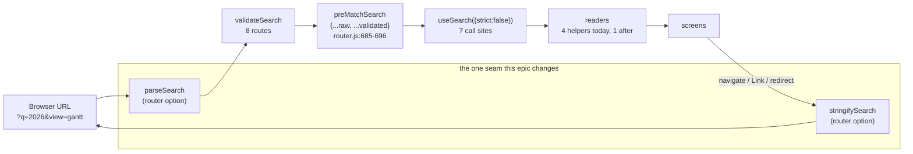
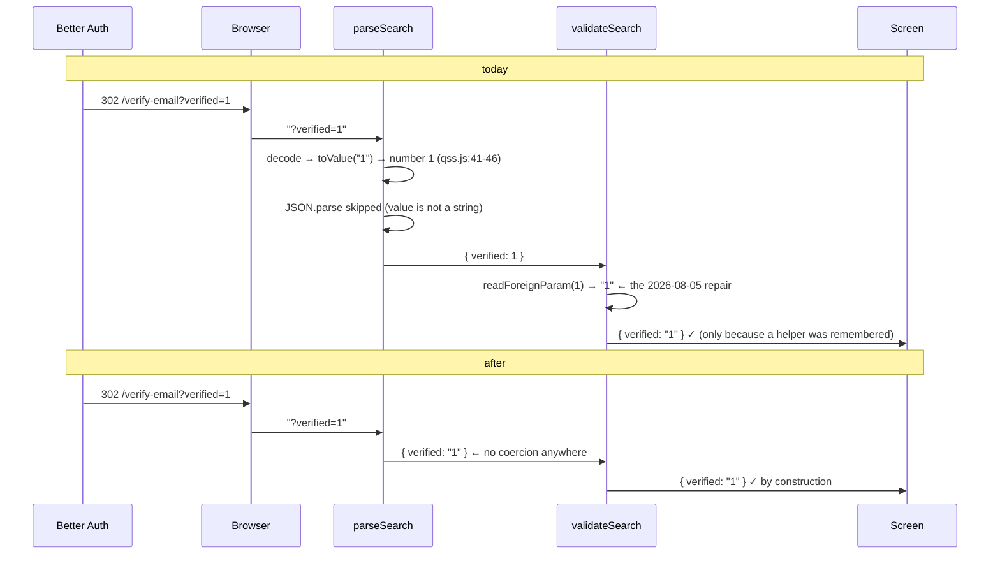

# Feature Spec: A search param is a string, and the URL says so

- **Status:** Draft — awaiting approval
- **Author(s):** feature-analyst (Product Owner / Solution Architect / Technical Lead hats)
- **Date:** 2026-09-01
- **Tracking issue / epic:** — (`docs/TECH_DEBT.md` [#96](../../TECH_DEBT.md))
- **Roadmap link:** none yet — this is debt repayment, not a roadmap theme. ADR exemption or a
  roadmap line is decided at filing (see §4, "ADR").
- **Related ADR(s):** proposed **ADR-0122** (number free as of 2026-09-01; re-check at filing —
  ADR-0071/ADR-0079 both record a number being taken between the plan and the milestone).
  Builds on ADR-0074 (which found the defect), ADR-0053 §4 / ADR-0059 §3 / ADR-0073 C1 /
  ADR-0095 M5 (the four URL-state surfaces), ADR-0081 (entry points), ADR-0105 (why this is a spec
  and not a drive-by), ADR-0058 / ADR-0076 (verify the claim).

> **Method note, stated first because it bounds every number below.** This session had **no shell**:
> nothing was executed — no `pnpm test`, no `pnpm check:claims`, no browser. Every claim here is
> established by **reading** a named file and line, or by a repository-wide search whose pattern is
> given. Claims that need execution to settle are labelled **UNVERIFIED** and are assigned to
> Milestone 0, which exists to settle them before anything is designed further.

---

## 1. Business understanding

### The register row, and what re-reading the code says about it

`docs/TECH_DEBT.md` #96 was last edited **2026-08-08**. Since then ADR-0095 added the Gantt's view
memory, ADR-0098 the organisation overview and ADR-0104 changed shell routing. Per CLAUDE.md §19
(_re-verify a spec's PROBLEM statement, not only its design_) every figure and mechanism in the row
was re-derived. **Five of its claims are wrong or incomplete, and one of them would have made the
remedy it proposes fail to fix the defect it was written for.** These are findings, not footnotes.

#### F1 — The remedy as written does not work. `parseSearchWith` cannot be made to leave values alone.

The row (and `app/router.tsx:52-74`, and `router-search.test.ts:16-30`, and
`features/gantt/model/gantt-view-state.ts:19-29`) all state the mechanism as: the default
`parseSearch` is `parseSearchWith(JSON.parse)`, which JSON-parses every value, so `?verified=1`
arrives as the number `1`.

`?verified=1` **does** arrive as the number `1`. It is not `JSON.parse` that does it.

`parseSearchWith` (`dist/esm/searchParams.js:18-30`) first calls `decode`, and only then tries the
parser **on values that are still strings**:

- `decode` (`dist/esm/qss.js:55-65`) runs every value through `toValue`
  (`dist/esm/qss.js:41-46`), which returns `false` for `"false"`, `true` for `"true"`, and a
  **number** for any string whose canonical number form is itself (`+str * 0 === 0 && +str + "" === str`).
- So by the time `searchParams.js:18-30` reaches `if (typeof value === "string")`, `1` is already
  the number `1` and the parser is **skipped**.

Consequence for the design: **`parseSearchWith(v => v)` — the obvious reading of "a `parseSearch`
that leaves values as strings" — still returns `1`, `true` and `false` as non-strings.** A
string-preserving parser must be written from `URLSearchParams` directly and must not call
`parseSearchWith` at all. That is D2 in §4, and it is the single most valuable thing this
re-reading produced.

`JSON.parse` is still live and still does damage — it owns the cases `toValue` declines: `null`,
arrays, objects, quoted strings, and numeric strings whose canonical form differs (the all-digit
token). So the row's mechanism is not so much wrong as **half the mechanism**, and the missing half
is the half that defeats its proposed fix.

#### F2 — The row never mentions `stringifySearch`, and the change is impossible without it.

`defaultStringifySearch` is `stringifySearchWith(JSON.stringify, JSON.parse)`
(`searchParams.js:7`). Its value path (`searchParams.js:43-62`) takes a **fast path** for strings
that cannot be JSON — `if (isJsonParser && !jsonStart.test(val)) return val;` — and for every other
string it does `parser(val); return stringify(val)`, i.e. it **re-quotes** any string that JSON
accepts, so that the default parser gives it back as a string.

That is why the app's own writes round-trip correctly today, and it is why a parser change alone
would be a regression: with a raw parser and the default stringifier, `?q=%222026%22` reads back as
the five-character string `"2026"`, quotes included. **Parse and stringify move in one commit** (D1).

#### F3 — "nine `validateSearch` blocks" — it is **eight**, in one file, sharing **six** validator functions.

Method: `rg 'validateSearch:' apps/web/src` returns eight lines, all in `apps/web/src/app/router.tsx`
— 88, 268, 277, 307, 412, 424, 449, 471. Two of them (268, 277) are calls to the shared
`libraryFilterSearch` factory at 253, so there are **seven lexical validator bodies** and **six
distinct behaviours**. No counting of the current tree yields nine. Whether nine was right on
2026-08-08 could not be checked (no shell, so no `git log`) — **UNVERIFIED**, and immaterial: what
the plan must be sized against is eight.

#### F4 — "the four `useUrlFilterState` consumers" — it is **five**.

Method: `rg 'useUrlFilterState\(' apps/web/src` returns five call sites —
`routes/calendars.tsx:47`, `routes/resources.tsx:49`, `routes/audit-log.tsx:106`,
`routes/my-activity.tsx:28`, `features/gantt/model/use-gantt-view-state.ts:41`. The fifth is
ADR-0095 M5's Gantt view memory, which landed **after** the row's last edit. The row was right when
written and is stale now, which is the ordinary way a register row goes wrong.

#### F5 — The row treats `validateSearch` as the whole story. It is not, and cannot be.

`matchRoutes` composes each match's search as `preMatchSearch = { ...parentSearch, ...strictSearch }`
(`router.js:685-696`), and `useSearch` returns `match.search` **whatever `strict` is set to**
(`useSearch.js:21-23`). Two consequences nothing in this repository documents:

- **A validator cannot remove a param.** `libraryFilterSearch` "drops" a non-string `q`; the raw,
  wrongly-typed value is still in `match.search` and still what `pickText` sees. The screens behave
  correctly today by coincidence — both paths yield the default — not because the drop worked.
- **Seven of the eighteen params the app reads are declared by no validator at all** —
  `gsort`, `ghide`, `gcollapsed` (plan-detail declares only `view`), and `categories`, `outcome`,
  `from`, `to` (`/orgs/$orgSlug/audit-log` and `/me/activity` declare **no** `validateSearch`).
  They work because of the merge above, and because `matchRoutesLightweight` merges the same way
  when building a link (`router.js:795-798`). A design that "makes each route coerce what it wants"
  therefore has to say what happens to the params **no route declares**, which the row does not.

#### F6 — a docblock claim that is false, found while counting

`app/router.tsx:468-470` says "An invitation token is a 64-character hex string, so it never
round-trips as a number". The token is `randomBytes(32).toString('base64url')`
(`apps/api/src/common/tokens/token.ts:16`) — **43 characters of base64url**, not 64 of hex. 64-char
hex is the _hash_ (`token.ts:21`), which never leaves the database. The conclusion still holds (an
all-digit base64url token has probability ≈ (10/64)⁴³), but the premise is wrong and a later reader
would reason from it. Corrected in M1.

### Problem

Two problems, one cause.

**(a) A URL this application did not itself serialise can arrive at a validator as the wrong type,
and the failure is silent.** That is not hypothetical: ADR-0074 M5 shipped it. A reader clicked a
verification link, the address was verified, Better Auth redirected to `/verify-email?verified=1`,
the router handed the validator the **number** `1`, a `typeof === 'string'` test discarded it, and
the screen said the verification had not happened yet. The whole unit suite was green throughout,
because every screen test mocks `useSearch` and hands the component a literal — so nothing in the
repository crossed the parser.

The remedies applied since are per-reader coercions, and there are now **four independent copies**
of the same idea, each written by a different epic:

| helper                   | file                                               | covers                                                         |
| ------------------------ | -------------------------------------------------- | -------------------------------------------------------------- |
| `readForeignParam`       | `app/router.tsx:75-79`                             | `redirect`, `signedOut`, `email`, `verified`, `error`, `token` |
| `asSearchString`         | `features/gantt/model/gantt-view-state.ts:104-109` | `gsort`, `ghide`, `gcollapsed`                                 |
| `pickText` / `pickParam` | `hooks/use-url-filter-state.ts:65-81`              | `q`, `scope`, `archived`, `kind`                               |
| `asString` / `asIsoDate` | `features/audit/model/audit-filter.ts:115-123`     | `categories`, `outcome`, `from`, `to`                          |

(A fifth reader, `parsePlanViewMode` (`features/gantt/view-mode.ts:33-35`), covers `view` by
equality against two literals. It is total and needs no helper, so it is not part of the
consolidation — named here so the count below reconciles.)

Four spellings of one rule is precisely the shape this register records shipping wrong most often —
"one correct pattern applied to a control and not its neighbour" (ADR-0064 §7, ADR-0067, ADR-0092
M4, ADR-0114, six recorded instances). Two of the four coerce (`readForeignParam`, `asSearchString`);
two do not (`pickText`, `asString`) — they test `typeof === 'string'` and fall back. Nobody decided
that split.

**(b) The address bar does not say what the planner typed.** `?signedOut=%22true%22` is what the
product's front door shows after every sign-out, and `?q=%222026%22` is what the calendars library
shows when a planner searches for `2026` — both derived by reading `searchParams.js:43-62` and
`qss.js:25-32`, both **UNVERIFIED in a browser** (M0-T2 settles them, with a falsification condition
written first). This directly contradicts the promise `hooks/use-url-filter-state.ts:13-17` makes in
its own words — that a filtered view is worth pasting to a colleague, and that "is anything
filtered?" is answerable by looking at the URL. A colleague who retypes the natural form `?q=2026`
gets an unfiltered screen.

**Why now.** Three reasons, none of them urgency:

1. The row is 24 days old and has already gone stale twice (F3, F4). It is either done or it is
   deleted; leaving it is the state ADR-0120 exists to stop.
2. Every new search param is a new opportunity to pick the wrong one of four helpers. `ghide` and
   `gcollapsed` are the two most recent, and both needed a fifth reading of the same trap
   (`gantt-view-state.ts:19-29` is 11 lines of docblock explaining it).
3. The class is **structurally invisible to the unit tier** and always will be, so the cost is paid
   in flag-on journeys and in production. `router-search.test.ts` is the only unit-tier test in the
   repository that crosses the real parser, and it covers three of the eight routes.

### Users

Everybody, in one of three ways. There is **no RBAC dimension**: search parsing happens before any
permission is consulted, and no permission is added, removed or changed.

- **Any signed-in member (Org Admin / Planner / Contributor / Viewer)** — deep-links and pasted
  URLs: library filters, the audit log's filters, the Gantt's remembered view, `?view=`.
- **A person who is not signed in yet** — the account-recovery and verification links, which are
  composed **outside** the router and are where the shipped defect landed.
- **An External Guest** — unaffected. `/share` carries its token in the URL **fragment**
  (`app/router.tsx:321-327`), which no search parser ever sees. Stated because a reader meeting
  "tokens get corrupted in URLs" will reasonably fear the guest link, and it is not at risk.

### Primary use cases

1. A planner filters the calendars library, copies the URL, and a colleague opens it — or retypes
   it — and sees the same filtered view.
2. A reader follows a verification or password-reset link composed by Better Auth and reaches the
   state that link describes.
3. A planner leaves the Gantt sorted and with a column shown, reloads, and the chart comes back.
4. A developer adds a nineteenth search param and cannot silently pick the wrong coercion, because
   the shape of the value is decided once, at the router.

### User journeys

Happy path (after this ships): the URL a planner sees is the URL they arrived with, value for
value; every search param reaches every reader as a `string`; the readers keep their existing
"unknown value degrades to the default" behaviour, so a hand-edited URL still cannot crash a screen.

Alternates that matter: a stale bookmark holding a quoted value (`?q=%222026%22`) opens with the
quotes visible in the search box and self-corrects on the next keystroke (§2 edge cases, D4); a
repeated param (`?q=a&q=b`) resolves to the first value rather than to nothing (D3).

### Expected outcomes

- The defect class ADR-0074 M5 shipped becomes **unreachable by construction** rather than defended
  against at eighteen call sites — including in the case no reader can defend against (a value
  whose `String()` does not reproduce the source).
- Four coercion helpers become one, and the one is a no-op safety net rather than the mechanism.
- URLs become legible and retypable; the promise `use-url-filter-state.ts` already makes becomes
  true.
- A new route with search params fails a gate until somebody writes a case that crosses the real
  parser.

### Success criteria

1. For every one of the 18 params, `parse(stringify(v)) === v` for every string `v` — asserted as a
   property over a generated corpus, not a table of examples (M3-T1).
2. For every incoming query string `s`, `stringify(parse(s))` is value-identical to `s` (it is
   **not** byte-identical, and was not before either: `URLSearchParams.toString()` normalises
   percent-encoding — `qss.js:25-32`). Today this round trip is **not** value-preserving, which is
   what `router.js:183-194` propagates into every link built from a location.
3. No reader in `apps/web/src` receives a non-string search value in the shipped configuration.
4. The named journeys (§3, Testing) pass unchanged, except where the plan predicts a change in
   advance and says which assertion and why.
5. The census gate fails when a route with `validateSearch` has no real-parser case — verified red
   before it is trusted (ADR-0110: _a gate is verified against the defect it names_).

### Open questions

**CRITICAL — CQ-1. Is the quoted-URL symptom (b) real?** Everything about it is read-derived. If
M0-T2's browser probe shows no `%22` after sign-out and after a numeric search, half the case for
this epic evaporates and the remaining half (the type defect) is narrower than the row implies —
see CQ-2. **Default if unanswered:** M0-T2 runs first and the epic is re-scoped on its result; the
falsification condition is committed before the probe.

**CRITICAL — CQ-2. Is the type defect worth a router-level change, given how narrow the live,
unmitigated surface turns out to be?** Honest accounting, param by param (§2, "The corruption
table"): of the 18, **9 are already coerced** by one of the two coercing helpers — `redirect`,
`signedOut`, `email`, `verified`, `error`, `token` (`readForeignParam`) and `gsort`, `ghide`,
`gcollapsed` (`asSearchString`). Of the **9 that are not**, eight (`scope`, `archived`, `kind`,
`view`, `categories`, `outcome`, `from`, `to`) have vocabularies containing no JSON-parseable
member — `2026-08-04` throws, `failure` throws, `org`/`all`/`gantt` never match `jsonStart` — so
coercing them would change nothing whatever. **The only live, reachable, unmitigated case is `?q=`
on the two library screens with a hand-typed numeric / `true` / `false` / `null` / `[…]` value.** The case for the change is therefore mostly (b) legibility, plus the structural argument
that four helpers is one bad merge away from a fifth omission, plus the one class no reader can fix.
**Default if unanswered:** proceed, with M1 (one reader vocabulary) shipping first so that even if
M2–M4 are declined the four-helper risk is closed.

**CRITICAL — CQ-3. Old URLs: accept the quotes, or unquote them?** D4 recommends accepting. The
alternative permanently corrupts a genuinely-quoted value (a planner searching for `"prelim"` with
the quotes typed) in exchange for tidying bookmarks that self-heal on the next keystroke.
**Default:** accept; no shim.

Non-critical, with defaults stated and no answer needed:

- **Repeated params.** First value wins (D3), matching `URLSearchParams.get`. Today they arrive as
  an array and all but three readers fall to their default.
- **Flag?** No (D7) — ADR-0088 D1: a `VITE_` constant is inlined at build time and has never been
  an operator rollback. The flip is one line; the rollback is a revert.
- **`/forgot-password?email=`.** `docs/specs/account-security/feature-spec.md:805` specifies the
  prefill, `routes/forgot-password.tsx:30` reads it, and **nothing in `apps/web/src` or
  `apps/api/src` writes it** (`rg 'forgot-password' apps/web/src` — the two in-app links, at
  `routes/sign-in.tsx:31` and `routes/reset-password.tsx:58`, pass no search). That is a specified
  capability with no producer — ADR-0081's shape, one layer below a screen. **It is out of scope
  here** (adding a producer is a user-facing behaviour change with its own permission-free but
  real design question: does the front door put a typed address in the URL?). M5 files it as a new
  `docs/TECH_DEBT.md` row rather than absorbing it.

---

## 2. Functional requirements

### The inventory (verified)

**23 `createRoute(` declarations plus the root** (`rg 'createRoute\(' apps/web/src/app/router.tsx`).
**8 declare `validateSearch`.** **18 distinct param names are read.** **7 of the 18 are declared by
no validator.**

| #   | Param        | Declared at              | Read at                                              | Written by                                                                                 | Genuine type            |
| --- | ------------ | ------------------------ | ---------------------------------------------------- | ------------------------------------------------------------------------------------------ | ----------------------- |
| 1   | `redirect`   | `router.tsx:88`          | `routes/sign-in.tsx:28`                              | `router.tsx:140` (router), `AcceptInvitationCard.tsx:128` (`<Link search>`), a person      | string (an in-app path) |
| 2   | `signedOut`  | `router.tsx:88`          | `routes/sign-in.tsx:27`                              | `account-chip.tsx:182`                                                                     | string (`'true'`/`'1'`) |
| 3   | `q`          | `router.tsx:268/277`     | `routes/calendars.tsx:21`, `routes/resources.tsx:25` | `use-url-filter-state.ts:39`                                                               | string (free text)      |
| 4   | `scope`      | `router.tsx:268`         | `routes/calendars.tsx:22`                            | same                                                                                       | enum string             |
| 5   | `archived`   | `router.tsx:268/277`     | `calendars.tsx:23`, `resources.tsx:27`               | same                                                                                       | enum string             |
| 6   | `kind`       | `router.tsx:277`         | `routes/resources.tsx:26`                            | same                                                                                       | enum string             |
| 7   | `view`       | `router.tsx:307`         | `features/gantt/use-plan-view-mode.ts:26`            | `use-plan-view-mode.ts:35`                                                                 | enum string             |
| 8   | `gsort`      | **nothing**              | `gantt-view-state.ts:202`                            | `use-gantt-view-state.ts:41`                                                               | string `key:direction`  |
| 9   | `ghide`      | **nothing**              | `gantt-view-state.ts:203`                            | same                                                                                       | comma-joined string     |
| 10  | `gcollapsed` | **nothing**              | `gantt-view-state.ts:204`                            | same                                                                                       | comma-joined ids        |
| 11  | `categories` | **nothing**              | `audit-filter.ts:59`                                 | `use-url-filter-state.ts:39`                                                               | comma-joined string     |
| 12  | `outcome`    | **nothing**              | `audit-filter.ts:60`                                 | same                                                                                       | enum string             |
| 13  | `from`       | **nothing**              | `audit-filter.ts:64`                                 | same                                                                                       | `YYYY-MM-DD`            |
| 14  | `to`         | **nothing**              | `audit-filter.ts:65`                                 | same                                                                                       | `YYYY-MM-DD`            |
| 15  | `email`      | `router.tsx:412`, `:449` | `forgot-password.tsx:30`, `verify-email.tsx:66`      | `routes/sign-up.tsx:32` (hand-composed, verify-email only); **nobody** for forgot-password | string                  |
| 16  | `verified`   | `router.tsx:449`         | `verify-email.tsx:67`                                | `use-session.ts:197` (hand-composed literal) → Better Auth redirect                        | string `'1'`            |
| 17  | `error`      | `router.tsx:424`, `:449` | `verify-email.tsx:68`, route only                    | Better Auth                                                                                | string code             |
| 18  | `token`      | `router.tsx:424`, `:471` | `reset-password.tsx:41`, `accept-invite.tsx:33`      | Better Auth (`password.mjs:75`), `apps/api/.../invitations.service.ts:117`                 | opaque string           |

**Genuine non-string params: zero.** Every reader either returns a string, or derives an enum/`Set`
from one. **Genuine arrays or objects written to a URL: zero** — the three list-shaped values
(`ghide`, `gcollapsed`, `categories`) are deliberately comma-joined precisely so the URL carries one
key per concept (`audit-filter.ts:18-21`, `gantt-view-state.ts:133-140`). That is the fact that
makes a string-preserving parser possible at all, and it was checked rather than assumed: every
`search:` write site (five — `router.tsx:140`, `account-chip.tsx:182`,
`AcceptInvitationCard.tsx:128`, `use-url-filter-state.ts:39`, `use-plan-view-mode.ts:35`) and every
hand-composed URL literal (three — `use-session.ts:197`, `sign-up.tsx:32`,
`invitations.service.ts:117`) was read.

### The corruption table (what happens today, per value shape)

Read from `qss.js:41-46` (`toValue`), `searchParams.js:18-30` (`JSON.parse`, with the `catch`
that keeps the raw string), and `searchParams.js:43-62` (the stringifier).

| Value in a URL we did not serialise    | after `toValue`            | after `JSON.parse`       | reaches the reader as            | live?                            |
| -------------------------------------- | -------------------------- | ------------------------ | -------------------------------- | -------------------------------- |
| `1`, `42`, `-1`, `3.5`                 | number                     | skipped                  | **number**                       | yes — mitigated on 11 params     |
| `true`, `false`                        | boolean                    | skipped                  | **boolean**                      | yes — same                       |
| `null`                                 | `'null'`                   | `null`                   | **null**                         | yes — same                       |
| `[1,2]`, `{"a":1}`                     | string                     | array / object           | **array / object**               | yes — same                       |
| `1e5`                                  | `'1e5'`                    | `100000`                 | **number**                       | yes — same                       |
| `12345678901234567890123456789012`     | string (canonical differs) | `1.2345678901234567e+31` | **number, source unrecoverable** | latent (see below)               |
| `?q=a&q=b`                             | array                      | per element              | **array**                        | yes — 3 of 18 readers survive it |
| `007`, `2026-08-04`, `failure`, `{foo` | string                     | throws → raw kept        | string ✓                         | n/a                              |
| `%222026%22` (what we write)           | `'"2026"'`                 | `'2026'`                 | string ✓                         | n/a                              |

**Which of these are live defects, honestly:**

- **L1 — wrong type at the reader.** Live. Mitigated on **9** params by `readForeignParam` /
  `asSearchString`. Of the **9** unmitigated, eight have vocabularies with no JSON-parseable member,
  so coercion would be a no-op. **The reachable case is `?q=` on `/orgs/:slug/calendars` and
  `/orgs/:slug/resources`, hand-typed or externally linked as `?q=2026`, `?q=true`, `?q=null`,
  `?q=[1]`** — the search box comes up empty. Narrow, real, and much narrower than the row implies.
- **L2 — unrecoverable token corruption.** Latent, not live. Both token formats are known
  (`token.ts:16`: 43 chars base64url; `password.mjs:75`: `generateId(24)` — its alphabet was not
  chased, because two copies of `@better-auth/core` are installed and the register cannot name one;
  **UNVERIFIED and immaterial**, since every candidate alphabet contains letters). The risk is that
  a **future** token format re-arms it, silently, with the symptom "your reset link is invalid" and
  no way for the reader to act.
- **L3 — the address bar shows what we did not write.** Read-derived; **UNVERIFIED in a browser**.
  `?signedOut=%22true%22` after every sign-out; `?q=%222026%22` for a numeric search term.
- **L4 — repeated params.** Live, exotic. `?q=a&q=b` → array → empty search box.
- **L5 — propagation.** `parseLocation` (`router.js:183-194`) stringifies the parsed search straight
  back into the location's `href`/`searchStr`, so a value corrupted on arrival is carried into every
  link the app builds from that location, not merely into one screen's props.

**The ADR-0095 `''` question, answered: there is no interaction, and `HIDE_NOTHING` stays.** The
brief asked whether the "hide nothing was unrepresentable" defect touches this. It does not.
`useUrlFilterState` deletes a param equal to `''` on the way **out**
(`hooks/use-url-filter-state.ts:43`); `toValue` returns `''` for an empty value on the way **in**
(`qss.js:41-46`, first line). Both halves are unchanged by a string-preserving parser, so the
`'none'` sentinel (`gantt-view-state.ts:66-79`) remains necessary after this epic. Recorded so a
later reader does not delete it expecting this change to have covered it.

### User stories & acceptance criteria

> **US-1** — As a planner, I want a URL I paste or retype to produce the view it describes, so that
> a filtered library or a sorted chart can be handed to a colleague.
>
> - **Given** the calendars library filtered to `2026`, **when** I copy the URL, **then** it reads
>   `?q=2026` and not `?q=%222026%22`.
> - **Given** `/orgs/acme/calendars?q=2026` typed by hand, **when** the screen loads, **then** the
>   search box holds `2026` and the table is filtered.
> - **Given** `?q=true`, `?q=null` or `?q=[1]`, **then** the search box holds that text verbatim.

> **US-2** — As a person recovering an account, I want a link composed by Better Auth to land me in
> the state it names, so that a successful verification is not reported as a pending one.
>
> - **Given** `/verify-email?verified=1`, **then** the screen says the address is verified.
> - **Given** `/reset-password?token=<any 43-character base64url token, including an all-digit one>`,
>   **then** the form is offered and the token spent is byte-identical to the one in the link.
> - **Given** `/accept-invite?token=…`, **then** the invitation resolves.

> **US-3** — As a planner, I want the Gantt's remembered view to survive a reload and a paste.
>
> - **Given** `?view=gantt&gsort=name:asc&ghide=none`, **then** the chart opens sorted by Activity
>   with Predecessors shown, after a reload and from a pasted URL alike.
> - **Given** `?gsort=1` typed by hand, **then** the chart opens on its default sort and draws.

> **US-4** — As a developer, I want the type of a search value decided once, so that a nineteenth
> param cannot pick the wrong one of four helpers.
>
> - **Given** a new route declaring `validateSearch` and no real-parser case, **then**
>   `pnpm test` fails naming the route.
> - **Given** a reader that assumes a `string`, **then** it is correct by construction rather than
>   by having remembered to coerce.

> **US-5** — As a reader of this repository, I want the three docblocks that describe this mechanism
> to describe it correctly.
>
> - `app/router.tsx:52-74`, `router-search.test.ts:16-30` and `gantt-view-state.ts:19-29` each
>   attribute the coercion to `JSON.parse` alone. After M5 each names `toValue` as well, or the
>   epic has left behind exactly the confident-and-wrong prose ADR-0058 exists about.

### Workflows

**Reading a URL (after).** Browser URL → our `parseSearch` (`URLSearchParams` → first value per key,
raw string) → each matched route's `validateSearch` (unchanged in shape; the coercion branches
become unreachable but stay) → `preMatchSearch = { ...raw, ...validated }` → `useSearch` →
reader → screen.

**Writing a URL (after).** Reader produces a `Record<string, string | undefined>` → `navigate`/
`Link`/`redirect` → our `stringifySearch` (`undefined` skipped, everything else `String(v)`, encoded
by `URLSearchParams`) → address bar.

### Edge cases

| Case                                          | Today                           | After                                                         | Note                                       |
| --------------------------------------------- | ------------------------------- | ------------------------------------------------------------- | ------------------------------------------ |
| `?q=` (empty)                                 | `''`, deleted on write          | same                                                          | D-none; `HIDE_NOTHING` still needed        |
| `?q=a&q=b`                                    | array → default                 | `'a'`                                                         | D3                                         |
| `?q=%222026%22` from a stale bookmark         | `'2026'`                        | `'"2026"'` — quotes visible, self-heals on the next keystroke | D4, accepted cost                          |
| `?signedOut=%22true%22` from a stale bookmark | banner shown                    | banner **not** shown                                          | D4, accepted; trivially self-healing       |
| all-digit token                               | corrupted, unrecoverable        | carried verbatim                                              | the one case no reader can fix             |
| `?x={"a":1}`                                  | object at the reader            | the literal string                                            | every reader is total; no crash            |
| key with no `=` (`?flag`)                     | `''` (URLSearchParams)          | `''`                                                          | unchanged                                  |
| unicode / `+` / `%20`                         | normalised by `URLSearchParams` | same                                                          | unchanged, and it was never byte-identical |
| a param no route declares                     | survives via the merge          | survives via the merge                                        | unchanged (F5)                             |

### Permissions

**None change.** Search parsing runs before any guard; no permission (ADR-0012), no organisation
scope, no pen (ADR-0028), no audit action (ADR-0072/0073 — a URL parse is not a mutation and earns
no row under either the durability or the blast-radius test). External Guests are untouched
(fragment, not search).

### Validation rules

- A search value is a `string`. There is no other type.
- A validator **normalises and defaults**; it never throws. The house rule already stated three
  times in `router.tsx` — a hand-edited URL must not crash a screen — is unchanged, and it is why
  Zod validators are rejected (D6).
- A stringifier receives `string | undefined`; `undefined` is omitted. Non-strings are a
  development-time error (D9) and are already prevented by TypeScript at every call site, because
  every validator's declared return type is `{ …?: string }` and both URL-state hooks are typed
  `Record<string, string | undefined>`.

### Error scenarios

| Scenario                               | Detection                                                                                                       | User-facing result                               | Status                          |
| -------------------------------------- | --------------------------------------------------------------------------------------------------------------- | ------------------------------------------------ | ------------------------------- |
| Unknown value for an enum param        | reader's `allowed` list                                                                                         | that filter falls to its default; screen renders | n/a (client)                    |
| Malformed date in `from`/`to`          | `asIsoDate` regex                                                                                               | filter ignored, nothing sent to the API          | n/a                             |
| Token not recognised                   | server                                                                                                          | existing "that link is no longer valid" screen   | 404/410 at the API              |
| A non-string reaches `stringifySearch` | development-time error; `String(v)` in production                                                               | none                                             | n/a                             |
| Route validator throws                 | `SearchParamError` recorded on the match (`router.js:697-704`), load short-circuited (`load-client.js:152-156`) | an error screen instead of the route             | — **must stay unreachable**; D6 |

---

## 3. Technical analysis

| Area           | Impact                       | Notes                                                                                                                                                                                                                                                                                                                                                                               |
| -------------- | ---------------------------- | ----------------------------------------------------------------------------------------------------------------------------------------------------------------------------------------------------------------------------------------------------------------------------------------------------------------------------------------------------------------------------------- |
| Frontend       | **high**                     | One router option pair; four reader helpers become one; 18 params; 8 validators                                                                                                                                                                                                                                                                                                     |
| Backend        | **none**                     | `apps/api` is not touched. The one API-side URL producer (`invitations.service.ts:117`) is a plain template string and stays                                                                                                                                                                                                                                                        |
| Database       | **none**                     | No model, column, index, constraint or migration — checked against the whole design. **`database-architect` is deliberately not engaged**, recorded so "the agent was not run" cannot later read as an oversight (ADR-0121 precedent)                                                                                                                                               |
| API            | **none**                     | No endpoint, DTO, status code or OpenAPI change                                                                                                                                                                                                                                                                                                                                     |
| Security       | **low, and one improvement** | The `?redirect=` same-origin-by-shape check (`router.tsx:96-101`, TECH_DEBT #102(1)) is unchanged and must be re-proved: it currently sees `'1'` for `?redirect=1` via `readForeignParam` and drops it; after the change it sees `'1'` directly and drops it for the same reason. The improvement is L2: a token is carried verbatim, so a future format cannot be silently mangled |
| Performance    | **negligible**               | `URLSearchParams` in, `URLSearchParams` out; strictly less work than today (no `JSON.parse` per value, no `jsonStart` test per write). Not measured, and not worth measuring — stated as a claim about work removed, not a benchmark                                                                                                                                                |
| Infrastructure | **none**                     | No new Playwright config, no new CI step, no env var, no container change — by design (§5, ADR-0105)                                                                                                                                                                                                                                                                                |
| Observability  | **none**                     |                                                                                                                                                                                                                                                                                                                                                                                     |
| Testing        | **high**                     | The whole point. See below                                                                                                                                                                                                                                                                                                                                                          |
| Engine         | **none**                     | **The CPM engine is not imported and no migration runs**, so the ADR-0034 recalculation parity gate is untouched by construction — in its honest form: there is nothing here to hold parity for                                                                                                                                                                                     |

### Testing — and whether a gate is achievable

**Achievable, fully derived (Gate A).** A vitest structural test enumerating the **live route tree**
(`router.routesByPath`) and failing when a route that declares `validateSearch` has no case in the
suite that composes the **real** parser with that route's real validator. Derived on the route side
— no glob, no source scan, so a route added tomorrow is demanded tomorrow. `router-search.test.ts`
is already 90% of this: it resolves routes out of `router.routesByPath` (`:32`) and composes
`defaultParseSearch` into the route's own `validateSearch` (`:40`). What it lacks is the census.

Gate A has **three named blind spots**, and one of them is a trap this repository has already been
bitten by:

1. **A flag-gated route is absent from the tree when its flag is off**, so the census would silently
   stop demanding a case — a rule going _quiet_, which is TECH_DEBT #178/#181/#183's shape. Four
   flags gate seven routes (`PASSWORD_RESET_ENABLED`, `RESOURCES_ENABLED`, `AUDIT_LOG_ENABLED`,
   `ACCOUNT_SETTINGS_ENABLED`, plus `GUEST_SHARE_LINKS_ENABLED` for `/share`). The suite already
   mocks one of them (`router-search.test.ts:11-14`) for exactly this reason. Gate A must mock
   **all** of them on and assert the resulting route count, or it is a census of whatever happened
   to be enabled.
2. **It cannot check the case exercises the right params** — only that a case exists.
3. **A pinned positive case is mandatory.** "Every route with a validator has a case" passes
   perfectly against a census that finds no routes (ADR-0093's lesson, and ADR-0108's own census
   failed exactly this way on its first run).

**Achievable, partially derived (Gate B).** A source census over the search **consumers** —
`useSearch(`, `pickText(`, `pickParam(`, and the four reader modules — on the
`unsaved-work-census.structural.test.ts` pattern: each is registered or carries a written reason.
This is what catches the seven params no validator declares. Its blind spot is stated in its own
docblock: it classifies **files**, not params.

**Not achievable by any gate: proving a param's real production value survives the real browser.**
That is what a journey does, and it is why the journeys below are named per milestone rather than
left to CI. Said plainly because the alternative — implying the gate covers it — is how a green
suite stops anyone looking.

**Journeys that must be re-run at the flip (M4).** This changes the serialisation every journey's
every navigation passes through, which is `scripts/e2e-sweep.sh`'s own stated trigger ("a change
that replaces a screen every journey signs in through"). So: **the full sweep**, plus these named
individually because each asserts a URL or a search-driven state:

| Suite                     | Why                                                                                                                                        |
| ------------------------- | ------------------------------------------------------------------------------------------------------------------------------------------ |
| `test:e2e` (base)         | `e2e/members.spec.ts:40` asserts `/accept-invite?token=`; CLAUDE.md's rule — change a screen, run the base journey                         |
| `test:e2e:public`         | `e2e-public/support.ts:73-100` drives ten URL states including `?verified=1` and `?token=e2e`                                              |
| `test:e2e:account-verify` | the only test that follows a real emailed link through a real redirect — the one that found #96                                            |
| `test:e2e:account`        | the reset link                                                                                                                             |
| `test:e2e:library`        | asserts `[?&]scope=all` and `[?&]archived=include` (`library.spec.ts:69,130`)                                                              |
| `test:e2e:gantt-editing`  | `view-state.spec.ts:61` asserts `gsort=name:asc` in the URL; `:81` drives a hand-edited `?gsort=1&ghide=notAColumn`                        |
| `test:e2e:gantt`          | `?view=gantt` survives a reload                                                                                                            |
| `test:e2e:audit`          | the four filter params, and an invitation token                                                                                            |
| `test:e2e:overview`       | reads `page.url()`                                                                                                                         |
| `test:e2e:shell`          | the org-less routes                                                                                                                        |
| `test:e2e:wbs`            | `?view=tsld`                                                                                                                               |
| `test:e2e:unsaved-work`   | the blocker calls `router.options.parseSearch` directly (`useBlocker.js:59-65`) — the one consumer of the option outside the router itself |

### Dependencies

- `@tanstack/react-router@1.170.27` / `@tanstack/router-core@1.171.22` (the versions
  `scripts/dependency-claims.json` is pinned to). **A bump moves every line cited here**, which is
  ADR-0076's mechanism working as intended: the register entries added by this epic mean a
  Dependabot bump fails CI and forces a re-read.
- Nothing must land first. Nothing is blocked on this.

---

## 4. Solution design

### Architecture overview



The whole change is the two boxes in the subgraph. Everything else keeps its shape: the merge is the
library's, the validators keep their signatures, the readers keep their totality.

### Data flow — the defect, and the fix



### User flow

```mermaid
flowchart TD
  A["Planner filters Calendars to 2026"] --> B["URL is ?q=2026"]
  B --> C["Copies it to a colleague"]
  C --> D{"Colleague opens it"}
  D -->|paste| E["Filtered view"]
  D -->|retypes ?q=2026| E
  E --> F["Search box holds 2026"]
  G["Stale bookmark ?q=%222026%22"] --> H["Search box holds \"2026\" with quotes"]
  H --> I["One keystroke rewrites the URL clean"]
```

### Database changes

**None.** No model, column, index, constraint or migration. `database-architect` is deliberately not
engaged, and that is a statement rather than an omission.

### API changes

**None.**

### Component changes

| Change                                                       | Where                                                                                      | Note                                                                                                           |
| ------------------------------------------------------------ | ------------------------------------------------------------------------------------------ | -------------------------------------------------------------------------------------------------------------- |
| New pure module `lib/router/search-params.ts`                | `apps/web/src/lib/router/`                                                                 | `parseSearchStrings` / `stringifySearchStrings`; no React, no router import — testable as arithmetic           |
| New shared reader `searchString(value): string \| undefined` | beside it                                                                                  | replaces `readForeignParam`, `asSearchString`, and the `typeof` tests inside `pickText`/`pickParam`/`asString` |
| `createRouter` gains two options                             | `app/router.tsx:518`                                                                       | the one-line flip                                                                                              |
| Docblock corrections                                         | `router.tsx:52-74`, `:468-470`, `router-search.test.ts:16-30`, `gantt-view-state.ts:19-29` | F1, F6                                                                                                         |
| Two structural tests                                         | `app/router-search-census.structural.test.ts`, `app/search-consumers.structural.test.ts`   | Gates A and B                                                                                                  |

No visual component changes; no design-token, layout or accessibility surface is touched, so the
contrast matrix, the fit gate and the target-size sweep are all untouched.

### Implementation approach & alternatives

**Chosen: a string-preserving `parseSearch`/`stringifySearch` pair at the single `createRouter`
call, with the readers kept total as defence in depth.**

Decisions, each with the evidence that produced it:

- **D1 — parse and stringify move together, in one commit.** `searchParams.js:43-62` re-quotes any
  string JSON accepts, so a parser-only change makes every previously-written value read back with
  quotes. Read, not assumed.
- **D2 — the parser is built on `URLSearchParams`, never on `parseSearchWith`.** `decode`'s
  `toValue` (`qss.js:41-46`) coerces `true`/`false`/canonical numerics **before** any parser is
  consulted (`searchParams.js:18-30`), so `parseSearchWith(v => v)` still delivers `?verified=1` as
  a number. This is the correction to the row's own proposed remedy (F1).
- **D3 — a repeated key resolves to its first value.** `URLSearchParams.get` semantics. Today
  `decode` builds an array (`qss.js:55-65`) and 15 of 18 readers fall to a default. Rejected: keep
  arrays — nothing in the app wants one, and an array is the shape that forces every reader to grow
  a branch.
- **D4 — no unquoting shim for legacy URLs.** A shim that unquotes `"…"` would permanently corrupt a
  value a planner genuinely typed with quotes, to tidy bookmarks that self-heal on the next
  keystroke. The cost is stated in §2's edge-case table rather than engineered away.
- **D5 — one reader vocabulary, and the readers stay.** `useSearch` is typed `unknown` at every call
  site, and a total reader is the rollback contract if the option pair is ever reverted. What
  changes is that there is one spelling instead of four.
- **D6 — validators stay hand-written functions; no Zod `validateSearch`.** A standard-schema
  validator that rejects throws `SearchParamError`, which `matchRoutes` catches and records on the
  match (`router.js:697-704`); the loader then short-circuits that match into its error lane
  (`load-client.js:152-156`) rather than rendering the screen. That is the opposite of the rule
  stated three times in `router.tsx` — a hand-edited URL must degrade rather than crash — so the
  validators stay functions that normalise and never throw.
- **D7 — no `VITE_` flag.** ADR-0088 D1: a `VITE_` constant is inlined at build time, `.dockerignore`
  strips `**/.env` from the build context, and `docker-publish.yml` passes no `VITE_` build arg — so
  a flag has never been an operator rollback. The rollback here is a one-line revert, which is
  smaller than a flag would be.
- **D8 — the parser returns a null-prototype object**, mirroring `decode` (`qss.js:55-65`), so
  nothing downstream changes shape. `'x' in search` (used at `verify-email.tsx:66-68`,
  `reset-password.tsx:41`, `accept-invite.tsx:33`) keeps working.
- **D9 — a non-string handed to the stringifier is a development-time error and `String(v)` in
  production.** The painter's precedent (ADR-0121). TypeScript already prevents it at every call
  site; this catches the case where somebody widens a validator's return type.
- **D10 — two vitest structural gates, no `check:*` script and no CI step.** The structural-test form
  is this repository's established one — 47 files match
  `apps/web/src/**/*.structural.test.ts*` — and it runs inside `pnpm test`, so no workflow changes
  and the ADR-0105 CI trigger is not fired.

**Alternatives considered and rejected:**

1. **Per-reader coercion only (status quo, extended).** Cheapest, and it is what the last four epics
   did. Rejected because it cannot fix L2 at all, leaves L3 entirely, and institutionalises the
   four-helper split that is one omission away from the next silent drop. It is also the option the
   row itself rejected, for the same reason.
2. **`parseSearchWith(v => v)`.** The row's literal proposal. **Rejected because it does not work**
   (F1/D2) — it would have shipped, looked right, and left `?verified=1` a number.
3. **Zod validators everywhere.** Rejected — D6.
4. **A per-route opt-in (`parseSearch` per route).** The library has no such option; `parseSearch` is
   a router-level option (`router.js:634-635`). Not available.
5. **Leave it; delete the row.** A defensible answer if CQ-1 falsifies L3 and CQ-2 is answered "not
   worth it". Named so the approval is a choice rather than a default.

### ADR

**Yes — this is architecturally significant** and needs one: it sets a standing rule for every
future route, changes a cross-cutting seam, and overturns the mechanism three docblocks currently
state. Proposed outline:

> **ADR-0122 — A search param is a string, and the URL says so.**
>
> - **Context.** ADR-0074 M5 shipped a live defect from the router's default search parsing; four
>   epics since have each written their own coercion helper. Re-reading the library found that the
>   mechanism everyone had written down was half the mechanism, and that the obvious remedy does not
>   work (`toValue` coerces before any parser runs).
> - **Decision.** A string-preserving `parseSearch`/`stringifySearch` pair at the single
>   `createRouter` call; readers stay total; one reader vocabulary; first value wins; no legacy
>   shim; no flag; the census gate.
> - **Consequences (positive).** The class is unreachable by construction; URLs are legible and
>   retypable; a new route is gated.
> - **Consequences (negative), stated rather than glossed.** The flip is **atomic** — a router
>   option cannot be adopted route by route — so one commit changes every URL in the product. A
>   stale bookmark holding a quoted value degrades visibly. The three list-shaped params stay
>   comma-joined by convention rather than by a mechanism.
> - **Consequences (follow-ups).** `/forgot-password?email=` has no producer (a new TECH_DEBT row).
>   TECH_DEBT #96 closes; #101's basename blind spot is untouched.
> - **The CPM engine is not imported and no migration runs.**

---

## 5. ADR-0105 triggers — declared explicitly

| Trigger                          | Fired?            | Detail                                                                                                                                                                  |
| -------------------------------- | ----------------- | ----------------------------------------------------------------------------------------------------------------------------------------------------------------------- |
| A user-facing entry point        | **yes**           | M1 changes what a hand-typed `?q=` does; M4 changes every URL the product writes                                                                                        |
| A Playwright config or a CI step | **no, by design** | Every journey change extends an existing config. If a later slice wants a dedicated `playwright.search-params.config.ts`, that re-fires this trigger and stops the work |
| A component's public contract    | **no**            | `pickText`/`pickParam` keep their signatures; the new helper is a new module, not a changed contract                                                                    |
| **A shared gate**                | **yes**           | Two structural gates (M2); `scripts/dependency-claims.json` gains 14 entries (M0), which is itself a gate's register                                                    |
| The schema                       | **no**            | Nothing. `database-architect` deliberately not engaged                                                                                                                  |

Two triggers fire, which is why this spec exists rather than a drive-by against the row.

---

## 6. Links

- Implementation plan: [`./implementation-plan.md`](./implementation-plan.md)
- The register row: [`docs/TECH_DEBT.md`](../../TECH_DEBT.md) #96
- Docs this change updates: [`docs/TECH_DEBT.md`](../../TECH_DEBT.md) (close #96, open the
  `?email=` row), [`docs/TESTING.md`](../../TESTING.md) (the census gates and the sweep trigger),
  [`docs/FRONTEND_ARCHITECTURE.md`](../../FRONTEND_ARCHITECTURE.md) (URL state: a search param is a
  string), `CLAUDE.md` §16 (the ADR entry), [`docs/ROADMAP.md`](../../ROADMAP.md) or
  `scripts/adr-coverage.json` (whichever the ADR earns — `pnpm check:adr-coverage` requires one).
