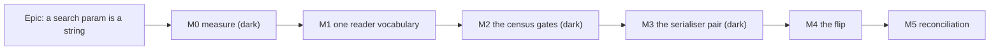

# Implementation Plan: A search param is a string, and the URL says so

- **Feature spec:** [`./feature-spec.md`](./feature-spec.md) — **not yet approved**
- **Status:** Draft — awaiting approval
- **Owner:** unassigned

> **Nothing in this plan is written yet, and one thing in it is deliberately not sized: M4 is
> atomic.** `parseSearch` is a router-level option (`router.js:634-635`) — there is no per-route
> form of it — so the flip cannot be sliced. Every other milestone exists to make that single commit
> reviewable: M0 records what the current pair does, M2 makes every route's answer visible in a
> suite, M3 lands the replacement dark. The M4 diff is then one line of source plus a set of
> expected-value changes, each predicted in advance by M3.

## Breakdown

### Epic

**A search param is a string, and the URL says so** — close `docs/TECH_DEBT.md` #96 by deciding the
shape of a search value once, at the router, instead of eighteen times at the readers. Roadmap
theme: none; this is debt repayment, and the ADR takes a `scripts/adr-coverage.json` exemption
unless the reviewer judges otherwise.

---

## Milestone 0 — Measure, and pin the present behaviour

**Outcome:** the two unverified claims the spec rests on are settled, and today's answers are
recorded as the before/after oracle.
**Ships dark:** nothing is reachable — this milestone adds tests, a probe and register entries only.
No product code changes.
**Journey:** none new. M0-T2 adds one case to an existing suite (`e2e-library`) and one to the base
journey; both are probes, not capability claims.

> **The falsification condition is committed before the probe runs, in its own commit.** If the
> address bar shows no `%22` after a sign-out and after a numeric library search, symptom (b) is
> **withdrawn in place** — the spec's §1(b), CQ-1 and half of D1's motivation go with it, and the
> epic is re-scoped to M1 alone. Writing the condition first is the only thing that stops a
> measurement being read as whatever result arrives (ADR-0090's recorded failure, and ADR-0097
> Landing C's harness reporting a PROCEED off a 37-pixel plan name).

#### Feature: the characterisation oracle

> **Description:** a suite that records, for every one of the 18 params and every value shape in the
> spec's corruption table, what the **real** `defaultParseSearch` and `defaultStringifySearch` do
> today.
> **Complexity:** M
> **Dependencies:** none
> **Risks:** writing it against the mechanism the docblocks describe rather than against the code →
> it composes the library's real functions and asserts observed output; no expected value is written
> from reasoning.
> **Testing requirements:** it _is_ the test. Its value is that M4's diff is legible.

##### Task M0-T1 — `router-search.characterisation.test.ts`

- **Description:** a table-driven suite over `defaultParseSearch` / `defaultStringifySearch`,
  covering: the nine value shapes; the round trip in both directions; the eight route validators;
  and the four reader helpers downstream of them.
- **Complexity:** M
- **Dependencies:** none
- **Risks:** it duplicates `router-search.test.ts` → it does not: that suite asserts **intent** (the
  behaviours we want) and this one records **fact** (what the library does). M4 changes this file
  heavily and that file barely; if the reverse happens, the design is wrong.
- **Testing:** `pnpm --filter @repo/web test`
- **Development steps:**
  1. Assert the two coercion mechanisms separately, because they are separate and three docblocks
     say they are one: `?verified=1`, `?x=true`, `?x=false` are coerced by `toValue`
     (`qss.js:41-46`) with `JSON.parse` never consulted, and `?x=null`, `?x=[1,2]`,
     `?token=<32 digits>` by `JSON.parse` (`searchParams.js:18-30`, whose `catch` keeps the raw
     string). This is finding F1 turned into an executable assertion.
  2. Assert the stringifier's two paths (`searchParams.js:43-62`): the `jsonStart` fast path leaves
     `name:asc` alone, and the re-quoting path writes `'true'` as `"true"` and `'2026'` as `"2026"`.
  3. Assert the merge: a validator that returns `{}` for a key does **not** remove that key from
     what a consumer sees (`router.js:685-696`, `useSearch.js:21-23`) — the fact the spec's F5 turns
     on, and which nothing in the repository currently pins.
  4. Assert the round trip is value-preserving for every value the app itself writes, and **not**
     value-preserving for the all-digit token — the limit `router-search.test.ts:71-85` already
     pins, restated here so the oracle is complete.
  5. Record in the docblock that this file is expected to change at M4, and which assertions.

##### Task M0-T2 — the browser probe, with its verdict rule committed first

- **Description:** two cases that read the **address bar** rather than a component: after a sign-out,
  and after typing `2026` into the calendars search field.
- **Complexity:** S
- **Dependencies:** M0-T1 (not strictly, but the expected values come from it)
- **Risks:**
  - The base journey's `signOut()` helper has a recorded history of a locator that matched nothing
    (ADR-0077 M8 — never noticed, because nothing had ever called it). → assert the resulting
    heading before reading the URL, so a helper that did not sign out fails as a sign-out failure
    rather than as a URL result.
  - `reuseExistingServer` is true outside CI, so a server left over from another suite silently
    supplies another suite's flags (ADR-0099's three consecutive false diagnoses). → run through
    `scripts/e2e-local.sh`, which refuses to start while anything answers on 3000 or 5173.
- **Testing:** `scripts/e2e-local.sh web:library` and `scripts/e2e-local.sh web`
- **Development steps:**
  1. Commit the verdict rule **first, in its own commit**: "if either URL contains no `%22`, symptom
     (b) is withdrawn and the spec is amended in place rather than deleted."
  2. Add the library case: type `2026`, poll `new URL(page.url()).searchParams` and record the raw
     query string, not the decoded value — the decoded value hides the quoting.
  3. Add the sign-out case to the base journey, asserting the signed-out banner first.
  4. Record both results in `docs/specs/router-search-params/m0-measurement.md`, including the
     verdict against the rule. If the rule falsifies, stop and re-scope.

##### Task M0-T3 — register the dependency citations

- **Description:** 14 entries in `scripts/dependency-claims.json` for the `@tanstack/router-core`,
  `@tanstack/react-router` and `better-auth` internals this spec's decisions rest on.
- **Complexity:** S
- **Dependencies:** none
- **Risks:** the anchors were transcribed rather than read → each was copied from the file at the
  cited line in this session; `pnpm check:claims` proves it, and **that command has not been run**
  (no shell) — M0-T3's definition of done is that it has.
- **Testing:** `pnpm check:claims`
- **Development steps:**
  1. Run `pnpm check:claims`; fix any anchor it rejects by re-reading, never by loosening the anchor.
  2. Note the intended consequence in the epic's ADR: a bump of either TanStack package now fails CI
     and forces these thirteen citations to be re-read, which is exactly when they need it.

---

## Milestone 1 — One reader vocabulary

**Outcome:** every search reader in the app coerces the same way, and a hand-typed `?q=2026` filters
the library instead of silently doing nothing.
**Entry point:** the **Search** field on `/orgs/:orgSlug/calendars` and `/orgs/:orgSlug/resources`,
and any pasted or typed URL carrying `?q=`. The visible change is that a numeric, `true`, `false`,
`null` or `[…]`-shaped search term typed into the URL now reaches the search box.
**Journey:** `apps/web/e2e-library/library.spec.ts` gains one case that navigates to
`…/calendars?q=2026` and asserts the search field holds `2026` and the table is filtered — the only
place that can be checked, because the unit tests hand the reader a literal and never cross the
parser.

> **This milestone is worth shipping even if M2–M5 are declined.** It closes the four-helper split
> without touching the router, so it is the safe half of the epic and it lands first for that reason.

#### Feature: `searchString`, one spelling of one rule

> **Description:** one exported `searchString(value: unknown): string | undefined` replaces
> `readForeignParam` (`app/router.tsx:75-79`), `asSearchString`
> (`features/gantt/model/gantt-view-state.ts:104-109`) and the bare `typeof` tests inside `pickText`
> / `pickParam` (`hooks/use-url-filter-state.ts:65-81`) and `asString` / `asIsoDate`
> (`features/audit/model/audit-filter.ts:115-123`).
> **Complexity:** M
> **Dependencies:** M0-T1 (the oracle)
> **Risks:** a behaviour change nobody asked for. Coercing `scope`/`archived`/`kind`/`outcome` is a
> **no-op** — their vocabularies contain no JSON-parseable member, so a coerced value still fails
> the `allowed` check and still falls back. The only behaviour that changes is `q`, and that is the
> point. → the oracle pins the no-op claim for each enum param rather than asserting it in prose.
> **Testing requirements:** unit (the helper, exhaustively over the corruption table); the existing
> reader suites unchanged as the before/after oracle; one journey case.

##### Task M1-T1 — the helper, and its four call sites

- **Complexity:** M
- **Dependencies:** M0-T1
- **Risks:** `readForeignParam`'s docblock is 25 lines and load-bearing; losing it would lose the
  record of the defect → it moves with the function, and the mechanism half is corrected (F1) in the
  same edit.
- **Testing:** `pnpm --filter @repo/web test`; every pre-existing reader suite must pass
  **unchanged** — that is the acceptance condition, on the ADR-0078 barrel-preserving argument.
- **Development steps:**
  1. Add `apps/web/src/lib/router/search-string.ts` with the array case (`asSearchString` handles a
     one-element array; `readForeignParam` does not — the two disagree today, and the union is
     correct: a repeated param should not be silently dropped).
  2. Re-point the four helpers at it; keep every existing export name and signature so no consumer
     changes.
  3. Delete the three private copies.
  4. Correct `app/router.tsx:468-470` — the invitation token is **43 characters of base64url**
     (`apps/api/src/common/tokens/token.ts:16`), not 64 of hex; 64-char hex is the hash, which never
     leaves the database. The conclusion is unchanged and the premise was false (spec F6).

##### Task M1-T2 — the journey case

- **Complexity:** S
- **Dependencies:** M1-T1
- **Risks:** asserting on the table rather than on the field would pass against a screen that
  filtered but showed an empty search box → assert both.
- **Testing:** `scripts/e2e-local.sh web:library`
- **Development steps:**
  1. Navigate to `…/calendars?q=2026`; assert the field's value and the filtered result count.
  2. Add the negative control: `?q=notacalendar` shows the empty state — so a green run cannot mean
     "the filter is ignored".

---

## Milestone 2 — The census gates

**Outcome:** a route or a consumer that reads search params without a real-parser case fails
`pnpm test`, naming itself.
**Ships dark:** a gate is not a user capability. Nothing on any screen changes.
**Journey:** none. A gate that needed a browser to prove it would be a journey, not a gate.

#### Feature: Gate A — the route census

> **Description:** enumerate `router.routesByPath` and fail when a route declaring `validateSearch`
> has no case that composes the real parser with that route's real validator.
> **Complexity:** M
> **Dependencies:** M0-T1
> **Risks:** the three named in the spec — a flag-off route silently leaving the census, no proof
> the case exercises the right params, and passing against an empty census.
> **Testing requirements:** verified red three ways before it is trusted (ADR-0110).

##### Task M2-T1 — Gate A

- **Complexity:** M
- **Dependencies:** M0-T1
- **Risks:** see above.
- **Testing:** verified red by (a) deleting one route's case, (b) adding a route with a validator and
  no case, (c) turning a flag off and confirming the count assertion fires rather than the census
  quietly shrinking.
- **Development steps:**
  1. Mock **every** route-gating flag on (`PASSWORD_RESET_ENABLED`, `RESOURCES_ENABLED`,
     `AUDIT_LOG_ENABLED`, `ACCOUNT_SETTINGS_ENABLED`, `GUEST_SHARE_LINKS_ENABLED`) — extending the
     single mock `router-search.test.ts:11-14` already carries, for the reason its comment already
     gives.
  2. Assert the **absolute route count** and the presence of each flag-gated path, so a flag change
     fails loudly instead of shrinking the census. This is the assertion that catches the
     TECH_DEBT #178/#181/#183 shape — a rule going quiet rather than wrong.
  3. Assert the pinned positive case: the set of covered paths is non-empty and contains the eight
     known ones. Without it, "every route with a validator has a case" passes against a census that
     found no routes — ADR-0093's lesson, which ADR-0108's own census failed on its first run.
  4. Write the two blind spots into the docblock: it cannot check the case exercises the right
     params, and it says nothing about the seven undeclared ones (that is Gate B).

##### Task M2-T2 — the missing cases, against today's behaviour

- **Description:** bring `router-search.test.ts` from three routes to eight, and add cases for the
  seven undeclared params through the merge (`router.js:795-798`, `router.js:685-696`).
- **Complexity:** M
- **Dependencies:** M2-T1
- **Risks:** writing the cases against the behaviour we _want_ rather than the behaviour we _have_
  would make M4's diff meaningless → they assert today's answers, including the ones M4 will change.
  Each such case carries a `// M4 changes this to …` comment, so the flip's diff is pre-reviewed.
- **Testing:** `pnpm --filter @repo/web test`

##### Task M2-T3 — Gate B, the consumer census

- **Description:** a source census over `useSearch(`, `pickText(`, `pickParam(` and the reader
  modules, on the `unsaved-work-census.structural.test.ts` pattern: registered, or excluded with a
  written reason.
- **Complexity:** S
- **Dependencies:** M2-T2
- **Risks:** the glob matching nothing (that census's own first-run failure, and the reason its
  positive case exists) → pin the seven known consumers positively.
- **Testing:** verified red by adding an unclassified `useSearch` call site.

---

## Milestone 3 — The serialiser pair, pure and unwired

**Outcome:** `parseSearchStrings` and `stringifySearchStrings` exist, are exhaustively tested, and
are wired to nothing.
**Ships dark:** deliberately. The module is exported and imported by its own suite only; the
router still uses the library defaults.
**Journey:** none — there is nothing to press.

#### Feature: `lib/router/search-params.ts`

> **Description:** two pure functions, no React, no router import.
> **Complexity:** M
> **Dependencies:** M0-T1, M2-T2
> **Risks:** re-deriving `decode`'s edge behaviour by memory. → each is read from `qss.js:25-32` /
> `qss.js:55-65` and asserted against the library's own function in the same suite, so a divergence
> we did not choose fails.
> **Testing requirements:** unit, including a **property**: for every string in a generated corpus,
> `parse(stringify({ k: v })).k === v`. A table of examples is what let the library's own asymmetry
> survive; the property is what makes D1 checkable rather than argued.

##### Task M3-T1 — the two functions

- **Complexity:** M
- **Dependencies:** M0-T1
- **Risks:** silently changing encoding as well as typing → the suite asserts, for every value the
  app itself writes, that the emitted query string is **byte-identical to today's**, so the only
  intended differences are the quoted ones.
- **Testing:** `pnpm --filter @repo/web test`
- **Development steps:**
  1. `parseSearchStrings(search: string)`: strip a leading `?`, `new URLSearchParams`, first value
     per key (D3), return a null-prototype object (D8) so `'x' in search` keeps working at
     `verify-email.tsx:66-68`, `reset-password.tsx:41` and `accept-invite.tsx:33`.
  2. `stringifySearchStrings(search)`: skip `undefined`, `String(v)` otherwise, `URLSearchParams`
     out, `''` when empty. Development-time error for an object or array (D9), with the production
     path still producing something rather than throwing mid-navigation.
  3. The property test, and an explicit corpus of the nine shapes from the corruption table.
  4. A differential case: for each of the 18 params' realistic values, record where the new pair and
     the library pair **agree** and where they differ. That list is M4's expected diff, written
     before M4 exists.

---

## Milestone 4 — The flip

**Outcome:** every URL in the product carries the value it was given, and every reader receives a
string.
**Entry point:** every URL — specifically the calendars/resources search and filters, the audit
log's four filters, the Gantt's `?view=`/`?gsort=`/`?ghide=`/`?gcollapsed=`, and the four public
account routes. The visible change a planner can point at: the address bar after a sign-out reads
`?signedOut=true`, and a numeric library search reads `?q=2026`.
**Journey:** the **full sweep** (`scripts/e2e-sweep.sh`) — this changes the serialisation every
navigation in every journey passes through, which is that script's own stated trigger — plus the
twelve suites named in the spec §3, run individually first so a failure is legible.

#### Feature: two router options

> **Description:** `createRouter({ …, parseSearch, stringifySearch })` at `app/router.tsx:518`.
> **Complexity:** S to write, L to verify. That asymmetry is the milestone.
> **Dependencies:** M0, M2, M3
> **Risks:**
>
> - **Atomic by construction** (`router.js:634-635`) → mitigated by M0's oracle, M2's per-route
>   cases, M3's predicted diff, the full sweep, and a one-line revert.
> - **`parseLocation` re-stringifies on every navigation** (`router.js:183-194`), so a mistake in
>   either function shows up as a URL that rewrites itself → the property test in M3, plus a journey
>   assertion that a URL is stable across a reload.
> - **`useBlocker` calls `router.options.parseSearch` directly** (`useBlocker.js:59-65`) → `e2e-unsaved-work`
>   is in the named list.
> - **A stale bookmark degrades** (D4) → accepted, stated in the ADR's negative consequences, and
>   trivially self-healing.
>
> **Testing requirements:** the M0 oracle's expected values change in exactly the places M3-T1 step
> 4 predicted, and nowhere else. Any unpredicted change stops the milestone.

##### Task M4-T1 — wire the pair

- **Complexity:** S
- **Dependencies:** M3-T1
- **Testing:** `pnpm prepush`, then every named suite, then the sweep.
- **Development steps:**
  1. Add the two options. One line each.
  2. Update the M0 characterisation suite; **every changed expectation is a separate, commented
     line naming the predicted reason**. An expectation changed without a prediction is a defect,
     not a rebaseline — the ADR-0106 rule about auditing a golden re-baseline line by line rather
     than taking it with `-u`.
  3. Re-run each of the twelve named suites individually.
  4. Run `scripts/e2e-sweep.sh` and record the result in the milestone note, including suites that
     were already failing before the change (so the sweep's output is a comparison rather than a
     verdict).

##### Task M4-T2 — the coercion branches become unreachable, and stay

- **Complexity:** S
- **Dependencies:** M4-T1
- **Risks:** deleting them looks like tidying and removes the rollback contract → they stay, with a
  comment saying why, and the unit cases that cover them stay too.
- **Testing:** unchanged suites.

---

## Milestone 5 — Reconciliation

**Outcome:** every document that describes this mechanism describes it correctly, and the register
row is closed rather than left reading as owed work.
**Ships dark:** documentation and registers only.
**Journey:** none.

##### Task M5-T1 — the three docblocks that are half-wrong

- **Description:** `app/router.tsx:52-74`, `app/router-search.test.ts:16-30` and
  `features/gantt/model/gantt-view-state.ts:19-29` each attribute the coercion to `JSON.parse`
  alone. Each names `toValue` (`qss.js:41-46`) as well, or the epic leaves behind the confident,
  plausible, wrong prose it was written to remove.
- **Complexity:** S
- **Testing:** `pnpm check:doc-links`, `pnpm check:claims`

##### Task M5-T2 — the ADR

- **Description:** file ADR-0122 (re-check the number at filing — ADR-0071 and ADR-0079 both record
  one being taken in between), add it to `docs/adr/README.md` and either `docs/ROADMAP.md` or
  `scripts/adr-coverage.json` with a reason; add the register entry to `CLAUDE.md` §16.
- **Complexity:** M
- **Testing:** `pnpm check:adr-coverage` (which since ADR-0110 D6 checks the index in both
  directions), `pnpm prepush`

##### Task M5-T3 — the register

- **Description:** close #96 with what was found, not just what changed — the two count corrections
  (F3, F4), the mechanism correction (F1), and the fact that the row's own proposed remedy would not
  have worked. Open a new row for `/forgot-password?email=`: specified at
  `docs/specs/account-security/feature-spec.md:805`, read at `routes/forgot-password.tsx:30`,
  written by nothing in `apps/web/src` or `apps/api/src`.
- **Complexity:** S
- **Risks:** closing #96 while leaving its symptom text in place, which is the drift #95 records
  being caught doing → the problem statement goes to `git log`, not under a "closed" header.
- **Testing:** `pnpm check:debt-status`

##### Task M5-T4 — the standing rule, where the next author will meet it

- **Description:** one paragraph in `docs/FRONTEND_ARCHITECTURE.md` under URL state: a search param
  is a `string`; readers are total; the shape is decided at the router and nowhere else; a new route
  with `validateSearch` needs a case or Gate A fails.
- **Complexity:** S

---

## Sequencing & slices

| Slice | Ships                              | Reversible by       | Blocks  |
| ----- | ---------------------------------- | ------------------- | ------- |
| M0    | tests + a probe + register entries | deleting files      | nothing |
| M1    | one helper, four call sites        | revert              | nothing |
| M2    | two gates + five new route cases   | revert              | nothing |
| M3    | one pure module                    | revert              | nothing |
| M4    | **two lines**                      | revert of two lines | —       |
| M5    | documents                          | —                   | —       |

`main` is releasable after every one. M0–M3 are behaviourally inert except M1's deliberate `?q=`
improvement. **No feature flag** (D7): a `VITE_` constant is inlined at build time and is not an
operator rollback (ADR-0088 D1); the two-line revert is smaller and honest.

**If CQ-1 falsifies at M0-T2**, the sequence stops after M1 and M5, and M2's gates are kept — they
are worth having under either parser.

## Definition of Done (per task)

Each task's PR satisfies the Feature Completion Criteria in [`docs/PROCESS.md`](../../PROCESS.md).
Three additions specific to this epic:

- **`pnpm prepush` is run, not written** — it derives ten `check:*` gates, including
  `check:claims`, which is the one this epic can break (CLAUDE.md §19.8: naming the parts by hand is
  how a gate gets missed, and doing so sent an ADR to CI that `check:adr-coverage` refused).
- **M4 additionally requires the full sweep**, with the before-state recorded.
- **Every new gate is verified red first**, naming the defect it was written for (ADR-0110).

## Risks & assumptions (rollup)

| Risk / assumption                              | Likelihood    | Impact               | Mitigation                                                                                                                                                                                                                                                                      |
| ---------------------------------------------- | ------------- | -------------------- | ------------------------------------------------------------------------------------------------------------------------------------------------------------------------------------------------------------------------------------------------------------------------------- |
| M4 is atomic and touches every URL             | certain       | high                 | M0 oracle, M2 per-route cases, M3 predicted diff, full sweep, two-line revert                                                                                                                                                                                                   |
| Symptom (b) is read-derived, not observed      | —             | scopes the epic      | M0-T2, verdict rule committed first                                                                                                                                                                                                                                             |
| A journey asserts a URL we are about to change | medium        | low                  | `library.spec.ts:69,130` and `view-state.spec.ts:61` were read; none of those three values is quoted today (`scope=all`, `archived=include`, `gsort=name:asc` all miss `jsonStart`), so all three should be unchanged — **predicted, not verified**, and M4-T1 step 3 checks it |
| A stale bookmark degrades                      | certain, rare | very low             | D4, accepted and stated                                                                                                                                                                                                                                                         |
| Gate A goes quiet when a flag is off           | medium        | high (a silent gate) | M2-T1 steps 1–3, verified red                                                                                                                                                                                                                                                   |
| A repeated param changes meaning               | low           | low                  | D3, documented; today's behaviour is "fall to the default", which nobody depends on                                                                                                                                                                                             |
| An undeclared param (7 of 18) is forgotten     | medium        | medium               | Gate B; the merge behaviour is pinned by M0-T1 step 3                                                                                                                                                                                                                           |
| `generateId`'s alphabet was not established    | —             | none                 | two copies of `@better-auth/core` are installed, so the register cannot name one; immaterial — every candidate alphabet contains letters                                                                                                                                        |
| The library is bumped mid-epic                 | low           | medium               | `pnpm check:claims` fails on the bump and forces a re-read, which is the intended cost                                                                                                                                                                                          |
