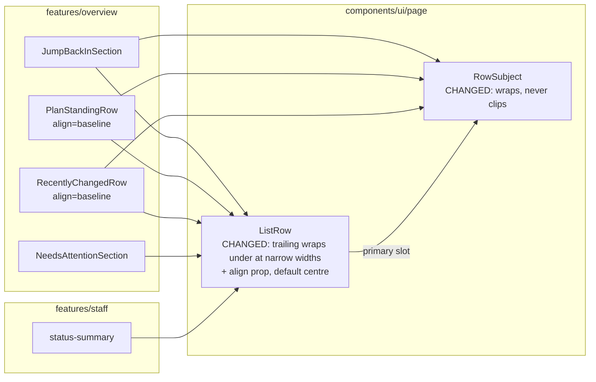
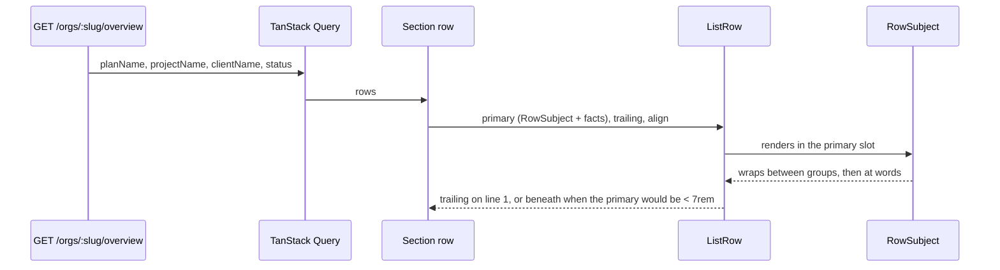
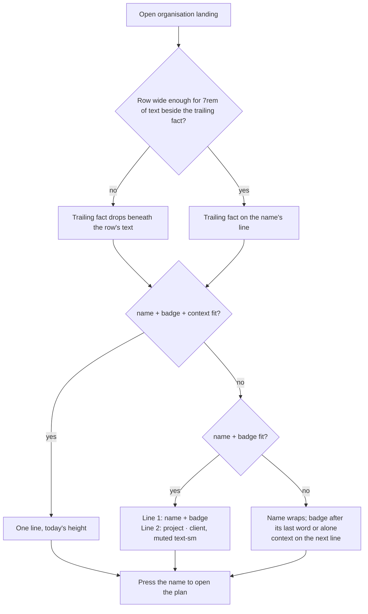

# Feature Spec: A row's subject wraps rather than clips (#472)

- **Status:** Approved 2026-10-09 by the product owner, after the M0-T3 photographs: CQ-1 yes (build the wrap design, readable rows over compact rows), CQ-2 yes (ADR-0184), CQ-3 yes (`ListRow`'s trailing text drops beneath the row's text when the row is very narrow; `ListRow` is in scope). Approved for build: M1 and M2.
- **Author(s):** feature-analyst
- **Date:** 2026-10-09 (drafted, reviewed by UX / accessibility / component, M0 measured, approved)
- **Tracking issue / epic:** `docs/TECH_DEBT.md` #472; raised by landing-two-columns M0
  (`docs/specs/landing-two-columns/m0-measurement.md` §3) and ADR-0182 D2 / Consequences
- **Roadmap link:** ADR-0179 follow-ups ("Next in line")
- **Related ADR(s):** ADR-0146 D3/D4 (**extended** here from table columns and row facts to list
  rows), ADR-0182 (the split, untouched), ADR-0179 (the 1024 × 600 floor; the narrow-screen notice),
  ADR-0105 (why this is a spec), ADR-0110 (a gate is verified against the defect it names), ADR-0113
  (measure the problem first). **New: ADR-0184 — "A row's subject wraps; it never clips"** (§4.8),
  written in M2.
- **Evidence:** [`m0-measurement.md`](./m0-measurement.md) (today's tree), [`m0-prototype.md`](./m0-prototype.md)
  (the uncommitted prototype), [`photos/`](./photos/), raw runs `m0-raw-*.md`. Build `web 0.183.1 · api 0.88.1`.

## 1. Business understanding

### Problem

On the organisation landing, "Jump back in", "Where the work stands" and "Recently changed" render
each plan as `name [Draft] project · client` on **one line**, and whatever does not fit is cut off
with an ellipsis, mid-word — **the plan name included**. A planner cannot tell which programme a row
is, and plans sharing a prefix are indistinguishable.

**Measured on today's tree (M0, `m0-measurement.md` §1–2, Explorer at 276 px):**

| Cell        | Names clipped (of 17) | Contexts clipped | Example                                                                         |
| ----------- | --------------------: | ---------------: | ------------------------------------------------------------------------------- |
| 1024 × 600  |                **16** |               16 | `NetPoint reference: power-plant programme` shows 30 of 38 non-space characters |
| 1280 × 800  |                     6 |                6 | long names only                                                                 |
| 1465 × 900  |                     3 |                3 | the widest one-column window; ordinary rows whole                               |
| 1477 × 900  |                    17 |               17 | every row                                                                       |
| 1646 × 1000 |                    16 |               16 |                                                                                 |
| 1912 × 948  |                **11** |               11 | `Dockside — Ancillary works 6` **loses its `6`** in "Recently changed"          |
| 1912 × 1114 |                    11 |               11 |                                                                                 |

The product owner's examples are both **names**: `NetPoint reference: power-plan…` is the seeded plan
`NetPoint reference: power-plant programme` (`apps/seed-cli/src/references/netpoint-power-plant.ts:112`),
and `EDF - Hynamics Proposal` is his own programme's name. (In M0's fixture the long names share a
76-character project · client, which is what clips them; `Dockside — Ancillary works 6` beside the
short 39-character pair is the clean case, `m0-measurement.md:58-63`.)

**Why nobody counted the names.** `measure-overview.mjs` counted a run as truncated only when the
text node's direct parent had `text-overflow: ellipsis` (`apps/web/scripts/measure-overview.mjs:449-453`).
A name's text sits in the router `<a>` inside the truncating span, so the old instrument's count equals
the **context** count in every M0 cell and contains no name (`m0-measurement.md:30-31`). The new probe
(`apps/web/scripts/row-subject-probe.mjs`, §4.6) reads glyph rects.

**Why it truncates.** `RowSubject` (`apps/web/src/components/ui/page/list-row.tsx:50-60`) is one flex
line: name `min-w-0 shrink truncate`, badge, context `min-w-0 shrink-[3] truncate`. Flexbox shares an
overflow in proportion to **flex-shrink × flex base size**, so the name loses
`W_name / (W_name + 3·W_context)` of every overflow. The docblock's "a row's name must survive"
(`list-row.tsx:42-48`) is false, and the unit test that guards it (`page-archetypes.test.tsx:381-395`)
asserts a class string, not the behaviour — green against the defect it names (ADR-0110).

**Why it was built like this.** M9 D1 (`docs/specs/organisation-landing-portfolio/m9-density-design.md:32-49`,
approved 2026-09-16) merged two lines into one to save 20 px per row on a landing that did not fit its
window. It assumed "the name survives". It never did.

**A second defect M0 found, which the owner has decided to fix too (CQ-3).** At 320 px — the WCAG
1.4.10 reflow width — `ListRow`'s `shrink-0` trailing block (`Ada Lovelace · just now`,
`No finish date yet`) leaves the name **6 characters** in "Recently changed" and **10** in "Where the
work stands" (`m0-measurement.md` §4). The prototype's wrapping does not touch it: still 6
(`m0-prototype.md:79-80`). At 200 % text the name keeps 25 characters (1280) and 57 (1912), so this is
a narrow-width defect only.

### Users

Every role that reaches the landing — **Org Admin, Planner, Contributor, Viewer** (ADR-0016); nothing
here is role-dependent. External Guests never see the landing (ADR-0051). Staff see `ListRow` in the
staff console's status summary (ADR-0086), where only the narrow-width behaviour reaches them (§4.7).

### Primary use cases

1. Find "the plan I was in" in "Jump back in" by its full name.
2. Tell which programme a "Recently changed" or "Where the work stands" row is, with project and
   client, without opening it.
3. Distinguish plans whose names share a long prefix.
4. Read a row at 320 px (reflow) with a usable name width.

### User journeys

Open the organisation → every word of each plan's name, its Draft badge, its project and client is on
screen: one line when the box is wide enough, more when it is not → the date or "actor · time" sits
on the name's line; on a very narrow screen it drops beneath the row's text → press the name. §4.3.

### Expected outcomes

No plan, project or client name in those three boxes is cut off at any width. Rows that fit stay one
line at today's height. The cost — measured, shown to the owner, accepted — is height in the capped
two-column boxes.

### Success criteria

Read in Chromium by `measure-overview.mjs` (`SP_ROW_SUBJECT=1`) with `row-subject-probe.mjs` on the M0
fixture (`landing-fixture.mjs` `seedLongNames`), at the M0 cells: **1024 × 600, 1280 × 800, 1465 × 900,
1477 × 900, 1646 × 1000, 1912 × 948, 1912 × 1114, 320 × 800**, the 200 % injections at 1280 × 800 and
1912 × 948, and the text-spacing injections at 1280, 1477 and 1912; Explorer at its default. Baselines
are M0's (today) and M0-T3's (prototype); M2's figures are compared against both.

- **SC-1 — nothing in a `RowSubject` is clipped.** The probe reports **0 names, 0 contexts, 0 ellipses
  in every cell and injection** (prototype: 0 / 0 / 0 everywhere, `m0-prototype.md:26-28`; today: up to
  17 / 17). The probe also reads every `ListRow` **trailing** block's text: 0 clipped.
- **SC-2 — the probe is non-vacuous, before and after.**
  - _Before_ (passed in M0): on today's tree it reports names clipped at 1912 × 948 (11), including
    `Dockside — Ancillary works 6`.
  - _After_: a 32 × `W` token (~400 px; a bare empty box has no glyph rects for the probe to read) is
    injected into one **unclipped** context and must be reported clipped. On the shipped tree it runs
    at **320 × 800** (prototype: 60 of 71 characters shown after, PASS) **and** at 1280 × 800 (today: 66
    of 71, PASS). Silent at either → no reading after it is believed.
- **SC-3 — the default look at or above the supported floor is unchanged where nothing needs to wrap.**
  - At 1280 × 800 every row whose subject fits is the **same height** as today (prototype: ordinary
    rows 61/60 px before and after, "Jump back in" 40/40, `m0-prototype.md:30-31`).
  - At **every cell ≥ 1024 wide**, in every `ListRow` consumer measured (the three landing boxes and
    "Needs your attention"; the staff status summary in its own journey, §4.7), **the trailing block
    shares the primary block's first line** (its rect's vertical centre lies within the primary's
    first line box) — i.e. the narrow-width drop (CQ-3) never fires at or above the floor.
  - `NeedsAttentionSection` rows (no trailing) are pixel-identical in height to today.
- **SC-4 — a row grows by whole lines.** Every `RowSubject` row's height is `base + k × 20 px`
  (prototype: 40/60/80/100 and 61/81/101/125, no vertical gap, `m0-prototype.md:33-34`).
- **SC-5 — the height cost is no worse than the prototype the owner approved, and nothing is cut to
  pay for it.** This replaces the draft's "≥ 4 whole rows at 1646 × 1000", whose baseline was wrong:
  M9.4's 6 rows in 517 px predates ADR-0182, and **today is already 3 whole rows in a 334 px box**; at
  1912 × 948 the boxes are **282 px, not the 220 px floor**, holding **3** (`m0-measurement.md` §3).
  Acceptance, per bottom box ("Where the work stands", "Recently changed"):

  | Cell                   | Today (M0) | Prototype (approved) | Acceptance (M2)                      |
  | ---------------------- | ---------: | -------------------: | ------------------------------------ |
  | 1646 × 1000            |    3 and 3 |          **2 and 2** | ≥ 2 and ≥ 2 whole rows               |
  | 1912 × 948             |    3 and 3 |          **1 and 1** | ≥ 1 and ≥ 1                          |
  | 1912 × 1114            |    5 and 5 |              3 and 3 | ≥ 3 and ≥ 3                          |
  | + 200 + 200 + 200 plan |          — |              0 and 0 | recorded, accepted (the box scrolls) |

  plus: `<main>` does not scroll at 1646 × 1000 (949/949) or 1912 × 948 (897/897); box heights are
  unchanged from today (334 / 282 / 448 px); SC-1 holds. **The named remedies — raise the `min-h-55`
  floor, or rebalance the rows (`PageGrid rows="fit-then-fill"`) — are applied only if the product
  owner asks.** Never re-truncate, never `line-clamp`.
  The 200-character plan is a 253–297 px row in a 282–334 px box (`m0-prototype.md:63-64`): under one
  whole row, the box body scrolls with its stated count, and this is **recorded as accepted** for a
  pathological name, per the rule written before M0.

- **SC-6 — reflow and text resize.** Reflow: 320 × 800 as the 1280-at-400 % proxy ("320 CSS pixels is
  equivalent to a starting viewport width of 1280 CSS pixels wide at 400% zoom", Understanding 1.4.10,
  Note 1, read 2026-10-09). Text resize: `html { font-size: 200% }` injected (rem-based type and
  spacing double; ADR-0182's rem container query re-evaluates so the landing goes one column;
  viewport media queries in rem do not move, because Media Queries resolve relative units against the
  initial font size; text-only zoom is not scriptable headless, so this is a labelled proxy). At both:
  document `overflow-x` 0 (today: 0); every `SectionCard fill` body `scrollWidth <= clientWidth`
  (prototype: PASS); SC-1 holds.
- **SC-7 — the journey drives it.** `e2e-overview` runs **the same probe** at 1477 × 900 and
  1912 × 948 on a seeded 57-character name; runs SC-2's after-control at 320 × 800; asserts reading
  order from rects (name before badge before context: same line → left ascending, else top
  ascending), matching DOM order; and at 320 × 800 asserts SC-9.
- **SC-8 — text spacing (1.4.12).** With `* { line-height: 1.5 !important; letter-spacing: 0.12em
!important; word-spacing: 0.16em !important } p { margin-bottom: 2em !important }` at 1280 × 800,
  1477 × 900 and 1912 × 948: SC-1 holds, `overflow-x` 0, no subject's lines overlap each other or the
  next row (rect tops strictly increase). (Prototype: SC-1 PASS under the injection.)
- **SC-9 — the name keeps room at 320 px (CQ-3).** At 320 × 800 the primary block of every row with a
  trailing fact is **≥ 12 characters** wide (primary width ÷ the advance of `0` in the name's font —
  the M0 §4 method), in every box. Today: **6** ("Recently changed") and **10** ("Where the work
  stands"). The trailing text is wholly visible (SC-1 on the trailing block) and sits **beneath** the
  primary block. 200 % at 1280 and 1912 still ≥ 12 (today 25 and 57).

### Open questions

None open. All three critical questions were answered by the product owner on 2026-10-09 after the
photographs:

- **CQ-1 — readable rows over compact rows: YES, build the wrap design.** Accepted cost (measured, not
  estimated): at 1912 × 948 all 8 "Recently changed" rows go to two lines or more (median 61 → 81 px)
  and each bottom box shows 1 whole row instead of 3; at 1646 × 1000, 2 instead of 3; with the
  200-character plan, 0.
- **CQ-2 — ADR-0184: YES.**
- **CQ-3 — the trailing text drops beneath the row's text when the row is very narrow: YES.**
  `ListRow` is in scope (§4.7).

**Decided defaults (unchanged by M0, now confirmed by the photographs):**

- **No line cap.** A 200-character name wraps to as many lines as it needs (10–12 lines measured).
- **The badge belongs to the name group.** It **may land alone** on the line after the name — observed
  at 1646 × 1000 for `Berth 4 Deepening — Dredging and Revetment Works, Stage 2B`, where the name fills
  its column to the last character (`m0-prototype.md:74-76`, `photos/after-1646x1000.png`). Accepted.
- **When it wraps, the whole context moves under the name** (extending ADR-0146 D4).
- **Ragged row heights within a box are accepted.**
- **The trailing fact sits on the name's first line** in the two landing rows that have one
  (`align="baseline"`). In "Where the work stands" this moves `No finish date yet` / `Finishes …` from
  the row's middle to the name's line even where the subject fits (`photos/after-1912x948.png`);
  heights unchanged. Accepted with CQ-1.
- **The screen-reader run-on is fixed** with an `sr-only` ", " before the context.
- **Draft is the only status the API creates** (M0 §6), so the fixture never produced a badge-less
  landing row; the badge-absent case is covered by the unit tripwire and by "Jump back in", which
  renders no badge.
- **No feature flag** (ADR-0088 D1): the rollback is the commit.

## 2. Functional requirements

### User stories & acceptance criteria

> **US-1** — As any organisation member, I want every plan name on the landing shown in full, so that
> I can tell plans apart without opening them.
>
> - **Given** `NetPoint reference: power-plant programme` in "Recently changed" **when** I view the
>   landing at 1912 × 948 with the Explorer open **then** all of it is visible, and the link's
>   accessible name is the full name (unchanged).
> - **Given** a name longer than its column **then** it wraps at word boundaries, breaking inside a word
>   only if a single word is wider than the column.

> **US-2** — As any member, I want a row's project and client shown in full.
>
> - **Given** `name + badge + project · client` fits **then** one line, at today's height.
> - **Given** it does not **then** `project · client` moves to the line under the name, whole, in muted
>   `text-sm`, wrapping at words if it is itself longer than the line.

> **US-3** — As a keyboard or screen-reader user, I want the row read the same way.
>
> - Reading order is name, badge, project · client, then the trailing fact; the name is the row's one
>   link; no `title`, tooltip or extra tab stop.
> - Visual order equals DOM order: no `order-*`, `flex-row-reverse`, `flex-col-reverse` or
>   `flex-wrap-reverse` on `ListRow`, `RowSubject` or their children.
> - A pause is announced between the name (and badge) and the project · client.

> **US-4** — As a member on a very narrow screen (320 px, or a 1280 window at 400 % zoom), I want the
> plan name to have room.
>
> - **Given** a row whose primary text would be left fewer than ~12 characters beside its date or
>   "actor · time" **then** the trailing text moves beneath the row's text, left-aligned, whole.
> - **Given** any width ≥ 1024 px at 100 % **then** the trailing text stays on the name's line, as
>   today.

### Workflows

Render-only. Every value is already in the overview payload (`RecentlyChangedRow.tsx:84-94`,
`PlanStandingRow.tsx:73-83`, `JumpBackInSection.tsx:56-59`).

### Edge cases

| Case                                                        | Expected                                                                                   |
| ----------------------------------------------------------- | ------------------------------------------------------------------------------------------ |
| Everything fits                                             | One line; today's height (SC-3)                                                            |
| Context does not fit beside the name                        | Context on line 2, whole                                                                   |
| Name alone wider than the column                            | Name wraps; badge after its last word, or alone on the next line (accepted); context below |
| Unbroken token wider than the column                        | Breaks anywhere (`wrap-anywhere`, `rowLinkClass`, `list-row.tsx:16`); no overflow          |
| 200-char name, project and client                           | 10–12 lines, 253–297 px; the `fill` body scrolls; accepted                                 |
| No context                                                  | Name only; no separator rendered                                                           |
| No badge                                                    | No space or node after the name                                                            |
| Row with trailing, width ≥ 1024                             | Trailing on the name's first line (landing rows) / centred (staff, default `align`)        |
| Row with trailing, very narrow (primary < 7rem)             | Trailing drops beneath the primary block, left-aligned (CQ-3)                              |
| Row without trailing (`NeedsAttentionSection`)              | Unchanged                                                                                  |
| One-column layout                                           | Boxes size to content (ADR-0182); taller rows lengthen the page scroll                     |
| Two-column capped box                                       | Body scrolls (already a tab stop); count unchanged                                         |
| 320 px with ADR-0179's "designed for larger screens" notice | The landing renders beneath it; SC-9 measured there                                        |

### Permissions

None change. No read or write is added; every value is in the organisation-scoped, role-filtered
overview payload (ADR-0012). Not a structural plan write; the pen (ADR-0028) is not involved.

### Validation rules

None.

### Error scenarios

| Scenario                           | Detection | User-facing result                      | Status |
| ---------------------------------- | --------- | --------------------------------------- | ------ |
| Overview read fails                | unchanged | the existing section error state        | n/a    |
| Name contains no break opportunity | layout    | breaks anywhere rather than overflowing | n/a    |

## 3. Technical analysis

| Area           | Impact | Notes                                                                                                                                                               |
| -------------- | ------ | ------------------------------------------------------------------------------------------------------------------------------------------------------------------- |
| Frontend       | low    | `list-row.tsx`: `RowSubject` (wraps), `ListRow` (wraps its trailing at narrow widths; additive `align`). Two consumers: `align="baseline"`, dead `shrink-0` removed |
| Backend        | none   | —                                                                                                                                                                   |
| Database       | none   | No schema change; database-architect not engaged                                                                                                                    |
| API            | none   | —                                                                                                                                                                   |
| Security       | none   | Render-only of already-authorised data                                                                                                                              |
| Performance    | low    | CSS only; no JS measurement, `ResizeObserver` or re-render                                                                                                          |
| Infrastructure | none   | No new Playwright config or CI step; steps added to existing `e2e-overview` and `e2e-staff` suites                                                                  |
| Observability  | none   | —                                                                                                                                                                   |
| Testing        | med    | Weight on the probe and journeys (real layout); unit suite is a tripwire (jsdom lays nothing out)                                                                   |

**The CPM engine is not imported**; `computeSchedule` is unreachable from anything here, so the recalc
parity gate holds by construction.

### 3.1 Consumers (complete — `grep -rn "RowSubject\|ListRow" apps/web/src`, 2026-10-09)

| Consumer                     | File:line                                                                                                       | Uses              | Trailing                           | Change                                            |
| ---------------------------- | --------------------------------------------------------------------------------------------------------------- | ----------------- | ---------------------------------- | ------------------------------------------------- |
| "Jump back in"               | `JumpBackInSection.tsx:46-62`                                                                                   | ListRow + Subject | none                               | none (inherits)                                   |
| "Where the work stands"      | `PlanStandingRow.tsx:63-182`                                                                                    | ListRow + Subject | finish date / `No finish date yet` | `align="baseline"`; drop badge `shrink-0` (`:78`) |
| "Recently changed"           | `RecentlyChangedRow.tsx:74-106`                                                                                 | ListRow + Subject | actor · relative time              | `align="baseline"`; drop badge `shrink-0` (`:89`) |
| "Needs your attention"       | `NeedsAttentionSection.tsx:58-151`                                                                              | ListRow           | none                               | none; unchanged                                   |
| Staff console status summary | `features/staff/ui/status-summary.tsx:109-122`                                                                  | ListRow           | verdict `Badge`                    | none; default `align`; narrow drop applies (§4.7) |
| Unit tests                   | `page-archetypes.test.tsx:269-290, 363-396`                                                                     | —                 | —                                  | replaced/extended (plan M1-T1)                    |
| Structural roster            | `features/overview/archetypes.structural.test.ts:79-80`; `features/staff/archetypes.structural.test.ts:123-124` | —                 | —                                  | names only; unchanged                             |
| Barrel                       | `components/ui/page/index.ts:25-30`                                                                             | —                 | —                                  | unchanged                                         |

`ListRowSkeleton` (`list-row.tsx:112-129`) has its own markup and is **unchanged and out of scope**:
its two bars did not match the one-line settled row either.

### Dependencies

- landing-two-columns M1 shipped (ADR-0182) — the layout measured.
- M0 landed: `row-subject-probe.mjs`, `measure-overview.mjs` `SP_ROW_SUBJECT=1`, `landing-fixture.mjs`
  `seedLongNames`, the inert `data-row-subject` attribute on `RowSubject`'s `
`.

## 4. Solution design

### 4.1 Architecture overview

### 4.2 Data flow

Unchanged.

### 4.3 User flow

### 4.4 Database changes

None.

### 4.5 API changes

None.

### 4.6 The probe (already built in M0; reused by M2 and the journey)

`apps/web/scripts/row-subject-probe.mjs`: for every text node inside a `[data-row-subject]` (and,
from M1, inside each `ListRow` trailing block), `Range.getClientRects()`, per-line widths as the
**union of intervals** (Chrome returns two rects for a truncated run — the M0 bug, fixed,
`m0-measurement.md:38-40`); each rect compared horizontally with the nearest `overflow-x` ≠ `visible`
ancestor and the viewport (> 0.5 px past = clipped); plus any `text-overflow: ellipsis` in effect.
Characters are **non-space** characters. An inline box's `scrollWidth` is never used (it reads 0 for an
inline `<a>`).

### 4.7 Component changes — the exact contract

#### `RowSubject` (props unchanged: `name`, `context?`, `badge?`)

| Clause            | Today (`list-row.tsx:18-60`)                           | After                                                                                               |
| ----------------- | ------------------------------------------------------ | --------------------------------------------------------------------------------------------------- |
| Lines             | Exactly one                                            | One when it fits; otherwise as many as needed                                                       |
| Truncation        | Name and context `truncate`; context shrinks 3× faster | **None** anywhere in the subject                                                                    |
| Breaks            | n/a                                                    | Between the name group and the context first; then at words; anywhere only for an unbreakable token |
| Badge             | Sibling flex item                                      | Inside the name group, after the name; may start a line alone                                       |
| Height            | One line                                               | `base + k × line`; identical to today when it fits                                                  |
| Order / semantics | name, badge, context; one `
`                        | Same order; one `
`; `sr-only` ", " before the context when present              |

Markup (described; the builder writes it — it matches what M0-T3 prototyped and photographed):

- `
`.
  `gap-y-0` is deliberate: a vertical gap would break SC-4's whole-line steps.
- Child 1, the name group: `{name}{badge ? <>{' '}{badge}</> : null}`
  — the name-to-badge spacing is **one collapsible space, rendered only when there is a badge**; no
  margin utility (a margin would indent a line the badge starts).
- Child 2, only when `context` is given:
  `, {context}`
  — today's colour and size, no truncation. The second line is this span.
- Forbidden on the subject and its children: `truncate`, `text-ellipsis`, `whitespace-nowrap`,
  `overflow-hidden`, `line-clamp-*`, `order-*`, `flex-row-reverse`, `flex-wrap-reverse`.

Docblocks rewritten: the `context` prop ("Muted, and the first thing to be truncated away", `:25`),
the `badge` prop ("Never shrinks", `:27` — describes a flex item that no longer exists), and the
component docblock (`:31-49`): the new rule, why M9 D1 is reversed (ADR-0184), and why the old "name
survives" claim was false.

#### `ListRow` (props: `primary`, `trailing?`, **`align?: 'center' | 'baseline'`**, HTML attributes)

The narrow-width drop is **behaviour, not a prop**: every `ListRow` gets it, and at or above the
supported floor it never fires (SC-3). The `align` prop is the one additive prop, an enum with today's
behaviour as its default, prototyped in M0-T3.

| Element   | Today (`list-row.tsx:88-96`)                                                          | After                                                                                                                                                            |
| --------- | ------------------------------------------------------------------------------------- | ---------------------------------------------------------------------------------------------------------------------------------------------------------------- |
| Container | `border-border flex items-center justify-between gap-4 border-b py-2 last:border-b-0` | `border-border flex flex-wrap justify-between gap-x-4 gap-y-0 border-b py-2 last:border-b-0` + `items-center` (default) or `items-baseline` (`align="baseline"`) |
| Primary   | `
`                                                           | `
` — grows to fill; its **line-breaking size is 7rem** (`flex-basis: 0`, `min-width: 7rem`)                                     |
| Trailing  | `
`                                  | unchanged                                                                                                                                                        |

How it behaves, from the Flexbox line-breaking rule (an item's hypothetical size is its basis clamped
by its min-width): the trailing block stays on line 1 while `row width ≥ 7rem + 1rem gap + trailing
width`. Below that, it wraps to line 2 and `justify-between` places a lone item at the start, so it sits
**beneath the primary block, left-aligned**. 7rem is 112 px at 100 %, ≈ 12.6 advances of `0` at the
measured ~8.9 px (213 px for `Dockside — Ancillary works 6`'s 24 non-space characters); it is rem, so it
scales with text size. It is a spacing-scale step (`min-w-28`), not an arbitrary value, so the sizing
ratchet in `token-architecture.test.ts` admits it.

Note what "beneath" means precisely: `trailing` is a `ListRow` slot, so it drops beneath the **whole
primary block** (the subject, plus the freshness line or the movement and flags), not between the
subject and those lines. Putting it between them would need each consumer to restructure its primary;
that is not what CQ-3 asked for and is not done.

Where the drop fires, derived (M2 measures it): "Recently changed" (`Ada Lovelace · just now` ≈ 160 px)
below a ≈ 290 px row; "Where the work stands" (`No finish date yet` ≈ 125 px) below ≈ 255 px. At the
1024 floor the narrowest track is 699 px (one column) and the narrowest two-column track 564 px, so
it does not fire at or above the floor; at 320 × 800 it does.

Consequences for each consumer at or above the floor:

- **Overview rows:** visually unchanged apart from `align="baseline"` (above) — primary growing to
  fill the line changes no text position, because the text was left-aligned and the trailing block was
  already pushed right by `justify-between`.
- **`NeedsAttentionSection`:** no trailing, so nothing can wrap; unchanged.
- **Staff status summary:** default `align` (centred), trailing on line 1; the one change is that the
  primary now **fills** the line, so its `block` link (`status-summary.tsx:115`) spans up to the
  verdict badge instead of the label's width. No visual change (no background, underline only on
  hover text); a wider hit area, consistent with that component's own "the WHOLE row is the target"
  docblock (`:27-33`). component-reviewer confirms.

`ListRow`'s docblock (`:69-80`) gains: the wrap rule, the 7rem reason (SC-9, CQ-3), and `align`.

**States.** `ListRowSkeleton` unchanged (above). Empty and error states belong to the sections,
untouched.

### 4.8 Implementation approach & alternatives

**Chosen — C: wrap on demand, plus the narrow-width trailing drop.** The only option that fixes name
and context with no JavaScript, keeps today's height where the content fits (SC-3 measured), and was
approved on photographs. It **extends** two decisions rather than citing them as already covering
this: ADR-0146 D3 ("wraps rather than truncating, because a truncated name is a name the reader cannot
read") was for table columns, and D4 ("a fact about a row belongs under that row") for the audit log
and Recently deleted.

| Option                                                   | Name clipped | Context clipped | Height                     | JS  | Verdict                                                                                                                              |
| -------------------------------------------------------- | ------------ | --------------- | -------------------------- | --- | ------------------------------------------------------------------------------------------------------------------------------------ |
| A. Status quo + `title`                                  | yes          | yes             | 1 line                     | no  | Rejected: `title` is invisible to keyboard and touch (`docs/UX_STANDARDS.md` §6)                                                     |
| A2. `useTooltip` on the name link (`tooltip.tsx:163`)    | yes          | yes             | 1 line                     | yes | Rejected: one hover / focus / 500 ms long-press per row defeats scanning a list                                                      |
| A3. Disclosure / popover per row                         | yes          | yes             | 1 line                     | yes | Rejected: an extra tab stop on every row                                                                                             |
| B. Always two lines                                      | no\*         | no\*            | +20 px every row           | no  | Rejected: charges rows that fit; \*still needs wrapping                                                                              |
| B2. Every row in a box two-line when any needs it        | no           | no              | +20 px per row in that box | yes | Rejected: uniformity bought with measurement; ragged heights accepted instead                                                        |
| **C. Wrap on demand**                                    | **no**       | **no**          | +20 px only where needed   | no  | **Chosen (CQ-1)**                                                                                                                    |
| D. One line, name never shrinks, context alone truncates | no           | yes             | 1 line                     | no  | Declined by CQ-1                                                                                                                     |
| E. Middle ellipsis                                       | yes          | yes             | 1 line                     | yes | Rejected: removes the middle, where plans sharing prefix and suffix differ, and breaks left-to-right scanning                        |
| F. Drop the client, then the project                     | no           | drops whole     | 1 line                     | yes | Rejected: facts silently absent (ADR-0127)                                                                                           |
| G. Wider columns / later split                           | yes          | yes             | —                          | no  | Rejected by #472 and ADR-0182 D2: 732 px already fails                                                                               |
| Trailing: a `stackBelow` boolean prop                    | —            | —               | —                          | no  | Rejected for CQ-3: every consumer needs the same narrow behaviour, so a prop is a decision each call site could get wrong            |
| Trailing: a container query on `ListRow`                 | —            | —               | —                          | no  | Rejected: needs `container-type` on every row (layout containment, ADR-0182's own caveat) for what flex-wrap does with one min-width |

**WCAG, as read 2026-10-09.** Understanding 1.4.10 lists as acceptable "The content is presented as
truncated, but a link is provided to a web page where the content is fully visible". F69 (1.4.4) is
"…resizing visually rendered text up to 200 percent causes the text, image or controls to be clipped,
truncated or obscured", with no link exception — and M0 measured that shape on today's tree: 17 of 17
names clipped at 200 % against 6 of 17 at 100 % (`m0-measurement.md:187-188`). accessibility-reviewer
gives the verdict on today's tree in M2; the design removes the truncation either way.

**Row-height ADRs.** ADR-0151 and ADR-0121 govern the diagram's rows; `ListRow` is "deliberately not
a fixed rhythm" (`list-row.tsx:72-79`). ADR-0183 D4 governs touch targets; the name link only grows.

**ADR-0184 outline — "A row's subject wraps; it never clips".**

- _Context:_ M9 D1's one line and its false "name survives" claim; the instrument that could not see
  names; M0's counts (16 of 17 names clipped at 1024, 11 at 1912); the 6-character name at 320 px.
- _Decision:_ D1 `RowSubject` never truncates (extending ADR-0146 D3 to list rows); D2 one line when it
  fits, context under the name when not, no vertical gap (extending D4); D3 the badge belongs to the name
  group and may start a line; D4 `ListRow`'s trailing block drops beneath the primary when the primary
  would be under 7rem — behaviour, not a prop; `align="baseline"` puts a wrapped row's trailing fact on
  the name's line; D5 clipping is measured from glyph rects against the clipping ancestor and viewport,
  with positive controls before and after.
- _Alternatives:_ §4.8's table.
- _Consequences:_ the measured height cost (SC-5 table) accepted by the owner; ragged heights; remedies
  only on request; the class-string test replaced by a tripwire; the staff link's wider hit area.
- One line in CLAUDE.md §16.

## 5. Links

- Implementation plan: [`./implementation-plan.md`](./implementation-plan.md)
- Docs updated by this work (M2): ADR-0184 (new), CLAUDE.md §16 and the stage banner's ADR count
  (`pnpm check:counts`), `docs/TECH_DEBT.md` #472 (deleted and ledgered), `docs/COMPONENT_LIBRARY.md`,
  `docs/DESIGN_SYSTEM.md`, a dated note under M9 D1 in
  `docs/specs/organisation-landing-portfolio/m9-density-design.md`.

## 6. Record

- **2026-10-09, draft.** Reviewed by UX, accessibility and component reviewers; findings folded (the
  probe method, SC-8, the prototype-before-approval step, gaps, badge spacing, trailing alignment,
  alternatives, the skeleton and `data-row-subject` contradictions).
- **2026-10-09, M0.** Two premises corrected: SC-5's baseline (3 whole rows today, not 6; boxes 282 px
  at 1912 × 948, not the 220 px floor) and the scope (decision rule (b) fired: name 6 characters at
  320 px). The SC-2 after-control's cell moved to where it can rise (1280 × 800 on today's tree; 320 on
  the shipped one), and its token became 32 × `W` because a bare empty box has no glyph rect.
- **2026-10-09, approval.** CQ-1, CQ-2, CQ-3 answered yes by the product owner on the photographs;
  SC-5 rewritten against the measured baselines; SC-9 added; `ListRow` brought into scope.
