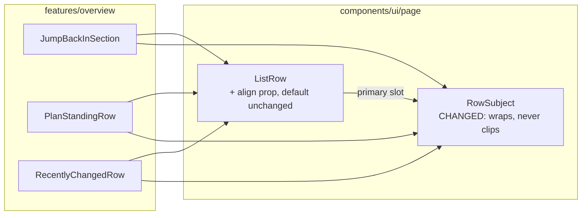
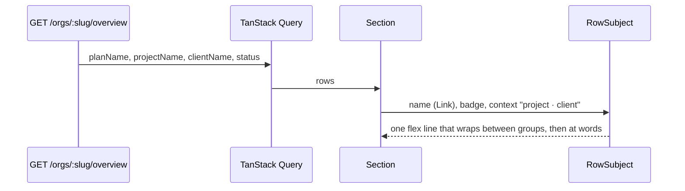
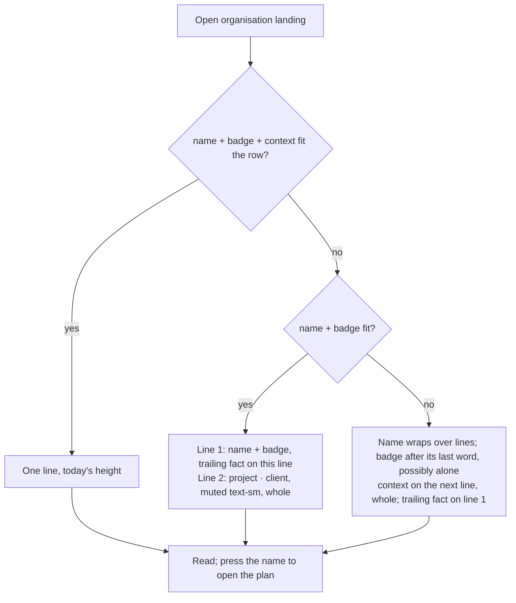

# Feature Spec: A row's subject wraps rather than clips (#472)

- **Status:** Draft — awaiting approval before implementation.
- **Author(s):** feature-analyst
- **Date:** 2026-10-09
- **Tracking issue / epic:** `docs/TECH_DEBT.md` #472 (`:11876-11884`); raised by landing-two-columns
  M0 (`docs/specs/landing-two-columns/m0-measurement.md` §3) and ADR-0182 D2 / Consequences
- **Roadmap link:** ADR-0179 follow-ups ("Next in line")
- **Related ADR(s):** ADR-0146 D3 ("wraps rather than truncating, because a truncated name is a name
  the reader cannot read") and D4 (a fact belongs under its row), ADR-0182 (the split it does not
  touch), ADR-0105 (why this is a spec: a shared component's public contract), ADR-0113 (measure the
  problem first), ADR-0110 (a gate is verified against the defect it names). **A short new ADR is
  required — ADR-0184 (§4.6)**: it reverses an approved design decision (M9 D1, "a row's subject and
  its context share one line") for a shared primitive.

> **Read this first: the problem is bigger than the row that files it, and the instrument that
> filed it cannot see the bigger half.** #472 says the `project · client` **subtitle** is truncated.
> The product owner's two examples are **plan names**, not subtitles: `NetPoint reference:
power-plan…` is the seeded plan `NetPoint reference: power-plant programme`
> (`apps/seed-cli/src/references/netpoint-power-plant.ts:112`, passed as the plan's `name` by
> `capabilityPlan`, `apps/seed-cli/src/capabilities/builders.ts:174`), and `EDF - Hynamics Proposal`
> is the product owner's own programme name (quoted at `apps/web/src/features/tsld/render/a11y.ts:64`).
> And `measure-overview.mjs`, which produced every number #472 and ADR-0182 cite, **counts a run as
> truncated only when the text node's direct parent has `text-overflow: ellipsis`**
> (`apps/web/scripts/measure-overview.mjs:449-453`). The name's text sits inside the router `<a>`,
> whose parent is the truncating `` (`list-row.tsx:53`; `RecentlyChangedRow.tsx:79-85`), so
> **no truncated plan name has ever been counted**. M0's author saw it by eye and wrote it down
> ("the ordinary plan names `Dockside — Ancillary work…` truncate there too",
> `m0-measurement.md:67`); no table carries it. So this spec covers **name and context together**,
> and its first task fixes the instrument.

## 1. Business understanding

### Problem

On the organisation landing, three of the four boxes — "Jump back in", "Where the work stands" and
"Recently changed" — render each plan as `name [Draft] project · client` on **one line**, and
whatever does not fit is cut off with an ellipsis, mid-word. A planner scanning "Recently changed"
cannot tell which programme a row is, and two plans whose names share a prefix
(`Dockside — Ancillary works A…`, `Dockside — Ancillary works B…`) are indistinguishable.

It happens on the product owner's own screen. Recorded today on the current tree (`web 0.182.0`,
`m1-after-run.md:128-151`, Explorer at its default 276 px):

| Window × height | Layout           | Ordinary pair (284 px) shown, "Recently changed" | Long pair (584 px) shown, "Recently changed" |
| --------------- | ---------------- | -----------------------------------------------: | -------------------------------------------: |
| 1024 × 600      | one column, 699  |                                       212–232 px |                                        99 px |
| 1280 × 800      | one column, 955  |                                            whole |                                       301 px |
| 1440 × 900      | one column, 1115 |                                            whole |                                       428 px |
| 1465 × —        | one column, 1140 |                          **not measured** (§3.2) |                             **not measured** |
| 1477 × 900      | two columns, 564 |                                       106–124 px |                                     **0 px** |
| 1912 × 948/1114 | two columns, 732 |                                       237–258 px |                                       125 px |

Those are context spans only. **Names are unmeasured** for the reason in the box above.

**Why it truncates — the cause, read from the code, not inferred from the symptom.**
`RowSubject` (`apps/web/src/components/ui/page/list-row.tsx:50-60`) is a single flex line:
`{name}{badge}{context}`. CSS Flexbox shares an overflow among items in proportion to
**flex-shrink × flex base size**, so whenever the line overflows the name loses
`W_name / (W_name + 3·W_context)` of it. With both items at `min-w-0`, **the name is clipped in
every overflowing row**, by roughly a fifth of the overflow for an ordinary pair. The docblock's
claim that "a row's name must survive and its context may not" (`list-row.tsx:42-48`) is therefore
false, and its unit test (`page-archetypes.test.tsx:381-395`, "lets the context give way before the
name does") asserts the **class string** `shrink-[3]`, not the behaviour, which jsdom cannot lay
out — a gate green against the defect it names (ADR-0110). The M0 photograph's `Dockside — Ancillary
work…` beside a context short by 26 px is exactly what the arithmetic predicts.

**Why it was built like this.** M9 D1 (`docs/specs/organisation-landing-portfolio/m9-density-design.md:32-49`,
approved "go for the tighter version", 2026-09-16) merged the old two-line row into one line to buy
**20 px per row**, the largest single term in a landing that did not fit its window. It assumed "the
context truncates away entirely and the name survives". The first half held; the second never did.

**Why now.** The product owner reported it at 1912, the layout he uses; ADR-0182 dropped its subtitle
clause because no grid threshold can fix it; #472's trigger ("a device reading that cannot identify
a plan by its subtitle") has fired.

### Users

Every role that reaches the landing: **Org Admin, Planner, Contributor, Viewer** (ADR-0016). "Jump
back in" is shown to all four; "Where the work stands" and "Recently changed" to all four
(`OverviewScreen.tsx`). External Guests never see the landing (ADR-0051: a guest reaches one plan via
its share link). Nothing here is role-dependent.

### Primary use cases

1. Find "the plan I was in" in "Jump back in" by its full name.
2. Tell which programme a "Recently changed" or "Where the work stands" row is about, including its
   project and client, without opening it.
3. Distinguish two plans whose names share a long prefix.

### User journeys

Open the organisation → read a row → every word of the plan's name, its Draft badge, its project and
its client is on screen, on one line when the box is wide enough and on two (or more) when it is not
→ press the name to open the plan. See §4.3.

### Expected outcomes

No plan, project or client name in those three boxes is ever cut off. A row is one line when
everything fits — so the 20 px M9 bought is kept wherever the content allows — and grows only by the
lines it needs when it does not.

### Success criteria

Committed before the build. All read in Chromium by `measure-overview.mjs` (with the M0-T1 fix) on the
landing-two-columns fixture plus the long-name additions in plan task M0-T2 (the 42-character
NetPoint name, a Draft with a long name, and the 200 + 200 + 200 maxima), at **1024 × 600, 1280 × 800,
1465 × 900, 1477 × 900, 1646 × 1000, 1912 × 948 and 1912 × 1114**, Explorer at default, plus 1280
folded and 1440 at 420.

**The probe (one function, used by the harness AND the journey — SC-1, SC-2, SC-7).** Element
`scrollWidth` cannot be the test: the name's text sits in an **inline** `<a>`, and an inline box's
`scrollWidth`/`clientWidth` are 0, so a check on it passes whatever happens. The probe instead takes,
for every text node inside a `[data-row-subject]`, `Range.getClientRects()`, and compares each rect
horizontally against (a) the nearest ancestor whose computed `overflow-x` is not `visible` (the
clipping or scrolling box) and (b) the viewport. A rect past either edge by more than 0.5 px is
**clipped**. It separately reports any ancestor up to the subject with `text-overflow: ellipsis` in
effect. Vertical clipping by a `fill` body that scrolls is by design and is not counted.

- **SC-1 — nothing in a `RowSubject` is clipped.** The probe reports zero clipped rects and zero
  ellipses in every subject, name and context reported separately (px and characters). Before:
  11–18 truncated context runs per two-column cell, names uncounted.
- **SC-2 — the instrument is non-vacuous, before and after.** _Before the change_: on today's tree
  the probe reports at least one **name** clipped at 1912 × 948 (the `Dockside — Ancillary work…` M0
  photographed). _After the change_: a positive control injects a 300 px `inline-block` token into one
  subject's context at 320 × 800 (wider than the line, so it must overflow) and the probe must report
  it. Either control silent → the instrument is wrong and no reading after it is believed.
- **SC-3 — a row that fits costs nothing.** At 1280 × 800 (one 955 px column, where the ordinary pair
  is whole today), every ordinary row's height is **identical** before and after (±0 px).
- **SC-4 — a row grows by lines it needs, and no more.** Every `RowSubject` row's height is
  `base + k × line`, where `k` is the number of extra lines and every extra line holds text that did
  not fit. Reported per cell as the median row height and the count of rows that went two-line.
- **SC-5 — the boxes still answer at a glance (the cost limb).** At 1646 × 1000, the M9.4 reference
  (`m9-density-design.md:233-241`), a bottom-row box shows **≥ 4 whole rows** (M9.4 measured 6; M9's
  FC-D2 floor was 4), and `<main>` does not scroll (949/949). At 1912 × 948 the two bottom boxes are
  already at their `min-h-55` floor (220 px, `m1-after-run.md:215`), so the before/after whole-row
  count there is **reported, not graded**: it was ~2 before.
  **Named remedy if SC-5 fails, in this order:** (1) raise the box floor (`min-h-55`, the one
  `min-height` M9 D5 put on the grid items) by the measured shortfall; (2) rebalance the rows
  (`PageGrid rows="fit-then-fill"`, so the top row yields height to the bottom). Each is re-measured.
  **Never** re-truncate and never `line-clamp` — that is the defect this spec removes. If neither
  remedy passes, the number goes to the product owner.
  **The 200-character case:** if the maxima plan alone leaves a bottom box showing **less than one
  whole row**, remedy (1) applies to that case too, and if the floor it needs would exceed what the
  window can give, the box scrolls (it already does, with a stated count) and the reading is
  recorded as accepted for a pathological name rather than fixed by cutting it.
- **SC-6 — reflow and text resize, and how each is done.**
  - _Reflow (1.4.10):_ a **320 × 800** viewport is the proxy for 1280 at 400 % ("320 CSS pixels is
    equivalent to a starting viewport width of 1280 CSS pixels wide at 400% zoom", Understanding
    1.4.10, Note 1 — read 2026-10-09).
  - _Text resize (1.4.4):_ `html { font-size: 200% }` injected at 1280 × 800 and 1912 × 948.
    Tailwind's type and spacing scale is rem, so text and spacing double; **container queries in rem
    (ADR-0182's `@6xl`) re-evaluate against the root font size, so the landing goes single-column**;
    viewport media queries in rem do **not** (Media Queries evaluate relative units against the
    initial font size), so any `md:`/`lg:` rule stays where it was. Browser text-only zoom is not
    scriptable in headless Chromium, which is why this is the proxy and is labelled one.
  - _Asserted at both:_ document `overflow-x` is 0; every `SectionCard fill` body has
    `scrollWidth <= clientWidth` (no second scroll axis); SC-1 holds; and the **name's available
    width beside the `shrink-0` trailing block is at least ~12 characters** of the name's font
    (measured as the primary block's width ÷ the advance of `0` at that size). If that last clause
    fails, **`ListRow` comes into scope** — the trailing block must move under the primary at narrow
    widths — and the work stops for a spec amendment rather than growing silently.
  - F69 is cited as read (2026-10-09): "Failure of Success Criterion 1.4.4 when resizing visually
    rendered text up to 200 percent causes the text, image or controls to be clipped, truncated or
    obscured". Today's row truncates **more** at 200 % than at 100 %, which is that failure's shape;
    accessibility-reviewer gives the verdict on whether it applies to today's tree.
- **SC-7 — the journey drives it.** `e2e-overview` runs **the same probe** on a seeded 57-character
  name at 1477 × 900 and 1912 × 948 in a real browser, with the SC-2 after-control in the same step,
  and asserts reading order from rects: the name's first rect precedes the badge's, which precedes
  the context's (same line → left ascending; otherwise top ascending), matching DOM order.
- **SC-8 — text spacing (1.4.12).** With `* { line-height: 1.5 !important; letter-spacing: 0.12em
!important; word-spacing: 0.16em !important } p { margin-bottom: 2em !important }` injected at
  1280 × 800, 1477 × 900 and 1912 × 948: SC-1 holds, document `overflow-x` is 0, and no subject's
  lines overlap each other or the next row (rect tops strictly increase line to line).

### Open questions

**Critical (answers change design or scope):**

- **CQ-1 — Height or legibility, when they collide?** The recommended design keeps a row on one line
  when it fits and lets it grow when it does not. On a 1912 screen with two columns, most "Recently
  changed" rows are 26–33 px short of fitting today, so **most of them would become two lines**
  (+20 px each), and the bottom boxes at 1912 × 948 — already at their 220 px floor — show fewer whole
  rows (about 2 → about 1½; scrolling is unchanged). **Recommendation: accept it** — a row you cannot
  identify is not a row you saved space on, and the boxes already scroll with a stated count.
  Alternative: keep one line, stop the name ever being clipped, and accept that project and client are
  still cut (option D in §4.7) — cheaper in height, and it leaves half of your complaint standing.
  **This answer is given on pictures, not on prose.** Plan task M0-T3 applies the design as a
  throwaway, **uncommitted** prototype on a local tree and photographs the landing before and after at
  **1912 × 948** and **1646 × 1000** (the photographs are committed; the prototype code is not). CQ-1 is
  answered against those photographs, and **M1 does not merge until it has been**.
- **CQ-2 — The ADR.** Reversing M9 D1 for a shared primitive is recorded as **ADR-0184**
  (recommendation) rather than only in this spec and the component's docblock.

**Defaults (proceeding unless told otherwise):**

- **No line cap.** A 200-character name (the DTO maximum, `create-plan.dto.ts:23`) wraps to as many
  lines as it needs. A `line-clamp` would reintroduce the truncation for exactly the names that most
  need reading. M0 measures the 200 + 200 + 200 case so the cost is known.
- **The badge belongs to the name group** (follows its last word), so a wrapped context never appears
  to be the thing that is a Draft. **Accepted consequence:** when the name's last word and the badge do
  not fit together, the badge lands **alone at the start of the name's last line**. It is still above
  the context line and still reads as the name's. Gluing it to the last word would need the name split
  into words, and `name` is a caller-built node (a router `<Link>`), so the component cannot.
- **When it wraps, the whole context moves under the name** (extending ADR-0146 D4 to list rows),
  rather than breaking `project · client` mid-pair across the end of line 1.
- **Ragged row heights within a box are accepted.** One row on two lines beside a neighbour on one is
  the design, not a defect: each row is as tall as its own text. The rejected alternative ("every row
  in a box goes two-line when one does") is in §4.7.
- **The trailing fact sits on the name's first line** (first-baseline aligned), not centred on a
  wrapped row — see §4.6.
- **The screen-reader run-on is fixed, not recorded.** Today a reader hears "…power-plant programme
  Draft Dockside Regeneration · Harbourside Estates" with nothing between the name and the project.
  `RowSubject` renders a visually hidden ", " before the context, only when a context is present
  (accessibility-reviewer confirms in M2 that it reads as a pause and not as "comma").
- **Scope is `RowSubject`'s three consumers.** `NeedsAttentionSection` already wraps (two-line rows,
  no `RowSubject`); the Explorer tree, the Gantt and `DataTable` are out of scope.
- **No feature flag** (ADR-0088 D1): the rollback is the commit.

## 2. Functional requirements

### User stories & acceptance criteria

> **US-1** — As any organisation member, I want every plan name on the landing shown in full, so that
> I can tell plans apart without opening them.
>
> - **Given** a plan named `NetPoint reference: power-plant programme` in "Recently changed" **when**
>   I view the landing at 1912 × 948 with the Explorer open **then** all 42 characters are visible, and
>   the link's accessible name is the full name (unchanged).
> - **Given** a name longer than its column **when** the row renders **then** it wraps at word
>   boundaries, breaking inside a word only if a single word is wider than the column.

> **US-2** — As any member, I want a row's project and client shown in full, so that I know which
> programme it belongs to.
>
> - **Given** `name + badge + project · client` fits the row's width **then** it is one line, at
>   today's height.
> - **Given** it does not fit **then** `project · client` moves to the line under the name, in full, and
>   wraps at word boundaries if it is itself longer than the line.

> **US-3** — As a keyboard or screen-reader user, I want nothing to change about how the row is read.
>
> - **Given** any row **then** reading order is name, badge, project · client, then the trailing fact;
>   the name remains the row's one link; no `title`, tooltip or extra tab stop is added.
> - **Given** any row **then** visual order equals DOM order: no `order-*`, `flex-row-reverse`,
>   `flex-col-reverse` or `flex-wrap-reverse` on the subject or its children (a tripwire in the unit
>   test; the rect assertion in SC-7 is the real check).

### Workflows

Render-only. The data (`planName`, `projectName`, `clientName`, `status`) already arrives on every
row (`RecentlyChangedRow.tsx:84-94`, `PlanStandingRow.tsx:73-83`, `JumpBackInSection.tsx:56-59`).

### Edge cases

| Case                                                           | Expected                                                                                               |
| -------------------------------------------------------------- | ------------------------------------------------------------------------------------------------------ |
| Everything fits                                                | One line; height identical to today (SC-3)                                                             |
| Context does not fit beside the name                           | Context on line 2, whole                                                                               |
| Name alone wider than the column                               | Name wraps; badge follows its last word; context below                                                 |
| One unbroken token (e.g. a 60-char code) wider than the column | Breaks anywhere (`wrap-anywhere`, already on `rowLinkClass`, `list-row.tsx:16`); no overflow           |
| 200-char name, project and client (DTO maxima)                 | Wraps to N lines, no overflow-x; the `fill` box scrolls; measured in M0                                |
| No context (a `RowSubject` without `context`)                  | Name only, as today (`page-archetypes.test.tsx:375-379`)                                               |
| Draft badge                                                    | Never separated from the name onto the context's line; may start the name's last line alone (accepted) |
| Subject wraps, row has a trailing fact                         | Trailing fact on the name's first line (first baseline); the second line runs under the name only      |
| Rows of different heights in one box                           | Accepted (ragged); each row is as tall as its own text                                                 |
| One-column layout (< 72rem grid)                               | Boxes size to content (ADR-0182); taller rows lengthen the page scroll, nothing clips                  |
| Two-column layout, capped box                                  | Body scrolls (already a tab stop, `SectionCard fill`); the count in the header is unchanged            |
| Coarse pointer                                                 | Unaffected: the link is a text target and a wrapped name makes it larger (ADR-0183 D4 n/a)             |

### Permissions

None change. No new read, no new write; every value rendered is already in the overview payload,
which is organisation-scoped and role-filtered server-side (ADR-0012). Not a structural plan write, so
the pen (ADR-0028) is not involved.

### Validation rules

None. No input.

### Error scenarios

| Scenario                           | Detection | User-facing result                      | Status |
| ---------------------------------- | --------- | --------------------------------------- | ------ |
| Overview read fails                | unchanged | the existing section error state        | n/a    |
| Name contains no break opportunity | layout    | breaks anywhere rather than overflowing | n/a    |

## 3. Technical analysis

| Area           | Impact | Notes                                                                                                                                                                                                                                                  |
| -------------- | ------ | ------------------------------------------------------------------------------------------------------------------------------------------------------------------------------------------------------------------------------------------------------ |
| Frontend       | low    | `RowSubject` (`list-row.tsx:18-60`): classes, grouping, sr-only separator, `data-row-subject`, docblocks; props unchanged. `ListRow`: one **additive** `align` prop, default unchanged. Two consumers: drop a dead `shrink-0`, pass `align="baseline"` |
| Backend        | none   | —                                                                                                                                                                                                                                                      |
| Database       | none   | No schema change, so database-architect is not engaged (no model, column, index or migration)                                                                                                                                                          |
| API            | none   | —                                                                                                                                                                                                                                                      |
| Security       | none   | Render-only of already-authorised data                                                                                                                                                                                                                 |
| Performance    | low    | Wrapped text costs no JS; no measurement, `ResizeObserver` or re-render is added. Page height grows in one column (§3.3)                                                                                                                               |
| Infrastructure | none   | No new Playwright config or CI step: `e2e-overview` exists                                                                                                                                                                                             |
| Observability  | none   | —                                                                                                                                                                                                                                                      |
| Testing        | med    | Weight on the probe and the journey (real layout). Unit: a structural **tripwire** only (jsdom lays nothing out). Harness: the `Range` probe with before/after controls (SC-2). SC-6/SC-8 injections                                                   |

**The CPM engine is not imported** and `computeSchedule` is unreachable from anything here, so the
recalc parity gate holds by construction.

### 3.1 Consumers (complete — `grep -rn RowSubject apps/web/src`)

| Consumer                | File:line                           | Badge | Trailing                          |
| ----------------------- | ----------------------------------- | ----- | --------------------------------- |
| "Jump back in"          | `JumpBackInSection.tsx:49-60`       | no    | none                              |
| "Where the work stands" | `PlanStandingRow.tsx:66-84`         | Draft | finish date or no-finish sentence |
| "Recently changed"      | `RecentlyChangedRow.tsx:77-95`      | Draft | actor · relative time             |
| Unit tests              | `page-archetypes.test.tsx:363-396`  | —     | —                                 |
| Barrel                  | `components/ui/page/index.ts:27,30` | —     | —                                 |

No other screen uses it. `ListRow` is also used by `NeedsAttentionSection` (no trailing) and
`features/staff/ui/status-summary.tsx:109-122` (a two-line primary with a trailing verdict badge,
centred today). Its change is **additive and default-off** (§4.6), so neither of those moves.

### 3.2 What I could not measure in this run, and why

The brief asked for a browser reproduction at 1024, 1280, 1465 and 1912. **This analysis ran without a
shell, so no browser was driven.** The figures in §1 are today's, taken by `m1-after-run.md` on the
current `RowSubject` (M0-T1 confirms with `git log -- list-row.tsx` that nothing has touched it
since). Two gaps follow, and both are
**M0's first job**, not assumptions the design rests on: names were never counted (the instrument
bug), and **1465 was never taken** — derived as grid 1140 (window − 325, the landing-two-columns
amendment), one column, so it should read like 1440's 1115. 1465 is notable because it is the widest
window that stays one column with the Explorer at its default.

### 3.3 The cost, estimated before it is measured

From the table above: at **1280 and 1440 (one column)** ordinary rows already fit, so the cost is the
long pair only — one extra line. At **1477–1912 (two columns)** ordinary rows in "Recently changed" and
"Where the work stands" are 26–180 px short, so most go two-line: **+20 px each**. "Jump back in" (no
trailing) fits more often. The bottom boxes at 1912 × 948 are at their 220 px floor already; at
1646 × 1000 M9.4 measured 517 px boxes holding 6 rows of ~61 px, so 4 rows of ~81 px still fit —
SC-5's ≥ 4 is expected to pass, and it is graded rather than assumed.

### Dependencies

- `docs/specs/landing-two-columns/` M1 shipped (ADR-0182, `web 0.182.0`) — it is the layout measured.
- `apps/web/scripts/measure-overview.mjs` and `landing-fixture.mjs` (the M0 fixture with the
  57-character programme).
- No other in-flight work touches `list-row.tsx` (#472's own trigger is "the next change to it").

## 4. Solution design

### 4.1 Architecture overview

### 4.2 Data flow

Unchanged; shown for completeness.

### 4.3 User flow

### 4.4 Database changes

None.

### 4.5 API changes

None.

### 4.6 Component changes — the exact contract

**Props: unchanged** (`name: ReactNode`, `context?: ReactNode`, `badge?: ReactNode`). What changes is
the **behavioural contract**, which is the public contract ADR-0105 means:

| Clause                    | Today (`list-row.tsx:25-48`)                                | After                                                                                                         |
| ------------------------- | ----------------------------------------------------------- | ------------------------------------------------------------------------------------------------------------- |
| Lines                     | Exactly one                                                 | One when it fits; otherwise as many as the content needs                                                      |
| Truncation                | Name and context both `truncate`; context shrinks 3× faster | **Nothing truncates.** No `truncate`, `text-ellipsis`, `whitespace-nowrap` or `line-clamp` on any descendant  |
| Where text breaks         | n/a                                                         | Between the name group and the context first; then at word boundaries; anywhere only for an unbreakable token |
| Badge                     | A sibling flex item between name and context                | Part of the name group, after the name's last word; never on the context's line alone                         |
| Height                    | Fixed at one line                                           | `base + extra lines`; identical to today when it fits (SC-3)                                                  |
| Reading order / semantics | name, badge, context; one `
`                             | Unchanged order; one `
`; a visually hidden ", " before the context when present; visual order = DOM order  |
| Hook                      | none                                                        | `data-row-subject` on the `
` (inert; the probe's and journey's selector — added in M0, see plan)           |

**Shape of the markup** (described, not written — the builder writes it):

- The `
` is `flex flex-wrap items-baseline gap-x-2 gap-y-0 min-w-0`. **`gap-y-0` is deliberate:**
  a vertical gap would make a wrapped row taller than "one more line", breaking SC-4's `base + k ×
line` and adding height SC-3/SC-5 would have to pay for. The second line's spacing is the context's
  own `text-sm` line-height and nothing else.
- Child 1, the **name group**: a `min-w-0` span holding the name, then — **only when `badge` is
  given** — a single collapsible space text node followed by the badge, inline. The space is the
  name-to-badge spacing: it is a word-space, so it disappears at a line break and never indents a line
  the badge starts. No margin utility on the badge (a margin would indent a wrapped line). When no
  badge is given, nothing is rendered after the name (the existing "renders nothing for the context"
  case keeps `textContent === 'Tower B'`).
- Child 2, the **context** (only when `context` is given): a visually hidden ", " (`sr-only`), then
  the muted `text-sm` span exactly as today's colour and size (`text-muted-foreground text-sm`), with
  `min-w-0` and no truncation. **The second line is this span**: muted, `text-sm`, starting at the
  row's left edge under the name, wrapping at words.
- Both children keep `min-w-0` so a child wider than the line shrinks to it and wraps inside.
- Forbidden on the subject and its children: `truncate`, `text-ellipsis`, `whitespace-nowrap`,
  `overflow-hidden`, `line-clamp-*`, `order-*`, `flex-row-reverse`, `flex-wrap-reverse`.
- Tokens and spacing steps only: the sizing ratchet in `token-architecture.test.ts` refuses arbitrary
  values (`m9-density-design.md:199-201`).

**Where the trailing fact sits when the subject wraps — first-baseline aligned, on the name's line.**
`ListRow` today is `items-center` (`list-row.tsx:90`), which on a wrapped row floats "Ada Lovelace · 3
hours ago" or "Finishes 13 Feb 2026" between the two lines, belonging to neither. `ListRow` gains an
**additive** prop `align?: 'center' | 'baseline'`, default `'center'` (so `NeedsAttentionSection` and
the staff `status-summary` are unchanged); `'baseline'` emits `items-baseline`, which aligns the
trailing text to the **first** baseline of the primary block — the name's line. The two consumers with
a trailing fact (`RecentlyChangedRow`, `PlanStandingRow`) pass `align="baseline"`. **Visible side
effect, accepted and photographed in M0-T3:** "Where the work stands" rows are already multi-line (the
movement sentence, flags), so their finish date moves from the row's middle to the name's line even
where the subject fits. Row heights do not change (SC-3 is unaffected).

**Docblocks.** The `context` prop ("Muted, and the first thing to be truncated away",
`list-row.tsx:25`), the `badge` prop ("Never shrinks", `:27` — it is now in the name group and the
phrase describes the removed flex item), and the component docblock (`:31-49`) are rewritten: the new
rule, why M9 D1 is reversed, and that the old "name survives" claim was false (with the arithmetic).

**Consumer clean-up.** The callers' `className="shrink-0"` on the Draft badge
(`PlanStandingRow.tsx:78`, `RecentlyChangedRow.tsx:89`) is dead once the badge is not a flex item, and
is removed so it does not read as a contract it no longer has.

**States.** Loading is `ListRowSkeleton`, **unchanged and out of scope**: it is two bars
(`list-row.tsx:120-123`) and did not match today's one-line settled row either, so this change neither
creates nor fixes that mismatch. Empty and error states are the sections', untouched.

### 4.7 Implementation approach & alternatives

**Recommended — C: wrap on demand.** It is the only option that satisfies both halves of the complaint
(name and context) with no JavaScript, and it keeps M9's 20 px wherever the content fits. It
**extends** two existing decisions to list rows rather than citing them as already covering this:
ADR-0146 D3 decided "wraps rather than truncating, because a truncated name is a name the reader
cannot read" for **table columns** (`Column.width: 'bounded'`), and D4 decided "a fact about a row
belongs under that row" for the audit log and Recently deleted. Neither reached `RowSubject`, which
was designed one day earlier (M9 D1, 2026-09-16) on the opposite rule — so ADR-0184 states the
extension explicitly.

| Option                                                                          | Name clipped? | Context clipped? | Height                       | JS  | Verdict                                                                                                                                                                                                                                     |
| ------------------------------------------------------------------------------- | ------------- | ---------------- | ---------------------------- | --- | ------------------------------------------------------------------------------------------------------------------------------------------------------------------------------------------------------------------------------------------- |
| A. Status quo + `title` tooltip                                                 | yes           | yes              | 1 line                       | no  | **Rejected**: `title` is invisible to keyboard and touch (`docs/UX_STANDARDS.md` §6, cited at `RecentlyChangedRow.tsx:13-15`)                                                                                                               |
| B. Always two lines (revert M9 D1)                                              | no\*          | no\*             | +20 px every row             | no  | Rejected: pays the cost on rows that fit (1280, 1440 one-column); \*still needs wrapping to be clip-free                                                                                                                                    |
| **C. Wrap on demand**                                                           | **no**        | **no**           | +20 px only where needed     | no  | **Recommended**                                                                                                                                                                                                                             |
| D. One line, name `shrink-0` (wraps), context alone truncates                   | no            | **yes**          | 1 line (more if name wraps)  | no  | Fallback if CQ-1 says height wins. Leaves "EDF - Hynamics Propo…"'s project/client cut                                                                                                                                                      |
| A2. `useTooltip` on the name link (`tooltip.tsx:163`), `purpose: 'description'` | yes           | yes              | 1 line                       | yes | Rejected: meets 1.4.13, but the context is not focusable so only the link can carry it; it costs one hover/focus/500 ms long-press **per row**, which defeats scanning a list — the use case                                                |
| A3. A disclosure/popover per row showing the full subject                       | yes           | yes              | 1 line                       | yes | Rejected: an extra control and tab stop on every row (US-3), and the same one-action-per-row cost                                                                                                                                           |
| B2. Two lines for every row in a box when any row needs it                      | no            | no               | +20 px every row in that box | yes | Rejected: buys uniform height with JS or a container measurement, and charges rows that fit. Ragged heights accepted instead                                                                                                                |
| E. Middle truncation (`Dockside Reg…de Estates`)                                | yes           | yes              | 1 line                       | yes | Rejected: still loses text; removes the **middle**, which is exactly where plans sharing a prefix and suffix differ, and breaks reading left to right, so the reader cannot scan the prefix and continue; needs measurement on every resize |
| F. Drop the client first, then the project, whole words                         | no            | drops whole      | 1 line                       | yes | Rejected: a `ResizeObserver` per row and facts silently absent; ADR-0127 "count what you do not draw" would demand a marker                                                                                                                 |
| G. Wider columns / later split                                                  | yes           | yes              | —                            | no  | Rejected by #472 itself and ADR-0182 D2: the 732 px layout already fails                                                                                                                                                                    |

**WCAG, as read on 2026-10-09 (not from memory).** Understanding 1.4.10 lists as an acceptable
pattern "The content is presented as truncated, but a link is provided to a web page where the
content is fully visible". The name is such a link, so at the reflow width today's row is arguably
conforming for 1.4.10. Failure **F69** (1.4.4) is "…resizing visually rendered text up to 200 percent
causes the text, image or controls to be clipped, truncated or obscured", and F69 states no
link-to-full-content exception; today's row truncates more at 200 %, which is F69's shape.
**accessibility-reviewer gives the verdict on today's tree in M2**; the design does not depend on it,
because C removes the truncation either way. The remedy must not **create** a 1.4.10, 1.4.4 or 1.4.12
failure, and C cannot on its own: it removes `nowrap`, so the only horizontal-overflow risk is an
unbreakable token, which `wrap-anywhere` already handles. The one place it could is `ListRow`'s
`shrink-0` trailing block squeezing the name at 320 px or 200 % — SC-6's ~12-character clause
measures exactly that, and brings `ListRow` into scope if it fails. SC-6 and SC-8 measure the rest.

**Screen-reader reading.** Today the name, the badge and the context are read with no boundary
between name and project ("…programme Draft Dockside Regeneration · Harbourside Estates"). C fixes it
with the `sr-only` ", " (§4.6), rather than recording it as a limitation, because it costs nothing and
is the component's own text.

**Row-height ADRs.** ADR-0151 (canvas lane pitch) and ADR-0121 (resource-strip cap) govern the
diagram's rows and do not reach `ListRow`, whose docblock states it is "deliberately not a fixed
rhythm" (`list-row.tsx:72-79`). ADR-0183 D4 governs coarse-pointer **targets** in rows; the name link
is a text target and only grows. The binding height constraint is M9's box budget, which SC-5 grades.

**ADR-0184 outline — "A row's subject wraps; it never clips".**

- _Context:_ M9 D1 merged subject and context into one line for 20 px; its "the name survives" claim
  was false (flex-shrink scales by base size); the product owner reported names cut at 1912; the
  measuring harness could not see names.
- _Decision:_ D1 `RowSubject` never truncates (extending ADR-0146 D3 from table columns to list
  rows); D2 one line when it fits, the context moves under the name when it does not (extending D4),
  with no vertical gap; D3 the badge belongs to the name group, and may start the name's last line;
  D4 a wrapped row's trailing fact sits on the name's first baseline (`ListRow align="baseline"`,
  additive); D5 clipping is measured from `Range.getClientRects()` against the clipping ancestor and
  the viewport, with a positive control before and after — never from an inline box's `scrollWidth`.
- _Alternatives:_ A–G above, including the tooltip, popover, box-uniform and middle-ellipsis options.
- _Consequences:_ two-column rows mostly two-line at 1477–1912; ragged heights in a box; SC-5's
  reading and its named remedies (floor, rebalance; never clamp); the class-string test replaced by a
  tripwire, with the journey as the real check; `docs/COMPONENT_LIBRARY.md` / `DESIGN_SYSTEM.md` row
  guidance updated.
- One line in CLAUDE.md §16 (`check:adr-coverage`).

## 5. Links

- Implementation plan: [`./implementation-plan.md`](./implementation-plan.md)
- Related docs updated by this change: `docs/TECH_DEBT.md` #472 (closed by M2), ADR-0184 (new),
  CLAUDE.md §16 (one line), `docs/specs/organisation-landing-portfolio/m9-density-design.md` (a dated
  note under D1 pointing at ADR-0184 — recorded, not edited), `docs/DESIGN_SYSTEM.md` and
  `docs/COMPONENT_LIBRARY.md` (the `RowSubject` / `ListRow` entries and any row-truncation guidance;
  plan task M1-T3).

## 6. Review record (2026-10-09, folded into this draft)

- **UX:** CQ-1 is answered on photographs of an uncommitted prototype (M0-T3); the second line, gaps
  and trailing alignment are specified (§4.6); ragged heights accepted; box-uniform, tooltip, popover
  and middle-ellipsis alternatives added; SC-5 has named remedies; the ADR-0146 relation is stated as
  an extension; the badge-alone case and the 200-character fallback are decided.
- **Accessibility:** the probe uses `Range.getClientRects()` against the clipping ancestor and the
  viewport, with before and after positive controls, and backs SC-7; SC-8 (1.4.12) added; SC-6 says
  how 200 % and reflow are produced and adds the fill-body and ~12-character clauses; F69 and
  Understanding 1.4.10 quoted as read; reading order asserted from rects; reorder utilities forbidden;
  the run-on is fixed with an `sr-only` separator.
- **Component:** `gap-x-2 gap-y-0`; conditional name-to-badge spacing; the unit test demoted to a
  tripwire; dead `shrink-0` on two callers and the "Never shrinks" docblock removed; the
  `data-row-subject` contradiction resolved (an inert attribute in M0, stated as M0's one product
  edit); the skeleton sentence qualified; COMPONENT_LIBRARY.md and DESIGN_SYSTEM.md in M1-T3.
