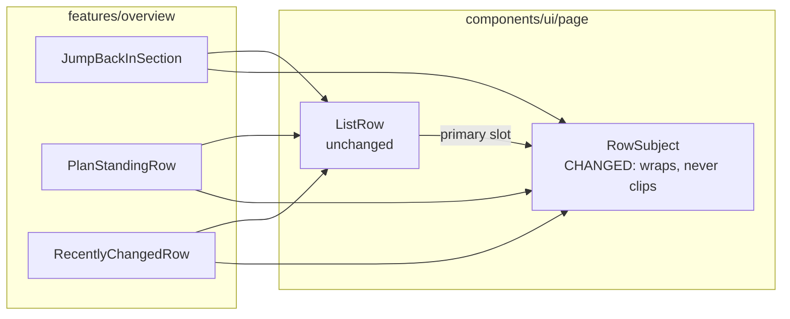
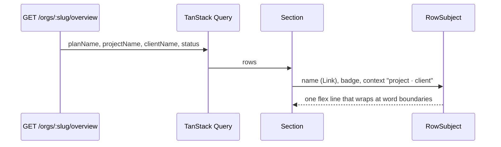

# Feature Spec: A row's subject wraps rather than clips (#472)

- **Status:** Draft — awaiting approval before implementation.
- **Author(s):** feature-analyst
- **Date:** 2026-10-09
- **Tracking issue / epic:** `docs/TECH_DEBT.md` #472 (`:11876-11884`); raised by landing-two-columns
  M0 (`docs/specs/landing-two-columns/m0-measurement.md` §3) and ADR-0182 D2 / Consequences
- **Roadmap link:** ADR-0179 follow-ups ("Next in line")
- **Related ADR(s):** ADR-0146 D3 ("wraps rather than truncating, because a truncated name is a name
  the reader cannot read") and D4 (a fact belongs under its row), ADR-0182 (the split it does not
  touch), ADR-0105 (why this is a spec: a shared component's public contract), ADR-0113 (measure the
  problem first), ADR-0110 (a gate is verified against the defect it names). **A short new ADR is
  required — ADR-0184 (§4.6)**: it reverses an approved design decision (M9 D1, "a row's subject and
  its context share one line") for a shared primitive.

> **Read this first: the problem is bigger than the row that files it, and the instrument that
> filed it cannot see the bigger half.** #472 says the `project · client` **subtitle** is truncated.
> The product owner's two examples are **plan names**, not subtitles: `NetPoint reference:
power-plan…` is the seeded plan `NetPoint reference: power-plant programme`
> (`apps/seed-cli/src/references/netpoint-power-plant.ts:112`, passed as the plan's `name` by
> `capabilityPlan`, `apps/seed-cli/src/capabilities/builders.ts:174`), and `EDF - Hynamics Proposal`
> is the product owner's own programme name (quoted at `apps/web/src/features/tsld/render/a11y.ts:64`).
> And `measure-overview.mjs`, which produced every number #472 and ADR-0182 cite, **counts a run as
> truncated only when the text node's direct parent has `text-overflow: ellipsis`**
> (`apps/web/scripts/measure-overview.mjs:449-453`). The name's text sits inside the router `<a>`,
> whose parent is the truncating `` (`list-row.tsx:53`; `RecentlyChangedRow.tsx:79-85`), so
> **no truncated plan name has ever been counted**. M0's author saw it by eye and wrote it down
> ("the ordinary plan names `Dockside — Ancillary work…` truncate there too",
> `m0-measurement.md:67`); no table carries it. So this spec covers **name and context together**,
> and its first task fixes the instrument.

## 1. Business understanding

### Problem

On the organisation landing, three of the four boxes — "Jump back in", "Where the work stands" and
"Recently changed" — render each plan as `name [Draft] project · client` on **one line**, and
whatever does not fit is cut off with an ellipsis, mid-word. A planner scanning "Recently changed"
cannot tell which programme a row is, and two plans whose names share a prefix
(`Dockside — Ancillary works A…`, `Dockside — Ancillary works B…`) are indistinguishable.

It happens on the product owner's own screen. Recorded today on the current tree (`web 0.182.0`,
`m1-after-run.md:128-151`, Explorer at its default 276 px):

| Window × height | Layout           | Ordinary pair (284 px) shown, "Recently changed" | Long pair (584 px) shown, "Recently changed" |
| --------------- | ---------------- | -----------------------------------------------: | -------------------------------------------: |
| 1024 × 600      | one column, 699  |                                       212–232 px |                                        99 px |
| 1280 × 800      | one column, 955  |                                            whole |                                       301 px |
| 1440 × 900      | one column, 1115 |                                            whole |                                       428 px |
| 1465 × —        | one column, 1140 |                          **not measured** (§3.2) |                             **not measured** |
| 1477 × 900      | two columns, 564 |                                       106–124 px |                                     **0 px** |
| 1912 × 948/1114 | two columns, 732 |                                       237–258 px |                                       125 px |

Those are context spans only. **Names are unmeasured** for the reason in the box above.

**Why it truncates — the cause, read from the code, not inferred from the symptom.**
`RowSubject` (`apps/web/src/components/ui/page/list-row.tsx:50-60`) is a single flex line:
`{name}{badge}{context}`. CSS Flexbox shares an overflow among items in proportion to
**flex-shrink × flex base size**, so whenever the line overflows the name loses
`W_name / (W_name + 3·W_context)` of it. With both items at `min-w-0`, **the name is clipped in
every overflowing row**, by roughly a fifth of the overflow for an ordinary pair. The docblock's
claim that "a row's name must survive and its context may not" (`list-row.tsx:42-48`) is therefore
false, and its unit test (`page-archetypes.test.tsx:381-395`, "lets the context give way before the
name does") asserts the **class string** `shrink-[3]`, not the behaviour, which jsdom cannot lay
out — a gate green against the defect it names (ADR-0110). The M0 photograph's `Dockside — Ancillary
work…` beside a context short by 26 px is exactly what the arithmetic predicts.

**Why it was built like this.** M9 D1 (`docs/specs/organisation-landing-portfolio/m9-density-design.md:32-49`,
approved "go for the tighter version", 2026-09-16) merged the old two-line row into one line to buy
**20 px per row**, the largest single term in a landing that did not fit its window. It assumed "the
context truncates away entirely and the name survives". The first half held; the second never did.

**Why now.** The product owner reported it at 1912, the layout he uses; ADR-0182 dropped its subtitle
clause because no grid threshold can fix it; #472's trigger ("a device reading that cannot identify
a plan by its subtitle") has fired.

### Users

Every role that reaches the landing: **Org Admin, Planner, Contributor, Viewer** (ADR-0016). "Jump
back in" is shown to all four; "Where the work stands" and "Recently changed" to all four
(`OverviewScreen.tsx`). External Guests never see the landing (ADR-0051: a guest reaches one plan via
its share link). Nothing here is role-dependent.

### Primary use cases

1. Find "the plan I was in" in "Jump back in" by its full name.
2. Tell which programme a "Recently changed" or "Where the work stands" row is about, including its
   project and client, without opening it.
3. Distinguish two plans whose names share a long prefix.

### User journeys

Open the organisation → read a row → every word of the plan's name, its Draft badge, its project and
its client is on screen, on one line when the box is wide enough and on two (or more) when it is not
→ press the name to open the plan. See §4.3.

### Expected outcomes

No plan, project or client name in those three boxes is ever cut off. A row is one line when
everything fits — so the 20 px M9 bought is kept wherever the content allows — and grows only by the
lines it needs when it does not.

### Success criteria

Committed before the build. All read in Chromium by `measure-overview.mjs` (with the M0-T1 fix) on the
landing-two-columns fixture plus the long-name additions in plan task M0-T2 (the 42-character
NetPoint name, a Draft with a long name, and the 200 + 200 + 200 maxima), at **1024 × 600, 1280 × 800,
1465 × 900, 1477 × 900, 1646 × 1000, 1912 × 948 and 1912 × 1114**, Explorer at default, plus 1280
folded and 1440 at 420.

- **SC-1 — nothing in a `RowSubject` is clipped.** Zero runs inside any `RowSubject` with
  `scrollWidth > clientWidth`, measured on **every element** of the subject (name link, its wrapping
  span, badge, context), not only a text node's direct parent. Before: 11–18 truncated context runs per
  two-column cell, names uncounted.
- **SC-2 — the instrument is non-vacuous.** Run against today's tree, the fixed harness reports at
  least one **name** truncation at 1912 × 948 (the `Dockside — Ancillary work…` M0 photographed). If it
  reports none, the instrument is wrong and nothing after it is believed.
- **SC-3 — a row that fits costs nothing.** At 1280 × 800 (one 955 px column, where the ordinary pair
  is whole today), every ordinary row's height is **identical** before and after (±0 px).
- **SC-4 — a row grows by lines it needs, and no more.** Every `RowSubject` row's height is
  `base + k × line`, where `k` is the number of extra lines and every extra line holds text that did
  not fit. Reported per cell as the median row height and the count of rows that went two-line.
- **SC-5 — the boxes still answer at a glance (the cost limb).** At 1646 × 1000, the M9.4 reference
  (`m9-density-design.md:233-241`), a bottom-row box shows **≥ 4 whole rows** (M9.4 measured 6; M9's
  FC-D2 floor was 4), and `<main>` does not scroll (949/949). **If it fails, the build stops and the
  number goes to the product owner — the row is not softened back to truncation** (M9's own rule).
  At 1912 × 948 the two bottom boxes are already at their `min-h-55` floor (220 px,
  `m1-after-run.md:215`), so the before/after whole-row count is **reported, not graded**: it was ~2
  before.
- **SC-6 — reflow and text resize.** At 320 × 800 (WCAG 1.4.10's 1280-at-400 % equivalent) and at
  1280 × 800 with text at 200 % (1.4.4): document `overflow-x` is 0, and SC-1 holds.
- **SC-7 — the journey drives it.** `e2e-overview` asserts SC-1 on a seeded 57-character name at
  1477 × 900 and 1912 × 948 in a real browser.

### Open questions

**Critical (answers change design or scope):**

- **CQ-1 — Height or legibility, when they collide?** The recommended design keeps a row on one line
  when it fits and lets it grow when it does not. On a 1912 screen with two columns, most "Recently
  changed" rows are 26–33 px short of fitting today, so **most of them would become two lines**
  (+20 px each), and the bottom boxes at 1912 × 948 — already at their 220 px floor — show fewer whole
  rows (about 2 → about 1½; scrolling is unchanged). **Recommendation: accept it** — a row you cannot
  identify is not a row you saved space on, and the boxes already scroll with a stated count.
  Alternative: keep one line, stop the name ever being clipped, and accept that project and client are
  still cut (option D in §4.7) — cheaper in height, and it leaves half of your complaint standing.
- **CQ-2 — The ADR.** Reversing M9 D1 for a shared primitive is recorded as **ADR-0184**
  (recommendation) rather than only in this spec and the component's docblock.

**Defaults (proceeding unless told otherwise):**

- **No line cap.** A 200-character name (the DTO maximum, `create-plan.dto.ts:23`) wraps to as many
  lines as it needs. A `line-clamp` would reintroduce the truncation for exactly the names that most
  need reading. M0 measures the 200 + 200 + 200 case so the cost is known.
- **The badge stays glued to the name** (follows its last word), so a wrapped context never appears to
  be the thing that is a Draft.
- **When it wraps, the whole context moves under the name** (ADR-0146 D4), rather than breaking
  `project · client` mid-pair across the end of line 1.
- **Scope is `RowSubject`'s three consumers.** `NeedsAttentionSection` already wraps (two-line rows,
  no `RowSubject`); the Explorer tree, the Gantt and `DataTable` are out of scope.
- **No feature flag** (ADR-0088 D1): the rollback is the commit.

## 2. Functional requirements

### User stories & acceptance criteria

> **US-1** — As any organisation member, I want every plan name on the landing shown in full, so that
> I can tell plans apart without opening them.
>
> - **Given** a plan named `NetPoint reference: power-plant programme` in "Recently changed" **when**
>   I view the landing at 1912 × 948 with the Explorer open **then** all 42 characters are visible, and
>   the link's accessible name is the full name (unchanged).
> - **Given** a name longer than its column **when** the row renders **then** it wraps at word
>   boundaries, breaking inside a word only if a single word is wider than the column.

> **US-2** — As any member, I want a row's project and client shown in full, so that I know which
> programme it belongs to.
>
> - **Given** `name + badge + project · client` fits the row's width **then** it is one line, at
>   today's height.
> - **Given** it does not fit **then** `project · client` moves to the line under the name, in full, and
>   wraps at word boundaries if it is itself longer than the line.

> **US-3** — As a keyboard or screen-reader user, I want nothing to change about how the row is read.
>
> - **Given** any row **then** reading order is name, badge, project · client, then the trailing fact;
>   the name remains the row's one link; no `title`, tooltip or extra tab stop is added.

### Workflows

Render-only. The data (`planName`, `projectName`, `clientName`, `status`) already arrives on every
row (`RecentlyChangedRow.tsx:84-94`, `PlanStandingRow.tsx:73-83`, `JumpBackInSection.tsx:56-59`).

### Edge cases

| Case                                                           | Expected                                                                                     |
| -------------------------------------------------------------- | -------------------------------------------------------------------------------------------- |
| Everything fits                                                | One line; height identical to today (SC-3)                                                   |
| Context does not fit beside the name                           | Context on line 2, whole                                                                     |
| Name alone wider than the column                               | Name wraps; badge follows its last word; context below                                       |
| One unbroken token (e.g. a 60-char code) wider than the column | Breaks anywhere (`wrap-anywhere`, already on `rowLinkClass`, `list-row.tsx:16`); no overflow |
| 200-char name, project and client (DTO maxima)                 | Wraps to N lines, no overflow-x; the `fill` box scrolls; measured in M0                      |
| No context (a `RowSubject` without `context`)                  | Name only, as today (`page-archetypes.test.tsx:375-379`)                                     |
| Draft badge                                                    | Never separated from the name onto the context's line                                        |
| One-column layout (< 72rem grid)                               | Boxes size to content (ADR-0182); taller rows lengthen the page scroll, nothing clips        |
| Two-column layout, capped box                                  | Body scrolls (already a tab stop, `SectionCard fill`); the count in the header is unchanged  |
| Coarse pointer                                                 | Unaffected: the link is a text target and a wrapped name makes it larger (ADR-0183 D4 n/a)   |

### Permissions

None change. No new read, no new write; every value rendered is already in the overview payload,
which is organisation-scoped and role-filtered server-side (ADR-0012). Not a structural plan write, so
the pen (ADR-0028) is not involved.

### Validation rules

None. No input.

### Error scenarios

| Scenario                           | Detection | User-facing result                      | Status |
| ---------------------------------- | --------- | --------------------------------------- | ------ |
| Overview read fails                | unchanged | the existing section error state        | n/a    |
| Name contains no break opportunity | layout    | breaks anywhere rather than overflowing | n/a    |

## 3. Technical analysis

| Area           | Impact | Notes                                                                                                                                                             |
| -------------- | ------ | ----------------------------------------------------------------------------------------------------------------------------------------------------------------- |
| Frontend       | low    | `RowSubject` only (`list-row.tsx:18-60`): class string, item grouping, docblock. Props unchanged. No consumer edit is required; one consumer test may gain a case |
| Backend        | none   | —                                                                                                                                                                 |
| Database       | none   | No schema change, so database-architect is not engaged (no model, column, index or migration)                                                                     |
| API            | none   | —                                                                                                                                                                 |
| Security       | none   | Render-only of already-authorised data                                                                                                                            |
| Performance    | low    | Wrapped text costs no JS; no measurement, `ResizeObserver` or re-render is added. Page height grows in one column (§3.3)                                          |
| Infrastructure | none   | No new Playwright config or CI step: `e2e-overview` exists                                                                                                        |
| Observability  | none   | —                                                                                                                                                                 |
| Testing        | med    | Unit: replace the class-string test with a structural contract. Harness: fix the blind spot (SC-2). Journey: SC-1 on a long name at two widths                    |

**The CPM engine is not imported** and `computeSchedule` is unreachable from anything here, so the
recalc parity gate holds by construction.

### 3.1 Consumers (complete — `grep -rn RowSubject apps/web/src`)

| Consumer                | File:line                           | Badge | Trailing                          |
| ----------------------- | ----------------------------------- | ----- | --------------------------------- |
| "Jump back in"          | `JumpBackInSection.tsx:49-60`       | no    | none                              |
| "Where the work stands" | `PlanStandingRow.tsx:66-84`         | Draft | finish date or no-finish sentence |
| "Recently changed"      | `RecentlyChangedRow.tsx:77-95`      | Draft | actor · relative time             |
| Unit tests              | `page-archetypes.test.tsx:363-396`  | —     | —                                 |
| Barrel                  | `components/ui/page/index.ts:27,30` | —     | —                                 |

No other screen uses it. `ListRow` (also used by `NeedsAttentionSection` and
`features/staff/ui/status-summary.tsx`) is **not** changed.

### 3.2 What I could not measure in this run, and why

The brief asked for a browser reproduction at 1024, 1280, 1465 and 1912. **This analysis ran without a
shell, so no browser was driven.** The figures in §1 are today's, taken by `m1-after-run.md` on the
current `RowSubject` (M0-T1 confirms with `git log -- list-row.tsx` that nothing has touched it
since). Two gaps follow, and both are
**M0's first job**, not assumptions the design rests on: names were never counted (the instrument
bug), and **1465 was never taken** — derived as grid 1140 (window − 325, the landing-two-columns
amendment), one column, so it should read like 1440's 1115. 1465 is notable because it is the widest
window that stays one column with the Explorer at its default.

### 3.3 The cost, estimated before it is measured

From the table above: at **1280 and 1440 (one column)** ordinary rows already fit, so the cost is the
long pair only — one extra line. At **1477–1912 (two columns)** ordinary rows in "Recently changed" and
"Where the work stands" are 26–180 px short, so most go two-line: **+20 px each**. "Jump back in" (no
trailing) fits more often. The bottom boxes at 1912 × 948 are at their 220 px floor already; at
1646 × 1000 M9.4 measured 517 px boxes holding 6 rows of ~61 px, so 4 rows of ~81 px still fit —
SC-5's ≥ 4 is expected to pass, and it is graded rather than assumed.

### Dependencies

- `docs/specs/landing-two-columns/` M1 shipped (ADR-0182, `web 0.182.0`) — it is the layout measured.
- `apps/web/scripts/measure-overview.mjs` and `landing-fixture.mjs` (the M0 fixture with the
  57-character programme).
- No other in-flight work touches `list-row.tsx` (#472's own trigger is "the next change to it").

## 4. Solution design

### 4.1 Architecture overview

### 4.2 Data flow

Unchanged; shown for completeness.

### 4.3 User flow

### 4.4 Database changes

None.

### 4.5 API changes

None.

### 4.6 Component changes — the exact contract

**Props: unchanged** (`name: ReactNode`, `context?: ReactNode`, `badge?: ReactNode`). No consumer
edit is required. What changes is the **behavioural contract**, which is the public contract
ADR-0105 means:

| Clause                    | Today (`list-row.tsx:25-48`)                                | After                                                                                                         |
| ------------------------- | ----------------------------------------------------------- | ------------------------------------------------------------------------------------------------------------- |
| Lines                     | Exactly one                                                 | One when it fits; otherwise as many as the content needs                                                      |
| Truncation                | Name and context both `truncate`; context shrinks 3× faster | **Nothing truncates.** No `truncate`, `text-ellipsis`, `whitespace-nowrap` or `line-clamp` on any descendant  |
| Where text breaks         | n/a                                                         | Between the name group and the context first; then at word boundaries; anywhere only for an unbreakable token |
| Badge                     | A sibling flex item between name and context                | Part of the name group, after the name's last word; never on the context's line alone                         |
| Height                    | Fixed at one line                                           | `base + extra lines`; identical to today when it fits (SC-3)                                                  |
| Reading order / semantics | name, badge, context; one `
`                             | Unchanged                                                                                                     |

Shape of the markup (described, not written — the builder writes it): the `
` becomes a wrapping
flex line aligned on the first baseline with a row gap; child 1 is a span holding the name and, inline
after it, the badge; child 2 is the muted `text-sm` context span. Both children keep `min-w-0` so a
child wider than the line shrinks to it and wraps inside. Tokens and spacing steps only: the sizing
ratchet in `token-architecture.test.ts` refuses arbitrary values (`m9-density-design.md:199-201`).

The `context` prop docblock ("the first thing to be truncated away", `list-row.tsx:25`) and the
component docblock (`:31-49`) are rewritten to state the new rule, why M9 D1 is reversed, and that the
old "name survives" claim was false (with the arithmetic).

States: loading is `ListRowSkeleton` (two bars), which a wrapped row now resembles more closely than
today's one-line row does. Empty and error states are the sections', untouched.

### 4.7 Implementation approach & alternatives

**Recommended — C: wrap on demand.** It is the only option that satisfies both halves of the complaint
(name and context) with no JavaScript, it keeps M9's 20 px wherever the content fits, and it is what
ADR-0146 D3 already decided for table columns ("wraps rather than truncating, because a truncated name
is a name the reader cannot read") and D4 decided for facts ("a fact belongs under its row").

| Option                                                        | Name clipped? | Context clipped? | Height                      | JS  | Verdict                                                                                                                       |
| ------------------------------------------------------------- | ------------- | ---------------- | --------------------------- | --- | ----------------------------------------------------------------------------------------------------------------------------- |
| A. Status quo + `title` tooltip                               | yes           | yes              | 1 line                      | no  | **Rejected**: `title` is invisible to keyboard and touch (`docs/UX_STANDARDS.md` §6, cited at `RecentlyChangedRow.tsx:13-15`) |
| B. Always two lines (revert M9 D1)                            | no\*          | no\*             | +20 px every row            | no  | Rejected: pays the cost on rows that fit (1280, 1440 one-column); \*still needs wrapping to be clip-free                      |
| **C. Wrap on demand**                                         | **no**        | **no**           | +20 px only where needed    | no  | **Recommended**                                                                                                               |
| D. One line, name `shrink-0` (wraps), context alone truncates | no            | **yes**          | 1 line (more if name wraps) | no  | Fallback if CQ-1 says height wins. Leaves "EDF - Hynamics Propo…"'s project/client cut                                        |
| E. Middle truncation (`Dockside Reg…de Estates`)              | yes           | yes              | 1 line                      | yes | Rejected: still loses text, needs measurement on every resize, and is new machinery for a worse outcome                       |
| F. Drop the client first, then the project, whole words       | no            | drops whole      | 1 line                      | yes | Rejected: a `ResizeObserver` per row and facts silently absent; ADR-0127 "count what you do not draw" would demand a marker   |
| G. Wider columns / later split                                | yes           | yes              | —                           | no  | Rejected by #472 itself and ADR-0182 D2: the 732 px layout already fails                                                      |

**WCAG.** Today's truncation is treated here as a usability defect rather than a clear AA failure:
the full text is in the DOM (the link's accessible name is whole) and one activation away. That
reading of 1.4.10 is **not verified against the Understanding text in this analysis**, and nothing
in the decision depends on it — the accessibility-reviewer pass in M2 states the verdict. The remedy
must not **create** a 1.4.10 or 1.4.4 failure, and C
cannot: it removes `nowrap`, so the only horizontal-overflow risk is an unbreakable token, which
`wrap-anywhere` already handles. SC-6 measures it.

**Row-height ADRs.** ADR-0151 (canvas lane pitch) and ADR-0121 (resource-strip cap) govern the
diagram's rows and do not reach `ListRow`, whose docblock states it is "deliberately not a fixed
rhythm" (`list-row.tsx:72-79`). ADR-0183 D4 governs coarse-pointer **targets** in rows; the name link
is a text target and only grows. The binding height constraint is M9's box budget, which SC-5 grades.

**ADR-0184 outline — "A row's subject wraps; it never clips".**

- _Context:_ M9 D1 merged subject and context into one line for 20 px; its "the name survives" claim
  was false (flex-shrink scales by base size); the product owner reported names cut at 1912; the
  measuring harness could not see names.
- _Decision:_ D1 `RowSubject` never truncates; D2 one line when it fits, the context moves under the
  name when it does not; D3 the badge belongs to the name; D4 the harness counts clipping on every
  element of a subject, with a non-vacuity control.
- _Alternatives:_ A–G above.
- _Consequences:_ two-column rows mostly two-line at 1477–1912; SC-5's reading; the class-string test
  replaced; `docs/COMPONENT_LIBRARY.md` / `DESIGN_SYSTEM.md` row guidance updated.
- One line in CLAUDE.md §16 (`check:adr-coverage`).

## 5. Links

- Implementation plan: [`./implementation-plan.md`](./implementation-plan.md)
- Related docs updated by this change: `docs/TECH_DEBT.md` #472 (closed by M2), ADR-0184 (new),
  CLAUDE.md §16 (one line), `docs/specs/organisation-landing-portfolio/m9-density-design.md` (a dated
  note under D1 pointing at ADR-0184 — recorded, not edited), `docs/DESIGN_SYSTEM.md` /
  `docs/COMPONENT_LIBRARY.md` wherever row truncation is described (M2-T2 greps for it).
