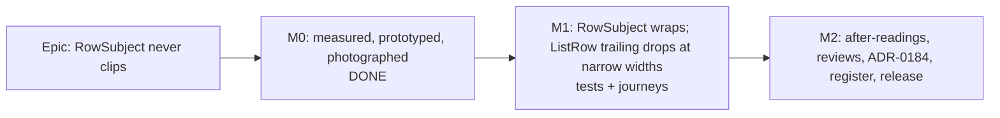

# Implementation Plan: A row's subject wraps rather than clips (#472)

- **Feature spec:** [`./feature-spec.md`](./feature-spec.md)
- **Status:** Approved 2026-10-09 by the product owner (CQ-1, CQ-2, CQ-3 yes, on the M0-T3 photographs). M0 done; M1 and M2 approved for build.
- **Owner:** web

## Breakdown

### Epic

**A row's subject wraps rather than clips** — closes `docs/TECH_DEBT.md` #472 and the product owner's
2026-10-09 report. No feature flag (ADR-0088 D1): the rollback is reverting M1's commit.

**Build rule for this epic:** implement from the spec (§4.7), not from memory of the M0-T3 prototype,
which was discarded. Every class string the builder needs is in spec §4.7. If anything in this plan
turns out to contradict the code, stop and report — do not improvise a contract (ADR-0105).

---

### Milestone M0: measure, prototype, photograph — **DONE 2026-10-09**

Delivered: `apps/web/scripts/row-subject-probe.mjs`; `measure-overview.mjs` `SP_ROW_SUBJECT=1`;
`landing-fixture.mjs` `seedLongNames`; the inert `data-row-subject` on `RowSubject`'s `
`;
[`m0-measurement.md`](./m0-measurement.md), [`m0-prototype.md`](./m0-prototype.md), `m0-raw-*.md`,
[`photos/`](./photos/). Decision rule (a) not triggered (names are clipped in all 13 cells); decision
rule (b) triggered (name 6 characters at 320 px) → spec amended (CQ-3), `ListRow` in scope.

---

### Milestone M1: the rows never clip (shippable slice)

**Outcome:** on the organisation landing, every plan name, Draft badge, project and client in "Jump
back in", "Where the work stands" and "Recently changed" is shown in full at every width; a wrapped
row's date or "actor · time" sits on the name's line; on a very narrow screen it drops beneath the row's
text so the name keeps room.
**Entry point:** the organisation landing (`/orgs/$orgSlug`, the first screen after sign-in, and the
shell's wordmark) — sections `Jump back in`, `Where the work stands`, `Recently changed`.
**Journey:** `apps/web/e2e-overview/overview.spec.ts`, new step (M1-T2); plus a step in
`apps/web/e2e-staff/staff.spec.ts` for the staff consumer (M1-T3).

#### Feature: the component contracts

> **Description:** spec §4.7 — `RowSubject` wraps and never clips; `ListRow` wraps its trailing block
> beneath the primary when the primary would be under 7rem, and gains `align?: 'center' | 'baseline'`.
> **Complexity:** S
> **Dependencies:** M0 (done)
> **Risks:** (1) the sizing ratchet refuses a class → only `min-w-28`, `flex-1`, `gap-x-*`, `gap-y-0`
> are new, all scale steps; (2) the staff link's hit area widens → expected (spec §4.7), reviewer
> confirms; (3) an existing unit test asserts `textContent` equality and meets the `sr-only` ", " →
> only rows with a context render it; fix such an assertion to the visible text, do not drop the separator.
> **Testing requirements:** probe + journeys carry the weight; unit tests are tripwires.

##### Task M1-T1 — `list-row.tsx`, the two consumers, the unit tripwires

- **Description:**
  1. `RowSubject` exactly per spec §4.7 (the `
`, the name group with the
     conditional single space before the badge, the context span with its leading `sr-only` ", ").
     Keep `data-row-subject` (M0 added it).
  2. `ListRow` per spec §4.7's table: container gains `flex-wrap gap-x-4 gap-y-0` (replacing `gap-4`)
     and takes `items-center` or `items-baseline` from `align` (default `'center'`); primary becomes
     `min-w-28 flex-1`; trailing unchanged. Add `align` to `ListRowProps` with a docblock. Do not
     touch `ListRowSkeleton`.
  3. Rewrite the docblocks named in spec §4.7 (`context` `:25`, `badge` `:27`, `RowSubject` `:31-49`,
     `ListRow` `:69-80`), citing ADR-0184.
  4. `RecentlyChangedRow.tsx`: pass `align="baseline"`; remove `className="shrink-0"` from the Draft
     `Badge` (`:89`). `PlanStandingRow.tsx`: the same (`:78`). No other consumer is edited.
- **Complexity:** S
- **Dependencies:** —
- **Risks:** see the feature box.
- **Testing (unit, tripwires — jsdom lays nothing out; say so in the test comments, ADR-0110):**
  - Replace `page-archetypes.test.tsx:381-395` ("lets the context give way…", a class-string check)
    with: no element in the subject carries any of `truncate`, `text-ellipsis`, `whitespace-nowrap`,
    `overflow-hidden`, `line-clamp-`, `order-`, `flex-row-reverse`, `flex-wrap-reverse`; the badge is
    a descendant of the same child as the name; DOM order name → badge → context; one `
` with
    `data-row-subject`; with a context there is exactly one `.sr-only` whose text is `", "`; without a
    badge nothing follows the name inside its group; without a context there is no `.sr-only`.
  - Keep the two existing `RowSubject` cases (`:364-379`).
  - `ListRow`: default emits `items-center` and not `items-baseline`; `align="baseline"` the reverse;
    the container has `flex-wrap`; the primary has `min-w-28` and `flex-1`; no reorder utility.
  - Run `pnpm --filter @repo/web test`; `plan-standing-row.test.tsx`, `jump-back-in.test.tsx`,
    `freshness-line.test.tsx`, `overview-screen.test.tsx` and the staff suites must stay green.
- **Development steps:**
  1. Edit `list-row.tsx`; edit the two consumers.
  2. Update `page-archetypes.test.tsx`.
  3. `pnpm --filter @repo/web test` and `pnpm --filter @repo/web typecheck`.

##### Task M1-T2 — the overview journey step

- **Description:** in `apps/web/e2e-overview/overview.spec.ts` add one test (or step) that:
  1. Creates its own plan named `Berth 4 Deepening — Dredging and Revetment Works, Stage 2B` in a
     project `Estuary Crossing Programme — Western Approaches` of client `Northern Ports and Harbours
Authority` (`support.ts` `createClient` / `createProject` / `createPlan`), opens it once (so
     "Jump back in" and "Recently changed" carry it), and opens the overview.
  2. Imports the probe from `apps/web/scripts/row-subject-probe.mjs` (the same function the harness
     uses — if it is not importable as-is, export it; do not copy it).
  3. At **1477 × 900** and **1912 × 948**: asserts at least 1 `[data-row-subject]` is found (pinned
     positive count), then 0 clipped names, 0 clipped contexts, 0 ellipses, 0 clipped trailing text;
     asserts reading order from rects for the long-name row (name's first rect, badge, context: same
     line → left ascending, else top ascending).
  4. At **320 × 800**: runs the SC-2 after-control (inject a 32 × `W` text token into one unclipped
     context; the probe must report it clipped; remove it) and asserts SC-9: every row with a trailing
     block has primary width ≥ 12 × the advance of `0` in the name's font, and the trailing block's top
     is below the primary block's bottom.
  5. At **1024 × 600**: asserts every trailing block's vertical centre lies within its primary's first
     line box (SC-3's floor clause).
- **Complexity:** S
- **Dependencies:** M1-T1
- **Risks:** the suite's organisation otherwise holds one plan (`m9-density-design.md:190-197`) → the
  step seeds its own; the 320 cell shows ADR-0179's narrow notice → measure beneath it, as M0 did.
- **Testing:** verify **red** with M1-T1's `list-row.tsx` reverted (the clipping and SC-9 assertions
  must fail), then green. `scripts/e2e-local.sh web:overview`.
- **Development steps:**
  1. Write the step; `git stash` the component change and confirm it fails; restore; confirm it passes.

##### Task M1-T3 — the staff journey step

- **Description:** in `apps/web/e2e-staff/staff.spec.ts`, after the status summary renders, at
  **1024 × 600** and **1912 × 948**: for each status-summary row, the trailing verdict badge's top is
  **above** its primary block's bottom (the badge is on the row's first flex line, centred against the
  two-line primary by the default `align`, not wrapped beneath it). This pins "unchanged at or above the
  floor" for the one consumer the landing harness never sees.
- **Complexity:** S
- **Dependencies:** M1-T1
- **Risks:** the staff suite's setup (`STAFF_EMAILS`) → reuse its existing fixture; add no config.
- **Testing:** `scripts/e2e-local.sh web:staff` (maps to `test:e2e:staff`, `apps/web/package.json:18`).
- **Development steps:**
  1. Add the assertion beside the suite's existing status-summary step; run it.

---

### Milestone M2: after-readings, reviews, records, release

**Outcome:** every success criterion judged on the shipped tree; ADR-0184 filed; #472 closed.
**Entry point:** as M1. **Journey:** as M1 (landed).

#### Feature: judge, review, record

> **Description:** same probe, fixture and cells as M0; three reviewers; the registers.
> **Complexity:** S
> **Dependencies:** M1
> **Risks:** a figure worse than SC-5's acceptance → stop and report it to the product owner; the
> remedies (raise `min-h-55`, rebalance rows) are applied **only if he asks**; never re-truncate or
> `line-clamp`.
> **Testing requirements:** SC-1 to SC-9.

##### Task M2-T1 — the after-reading

- **Description:** run `measure-overview.mjs` with `SP_ROW_SUBJECT=1`, with and without the
  200-character plan, on the M1 tree; write `m2-after-run.md` (raw) and `m2-verdict.md`: SC-1 to SC-9
  each PASS/FAIL with its number against the spec's baselines (M0 today, M0-T3 prototype); the SC-5
  table filled in; median row height per cell; the narrow-drop cells (where the trailing block went
  beneath — expected only at 320 × 800). Photographs `photos/after-m2-{1024x600,1280x800,1465x900,1912x948,1646x1000,320x800}.png`.
- **Complexity:** S
- **Dependencies:** M1
- **Risks:** stale build → read the build off the shell footer and record it.
- **Testing:** the probe with both SC-2 controls.
- **Development steps:**
  1. Run; write the two files; commit with the photographs.

##### Task M2-T2 — reviews (before release, CLAUDE.md §19.13)

- **Description:** run **component-reviewer** (both contracts, tokens, the `align` prop, the
  tripwires, the staff link's hit area), **ux-reviewer** (`m2-verdict.md` and the photographs: ragged
  heights, badge alone, moved finish date, the 320 drop), **accessibility-reviewer** (SC-6, SC-8, SC-9;
  reading order; the `sr-only` ", "; the F69 verdict on the pre-change tree from `m0-measurement.md` §5).
  No backend, API, security or database reviewer: nothing in those layers changes. Fold every blocking
  finding with a regression test verified red first. If accessibility-reviewer finds the ", " is
  announced as "comma", remove it and record the run-on in ADR-0184 as a known limitation.
- **Complexity:** S
- **Dependencies:** M2-T1
- **Testing:** per finding; re-run M1-T2/M1-T3 journeys after any fold.
- **Development steps:**
  1. Run the three reviewers; fold; re-run.

##### Task M2-T3 — ADR-0184 and the registers

- **Description:**
  1. `docs/adr/0184-a-rows-subject-wraps-it-never-clips.md` from spec §4.8's outline, Status
     **Accepted**, citing `docs/specs/row-subject-truncation/` and `m2-verdict.md`.
  2. CLAUDE.md §16: one line — `- **ADR-0184** _(Accepted; extends ADR-0146 D3/D4 to list rows)_ — A
row's subject wraps; it never clips → [\`0184-a-rows-subject-wraps-it-never-clips.md\`](docs/adr/0184-a-rows-subject-wraps-it-never-clips.md)`
(`pnpm check:adr-coverage`).
  3. **Counts:** run `pnpm check:counts` and correct the CLAUDE.md stage-banner figures it reports
     (the ADR count goes 183 → 184; web source files only if M1 added one) — never edit a number the
     gate did not ask for.
  4. `docs/COMPONENT_LIBRARY.md` and `docs/DESIGN_SYSTEM.md`: update the `RowSubject` / `ListRow`
     entries (wrap rule, the 7rem trailing drop, `align`) and correct any row-truncation guidance
     (grep both for `truncat`, `RowSubject`, `ListRow`).
  5. `docs/specs/organisation-landing-portfolio/m9-density-design.md`: append a dated note under D1
     ("Reversed 2026-10-09 by ADR-0184 — the name never survived; see …"). Append, do not edit D1.
  6. **`docs/TECH_DEBT.md` #472:** **delete the row** and add its number to the **Closed numbers**
     ledger at the foot, in the existing lines' format (the third cell is a date), citing ADR-0184 and
     `m2-verdict.md` — the register's rule (`TECH_DEBT.md:18-23`; `check:debt-status` A11 refuses a
     deletion without a ledger line, and A3 refuses a "CLOSED" annotation). Also update the two other
     places that point at #472 as open: `docs/HANDOFF.md:55` and `:75` (edit — it is a hand-off, not
     a record), and ADR-0182's Consequences only by appending a dated "closed by ADR-0184" note — never
     rewrite an ADR's body.
  7. Changeset: `pnpm changeset`, `@repo/web` **minor** — "Plan names, projects and clients on the
     organisation landing are never cut off; rows grow a line when they need one, and on very narrow
     screens the date drops beneath the row."
  8. Spec and plan headers: Status `Accepted — shipped (ADR-0184)` (`pnpm check:spec-status`).
- **Complexity:** S
- **Dependencies:** M2-T2
- **Risks:** a gate refuses → fix the cause, never the gate.
- **Testing:** `pnpm prepush` (runs every `check:*`), then `scripts/e2e-local.sh web:overview` and the
  staff suite.
- **Development steps:**
  1. Steps 1–8; `pnpm prepush`; e2e; commit; PR with a Conventional Commit title, e.g.
     `feat(web): wrap a list row's subject instead of clipping it (#472)`.

## Sequencing & slices

M1-T1 → M1-T2 and M1-T3 (parallel) → M2-T1 → M2-T2 → M2-T3. M1 is one revertible product commit; M2
adds records only. `main` stays releasable throughout.

## Definition of Done (per task)

Each task's PR satisfies the Feature Completion Criteria in [`docs/PROCESS.md`](../../PROCESS.md), with
`pnpm prepush` and the e2e half (`scripts/e2e-local.sh web:overview web:staff`) **run**, not
assumed.

## Risks & assumptions (rollup)

| Risk / assumption                                                        | Likelihood | Impact | Mitigation                                                                                             |
| ------------------------------------------------------------------------ | ---------- | ------ | ------------------------------------------------------------------------------------------------------ |
| Fewer whole rows per two-column box (1912 × 948: 3 → 1)                  | certain    | med    | Measured and accepted by the owner (CQ-1); remedies only on his request                                |
| The narrow drop fires at or above the 1024 floor                         | low        | med    | SC-3 floor clause in the overview and staff journeys; 7rem chosen far below the 564 px narrowest track |
| The staff link's hit area widens                                         | certain    | low    | Intended; component-reviewer confirms                                                                  |
| The probe goes silent                                                    | low        | high   | SC-2 after-control in the journey and the harness                                                      |
| The `sr-only` ", " reads as "comma"                                      | low        | low    | accessibility-reviewer; remove and record if so                                                        |
| Owner data differs from the fixture (top-row height changes box heights) | med        | low    | SC-5 is graded on the fixture and stated as such (`m0-measurement.md:146-148`)                         |
