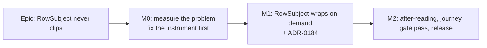

# Implementation Plan: A row's subject wraps rather than clips (#472)

- **Feature spec:** [`./feature-spec.md`](./feature-spec.md)
- **Status:** Draft — awaiting approval before implementation.
- **Owner:** web

## Breakdown

### Epic

**A row's subject wraps rather than clips** — closes `docs/TECH_DEBT.md` #472 and the name half of
the product owner's 2026-10-09 report; ADR-0179 follow-ups.

No feature flag (ADR-0088 D1): the rollback is reverting M1's commit.

---

### Milestone M0: measure the problem, with an instrument that can see it (ships no product change)

**Outcome:** a reading of how much of every name and every context is shown today, at the widths the
product owner asked for, taken by a harness proven able to see a truncated name.
**Entry point:** `Ships dark: measurement only; no user-facing change until M1.`
**Journey:** none (no capability claimed).

#### Feature: the harness counts what it claims to count

> **Description:** `measure-overview.mjs` reports truncation only when a text node's **direct parent**
> carries `text-overflow: ellipsis` (`apps/web/scripts/measure-overview.mjs:449-453`). A plan name's
> text sits in the router `<a>` inside the truncating span, so names are never counted.
> **Complexity:** S
> **Dependencies:** none
> **Risks:** the fix over-counts (e.g. a scrolling `fill` body has `scrollWidth > clientWidth` by
> design) → scope the check to descendants of `RowSubject` via a hook attribute (below) and keep the
> region-wide check as it is for the other sections.
> **Testing requirements:** non-vacuity control (SC-2) run on today's tree before any reading is
> believed.

##### Task M0-T1 — count clipping on every element of a subject (≈ one PR, scripts only)

- **Description:** for each row subject, walk every element (not text-node parents) and report any
  with `scrollWidth > clientWidth` or with an ellipsis that is in effect; report **name** and
  **context** separately, as shown/needed px **and characters** (characters via a `Range` over the
  visible width — the brief asked for both).
- **Complexity:** S
- **Dependencies:** —
- **Risks:** a hook attribute on `RowSubject` is a product change → add `data-row-subject` in M0 as
  the only product edit (precedent: `data-overview-*`, `PlanStandingRow.tsx:41-50`), or locate rows by
  structure if the product owner prefers M0 to touch no product file.
- **Testing:** the control: on today's tree, at 1912 × 948, at least one **name** is reported
  truncated (M0 photographed `Dockside — Ancillary work…`, `landing-two-columns/m0-measurement.md:67`).
  None reported → the instrument is wrong; stop.
- **Development steps:**
  1. `git log -- apps/web/src/components/ui/page/list-row.tsx` to confirm `RowSubject` is as measured
     in `m1-after-run.md`.
  2. Extend `readSplit` with a subject walk; print a per-cell table: rows, names clipped, contexts
     clipped, median px and chars shown of each.
  3. Run the control first and record it.

##### Task M0-T2 — add the long names to the fixture, and the missing widths

- **Description:** add to `landing-fixture.mjs`: `NetPoint reference: power-plant programme` (42 ch,
  the product owner's example), a **Draft** plan with a long name in "Recently changed", and one plan
  with name, project and client at the 200-character DTO maximum. Add cells **1465 × 900**,
  **1646 × 1000** (M9.4's reference) and **320 × 800**; keep the existing matrix.
- **Complexity:** S
- **Dependencies:** M0-T1
- **Risks:** the 200-char plan dominates a box and hides others from "whole rows visible" → report
  SC-5 with and without it.
- **Testing:** the run itself.
- **Development steps:**
  1. Fixture additions via the public API, as the existing fixture does.
  2. Run with `PLAYWRIGHT_CHROMIUM_PATH=/opt/pw-browsers/chromium-1194/chrome-linux/chrome` against
     the local stack; record the build from the shell footer.
  3. Write `m0-measurement.md` here: names and contexts shown at **1024, 1280, 1465, 1912** (Explorer
     default) plus the rest of the matrix; rows per capped box at 1646 × 1000 and 1912 × 948; region
     heights. Photographs in `m0/`.
  4. **Decision rule, committed now:** if M0 shows names are never clipped at any cell, the spec's
     name half is withdrawn in writing and M1 proceeds on context alone. Otherwise M1 as specified.

---

### Milestone M1: `RowSubject` wraps on demand (shippable slice)

**Outcome:** on the organisation landing, every plan name, Draft badge, project and client in "Jump
back in", "Where the work stands" and "Recently changed" is shown in full at every width.
**Entry point:** the organisation landing (`/orgs/$orgSlug`, the shell's wordmark / first screen after
sign-in) — the three sections named `Jump back in`, `Where the work stands`, `Recently changed`.
**Journey:** `e2e-overview` `overview.spec.ts` — a new step seeds a 57-character plan, opens the
landing at 1477 × 900 and 1912 × 948 with the Explorer open, and asserts no element inside any
`RowSubject` has `scrollWidth > clientWidth` and that the full name is visible text (SC-7).

#### Feature: the component contract

> **Description:** spec §4.6 — props unchanged; nothing truncates; wraps between name group and
> context first, then at words; badge glued to the name.
> **Complexity:** S
> **Dependencies:** M0
> **Risks:** (1) height cost at two columns (CQ-1) → SC-5 is graded in M2, stop on failure;
> (2) badge vertical alignment on a wrapped name → first-baseline alignment, checked in the M2
> photographs; (3) the sizing ratchet refuses an arbitrary value → spacing-step utilities only.
> **Testing requirements:** unit (structural contract), journey (SC-7), harness (M2).

##### Task M1-T1 — rewrite `RowSubject` and its docblocks

- **Description:** `apps/web/src/components/ui/page/list-row.tsx:18-60` only. Remove `truncate` and
  `shrink-[3]`; make the `
` a wrapping, first-baseline-aligned flex line with a row gap; group name
  and badge in one child; keep `min-w-0` on both children. Rewrite the `context` prop docblock and the
  component docblock (what it does now, why M9 D1 is reversed, and why its "name survives" claim was
  false — flex-shrink scales by base size). `ListRow` and `rowLinkClass` unchanged.
- **Complexity:** S
- **Dependencies:** M0
- **Risks:** a consumer passes a badge carrying `shrink-0` (`RecentlyChangedRow.tsx:89`,
  `PlanStandingRow.tsx:78`); harmless inside the name group — leave the call sites alone (no consumer
  edit is the point of keeping props stable).
- **Testing:** replace `page-archetypes.test.tsx:381-395` (which asserts a class string) with: no
  descendant carries `truncate`, `text-ellipsis`, `whitespace-nowrap`, `overflow-hidden` or
  `line-clamp-*`; the badge is inside the same child as the name; DOM order name → badge → context;
  one `
`. Keep the two existing cases. State in the test's comment that jsdom cannot lay out, so
  the behaviour is the journey's (ADR-0110).
- **Development steps:**
  1. Edit the component; run `pnpm --filter @repo/web test` for the page archetypes and overview
     suites.
  2. `plan-standing-row.test.tsx`, `jump-back-in.test.tsx`, `freshness-line.test.tsx`,
     `overview-screen.test.tsx` stay green unchanged (they query by role and text).

##### Task M1-T2 — the journey step

- **Description:** `apps/web/e2e-overview/overview.spec.ts`: seed a long-named plan (the suite's
  `createPlan` helper, `support.ts:41`), then the two-width assertion in SC-7. The assertion carries a
  pinned positive control (it must find ≥ 1 `RowSubject` before its verdict counts), per ADR-0146's
  recorded vacuous-journey lesson.
- **Complexity:** S
- **Dependencies:** M1-T1
- **Risks:** the suite's organisation holds one plan (`m9-density-design.md:190-197`), so a
  long-name plan must be added rather than assumed → the step creates its own.
- **Testing:** run red against M1-T1 reverted (it must fail on today's `RowSubject`), then green.
  `scripts/e2e-local.sh web:overview`.
- **Development steps:**
  1. Write the step; verify red on the old component; verify green.

##### Task M1-T3 — ADR-0184 and the register

- **Description:** ADR-0184 from the spec's §4.7 outline; one line in CLAUDE.md §16; a dated note
  under M9 D1 in `organisation-landing-portfolio/m9-density-design.md` pointing at it (appended, not
  edited); grep `docs/DESIGN_SYSTEM.md` and `docs/COMPONENT_LIBRARY.md` for row-truncation guidance
  and correct it; changeset (`@repo/web` minor: visible layout change).
- **Complexity:** S
- **Dependencies:** M1-T1
- **Risks:** `check:adr-coverage`, `check:counts` (ADR count in the banner) → `pnpm prepush`.
- **Testing:** `pnpm prepush`.
- **Development steps:**
  1. Write the ADR; add the §16 line; update the banner count if `check:counts` asks.
  2. `pnpm changeset`.

---

### Milestone M2: after-reading, gate pass, release

**Outcome:** the success criteria judged on the shipped tree; #472 closed.
**Entry point:** as M1.
**Journey:** as M1 (already landed).

#### Feature: judge it

> **Description:** same harness, same fixture, one sitting.
> **Complexity:** S
> **Dependencies:** M1
> **Risks:** SC-5 fails → stop and report the number to the product owner; do **not** reintroduce
> truncation or a line clamp to pass it (M9's rule, `m9-density-design.md:119-120`).
> **Testing requirements:** SC-1 to SC-7.

##### Task M2-T1 — the after-reading

- **Description:** `m2-after-run.md` and `m2-verdict.md`: every SC judged PASS/FAIL with its number;
  before/after median row height per cell; whole rows per capped box at 1646 × 1000 and 1912 × 948;
  photographs at 1024, 1280, 1465, 1912.
- **Complexity:** S
- **Dependencies:** M1
- **Risks:** a reading taken on a stale build → read the build off the shell footer.
- **Testing:** the harness.
- **Development steps:**
  1. Run; write; close #472 citing the verdict (ADR-0131: a citation is what closes it).

##### Task M2-T2 — reviews

- **Description:** **component-reviewer** (contract, tokens, the replaced test), **ux-reviewer**
  (the CQ-1 trade-off on the 1912 photographs; the badge on a wrapped name), **accessibility-reviewer**
  (1.4.4 / 1.4.10 at SC-6; reading order; the WCAG reading in spec §4.7). No backend, API, security or
  database reviewer: nothing in those layers changes. Fold blocking findings with a regression test
  verified red first.
- **Complexity:** S
- **Dependencies:** M2-T1
- **Risks:** —
- **Testing:** per finding.
- **Development steps:**
  1. Run the three reviewers; fold; re-run `pnpm prepush` and `scripts/e2e-local.sh web:overview`.

## Sequencing & slices

M0 (scripts and an optional hook attribute only) → M1 (one component, its tests, the journey step,
the ADR) → M2 (readings, reviews, release). Each lands on `main` releasable: M0 changes no rendering;
M1 is one revertible commit for the product change. Spec §3.3 predicts the cost; M2 grades it.

## Definition of Done (per task)

Each task's PR must satisfy the Feature Completion Criteria in [`docs/PROCESS.md`](../../PROCESS.md)
(code, tests, docs, security, performance, accessibility, Docker build, CI, changelog, version
impact), with `pnpm prepush` and `scripts/e2e-local.sh web:overview` **run**, not assumed.

## Risks & assumptions (rollup)

| Risk / assumption                                                                 | Likelihood | Impact | Mitigation                                                                                       |
| --------------------------------------------------------------------------------- | ---------- | ------ | ------------------------------------------------------------------------------------------------ |
| Two-column rows mostly go two-line; fewer whole rows per capped box at 1912 × 948 | high       | med    | CQ-1 asks first; SC-5 graded at 1646 × 1000; stop on failure, never re-truncate                  |
| The harness fix is itself wrong (counts nothing, or counts scroll bodies)         | med        | high   | SC-2 non-vacuity control on today's tree; scope the walk to `RowSubject`                         |
| Names turn out not to be clipped (the PO's examples were context)                 | low        | low    | M0-T2's decision rule withdraws that half in writing                                             |
| A 200-character name makes a very tall row                                        | low        | low    | Measured in M0; boxes scroll; no clamp by default (spec defaults)                                |
| Badge misaligned on a wrapped name                                                | med        | low    | First-baseline alignment; M2 photographs; ux-reviewer                                            |
| 1465 behaves unlike 1440                                                          | low        | low    | Measured in M0 rather than derived                                                               |
| This analysis drove no browser                                                    | certain    | med    | Stated in spec §3.2; every figure it relies on is cited to a dated reading, and M0 re-takes them |
