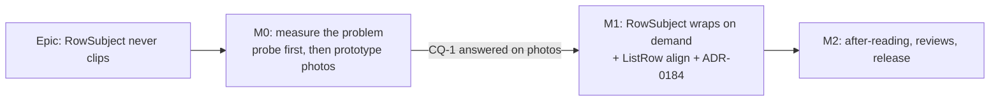

# Implementation Plan: A row's subject wraps rather than clips (#472)

- **Feature spec:** [`./feature-spec.md`](./feature-spec.md)
- **Status:** Draft — awaiting approval before implementation.
- **Owner:** web

## Breakdown

### Epic

**A row's subject wraps rather than clips** — closes `docs/TECH_DEBT.md` #472 and the name half of
the product owner's 2026-10-09 report; ADR-0179 follow-ups.

No feature flag (ADR-0088 D1): the rollback is reverting M1's commit.

---

### Milestone M0: measure the problem, with an instrument that can see it

**Outcome:** a reading of how much of every name and every context is shown today, at the widths the
product owner asked for, by a probe proven able to see a clipped name; and before/after photographs
of an uncommitted prototype on which CQ-1 is answered.
**Entry point:** `Ships dark: no visible change. M0's one product edit is an inert data-row-subject
attribute on RowSubject's 
, which renders nothing and exists so the SAME selector measures the
tree before and after M1. M1 surfaces the capability.`
**Journey:** none (no capability claimed).

#### Feature: the probe counts what it claims to count

> **Description:** `measure-overview.mjs` reports truncation only when a text node's **direct parent**
> carries `text-overflow: ellipsis` (`apps/web/scripts/measure-overview.mjs:449-453`), and an element
> `scrollWidth` check would be no better: the name's text sits in an **inline** `<a>`, whose
> `scrollWidth` and `clientWidth` are 0. The probe uses `Range.getClientRects()` instead (spec SC-1).
> **Complexity:** S
> **Dependencies:** none
> **Risks:** counts a scrolling `fill` body's vertical clipping → horizontal comparison only, against
> the nearest `overflow-x` ≠ `visible` ancestor and the viewport.
> **Testing requirements:** the SC-2 before-control on today's tree, before any reading is believed.

##### Task M0-T1 — the `Range` probe, and the hook attribute

- **Description:** one exported probe function (in `apps/web/scripts/`, importable by the
  `e2e-overview` suite so harness and journey share it): for each `[data-row-subject]`, for every text
  node, `Range.getClientRects()`; each rect compared horizontally against the nearest clipping or
  scrolling ancestor and the viewport (> 0.5 px past an edge = clipped); plus any `text-overflow:
ellipsis` in effect on an ancestor up to the subject. Reports name and context separately, in px and
  characters (characters by walking the `Range` to the clip edge). Also reports per-subject line rects
  (for SC-4, SC-7's order check and SC-8's no-overlap check).
- **Complexity:** S
- **Dependencies:** —
- **Risks:** `data-row-subject` is a product edit → it is inert (no style, no ARIA), named in the
  milestone's entry-point line, and precedented (`data-overview-*`, `PlanStandingRow.tsx:41-50`).
- **Testing:** **before-control:** on today's tree at 1912 × 948 the probe reports at least one
  **name** clipped (M0 photographed `Dockside — Ancillary work…`, `landing-two-columns/m0-measurement.md:67`).
  Silent → the probe is wrong; stop.
- **Development steps:**
  1. `git log -- apps/web/src/components/ui/page/list-row.tsx` to confirm `RowSubject` is as measured
     in `m1-after-run.md`.
  2. Add `data-row-subject` to `RowSubject`'s `
`; nothing else in the component.
  3. Write the probe; wire it into `readSplit`; print a per-cell table: rows, names clipped, contexts
     clipped, median px and characters shown of each, median row height.
  4. Run the before-control and record it.

##### Task M0-T2 — fixture additions and the missing cells

- **Description:** add to `landing-fixture.mjs`: `NetPoint reference: power-plant programme` (42 ch,
  the product owner's example), a **Draft** plan with a long name in "Recently changed", and one plan
  with name, project and client at the 200-character DTO maxima. Add cells **1465 × 900**,
  **1646 × 1000** (M9.4's reference) and **320 × 800**; add the SC-6 injection (`html { font-size:
200% }`) at 1280 × 800 and 1912 × 948 and the SC-8 text-spacing injection at 1280, 1477 and 1912.
- **Complexity:** S
- **Dependencies:** M0-T1
- **Risks:** the 200-char plan dominates a box → report SC-5 with and without it.
- **Testing:** the run itself.
- **Development steps:**
  1. Fixture additions through the public API, as the existing fixture does.
  2. Run with `PLAYWRIGHT_CHROMIUM_PATH=/opt/pw-browsers/chromium-1194/chrome-linux/chrome` against
     the local stack; record the build from the shell footer.
  3. Write `m0-measurement.md` here: names and contexts shown at **1024, 1280, 1465, 1912** (Explorer
     default) and the rest of the matrix; whole rows per capped box at 1646 × 1000 and 1912 × 948;
     region heights; the name's available width in characters at 320 × 800 and at 200 % (SC-6's
     ~12-character clause, **today**). Photographs in `m0/`.
  4. **Decision rules, committed now:** (a) if names are never clipped at any cell, the spec's name
     half is withdrawn in writing and M1 proceeds on context alone; (b) if the name's available width
     is under ~12 characters at 320 px or 200 % **today**, `ListRow`'s trailing block is in scope and
     the spec is amended before M1.

##### Task M0-T3 — the throwaway prototype, photographed (CQ-1 is answered here)

- **Description:** apply spec §4.6 to a local tree **without committing it** — `RowSubject` markup,
  `ListRow align`, the two consumers' `align="baseline"` — and photograph the landing **before and
  after at 1912 × 948 and 1646 × 1000**, Explorer at default, on the M0-T2 fixture. Run the probe on
  the prototype too, for an early read of SC-1, SC-3, SC-4 and SC-5. Commit **only** the photographs and
  a short `m0-prototype.md` (whole rows per box, rows that went two-line, the badge-alone case if the
  fixture produces it, the moved finish date in "Where the work stands"). Discard the code
  (`git checkout -- apps/web/src`).
- **Complexity:** S
- **Dependencies:** M0-T2
- **Risks:** prototype code leaks into a commit → the task's last step is `git status` showing only
  `docs/specs/row-subject-truncation/`; M1 re-implements from the spec, not from the prototype.
- **Testing:** none beyond the probe run; it is evidence, not product.
- **Development steps:**
  1. Edit locally; take the four photographs and the probe reading.
  2. Discard the edit; commit the photographs and `m0-prototype.md`.
  3. **Put CQ-1 to the product owner with the photographs.** M1 may be built while waiting, but **M1
     does not merge until CQ-1 is answered.** If the answer is "height wins", M1 builds option D
     (spec §4.7) instead and the spec is amended.

---

### Milestone M1: `RowSubject` wraps on demand (shippable slice)

**Outcome:** on the organisation landing, every plan name, Draft badge, project and client in "Jump
back in", "Where the work stands" and "Recently changed" is shown in full at every width, and a
wrapped row's date or "actor · time" sits on the name's line.
**Entry point:** the organisation landing (`/orgs/$orgSlug`, the first screen after sign-in and the
shell's wordmark) — the sections named `Jump back in`, `Where the work stands`, `Recently changed`.
**Journey:** `e2e-overview` `overview.spec.ts` — a new step seeds a 57-character plan, opens the
landing at 1477 × 900 and 1912 × 948 with the Explorer open, runs **the M0 probe** (zero clipped
rects, zero ellipses), runs the **after-control** (injects a 300 px `inline-block` token into one
context at 320 × 800 and requires the probe to report it), and asserts reading order from rects
(name before badge before context; same line → left ascending, else top ascending) (SC-7).

#### Feature: the component contract

> **Description:** spec §4.6 — props unchanged; nothing truncates; `flex-wrap items-baseline gap-x-2
gap-y-0`; name group with a conditional word-space before the badge; `sr-only` ", " before the
> context; `ListRow` gains additive `align`.
> **Complexity:** S
> **Dependencies:** M0 (and CQ-1 answered, before merge)
> **Risks:** (1) height at two columns → SC-5 graded in M2 with named remedies; (2) badge alignment on
> a wrapped name → first-baseline; seen in M0-T3's photographs; (3) the sizing ratchet refuses an
> arbitrary value → spacing-step utilities only; (4) `align="baseline"` moves the finish date in
> "Where the work stands" → photographed in M0-T3 and accepted with CQ-1.
> **Testing requirements:** the journey and the probe carry the weight; the unit suite is a tripwire.

##### Task M1-T1 — `RowSubject`, `ListRow align`, the two consumers, docblocks

- **Description:** `apps/web/src/components/ui/page/list-row.tsx` — `RowSubject` per spec §4.6;
  `ListRow` gains `align?: 'center' | 'baseline'` (default `'center'`, emitting today's
  `items-center`). Rewrite the `context` prop docblock (`:25`), the `badge` prop docblock ("Never
  shrinks", `:27`), the component docblock (`:31-49`, including why the old "name survives" claim was
  false) and `ListRow`'s for the new prop. In `RecentlyChangedRow.tsx` and `PlanStandingRow.tsx`:
  remove the dead `className="shrink-0"` on the Draft badge (`:89`, `:78`) and pass
  `align="baseline"`. `JumpBackInSection` (no trailing), `NeedsAttentionSection` and the staff
  `status-summary` are not edited.
- **Complexity:** S
- **Dependencies:** M0
- **Risks:** a `Badge` without its caller's class looks different → `shrink-0` only governs flex
  shrink, which no longer applies; the photographs confirm.
- **Testing (tripwire only — jsdom lays nothing out, ADR-0110):** replace
  `page-archetypes.test.tsx:381-395` (a class-string assertion) with: no descendant of the subject
  carries `truncate`, `text-ellipsis`, `whitespace-nowrap`, `overflow-hidden`, `line-clamp-*`,
  `order-*`, `flex-row-reverse` or `flex-wrap-reverse`; the badge is inside the name group; DOM order
  name → badge → context; one `
` with `data-row-subject`; the `sr-only` separator is present only
  with a context; no text after the name when there is no badge. Keep the two existing cases. A
  `ListRow` case: default emits `items-center`, `align="baseline"` emits `items-baseline`. The test's
  comment says the behaviour is the journey's, not this suite's.
- **Development steps:**
  1. Edit; run `pnpm --filter @repo/web test` for the page archetypes and overview suites.
  2. `plan-standing-row.test.tsx`, `jump-back-in.test.tsx`, `freshness-line.test.tsx`,
     `overview-screen.test.tsx` and the staff suites stay green (they query by role and text; check
     any `textContent` equality against the new `sr-only` ", ").

##### Task M1-T2 — the journey step

- **Description:** `apps/web/e2e-overview/overview.spec.ts`: seed a long-named plan (`createPlan`,
  `support.ts:41`), then SC-7 as written in the milestone header, importing the M0 probe. A pinned
  positive count (≥ 1 `[data-row-subject]` found) precedes the verdict (ADR-0146's vacuous-journey
  lesson).
- **Complexity:** S
- **Dependencies:** M1-T1
- **Risks:** the suite's organisation holds one plan (`m9-density-design.md:190-197`) → the step
  creates its own.
- **Testing:** red with M1-T1's `RowSubject` reverted (it must fail on the clipping assertion), then
  green; `scripts/e2e-local.sh web:overview`.
- **Development steps:**
  1. Write the step; verify red on the old component; verify green.

##### Task M1-T3 — ADR-0184, the design-system docs and the register

- **Description:** ADR-0184 from spec §4.7's outline; one line in CLAUDE.md §16; a dated note under M9
  D1 in `organisation-landing-portfolio/m9-density-design.md` pointing at it (appended, not edited);
  **`docs/COMPONENT_LIBRARY.md` and `docs/DESIGN_SYSTEM.md`**: update the `RowSubject` / `ListRow`
  entries (the wrap rule, the `align` prop) and correct any row-truncation guidance found by grep;
  changeset (`@repo/web` minor: visible layout change).
- **Complexity:** S
- **Dependencies:** M1-T1
- **Risks:** `check:adr-coverage`, `check:counts` → `pnpm prepush`.
- **Testing:** `pnpm prepush`.
- **Development steps:**
  1. Write the ADR; add the §16 line; update the banner count if `check:counts` asks.
  2. Edit the two design-system docs.
  3. `pnpm changeset`.

---

### Milestone M2: after-reading, reviews, release

**Outcome:** the success criteria judged on the shipped tree; #472 closed.
**Entry point:** as M1.
**Journey:** as M1 (already landed).

#### Feature: judge it

> **Description:** same probe, same fixture, one sitting.
> **Complexity:** S
> **Dependencies:** M1
> **Risks:** SC-5 fails → apply its named remedies in order (raise the `min-h-55` floor; rebalance
> rows), re-measure each; **never** re-truncate or `line-clamp`; if neither passes, report the number to
> the product owner.
> **Testing requirements:** SC-1 to SC-8.

##### Task M2-T1 — the after-reading

- **Description:** `m2-after-run.md` and `m2-verdict.md`: every SC judged PASS/FAIL with its number;
  before/after median row height per cell; whole rows per capped box at 1646 × 1000 and 1912 × 948,
  with and without the 200-character plan; the SC-6 and SC-8 injections; photographs at 1024, 1280,
  1465 and 1912.
- **Complexity:** S
- **Dependencies:** M1
- **Risks:** stale build → read the build off the shell footer.
- **Testing:** the probe, including both controls.
- **Development steps:**
  1. Run; write; close #472 citing the verdict (ADR-0131).

##### Task M2-T2 — reviews

- **Description:** **component-reviewer** (contract, tokens, the `align` prop, the tripwire),
  **ux-reviewer** (the 1912 photographs, ragged heights, the badge-alone case, the moved finish date),
  **accessibility-reviewer** (SC-6 and SC-8; the F69 verdict on today's tree; reading order; whether the
  `sr-only` ", " reads as a pause). This is a shared primitive's reading contract, so the
  accessibility pass runs **before** release (CLAUDE.md §19.13). No backend, API, security or database
  reviewer: nothing in those layers changes. Fold blocking findings, each with a regression test
  verified red first.
- **Complexity:** S
- **Dependencies:** M2-T1
- **Risks:** —
- **Testing:** per finding.
- **Development steps:**
  1. Run the three reviewers; fold; re-run `pnpm prepush` and `scripts/e2e-local.sh web:overview`.

## Sequencing & slices

M0-T1 → M0-T2 → M0-T3 (photographs; CQ-1 put to the product owner) → M1 (may be built in parallel
with the wait, **merges only after CQ-1**) → M2. M0 changes no rendering; M1 is one revertible commit
for the product change.

## Definition of Done (per task)

Each task's PR must satisfy the Feature Completion Criteria in [`docs/PROCESS.md`](../../PROCESS.md)
(code, tests, docs, security, performance, accessibility, Docker build, CI, changelog, version
impact), with `pnpm prepush` and `scripts/e2e-local.sh web:overview` **run**, not assumed.

## Risks & assumptions (rollup)

| Risk / assumption                                                                 | Likelihood | Impact | Mitigation                                                                                          |
| --------------------------------------------------------------------------------- | ---------- | ------ | --------------------------------------------------------------------------------------------------- |
| Two-column rows mostly go two-line; fewer whole rows per capped box at 1912 × 948 | high       | med    | CQ-1 answered on M0-T3's photographs; SC-5 graded; remedies are floor then rebalance, never clamp   |
| The probe is wrong (an inline box reads 0, or scroll bodies are counted)          | med        | high   | `Range` rects, horizontal only; before-control (M0) and after-control (M1 journey)                  |
| The trailing block squeezes the name at 320 px / 200 %                            | med        | med    | SC-6's ~12-character clause, measured today in M0-T2; `ListRow` in scope by amendment if it fails   |
| Prototype code is committed                                                       | low        | med    | M0-T3 ends with `git status` clean outside the spec directory                                       |
| Names turn out not to be clipped                                                  | low        | low    | M0-T2 decision rule (a)                                                                             |
| A 200-character row leaves a bottom box under one whole row                       | low        | low    | Raise the floor for it; if the window cannot give that, the box scrolls and the reading is recorded |
| Badge alone at the start of a name's last line                                    | med        | low    | Accepted in the spec; seen in the photographs; ux-reviewer                                          |
| The `sr-only` ", " is announced as "comma" by some reader                         | low        | low    | accessibility-reviewer in M2; drop it and record the run-on as a limitation if so                   |
| This analysis drove no browser                                                    | certain    | med    | Spec §3.2; every figure is cited to a dated reading, and M0 re-takes them                           |
