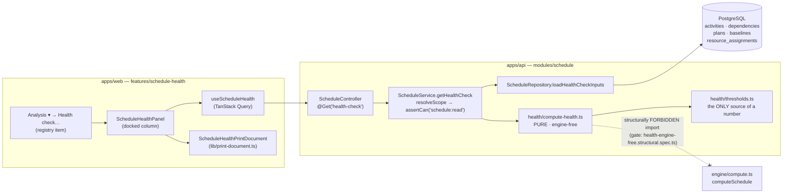
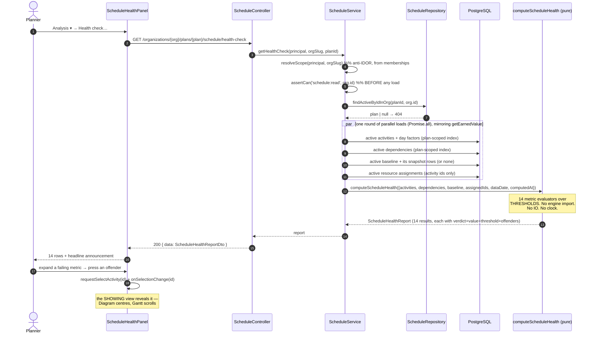
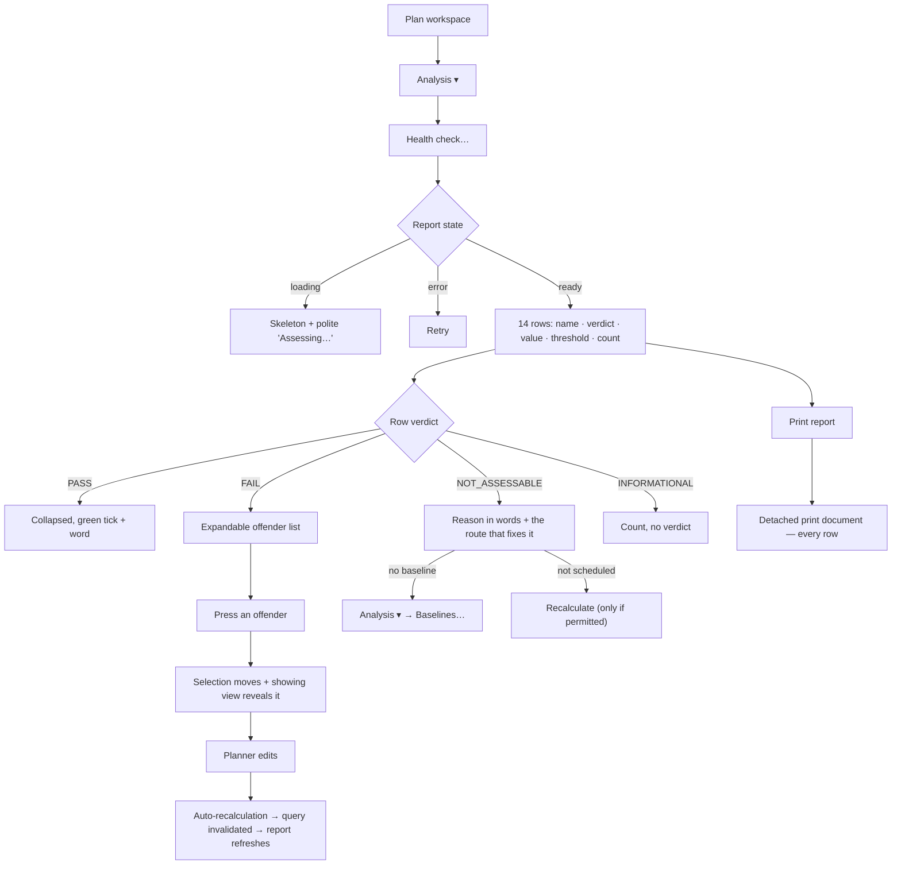

# Feature Spec: Schedule Health Check (DCMA 14-point assessment)

- **Status:** Draft — **awaiting approval before implementation**
- **Author(s):** feature-analyst (Product Owner / Solution Architect / Technical Lead hats)
- **Date:** 2026-08-27
- **Tracking issue / epic:** _(to be created)_
- **Roadmap link:** _not currently on `docs/ROADMAP.md` or `docs/BACKLOG.md`_ — verified by
  `Grep "DCMA|health check|14-point|quality check" docs/ -i`, which returns five hits, none of them a
  backlog or roadmap row. The nearest thing to a prior commitment is **ADR-0035 §16**, which names
  this feature by name and defers it:
  `docs/adr/0035-schedulepoint-cpm-semantics.md:143-145` — _"a **schedule-quality report** (danglers,
  redundant logic, open ends — DCMA-style) is a **later, non-blocking** add, not a scheduling
  behaviour."_ This spec is that add.
- **Related ADR(s):** consumes ADR-0021 (DAG), ADR-0022/0023 (recalc & date convention),
  ADR-0025 (baselines), ADR-0034 (conformance & the recalc parity gate), ADR-0035 §7/§16/§17–§20
  (semantics), ADR-0036/0037/0068 (minutes, per-activity calendars, hours-per-day), ADR-0038 (WBS),
  ADR-0039 (resources), **ADR-0042 (the read-model shape this copies)**, ADR-0059 (view peers),
  ADR-0072/0073 (audit classification), ADR-0081 (entry point + journey), ADR-0088 (flags),
  ADR-0092 (the dock), ADR-0093 (object vs command surface), **ADR-0094 (one meaning of "conflict")**,
  ADR-0100 (always report the withheld count), ADR-0105 (this spec is mandatory).
  **A new ADR is required** — outline in §4.7. Provisional number **ADR-0116** (highest filed is
  `docs/adr/0115-a-bound-governs-what-it-encloses.md`); the number is chosen **at filing time**, and a
  collision is recorded rather than routed around (ADR-0071's lesson, ADR-0079's precedent).

---

## 0. How to read the evidence in this document

Every decision-bearing claim below names the command, the file and line, or the test that established
it (`docs/PROCESS.md` "Decision-bearing claims carry their evidence"; ADR-0076). **Claims inherited
from the brief that started this work were checked like any other, and two of them were wrong** —
see §3.6. Where a claim is reasoned from specification rather than observed, it says so.

---

## 1. Business understanding

### Problem

A construction planner is routinely required to **prove that a programme is well built** before a
client, a PMO or a QS will accept it. The public de-facto standard for that proof is the **DCMA
14-Point Schedule Assessment**: fourteen mechanical checks over the network's construction — dangling
logic, leads, lag abuse, non-FS relationships, hard constraints, absurd float, absurd durations,
impossible dates, unresourced work, and three baseline-relative performance measures.

SchedulePoint today can tell a planner that **this recalculation** hit a problem — a mandatory
constraint that broke logic, a hand placement that conflicts with logic, a levelling window blown
(`apps/web/src/features/tsld/render/conflicts.ts:81-97`, the three `CONFLICT_FLAGS`). It cannot tell
them anything about **how the plan is built**. Those are different questions and the product only has
a vocabulary for the first.

The practical consequence is the one this product exists to remove: a planner who wants a health
assessment **exports to XER and opens it in the tool we exist to replace** — which is exactly the
argument ADR-0059 used to justify the Gantt, one artefact along. The export path exists
(`interchange:export`, ADR-0050 M4a), so the workflow is available and the assessment is not.

**Why now.** The inputs all landed and nothing consumed them. The engine's conformance matrix is
closed (ADR-0034); float is persisted in whole working days on the activity's own calendar
(`apps/api/src/modules/schedule/schedule.repository.ts:662-670`); the constraint vocabulary is
complete (`apps/api/prisma/schema.prisma:487-496`); baselines snapshot the frozen dates a
baseline-relative metric needs (`schema.prisma:1812-1892`); and ADR-0042 established the exact shape
this feature should take — **a GET that computes from persisted rows and never touches the engine**.
This is the ADR-0067 / ADR-0070 / ADR-0071 shape one more time: _the data has been there for a year
and nothing in the product can read it that way._

### Users

All roles are organisation-scoped (ADR-0012/0016). Mapping to the existing permission codes
(`apps/api/src/common/auth/org-permissions.ts`):

| Role               | Need                                                                                                | Access                                                               |
| ------------------ | --------------------------------------------------------------------------------------------------- | -------------------------------------------------------------------- |
| **Planner**        | Fix the findings before submitting the programme; re-run until it passes.                           | Full — reads the report, and already holds every write it points at. |
| **Org Admin**      | Assure a programme built by someone else; hand the report to a client.                              | Full.                                                                |
| **Contributor**    | Understand why a Planner is asking them to re-report progress on an activity flagged Invalid dates. | Read-only report (writes nothing).                                   |
| **Viewer**         | Read the assessment of a programme they are reviewing.                                              | Read-only report.                                                    |
| **External Guest** | —                                                                                                   | **Out of scope for v1**, stated rather than implied — see §2.5.      |

The report is gated on **`schedule:read`**, which `HIERARCHY_READ` grants to every member including
Viewer (`org-permissions.ts:70`, `:176`, `:307`). It is deliberately **not** `cost:read`: the
resource-histogram read made exactly this call and its comment is the precedent —
_"The units histogram is **schedule data, not cost** (Q5), so it is deliberately NOT `cost:read`-gated"_
(`apps/api/src/modules/schedule/schedule.service.ts:754-758`). The consequence for DCMA metric 10 is
a deliberate narrowing, stated in §3.2.

### Primary use cases

1. **Assess this plan now.** Open the report; see fourteen rows, each pass / fail / not assessable,
   each with its threshold, its measured value and its offender count.
2. **Find the offenders.** Expand a failing metric; see the named activities or relationships;
   press one to select it and bring it into view in whichever view is showing.
3. **Fix and re-check.** Correct the logic, recalculate, re-open the report, watch a row go green.
4. **Hand it over.** Print or save the report as a document carrying the plan name, the data date,
   the computed-at instant, and every metric's verdict — including the ones that could not be
   assessed and why.

### User journeys

**Happy path.** Planner opens a plan → `Analysis ▾` → **Health check…** → the docked panel computes
and renders 14 rows → three are red → they expand "Missing logic (11)" → press an offender → the
diagram centres and selects it → they add a predecessor → auto-recalculation runs (ADR-0032 M3) →
the panel refreshes → the row reads 9 → repeat → print the report for the submission pack.

**Alternate — never calculated.** A plan with no computed schedule cannot answer six of the fourteen.
The panel says so per metric ("not assessable — this plan has not been calculated") and offers
**Recalculate** where the caller holds `schedule:calculate`; a Viewer gets the explanation and no
button (the `FloatPathsPanel` rule, `apps/web/src/features/float-paths/components/FloatPathsPanel.tsx:45-49`).

**Alternate — no baseline.** Metrics 11, 13 and 14 are baseline-relative. With no active baseline
they read **not assessable**, naming the missing input, with a link to `Analysis ▾ → Baselines…`.
**They are never faked and never silently omitted.**

**Alternate — empty plan.** Zero activities: every ratio metric has a zero denominator. The report
renders "not assessable — this plan has no activities" rather than a wall of `0/0 = pass`, which
would read as a clean bill of health for a plan that does not exist.

### Expected outcomes

- A planner can produce a client-grade schedule assessment **without leaving SchedulePoint**, closing
  the "export to the competitor to answer a question about our own data" gap.
- Fourteen named defect classes become **findable and navigable** rather than discoverable only by
  reading a 500-row programme.
- The product gains a vocabulary for **schedule construction quality**, distinct from and beside the
  existing recalculation-conflict vocabulary (§4.3 — the separation is the load-bearing design call).

### Success criteria

| Criterion                                                             | How it is measured                                                                                             |
| --------------------------------------------------------------------- | -------------------------------------------------------------------------------------------------------------- |
| The report is correct on plans whose defects are already known        | The seeded catalogue (ADR-0066): a per-metric API e2e asserts the expected verdict on the named plan — §3.5.   |
| A planner reaches an offender in **one press** from the finding       | The flag-on journey drives it against a real API (M2).                                                         |
| The read is fast enough to open without a spinner on a real programme | **Measured** at M0 on `plan:scale-500` and `plan:fixture-p6-torture-v1`; target p95 < 200 ms (CLAUDE.md §15).  |
| `computeSchedule` is byte-identical                                   | **Structural, not observational** — the module cannot import it, pinned by a test (§4.1).                      |
| No metric is ever silently omitted or faked                           | The response is total over a closed `HealthMetricId` union; a totality test plus a pinned not-assessable case. |

### Open questions

**Critical (answers change design or scope) — see §6 for the full statement:**

- **CQ-1 — Metric 12 (Critical Path Test).** Compute it, approximate it, or report it not assessed?
- **CQ-2 — Is the report a live read or a capturable snapshot?** _This is the only question whose
  answer forces a schema change_, and therefore the mandatory `database-architect` engagement
  (CLAUDE.md §19.3).
- **CQ-3 — Metric 1's exclusion rule** (which activities are allowed to dangle).
- **CQ-4 — Surface shape and handover artefact.**

**Non-critical — defaults stated, work proceeds on them:**

- Thresholds are **fixed to DCMA defaults in v1**, owned by the server and carried in the payload;
  per-organisation configurability is deferred (§4.5).
- The report is **not** in the External-Guest `SCHEDULE_READ` scope (ADR-0051) in v1.
- No CSV/JSON download in v1; the handover artefact is the printed document (subject to CQ-4).
- The report covers **one plan**. A programme-wide (cross-plan, ADR-0045) roll-up is out of scope.

---

## 2. Functional requirements

### User stories & acceptance criteria

> **US-1** — As a **Planner**, I want a DCMA-style health assessment of my plan, so that I can prove
> its quality to a client before submission.
>
> **Acceptance criteria**
>
> - **Given** a calculated plan with activities **when** I open the health check **then** I see
>   **fourteen** rows, one per DCMA metric, each with a name, a verdict, a measured value, the
>   threshold it was judged against, and an offender count.
> - **Given** any metric **when** it is rendered **then** its verdict is exactly one of
>   `PASS` / `FAIL` / `NOT_ASSESSABLE` / `INFORMATIONAL` — never blank, never absent.
> - **Given** the report **when** it renders **then** it states the **data date** and the
>   **computed-at** instant it was produced from, because a schedule assessment is meaningless
>   without both.

> **US-2** — As a **Planner**, I want to jump from a finding to the activity or relationship causing
> it, so that I can fix it rather than hunt for it.
>
> **Acceptance criteria**
>
> - **Given** a failing activity-scoped metric **when** I expand it **then** I see the offending
>   activities by `code` and `name`, ordered deterministically.
> - **Given** an offender **when** I press it **then** the workspace selection moves to that activity
>   and the **currently showing view** brings it into view — the Diagram centres its bar, the Gantt
>   scrolls its row (the existing seam, `apps/web/src/components/layout/workspace/plan-workspace-toolbar.tsx:1118-1121`).
> - **Given** more offenders than the response cap **when** the list renders **then** it says how many
>   were withheld, and the **count is always the true total** (ADR-0100's rule).
> - **Given** a relationship-scoped metric (2, 3, 4) **when** I expand it **then** offenders are named
>   as `predecessor → successor (type, lag)`; pressing one selects its **successor** activity, because
>   an edge is not selectable in either view.

> **US-3** — As a **Planner**, I want metrics that cannot be computed to say so and why, so that I
> never hand over a report that quietly omits a check.
>
> **Acceptance criteria**
>
> - **Given** a plan with no active baseline **when** the report renders **then** metrics 11, 13 and
>   14 read `NOT_ASSESSABLE` with the reason `NO_ACTIVE_BASELINE` and a route to capture one.
> - **Given** a plan that has never been calculated **when** the report renders **then** every metric
>   depending on computed dates reads `NOT_ASSESSABLE` with the reason `PLAN_NOT_SCHEDULED`.
> - **Given** metric 12 **when** the report renders **then** it reads `NOT_ASSESSABLE` with the reason
>   `REQUIRES_WHAT_IF_ANALYSIS` and an explanation of what the check is _(subject to CQ-1)_.
> - **Given** any `NOT_ASSESSABLE` metric **when** the report is printed **then** the printed document
>   carries the row and its reason. **A metric is never dropped from the document.**

> **US-4** — As a **Viewer or Contributor**, I want to read the assessment of a plan I can already
> read, so that I understand its state without being able to change anything.
>
> **Acceptance criteria**
>
> - **Given** I hold `schedule:read` in the plan's organisation **when** I request the report **then**
>   it succeeds.
> - **Given** I am not a member of the plan's organisation **when** I request the report **then** I
>   get **404** — never 403 (no existence oracle; the module-wide rule at
>   `apps/api/src/modules/schedule/schedule.controller.ts:52`).
> - **Given** I cannot recalculate **when** a metric is unassessable for want of a calculation
>   **then** I see the explanation and **no** Recalculate button.
> - **Given** I hold no `cost:read` **when** I read the report **then** the report is **byte-identical**
>   to the one a Planner reads. **The report does not vary by role** (§3.2, metric 10).

> **US-5** — As a **Planner**, I want to hand the report over, so that it can go into a submission pack.
>
> **Acceptance criteria**
>
> - **Given** the report **when** I print it **then** the printed document renders **every** metric —
>   not the rows currently scrolled into view — carrying the plan name, data date, computed-at,
>   verdicts, values, thresholds and offender counts.
> - **Given** the printed document **when** a metric is not assessable **then** its reason is printed
>   in words, not as a code.

> **US-6** — As a **Planner**, I want the health check and the existing conflict review to be clearly
> different things, so that two numbers about my plan never disagree.
>
> **Acceptance criteria**
>
> - **Given** the health report **when** it renders **then** it does **not** restate the conflict
>   count as a metric; it links to `Next conflict` as a separate, named concern.
> - **Given** the code **when** the structural gate runs **then** the health vocabulary and
>   `ConflictKey` are provably disjoint and neither module imports the other (§4.3).

### Workflows

**W1 — Open the report.**

1. Planner presses `Analysis ▾` → **Health check…** (registry item, §4.6).
2. The panel docks beside the view and issues `GET …/schedule/health-check`.
3. Server resolves org from memberships (anti-IDOR), asserts `schedule:read`, loads the plan, then in
   parallel: active activities (+ day factors), active dependencies, the active baseline's snapshot.
4. The pure `computeScheduleHealth` produces 14 metric results.
5. The panel renders rows; the live region announces the headline ("11 of 14 checks passed, 2 failed,
   1 not assessable").

**W2 — Navigate to an offender.** Expand a metric → press an offender → host calls
`canvasUi.requestSelectActivity(id)` then `model.onSelectionChange(id)` → the showing view reveals it.

**W3 — Fix and re-check.** Any structural edit triggers the ADR-0032 coalesced auto-recalculation;
the recalculation invalidates the health-check query key, so the panel refreshes without a manual
re-run. (Same invalidation contract the schedule summary and EV already use.)

**W4 — Print.** `Print report` mounts a detached print document via `apps/web/src/lib/print-document.ts`
and calls `window.print()`. The document is built from the **same** report object the panel renders.

### Edge cases

| Case                                              | Expected behaviour                                                                                                                                                                                                               |
| ------------------------------------------------- | -------------------------------------------------------------------------------------------------------------------------------------------------------------------------------------------------------------------------------- |
| Plan with **0 activities**                        | Every ratio metric `NOT_ASSESSABLE` / `EMPTY_PLAN`. Never `0/0 = pass`.                                                                                                                                                          |
| Plan with activities but **0 dependencies**       | Metrics 2/3/4 `NOT_ASSESSABLE` / `NO_RELATIONSHIPS`. Metric 1 **fails loudly** — every activity is a dangler, which is the correct and useful answer.                                                                            |
| Plan **never calculated** (`earlyStart` all null) | 6, 7, 9, 11, 13 `NOT_ASSESSABLE` / `PLAN_NOT_SCHEDULED`. 1, 2, 3, 4, 5, 8, 10 still compute — they read definition, not output. This split is a real feature: a planner can assess logic before the first run.                   |
| **No active baseline**                            | 11, 13, 14 `NOT_ASSESSABLE` / `NO_ACTIVE_BASELINE`.                                                                                                                                                                              |
| Baseline exists but the **activity is not in it** | Excluded from metric 11's denominator; the count of such activities is reported as `notInBaselineCount` so a reader can see the baseline is stale.                                                                               |
| Plan of **only WBS summaries**                    | Summaries are excluded from every activity metric (they carry no logic by ADR-0038 invariant). Result: `NOT_ASSESSABLE` / `EMPTY_PLAN` — correct, since there is no work.                                                        |
| **All 2,000 activities** fail metric 1            | Offender list capped (default 50), `offenderCount` = 2,000, `offendersTruncated: true`. The count is never the capped length (ADR-0100).                                                                                         |
| **Sub-day** lag or duration                       | Computed from `lagMinutes` / `durationMinutes`, **never** from the rounded `lagDays` / `durationDays` (`packages/types/src/index.ts:665-676`, `:355-368`). A −120-minute lead reads `lagDays: 0` and must still count as a lead. |
| **Mixed-calendar** plan                           | Metric 8's day conversion uses each activity's **own** effective calendar (`apps/api/src/modules/activities/day-factor.ts:65-85`). Metrics 6/7 need no conversion (§3.1).                                                        |
| Plan in **Visual** scheduling mode                | Metrics read the **pure-network** columns (`earlyStart`/`totalFloat`), never the `visualEffective*` overlay — ADR-0033's rule that the visual pass never corrupts float. Stated in the report's header.                          |
| Levelled plan                                     | Metrics read the network columns, not `leveledStart/Finish` — ADR-0041 Q2, network float stays authoritative.                                                                                                                    |
| Concurrent recalculation mid-read                 | The read takes no lock. Worst case is a report one recalculation stale; `computedAt` in the payload is the plan's `schedule_computed_at`, so the staleness is **visible** rather than silent.                                    |
| Plan soft-deleted between open and refresh        | 404, surfaced as "This plan is no longer available".                                                                                                                                                                             |

### Permissions

| Action                           | Permission           | Roles                                   | Scope                                                                                               |
| -------------------------------- | -------------------- | --------------------------------------- | --------------------------------------------------------------------------------------------------- |
| Read the health report           | `schedule:read`      | Viewer, Contributor, Planner, Org Admin | Organisation resolved from the caller's memberships; the plan must be active in it (404 otherwise). |
| Recalculate (offered from panel) | `schedule:calculate` | Planner, Org Admin                      | Existing route, unchanged.                                                                          |
| Capture a baseline (offered)     | `baseline:capture`   | Planner, Org Admin                      | Existing route, unchanged.                                                                          |

**No new permission code.** Deny-by-default: `assertCan` runs **before any load**, exactly as
`summary` / `floatPaths` / `getEarnedValue` do (`schedule.service.ts:524`, `:601`, `:662`).
**The feature writes nothing**, so it is not pen-gated (ADR-0028) — the pen guards structural plan
writes and there are none here.

### Validation rules

The endpoint takes **no body and no query parameter** in v1 beyond the path params, both already
validated (`ParseUuidPipe` on `:planId`). Thresholds are server-owned constants, not inputs — which
removes a whole class of validation and is one reason configurability is deferred (§4.5).

If CQ-1 is answered "compute metric 12", that adds one optional query parameter; if CQ-2 is answered
"snapshot", that adds a POST with a name field. Both are specified in their milestones, not here.

### Error scenarios

| Scenario                            | Detection                    | User-facing result                                                                | Status |
| ----------------------------------- | ---------------------------- | --------------------------------------------------------------------------------- | ------ |
| No session                          | Auth guard                   | Redirect to sign-in                                                               | 401    |
| Not a member of the organisation    | `organizations.resolveScope` | "Plan not found."                                                                 | 404    |
| Member, but lacks `schedule:read`   | `assertCan`                  | "You do not have permission to perform this action."                              | 403    |
| Plan not in this org / soft-deleted | `plans.findActiveByIdInOrg`  | "Plan not found."                                                                 | 404    |
| Plan has no activities              | In the pure model            | **200** with every metric `NOT_ASSESSABLE` / `EMPTY_PLAN` — _not_ an error        | 200    |
| Plan never calculated               | In the pure model            | **200** with the output-dependent metrics `NOT_ASSESSABLE` / `PLAN_NOT_SCHEDULED` | 200    |
| No active baseline                  | In the pure model            | **200** with 11/13/14 `NOT_ASSESSABLE` / `NO_ACTIVE_BASELINE`                     | 200    |
| Rate limit                          | `@nestjs/throttler` (global) | "Too many requests"                                                               | 429    |

**Every "cannot assess" case is a 200 carrying a stated reason, never a 4xx.** A 422 would make the
whole report unavailable because one metric could not be answered — which is the opposite of the
honesty rule this feature is built on. (Contrast `floatPaths`, which 422s on a missing plan start
because that route has exactly one thing to return; this route has fourteen.)

---

## 3. Technical analysis

| Area           | Impact   | Notes                                                                                                                                                                                                                                              |
| -------------- | -------- | -------------------------------------------------------------------------------------------------------------------------------------------------------------------------------------------------------------------------------------------------- |
| Frontend       | **med**  | One new feature folder `features/schedule-health/`, one registry menu item, one docked panel, one print document. No new route. No change to the canvas painter.                                                                                   |
| Backend        | **med**  | One pure module + one repository loader + one service method + one controller `@Get` in the existing `modules/schedule`. No new Nest module ⇒ `pnpm check:counts` module figure unchanged.                                                         |
| Database       | **none** | **No schema change** — every column the fourteen metrics read already exists (§3.1, enumerated). _Unless CQ-2 is answered "snapshot", which makes `database-architect` mandatory and non-negotiable._                                              |
| API            | **low**  | One new GET under the existing `/organizations/:orgSlug/plans/:planId/schedule` controller; standard `{ data }` envelope; OpenAPI via `@nestjs/swagger`.                                                                                           |
| Security       | **low**  | Existing `schedule:read` + org scoping. No new egress: every number is derived from rows the caller can already read one at a time. **Metric 10 is deliberately narrowed so the report cannot vary by `cost:read`** (§3.2).                        |
| Performance    | **med**  | Whole-plan read: all active activities + all active dependencies + the active baseline snapshot. Same shape and same indexes as the EV read. **Must be measured at M0, not asserted.**                                                             |
| Infrastructure | **none** | No new service, env var, container or secret.                                                                                                                                                                                                      |
| Observability  | **low**  | Nothing new. It is a read; the existing request log line suffices. **No audit event** — classification and reasoning in §3.4.                                                                                                                      |
| Testing        | **high** | Pure unit suite per metric; API e2e against the **seeded catalogue** (ADR-0066); one flag-on-equivalent Playwright journey with its own config and CI step (which **does** change the suite count `pnpm check:counts` re-derives — a task, §Plan). |

### 3.1 Metric-by-metric column mapping — the honest table

This is the section the feature turns on. Each row names the persisted columns it reads and whether
SchedulePoint can compute it **today**. Column existence was established by reading
`apps/api/prisma/schema.prisma` (Activity `:853-1266`, ActivityDependency `:1313-1381`, Plan
`:652-843`, Baseline `:1735-1803`, BaselineActivity `:1812-1892`) and the enums at `:369-377`
(ActivityType), `:423-427` (ActivityStatus), `:487-496` (ConstraintType), `:1274-1279` (DependencyType).

**Denominator convention.** Unless a row says otherwise, activity metrics count **active
(`deleted_at IS NULL`) activities excluding `WBS_SUMMARY`**. Summaries are excluded because ADR-0038
makes "a summary carries no logic — never a dependency endpoint" a **service invariant**
(`schema.prisma:1010-1028`); counting them would make every well-built plan fail metric 1 by
construction. `LEVEL_OF_EFFORT` and `HAMMOCK` are **included** — they do carry logic, and an LOE with
no span is already a real defect the engine flags (`loeNoSpan`).

| #   | DCMA metric              | Threshold       | Reads (persisted)                                                                                                                                                                             | Computable today?                    | Semantic mismatch / decision                                                                                                                                                                                                                                                                                                                                                                                                                                                                                                                                            | Not-assessable when                        |
| --- | ------------------------ | --------------- | --------------------------------------------------------------------------------------------------------------------------------------------------------------------------------------------- | ------------------------------------ | ----------------------------------------------------------------------------------------------------------------------------------------------------------------------------------------------------------------------------------------------------------------------------------------------------------------------------------------------------------------------------------------------------------------------------------------------------------------------------------------------------------------------------------------------------------------------- | ------------------------------------------ |
| 1   | **Missing logic**        | ≤ 5 %           | `dependencies.predecessor_id`, `.successor_id`, `.deleted_at`; `activities.id`, `.type`, `.deleted_at`                                                                                        | **Yes**                              | Exclusion rule is **CQ-3**. Default: exclude `WBS_SUMMARY`; exclude at most one open-start `START_MILESTONE` and one open-end `FINISH_MILESTONE` (a **typed**, checkable rule rather than a positional guess). `missingPredecessorCount` and `missingSuccessorCount` reported separately so a reader can audit the exclusion.                                                                                                                                                                                                                                           | No activities                              |
| 2   | **Leads (negative lag)** | 0               | `dependencies.lag_minutes`                                                                                                                                                                    | **Yes**                              | Read **minutes**, not `lagDays` — a 2-hour lead rounds to `lagDays: 0` (`packages/types/src/index.ts:665-676`). This is ADR-0070's finding applied before it can become a defect.                                                                                                                                                                                                                                                                                                                                                                                       | No relationships                           |
| 3   | **Lags**                 | ≤ 5 %           | `dependencies.lag_minutes`                                                                                                                                                                    | **Yes**                              | Denominator = active relationships. Same minutes rule.                                                                                                                                                                                                                                                                                                                                                                                                                                                                                                                  | No relationships                           |
| 4   | **Relationship types**   | FS ≥ 90 %       | `dependencies.type`                                                                                                                                                                           | **Yes**                              | Report the full FS/SS/FF/SF breakdown, not just the FS share — a planner fixing this needs to know which type dominates. **SF is called out separately** in the copy: the playbook records it as "the least-used type and the easiest to get silently wrong" (`docs/TEST_PLAYBOOK.md:57`).                                                                                                                                                                                                                                                                              | No relationships                           |
| 5   | **Hard constraints**     | ≤ 5 %           | `activities.constraint_type`, `.secondary_constraint_type`                                                                                                                                    | **Yes**                              | **"Hard" is defined explicitly**, because SchedulePoint's enum is richer than DCMA's vocabulary: `MSO`, `MFO`, `MANDATORY_START`, `MANDATORY_FINISH`, `SNLT`, `FNLT`. `SNET`/`FNET` are **soft** and excluded. The **secondary** constraint counts (ADR-0035 §10) — an FNLT hidden in the secondary slot is exactly as hard. An activity carrying two hard constraints counts **once**.                                                                                                                                                                                 | No activities                              |
| 6   | **High float**           | ≤ 5 %           | `activities.total_float`                                                                                                                                                                      | **Yes, with no conversion**          | **The key finding.** `total_float` is stored in **whole working days on the activity's own calendar** — `schedule.repository.ts:662-670` converts from engine minutes using that activity's day factor. So "> 44 working days" is a direct integer comparison and the ADR-0036/ADR-0068 unit hazard **does not arise here**. Denominator excludes complete activities (a finished activity's float is not a planning risk).                                                                                                                                             | Plan never calculated (`total_float` null) |
| 7   | **Negative float**       | 0               | `activities.total_float`                                                                                                                                                                      | **Yes**                              | Same direct comparison. Note the report **does not** re-derive criticality: `criticalPathDefinition` / `criticalFloatThresholdMinutes` are plan options (`schema.prisma:675-699`) and the metric is about the sign of float, not about the critical set.                                                                                                                                                                                                                                                                                                                | Plan never calculated                      |
| 8   | **High duration**        | ≤ 5 %           | `activities.duration_minutes`, `.remaining_duration_minutes`, `.percent_complete`, `.actual_start`, `.actual_finish`; `calendars.hours_per_day_minutes` via the activity's effective calendar | **Yes**                              | Two decisions. (a) DCMA measures **remaining** duration on incomplete work: reuse the engine's own rule by **exporting** `resolveRemainingMinutes` (`schedule.service.ts:1149-1158`, currently a private function) rather than writing a second copy — the ADR-0065 `routeOrthogonal` argument. (b) Minutes → days uses the activity's **effective calendar** factor via the existing `attachDayFactors` (`apps/api/src/modules/activities/day-factor.ts:65-85`). Milestones (duration 0) and `WBS_SUMMARY` excluded.                                                   | No incomplete activities                   |
| 9   | **Invalid dates**        | 0               | `activities.early_start`, `.early_finish`, `.actual_start`, `.actual_finish`, `.status`; `plans.planned_start`                                                                                | **Yes**                              | Two sub-checks reported with separate counts: **forecast before the data date** (an incomplete activity whose `early_start` < `planned_start`) and **actual after the data date** (`actual_start` or `actual_finish` > `planned_start`). `plans.planned_start` **is** the data date and is `NOT NULL` since ADR-0033 M1 (`schema.prisma:756-762`), so there is no "no data date" branch.                                                                                                                                                                                | Plan never calculated (forecast half only) |
| 10  | **Resources**            | _informational_ | `resource_assignments.activity_id`, `.deleted_at`; `activities.duration_minutes`, `.type`                                                                                                     | **Yes, narrowed**                    | **Deliberate narrowing, stated rather than discovered.** DCMA 10 is "duration but no resource **or cost**". `activities.budgeted_expense` is **conditionally nulled for a caller without `cost:read`** (`packages/types/src/index.ts:475-484`), so including the cost half would make a handed-over report say different things to different readers. v1 reads **assignment existence only** — schedule data, the histogram precedent (`schedule.service.ts:754-758`) — and the report **says so in words**. `INFORMATIONAL`: reported with a count, never a pass/fail. | No activities with duration                |
| 11  | **Missed activities**    | ≤ 5 %           | `baseline_activities.baseline_finish`, `.source_activity_id`; `activities.actual_finish`, `.early_finish`, `.status`                                                                          | **Yes, with an active baseline**     | An activity is "missed" when its **actual finish** is later than its baseline finish, or (incomplete) its **forecast finish** is. Denominator = activities present in the baseline snapshot **and** baselined to finish on or before the data date. Activities absent from the snapshot are excluded and **counted** (`notInBaselineCount`), because a stale baseline is itself the finding.                                                                                                                                                                            | No active baseline; plan never calculated  |
| 12  | **Critical Path Test**   | _integrity_     | —                                                                                                                                                                                             | **No — see CQ-1**                    | Classically interactive: inject a large delay into a critical activity and confirm the project finish moves by the same amount. It cannot be answered from persisted rows at all. **v1 default: `NOT_ASSESSABLE` / `REQUIRES_WHAT_IF_ANALYSIS`, with the check explained in the report.** A computed version needs a live `computeSchedule` call — see CQ-1 for how that is done without touching the parity gate.                                                                                                                                                      | Always, in v1 (by decision, stated)        |
| 13  | **CPLI** ≥ 0.95          | ≥ 0.95          | `plans.planned_start`; project finish (max `early_finish` over active activities); a **target finish**                                                                                        | **Only when a target finish exists** | `CPLI = (CPL + TF_to_target) / CPL`, where `CPL` = working days from the data date to the project finish. The **target** comes, in order: (1) the active baseline's `captured_project_finish` (`schema.prisma:1751-1753`); (2) an `FNLT`/`MFO`/`MANDATORY_FINISH` constraint on a `FINISH_MILESTONE`. If neither exists, **`NOT_ASSESSABLE` / `NO_TARGET_FINISH` — a target is never invented.** The source used is named in the payload so the reader knows which.                                                                                                     | No target finish; plan never calculated    |
| 14  | **BEI** ≥ 0.95           | ≥ 0.95          | `baseline_activities.baseline_finish`, `.source_activity_id`; `activities.actual_finish`; `plans.planned_start`                                                                               | **Yes, with an active baseline**     | `BEI = (activities actually complete) / (activities the baseline said would be complete by the data date)`. Zero denominator (nothing was due yet) ⇒ `NOT_ASSESSABLE` / `NOTHING_DUE`, **not** a division producing `Infinity`.                                                                                                                                                                                                                                                                                                                                         | No active baseline                         |

**Conclusion: 11 of 14 metrics are fully computable from existing persisted columns today. Two more
(11, 14 — and 13's preferred target) require an active baseline, which is an existing capability the
planner controls, not a gap. One (12) is structurally uncomputable from persisted state and is
reported as such. No schema change is needed for any of them.**

### 3.2 The two decisions that keep the report role-invariant

1. **Metric 10 reads assignment existence, not cost.** Established above; the alternative (branching
   on `cost:read`) would produce two different documents from one URL, which is unacceptable for an
   artefact whose purpose is to be handed over.
2. **The endpoint is `schedule:read`, matching `summary` / `float-paths` / `resource-histogram`**, and
   returns no money, no rate and no budget field at all. There is therefore no `cost:read` branch in
   the payload and no conditional-nulling to get wrong.

### 3.3 The recalculation parity gate — why it is untouched **by construction**

**The CPM engine is not imported, not modified, and the ADR-0034 recalculation parity gate is
untouched by construction.** This is the ADR-0042 shape verbatim: a `GET` that computes from persisted
rows. Concretely:

- The pure model lives in `apps/api/src/modules/schedule/health/` and **imports nothing from
  `./engine/`** except the one shared remaining-duration rule (§3.1 metric 8), which is itself a
  service-boundary helper and not the engine's `compute.ts`. A structural test asserts the import ban
  and is **verified red first** (M1-T2).
- `computeSchedule`'s signature does not change; no new input reaches it; no persisted engine-owned
  column is written. There is nothing for the golden suites to diverge on.
- The read takes **no plan write lock** and no pen (ADR-0028), matching `getEarnedValue`.

_If CQ-1 is answered "compute metric 12", the honest form changes and the ADR must say so:_ that
milestone **calls** `computeSchedule` read-only in a separate route, exactly as `floatPaths` already
does (`schedule.service.ts:580-645`) — it still does not **modify** it, still persists nothing, and
still passes no new input, so parity holds; but "the engine is not imported" would become false for
that route and must not be repeated there.

### 3.4 Audit classification — ADR-0073's two tests, applied and stated

- **Test 1, durability.** The read destroys nothing and changes nothing. A row saying "somebody looked
  at the health of a plan" is not evidence of anything a reader would later need. **Fails the test.**
- **Test 2, blast radius.** It changes no rule other people's work is judged by. **Fails the test.**

⇒ **Not audited.** It joins the existing sibling reads with `REASONS.READ`, one line in
`UNAUDITED_ROUTES` — the precedent being literally its four neighbours at
`apps/api/src/modules/audit/audit-coverage.structural.spec.ts:229-232`. The route census will
**fail** without that line, so this is enforced rather than remembered.

**Contrast, deliberately named:** ADR-0086 D5 inverts this rule for the staff console, where reads
_are_ audited because the read is itself the privileged act across a tenant boundary
(`audit-coverage.structural.spec.ts:52-62`). That inversion does not apply here: the caller is inside
their own organisation and every number in the report is derived from rows they can already read one
at a time.

### 3.5 Fixtures — what the seed catalogue gives us, and what it does not

The ADR-0066 catalogue is a ready-made oracle for most of this. Plan keys read from
`apps/seed-cli/src/capabilities/*.ts` (`seedName` fields) and the expectations from
`docs/TEST_PLAYBOOK.md:41-156`.

| Metric         | Seeded plan that exercises it                                       | Expectation                                                                                                                                                                                                                                                                                                                                                                                                                                               |
| -------------- | ------------------------------------------------------------------- | --------------------------------------------------------------------------------------------------------------------------------------------------------------------------------------------------------------------------------------------------------------------------------------------------------------------------------------------------------------------------------------------------------------------------------------------------------- |
| 1              | `plan:capability-network-shape`                                     | Built specifically around "activities with no predecessor or no successor" (playbook `:58`).                                                                                                                                                                                                                                                                                                                                                              |
| 2, 3           | `plan:capability-logic-fs-ss`, `plan:N13_LEAD_BEFORE_DATA_DATE`     | FS/SS with lag; N13 is a deliberate **lead**.                                                                                                                                                                                                                                                                                                                                                                                                             |
| 4              | `plan:capability-logic-ff-sf`                                       | The FF/SF plan drives the FS share below 90 %.                                                                                                                                                                                                                                                                                                                                                                                                            |
| 5              | `plan:capability-constraints`, `plan:N10_IMPOSSIBLE_MANDATORY_PAIR` | Every constraint type, one activity each — the exact discriminator for the hard set.                                                                                                                                                                                                                                                                                                                                                                      |
| 6, 7           | `plan:capability-float`                                             | "Zero float on the critical path… negative float where a constraint is already breached" (playbook `:59`).                                                                                                                                                                                                                                                                                                                                                |
| 8              | `plan:scale-500`                                                    | A realistic mix of durations at size.                                                                                                                                                                                                                                                                                                                                                                                                                     |
| 9              | `plan:N07_ACTUAL_IN_FUTURE`, `plan:capability-progress`             | Work reported as started after the data date.                                                                                                                                                                                                                                                                                                                                                                                                             |
| 10             | `plan:capability-resources` vs `plan:capability-network-shape`      | One fully resourced, one not resourced at all — a matched pair.                                                                                                                                                                                                                                                                                                                                                                                           |
| 1–10 together  | `plan:fixture-p6-torture-v1`                                        | 129 activities, the whole-plan smoke case.                                                                                                                                                                                                                                                                                                                                                                                                                |
| **11, 13, 14** | **NONE**                                                            | **Verified: the seed catalogue captures no baselines.** `Grep -i baseline apps/seed-cli/src` → **no matches**; `Grep -i baseline packages/seed-http/src` → **no files**. These three metrics therefore need a **fixture built by the health-check's own API e2e** (create plan → recalculate → capture baseline → progress → assert). That is a concrete M1 task, and it would have been discovered late had the catalogue been trusted rather than read. |

### 3.6 Claims from the brief that were checked and found wrong

Per ADR-0076 and `docs/PROCESS.md` ("the brief is not evidence"), the inherited claims were verified.
Two did not survive, and both are corrected here rather than carried:

1. **"`CONFLICT_FLAGS` (constraintViolated, visualConflict, levelingWindowExceeded — verify the full
   set)"** — the brief was **right about the set and the caveat was warranted**: the set held **five**
   until ADR-0094 removed `externalDriven` and `negativeFloat`
   (`apps/web/src/features/tsld/render/conflicts.ts:56-97`). This matters directly: **DCMA metric 7
   _is_ negative float**, which the conflict cycle deliberately stopped counting. So the health check
   re-introduces a fact ADR-0094 removed from a **different** vocabulary — which is precisely why the
   two vocabularies must be provably disjoint (§4.3) and not merged.
2. **"the ADR-0094 remedy model (`apps/web/src/features/plan-actions/conflict-remedy.ts`)"** — that
   path **does not exist**. The file is
   `apps/web/src/features/tsld/toolbar/conflict-remedy.ts`, with its gate at
   `apps/web/src/features/tsld/toolbar/conflict-remedy.structural.test.ts`. Established by `Glob`.

A third, unrelated drift was found while tracing the navigation seam and is **filed rather than
stepped over** (ADR-0071's lesson): `apps/web/src/features/float-paths/float-paths-view-agnostic.structural.test.ts:33`
says _"The one seam both views share is `ctx.goToActivity`"_ — and a repository-wide
`Grep "goToActivity"` returns **that comment and nothing else**. The seam is real but is spelled
`canvasUi.requestSelectActivity` + `model.onSelectionChange`
(`plan-workspace-toolbar.tsx:1118-1121`). This spec uses the real one; correcting the comment is a
one-line task in M3 and a `docs/TECH_DEBT.md` row if it is not taken.

### Dependencies

**Prerequisites — all already landed** (nothing must ship first):

- Persisted CPM columns and the day-denominated float write (ADR-0022/0023/0036/0068).
- The baseline snapshot model (ADR-0025 + ADR-0042's cost amendment).
- `schedule:read` + org scoping (ADR-0012/0016).
- The `Analysis ▾` registry trigger (ADR-0090 M2-T5) and the dock (ADR-0092).
- The seeded catalogue and playbook (ADR-0066).
- `scripts/frontend-only.json` is **inactive** (`"active": false`, `:2`), so a change touching
  `apps/api/` is not refused by a stale parity gate. **A task must confirm it is still inactive at
  branch time** — that declaration has gone wrong about an unrelated epic twice (`:7-18`).

**Affected features:** the `Analysis ▾` menu gains one item; the dock gains one tenant; the audit
route census gains one line; `pnpm check:counts` must be updated for the new Playwright suite.

**Third parties:** none. **Deferred / out of scope:** guest-share exposure, programme-wide roll-up,
threshold configurability, CSV export, redundant-logic detection (ADR-0035 §16 names it beside the
DCMA set; it is not one of the fourteen and is not in this scope).

---

## 4. Solution design

### 4.1 Architecture overview



**Where the arithmetic lives: the server.** The client already holds every activity and every
dependency (`apps/web/src/features/dependencies/api/use-dependencies.ts:18-21` pages through _every_
edge for the canvas), so a client-side computation was genuinely available. It is rejected for four
reasons, in order of weight:

1. **The baseline snapshot is not on the client at all.** Metrics 11, 13 and 14 read
   `baseline_activities`, which no workspace query loads. A client model would have to fetch it — and
   would then be a client model that only half-works.
2. **The report is a document to hand over.** A server-computed report is reproducible from a URL and
   testable at the API tier against the seeded catalogue; a client-computed one is only ever
   assertable through a browser.
3. **`ActivitySummary` is a lossy view.** Its cost fields are conditionally nulled by role
   (`packages/types/src/index.ts:475-484`) and its day-denominated fields round
   (`:355-368`, `:665-676`). A client model would be computing on the rounded numbers unless it
   carefully preferred the minute fields — an invitation to exactly the ADR-0070 `+1d` defect.
4. **Precedent.** EV, the histogram and the float paths are all server read-models under this same
   controller. A fourth analysis computed in a different place would be the odd one out with no reason.

**Where the thresholds live: exactly one module, on the server, and they travel in the payload.**
This is ADR-0094's lesson applied before it can bite. That epic's finding was two features counting
"conflict" differently with nothing pinning them, invisible because neither number was ever on screen
beside the other. Here the equivalent trap is the client rendering "≤ 5 %" beside a verdict the server
computed against a different number. **The client never states a threshold it was not given** —
enforced by a structural test that rejects numeric threshold literals in
`apps/web/src/features/schedule-health/`.

### 4.2 Data flow



**The pure function takes the clock as an input, never reads it.** `computedAt` is the plan's
`schedule_computed_at` and `dataDate` is `plans.planned_start`; nothing in the model calls `Date.now()`,
so the whole suite is deterministic (CLAUDE.md §7's "no reliance on wall-clock time").

### 4.3 The conflict / health separation — the load-bearing design decision

A conflict and a health finding are **different kinds of statement** and the product must never
collapse them:

|               | **Conflict** (existing)                                     | **Health finding** (new)                                             |
| ------------- | ----------------------------------------------------------- | -------------------------------------------------------------------- |
| Owner         | The **engine**; written by the recalculation                | **Derived on read** from persisted definition + output               |
| Subject       | **This recalculation** — "the engine could not honour this" | **How the plan is built** — "this is not a well-formed programme"    |
| Lifetime      | Cleared by the next recalculation                           | Survives every recalculation until the planner changes the structure |
| Actionability | One remedy per flag (`CONFLICT_REMEDIES`)                   | A class of edits, often across many activities                       |
| Vocabulary    | `ConflictKey` — 3 members                                   | `HealthMetricId` — 14 members                                        |

**They overlap in exactly one place and it is instructive.** DCMA metric 7 is negative float; ADR-0094
deliberately **removed** `negativeFloat` from the conflict set because "one root cause counted N times
down a chain… the only member with no remedy"
(`apps/web/src/features/tsld/render/conflicts.ts:66-77`). That reasoning is correct **for a
navigation cycle** and wrong for an assessment: a client's assessor wants the count. So the same fact
legitimately appears in one vocabulary and not the other — which is exactly the situation that
produces two disagreeing numbers if nobody writes it down.

**Therefore, three gates, each verified red first:**

- **G1 — disjoint vocabularies.** `HealthMetricId ∩ ConflictKey = ∅`, asserted structurally.
- **G2 — no import in either direction.** `features/schedule-health/` may not import
  `features/tsld/render/conflicts`, and vice versa. (The `float-paths-view-agnostic.structural.test.ts`
  file-scan pattern, reused verbatim.)
- **G3 — one source per number.** No numeric threshold literal in the web feature; every threshold on
  screen came from the payload. Pinned with a **positive case** as well as the ban, so a green run
  cannot mean "there were no thresholds to check" (the ADR-0093 / ADR-0108 lesson: an assertion that
  passes against an empty set is not an assertion).

The report **links** to the conflict review rather than restating it: a footer row reading
"This plan also has N unresolved recalculation conflicts — **Next conflict**", where N comes from the
already-shipped schedule summary, not from a second count.

### 4.4 User flow



### 4.5 API changes

**New endpoint.** One `@Get`, on the existing controller
(`apps/api/src/modules/schedule/schedule.controller.ts`), beside `summary` / `float-paths` /
`earned-value` / `resource-histogram`:

```
GET /api/v1/organizations/:orgSlug/plans/:planId/schedule/health-check
```

- **Auth:** session cookie; `schedule:read`; org resolved from memberships.
- **Throttle:** the **global** 100/60 s budget, _not_ a tighter one. `float-paths` earns its
  `@Throttle(FLOAT_PATHS_THROTTLE)` because it runs a full `computeSchedule` per call
  (`schedule.controller.ts:38-47`); this route is a persisted read like `earned-value`, which shares
  the global budget. **This is conditional on the M0 measurement** — if the read lands materially
  above its siblings, it takes its own budget and the reason is written down.
- **Response:** `200` with the standard `{ data }` envelope.

```jsonc
// ScheduleHealthReportDto (shape; field names final at M1)
{
  "planId": "…",
  "planName": "Riverside — Construction",
  "dataDate": "2026-08-27", // plans.planned_start
  "computedAt": "2026-08-27T09:14:02Z", // plans.schedule_computed_at, null = never calculated
  "schedulingMode": "EARLY", // named because it changes what the reader should expect
  "activityCount": 512, // the denominator convention, made visible
  "relationshipCount": 731,
  "baseline": { "id": "…", "name": "Rev C", "capturedAt": "…" }, // or null
  "summary": { "passed": 9, "failed": 2, "notAssessable": 2, "informational": 1 },
  "metrics": [
    {
      "id": "MISSING_LOGIC",
      "ordinal": 1,
      "name": "Missing logic",
      "verdict": "FAIL", // PASS | FAIL | NOT_ASSESSABLE | INFORMATIONAL
      "reason": null, // set only when NOT_ASSESSABLE
      "measured": { "count": 41, "denominator": 512, "percent": 8.0 },
      "threshold": { "kind": "MAX_PERCENT", "value": 5 }, // the ONLY place a number is stated
      "detail": { "missingPredecessor": 22, "missingSuccessor": 19, "excludedSummaries": 8 },
      "offenderCount": 41,
      "offendersTruncated": false,
      "offenders": [
        {
          "kind": "ACTIVITY",
          "id": "…",
          "code": "A1020",
          "name": "Piling — Grid A",
          "note": "no predecessor",
        },
      ],
    },
    // … 13 more, ALWAYS 14, ALWAYS in ordinal order
  ],
}
```

Design notes, each deliberate:

- **`metrics` is a total, ordered array of exactly 14** — never a sparse map. "Metric absent" and
  "metric passed" must not be representable as the same thing (the ADR-0098 "omit vs zero" rule,
  inverted: here **nothing is ever omitted**).
- **`threshold` is in the payload**, so the client cannot state a number of its own (G3).
- **`offenders` is capped, `offenderCount` is the truth**, with `offendersTruncated` (ADR-0100).
- **`reason` is a closed union of codes**; the client owns the sentence, so the wording can be fixed
  without an API change and a printed document never shows a code (US-3).
- **No pagination.** The response is bounded by 14 × cap. Offender paging is a follow-on if a real
  plan proves the cap too small.
- **OpenAPI**: `@ApiOperation` + `@ApiOkResponse` + `@ApiForbiddenResponse`, and `docs/API.md` updated.

### 4.6 Component changes

New feature folder `apps/web/src/features/schedule-health/`, mirroring `features/float-paths/`:

| File                                               | Role                                                                                                          |
| -------------------------------------------------- | ------------------------------------------------------------------------------------------------------------- |
| `api/use-schedule-health.ts`                       | `queryOptions` + hook; key under `scheduleKeys`; invalidated by recalculation. Mirrors `use-earned-value.ts`. |
| `model/health-rows.ts`                             | Pure view-model: report → rows. No React, no fetch.                                                           |
| `components/ScheduleHealthPanel.tsx`               | The docked column: 14 rows, disclosure per row, offender lists, states.                                       |
| `components/ScheduleHealthPrintDocument.tsx`       | The handover document, built from the same report object.                                                     |
| `schedule-health-view-agnostic.structural.test.ts` | Imports nothing from `features/tsld` or `features/gantt` (copied from the float-paths gate).                  |
| `schedule-health-vocabulary.structural.test.ts`    | G1 + G2 + G3 (§4.3).                                                                                          |

**Entry point:** one `MenuItem` in `PlanAnalysisControl`
(`apps/web/src/features/tsld/toolbar/tsld-toolbar-items.tsx:1297-1312`), reading **`Health check…`**,
beside `Baselines…` / `Earned value…` / `Resource histogram…`. That trigger's own docblock says it
holds "three surfaces for **measuring** a plan against something" (`:1228-1230`) — a DCMA assessment
measures a plan against a standard, so it belongs there and nowhere else. **No new toolbar stop**,
which matters: five consecutive epics (ADR-0090/0091/0092/0094/0109) worked this row's width, and the
seventh consecutive contradicted width expectation is not a thing to volunteer for.

**It is a docked column, not a modal dialog**, and the reason is copied from the surface that already
solved it: `apps/web/src/features/float-paths/components/FloatPathsPanel.tsx:58-66` — a modal
`showModal()` "would black out the very diagram this panel's emphasis is drawn on, and put the toolbar
item that closes it out of reach." US-2 requires the planner to press an offender and **watch the view
reveal it**; a modal makes that impossible. The alternative (a `PlanChromeDialog` entry beside
`earned-value` at `plan-chrome-dialogs.tsx:31-32`) is cheaper to build and is rejected on exactly this
point — see CQ-4, where it is put to the product owner anyway because it is a visible product choice.

**Design system:** no one-off styling. `Badge` for verdicts (word + icon, never colour alone —
WCAG 2.2 §1.4.1, the `EarnedValuePanel` `IndexValue` precedent at
`apps/web/src/features/earned-value/components/EarnedValuePanel.tsx:39-65`); the existing disclosure
and table primitives; `Spinner` for loading; the shared `announce` live region for the headline.
The panel's own heading structure nests under the workspace's, like `SettingsSection`
(`plan-chrome-dialogs.tsx:48-61`).

**Accessibility, specified rather than assumed:**

- Verdict is carried by **text** (`Pass` / `Fail` / `Not assessable`), not by colour or icon alone.
- Each row's threshold and measured value are in the row's accessible name or an
  `aria-describedby` sibling — never only in an `aria-hidden` chip (the ADR-0094 M5 finding, where
  `srDescription` reached the inline button and stopped).
- The offender disclosure is a real `<button aria-expanded>`; the list is keyboard-navigable and
  "Load more"/"N more withheld" is itself reachable (ADR-0053 M6's WCAG 2.1.1 finding).
- The headline is announced once, on settle — not per render (the ADR-0079 stale-debounce finding).
- **Two live regions must not fight**: pressing an offender announces the selection (the listbox
  speaks the row it lands on). The panel's announcement fires **inside** the focus frame, per the
  ADR-0080 finding.
- **`accessibility-reviewer` and `component-reviewer` run before the panel ships**, not at the gate
  pass, if any shared primitive's keyboard contract is touched (CLAUDE.md §19.13 / ADR-0111).

### 4.7 Feature flag posture

**No new `VITE_` flag.** ADR-0088 D1 established that a `VITE_` constant is inlined at build time,
that `docker-publish.yml` passes no `VITE_` build args, and that a flag has therefore **never been an
operator rollback**. Recent surfaces ship unflagged on exactly that reasoning — the minimap (ADR-0100)
has no flag at all, verified: `Grep "MINIMAP" apps/web/src/config/env.ts` returns **no matches**,
while the older `FLOAT_PATHS_ENABLED` sits at `:1138`. The organisation overview (ADR-0098) likewise.

**The rollback is a commit boundary**: the API half (dark) lands as one revertible commit, the panel
as another. This is stated as the rollback contract rather than implied.

### 4.8 Database changes

**None.** §3.1 enumerates every column each metric reads and every one exists today. No model, no
column, no index, no constraint, no data migration.

> ⚠️ **If CQ-2 is answered "the report is a capturable snapshot", this changes and the change is
> mandatory-gated.** A `schedule_health_snapshots` table (org-scoped, plan-scoped, soft-deleted,
> audited, holding a frozen report) is a schema change, and **every schema change goes through the
> `database-architect` agent without exception — including the judgement that a change is too small
> to need it, which is the judgement the agent exists to make** (CLAUDE.md §19.3 / §20, product-owner
> instruction 2026-08-09). If the agent returns nothing, fails or is slow, **re-run it**; waiting is
> cheap, a migration is not. That work would also earn its own audit action (a snapshot is durable
> and is the thing a client is handed — it passes ADR-0073's Test 1) and its own retention question
> (ADR-0087). It is scoped as a **separate milestone that does not start until the agent has designed
> it**, and this spec deliberately does not pre-design it.

**One index question is asked and answered now**, so it is not discovered in production: the read is
two plan-scoped scans plus a baseline join, all served by indexes that already exist —
`activities(plan_id, created_at, id)` (`schema.prisma:1263`), `dependencies(plan_id, created_at, id)`
(`:1376`), `baseline_activities(baseline_id, source_activity_id)` (`:1889`). **No new index is
proposed**, and M0 measures rather than assumes it (ADR-0073 C1's rule: measure the index question,
do not assert it).

### 4.9 Implementation approach & alternatives

**Chosen: a pure, engine-free read-model on the server, surfaced as a docked panel, with a printed
handover document.** It is the ADR-0042 shape, it needs no schema change, it keeps the parity gate
structurally untouched, and it makes the arithmetic testable at the API tier against a catalogue of
plans whose defects are already documented.

| Alternative                                                         | Why not                                                                                                                                                                                                                                                                    |
| ------------------------------------------------------------------- | -------------------------------------------------------------------------------------------------------------------------------------------------------------------------------------------------------------------------------------------------------------------------- |
| **Compute on the client** from the loaded activities + dependencies | Four reasons in §4.1 — chiefly that the baseline snapshot is not on the client, so three metrics would be permanently unanswerable; and that `ActivitySummary` rounds and role-nulls.                                                                                      |
| **Extend `CONFLICT_FLAGS` with health metrics**                     | Merges two vocabularies that mean different things (§4.3), and would drag 14 metrics into a keyboard navigation cycle designed for 3 engine flags. It would also re-add `negativeFloat` to the set ADR-0094 deliberately shrank.                                           |
| **Extend the schedule `summary` endpoint**                          | `summary` is a single cheap aggregate read on every workspace open. Bolting a whole-plan dependency scan onto it makes every plan open pay for a report nobody asked for.                                                                                                  |
| **Engine-owned health columns** (persist the verdicts)              | Turns a read into a write, needs a schema change, and puts new outputs on the recalculation path — the one thing ADR-0034's gate exists to protect. ADR-0042 rejected the same option for EV and the reasoning transfers exactly.                                          |
| **A route of its own** (`/plans/:id/health`)                        | A full-page report loses the "press an offender, watch the view reveal it" workflow, which is the half that makes it a tool rather than a printout. Offered in CQ-4 anyway.                                                                                                |
| **Configurable thresholds in v1**                                   | Adds validation, storage, a settings surface and a "which thresholds was this report run against?" provenance problem — for a standard whose whole value is that it is **the** standard. Deferred, with the payload already carrying the threshold so it becomes additive. |

### 4.10 ADR outline (provisional ADR-0116)

> **Title:** _A health finding is not a conflict, and a report never omits a check._
>
> **Context.** ADR-0035 §16 deferred a DCMA-style schedule-quality report as "a later, non-blocking
> add". The inputs have all landed; nothing consumes them. Meanwhile the product's only vocabulary for
> "something is wrong with this plan" is `CONFLICT_FLAGS`, which is engine-owned, about **this
> recalculation**, and was deliberately shrunk from five members to three by ADR-0094 — including
> removing negative float, which is DCMA metric 7.
>
> **Decisions.**
>
> - **D1.** The report is a **pure read-model**: a GET computing from persisted rows. The CPM engine
>   is not imported and not modified; the ADR-0034 parity gate is untouched **by construction**,
>   pinned by an import ban verified red.
> - **D2.** **A health finding and a conflict are different statements** and their vocabularies are
>   provably disjoint, with no import in either direction. The same fact (negative float) may
>   legitimately be in one and not the other; that is written down rather than left to be
>   rediscovered as a bug.
> - **D3.** **A metric that cannot be computed honestly is reported as not assessed, with its reason,
>   in the payload and in the printed document.** It is never omitted and never faked. The response
>   is total over a closed 14-member union.
> - **D4.** **A threshold is stated in exactly one place** and travels in the payload; the client
>   never restates a number.
> - **D5.** **The report does not vary by role.** Metric 10 is narrowed to resource-assignment
>   existence precisely so `cost:read` cannot change what a handed-over document says.
> - **D6.** **No schema change**, and the enumeration that proves it is part of the record.
> - **D7.** Metric 12 (Critical Path Test) is _(per CQ-1)_.
> - **D8.** No `VITE_` flag (ADR-0088 D1); the rollback is a commit boundary.
>
> **Consequences.** Positive: a client-grade assessment without leaving the product; a second, honest
> use of the seeded catalogue as an oracle. Negative: fourteen evaluators are fourteen places a
> definition can drift from DCMA's, mitigated by a per-metric unit suite and a catalogue-backed API
> e2e; and the report is only as good as the last recalculation, mitigated by putting `computedAt` on
> its face. Follow-ups: threshold configurability, guest-share exposure, redundant-logic detection,
> and (if CQ-2) a snapshot table with its own audit action and retention period.

---

## 5. Links

- Implementation plan: [`./implementation-plan.md`](./implementation-plan.md)
- Docs this change updates: `docs/API.md` (new endpoint), `docs/TESTING.md` (new journey + the
  `scripts/e2e-local.sh web:<suite>` target), `docs/TEST_PLAYBOOK.md` (which seeded plan proves which
  metric — gated by `pnpm check:playbook`), `CLAUDE.md` §1 (the Playwright suite count that
  `pnpm check:counts` re-derives) and §16 (the new ADR), `docs/adr/README.md` (index, gated by
  `pnpm check:adr-coverage` in **both** directions since ADR-0110 D6).

---

## 6. Critical questions — for the product owner

> Only the questions whose answers change design or scope. Everything else has a stated default above
> and work proceeds on it.

### CQ-1 — Metric 12, the Critical Path Test: compute it, or report it not assessed?

DCMA 12 is an **interactive integrity test**: add a large delay to an activity on the critical path
and confirm the project finish moves by the same amount. It cannot be answered from persisted rows —
it needs a what-if recalculation.

- **(a) Report `NOT_ASSESSABLE` in v1 _(recommended default)_.** Thirteen metrics ship sooner; the
  report explains what the check is and that it was not run. Honest, and consistent with the standing
  rule that an unanswerable metric says so.
- **(b) Add it as a separate route in a later milestone.** A `GET …/schedule/health-check/critical-path-test`
  that calls `computeSchedule` **read-only**, twice, in memory, persisting nothing — precisely what
  `floatPaths` already does (`schedule.service.ts:580-645`), with its own tighter throttle
  (`schedule.controller.ts:38-47`). Parity still holds (no new input, nothing persisted), **but the
  phrase "the engine is not imported" stops being true for that route** and must not be repeated
  there. Cost: one milestone, plus a decision about which activity to perturb and by how much.
- **(c) Approximate it** from the persisted network. **Recommended against**: any approximation is a
  different check wearing DCMA 12's name, and a planner would hand a client a "pass" that was never
  tested.

### CQ-2 — Is the report a live read, or a capturable snapshot? _(the only schema-change trigger)_

- **(a) Live read only _(recommended default)_.** Every open recomputes from current rows; the
  handover artefact is the printed document, stamped with the data date and `computedAt`. **No schema
  change; no `database-architect` engagement needed.**
- **(b) Capturable snapshot.** "Capture health check" freezes a report as a record — genuinely useful
  for a submission pack, and how baselines already work (ADR-0025). But it is a **new table**, and
  therefore triggers the unconditional `database-architect` design step (CLAUDE.md §19.3), plus an
  audit action (a durable artefact passes ADR-0073's Test 1), a retention period (ADR-0087) and a
  restore/recycle-bin question. **Scoped as its own milestone that does not start until the agent has
  designed the schema.** Please answer this one first — it is the only thing in the epic that changes
  what must be gated.

### CQ-3 — Metric 1: which activities are allowed to have no predecessor or no successor?

Every real programme has legitimate open ends. The choice changes the number a client sees.

- **(a) Exclude `WBS_SUMMARY` only.** Strictest; a well-built plan still shows 2 findings for its
  start and finish milestones, which a reader must know to discount.
- **(b) Exclude `WBS_SUMMARY`, plus one open-start `START_MILESTONE` and one open-end
  `FINISH_MILESTONE` _(recommended default)_.** A **typed** rule, checkable in the data, matching DCMA's
  own carve-out for the project start and finish milestones. Reported transparently: the payload
  carries `excludedSummaries` and the excluded milestone ids so the exclusion is auditable rather
  than hidden.
- **(c) Exclude the earliest and latest activity whatever their type.** A positional guess; rejected —
  it silently excuses a real dangler that happens to sort first.

### CQ-4 — Surface shape and handover artefact

- **(a) Docked column beside the view + printed report _(recommended default)_.** Keeps "press an
  offender, watch the view reveal it", which is the workflow half. Follows `FloatPathsPanel`
  (`FloatPathsPanel.tsx:58-66`), whose reasoning applies verbatim.
- **(b) Modal dialog beside Earned value.** Cheapest to build (one line in `plan-chrome-dialogs.tsx:31-32`),
  reads more like a document — but a modal `<dialog>` blacks out the diagram, so offender navigation
  becomes "close the report, then look". Recommended against for that reason alone.
- **(c) A route of its own** (`/…/plans/:planId/health`). Best for reading and printing, worst for
  fixing; also a new route in the shell, which is more surface than the feature needs.
- Sub-question: is **printing** enough as the handover artefact for v1, or is a **CSV/PDF download**
  required? Default: printing only (the `lib/print-document.ts` precedent, ADR-0059 M4); a download
  is additive later.

---

## Approval gate

Per [`docs/PROCESS.md`](../../PROCESS.md), stages 1–4 are complete and **no application code has been
written**. The Definition of Ready is met except for the four critical questions above.

**Awaiting approval before implementation.** Please answer **CQ-2 first** — it is the only answer that
changes what must be gated (a "yes" makes `database-architect` mandatory before any of that milestone
starts).
