# Implementation Plan: Schedule Health Check (DCMA 14-point assessment)

- **Feature spec:** [`./feature-spec.md`](./feature-spec.md) — reviewed (4 specialist passes), all 5
  critical questions answered 2026-08-27, **awaiting approval**
- **Status:** Draft — awaiting approval. **Revised 2026-08-27** to fold in four specialist reviews of
  the spec **and** the product owner's answers to CQ-1…CQ-5.
- **Owner:** _(to be assigned)_
- **Provisional ADR:** ADR-0116 (number chosen at filing time; a collision is recorded, not routed
  around — ADR-0071/ADR-0079)

---

## Breakdown

```mermaid
flowchart LR
  E["Epic: Schedule Health Check"] --> M0["M0 · Measure & verify<br/>(ships dark)"]
  M0 --> M1["M1 · The read-model + endpoint<br/>(ships dark)"]
  M1 --> M2["M2 · The panel<br/>FIRST USER-FACING · journey lands here"]
  M2 --> M3["M3 · Navigate to offenders<br/>+ Gantt reveal + view parity"]
  M3 --> M4["M4 · The handover document<br/>(offender lists, capped)"]
  M4 --> M5["M5 · Gate pass + ADR + release"]
  M5 --> M6["M6 · Metric 12: the real test<br/>IN SCOPE (CQ-1 = b)<br/>M6-T0 measurement first"]
```

**What the product owner's answers changed (2026-08-27):** **M6 is in scope**, not conditional — so
the backend-performance review's conditional blocker has fired and **M6-T0, the measurement, is
mandatory and is M6's first task**. **M7 (the snapshot milestone) is removed entirely** — not
deferred, removed: CQ-2 = (a) makes the report a live read, and the snapshot idea is recorded in the
spec's out-of-scope section as a **possible future epic** carrying `database-architect`, an audit
action and a retention decision with it.

### Epic

**Schedule Health Check** — a DCMA-14-point assessment of how a plan is **built**, computed as a pure
read-model over persisted rows, surfaced beside the plan and printable as a handover document.
Discharges ADR-0035 §16's deferral (`docs/adr/0035-schedulepoint-cpm-semantics.md:143-145`).

**Standing constraints on every milestone below:**

- **M0–M5: the CPM engine is not imported and not modified; the ADR-0034 recalculation parity gate is
  untouched by construction.** Pinned by an import ban, not by intention (M1-T2).
- **M6 is the exception, and it is stated rather than glossed. On the M6 route "the engine is not
  imported" STOPS BEING TRUE and that sentence must not be repeated for it.** M6's parity argument is
  the different one: it **computes read-only and persists nothing**, proved by reading every
  engine-owned column back after the call and asserting equality (M6-T2). Copying M0–M5's stronger
  sentence onto M6 would be a false claim in the register's Class 2 shape — a reassuring sentence
  carried one route along, where nobody re-checks it because it was true where it came from.
- **No schema change anywhere in this epic** (CQ-2 = (a), decided 2026-08-27) — no model, no column,
  no index, no constraint, no data migration, in any of M0–M6. **The `database-architect` trigger
  therefore never fires here, and the honest reading is "there is nothing to design", not "a change
  was judged too small"** — the latter being exactly the self-assessment CLAUDE.md §19.3 forbids. If
  any task comes to propose a column, **the work stops and the agent runs first**; M0-T2 names the one
  circumstance that could (an index, if a load sequentially scans).
- **No new `VITE_` flag** (ADR-0088 D1). The rollback is a commit boundary.
- **Every milestone claiming user-facing capability names its entry point** or declares itself dark
  (ADR-0081 §1). There is no third state.
- **Every gate is verified red against the defect it names before it is trusted** (ADR-0110 D5).
- **Every decision-bearing claim in a commit, docblock or ADR names its evidence** (ADR-0076) —
  including a claim inherited from the spec, one of which was already found wrong by review
  (`feature-spec.md` §4.6a).

---

## Milestone 0 — Measure and verify _(ships dark)_

**Outcome:** nothing a user can reach. **Ships dark:** M0 writes no product code at all — it produces
measurements and a verification record that M1 is designed against. It exists because five consecutive
epics in this repository had their width or cost expectation contradicted by their own first
measurement, and the one that measured **before** building (ADR-0099 M0) is the one that caught it
cheaply.

**Journey:** none (nothing is reachable).

---

#### Feature: The measurement record

> **Description:** Establish, by running things rather than reading them, that the fourteen metrics are
> computable from existing columns, what the whole-plan read costs, and which seeded plans can serve as
> the oracle.
> **Complexity:** S
> **Dependencies:** none
> **Risks:** a metric turns out to need a column that does not exist → the spec's §3.1 is wrong and the
> epic changes shape. Mitigated by doing this first and by §3.1 already citing schema line numbers.
> **Testing requirements:** none (no product code); the output is a committed measurement document.

##### Task M0-T1 — Verify the column mapping against a live database

- **Description:** For each of the fourteen metrics, run the SQL that would answer it against a seeded
  database and record the result. Confirms §3.1 row by row.
- **Complexity:** S
- **Dependencies:** none
- **Risks:** none of consequence; the cost of being wrong here is a rewritten spec, which is why it is
  first.
- **Testing:** n/a — the artefact is the record.
- **Development steps:**
  1. Seed the catalogue (`schedulepoint-seed`, ADR-0066) into a local database.
  2. For each metric write the answering query and run it against
     `plan:fixture-p6-torture-v1`, `plan:scale-500` and the per-capability plan §3.5 names.
  3. **Confirm the three claims the design leans hardest on**, each by observation and not by
     re-reading the comment that asserts it:
     - `activities.total_float` really holds **whole working days on the activity's own calendar**
       (claimed from `apps/api/src/modules/schedule/schedule.repository.ts:662-670`) — check a plan
       with a mixed calendar, not just a 24-hour one.
     - `plans.planned_start` is **NOT NULL** on every seeded plan (claimed from `schema.prisma:756-762`).
     - The seed catalogue captures **no baselines** (claimed from two greps returning nothing) — confirm
       by counting rows in `baselines` after a full seed. If it does capture one, §3.5's "these three
       metrics have no fixture" is wrong and M1-T7 shrinks.
  4. Record every result in `docs/specs/schedule-health-check/m0-measurement.md`, including anything
     that **contradicted the spec**. A contradiction is the point of the milestone, not a failure of it.

##### Task M0-T2 — Measure the read

- **Description:** Measure the cost of the whole-plan load the report needs, to decide the throttle
  budget with a number instead of an instinct.
- **Complexity:** S
- **Dependencies:** M0-T1
- **Risks:** the read is materially more expensive than its siblings → it takes its own `@Throttle`
  and possibly an index. Both are cheap **if decided now** and expensive if discovered in production
  (the ADR-0073 C1 lesson: a zero-match filter cost 681–954 ms because nobody had measured the absence).
- **Testing:** n/a
- **Development steps:**
  1. `EXPLAIN (ANALYZE, BUFFERS)` **all four** loads on `plan:scale-500` and on a 2,000-activity
     generated plan:
     - activities + day factors,
     - dependencies,
     - the active baseline snapshot,
     - **the resource-assignment existence load for metric 10.** _(Added by the backend-performance
       review, which caught that an earlier draft of this task named three of the architecture's four
       parallel loads — so the one nobody had measured would also have been the one nobody measured
       here.)_ It is the `loadResourceAssignments` shape at
       `apps/api/src/modules/schedule/schedule.repository.ts:295-309`, and it is the **least
       understood** of the four for a specific reason its own docblock gives: _"Only loaded when the
       plan opts in (`levelResources`), so the default recalc never runs this query"_ (`:292-293`) —
       i.e. it is **unexercised at scale today**, so no existing measurement covers it. Note also that
       it filters through a **relation** (`activity: { planId, deletedAt: null }`, `:304`) rather than
       a denormalised `plan_id` column, so it is a join where the other three are not. The health
       check needs only `activityId`, so the `select` narrows — measure the narrowed form, not the
       levelling one.
  2. Confirm each is served by an existing index —
     `activities(plan_id, created_at, id)` (`schema.prisma:1263`),
     `dependencies(plan_id, created_at, id)` (`:1376`),
     `baseline_activities(baseline_id, source_activity_id)` (`:1889`),
     and for the fourth, `idx_resource_assignments_activity_id_fk` on `(activity_id)`
     (`schema.prisma:2484`) — an **all-rows** index, deliberately not predicated on `deleted_at`
     (`:2480-2483`), which is the shape this read wants.
  3. **Write the falsification condition down before running it:** if p95 for the whole endpoint
     exceeds **200 ms** (CLAUDE.md §15) on a 2,000-activity plan, the route takes its own throttle
     budget and the reason is recorded (the §4.5 429 text is already written for both outcomes, so
     this is a choice between two prepared branches, not a scramble); if any load sequentially scans,
     an index is proposed and — **this being the one circumstance in the epic that could touch the
     schema — the work stops and `database-architect` designs it** (CLAUDE.md §19.3).
  4. Record in `m0-measurement.md`. **State the spread**, not just the median — a single number from a
     dev machine has been mistaken for a bound in this repository before.

##### Task M0-T3 — Confirm the gates that could refuse this branch

- **Description:** Three repository gates can refuse or mislead a branch that touches both apps. Check
  their **current** state rather than the state a document describes.
- **Complexity:** S
- **Dependencies:** none
- **Risks:** `scripts/frontend-only.json` has twice outlived its epic and refused an unrelated,
  legitimate `apps/api/` change (`:7-18`). It currently reads `"active": false` (`:2`) — **re-read it
  at branch time**, because that is exactly the kind of claim that goes stale between a spec and a
  first commit.
- **Testing:** n/a
- **Development steps:**
  1. Re-read `scripts/frontend-only.json`; if it has been re-armed for another epic, resolve that
     before starting rather than working around it.
  2. Confirm `pnpm check:counts` re-derives the Playwright suite count, and note the current figure —
     M2 adds a config and must move the CLAUDE.md §1 banner in the same PR or CI fails.
  3. Confirm `pnpm check:playbook` resolves `docs/TEST_PLAYBOOK.md` rows **in both directions**, so the
     M1 playbook rows must name real plans and the plans must be named.
  4. Run `pnpm prepush` once on a clean tree so the baseline is known-green before anything changes.

---

## Milestone 1 — The read-model and the endpoint _(ships dark)_

**Outcome:** `GET …/schedule/health-check` returns a correct fourteen-metric report.
**Ships dark:** nothing in the web app calls it. Nothing is reachable by a planner. **M2 surfaces it.**
This is a deliberate dark milestone and says so, per ADR-0081 §1 — "the model landed" is not a claim
that the capability exists.

**Journey:** none yet; the API is proved by Supertest against the seeded catalogue (M1-T7), which is
the tier that can actually assert arithmetic.

---

#### Feature: The pure health model

> **Description:** A pure, engine-free module that turns persisted rows into fourteen metric results.
> **Complexity:** L
> **Dependencies:** M0
> **Risks:** (a) fourteen evaluators are fourteen places a definition can drift from DCMA's → a unit
> suite per metric plus a catalogue-backed e2e; (b) a second copy of an existing rule (remaining
> duration, day conversion) drifts invisibly → both are **reused, not rewritten**, and pinned.
> **Testing requirements:** one unit spec per metric covering pass / fail / boundary / not-assessable /
> empty; a totality test; the import-ban structural test; the threshold-source structural test.

##### Task M1-T1 — The vocabulary and the thresholds

- **Description:** `health/types.ts` and `health/thresholds.ts` — the closed `HealthMetricId` union
  (14 members), the `HealthVerdict` union, the `NotAssessableReason` union, and the **single** table of
  thresholds.
- **Complexity:** S
- **Dependencies:** M0-T1
- **Risks:** an open `string` id lets the result set silently miss a metric — the exact failure
  ADR-0094 M1-T1 closed by making `ConflictKey` a union so the remedy `Record` could be total. Same
  move here, same reason.
- **Testing:** a totality test asserting `Object.keys(THRESHOLDS)` equals the union's members, that the
  report array has exactly 14 entries in ordinal order, **and — added by the API review — that every
  metric result satisfies the `verdict` discriminator table in `feature-spec.md` §4.5, cell by cell.**
  That last assertion is the one that stops "what does `measured` hold when nothing was measured?"
  being answered differently by each of the fourteen evaluators, which is how a printed report ends up
  claiming a plan has **zero** missing-logic findings when the truth is that nobody could count them.
- **Development steps:**
  1. Define `HealthMetricId` as a closed 14-member union and `HEALTH_METRICS` as an ordered `readonly`
     array carrying ordinal, id and display name.
  2. Define `THRESHOLDS: Record<HealthMetricId, Threshold | null>` — total by the compiler, so adding a
     metric without a threshold is a **typecheck failure** rather than a metric that renders blank.
     `ThresholdKind` is the **closed union** `MAX_PERCENT | MAX_COUNT | MIN_PERCENT | MIN_RATIO`
     (spec §4.5's table), so the client needs no default case. **There is no `NONE` kind**: metric 10
     is `INFORMATIONAL` and carries `threshold: null`, because a threshold object on screen reads as a
     real threshold and "judged against: none" is worse than nothing. Metric 12 likewise carries
     `null` — it has no threshold, it has a pass/fail integrity outcome.
  3. Define `NotAssessableReason`: `EMPTY_PLAN`, `NO_RELATIONSHIPS`, `PLAN_NOT_SCHEDULED`,
     `NO_ACTIVE_BASELINE`, `NO_TARGET_FINISH`, `NOTHING_DUE`, `REQUIRES_WHAT_IF_ANALYSIS`.
  4. **Model the per-metric result as a discriminator on `verdict`, and write the contract into the
     types** rather than leaving it to each evaluator: `NOT_ASSESSABLE` ⇒ `measured: null`,
     `detail: null`, `offenders: []`, `offenderCount: 0`, `offendersTruncated: false`, `reason`
     non-null; `INFORMATIONAL` ⇒ `threshold: null`; `PASS` ⇒ empty offenders. `reason` is typed
     `NotAssessableReason | null` — **deliberately redundant with `verdict`, as defence in depth for
     the printed document**, whose renderer then prints whatever sentence `reason` names and
     structurally cannot print one for a passing row.
  5. Add `offenderCap` to the report envelope. The cap travels in the payload **for the same reason the
     thresholds do** (G3): a client hard-coding 50 to render "showing 50 of 412" is a second source for
     a number the server owns.
  6. Export the report types from `@repo/types` so the client consumes the same shape.
  7. Docblock each threshold with its DCMA source **and** the SchedulePoint semantic it is compared
     against — particularly metric 6/7's "working days on the activity's own calendar".

##### Task M1-T2 — The engine-free gate, verified red first

- **Description:** A structural test asserting `modules/schedule/health/` imports nothing from
  `modules/schedule/engine/compute*`.
- **Complexity:** S
- **Dependencies:** M1-T1
- **Risks:** a gate that passes for the wrong reason — the class ADR-0110 D5 is named for, and which
  ADR-0099 M10 found in an axe scan pointed at a deleted row. Mitigated by the verification below.
- **Testing:** **the gate itself.** Add a temporary `import { computeSchedule } from '../engine'` to a
  health file, confirm the test **fails naming that file**, then remove it. A gate is not finished when
  it passes; it is finished when it has been made to fail by the defect it was written for.
- **Development steps:**
  1. Copy the file-scan pattern from
     `apps/web/src/features/float-paths/float-paths-view-agnostic.structural.test.ts:20-45`.
  2. Assert no file under `health/` matches an import of `./engine/compute` or `../engine/compute`.
  3. Assert a **positive** case too — that the scan found a non-zero number of files. An assertion that
     passes against an empty set is not an assertion (ADR-0108's census caught itself on exactly this).
  4. Docblock states what it does **not** cover: it cannot see a transitive import, and it says so.

##### Task M1-T3 — Definition metrics (1, 2, 3, 4, 5, 10)

- **Description:** The six metrics that read only definition columns and therefore work on a plan that
  has never been calculated.
- **Complexity:** M
- **Dependencies:** M1-T1
- **Risks:** metric 2/3 computed from the **rounded** `lagDays` would miss every sub-day lead — the
  ADR-0070 defect exactly. Mitigated by taking `lagMinutes` and by a boundary test at −120 minutes
  asserted to be a lead.
- **Testing:** per-metric unit specs including: a −1-minute lag is a lead; an activity with two hard
  constraints counts once; a secondary `FNLT` counts; `SNET`/`FNET` do **not**; summaries are excluded
  from every denominator; a plan of only summaries is `EMPTY_PLAN`.
- **Development steps:**
  1. Build the adjacency sets once (`hasPredecessor`, `hasSuccessor`) and share them across metrics 1
     and 4 rather than re-walking per metric.
  2. **Relationship offenders (metrics 2, 3, 4) resolve their endpoints' `code` and `name` from the
     in-memory activity `Map` the request has already loaded — never a second query.** _(Added by the
     backend-performance review.)_ It mirrors the M1-T5 baseline-join pattern and the `getEarnedValue`
     shape (`schedule.service.ts:675` builds its snapshot map exactly this way). The failure it
     forecloses is an N+1 that is invisible on a fixture plan and costs one query per offending edge on
     a real one — and the cap makes it look bounded while the **count** it reports is not.
  3. Metric 1: apply the **CQ-3 typed rule, decided 2026-08-27** — exclude `WBS_SUMMARY`, plus a
     `START_MILESTONE` with no predecessor and a `FINISH_MILESTONE` with no successor. Report
     `missingPredecessorCount`, `missingSuccessorCount`, `excludedSummaries`, the excluded milestone
     ids and the rule identifier (`exclusionRule: 'SUMMARIES_AND_TERMINAL_MILESTONES'`), so **every
     exclusion is counted and printed, never silent**. A unit case pins each half of the rule
     separately: a `START_MILESTONE` that **does** have a predecessor is _not_ excused, and a `TASK`
     with no predecessor is _never_ excused however early it sorts (which is the rejected option (c)
     asserted as a test rather than left as a paragraph).
  4. Metric 5: define `HARD_CONSTRAINTS` as an explicit `readonly` set —
     `MSO`, `MFO`, `MANDATORY_START`, `MANDATORY_FINISH`, `SNLT`, `FNLT` — with a docblock saying why
     `SNET`/`FNET` are excluded. Check the **secondary** slot too (ADR-0035 §10).
  5. Metric 10: read assignment existence only; the payload carries a `narrowing` note
     (`'RESOURCE_ASSIGNMENT_ONLY'`) explaining that the cost half is excluded so the report cannot vary
     by `cost:read` (spec §3.2). `INFORMATIONAL` verdict with `threshold: null` — never a pass/fail.
  6. Metric 4: report the full FS/SS/FF/SF breakdown, not only the FS share.

##### Task M1-T4 — Output metrics (6, 7, 8, 9)

- **Description:** The four metrics that read engine-owned columns plus the data date.
- **Complexity:** M
- **Dependencies:** M1-T3
- **Risks:** metric 8 re-implementing the engine's remaining-duration rule → two implementations that
  drift, and the drift is invisible because each looks right alone (the ADR-0065 `routeOrthogonal`
  argument). Mitigated by **exporting and reusing** the existing rule.
- **Testing:** unit specs at the 44-day boundary in both directions (44 = pass, 45 = fail); a
  mixed-calendar plan proving metric 8's conversion uses each activity's **own** factor; a
  never-calculated plan proving 6/7/9-forecast go `PLAN_NOT_SCHEDULED` while 1–5/8/10 still compute.
- **Development steps:**
  1. **Export `resolveRemainingMinutes`** from `apps/api/src/modules/schedule/schedule.service.ts:1155`
     (currently a private function) into a shared location, with its existing docblock intact, and have
     both the recalculation path and the health model call it. Confirm `schedule.service.spec.ts` passes
     unchanged — an untouched existing suite is the before/after oracle (the ADR-0078 barrel-preserving
     argument, and ADR-0087 M4's `postAlert` precedent).
  2. Metric 6/7: compare `total_float` directly — **no conversion**, because the column is already
     day-denominated per activity (M0-T1 confirms this against a mixed-calendar plan).
  3. Metric 8: convert remaining minutes → days with `attachDayFactors`
     (`apps/api/src/modules/activities/day-factor.ts:65-85`) — **not** a constant, and not a second
     lookup per row (that would be an N+1 per field, which that file's docblock explicitly warns about).
  4. Metric 9: two sub-counts, `forecastBeforeDataDate` and `actualAfterDataDate`, reported separately —
     they have different causes and different fixes, and collapsing them into one number tells a
     planner nothing about which.

##### Task M1-T5 — Baseline metrics (11, 13, 14) and metric 12

- **Description:** The three baseline-relative metrics, and metric 12's stated non-assessment.
- **Complexity:** M
- **Dependencies:** M1-T4 (**CQ-1 answered (b) 2026-08-27 — this task ships metric 12's placeholder;
  M6 replaces its content**)
- **Risks:** inventing a target finish for CPLI when none exists — the single most tempting dishonesty
  in the feature. Mitigated by making `NO_TARGET_FINISH` a first-class outcome with a test, and by
  naming the **source** of the target in the payload when one is found.
- **Testing:** a no-baseline plan → 11/13/14 `NO_ACTIVE_BASELINE`; a baseline with nothing due yet →
  14 `NOTHING_DUE` (never a division by zero); a plan with a baseline but no `captured_project_finish`
  and no finish constraint → 13 `NO_TARGET_FINISH`; an activity absent from the snapshot is excluded
  and counted.
- **Development steps:**
  1. Join the snapshot by `source_activity_id` — the same join `getEarnedValue` already does
     (`schedule.service.ts:675`), reusing its shape rather than inventing one.
  2. Metric 13: resolve the target finish in the documented order (active baseline's
     `captured_project_finish` → an `FNLT`/`MFO`/`MANDATORY_FINISH` on a `FINISH_MILESTONE`), and put
     the **source used** in the payload.
  3. Metric 14: guard the zero denominator explicitly and return `NOTHING_DUE`.
  4. Metric 12: return `NOT_ASSESSABLE` / `REQUIRES_WHAT_IF_ANALYSIS` with the check explained. It is
     a metric that renders, not a metric that is missing. **CQ-1 = (b) means this is a placeholder
     with a known replacement date, not a permanent answer** — M6 computes it for real. What matters
     for M1 is that the **shape does not change** when it does: M6 fills in `verdict`, `measured` and
     `detail` on a row that already exists, so nothing downstream (the panel, the print document, the
     DTO, the totality test) is rewritten. A unit case pins the placeholder so M6 has to delete a
     failing assertion rather than silently diverge from it.

##### Task M1-T6 — Repository, service, controller, DTO, OpenAPI, audit census

- **Description:** Wire the pure model to an endpoint, matching the `getEarnedValue` shape exactly.
- **Complexity:** M
- **Dependencies:** M1-T5
- **Risks:** the audit route census **fails** without its line — which is the desired behaviour and is
  noted here so it is not mistaken for a broken build.
- **Testing:** service unit spec (403 without `schedule:read`; 404 cross-org; `assertCan` before any
  load); controller spec; the census spec passing with the new line; **G4, the no-cost-egress gate,
  verified red first.**
- **Development steps:**
  1. `loadHealthCheckInputs` on `ScheduleRepository`: one `Promise.all` of four plan-scoped loads,
     modelled on `getEarnedValue`'s (`schedule.service.ts:667-671`).
  2. `getHealthCheck` on `ScheduleService`: `resolveScope` → `assertCan('schedule:read', org.id)`
     **before any load** → `findActiveByIdInOrg` → 404 → load → pure compute. No lock, no transaction,
     no pen, no `computeSchedule`. Docblock states all of them, in those words — and says why the
     absence of a lock is an **advantage** rather than a resemblance (spec §3.3): this route cannot
     block a planner's recalculation and cannot be blocked by one.
  3. `@Get('health-check')` on `ScheduleController` with full OpenAPI decorators. **Global throttle
     unless M0-T2 says otherwise**; if it does, add `@Throttle` with the measured number in the
     docblock, following `FLOAT_PATHS_THROTTLE` (`schedule.controller.ts:38-47`). **Both
     `@ApiTooManyRequestsResponse` texts are already written** in spec §4.5 — one per outcome — so this
     step picks a prepared branch rather than improvising one, and the number in the description is
     **copied from the constant, never restated** (G3 applied to prose).
  4. **Write `@ApiOperation.description` to EV/histogram density** _(API review)_. It names the three
     things a reader of the OpenAPI alone would otherwise have to infer: that **the CPM engine is not
     invoked** (a persisted read, not a recomputation — contrast `float-paths`), that **the response
     does not vary by role** (no cost field at any depth, so `cost:read` changes nothing), and that
     **metric 10 is narrowed** to resource-assignment existence, with the reason. Add the one-sentence
     contract to the `metrics` field description: _"Always exactly 14 entries, one per
     `HealthMetricId`, in ordinal order — never sparse. A metric that could not be computed is present
     with `verdict: NOT_ASSESSABLE` and a `reason`; it is never omitted."_ Document the `verdict`
     discriminator (spec §4.5's table) in the per-field descriptions, so `measured: null` on a
     not-assessable row is a stated contract rather than an observed habit.
  5. **G4 — the no-cost-egress gate** _(security review)_. A structural test walking
     `ScheduleHealthReportDto` (at every nesting depth) and rejecting any field whose **name** matches
     `/cost|budget|rate|expense/i`. **Verified red by adding such a field first**, then removing it.
     Assert a positive case too — that the walker visited a non-zero number of fields — so it cannot
     pass by traversing nothing. It is a name check rather than a type check because the failure it
     guards against is a well-meant later edit adding `budgetedExpenseTotal` to metric 10 "for
     completeness", which no existing test would notice and which would silently make the report
     role-dependent. Until this exists, role-invariance is enforced only by nobody having done that.
  6. Cap offenders (default 50), always emit the true `offenderCount` + `offendersTruncated`
     (ADR-0100's rule), **and put the cap itself in the payload** as `offenderCap`.
  7. Update `docs/API.md`.

##### Task M1-T7 — API e2e against the seeded catalogue

- **Description:** Supertest specs asserting each metric's verdict on a plan whose defect is already
  documented — the ADR-0066 catalogue used as an oracle.
- **Complexity:** M
- **Dependencies:** M1-T6
- **Risks:** **three metrics have no seeded fixture.** Verified: the catalogue captures no baselines
  (spec §3.5), so 11/13/14 need a fixture the suite builds itself. Discovering this at M1 rather than
  M5 is the whole reason M0-T1 re-checks it.
- **Testing:** this task **is** the testing.
- **Development steps:**
  1. Assert per-metric verdicts on the plans §3.5 names.
  2. Build the baseline fixture **through the public REST API** (ADR-0066's rule — never by writing
     rows): create plan → activities → links → recalculate → capture baseline → report progress →
     read the health check. This is the only way metrics 11/13/14 get covered at all.
  3. Assert the whole-payload shape on `plan:fixture-p6-torture-v1`, comparing the **entire** report
     rather than three fields — an oracle is a difference (the ADR-0098 rule).
  4. Assert 403 for a member without `schedule:read` and 404 cross-org.
  5. Add rows to `docs/TEST_PLAYBOOK.md` (which plan proves which metric, and **what wrong looks
     like** for each) — `pnpm check:playbook` gates that they resolve in both directions.
  6. Run `scripts/e2e-local.sh api` locally. **CI is the second opinion, never the first**
     (CLAUDE.md §19.8).

---

## Milestone 2 — The panel _(FIRST USER-FACING MILESTONE)_

**Outcome:** a planner can open the report and read fourteen verdicts.
**Entry point:** the plan workspace command strip → **`Analysis ▾`** → menu item **`Health check…`**
(`apps/web/src/features/tsld/toolbar/tsld-toolbar-items.tsx:1297-1312`). One new `MenuItem`; **no new
toolbar stop.**
**Journey:** `apps/web/e2e-health-check/health-check.spec.ts` — its own Playwright config and its own
CI step, landing **here and not at the gate pass** (ADR-0081 §2). Its first step signs in, seeds a
plan with a known defect through the API, opens `Analysis ▾ → Health check…`, and asserts the panel
renders fourteen rows with the expected verdict on the seeded defect. This is the milestone whose
hole would otherwise be invisible: unit tests mount the panel, and the defect the register keeps
recording lives in the seam between the panel and the shell.

---

#### Feature: The docked health panel

> **Description:** A docked column rendering the report, with per-metric disclosure and every state.
> **Complexity:** L
> **Dependencies:** M1
> **Risks:** (a) the client restating a threshold the server did not give it → the G3 structural gate;
> (b) the panel importing a view's renderer → the view-agnostic gate; (c) a menu item that renders and
> opens nothing → the journey.
> **Testing requirements:** component specs for loading / error / empty / not-scheduled / no-baseline /
> pass / fail; the three structural gates; an axe scan; the journey.

##### Task M2-T1 — Query hook and view model

- **Description:** `api/use-schedule-health.ts` and `model/health-rows.ts`.
- **Complexity:** S
- **Dependencies:** M1-T6
- **Risks:** a stale report after an edit reads as a broken feature. Mitigated by invalidating the key
  wherever the recalculation already invalidates the schedule summary — **found by grepping the
  existing invalidation sites, not by adding a new one.**
- **Testing:** unit specs for the hook's key and for the row derivation (including "14 rows always").
- **Development steps:**
  1. `queryOptions` under `scheduleKeys`, modelled on
     `apps/web/src/features/earned-value/api/use-earned-value.ts:18-29`.
  2. Add the key to the existing post-recalculation invalidation set.
  3. `health-rows.ts` is pure — no React, no fetch — so the row logic is testable without a DOM.

##### Task M2-T2 — The panel component

- **Description:** `components/ScheduleHealthPanel.tsx` — the docked column.
- **Complexity:** L
- **Dependencies:** M2-T1
- **Risks:** **the third participant in a two-participant state machine** — see step 7. Secondarily:
  CQ-4 is decided (a), so the modal risk that would have broken M3 before it started is closed.
- **Testing:** component specs per state; an axe scan; a **shaded-vs-omitted** check per ADR-0082;
  **a three-way exclusivity spec** (step 7).
- **Development steps:**
  1. Fourteen rows, always, in ordinal order. A metric never disappears.
  2. Verdict as **word + icon**, never colour alone (WCAG 1.4.1) — the `IndexValue` precedent at
     `apps/web/src/features/earned-value/components/EarnedValuePanel.tsx:39-65`.
  3. `NOT_ASSESSABLE` rows render the reason **as a sentence** and the route that fixes it
     (`Analysis ▾ → Baselines…` / `Recalculate`), with the action offered **only** to a caller who
     holds it — a Viewer gets the explanation and no button
     (`FloatPathsPanel.tsx:45-49`).
  4. Announce the headline **once, on settle**, through the shared live region. Not per render (the
     ADR-0079 stale-debounce finding).
  5. Threshold and measured value reachable to assistive technology — in the accessible name or an
     `aria-describedby` sibling, never only in an `aria-hidden` chip (the ADR-0094 M5 finding).
  6. `onClose` closes **and places focus**, or the Close button unmounts and strands focus on `<body>`
     (WCAG 2.4.3 — recorded three times in this register).
  7. **Join the one-dock-at-a-time set, and express it as a set rather than as pairs** _(UX review
     B3)_. The right edge already holds two mutually-exclusive docks, codified in the workspace and not
     in either feature: _"**The right edge holds one dock at a time** (audit F4)… opening one closes
     the other, here in the workspace that lays them out rather than in either feature, which would
     have to know about a column it does not render"_
     (`apps/web/src/components/layout/workspace/plan-workspace-toolbar.tsx:193-198`; the Comments half
     is visible at `:181-184`). **This is the risk to name out loud:** a two-participant rule is
     written as two statements, and a third participant needs **six**. The way it fails is that five
     get written, one pair is missed, two docks open together, and the diagram is crushed on exactly
     the narrow screen the invariant exists to protect. So implement it as **one closure over a set**,
     with a unit spec asserting that opening each of the three leaves the other two closed — three
     assertions that cannot be five-sixths written. Wire it in `plan-workspace-toolbar.tsx`, never
     inside `features/schedule-health/`.
  8. **Give the panel a width floor, derived rather than copied.** The neighbours' figures, read:
     `FLOAT_PATHS_PANEL_MIN_WIDTH = 300`
     (`apps/web/src/features/float-paths/use-float-paths-panel-prefs.ts:20`),
     `NOTES_PANEL_MIN_WIDTH = 280` and `CANVAS_MIN_WIDTH = 360`
     (`apps/web/src/components/layout/workspace/use-notes-panel-prefs.ts:19-24`), with the effective
     max `min(NOTES_PANEL_MAX_WIDTH, max(minWidth, bodyWidth − CANVAS_MIN_WIDTH))`
     (`plan-workspace-toolbar.tsx:435-438`). `HEALTH_PANEL_MIN_WIDTH` is **measured from the rendered
     row** — a metric name, a verdict badge, a measured value and a threshold on one line is wider than
     a float-path chain row — and its docblock says what was measured, not "matching Float paths".
  9. **Handle the narrow viewport by following the existing fallback, not inventing one.** Below
     `isWide` the workspace is single-pane (`plan-workspace-toolbar.tsx:1554` takes the horizontal
     split only when `isWide`). That branch is where a dock that "works" on a laptop becomes a column
     with no diagram beside it, so the component spec covers it explicitly rather than testing only
     the wide layout.

##### Task M2-T3 — The entry point

- **Description:** One `MenuItem` in `PlanAnalysisControl`.
- **Complexity:** S
- **Dependencies:** M2-T2
- **Risks:** **the register's most-repeated defect** — a capability with no entry point, or an entry
  point wired into one host and not the layout the shipped app selects (ADR-0080's `bulk`, ADR-0099's
  drawer, ADR-0081's whole subject). Mitigated by M2-T4 driving the real product.
- **Testing:** a unit spec that the item renders and calls the opener; **the journey is the real proof.**
- **Development steps:**
  1. Add the item beside `Baselines…` / `Earned value…` / `Resource histogram…`.
  2. Wire the opener through the same context path those three use — **check every host that renders
     the panel region**, not just the first one found (ADR-0080's shipped defect was exactly one host
     wired and its neighbour not).
  3. Trigger stays enabled whenever **any** row inside is actionable — never inheriting one row's gate,
     which is the defect ADR-0090 M2-T4 shipped and caught (`tsld-toolbar-items.tsx:1238-1240`).

##### Task M2-T4 — The flag-on-equivalent journey

- **Description:** `apps/web/playwright.health-check.config.ts` + `apps/web/e2e-health-check/`, its own
  `test:e2e:health-check` script and its own CI step.
- **Complexity:** M
- **Dependencies:** M2-T3
- **Risks:** none to the product; the risk is **not writing it**, which is what ADR-0081 exists for.
- **Testing:** this is the testing.
- **Development steps:**
  1. Copy `apps/web/playwright.float-paths.config.ts` as the shape. Chromium only; serial; its own
     ports; `timeout: 120_000` (a seeded plan plus a recalculation before the first assertion).
  2. Set the viewport from a **measured** width, and say in a comment which and why — not a round
     number chosen by eye (this repository has been wrong about widths six consecutive times).
  3. Seed through the API, open the menu item, assert fourteen rows and the seeded defect's verdict.
  4. Locate controls **by role and accessible name**, and any toolbar control by
     `[data-toolbar-item]` rather than by its copy (ADR-0091's rule, written after three journeys
     broke on a label change).
  5. Add the script to `apps/web/package.json`, the target to `scripts/e2e-local.sh`, a CI step, and
     the suite to `scripts/e2e-sweep.sh` — whose list is derived, so confirm the new suite appears.
  6. **Update `CLAUDE.md` §1's Playwright suite count in the same PR**, or `pnpm check:counts` fails.
  7. Run `scripts/e2e-local.sh web:health-check` locally before pushing.

---

## Milestone 3 — Navigate to offenders, in both views

**Outcome:** a planner presses a finding and lands on the activity causing it, in whichever view is
showing.
**Entry point:** the offender rows inside an expanded metric in the health panel.
**Journey:** extends M2's spec — expand a failing metric, press an offender, assert the workspace
selection moved and the showing view revealed it; then switch to the Gantt and repeat, **asserting the
row was scrolled into view and that a collapsed WBS ancestor was expanded to reveal it.**

---

#### Feature: Offender navigation and view parity

> **Description:** Offender lists, the jump seam, the Gantt reveal channel, and the assertion that the
> panel is a peer of both views rather than a member of one.
> **Complexity:** M
> **Dependencies:** M2
> **Risks:** reaching for `centerOnDate`, which is **null whenever the Gantt is showing**, silently
> skipping half the work in half the product (the ADR-0059 M6 shape, and the exact hazard
> `plan-workspace-toolbar.tsx:1090-1093` was written to warn about). **And the one the UX review
> caught: assuming the selection seam alone reveals the row in the Gantt. It does not** — M3-T2.
> **Testing requirements:** component spec for the jump callback; the view-agnostic structural gate;
> the journey in **both** views, with the Gantt scroll and the auto-expand asserted explicitly.

##### Task M3-T1 — Offender lists and the jump

- **Description:** Expandable offender lists; pressing one lifts the selection.
- **Complexity:** M
- **Dependencies:** M2-T2
- **Risks:** an edge is not selectable in either view → relationship offenders select their
  **successor**, stated in the copy so a planner is not surprised.
- **Testing:** component spec asserting the callback fires with the right id for both activity and
  relationship offenders; keyboard operability of the whole list including the "N withheld" row.
- **Development steps:**
  1. `onActivateActivity` prop, wired at the host with
     `canvasUi.requestSelectActivity(id)` + `model.onSelectionChange(id)` —
     the seam already used by Next-conflict, search navigation and the float-paths panel
     (`plan-workspace-toolbar.tsx:1118-1121`). **This moves the selection and nothing else** — the
     Gantt's reveal is M3-T2, and an earlier draft of this plan wrongly treated the two as one.
  2. **Do not** import the canvas handle into the feature.
  3. Announce the jump inside the focus frame, so the panel's announcement is not overwritten by the
     listbox announcing the row it lands on (the ADR-0080 finding).
  4. Truncated lists say how many were withheld and remain keyboard-reachable.
  5. **When a lens filter is active, the offender list carries the note "A filter is on — some
     offenders will appear dimmed."** The jump deliberately does **not** clear the lens (spec §4.2 W2):
     a lens is the planner's own act, and silently undoing it to satisfy a jump is a control changing
     another control's state without being asked.

##### Task M3-T2 — The Gantt reveal channel _(new; UX review B4)_

- **Description:** Make an offender activation actually reveal the row in the Gantt — scroll it into
  view **and** expand any collapsed WBS ancestor.
- **Complexity:** M
- **Dependencies:** M3-T1
- **Risks:** **this is the defect if it is skipped, not a nicety.** `requestSelectActivity` +
  `onSelectionChange` move the selection; the Gantt's scroll-into-view and ancestor expansion hang off
  a **different prop**, `bringIntoViewActivityId`, which is supplied in only two circumstances
  (`plan-workspace-toolbar.tsx:1000-1006`): search navigation active with a current match
  (`searchNavActive`, `:772`), or float paths with a non-empty emphasis set and something selected
  (`:1003-1004`). A health-check activation satisfies **neither**, so without this task a planner in
  the Gantt presses an offender and **sees nothing move** — and if the offender's parent is collapsed,
  the row does not exist to look at. The auto-expand is likewise gated on that prop:
  `GanttPanel.tsx:608-631` returns immediately when it is `undefined`, and `:614-630` is the branch
  that walks and expands the ancestor chain.
- **Testing:** the journey (below) is the only instrument that can see this — **jsdom has no scrolling
  and no virtualizer**, so a unit test can assert the prop is passed and nothing more.
- **Development steps:**
  1. Extend the `bringIntoViewActivityId` computation to include health-check offender activation, or
     give the panel its own emphasis channel — **and decide which deliberately**, because the comment
     immediately above it warns that _"whichever is set" is not a rule, it is an accident that only
     shows up when both are on at once_ (`:996-999`). A third source walks straight into that.
  2. Whichever is chosen, write down how it composes with the existing two, in the same place the
     existing composition rule is written.
  3. The journey asserts, in the Gantt: the row is scrolled into view, **and** a deliberately collapsed
     WBS ancestor is expanded by the activation. Both fail silently; neither is visible to a unit test.

##### Task M3-T3 — The three separation gates

- **Description:** G1 (disjoint vocabularies), G2 (no import either way), G3 (no threshold literal in
  the web feature) — spec §4.3. (**G4**, the no-cost-egress gate, is server-side and lands at M1-T6.)
- **Complexity:** S
- **Dependencies:** M3-T1
- **Risks:** a gate that passes vacuously. Mitigated by pinning a positive case in each and by
  verifying each red first.
- **Testing:** the gates.
- **Development steps:**
  1. G1: assert `HealthMetricId ∩ ConflictKey = ∅`, **and** that both sets are non-empty.
  2. G2: file-scan both directions, copying
     `float-paths-view-agnostic.structural.test.ts:29-45`.
  3. G3: reject numeric threshold literals in `features/schedule-health/`, **stripping comments
     first** — a scan over raw text counts a docblock explaining the rule as breaking it, which has
     happened four times in this repository (ADR-0099 M4, ADR-0106 M4, and the two ratchets ADR-0098
     records). The **cap** is covered by the same rule, since `offenderCap` now travels in the payload.
  4. Verify each red against the specific defect it names, then remove the injected defect.

##### Task M3-T4 — Correct the stale seam comment

- **Description:** `apps/web/src/features/float-paths/float-paths-view-agnostic.structural.test.ts:33`
  says the shared seam is `ctx.goToActivity`; a repository-wide `Grep "goToActivity"` returns **that
  comment and nothing else**. The seam is real, the name is not.
- **Complexity:** S
- **Dependencies:** none
- **Risks:** none. Skipping it is the risk — noticing drift and stepping over it leaves the repository
  exactly as wrong as not noticing (ADR-0071).
- **Testing:** none needed; it is a comment.
- **Development steps:** correct it to name the real seam; if it is not taken in this epic, file a
  `docs/TECH_DEBT.md` row rather than leaving it.

---

## Milestone 4 — The handover document

**Outcome:** a planner can print the report as a document to put in a submission pack.
**Entry point:** a **`Print report`** button in the health panel's header.
**Journey:** extends M2's spec — press Print with `window.print` stubbed and assert the detached
document contains **all fourteen** rows, including the not-assessable ones with their reasons in words,
**and each failing metric's offender list with the cap printed beside it.**

---

#### Feature: The printed report

> **Description:** A detached print document built from the same report object the panel renders,
> carrying **counts, verdicts and offender lists** (CQ-5 = (b), decided 2026-08-27).
> **Complexity:** M
> **Dependencies:** M3
> **Risks:** printing the live panel would print only the rows scrolled into view — "a programme
> silently truncated to a scroll position, which looks complete and is not"
> (`apps/web/src/lib/print-document.ts:8-13`). Mitigated by using that module, which exists precisely
> for this. **Second risk, specific to CQ-5's answer:** a capped list that does not say it is capped is
> worse on paper than on screen, because paper has no "load more" — see step 4.
> **Testing requirements:** a unit spec asserting all fourteen rows are in the printed tree, reasons
> rendered as sentences and not codes, the header carries plan name + data date + computed-at, **the
> offender lists are present for failing metrics**, and **a truncated list prints its cap sentence**; a
> journey step.

##### Task M4-T1 — The print document

- **Complexity:** M
- **Dependencies:** M3-T1
- **Risks:** a code (`NO_ACTIVE_BASELINE`) reaching paper. Mitigated by a test that greps the printed
  tree for any `NotAssessableReason` literal and fails if one is found.
- **Testing:** as above.
- **Development steps:**
  1. `ScheduleHealthPrintDocument` rendering **every** metric from the same report object — one
     derivation, not two (the ADR-0063 M5 rule: two answers to one question differ eventually, and
     only in a printed document).
  2. Mount via `printDocument()` from `apps/web/src/lib/print-document.ts`; its own print styles.
  3. **Print each failing metric's offender list**, up to the same `offenderCap` the screen uses
     (CQ-5 = (b), decided). The document is longer — potentially several pages on a poor programme,
     which is honest. The rejected alternative is recorded because it is the tempting one: a page
     reading "Missing logic — Fail — 41" is compact, and gives a QS nothing to act on and no way to ask
     a narrower question.
  4. **Print the cap in words wherever a list is truncated** — "Showing the first 50 of 412 — open the
     plan for the full list." ADR-0100's rule, and it matters more here than on screen: paper has no
     "load more", so a list that simply stops at 50 is indistinguishable from a complete one. A unit
     case pins the sentence, verified against a report with `offendersTruncated: true`.
  5. Header: plan name, data date, computed-at, scheduling mode, baseline name (or "none").
  6. Footer: the standard the report was run against, the metric-10 narrowing sentence, and the
     conflict-vs-health explainer (spec §4.3) — a printed report is read by somebody who cannot press
     **Next conflict** to find out what it means.
  7. Screenshot it into `scripts/shoot.mjs`'s shot list — **the register records a four-scrollbar
     panel reaching a user because the shot list stopped at the route** (ADR-0101), and a printed
     document is exactly the artefact nobody looks at until a client does. Shoot **both** a short
     report and one with a truncated offender list, since the two lay out differently and only one of
     them is the interesting case.

---

## Milestone 5 — Gate pass, ADR, release

**Outcome:** the epic is closed, reviewed and released.
**Ships dark:** nothing new is surfaced; this milestone reviews and records.
**Journey:** the full suite, plus every other journey re-run (M5-T2).

---

##### Task M5-T1 — Specialist review pass

- **Description:** Run the six specialists over the **combined** diff.
- **Complexity:** M
- **Dependencies:** M4
- **Risks:** treating this as a formality. It has blocked on real defects for **seven consecutive
  epics** in this register; budget for findings rather than for a sign-off.
- **Testing:** every fix carries a regression test **verified red first**.
- **Development steps:**
  1. `api-reviewer` (envelope, status codes, OpenAPI, the `verdict` discriminator honoured by all
     fourteen evaluators), `security-reviewer`, `backend-performance-reviewer`, `ux-reviewer`,
     `accessibility-reviewer`, `component-reviewer`.
  2. **`security-reviewer` re-runs the M0-T2 measurement against the final code and BLOCKS the PR if a
     tighter throttle was warranted and not applied** _(added by the security review)_. This closes the
     gap between _measured_ and _enforced_: M0-T2 produces a number and a falsification condition, and
     without this step nothing checks that the number was acted on — a measurement taken, recorded and
     then not applied looks identical afterwards to one that came back fine. The reviewer also confirms
     the metric-10 narrowing and that **G4** exists and was verified red.
  3. **`backend-performance-reviewer` re-derives M0-T2's numbers from the final code** rather than
     trusting them — the epic's own measurement is a claim like any other, and the code it was taken
     against is not the code that ships.
  4. **`accessibility-reviewer` + `component-reviewer` run earlier, at M2, if any shared primitive's
     keyboard contract was touched** (CLAUDE.md §19.13 / ADR-0111) — not deferred to here.
  5. Fold blocking findings with regression tests; record non-blocking ones as a
     `docs/TECH_DEBT.md` row.

##### Task M5-T2 — Pre-push gate and the full sweep

- **Complexity:** S
- **Dependencies:** M5-T1
- **Risks:** running the suite CI names instead of all of them. Three journeys broke that way in one
  epic (ADR-0091's retrospective) and each was found by CI rather than locally.
- **Development steps:**
  1. `pnpm prepush` — **one command**; running its parts by hand is how a gate gets missed
     (CLAUDE.md §19.8).
  2. `scripts/e2e-local.sh api` (this touches `apps/api/`).
  3. `scripts/e2e-local.sh web:health-check`, **plus the base journey** — a screen changed, and
     ADR-0096 records the base suite being the one thing the documented pre-push gate could not run.
  4. `scripts/e2e-sweep.sh` after any label or layout change.
  5. Before merging, read the check runs for the PR's **current head** and confirm every one is
     `completed` / `success` — a relayed `check_suite` event is not proof (CLAUDE.md §19.9). If a job
     sits `queued` unusually long, ask `get_workflow_run_usage` for `run_duration_ms`.

##### Task M5-T3 — ADR, docs, changeset

- **Complexity:** S
- **Dependencies:** M5-T2
- **Development steps:**
  1. File the ADR from §4.10's outline. **Choose the number at filing time** by reading `docs/adr/`,
     and record a collision rather than routing around it (ADR-0071/ADR-0079). Add it to
     `docs/adr/README.md` — gated in **both** directions since ADR-0110 D6.
  2. Update `CLAUDE.md` §16 (ADR summary) and §1 (counts), `docs/API.md`, `docs/TESTING.md`,
     `docs/TEST_PLAYBOOK.md`.
  3. Record in the ADR's closing section **what this epic got wrong**, including what is already
     written down before a line of code exists: the two brief claims corrected in spec §3.6, the drift
     found while tracing the seam (M3-T4), and — the most instructive — **this spec's own wrong claim
     about the Gantt reveal, found by review rather than by its author** (§3.7, §4.6a). The corrections
     are the useful part, and an epic that records only the ones found late is telling half the story.
  4. **The ADR states D1 and D7 side by side**: the report's parity argument ("the engine is not
     imported", structurally gated) and M6's different, weaker one ("computes read-only, persists
     nothing", proved by a test). Neither sentence is written where the other belongs.
  5. `pnpm changeset` — a **minor** bump pre-1.0 for both `@repo/api` and `@repo/web` (a new
     user-visible capability; nothing breaking). **M6 carries its own changeset** when it lands, since
     it ships after M5's release and changes what a planner can do.

---

## Milestone 6 — Metric 12, the Critical Path Test _(IN SCOPE — CQ-1 = (b), decided 2026-08-27)_

**Outcome:** metric 12 reports a real verdict, so the fourteen-point assessment answers fourteen points.
**Entry point:** a **`Run critical path test`** button on metric 12's row, which until now renders
`NOT_ASSESSABLE` with its reason.
**Journey:** extends M2's spec — press it and assert the verdict changes, **and** that the plan's
stored dates did not.

> **Description:** A separate route running `computeSchedule` **read-only, in memory**, persisting
> nothing — the `floatPaths` pattern (`schedule.service.ts:580-645`), with **its own** throttle derived
> from its own measurement.
> **Complexity:** L
> **Dependencies:** M5. **M6-T0 must complete before M6-T1** — it is not a parallel task.
> **Risks:** _(1)_ **the honest-wording risk, which is the largest thing in this milestone.** On this
> route **"the engine is not imported" stops being true and must not be repeated.** The parity argument
> here is the different, weaker one: it **computes read-only and persists nothing**, no new input
> reaches `computeSchedule`, and what is perturbed is a copy of the input graph held in memory for one
> request. The ADR states both arguments side by side (D1 and D7) precisely so neither is copied onto
> the other. _(2)_ Copying `FLOAT_PATHS_THROTTLE` — closed by M6-T0.
> **Testing requirements:** unit specs for the perturbation rule; an API e2e proving the plan is
> **unchanged** afterwards (read every engine-owned column back and compare); a rate-limit spec at the
> derived budget.

##### Task M6-T0 — Measure before building _(MANDATORY; M6's first task)_

- **Description:** An M0-T2-equivalent for the perturb-and-recompute route, so its throttle is a
  measured number rather than a borrowed one.
- **Complexity:** M
- **Dependencies:** M5 (nothing in M6 starts before this)
- **Risks:** **this task exists because the backend-performance review raised it as a conditional
  blocker, and CQ-1 = (b) fired the condition.** Skipping it means shipping a route whose cost is
  unknown behind a limit chosen for a different route.
- **Testing:** the harness is the artefact; its output is committed.
- **Development steps:**
  1. Adapt `apps/api/scripts/measure-float-paths.mjs` for the new route — same shape, same seeded-plan
     approach, so the two numbers are comparable rather than merely both existing.
  2. **Write the falsification condition down before running it.** p95 at **`plan:scale-500`** and at
     a **2,000-activity** plan.
  3. **Derive M6's own throttle number; do not copy `FLOAT_PATHS_THROTTLE`.** The evidence that these
     are not the same order of cost: float-paths measured **100.4 ms p95** against a recalculate's
     **165.3 ms** on a 540-activity / 800-link plan
     (`docs/specs/float-paths-surface/implementation-plan.md:181-190`), i.e. float-paths is 0.61× a
     recalculate for **one** compute pass — so a perturb-and-compare route is plausibly at or above a
     full recalculate. And `docs/TECH_DEBT.md` #74 records recalculate's own **2,000-activity** cost as
     **unmeasured**, so there is no published upper reference to reason from at the size that matters.
  4. Record in `m6-measurement.md` with the spread, and put the number in the `@Throttle` constant's
     docblock — the description then copies the constant rather than restating it.

##### Task M6-T1 — Decide and document the perturbation

- **Complexity:** M
- **Dependencies:** M6-T0
- **Risks:** a magic number in the middle of an integrity check — a planner cannot judge a "pass"
  without knowing what was injected.
- **Testing:** unit specs over the rule, including a plan with **no** critical path (a legitimate
  `NOT_ASSESSABLE`, not a crash).
- **Development steps:** which critical activity, by how much, and what counts as "the finish moved by
  the same amount"; document the rule with its DCMA source; make it a **named constant**, and surface
  what was injected in the result so the verdict is reproducible by hand.

##### Task M6-T2 — The route and the non-mutation proof

- **Complexity:** M
- **Dependencies:** M6-T1
- **Risks:** a what-if that leaks into stored state would be the worst defect this epic could ship —
  silent, plausible, and discovered as "the dates moved and nobody edited anything".
- **Testing:** the non-mutation e2e below is the load-bearing one.
- **Development steps:**
  1. The read-only recompute, with **no** plan lock, **no** transaction and **no** write path reachable
     from it.
  2. An API e2e that reads **every engine-owned column** before and after the call and asserts equality
     — **the claim "it persists nothing" is proved, not asserted.** Verify it red by making the route
     persist once, deliberately, and confirming the test names the columns that moved.
  3. Metric 12's row upgrades **in place**: the report shape does not change, so nothing in the panel,
     the print document, the DTO or the totality test is rewritten. Delete M1-T5's placeholder
     assertion rather than leaving it passing against a value it no longer describes.
  4. The `@ApiOperation.description` for this route states its **own** parity argument in its own words
     — read-only, persists nothing — and **does not** carry the health-check route's "the engine is not
     imported" sentence.

---

## Removed: the snapshot milestone

**A "Milestone 7 — Capturable snapshot" existed in the draft of this plan and is removed, not
deferred** (CQ-2 = (a), decided 2026-08-27). The report is a live read; there is no table, no
migration, and no `database-architect` engagement anywhere in this epic.

It is recorded in the spec's out-of-scope section as a **possible future epic**, carrying the four
things it would force with it: the unconditional `database-architect` design step (CLAUDE.md §19.3),
an audit action (a frozen artefact handed to a client is durable and passes ADR-0073's Test 1 where
this live read fails it), a retention decision (ADR-0087), and a restore / recycle-bin question.
Naming them there rather than leaving a dormant milestone here is deliberate: **a milestone left in a
plan with "only if…" attached is how a stale gate gets read as live work** — the failure
`scripts/frontend-only.json` records twice in its own history (`:7-18`).

---

## Sequencing & slices

Each milestone leaves `main` releasable.

| Slice | Ships                                          | Reachable by a planner?                      | Rollback                                                                                                                                 |
| ----- | ---------------------------------------------- | -------------------------------------------- | ---------------------------------------------------------------------------------------------------------------------------------------- |
| M0    | A measurement document                         | No — **dark by declaration**                 | n/a (no product code)                                                                                                                    |
| M1    | The endpoint                                   | No — **dark by declaration**; M2 surfaces it | Revert one commit; nothing calls it                                                                                                      |
| M2    | The panel + the journey                        | **Yes** — `Analysis ▾ → Health check…`       | Revert the panel commit; the API stays dark                                                                                              |
| M3    | Offender navigation + the Gantt reveal channel | Yes                                          | Revert; the panel still reads                                                                                                            |
| M4    | The printed report (with offender lists)       | Yes                                          | Revert; the panel still reads                                                                                                            |
| M5    | Reviews, ADR, release                          | —                                            | —                                                                                                                                        |
| M6    | Metric 12, the real test                       | Yes — `Run critical path test`               | Revert; metric 12 returns to `NOT_ASSESSABLE` with its reason, which is a **coherent** state rather than a hole — the row already exists |

**M6 reverts cleanly and that is by design**, not luck: M1-T5 ships metric 12 as a rendered row with a
stated reason, and M6 replaces its **content**, not the report's shape. Reverting M6 puts the row back
to a sentence a planner has already seen.

**No feature flag** (ADR-0088 D1: a `VITE_` constant is inlined at build time, `docker-publish.yml`
passes none, so it has never been an operator rollback). The rollback contract is the commit boundary,
and the table above is that contract written down.

---

## Definition of Done (per task)

Each task's PR must satisfy the Feature Completion Criteria in
[`docs/PROCESS.md`](../../PROCESS.md) — code, tests (**run**, not merely written), docs, security,
performance, accessibility, Docker build, CI green, changeset, version impact.

Two additions specific to this epic:

- **A milestone claiming user-facing capability names its entry point in its PR description**, or
  declares itself dark. There is no third state (ADR-0081 §1).
- **Every new gate has been verified red** against the defect it names before it is trusted
  (ADR-0110 D5).

---

## Risks & assumptions (rollup)

| Risk / assumption                                                                                                    | Likelihood  | Impact   | Mitigation                                                                                                                                                                                                                                                                                  |
| -------------------------------------------------------------------------------------------------------------------- | ----------- | -------- | ------------------------------------------------------------------------------------------------------------------------------------------------------------------------------------------------------------------------------------------------------------------------------------------- |
| A metric needs a column that does not exist → schema change → `database-architect` becomes mandatory                 | **low**     | high     | §3.1 enumerates every column with schema line numbers; **M0-T1 re-verifies against a live database before any code**.                                                                                                                                                                       |
| The whole-plan read is slower than its siblings                                                                      | med         | med      | **M0-T2 measures it with the falsification condition written first**; a tighter throttle and/or an index (via `database-architect`) if it fails.                                                                                                                                            |
| A metric definition drifts from DCMA's                                                                               | med         | high     | Per-metric unit suite; catalogue-backed API e2e; every threshold docblocked with its source **and** the SchedulePoint semantic it is compared to.                                                                                                                                           |
| Metrics 11/13/14 have **no seeded fixture** (baselines are not seeded)                                               | **certain** | med      | Confirmed by two greps and re-confirmed at M0-T1; the API e2e builds its own baseline fixture through the public REST API (M1-T7 step 2).                                                                                                                                                   |
| "Health" and "conflict" counts disagree on screen                                                                    | med         | high     | Three structural gates (§4.3), each verified red; the report links to the conflict review rather than restating it.                                                                                                                                                                         |
| The client restates a threshold                                                                                      | med         | med      | The threshold travels in the payload; G3 bans numeric threshold literals in the web feature (comments stripped first).                                                                                                                                                                      |
| The entry point is wired into one host and not the layout the shipped app selects                                    | **med**     | high     | The register's most-repeated defect (ADR-0080, ADR-0099 M10, ADR-0081). Mitigated by M2-T4's journey driving the real product.                                                                                                                                                              |
| Metric 8 re-implements the engine's remaining-duration rule                                                          | med         | med      | **Export and reuse** `resolveRemainingMinutes` (`schedule.service.ts:1155`); the untouched existing suite is the before/after oracle.                                                                                                                                                       |
| Sub-day lags/durations missed because the model reads the rounded day fields                                         | med         | med      | Read `lagMinutes` / `durationMinutes`; boundary tests at −120 minutes and at a four-hour duration.                                                                                                                                                                                          |
| `scripts/frontend-only.json` re-armed for another epic refuses this branch                                           | low         | low      | Currently `"active": false` (`:2`); **M0-T3 re-reads it at branch time** — it has gone stale twice (`:7-18`).                                                                                                                                                                               |
| `pnpm check:counts` fails on the new Playwright suite                                                                | **certain** | low      | M2-T4 step 6 updates `CLAUDE.md` §1 in the same PR. Listed so it is expected rather than debugged.                                                                                                                                                                                          |
| Reviewers find defects at M5                                                                                         | **high**    | med      | Expected, not feared — seven consecutive epics. Budgeted as a milestone with regression tests verified red.                                                                                                                                                                                 |
| **M6's parity sentence is copied from M0–M5's** — "the engine is not imported" repeated on a route where it is false | **med**     | high     | The single most likely wrong claim in the epic, because the sentence is true four milestones running and reads as boilerplate by the fifth. Stated three times (spec §3.3, ADR D7, this plan's standing constraints), and M6-T2 step 4 makes the route's own OpenAPI carry the correct one. |
| **M6's throttle is copied from `FLOAT_PATHS_THROTTLE`**                                                              | med         | med      | **M6-T0 is mandatory and first.** The evidence that they are not the same order of cost is in that task; #74 records the 2,000-activity reference as unmeasured, so there is nothing safe to borrow.                                                                                        |
| A what-if recompute leaks into stored state                                                                          | low         | **high** | The worst defect the epic could ship — silent and plausible. M6-T2's non-mutation e2e reads every engine-owned column before and after and is **verified red** by persisting once deliberately.                                                                                             |
| **The Gantt reveal is assumed rather than wired** (the selection seam is not the reveal seam)                        | **med**     | high     | Found by review before any code (spec §4.6a); M3-T2 is a task of its own, and the journey asserts the scroll **and** the collapsed-WBS auto-expand — neither of which jsdom can see.                                                                                                        |
| **The one-dock rule is written as pairs and one pair is missed** (three participants, six statements)                | **med**     | med      | M2-T2 step 7: implement as one closure over a set, with a three-way exclusivity spec. The symptom would be two docks open at once on a narrow screen — exactly what the invariant protects.                                                                                                 |
| Role-invariance regressed by a later, well-meant cost field                                                          | med         | med      | **G4** (M1-T6 step 5), a name-based structural gate verified red. Until it exists the property is enforced only by nobody having done it.                                                                                                                                                   |
| The `verdict` discriminator is honoured differently by different evaluators                                          | med         | med      | The M1-T1 totality test asserts the spec §4.5 table cell by cell for all fourteen — not per-metric, where a gap is invisible.                                                                                                                                                               |
| An N+1 resolving relationship-offender names                                                                         | low         | med      | M1-T3 step 2: resolve from the in-memory activity `Map` the request already loaded. Invisible on a fixture, one query per offending edge on a real plan.                                                                                                                                    |
| Metric 10's assignment load is unmeasured at scale (`levelResources`-only today)                                     | med         | med      | Added to M0-T2 by the perf review; it is a **relation** filter, not a plan-id column, so it is the one load whose shape differs from its three siblings.                                                                                                                                    |
| ~~CQ-2 answered (b) mid-flight~~ — **closed 2026-08-27**                                                             | —           | —        | CQ-2 = (a). There is no snapshot milestone and no schema change in this epic; the idea is recorded as a future epic with its four costs named.                                                                                                                                              |

---

## Approval gate

**Awaiting approval of the spec and this plan before implementation.** No application code has been
written and none will be until that approval is given.

The blockers that existed when this plan was drafted are now cleared: four specialist reviews have run
over the spec and their findings are folded in (spec §3.7), and **all five critical questions are
answered** (product owner, 2026-08-27). The two answers that reshaped this plan:

- **CQ-1 = (b)** — M6 is in scope, and **M6-T0 (measure first) is mandatory and is M6's first task**.
- **CQ-2 = (a)** — the report is a live read, **M7 is removed**, and there is **no schema change
  anywhere in this epic**, so the `database-architect` trigger never fires. The one circumstance that
  could still fire it is named rather than assumed away: M0-T2 finding a sequential scan, at which
  point the work stops and the agent designs the index.
