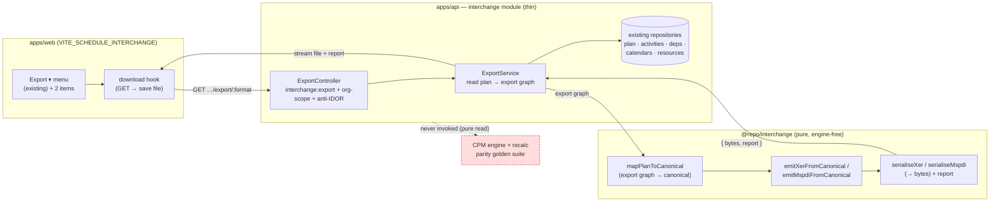
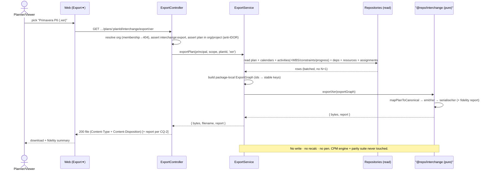

# Feature Spec: Schedule interchange — best-effort EXPORT (XER + MS Project)

- **Status:** Draft (product-owner directed to completion — treat intent as approved; this artifact is
  the design record, not an approval gate)
- **Author(s):** feature-analyst (Product Owner / Solution Architect / Technical Lead hats)
- **Date:** 2026-07-21
- **Tracking issue / epic:** TBD (toolbar-placeholder burn-down — **Stage C2, Milestone 4**)
- **Roadmap link:** `docs/ROADMAP.md` (interchange theme); brief §8 "XER export / full round-trip"
  (Won't-have _for now_ → now activated); `docs/TOOLBAR_ROADMAP.md` (the `export` row)
- **Related ADR(s):** **ADR-0050** — amended in place with a dated **"M4 status — best-effort export"**
  section (reverses its §7 "export deferred" clause; records why + the reverse-pipeline mirror). Builds on
  ADR-0016/0012 (tenancy + RBAC — new `interchange:export`), ADR-0019 (build contract — the pure package),
  ADR-0021 (DAG), ADR-0022/0023/0036/0037 (CPM dates + working-minute/per-activity calendars — the
  read-side source of truth), ADR-0038 (WBS), ADR-0039/0040/0042 (resources/units/EV), ADR-0034/0035
  (conformance + reject/repair/**report**), ADR-0027 (per-package release tagging), export/print stage
  (the existing canvas **Export ▾** menu this extends).
- **Sibling spec:** the import half — [`feature-spec.md`](./feature-spec.md) — is the design this mirrors.
  Read it first; this spec deliberately reuses its vocabulary and only records the **deltas for export**.

---

## 1. Business understanding

### Problem

The import half of interchange (ADR-0050 M1–M3) lets planners bring P6 / MS Project schedules **into**
SchedulePoint. The reverse is now the barrier: a planner who has done work in SchedulePoint cannot get a
schedule **back out** into the tools their client, QS, or head-office reporting still runs on. Two
concrete pains:

1. **Lock-in objection blocks adoption.** "If I can't export back to P6, I can't commit to a new tool" is
   the single most common procurement blocker for a scheduling product. Import lowers the cost of
   _trying_; export removes the fear of _committing_.
2. **No round-trip means no trust in fidelity.** Import fidelity is asserted by unit fixtures today.
   Export enables **round-trip** (export → re-import → structural equivalence), which is the strongest
   correctness gate the whole interchange feature can have — it exercises the canonical model against
   itself.

"Why now": the product owner has directed interchange be driven to completion, and the canonical model was
**deliberately designed to be bidirectional** (ADR-0050's whole "one mapping contract, N parsers"
rationale explicitly anticipated export — _"triples once export arrives"_). Export is the payoff the
architecture was built for; deferring it further wastes the design headroom already paid for.

### Users

Organisation roles (ADR-0016). Export is a **read** of an existing plan, so it is available to more roles
than import (which writes a new plan):

- **Org Admin / Planner** — own the schedule; export to hand to a client, archive, or move between tools.
- **Contributor** — works within a plan; may legitimately need to hand a copy to a stakeholder.
- **Viewer** — read-only stakeholder (client PM, QS). Export of what they can already see on the canvas is
  consistent with their read access (they can already read every activity, date and relationship). See the
  Permissions section + CQ-1.
- **External Guest** — **out of scope** for M4 (guest share links are a separate Stage F feature); guests
  never get file export in this milestone.

### Primary use cases

1. Export the currently-open plan as a **Primavera P6 `.xer`** from the canvas Export ▾ menu.
2. Export the currently-open plan as a **Microsoft Project MSPDI `.xml`** from the same menu.
3. Review, at export time, an **honest fidelity report** of what was approximated or dropped (offered the
   same way the import dry-run report is — see CQ-2 for whether it is shown pre-download or bundled).
4. **Round-trip** a plan (export → re-import into a new plan) and get a structurally-equivalent schedule —
   the correctness guarantee, exercised by the conformance harness and available to power users.

### User journeys

**Happy path (XER export).** A Planner has a plan open on the canvas. They open **Export ▾** (already
present from the export/print stage, alongside Schedule CSV / Diagram PNG-PDF / Print), pick **"Primavera
P6 (.xer)"**. The browser downloads `plan-name.xer`. If the plan contains anything SchedulePoint models
but P6's XER does not represent losslessly, the download is accompanied by a fidelity summary (CQ-2).

**Alternate — MSPDI.** Same, picking **"MS Project (.xml)"** → `plan-name.xml`.

**Alternate — large plan (async).** For a plan near the ~2,000-activity ceiling the export runs the same
pure pipeline; if it exceeds the synchronous budget it is produced via a BullMQ job and offered as a
short-lived download (CQ-3 — default: **synchronous** at M4, async deferred, matching how import treated
large files as a later concern).

**Alternate — empty / uncomputed plan.** The Export items are shaded (disabled-with-reason "Add an
activity first"), exactly as the existing CSV/PNG items already are on an empty canvas.

**Alternate — insufficient permission.** A role without `interchange:export` never sees the two items (the
menu still shows the CSV/PNG/PDF/Print items, which are pure client-side and ungated). A forged request is
denied 403 at the API.

### Expected outcomes

- A planner can move a SchedulePoint plan into P6 or MS Project, best-effort, transparently.
- The lock-in adoption objection is answered.
- Interchange gains a **round-trip conformance gate** that hardens both directions.
- The CPM engine and its recalc parity golden suite are **untouched** (export is a pure read).

### Success criteria

- A real SchedulePoint plan exports to a `.xer` that **opens in Primavera P6** and to an `.xml` that
  **opens in Microsoft Project**, with the core network intact (activities, FS/SS/FF/SF + lag, calendars).
- **Round-trip**: export a plan → re-import it → the re-imported plan is **structurally equivalent** to the
  original (same activity set by code, same relationship set by (pred, succ, type), same calendar working
  pattern) modulo the **named lossy coercions** (durations/lag at source granularity, calendar model). The
  conformance harness asserts this across the fixture suite (ADR-0034 idiom).
- **No silent loss**: every approximation/drop appears in the export `InterchangeReport`.
- Export of a 2,000-activity plan completes within the synchronous request budget (target p95 < ~2s
  server-side; measure — PERFORMANCE.md), or is cleanly routed to async (CQ-3).
- `VITE_SCHEDULE_INTERCHANGE=false` (or the export permission absent) ⇒ **no behavioural change** — the two
  menu items are absent and the endpoints are unreachable/denied.

### Open questions

Listed with assumed defaults in §"Critical questions" at the end. The only genuinely design-changing ones
are: **CQ-1** (does Viewer get export?), **CQ-2** (is the fidelity report shown before download or bundled
after?), **CQ-3** (synchronous-only at M4 vs. async-for-large), **CQ-4** (round-trip = structural
equivalence, accepting lossy coercions — confirm the bar). Everything else has a stated default and does
not block.

## 2. Functional requirements

### User stories & acceptance criteria

> **US-1** — As a **Planner**, I want to export the open plan as a P6 `.xer`, so that I can hand my
> schedule to a client who runs Primavera.
>
> **Acceptance criteria**
>
> - **Given** a plan with a computed schedule and `interchange:export` **when** I pick "Primavera P6
>   (.xer)" from Export ▾ **then** the browser downloads a `.xer` whose `ERMHDR`, `PROJECT`, `CALENDAR`,
>   `TASK` and `TASKPRED` tables represent the plan's project, calendars, activities and relationships.
> - **Given** the plan contains detail XER cannot represent losslessly (e.g. sub-hour durations, a rich
>   shift calendar) **when** I export **then** each such approximation/drop is named in the export report
>   (surfaced per CQ-2), never silently lost.
> - **Given** the downloaded `.xer` **when** it is opened in Primavera P6 **then** it loads without a fatal
>   parse error and shows the activities, logic and calendars.

> **US-2** — As a **Planner**, I want to export the open plan as MS Project MSPDI `.xml`, so that a
> stakeholder on MS Project can open it.
>
> **Acceptance criteria**
>
> - **Given** `interchange:export` **when** I pick "MS Project (.xml)" **then** the browser downloads a
>   well-formed MSPDI `<Project>` with `<Calendars>`, `<Tasks>` and `<PredecessorLink>` elements.
> - **Given** the file **when** opened in Microsoft Project **then** it loads without a fatal error.
> - **Given** the same plan exported both ways **then** both files carry the **same canonical export
>   graph** (the serialiser differs, not the pipeline).

> **US-3** — As a **Viewer** (client PM), I want to export a plan I can read, so that I can archive or
> forward it, without being able to change anything (CQ-1; default = Viewer may export).
>
> **Acceptance criteria**
>
> - **Given** I hold `interchange:export` but not `interchange:import` **when** I open Export ▾ **then** I
>   see the export items but no import entry, and the export succeeds as a pure read.

> **US-4** — As a **maintainer**, I want a round-trip conformance test, so that mapping asymmetries are
> caught in CI.
>
> **Acceptance criteria**
>
> - **Given** any conformance fixture plan **when** it is exported then re-imported **then** the resulting
>   graph is **structurally equivalent** to the original (activity codes, relationship triples, calendar
>   working pattern), modulo the report's named lossy coercions — asserted as a golden/differential test in
>   `packages/interchange` (engine-free).

> **US-5** — As any user, I want export to **never** touch the schedule, so that exporting is safe and
> side-effect-free.
>
> **Acceptance criteria**
>
> - **Given** any export **then** no plan/activity/dependency/calendar/resource row is created, updated or
>   deleted, no recalc runs, and no edit-lock/pen is taken (export is a pure read — contrast import's
>   commit).

### Workflows

**Export (synchronous, default).**

1. Web: user picks a format in Export ▾ → calls the plan-scoped export endpoint with the format.
2. API (thin module): resolve org from `:orgSlug` (membership → 404 for non-members), assert
   `interchange:export`, load the plan **active + in that org + under the resolved project** (anti-IDOR).
3. API: **read** the plan's full content (plan, calendars, activities incl. WBS/constraints/progress,
   dependencies, resources, assignments) via existing repositories into a package-local **export graph**.
4. API: hand the export graph to the pure `@repo/interchange` **exporter** for the chosen format →
   `{ bytes, report }`.
5. API: stream the bytes with `Content-Type` + `Content-Disposition: attachment; filename="…"`; the report
   is surfaced per CQ-2.
6. Web: browser downloads the file; the fidelity summary is shown per CQ-2.

**Round-trip (test-only / power-user).** Export a plan → feed the bytes to `importSchedule` → assert
structural equivalence. In CI this is a pure-package test (no API); as a power-user path it is simply
export-then-import-into-a-new-plan (two existing operations, no new UI).

### Edge cases

- **Empty plan / no activities** — export items shaded ("Add an activity first"), matching CSV/PNG. If
  called anyway, the API returns a minimal-but-valid file (project + calendars, zero tasks) rather than an
  error (CQ-5 default: valid empty export).
- **Uncomputed plan (never recalculated)** — export the **inputs** (durations, logic, constraints,
  calendars), which is all the interchange formats need; scheduled dates are not exported (P6/MSPDI
  recompute on open). No dependency on a prior recalc.
- **Plan with only concepts the target can't represent** (e.g. a resource-levelling delay, an EV curve) —
  those are **dropped + reported**; the core network still exports.
- **Duplicate-name collisions in the target** — not applicable: export produces a file, it does not write
  into a foreign database.
- **Very large plan** — CQ-3 (default synchronous with a graph-size ceiling mirroring import's
  `MAX_ACTIVITIES` etc.; a plan past the ceiling returns a clear 413/422-style rejection rather than
  hanging).
- **Concurrent edits during export** — export reads a consistent snapshot (single read transaction); a
  concurrent edit is simply not reflected, no locking needed (a read never contends the pen).
- **Non-ASCII activity names / codes** — XER is CP1252-encoded (encode, report any un-encodable character
  substitution); MSPDI is UTF-8 XML (lossless). Both escape/encode correctly (security + fidelity).

### Permissions

New permission **`interchange:export`** (deny-by-default, org-scoped, ADR-0012). Granted in the central
role→permission matrix (`common/auth/org-permissions.ts`) to **Viewer, Contributor, Planner, Org Admin**
(CQ-1 default — export is a read of already-readable data, so it follows plan-read access, not
hierarchy-write like `interchange:import`). Every export endpoint:

- resolves the org from `:orgSlug` against the caller's memberships (404 for non-members),
- asserts `interchange:export` for that org,
- asserts the target plan is active + belongs to that org (+ the path project) — anti-IDOR / no IDOR on
  `planId`,
- is a pure read: **no** pen/edit-lock, **no** write, **no** recalc.

The web items are **self-gated** on the caller's `interchange:export` capability (absent ⇒ items not
rendered), behind `VITE_SCHEDULE_INTERCHANGE`.

### Validation rules

- **Format** — a closed enum (`xer` | `mspdi`), validated at the boundary (path segment or query param —
  see §4 API). Anything else ⇒ 400/404.
- **planId / projectId / orgSlug** — UUID/slug validated (`ParseUuidPipe` etc.), exactly as import.
- **Graph-size ceiling** — reuse import's ceilings (`MAX_ACTIVITIES`/`MAX_DEPENDENCIES`/`MAX_RESOURCES`/
  `MAX_ASSIGNMENTS`) as the export bound; past it ⇒ a typed rejection (CQ-3).
- No user-supplied free text is written to disk or used as a path; the download filename is **derived**
  from the plan name (sanitised) + extension, never from client input.

### Error scenarios

| Scenario                                      | Detection                     | User-facing result                           | Status  |
| --------------------------------------------- | ----------------------------- | -------------------------------------------- | ------- |
| Not a member of the org                       | org scope resolve             | friendly not-found                           | 404     |
| Member but lacks `interchange:export`         | permission check              | friendly forbidden                           | 403     |
| `planId` not in the caller's org/project      | anti-IDOR scope check         | friendly not-found                           | 404     |
| Unknown/invalid `format`                      | enum validation               | invalid request                              | 400/404 |
| Plan exceeds the export graph ceiling         | size guard                    | "schedule too large to export" (+ ceiling)   | 413/422 |
| Serialiser internal inconsistency (defensive) | export-graph schema safeParse | user-safe "could not produce a valid export" | 422     |
| Transport failure during download             | web fetch/stream              | friendly "couldn't reach the server"         | —       |

Lossy-but-valid coercions are **not** errors — they are **report findings** returned with the file.

## 3. Technical analysis

| Area           | Impact | Notes                                                                                                                                                   |
| -------------- | ------ | ------------------------------------------------------------------------------------------------------------------------------------------------------- |
| Frontend       | low    | Extend the **existing** Export ▾ menu with two items (self-gated + flag-gated); a small download hook. No new route/dialog.                             |
| Backend        | med    | Extend the **existing** `interchange` module with export endpoint(s) + a read-side `ExportService` composing existing repositories.                     |
| Database       | none   | **No schema change.** Export is a read. New permission is a code constant + matrix grant, not a migration.                                              |
| API            | med    | New plan-scoped export endpoint(s); binary/text streaming; `Content-Disposition`. OpenAPI updated.                                                      |
| Security       | med    | New `interchange:export` (deny-by-default, org-scope, anti-IDOR); CP1252 encoding + XML escaping of untrusted plan text; no path use.                   |
| Performance    | med    | Read a whole plan efficiently (batched reads, no N+1); serialise in memory; graph-size ceiling; async deferred (CQ-3).                                  |
| Infrastructure | none   | No new services at M4 (BullMQ already exists if async is later pursued). No new dependency (XER = string build; MSPDI = XML build).                     |
| Observability  | low    | Structured log per export (org/plan/user/format/counts/report sizes), mirroring the import dry-run/commit logs.                                         |
| Testing        | high   | Pure-package serialiser unit fixtures + **round-trip** golden/differential tests; API e2e (authz, scope, content-type, download); web component + a11y. |

### Dependencies

- **Prerequisite:** ADR-0050 M1–M3 (the canonical model, the import pipeline, the `@repo/interchange`
  package, the `interchange` module). Shipped.
- **Reuses:** existing read repositories (`ActivityRepository.findManyActiveByPlan`, and the sibling
  dependency/calendar/resource/assignment read methods — add symmetrical read-by-plan methods where one
  does not yet exist, a small additive repository change, not a schema change), `PlanRepository`,
  `ProjectRepository`, `OrganizationsService.resolveScope`.
- **Reuses:** the `InterchangeReport` / `ReportFinding` model (now bidirectional), the canonical model, the
  export/print stage's Export ▾ menu + download plumbing.
- **No third parties.** MSPDI serialisation is a plain XML string build (no new parser dependency;
  `fast-xml-parser` has a builder but a hand-rolled, escaped string builder avoids even that — confirm in
  M4b, default: reuse `fast-xml-parser`'s builder for correctness of escaping).
- **Must land first within M4:** the canonical **export graph** + the XER serialiser (M4a) before MSPDI
  (M4b) before the richer-scope parity (M4c) before the web surface + full round-trip (M4d).

## 4. Solution design

### Architecture overview

The reverse of import, same two-layer split (pure package + thin module), same purity boundary.



### Data flow



### User flow

```mermaid
flowchart TD
  A[Plan open on canvas] --> B{Has interchange:export?}
  B -- no --> C[Export ▾ shows only CSV/PNG/PDF/Print]
  B -- yes --> D[Export ▾ shows + Primavera P6 (.xer) / MS Project (.xml)]
  D --> E{Plan has activities?}
  E -- no --> F[Items shaded: 'Add an activity first']
  E -- yes --> G[Pick a format]
  G --> H[Browser downloads file]
  H --> I{Any approximations/drops?}
  I -- yes --> J[Show fidelity summary CQ-2]
  I -- no --> K[Silent success toast]
```

### Database changes

**None.** No models, columns, indexes or constraints. The new permission is a TypeScript constant +
a grant row in the in-code role→permission matrix (no DB representation of permissions today). This is a
key property: export adds an API surface with **zero migration**.

### API changes

New endpoint(s) on the existing interchange controller surface, **plan-scoped** (export targets a specific
plan, unlike import which targets a project). Chosen shape (see alternatives):

- `GET /api/v1/organizations/:orgSlug/projects/:projectId/plans/:planId/interchange/export/:format`
  - `:format` ∈ `{ xer, mspdi }` (closed enum; `mspdi` streams `.xml`). **Format in the path** (not a query
    param) so it is unambiguous, cache-key clean, and mirrors the resourceful nesting the import routes use.
  - **Auth:** `@RequirePermissions('interchange:export')`, org resolved from `:orgSlug`, plan asserted in
    org + project (anti-IDOR), deny-by-default.
  - **Method:** `GET` — export is a safe, idempotent read (no state change), so `GET` is correct and makes
    the download a plain navigable/`<a download>` URL. (Contrast import's `POST` dry-run/commit, which
    upload + write.)
  - **Response:** `200` with the file bytes.
    - XER → `Content-Type: application/octet-stream` (or `text/plain; charset=windows-1252`), MSPDI →
      `application/xml; charset=utf-8`.
    - `Content-Disposition: attachment; filename="<sanitised-plan-name>.<ext>"` (RFC 5987 `filename*` for
      non-ASCII).
    - The **fidelity report** is returned per CQ-2. Default: as a response **header**
      (`X-Interchange-Report: <base64 JSON>` or a companion `…/export/:format/report` `GET` that returns the
      report JSON envelope) so the file body stays a clean binary; the web shows it after download. (An
      alternative: a two-call flow like import's dry-run — a `GET …/export/:format/report` returning
      `{ data: InterchangeReport }` first, then the file. CQ-2.)
  - **Errors:** `404` (non-member / plan not in scope), `403` (no permission), `400/404` (bad format),
    `413/422` (too large), `422` (defensive inconsistency). Standard `{ error }` envelope for JSON errors.
- **OpenAPI:** documented with `@nestjs/swagger` (`ApiProduces`, `ApiOkResponse` binary, the error
  responses), mirroring the import controller's decorators.

**Package (`@repo/interchange`) additions** — pure, additive, no breaking change to import exports:

- `export-graph.ts` — the package-local **SchedulePoint export graph** (the read-side dual of
  `import-graph.ts`): plan + calendars + activities (incl. WBS/constraints/progress) + dependencies +
  resources + assignments, keyed by stable export keys (from domain ids). Deliberately **separate** from
  the import graph so neither direction constrains the other, but sharing the enum vocabularies.
- `export-mapper.ts` — `mapPlanToCanonical(exportGraph): { model: CanonicalModel; findings }` — the dual
  of `mapper.ts`. Emits **findings** for any export-side approximation.
- `xer-emitter.ts` / `mspdi-emitter.ts` — `emit*FromCanonical(model): { tables/tree; findings }` — the dual
  of the adapters.
- `xer-serialiser.ts` / `mspdi-serialiser.ts` — canonical tables/tree → **bytes** (XER: `%T/%F/%R/%E`
  blocks + `ERMHDR`, CP1252 encode; MSPDI: escaped XML). Dual of the parsers.
- `export-xer.ts` / `export-mspdi.ts` / `export-schedule.ts` — orchestrators returning
  `{ ok: true; bytes; report } | { ok: false; error }`, dual of `import-xer.ts` etc.
  `export-schedule.ts` dispatches on the requested format (dual of `importSchedule`'s content detection).
- `report.ts` — **reuse unchanged**; the `InterchangeReport` model is already bidirectional (findings are
  approximation/repair/drop with an open `entity` string). Export adds no schema change — a docstring note
  that findings now also describe export-side coercions.

### Component changes

- **`apps/web/src/features/tsld/toolbar/tsld-toolbar-items.tsx`** — extend `ExportMenuControl`'s `<Menu>`
  with an **"Interchange"** `MenuSection` holding two `MenuItem`s ("Primavera P6 (.xer)", "MS Project
  (.xml)"), rendered **only** when `SCHEDULE_INTERCHANGE_ENABLED` **and** the caller holds
  `interchange:export`. Reuse the existing shade-don't-hide disabled pattern for empty/uncomputed plans.
  No new component, no one-off styling (design system `Menu`/`MenuItem`/`MenuSection` primitives).
- **`apps/web/src/features/interchange/api/`** — a small `useExportPlan(orgSlug, projectId, planId)` hook
  that GETs the export URL, triggers a browser download (reuse the export/print stage's `downloadBlob`),
  and surfaces the fidelity report (CQ-2). Reuse the shared `interchangeReportSchema` for the report.
- **Toolbar context** (`use-tsld-toolbar-context.tsx`) — add `exportInterchange('xer' | 'mspdi')` command
  - a `canExportInterchange` capability flag, mirroring the existing `exportScheduleCsv` command shape.
- **States:** loading (in-flight download spinner on the item, like the PDF item's `pdfExporting`), success
  (toast + optional fidelity summary), error (user-safe message; other items unaffected), empty/disabled
  (shaded with reason). a11y: menu items are roving-tabindex APG menu items already; announce completion
  via the existing announcer.

### Implementation approach & alternatives

**Chosen:** mirror the import architecture exactly — a pure, engine-free **exporter** in
`@repo/interchange` (export graph → canonical → per-format serialised bytes + report) driven by a thin
**read-only** extension of the `interchange` NestJS module that composes existing repositories and streams
the file. This maximally reuses ADR-0050's design, keeps the risky format-specific code pure and
exhaustively fixture-testable, and keeps the CPM engine + parity gate structurally untouched (export never
invokes the engine).

**Alternatives considered:**

- **Per-format exporters with no shared canonical model.** Rejected for the same reason import rejected
  per-format importers (ADR-0050): it duplicates the domain→foreign mapping twice. The canonical model is
  the whole point, and export is the direction that most rewards it.
- **Serialise directly in the NestJS module (skip the pure package).** Rejected: it would put
  format-specific, security-sensitive, edge-case-heavy string/XML building inside the side-effectful module,
  losing the CI-native pure-unit-test surface and the shared-with-web report schema. Violates the ADR-0034
  idiom the import side established.
- **Reuse the import graph as the export graph.** Rejected: coupling the two directions makes each a
  constraint on the other (import's graph carries repair-oriented fields; export's carries scheduled-date
  provenance). A **separate `export-graph.ts`** sharing only the enum vocabularies is cleaner and matches
  how import keeps its graph package-local.
- **`POST` with a request body.** Rejected: export takes no input beyond the path params; `GET` is the
  correct safe/idempotent verb and makes the download a plain URL.
- **A separate `export` module.** Rejected: export belongs with import in the `interchange` module (shared
  permission namespace, shared package, shared report), following one-feature-per-module.
- **`.mpp` export.** Rejected (as import rejected `.mpp`): proprietary binary OLE, no permissive TS writer;
  MSPDI XML is Microsoft's documented interchange and MS Project imports it.
- **Async-first (BullMQ) export.** Deferred (CQ-3): synchronous covers the ~2,000-activity ceiling within
  budget; async is a clean later addition reusing ADR-0009, exactly as import treated it.

The reverse pipeline is **architecturally significant** (new API surface, reverses an ADR scope clause), so
it is recorded as the **ADR-0050 M4 amendment** (dated section), not a new ADR — it is the same decision's
anticipated second half, consistent with how M2/M3 status sections were added in place.

## 5. Links

- **ADR:** [`docs/adr/0050-schedule-interchange-canonical-model.md`](../../adr/0050-schedule-interchange-canonical-model.md)
  — see the **"M4 status — best-effort export"** section.
- **Implementation plan:** [`implementation-plan-export.md`](./implementation-plan-export.md)
- **Sibling (import) spec:** [`feature-spec.md`](./feature-spec.md) and
  [`implementation-plan.md`](./implementation-plan.md)
- Docs to update on build: `docs/API.md` (new export endpoints + OpenAPI), `CLAUDE.md` §16 (ADR-0050 M4
  note), `docs/adr/0050…` References, `docs/TOOLBAR_ROADMAP.md` (`export` row), the `@repo/interchange`
  package README/index docstring, and a changeset (minor, pre-1.0).
