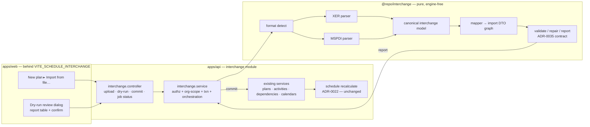
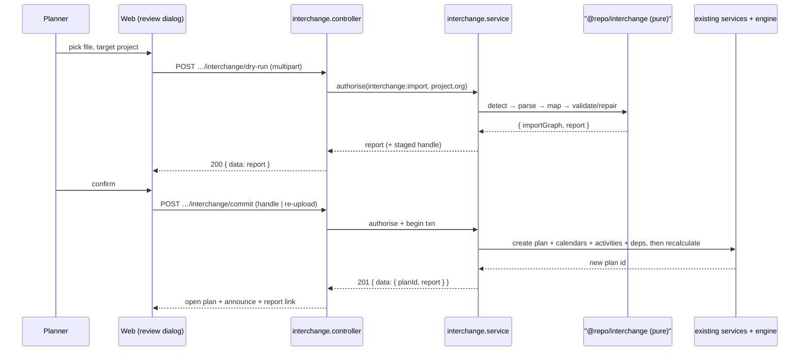
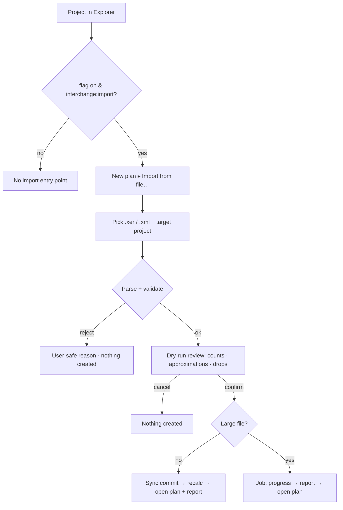

# Feature Spec: Schedule interchange (XER + MS Project import)

- **Status:** Draft (awaiting approval)
- **Author(s):** feature-analyst (Product Owner / Solution Architect / Technical Lead hats)
- **Date:** 2026-07-20
- **Tracking issue / epic:** TBD (toolbar-placeholder burn-down — **Stage C2**)
- **Roadmap link:** `docs/ROADMAP.md` (toolbar burn-down; brief §8 "Import from XER / MPP"),
  `docs/TOOLBAR_ROADMAP.md` (the `export` row's "XER/MSP interchange deferred to C2" note)
- **Related ADR(s):** **A new ADR is REQUIRED — draft outline in §4 (proposed ADR-0050, "Schedule
  interchange: canonical model + import pipeline").** Builds on ADR-0016/0012 (tenancy + RBAC),
  ADR-0021 (DAG invariant), ADR-0022/0023 (CPM execution + date convention), ADR-0024/0036/0037
  (calendars), ADR-0034/0035 (engine conformance + the reject/repair/report contract), ADR-0038 (WBS),
  ADR-0039/0040 (resources), ADR-0009 (BullMQ, for large-file async). Reference-feature template
  (`docs/REFERENCE_FEATURE.md`) governs the new backend module shape.

---

## 1. Business understanding

### Problem

SchedulePoint's design-partner planners live in **Primavera P6** and **Microsoft Project** today. The
single biggest barrier to trying — let alone adopting — a new scheduling tool is **re-keying an existing
schedule by hand**: hundreds to thousands of activities, their logic, calendars, WBS and progress. The
brief names this directly (§8 Should-have: _"Import from XER / MPP (read-only, best-effort) to lower
switching cost"_; §17 risk: _"XER / MPP import quality is poor, blocking migration from P6"_).

The toolbar burn-down (Stages A–E, then C1 export/print) deliberately **deferred schedule interchange to
Stage C2** (`docs/DECISIONS.md` C1 entry; `TOOLBAR_ROADMAP.md` `export` row). Unlike Stages A–E and C1 —
which were pure frontend wiring over already-shipped data — **interchange is backend-heavy**: parsing two
external file formats, mapping a foreign data model onto SchedulePoint's, validating/repairing/reporting on
the mismatch, and persisting a whole new plan. It is the first burn-down stage that adds an API surface, a
new module/package, and (almost certainly) a new ADR.

**This spec covers the industry-file interchange half of the deferred work only.** The `share` /
External-Guest link (the other thing the C1 note bundled into "C2") is a fundamentally different feature —
auth/RBAC + a link-token + a guest-scoped principal + a public read route — and is recommended for a
**separate Stage F ("Share")**. See CQ-1.

### Users

Mapped to the organisation role set (ADR-0016).

- **Planner / Org Admin (primary).** Has a live P6/MSP schedule and wants it **in SchedulePoint in
  minutes, not days** — to evaluate the TSLD, or to migrate a project. They accept a documented,
  best-effort result and want to know exactly **what didn't come across**.
- **Contributor / Viewer / External Guest.** Not import actors (import creates a plan + logic — a
  Planner-write capability). Consume the imported plan through the normal read/progress surfaces.

### Primary use cases

1. **Import a P6 XER file** into a chosen project as a **new plan**, best-effort, with a **pre-commit
   report** of what mapped, what was approximated, and what was dropped.
2. **Import a Microsoft Project MSPDI (`.xml`) file** the same way, through the same pipeline.
3. **Review the interchange report** — a human-readable, downloadable summary of coverage and losses —
   before and after committing, so the planner trusts the result and knows what to re-enter by hand.

### User journeys

**Happy path (XER import).** Planner opens a project in the Project Explorer → **New plan ▸ Import from
file…** → picks a `.xer` → the app uploads it and shows a **dry-run preview**: "Contains 214 activities,
231 relationships, 3 calendars, 1 WBS tree. 5 activities have unsupported constraint types (imported as
SNET); 12 resource assignments will be dropped (resources not imported in this stage)." → Planner confirms
→ a new plan is created, the CPM engine recalculates, the plan opens on the TSLD canvas → a live region
announces "Imported <plan> — 214 activities. View report." → the report is available to download.

**Alternate (validation failure).** The file is truncated / not a recognised XER or MSPDI / declares an
unsupported schema version → the dry-run returns a **reject** with a specific, user-safe reason ("This
doesn't look like a Primavera XER file") and **nothing is created**.

**Alternate (repairable issues).** The file parses but contains soft problems (a relationship to a missing
task id; a duplicate activity code; a lag in an unknown unit; a cyclic logic loop). The pipeline **repairs
and reports** per ADR-0035's reject/repair/report contract: drop-the-dangling-edge, de-duplicate, coerce
to working-minutes, break-and-flag the cycle — each recorded as a line in the report, never silently.

**Alternate (large file, async).** A very large file (say > a configured activity threshold) is processed
as a **background job** (ADR-0009): the upload returns a job handle, the UI shows progress, and the report
appears when the job completes. Small files run synchronously.

### Expected outcomes

- A P6/MSP planner can stand up a real schedule in SchedulePoint from their existing file in a single
  guided action, dramatically lowering switching cost (directly serves brief §8 Should-have + §17 risk).
- The **published, honest supported-field list** (brief §17 mitigation) is realised as a live,
  per-import report — not a static doc — so "best-effort" is transparent, not a surprise.
- The interchange **canonical model + pipeline** becomes the reusable substrate for the later,
  deferred **export** direction and for MSPDI once XER lands — one mapping contract, two parsers.

### Success criteria

- A planner imports a representative 200–500-activity XER and reaches an **interactive, recalculated
  plan** without hand-editing, in **< 30 s** for the synchronous path.
- **No silent data loss:** every activity/relationship/calendar in the source is either mapped or named
  in the report as approximated/dropped, with a reason (ADR-0035 §-level rigour).
- **Round-trip fidelity within scope:** on the engine-conformance fixtures re-expressed as XER, imported
  computed dates match the native-built plan (the mapping introduces no scheduling drift beyond
  documented approximations).
- **Deny-by-default + org scope:** only `interchange:import` holders, only into a project in their own
  org; no IDOR; uploaded files are size/type-capped and never executed.
- **Flag-off is byte-for-byte today's product:** `VITE_SCHEDULE_INTERCHANGE=false` (and the server flag
  off) ⇒ no import entry point, no new route reachable, no toolbar change; the CPM parity golden suite is
  untouched (interchange never edits the engine).

### Open questions

**CRITICAL (answers change scope/design) — recommend defaults, need product sign-off:**

- **CQ-1 — Is the External-Guest `share` link part of C2, or a separate Stage F?**
  **→ Recommendation: SPLIT. C2 = interchange (this spec); Share = a new Stage F.** The C1 deferral note
  bundled "XER/MSP interchange + share/External-Guest link" into "C2", but the two share nothing: this
  feature is a parser + mapper + validation pipeline + a new module/package + an ADR (backend-heavy, low
  auth surface); Share is a `PlanShare` token table + a guest-scoped principal + a public unauthenticated
  read route + link revocation/expiry (auth-heavy, ADR-0012 territory, its own ADR). Bundling them makes
  an unreviewably large, cross-domain PR and forces one flag over two independent risk surfaces. Splitting
  keeps each stage a coherent, small, separately-flaggable slice. **The `share` toolbar placeholder stays
  a "Coming soon" stub after C2, retargeted to Stage F.**

- **CQ-2 — Direction: import-only for v1, or import + best-effort export?**
  **→ Recommendation: IMPORT-FIRST; export DEFERRED.** The brief is explicit: XER/MPP **import** is the
  Should-have (§8), while **XER export / full round-trip is a Won't-have "for now"** (§8) and a **Future
  possibility** (§19). So v1 interchange = import (XER, then MSPDI). This also happens to front-load the
  real user value (switching cost) over the technically-easier direction. _(The launching brief floated
  "XER export first as the lower-risk slice"; I'm recommending against it because it contradicts the PO
  brief's MoSCoW and delivers no switching-cost value — but the risk argument is real, so this is a
  decision for you, not me. If you want export first, we invert M1↔M4.)_ Best-effort **export** is kept
  as an explicit later milestone (M4) that also resolves the `export` toolbar placeholder's XER/MSP note.

- **CQ-3 — Which MS Project format?**
  **→ Recommendation: MSPDI (`.xml`) only; `.mpp` OUT OF SCOPE for v1.** `.mpp` is a proprietary binary
  OLE compound document; the only robust reader (MPXJ) is JVM-based and its licence/runtime violate the
  stack + permissive-licence constraints (brief §18; CLAUDE.md §2). **MSPDI** is Microsoft's **open,
  documented XML** interchange schema, exportable from every MS Project version and parseable in
  TypeScript with a permissive XML parser. The brief's "MPP" intent is served by MSPDI; `.mpp` is a
  documented v1 limitation (a Future item, needs an isolated JVM/worker if ever pursued).

- **CQ-4 — Import target: a new plan, or merge into an existing plan?**
  **→ Recommendation: ALWAYS a NEW plan** under a chosen project. Merge/update-in-place needs identity
  reconciliation, conflict resolution, and the edit-lock/pen (ADR-0028) — a separate, much larger feature.
  A fresh plan means no pen contention, no destructive overwrite, and a clean rollback (delete the plan).
  Re-import to update is out of scope for v1.

- **CQ-5 — Where does parsing live, and in what language?**
  **→ Recommendation: a PURE `@repo/interchange` TS package (parse + map to a canonical model) consumed
  by a thin NestJS `interchange` module (persist via existing services).** This deviates from brief §15's
  "likely a Python library / isolated worker" — deliberately: XER is tab-delimited text and MSPDI is XML,
  both first-class to parse in TS with zero or one permissive dep (`fast-xml-parser`, MIT); a TS package
  keeps types shared, unit-tested, and CI-native (the `packages/engine-conformance` precedent, ADR-0034),
  avoids a polyglot runtime + a second container, and honours the "isolated" spirit (the package is
  engine-free and side-effect-free). This is an ADR-worthy choice (see §4).

**Non-critical (defaults applied, not blocking):**

- **Two-phase upload → dry-run → confirm** (not one-shot import): the report is shown _before_ any write,
  so the planner consents to the losses. Default: yes, two-phase.
- **Sync vs async threshold:** default synchronous below a configurable activity count (e.g. 500), async
  BullMQ job above it. The job path is scaffolded from day one but only exercised for large files.
- **Resources in scope for import?** Default: **deferred to M2** — M1 imports the network (activities,
  logic, calendars) which is the switching-cost core; resources/assignments are a distinct mapping added
  next, so M1 stays small.
- **Constraint mapping of unsupported P6/MSP constraint kinds:** default coerce to the nearest supported
  type (e.g. "As Late As Possible" → `scheduleAsLateAsPossible`; unknown → SNET on the computed date) and
  report each coercion.
- **File-size / activity caps:** default a configured max upload bytes + max activity count (reject over
  cap with a clear message), tuned to the brief's 2,000-activity ceiling (§12).

## 2. Functional requirements

### User stories & acceptance criteria

> **US-1 — Import a P6 XER as a new plan.** As a Planner/Org Admin, I want to upload a `.xer` and get a
> new SchedulePoint plan, so that I don't re-key an existing P6 schedule.
>
> **Acceptance criteria**
>
> - **Given** a valid single-project XER **when** I choose **Import from file…**, pick it, and confirm the
>   dry-run **then** a new plan is created under the chosen project containing the mapped activities,
>   relationships and calendars; the CPM engine recalculates; the plan opens on the TSLD canvas; and a live
>   region announces the result with a link to the report.
> - **Given** the XER contains **multiple projects** **then** I am asked which project to import (or the
>   first is imported with the others listed as skipped in the report) — never a silent partial import.
> - **Given** the file is not a recognised XER **then** the import is **rejected** with a user-safe reason
>   and **nothing is created**.
> - **Given** the file exceeds the size/activity cap **then** it is rejected with the cap stated.

> **US-2 — Import a Microsoft Project MSPDI (`.xml`).** As a Planner, I want to upload an MS Project XML
> and get a new plan, through the same review-then-commit flow as XER.
>
> **Acceptance criteria**
>
> - **Given** a valid MSPDI `.xml` **when** I import it **then** the same canonical pipeline maps Tasks,
>   PredecessorLinks, Calendars (and, in M2, resources/assignments) into a new plan with a report.
> - **Given** a `.mpp` binary **then** the picker rejects it with "Export to XML (MSPDI) from MS Project
>   first — `.mpp` isn't supported" (documented limitation, CQ-3).

> **US-3 — See a pre-commit interchange report.** As a Planner, I want to know exactly what will and won't
> come across **before** I commit, so I can trust the import and plan my clean-up.
>
> **Acceptance criteria**
>
> - **Given** any parseable file **when** the dry-run completes **then** I see counts of mapped entities,
>   a list of **approximations** (each with the source value → mapped value + reason), and a list of
>   **dropped/unsupported** items (each with a reason) — grouped and downloadable.
> - **Given** I cancel at the report **then** nothing is created.
> - **Given** I commit **then** the same report is attached to the created plan (or downloadable
>   from the completion toast) so the record of losses persists.

> **US-4 — Repairable source problems are repaired and reported, never silent.** As a Planner, I want
> soft data problems handled predictably per the engine's reject/repair/report contract.
>
> **Acceptance criteria** (ADR-0035 negative-case contract)
>
> - **Given** a relationship referencing a missing activity id **then** the edge is dropped and reported.
> - **Given** a duplicate `(pred, succ, type)` relationship **then** it is de-duplicated and reported
>   (ADR-0035 §13 / N04).
> - **Given** the source logic contains a cycle **then** the cycle is broken at a reported edge (never
>   imported as a cyclic graph — ADR-0021 DAG invariant) and named in the report.
> - **Given** a duplicate activity code within the project **then** codes are made unique (suffix) and
>   reported.
> - **Given** a lag/duration in an unexpected unit **then** it is coerced to working-minutes and reported.

> **US-5 — Async for large files.** As a Planner importing a very large file, I want the import to run in
> the background with progress, so the UI stays responsive.
>
> **Acceptance criteria**
>
> - **Given** a file above the sync threshold **then** the import runs as a job; the UI shows progress and
>   surfaces the report on completion; a failure is reported user-safely and creates no partial plan.

> **US-6 — Flag / kill switch.** As an operator, I want one switch to roll interchange back instantly.
>
> - **Given** `VITE_SCHEDULE_INTERCHANGE=false` (and the server flag off) **then** no import entry point
>   is rendered, the import routes/endpoints are not reachable, and nothing else in the product differs.

### Workflows

1. **Upload → parse → canonicalise (pure).** Multipart upload → detect format (XER vs MSPDI, by
   signature) → tokenise (XER tables / MSPDI XML) → build the **canonical interchange model**
   (format-agnostic) → run the **mapper** to a SchedulePoint **import DTO** graph (plan + activities +
   dependencies + calendars [+ WBS/constraints/progress/resources per milestone]).
2. **Validate / repair / report (pure).** Apply the ADR-0035 reject/repair/report rules over the mapped
   graph; produce an **InterchangeReport** (counts, approximations, drops). No DB write yet.
3. **Dry-run response.** Return the report + a short-lived staged token/handle (or re-parse on commit).
4. **Commit.** On confirm: in one transaction, create the plan + calendars + activities + dependencies via
   the **existing repositories/services** (reuse hierarchy, activities, dependencies, calendars modules —
   never new bespoke persistence), then run the standard synchronous **recalculate** (ADR-0022).
5. **Async variant.** For large files, steps 1–4 run inside a BullMQ job; the report is persisted/attached.

### Edge cases

- **Empty file / zero activities** → rejected ("no activities found").
- **Multi-project XER / multi-project MSPDI** → prompt-or-first-with-report (US-1); never silent partial.
- **Unsupported schema/version** (very old/new XER `ERMHDR` version; MSPDI `SaveVersion`) → best-effort
  parse if the shape is recognised, else reject with the version named.
- **Foreign calendars with exotic shift patterns** → mapped to ADR-0036 shifts/exceptions where
  expressible; non-expressible detail (e.g. sub-minute, per-resource exceptions beyond scope) reported.
- **Activity/lag durations in hours/days** → normalised to working-minutes (ADR-0036 §7 boundary).
- **Constraint kinds we don't model** → coerced to nearest + reported (see CQ non-critical default).
- **Character encoding** (XER is often CP1252/Latin-1; MSPDI is UTF-8) → detect + decode; report if lossy.
- **Progress + data date** → map act_start/act_finish/remaining/% and the project data date to
  `plannedStart`/data date + activity progress (ADR-0035 M2); out-of-range values coerced + reported.
- **Malicious file** (XML entity-expansion / billion-laughs, path-y names, huge cell) → the parser runs
  with entity expansion disabled, a byte cap, and a node cap; filenames are never used as paths.

### Permissions

RBAC + resource scope per ADR-0012/0016. **New permission namespace `interchange:*`:**

- `interchange:import` — **Planner + Org Admin only** (the "hierarchy write" rule; deliberately not
  Contributor). Coarse gate (`@RequirePermissions`) **plus** an authoritative service check that the
  **target project's `organizationId`** matches the principal's org (anti-IDOR) before any write.
- `interchange:export` — **reserved** for the deferred export milestone (any viewer, like CSV egress).

Import creates a plan + activities + logic, so it inherits the same audit + optimistic-locking + soft-delete
guarantees as native creation (rollback = soft-delete the plan). Uploaded content is validated at the
boundary and never trusted.

### Validation rules

- **Upload:** enforced `Content-Type`/extension allow-list (`.xer`, `.xml`), a max byte size (config), and
  a max activity count (config) — all rejected with 413/422 + a clear message.
- **Format detection:** XER by the `ERMHDR` first-line signature; MSPDI by the root `<Project
xmlns=".../project">` element. Ambiguous/unknown → 422 `UNRECOGNISED_INTERCHANGE_FORMAT`.
- **Canonical model** is validated with `class-validator`/Zod (shared `@repo/interchange` types): required
  fields, enum membership (dep types, constraint kinds), numeric ranges (durations/lags ≥ 0), date
  parse-ability.
- **Commit** target: `projectId` is a valid, active project in the caller's org.
- Durations/lags normalised to **working-minutes** (ADR-0036); dates to the ADR-0023 convention.

### Error scenarios

| Scenario                                    | Detection               | User-facing result                                       | Status  |
| ------------------------------------------- | ----------------------- | -------------------------------------------------------- | ------- |
| Not a member / wrong org for target project | service org-scope check | friendly forbidden                                       | 403     |
| Missing `interchange:import`                | permission guard        | friendly forbidden                                       | 403     |
| Unrecognised / not XER or MSPDI             | format detection        | "This isn't a recognised XER or MS Project XML file"     | 422     |
| Unsupported schema version                  | header/version check    | version named; rejected                                  | 422     |
| File too large / too many activities        | size + count caps       | cap stated                                               | 413     |
| Zero activities                             | post-parse count        | "No activities found in the file"                        | 422     |
| Malformed XML / truncated XER               | parser error            | user-safe parse error (no internals/stack)               | 422     |
| Cyclic logic / dangling edge / dup          | validate step           | **repaired + reported** (not an error) — commit proceeds | n/a     |
| Async job failure                           | job error               | "Import failed — nothing was created"; no partial plan   | n/a     |
| Optimistic/txn failure on commit            | transaction             | safe error; whole import rolled back                     | 409/500 |

## 3. Technical analysis

| Area           | Impact                 | Notes                                                                                                                                                                                                                                                                                                                                     |
| -------------- | ---------------------- | ----------------------------------------------------------------------------------------------------------------------------------------------------------------------------------------------------------------------------------------------------------------------------------------------------------------------------------------- |
| Frontend       | **med**                | New "Import from file…" entry (Project Explorer new-plan surface / plan-create flow), an upload + dry-run **review dialog** (report table, approximations/drops), progress + report download. Behind `VITE_SCHEDULE_INTERCHANGE`. No TSLD toolbar change in C2 (import isn't a toolbar placeholder).                                      |
| Backend        | **high**               | New `@repo/interchange` package (pure parse + map + validate) **and** a new NestJS `interchange` module (upload controller, dry-run + commit service, org-scope authz) that **persists via existing** hierarchy/activities/dependencies/calendars services.                                                                               |
| Database       | **low**                | No schema change is strictly required if the report is ephemeral/downloaded. **Optional**: a small `interchange_import` audit/report row (who imported what, when, the report JSON) — recommended for the "persisted report" default. No engine columns touched.                                                                          |
| API            | **med**                | New versioned endpoints: dry-run (validate) + commit (create plan), and (async) a job-status/report endpoint. Standard `{ data }`/`{ error }` envelopes, OpenAPI. multipart upload.                                                                                                                                                       |
| Security       | **high (first-class)** | Untrusted file parsing: XML entity-expansion/XXE off, byte/node caps, encoding handling; RBAC + org-scope (IDOR) on the target project; no filename-as-path; rate-limit the upload endpoint. security-reviewer gate.                                                                                                                      |
| Performance    | **med**                | Bounded parse (2,000-activity ceiling); commit reuses batched writes + the single synchronous recalc (ADR-0022); large files offloaded to a BullMQ job (ADR-0009). No N+1 (bulk creates). backend-performance-reviewer gate.                                                                                                              |
| Infrastructure | **med**                | One permissive dep (`fast-xml-parser`, MIT) → devops-reviewer (licence/SBOM/Dependabot). BullMQ/Redis already provisioned (ADR-0009). Config keys: caps + sync threshold + flag.                                                                                                                                                          |
| Observability  | **low**                | Structured import events (started/validated/committed/failed) with counts + correlation id; a metric for import volume/duration. No PII.                                                                                                                                                                                                  |
| Testing        | **high**               | Unit: parsers (XER tables, MSPDI XML) + mapper + validate/repair over **golden fixtures** (incl. the engine-conformance schedules re-expressed as XER/MSPDI for round-trip parity). API e2e: dry-run + commit + authz + caps + malformed/malicious files. e2e/a11y: upload → review → confirm → plan opens, keyboard-operable, announced. |

### Dependencies

- **Prerequisite (already shipped):** the whole domain — Plan/Activity/Dependency/Calendar/WBS/Resource
  models + their create services + the CPM engine + recalculate; the engine-conformance fixtures + the
  ADR-0035 reject/repair/report contract; RBAC + org-scope; BullMQ/Redis (ADR-0009); the reference-feature
  template for the new module.
- **Must land first:** nothing new in the product — this is additive. The **`@repo/interchange` package**
  and the **proposed ADR-0050** are the new artifacts M1 introduces.
- **New third party:** `fast-xml-parser` (MIT) for MSPDI (M3); XER needs **no** dependency (tab-delimited
  text). Both gated on devops-reviewer.
- **Interacts with:** the plan-create surface (new entry point) and the `export` / `share` toolbar
  placeholders (which stay placeholders in C2 — see §5 doc updates).

## 4. Solution design

### Architecture overview

A **two-layer** design: a **pure, engine-free `@repo/interchange` package** (parse → canonical model →
map → validate/repair → report) and a **thin NestJS `interchange` module** that owns the HTTP surface,
authz, transactions and orchestration, and **persists exclusively through existing feature services**
(never bespoke Prisma). This mirrors the `packages/engine-conformance` (pure) + `apps/api` (harness) split
(ADR-0034) and keeps the risky, format-specific code side-effect-free and exhaustively unit-testable.

### Data flow

### User flow

### Database changes

**Minimal / optional.** No engine or domain-schema change. The only candidate addition is an
**`interchange_import`** audit row (recommended, to persist the report + a rollback anchor):
UUID v7 PK, `organization_id` (scope), `project_id`, `created_plan_id?`, `source_format` (XER/MSPDI),
`source_filename`, `status` (VALIDATED/COMMITTED/FAILED), `report` (JSONB), audit + `timestamptz`, soft
delete. Designed with **database-architect** during M1. If the team prefers a fully ephemeral report
(downloaded only), this table is dropped and no migration lands.

### API changes

Versioned under `/api/v1`, standard envelopes, OpenAPI-annotated, deny-by-default:

- `POST …/projects/:projectId/interchange:dry-run` — multipart file → `{ data: InterchangeReport }`
  (counts, approximations, drops, detected format/version). No write. `interchange:import` + org scope.
- `POST …/projects/:projectId/interchange:commit` — commit a validated import (staged handle **or**
  re-uploaded file) → `201 { data: { planId, report } }`. Creates the plan; runs recalc.
- `GET …/interchange/imports/:id` — (async) job/report status → `{ data: { status, report? } }`.
- Errors per the §2 table with the standard `{ error: { code, message, details? } }` envelope; DTOs
  validated by the global pipe. (Exact colon-action vs sub-resource pathing **RESOLVED with api-reviewer**:
  sub-resource paths chosen — `POST …/projects/:projectId/interchange/dry-run` and `…/interchange/commit`.)

### Component changes

Feature-first under `apps/web/src/features/interchange/` (api hooks + Zod schemas shared with
`@repo/interchange` + components), composing design-system primitives — **no one-off styling**:

- An **Import from file…** action on the plan-create surface (Project Explorer new-plan menu), behind
  `VITE_SCHEDULE_INTERCHANGE` + `interchange:import`.
- A **review dialog** (`Dialog` primitive): file picker + target project, a **report table** (mapped
  counts; approximations and drops as accessible, sortable lists), a confirm/cancel footer, and a
  **download report** action. States: loading (parsing), success (report), error (reject reason), and the
  async **progress** state. Fully keyboard-operable, labelled, announced (WCAG 2.2 AA).
- Reuses the existing plan route to open the created plan on the TSLD canvas post-commit.

### Implementation approach & alternatives

**Chosen — a pure `@repo/interchange` package + a thin persisting module, import-first (XER → MSPDI),
two-phase dry-run/commit, behind a flag.** Isolate all format/mapping/validation logic as pure,
fixture-tested functions (the engine-conformance idiom); reuse existing services for every write so
interchange never re-implements domain rules or touches the engine; front-load the switching-cost value
(import) per the brief; ship dark then flip.

**Alternatives considered:**

- _Python parsing worker (brief §15's suggestion)_ — rejected (CQ-5): XER is text and MSPDI is XML, both
  native to TS; a polyglot runtime + second container + a serialisation boundary is pure cost and breaks
  shared typing/CI. Revisit only if `.mpp` (JVM/MPXJ) is ever pursued.
- _`.mpp` support in v1_ — rejected (CQ-3): binary/proprietary, no permissive reader; MSPDI covers the MS
  Project need.
- _Export-first_ — rejected (CQ-2) as contradicting the brief's MoSCoW and delivering no switching-cost
  value; kept as a later milestone.
- _Merge-into-existing-plan import_ — rejected (CQ-4): identity reconciliation + pen contention; new-plan
  import is clean and rollback-safe.
- _One-shot import (no dry-run)_ — rejected: best-effort mapping **must** show its losses before writing,
  or "best-effort" becomes "silent data loss" (brief §17 risk).
- _Bespoke persistence inside the interchange module_ — rejected: would duplicate/skew domain invariants
  (DAG, org-scope, calendars); reuse the services (reference-feature standard, CLAUDE.md §19.2).

**ADR REQUIRED — draft outline (proposed ADR-0050 "Schedule interchange: canonical model + import
pipeline"):**

- **Context/forces:** switching cost from P6/MSP (brief §8/§17); two foreign formats onto one domain
  model; best-effort fidelity + no silent loss; permissive-licence + TS-stack constraints; the
  engine-conformance reject/repair/report contract (ADR-0035) as the validation backbone.
- **Decision:** a **format-agnostic canonical interchange model** + per-format parsers, a mapper to a
  SchedulePoint import DTO graph, an ADR-0035-aligned validate/repair/report step, and a two-phase
  dry-run→commit pipeline; housed in a **pure `@repo/interchange` package** consumed by a thin persisting
  `interchange` module; **import-first (XER, MSPDI); `.mpp` excluded; export deferred**; new-plan target.
- **Mapping contract (the load-bearing table):** P6/MSPDI entity → SchedulePoint entity, with the
  documented approximations —

  | P6 XER (table) / MSPDI (element)                                                             | SchedulePoint                                        | Notes / approximations                                                                                           |
  | -------------------------------------------------------------------------------------------- | ---------------------------------------------------- | ---------------------------------------------------------------------------------------------------------------- |
  | `PROJECT` / `<Project>`                                                                      | new `Plan` (+ data date → `plannedStart`)            | one plan per source project (CQ-1 multi-project handling)                                                        |
  | `TASK` / `<Task>`                                                                            | `Activity` (type, `durationMinutes`, code, name)     | hours/days → working-minutes (ADR-0036); milestone flags → START/FINISH_MILESTONE                                |
  | `TASKPRED` / `<PredecessorLink>`                                                             | `ActivityDependency` (FS/SS/FF/SF, `lagMinutes`)     | lag units → minutes; dup `(pred,succ,type)` de-duped (§13/N04); cycles broken+flagged (ADR-0021)                 |
  | `CALENDAR` / `<Calendar>`                                                                    | `Calendar` (+ `CalendarShift` + `CalendarException`) | weekday work-hours → shifts; holidays/exceptions → exception windows (ADR-0036); non-expressible detail reported |
  | `PROJWBS` / `<Task>` summary rows                                                            | `WBS_SUMMARY` activities + `parentId` tree           | ADR-0038; M2                                                                                                     |
  | `TASK.cstr_type/date` (+ `cstr_type2/date2`)                                                 | `constraintType/Date` (+ secondary)                  | ADR-0035 §10; unsupported kinds coerced + reported                                                               |
  | progress (`act_start/end`, `remain_drtn`, `phys_complete`)                                   | activity progress (ADR-0035 M2)                      | ranges coerced + reported                                                                                        |
  | `RSRC` / `<Resource>`, `TASKRSRC` / `<Assignment>`                                           | `Resource` + `ResourceAssignment` (ADR-0039/0040)    | M2; MATERIAL never a driver                                                                                      |
  | UDFs, activity-code matrices, cost accounts, roles, expenses, risk, financial periods, steps | —                                                    | **dropped + reported** (out of scope, brief §3/§8 Won't-have)                                                    |

- **Trade-offs/consequences:** best-effort fidelity (documented + reported, not silent); a new package +
  module + dep (`fast-xml-parser`); the mapping table is a living contract updated as the domain grows;
  export + `.mpp` + merge are explicit follow-ons; the CPM engine + parity gate are untouched.

## 5. Links

- Implementation plan: `docs/specs/schedule-interchange/implementation-plan.md`
- Docs to update by this change: **new ADR-0050**; `docs/DECISIONS.md` (C2 scope split + parser-home +
MSPDI-not-.mpp); `docs/ROADMAP.md` (C2 delivered; Share = Stage F; export deferred);
`docs/TOOLBAR_ROADMAP.md` (retarget the `export` XER/MSP note to the export milestone; retarget `share`
to Stage F); `docs/API.md` + OpenAPI (new endpoints); `docs/SECURITY_STANDARDS.md` (untrusted-file
parsing note); `apps/web/.env.example` + `vite-env.d.ts` + `.env.example` (server) for the flags;
`CLAUDE.md` §16 (ADR list) + the `@repo/interchange` package in §4 layout.
</content>

</invoke>
