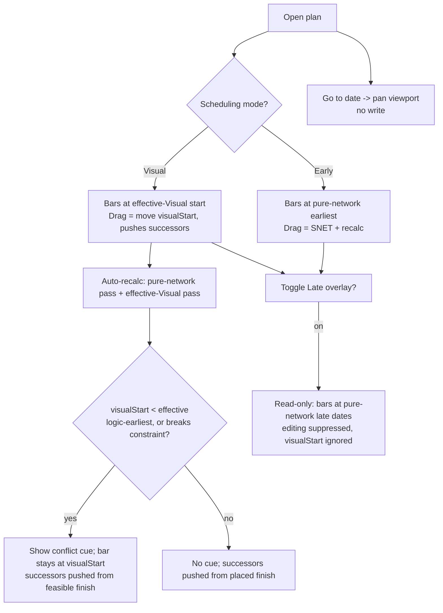

# Feature Spec: Scheduling model & canvas planning modes

- **Status:** Draft
- **Author(s):** Feature Analyst (Claude Code)
- **Date:** 2026-07-14
- **Tracking issue / epic:** _TBD_
- **Roadmap link:** TSLD-first authoring / GPM fidelity (PROJECT_BRIEF §1, §8, §11)
- **Related ADR(s):** **ADR-0033 (draft, this feature)**; amends/supersedes parts of
  ADR-0022, ADR-0023, ADR-0032; builds on ADR-0021, ADR-0026, ADR-0031, ADR-0012.

> This spec bundles three requests that share **one root cause**: the field
> `Plan.plannedStart` is overloaded to mean three different things. Fixing the
> overload cleanly unlocks a genuinely GPM-faithful authoring model. Read the
> ADR-0033 draft alongside this — the scheduling-mode decision is architecturally
> significant and is recorded there.

---

## 1. Business understanding

### Problem

Today one field, **`Plan.plannedStart`**, is doing three unrelated jobs:

1. **The CPM data date / scheduling origin** — the real anchor the engine
   schedules every activity from (ADR-0023 §1: `DD = Plan.plannedStart`,
   offset 0). Change it and **every computed date in the plan shifts**.
2. **The canvas pixel day-zero** — the timeline origin the TSLD paints against
   (ADR-0026: x is derived from computed dates measured from the data date;
   ADR-0032 M1 anchors a start-less plan to `today`).
3. **A user-facing "pick a date" control** — the inline date picker added in
   ADR-0032 M2 (`use-tsld-toolbar-context.tsx` → `setPlannedStart` →
   `useSetPlanStart` → `PATCH /plans/:id { plannedStart }`).

Because these are the same field, a planner who uses the canvas date picker to
"look at March" silently **re-baselines the whole schedule** — a
correctness-eroding surprise on a product whose top risk is "CPM bugs erode
planner trust" (PROJECT_BRIEF §17).

The overload also **fights the product's core thesis**. SchedulePoint is a
**Graphical Path Method** tool (PROJECT_BRIEF §1, §22): GPM's essence is that a
planner **places activities by hand** and the tool computes logic-aware float
around those placements. Yet today, dragging a bar in time writes an **SNET
constraint + recalc** (`onTsldReposition` in `use-plan-workspace-model.ts`,
ADR-0023/0032), so the engine immediately overrides the planner's intent with a
computed early date and litters the plan with implicit constraints. The tool
does the opposite of what GPM promises.

Finally, `plannedStart` being **optional** forces a special-case hack: a
start-less plan "anchors to today" and the first canvas draw silently pins
`plannedStart` (ADR-0032 M1/D2). This spreads null-branches and a display-only
origin through the render, create, reposition and recalc paths.

**Why now.** The canvas-first authoring stack (ADR-0030/0031/0032) has shipped;
the canvas is the primary surface. The overload is now the main thing blocking a
faithful planning experience, and every new authoring gesture that lands on top
of `plannedStart` deepens the debt.

### Users

Organisation-scoped roles (ADR-0012 / ADR-0016; PROJECT_BRIEF §5):

- **Planner** (primary) — builds and maintains the schedule; chooses the planning
  mode; places activities; holds the edit-lock "pen" (ADR-0028). Needs the tool to
  respect manual placement (GPM) **and** to compute early/late dates on demand.
- **Org Admin** — same schedule capabilities as Planner plus can override the pen.
- **Contributor** — updates progress/notes; **reads** the mode and any conflict
  cues; cannot change the mode, project start, or placements.
- **Viewer / External Guest** — read-only; sees the plan in its saved mode with
  conflict cues; can use the ephemeral "go to date" navigation but writes nothing.

### Primary use cases

1. **Navigate the timeline** to a date without changing the schedule ("show me
   March") — a viewport jump, not a data edit. _(Sub-feature 1)_
2. **Set and edit the project start** as an explicit, mandatory, clearly-labelled
   plan property that anchors CPM. _(Sub-feature 2)_
3. **Choose a plan-level planning mode** — **Early Start** (bars at computed
   earliest), **Visual Planning** (bars where the planner puts them, logic
   validated and conflicts highlighted, no implicit constraints). _(Sub-feature 3)_
4. **Overlay Late-Start dates** as a read-only analysis view (see how much float
   each activity has) without it being an authoring mode. _(Sub-feature 3)_
5. **See placement conflicts** in Visual Planning — an activity placed before its
   logic allows, or violating an explicit constraint, is flagged (badge + colour +
   screen-reader text) without the bar being moved.

### User journeys

**Happy path — build a plan in Visual Planning (GPM).** Planner creates a plan and
is required to set a project start. They switch the plan to **Visual Planning**,
drop activities where they judge they belong on the timeline, and draw logic
between them (two-click Link tool, ADR-0032 M5). The engine runs after each
structural edit (coalesced auto-recalc, ADR-0032 M3) to **validate** logic and
compute float, but **does not move the bars** — any activity the planner has
placed **earlier than its predecessors allow** lights up as a conflict. The
planner nudges those bars right until conflicts clear. At any point they flip on
the **Late-Start overlay** to see remaining float, or switch to **Early Start** to
collapse every bar to its earliest feasible date.

**Alternate — Early-Start authoring (today's mental model, cleaned up).** Planner
keeps the plan in **Early Start**; bars sit at engine-computed earliest dates.
Dragging a bar imposes an explicit **SNET** constraint (today's behaviour, now
opt-in to the mode rather than the only behaviour) and re-flows the network.

**Alternate — just looking.** A Viewer opens the plan, uses **Go to date** to jump
to a milestone, reads the mode and conflict cues, and changes nothing.

See the user-flow diagram in §4.

### Expected outcomes

- The canvas date picker never mutates schedule data; navigation and data-editing
  are separate, predictable affordances.
- Project start is a first-class, mandatory, editable plan property; the
  "anchor-to-today" special-case and its null branches are removed.
- Planners get a **true GPM authoring mode** (Visual Planning) that respects manual
  placement and surfaces logic conflicts — the product's headline promise.
- Early Start and a Late-Start analysis overlay remain available for CPM-style work.

### Success criteria

- **0** unintended data-date changes from the navigation control (it issues no
  writes — verifiable in tests/telemetry).
- A planner can build a 20-activity plan in Visual Planning where **every explicitly
  placed bar is preserved verbatim** across recalcs (a placed bar never moves unless
  the planner moves it), **unplaced successors follow their placed predecessors**
  (effective-Visual push), and every logic conflict is visibly flagged. Golden-suite
  parity for the pure-network Early/Late dates and float is unchanged (ADR-0023
  mitigation intact — the pure pass never reads `visualStart`).
- Switching modes re-renders bar positions in **< 100 ms** at 500 activities (no
  server round-trip — Early reads `early*`, Late reads `late*`, Visual reads the
  persisted `visualEffective*` columns).
- Creating a plan without a start is **impossible** (form + API both reject);
  existing null starts are backfilled with **0** scheduling regressions.

### Open questions

All six CRITICAL questions have been **ratified by the product owner (2026-07-14)**.
Five confirm the recommended defaults; **CQ-5 was overridden** — Visual placements
now **feed the forward pass** (push successors) via a two-pass engine model. The
override introduced residual sub-questions (SQ-a…SQ-f below), each resolved with a
recommended default; none is currently blocking, but SQ-b is flagged for the owner.

- **CQ-1 — Go-to-date: ephemeral.** **RATIFIED.** Ephemeral jump — pans the
  viewport so the chosen date sits at the left edge; nothing is stored. (A persisted
  per-user view-start remains a possible future follow-up.)
- **CQ-2 — Late Start is a read-only overlay, not an authoring mode.** **RATIFIED
  (as recommended).** The two _authoring_ modes are **Early Start** and **Visual
  Planning**; **Late Start** is a read-only view toggle that shifts bars to
  pure-network late dates for analysis and writes nothing.
- **CQ-3 — Manual placement lives in advisory `visualStart`.** **RATIFIED.** A new
  per-activity `visualStart` (calendar day) is the planner-owned placement input.
  The engine does **not** schedule the _pure-network_ pass from it; it feeds only
  the new _effective-Visual_ pass (CQ-5). Alternatives (soft constraints,
  lane+target-date) rejected in §4 / ADR-0033.
- **CQ-4 — Conflict semantics.** **RATIFIED, refined by CQ-5.** An activity is **in
  conflict** when its `visualStart` is **earlier than its effective logic-earliest**
  — the earliest it could start given its **predecessors' effective finishes** and
  lag/type (an FS/SS/FF/SF violation) — **or** it violates an active explicit
  constraint. (The baseline is now the _effective_ logic-earliest from the
  effective-Visual pass, not the pure-network `earlyStart`; see the model below.)
  Placing a bar **later** than its effective logic-earliest is legal — it pushes
  successors and is reflected in `visualDriftDays`, not a conflict.
- **CQ-5 — Visual placement FEEDS the forward pass (pushes successors).**
  **OVERRIDDEN → ACCEPTED (product owner, 2026-07-14).** A hand-placed bar **does
  push its unplaced successors**. This is delivered by a **two-pass engine model**
  (formalised in §4 and ADR-0033):
  1. **Pure-network pass (unchanged):** ignores `visualStart`; computes
     `early*`/`late*`, total float, criticality. Remains the golden-suite-verified
     pure function of logic + explicit constraints. It is the source for Early-Start
     bars, the Late-Start overlay, **float**, and the pure-network baseline.
  2. **Effective-Visual pass (new; Visual mode display):** a second **forward-only**
     topological pass. Each activity's **display start** = its `visualStart` if set
     (**honoured exactly — never clamped**), else its **effective logic-earliest**
     derived from predecessors' _effective_ finishes + lag/type. So a placed
     activity pushes its unplaced successors; a successor that is itself placed
     stays put. The bar is **never moved by the tool** — an infeasible placement
     stays at `visualStart` and is **flagged** (stay-and-flag, per the owner).
- **CQ-6 — Backfill rule.** **RATIFIED.** Set each null start to the **earliest
  active `constraintDate` → earliest `actualStart` → plan creation day
  (`created_at::date`) → today**. Applied once in a data migration; logged per plan.

#### Residual sub-questions from the CQ-5 override (resolved; SQ-b flagged for the owner)

- **SQ-a — Non-clamping vs stay-and-flag when infeasible.** **Recommended: stay-and-
  flag** (matches the owner's words). An activity placed earlier than its effective
  logic-earliest **keeps its bar at `visualStart`** and is flagged; it is **not**
  clamped up to the feasible day. (Auto-clamping would silently overwrite the
  planner's intent — the exact behaviour Visual mode exists to avoid.)
- **SQ-b — Successor propagation from an infeasible (conflicted) placement.**
  **Recommended (flag for owner confirmation): propagate from the FEASIBLE finish,
  not the illegal one.** A conflicted activity **displays** at its (too-early)
  `visualStart`, but the finish it **contributes to successors** is
  `max(visualStart, effectiveLogicEarliest) + duration` — i.e. its
  **effective-feasible** finish. This keeps the downstream layout deterministic and
  prevents the visual from implying an impossible sequence (a successor is never
  pulled earlier than its predecessor could legally finish). Concretely: a placed,
  **feasible** predecessor pushes successors from where it sits; a placed,
  **infeasible** predecessor pushes them from its feasible-earliest. This is the one
  residual choice with real modelling weight — recommending it, but flagging for the
  owner because the alternative ("propagate from the displayed `visualStart+duration`
  even when illegal") is defensible if the owner prefers WYSIWYG cascades over
  feasibility.
- **SQ-c — Float in Visual mode.** **Recommended: show pure-network float**
  (`totalFloat = LS − ES` from the unchanged pure pass) as the activity's float, and
  show **visual drift** (`visualStart − earlyStart`, working days) **separately** as
  a distinct read-out. Float stays a property of the logic network; drift describes
  how far the planner placed a bar from its CPM-earliest. The two are not conflated.
- **SQ-d — Explicit constraints (SNET etc.) in Visual mode.** **Recommended: allow
  the placement + flag; do not block.** Explicit constraints continue to **clamp the
  pure-network pass** unchanged, and they also **clamp the effective logic-earliest**
  in the effective-Visual pass (they are hard rules for what is _feasible_). But
  `visualStart` is still honoured exactly for display; a `visualStart` that violates
  a constraint is **flagged as a conflict**, not rejected. (Consistent with
  stay-and-flag — the planner can always place a bar and see it is illegal.)
- **SQ-e — Late overlay + backward pass.** **Confirmed: no change.** The Late-Start
  overlay renders from the **pure-network `late*`** columns and **ignores
  `visualStart`**. There is **no backward pass over effective positions** — the
  effective-Visual pass is forward-only. The backward pass is untouched.
- **SQ-f — Engine cost.** **Confirmed within budget.** The effective-Visual pass is
  one extra **forward** topological traversal (O(V+E)) reusing the already-built
  graph (`order`, `incoming`, `forwardLowerBound`, `clampForwardStart`) — roughly
  one-third more work than today's forward+backward+driving passes, well inside the
  recalc NFR (< 500 ms at 500 activities, < 2 s at 2,000; PROJECT_BRIEF §14). It runs
  in every recalc so a mode switch never needs a fresh compute. Noted in the plan.

- **CQ-7 (non-critical) — Default mode for new and existing plans.** **Default:**
  **Early Start** (matches today's rendered behaviour — bars at computed early
  dates — so the migration is behaviour-preserving). Planners opt into Visual.
- **CQ-8 (non-critical) — Should conflict be computed server-side or client-side?**
  **Default (recommended):** **server-side**, as an engine-owned per-activity field
  written by the recalc (keeps "correctness is server-owned", ADR-0026; measures
  drift in working days via the calendar port). Client-only compare is possible
  (the client holds `earlyStart`/`visualStart`) but forks engine logic — rejected.
- **CQ-9 (non-critical) — REVISED by the CQ-5 override: do NOT bulk-seed
  `visualStart`.** Under the two-pass model an **unplaced** activity (`visualStart`
  null) already renders at its **effective logic-earliest** (the effective-Visual
  pass, which for a plan with no placements equals `earlyStart`) — so there is no
  day-zero jump and no seeding is needed. **Default:** leave `visualStart` **null
  until the planner drags a bar**; a drag sets that one activity's `visualStart`.
  This keeps the "placed vs unplaced" distinction meaningful (only placed bars are
  pinned and can be flagged; unplaced ones float with the network). (Bulk-seeding
  would silently pin every activity and defeat successor push.)
- **CQ-10 (non-critical) — Feature-flag name & rollout.** **Default:**
  `VITE_SCHEDULING_MODES` (default-off in-progress, per the
  `flagDefaultOff` norm), layered on the canvas host flags like
  `VITE_CANVAS_AUTHORING`.

## 2. Functional requirements

### User stories & acceptance criteria

> **US-1 — Navigate without editing.** As a Planner/Viewer, I want to jump the
> canvas to a date so I can inspect a period, **without changing the schedule**.
>
> - **Given** any plan **when** I pick a date in the **Go to date** control **then**
>   the canvas pans so that date is at the left edge and **no** network request is
>   made and **no** field changes.
> - **Given** I am a Viewer (read-only) **when** I use Go to date **then** it works
>   (navigation is not a write) and still nothing is persisted.
> - **Given** I reload the page **then** (default CQ-1) the viewport returns to its
>   normal fit — the jump was ephemeral.

> **US-2 — Mandatory, editable project start.** As a Planner, I must set a project
> start when creating a plan, and I can edit it later; it anchors CPM.
>
> - **Given** the create-plan form **when** I submit without a start **then** I get
>   an inline "Project start is required" error and nothing is created.
> - **Given** the API receives `POST /plans` without `plannedStart` **then** it
>   returns **422** (`PLAN_START_REQUIRED`) and creates nothing.
> - **Given** a plan **when** a Planner edits the project start via the explicit
>   **Project start** control **then** it PATCHes `plannedStart` (with `version`),
>   recomputes dates, and the change is clearly labelled as re-anchoring the plan.
> - **Given** the API receives `PATCH /plans/:id { plannedStart: null }` **then**
>   it returns **422** (clearing the start is no longer allowed).

> **US-3 — Choose a planning mode.** As a Planner, I want to set a plan-level mode
> (Early Start | Visual Planning) so the canvas behaves the way I plan.
>
> - **Given** a plan **when** I set the mode to **Visual Planning** **then** bars
>   render at their `visualStart` and dragging a bar moves `visualStart` **without
>   creating a constraint**.
> - **Given** a plan in **Early Start** **when** I drag a bar in time **then** it
>   imposes an explicit **SNET** at the dropped day and recalculates (today's
>   behaviour, now mode-scoped).
> - **Given** I am a Contributor/Viewer **when** I open the plan **then** I see the
>   mode and cannot change it (403 on a write attempt).

> **US-4 — Late-Start analysis overlay.** As a Planner, I want to toggle a
> read-only Late-Start view to see float, without it being an authoring mode.
>
> - **Given** any plan **when** I enable the **Late Start** overlay **then** bars
>   shift to their computed late dates and all editing gestures are suppressed
>   (read-only), and **no** data changes.
> - **Given** the overlay is on **when** I disable it **then** bars return to the
>   active authoring mode's positions.

> **US-5 — Placement pushes successors, with conflict cues.** As a Planner, when I
> place a bar it should push its unplaced successors along the timeline; an activity
> I placed before its logic allows must be visibly flagged, without the tool moving
> it.
>
> - **Given** Visual Planning **when** I place activity A later than its
>   effective-earliest **then** A's unplaced successors shift right by the push
>   (effective-Visual pass) and A shows no conflict.
> - **Given** Visual Planning **when** an activity's `visualStart` is earlier than
>   its **effective logic-earliest** (given predecessors' effective finishes) or it
>   breaks an explicit constraint **then** the bar shows a conflict cue (badge +
>   non-colour-only styling) and accessible text ("Placed 3 working days before its
>   earliest feasible start") **and the bar stays at `visualStart`** (stay-and-flag,
>   SQ-a); its successors are pushed from its **feasible** finish, not the illegal
>   one (SQ-b).
> - **Given** a conflict **when** I drag the bar to/after its effective-earliest day
>   **then** on the next recalc the cue clears.
> - **Given** no conflicts **then** no cues are shown.

> **US-6 — The pure-network CPM outputs stay a pure function of the network.** As
> any user, `earlyStart/lateStart/totalFloat/isCritical` must remain a pure function
> of logic + explicit constraints, independent of mode or `visualStart` — Visual
> mode adds _display_ positions (`visualEffectiveStart/Finish`) and conflict output,
> but never alters the pure-network columns.
>
> - **Given** the same network + constraints **when** I switch modes or move a bar
>   in Visual mode **then** each activity's `earlyStart/lateStart/totalFloat/
isCritical` are **unchanged** (golden-suite parity holds; only
>   `visualEffectiveStart/Finish`, `visualConflict`, `visualDriftDays` change).
> - **Given** Visual mode **when** the effective-Visual pass runs **then** it reads
>   `visualStart` but **only** writes the effective/conflict/drift columns — the
>   forward/backward pure passes are byte-for-byte those verified by the golden suite.

### Workflows

1. **Go to date:** user opens Go-to-date → picks a day → viewport pans to place
   that day at the left edge (client-only transform; no fetch, no mutation).
2. **Set project start (create):** form requires start → API validates → plan
   created with `plannedStart` → first recalc schedules from it.
3. **Switch mode:** Planner picks Early|Visual → `PATCH /plans/:id
{ schedulingMode, version }` → client re-renders bar x from the mode's persisted
   source (Early→`earlyStart`, Visual→`visualEffectiveStart`). No seeding — unplaced
   activities already sit at their effective-earliest (CQ-9).
4. **Visual drag:** body-drag a bar → `PATCH /activities/:id { visualStart,
laneIndex?, version }` (no constraint write) → coalesced auto-recalc runs both
   passes: pure-network (float/critical) + effective-Visual (this bar pinned at
   `visualStart`, its unplaced successors pushed, conflict/drift recomputed) → the
   placed bar stays at `visualStart`; successors shift.
5. **Late overlay:** toggle overlay → client renders bar x from pure-network
   `lateStart/lateFinish`; `visualStart` ignored; all edit gestures disabled while on.

### Edge cases

- **Empty plan** (no activities): all modes render the bare ruler/grid (ADR-0032
  M1). Mode set is allowed; no bars to place.
- **Never-calculated plan** (`earlyStart`/`visualEffective*` null): no dates to
  place bars against → show the existing "nothing scheduled yet" note and prompt a
  recalc; the first structural edit triggers auto-recalc (ADR-0032 M3) which
  populates all position columns.
- **`visualStart` null in Visual mode (unplaced activity):** renders at its
  effective logic-earliest from the effective-Visual pass (no seeding — CQ-9);
  equals `earlyStart` when no predecessor is placed. Never flagged (only placed
  bars can conflict).
- **Concurrent edit:** every write carries `version`; a stale write is a
  non-destructive 409 (existing pattern in `onTsldReposition`).
- **Pen not held (ADR-0028):** mode change and Visual drag are pen-gated writes;
  a non-holder gets 423 and the gesture is a no-op (existing `onWriteRejected`).
- **Mode = Visual but Late overlay on:** overlay wins for display (read-only);
  exiting the overlay returns to Visual positions.
- **Backfill on a plan with only milestones / no dates:** falls through the CQ-6
  chain to creation-day/today.
- **Very large plan (2,000 activities):** mode switch and Late overlay are
  client-side re-renders reading already-loaded columns — must stay within the
  ADR-0026 draw budget; no extra fetch.

### Permissions

Map to RBAC + org scope (ADR-0012), deny-by-default, always checked in the plan's
organisation (anti-IDOR):

| Action                           | Permission                                 | Roles               | Notes                   |
| -------------------------------- | ------------------------------------------ | ------------------- | ----------------------- |
| Go to date (navigate)            | _none_ (no write)                          | all incl. Guest     | client-only viewport    |
| Set/edit project start           | `plan:update`                              | Org Admin, Planner  | pen-gated on the canvas |
| Set scheduling mode              | `plan:update`                              | Org Admin, Planner  | pen-gated               |
| Move `visualStart` (Visual drag) | `schedule:edit` (as activity update today) | Org Admin, Planner  | pen-gated               |
| Toggle Late overlay              | _none_ (client view)                       | all                 | read-only view          |
| Read mode / conflict cues        | `plan:read` / `schedule:read`              | all members + Guest |                         |

No role gains or loses a permission versus today; `visualStart` and
`schedulingMode` writes reuse the existing activity-update / plan-update gates.

### Validation rules (shared Zod ↔ class-validator)

- **`plannedStart`** — **required** `YYYY-MM-DD` calendar day on plan **create**;
  on **update** it may change but **may not be cleared to null** (was nullable).
- **`schedulingMode`** — enum `EARLY | VISUAL` (Late is a client overlay, not a
  persisted mode — see CQ-2). Default `EARLY`.
- **`visualStart`** — optional `YYYY-MM-DD`; only meaningful in Visual mode; **not an
  input to the pure-network pass** (early/late/float unaffected), input to the
  effective-Visual display pass only. Not accepted on the progress path
  (definition/layout edit, Planner-owned).
- Late overlay + Go-to-date carry **no persisted fields** to validate.

### Error scenarios

| Scenario                                       | Detection                 | User-facing result                     | Status |
| ---------------------------------------------- | ------------------------- | -------------------------------------- | ------ |
| Create plan without start                      | DTO validation            | inline "Project start is required"     | 422    |
| Clear project start (`plannedStart: null`)     | DTO validation            | "A plan must keep a start date"        | 422    |
| Invalid `schedulingMode` value                 | DTO enum                  | field error                            | 422    |
| Set mode / move visualStart without permission | authz check               | friendly forbidden                     | 403    |
| Set mode / move visualStart without the pen    | pen write-gate (ADR-0028) | non-destructive no-op + banner         | 423    |
| Stale `version` on any write                   | optimistic lock           | "changed since you opened it; refresh" | 409    |
| Not a member of the plan's org                 | scope check               | not found (anti-IDOR)                  | 404    |

## 3. Technical analysis

| Area           | Impact   | Notes                                                                                                                                                                                                                                                                                                                                                                                                                                                                                                                                      |
| -------------- | -------- | ------------------------------------------------------------------------------------------------------------------------------------------------------------------------------------------------------------------------------------------------------------------------------------------------------------------------------------------------------------------------------------------------------------------------------------------------------------------------------------------------------------------------------------------ |
| Frontend       | **high** | Mode selector + Late overlay toggle in the TSLD toolbar registry (ADR-0031); split the conflated inline date control into an explicit **Project start** control and an ephemeral **Go to date** viewport control; render bar x from the mode's date source; Visual-drag writes `visualStart` not SNET; conflict cue in the render model + a11y layer; required-start in the plan form (RHF+Zod).                                                                                                                                           |
| Backend        | **high** | `Plan.schedulingMode` on plan create/update DTO + service; `Activity.visualStart` on the activity update DTO + service (Planner-owned input); **engine gains a second forward-only "effective-Visual" pass** (CQ-5) producing effective positions + conflict + drift; recalc write extends to the new engine-owned columns. The pure-network pass is unchanged.                                                                                                                                                                            |
| Database       | **med**  | New `Plan.scheduling_mode` enum column (default `EARLY`); new `Activity.visual_start` date column (input); new engine-owned `Activity.visual_effective_start/finish` (date), `visual_conflict` (bool), `visual_drift_days` (int) columns; data migration making `planned_start` **NOT NULL** after backfilling nulls (CQ-6). Designed with **database-architect**.                                                                                                                                                                         |
| API            | **med**  | Extend `POST/PATCH /plans` (mode + required start) and `PATCH /activities/:id` (visualStart); extend `ActivityResponseDto` (visualStart, visualEffectiveStart/Finish, visualConflict, visualDriftDays) and plan response (mode); update OpenAPI + `docs/API.md`. No new endpoints.                                                                                                                                                                                                                                                         |
| Security       | **med**  | Reuse existing `plan:update` / activity-update gates + org scope + pen; `visualStart`/`mode` never accepted from the progress path; the effective/conflict/drift columns are engine-owned (never client-set), like the other CPM columns.                                                                                                                                                                                                                                                                                                  |
| Performance    | **med**  | Mode switch + Late overlay are client re-renders over loaded columns (no fetch) — must hold the ADR-0026 draw budget at 2,000 activities. The effective-Visual pass is **one extra O(V+E) forward traversal** in the existing recalc (no extra query, reuses the built graph — SQ-f); the write extends the existing `unnest` batch (ADR-0022) by four columns.                                                                                                                                                                            |
| Infrastructure | **low**  | One additive migration; feature flag `VITE_SCHEDULING_MODES`. No new services.                                                                                                                                                                                                                                                                                                                                                                                                                                                             |
| Observability  | **low**  | Log mode changes and backfill outcomes; recalc log already carries counts — add `conflictCount`.                                                                                                                                                                                                                                                                                                                                                                                                                                           |
| Testing        | **high** | Engine unit tests (pure pass ignores `visualStart` — parity unchanged; effective-Visual pass: placed bar honoured exactly, unplaced successors pushed, conflict/drift correctness, feasible-finish propagation from conflicted bars — SQ-b); API e2e (required start; mode/visualStart writes + gating); web unit (render source per mode; Visual drag → `visualStart` no constraint; conflict cue); Playwright journey (build in Visual mode with successor push; Go-to-date makes no request; required-start form); axe on new controls. |

### Dependencies

- **Prerequisite:** the canvas-first authoring stack (ADR-0030/0031/0032) — this
  amends its recalc/anchor/drag behaviour. Built behind the same host-flag gating.
- **Affects:** the CPM engine (ADR-0022/0023), the reposition/create callbacks in
  `use-plan-workspace-model.ts`, the toolbar context (ADR-0031/0032), the plan
  create/edit form, baselines (they snapshot `plannedStart`; unaffected by mode but
  should ignore `visualStart`).
- **Must land first within this feature:** the DB migration + engine change
  (Milestone A) before the Visual-mode UI (Milestone C) can render/validate.

## 4. Solution design

### Architecture overview

```mermaid
flowchart LR
  subgraph Web[Web · TSLD canvas]
    Toolbar[Toolbar registry\nMode selector · Late overlay · Go-to-date · Project start]
    Model[usePlanWorkspaceModel\ncreate / reposition / mode / visualStart]
    Render[render-model\nbar x from mode's date source + conflict cue]
  end
  subgraph API[API · NestJS]
    PlanSvc[PlansService\nschedulingMode · required plannedStart]
    ActSvc[ActivitiesService\nvisualStart (Planner-owned input)]
    SchedSvc[ScheduleService\nrecalc: pure-network + effective-Visual]
    Engine[CPM engine\nPass 1 pure-network · Pass 2 effective-Visual]
  end
  DB[(PostgreSQL\nplans.scheduling_mode\nactivities.visual_start / visual_conflict)]

  Toolbar --> Model
  Model -->|PATCH plans mode/start| PlanSvc
  Model -->|PATCH activities visualStart| ActSvc
  Model -->|POST recalculate| SchedSvc
  SchedSvc --> Engine
  Engine -->|early/late/float + effective/conflict/drift| SchedSvc
  PlanSvc --> DB
  ActSvc --> DB
  SchedSvc --> DB
  DB --> Render
  Render --> Toolbar
```

Key principle (unchanged from ADR-0026): **x is derived, not stored** — the canvas
maps a date to a pixel. This feature changes **which date** supplies x. Crucially,
in Visual mode the bar-x source is **not** raw `visualStart` but the engine's
**effective-Visual** result, so that an unplaced successor renders at its
computed effective-earliest (pushed by placed predecessors), while a placed bar
lands exactly on its `visualStart`:

| Mode / overlay                  | Bar x source                                                                               | Editable?          | Drag writes                                      | Successor push?                 |
| ------------------------------- | ------------------------------------------------------------------------------------------ | ------------------ | ------------------------------------------------ | ------------------------------- |
| **Early Start** (authoring)     | pure-network `earlyStart` / `earlyFinish`                                                  | yes                | **SNET** constraint + recalc (today's behaviour) | via the constraint              |
| **Visual Planning** (authoring) | engine-owned `visualEffectiveStart` / `…Finish` (a placed bar = its `visualStart` exactly) | yes                | **`visualStart`** only (no constraint)           | **yes — effective-Visual pass** |
| **Late Start** (overlay, CQ-2)  | pure-network `lateStart` / `lateFinish`                                                    | **no (read-only)** | —                                                | n/a                             |

**Two-pass engine model (CQ-5, formalised).** In a recalc the engine runs:

1. **Pure-network pass** — the existing forward + backward passes over logic +
   explicit constraints, ignoring `visualStart`. Produces `early*`, `late*`,
   `totalFloat`, `isCritical`, unchanged (golden-suite parity preserved).
2. **Effective-Visual pass** — a new **forward-only** topological pass. For each
   activity `a` in topological order:
   - `effectiveLogicEarliest(a)` = `clampForwardStart(constraint, max(0, maxₑ
forwardBound(e, pred.propStart, pred.propFinish, Dₐ)))` — the earliest `a`
     could feasibly start given predecessors' **propagation** finishes and its
     explicit constraint.
   - `displayStart(a)` = `visualStart(a)` if set (**honoured exactly**) else
     `effectiveLogicEarliest(a)`. `displayFinish(a) = displayStart(a) + Dₐ`
     (inclusive-display per ADR-0023). These are persisted as
     `visualEffectiveStart/Finish` and drive the Visual-mode bar.
   - `propStart(a)` = `max(displayStart(a), effectiveLogicEarliest(a))`;
     `propFinish(a) = propStart(a) + Dₐ` — the **feasible** finish `a` contributes
     to its successors (SQ-b), so a conflicted bar pushes successors from its
     feasible-earliest, never its illegal position.
   - `visualConflict(a)` = `visualStart(a)` set **and** `visualStart(a) <
effectiveLogicEarliest(a)`, **or** `a` breaks its explicit constraint.
   - `visualDriftDays(a)` = `visualStart(a) − earlyStart(a)` (pure-network),
     working days — informational, shown separately from float (SQ-c).

The effective-Visual pass reuses the built graph, `forwardLowerBound`, and
`clampForwardStart` from `engine/compute.ts`; it is one extra O(V+E) forward
traversal (SQ-f). There is **no** effective backward pass (SQ-e).

### Data flow — Visual-mode placement (no constraint; pushes successors)

```mermaid
sequenceDiagram
  participant U as Planner
  participant W as Web (canvas)
  participant A as API (ActivitiesService)
  participant S as ScheduleService + Engine
  participant DB as PostgreSQL
  U->>W: drag bar to a new day (Visual mode)
  W->>A: PATCH /activities/:id { visualStart, laneIndex?, version }
  A->>A: authz (schedule:edit) + pen + scope + optimistic lock
  A->>DB: UPDATE activities SET visual_start=… (definition write, bumps version)
  A-->>W: 200 { data: activity }  (placed bar stays at visualStart)
  W->>S: notify() → coalesced POST …/schedule/recalculate
  S->>DB: load graph (+ visual_start, for the effective-Visual pass only)
  S->>S: PASS 1 pure-network: early/late/float/critical (visual_start ignored)
  S->>S: PASS 2 effective-Visual (forward-only): displayStart honours visualStart;\n unplaced successors pushed from predecessors' feasible finishes;\n conflict = visualStart < effectiveLogicEarliest OR breaks constraint
  S->>DB: unnest UPDATE early/late/float/critical + visual_effective_start/finish\n + visual_conflict + visual_drift_days (all engine-owned)
  S-->>W: summary (incl. conflictCount)
  W->>W: Visual re-render: placed bar at visualStart, successors at effective start,\n conflict cue on infeasible placements
```

### User flow



### Database changes (design sketch — designed with database-architect)

On **`plans`**:

- `scheduling_mode` — new enum `SchedulingMode { EARLY, VISUAL }`, `@default(EARLY)`,
  NOT NULL. (Late is a client overlay, not persisted — CQ-2.)
- `planned_start` — migrate from `DateTime?` to **`DateTime` NOT NULL** (`@db.Date`)
  after backfilling nulls per CQ-6. This is the only breaking column change; it must
  run **after** the backfill in the same migration.

On **`activities`**:

- `visual_start` — new `DateTime?` `@db.Date` (calendar day). **Planner-owned
  input** (definition); the pure-network pass never reads it; the effective-Visual
  pass honours it exactly. Nullable (seeded lazily, CQ-9).
- `visual_effective_start`, `visual_effective_finish` — new `DateTime?` `@db.Date`,
  **engine-owned** display positions written by the effective-Visual pass (CQ-5).
  A placed activity's `visual_effective_start` equals its `visual_start`; an
  unplaced one holds its computed effective-earliest (pushed by placed
  predecessors). These are what the Visual-mode canvas renders — not raw
  `visual_start` — so successor push is reflected. `finish` is derivable
  (`start + duration`, inclusive-display) but stored for parity with `early*`/`late*`
  and to avoid client duration re-derivation; the database-architect may collapse to
  start-only.
- `visual_conflict` — new `Boolean @default(false)`, **engine-owned** (written only
  by the recalc `unnest`, never by a DTO — same posture as `is_critical`).
- `visual_drift_days` — `Int?`, engine-owned; the signed working-day distance
  `visualStart − earlyStart` (pure-network) for the read-out and cue text, shown
  **separately** from float (SQ-c).

All engine-owned columns (`visual_effective_*`, `visual_conflict`,
`visual_drift_days`) are written by the **same batched `unnest` UPDATE** as the CPM
columns (ADR-0022), touching **no** `version`/`updated_at`/`updated_by`. Indexes:
none required (read with the activity row) unless a "list conflicts" query emerges;
`scheduling_mode` is read with the plan row. Follow DATABASE.md (snake_case,
`@db.Date`, soft-delete/audit/version untouched by the engine write).

### API changes

No new endpoints; extend existing DTOs/contracts (docs/API.md + OpenAPI):

| Method | Path                                | Change                                                                                                                                       |
| ------ | ----------------------------------- | -------------------------------------------------------------------------------------------------------------------------------------------- |
| POST   | `/api/v1/projects/:projectId/plans` | `plannedStart` **required** (422 if missing); accept optional `schedulingMode` (default `EARLY`).                                            |
| PATCH  | `/api/v1/plans/:id`                 | `plannedStart` may change but **not** be null (422); accept `schedulingMode`.                                                                |
| PATCH  | `/api/v1/activities/:id`            | accept `visualStart` (calendar day or null); Planner-owned, ignored by the pass.                                                             |
| GET    | plan responses                      | add `schedulingMode`.                                                                                                                        |
| GET    | activity responses                  | add `visualStart` (input), `visualEffectiveStart`, `visualEffectiveFinish`, `visualConflict`, `visualDriftDays` (engine-owned).              |
| POST   | `/api/v1/…/schedule/recalculate`    | unchanged contract; now also runs the effective-Visual pass and persists the effective/conflict/drift columns; summary adds `conflictCount`. |

Shared `@repo/types` gains `SchedulingMode` and the `visual*` fields on the relevant
summaries.

### Component changes (reuse the design system; no one-offs)

- **Mode selector** — a toolbar item (ADR-0031 registry) using the shared `Menu`/
  segmented control primitive: Early | Visual, pen-gated write; read-only shows the
  current mode as static text. Lives in `features/tsld/toolbar/`.
- **Late-Start overlay toggle** — a `viewToggles` entry (the toolbar already has a
  `View` popover of lens toggles); purely client view-state.
- **Go to date** — a small date-input popover that calls the canvas control handle's
  pan/`goToDate` (imperative, like `zoomToPreset`/`fit` in the toolbar context); no
  mutation. Replaces the conflated `setPlannedStart` picker.
- **Project start** — an explicit, clearly-labelled control (in the plan Edit
  dialog and/or a distinct toolbar field) that PATCHes `plannedStart`; separated
  from Go-to-date so the two intents never share a widget.
- **Mode-aware bar source** — extend `render-model.ts` / `to-render-model.ts` so
  bar x reads the active source: Early → `earlyStart/earlyFinish`; Visual →
  `visualEffectiveStart/visualEffectiveFinish` (so successor push is rendered);
  Late overlay → `lateStart/lateFinish`.
- **Conflict cue** — carry `visualConflict`/`visualDriftDays` into the render model
  and the a11y bar label (`render/a11y.ts`) to append the drift text; style with a
  token-based warning treatment (never colour-only — add an icon/badge; WCAG 2.2
  AA). Float and drift are shown as **separate** read-outs (SQ-c).
- **Plan form** — make `plannedStart` required in `plan-schemas.ts`
  (`z.string().min(1)` / date-required) and the create DTO.

States covered: loading (chip placeholders as today), empty (bare grid), Visual
never-calculated (nothing-scheduled note until first recalc), read-only (static mode
text, overlay still available), conflict (cue), error (existing non-destructive
banners).

### Implementation approach & alternatives

**Chosen approach.** Introduce a plan-level `schedulingMode` and a Planner-owned
per-activity `visualStart`. Keep the **pure-network** CPM pass a pure function of
logic + explicit constraints (Early/Late/float/criticality unchanged, golden-suite
preserved), and add a **second, forward-only "effective-Visual" pass** (CQ-5, owner-
ratified) that honours `visualStart` exactly for display, **pushes unplaced
successors** from placed predecessors' feasible finishes, and flags infeasible
placements (stay-and-flag). Early-mode bars read the pure-network `early*`; the Late
overlay reads pure-network `late*`; Visual-mode bars read the engine-owned
`visualEffective*`. All three sources are persisted columns, so switching mode/
overlay needs no server round-trip. Split the overloaded date control into **Go to
date** (ephemeral viewport) and **Project start** (explicit data edit), and make
project start mandatory to delete the anchor-to-today special-case. All behind
`VITE_SCHEDULING_MODES`, delivered as thin slices (see the plan). **This is
architecturally significant** — it changes the meaning of a drag, **relaxes the
"dates are a pure function of the network" invariant for Visual display** (while
preserving it exactly for the pure-network columns), supersedes ADR-0032's "drop =
SNET" default, and makes `plannedStart` mandatory → **ADR-0033**.

**Alternatives considered** (fuller treatment in ADR-0033):

- **Record-and-flag only — `visualStart` does NOT push successors** (the previous
  recommended default). **Rejected by the product owner (CQ-5 override):** it does
  not deliver the planner's mental model that placing a bar moves the work that
  depends on it. The two-pass model gives the push while still isolating the
  pure-network columns from `visualStart`.
- **Visual placement as a "soft constraint"** (a new constraint kind that the pass
  ignores but the UI flags). Rejected: pollutes the honest constraint model
  (ADR-0023 constraints _clamp_ the pass); a soft constraint that clamps nothing is
  really just `visualStart` wearing a constraint's clothes, and risks being mistaken
  for a real SNET in exports/baselines.
- **Lane + target-date pair** (store a target date alongside the lane). Rejected:
  functionally identical to `visualStart` but couples layout (y) with time (x) into
  one field; `visualStart` keeps the existing `laneIndex` (y) / date (x) split.
- **Single pass — let `visualStart` clamp the ordinary forward pass** (no separate
  effective pass). Rejected: it would fork the golden-suite-verified `early*`/float
  outputs (they'd depend on placements), reopening the ADR-0022/0023 correctness
  surface. The two-pass split keeps the pure pass byte-for-byte and adds effective
  positions alongside.
- **Auto-clamp an infeasible placement up to its feasible day** (instead of
  stay-and-flag). Rejected (SQ-a): silently overwrites the planner's intent — the
  behaviour Visual mode exists to avoid.
- **Client-only effective computation** (compute the push in the browser). Rejected:
  violates "correctness is server-owned" (ADR-0026), needs the calendar for
  working-day math, and can't persist across sessions/users.
- **Late Start as a full authoring mode.** Rejected (CQ-2): authoring at latest
  dates consumes all float (everything critical) — rarely the intent; kept as a
  read-only overlay.

## 5. Links

- Implementation plan: `docs/plans/scheduling-model-and-canvas-planning-modes.md`
- Draft ADR: `docs/adr/0033-scheduling-modes-and-canvas-planning.md`
- Related docs to update on build: `docs/API.md`, `docs/DATABASE.md`,
  `docs/FRONTEND_ARCHITECTURE.md`, `docs/UX_STANDARDS.md`, `docs/DESIGN_SYSTEM.md`,
  ADR-0022/0023/0032 amendment notes, `CLAUDE.md` ADR list, `PROJECT_BRIEF` glossary.

```

```
