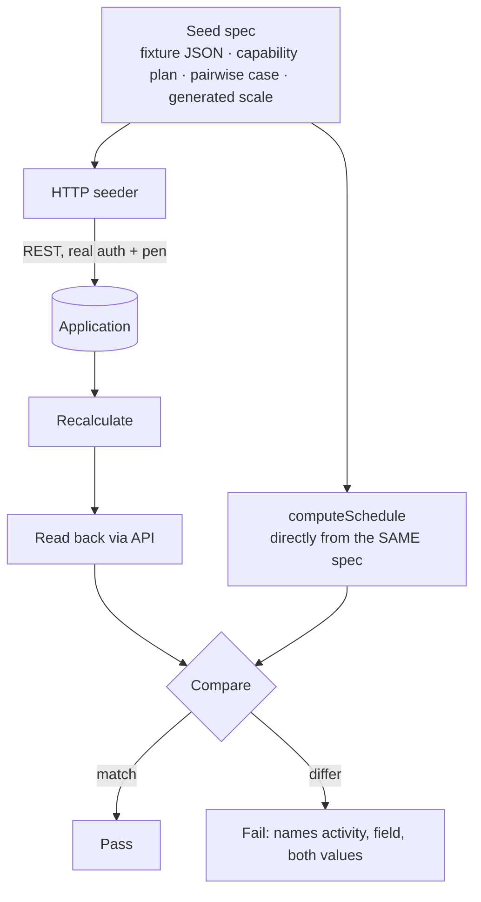
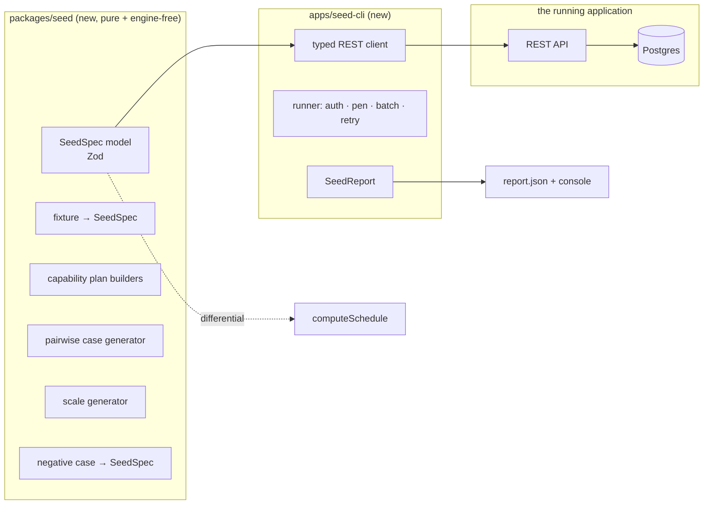

<!--
Feature Spec — the Seed Catalogue & Test Playbook (ADR-0066).
Stages 1–4 of docs/PROCESS.md. Stage 5 lives in implementation-plan.md.
-->

# Feature Spec: the Seed Catalogue & Test Playbook

**Status:** Proposed — awaiting approval
**Owner:** product owner (decisions recorded in §1 Open questions)
**Date:** 2026-07-31

---

## 1. Business understanding

### Problem

**The engine is proven. The product around the engine is not.**

The ADR-0034 conformance harness feeds `p6_torture_test_v1.json` **straight into
`computeSchedule`** — a pure function. It never touches Prisma, the services, the DTOs, the
recalculate transaction, the API or any UI. So all **117** capability keys in the fixture's
`coverage_index` are proven **at the engine**, and **none** is proven **at the application**.

The only route from that fixture into a real database is the XER import, and the XER format
cannot carry roughly seventeen of the capabilities at all (duration types, external
inter-project instants, the per-relationship lag calendar, resource `max_units_per_hour` and
`price_per_unit`, assignment `curve`/`role`/lag, the four expenses, the eight activity steps).
There is **no seed script anywhere in the repository** — `apps/api/prisma/` holds migrations and
a schema and nothing else.

This is not hypothetical. On 2026-07-31 the importer was found to be coercing every P6
`TT_LOE` row into a zero-duration `TASK`. The engine implements Level of Effort completely
(ADR-0035 §21), every golden test passed, and the thing a planner actually opens showed five
activities collapsed to points instead of spanning their logic. **No existing gate could have
caught it**, because no gate exercises the path between the engine and the screen. The same
week, the WBS-summary rollup was found never to receive `parentId` at the service seam — again
green at the engine, wrong in the product.

A second, related problem: the fixture is **one 129-activity plan**. When a date looks wrong
there is no way to tell which feature caused it, which is precisely the difficulty behind the
report that "the WBS rows don't tally". And 129 activities is **6%** of the 2,000-activity scale
the draw-performance argument (ADR-0026 §9, TECH_DEBT #75) is conducted at, so no plan in the
repository is large enough to test the claim.

### Users

- **The product owner**, driving the product by hand to find defects before customers do.
- **Engineers**, needing a plan that exercises the feature they are changing.
- **CI**, needing a gate that fails when the write/read path loses a field.

### Primary use cases

1. Seed a rich, known plan into a running instance and drive it by hand.
2. Seed one small plan per capability, small enough to check the arithmetic by hand.
3. Prove systematically that the application does not lose or mangle any field the engine
   understands, across combinations of features.
4. Seed a plan at 500 / 2,000 / 5,000 activities to measure and to shake out pagination.
5. Confirm the application rejects, repairs or reports hostile input — never silently accepts.
6. Work through a written playbook that says, per capability, which plan proves it and what
   "wrong" looks like.

### User journeys

1. Operator runs one command against their Docker Compose host → a named set of plans appears
   in a dedicated client/project → they open any of them in the app.
2. Engineer changing the levelling pass runs the levelling plan, changes one option, and sees
   which bars moved.
3. CI runs the pairwise suite → a mismatch names the exact field, activity and dimension pair.

### Expected outcomes

- Every capability the app claims has a **named plan** that demonstrates it end to end.
- A field that the write or read path drops **fails a test** rather than being discovered by a
  planner months later.
- TECH_DEBT #75 becomes answerable: a real plan at the scale the budget argues about.
- The XER import gains a reference to diff against, so import fidelity is measurable rather
  than asserted.

### Success criteria

| #   | Criterion                                                                                                                           | Measure                                                                         |
| --- | ----------------------------------------------------------------------------------------------------------------------------------- | ------------------------------------------------------------------------------- |
| S1  | Every one of the 117 `coverage_index` keys is reachable in a seeded plan, or explicitly recorded as having no SchedulePoint concept | A generated coverage report; the exceptions list is in the playbook, not silent |
| S2  | Seeding runs entirely through the public REST API                                                                                   | No Prisma import in the seeder                                                  |
| S3  | The pairwise suite compares the **application's** answer against the **engine's** answer built from the same source spec            | The LOE defect, reintroduced, fails the suite                                   |
| S4  | A 5,000-activity plan seeds and opens                                                                                               | Wall-clock recorded, not asserted                                               |
| S5  | All 18 negative cases are attempted against the real API and none is silently accepted                                              | One assertion per case                                                          |
| S6  | The playbook names a plan for every capability row                                                                                  | `pnpm check:playbook` fails on a row with no plan                               |

### Open questions

All four resolved by the product owner on 2026-07-31:

| Question                                    | Decision                                                                                                                                                                                                                            |
| ------------------------------------------- | ----------------------------------------------------------------------------------------------------------------------------------------------------------------------------------------------------------------------------------- |
| Where does the seeder run?                  | **An HTTP CLI against a running instance.** It logs in and drives the real REST API, so it works against the Compose host as well as a dev machine, and exercises auth, RBAC and the ADR-0028 edit-lock the way a real client does. |
| First milestone scope?                      | **All five tiers plus the playbook.**                                                                                                                                                                                               |
| How far on feature crossings?               | **Systematic pairwise** over the dimensions that genuinely interact.                                                                                                                                                                |
| Scale generator now, or with the benchmark? | **Now.**                                                                                                                                                                                                                            |

---

## 2. Functional requirements

### User stories & acceptance criteria

**US-1 — Seed the full fixture.**
As the product owner, I run one command and get the whole torture-test programme as a live plan.

- Given a running instance and credentials, when I run `seed fixture`, then a plan exists with
  129 activities, 188 relationships, 8 calendars, 22 resources, 45 assignments, 8 steps and
  4 expenses, created through the public API.
- And a **report** names every source object that could not be placed, with a reason.
- And nothing is created if any step fails (the run is resumable, not half-applied — see §2
  Edge cases).

**US-2 — Seed one plan per capability family.**

- Given `seed capabilities`, then one plan per family appears, each 5–15 activities, each named
  for what it demonstrates.
- And each plan's description states the expected outcome in one sentence, so the app itself
  carries the assertion a reader checks against.

**US-3 — Prove the application does not lose fields.**

- Given a seed spec, when it is seeded through the API and recalculated, then every computed
  field matches what `computeSchedule` produces **from the spec directly**.
- And a mismatch names the activity, the field, both values, and the dimension pair.

**US-4 — Seed at scale.**

- Given `seed scale --activities 2000`, then a plan of that size exists with realistic logic
  density, and the seeder reports wall-clock for seed and for recalculation.

**US-5 — Confirm hostile input is refused.**

- Given each of the 18 negative cases, when seeding is attempted, then the API rejects, repairs
  or reports it, and the observed outcome is compared against the case's declared expectation.

**US-6 — Work through the playbook.**

- Given `docs/TEST_PLAYBOOK.md`, then every capability row names its plan, what to look at, what
  correct looks like and what wrong looks like.

### Workflows

**The load-bearing decision is the right-hand branch.** The expected answer is built from the
**seed spec**, never from the persisted rows. Building it from the persisted rows would reuse
`schedule.service.ts`'s own input assembly — the exact code the LOE and `parentId` defects lived
in — so the comparison would agree with itself and prove nothing. Deriving it from the source
spec is what makes the differential able to see a field the write path dropped.

### Edge cases

- **Partial failure mid-seed.** A plan half-created is worse than none: it looks real. Each plan
  is seeded, then verified, then marked complete; a failed run leaves the incomplete plan
  soft-deleted and names it in the report.
- **The pen (ADR-0028).** Structural writes are lock-gated. The seeder acquires the lease,
  heartbeats it for the duration, and releases it — a 423 mid-run is a seeder bug, not a
  product bug, and must say so.
- **Re-running.** Seeding twice must not duplicate. Plans are identified by a stable seed name;
  the default is refuse-and-report, with `--replace` as the explicit opt-in.
- **Objects with no SchedulePoint concept.** The fixture's 4 roles, 7 activity-code types and
  7 UDF definitions have no schema. They are **reported as unplaceable**, never dropped
  silently — the ADR-0050 discipline applied to seeding.
- **Rate limiting.** A 5,000-activity seed is thousands of requests. The seeder must batch where
  the API offers batch endpoints and back off on 429 rather than failing the run.

### Permissions

The seeder is an ordinary API client and gets no special path. It needs **Planner or Org Admin**
(`plan:create`, `activity:create`, `dependency:link`, `calendar:manage_org`, `resource:*`) and
holds the pen for structural writes. **This is a feature, not a limitation**: if the seeder
cannot create something as a Planner, a Planner cannot either, and that is a finding.

### Validation rules

Every rule already enforced by the API applies unchanged. The seeder adds none of its own — a
seeder-side validation would be a second opinion that could drift from the product's.

### Error scenarios

| Scenario                     | Behaviour                                                                                                                 |
| ---------------------------- | ------------------------------------------------------------------------------------------------------------------------- |
| Bad credentials / no session | Fail immediately with a clear message; nothing attempted                                                                  |
| Insufficient role            | Fail with the API's own 403 message, naming the missing capability                                                        |
| Pen held by someone else     | Fail with the holder's name; do not take over (an operator seeding over a colleague's edit is not a default worth having) |
| A capability the API refuses | **Recorded as a finding and the run continues**, so one gap does not hide the rest                                        |
| Network interruption         | The incomplete plan is soft-deleted and named                                                                             |

---

## 3. Technical analysis

**What exists:**

- `packages/engine-conformance` — the fixture, its Zod schema, typed loaders, the structural
  validator, and the coverage checker. Engine-free.
- `apps/api/test/conformance/` — the differential harness that drives the real engine.
- 18 flag-scoped Playwright suites under `apps/web/e2e-*`, each of which already creates an org,
  a client, a project and a plan over HTTP. **That is the seeding primitive, already written and
  proven**, currently duplicated per suite.
- `@repo/interchange` — the canonical model, and the `InterchangeReport` shape that this work
  copies for its own reporting.

**What does not exist:** any seed path, any HTTP client library for the API outside test
helpers, any plan larger than 129 activities, and any test that compares an application result
against an engine result.

**The Python generator** (`fixtures/tools/generate_fixture.py`, 97 KB) is the upstream producer
of the fixture. It is deliberately **not touched**: it runs the wrong direction (it produces
JSON, we need JSON → app), the fixture is pinned to `schema_version 1.0` and re-running it is a
reviewed change, and ADR-0034 explicitly rejected adding Python to the pipeline. Tiers 2–4 need
their own generator, in **TypeScript**, beside the seeder and covered by the same suite.

### Dependencies

- ADR-0034 (the fixture and the no-external-oracle rule), ADR-0035 (documented semantics),
  ADR-0028 (the pen), ADR-0050 (report discipline), ADR-0022 (recalculate).
- A running instance and a Planner or Org Admin account. No new runtime dependency.

---

## 4. Solution design

### Architecture overview

**`packages/seed` is pure.** It knows how to _describe_ a plan and never how to talk to a
server, mirroring the `@repo/interchange` split that has held up well. That is what lets the
same specs feed both the HTTP seeder and the in-process differential.

### Data flow

1. A `SeedSpec` is produced (from the fixture, a builder, the pairwise generator, or the scale
   generator).
2. The CLI authenticates, resolves or creates the target org/client/project, and takes the pen.
3. It creates calendars → resources → the plan → activities (with WBS parents) → dependencies →
   assignments → steps/expenses, batching where the API offers it.
4. It recalculates and reads the plan back.
5. For a differential run, `computeSchedule` is invoked on the **spec** and the two results are
   compared field by field.
6. A `SeedReport` is written: what was created, what was unplaceable, what diverged.

### Database changes

**None.** Everything is created through existing endpoints. This is deliberate: a seeder that
needs a schema change is a seeder that is not using the product.

### API changes

**None planned.** Any endpoint the seeder finds missing is recorded as a finding and raised
separately, so the seeding work does not quietly grow an API surface.

### Component changes

**None.** No web change in this epic.

### The pairwise dimensions

Chosen by reading the engine's branch points, not by multiplying enum sizes. Grouped by where
they live:

| Scope        | Dimension                                 | Values                                                                            |
| ------------ | ----------------------------------------- | --------------------------------------------------------------------------------- |
| Activity     | `ActivityType`                            | TASK · START_MILESTONE · FINISH_MILESTONE · LEVEL_OF_EFFORT · RESOURCE_DEPENDENT  |
| Activity     | constraint                                | none · SNET · SNLT · FNET · FNLT · MSO · MFO · MANDATORY_START · MANDATORY_FINISH |
| Activity     | `ActivityStatus`                          | NOT_STARTED · IN_PROGRESS · COMPLETE                                              |
| Activity     | `PercentCompleteType`                     | DURATION · UNITS · PHYSICAL                                                       |
| Activity     | `DurationType`                            | the four                                                                          |
| Activity     | `AccrualType`                             | START · UNIFORM · END                                                             |
| Activity     | calendar                                  | inherit · own 5-day · own 24-hour · shift/night · window-only                     |
| Activity     | external instants                         | none · early-start · late-finish · both                                           |
| Activity     | suspend/resume                            | absent · present                                                                  |
| Relationship | `DependencyType`                          | FS · SS · FF · SF                                                                 |
| Relationship | `LagCalendarSource`                       | PREDECESSOR · SUCCESSOR · TWENTY_FOUR_HOUR · PROJECT_DEFAULT                      |
| Relationship | lag sign                                  | negative · zero · positive                                                        |
| Assignment   | `ResourceKind`                            | LABOUR · EQUIPMENT · MATERIAL                                                     |
| Assignment   | `ResourceCurveType`                       | the five                                                                          |
| Assignment   | driving                                   | yes · no                                                                          |
| Assignment   | `units_per_hour`                          | null · set                                                                        |
| Resource     | `max_units_per_hour`                      | null · set                                                                        |
| Plan         | `SchedulingMode`                          | EARLY · VISUAL                                                                    |
| Plan         | `ProgressRecalcMode`                      | RETAINED_LOGIC · PROGRESS_OVERRIDE · ACTUAL_DATES                                 |
| Plan         | `CriticalPathDefinition`                  | TOTAL_FLOAT · LONGEST_PATH                                                        |
| Plan         | `TotalFloatMode`                          | START · FINISH · SMALLEST                                                         |
| Plan         | `levelResources` / `levelWithinFloatOnly` | on · off                                                                          |
| Plan         | `ignoreExternalRelationships`             | on · off                                                                          |
| Plan         | `useExpectedFinishDates`                  | on · off                                                                          |
| Plan         | `makeOpenEndsCritical`                    | on · off                                                                          |

An all-pairs covering array over these lands at roughly **55–75 cases**, not thousands — the
whole point of pairwise. Illegal combinations (a milestone with a duration type, a MATERIAL
resource driving) are excluded by declared constraints on the generator, and the exclusions are
listed in the report so an excluded pair is visible rather than absent.

**How each case asserts.** Not with a hand-authored expected date — at this count that would be
unmaintainable and, worse, would be authored by reading the engine, making it circular. Each
case asserts the **application matches the engine on the same inputs** (§2 Workflows). That is a
strong, mechanical, non-circular claim: it cannot tell us the engine is right (the ADR-0034
goldens do that, per capability), but it catches everything between the engine and the screen,
which is the whole gap this epic exists to close.

### Implementation approach & alternatives

**Chosen: pure spec package + HTTP CLI, differential against the engine from the spec.**

Rejected:

- **Direct Prisma seeding.** Faster, but it can create rows the product itself would refuse, so
  the test bed would be testing the rendering of impossible data. It also skips every service
  invariant — which is where the last two defects lived.
- **Extending the XER fixture to carry more.** The format genuinely has no column for most of
  it; forcing it would mean inventing non-standard fields, and the file would stop being a
  realistic P6 export, which is its main value.
- **Extending the Python generator.** Wrong direction, pinned fixture, and ADR-0034 rejected
  Python in the pipeline.
- **Hand-authored expected dates for the pairwise tier.** Unmaintainable at 60+ cases, and
  circular if authored by reading the engine.
- **One mega-plan containing everything.** This is what exists today, and its undiagnosability
  is one of the two problems being solved.

---

## 5. Links

- ADR-0066 (to be written with M0) — the seed catalogue and the engine-as-oracle differential
- ADR-0034 — engine conformance & validation methodology
- ADR-0035 — SchedulePoint CPM semantics
- ADR-0050 — schedule interchange (the report discipline this copies)
- ADR-0058 — drift control ("verify the claim; do not trust the document")
- `docs/TECH_DEBT.md` #75 — the unmeasured draw budget this unblocks
