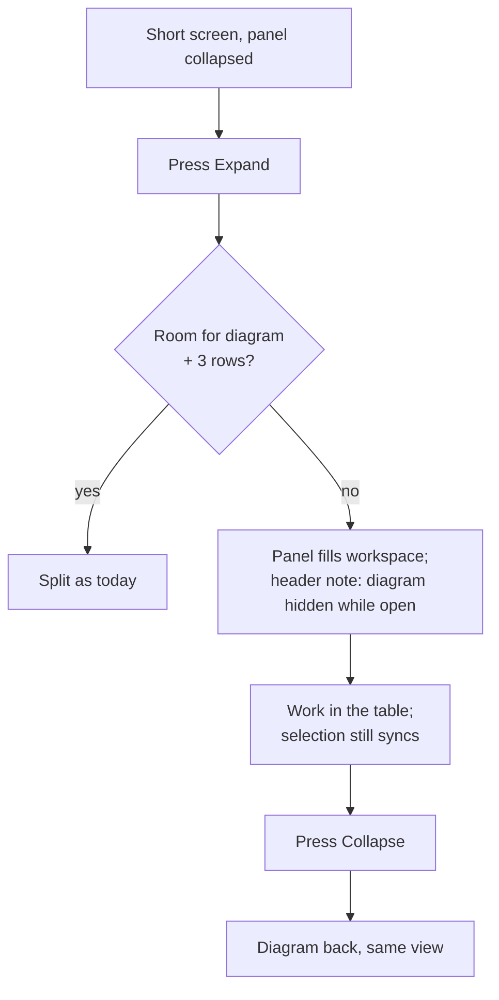

# Feature Spec: Short screens — rows in the activities panel, and a three-line deck at 1024

- **Status:** Draft — awaiting approval before implementation.
- **Decision:** none yet. Part A needs CQ-A; Part B needs CQ-B (§1 "Open questions").
- **Author(s):** Claude Code (feature-analyst), for James Ewbank (product owner)
- **Date:** 2026-10-08
- **Tracking issue / epic:** `docs/TECH_DEBT.md` #468 (Part A); `docs/HANDOFF.md:32-37` (both parts)
- **Roadmap link:** follow-up to the minimum-viewport epic (ADR-0179 D10, "the floor is made to fit")
- **Related ADR(s):** ADR-0179 (the floor), ADR-0030 (canvas-first workspace and the bottom panel),
  ADR-0092 (the diagram's vertical budget), ADR-0109 D1 (a command surface wraps and never hides),
  ADR-0117 (an icon-only control names itself), ADR-0111 (keyboard contracts reviewed before
  release), ADR-0135 (focus handed back), ADR-0088 D1 (no flag), ADR-0105 (why this is a spec).
  **A short ADR is required** (§4 "ADR"), because both parts change a layout rule that an ADR states.

## 0. Summary in plain English

**Who this is for.** Neither part changes anything on your two screens. On the 1912 × 948 monitor
and the 1912 × 1114 Surface, the panel already has room and the toolbar is already two lines. Both
parts are for **short screens**: a 1366 × 768 laptop (about 600–636 px of window height once Windows
and the browser take their share, ADR-0179 D1) and an 11-inch tablet. They also apply to your
monitor zoomed to about 150 %, which makes it behave like a 1275 px window.

**Part A: the activities panel shows no rows on a short screen (#468).** At 1024 × 600, pressing
Expand opens the activities panel, but the panel has room only for its own heading, its bottom bar
and the column headings. No activity rows fit.

- **What the register proposed:** under about 660 px of height, the diagram's minimum gives way to
  about 160 px.
- **What reading the code shows:** that proposal **would not fix it**. It frees about 25 px, and one
  row needs about 35 px. The panel's own minimum (140 px) is smaller than the panel's own fixed
  parts (about 147 px), so no rows show **at any window size** when the panel is at its minimum.
  Details are in §3.2.
- **What we recommend:** when the window is too short to show both the diagram and three table rows,
  pressing Expand gives the panel the whole workspace and hides the diagram. Collapse brings the
  diagram back exactly as you left it. This is the same one-at-a-time behaviour the workspace already
  uses in narrow windows.
- **What you get:** at 1024 × 600, about 5 rows with a mouse and 2–3 with a finger.
- **The alternative:** keep a sliver of the diagram (about 96 px) and give the panel 2 rows. That
  only works with a mouse; with a finger it is back to zero rows.
- **Also fixed:** the panel's smallest drag height rises from 140 px to about 185 px, so a panel
  dragged to its minimum always shows at least one row, on any screen.

**Part B: dropping three toolbar labels below 1280 px wide.** At 1024 wide the toolbar is four lines.
Hiding the words on three buttons makes it three, which gives the diagram 44 px more (274 → 318 px
at 1024 × 600, +16 %). The three buttons are **Summary**, **Settings…** (the one with the calendar
icon) and **Share & export**. We looked at two ways to do it.

- **B1, drop the labels.** The three buttons stay in the same place, showing only their icons. Their
  names show on hover, on keyboard focus and on a long press. It saves about 267 px of the 249 px
  needed, leaving an 18 px margin, and the gate fails if a later change uses that margin up.
- **B2, an overflow `⋯` menu.** Below 1280, the three buttons move into a `⋯` menu. That saves more
  width, but:
  - it brings back the `⋯` you removed in ADR-0109 ("all commands visible when we can");
  - it puts Share & export, which is already a menu, inside another menu, which would be this
    product's first nested menu;
  - the three commands would live in two different places depending on window width.
- **We recommend B1, with two conditions:**
  1. The Summary and Share & export buttons get the proper tooltip (ADR-0117). Today, without their
     labels, they would name themselves only to a mouse.
  2. Settings… gets a settings icon instead of the calendar icon, at every width. The label was
     renamed away from "Calendar…" because the dialog holds much more than the calendar
     (`tsld-toolbar-items.tsx:3289-3294`), but the icon was never changed.
- **This goes against the UX reviewer's earlier advice** (`docs/HANDOFF.md:34-35`). The conditions
  above are our answer to that advice. The reviewer reviews again before anything ships.
- **No gain with a finger:** a finger at 1024 needs about 460 px saved, so the toolbar stays four
  lines there (`m4-measurement.md:84-85`).

**Size:** Part A is S–M. Part B is S–M. Each is one milestone with its own release. Neither needs a
database, API or permission change.

## 1. Business understanding

### Problem

ADR-0179 makes 1024 × 600 the designed floor and D10 commits to making the floor fit. Minimum-viewport
M4 recovered 48 px of diagram at the floor (`m4-measurement.md:11`) and left two items for the
product owner, because each trades one thing for another (`m4-measurement.md:56-58`, `:75-78`;
`docs/HANDOFF.md:32-37`):

- **A.** The expanded activities panel shows no rows at 1024 × 600 (#468).
- **B.** The deck is four lines at 1024 by arithmetic. LOOK is 733 + 513 px and DO is 627 + 622 px,
  in a 1008 px row (`m4-measurement.md:46-48`). Each declared row therefore wraps once.

### Users

All roles that open the plan workspace: Org Admin, Planner, Contributor and Viewer. The External
Guest view does not mount the workspace toolbar or the bottom panel. `plan-workspace-toolbar.tsx`,
`activity-bottom-panel.tsx` and `Deck` have no importer under `features/share` (searched with grep).

### Primary use cases

1. On a 1366 × 768 laptop, a planner expands the activities panel to scan or edit rows, then
   collapses it to return to the diagram.
2. On the same laptop, or a monitor zoomed to about 150 %, a planner works in the diagram with as much
   height as the floor can give.

### Expected outcomes

- A: an expanded panel always shows rows, at any window height and on either pointer.
- B (if B1 is chosen): 1024–1279 px wide with a fine pointer, the deck is three lines and the diagram
  gains 44 px; every command stays where it is.

### Success criteria

- **SC-A1:** at 1024 × 600, fine and coarse pointers, with the panel expanded, at least two activity
  rows are fully visible and hit-testable (`elementFromPoint`).
- **SC-A2:** at any window size, a panel dragged to its minimum shows at least one row.
- **SC-A3:** at 1280 × 800, 1912 × 948 and 1912 × 1114, the expanded layout is unchanged.
  Diagram and panel heights must be equal before and after.
- **SC-B1:** at 1024 × 600 fine pointer, the deck is at most 3 lines and the DO row 1 line. At 1280
  and above, nothing changes, including the label count.
- **SC-B2:** each of the three icon-only controls shows its name on hover, on keyboard focus and on a
  touch long-press, in a real browser (ADR-0117).

### Open questions

- **CQ-A (critical): what happens to the diagram on a short screen when the panel is expanded?**
  - **A1:** the panel takes the workspace and the diagram is hidden until Collapse.
  - **A2:** the diagram keeps a ~96 px sliver and the panel gets about 2 rows (fine pointer only).
  - **A3:** the register's wording — the diagram's minimum drops to 160 px. This gives about 0 rows.
  - **Recommendation: A1.** It is the only option that gives rows on a coarse pointer, and it reuses
    the workspace's existing one-pane pattern (`plan-workspace-toolbar.tsx:666-669`).
- **CQ-B (critical): is the label drop wanted at all, and in which form?**
  - **B1:** drop the labels, with the two conditions above.
  - **B2:** an overflow `⋯` menu.
  - **B0:** neither; keep four lines.
  - **Recommendation: B1.** If you do not want the Settings icon changed at every width, choose B0
    rather than B1 without it. The calendar glyph fails the deck's own icon-only test
    (`Deck.tsx:128`).

**Defaults stated, not asked:**

- Part A triggers on the **measured workspace height**, not the window height. Reason: the room
  depends on deck lines, pointer and an open dock. The `short` variant (`max-height: 44rem`,
  `globals.css:36`) would be wrong in both directions.
- The "useful" panel is three rows. Reason: the table's own floor is "the header and about three
  rows" (`data-table.tsx:600`).
- B1 applies only to a fine pointer. A coarse pointer gains no line at 1024–1279, so it would lose the
  labels for nothing.
- No feature flag (ADR-0088 D1).
- An open right dock is hidden with the diagram under A1, because it lives in the diagram's row
  (`plan-workspace-toolbar.tsx:2361-2481`).

## 2. Functional requirements

### User stories & acceptance criteria

> **US-A1** — As a planner on a short screen, I want an expanded activities panel to show rows, so
> that I can use the table without a bigger monitor.
>
> - **Given** the workspace body cannot hold the diagram minimum plus a three-row panel, **when** I
>   press Expand, **then** the panel fills the workspace body, the diagram row is hidden (still
>   mounted), and the panel header says in one line that the diagram is hidden while the panel is
>   open.
> - **When** I press Collapse, **then** the diagram returns with its viewport, zoom and selection
>   unchanged.
> - **Given** the workspace has room for both, **then** the expanded layout is exactly as today
>   (SC-A3).
> - **Given** the window grows or shrinks across the threshold while the panel is expanded, **then**
>   the layout switches without a remount. If focus was inside the row being hidden, it moves to the
>   panel's Collapse control (ADR-0135).

> **US-A2** — As any user, I want the panel's smallest size to still show a row.
>
> - **When** I drag or arrow-key the panel resizer to its minimum, **then** at least one row is
>   visible. `aria-valuemin` reports the new minimum.

> **US-B1** _(if B1)_ — As a planner on a 1024–1279 px window with a mouse, I want the toolbar to
> take three lines, so that the diagram is taller.
>
> - **Given** a fine pointer and a window under 1280 px wide, **then** Summary, Settings… and
>   Share & export show their icon only. Their accessible names are unchanged.
> - **When** I hover over, focus or long-press one of them, **then** the tooltip states its name
>   (ADR-0117 `name-echo`; Settings… keeps `description`, see `ToolbarButton.tsx:131`).
> - **When** I open Summary's popover or Share & export's menu, **then** the tooltip closes, and Escape
>   closes the menu or popover as before.
> - **At 1280 px wide or more, or with a coarse pointer**, the labels show as today.

### Edge cases

| Case                                                         | Behaviour                                                                                                     |
| ------------------------------------------------------------ | ------------------------------------------------------------------------------------------------------------- |
| A right dock is open and the screen is short (A1)            | The threshold uses `DOCK_MIN_HEIGHT` as the reserve (`plan-workspace-toolbar.tsx:805`). On expand, the dock hides with the diagram. On collapse, both return. |
| Gantt view                                                   | Same rule. The stage holds `GanttPanel` (`plan-workspace-toolbar.tsx:1545-1548`).                             |
| Below `md` (single-pane)                                     | Unchanged. It already shows one pane at a time.                                                               |
| `bodyHeight` is 0 (first paint, jsdom)                       | Treated as "room for both", so jsdom suites and first paint are unchanged.                                    |
| Stored panel height (`panel.size`)                           | Never overwritten. A1 is a render-time state, like the existing clamp (`plan-workspace-toolbar.tsx:808`).     |
| B1 with a shaded control                                     | The disabled reason still wins the tooltip, as `ToolbarPopover.tsx:128-134` already does for `title`.         |
| B1: a later DO command eats the 18 px margin                 | `command-surface.spec.ts` turns red at 1024 (DO row bound tightened to 1 line). That is the intent.           |

### Permissions

No change. The panel and the deck render for every role that can open the workspace. Authoring
controls stay pen-gated (ADR-0028), and neither part is a write.

### Validation rules / Error scenarios

None. There is no input, no request and no server state.

## 3. Technical analysis

| Area           | Impact | Notes                                                                                                   |
| -------------- | ------ | ------------------------------------------------------------------------------------------------------- |
| Frontend       | med    | `plan-workspace-toolbar.tsx`, `use-activity-panel-prefs.ts`, `activity-bottom-panel.tsx`; B1: `Deck.tsx`, `ToolbarPopover.tsx`, `ExportMenuControl` (`tsld-toolbar-items.tsx:1637`) |
| Backend / DB / API | none | —                                                                                                   |
| Security       | none   | No new input, no auth surface                                                                           |
| Performance    | low    | A reads the `bodyHeight` the ResizeObserver already measures (`plan-workspace-toolbar.tsx:688-700`). B adds one `matchMedia` subscription |
| Infrastructure | none   | No new Playwright config or CI step                                                                     |
| Testing        | med    | Unit tests for both parts. The `web:workspace-fit` and `web:workspace-chrome` journeys at 1024 × 600, and `web:toolbar` for tooltips |

### 3.1 Recalc parity, pen, flag

- **Recalc parity:** not engaged. Neither part touches a scheduling input or `computeSchedule`.
- **The pen:** not engaged. No write is added.
- **Flag:** none (ADR-0088 D1). Each milestone is one commit, and that commit is the rollback.

### 3.2 Part A — the numbers, checked against the code

Checked as CLAUDE.md §19.11 requires. Lines marked ✓ match #468. Lines marked ✗ disagree with it.

| #468 says                                   | The code says                                                                                                                         |
| ------------------------------------------- | ------------------------------------------------------------------------------------------------------------------------------------- |
| ✓ diagram `min-h-[240px]` at `TsldPanel.tsx:3279` | Present. But the diagram's row and stage are `min-h-0 … overflow-hidden` (`plan-workspace-toolbar.tsx:2361`, `:2368`), so this class does **not** push the panel; it is clipped. What sizes the panel is the JS twin `CANVAS_MIN_HEIGHT = 240` (`use-activity-panel-prefs.ts:23`), used in `effectiveMax = min(720, max(140, bodyHeight − 240))` (`plan-workspace-toolbar.tsx:801-808`). |
| ✓ `PANEL_MIN_OPEN` 140                       | `use-activity-panel-prefs.ts:18`.                                                                                                      |
| ✓ 51 px foot                                 | `border-t-[3px] … py-1` plus the 40 px collapse button (`activity-bottom-panel.tsx:472`); gated as `FOOT_MAX_PX = 51` (`command-surface.spec.ts:455`). |
| ✗ "+ 51 px of foot" on top of the panel's 140 | When expanded, the foot row is **inside** the panel (`activity-bottom-panel.tsx:359`, inside the `height: panelHeight` box at `plan-workspace-toolbar.tsx:2499`). It is not added to it. |
| ✗ 227 px of chrome                           | Not derivable from code. The M4 reading (collapsed canvas 274 px at 1024 × 600 fine, `m4-measurement.md:11`) plus the 51 px foot gives a workspace body of about **325 px**, so about 275 px of chrome. M0 re-measures this. |

**Why no rows show (inferred from classes, to be measured in M0 per ADR-0113).** At a body of about
325 px, `effectiveMax = max(140, 325 − 240) = 140`. The panel's fixed parts inside those 140 px are:

| Part                                   | Size     | Source                                                         |
| -------------------------------------- | -------- | -------------------------------------------------------------- |
| Header row (`px-4 py-2` plus the Create button) | ≈ 48 px | `activity-bottom-panel.tsx:260`                                 |
| Foot                                   | 51 px    | see above                                                      |
| Body `pb-4`                            | 16 px    | `activity-bottom-panel.tsx:311`                                 |
| Table header                           | ≈ 32 px  | estimate                                                       |
| **Total, before any row**              | **≈ 147 px** |                                                            |

A row is about 35 px (`ESTIMATED_ROW_HEIGHT = 37`, `data-table-windowed-body.tsx:65`; the table's
own note says 128 px holds "the header and about three rows", `data-table.tsx:600`). So:

- **A 140 px panel shows no rows at any window height.** #468 is two defects: the floor's budget and
  a panel minimum below its own content.
- **The register's 160 px proposal** gives `325 − 160 = 165` px of panel, about 18 px for rows, which
  is **0 rows**. Coarse is worse: a 44 px button gives a ≈ 55 px foot and a ≈ 60 px header.
- **A1 at 1024 × 600:** the panel gets ≈ 325 px, which is ≈ 5 rows on a fine pointer. On a coarse
  pointer the body is ≈ 289 px (canvas 234, `m4-measurement.md:21`, plus a ≈ 55 px foot), which is
  ≈ 2–3 rows.
- **A2 (diagram ≥ 96):** fine ≈ 223 px of panel, about 2 rows. Coarse ≈ 187 px, about 0 rows.

**Threshold (A1).** The swap applies when
`bodyHeight > 0 && bodyHeight − reserve < PANEL_USEFUL_MIN`, where:

- `reserve` is `CANVAS_MIN_HEIGHT`, or `DOCK_MIN_HEIGHT` with a dock open;
- `PANEL_USEFUL_MIN` is the panel's fixed parts plus three rows: ≈ 252 fine and ≈ 300 coarse.

M0 measures both, and they become two constants with their measurement in the docblock.

What the threshold means in window terms:

- **1024 wide, fine pointer (4-line deck):** about 767 px of window height or less, which covers the
  whole 1366 × 768 class.
- **1280 × 800 fine:** body ≈ 613 px, so no swap.
- **1912 × 948 and 1912 × 1114:** no swap.
- **The PO's "~660":** the window-height figure was a proxy, and the computed rule replaces it.

`PANEL_MIN_OPEN` becomes the panel's fixed parts plus one row (≈ 185 fine). It is still a single
constant, and the resizer's `aria-valuemin` follows it (`plan-workspace-toolbar.tsx:2492`).

### 3.3 Part B — the numbers, checked against the code

- **Which items.** The ids are `summary`, `calendar` and `export`, but the visible labels are
  **"Summary"**, **"Settings…"** and **"Share & export"**:
  - `summary`: `tsld-toolbar-items.tsx:3217`;
  - `calendar`: `:3326`, label "Settings…" with description "Schedule settings" and a `CalendarDays`
    icon;
  - `export`: `SHARE_EXPORT_LABEL`, `:1619`, with a `FileDown` icon at `:2578`.

  The brief's "Calendar" and "Export" are ids, not labels.
- **Arithmetic** (all from `m4-measurement.md:46-62`):
  - DO at 1024 is Author 627 + Plan 622 + 8 = 1257 px, in a 1008 px row. Fitting it on one line
    needs **249 px** removed.
  - The three labels are **≈ 267 px**, which leaves **≈ 18 px** spare. That is fragile, and the gate
    will hold it.
  - LOOK stays two lines (733 + 513 > 1008), so the deck goes 4 → 3, not 2, for **+44 px**.
  - At 1280, DO already fits (7 px spare), which is why the rule stops below 1280.
  - With a coarse pointer, DO is 799 + 662 = 1461 px, so ≈ 461 px would be needed and B gains nothing.
- **Mechanism today.**
  - `Deck` has no width input. It pins `layout: 'comfortable'` (`Deck.tsx:172-177`, `:414`).
  - Labels are withheld only for a static `ICON_ONLY` set (`Deck.tsx:137-148`, `:433`).
  - `calendar` is a plain `ToolbarButton`: when its label is dropped it already uses the tooltip
    primitive (`ToolbarButton.tsx:131-135`).
  - `summary` (`ToolbarPopover`) and `export` (`ExportMenuControl`) are `render` items with a working
    `compact` branch (`triggersAreCompact`, `tsld-toolbar-items.tsx:1114-1125`). That branch names
    them with **native `title` only** (`ToolbarPopover.tsx:130-134`; `tsld-toolbar-items.tsx:1668`).
    `title` reaches nobody but a mouse, which is the defect ADR-0117 exists to prevent. **B1 must
    adopt `useTooltip` on both triggers.** That changes focus and long-press behaviour on a
    menu-button and on a popover trigger, so **ADR-0111 fires**.
- **B2's cost, measured from the code.**
  - The `⋯` and `ToolbarOverflow.tsx` were deleted by ADR-0109 D1 ("a command surface wraps; it never
    hides", `0109-a-command-surface-wraps.md:51-68`).
  - A `⋯` holding Share & export means a menu inside a menu. That was rejected before as "this
    product's first nested menus" (`tsld-toolbar-items.tsx:3276-3281`).
  - Summary is a popover, so it cannot be a menu item without a redesign.
  - Width saved: whole controls rather than labels, ≈ 360 px (estimate), so more margin than B1.
  - **ADR-0111 fires, and ADR-0109 D1 would need superseding in part.**

### Dependencies

None outstanding. Minimum-viewport M4 has shipped (web 0.179.0, `docs/HANDOFF.md:28`).

## 4. Solution design

### Architecture overview

```mermaid
flowchart TB
  RO[ResizeObserver on the workspace body\nplan-workspace-toolbar.tsx:688] --> BH[bodyHeight]
  BH --> SB{bodyHeight − reserve\n< PANEL_USEFUL_MIN?}
  SB -- no --> SPLIT[Today's split:\ndiagram row + resizer + panel\npanelHeight = min(size, effectiveMax)]
  SB -- yes, panel expanded --> SWAP[Short-body swap:\ndiagram row hidden, kept mounted\npanel fills the body, no resizer]
  SB -- yes, panel collapsed --> COLL[Today's collapsed bar]
  MQ[matchMedia: width < 80rem AND pointer: fine] --> DECK[Deck: iconOnlyBelowXl set\nsummary · calendar · export]
  DECK --> TB[ToolbarButton: showLabel=false → useTooltip]
  DECK --> RI[render api: iconOnly → ToolbarPopover / ExportMenuControl compact + useTooltip]
```

### Data flow

```mermaid
sequenceDiagram
  participant U as Planner
  participant F as Foot row (Expand)
  participant W as PlanWorkspaceToolbar
  participant P as ActivityBottomPanel
  U->>F: press Expand
  F->>W: expand() — collapsed=false
  W->>W: shortBody = bodyHeight − reserve < PANEL_USEFUL_MIN
  alt shortBody
    W->>W: diagram row gets `hidden`; panel box height = bodyHeight
    W->>P: render with shortBody note
  else room for both
    W->>P: render at min(panel.size, effectiveMax) (unchanged)
  end
  P->>U: focus moves to Collapse (existing focusCollapseOnMount)
  U->>P: press Collapse
  P->>W: collapse() — diagram row un-hidden, viewport intact
```

### User flow



### Database / API changes

None.

### Component changes

**Part A** (`components/layout/workspace/`):

- `use-activity-panel-prefs.ts`:
  - `PANEL_MIN_OPEN` is re-derived (≈ 185).
  - New `PANEL_USEFUL_MIN_FINE` and `PANEL_USEFUL_MIN_COARSE`, with a docblock citing the M0 reading.
  - The `DOCK_MIN_HEIGHT` docblock's #468 sentence (`:34-37`) is corrected.
- `plan-workspace-toolbar.tsx`:
  - a derived `shortBody` in the wide branch;
  - the diagram row gets `hidden` when `shortBody && !collapsed`, which reuses the mounted-hidden
    pattern at `:666-669` that `TsldCanvas.hidden-pane.test.tsx` already covers;
  - the panel box takes the body when in that state, and the resizer is not rendered;
  - focus handoff to Collapse if focus was in the hidden row (ADR-0135).
- `activity-bottom-panel.tsx`: an optional `diagramHidden` prop renders one static line in the header.
  It is not a live region, because the Expand press is the event and focus is already moving.
- **States:**
  - Loading, empty and error are the table's existing states.
  - An empty plan still shows the table's empty state, now with room to be read.

**Part B (B1)** (`components/ui/toolbar/`, `features/tsld/toolbar/`):

- `Deck.tsx`:
  - a second closed set, `ICON_ONLY_BELOW_XL = {'summary', 'calendar', 'export'}`;
  - the media query `(max-width: 79.98rem) and (pointer: fine)`, through the existing `useMediaQuery`;
  - the result is passed to `ToolbarButton.showLabel` and, for `render` items, a new
    `ToolbarItemRenderApi.iconOnly` boolean (`toolbar-registry.ts`);
  - `min-w-*` follows (`Deck.tsx:478`).
- `ToolbarPopover.tsx` and `ExportMenuControl`:
  - icon-only when `iconOnly || triggersAreCompact(layout)`;
  - in that state they replace `title` with `useTooltip({ purpose: 'name-echo' })`, closing the
    tooltip when the panel or menu opens;
  - touch long-press opens the tooltip without opening the menu (ADR-0117 grammar).
- `tsld-toolbar-items.tsx:3328`: `CalendarDays` → a settings glyph (Lucide `Settings2`), at every
  width.

### Implementation approach & alternatives

**Part A**

| Option | What                                            | Rows at 1024 × 600 (fine / coarse) | Verdict                        |
| ------ | ----------------------------------------------- | ---------------------------------- | ------------------------------ |
| **A1** | The panel takes the body; the diagram is hidden until Collapse | ≈ 5 / ≈ 2–3                        | **Recommended**                |
| A2     | The diagram keeps ≈ 96 px; the panel gets the rest | ≈ 2 / ≈ 0                       | Fails coarse                   |
| A3     | The register's 160 px diagram minimum           | ≈ 0 / 0                            | Does not fix #468              |
| A4     | Fold the panel header into the foot at short heights (−48 px) | +1 row on top of any option | Defer; it changes the panel's structure for one row |

**Part B**

| Option | What                                                 | Saves     | Cost                                                                                         | Verdict                          |
| ------ | ---------------------------------------------------- | --------- | -------------------------------------------------------------------------------------------- | -------------------------------- |
| **B1** | Drop 3 labels, fine pointer, < 1280                  | ≈ 267 px (needs 249) | Two triggers adopt `useTooltip` (ADR-0111); Settings icon change; 18 px margin            | **Recommended, with conditions** |
| B2     | `⋯` overflow for the 3, < 1280                       | ≈ 360 px (est.) | Rebuilds what ADR-0109 D1 deleted; nested menu; Summary popover in a menu; two homes per command; ADR-0111 | Not recommended                  |
| B0     | Keep 4 lines                                         | 0         | Diagram 274 px at the floor                                                                  | Acceptable if B1's icons are unwanted |

**ADR.** One short ADR (next free number, 0180) records:

- **(A)** "the panel takes the body when it cannot show three rows", amending ADR-0030's split and
  ADR-0092's vertical budget;
- **(B)** "the deck withholds three labels below 1280 on a fine pointer", recording that ADR-0109
  D1's "never hides" holds, because commands stay inline.

If CQ-B is B2, the ADR instead supersedes ADR-0109 D1 for the deck below 1280. If CQ-B is B0,
the ADR covers A only.

### ADR-0105 triggers

- **A:** no new entry point (Expand and Collapse exist). It changes a layout rule two ADRs state and a
  shared constant's contract (`PANEL_MIN_OPEN`). That is why this is a spec and not a register fix,
  as #468 itself says.
- **B:** a shared primitive's public contract changes (`ToolbarItemRenderApi.iconOnly`; `Deck`'s label
  policy) and a keyboard and focus behaviour changes on two triggers. B2 would also add a component.
- **Neither part:** no schema, no Playwright config, no CI step.

### Device checklist

`docs/specs/gantt-coarse-pointer/device-checklist.md` **does not change**. Its scope (`:15-19`) is
Gantt touch, stylus, right-click or keyboard-menu behaviour, the Gantt's targets and
`/pointer-check.html`, and neither part touches any of these. Both parts are inert on the Surface at
1912 × 1114: the body is far above the A1 threshold, and B1 is fine-pointer and under 1280 only.

## 5. Links

- Implementation plan: [implementation-plan.md](implementation-plan.md)
- Docs updated by this change:
  - `docs/TECH_DEBT.md` #468 (closed at M-A);
  - the `DOCK_MIN_HEIGHT` docblock;
  - `docs/UX_STANDARDS.md`, a one-line rule for the short-body swap;
  - `docs/HANDOFF.md` (the next hand-off);
  - the new ADR, plus its line in CLAUDE.md §16.
