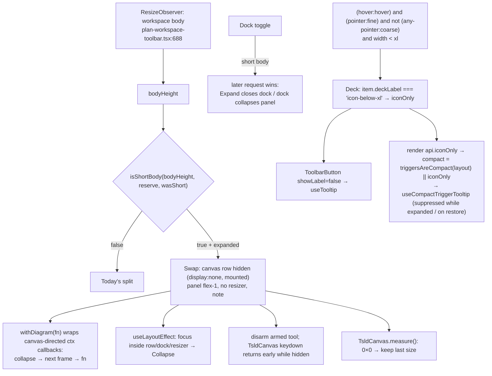
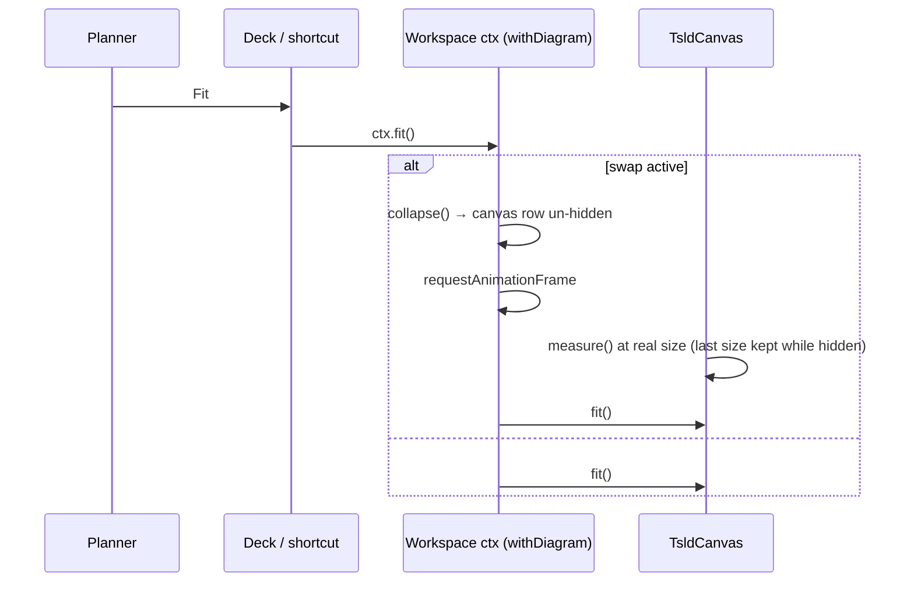
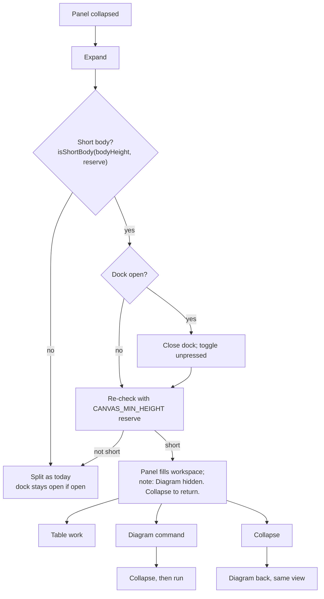

# Feature Spec: Short screens — rows in the activities panel, and a three-line deck at 1024

- **Status:** Draft — awaiting approval before implementation.
- **Decision:** none yet. Part A needs CQ-A and Part B needs CQ-B (§1 "Open questions").
- **Author(s):** Claude Code (feature-analyst), for James Ewbank (product owner). Revised 2026-10-08
  after the UX, accessibility and component reviews, all three "agree with changes" on both parts.
- **Date:** 2026-10-08
- **Tracking issue / epic:** `docs/TECH_DEBT.md` #468 (Part A); `docs/HANDOFF.md:32-37` (both parts)
- **Roadmap link:** follow-up to minimum-viewport (ADR-0179 D10, "the floor is made to fit")
- **Related ADR(s):**
  - **ADR-0180** (to be drafted with M-A): "the panel takes the body when it cannot show rows", and
    "the deck withholds three labels below `xl` on a hover-and-fine-pointer device".
  - Builds on: ADR-0179, ADR-0030, ADR-0092, ADR-0109 D1, ADR-0117, ADR-0111, ADR-0082, ADR-0083,
    ADR-0031, ADR-0079, ADR-0135, ADR-0088 D1 and ADR-0105.
  - Sibling specs:
    - ADR-0181, `docs/specs/retire-single-pane-workspace/`, retires the below-`md` single-pane
      workspace and **lands after M-A**;
    - ADR-0182, `docs/specs/landing-two-columns/`;
    - ADR-0183, `docs/specs/dense-row-touch-targets/`.
- **Ownership:** this spec owns #468 and **every workspace height rule**: the panel minimum, the swap
  threshold, and the reserves.

## 0. Summary in plain English

**Who this is for.** Neither part changes anything on your two screens. On the 1912 × 948 monitor
and the 1912 × 1114 Surface, the panel already has room. Part B is also built so that it never
switches on for the Surface. Both parts are for **short screens**: a 1366 × 768 laptop (about
600–636 px of window height, ADR-0179 D1), an 11-inch tablet, and your monitor zoomed to about 150 %.

**Part A: the activities panel shows no rows on a short screen (#468).**

- **The problem.** At 1024 × 600, Expand opens the panel, but only its heading, its bottom bar and the
  column headings fit.
- **The register's proposed fix does not work.** It proposed letting the diagram's minimum drop to
  about 160 px. That frees about 25 px, and a row needs about 35 px.
- **There is also a second defect.** The panel's smallest size (140 px) is smaller than its own fixed
  parts, so a panel dragged to its minimum shows no rows on any screen.
- **What we recommend:** when the window is too short for both the diagram and three table rows,
  Expand gives the panel the whole workspace and hides the diagram. Collapse brings it back exactly
  as you left it: same position, zoom and selection.
- **While the diagram is hidden:**
  - Any toolbar command aimed at the diagram first collapses the panel and then runs. This covers
    zoom, fit, go to date, search's next/previous, the drawing tools and the side panels. You never
    act on a diagram you cannot see.
  - A drawing tool that was armed is put away, and the panel says so.
  - Opening a side panel such as Health or Notes collapses the activities panel. Expanding the
    activities panel closes the side panel. Whatever you asked for last is what you see.
- **What you get:** at 1024 × 600, about 5 rows with a mouse and 2–3 with a finger. The panel's
  smallest drag size rises from 140 px to about 207 px, so it always shows a row.

**Part B: dropping three toolbar labels (optional, after A).**

- **What it does.** Below 1280 px wide, Summary, Settings… and Share & export show only their icons.
  The toolbar goes from four lines to three, and the diagram gains 44 px at 1024 × 600 (274 → 318).
- **Who gets it.** Only a mouse-or-trackpad device with no touchscreen. The Surface, a touch laptop
  and a tablet keep the labels, because a touch device gains no line from this.
- **How the hidden names stay findable.** Each button names itself in a proper tooltip on hover, on
  keyboard focus and on a long press. The tooltip is suppressed while its menu is open and when focus
  returns to the button after the menu closes.
- **The Settings… icon changes from a calendar to a gear at every width.** The calendar icon was a
  leftover from when the dialog held only the calendar.
- **The overflow `⋯` menu (B2) is not recommended.** It would bring back what you removed in ADR-0109
  ("all commands visible when we can"), and it would need a menu inside a menu.
- **Two things for you to accept:**
  1. Your monitor zoomed to 150 % is a 1275 px window, so the labels would drop there. At 125 % they
     stay.
  2. The DO row (the toolbar's second row of commands) would have only about 18 px spare at 1024.
     The next command added to it needs your decision; the gate makes sure of that.
- **Keeping four lines (B0) is a perfectly good outcome.**

**Size:** A is M (S–M before the reviews). B is S–M. Each is its own milestone, commit and release.
There are no database, API or permission changes.

## 1. Business understanding

### Problem

Minimum-viewport M4 recovered 48 px at the floor and left two trades for the product owner
(`m4-measurement.md:56-58`, `:75-78`; `docs/HANDOFF.md:32-37`):

- **A.** The expanded panel shows no rows at 1024 × 600 (#468).
- **B.** The deck is four lines at 1024 by arithmetic. LOOK is 733 + 513 px and DO is 627 + 622 px,
  in a 1008 px row (`m4-measurement.md:46-48`).

### Users

All roles that open the plan workspace: Org Admin, Planner, Contributor and Viewer. External Guests
are unaffected: `plan-workspace-toolbar.tsx`, `activity-bottom-panel.tsx` and `Deck` have no importer
under `features/share` (checked with grep).

### Primary use cases

1. On a short laptop, a planner expands the panel to scan or edit rows, uses a diagram command, and
   lands back on the diagram without hunting for Collapse.
2. On a short, narrow window with a mouse, a planner gets 44 px more diagram (B).

### Success criteria

- **SC-A1 (the floor, the worst case the threshold must cover):** at 1024 × 600, with the panel
  expanded, at least **3** rows are fully visible and hit-testable with a fine pointer, and at least
  **2** with a coarse pointer.
- **SC-A2:** at any size, a panel at its minimum shows at least 1 row. `aria-valuemin` equals
  `PANEL_MIN_OPEN`.
- **SC-A3:** at 1280 × 800, 1912 × 948 and 1912 × 1114, the expanded layout is unchanged: canvas and
  panel heights are equal before and after (Playwright).
- **SC-A4:** Expand → Collapse preserves:
  - the canvas viewport (`originX`, `originY`, `pxPerDay`);
  - the selection;
  - the canvas listbox's active option (ADR-0026 D7): the same option keeps `tabindex="0"`, and the
    listbox's `aria-activedescendant` is unchanged.
- **SC-A5:** no focus is ever dropped to `<body>` by the swap, on a press or on a live resize.
- **SC-B1:** at 1024 × 600 on a hover-and-fine-pointer device, the deck is ≤ 3 lines, the DO row is
  1 line, and the DO row's spare width is ≥ 0 and recorded. At `xl` and above, or on any device
  reporting a coarse pointer, labels are unchanged.
- **SC-B2:** each icon-only control shows its name on hover, on keyboard focus and on a long-press.
  The tooltip is never shown while `aria-expanded="true"`, and never on focus restored by a closing
  menu or popover.

### Open questions

- **CQ-A (critical): what happens to the diagram on a short screen when the panel is expanded?**
  - **A1:** the panel takes the workspace; the diagram is hidden; diagram commands collapse first.
  - **A2:** the diagram keeps a ~96 px sliver; the panel gets ~2 rows with a fine pointer and 0 with a
    coarse one.
  - **A3:** the register's 160 px minimum, which gives about 0 rows.
  - **Recommendation: A1.**
- **CQ-B (critical): should three labels drop below 1280 on a hover-and-fine-pointer device (B1), go
  into an overflow `⋯` (B2), or stay (B0)?**
  - **Recommendation: B1, after A.** It comes with:
    - the gear icon for Settings…;
    - acceptance that a 150 %-zoomed 1912 monitor (a 1275 px window) gets the icon-only form;
    - acceptance that the next DO command needs your decision.
  - If any of these is unwanted, choose **B0**.

**Defaults stated, not asked:**

- The swap is decided by the measured workspace height, not by a window media query.
- One threshold constant, sized for the larger (coarse) panel parts, because the pointer cannot be
  trusted to pick sizes. The Surface reports `pointer: fine` with its cover on (ADR-0118 D7;
  `GanttPanel.tsx:200-202`).
- 24 px of hysteresis on the swap threshold.
- The expanded state stays session-local and starts collapsed.
- An open side dock and an expanded panel are mutually exclusive on a short body. Whichever was
  requested last wins.
- No flag (ADR-0088 D1).

## 2. Functional requirements

### User stories & acceptance criteria

> **US-A1** — As a planner on a short screen, I want an expanded panel to show rows.
>
> - **Given** `isShortBody(bodyHeight, CANVAS_MIN_HEIGHT)` is true, **when** I press Expand, **then**
>   the panel fills the workspace body. The diagram row is hidden with the `hidden` attribute (that
>   is, `display: none`; no `aria-hidden` and no `inert` are added) and stays mounted. The resizer is
>   not rendered. The panel header shows the note (§4 "Copy").
> - **When** I press Collapse, **then** SC-A4 holds.
> - **Given** the body is not short, **then** the layout is as today (SC-A3).
> - **On load**, the panel starts collapsed. This is already true: `collapsed` is `useState(true)`
>   and session-local (`plan-workspace-toolbar.tsx:673-676`), so a hidden-diagram state can never be
>   restored on load. A unit test pins this so it stays true.

> **US-A2** — As any user, I want the panel's minimum to show a row.
>
> - `PANEL_MIN_OPEN` is the sum of named parts plus one row (§3.2).
> - A stored height below it, for example a stored 140, is read back clamped to it, and the stored
>   value is not rewritten. This follows `useResizablePanelPrefs`'s `min`; the test pins the
>   read-back.
> - `aria-valuemin` reports it (`plan-workspace-toolbar.tsx:2492`).

> **US-A3** — As a planner, I want diagram commands to work while the diagram is hidden.
>
> - **Given** the swap is active, **when** I use any **canvas-directed command** (classes in §2
>   "Commands while the diagram is hidden"), **then** the panel collapses and the command runs on the
>   next frame, after the canvas has measured. Focus goes where that command normally puts it.
> - **When** the swap becomes active with a tool armed, **then** the tool is disarmed and the panel
>   note says "Drawing tool put away." for that opening.

> **US-B1** _(if B1)_ — As a mouse user on a short, narrow window, I want a three-line deck.
>
> - On a device matching `(hover: hover) and (pointer: fine) and not (any-pointer: coarse)`, below
>   `xl`, the three `deckLabel: 'icon-below-xl'` items are icon-only. Accessible names are unchanged.
> - **When** I hover over, keyboard-focus or long-press one, **then** its tooltip names it.
> - **When** I open the menu or popover, **then** the tooltip closes and stays closed while
>   `aria-expanded="true"`.
> - **When** I press Escape once in the open menu or popover, **then** it closes, focus returns to the
>   trigger, and **no tooltip opens**. A second Escape reaches the canvas ladder as today (ADR-0117:
>   no `stopPropagation`).

### Commands while the diagram is hidden (A1)

The rule is applied at the **context** the toolbar and shortcuts call, not per button. The workspace
wraps each canvas-directed `ctx` callback in `withDiagram(fn)`: if the swap is active, collapse the
panel, then run `fn` on the next animation frame; otherwise run `fn` at once. Because the wrapper is
on the context, `render` items (View ▾, Go to date, Find) are covered as well as plain buttons.

**Canvas-owned keyboard shortcuts do nothing while the diagram is hidden.** These are the ones
handled by `TsldCanvas`'s window `keydown`. They are not wrapped and do not collapse the panel; see
"The canvas's window `keydown`" below. Only the toolbar's `ctx` callbacks collapse first.

| Class                                              | Examples                                                                                                    | While the swap is active                                                                                                          |
| -------------------------------------------------- | ----------------------------------------------------------------------------------------------------------- | --------------------------------------------------------------------------------------------------------------------------------- |
| **Viewport moves**                                 | Zoom in/out, Fit, View ▾ presets, Go to today / Go to date, zoom-to-selection, Next conflict, Find next/previous (ADR-0079 cursor) | **Collapse first, then run.** These are the commands that would otherwise act invisibly.                                             |
| **Tool arming**                                    | Add activity / milestone, Link, LOE                                                                         | **Collapse first, then arm.** A tool armed while hidden has no target.                                                             |
| **Right docks**                                    | Health, Float paths, Comments/Notes, Revisions                                                              | **Collapse the panel first, then open the dock** (see below).                                                                     |
| **Marks on the diagram**                           | View ▾ display toggles, Legend, Resource strip                                                               | **Unaffected.** The state changes, and the popover's pressed state shows it; the diagram reflects it on return. No collapse.     |
| **Plan / data / output**                           | Summary, Settings…, Analysis, Share & export, Print, Undo/Redo, object actions in the foot row               | **Unaffected.** Their subject is the plan or the selection, and the table shows the result.                                       |
| **Shade with a reason** (ADR-0082/0083, shade-don't-hide ADR-0031) | none today                                                                            | Reserved for a future canvas command for which collapse-first is wrong. It is shaded with the reason "Collapse the activities panel to use this", never hidden. |

A structural test lists every canvas-directed `ctx` callback and fails if one is not wrapped. A new
canvas-directed callback therefore has to choose a class.

**Typing in the Find field** does not collapse the panel: it is text entry, and the filter applies to
the table too. Only stepping the find cursor collapses it.

**The canvas's window `keydown`** (`TsldCanvas.tsx:2119`) stays attached while the canvas is hidden.

- It gains an early return while the canvas is hidden. This reuses the hidden-pane pause's
  visibility flag that `TsldCanvas.hidden-pane.test.tsx` covers, so window-level canvas shortcuts do
  nothing while the canvas is invisible.
- Because entering the swap **disarms** any armed tool (US-A3), Escape in the table never has a tool
  to reach. It does what the table does: it closes the row menu or cancels the cell edit.
- **Announcement:** the panel note gains "Drawing tool put away." in the same static line. It is not
  a live region, because focus is already moving to Collapse and the note is read with the panel.

### Right dock and Expand (A1)

With a dock open the reserve is `DOCK_MIN_HEIGHT` 360 (`plan-workspace-toolbar.tsx:805`), so at the
floor a dock and an expanded panel never both fit. **Chosen rule:** on a short body, a dock and an
expanded panel are mutually exclusive, and **the later request wins**.

- **Expand with a dock open:** the dock closes first, and its toolbar toggle's `aria-pressed` goes
  false, so the toggle never claims an invisible dock. Then the panel expands, swapping if
  `isShortBody(bodyHeight, CANVAS_MIN_HEIGHT)`.
- **Opening a dock with the swap active:** the panel collapses first (the "Right docks" class above),
  then the dock opens.
- **Rejected alternative:** keeping the dock open but hidden behind the swap leaves a pressed toggle
  for something nobody can see.
- **On a body that is not short,** both behave exactly as today.

### Focus (A1)

The existing `focusCollapseOnMount` runs only on mount (`activity-bottom-panel.tsx:235-237`), so it
covers a press of Expand and **not** a live resize. When a window shrinks across the threshold with
the panel already expanded, the canvas row, the resizer and any dock go `display: none`, and focus
inside them drops to `<body>`.

- **The rule.** The host tracks whether focus is inside the canvas row, the dock or the resizer, with
  a `focusin`/`focusout` ref on each container. The resizer is unmounted rather than hidden, so it is
  tracked by its own ref.
- **On a swap-on transition**, a `useLayoutEffect` keyed on the swap state moves focus to the
  panel's Collapse button if that ref was set. It runs before paint, so `<body>` is never observable.
  The host gets the button through a new `collapseRef` prop on `ActivityBottomPanel`.
- **On a swap-off transition** (the window grows), nothing is hidden and focus stays put.
- **Dock-driven flips follow ADR-0135:** if closing a dock (rule above) removes the control a reader
  was on, focus goes to the dock's toolbar toggle, as `useToolbarFocusHandoff` already does
  (`Deck.tsx:265-270`).
- **Playwright:** at 1024 × 600, with the panel expanded at 1280 × 800 and focus inside the canvas,
  the window is resized to 600 tall. The test asserts that `document.activeElement` is the Collapse
  button and never `<body>`.

### Edge cases

| Case                                          | Behaviour                                                                                                                                       |
| --------------------------------------------- | ----------------------------------------------------------------------------------------------------------------------------------------------- |
| Gantt view                                    | The same rule. The stage holds `GanttPanel` (`plan-workspace-toolbar.tsx:1545-1548`); viewport-move commands act on the chart.                  |
| `bodyHeight` 0 (first paint, jsdom)           | Not short, so jsdom suites are unchanged.                                                                                                        |
| Live resize back and forth near the threshold | 24 px hysteresis (§3.2). No feedback loop exists, because the body is the swap's container and its height does not depend on the swap.           |
| Plan slots                                    | `ActivityBottomPanel` in the wide branch is the only host (`hostsPlanSlots` defaults to true). The swap re-styles it and does not re-mount it, so the facts outlet and the dock outlet mount **once**. A unit test asserts exactly one of each in the DOM during the swap. |
| 640 and 320 px wide                           | Below `md`, the single-pane branch (`plan-workspace-toolbar.tsx:2533-2534`) is used until ADR-0181 retires it, so A1 is inert there. The journey runs both widths to pin that. After ADR-0181, A1 applies there, and that spec re-runs these cases. |
| Canvas round trip                             | §3.2 "Round trip".                                                                                                                               |
| B1 with a shaded control                      | The disabled reason still wins the tooltip, and the `aria-describedby` reason span is kept (`ToolbarPopover.tsx:128-134`, `:160-164`).          |
| B1: the next DO command                       | §3.3 "Spare and ownership".                                                                                                                      |

### Permissions / Validation / Errors

No change. Neither part is a write, so the pen is not engaged (ADR-0028). There is no input and no
request.

## 3. Technical analysis

| Area          | Impact | Notes                                                                                                                                                       |
| ------------- | ------ | ----------------------------------------------------------------------------------------------------------------------------------------------------------- |
| Frontend      | med    | **A:** `use-activity-panel-prefs.ts`, `plan-workspace-toolbar.tsx`, `activity-bottom-panel.tsx`, `TsldCanvas.tsx` (keydown guard, measure guard). **B:** `toolbar-registry.ts`, `Deck.tsx`, `ToolbarPopover.tsx`, `ExportMenuControl`, `tooltip.tsx` option, `lib/breakpoints.ts` |
| Backend / DB / API / Security | none | —                                                                                                                                           |
| Performance   | low    | A reuses the existing ResizeObserver (`plan-workspace-toolbar.tsx:688-700`). B adds one `matchMedia` subscription                                           |
| Infra         | none   | No new Playwright config or CI step                                                                                                                         |
| Testing       | med    | Unit, structural, and journeys in `web:workspace-chrome`, `web:workspace-fit`, `web:toolbar` and `web:narrow-shell`                                         |

**Recalc parity:** not engaged. **Pen:** not engaged. **Flag:** none.

### 3.2 Part A — numbers, checked against the code (CLAUDE.md §19.11)

| #468 says                                   | The code says                                                                                                                                                                                                                       |
| ------------------------------------------- | ------------------------------------------------------------------------------------------------------------------------------------------------------------------------------------------------------------------------------------- |
| ✓ `min-h-[240px]` at `TsldPanel.tsx:3279`   | Present, but its row and stage are `min-h-0 overflow-hidden` (`plan-workspace-toolbar.tsx:2361`, `:2368`), so it clips rather than pushes. The panel is sized by `effectiveMax = min(720, max(140, bodyHeight − 240))` (`:801-808`), using `CANVAS_MIN_HEIGHT` (`use-activity-panel-prefs.ts:23`). |
| ✓ `PANEL_MIN_OPEN` 140                       | `use-activity-panel-prefs.ts:18`                                                                                                                                                                                                     |
| ✓ 51 px foot                                 | `activity-bottom-panel.tsx:472`; `FOOT_MAX_PX = 51` (`command-surface.spec.ts:455`)                                                                                                                                                   |
| ✗ foot added on top of the panel's 140       | When expanded, the foot is **inside** the panel (`activity-bottom-panel.tsx:359`, within the box at `plan-workspace-toolbar.tsx:2499`)                                                                                                |
| ✗ 227 px chrome                              | Not derivable. M4's 274 px collapsed canvas (`m4-measurement.md:11`) plus the 51 px foot gives a body of ≈ 325 px at 1024 × 600 (fine). M0 re-measures                                                                                |

**Named parts** (estimated from classes; M0 measures; constants take the larger, coarse value):

| Constant           | Fine estimate   | Coarse estimate | Source                                                  |
| ------------------ | --------------- | --------------- | ------------------------------------------------------- |
| `PANEL_HEADER_PX`  | ≈ 48            | ≈ 60            | `activity-bottom-panel.tsx:260` (`py-2` + Create button) |
| `PANEL_FOOT_PX`    | 51              | ≈ 55            | `activity-bottom-panel.tsx:472`                          |
| `PANEL_BODY_PAD_PX` | 16             | 16              | `activity-bottom-panel.tsx:311`                          |
| `TABLE_HEAD_PX`    | ≈ 32            | ≈ 36            | estimate                                                 |
| `ROW_PX`           | ≈ 35            | ≈ 44            | `data-table-windowed-body.tsx:65` (37); `data-table.tsx:600` |

From these:

- **`PANEL_MIN_OPEN`** = header + foot + pad + head + 1 × row ≈ **207**.
- **`PANEL_USEFUL_MIN`** = header + foot + pad + head + 3 × row ≈ **299**.
- **One constant each, not a fine/coarse pair.** The Surface reports `pointer: fine` with its cover
  attached (`GanttPanel.tsx:200-202`, ADR-0118 D7), so a pointer-keyed size would under-reserve on
  the one touch device the product owner uses. The cost is that a mouse user's minimum is about 20 px
  larger than it strictly needs to be.
- **Pinned by measurement, not by jsdom.** The M-A journey measures the real parts at both pointers
  and asserts each is ≤ its constant. A unit test asserts `PANEL_MIN_OPEN` and `PANEL_USEFUL_MIN`
  equal their sums, so the constants cannot drift from their definition.

**`isShortBody(bodyHeight, reserve, wasShort)`** lives in `use-activity-panel-prefs.ts` and is unit
tested.

- It is true when `bodyHeight > 0` and `bodyHeight − reserve < PANEL_USEFUL_MIN + (wasShort ? 24 : 0)`.
- The 24 px hysteresis band stops a drag-resize from flickering across the line.

**Why the threshold is three rows and SC-A1 is "≥ 3 / ≥ 2".** The threshold asks whether today's
split would give three rows, the table's own floor ("the header and about three rows",
`data-table.tsx:600`); if not, the panel swaps. SC-A1 states what the swap delivers at the floor,
the smallest body the design allows:

- **Fine:** 325 − 147 ≈ 178, which is about 5 rows at 35 px (≥ 3 is asserted).
- **Coarse:** a body of ≈ 289 (canvas 234, `m4-measurement.md:21`, plus the foot) minus ≈ 167 ≈ 122,
  which is about 2.8 rows at 44 px (≥ 2 is asserted).

These are consistent. Every body above the floor gives at least as much.

**Options compared at 1024 × 600:**

| Option                  | Fine           | Coarse     |
| ----------------------- | -------------- | ---------- |
| A1                      | ≈ 5 rows       | ≈ 2–3 rows |
| A2 (diagram ≥ 96)       | ≈ 2            | ≈ 0        |
| A3 (diagram ≥ 160)      | ≈ 0            | 0          |

**What the threshold means in window terms:**

- **1024 wide, fine:** a body under ≈ 539, which is a window under ≈ 814 px tall.
- **1280 × 800 fine:** body ≈ 613, so no swap. SC-A3 is asserted by Playwright.
- **1912 × 948 and 1912 × 1114:** no swap.

**Precedent, worded correctly.** A1 does **not** reuse the single-pane layout as a standing
precedent. That layout (`plan-workspace-toolbar.tsx:666-669`) is being retired by ADR-0181, which
lands after this spec. **A1 replaces it** as the one place a mounted-but-hidden diagram is designed.
What A1 relies on is the canvas's own hidden-surface behaviour, pinned by
`TsldCanvas.hidden-pane.test.tsx:99-133` (it stops painting while off-screen and repaints on return)
and `:181` (an unmeasured surface never withdraws the minimap).

**Round trip.** A `display: none` canvas reports a 0 × 0 rect. `measure()` clamps that to 1 × 1 and
**reallocates both backing bitmaps** (`TsldCanvas.tsx:1590-1605`).

- **Not established:** whether `originX`, `originY` and `pxPerDay` survive the reallocation. Nothing
  read here proves they do, so it is not assumed.
- **Required change:** `measure()` returns early when the rect is 0 × 0. A hidden surface keeps its
  last applied size and bitmaps, matching the "unmeasured surface" rule at
  `TsldCanvas.hidden-pane.test.tsx:181`.
- **Tests:**
  - a unit test: a 0 × 0 measurement leaves `sizeRef` and the canvas `width`/`height` unchanged;
  - a journey: SC-A4 reads the viewport through the canvas's existing e2e viewport probe, or, if
    none exists, a read-only `data-viewport` attribute added for it (the builder checks first). It
    also asserts the selected activity and the listbox's active option across Expand → Collapse.

### 3.3 Part B — numbers, checked against the code

- **Items:**
  - `summary` (label "Summary", `Info` icon; `tsld-toolbar-items.tsx:3217-3218`);
  - `calendar` (label "Settings…", description "Schedule settings", `CalendarDays` icon; `:3326-3328`);
  - `export` (label "Share & export", `FileDown` icon; `:1619`, `:2577-2578`).
- **Arithmetic** (`m4-measurement.md:46-62`):
  - The DO row at 1024 is 1257 px in a 1008 px row, so 249 px must go. The labels are ≈ 267 px, which
    leaves **≈ 18 px spare**. The deck goes 4 → 3 lines, for **+44 px**.
  - A coarse pointer needs ≈ 461 px, so there is no gain there.
- **Mechanism today:**
  - `Deck` pins `layout: 'comfortable'` (`Deck.tsx:172-177`, `:414`) and withholds labels only for
    the static `ICON_ONLY` set (`:137-148`, `:433`).
  - `ToolbarItem.showLabel` is ignored by `Deck` (`tsld-toolbar-items.tsx:3150-3151`).
  - The compact branches of `ToolbarPopover` (`:130-134`) and `ExportMenuControl`
    (`tsld-toolbar-items.tsx:1668`) name themselves with native `title` only. That reaches a mouse
    and nobody else, which is the ADR-0117 defect.
- **Tooltip vs menu (ADR-0111):**
  - `useTooltip` opens on any focus (`tooltip.tsx:368-372`).
  - `Menu` and the popover restore focus to their trigger on close (`menu.tsx:167`, `:185`).
  - So without suppression the tooltip would pop up after every menu close and on a click's focus.
  - §4 specifies the suppression.
- **Icons:**
  - `Settings2` is a pair of sliders, and so is `SlidersHorizontal`, which is **View ▾**'s icon
    (`tsld-toolbar-items.tsx:2699`), not Filter's as the review brief said. Two slider glyphs in one
    deck read alike, so **Settings… takes the `Settings` gear**.
  - **The Deck.tsx:128 test** ("would a planner who has never seen this product guess wrong?"):
    - `Info` for Summary passes: "information about this plan" is what the popover holds.
    - `FileDown` for Share & export passes for export and **fails for share**. This spec accepts
      that explicitly, rather than changing a glyph seen at every width. The tooltip and the
      accessible name say "Share & export". ux-reviewer records the acceptance.
- **Targets:**
  - An icon-only control takes `min-w-9` (36 px, `Deck.tsx:478`).
  - A compact chevron trigger is the icon (16) + chevron (14) + gap + padding, ≥ 36.
  - The deck sweep's 24 px floor (`command-surface.spec.ts:93`) asserts it, and the 1024 case
    asserts ≥ 36 × 36 for the three.
- **Spare and ownership:**
  - The gate asserts the DO row is 1 line at 1024 **and** records its spare in px, asserting ≥ 0.
  - A change that adds a DO command and makes the spare negative fails the gate. **The product owner
    decides** the outcome: drop B (back to B0), move a command, or accept four lines. The gate's
    message says so. That is how the next command is owned.
- **The 1279 / 1280 flip:**
  - The rule switches at `xl` (1280 CSS px), so browser zoom moves a window across it. The product
    owner's 1912 monitor at 150 % is 1275 px, so it gets the icon-only form; at 125 % (1530) it does
    not.
  - That is a consequence for him to accept (CQ-B).
  - It is not a defect: the switch is by CSS width, the same as every Tailwind breakpoint.
- **B2's cost:**
  - It rebuilds the `⋯` and `ToolbarOverflow.tsx` that ADR-0109 D1 deleted ("wraps; never hides",
    `0109-a-command-surface-wraps.md:51-68`).
  - It nests Share & export's menu (rejected at `tsld-toolbar-items.tsx:3276-3281`) and puts a
    popover inside a menu.
  - It gives each command two homes, depending on width.

## 4. Solution design

### Architecture overview

### Data flow (a viewport command while hidden)

### User flow

### Database / API changes

None.

### Component changes

**Part A:**

- `use-activity-panel-prefs.ts`:
  - `PANEL_HEADER_PX`, `PANEL_FOOT_PX`, `PANEL_BODY_PAD_PX`, `TABLE_HEAD_PX` and `ROW_PX`;
  - `PANEL_MIN_OPEN` and `PANEL_USEFUL_MIN` derived from them;
  - `isShortBody()`;
  - a corrected `DOCK_MIN_HEIGHT` docblock (`:34-37` repeats #468's 658 px).
- `plan-workspace-toolbar.tsx`:
  - the swap state, with `wasShort` for hysteresis;
  - `hidden` on the canvas row;
  - the panel box goes `flex-1`;
  - the resizer is withheld;
  - the `withDiagram` wrapper on the canvas-directed `ctx` callbacks;
  - the dock/panel mutual-exclusion rule;
  - the focus refs and the swap-on `useLayoutEffect`.
- `activity-bottom-panel.tsx`: new `diagramHidden`, `toolDisarmed` and `collapseRef` props.
- `TsldCanvas.tsx`:
  - the `keydown` early return while hidden;
  - the `measure()` 0 × 0 early return;
  - a disarm call on swap entry, through the existing `exitAddMode` path.

**Copy (A1):**

- **The note:** "Diagram hidden. Collapse to return." With a tool disarmed, this is followed by "Drawing tool put away."
- **Form:**
  - sentence case;
  - plain text in `text-muted-foreground` with an icon-free lead, so meaning is never in colour
    alone;
  - it wraps, `whitespace-normal` and never `truncate`, so at 320 px it reflows rather than clips.
- **Placement:** in the panel header beside the `h2`.
- **Not live.** Expand already moves focus to Collapse, and the note is the next text read.
- ux-reviewer signs off the final string before M-A merges.

**Part B (B1):**

- `toolbar-registry.ts`:
  - `ToolbarItem.deckLabel?: 'always' | 'icon-below-xl'` (default `'always'`). It is named
    `deckLabel`, not `labelPolicy`, because `ToolbarLabelPolicy` is already `showLabel`'s type
    (`toolbar-registry.ts:272`).
  - `tier` and `showLabel` are untouched.
  - `ToolbarItemRenderApi.iconOnly?: boolean` is defined once, with TSDoc: "true when the host has
    decided this item shows no visible label; a trigger computes
    `compact = triggersAreCompact(layout) || iconOnly`. Hosts that never set it (`Toolbar`) and
    consumers that ignore it (`PlanPenControl`, `selection-actions`) are unaffected."
- `lib/breakpoints.ts`: `XL_QUERY`, derived from the Tailwind `xl` token rather than a `79.98rem`
  literal, pinned by a unit test like `DESIGNED_MIN_WIDTH_QUERY`. Also `ICON_DECK_DEVICE_QUERY =
  '(hover: hover) and (pointer: fine) and not (any-pointer: coarse)'`.
  - **What the device query does.** It separates **devices as reported**, not users.
  - **Who it excludes.** A Surface with its cover attached reports `pointer: fine` but also
    `any-pointer: coarse`, so it is excluded. So is a touchscreen laptop.
  - **What it costs.** A mouse user on a touchscreen laptop keeps the labels. This is accepted: the
    cost of a label shown when it could be dropped is 44 px, and the cost of a label dropped from a
    finger user is a guessed icon.
- `Deck.tsx`:
  - reads both queries;
  - sets `showLabel={!ICON_ONLY.has(id) && !iconBelowXl}`, and `iconOnly` for `render` items;
  - `min-w-9` follows.
- `tooltip.tsx`:
  - a new option `suppressFocusOpen?: () => boolean`, checked in `onFocus` (`:368-372`);
  - this is a shared primitive change, so ADR-0111 applies, and it is noted as an ADR-0117
    amendment in ADR-0180.
- A shared helper `useCompactTriggerTooltip({ label, compact, expanded, disabledReason })` in
  **`apps/web/src/components/ui/use-compact-trigger-tooltip.ts`**, beside `tooltip.tsx`. Its
  consumers are `ToolbarPopover` (`components/ui/toolbar/`) and `ExportMenuControl`
  (`features/tsld/toolbar/tsld-toolbar-items.tsx:1637`), so dependencies point down from feature to
  ui, never sideways. The helper:
  - hooks unconditional;
  - `disabled: !compact`, like `ToolbarButton` (`ToolbarButton.tsx:131-135`);
  - `purpose: 'name-echo'`;
  - `disabledReason` precedence kept;
  - the `aria-describedby` reason span kept.
- **Suppression:**
  - the tooltip is closed and cannot open while `expanded`;
  - opening the menu or popover closes it;
  - a `restoringFocus` ref is set by the trigger's close handler, before `Menu` or the popover
    returns focus, and the next `onFocus` consumes it without opening;
  - a pointer-initiated focus (a click) opens nothing, because the press opens the menu.
- **Escape sequence:** one Escape in the open menu or popover closes it and restores focus, with no
  tooltip. A second Escape on the trigger reaches the ladder (no `stopPropagation`, ADR-0117).
- **Long-press (touch emulation):** the tooltip opens, the swallowed click leaves `aria-expanded`
  false, and the menu stays closed. (B1 is gated off touch devices, but the primitive must still be
  right.)
- `tsld-toolbar-items.tsx`: `summary`, `calendar` and `export` gain `deckLabel: 'icon-below-xl'`, and
  `calendar`'s icon becomes `Settings` (the gear) at every width.

### Implementation approach & alternatives

**Part A:**

| Option | Rows at 1024 × 600 (fine / coarse) | Verdict                                                     |
| ------ | ---------------------------------- | ----------------------------------------------------------- |
| **A1** | ≈ 5 / ≈ 2–3                        | **Recommended**                                             |
| A2     | ≈ 2 / ≈ 0                          | Fails coarse                                                |
| A3     | ≈ 0 / 0                            | Does not fix #468                                           |
| A4: fold the header into the foot (−48 px) | +1 row on any option | Deferred; it restructures the panel for one row |

**Part B:**

| Option | Saves                  | Cost                                                                                                    | Verdict                                         |
| ------ | ---------------------- | ------------------------------------------------------------------------------------------------------- | ----------------------------------------------- |
| **B1** | ≈ 267 px (needs 249)   | Registry field, `iconOnly`, tooltip suppression (ADR-0111), gear icon, 18 px spare, zoom flip           | **Recommended, optional after A**               |
| B2     | ≈ 360 px (estimate)    | Rebuilds the deleted `⋯`, nested menu, popover in a menu, two homes, ADR-0109 D1 superseded in part      | Not recommended                                 |
| B0     | 0                      | Diagram 274 px at the floor                                                                             | **A clean outcome**                             |

**ADR-0180** records:

- A1's rule, amending ADR-0030's split and ADR-0092's budget, and stating that it replaces the
  single-pane precedent that ADR-0181 retires;
- the canvas-command classes and the dock exclusivity rule;
- B1's `deckLabel` policy and device query, noting that ADR-0109 D1 holds because no command hides;
- the `useTooltip` `suppressFocusOpen` option as an ADR-0117 amendment.

If CQ-B is B0, ADR-0180 covers A only.

### ADR-0105 triggers

- **A:**
  - a layout rule stated by ADR-0030 and ADR-0092;
  - the `PANEL_MIN_OPEN` contract;
  - a new `ActivityBottomPanel` public prop set;
  - a canvas `keydown` behaviour (ADR-0111: accessibility-reviewer before merge).
- **B:**
  - two shared contracts (`ToolbarItem.deckLabel`, `ToolbarItemRenderApi.iconOnly`);
  - a shared primitive option (`useTooltip`);
  - the focus and keyboard behaviour of two triggers (ADR-0111: accessibility-reviewer and
    component-reviewer before merge).
- **Neither:** no schema, no Playwright config, no CI step.

**Required sign-offs before merge (not optional):**

- **M-A:**
  - ux-reviewer signs off the final note copy;
  - accessibility-reviewer and component-reviewer re-run on the `TsldCanvas` `keydown` and
    `measure()` changes (ADR-0111).
- **M-B:**
  - ux-reviewer signs off the `FileDown` glyph standing for "share";
  - accessibility-reviewer and component-reviewer re-run on the `useTooltip` `suppressFocusOpen`
    option and the two triggers (ADR-0111).

### Device checklist

`docs/specs/gantt-coarse-pointer/device-checklist.md` **does not change**. Its scope (`:15-19`) is
Gantt touch, stylus, right-click and keyboard-menu behaviour, the Gantt's targets and
`/pointer-check.html`. Neither part touches these on the Surface:

- A1 does not trigger at 1912 × 1114.
- B1's device query excludes a device reporting `any-pointer: coarse`.

## 5. Links

- Implementation plan: [implementation-plan.md](implementation-plan.md)
- Docs updated:
  - #468 closed;
  - the `DOCK_MIN_HEIGHT` docblock;
  - `docs/UX_STANDARDS.md` (the swap and command classes);
  - `docs/DESIGN_SYSTEM.md` (the `deckLabel` rule);
  - ADR-0180 and its CLAUDE.md §16 line;
  - `m4-measurement.md:56-58` linked here;
  - the next `docs/HANDOFF.md`.
